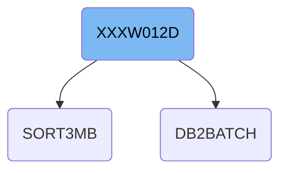
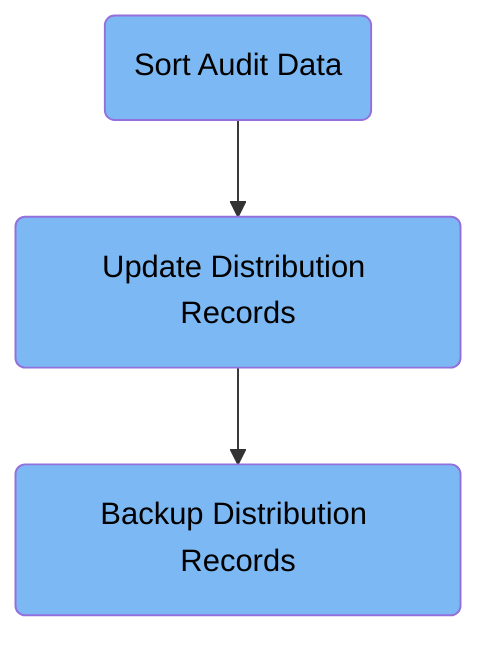

The XXXW012D job processes audit and distribution records by sorting raw audit data, updating distribution records with control rules, and backing up the finalized data to tape. It organizes and validates audit data to support reporting and archival needs.

For example, it sorts unsorted audit records by transaction key, updates distribution status, and outputs updated records along with a backup copy.

# Dependencies

Here is a high level diagram of the file:

## Sort Audit Data

Step in this section: `ST01OF04`.

The section prepares audit data for downstream distribution by sorting records in a specific key order, ensuring that related information is grouped together for subsequent handling.

1. The audit records from the input dataset XXXP.AUDIT.STRIP are read into the sorting utility.
2. Each record is examined for its transaction key (TXN_KEY), defined as starting at position 6 for 3 bytes.
3. Records are ordered in ascending key order using a binary format comparison, grouping related transactions together.
4. The sorted results are written to the temporary dataset &&XXXPSORT in exactly the same structure as the input, but reorganized so transaction keys appear in order.
5. This sorted output enables efficient downstream distribution and lookup operations.

### Input

**XXXP.AUDIT.STRIP - XXXP.AUDIT.STRIP(0)**

Raw audit records prior to any sorting or organization.

Sample:

| Column Name | Sample               |
| ----------- | -------------------- |
| TXN_KEY     | 001                  |
| USER_ID     | U12345               |
| AMOUNT      | 1000                 |
| AUDIT_DATE  | 20240609             |
| DETAILS     | Transaction approved |

### Output

**&&XXXPSORT**

Audit records sorted by transaction key, stored as a temporary dataset for use in later processing and distribution steps.

Sample:

| Column Name | Sample               |
| ----------- | -------------------- |
| TXN_KEY     | 001                  |
| USER_ID     | U12345               |
| AMOUNT      | 1000                 |
| AUDIT_DATE  | 20240609             |
| DETAILS     | Transaction approved |

## Update Distribution Records

Step in this section: `ST02OF04`.

This section performs distribution updates by transforming sorted audit records into finalized distribution records based on business rules and lookup data.

- The section starts by reading sorted audit records from the temporary dataset (&&XXXPSORT).
- Control card rules (GL.CONTROL.CARDS(XXXC1001)) are referenced to determine how each audit record is processed according to distribution needs and lookup validations.
- For each audit transaction:
  1. Lookup data and rules are applied to verify transaction legitimacy and define distribution status.
  2. Transaction fields are examined and selectively transformed (such as adding or updating DIST_STATUS).
  3. Processed records are written to the destination dataset (XXXP.DIST.AUDIT.STRIP), which serves as the finalized distribution record set for backup and reporting.
- Output follows the structure required for downstream processes, such as backup tape creation.

### Input

**&&XXXPSORT**

Sorted audit records from previous step, prepared for distribution processing.

Sample:

| Column Name | Sample               |
| ----------- | -------------------- |
| TXN_KEY     | 001                  |
| USER_ID     | U12345               |
| AMOUNT      | 1000                 |
| AUDIT_DATE  | 20240609             |
| DETAILS     | Transaction approved |

**GL.CONTROL.CARDS(XXXC1001)**

Control cards defining distribution and lookup rules for processing audit records.

### Output

**XXXP.DIST.AUDIT.STRIP**

Distributed audit records updated according to control requirements; forms basis for backup and further reporting.

Sample:

| Column Name | Sample      |
| ----------- | ----------- |
| TXN_KEY     | 001         |
| USER_ID     | U12345      |
| DIST_STATUS | Distributed |
| AUDIT_DATE  | 20240609    |
| AMOUNT      | 1000        |

## Backup Distribution Records

Step in this section: `ST03OF04`.

This section ensures that each day's processed distribution records are safely duplicated to a tape backup to prevent data loss and support rollback or audit activities.

- Reads finalized distribution records from the dataset XXXP.DIST.AUDIT.STRIP.
- Duplicates each record exactly as-is, including all fields (TXN_KEY, USER_ID, DIST_STATUS, AUDIT_DATE, AMOUNT), without transformation or filtering.
- Writes the copied records to a new sequential version of the backup dataset (XXXP.DAILY.DIST.BKUP), preserving the daily state of distribution data for archival and recovery.

### Input

**XXXP.DIST.AUDIT.STRIP**

Finalized and updated distribution audit records prepared in the prior step.

Sample:

| Column Name | Sample      |
| ----------- | ----------- |
| TXN_KEY     | 001         |
| USER_ID     | U12345      |
| DIST_STATUS | Distributed |
| AUDIT_DATE  | 20240609    |
| AMOUNT      | 1000        |

### Output

**XXXP.DAILY.DIST.BKUP(+1)**

A new backup version of distribution audit records, stored for daily archival and recovery.

Sample:

| Column Name | Sample      |
| ----------- | ----------- |
| TXN_KEY     | 001         |
| USER_ID     | U12345      |
| DIST_STATUS | Distributed |
| AUDIT_DATE  | 20240609    |
| AMOUNT      | 1000        |

&nbsp;

*This is an auto-generated document by Swimm 🌊 and has not yet been verified by a human*

<SwmMeta version="3.0.0" repo-id="Z2l0aHViJTNBJTNBU3dpbW1pby1keW5jYWxsLWRlbW8lM0ElM0FHaXJpLVN3aW1t" repo-name="Swimmio-dyncall-demo">Powered by [Swimm](https://app.swimm.io/)</SwmMeta>
