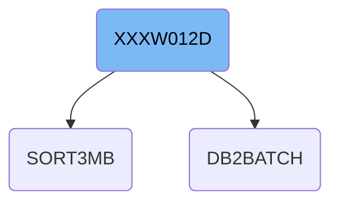
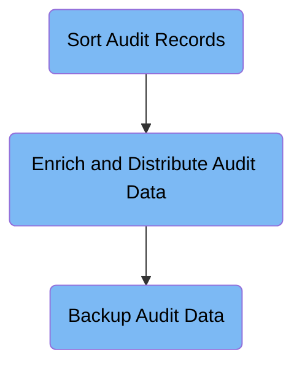

The XXXW012D job handles audit data processing by sorting raw records, enriching them with control information, and backing up the final dataset. It ensures audit data is organized, enhanced, and preserved for further processing and archival. For example, raw audit entries are sorted, enriched with control details, and backed up to a daily tape storage.

# Dependencies

Here is a high level diagram of the file:

## Sort Audit Records

Step in this section: `ST01OF04`.

This section organizes and sorts the audit data records so they can be efficiently used for subsequent control and processing tasks.

- The section receives raw audit records as input.
- It sorts these records using predefined sort fields from the batch job configuration.
- The result is a temporary output that contains the same audit records as input but ordered as required for efficient access in subsequent processing steps.

### Input

**XXXP.AUDIT.STRIP - XXXP.AUDIT.STRIP(0)**

Raw audit data records to be organized and prepared for subsequent processing.

Sample:

| Column Name | Sample   |
| ----------- | -------- |
| Field1      | 000123   |
| Field2      | A23      |
| Field3      | LOGON    |
| Field4      | 20240612 |
| Field5      | USR210   |

### Output

**&&XXXPSORT**

Sorted temporary collection of audit records for efficient lookup and control logic in next job steps.

Sample:

| Column Name | Sample   |
| ----------- | -------- |
| Field1      | 000123   |
| Field2      | A23      |
| Field3      | LOGON    |
| Field4      | 20240612 |
| Field5      | USR210   |

## Enrich and Distribute Audit Data

Step in this section: `ST02OF04`.

Combines sorted audit records with control information to generate enriched audit distribution outputs suitable for downstream processing and archiving.

- The sorted audit records are read from the temporary dataset.
- Control information from the control cards is applied to each audit record, enriching it with additional details relevant to audit distribution.
- The resulting enriched records are compiled into a new dataset that constitutes the audit distribution strip, suitable for further processing or archival.

### Input

**&&XXXPSORT**

Sorted collection of audit records to be enriched and distributed for further processing.

Sample:

| Column Name | Sample   |
| ----------- | -------- |
| Field1      | 000123   |
| Field2      | A23      |
| Field3      | LOGON    |
| Field4      | 20240612 |
| Field5      | USR210   |

**GL.CONTROL.CARDS(XXXC1001)**

Control information used to drive the enrichment and distribution logic for the sorted audit records.

### Output

**XXXP.DIST.AUDIT.STRIP**

Enriched audit strip data containing additional information from control logic, ready for downstream processing or backup.

## Backup Audit Data

Step in this section: `ST03OF04`.

Creates a backup of the processed audit distribution data by copying it to a designated daily backup location.

- The section takes the enriched audit distribution data from the source dataset designated for audit strip output (XXXP.DIST.AUDIT.STRIP).
- Using a copy utility, every record from the input dataset is written unchanged to the backup dataset (XXXP.DAILY.DIST.BKUP) on tape.
- The content and structure of each record remains exactly the same between input and output, ensuring an accurate daily backup copy is available for recovery if needed.

### Input

**XXXP.DIST.AUDIT.STRIP**

Enriched audit distribution data to be archived to backup storage.

Sample:

| Column Name | Sample   |
| ----------- | -------- |
| Field1      | 000123   |
| Field2      | A23      |
| Field3      | LOGON    |
| Field4      | 20240612 |
| Field5      | USR210   |

### Output

**XXXP.DAILY.DIST.BKUP**

Backup copy of the enriched audit distribution data, stored on daily backup tape.

Sample:

| Column Name | Sample   |
| ----------- | -------- |
| Field1      | 000123   |
| Field2      | A23      |
| Field3      | LOGON    |
| Field4      | 20240612 |
| Field5      | USR210   |

&nbsp;

*This is an auto-generated document by Swimm 🌊 and has not yet been verified by a human*

<SwmMeta version="3.0.0" repo-id="Z2l0aHViJTNBJTNBU3dpbW1pby1keW5jYWxsLWRlbW8lM0ElM0FHaXJpLVN3aW1t" repo-name="Swimmio-dyncall-demo">Powered by [Swimm](https://app.swimm.io/)</SwmMeta>
