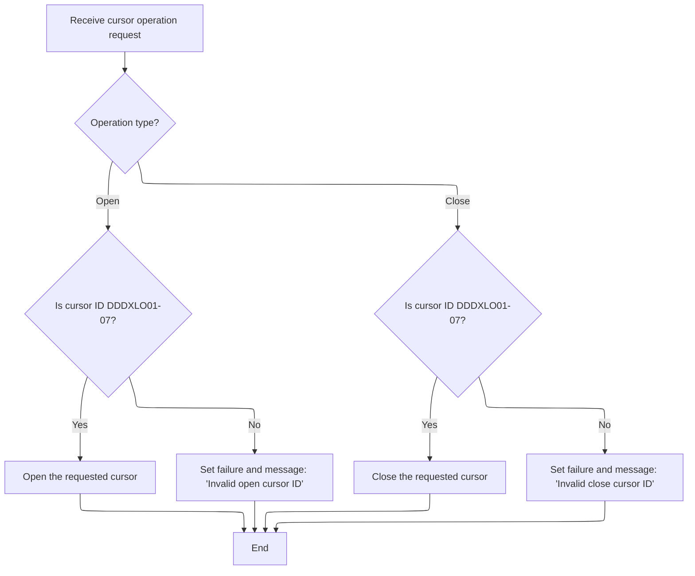

This document describes how requests for location-based database operations are coordinated and executed. The dispatcher acts as the entry point, preparing transaction state and routing each request to the correct handler for operations like opening or closing cursors, or modifying rows.

# Spec

## Detailed View of the Program's Functionality

# Main Flow: Dispatching Location Operations

## Entry Point and Operation Dispatch

The main entry point for the program is a dispatcher routine. This routine is responsible for handling requests related to location operations (such as opening or closing a cursor, fetching rows, modifying, inserting, or deleting data). The dispatcher always starts by preparing the transaction and connection state, regardless of the requested operation.

After initialization, the dispatcher examines the operation code provided by the caller. Depending on this code, it routes the request to the appropriate handler for the specific operation (for example, opening a cursor, closing a cursor, fetching a unique row, fetching the next row, modifying a row, inserting a row, purging a row, or performing special I/O functions). If the operation code is not recognized, the dispatcher simply skips any operation-specific logic and proceeds to the exit routine.

Finally, the dispatcher always performs exit-related tasks to wrap up the transaction and then returns control to the caller.

---

# Preparing Transaction State

## Initialization

Before any operation is performed, the program resets all working fields, status indicators, and clears out the main data structures used for the transaction. It also moves the index handle into place and resets checkpoint and SQL state variables.

If the requested operation is not a cursor close, the program copies and normalizes all location data needed for the operation. This is done to avoid unnecessary work when only closing a cursor.

If the operation requires a connection to an Oracle database (for example, certain insert, purge, or modify operations), the program establishes the connection immediately after initialization.

---

# Normalizing Location Data

## Data Preparation

When required (for most operations except closing a cursor), the program copies all relevant fields from the input parameter area to the internal data structures used for database operations. This includes all location-related fields such as type, number, name, address, contact information, and other attributes. The program also normalizes date and time fields, ensuring that default values are set where necessary and that obsolete fields are handled appropriately.

Special logic is applied depending on the type of location, such as setting certain codes or flags for vendor, store, or DSD vendor locations. The program also ensures that numeric fields are valid and that ship days are edited to reflect whether shipping occurs on each day of the week.

---

# Establishing Database Connection

## Oracle Connection

If the operation requires access to Oracle, the program calls an external routine to establish the database connection. If the connection fails, the program captures the error code, clears the message field, and constructs a detailed error message for the caller. This keeps the connection logic isolated and allows the main program to handle errors cleanly.

---

# Routing to Operation Handlers

## Cursor Operations

When the dispatcher determines that the requested operation is to open or close a cursor, it routes the request to the appropriate handler.

### Opening a Cursor

The program checks which cursor ID was provided. If the ID matches one of the valid SQL cursors (there are seven possible: DDDXLO01 through DDDXLO07), it opens the corresponding cursor. If the ID is invalid, the program sets a failure flag and writes an error message indicating that the open cursor ID is invalid. No cursor is opened in this case.

### Closing a Cursor

Similarly, when closing a cursor, the program checks the provided cursor handle. If it matches one of the valid cursor handles, it closes the corresponding cursor. If the handle is invalid, the program sets a failure flag and writes an error message indicating that the close cursor ID is invalid. No cursor is closed in this case.

---

# Exit Routine

## Finalization

After the requested operation is performed (or skipped, if the code is invalid), the program performs exit-related tasks. This may include moving data back from internal structures to the output parameter area, updating checkpoint counters, and connecting to additional databases if required. The program also ensures that the final SQL code is stored for the caller.

---

# Summary

- The program acts as a dispatcher for location-related database operations.
- It always initializes transaction state before performing any operation.
- It routes requests to the appropriate handler based on the operation code.
- For cursor operations, it validates the cursor ID and either opens/closes the cursor or sets an error message.
- It handles database connections as needed, isolating connection logic and error handling.
- It always performs exit tasks to finalize the transaction and return results to the caller.

This structure ensures that all location operations are handled consistently, with clear separation between initialization, operation handling, and finalization. Error handling is performed at each step to ensure that invalid requests or failures are communicated back to the caller.

# Rule Definition

| Paragraph Name                                                                        | Rule ID | Category          | Description                                                                                                                                                                  | Conditions                                                                     | Remarks                                                                                                                                                                                                                                                                                                                |
| ------------------------------------------------------------------------------------- | ------- | ----------------- | ---------------------------------------------------------------------------------------------------------------------------------------------------------------------------- | ------------------------------------------------------------------------------ | ---------------------------------------------------------------------------------------------------------------------------------------------------------------------------------------------------------------------------------------------------------------------------------------------------------------------- |
| 0000-EXIT-DISPATCHER                                                                  | RL-001  | Conditional Logic | The operation to perform is determined by the value of OPERATION-CODE in the XXXN001A input structure.                                                                       | OPERATION-CODE field is present and set to a supported value.                  | Supported operation codes include EXIT-OPEN-CURSOR, EXIT-CLOSE-CURSOR, EXIT-GET-UNIQUE-ROW, EXIT-GET-NEXT-ROW, EXIT-PUT-MODIFY-ROW, EXIT-PUT-INSERT-ROW, EXIT-PUT-PURGE-ROW, EXIT-DO-SPECIAL-IO-FUNCS. If OPERATION-CODE is not recognized, no operation is performed and no error is set unless a subroutine does so. |
| 1000-EXIT-OPEN-CURSOR, 1100-EXIT-CLOSE-CURSOR                                         | RL-002  | Conditional Logic | For cursor operations, the CURSOR-ID field in P-DDDTLO01 must be validated against the set of valid cursor IDs before opening or closing the cursor.                         | Operation is EXIT-OPEN-CURSOR or EXIT-CLOSE-CURSOR; CURSOR-ID is present.      | Valid cursor IDs: DDDXLO01, DDDXLO02, DDDXLO03, DDDXLO04, DDDXLO05, DDDXLO06, DDDXLO07. If CURSOR-ID is not valid, set STATUS-FLAG to FAILURE and IS-RTRN-MSG-TXT to 'NNNS0487 - Invalid open/close cursor ID.'                                                                                                        |
| 1000-EXIT-OPEN-CURSOR                                                                 | RL-003  | Computation       | If the operation is EXIT-OPEN-CURSOR and the CURSOR-ID is valid, the program must open the corresponding SQL cursor.                                                         | Operation is EXIT-OPEN-CURSOR and CURSOR-ID is valid.                          | Cursor is opened using EXEC SQL OPEN <CURSOR-ID>.                                                                                                                                                                                                                                                                      |
| 1100-EXIT-CLOSE-CURSOR                                                                | RL-004  | Computation       | If the operation is EXIT-CLOSE-CURSOR and the CURSOR-ID is valid, the program must close the corresponding SQL cursor.                                                       | Operation is EXIT-CLOSE-CURSOR and CURSOR-ID is valid.                         | Cursor is closed using EXEC SQL CLOSE <CURSOR-ID>.                                                                                                                                                                                                                                                                     |
| 1000-EXIT-OPEN-CURSOR, 1100-EXIT-CLOSE-CURSOR                                         | RL-005  | Data Assignment   | If the operation is EXIT-OPEN-CURSOR or EXIT-CLOSE-CURSOR and the CURSOR-ID is not valid, set STATUS-FLAG to FAILURE and IS-RTRN-MSG-TXT to a descriptive error message.     | Operation is EXIT-OPEN-CURSOR or EXIT-CLOSE-CURSOR and CURSOR-ID is not valid. | STATUS-FLAG set to FAILURE; IS-RTRN-MSG-TXT set to 'NNNS0487 - Invalid open/close cursor ID.'                                                                                                                                                                                                                          |
| 0000-EXIT-DISPATCHER                                                                  | RL-006  | Conditional Logic | If the operation code is not recognized, the program must not perform any operation and must not set an error unless a subroutine does so.                                   | OPERATION-CODE is not recognized.                                              | No error is set in main dispatcher for unknown operation code.                                                                                                                                                                                                                                                         |
| 120-EXIT-STUFF, 130-MOVE-DCL-2-PDA-FIELDS                                             | RL-007  | Data Assignment   | After the operation (or if no operation is performed), the program must always finalize and update the output fields before returning.                                       | Always, after operation or no operation.                                       | Output fields in XXXN001A and P-DDDTLO01 are updated to reflect the result. STATUS-FLAG and IS-RTRN-MSG-TXT are set according to success/failure. Output location data in P-DDDTLO01 is synchronized with DCLXXXATION.                                                                                                 |
| 1000-EXIT-OPEN-CURSOR, 1100-EXIT-CLOSE-CURSOR, 120-EXIT-STUFF                         | RL-008  | Data Assignment   | On success, set STATUS-FLAG in XXXN001A to SUCCESS and clear IS-RTRN-MSG-TXT. On failure, set STATUS-FLAG to FAILURE and set IS-RTRN-MSG-TXT to a descriptive error message. | Operation completed, success or failure determined.                            | STATUS-FLAG values: SUCCESS, FAILURE. IS-RTRN-MSG-TXT is cleared on success, set to error message on failure.                                                                                                                                                                                                          |
| 120-EXIT-STUFF, 1000-EXIT-OPEN-CURSOR, 1100-EXIT-CLOSE-CURSOR, and all SQL operations | RL-009  | Data Assignment   | The SQLCA structure must be updated with the SQLCODE and SQLERRM values after any database operation.                                                                        | Any database operation is performed.                                           | SQLCA fields SQLCODE and SQLERRM are updated after each SQL operation.                                                                                                                                                                                                                                                 |
| 130-MOVE-DCL-2-PDA-FIELDS, 120-EXIT-STUFF                                             | RL-010  | Data Assignment   | The output location data in P-DDDTLO01 must reflect any changes made by the operation, if applicable.                                                                        | Operation modifies location data.                                              | All location fields in P-DDDTLO01 are updated from DCLXXXATION after operation.                                                                                                                                                                                                                                        |
| 0000-EXIT-DISPATCHER, 100-INITIALIZATION                                              | RL-011  | Data Assignment   | Before any operation is performed, all transaction and connection state must be initialized, regardless of the requested operation code.                                     | Always, before any operation code is processed.                                | Initialization includes clearing or setting to default all transaction state fields, connection state fields, and output fields. Error codes and flags are reset to default values. Output fields are set to default values.                                                                                           |

# User Stories

## User Story 1: Operation initialization, dispatch, and cursor management

---

### Story Description:

As a user, I want the program to initialize all transaction and connection state, then perform the requested operation based on the OPERATION-CODE, including opening and closing cursors with validation, so that I can reliably execute supported database operations and receive clear error messages for invalid requests.

---

### Business Rule Mapping:

| Rule ID | Paragraph Name                                | Rule Description                                                                                                                                                         |
| ------- | --------------------------------------------- | ------------------------------------------------------------------------------------------------------------------------------------------------------------------------ |
| RL-011  | 0000-EXIT-DISPATCHER, 100-INITIALIZATION      | Before any operation is performed, all transaction and connection state must be initialized, regardless of the requested operation code.                                 |
| RL-001  | 0000-EXIT-DISPATCHER                          | The operation to perform is determined by the value of OPERATION-CODE in the XXXN001A input structure.                                                                   |
| RL-006  | 0000-EXIT-DISPATCHER                          | If the operation code is not recognized, the program must not perform any operation and must not set an error unless a subroutine does so.                               |
| RL-002  | 1000-EXIT-OPEN-CURSOR, 1100-EXIT-CLOSE-CURSOR | For cursor operations, the CURSOR-ID field in P-DDDTLO01 must be validated against the set of valid cursor IDs before opening or closing the cursor.                     |
| RL-003  | 1000-EXIT-OPEN-CURSOR                         | If the operation is EXIT-OPEN-CURSOR and the CURSOR-ID is valid, the program must open the corresponding SQL cursor.                                                     |
| RL-005  | 1000-EXIT-OPEN-CURSOR, 1100-EXIT-CLOSE-CURSOR | If the operation is EXIT-OPEN-CURSOR or EXIT-CLOSE-CURSOR and the CURSOR-ID is not valid, set STATUS-FLAG to FAILURE and IS-RTRN-MSG-TXT to a descriptive error message. |
| RL-004  | 1100-EXIT-CLOSE-CURSOR                        | If the operation is EXIT-CLOSE-CURSOR and the CURSOR-ID is valid, the program must close the corresponding SQL cursor.                                                   |

---

### Relevant Functionality:

- **0000-EXIT-DISPATCHER**
  1. **RL-011:**
     - On entry to main dispatcher:
       - Call initialization routine
         - Initialize all transaction and connection state fields
         - Set output fields to default values
         - Reset error codes and flags
         - Prepare data areas for operation
  2. **RL-001:**
     - Evaluate OPERATION-CODE:
       - If EXIT-OPEN-CURSOR, perform open cursor logic
       - If EXIT-CLOSE-CURSOR, perform close cursor logic
       - If other supported codes, perform corresponding logic
       - If not recognized, do nothing (unless subroutine sets error)
  3. **RL-006:**
     - If OPERATION-CODE not recognized:
       - Do not perform any operation
       - Do not set error status or message
- **1000-EXIT-OPEN-CURSOR**
  1. **RL-002:**
     - If operation is open/close cursor:
       - Check CURSOR-ID against valid set
       - If valid, perform SQL OPEN/CLOSE for that cursor
       - If not valid, set failure status and error message
  2. **RL-003:**
     - If EXIT-OPEN-CURSOR and CURSOR-ID valid:
       - Execute SQL OPEN for the specified cursor
  3. **RL-005:**
     - If CURSOR-ID not valid for open/close:
       - Set STATUS-FLAG to FAILURE
       - Set IS-RTRN-MSG-TXT to error message
- **1100-EXIT-CLOSE-CURSOR**
  1. **RL-004:**
     - If EXIT-CLOSE-CURSOR and CURSOR-ID valid:
       - Execute SQL CLOSE for the specified cursor

## User Story 2: Finalization and output update after operation

---

### Story Description:

As a user, I want the program to finalize and update all output fields, including status flags, return messages, SQLCA, and location data, after any operation so that I receive accurate and complete feedback about the result of my request.

---

### Business Rule Mapping:

| Rule ID | Paragraph Name                                                                        | Rule Description                                                                                                                                                             |
| ------- | ------------------------------------------------------------------------------------- | ---------------------------------------------------------------------------------------------------------------------------------------------------------------------------- |
| RL-008  | 1000-EXIT-OPEN-CURSOR, 1100-EXIT-CLOSE-CURSOR, 120-EXIT-STUFF                         | On success, set STATUS-FLAG in XXXN001A to SUCCESS and clear IS-RTRN-MSG-TXT. On failure, set STATUS-FLAG to FAILURE and set IS-RTRN-MSG-TXT to a descriptive error message. |
| RL-007  | 120-EXIT-STUFF, 130-MOVE-DCL-2-PDA-FIELDS                                             | After the operation (or if no operation is performed), the program must always finalize and update the output fields before returning.                                       |
| RL-009  | 120-EXIT-STUFF, 1000-EXIT-OPEN-CURSOR, 1100-EXIT-CLOSE-CURSOR, and all SQL operations | The SQLCA structure must be updated with the SQLCODE and SQLERRM values after any database operation.                                                                        |
| RL-010  | 130-MOVE-DCL-2-PDA-FIELDS, 120-EXIT-STUFF                                             | The output location data in P-DDDTLO01 must reflect any changes made by the operation, if applicable.                                                                        |

---

### Relevant Functionality:

- **1000-EXIT-OPEN-CURSOR**
  1. **RL-008:**
     - If operation successful:
       - Set STATUS-FLAG to SUCCESS
       - Clear IS-RTRN-MSG-TXT
     - If operation failed:
       - Set STATUS-FLAG to FAILURE
       - Set IS-RTRN-MSG-TXT to error message
- **120-EXIT-STUFF**
  1. **RL-007:**
     - After operation:
       - If success, update output fields with result
       - If failure, set error status and message
       - Synchronize output location data
  2. **RL-009:**
     - After any SQL operation:
       - Update SQLCA.SQLCODE and SQLCA.SQLERRM with result
- **130-MOVE-DCL-2-PDA-FIELDS**
  1. **RL-010:**
     - After operation:
       - Move updated location data from DCLXXXATION to P-DDDTLO01

# Code Walkthrough

## Dispatching Location Operations

<SwmSnippet path="/base/src/NNNS0487.cbl" line="864">

---

`0000-EXIT-DISPATCHER` kicks off the flow. It always calls `100-INITIALIZATION` first to prep all the transaction and connection state, regardless of what operation is about to happen. After that, it uses an EVALUATE (switch-case) on the exit code to decide which operation to run (open/close cursor, get/put row, etc). If the exit code isn't one of the known ones, it just skips to the end. This pattern assumes the exit code is valid, but doesn't check it explicitly. The dispatcher doesn't do any validation, so if you pass a bogus code, nothing happens and you get no error unless the subroutine itself handles it. Finally, it always calls `120-EXIT-STUFF` to wrap up and returns.

```cobol
094100 0000-EXIT-DISPATCHER.                                            00094100
094200     PERFORM 100-INITIALIZATION                                   00094200
094300     EVALUATE TRUE                                                00094300
094400       WHEN NOT SUCCESS                                           00094400
094500          CONTINUE                                                00094500
094600       WHEN EXIT-OPEN-CURSOR                                      00094600
094700          PERFORM 1000-EXIT-OPEN-CURSOR                           00094700
094800       WHEN EXIT-CLOSE-CURSOR                                     00094800
094900          PERFORM 1100-EXIT-CLOSE-CURSOR                          00094900
095000       WHEN EXIT-GET-UNIQUE-ROW                                   00095000
095100          PERFORM 1200-EXIT-GET-UNIQUE-ROW                        00095100
095200       WHEN EXIT-GET-NEXT-ROW                                     00095200
095300          PERFORM 1300-EXIT-GET-NEXT-ROW                          00095300
095400       WHEN EXIT-PUT-MODIFY-ROW                                   00095400
095500          PERFORM 1400-EXIT-PUT-MODIFY-ROW                        00095500
095600       WHEN EXIT-PUT-INSERT-ROW                                   00095600
095700          PERFORM 1500-EXIT-PUT-INSERT-ROW                        00095700
095800       WHEN EXIT-PUT-PURGE-ROW                                    00095800
095900          PERFORM 1600-EXIT-PUT-PURGE-ROW                         00095900
096000       WHEN EXIT-DO-SPECIAL-IO-FUNCS                              00096000
096100          PERFORM 10000-DO-SPECIAL-IO-FUNCS                       00096100
096200     END-EVALUATE                                                 00096200
096300                                                                  00096300
096400     PERFORM 120-EXIT-STUFF                                       00096400
096500     GOBACK                                                       00096500
096600     .                                                            00096600
```

---

</SwmSnippet>

### Preparing Transaction State

<SwmSnippet path="/base/src/NNNS0487.cbl" line="894">

---

`100-INITIALIZATION` resets all the working fields, status, and clears out the main data structures. It then moves the index handle into place and resets checkpoint and SQL state. If we're not just closing a cursor, it calls `110-MOVE-PDA-FIELDS-2-DCL` to copy and normalize all the location data for the operation. This avoids unnecessary work when just closing a cursor. If the operation needs Oracle, it connects right after.

```cobol
097100 100-INITIALIZATION.                                              00097100
097200     INITIALIZE XXXN001A                                          00097200
097300                DAO-STATUS                                        00097300
097400                MMMC0474                                          00097400
097500                ZZZC0550                                          00097500
097600     MOVE NNNN0000-INDEX-HANDLE TO DDDTLO01-INDEX-HANDLE          00097600
097700     MOVE 0 TO WS-CHECKPOINT-INC                                  00097700
097800     MOVE 0 TO SQLCODE                                            00097800
097900     MOVE 0 TO SQL-INIT-FLAG                                      00097900
098000     IF NOT EXIT-CLOSE-CURSOR                                     00098000
098100       PERFORM 110-MOVE-PDA-FIELDS-2-DCL                          00098100
098200     END-IF                                                       00098200
098300     IF (YYYN005A-ORACLE       OR EXIT-PUT-INSERT-ROW             00098300
098400         OR EXIT-PUT-PURGE-ROW OR EXIT-PUT-MODIFY-ROW)            00098400
098500       PERFORM 115-CONNECT-TO-ORACLE                              00098500
098600     END-IF                                                       00098600
098700     .                                                            00098700
```

---

</SwmSnippet>

#### Normalizing Location Data

See <SwmLink doc-title="Transforming and Normalizing Location Data">[Transforming and Normalizing Location Data](\.swm\transforming-and-normalizing-location-data.iyk6tps3.sw.md)</SwmLink>

#### Establishing Database Connection

<SwmSnippet path="/base/src/NNNS0487.cbl" line="1177">

---

`115-CONNECT-TO-ORACLE` calls out to Z-ORA-CONNECT (which is actually the program XXXS0210) to set up the Oracle DB connection. If the connection fails, it grabs the SQLCODE, clears the message field, and builds a detailed error message for the caller. This keeps the connection logic isolated and lets the main program handle errors cleanly.

```cobol
125400 115-CONNECT-TO-ORACLE.                                           00125400
125500     CALL Z-ORA-CONNECT USING XXXN001A                            00125500
125600                              SQLCA                               00125600
125700     IF NOT SUCCESS                                               00125700
125800       MOVE SQLCODE TO WS-SQLCODE                                 00125800
125900       MOVE SPACES  TO IS-RTRN-MSG-TXT                            00125900
126000       STRING 'NNNS0487 - Error connecting to Oracle. Sqlcode ='  00126000
126100               WS-SQLCODE                                         00126100
126200               DELIMITED BY SIZE INTO IS-RTRN-MSG-TXT             00126200
126300     END-IF                                                       00126300
126400     .                                                            00126400
```

---

</SwmSnippet>

### Routing to Operation Handlers



<SwmSnippet path="/base/src/NNNS0487.cbl" line="1454">

---

`1000-EXIT-OPEN-CURSOR` checks which cursor ID was passed in and opens the matching SQL cursor (DDDXLO01 to DDDXLO07). If the ID isn't one of those, it sets a failure flag and writes an error message. No cursor is opened if the ID is invalid.

```cobol
153100 1000-EXIT-OPEN-CURSOR.                                           00153100
153200     EVALUATE TRUE                                                00153200
153300       WHEN DDDXLO01                                              00153300
153400         EXEC SQL                                                 00153400
153500           OPEN DDDXLO01                                          00153500
153600         END-EXEC                                                 00153600
153700       WHEN DDDXLO02                                              00153700
153800         EXEC SQL                                                 00153800
153900           OPEN DDDXLO02                                          00153900
154000         END-EXEC                                                 00154000
154100       WHEN DDDXLO03                                              00154100
154200         EXEC SQL                                                 00154200
154300           OPEN DDDXLO03                                          00154300
154400         END-EXEC                                                 00154400
154500       WHEN DDDXLO04                                              00154500
154600         EXEC SQL                                                 00154600
154700           OPEN DDDXLO04                                          00154700
154800         END-EXEC                                                 00154800
154900       WHEN DDDXLO05                                              00154900
155000         EXEC SQL                                                 00155000
155100           OPEN DDDXLO05                                          00155100
155200         END-EXEC                                                 00155200
155300       WHEN DDDXLO06                                              00155300
155400         EXEC SQL                                                 00155400
155500           OPEN DDDXLO06                                          00155500
155600         END-EXEC                                                 00155600
155700       WHEN DDDXLO07                                              00155700
155800         EXEC SQL                                                 00155800
155900           OPEN DDDXLO07                                          00155900
156000         END-EXEC                                                 00156000
156100       WHEN OTHER                                                 00156100
156200         SET FAILURE TO TRUE                                      00156200
156300         MOVE 'NNNS0487 - Invalid open cursor ID.'                00156300
156400           TO IS-RTRN-MSG-TXT OF XXXN001A                         00156400
156500     END-EVALUATE                                                 00156500
156600     .                                                            00156600
```

---

</SwmSnippet>

<SwmSnippet path="/base/src/NNNS0487.cbl" line="1492">

---

`1100-EXIT-CLOSE-CURSOR` checks which cursor handle was passed and closes the matching SQL cursor (DDDXLO01 to DDDXLO07). If the handle isn't valid, it sets a failure flag and writes an error message. No cursor is closed if the handle is invalid.

```cobol
156900 1100-EXIT-CLOSE-CURSOR.                                          00156900
157000     EVALUATE TRUE                                                00157000
157100       WHEN DDDXLO01                                              00157100
157200         EXEC SQL                                                 00157200
157300           CLOSE DDDXLO01                                         00157300
157400         END-EXEC                                                 00157400
157500       WHEN DDDXLO02                                              00157500
157600         EXEC SQL                                                 00157600
157700           CLOSE DDDXLO02                                         00157700
157800         END-EXEC                                                 00157800
157900       WHEN DDDXLO03                                              00157900
158000         EXEC SQL                                                 00158000
158100           CLOSE DDDXLO03                                         00158100
158200         END-EXEC                                                 00158200
158300       WHEN DDDXLO04                                              00158300
158400         EXEC SQL                                                 00158400
158500           CLOSE DDDXLO04                                         00158500
158600         END-EXEC                                                 00158600
158700       WHEN DDDXLO05                                              00158700
158800         EXEC SQL                                                 00158800
158900           CLOSE DDDXLO05                                         00158900
159000         END-EXEC                                                 00159000
159100       WHEN DDDXLO06                                              00159100
159200         EXEC SQL                                                 00159200
159300           CLOSE DDDXLO06                                         00159300
159400         END-EXEC                                                 00159400
159500       WHEN DDDXLO07                                              00159500
159600         EXEC SQL                                                 00159600
159700           CLOSE DDDXLO07                                         00159700
159800         END-EXEC                                                 00159800
159900       WHEN OTHER                                                 00159900
160000         SET FAILURE TO TRUE                                      00160000
160100         MOVE 'NNNS0487 - Invalid close cursor ID.'               00160100
160200           TO IS-RTRN-MSG-TXT OF XXXN001A                         00160200
160300     END-EVALUATE                                                 00160300
160400     .                                                            00160400
```

---

</SwmSnippet>

&nbsp;

*This is an auto-generated document by Swimm 🌊 and has not yet been verified by a human*

<SwmMeta version="3.0.0" repo-id="Z2l0aHViJTNBJTNBU3dpbW1pby1keW5jYWxsLWRlbW8lM0ElM0FHaXJpLVN3aW1t" repo-name="Swimmio-dyncall-demo"><sup>Powered by [Swimm](https://app.swimm.io/)</sup></SwmMeta>
