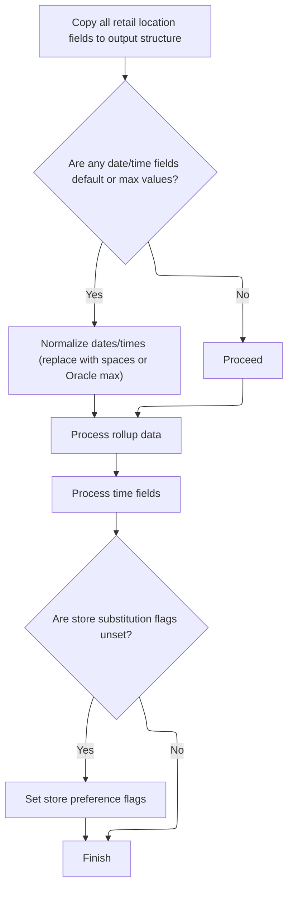

This document describes how retail location data is transferred and normalized after a database operation. When the operation is successful and the cursor remains open, the data is mapped to the output structure, progress is tracked, and the database context is switched if needed. The process concludes with an update to the SQL status code.

# Spec

## Detailed View of the Program's Functionality

# Swimmio-dyncall-demo: Data Coordination and Mapping Flow

---

## a. Main Exit Coordination (`120-EXIT-STUFF`)

This section is responsible for finalizing the main flow after a database operation. It performs several conditional actions based on the outcome of the previous operation and the current state of the system:

- **Success Check and Data Transfer:**\
  If the last operation was successful and the process is not in the middle of closing a database cursor, it triggers a routine to move retail location data from the internal working area to the output structure. This ensures that only valid, up-to-date data is exposed to the output when the operation is confirmed as successful.

- **Checkpoint Increment:**\
  After a successful operation, it increments a checkpoint counter. This is used for tracking progress or for recovery purposes.

- **Database Context Switching:**\
  If the system is interacting with an Oracle database or performing certain types of database row operations (such as insert, purge, or modify), it calls a routine to switch the database context to DB2. This ensures that subsequent operations are performed in the correct database environment.

- **SQL Status Update:**\
  Finally, it updates the output structure with the latest SQL status code, reflecting the result of the most recent database operation.

---

## b. Retail Data Mapping and Normalization (`130-MOVE-DCL-2-PDA-FIELDS`)

This section is responsible for copying and normalizing retail location data from the internal structure to the output structure, handling special business rules and data cleanup:

- **Field-by-Field Copy:**\
  All relevant fields (such as location number, type, associated store info, dates, status codes, company/division IDs, and more) are copied from the internal data area to the output structure.

- **Date and Time Normalization:**\
  For each date or time field, the code checks if the value is a default or maximum value (such as a placeholder or an out-of-range value). If so, it replaces these with either blank spaces or a business-defined maximum value (for example, converting a DB2 maximum time to an Oracle maximum time). This ensures that the output does not contain invalid or misleading date/time values.

- **Rollup Data Handling:**\
  The routine calls a subroutine to process rollup fields (aggregated numeric data). Each rollup field is checked to ensure it contains a valid number; if not, it is set to zero. This prevents non-numeric or garbage data from being output.

- **Time Field Processing:**\
  Another subroutine is called to handle time fields, which may involve converting between timestamp and time formats depending on the database context (Oracle vs. DB2).

- **Store Substitution and Preference Flags:**\
  The code checks if certain store substitution flags are unset. If so, it sets preference flags according to business rules, ensuring that the output reflects the correct store substitution logic.

- **Final Field Copy:**\
  Remaining fields, such as format codes, segment codes, e-commerce dates, and replacement store numbers, are copied over, with additional normalization for default values as needed.

---

## c. Rollup Data Numeric Mapping (`135-MOVE-DC-ROLLUP-DATA`)

This section ensures that all rollup (aggregate) fields in the output are valid numbers:

- **Numeric Validation:**\
  For each rollup field (there are ten), the code checks if the value is numeric. If it is, the value is copied to a numeric array; if not, the array slot is set to zero.

- **Overlay Mechanism:**\
  The numeric array is overlaid on a text field, allowing the same memory area to be treated as either a string or a set of numbers, depending on later processing needs.

- **Final Output:**\
  After all rollup fields are processed, the numeric array (as text) is copied to the output structure, ensuring consistency and validity.

---

## d. Time Field Conversion and Mapping (`132-MOVE-TIME-FIELDS`)

This section handles the conversion and mapping of time fields, adapting to the requirements of different database systems:

- **Context Check:**\
  If the operation involves Oracle or certain row operations, the code prepares to convert timestamps to time fields.

- **Timestamp Array Preparation:**\
  Arrays are loaded with timestamp values for each day of the week (open and close times).

- **Conversion Routine Call:**\
  A conversion flag is set, and an external conversion routine is called to perform the timestamp-to-time conversion.

- **Error Handling:**\
  If the conversion fails, an error message is set in the output. If successful, the converted times are copied to the output structure.

- **Direct Copy (if no conversion needed):**\
  If conversion is not required, time fields are copied directly from the internal structure to the output.

---

## e. Database Context Switching (`125-CONNECT-TO-DB2`)

This section ensures that the system is connected to the correct database (DB2) when required:

- **DB2 Connection Call:**\
  A call is made to the DB2 connection handler, passing necessary context and status structures.

- **Error Handling and State Restoration:**\
  The connection handler is responsible for translating any Oracle errors and restoring backup records as needed, ensuring the system is ready for the next database operation.

---

## f. Summary

The overall flow coordinates the safe and accurate transfer of retail location data between internal and output structures, normalizes and validates all fields (especially dates, times, and rollup numbers), and ensures that the system is always operating in the correct database context. Special business rules are enforced throughout, particularly around store substitution preferences and data cleanup. The design is modular, with each section handling a specific aspect of the data transfer and normalization process.

# Rule Definition

| Paragraph Name                                       | Rule ID | Category          | Description                                                                                                                                                                                                                   | Conditions                                                                                               | Remarks                                                                                                                                                                                                                             |
| ---------------------------------------------------- | ------- | ----------------- | ----------------------------------------------------------------------------------------------------------------------------------------------------------------------------------------------------------------------------- | -------------------------------------------------------------------------------------------------------- | ----------------------------------------------------------------------------------------------------------------------------------------------------------------------------------------------------------------------------------- |
| 120-EXIT-STUFF                                       | RL-001  | Conditional Logic | Retail location data is transferred to the output structure only if the last operation was successful and the cursor is not being closed.                                                                                     | The last operation must be successful (SUCCESS is true) and the operation must not be EXIT-CLOSE-CURSOR. | No specific constants. Output structure is the parameter data area (P-DDDTLR01).                                                                                                                                                    |
| 110-MOVE-PDA-FIELDS-2-DCL, 130-MOVE-DCL-2-PDA-FIELDS | RL-002  | Data Assignment   | All fields from the input retail location structure are mapped one-to-one to the output structure. Date and time fields are normalized: default or invalid values are replaced with spaces.                                   | Always applies during field mapping routines.                                                            | Date default: '00000000' (K-ZERO-DT), Time default: '00.00.00' (K-DEF-TM), DB2 max time: '24.00.00' (K-DB2-MAX-TM), Oracle max time: '23.59.59' (K-ORA-MAX-TM). Output fields are alphanumeric or numeric as per their definitions. |
| 130-MOVE-DCL-2-PDA-FIELDS                            | RL-003  | Conditional Logic | If an input date field is the default value ('00000000'), the output field is set to spaces.                                                                                                                                  | Input date field equals K-DEF-DT or K-ZERO-DT.                                                           | K-ZERO-DT = '00000000'. Output format is string/alphanumeric, set to spaces.                                                                                                                                                        |
| 130-MOVE-DCL-2-PDA-FIELDS                            | RL-004  | Conditional Logic | If an input time field is the default value ('00.00.00'), the output is set to spaces. If the input is DB2 max time and output is for Oracle, it is set to Oracle max time.                                                   | Input time field equals K-DEF-TM or K-DB2-MAX-TM; output is for Oracle.                                  | K-DEF-TM = '00.00.00', K-DB2-MAX-TM = '24.00.00', K-ORA-MAX-TM = '23.59.59'. Output format is string/alphanumeric, set to spaces or K-ORA-MAX-TM as appropriate.                                                                    |
| 117-MOVE-ROLLUP-DATA, 135-MOVE-DC-ROLLUP-DATA        | RL-005  | Computation       | Each rollup numeric field is validated: if numeric, mapped to output array; if not, set to zero. Output text field overlays numeric array.                                                                                    | Always applies during rollup field mapping.                                                              | There are 10 rollup fields, mapped to positions 1-10. Output numeric fields are numbers; output text field is alphanumeric overlay.                                                                                                 |
| 110-MOVE-PDA-FIELDS-2-DCL, 130-MOVE-DCL-2-PDA-FIELDS | RL-006  | Conditional Logic | If both the 'OK' and 'DONT' store substitution flags are false, the 'NO' flag must be set to true.                                                                                                                            | Both 'OK' and 'DONT' flags are false for a store substitution field.                                     | Flags are boolean or single-character fields. 'NO' flag is set to true (or equivalent value).                                                                                                                                       |
| 112-MOVE-TIME-FIELDS, 132-MOVE-TIME-FIELDS           | RL-007  | Conditional Logic | Time fields are processed differently depending on database context and operation type. For Oracle or insert/purge/modify, convert timestamps to time fields using an external routine; otherwise, copy time fields directly. | Context is Oracle or operation is insert/purge/modify.                                                   | External routine: MMMS0291. Input/output fields are time or timestamp strings. 14 time fields processed in array.                                                                                                                   |
| 130-MOVE-DCL-2-PDA-FIELDS, 120-EXIT-STUFF            | RL-008  | Data Assignment   | The output structure must contain all mapped, normalized, and converted fields, as well as all relevant store substitution and messaging flags.                                                                               | Always applies during output preparation.                                                                | Output structure includes all mapped fields, normalized dates/times, rollup fields, and flags. Formats as per field definitions.                                                                                                    |
| 120-EXIT-STUFF, 125-CONNECT-TO-DB2                   | RL-009  | Conditional Logic | The database context is switched to DB2 as required by the operation type or context, and the SQL status code is updated.                                                                                                     | Operation type or context requires DB2.                                                                  | No specific constants. SQL status code is a numeric field.                                                                                                                                                                          |
| 117-MOVE-ROLLUP-DATA, 135-MOVE-DC-ROLLUP-DATA        | RL-010  | Data Assignment   | Rollup fields are mapped positionally: the first rollup field goes to index 1, the second to index 2, and so on, up to 10.                                                                                                    | Always applies during rollup field mapping.                                                              | 10 rollup fields, mapped to numeric array positions 1-10.                                                                                                                                                                           |
| 117-MOVE-ROLLUP-DATA, 135-MOVE-DC-ROLLUP-DATA        | RL-011  | Conditional Logic | Numeric fields in the output must only contain valid numbers or zero; invalid or junk data is not allowed.                                                                                                                    | During rollup field mapping or numeric field assignment.                                                 | Numeric fields are validated; non-numeric values are set to zero.                                                                                                                                                                   |
| 120-EXIT-STUFF, 130-MOVE-DCL-2-PDA-FIELDS            | RL-012  | Conditional Logic | After all mapping, normalization, and conversion steps, the output structure must be ready for downstream processing.                                                                                                         | After all field mapping and normalization routines have completed.                                       | Output structure is fully populated, normalized, and validated.                                                                                                                                                                     |

# User Stories

## User Story 1: Field mapping, normalization, and time field conversion

---

### Story Description:

As a system, I want all fields from the input retail location structure to be mapped one-to-one to the output structure, with normalization applied to date and time fields, and time fields processed according to the database context and operation type, converting timestamps to time fields using an external routine when required, so that the output contains clean, standardized, and context-appropriate data for downstream processing.

---

### Business Rule Mapping:

| Rule ID | Paragraph Name                                       | Rule Description                                                                                                                                                                                                              |
| ------- | ---------------------------------------------------- | ----------------------------------------------------------------------------------------------------------------------------------------------------------------------------------------------------------------------------- |
| RL-009  | 120-EXIT-STUFF, 125-CONNECT-TO-DB2                   | The database context is switched to DB2 as required by the operation type or context, and the SQL status code is updated.                                                                                                     |
| RL-003  | 130-MOVE-DCL-2-PDA-FIELDS                            | If an input date field is the default value ('00000000'), the output field is set to spaces.                                                                                                                                  |
| RL-004  | 130-MOVE-DCL-2-PDA-FIELDS                            | If an input time field is the default value ('00.00.00'), the output is set to spaces. If the input is DB2 max time and output is for Oracle, it is set to Oracle max time.                                                   |
| RL-002  | 110-MOVE-PDA-FIELDS-2-DCL, 130-MOVE-DCL-2-PDA-FIELDS | All fields from the input retail location structure are mapped one-to-one to the output structure. Date and time fields are normalized: default or invalid values are replaced with spaces.                                   |
| RL-007  | 112-MOVE-TIME-FIELDS, 132-MOVE-TIME-FIELDS           | Time fields are processed differently depending on database context and operation type. For Oracle or insert/purge/modify, convert timestamps to time fields using an external routine; otherwise, copy time fields directly. |

---

### Relevant Functionality:

- **120-EXIT-STUFF**
  1. **RL-009:**
     - If context or operation requires DB2:
       - Call DB2 connect routine
       - Move SQLCODE to DB2-SQL-CODE
- **130-MOVE-DCL-2-PDA-FIELDS**
  1. **RL-003:**
     - If output date field equals K-DEF-DT, set output date field to spaces
  2. **RL-004:**
     - If output time field equals K-DEF-TM, set output time field to spaces
     - If output time field equals K-DB2-MAX-TM and output is for Oracle, set output time field to K-ORA-MAX-TM
- **110-MOVE-PDA-FIELDS-2-DCL**
  1. **RL-002:**
     - For each field in the input structure:
       - Map directly to the corresponding output field
       - For date fields:
         - If value is spaces or K-ZERO-DT, set to K-DEF-DT (or spaces on output)
       - For time fields:
         - If value is spaces or K-DEF-TM, set to K-DEF-TM (or spaces on output)
         - If value is K-DB2-MAX-TM and output is for Oracle, set to K-ORA-MAX-TM
- **112-MOVE-TIME-FIELDS**
  1. **RL-007:**
     - If context is Oracle or operation is insert/purge/modify:
       - Prepare input array of time fields
       - Call external conversion routine
       - If successful, move converted timestamps to output fields
       - Else, log error
     - Else, copy time fields directly to output

## User Story 2: Rollup field validation and mapping

---

### Story Description:

As a system, I want each rollup numeric field to be validated and mapped positionally to the output array, with invalid values set to zero and the output text field overlaying the numeric array, so that rollup data is accurate and formatted for further use.

---

### Business Rule Mapping:

| Rule ID | Paragraph Name                                | Rule Description                                                                                                                           |
| ------- | --------------------------------------------- | ------------------------------------------------------------------------------------------------------------------------------------------ |
| RL-005  | 117-MOVE-ROLLUP-DATA, 135-MOVE-DC-ROLLUP-DATA | Each rollup numeric field is validated: if numeric, mapped to output array; if not, set to zero. Output text field overlays numeric array. |
| RL-010  | 117-MOVE-ROLLUP-DATA, 135-MOVE-DC-ROLLUP-DATA | Rollup fields are mapped positionally: the first rollup field goes to index 1, the second to index 2, and so on, up to 10.                 |
| RL-011  | 117-MOVE-ROLLUP-DATA, 135-MOVE-DC-ROLLUP-DATA | Numeric fields in the output must only contain valid numbers or zero; invalid or junk data is not allowed.                                 |

---

### Relevant Functionality:

- **117-MOVE-ROLLUP-DATA**
  1. **RL-005:**
     - For each rollup field index 1 to 10:
       - If input rollup field is numeric, map to output numeric array at same index
       - Else, set output numeric array at index to zero
     - Overlay output text field with numeric array
  2. **RL-010:**
     - For i = 1 to 10:
       - Map rollup field i to output array index i
  3. **RL-011:**
     - For each numeric field:
       - If not numeric, set to zero

## User Story 3: Conditional transfer and output structure preparation

---

### Story Description:

As a system, I want to transfer retail location data to the output structure only if the last operation was successful and the cursor is not being closed, and ensure the output structure includes all mapped, normalized, and converted fields, as well as all relevant store substitution and messaging flags, and is fully validated and ready for downstream processing after all mapping, normalization, and conversion steps are complete, so that only valid and complete data is processed downstream.

---

### Business Rule Mapping:

| Rule ID | Paragraph Name                                       | Rule Description                                                                                                                                |
| ------- | ---------------------------------------------------- | ----------------------------------------------------------------------------------------------------------------------------------------------- |
| RL-001  | 120-EXIT-STUFF                                       | Retail location data is transferred to the output structure only if the last operation was successful and the cursor is not being closed.       |
| RL-012  | 120-EXIT-STUFF, 130-MOVE-DCL-2-PDA-FIELDS            | After all mapping, normalization, and conversion steps, the output structure must be ready for downstream processing.                           |
| RL-008  | 130-MOVE-DCL-2-PDA-FIELDS, 120-EXIT-STUFF            | The output structure must contain all mapped, normalized, and converted fields, as well as all relevant store substitution and messaging flags. |
| RL-006  | 110-MOVE-PDA-FIELDS-2-DCL, 130-MOVE-DCL-2-PDA-FIELDS | If both the 'OK' and 'DONT' store substitution flags are false, the 'NO' flag must be set to true.                                              |

---

### Relevant Functionality:

- **120-EXIT-STUFF**
  1. **RL-001:**
     - If SUCCESS is true
       - If not EXIT-CLOSE-CURSOR
         - Perform the routine to move DCL fields to PDA fields (130-MOVE-DCL-2-PDA-FIELDS)
  2. **RL-012:**
     - After all mapping and normalization routines, output structure is ready for downstream use
- **130-MOVE-DCL-2-PDA-FIELDS**
  1. **RL-008:**
     - After all mapping and normalization, ensure output structure contains all required fields and flags
- **110-MOVE-PDA-FIELDS-2-DCL**
  1. **RL-006:**
     - If not OK-TO-SUB and not DONT-SUB, set NO-SUB-STORE-PREF to true

# Code Walkthrough

## Coordinating Data Transfer and Database State

<SwmSnippet path="/base/src/NNNS0488.cbl" line="1756">

---

120-EXIT-STUFF kicks off the flow by checking if the last operation was successful. If so, and we're not closing the cursor, it calls 130-MOVE-DCL-2-PDA-FIELDS to transfer the retail location data to the output structure. This is needed because we only want to move data when the operation succeeded and the cursor remains open. After that, it bumps the checkpoint counter to track progress. Separately, if we're dealing with Oracle or certain DB row operations (insert, purge, modify), it calls 125-CONNECT-TO-DB2 to switch the DB context. Finally, it updates the SQL code status. The logic here is all about branching based on a bunch of flags that are set elsewhere, and each branch lines up with a specific business scenario.

```cobol
179300 120-EXIT-STUFF.                                                  00179300
179400     IF SUCCESS                                                   00179400
179500       IF NOT EXIT-CLOSE-CURSOR                                   00179500
179600         PERFORM 130-MOVE-DCL-2-PDA-FIELDS                        00179600
179700       END-IF                                                     00179700
179800       ADD WS-CHECKPOINT-INC TO YYYN005A-CHKPT-CNT                00179800
179900     END-IF                                                       00179900
180000     IF (YYYN005A-ORACLE       OR EXIT-PUT-INSERT-ROW             00180000
180100         OR EXIT-PUT-PURGE-ROW OR EXIT-PUT-MODIFY-ROW)            00180100
180200*      SET YYYN005A-DB2        TO TRUE                            00180200
180300       PERFORM 125-CONNECT-TO-DB2                                 00180300
180400     END-IF                                                       00180400
180500     MOVE SQLCODE            TO DB2-SQL-CODE                      00180500
180600     .                                                            00180600
```

---

</SwmSnippet>

### Retail Data Mapping and Normalization



<SwmSnippet path="/base/src/NNNS0488.cbl" line="1784">

---

130-MOVE-DCL-2-PDA-FIELDS maps and normalizes retail data, handling special cases for dates/times and setting flags based on business rules. It calls 135-MOVE-DC-ROLLUP-DATA for rollup fields that need numeric checks, and 132-MOVE-TIME-FIELDS for time conversions.

```cobol
182100 130-MOVE-DCL-2-PDA-FIELDS.                                       00182100
182200     MOVE LOC-NBR OF DCLXXXAIL-LOC TO LOC-NBR OF P-DDDTLR01       00182200
182300     MOVE LOC-TYP-CD OF DCLXXXAIL-LOC TO LOC-TYP-CD OF P-DDDTLR01 00182300
182400     MOVE ASSOC-STR-TYP-CD OF DCLXXXAIL-LOC                       00182400
182500       TO ASSOC-STR-TYP-CD OF P-DDDTLR01                          00182500
182600     MOVE ASSOC-STR-NBR OF DCLXXXAIL-LOC                          00182600
182700       TO ASSOC-STR-NBR OF P-DDDTLR01                             00182700
182800                                                                  00182800
182900     MOVE STR-REMODL-DT OF DCLXXXAIL-LOC                          00182900
183000       TO STR-REMODL-DT OF P-DDDTLR01                             00183000
183100     IF STR-REMODL-DT OF P-DDDTLR01 = K-DEF-DT                    00183100
183200       MOVE SPACES TO STR-REMODL-DT OF P-DDDTLR01                 00183200
183300     END-IF                                                       00183300
183400                                                                  00183400
183500     MOVE SLS-CLOSED-DT OF DCLXXXAIL-LOC                          00183500
183600       TO SLS-CLOSED-DT OF P-DDDTLR01                             00183600
183700     IF SLS-CLOSED-DT OF P-DDDTLR01 = K-DEF-DT                    00183700
183800       MOVE SPACES TO SLS-CLOSED-DT OF P-DDDTLR01                 00183800
183900     END-IF                                                       00183900
184000                                                                  00184000
184100     MOVE RETL-LOC-STAT-CD OF DCLXXXAIL-LOC                       00184100
184200       TO RETL-LOC-STAT-CD OF P-DDDTLR01                          00184200
184300                                                                  00184300
184400     MOVE RETL-LOC-STAT-DT OF DCLXXXAIL-LOC                       00184400
184500       TO RETL-LOC-STAT-DT OF P-DDDTLR01                          00184500
184600     IF RETL-LOC-STAT-DT OF P-DDDTLR01 = K-DEF-DT                 00184600
184700       MOVE SPACES TO RETL-LOC-STAT-DT OF P-DDDTLR01              00184700
184800     END-IF                                                       00184800
184900                                                                  00184900
185000     MOVE COMPANY-ID OF DCLXXXAIL-LOC TO COMPANY-ID OF P-DDDTLR01 00185000
185100     MOVE FINANCIAL-DIV-ID OF DCLXXXAIL-LOC                       00185100
185200       TO FINANCIAL-DIV-ID OF P-DDDTLR01                          00185200
185300     MOVE LIN-OF-BUS-ID OF DCLXXXAIL-LOC                          00185300
185400       TO LIN-OF-BUS-ID OF P-DDDTLR01                             00185400
185500     MOVE DIST-ID OF DCLXXXAIL-LOC TO DIST-ID OF P-DDDTLR01       00185500
185600     MOVE MKT-RGN-ID OF DCLXXXAIL-LOC TO MKT-RGN-ID OF P-DDDTLR01 00185600
185700     MOVE GEO-ZN-CD OF DCLXXXAIL-LOC TO GEO-ZN-CD OF P-DDDTLR01   00185700
185800     MOVE RETL-GEO-ZN-ID OF DCLXXXAIL-LOC                         00185800
185900       TO RETL-GEO-ZN-ID OF P-DDDTLR01                            00185900
186000     MOVE SCN-MAINT-SW OF DCLXXXAIL-LOC                           00186000
186100       TO SCN-MAINT-SW OF P-DDDTLR01                              00186100
186200     MOVE FRNT-END-CD OF DCLXXXAIL-LOC                            00186200
186300       TO FRNT-END-CD OF P-DDDTLR01                               00186300
186400     MOVE PRC-BUL-SW OF DCLXXXAIL-LOC TO PRC-BUL-SW OF P-DDDTLR01 00186400
186500     MOVE UPC-ON-PRC-BUL-SW OF DCLXXXAIL-LOC                      00186500
186600       TO UPC-ON-PRC-BUL-SW OF P-DDDTLR01                         00186600
186700     MOVE CMPTR-TYP-CD OF DCLXXXAIL-LOC                           00186700
186800       TO CMPTR-TYP-CD OF P-DDDTLR01                              00186800
186900     MOVE RETL-VID-ZN-NBR OF DCLXXXAIL-LOC                        00186900
187000       TO RETL-VID-ZN-NBR OF P-DDDTLR01                           00187000
187100     MOVE RETL-UNLD-CD OF DCLXXXAIL-LOC                           00187100
187200       TO RETL-UNLD-CD OF P-DDDTLR01                              00187200
187300*    MOVE ROLUP-REPT-TBL-TXT OF DCLXXXAIL-LOC                     00187300
187400*      TO ROLUP-REPT-TBL-TXT OF P-DDDTLR01                        00187400
187500     PERFORM 135-MOVE-DC-ROLLUP-DATA                              00187500
187600     MOVE NEW-STR-SW OF DCLXXXAIL-LOC TO NEW-STR-SW OF P-DDDTLR01 00187600
187700     MOVE SEL-CIR-SW OF DCLXXXAIL-LOC TO SEL-CIR-SW OF P-DDDTLR01 00187700
187800     MOVE BKRM-SQ-FT OF DCLXXXAIL-LOC TO BKRM-SQ-FT OF P-DDDTLR01 00187800
187900     MOVE FD-LINER-FT OF DCLXXXAIL-LOC                            00187900
188000       TO FD-LINER-FT OF P-DDDTLR01                               00188000
188100     MOVE NON-FD-LINER-FT OF DCLXXXAIL-LOC                        00188100
188200       TO NON-FD-LINER-FT OF P-DDDTLR01                           00188200
188300     MOVE SETOFF-ROOM-SW OF DCLXXXAIL-LOC                         00188300
188400       TO SETOFF-ROOM-SW OF P-DDDTLR01                            00188400
188500     MOVE CAT-CLS-TBL-TXT OF DCLXXXAIL-LOC                        00188500
188600       TO CAT-CLS-TBL-TXT OF P-DDDTLR01                           00188600
188700     MOVE LAT-K OF DCLXXXAIL-LOC TO LAT-K OF P-DDDTLR01           00188700
188800     MOVE LON-K OF DCLXXXAIL-LOC TO LON-K OF P-DDDTLR01           00188800
188900     MOVE CK-COLL-REPT-SW OF DCLXXXAIL-LOC                        00188900
189000       TO CK-COLL-REPT-SW OF P-DDDTLR01                           00189000
189100     MOVE CK-COLL-CNTL-CD OF DCLXXXAIL-LOC                        00189100
189200       TO CK-COLL-CNTL-CD OF P-DDDTLR01                           00189200
189300     MOVE CK-COLL-ADD-DEL-SW OF DCLXXXAIL-LOC                     00189300
189400       TO CK-COLL-ADD-DEL-SW OF P-DDDTLR01                        00189400
189500     MOVE CK-ALT-STR-ID OF DCLXXXAIL-LOC                          00189500
189600       TO CK-ALT-STR-ID OF P-DDDTLR01                             00189600
189700     MOVE CK-COLL-FEE-AMT OF DCLXXXAIL-LOC                        00189700
189800       TO CK-COLL-FEE-AMT OF P-DDDTLR01                           00189800
189900     MOVE SALS-TAX-PCT OF DCLXXXAIL-LOC                           00189900
190000       TO SALS-TAX-PCT OF P-DDDTLR01                              00190000
190100     MOVE SOAP-SALE-VAR-PCT OF DCLXXXAIL-LOC                      00190100
190200       TO SOAP-SALE-VAR-PCT OF P-DDDTLR01                         00190200
190300     MOVE ON-SRS-CD OF DCLXXXAIL-LOC TO ON-SRS-CD OF P-DDDTLR01   00190300
190400     MOVE SRS-DSD-ORD-SW OF DCLXXXAIL-LOC                         00190400
190500       TO SRS-DSD-ORD-SW OF P-DDDTLR01                            00190500
190600     MOVE RETL-LOC-TYP-CD OF DCLXXXAIL-LOC                        00190600
190700       TO RETL-LOC-TYP-CD OF P-DDDTLR01                           00190700
190800     MOVE DEA-NBR OF DCLXXXAIL-LOC TO DEA-NBR OF P-DDDTLR01       00190800
190900     MOVE STR-OPSTMT-SRT-CD OF DCLXXXAIL-LOC                      00190900
191000       TO STR-OPSTMT-SRT-CD OF P-DDDTLR01                         00191000
191100     MOVE STR-OPSTMT-TYP-CD OF DCLXXXAIL-LOC                      00191100
191200       TO STR-OPSTMT-TYP-CD OF P-DDDTLR01                         00191200
191300     MOVE STR-OPSTMT-HDR-CD OF DCLXXXAIL-LOC                      00191300
191400       TO STR-OPSTMT-HDR-CD OF P-DDDTLR01                         00191400
191500     MOVE DPS-NBR OF DCLXXXAIL-LOC TO DPS-NBR OF P-DDDTLR01       00191500
191600     MOVE MEDICARE-ID OF DCLXXXAIL-LOC                            00191600
191700       TO MEDICARE-ID OF P-DDDTLR01                               00191700
191800     MOVE NABP-NBR OF DCLXXXAIL-LOC TO NABP-NBR OF P-DDDTLR01     00191800
191900     MOVE NATL-PROV-ID OF DCLXXXAIL-LOC                           00191900
192000       TO NATL-PROV-ID OF P-DDDTLR01                              00192000
192100     MOVE CURR-AD-ZN-NBR OF DCLXXXAIL-LOC                         00192100
192200       TO CURR-AD-ZN-NBR OF P-DDDTLR01                            00192200
192300     MOVE PD-ZONE-NO OF DCLXXXAIL-LOC TO PD-ZONE-NO OF P-DDDTLR01 00192300
192400     MOVE SOS-PROC-SW OF DCLXXXAIL-LOC                            00192400
192500       TO SOS-PROC-SW OF P-DDDTLR01                               00192500
192600     MOVE RPRT-SEQ-NBR OF DCLXXXAIL-LOC                           00192600
192700       TO RPRT-SEQ-NBR OF P-DDDTLR01                              00192700
192800     MOVE GRP-CD OF DCLXXXAIL-LOC TO GRP-CD OF P-DDDTLR01         00192800
192900     MOVE PRIM-GRP-CD-1 OF DCLXXXAIL-LOC                          00192900
193000       TO PRIM-GRP-CD-1 OF P-DDDTLR01                             00193000
193100     MOVE PRIM-GRP-CD-2 OF DCLXXXAIL-LOC                          00193100
193200       TO PRIM-GRP-CD-2 OF P-DDDTLR01                             00193200
193300     MOVE SECY-GRP-CD-1 OF DCLXXXAIL-LOC                          00193300
193400       TO SECY-GRP-CD-1 OF P-DDDTLR01                             00193400
193500     MOVE SECY-GRP-CD-2 OF DCLXXXAIL-LOC                          00193500
193600       TO SECY-GRP-CD-2 OF P-DDDTLR01                             00193600
193700     MOVE PRIM-CLS-NBR-1 OF DCLXXXAIL-LOC                         00193700
193800       TO PRIM-CLS-NBR-1 OF P-DDDTLR01                            00193800
193900     MOVE PRIM-CLS-NBR-2 OF DCLXXXAIL-LOC                         00193900
194000       TO PRIM-CLS-NBR-2 OF P-DDDTLR01                            00194000
194100     MOVE SECY-CLS-NBR-1 OF DCLXXXAIL-LOC                         00194100
194200       TO SECY-CLS-NBR-1 OF P-DDDTLR01                            00194200
194300     MOVE SECY-CLS-NBR-2 OF DCLXXXAIL-LOC                         00194300
194400       TO SECY-CLS-NBR-2 OF P-DDDTLR01                            00194400
194500     MOVE VAL-STR-SW OF DCLXXXAIL-LOC TO VAL-STR-SW OF P-DDDTLR01 00194500
194600     MOVE TBCO-PRMT-NBR OF DCLXXXAIL-LOC                          00194600
194700       TO TBCO-PRMT-NBR OF P-DDDTLR01                             00194700
194800                                                                  00194800
194900     MOVE SUB-UNLIKE-PROD-CD OF DCLXXXAIL-LOC                     00194900
195000       TO SUB-UNLIKE-PROD-CD OF P-DDDTLR01                        00195000
195100     IF  NOT OK-TO-SUB-UNLIKE-PRODS     OF P-DDDTLR01             00195100
195200     AND NOT DONT-SUB-UNLIKE-PRODS      OF P-DDDTLR01             00195200
195300       SET NO-UNLIKE-SUB-STORE-PREF     OF P-DDDTLR01 TO TRUE     00195300
195400     END-IF                                                       00195400
195500                                                                  00195500
195600     MOVE SUB-DSPLY-PAL-CD   OF DCLXXXAIL-LOC                     00195600
195700       TO SUB-DSPLY-PAL-CD   OF P-DDDTLR01                        00195700
195800     IF  NOT OK-TO-SUB-DISP-PALS        OF P-DDDTLR01             00195800
195900     AND NOT DONT-SUB-DISP-PALS         OF P-DDDTLR01             00195900
196000       SET NO-DISP-PAL-SUB-STORE-PREF   OF P-DDDTLR01 TO TRUE     00196000
196100     END-IF                                                       00196100
196200                                                                  00196200
196300     MOVE RLTM-SCN-MAINT-SW  OF DCLXXXAIL-LOC                     00196300
196400       TO RLTM-SCN-MAINT-SW  OF P-DDDTLR01                        00196400
196500     IF  NOT SEND-REAL-TIME-G3          OF P-DDDTLR01             00196500
196600       SET DONT-SEND-REAL-TIME-G3       OF P-DDDTLR01 TO TRUE     00196600
196700     END-IF                                                       00196700
196800     MOVE 0                                                       00196800
196900       TO DONTUSE1 OF P-DDDTLR01                                  00196900
197000     MOVE 0                                                       00197000
197100       TO DONTUSE2 OF P-DDDTLR01                                  00197100
197200     MOVE TOP-LEADER-NM   OF DCLXXXAIL-LOC                        00197200
197300       TO TOP-LEADER-NM   OF P-DDDTLR01                           00197300
197400     MOVE CUST-FRNDLY-NM  OF DCLXXXAIL-LOC                        00197400
197500       TO CUST-FRNDLY-NM  OF P-DDDTLR01                           00197500
197600     MOVE SLS-OPEN-DT     OF DCLXXXAIL-LOC                        00197600
197700       TO SLS-OPEN-DT     OF P-DDDTLR01                           00197700
197800     IF SLS-OPEN-DT OF P-DDDTLR01 = K-DEF-DT                      00197800
197900       MOVE SPACES TO SLS-OPEN-DT  OF P-DDDTLR01                  00197900
198000     END-IF                                                       00198000
198100     IF MON-OPEN-TM OF P-DDDTLR01 = K-DEF-TM                      00198100
198200       MOVE SPACES TO MON-OPEN-TM  OF P-DDDTLR01                  00198200
198300     END-IF                                                       00198300
198400     IF MON-CLOS-TM OF DCLXXXAIL-LOC = K-DB2-MAX-TM               00198400
198500       MOVE K-ORA-MAX-TM  TO MON-CLOS-TM OF DCLXXXAIL-LOC         00198500
198600     END-IF                                                       00198600
198700     IF MON-CLOS-TM OF P-DDDTLR01 = K-DEF-TM                      00198700
198800       MOVE SPACES TO MON-CLOS-TM  OF P-DDDTLR01                  00198800
198900     END-IF                                                       00198900
199000     IF TUE-OPEN-TM OF P-DDDTLR01 = K-DEF-TM                      00199000
199100       MOVE SPACES TO TUE-OPEN-TM  OF P-DDDTLR01                  00199100
199200     END-IF                                                       00199200
199300     IF TUE-CLOS-TM OF DCLXXXAIL-LOC = K-DB2-MAX-TM               00199300
199400       MOVE K-ORA-MAX-TM  TO TUE-CLOS-TM OF DCLXXXAIL-LOC         00199400
199500     END-IF                                                       00199500
199600     IF TUE-CLOS-TM OF P-DDDTLR01 = K-DEF-TM                      00199600
199700       MOVE SPACES TO TUE-CLOS-TM  OF P-DDDTLR01                  00199700
199800     END-IF                                                       00199800
199900     IF WED-OPEN-TM OF P-DDDTLR01 = K-DEF-TM                      00199900
200000       MOVE SPACES TO WED-OPEN-TM  OF P-DDDTLR01                  00200000
200100     END-IF                                                       00200100
200200     IF WED-CLOS-TM OF DCLXXXAIL-LOC = K-DB2-MAX-TM               00200200
200300       MOVE K-ORA-MAX-TM  TO WED-CLOS-TM OF DCLXXXAIL-LOC         00200300
200400     END-IF                                                       00200400
200500     IF WED-CLOS-TM OF P-DDDTLR01 = K-DEF-TM                      00200500
200600       MOVE SPACES TO WED-CLOS-TM  OF P-DDDTLR01                  00200600
200700     END-IF                                                       00200700
200800     IF THUR-OPEN-TM OF P-DDDTLR01 = K-DEF-TM                     00200800
200900       MOVE SPACES TO THUR-OPEN-TM OF P-DDDTLR01                  00200900
201000     END-IF                                                       00201000
201100     IF THUR-CLOS-TM OF DCLXXXAIL-LOC = K-DB2-MAX-TM              00201100
201200       MOVE K-ORA-MAX-TM  TO THUR-CLOS-TM OF DCLXXXAIL-LOC        00201200
201300     END-IF                                                       00201300
201400     IF THUR-CLOS-TM OF P-DDDTLR01 = K-DEF-TM                     00201400
201500       MOVE SPACES TO THUR-CLOS-TM OF P-DDDTLR01                  00201500
201600     END-IF                                                       00201600
201700     IF FRI-OPEN-TM OF P-DDDTLR01 = K-DEF-TM                      00201700
201800       MOVE SPACES TO FRI-OPEN-TM  OF P-DDDTLR01                  00201800
201900     END-IF                                                       00201900
202000     IF FRI-CLOS-TM OF DCLXXXAIL-LOC = K-DB2-MAX-TM               00202000
202100       MOVE K-ORA-MAX-TM  TO FRI-CLOS-TM OF DCLXXXAIL-LOC         00202100
202200     END-IF                                                       00202200
202300     IF FRI-CLOS-TM OF P-DDDTLR01 = K-DEF-TM                      00202300
202400       MOVE SPACES TO FRI-CLOS-TM  OF P-DDDTLR01                  00202400
202500     END-IF                                                       00202500
202600     IF SAT-OPEN-TM OF P-DDDTLR01 = K-DEF-TM                      00202600
202700       MOVE SPACES TO SAT-OPEN-TM  OF P-DDDTLR01                  00202700
202800     END-IF                                                       00202800
202900     IF SUN-OPEN-TM OF P-DDDTLR01 = K-DEF-TM                      00202900
203000       MOVE SPACES TO SUN-OPEN-TM  OF P-DDDTLR01                  00203000
203100     END-IF                                                       00203100
203200     IF SAT-CLOS-TM OF DCLXXXAIL-LOC = K-DB2-MAX-TM               00203200
203300       MOVE K-ORA-MAX-TM  TO SAT-CLOS-TM OF DCLXXXAIL-LOC         00203300
203400     END-IF                                                       00203400
203500     IF SAT-CLOS-TM OF P-DDDTLR01 = K-DEF-TM                      00203500
203600       MOVE SPACES TO SAT-CLOS-TM  OF P-DDDTLR01                  00203600
203700     END-IF                                                       00203700
203800     IF SUN-CLOS-TM OF DCLXXXAIL-LOC = K-DB2-MAX-TM               00203800
203900       MOVE K-ORA-MAX-TM  TO SUN-CLOS-TM OF DCLXXXAIL-LOC         00203900
204000     END-IF                                                       00204000
204100     IF SUN-CLOS-TM OF P-DDDTLR01 = K-DEF-TM                      00204100
204200       MOVE SPACES TO SUN-CLOS-TM  OF P-DDDTLR01                  00204200
204300     END-IF                                                       00204300
204400     PERFORM 132-MOVE-TIME-FIELDS                                 00204400
204500     MOVE RETL-LOC-FRMAT-CD OF DCLXXXAIL-LOC                      00204500
204600       TO RETL-LOC-FRMAT-CD OF P-DDDTLR01                         00204600
204700     MOVE RETL-LOC-SEGM-CD OF DCLXXXAIL-LOC                       00204700
204800       TO RETL-LOC-SEGM-CD OF P-DDDTLR01                          00204800
204900     MOVE ECOMM-MKT-AREA-CD OF DCLXXXAIL-LOC                      00204900
205000       TO ECOMM-MKT-AREA-CD OF P-DDDTLR01                         00205000
205100     MOVE ECOMM-STRT-DT OF DCLXXXAIL-LOC                          00205100
205200       TO ECOMM-STRT-DT OF P-DDDTLR01                             00205200
205300     IF ECOMM-STRT-DT OF P-DDDTLR01 = K-DEF-DT                    00205300
205400       MOVE SPACES TO ECOMM-STRT-DT OF P-DDDTLR01                 00205400
205500     END-IF                                                       00205500
205600     MOVE ECOMM-END-DT OF DCLXXXAIL-LOC                           00205600
205700       TO ECOMM-END-DT OF P-DDDTLR01                              00205700
205800     IF ECOMM-END-DT OF P-DDDTLR01 = K-DEF-DT                     00205800
205900       MOVE SPACES TO ECOMM-END-DT OF P-DDDTLR01                  00205900
206000     END-IF                                                       00206000
206100     MOVE ONLIN-SSON-SW OF DCLXXXAIL-LOC                          00206100
206200                        TO ONLIN-SSON-SW OF P-DDDTLR01            00206200
206300     MOVE RPLACD-BY-STR-NBR OF DCLXXXAIL-LOC                      00206300
206400                        TO RPLACD-BY-STR-NBR OF P-DDDTLR01.       00206400
```

---

</SwmSnippet>

<SwmSnippet path="/base/src/NNNS0488.cbl" line="2029">

---

135-MOVE-DC-ROLLUP-DATA loops through each rollup field, checks if it's numeric, and moves it to the numeric array if so—otherwise, it sets that slot to zero. This way, the output always has valid numbers or zero, never junk. The mapping is positional, so ROLUP-REPT-TBL-01-NBR goes to index 1, and so on. The array is actually a numeric overlay on a text field, so we can treat the same memory as either numbers or text later.

```cobol
206600 135-MOVE-DC-ROLLUP-DATA.                                         00206600
206700     IF ROLUP-REPT-TBL-01-NBR OF DCLXXXAIL-LOC IS NUMERIC         00206700
206800        MOVE ROLUP-REPT-TBL-01-NBR OF DCLXXXAIL-LOC               00206800
206900          TO WS-REPT-TBL-NUMERIC(1)                               00206900
207000     ELSE                                                         00207000
207100        MOVE ZERO TO WS-REPT-TBL-NUMERIC(1)                       00207100
207200     END-IF                                                       00207200
207300     IF ROLUP-REPT-TBL-02-NBR OF DCLXXXAIL-LOC IS NUMERIC         00207300
207400        MOVE ROLUP-REPT-TBL-02-NBR OF DCLXXXAIL-LOC               00207400
207500          TO WS-REPT-TBL-NUMERIC(2)                               00207500
207600     ELSE                                                         00207600
207700        MOVE ZERO TO WS-REPT-TBL-NUMERIC(2)                       00207700
207800     END-IF                                                       00207800
207900     IF ROLUP-REPT-TBL-03-NBR OF DCLXXXAIL-LOC IS NUMERIC         00207900
208000        MOVE ROLUP-REPT-TBL-03-NBR OF DCLXXXAIL-LOC               00208000
208100          TO WS-REPT-TBL-NUMERIC(3)                               00208100
208200     ELSE                                                         00208200
208300        MOVE ZERO TO WS-REPT-TBL-NUMERIC(3)                       00208300
208400     END-IF                                                       00208400
208500     IF ROLUP-REPT-TBL-04-NBR OF DCLXXXAIL-LOC IS NUMERIC         00208500
208600        MOVE ROLUP-REPT-TBL-04-NBR OF DCLXXXAIL-LOC               00208600
208700          TO WS-REPT-TBL-NUMERIC(4)                               00208700
208800     ELSE                                                         00208800
208900        MOVE ZERO TO WS-REPT-TBL-NUMERIC(4)                       00208900
209000     END-IF                                                       00209000
209100     IF ROLUP-REPT-TBL-05-NBR OF DCLXXXAIL-LOC IS NUMERIC         00209100
209200        MOVE ROLUP-REPT-TBL-05-NBR OF DCLXXXAIL-LOC               00209200
209300          TO WS-REPT-TBL-NUMERIC(5)                               00209300
209400     ELSE                                                         00209400
209500        MOVE ZERO TO WS-REPT-TBL-NUMERIC(5)                       00209500
209600     END-IF                                                       00209600
209700     IF ROLUP-REPT-TBL-06-NBR OF DCLXXXAIL-LOC IS NUMERIC         00209700
209800        MOVE ROLUP-REPT-TBL-06-NBR OF DCLXXXAIL-LOC               00209800
209900          TO WS-REPT-TBL-NUMERIC(6)                               00209900
210000     ELSE                                                         00210000
210100        MOVE ZERO TO WS-REPT-TBL-NUMERIC(6)                       00210100
210200     END-IF                                                       00210200
210300     IF ROLUP-REPT-TBL-07-NBR OF DCLXXXAIL-LOC IS NUMERIC         00210300
210400        MOVE ROLUP-REPT-TBL-07-NBR OF DCLXXXAIL-LOC               00210400
210500          TO WS-REPT-TBL-NUMERIC(7)                               00210500
210600     ELSE                                                         00210600
210700        MOVE ZERO TO WS-REPT-TBL-NUMERIC(7)                       00210700
210800     END-IF                                                       00210800
210900     IF ROLUP-REPT-TBL-08-NBR OF DCLXXXAIL-LOC IS NUMERIC         00210900
211000        MOVE ROLUP-REPT-TBL-08-NBR OF DCLXXXAIL-LOC               00211000
211100          TO WS-REPT-TBL-NUMERIC(8)                               00211100
211200     ELSE                                                         00211200
211300        MOVE ZERO TO WS-REPT-TBL-NUMERIC(8)                       00211300
211400     END-IF                                                       00211400
211500     IF ROLUP-REPT-TBL-09-NBR OF DCLXXXAIL-LOC IS NUMERIC         00211500
211600        MOVE ROLUP-REPT-TBL-09-NBR OF DCLXXXAIL-LOC               00211600
211700          TO WS-REPT-TBL-NUMERIC(9)                               00211700
211800     ELSE                                                         00211800
211900        MOVE ZERO TO WS-REPT-TBL-NUMERIC(9)                       00211900
212000     END-IF                                                       00212000
212100     IF ROLUP-REPT-TBL-10-NBR OF DCLXXXAIL-LOC IS NUMERIC         00212100
212200        MOVE ROLUP-REPT-TBL-10-NBR OF DCLXXXAIL-LOC               00212200
212300          TO WS-REPT-TBL-NUMERIC(10)                              00212300
212400     ELSE                                                         00212400
212500        MOVE ZERO TO WS-REPT-TBL-NUMERIC(10)                      00212500
212600     END-IF                                                       00212600
212700     MOVE WS-REPT-TBL-TXT                                         00212700
212800       TO ROLUP-REPT-TBL-TXT OF P-DDDTLR01                        00212800
212900     .                                                            00212900
```

---

</SwmSnippet>

<SwmSnippet path="/base/src/NNNS0488.cbl" line="2097">

---

132-MOVE-TIME-FIELDS checks if we're in a scenario that needs timestamp-to-time conversion (Oracle or certain DB row ops). If so, it loads up arrays with timestamp values for each day, sets a conversion flag, and calls MMMS0291 to do the conversion. If the call succeeds, it copies the converted times to the output; if not, it sets an error message. If conversion isn't needed, it just copies time fields directly. The array mapping is implicit—7 days, open and close for each.

```cobol
213400 132-MOVE-TIME-FIELDS.                                            00213400
213500     IF (YYYN005A-ORACLE OR EXIT-PUT-INSERT-ROW                   00213500
213600         OR EXIT-PUT-MODIFY-ROW)                                  00213600
213700       INITIALIZE MMMC0291-INPUT-TM                               00213700
213800                  MMMC0291-INPUT-TS                               00213800
213900       MOVE WS-MON-OPEN-TS                                        00213900
214000         TO WS-TIMSTAMP-INOUT-CONV(1)                             00214000
214100       MOVE WS-MON-CLOS-TS                                        00214100
214200         TO WS-TIMSTAMP-INOUT-CONV(2)                             00214200
214300       MOVE WS-TUE-OPEN-TS                                        00214300
214400         TO WS-TIMSTAMP-INOUT-CONV(3)                             00214400
214500       MOVE WS-TUE-CLOS-TS                                        00214500
214600         TO WS-TIMSTAMP-INOUT-CONV(4)                             00214600
214700       MOVE WS-WED-OPEN-TS                                        00214700
214800         TO WS-TIMSTAMP-INOUT-CONV(5)                             00214800
214900       MOVE WS-WED-CLOS-TS                                        00214900
215000         TO WS-TIMSTAMP-INOUT-CONV(6)                             00215000
215100       MOVE WS-THUR-OPEN-TS                                       00215100
215200         TO WS-TIMSTAMP-INOUT-CONV(7)                             00215200
215300       MOVE WS-THUR-CLOS-TS                                       00215300
215400         TO WS-TIMSTAMP-INOUT-CONV(8)                             00215400
215500       MOVE WS-FRI-OPEN-TS                                        00215500
215600         TO WS-TIMSTAMP-INOUT-CONV(9)                             00215600
215700       MOVE WS-FRI-CLOS-TS                                        00215700
215800         TO WS-TIMSTAMP-INOUT-CONV(10)                            00215800
215900       MOVE WS-SAT-OPEN-TS                                        00215900
216000         TO WS-TIMSTAMP-INOUT-CONV(11)                            00216000
216100       MOVE WS-SAT-CLOS-TS                                        00216100
216200         TO WS-TIMSTAMP-INOUT-CONV(12)                            00216200
216300       MOVE WS-SUN-OPEN-TS                                        00216300
216400         TO WS-TIMSTAMP-INOUT-CONV(13)                            00216400
216500       MOVE WS-SUN-CLOS-TS                                        00216500
216600         TO WS-TIMSTAMP-INOUT-CONV(14)                            00216600
216700                                                                  00216700
216800        SET MMMC0291-CVT-TS-TO-TM  TO TRUE                        00216800
216900        CALL WS-MMMS0291-PGM USING                                00216900
217000                           XXXN001A                               00217000
217100                           MMMC0291                               00217100
217200        IF NOT SUCCESS                                            00217200
217300          STRING 'NNNS0488 - INVALD TIMSTMP.PLS VERIFY Sqlcode =' 00217300
217400              WS-SQLCODE                                          00217400
217500              DELIMITED BY SIZE INTO IS-RTRN-MSG-TXT              00217500
217600        ELSE                                                      00217600
217700          MOVE WS-TIME-INOUT-CONV(1)                              00217700
217800            TO MON-OPEN-TM OF P-DDDTLR01                          00217800
217900          MOVE WS-TIME-INOUT-CONV(2)                              00217900
218000            TO MON-CLOS-TM OF P-DDDTLR01                          00218000
218100          MOVE WS-TIME-INOUT-CONV(3)                              00218100
218200            TO TUE-OPEN-TM OF P-DDDTLR01                          00218200
218300          MOVE WS-TIME-INOUT-CONV(4)                              00218300
218400            TO TUE-CLOS-TM OF P-DDDTLR01                          00218400
218500          MOVE WS-TIME-INOUT-CONV(5)                              00218500
218600            TO WED-OPEN-TM OF P-DDDTLR01                          00218600
218700          MOVE WS-TIME-INOUT-CONV(6)                              00218700
218800            TO WED-CLOS-TM OF P-DDDTLR01                          00218800
218900          MOVE WS-TIME-INOUT-CONV(7)                              00218900
219000            TO THUR-OPEN-TM OF P-DDDTLR01                         00219000
219100          MOVE WS-TIME-INOUT-CONV(8)                              00219100
219200            TO THUR-CLOS-TM OF P-DDDTLR01                         00219200
219300          MOVE WS-TIME-INOUT-CONV(9)                              00219300
219400            TO FRI-OPEN-TM OF P-DDDTLR01                          00219400
219500          MOVE WS-TIME-INOUT-CONV(10)                             00219500
219600            TO FRI-CLOS-TM OF P-DDDTLR01                          00219600
219700          MOVE WS-TIME-INOUT-CONV(11)                             00219700
219800            TO SAT-OPEN-TM OF P-DDDTLR01                          00219800
219900          MOVE WS-TIME-INOUT-CONV(12)                             00219900
220000            TO SAT-CLOS-TM OF P-DDDTLR01                          00220000
220100          MOVE WS-TIME-INOUT-CONV(13)                             00220100
220200            TO SUN-OPEN-TM OF P-DDDTLR01                          00220200
220300          MOVE WS-TIME-INOUT-CONV(14)                             00220300
220400            TO SUN-CLOS-TM OF P-DDDTLR01                          00220400
220500        END-IF                                                    00220500
220600     ELSE                                                         00220600
220700       MOVE MON-OPEN-TM OF DCLXXXAIL-LOC                          00220700
220800         TO MON-OPEN-TM    OF P-DDDTLR01                          00220800
220900       MOVE MON-CLOS-TM    OF DCLXXXAIL-LOC                       00220900
221000         TO MON-CLOS-TM    OF P-DDDTLR01                          00221000
221100       MOVE TUE-OPEN-TM    OF DCLXXXAIL-LOC                       00221100
221200         TO TUE-OPEN-TM    OF P-DDDTLR01                          00221200
221300       MOVE TUE-CLOS-TM    OF DCLXXXAIL-LOC                       00221300
221400         TO TUE-CLOS-TM    OF P-DDDTLR01                          00221400
221500       MOVE WED-OPEN-TM    OF DCLXXXAIL-LOC                       00221500
221600         TO WED-OPEN-TM    OF P-DDDTLR01                          00221600
221700       MOVE WED-CLOS-TM    OF DCLXXXAIL-LOC                       00221700
221800         TO WED-CLOS-TM    OF P-DDDTLR01                          00221800
221900       MOVE THUR-OPEN-TM   OF DCLXXXAIL-LOC                       00221900
222000         TO THUR-OPEN-TM   OF P-DDDTLR01                          00222000
222100       MOVE THUR-CLOS-TM   OF DCLXXXAIL-LOC                       00222100
222200         TO THUR-CLOS-TM   OF P-DDDTLR01                          00222200
222300       MOVE FRI-OPEN-TM    OF DCLXXXAIL-LOC                       00222300
222400         TO FRI-OPEN-TM    OF P-DDDTLR01                          00222400
222500       MOVE FRI-CLOS-TM    OF DCLXXXAIL-LOC                       00222500
222600         TO FRI-CLOS-TM    OF P-DDDTLR01                          00222600
222700       MOVE SAT-OPEN-TM    OF DCLXXXAIL-LOC                       00222700
222800         TO SAT-OPEN-TM    OF P-DDDTLR01                          00222800
222900       MOVE SAT-CLOS-TM    OF DCLXXXAIL-LOC                       00222900
223000         TO SAT-CLOS-TM    OF P-DDDTLR01                          00223000
223100       MOVE SUN-OPEN-TM    OF DCLXXXAIL-LOC                       00223100
223200         TO SUN-OPEN-TM    OF P-DDDTLR01                          00223200
223300       MOVE SUN-CLOS-TM    OF DCLXXXAIL-LOC                       00223300
223400         TO SUN-CLOS-TM    OF P-DDDTLR01                          00223400
223500     END-IF                                                       00223500
223600     .                                                            00223600
```

---

</SwmSnippet>

### Database Context Switching and Status Update

<SwmSnippet path="/base/src/NNNS0488.cbl" line="1775">

---

125-CONNECT-TO-DB2 calls out to the DB2 connection handler, which doesn't just connect—it also translates Oracle errors and restores a backup record. This is needed whenever the flow hits certain DB operations or Oracle integration points, making sure the system is in the right state for the next DB action.

```cobol
181200 125-CONNECT-TO-DB2.                                              00181200
181300     CALL Z-DB2-CONNECT         USING XXXN001A                    00181300
181400                                      SQLCA                       00181400
181500     .                                                            00181500
```

---

</SwmSnippet>

&nbsp;

*This is an auto-generated document by Swimm 🌊 and has not yet been verified by a human*

<SwmMeta version="3.0.0" repo-id="Z2l0aHViJTNBJTNBU3dpbW1pby1keW5jYWxsLWRlbW8lM0ElM0FHaXJpLVN3aW1t" repo-name="Swimmio-dyncall-demo"><sup>Powered by [Swimm](https://app.swimm.io/)</sup></SwmMeta>
