# Overview

This document explains the flow for handling database exit and error conversion. The process ensures the environment is set up, the database connection is switched to DB2, Oracle error codes are converted to an internal format, and any necessary state is restored.

## Dependencies

### Programs

- YYYS0211 (<SwmPath>[base/src/YYYS0211.cbl](base/src/YYYS0211.cbl)</SwmPath>)
- YYYS0220 (<SwmPath>[base/src/YYYS0220.cbl](base/src/YYYS0220.cbl)</SwmPath>)
- YYYS0212 (<SwmPath>[base/src/YYYS0212.cbl](base/src/YYYS0212.cbl)</SwmPath>)

### Copybooks

- SQLCA
- XXXN001A (<SwmPath>[base/src/XXXN001A.cpy](base/src/XXXN001A.cpy)</SwmPath>)
- YYYC0220 (<SwmPath>[base/src/YYYC0220.cpy](base/src/YYYC0220.cpy)</SwmPath>)
- YYYN000A (<SwmPath>[base/src/YYYN000A.cpy](base/src/YYYN000A.cpy)</SwmPath>)

# Where is this program used?

This program is used multiple times in the codebase as represented in the following diagram:

```mermaid
graph TD
  2u5us("Retrieving Store Details (NNNS0120)") --> mswyy("Database Connection and Oracle SQL Error Handling (YYYS0211)"):::currentEntity
click 2u5us openCode "base/src/NNNS0120.cbl:1"
cfr9z("Database Operation Handler (WWWS0003)") --> mswyy("Database Connection and Oracle SQL Error Handling (YYYS0211)"):::currentEntity
click cfr9z openCode "base/src/WWWS0003.cbl:1"
0bl90("Table IO Object for Location Class Advertisement Zones (NNNS0473)") --> mswyy("Database Connection and Oracle SQL Error Handling (YYYS0211)"):::currentEntity
click 0bl90 openCode "base/src/NNNS0473.cbl:1"
p3vj7("Table IO Object for Department Data (NNNS0573)") --> mswyy("Database Connection and Oracle SQL Error Handling (YYYS0211)"):::currentEntity
click p3vj7 openCode "base/src/NNNS0573.cbl:1"
gpwss("Validating Vendor and Entity Classification (MMMS0711)") --> mswyy("Database Connection and Oracle SQL Error Handling (YYYS0211)"):::currentEntity
click gpwss openCode "base/src/MMMS0711.cbl:1"
j0oix("Managing Location Data (NNNS0487)") --> mswyy("Database Connection and Oracle SQL Error Handling (YYYS0211)"):::currentEntity
click j0oix openCode "base/src/NNNS0487.cbl:1"
ykxe2("Retail Location Data Processing (NNNS0488)") --> mswyy("Database Connection and Oracle SQL Error Handling (YYYS0211)"):::currentEntity
click ykxe2 openCode "base/src/NNNS0488.cbl:1"
hpsk7("Enabling Referential Integrity for Vendor Locations (MMMS0335)") --> mswyy("Database Connection and Oracle SQL Error Handling (YYYS0211)"):::currentEntity
click hpsk7 openCode "base/src/MMMS0335.cbl:1"
  
  
click mswyy openCode "base/src/YYYS0211.cbl:1"
    classDef currentEntity color:#000000,fill:#7CB9F4

%% Swimm:
%% graph TD
%%   2u5us("Retrieving Store Details (NNNS0120)") --> mswyy("Database Connection and Oracle SQL Error Handling (YYYS0211)"):::currentEntity
%% click 2u5us openCode "<SwmPath>[base/src/NNNS0120.cbl](base/src/NNNS0120.cbl)</SwmPath>:1"
%% cfr9z("Database Operation Handler (WWWS0003)") --> mswyy("Database Connection and Oracle SQL Error Handling (YYYS0211)"):::currentEntity
%% click cfr9z openCode "<SwmPath>[base/src/WWWS0003.cbl](base/src/WWWS0003.cbl)</SwmPath>:1"
%% 0bl90("Table IO Object for Location Class Advertisement Zones (NNNS0473)") --> mswyy("Database Connection and Oracle SQL Error Handling (YYYS0211)"):::currentEntity
%% click 0bl90 openCode "<SwmPath>[base/src/NNNS0473.cbl](base/src/NNNS0473.cbl)</SwmPath>:1"
%% p3vj7("Table IO Object for Department Data (NNNS0573)") --> mswyy("Database Connection and Oracle SQL Error Handling (YYYS0211)"):::currentEntity
%% click p3vj7 openCode "<SwmPath>[base/src/NNNS0573.cbl](base/src/NNNS0573.cbl)</SwmPath>:1"
%% gpwss("Validating Vendor and Entity Classification (MMMS0711)") --> mswyy("Database Connection and Oracle SQL Error Handling (YYYS0211)"):::currentEntity
%% click gpwss openCode "<SwmPath>[base/src/MMMS0711.cbl](base/src/MMMS0711.cbl)</SwmPath>:1"
%% j0oix("Managing Location Data (NNNS0487)") --> mswyy("Database Connection and Oracle SQL Error Handling (YYYS0211)"):::currentEntity
%% click j0oix openCode "<SwmPath>[base/src/NNNS0487.cbl](base/src/NNNS0487.cbl)</SwmPath>:1"
%% ykxe2("Retail Location Data Processing (NNNS0488)") --> mswyy("Database Connection and Oracle SQL Error Handling (YYYS0211)"):::currentEntity
%% click ykxe2 openCode "<SwmPath>[base/src/NNNS0488.cbl](base/src/NNNS0488.cbl)</SwmPath>:1"
%% hpsk7("Enabling Referential Integrity for Vendor Locations (MMMS0335)") --> mswyy("Database Connection and Oracle SQL Error Handling (YYYS0211)"):::currentEntity
%% click hpsk7 openCode "<SwmPath>[base/src/MMMS0335.cbl](base/src/MMMS0335.cbl)</SwmPath>:1"
%%   
%%   
%% click mswyy openCode "<SwmPath>[base/src/YYYS0211.cbl](base/src/YYYS0211.cbl)</SwmPath>:1"
%%     classDef currentEntity color:#000000,fill:#7CB9F4
```

&nbsp;

*This is an auto-generated document by Swimm 🌊 and has not yet been verified by a human*

<SwmMeta version="3.0.0" repo-id="Z2l0aHViJTNBJTNBU3dpbW1pby1keW5jYWxsLWRlbW8lM0ElM0FHaXJpLVN3aW1t" repo-name="Swimmio-dyncall-demo">Powered by [Swimm](https://app.swimm.io/)</SwmMeta>
