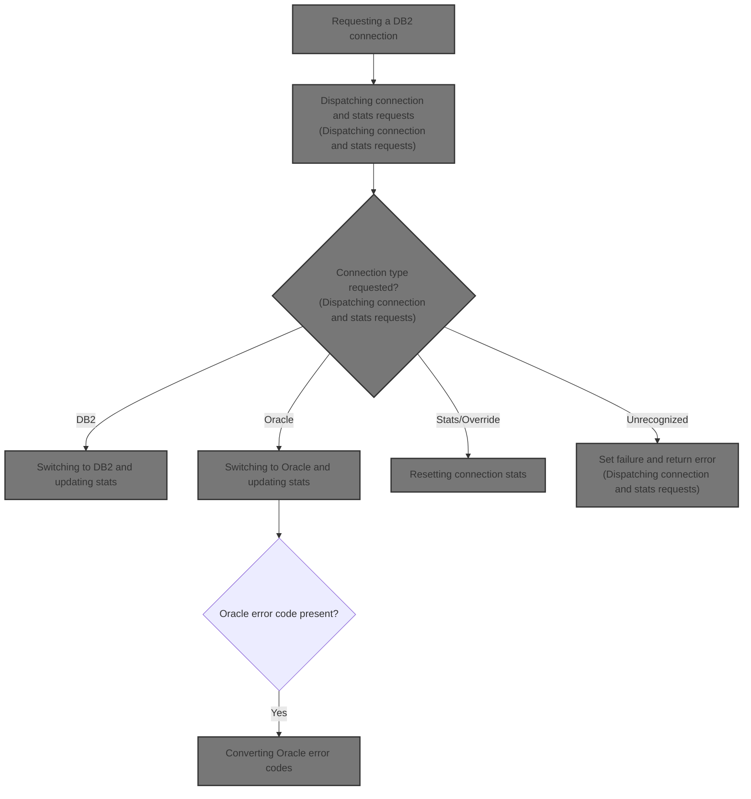
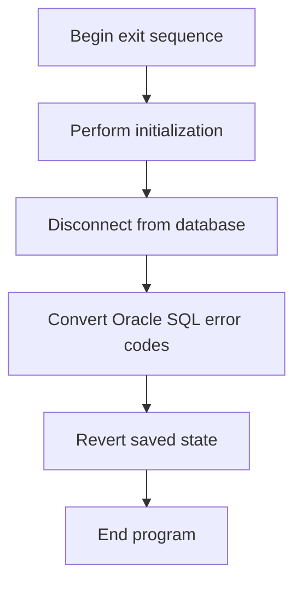
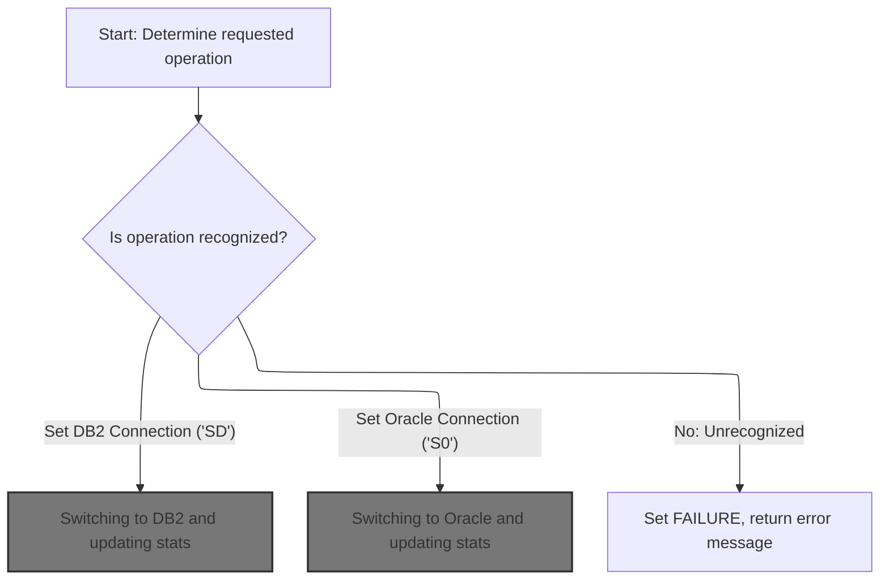
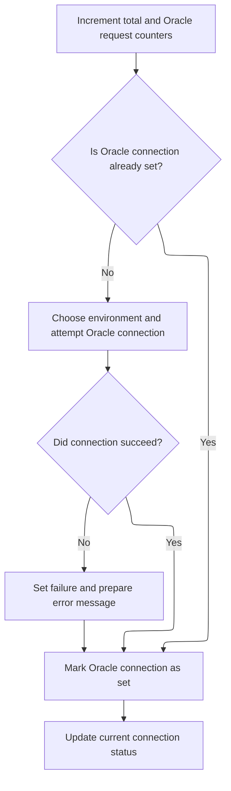
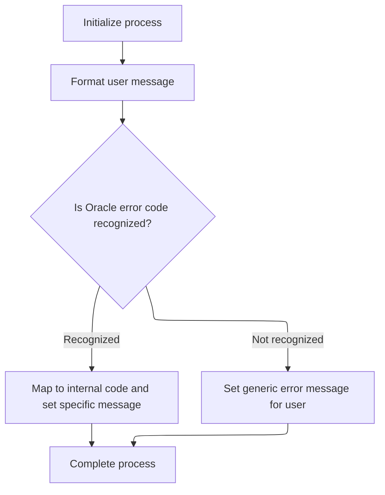

# Overview

This document explains the flow of managing database connections and error handling for business programs. The flow ensures reliable switching between <SwmToken path="base/src/YYYS0211.cbl" pos="34:10:10" line-data="004900     PERFORM 200-CONNECT-TO-DB2                                   00004900">`DB2`</SwmToken> and Oracle, standardized error code conversion, and accurate connection statistics for reporting and downstream logic.



## Dependencies

### Programs

- <SwmToken path="base/src/YYYS0211.cbl" pos="2:7:7" line-data="000200 PROGRAM-ID.    YYYS0211.                                         00000200">`YYYS0211`</SwmToken> (<SwmPath>[base/src/YYYS0211.cbl](base/src/YYYS0211.cbl)</SwmPath>)
- <SwmToken path="base/src/YYYS0211.cbl" pos="55:4:4" line-data="007500     CALL YYYS0220-DBMS-CON-MGR USING                             00007500">`YYYS0220`</SwmToken> (<SwmPath>[base/src/YYYS0220.cbl](base/src/YYYS0220.cbl)</SwmPath>)
- <SwmToken path="base/src/YYYS0212.cbl" pos="96:9:9" line-data="010300         STRING &#39;Error in YYYS0212. Oracle code:&#39;                 00010300">`YYYS0212`</SwmToken> (<SwmPath>[base/src/YYYS0212.cbl](base/src/YYYS0212.cbl)</SwmPath>)

### Copybooks

- SQLCA
- <SwmToken path="base/src/YYYS0211.cbl" pos="36:10:10" line-data="005100     PERFORM 400-REVERT-SAVED-XXXN001A                            00005100">`XXXN001A`</SwmToken> (<SwmPath>[base/src/XXXN001A.cpy](base/src/XXXN001A.cpy)</SwmPath>)
- <SwmToken path="base/src/YYYS0211.cbl" pos="54:4:4" line-data="007400     SET YYYC0220-SET-DB2-CON TO TRUE                             00007400">`YYYC0220`</SwmToken> (<SwmPath>[base/src/YYYC0220.cpy](base/src/YYYC0220.cpy)</SwmPath>)
- <SwmToken path="base/src/YYYS0211.cbl" pos="15:4:4" line-data="003100 COPY YYYN000A.                                                   00003100">`YYYN000A`</SwmToken> (<SwmPath>[base/src/YYYN000A.cpy](base/src/YYYN000A.cpy)</SwmPath>)

# Where is this program used?

This program is used multiple times in the codebase as represented in the following diagram:

```mermaid
graph TD
  j2a7l("Retrieving Store Details (NNNS0120)") --> 8qfms("Database Connection and Oracle SQL Error Handling (YYYS0211)"):::currentEntity
click j2a7l openCode "base/src/NNNS0120.cbl:1"
y83yi("Database Operation Handler (WWWS0003)") --> 8qfms("Database Connection and Oracle SQL Error Handling (YYYS0211)"):::currentEntity
click y83yi openCode "base/src/WWWS0003.cbl:1"
0legr("Table IO Object for Location Class Advertisement Zones (NNNS0473)") --> 8qfms("Database Connection and Oracle SQL Error Handling (YYYS0211)"):::currentEntity
click 0legr openCode "base/src/NNNS0473.cbl:1"
14cbq("Table IO Object for Department Data (NNNS0573)") --> 8qfms("Database Connection and Oracle SQL Error Handling (YYYS0211)"):::currentEntity
click 14cbq openCode "base/src/NNNS0573.cbl:1"
256lb("Validating Vendor and Entity Classification (MMMS0711)") --> 8qfms("Database Connection and Oracle SQL Error Handling (YYYS0211)"):::currentEntity
click 256lb openCode "base/src/MMMS0711.cbl:1"
zd0iu("Managing Location Data (NNNS0487)") --> 8qfms("Database Connection and Oracle SQL Error Handling (YYYS0211)"):::currentEntity
click zd0iu openCode "base/src/NNNS0487.cbl:1"
ng1oh("Retail Location Data Processing (NNNS0488)") --> 8qfms("Database Connection and Oracle SQL Error Handling (YYYS0211)"):::currentEntity
click ng1oh openCode "base/src/NNNS0488.cbl:1"
73u2c("Enabling Referential Integrity for Vendor Locations (MMMS0335)") --> 8qfms("Database Connection and Oracle SQL Error Handling (YYYS0211)"):::currentEntity
click 73u2c openCode "base/src/MMMS0335.cbl:1"
  
  
click 8qfms openCode "base/src/YYYS0211.cbl:1"
    classDef currentEntity color:#000000,fill:#7CB9F4

%% Swimm:
%% graph TD
%%   j2a7l("Retrieving Store Details (NNNS0120)") --> 8qfms("Database Connection and Oracle SQL Error Handling (<SwmToken path="base/src/YYYS0211.cbl" pos="2:7:7" line-data="000200 PROGRAM-ID.    YYYS0211.                                         00000200">`YYYS0211`</SwmToken>)"):::currentEntity
%% click j2a7l openCode "<SwmPath>[base/src/NNNS0120.cbl](base/src/NNNS0120.cbl)</SwmPath>:1"
%% y83yi("Database Operation Handler (WWWS0003)") --> 8qfms("Database Connection and Oracle SQL Error Handling (<SwmToken path="base/src/YYYS0211.cbl" pos="2:7:7" line-data="000200 PROGRAM-ID.    YYYS0211.                                         00000200">`YYYS0211`</SwmToken>)"):::currentEntity
%% click y83yi openCode "<SwmPath>[base/src/WWWS0003.cbl](base/src/WWWS0003.cbl)</SwmPath>:1"
%% 0legr("Table IO Object for Location Class Advertisement Zones (NNNS0473)") --> 8qfms("Database Connection and Oracle SQL Error Handling (<SwmToken path="base/src/YYYS0211.cbl" pos="2:7:7" line-data="000200 PROGRAM-ID.    YYYS0211.                                         00000200">`YYYS0211`</SwmToken>)"):::currentEntity
%% click 0legr openCode "<SwmPath>[base/src/NNNS0473.cbl](base/src/NNNS0473.cbl)</SwmPath>:1"
%% 14cbq("Table IO Object for Department Data (NNNS0573)") --> 8qfms("Database Connection and Oracle SQL Error Handling (<SwmToken path="base/src/YYYS0211.cbl" pos="2:7:7" line-data="000200 PROGRAM-ID.    YYYS0211.                                         00000200">`YYYS0211`</SwmToken>)"):::currentEntity
%% click 14cbq openCode "<SwmPath>[base/src/NNNS0573.cbl](base/src/NNNS0573.cbl)</SwmPath>:1"
%% 256lb("Validating Vendor and Entity Classification (MMMS0711)") --> 8qfms("Database Connection and Oracle SQL Error Handling (<SwmToken path="base/src/YYYS0211.cbl" pos="2:7:7" line-data="000200 PROGRAM-ID.    YYYS0211.                                         00000200">`YYYS0211`</SwmToken>)"):::currentEntity
%% click 256lb openCode "<SwmPath>[base/src/MMMS0711.cbl](base/src/MMMS0711.cbl)</SwmPath>:1"
%% zd0iu("Managing Location Data (NNNS0487)") --> 8qfms("Database Connection and Oracle SQL Error Handling (<SwmToken path="base/src/YYYS0211.cbl" pos="2:7:7" line-data="000200 PROGRAM-ID.    YYYS0211.                                         00000200">`YYYS0211`</SwmToken>)"):::currentEntity
%% click zd0iu openCode "<SwmPath>[base/src/NNNS0487.cbl](base/src/NNNS0487.cbl)</SwmPath>:1"
%% ng1oh("Retail Location Data Processing (NNNS0488)") --> 8qfms("Database Connection and Oracle SQL Error Handling (<SwmToken path="base/src/YYYS0211.cbl" pos="2:7:7" line-data="000200 PROGRAM-ID.    YYYS0211.                                         00000200">`YYYS0211`</SwmToken>)"):::currentEntity
%% click ng1oh openCode "<SwmPath>[base/src/NNNS0488.cbl](base/src/NNNS0488.cbl)</SwmPath>:1"
%% 73u2c("Enabling Referential Integrity for Vendor Locations (MMMS0335)") --> 8qfms("Database Connection and Oracle SQL Error Handling (<SwmToken path="base/src/YYYS0211.cbl" pos="2:7:7" line-data="000200 PROGRAM-ID.    YYYS0211.                                         00000200">`YYYS0211`</SwmToken>)"):::currentEntity
%% click 73u2c openCode "<SwmPath>[base/src/MMMS0335.cbl](base/src/MMMS0335.cbl)</SwmPath>:1"
%%   
%%   
%% click 8qfms openCode "<SwmPath>[base/src/YYYS0211.cbl](base/src/YYYS0211.cbl)</SwmPath>:1"
%%     classDef currentEntity color:#000000,fill:#7CB9F4
```



## Detailed View of the Program's Functionality

## Starting the Connection and Error Handling Sequence

The main program begins by preparing for an exit sequence. It first performs initialization, which sets up the working area and resets any necessary data. Next, it initiates a disconnect from the database by requesting a switch to the <SwmToken path="base/src/YYYS0211.cbl" pos="34:10:10" line-data="004900     PERFORM 200-CONNECT-TO-DB2                                   00004900">`DB2`</SwmToken> database system. This is done to ensure that any further operations are performed against <SwmToken path="base/src/YYYS0211.cbl" pos="34:10:10" line-data="004900     PERFORM 200-CONNECT-TO-DB2                                   00004900">`DB2`</SwmToken>, rather than a leftover connection from a previous run.

After requesting the <SwmToken path="base/src/YYYS0211.cbl" pos="34:10:10" line-data="004900     PERFORM 200-CONNECT-TO-DB2                                   00004900">`DB2`</SwmToken> connection, the program checks for any Oracle SQL error codes that may need conversion. If a specific Oracle error code is detected after a successful operation, it calls a dedicated conversion routine to map the Oracle error code to an internal format that the system understands.

Finally, before ending, the program restores the previously saved business record to its original state, ensuring that any changes made during the process do not persist unintentionally. The program then exits cleanly.

---

## Requesting a <SwmToken path="base/src/YYYS0211.cbl" pos="34:10:10" line-data="004900     PERFORM 200-CONNECT-TO-DB2                                   00004900">`DB2`</SwmToken> Connection

To switch to the <SwmToken path="base/src/YYYS0211.cbl" pos="34:10:10" line-data="004900     PERFORM 200-CONNECT-TO-DB2                                   00004900">`DB2`</SwmToken> database, the program sets a flag indicating that a <SwmToken path="base/src/YYYS0211.cbl" pos="34:10:10" line-data="004900     PERFORM 200-CONNECT-TO-DB2                                   00004900">`DB2`</SwmToken> connection is required. It then calls a connection manager subprogram, passing along the necessary data structures. This subprogram is responsible for handling the actual logic of switching the database connection, abstracting away the details from the main program.

---

## Dispatching Connection and Stats Requests

Within the connection manager subprogram, the flow begins by determining which operation has been requested. The program evaluates the request and routes it to the appropriate handler:

- If the request is to get the current connection, it retrieves and reports the current database connection type.
- If the request is to set the connection to <SwmToken path="base/src/YYYS0211.cbl" pos="34:10:10" line-data="004900     PERFORM 200-CONNECT-TO-DB2                                   00004900">`DB2`</SwmToken>, it initiates the logic to switch to <SwmToken path="base/src/YYYS0211.cbl" pos="34:10:10" line-data="004900     PERFORM 200-CONNECT-TO-DB2                                   00004900">`DB2`</SwmToken>.
- If the request is to set the connection to Oracle, it initiates the logic to switch to Oracle.
- If the request is to get or set statistics, it handles those accordingly.
- If the request is to override the connection type, it processes the override.
- If the request is not recognized, it sets a failure flag and returns an error message indicating that the function is not recognized.

After handling the request, the subprogram exits.

---

## Switching to <SwmToken path="base/src/YYYS0211.cbl" pos="34:10:10" line-data="004900     PERFORM 200-CONNECT-TO-DB2                                   00004900">`DB2`</SwmToken> and Updating Stats

When switching to <SwmToken path="base/src/YYYS0211.cbl" pos="34:10:10" line-data="004900     PERFORM 200-CONNECT-TO-DB2                                   00004900">`DB2`</SwmToken>, the program first increments counters that track the total number of requests and the number of <SwmToken path="base/src/YYYS0211.cbl" pos="34:10:10" line-data="004900     PERFORM 200-CONNECT-TO-DB2                                   00004900">`DB2`</SwmToken> requests. It then checks if the current connection is either Oracle or the default (no connection). If so, it proceeds to switch the connection to <SwmToken path="base/src/YYYS0211.cbl" pos="34:10:10" line-data="004900     PERFORM 200-CONNECT-TO-DB2                                   00004900">`DB2`</SwmToken>.

The environment is checked to determine whether the connection should be made to the production or test <SwmToken path="base/src/YYYS0211.cbl" pos="34:10:10" line-data="004900     PERFORM 200-CONNECT-TO-DB2                                   00004900">`DB2`</SwmToken> database. The appropriate connection command is executed based on this environment flag.

After attempting the connection, the program checks if the connection was successful. If it was, it marks <SwmToken path="base/src/YYYS0211.cbl" pos="34:10:10" line-data="004900     PERFORM 200-CONNECT-TO-DB2                                   00004900">`DB2`</SwmToken> as the active connection and updates the current connection context for reporting. If the connection failed, it sets a failure flag and constructs an error message that includes the SQL error code.

---

## Switching to Oracle and Updating Stats

When switching to Oracle, the program increments counters for total requests and Oracle requests. It checks if the Oracle connection is not already set. If not, it proceeds to switch the connection to Oracle.

The environment is checked to determine which Oracle database to connect to (production, test, or one of several test environments). The appropriate connection command is executed based on the environment flag.

After attempting the connection, the program checks if the connection was successful. If it was, it marks Oracle as the active connection and updates the current connection context for reporting. If the connection failed, it sets a failure flag and constructs an error message that includes the SQL error code.

---

## Resetting Connection Stats

To reset connection statistics, the program initializes the statistics structures for both workspace and output. This sets all counters and tracking variables back to zero, ensuring a clean slate for future operations.

If an override request is made to change the current connection type externally, the program increments the override request counter and checks which override flag is set. If the override is for <SwmToken path="base/src/YYYS0211.cbl" pos="34:10:10" line-data="004900     PERFORM 200-CONNECT-TO-DB2                                   00004900">`DB2`</SwmToken> and the <SwmToken path="base/src/YYYS0211.cbl" pos="34:10:10" line-data="004900     PERFORM 200-CONNECT-TO-DB2                                   00004900">`DB2`</SwmToken> connection is not already set, it sets the <SwmToken path="base/src/YYYS0211.cbl" pos="34:10:10" line-data="004900     PERFORM 200-CONNECT-TO-DB2                                   00004900">`DB2`</SwmToken> connection and increments the override switch counter. If the override is for Oracle and the Oracle connection is not already set, it sets the Oracle connection and increments the override switch counter. If the input is invalid, it sets a failure flag and returns an error message indicating an invalid override connection.

---

## Converting Oracle Error Codes

After a successful operation, if a specific Oracle error code is detected, the program calls a conversion routine. This routine is responsible for mapping the Oracle error code to an internal format that the system understands, ensuring consistent error handling across different database systems.

---

## Formatting Oracle Error Messages

The error conversion routine begins by initializing its process, resetting error fields to ensure a clean state. It then formats the user message by splitting the Oracle error string into parts, extracting the Oracle error code.

The program checks if the Oracle error code is recognized. If it is, the code is mapped to a corresponding internal SQL error code, and a specific message is set for the user or system. If the error code is not recognized, a generic error message is constructed for the user, indicating the Oracle code that was encountered.

After formatting the message, the process is completed, and the routine exits. This ensures that any Oracle errors are presented in a consistent and understandable format for users and systems interacting with the program.

# Rule Definition

| Paragraph Name                                                                                                                                                                                                                                                                                                                                                                                                                                                                                                                                                                                                                                                                                                 | Rule ID | Category          | Description                                                                                                                                                                                                                                                                                                                                                                                                                                                                                                                                                                                                                                                                                                                                                                                                                                                                               | Conditions                                                                                                                                                                                                                  | Remarks                                                                                                                                                                                                                                                                                                                                                                                                                                                                                                                                                                                                                                                                                                                                                                                                                                                                                                                                                  |
| -------------------------------------------------------------------------------------------------------------------------------------------------------------------------------------------------------------------------------------------------------------------------------------------------------------------------------------------------------------------------------------------------------------------------------------------------------------------------------------------------------------------------------------------------------------------------------------------------------------------------------------------------------------------------------------------------------------- | ------- | ----------------- | ----------------------------------------------------------------------------------------------------------------------------------------------------------------------------------------------------------------------------------------------------------------------------------------------------------------------------------------------------------------------------------------------------------------------------------------------------------------------------------------------------------------------------------------------------------------------------------------------------------------------------------------------------------------------------------------------------------------------------------------------------------------------------------------------------------------------------------------------------------------------------------------- | --------------------------------------------------------------------------------------------------------------------------------------------------------------------------------------------------------------------------- | -------------------------------------------------------------------------------------------------------------------------------------------------------------------------------------------------------------------------------------------------------------------------------------------------------------------------------------------------------------------------------------------------------------------------------------------------------------------------------------------------------------------------------------------------------------------------------------------------------------------------------------------------------------------------------------------------------------------------------------------------------------------------------------------------------------------------------------------------------------------------------------------------------------------------------------------------------- |
| <SwmToken path="base/src/YYYS0211.cbl" pos="33:4:6" line-data="004800     PERFORM 100-INITIALIZATION                                   00004800">`100-INITIALIZATION`</SwmToken> in <SwmPath>[base/src/YYYS0211.cbl](base/src/YYYS0211.cbl)</SwmPath>, <SwmToken path="base/src/YYYS0211.cbl" pos="33:4:6" line-data="004800     PERFORM 100-INITIALIZATION                                   00004800">`100-INITIALIZATION`</SwmToken> in <SwmPath>[base/src/YYYS0220.cbl](base/src/YYYS0220.cbl)</SwmPath>                                                                                                                                                                                                   | RL-001  | Data Assignment   | Before beginning the exit sequence, the system must initialize the working area and saved state to ensure a clean environment for subsequent operations.                                                                                                                                                                                                                                                                                                                                                                                                                                                                                                                                                                                                                                                                                                                                  | Triggered at the start of the exit dispatcher sequence.                                                                                                                                                                     | No specific constants; initialization involves clearing or setting to default values all relevant working storage and linkage areas.                                                                                                                                                                                                                                                                                                                                                                                                                                                                                                                                                                                                                                                                                                                                                                                                                     |
| Not explicitly shown in provided code, but implied by connection management logic in <SwmPath>[base/src/YYYS0220.cbl](base/src/YYYS0220.cbl)</SwmPath>                                                                                                                                                                                                                                                                                                                                                                                                                                                                                                                                                         | RL-002  | Computation       | The system must ensure that any active database connections are properly disconnected before the program terminates.                                                                                                                                                                                                                                                                                                                                                                                                                                                                                                                                                                                                                                                                                                                                                                      | Before program termination, if a database connection is active.                                                                                                                                                             | Connection types: 'D' for <SwmToken path="base/src/YYYS0211.cbl" pos="34:10:10" line-data="004900     PERFORM 200-CONNECT-TO-DB2                                   00004900">`DB2`</SwmToken>, '0' for Oracle, ' ' for default.                                                                                                                                                                                                                                                                                                                                                                                                                                                                                                                                                                                                                                                                                                                          |
| <SwmToken path="base/src/YYYS0212.cbl" pos="31:4:12" line-data="004000     PERFORM 200-FORMAT-USER-MSG-TXT                              00004000">`200-FORMAT-USER-MSG-TXT`</SwmToken> in <SwmPath>[base/src/YYYS0212.cbl](base/src/YYYS0212.cbl)</SwmPath>, <SwmToken path="base/src/YYYS0211.cbl" pos="35:4:10" line-data="005000     PERFORM 300-CNV-ORACLE-SQLCODE                               00005000">`300-CNV-ORACLE-SQLCODE`</SwmToken> in <SwmPath>[base/src/YYYS0211.cbl](base/src/YYYS0211.cbl)</SwmPath>                                                                                                                                                                                        | RL-003  | Computation       | If an Oracle error is detected after a database operation, the system must convert the Oracle SQL error code to an internal SQLCODE value and build a user message.                                                                                                                                                                                                                                                                                                                                                                                                                                                                                                                                                                                                                                                                                                                       | Triggered when SQLCODE = -84 and SUCCESS is true after a database operation.                                                                                                                                                | Oracle error codes are mapped to specific internal SQLCODE values. If not recognized, a generic error message is built. Output message fields: <SwmToken path="base/src/YYYS0220.cbl" pos="75:4:10" line-data="008400           TO IS-RTRN-MSG-TXT                                     00008400">`IS-RTRN-MSG-TXT`</SwmToken> or <SwmToken path="base/src/YYYS0212.cbl" pos="98:10:16" line-data="010300         DELIMITED BY SIZE INTO IS-RTRN-MSG2-TXT                  00010330">`IS-RTRN-MSG2-TXT`</SwmToken>, up to 100 characters.                                                                                                                                                                                                                                                                                                                                                                                                                 |
| <SwmToken path="base/src/YYYS0211.cbl" pos="36:4:10" line-data="005100     PERFORM 400-REVERT-SAVED-XXXN001A                            00005100">`400-REVERT-SAVED-XXXN001A`</SwmToken> in <SwmPath>[base/src/YYYS0211.cbl](base/src/YYYS0211.cbl)</SwmPath>                                                                                                                                                                                                                                                                                                                                                                                                                                                  | RL-004  | Data Assignment   | Before exiting, the system must revert any saved business record state to ensure the input area is restored to its original state.                                                                                                                                                                                                                                                                                                                                                                                                                                                                                                                                                                                                                                                                                                                                                        | Triggered before program exit.                                                                                                                                                                                              | No constants; involves copying the saved area back to the input area.                                                                                                                                                                                                                                                                                                                                                                                                                                                                                                                                                                                                                                                                                                                                                                                                                                                                                    |
| <SwmToken path="base/src/YYYS0211.cbl" pos="32:2:6" line-data="004700 0000-EXIT-DISPATCHER.                                            00004700">`0000-EXIT-DISPATCHER`</SwmToken> in <SwmPath>[base/src/YYYS0220.cbl](base/src/YYYS0220.cbl)</SwmPath>                                                                                                                                                                                                                                                                                                                                                                                                                                                        | RL-005  | Conditional Logic | The connection manager evaluates flags in the <SwmToken path="base/src/YYYS0211.cbl" pos="54:4:4" line-data="007400     SET YYYC0220-SET-DB2-CON TO TRUE                             00007400">`YYYC0220`</SwmToken> structure to determine which operation to perform: <SwmToken path="base/src/YYYS0211.cbl" pos="34:10:10" line-data="004900     PERFORM 200-CONNECT-TO-DB2                                   00004900">`DB2`</SwmToken> connection, Oracle connection, stats reset, stats reporting, or override connection.                                                                                                                                                                                                                                                                                                                                                          | Triggered when the program is called with <SwmToken path="base/src/YYYS0211.cbl" pos="54:4:4" line-data="007400     SET YYYC0220-SET-DB2-CON TO TRUE                             00007400">`YYYC0220`</SwmToken> flags set. | Flags include <SwmToken path="base/src/YYYS0211.cbl" pos="54:4:10" line-data="007400     SET YYYC0220-SET-DB2-CON TO TRUE                             00007400">`YYYC0220-SET-DB2-CON`</SwmToken>, <SwmToken path="base/src/YYYS0220.cbl" pos="64:4:10" line-data="007300       WHEN YYYC0220-SET-ORACLE-CON                               00007300">`YYYC0220-SET-ORACLE-CON`</SwmToken>, <SwmToken path="base/src/YYYS0220.cbl" pos="66:4:8" line-data="007500       WHEN YYYC0220-GET-STATS                                    00007500">`YYYC0220-GET-STATS`</SwmToken>, <SwmToken path="base/src/YYYS0220.cbl" pos="68:4:8" line-data="007700       WHEN YYYC0220-SET-STATS                                    00007700">`YYYC0220-SET-STATS`</SwmToken>, <SwmToken path="base/src/YYYS0220.cbl" pos="70:4:10" line-data="007900       WHEN YYYC0220-SET-OVERRIDE-CON                             00007900">`YYYC0220-SET-OVERRIDE-CON`</SwmToken>. |
| <SwmToken path="base/src/YYYS0220.cbl" pos="63:4:10" line-data="007200         PERFORM 300-SET-DB2-CON                                  00007200">`300-SET-DB2-CON`</SwmToken>, <SwmToken path="base/src/YYYS0220.cbl" pos="111:4:12" line-data="012000       PERFORM 310-DO-SET-DB2-CON                                 00012000">`310-DO-SET-DB2-CON`</SwmToken> in <SwmPath>[base/src/YYYS0220.cbl](base/src/YYYS0220.cbl)</SwmPath>                                                                                                                                                                                                                                                                        | RL-006  | Conditional Logic | When a <SwmToken path="base/src/YYYS0211.cbl" pos="34:10:10" line-data="004900     PERFORM 200-CONNECT-TO-DB2                                   00004900">`DB2`</SwmToken> connection is requested, increment total and <SwmToken path="base/src/YYYS0211.cbl" pos="34:10:10" line-data="004900     PERFORM 200-CONNECT-TO-DB2                                   00004900">`DB2`</SwmToken> request counters, check if current connection is Oracle or default, and switch to <SwmToken path="base/src/YYYS0211.cbl" pos="34:10:10" line-data="004900     PERFORM 200-CONNECT-TO-DB2                                   00004900">`DB2`</SwmToken> if necessary. Use environment flag to determine <SwmToken path="base/src/YYYS0211.cbl" pos="34:10:10" line-data="004900     PERFORM 200-CONNECT-TO-DB2                                   00004900">`DB2`</SwmToken> Production or Test. | <SwmToken path="base/src/YYYS0211.cbl" pos="54:4:10" line-data="007400     SET YYYC0220-SET-DB2-CON TO TRUE                             00007400">`YYYC0220-SET-DB2-CON`</SwmToken> is true.                                | Environment flags: 'P' for Production, others for Test. Connection types: 'D' for <SwmToken path="base/src/YYYS0211.cbl" pos="34:10:10" line-data="004900     PERFORM 200-CONNECT-TO-DB2                                   00004900">`DB2`</SwmToken>, '0' for Oracle, ' ' for default.                                                                                                                                                                                                                                                                                                                                                                                                                                                                                                                                                                                                                                                                  |
| <SwmToken path="base/src/YYYS0220.cbl" pos="65:4:10" line-data="007400         PERFORM 400-SET-ORACLE-CON                               00007400">`400-SET-ORACLE-CON`</SwmToken>, <SwmToken path="base/src/YYYS0220.cbl" pos="155:4:12" line-data="016400       PERFORM 410-DO-SET-ORACLE-CON                              00016400">`410-DO-SET-ORACLE-CON`</SwmToken> in <SwmPath>[base/src/YYYS0220.cbl](base/src/YYYS0220.cbl)</SwmPath>                                                                                                                                                                                                                                                                  | RL-007  | Conditional Logic | When an Oracle connection is requested, increment total and Oracle request counters, check if current connection is not already Oracle, and switch to Oracle if necessary. Use environment flag to determine which Oracle database to connect to.                                                                                                                                                                                                                                                                                                                                                                                                                                                                                                                                                                                                                                         | <SwmToken path="base/src/YYYS0220.cbl" pos="64:4:10" line-data="007300       WHEN YYYC0220-SET-ORACLE-CON                               00007300">`YYYC0220-SET-ORACLE-CON`</SwmToken> is true.                             | Environment flags: 'P', 'T', '6', '5', '4', '3' select different Oracle databases. Connection types: 'D' for <SwmToken path="base/src/YYYS0211.cbl" pos="34:10:10" line-data="004900     PERFORM 200-CONNECT-TO-DB2                                   00004900">`DB2`</SwmToken>, '0' for Oracle, ' ' for default.                                                                                                                                                                                                                                                                                                                                                                                                                                                                                                                                                                                                                                       |
| <SwmToken path="base/src/YYYS0220.cbl" pos="111:4:12" line-data="012000       PERFORM 310-DO-SET-DB2-CON                                 00012000">`310-DO-SET-DB2-CON`</SwmToken>, <SwmToken path="base/src/YYYS0220.cbl" pos="155:4:12" line-data="016400       PERFORM 410-DO-SET-ORACLE-CON                              00016400">`410-DO-SET-ORACLE-CON`</SwmToken> in <SwmPath>[base/src/YYYS0220.cbl](base/src/YYYS0220.cbl)</SwmPath>                                                                                                                                                                                                                                                                 | RL-008  | Conditional Logic | If a connection attempt fails, set the failure flag and populate the error message field in the output structure with a descriptive message including the SQLCODE.                                                                                                                                                                                                                                                                                                                                                                                                                                                                                                                                                                                                                                                                                                                        | SQLCODE is not zero after a connection attempt.                                                                                                                                                                             | Output field: <SwmToken path="base/src/YYYS0220.cbl" pos="75:4:10" line-data="008400           TO IS-RTRN-MSG-TXT                                     00008400">`IS-RTRN-MSG-TXT`</SwmToken>, up to 100 characters. Failure flag is set.                                                                                                                                                                                                                                                                                                                                                                                                                                                                                                                                                                                                                                                                                                                 |
| <SwmToken path="base/src/YYYS0220.cbl" pos="69:4:8" line-data="007800         PERFORM 600-SET-STATS                                    00007800">`600-SET-STATS`</SwmToken> in <SwmPath>[base/src/YYYS0220.cbl](base/src/YYYS0220.cbl)</SwmPath>                                                                                                                                                                                                                                                                                                                                                                                                                                                               | RL-009  | Data Assignment   | When stats are reset, initialize all counters in the workspace and output structure to zero.                                                                                                                                                                                                                                                                                                                                                                                                                                                                                                                                                                                                                                                                                                                                                                                              | <SwmToken path="base/src/YYYS0220.cbl" pos="68:4:8" line-data="007700       WHEN YYYC0220-SET-STATS                                    00007700">`YYYC0220-SET-STATS`</SwmToken> is true.                                   | All stats fields are set to zero.                                                                                                                                                                                                                                                                                                                                                                                                                                                                                                                                                                                                                                                                                                                                                                                                                                                                                                                        |
| <SwmToken path="base/src/YYYS0220.cbl" pos="71:4:10" line-data="008000         PERFORM 700-SET-OVERRIDE-CON                             00008000">`700-SET-OVERRIDE-CON`</SwmToken> in <SwmPath>[base/src/YYYS0220.cbl](base/src/YYYS0220.cbl)</SwmPath>                                                                                                                                                                                                                                                                                                                                                                                                                                                       | RL-010  | Conditional Logic | When an override connection is requested, increment the override request counter, check which override flag is set, and set the corresponding connection flag and counter. If the override input is invalid, set the failure flag and populate the error message field.                                                                                                                                                                                                                                                                                                                                                                                                                                                                                                                                                                                                                   | <SwmToken path="base/src/YYYS0220.cbl" pos="70:4:10" line-data="007900       WHEN YYYC0220-SET-OVERRIDE-CON                             00007900">`YYYC0220-SET-OVERRIDE-CON`</SwmToken> is true.                           | Error message: '<SwmToken path="base/src/YYYS0211.cbl" pos="55:4:4" line-data="007500     CALL YYYS0220-DBMS-CON-MGR USING                             00007500">`YYYS0220`</SwmToken> - Invalid <SwmToken path="base/src/YYYS0220.cbl" pos="255:11:13" line-data="026400         MOVE &#39;YYYS0220 - Invalid over-ride connection!&#39;          00026400">`over-ride`</SwmToken> connection!' if input is invalid. Output field: <SwmToken path="base/src/YYYS0220.cbl" pos="75:4:10" line-data="008400           TO IS-RTRN-MSG-TXT                                     00008400">`IS-RTRN-MSG-TXT`</SwmToken>, up to 100 characters.                                                                                                                                                                                                                                                                                                                |
| <SwmToken path="base/src/YYYS0212.cbl" pos="31:4:12" line-data="004000     PERFORM 200-FORMAT-USER-MSG-TXT                              00004000">`200-FORMAT-USER-MSG-TXT`</SwmToken> in <SwmPath>[base/src/YYYS0212.cbl](base/src/YYYS0212.cbl)</SwmPath>                                                                                                                                                                                                                                                                                                                                                                                                                                                    | RL-011  | Computation       | The error conversion routine parses the Oracle error string, maps recognized Oracle error codes to internal SQLCODE values, and builds a specific message for recognized codes. If the code is not recognized, a generic error message is built.                                                                                                                                                                                                                                                                                                                                                                                                                                                                                                                                                                                                                                          | Whenever an Oracle error string is present.                                                                                                                                                                                 | Oracle error codes are mapped to specific internal SQLCODE values. Output message fields: <SwmToken path="base/src/YYYS0212.cbl" pos="98:10:16" line-data="010300         DELIMITED BY SIZE INTO IS-RTRN-MSG2-TXT                  00010330">`IS-RTRN-MSG2-TXT`</SwmToken>, up to 100 characters.                                                                                                                                                                                                                                                                                                                                                                                                                                                                                                                                                                                                                                                        |
| <SwmToken path="base/src/YYYS0212.cbl" pos="31:4:12" line-data="004000     PERFORM 200-FORMAT-USER-MSG-TXT                              00004000">`200-FORMAT-USER-MSG-TXT`</SwmToken> in <SwmPath>[base/src/YYYS0212.cbl](base/src/YYYS0212.cbl)</SwmPath>, <SwmToken path="base/src/YYYS0220.cbl" pos="111:4:12" line-data="012000       PERFORM 310-DO-SET-DB2-CON                                 00012000">`310-DO-SET-DB2-CON`</SwmToken> and <SwmToken path="base/src/YYYS0220.cbl" pos="155:4:12" line-data="016400       PERFORM 410-DO-SET-ORACLE-CON                              00016400">`410-DO-SET-ORACLE-CON`</SwmToken> in <SwmPath>[base/src/YYYS0220.cbl](base/src/YYYS0220.cbl)</SwmPath> | RL-012  | Computation       | All error messages must be returned in the <SwmToken path="base/src/YYYS0220.cbl" pos="75:4:10" line-data="008400           TO IS-RTRN-MSG-TXT                                     00008400">`IS-RTRN-MSG-TXT`</SwmToken> or <SwmToken path="base/src/YYYS0212.cbl" pos="98:10:16" line-data="010300         DELIMITED BY SIZE INTO IS-RTRN-MSG2-TXT                  00010330">`IS-RTRN-MSG2-TXT`</SwmToken> fields, up to 100 characters.                                                                                                                                                                                                                                                                                                                                                                                                                                               | Whenever an error message is generated.                                                                                                                                                                                     | Output fields: <SwmToken path="base/src/YYYS0220.cbl" pos="75:4:10" line-data="008400           TO IS-RTRN-MSG-TXT                                     00008400">`IS-RTRN-MSG-TXT`</SwmToken>, <SwmToken path="base/src/YYYS0212.cbl" pos="98:10:16" line-data="010300         DELIMITED BY SIZE INTO IS-RTRN-MSG2-TXT                  00010330">`IS-RTRN-MSG2-TXT`</SwmToken>. Maximum length: 100 characters.                                                                                                                                                                                                                                                                                                                                                                                                                                                                                                                                         |
| <SwmToken path="base/src/YYYS0220.cbl" pos="111:4:12" line-data="012000       PERFORM 310-DO-SET-DB2-CON                                 00012000">`310-DO-SET-DB2-CON`</SwmToken>, <SwmToken path="base/src/YYYS0220.cbl" pos="155:4:12" line-data="016400       PERFORM 410-DO-SET-ORACLE-CON                              00016400">`410-DO-SET-ORACLE-CON`</SwmToken> in <SwmPath>[base/src/YYYS0220.cbl](base/src/YYYS0220.cbl)</SwmPath>                                                                                                                                                                                                                                                                 | RL-013  | Computation       | When a connection switch is performed, increment the connection switch counter and update the current connection type in the output structure.                                                                                                                                                                                                                                                                                                                                                                                                                                                                                                                                                                                                                                                                                                                                            | Whenever a connection switch occurs.                                                                                                                                                                                        | The connection switch counter is incremented. The current connection type is updated in the output structure, which is used by the caller to determine the active database connection. No COBOL variable names are referenced; only their purposes are described.                                                                                                                                                                                                                                                                                                                                                                                                                                                                                                                                                                                                                                                                                        |

# User Stories

## User Story 1: System initialization, exit cleanup, and database disconnection

---

### Story Description:

As a system, I want to initialize the working area and saved state before beginning the exit sequence, revert any saved business record state before program exit, and disconnect from any active database connections before program termination so that the environment is clean, the input area is restored, and resources are properly released.

---

### Business Rule Mapping:

| Rule ID | Paragraph Name                                                                                                                                                                                                                                                                                                                                                                                                                                                                                               | Rule Description                                                                                                                                         |
| ------- | ------------------------------------------------------------------------------------------------------------------------------------------------------------------------------------------------------------------------------------------------------------------------------------------------------------------------------------------------------------------------------------------------------------------------------------------------------------------------------------------------------------ | -------------------------------------------------------------------------------------------------------------------------------------------------------- |
| RL-001  | <SwmToken path="base/src/YYYS0211.cbl" pos="33:4:6" line-data="004800     PERFORM 100-INITIALIZATION                                   00004800">`100-INITIALIZATION`</SwmToken> in <SwmPath>[base/src/YYYS0211.cbl](base/src/YYYS0211.cbl)</SwmPath>, <SwmToken path="base/src/YYYS0211.cbl" pos="33:4:6" line-data="004800     PERFORM 100-INITIALIZATION                                   00004800">`100-INITIALIZATION`</SwmToken> in <SwmPath>[base/src/YYYS0220.cbl](base/src/YYYS0220.cbl)</SwmPath> | Before beginning the exit sequence, the system must initialize the working area and saved state to ensure a clean environment for subsequent operations. |
| RL-004  | <SwmToken path="base/src/YYYS0211.cbl" pos="36:4:10" line-data="005100     PERFORM 400-REVERT-SAVED-XXXN001A                            00005100">`400-REVERT-SAVED-XXXN001A`</SwmToken> in <SwmPath>[base/src/YYYS0211.cbl](base/src/YYYS0211.cbl)</SwmPath>                                                                                                                                                                                                                                                | Before exiting, the system must revert any saved business record state to ensure the input area is restored to its original state.                       |
| RL-002  | Not explicitly shown in provided code, but implied by connection management logic in <SwmPath>[base/src/YYYS0220.cbl](base/src/YYYS0220.cbl)</SwmPath>                                                                                                                                                                                                                                                                                                                                                       | The system must ensure that any active database connections are properly disconnected before the program terminates.                                     |

---

### Relevant Functionality:

- <SwmToken path="base/src/YYYS0211.cbl" pos="33:4:6" line-data="004800     PERFORM 100-INITIALIZATION                                   00004800">`100-INITIALIZATION`</SwmToken> **in** <SwmPath>[base/src/YYYS0211.cbl](base/src/YYYS0211.cbl)</SwmPath>
  1. **RL-001:**
     - Move input area to saved area
     - Initialize input area to default values
- <SwmToken path="base/src/YYYS0211.cbl" pos="36:4:10" line-data="005100     PERFORM 400-REVERT-SAVED-XXXN001A                            00005100">`400-REVERT-SAVED-XXXN001A`</SwmToken> **in** <SwmPath>[base/src/YYYS0211.cbl](base/src/YYYS0211.cbl)</SwmPath>
  1. **RL-004:**
     - Move saved area to input area
- **Not explicitly shown in provided code**
  1. **RL-002:**
     - Check current connection type
     - If connected, issue disconnect command for the database

## User Story 2: Connection management, switching, and statistics reset

---

### Story Description:

As a system, I want to process connection requests based on flags, including <SwmToken path="base/src/YYYS0211.cbl" pos="34:10:10" line-data="004900     PERFORM 200-CONNECT-TO-DB2                                   00004900">`DB2`</SwmToken>, Oracle, stats reset, stats reporting, and override connection, increment relevant counters, switch connections as needed, handle environment flags, update the output structure, and initialize all counters to zero when stats are reset so that the correct database is connected, all operations are tracked, and statistics accurately reflect the current session.

---

### Business Rule Mapping:

| Rule ID | Paragraph Name                                                                                                                                                                                                                                                                                                                                                                                                                                 | Rule Description                                                                                                                                                                                                                                                                                                                                                                                                                                                                                                                                                                                                                                                                                                                                                                                                                                                                          |
| ------- | ---------------------------------------------------------------------------------------------------------------------------------------------------------------------------------------------------------------------------------------------------------------------------------------------------------------------------------------------------------------------------------------------------------------------------------------------- | ----------------------------------------------------------------------------------------------------------------------------------------------------------------------------------------------------------------------------------------------------------------------------------------------------------------------------------------------------------------------------------------------------------------------------------------------------------------------------------------------------------------------------------------------------------------------------------------------------------------------------------------------------------------------------------------------------------------------------------------------------------------------------------------------------------------------------------------------------------------------------------------- |
| RL-006  | <SwmToken path="base/src/YYYS0220.cbl" pos="63:4:10" line-data="007200         PERFORM 300-SET-DB2-CON                                  00007200">`300-SET-DB2-CON`</SwmToken>, <SwmToken path="base/src/YYYS0220.cbl" pos="111:4:12" line-data="012000       PERFORM 310-DO-SET-DB2-CON                                 00012000">`310-DO-SET-DB2-CON`</SwmToken> in <SwmPath>[base/src/YYYS0220.cbl](base/src/YYYS0220.cbl)</SwmPath>        | When a <SwmToken path="base/src/YYYS0211.cbl" pos="34:10:10" line-data="004900     PERFORM 200-CONNECT-TO-DB2                                   00004900">`DB2`</SwmToken> connection is requested, increment total and <SwmToken path="base/src/YYYS0211.cbl" pos="34:10:10" line-data="004900     PERFORM 200-CONNECT-TO-DB2                                   00004900">`DB2`</SwmToken> request counters, check if current connection is Oracle or default, and switch to <SwmToken path="base/src/YYYS0211.cbl" pos="34:10:10" line-data="004900     PERFORM 200-CONNECT-TO-DB2                                   00004900">`DB2`</SwmToken> if necessary. Use environment flag to determine <SwmToken path="base/src/YYYS0211.cbl" pos="34:10:10" line-data="004900     PERFORM 200-CONNECT-TO-DB2                                   00004900">`DB2`</SwmToken> Production or Test. |
| RL-013  | <SwmToken path="base/src/YYYS0220.cbl" pos="111:4:12" line-data="012000       PERFORM 310-DO-SET-DB2-CON                                 00012000">`310-DO-SET-DB2-CON`</SwmToken>, <SwmToken path="base/src/YYYS0220.cbl" pos="155:4:12" line-data="016400       PERFORM 410-DO-SET-ORACLE-CON                              00016400">`410-DO-SET-ORACLE-CON`</SwmToken> in <SwmPath>[base/src/YYYS0220.cbl](base/src/YYYS0220.cbl)</SwmPath> | When a connection switch is performed, increment the connection switch counter and update the current connection type in the output structure.                                                                                                                                                                                                                                                                                                                                                                                                                                                                                                                                                                                                                                                                                                                                            |
| RL-007  | <SwmToken path="base/src/YYYS0220.cbl" pos="65:4:10" line-data="007400         PERFORM 400-SET-ORACLE-CON                               00007400">`400-SET-ORACLE-CON`</SwmToken>, <SwmToken path="base/src/YYYS0220.cbl" pos="155:4:12" line-data="016400       PERFORM 410-DO-SET-ORACLE-CON                              00016400">`410-DO-SET-ORACLE-CON`</SwmToken> in <SwmPath>[base/src/YYYS0220.cbl](base/src/YYYS0220.cbl)</SwmPath>  | When an Oracle connection is requested, increment total and Oracle request counters, check if current connection is not already Oracle, and switch to Oracle if necessary. Use environment flag to determine which Oracle database to connect to.                                                                                                                                                                                                                                                                                                                                                                                                                                                                                                                                                                                                                                         |
| RL-005  | <SwmToken path="base/src/YYYS0211.cbl" pos="32:2:6" line-data="004700 0000-EXIT-DISPATCHER.                                            00004700">`0000-EXIT-DISPATCHER`</SwmToken> in <SwmPath>[base/src/YYYS0220.cbl](base/src/YYYS0220.cbl)</SwmPath>                                                                                                                                                                                        | The connection manager evaluates flags in the <SwmToken path="base/src/YYYS0211.cbl" pos="54:4:4" line-data="007400     SET YYYC0220-SET-DB2-CON TO TRUE                             00007400">`YYYC0220`</SwmToken> structure to determine which operation to perform: <SwmToken path="base/src/YYYS0211.cbl" pos="34:10:10" line-data="004900     PERFORM 200-CONNECT-TO-DB2                                   00004900">`DB2`</SwmToken> connection, Oracle connection, stats reset, stats reporting, or override connection.                                                                                                                                                                                                                                                                                                                                                          |
| RL-010  | <SwmToken path="base/src/YYYS0220.cbl" pos="71:4:10" line-data="008000         PERFORM 700-SET-OVERRIDE-CON                             00008000">`700-SET-OVERRIDE-CON`</SwmToken> in <SwmPath>[base/src/YYYS0220.cbl](base/src/YYYS0220.cbl)</SwmPath>                                                                                                                                                                                       | When an override connection is requested, increment the override request counter, check which override flag is set, and set the corresponding connection flag and counter. If the override input is invalid, set the failure flag and populate the error message field.                                                                                                                                                                                                                                                                                                                                                                                                                                                                                                                                                                                                                   |
| RL-009  | <SwmToken path="base/src/YYYS0220.cbl" pos="69:4:8" line-data="007800         PERFORM 600-SET-STATS                                    00007800">`600-SET-STATS`</SwmToken> in <SwmPath>[base/src/YYYS0220.cbl](base/src/YYYS0220.cbl)</SwmPath>                                                                                                                                                                                               | When stats are reset, initialize all counters in the workspace and output structure to zero.                                                                                                                                                                                                                                                                                                                                                                                                                                                                                                                                                                                                                                                                                                                                                                                              |

---

### Relevant Functionality:

- <SwmToken path="base/src/YYYS0220.cbl" pos="63:4:10" line-data="007200         PERFORM 300-SET-DB2-CON                                  00007200">`300-SET-DB2-CON`</SwmToken>
  1. **RL-006:**
     - Increment total and <SwmToken path="base/src/YYYS0211.cbl" pos="34:10:10" line-data="004900     PERFORM 200-CONNECT-TO-DB2                                   00004900">`DB2`</SwmToken> request counters
     - If current connection is Oracle or default, perform connection switch
     - Use environment flag to select <SwmToken path="base/src/YYYS0220.cbl" pos="125:6:6" line-data="013400           CONNECT TO DB2P                                        00013400">`DB2P`</SwmToken> or <SwmToken path="base/src/YYYS0220.cbl" pos="129:6:6" line-data="013800           CONNECT TO DB2T                                        00013800">`DB2T`</SwmToken>
     - Update current connection type
- <SwmToken path="base/src/YYYS0220.cbl" pos="111:4:12" line-data="012000       PERFORM 310-DO-SET-DB2-CON                                 00012000">`310-DO-SET-DB2-CON`</SwmToken>
  1. **RL-013:**
     - Increment the counter that tracks the number of connection switches
     - Update the field in the output structure that indicates the current connection type
- <SwmToken path="base/src/YYYS0220.cbl" pos="65:4:10" line-data="007400         PERFORM 400-SET-ORACLE-CON                               00007400">`400-SET-ORACLE-CON`</SwmToken>
  1. **RL-007:**
     - Increment total and Oracle request counters
     - If current connection is not Oracle, perform connection switch
     - Use environment flag to select Oracle database
     - Update current connection type
- <SwmToken path="base/src/YYYS0211.cbl" pos="32:2:6" line-data="004700 0000-EXIT-DISPATCHER.                                            00004700">`0000-EXIT-DISPATCHER`</SwmToken> **in** <SwmPath>[base/src/YYYS0220.cbl](base/src/YYYS0220.cbl)</SwmPath>
  1. **RL-005:**
     - Evaluate which flag is set
     - Perform corresponding operation (connect, stats, override, etc.)
- <SwmToken path="base/src/YYYS0220.cbl" pos="71:4:10" line-data="008000         PERFORM 700-SET-OVERRIDE-CON                             00008000">`700-SET-OVERRIDE-CON`</SwmToken> **in** <SwmPath>[base/src/YYYS0220.cbl](base/src/YYYS0220.cbl)</SwmPath>
  1. **RL-010:**
     - Increment override request counter
     - Check which override flag is set
     - Set corresponding connection flag and counter
     - If invalid, set failure flag and error message
- <SwmToken path="base/src/YYYS0220.cbl" pos="69:4:8" line-data="007800         PERFORM 600-SET-STATS                                    00007800">`600-SET-STATS`</SwmToken> **in** <SwmPath>[base/src/YYYS0220.cbl](base/src/YYYS0220.cbl)</SwmPath>
  1. **RL-009:**
     - Initialize all stats counters in workspace and output structure to zero

## User Story 3: Connection failure handling

---

### Story Description:

As a system, I want to set a failure flag and populate the error message field with a descriptive message including the SQLCODE when a connection attempt fails so that users are informed of connection issues.

---

### Business Rule Mapping:

| Rule ID | Paragraph Name                                                                                                                                                                                                                                                                                                                                                                                                                                                                                                                                                                                                                                                                                                 | Rule Description                                                                                                                                                                                                                                                                                                                                                                                                                            |
| ------- | -------------------------------------------------------------------------------------------------------------------------------------------------------------------------------------------------------------------------------------------------------------------------------------------------------------------------------------------------------------------------------------------------------------------------------------------------------------------------------------------------------------------------------------------------------------------------------------------------------------------------------------------------------------------------------------------------------------- | ------------------------------------------------------------------------------------------------------------------------------------------------------------------------------------------------------------------------------------------------------------------------------------------------------------------------------------------------------------------------------------------------------------------------------------------- |
| RL-008  | <SwmToken path="base/src/YYYS0220.cbl" pos="111:4:12" line-data="012000       PERFORM 310-DO-SET-DB2-CON                                 00012000">`310-DO-SET-DB2-CON`</SwmToken>, <SwmToken path="base/src/YYYS0220.cbl" pos="155:4:12" line-data="016400       PERFORM 410-DO-SET-ORACLE-CON                              00016400">`410-DO-SET-ORACLE-CON`</SwmToken> in <SwmPath>[base/src/YYYS0220.cbl](base/src/YYYS0220.cbl)</SwmPath>                                                                                                                                                                                                                                                                 | If a connection attempt fails, set the failure flag and populate the error message field in the output structure with a descriptive message including the SQLCODE.                                                                                                                                                                                                                                                                          |
| RL-012  | <SwmToken path="base/src/YYYS0212.cbl" pos="31:4:12" line-data="004000     PERFORM 200-FORMAT-USER-MSG-TXT                              00004000">`200-FORMAT-USER-MSG-TXT`</SwmToken> in <SwmPath>[base/src/YYYS0212.cbl](base/src/YYYS0212.cbl)</SwmPath>, <SwmToken path="base/src/YYYS0220.cbl" pos="111:4:12" line-data="012000       PERFORM 310-DO-SET-DB2-CON                                 00012000">`310-DO-SET-DB2-CON`</SwmToken> and <SwmToken path="base/src/YYYS0220.cbl" pos="155:4:12" line-data="016400       PERFORM 410-DO-SET-ORACLE-CON                              00016400">`410-DO-SET-ORACLE-CON`</SwmToken> in <SwmPath>[base/src/YYYS0220.cbl](base/src/YYYS0220.cbl)</SwmPath> | All error messages must be returned in the <SwmToken path="base/src/YYYS0220.cbl" pos="75:4:10" line-data="008400           TO IS-RTRN-MSG-TXT                                     00008400">`IS-RTRN-MSG-TXT`</SwmToken> or <SwmToken path="base/src/YYYS0212.cbl" pos="98:10:16" line-data="010300         DELIMITED BY SIZE INTO IS-RTRN-MSG2-TXT                  00010330">`IS-RTRN-MSG2-TXT`</SwmToken> fields, up to 100 characters. |

---

### Relevant Functionality:

- <SwmToken path="base/src/YYYS0220.cbl" pos="111:4:12" line-data="012000       PERFORM 310-DO-SET-DB2-CON                                 00012000">`310-DO-SET-DB2-CON`</SwmToken>
  1. **RL-008:**
     - If SQLCODE not zero, set failure flag
     - Move SQLCODE to message field
     - Build descriptive error message
- <SwmToken path="base/src/YYYS0212.cbl" pos="31:4:12" line-data="004000     PERFORM 200-FORMAT-USER-MSG-TXT                              00004000">`200-FORMAT-USER-MSG-TXT`</SwmToken> **in** <SwmPath>[base/src/YYYS0212.cbl](base/src/YYYS0212.cbl)</SwmPath>
  1. **RL-012:**
     - Build error message string
     - Place in output field, ensuring it does not exceed 100 characters

## User Story 4: Oracle error conversion and user messaging

---

### Story Description:

As a user, I want Oracle SQL error codes to be converted to internal format, mapped to internal SQLCODE values, and have user messages built and returned in the output fields so that I receive clear and actionable error information.

---

### Business Rule Mapping:

| Rule ID | Paragraph Name                                                                                                                                                                                                                                                                                                                                                                                                                                                                                                                                                                                                                                                                                                 | Rule Description                                                                                                                                                                                                                                                                                                                                                                                                                            |
| ------- | -------------------------------------------------------------------------------------------------------------------------------------------------------------------------------------------------------------------------------------------------------------------------------------------------------------------------------------------------------------------------------------------------------------------------------------------------------------------------------------------------------------------------------------------------------------------------------------------------------------------------------------------------------------------------------------------------------------- | ------------------------------------------------------------------------------------------------------------------------------------------------------------------------------------------------------------------------------------------------------------------------------------------------------------------------------------------------------------------------------------------------------------------------------------------- |
| RL-003  | <SwmToken path="base/src/YYYS0212.cbl" pos="31:4:12" line-data="004000     PERFORM 200-FORMAT-USER-MSG-TXT                              00004000">`200-FORMAT-USER-MSG-TXT`</SwmToken> in <SwmPath>[base/src/YYYS0212.cbl](base/src/YYYS0212.cbl)</SwmPath>, <SwmToken path="base/src/YYYS0211.cbl" pos="35:4:10" line-data="005000     PERFORM 300-CNV-ORACLE-SQLCODE                               00005000">`300-CNV-ORACLE-SQLCODE`</SwmToken> in <SwmPath>[base/src/YYYS0211.cbl](base/src/YYYS0211.cbl)</SwmPath>                                                                                                                                                                                        | If an Oracle error is detected after a database operation, the system must convert the Oracle SQL error code to an internal SQLCODE value and build a user message.                                                                                                                                                                                                                                                                         |
| RL-011  | <SwmToken path="base/src/YYYS0212.cbl" pos="31:4:12" line-data="004000     PERFORM 200-FORMAT-USER-MSG-TXT                              00004000">`200-FORMAT-USER-MSG-TXT`</SwmToken> in <SwmPath>[base/src/YYYS0212.cbl](base/src/YYYS0212.cbl)</SwmPath>                                                                                                                                                                                                                                                                                                                                                                                                                                                    | The error conversion routine parses the Oracle error string, maps recognized Oracle error codes to internal SQLCODE values, and builds a specific message for recognized codes. If the code is not recognized, a generic error message is built.                                                                                                                                                                                            |
| RL-012  | <SwmToken path="base/src/YYYS0212.cbl" pos="31:4:12" line-data="004000     PERFORM 200-FORMAT-USER-MSG-TXT                              00004000">`200-FORMAT-USER-MSG-TXT`</SwmToken> in <SwmPath>[base/src/YYYS0212.cbl](base/src/YYYS0212.cbl)</SwmPath>, <SwmToken path="base/src/YYYS0220.cbl" pos="111:4:12" line-data="012000       PERFORM 310-DO-SET-DB2-CON                                 00012000">`310-DO-SET-DB2-CON`</SwmToken> and <SwmToken path="base/src/YYYS0220.cbl" pos="155:4:12" line-data="016400       PERFORM 410-DO-SET-ORACLE-CON                              00016400">`410-DO-SET-ORACLE-CON`</SwmToken> in <SwmPath>[base/src/YYYS0220.cbl](base/src/YYYS0220.cbl)</SwmPath> | All error messages must be returned in the <SwmToken path="base/src/YYYS0220.cbl" pos="75:4:10" line-data="008400           TO IS-RTRN-MSG-TXT                                     00008400">`IS-RTRN-MSG-TXT`</SwmToken> or <SwmToken path="base/src/YYYS0212.cbl" pos="98:10:16" line-data="010300         DELIMITED BY SIZE INTO IS-RTRN-MSG2-TXT                  00010330">`IS-RTRN-MSG2-TXT`</SwmToken> fields, up to 100 characters. |

---

### Relevant Functionality:

- <SwmToken path="base/src/YYYS0212.cbl" pos="31:4:12" line-data="004000     PERFORM 200-FORMAT-USER-MSG-TXT                              00004000">`200-FORMAT-USER-MSG-TXT`</SwmToken> **in** <SwmPath>[base/src/YYYS0212.cbl](base/src/YYYS0212.cbl)</SwmPath>
  1. **RL-003:**
     - Unstring Oracle error message into parts
     - Map Oracle error code to internal SQLCODE
     - If code not recognized, build generic error message
     - Place message in output field
  2. **RL-011:**
     - Unstring Oracle error string into parts
     - Map Oracle code to internal SQLCODE
     - Build user message or generic error message
     - Place message in output field
  3. **RL-012:**
     - Build error message string
     - Place in output field, ensuring it does not exceed 100 characters

# Workflow

# Starting the connection and error handling sequence



This section ensures that when the program is exiting, all necessary cleanup and error handling steps are performed to maintain data integrity and consistent system state.

| Category        | Rule Name                                                                                                                                                                                      | Description                                                                                                                                                                                                                                                                                                    |
| --------------- | ---------------------------------------------------------------------------------------------------------------------------------------------------------------------------------------------- | -------------------------------------------------------------------------------------------------------------------------------------------------------------------------------------------------------------------------------------------------------------------------------------------------------------- |
| Data validation | Mandatory initialization on exit                                                                                                                                                               | The exit sequence must always begin by initializing the working area to ensure a clean environment for subsequent operations.                                                                                                                                                                                  |
| Business logic  | Enforce <SwmToken path="base/src/YYYS0211.cbl" pos="34:10:10" line-data="004900     PERFORM 200-CONNECT-TO-DB2                                   00004900">`DB2`</SwmToken> connection on exit | The database connection must be switched to <SwmToken path="base/src/YYYS0211.cbl" pos="34:10:10" line-data="004900     PERFORM 200-CONNECT-TO-DB2                                   00004900">`DB2`</SwmToken> before any further exit operations are performed, regardless of the previous connection state. |
| Business logic  | Revert business state on exit                                                                                                                                                                  | Any saved business state must be reverted to its prior condition before the program ends, ensuring no unintended changes persist.                                                                                                                                                                              |
| Technical step  | Clean program termination                                                                                                                                                                      | The program must terminate cleanly after all exit operations are completed, ensuring no further processing occurs.                                                                                                                                                                                             |

<SwmSnippet path="/base/src/YYYS0211.cbl" line="32">

---

<SwmToken path="base/src/YYYS0211.cbl" pos="32:2:6" line-data="004700 0000-EXIT-DISPATCHER.                                            00004700">`0000-EXIT-DISPATCHER`</SwmToken> kicks off the flow by initializing the working area, switching the database connection to <SwmToken path="base/src/YYYS0211.cbl" pos="34:10:10" line-data="004900     PERFORM 200-CONNECT-TO-DB2                                   00004900">`DB2`</SwmToken>, handling Oracle SQL error code conversion if needed, and restoring the business record before exiting. We call <SwmToken path="base/src/YYYS0211.cbl" pos="34:4:10" line-data="004900     PERFORM 200-CONNECT-TO-DB2                                   00004900">`200-CONNECT-TO-DB2`</SwmToken> next to make sure all further operations run against <SwmToken path="base/src/YYYS0211.cbl" pos="34:10:10" line-data="004900     PERFORM 200-CONNECT-TO-DB2                                   00004900">`DB2`</SwmToken>, not some leftover connection from a previous run.

```cobol
004700 0000-EXIT-DISPATCHER.                                            00004700
004800     PERFORM 100-INITIALIZATION                                   00004800
004900     PERFORM 200-CONNECT-TO-DB2                                   00004900
005000     PERFORM 300-CNV-ORACLE-SQLCODE                               00005000
005100     PERFORM 400-REVERT-SAVED-XXXN001A                            00005100
005300     GOBACK                                                       00005300
005400     .                                                            00005400
```

---

</SwmSnippet>

# Requesting a <SwmToken path="base/src/YYYS0211.cbl" pos="34:10:10" line-data="004900     PERFORM 200-CONNECT-TO-DB2                                   00004900">`DB2`</SwmToken> connection

This section's main product role is to initiate and request a <SwmToken path="base/src/YYYS0211.cbl" pos="34:10:10" line-data="004900     PERFORM 200-CONNECT-TO-DB2                                   00004900">`DB2`</SwmToken> database connection by setting the correct indicator and delegating the connection process to a dedicated connection manager. It ensures that the request is clearly marked as a <SwmToken path="base/src/YYYS0211.cbl" pos="34:10:10" line-data="004900     PERFORM 200-CONNECT-TO-DB2                                   00004900">`DB2`</SwmToken> connection and that the connection manager receives all necessary information to process the request.

| Category        | Rule Name                                                                                                                                                                                   | Description                                                                                                                                                                                                                                                                                                                                                                                                                                                                                                                |
| --------------- | ------------------------------------------------------------------------------------------------------------------------------------------------------------------------------------------- | -------------------------------------------------------------------------------------------------------------------------------------------------------------------------------------------------------------------------------------------------------------------------------------------------------------------------------------------------------------------------------------------------------------------------------------------------------------------------------------------------------------------------- |
| Data validation | Pass Connection Context                                                                                                                                                                     | The system must pass the current connection context (<SwmToken path="base/src/YYYS0211.cbl" pos="36:10:10" line-data="005100     PERFORM 400-REVERT-SAVED-XXXN001A                            00005100">`XXXN001A`</SwmToken> and <SwmToken path="base/src/YYYS0211.cbl" pos="54:4:4" line-data="007400     SET YYYC0220-SET-DB2-CON TO TRUE                             00007400">`YYYC0220`</SwmToken>) to the connection manager to ensure all relevant information is available for processing the connection request. |
| Business logic  | <SwmToken path="base/src/YYYS0211.cbl" pos="34:10:10" line-data="004900     PERFORM 200-CONNECT-TO-DB2                                   00004900">`DB2`</SwmToken> Connection Request Flag | When a <SwmToken path="base/src/YYYS0211.cbl" pos="34:10:10" line-data="004900     PERFORM 200-CONNECT-TO-DB2                                   00004900">`DB2`</SwmToken> connection is required, the system must set the <SwmToken path="base/src/YYYS0211.cbl" pos="54:4:10" line-data="007400     SET YYYC0220-SET-DB2-CON TO TRUE                             00007400">`YYYC0220-SET-DB2-CON`</SwmToken> flag to TRUE, which corresponds to setting YYYC0220-FUNC to 'SD'.                                           |
| Business logic  | Delegate Connection Handling                                                                                                                                                                | The connection manager program must be called whenever a <SwmToken path="base/src/YYYS0211.cbl" pos="34:10:10" line-data="004900     PERFORM 200-CONNECT-TO-DB2                                   00004900">`DB2`</SwmToken> connection is requested, ensuring that the connection logic is handled by a dedicated handler.                                                                                                                                                                                                |
| Business logic  | <SwmToken path="base/src/YYYS0211.cbl" pos="34:10:10" line-data="004900     PERFORM 200-CONNECT-TO-DB2                                   00004900">`DB2`</SwmToken> Connection Type Value   | The value 'SD' must be used to indicate a <SwmToken path="base/src/YYYS0211.cbl" pos="34:10:10" line-data="004900     PERFORM 200-CONNECT-TO-DB2                                   00004900">`DB2`</SwmToken> connection request in the YYYC0220-FUNC field, as defined by the business logic for connection types.                                                                                                                                                                                                        |

<SwmSnippet path="/base/src/YYYS0211.cbl" line="53">

---

<SwmToken path="base/src/YYYS0211.cbl" pos="53:2:8" line-data="007300 200-CONNECT-TO-DB2.                                              00007300">`200-CONNECT-TO-DB2`</SwmToken> sets a flag to request a <SwmToken path="base/src/YYYS0211.cbl" pos="53:8:8" line-data="007300 200-CONNECT-TO-DB2.                                              00007300">`DB2`</SwmToken> connection and calls the connection manager program. This offloads the actual connection logic to a dedicated handler, which is why we call <SwmPath>[base/src/YYYS0220.cbl](base/src/YYYS0220.cbl)</SwmPath> next.

```cobol
007300 200-CONNECT-TO-DB2.                                              00007300
007400     SET YYYC0220-SET-DB2-CON TO TRUE                             00007400
007500     CALL YYYS0220-DBMS-CON-MGR USING                             00007500
007600         XXXN001A                                                 00007600
007700         YYYC0220                                                 00007700
008100     .                                                            00008100
```

---

</SwmSnippet>

# Dispatching connection and stats requests



This section is responsible for dispatching incoming requests related to database connection management and statistics tracking. It ensures that only valid operations are processed, updates connection and usage statistics as needed, and provides clear error feedback for unsupported operations.

| Category        | Rule Name                                                                                                                                                                                | Description                                                                                                                                                                                                                                                                                                                                                                                                                                                                                                                                                                                                                                                                                                                           |
| --------------- | ---------------------------------------------------------------------------------------------------------------------------------------------------------------------------------------- | ------------------------------------------------------------------------------------------------------------------------------------------------------------------------------------------------------------------------------------------------------------------------------------------------------------------------------------------------------------------------------------------------------------------------------------------------------------------------------------------------------------------------------------------------------------------------------------------------------------------------------------------------------------------------------------------------------------------------------------- |
| Data validation | Recognized operation enforcement                                                                                                                                                         | Only requests with recognized operation codes ('GC', 'GS', 'SD', 'S0', 'SO', 'SS') are processed. Any request with an unrecognized operation code is rejected.                                                                                                                                                                                                                                                                                                                                                                                                                                                                                                                                                                        |
| Business logic  | <SwmToken path="base/src/YYYS0211.cbl" pos="34:10:10" line-data="004900     PERFORM 200-CONNECT-TO-DB2                                   00004900">`DB2`</SwmToken> connection switching | When a request to switch to a <SwmToken path="base/src/YYYS0211.cbl" pos="34:10:10" line-data="004900     PERFORM 200-CONNECT-TO-DB2                                   00004900">`DB2`</SwmToken> connection ('SD') is received, the system must establish a <SwmToken path="base/src/YYYS0211.cbl" pos="34:10:10" line-data="004900     PERFORM 200-CONNECT-TO-DB2                                   00004900">`DB2`</SwmToken> connection if not already connected, increment the total requests and <SwmToken path="base/src/YYYS0211.cbl" pos="34:10:10" line-data="004900     PERFORM 200-CONNECT-TO-DB2                                   00004900">`DB2`</SwmToken> requests counters, and update the current connection type. |
| Business logic  | Oracle connection switching                                                                                                                                                              | When a request to switch to an Oracle connection ('S0') is received, the system must establish an Oracle connection if not already connected, increment the total requests and Oracle requests counters, and update the current connection type.                                                                                                                                                                                                                                                                                                                                                                                                                                                                                      |
| Business logic  | Statistics update on valid operations                                                                                                                                                    | For each valid operation, the system must update the relevant statistics counters (such as total requests, <SwmToken path="base/src/YYYS0211.cbl" pos="34:10:10" line-data="004900     PERFORM 200-CONNECT-TO-DB2                                   00004900">`DB2`</SwmToken> requests, Oracle requests, overrides, and switches) to ensure accurate tracking of usage.                                                                                                                                                                                                                                                                                                                                                              |

<SwmSnippet path="/base/src/YYYS0220.cbl" line="56">

---

<SwmToken path="base/src/YYYS0220.cbl" pos="56:2:6" line-data="006500 0000-EXIT-DISPATCHER.                                            00006500">`0000-EXIT-DISPATCHER`</SwmToken> in the connection manager program checks which request is active and routes to the right handler for connection switching, stats, or overrides. If the request isn't recognized, it sets a failure and returns an error message.

```cobol
006500 0000-EXIT-DISPATCHER.                                            00006500
006600     PERFORM 100-INITIALIZATION                                   00006600
006700                                                                  00006700
006800     EVALUATE TRUE                                                00006800
006900       WHEN YYYC0220-GET-CURR-CON                                 00006900
007000         PERFORM 200-GET-CURR-CON                                 00007000
007100       WHEN YYYC0220-SET-DB2-CON                                  00007100
007200         PERFORM 300-SET-DB2-CON                                  00007200
007300       WHEN YYYC0220-SET-ORACLE-CON                               00007300
007400         PERFORM 400-SET-ORACLE-CON                               00007400
007500       WHEN YYYC0220-GET-STATS                                    00007500
007600         PERFORM 500-GET-STATS                                    00007600
007700       WHEN YYYC0220-SET-STATS                                    00007700
007800         PERFORM 600-SET-STATS                                    00007800
007900       WHEN YYYC0220-SET-OVERRIDE-CON                             00007900
008000         PERFORM 700-SET-OVERRIDE-CON                             00008000
008100       WHEN OTHER                                                 00008100
008200         SET  FAILURE TO TRUE                                     00008200
008300         MOVE 'YYYS0220 - Function not recognized!'               00008300
008400           TO IS-RTRN-MSG-TXT                                     00008400
008500     END-EVALUATE                                                 00008500
008600                                                                  00008600
008700     GOBACK                                                       00008700
008800     .                                                            00008800
```

---

</SwmSnippet>

## Switching to <SwmToken path="base/src/YYYS0211.cbl" pos="34:10:10" line-data="004900     PERFORM 200-CONNECT-TO-DB2                                   00004900">`DB2`</SwmToken> and updating stats



This section ensures that requests to switch to a <SwmToken path="base/src/YYYS0211.cbl" pos="34:10:10" line-data="004900     PERFORM 200-CONNECT-TO-DB2                                   00004900">`DB2`</SwmToken> database are tracked, the correct environment is connected to, and any errors are properly flagged and reported. It maintains accurate statistics and connection state for reporting and downstream logic.

```mermaid
%%{init: {"flowchart": {"defaultRenderer": "elk"}} }%%
flowchart TD
    node1["Increment total and DB2 request counters"]
    click node1 openCode "base/src/YYYS0220.cbl:115:116"
    node1 --> node2{"Is current connection Oracle (WS-ORACLE-CON) or Default (WS-DEFAULT-CON)?"}
    click node2 openCode "base/src/YYYS0220.cbl:118:119"
    node2 -->|"Yes"| node3{"Environment: Production or Test?"}
    node2 -->|"No"| node5["Set DB2 connection flag"]
    click node5 openCode "base/src/YYYS0220.cbl:123:123"
    node3 -->|"Production"| node4["Connect to DB2 Production"]
    node3 -->|"Test"| node6["Connect to DB2 Test"]
    click node4 openCode "base/src/YYYS0220.cbl:133:135"
    click node6 openCode "base/src/YYYS0220.cbl:137:139"
    node4 --> node7{"Did connection succeed?"}
    node6 --> node7
    click node7 openCode "base/src/YYYS0220.cbl:143:146"
    node7 -->|"Yes"| node5
    node7 -->|"No"| node8["Set failure flag and record error message"]
    click node8 openCode "base/src/YYYS0220.cbl:147:151"
    node8 -->|"Continue"| node5
    node5 --> node9["Update current connection context"]
    click node9 openCode "base/src/YYYS0220.cbl:124:124"
classDef HeadingStyle fill:#777777,stroke:#333,stroke-width:2px;

%% Swimm:
%% %%{init: {"flowchart": {"defaultRenderer": "elk"}} }%%
%% flowchart TD
%%     node1["Increment total and <SwmToken path="base/src/YYYS0211.cbl" pos="34:10:10" line-data="004900     PERFORM 200-CONNECT-TO-DB2                                   00004900">`DB2`</SwmToken> request counters"]
%%     click node1 openCode "<SwmPath>[base/src/YYYS0220.cbl](base/src/YYYS0220.cbl)</SwmPath>:115:116"
%%     node1 --> node2{"Is current connection Oracle (<SwmToken path="base/src/YYYS0220.cbl" pos="109:4:8" line-data="011800     IF WS-ORACLE-CON                                             00011800">`WS-ORACLE-CON`</SwmToken>) or Default (<SwmToken path="base/src/YYYS0220.cbl" pos="110:4:8" line-data="011900     OR WS-DEFAULT-CON                                            00011900">`WS-DEFAULT-CON`</SwmToken>)?"}
%%     click node2 openCode "<SwmPath>[base/src/YYYS0220.cbl](base/src/YYYS0220.cbl)</SwmPath>:118:119"
%%     node2 -->|"Yes"| node3{"Environment: Production or Test?"}
%%     node2 -->|"No"| node5["Set <SwmToken path="base/src/YYYS0211.cbl" pos="34:10:10" line-data="004900     PERFORM 200-CONNECT-TO-DB2                                   00004900">`DB2`</SwmToken> connection flag"]
%%     click node5 openCode "<SwmPath>[base/src/YYYS0220.cbl](base/src/YYYS0220.cbl)</SwmPath>:123:123"
%%     node3 -->|"Production"| node4["Connect to <SwmToken path="base/src/YYYS0211.cbl" pos="34:10:10" line-data="004900     PERFORM 200-CONNECT-TO-DB2                                   00004900">`DB2`</SwmToken> Production"]
%%     node3 -->|"Test"| node6["Connect to <SwmToken path="base/src/YYYS0211.cbl" pos="34:10:10" line-data="004900     PERFORM 200-CONNECT-TO-DB2                                   00004900">`DB2`</SwmToken> Test"]
%%     click node4 openCode "<SwmPath>[base/src/YYYS0220.cbl](base/src/YYYS0220.cbl)</SwmPath>:133:135"
%%     click node6 openCode "<SwmPath>[base/src/YYYS0220.cbl](base/src/YYYS0220.cbl)</SwmPath>:137:139"
%%     node4 --> node7{"Did connection succeed?"}
%%     node6 --> node7
%%     click node7 openCode "<SwmPath>[base/src/YYYS0220.cbl](base/src/YYYS0220.cbl)</SwmPath>:143:146"
%%     node7 -->|"Yes"| node5
%%     node7 -->|"No"| node8["Set failure flag and record error message"]
%%     click node8 openCode "<SwmPath>[base/src/YYYS0220.cbl](base/src/YYYS0220.cbl)</SwmPath>:147:151"
%%     node8 -->|"Continue"| node5
%%     node5 --> node9["Update current connection context"]
%%     click node9 openCode "<SwmPath>[base/src/YYYS0220.cbl](base/src/YYYS0220.cbl)</SwmPath>:124:124"
%% classDef HeadingStyle fill:#777777,stroke:#333,stroke-width:2px;
```

| Category       | Rule Name                                                                                                                                                                                        | Description                                                                                                                                                                                                                                                                                                                                                                                                                                                                           |
| -------------- | ------------------------------------------------------------------------------------------------------------------------------------------------------------------------------------------------ | ------------------------------------------------------------------------------------------------------------------------------------------------------------------------------------------------------------------------------------------------------------------------------------------------------------------------------------------------------------------------------------------------------------------------------------------------------------------------------------- |
| Business logic | Request counting                                                                                                                                                                                 | Each time a request to switch to <SwmToken path="base/src/YYYS0211.cbl" pos="34:10:10" line-data="004900     PERFORM 200-CONNECT-TO-DB2                                   00004900">`DB2`</SwmToken> is processed, increment the total requests counter and the <SwmToken path="base/src/YYYS0211.cbl" pos="34:10:10" line-data="004900     PERFORM 200-CONNECT-TO-DB2                                   00004900">`DB2`</SwmToken> requests counter by 1.                            |
| Business logic | Conditional <SwmToken path="base/src/YYYS0211.cbl" pos="34:10:10" line-data="004900     PERFORM 200-CONNECT-TO-DB2                                   00004900">`DB2`</SwmToken> switch           | A switch to <SwmToken path="base/src/YYYS0211.cbl" pos="34:10:10" line-data="004900     PERFORM 200-CONNECT-TO-DB2                                   00004900">`DB2`</SwmToken> is only attempted if the current connection is either Oracle or Default; otherwise, the <SwmToken path="base/src/YYYS0211.cbl" pos="34:10:10" line-data="004900     PERFORM 200-CONNECT-TO-DB2                                   00004900">`DB2`</SwmToken> connection flag is set without switching. |
| Business logic | Environment-based <SwmToken path="base/src/YYYS0211.cbl" pos="34:10:10" line-data="004900     PERFORM 200-CONNECT-TO-DB2                                   00004900">`DB2`</SwmToken> connection | When switching to <SwmToken path="base/src/YYYS0211.cbl" pos="34:10:10" line-data="004900     PERFORM 200-CONNECT-TO-DB2                                   00004900">`DB2`</SwmToken>, the system must connect to the production environment if the environment flag is set to Production, or to the test environment otherwise.                                                                                                                                                      |
| Business logic | <SwmToken path="base/src/YYYS0211.cbl" pos="34:10:10" line-data="004900     PERFORM 200-CONNECT-TO-DB2                                   00004900">`DB2`</SwmToken> active flag update           | After a successful or bypassed switch, the <SwmToken path="base/src/YYYS0211.cbl" pos="34:10:10" line-data="004900     PERFORM 200-CONNECT-TO-DB2                                   00004900">`DB2`</SwmToken> connection flag must be set to indicate <SwmToken path="base/src/YYYS0211.cbl" pos="34:10:10" line-data="004900     PERFORM 200-CONNECT-TO-DB2                                   00004900">`DB2`</SwmToken> is now the active connection.                              |
| Business logic | Connection context update                                                                                                                                                                        | After switching or setting the <SwmToken path="base/src/YYYS0211.cbl" pos="34:10:10" line-data="004900     PERFORM 200-CONNECT-TO-DB2                                   00004900">`DB2`</SwmToken> connection, the current connection context must be updated for accurate reporting and downstream logic.                                                                                                                                                                            |
| Business logic | Connection switch counting                                                                                                                                                                       | Each time a connection switch is attempted, increment the connection switches counter by 1.                                                                                                                                                                                                                                                                                                                                                                                           |

<SwmSnippet path="/base/src/YYYS0220.cbl" line="105">

---

<SwmToken path="base/src/YYYS0220.cbl" pos="105:2:8" line-data="011400 300-SET-DB2-CON.                                                 00011400">`300-SET-DB2-CON`</SwmToken> bumps the request counters, checks if we're on Oracle or default, and if so, calls the logic to actually switch to <SwmToken path="base/src/YYYS0220.cbl" pos="105:6:6" line-data="011400 300-SET-DB2-CON.                                                 00011400">`DB2`</SwmToken>. After switching, it marks <SwmToken path="base/src/YYYS0220.cbl" pos="105:6:6" line-data="011400 300-SET-DB2-CON.                                                 00011400">`DB2`</SwmToken> as active and fetches the current connection type for reporting.

```cobol
011400 300-SET-DB2-CON.                                                 00011400
011500     ADD 1 TO WS-TOT-REQS                                         00011500
011600     ADD 1 TO WS-DB2-REQS                                         00011600
011700                                                                  00011700
011800     IF WS-ORACLE-CON                                             00011800
011900     OR WS-DEFAULT-CON                                            00011900
012000       PERFORM 310-DO-SET-DB2-CON                                 00012000
012100     END-IF                                                       00012100
012200                                                                  00012200
012300     SET WS-DB2-CON TO TRUE                                       00012300
012400     PERFORM 200-GET-CURR-CON                                     00012400
012500     .                                                            00012500
```

---

</SwmSnippet>

<SwmSnippet path="/base/src/YYYS0220.cbl" line="119">

---

<SwmToken path="base/src/YYYS0220.cbl" pos="119:2:10" line-data="012800 310-DO-SET-DB2-CON.                                              00012800">`310-DO-SET-DB2-CON`</SwmToken> bumps the connection switch counter, checks the environment flag, and connects to either <SwmToken path="base/src/YYYS0220.cbl" pos="125:6:6" line-data="013400           CONNECT TO DB2P                                        00013400">`DB2P`</SwmToken> or <SwmToken path="base/src/YYYS0220.cbl" pos="129:6:6" line-data="013800           CONNECT TO DB2T                                        00013800">`DB2T`</SwmToken>. If the connection fails, it sets a failure flag and builds an error message with the SQLCODE.

```cobol
012800 310-DO-SET-DB2-CON.                                              00012800
012900     ADD 1 TO WS-CON-SWITCHES                                     00012900
013000                                                                  00013000
013100     EVALUATE TRUE                                                00013100
013200       WHEN WS-PROD                                               00013200
013300         EXEC SQL                                                 00013300
013400           CONNECT TO DB2P                                        00013400
013500         END-EXEC                                                 00013500
013600       WHEN OTHER                                                 00013600
013700         EXEC SQL                                                 00013700
013800           CONNECT TO DB2T                                        00013800
013900         END-EXEC                                                 00013900
014000     END-EVALUATE                                                 00014000
014100                                                                  00014100
014200     EVALUATE TRUE                                                00014200
014300       WHEN SQLCODE = 0                                           00014300
014400         CONTINUE                                                 00014400
014500                                                                  00014500
014600       WHEN OTHER                                                 00014600
014700         SET  FAILURE TO TRUE                                     00014700
014800         MOVE SQLCODE TO WS-SQLCODE                               00014800
014900         STRING 'YYYS0220 - Failure connecting to DB2, SQL='      00014900
015000                WS-SQLCODE                                        00015000
015100             DELIMITED BY SIZE INTO IS-RTRN-MSG-TXT               00015100
015200     END-EVALUATE                                                 00015200
015300     .                                                            00015300
```

---

</SwmSnippet>

## Switching to Oracle and updating stats



This section is responsible for managing the transition to an Oracle database connection, updating relevant counters and statuses, and handling connection errors for reporting purposes.

| Category        | Rule Name                  | Description                                                                                                                                                                                                                                                                                                                                                                                                                                                                                                                                                                                                                                                                                                                                                                              |
| --------------- | -------------------------- | ---------------------------------------------------------------------------------------------------------------------------------------------------------------------------------------------------------------------------------------------------------------------------------------------------------------------------------------------------------------------------------------------------------------------------------------------------------------------------------------------------------------------------------------------------------------------------------------------------------------------------------------------------------------------------------------------------------------------------------------------------------------------------------------- |
| Data validation | Oracle Connection Check    | If the current connection is not already set to Oracle, initiate the process to switch to the Oracle environment.                                                                                                                                                                                                                                                                                                                                                                                                                                                                                                                                                                                                                                                                        |
| Business logic  | Request Counting           | Each time a request to switch to Oracle is processed, increment both the total request counter and the Oracle request counter by 1.                                                                                                                                                                                                                                                                                                                                                                                                                                                                                                                                                                                                                                                      |
| Business logic  | Connection Switch Tracking | When switching to Oracle, increment the connection switch counter by 1 to track the number of environment changes.                                                                                                                                                                                                                                                                                                                                                                                                                                                                                                                                                                                                                                                                       |
| Business logic  | Environment Selection      | Select the Oracle environment to connect to based on the active environment flag (e.g., PROD, TEST, <SwmToken path="base/src/YYYS0220.cbl" pos="177:6:6" line-data="018600       WHEN WS-TST6                                               00018600">`TST6`</SwmToken>, <SwmToken path="base/src/YYYS0220.cbl" pos="182:6:6" line-data="019100       WHEN WS-TST5                                               00019100">`TST5`</SwmToken>, <SwmToken path="base/src/YYYS0220.cbl" pos="187:6:6" line-data="019600       WHEN WS-TST4                                               00019600">`TST4`</SwmToken>, <SwmToken path="base/src/YYYS0220.cbl" pos="192:6:6" line-data="020100       WHEN WS-TST3                                               00020100">`TST3`</SwmToken>). |
| Business logic  | Connection Status Update   | After a successful or failed connection attempt, update the current connection status to reflect the latest state.                                                                                                                                                                                                                                                                                                                                                                                                                                                                                                                                                                                                                                                                       |

<SwmSnippet path="/base/src/YYYS0220.cbl" line="150">

---

<SwmToken path="base/src/YYYS0220.cbl" pos="150:2:8" line-data="015900 400-SET-ORACLE-CON.                                              00015900">`400-SET-ORACLE-CON`</SwmToken> bumps the request counters, checks if we're not already on Oracle, and if so, calls the logic to actually switch to Oracle. After switching, it marks Oracle as active and fetches the current connection type for reporting.

```cobol
015900 400-SET-ORACLE-CON.                                              00015900
016000     ADD 1 TO WS-TOT-REQS                                         00016000
016100     ADD 1 TO WS-OCL-REQS                                         00016100
016200                                                                  00016200
016300     IF NOT WS-ORACLE-CON                                         00016300
016400       PERFORM 410-DO-SET-ORACLE-CON                              00016400
016500     END-IF                                                       00016500
016600                                                                  00016600
016700     SET WS-ORACLE-CON TO TRUE                                    00016700
016800     PERFORM 200-GET-CURR-CON                                     00016800
016900     .                                                            00016900
```

---

</SwmSnippet>

<SwmSnippet path="/base/src/YYYS0220.cbl" line="163">

---

<SwmToken path="base/src/YYYS0220.cbl" pos="163:2:10" line-data="017200 410-DO-SET-ORACLE-CON.                                           00017200">`410-DO-SET-ORACLE-CON`</SwmToken> bumps the connection switch counter, checks which environment flag is set, and connects to the right Oracle database. If the connection fails, it sets a failure flag and builds an error message with the SQLCODE.

```cobol
017200 410-DO-SET-ORACLE-CON.                                           00017200
017300     ADD 1 TO WS-CON-SWITCHES                                     00017300
017400                                                                  00017400
017500     EVALUATE TRUE                                                00017500
017600       WHEN WS-PROD                                               00017600
017700         EXEC SQL                                                 00017700
017800           CONNECT TO DRDAASP1                                    00017800
017900         END-EXEC                                                 00017900
018000                                                                  00018000
018100       WHEN WS-TEST                                               00018100
018200         EXEC SQL                                                 00018200
018300           CONNECT TO DRDAASC7                                    00018300
018400         END-EXEC                                                 00018400
018500                                                                  00018500
018600       WHEN WS-TST6                                               00018600
018700         EXEC SQL                                                 00018700
018800           CONNECT TO DRDAASC6                                    00018800
018900         END-EXEC                                                 00018900
019000                                                                  00019000
019100       WHEN WS-TST5                                               00019100
019200         EXEC SQL                                                 00019200
019300           CONNECT TO DRDAASC5                                    00019300
019400         END-EXEC                                                 00019400
019500                                                                  00019500
019600       WHEN WS-TST4                                               00019600
019700         EXEC SQL                                                 00019700
019800           CONNECT TO DRDAASD1                                    00019800
019900         END-EXEC                                                 00019900
020000                                                                  00020000
020100       WHEN WS-TST3                                               00020100
020200         EXEC SQL                                                 00020200
020300           CONNECT TO DRDAASC1                                    00020300
020400         END-EXEC                                                 00020400
020500     END-EVALUATE                                                 00020500
020600                                                                  00020600
020700     EVALUATE TRUE                                                00020700
020800       WHEN SQLCODE = 0                                           00020800
020900         CONTINUE                                                 00020900
021000                                                                  00021000
021100       WHEN OTHER                                                 00021100
021200         SET  FAILURE TO TRUE                                     00021200
021300         MOVE SQLCODE TO WS-SQLCODE                               00021300
021400         STRING 'YYYS0220 - Failure connecting to Oracle, SQL='   00021400
021500                WS-SQLCODE                                        00021500
021600             DELIMITED BY SIZE INTO IS-RTRN-MSG-TXT               00021600
021700     END-EVALUATE                                                 00021700
021800     .                                                            00021800
```

---

</SwmSnippet>

## Resetting connection stats

```mermaid
%%{init: {"flowchart": {"defaultRenderer": "elk"}} }%%
flowchart TD
  node1["Initialize statistics"] --> node2["Increment override request count"]
  click node1 openCode "base/src/YYYS0220.cbl:23900:24200"
  click node2 openCode "base/src/YYYS0220.cbl:24800:24900"
  node2 --> node3{"Override connection type?"}
  click node3 openCode "base/src/YYYS0220.cbl:25100:26200"
  node3 -->|"DB2 and not set"| node4["Set DB2 connection, increment switch count"]
  click node4 openCode "base/src/YYYS0220.cbl:25200:25500"
  node3 -->|"Oracle and not set"| node5["Set Oracle connection, increment switch count"]
  click node5 openCode "base/src/YYYS0220.cbl:25700:26000"
  node3 -->|"Other"| node6["Set failure, report error: 'YYYS0220 - Invalid over-ride connection!'"]
  click node6 openCode "base/src/YYYS0220.cbl:26300:26500"

classDef HeadingStyle fill:#777777,stroke:#333,stroke-width:2px;

%% Swimm:
%% %%{init: {"flowchart": {"defaultRenderer": "elk"}} }%%
%% flowchart TD
%%   node1["Initialize statistics"] --> node2["Increment override request count"]
%%   click node1 openCode "<SwmPath>[base/src/YYYS0220.cbl](base/src/YYYS0220.cbl)</SwmPath>:23900:24200"
%%   click node2 openCode "<SwmPath>[base/src/YYYS0220.cbl](base/src/YYYS0220.cbl)</SwmPath>:24800:24900"
%%   node2 --> node3{"Override connection type?"}
%%   click node3 openCode "<SwmPath>[base/src/YYYS0220.cbl](base/src/YYYS0220.cbl)</SwmPath>:25100:26200"
%%   node3 -->|"<SwmToken path="base/src/YYYS0211.cbl" pos="34:10:10" line-data="004900     PERFORM 200-CONNECT-TO-DB2                                   00004900">`DB2`</SwmToken> and not set"| node4["Set <SwmToken path="base/src/YYYS0211.cbl" pos="34:10:10" line-data="004900     PERFORM 200-CONNECT-TO-DB2                                   00004900">`DB2`</SwmToken> connection, increment switch count"]
%%   click node4 openCode "<SwmPath>[base/src/YYYS0220.cbl](base/src/YYYS0220.cbl)</SwmPath>:25200:25500"
%%   node3 -->|"Oracle and not set"| node5["Set Oracle connection, increment switch count"]
%%   click node5 openCode "<SwmPath>[base/src/YYYS0220.cbl](base/src/YYYS0220.cbl)</SwmPath>:25700:26000"
%%   node3 -->|"Other"| node6["Set failure, report error: '<SwmToken path="base/src/YYYS0211.cbl" pos="55:4:4" line-data="007500     CALL YYYS0220-DBMS-CON-MGR USING                             00007500">`YYYS0220`</SwmToken> - Invalid <SwmToken path="base/src/YYYS0220.cbl" pos="255:11:13" line-data="026400         MOVE &#39;YYYS0220 - Invalid over-ride connection!&#39;          00026400">`over-ride`</SwmToken> connection!'"]
%%   click node6 openCode "<SwmPath>[base/src/YYYS0220.cbl](base/src/YYYS0220.cbl)</SwmPath>:26300:26500"
%% 
%% classDef HeadingStyle fill:#777777,stroke:#333,stroke-width:2px;
```



<SwmSnippet path="/base/src/YYYS0220.cbl" line="230">

---

<SwmToken path="base/src/YYYS0220.cbl" pos="230:2:6" line-data="023900 600-SET-STATS.                                                   00023900">`600-SET-STATS`</SwmToken> just resets the stats structures for workspace and output. No data manipulation beyond initialization is shown here.

```cobol
023900 600-SET-STATS.                                                   00023900
024000     INITIALIZE WS-STATS                                          00024000
024100                YYYC0220-STATS                                    00024100
024200     .                                                            00024200
```

---

</SwmSnippet>

<SwmSnippet path="/base/src/YYYS0220.cbl" line="239">

---

<SwmToken path="base/src/YYYS0220.cbl" pos="239:2:8" line-data="024800 700-SET-OVERRIDE-CON.                                            00024800">`700-SET-OVERRIDE-CON`</SwmToken> bumps the override request counter, checks which override flag is set, and sets the corresponding connection flag and counter. If the input is invalid, it sets a failure and returns an error message.

```cobol
024800 700-SET-OVERRIDE-CON.                                            00024800
024900     ADD 1 TO WS-OVR-REQS                                         00024900
025000                                                                  00025000
025100     EVALUATE TRUE                                                00025100
025200       WHEN YYYC0220-DB2-CON                                      00025200
025300       AND  NOT WS-DB2-CON                                        00025300
025400         SET WS-DB2-CON    TO TRUE                                00025400
025500         ADD 1             TO WS-OVR-SWITCHES                     00025500
025600                                                                  00025600
025700       WHEN YYYC0220-ORACLE-CON                                   00025700
025800       AND NOT WS-ORACLE-CON                                      00025800
025900         SET WS-ORACLE-CON TO TRUE                                00025900
026000         ADD 1             TO WS-OVR-SWITCHES                     00026000
026100                                                                  00026100
026200       WHEN OTHER                                                 00026200
026300         SET FAILURE TO TRUE                                      00026300
026400         MOVE 'YYYS0220 - Invalid over-ride connection!'          00026400
026500           TO IS-RTRN-MSG-TXT                                     00026500
026600     END-EVALUATE                                                 00026600
026700     .                                                            00026700
```

---

</SwmSnippet>

# Converting Oracle error codes

This section ensures that specific Oracle error codes are converted to internal error formats when encountered after successful operations, enabling standardized error handling and reporting within the system.

<SwmSnippet path="/base/src/YYYS0211.cbl" line="65">

---

<SwmToken path="base/src/YYYS0211.cbl" pos="65:2:8" line-data="009500 300-CNV-ORACLE-SQLCODE.                                          00009500">`300-CNV-ORACLE-SQLCODE`</SwmToken> checks for a specific Oracle error code after a successful operation and calls the conversion program to map it to an internal format. We call <SwmPath>[base/src/YYYS0212.cbl](base/src/YYYS0212.cbl)</SwmPath> next because that's where the conversion logic lives.

```cobol
009500 300-CNV-ORACLE-SQLCODE.                                          00009500
009600     IF  SUCCESS                                                  00009600
009610     AND SQLCODE = -84                                            00009610
009720       CALL Z-ORA-ERR-CONVERSION USING                            00009720
009730           XXXN001A                                               00009730
009740           SQLCA                                                  00009740
009750     END-IF                                                       00009750
```

---

</SwmSnippet>

# Formatting Oracle error messages



This section is responsible for translating raw Oracle error messages into readable, actionable messages for users or systems. It also standardizes error handling by mapping known Oracle error codes to internal SQLCODE values, ensuring consistent downstream processing.

| Category       | Rule Name                      | Description                                                                                                                            |
| -------------- | ------------------------------ | -------------------------------------------------------------------------------------------------------------------------------------- |
| Business logic | Recognized Oracle code mapping | If the Oracle error code is recognized, it must be mapped to a specific internal SQLCODE value according to the defined mapping table. |

<SwmSnippet path="/base/src/YYYS0212.cbl" line="29">

---

<SwmToken path="base/src/YYYS0212.cbl" pos="29:2:6" line-data="003800 000-MAIN-PROCESS.                                                00003800">`000-MAIN-PROCESS`</SwmToken> resets error fields and calls the formatting logic to turn Oracle error info into something readable for users or systems. We call <SwmToken path="base/src/YYYS0212.cbl" pos="31:4:12" line-data="004000     PERFORM 200-FORMAT-USER-MSG-TXT                              00004000">`200-FORMAT-USER-MSG-TXT`</SwmToken> next to actually do the translation and formatting.

```cobol
003800 000-MAIN-PROCESS.                                                00003800
003900     PERFORM 100-INITIALIZE                                       00003900
004000     PERFORM 200-FORMAT-USER-MSG-TXT                              00004000
004100     GOBACK                                                       00004100
004200     .                                                            00004200
```

---

</SwmSnippet>

<SwmSnippet path="/base/src/YYYS0212.cbl" line="50">

---

<SwmToken path="base/src/YYYS0212.cbl" pos="50:2:10" line-data="005900 200-FORMAT-USER-MSG-TXT.                                         00005900">`200-FORMAT-USER-MSG-TXT`</SwmToken> splits the Oracle error string into parts, maps the Oracle code to an internal SQLCODE, and builds a message if the code isn't recognized. It expects the input to be space-delimited and have at least four tokens.

```cobol
005900 200-FORMAT-USER-MSG-TXT.                                         00005900
006000     UNSTRING SQLERRMC  DELIMITED BY SPACE INTO                   00006000
006100                        WS-ERR-MSG1                               00006100
006200                        WS-ERR-MSG2                               00006200
006300                        WS-ERR-MSG3                               00006300
006400                        WS-ERR-ORA-CODE                           00006400
006500     EVALUATE WS-ERR-ORA-CODE                                     00006500
006510       WHEN  '60   '                                              00006510
006520         MOVE  -911                             TO SQLCODE        00006520
006600       WHEN  '904  '                                              00006600
006700       WHEN  '310  '                                              00006700
006800         MOVE  -206                             TO SQLCODE        00006800
006900       WHEN  '615  '                                              00006900
007000       WHEN  '616  '                                              00007000
007100         MOVE  -420                             TO SQLCODE        00007100
007200       WHEN  '942  '                                              00007200
007300         MOVE  -204                             TO SQLCODE        00007300
007400       WHEN  '1403 '                                              00007400
007500         MOVE  -100                             TO SQLCODE        00007500
007600       WHEN  '1001 '                                              00007600
007700         MOVE  -501                             TO SQLCODE        00007700
007800       WHEN  '1438 '                                              00007800
007900         MOVE  -413                             TO SQLCODE        00007900
008000       WHEN  '2112 '                                              00008000
008100       WHEN  '1422 '                                              00008100
008200         MOVE  -811                             TO SQLCODE        00008200
008300       WHEN  '2049 '                                              00008300
008400         MOVE  -913                             TO SQLCODE        00008400
008500       WHEN  '2291 '                                              00008500
008600         MOVE  -530                             TO SQLCODE        00008600
008700       WHEN  '2292 '                                              00008700
008800         MOVE  -532                             TO SQLCODE        00008800
008900       WHEN  '6502 '                                              00008900
009000         MOVE  -304                             TO SQLCODE        00009000
009100       WHEN  '6508 '                                              00009100
009200         MOVE  -440                             TO SQLCODE        00009200
009300       WHEN  '6511 '                                              00009300
009400         MOVE  -502                             TO SQLCODE        00009400
009500       WHEN  '6550 '                                              00009500
009600       WHEN  '6553 '                                              00009600
009700         MOVE  -440                             TO SQLCODE        00009700
009800       WHEN  '14028'                                              00009800
009900         MOVE  -538                             TO SQLCODE        00009900
010000       WHEN  '30006'                                              00010000
010100         MOVE  -904                             TO SQLCODE        00010100
010200       WHEN OTHER                                                 00010200
010300         STRING 'Error in YYYS0212. Oracle code:'                 00010300
010300                 WS-ERR-ORA-CODE                                  00010320
010300         DELIMITED BY SIZE INTO IS-RTRN-MSG2-TXT                  00010330
010500     END-EVALUATE                                                 00010500
010600     MOVE SPACES                                TO SQLERRMC       00010600
010700     .                                                            00010700
```

---

</SwmSnippet>

&nbsp;

*This is an auto-generated document by Swimm 🌊 and has not yet been verified by a human*

<SwmMeta version="3.0.0" repo-id="Z2l0aHViJTNBJTNBU3dpbW1pby1keW5jYWxsLWRlbW8lM0ElM0FHaXJpLVN3aW1t" repo-name="Swimmio-dyncall-demo"><sup>Powered by [Swimm](https://app.swimm.io/)</sup></SwmMeta>
