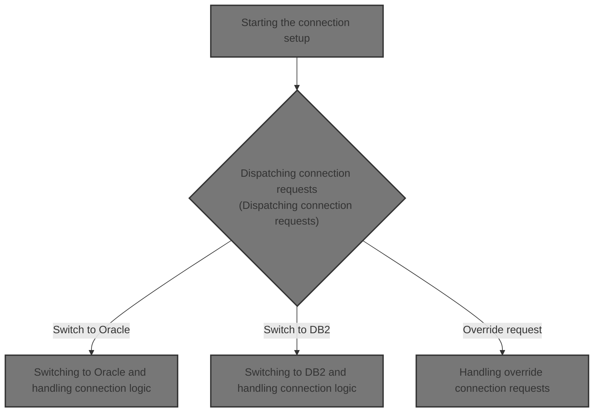

# Overview

This document explains the flow for managing database connections, including initialization, dynamic switching between Oracle and DB2, handling overrides, and tracking connection statistics. The flow ensures that business operations use the correct database context and that connection usage is monitored.

## Dependencies

### Programs

- YYYS0210 (<SwmPath>[base/src/XXXS0210.cbl](base/src/XXXS0210.cbl)</SwmPath>)
- YYYS0220 (<SwmPath>[base/src/YYYS0220.cbl](base/src/YYYS0220.cbl)</SwmPath>)

### Copybooks

- SQLCA
- XXXN001A (<SwmPath>[base/src/XXXN001A.cpy](base/src/XXXN001A.cpy)</SwmPath>)
- YYYC0220 (<SwmPath>[base/src/YYYC0220.cpy](base/src/YYYC0220.cpy)</SwmPath>)
- YYYN000A (<SwmPath>[base/src/YYYN000A.cpy](base/src/YYYN000A.cpy)</SwmPath>)

# Where is this program used?

This program is used multiple times in the codebase as represented in the following diagram:

```mermaid
graph TD
  zqe0w("Retrieving Store Details (NNNS0120)") --> iv7eq("Database Connection Initialization (XXXS0210)"):::currentEntity
click zqe0w openCode "base/src/NNNS0120.cbl:1"
k0sj3("Database Operation Handler (WWWS0003)") --> iv7eq("Database Connection Initialization (XXXS0210)"):::currentEntity
click k0sj3 openCode "base/src/WWWS0003.cbl:1"
d910i("Table IO Object for Location Class Advertisement Zones (NNNS0473)") --> iv7eq("Database Connection Initialization (XXXS0210)"):::currentEntity
click d910i openCode "base/src/NNNS0473.cbl:1"
izqk8("Table IO Object for Department Data (NNNS0573)") --> iv7eq("Database Connection Initialization (XXXS0210)"):::currentEntity
click izqk8 openCode "base/src/NNNS0573.cbl:1"
lzda7("Validating Vendor and Entity Classification (MMMS0711)") --> iv7eq("Database Connection Initialization (XXXS0210)"):::currentEntity
click lzda7 openCode "base/src/MMMS0711.cbl:1"
j1ewc("Managing Location Data (NNNS0487)") --> iv7eq("Database Connection Initialization (XXXS0210)"):::currentEntity
click j1ewc openCode "base/src/NNNS0487.cbl:1"
0di46("Retail Location Data Processing (NNNS0488)") --> iv7eq("Database Connection Initialization (XXXS0210)"):::currentEntity
click 0di46 openCode "base/src/NNNS0488.cbl:1"
o4hl5("Enabling Referential Integrity for Vendor Locations (MMMS0335)") --> iv7eq("Database Connection Initialization (XXXS0210)"):::currentEntity
click o4hl5 openCode "base/src/MMMS0335.cbl:1"
  
  
click iv7eq openCode "base/src/XXXS0210.cbl:1"
    classDef currentEntity color:#000000,fill:#7CB9F4

%% Swimm:
%% graph TD
%%   zqe0w("Retrieving Store Details (NNNS0120)") --> iv7eq("Database Connection Initialization (XXXS0210)"):::currentEntity
%% click zqe0w openCode "<SwmPath>[base/src/NNNS0120.cbl](base/src/NNNS0120.cbl)</SwmPath>:1"
%% k0sj3("Database Operation Handler (WWWS0003)") --> iv7eq("Database Connection Initialization (XXXS0210)"):::currentEntity
%% click k0sj3 openCode "<SwmPath>[base/src/WWWS0003.cbl](base/src/WWWS0003.cbl)</SwmPath>:1"
%% d910i("Table IO Object for Location Class Advertisement Zones (NNNS0473)") --> iv7eq("Database Connection Initialization (XXXS0210)"):::currentEntity
%% click d910i openCode "<SwmPath>[base/src/NNNS0473.cbl](base/src/NNNS0473.cbl)</SwmPath>:1"
%% izqk8("Table IO Object for Department Data (NNNS0573)") --> iv7eq("Database Connection Initialization (XXXS0210)"):::currentEntity
%% click izqk8 openCode "<SwmPath>[base/src/NNNS0573.cbl](base/src/NNNS0573.cbl)</SwmPath>:1"
%% lzda7("Validating Vendor and Entity Classification (MMMS0711)") --> iv7eq("Database Connection Initialization (XXXS0210)"):::currentEntity
%% click lzda7 openCode "<SwmPath>[base/src/MMMS0711.cbl](base/src/MMMS0711.cbl)</SwmPath>:1"
%% j1ewc("Managing Location Data (NNNS0487)") --> iv7eq("Database Connection Initialization (XXXS0210)"):::currentEntity
%% click j1ewc openCode "<SwmPath>[base/src/NNNS0487.cbl](base/src/NNNS0487.cbl)</SwmPath>:1"
%% 0di46("Retail Location Data Processing (NNNS0488)") --> iv7eq("Database Connection Initialization (XXXS0210)"):::currentEntity
%% click 0di46 openCode "<SwmPath>[base/src/NNNS0488.cbl](base/src/NNNS0488.cbl)</SwmPath>:1"
%% o4hl5("Enabling Referential Integrity for Vendor Locations (MMMS0335)") --> iv7eq("Database Connection Initialization (XXXS0210)"):::currentEntity
%% click o4hl5 openCode "<SwmPath>[base/src/MMMS0335.cbl](base/src/MMMS0335.cbl)</SwmPath>:1"
%%   
%%   
%% click iv7eq openCode "<SwmPath>[base/src/XXXS0210.cbl](base/src/XXXS0210.cbl)</SwmPath>:1"
%%     classDef currentEntity color:#000000,fill:#7CB9F4
```

&nbsp;

*This is an auto-generated document by Swimm 🌊 and has not yet been verified by a human*

<SwmMeta version="3.0.0" repo-id="Z2l0aHViJTNBJTNBU3dpbW1pby1keW5jYWxsLWRlbW8lM0ElM0FHaXJpLVN3aW1t" repo-name="Swimmio-dyncall-demo">Powered by [Swimm](https://app.swimm.io/)</SwmMeta>
