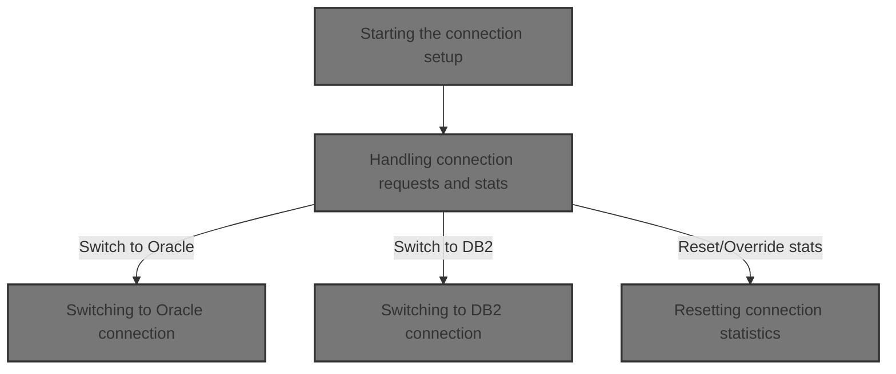
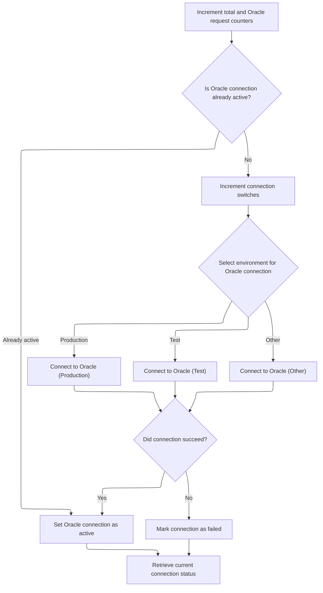
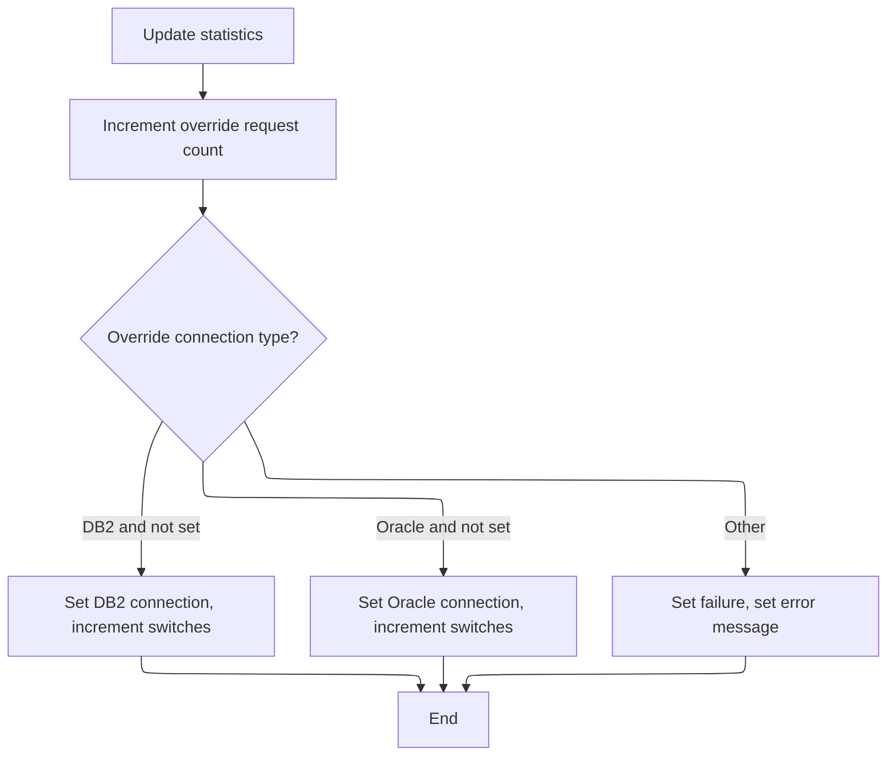

# Overview

This document describes the flow for establishing and switching the active database connection (Oracle or <SwmToken path="base/src/YYYS0220.cbl" pos="62:8:8" line-data="007100       WHEN YYYC0220-SET-DB2-CON                                  00007100">`DB2`</SwmToken>), and managing connection usage statistics. The system ensures the correct database is connected before business operations proceed, and maintains accurate statistics for connection management.



## Dependencies

### Programs

- <SwmToken path="base/src/XXXS0210.cbl" pos="2:7:7" line-data="000200 PROGRAM-ID.    YYYS0210.                                         00000200">`YYYS0210`</SwmToken> (<SwmPath>[base/src/XXXS0210.cbl](base/src/XXXS0210.cbl)</SwmPath>)
- <SwmToken path="base/src/XXXS0210.cbl" pos="55:4:4" line-data="007540     CALL YYYS0220-DBMS-CON-MGR USING                             00007540">`YYYS0220`</SwmToken> (<SwmPath>[base/src/YYYS0220.cbl](base/src/YYYS0220.cbl)</SwmPath>)

### Copybooks

- SQLCA
- <SwmToken path="base/src/XXXS0210.cbl" pos="56:2:2" line-data="007550         XXXN001A                                                 00007550">`XXXN001A`</SwmToken> (<SwmPath>[base/src/XXXN001A.cpy](base/src/XXXN001A.cpy)</SwmPath>)
- <SwmToken path="base/src/XXXS0210.cbl" pos="53:4:4" line-data="007510     SET YYYC0220-SET-ORACLE-CON TO TRUE                          00007510">`YYYC0220`</SwmToken> (<SwmPath>[base/src/YYYC0220.cpy](base/src/YYYC0220.cpy)</SwmPath>)
- <SwmToken path="base/src/XXXS0210.cbl" pos="16:4:4" line-data="002700 COPY YYYN000A.                                                   00002700">`YYYN000A`</SwmToken> (<SwmPath>[base/src/YYYN000A.cpy](base/src/YYYN000A.cpy)</SwmPath>)

# Where is this program used?

This program is used multiple times in the codebase as represented in the following diagram:

```mermaid
graph TD
  idkc1("Retrieving Store Details (NNNS0120)") --> sy8ch("Database Connection Initialization (XXXS0210)"):::currentEntity
click idkc1 openCode "base/src/NNNS0120.cbl:1"
kubd7("Database Operation Handler (WWWS0003)") --> sy8ch("Database Connection Initialization (XXXS0210)"):::currentEntity
click kubd7 openCode "base/src/WWWS0003.cbl:1"
0iug3("Table IO Object for Location Class Advertisement Zones (NNNS0473)") --> sy8ch("Database Connection Initialization (XXXS0210)"):::currentEntity
click 0iug3 openCode "base/src/NNNS0473.cbl:1"
54ls3("Table IO Object for Department Data (NNNS0573)") --> sy8ch("Database Connection Initialization (XXXS0210)"):::currentEntity
click 54ls3 openCode "base/src/NNNS0573.cbl:1"
hyxcr("Validating Vendor and Entity Classification (MMMS0711)") --> sy8ch("Database Connection Initialization (XXXS0210)"):::currentEntity
click hyxcr openCode "base/src/MMMS0711.cbl:1"
5velg("Managing Location Data (NNNS0487)") --> sy8ch("Database Connection Initialization (XXXS0210)"):::currentEntity
click 5velg openCode "base/src/NNNS0487.cbl:1"
psocv("Retail Location Data Processing (NNNS0488)") --> sy8ch("Database Connection Initialization (XXXS0210)"):::currentEntity
click psocv openCode "base/src/NNNS0488.cbl:1"
i174l("Enabling Referential Integrity for Vendor Locations (MMMS0335)") --> sy8ch("Database Connection Initialization (XXXS0210)"):::currentEntity
click i174l openCode "base/src/MMMS0335.cbl:1"
  
  
click sy8ch openCode "base/src/XXXS0210.cbl:1"
    classDef currentEntity color:#000000,fill:#7CB9F4

%% Swimm:
%% graph TD
%%   idkc1("Retrieving Store Details (NNNS0120)") --> sy8ch("Database Connection Initialization (XXXS0210)"):::currentEntity
%% click idkc1 openCode "<SwmPath>[base/src/NNNS0120.cbl](base/src/NNNS0120.cbl)</SwmPath>:1"
%% kubd7("Database Operation Handler (WWWS0003)") --> sy8ch("Database Connection Initialization (XXXS0210)"):::currentEntity
%% click kubd7 openCode "<SwmPath>[base/src/WWWS0003.cbl](base/src/WWWS0003.cbl)</SwmPath>:1"
%% 0iug3("Table IO Object for Location Class Advertisement Zones (NNNS0473)") --> sy8ch("Database Connection Initialization (XXXS0210)"):::currentEntity
%% click 0iug3 openCode "<SwmPath>[base/src/NNNS0473.cbl](base/src/NNNS0473.cbl)</SwmPath>:1"
%% 54ls3("Table IO Object for Department Data (NNNS0573)") --> sy8ch("Database Connection Initialization (XXXS0210)"):::currentEntity
%% click 54ls3 openCode "<SwmPath>[base/src/NNNS0573.cbl](base/src/NNNS0573.cbl)</SwmPath>:1"
%% hyxcr("Validating Vendor and Entity Classification (MMMS0711)") --> sy8ch("Database Connection Initialization (XXXS0210)"):::currentEntity
%% click hyxcr openCode "<SwmPath>[base/src/MMMS0711.cbl](base/src/MMMS0711.cbl)</SwmPath>:1"
%% 5velg("Managing Location Data (NNNS0487)") --> sy8ch("Database Connection Initialization (XXXS0210)"):::currentEntity
%% click 5velg openCode "<SwmPath>[base/src/NNNS0487.cbl](base/src/NNNS0487.cbl)</SwmPath>:1"
%% psocv("Retail Location Data Processing (NNNS0488)") --> sy8ch("Database Connection Initialization (XXXS0210)"):::currentEntity
%% click psocv openCode "<SwmPath>[base/src/NNNS0488.cbl](base/src/NNNS0488.cbl)</SwmPath>:1"
%% i174l("Enabling Referential Integrity for Vendor Locations (MMMS0335)") --> sy8ch("Database Connection Initialization (XXXS0210)"):::currentEntity
%% click i174l openCode "<SwmPath>[base/src/MMMS0335.cbl](base/src/MMMS0335.cbl)</SwmPath>:1"
%%   
%%   
%% click sy8ch openCode "<SwmPath>[base/src/XXXS0210.cbl](base/src/XXXS0210.cbl)</SwmPath>:1"
%%     classDef currentEntity color:#000000,fill:#7CB9F4
```



## Detailed View of the Program's Functionality

### a. Program Startup and Initialization

When the main program starts, it first prepares the environment and data structures needed for operation. This involves initializing all working storage and linkage area variables, including those used for SQL operations and connection management. The initialization step ensures that all counters, flags, and data areas are set to their default or zeroed values, and the environment is marked as production by default.

### b. Initiating Oracle Connection

After initialization, the main program immediately requests a switch to an Oracle database connection. It does this by setting a specific flag in the shared context structure to indicate that an Oracle connection is desired. Then, it calls a dedicated connection manager subprogram, passing along the context and management structures. This call delegates the actual connection logic to the connection manager, which is responsible for handling all database connection state and transitions.

### c. Connection Manager Request Dispatch

Upon being called, the connection manager initializes its own working storage and then examines the request type encoded in the context structure. It uses a multi-branch decision structure to determine which operation to perform. The possible operations include:

- Returning the current connection type
- Switching to a <SwmToken path="base/src/YYYS0220.cbl" pos="62:8:8" line-data="007100       WHEN YYYC0220-SET-DB2-CON                                  00007100">`DB2`</SwmToken> connection
- Switching to an Oracle connection
- Returning connection statistics
- Resetting statistics
- Overriding the current connection type

If the request type is not recognized, the manager sets a failure flag and writes an error message to the output area.

### d. Switching to <SwmToken path="base/src/YYYS0220.cbl" pos="62:8:8" line-data="007100       WHEN YYYC0220-SET-DB2-CON                                  00007100">`DB2`</SwmToken> Connection

When a request to switch to a <SwmToken path="base/src/YYYS0220.cbl" pos="62:8:8" line-data="007100       WHEN YYYC0220-SET-DB2-CON                                  00007100">`DB2`</SwmToken> connection is received, the manager:

1. Increments the total request and <SwmToken path="base/src/YYYS0220.cbl" pos="62:8:8" line-data="007100       WHEN YYYC0220-SET-DB2-CON                                  00007100">`DB2`</SwmToken> request counters.
2. Checks if the current connection is Oracle or the default (i.e., not already <SwmToken path="base/src/YYYS0220.cbl" pos="62:8:8" line-data="007100       WHEN YYYC0220-SET-DB2-CON                                  00007100">`DB2`</SwmToken>).
3. If a switch is needed, it increments the connection switch counter and determines the environment (production or test).
4. Based on the environment, it issues a SQL command to connect to the appropriate <SwmToken path="base/src/YYYS0220.cbl" pos="62:8:8" line-data="007100       WHEN YYYC0220-SET-DB2-CON                                  00007100">`DB2`</SwmToken> instance.
5. After attempting the connection, it checks the result code:
   - If successful, it marks <SwmToken path="base/src/YYYS0220.cbl" pos="62:8:8" line-data="007100       WHEN YYYC0220-SET-DB2-CON                                  00007100">`DB2`</SwmToken> as the active connection.
   - If unsuccessful, it sets a failure flag and constructs an error message including the SQL error code.
6. Finally, it updates the output structure with the current connection type.

### e. Switching to Oracle Connection

When a request to switch to an Oracle connection is received, the manager:

1. Increments the total request and Oracle request counters.
2. Checks if Oracle is not already the active connection.
3. If a switch is needed, it increments the connection switch counter and determines the environment (production, test, or one of several test sub-environments).
4. Based on the environment, it issues a SQL command to connect to the appropriate Oracle instance.
5. After attempting the connection, it checks the result code:
   - If successful, it marks Oracle as the active connection.
   - If unsuccessful, it sets a failure flag and constructs an error message including the SQL error code.
6. Finally, it updates the output structure with the current connection type.

### f. Returning Connection Statistics

When a request for statistics is received, the manager:

1. Updates the output structure with the current connection type.
2. Copies all internal counters (total requests, <SwmToken path="base/src/YYYS0220.cbl" pos="62:8:8" line-data="007100       WHEN YYYC0220-SET-DB2-CON                                  00007100">`DB2`</SwmToken> requests, Oracle requests, override requests, connection switches, override switches) to the output structure for reporting.

### g. Resetting Connection Statistics

When a request to reset statistics is received, the manager:

1. Clears all statistics counters in both its internal storage and the shared context structure, effectively resetting all counts to zero.

### h. Overriding the Current Connection

When a request to override the current connection is received, the manager:

1. Increments the override request counter.
2. Checks which connection type is being requested (<SwmToken path="base/src/YYYS0220.cbl" pos="62:8:8" line-data="007100       WHEN YYYC0220-SET-DB2-CON                                  00007100">`DB2`</SwmToken> or Oracle).
3. If the requested type is valid and not already active, it sets the corresponding connection flag and increments the override switch counter.
4. If the request is invalid (e.g., an unrecognized type), it sets a failure flag and writes an error message to the output area.

### i. Error Handling

For any unrecognized or failed requests, the manager sets a failure flag and writes a descriptive error message to the output area, including details such as the function not being recognized or the SQL error code encountered during a connection attempt.

---

This flow ensures that the main program always starts with a clean environment and an active Oracle connection, and that all connection management, statistics, and error handling are centralized in the connection manager subprogram. The design allows for flexible switching and reporting of database connections, with robust error reporting and statistics tracking.

# Rule Definition

| Paragraph Name                                                                                                                                                                                                                                                                                                                                                                                                                                                                                                                                                                                                                                                                                                                                                                                                                                                                                                                                                                                   | Rule ID | Category          | Description                                                                                                                                                                                                                                                                                                                                                                                                                          | Conditions                                                                                                                                                                                                                                                                                                                             | Remarks                                                                                                                                                                                                                                                                                                                                                                                                                                                                                                                 |
| ------------------------------------------------------------------------------------------------------------------------------------------------------------------------------------------------------------------------------------------------------------------------------------------------------------------------------------------------------------------------------------------------------------------------------------------------------------------------------------------------------------------------------------------------------------------------------------------------------------------------------------------------------------------------------------------------------------------------------------------------------------------------------------------------------------------------------------------------------------------------------------------------------------------------------------------------------------------------------------------------ | ------- | ----------------- | ------------------------------------------------------------------------------------------------------------------------------------------------------------------------------------------------------------------------------------------------------------------------------------------------------------------------------------------------------------------------------------------------------------------------------------ | -------------------------------------------------------------------------------------------------------------------------------------------------------------------------------------------------------------------------------------------------------------------------------------------------------------------------------------- | ----------------------------------------------------------------------------------------------------------------------------------------------------------------------------------------------------------------------------------------------------------------------------------------------------------------------------------------------------------------------------------------------------------------------------------------------------------------------------------------------------------------------- |
| <SwmToken path="base/src/XXXS0210.cbl" pos="33:2:6" line-data="004400 0000-EXIT-DISPATCHER.                                            00004400">`0000-EXIT-DISPATCHER`</SwmToken> (<SwmPath>[base/src/YYYS0220.cbl](base/src/YYYS0220.cbl)</SwmPath>)                                                                                                                                                                                                                                                                                                                                                                                                                                                                                                                                                                                                                                                                                                                                           | RL-001  | Conditional Logic | The system dispatches incoming requests based on flags in the linkage structure, performing the appropriate operation (get/set connection, get/set stats, override connection) and setting error state if the request is not recognized.                                                                                                                                                                                             | A request flag in the linkage structure is set (e.g., get current connection, set <SwmToken path="base/src/YYYS0220.cbl" pos="62:8:8" line-data="007100       WHEN YYYC0220-SET-DB2-CON                                  00007100">`DB2`</SwmToken> connection, set Oracle connection, get stats, set stats, set override connection). | All requests are indicated by single-character flags in the <SwmToken path="base/src/XXXS0210.cbl" pos="53:4:4" line-data="007510     SET YYYC0220-SET-ORACLE-CON TO TRUE                          00007510">`YYYC0220`</SwmToken> structure. Unrecognized requests result in a failure flag and an error message: '<SwmToken path="base/src/XXXS0210.cbl" pos="55:4:4" line-data="007540     CALL YYYS0220-DBMS-CON-MGR USING                             00007540">`YYYS0220`</SwmToken> - Function not recognized!'. |
| <SwmToken path="base/src/YYYS0220.cbl" pos="63:4:10" line-data="007200         PERFORM 300-SET-DB2-CON                                  00007200">`300-SET-DB2-CON`</SwmToken>, <SwmToken path="base/src/YYYS0220.cbl" pos="111:4:12" line-data="012000       PERFORM 310-DO-SET-DB2-CON                                 00012000">`310-DO-SET-DB2-CON`</SwmToken>, <SwmToken path="base/src/YYYS0220.cbl" pos="65:4:10" line-data="007400         PERFORM 400-SET-ORACLE-CON                               00007400">`400-SET-ORACLE-CON`</SwmToken>, <SwmToken path="base/src/YYYS0220.cbl" pos="155:4:12" line-data="016400       PERFORM 410-DO-SET-ORACLE-CON                              00016400">`410-DO-SET-ORACLE-CON`</SwmToken> (<SwmPath>[base/src/YYYS0220.cbl](base/src/YYYS0220.cbl)</SwmPath>)                                                                                                                                                                                 | RL-002  | Conditional Logic | The system allows switching the active connection to <SwmToken path="base/src/YYYS0220.cbl" pos="62:8:8" line-data="007100       WHEN YYYC0220-SET-DB2-CON                                  00007100">`DB2`</SwmToken> or Oracle, updating the connection flag and incrementing counters. The switch only occurs if the requested connection is not already active.                                                                  | A set connection request is received and the requested connection is not currently active.                                                                                                                                                                                                                                             | Switches increment the connection switch counter. Connection type flag is updated only if the requested type is not already active.                                                                                                                                                                                                                                                                                                                                                                                     |
| <SwmToken path="base/src/YYYS0220.cbl" pos="111:4:12" line-data="012000       PERFORM 310-DO-SET-DB2-CON                                 00012000">`310-DO-SET-DB2-CON`</SwmToken>, <SwmToken path="base/src/YYYS0220.cbl" pos="155:4:12" line-data="016400       PERFORM 410-DO-SET-ORACLE-CON                              00016400">`410-DO-SET-ORACLE-CON`</SwmToken> (<SwmPath>[base/src/YYYS0220.cbl](base/src/YYYS0220.cbl)</SwmPath>)                                                                                                                                                                                                                                                                                                                                                                                                                                                                                                                                                    | RL-003  | Conditional Logic | When switching connections, the system selects the target environment based on a single-character environment flag, supporting 'P' (Production), 'T' (Test), '6', '5', '4', '3' (Other test environments).                                                                                                                                                                                                                           | A connection switch is performed.                                                                                                                                                                                                                                                                                                      | Environment flag values: 'P', 'T', '6', '5', '4', '3'. SQL connect statements use different targets based on environment.                                                                                                                                                                                                                                                                                                                                                                                               |
| <SwmToken path="base/src/YYYS0220.cbl" pos="111:4:12" line-data="012000       PERFORM 310-DO-SET-DB2-CON                                 00012000">`310-DO-SET-DB2-CON`</SwmToken>, <SwmToken path="base/src/YYYS0220.cbl" pos="155:4:12" line-data="016400       PERFORM 410-DO-SET-ORACLE-CON                              00016400">`410-DO-SET-ORACLE-CON`</SwmToken> (<SwmPath>[base/src/YYYS0220.cbl](base/src/YYYS0220.cbl)</SwmPath>)                                                                                                                                                                                                                                                                                                                                                                                                                                                                                                                                                    | RL-004  | Conditional Logic | After attempting to switch connections, the system checks the SQL error code. If the code is not zero, a failure flag is set and an error message is generated, including a fixed prefix and the SQL error code.                                                                                                                                                                                                                     | A connection switch is attempted and the SQL error code is not zero.                                                                                                                                                                                                                                                                   | Error message format: '<SwmToken path="base/src/XXXS0210.cbl" pos="55:4:4" line-data="007540     CALL YYYS0220-DBMS-CON-MGR USING                             00007540">`YYYS0220`</SwmToken> - Failure connecting to DB2/Oracle, SQL=' followed by the error code. Output field for error message is max 80 characters.                                                                                                                                                                                                |
| <SwmToken path="base/src/YYYS0220.cbl" pos="71:4:10" line-data="008000         PERFORM 700-SET-OVERRIDE-CON                             00008000">`700-SET-OVERRIDE-CON`</SwmToken> (<SwmPath>[base/src/YYYS0220.cbl](base/src/YYYS0220.cbl)</SwmPath>)                                                                                                                                                                                                                                                                                                                                                                                                                                                                                                                                                                                                                                                                                                                                          | RL-005  | Conditional Logic | The system supports override requests to force a connection type (<SwmToken path="base/src/YYYS0220.cbl" pos="62:8:8" line-data="007100       WHEN YYYC0220-SET-DB2-CON                                  00007100">`DB2`</SwmToken> or Oracle), incrementing override counters and only switching if the requested type is valid and not already active. Invalid override requests set a failure flag and generate an error message. | An override connection request is received.                                                                                                                                                                                                                                                                                            | Override counters are incremented only on valid switches. Invalid requests result in error message: '<SwmToken path="base/src/XXXS0210.cbl" pos="55:4:4" line-data="007540     CALL YYYS0220-DBMS-CON-MGR USING                             00007540">`YYYS0220`</SwmToken> - Invalid <SwmToken path="base/src/YYYS0220.cbl" pos="255:11:13" line-data="026400         MOVE &#39;YYYS0220 - Invalid over-ride connection!&#39;          00026400">`over-ride`</SwmToken> connection!'.                                  |
| <SwmToken path="base/src/YYYS0220.cbl" pos="61:4:10" line-data="007000         PERFORM 200-GET-CURR-CON                                 00007000">`200-GET-CURR-CON`</SwmToken>, <SwmToken path="base/src/YYYS0220.cbl" pos="67:4:8" line-data="007600         PERFORM 500-GET-STATS                                    00007600">`500-GET-STATS`</SwmToken>, <SwmToken path="base/src/YYYS0220.cbl" pos="111:4:12" line-data="012000       PERFORM 310-DO-SET-DB2-CON                                 00012000">`310-DO-SET-DB2-CON`</SwmToken>, <SwmToken path="base/src/YYYS0220.cbl" pos="155:4:12" line-data="016400       PERFORM 410-DO-SET-ORACLE-CON                              00016400">`410-DO-SET-ORACLE-CON`</SwmToken>, <SwmToken path="base/src/YYYS0220.cbl" pos="71:4:10" line-data="008000         PERFORM 700-SET-OVERRIDE-CON                             00008000">`700-SET-OVERRIDE-CON`</SwmToken> (<SwmPath>[base/src/YYYS0220.cbl](base/src/YYYS0220.cbl)</SwmPath>) | RL-006  | Data Assignment   | The output structure must include the current connection type, all statistics counters, a failure flag, and an error message field. Error messages are returned in a dedicated output field, with a maximum length of 80 characters.                                                                                                                                                                                                 | Any request that produces output (get connection, get stats, error handling, etc.).                                                                                                                                                                                                                                                    | Output structure fields:                                                                                                                                                                                                                                                                                                                                                                                                                                                                                                |

- Connection type: single character
- Statistics counters: signed 9-digit numbers
- Failure flag: boolean
- Error message: string, max 80 characters | | <SwmToken path="base/src/YYYS0220.cbl" pos="61:4:10" line-data="007000         PERFORM 200-GET-CURR-CON                                 00007000">`200-GET-CURR-CON`</SwmToken>, <SwmToken path="base/src/YYYS0220.cbl" pos="63:4:10" line-data="007200         PERFORM 300-SET-DB2-CON                                  00007200">`300-SET-DB2-CON`</SwmToken>, <SwmToken path="base/src/YYYS0220.cbl" pos="65:4:10" line-data="007400         PERFORM 400-SET-ORACLE-CON                               00007400">`400-SET-ORACLE-CON`</SwmToken>, <SwmToken path="base/src/YYYS0220.cbl" pos="71:4:10" line-data="008000         PERFORM 700-SET-OVERRIDE-CON                             00008000">`700-SET-OVERRIDE-CON`</SwmToken> (<SwmPath>[base/src/YYYS0220.cbl](base/src/YYYS0220.cbl)</SwmPath>) | RL-007 | Data Assignment | The system tracks the current active connection type using a single-character field, which can be blank (Default), 'D' (<SwmToken path="base/src/YYYS0220.cbl" pos="62:8:8" line-data="007100       WHEN YYYC0220-SET-DB2-CON                                  00007100">`DB2`</SwmToken>), or '0' (Oracle). | Any operation that changes or queries the connection type. | Connection type field values: blank (Default), 'D' (<SwmToken path="base/src/YYYS0220.cbl" pos="62:8:8" line-data="007100       WHEN YYYC0220-SET-DB2-CON                                  00007100">`DB2`</SwmToken>), '0' (Oracle). Output field is a single character. | | <SwmToken path="base/src/YYYS0220.cbl" pos="63:4:10" line-data="007200         PERFORM 300-SET-DB2-CON                                  00007200">`300-SET-DB2-CON`</SwmToken>, <SwmToken path="base/src/YYYS0220.cbl" pos="65:4:10" line-data="007400         PERFORM 400-SET-ORACLE-CON                               00007400">`400-SET-ORACLE-CON`</SwmToken>, <SwmToken path="base/src/YYYS0220.cbl" pos="71:4:10" line-data="008000         PERFORM 700-SET-OVERRIDE-CON                             00008000">`700-SET-OVERRIDE-CON`</SwmToken>, <SwmToken path="base/src/YYYS0220.cbl" pos="67:4:8" line-data="007600         PERFORM 500-GET-STATS                                    00007600">`500-GET-STATS`</SwmToken>, <SwmToken path="base/src/YYYS0220.cbl" pos="69:4:8" line-data="007800         PERFORM 600-SET-STATS                                    00007800">`600-SET-STATS`</SwmToken> (<SwmPath>[base/src/YYYS0220.cbl](base/src/YYYS0220.cbl)</SwmPath>) | RL-008 | Computation | The system maintains counters for total requests, <SwmToken path="base/src/YYYS0220.cbl" pos="62:8:8" line-data="007100       WHEN YYYC0220-SET-DB2-CON                                  00007100">`DB2`</SwmToken> requests, Oracle requests, override requests, connection switches, and override switches. These are incremented according to the type of request processed and can be reset to zero upon request. | Any request that triggers a connection change, override, or statistics retrieval/reset. | Counters are signed 9-digit numbers. Output structure includes all counters as numeric fields. |

# User Stories

## User Story 1: Connection Management and Override Handling

---

### Story Description:

As a system user, I want to request connection switches between <SwmToken path="base/src/YYYS0220.cbl" pos="62:8:8" line-data="007100       WHEN YYYC0220-SET-DB2-CON                                  00007100">`DB2`</SwmToken> and Oracle, including override options and environment selection, so that I can control which database is active and ensure the correct environment is used, with clear error reporting if the operation fails.

---

### Business Rule Mapping:

| Rule ID | Paragraph Name                                                                                                                                                                                                                                                                                                                                                                                                                                                                                                                                                                                                                                                                                                                                                                                                   | Rule Description                                                                                                                                                                                                                                                                                                                                                                                                                     |
| ------- | ---------------------------------------------------------------------------------------------------------------------------------------------------------------------------------------------------------------------------------------------------------------------------------------------------------------------------------------------------------------------------------------------------------------------------------------------------------------------------------------------------------------------------------------------------------------------------------------------------------------------------------------------------------------------------------------------------------------------------------------------------------------------------------------------------------------- | ------------------------------------------------------------------------------------------------------------------------------------------------------------------------------------------------------------------------------------------------------------------------------------------------------------------------------------------------------------------------------------------------------------------------------------ |
| RL-002  | <SwmToken path="base/src/YYYS0220.cbl" pos="63:4:10" line-data="007200         PERFORM 300-SET-DB2-CON                                  00007200">`300-SET-DB2-CON`</SwmToken>, <SwmToken path="base/src/YYYS0220.cbl" pos="111:4:12" line-data="012000       PERFORM 310-DO-SET-DB2-CON                                 00012000">`310-DO-SET-DB2-CON`</SwmToken>, <SwmToken path="base/src/YYYS0220.cbl" pos="65:4:10" line-data="007400         PERFORM 400-SET-ORACLE-CON                               00007400">`400-SET-ORACLE-CON`</SwmToken>, <SwmToken path="base/src/YYYS0220.cbl" pos="155:4:12" line-data="016400       PERFORM 410-DO-SET-ORACLE-CON                              00016400">`410-DO-SET-ORACLE-CON`</SwmToken> (<SwmPath>[base/src/YYYS0220.cbl](base/src/YYYS0220.cbl)</SwmPath>) | The system allows switching the active connection to <SwmToken path="base/src/YYYS0220.cbl" pos="62:8:8" line-data="007100       WHEN YYYC0220-SET-DB2-CON                                  00007100">`DB2`</SwmToken> or Oracle, updating the connection flag and incrementing counters. The switch only occurs if the requested connection is not already active.                                                                  |
| RL-003  | <SwmToken path="base/src/YYYS0220.cbl" pos="111:4:12" line-data="012000       PERFORM 310-DO-SET-DB2-CON                                 00012000">`310-DO-SET-DB2-CON`</SwmToken>, <SwmToken path="base/src/YYYS0220.cbl" pos="155:4:12" line-data="016400       PERFORM 410-DO-SET-ORACLE-CON                              00016400">`410-DO-SET-ORACLE-CON`</SwmToken> (<SwmPath>[base/src/YYYS0220.cbl](base/src/YYYS0220.cbl)</SwmPath>)                                                                                                                                                                                                                                                                                                                                                                    | When switching connections, the system selects the target environment based on a single-character environment flag, supporting 'P' (Production), 'T' (Test), '6', '5', '4', '3' (Other test environments).                                                                                                                                                                                                                           |
| RL-004  | <SwmToken path="base/src/YYYS0220.cbl" pos="111:4:12" line-data="012000       PERFORM 310-DO-SET-DB2-CON                                 00012000">`310-DO-SET-DB2-CON`</SwmToken>, <SwmToken path="base/src/YYYS0220.cbl" pos="155:4:12" line-data="016400       PERFORM 410-DO-SET-ORACLE-CON                              00016400">`410-DO-SET-ORACLE-CON`</SwmToken> (<SwmPath>[base/src/YYYS0220.cbl](base/src/YYYS0220.cbl)</SwmPath>)                                                                                                                                                                                                                                                                                                                                                                    | After attempting to switch connections, the system checks the SQL error code. If the code is not zero, a failure flag is set and an error message is generated, including a fixed prefix and the SQL error code.                                                                                                                                                                                                                     |
| RL-001  | <SwmToken path="base/src/XXXS0210.cbl" pos="33:2:6" line-data="004400 0000-EXIT-DISPATCHER.                                            00004400">`0000-EXIT-DISPATCHER`</SwmToken> (<SwmPath>[base/src/YYYS0220.cbl](base/src/YYYS0220.cbl)</SwmPath>)                                                                                                                                                                                                                                                                                                                                                                                                                                                                                                                                                           | The system dispatches incoming requests based on flags in the linkage structure, performing the appropriate operation (get/set connection, get/set stats, override connection) and setting error state if the request is not recognized.                                                                                                                                                                                             |
| RL-005  | <SwmToken path="base/src/YYYS0220.cbl" pos="71:4:10" line-data="008000         PERFORM 700-SET-OVERRIDE-CON                             00008000">`700-SET-OVERRIDE-CON`</SwmToken> (<SwmPath>[base/src/YYYS0220.cbl](base/src/YYYS0220.cbl)</SwmPath>)                                                                                                                                                                                                                                                                                                                                                                                                                                                                                                                                                          | The system supports override requests to force a connection type (<SwmToken path="base/src/YYYS0220.cbl" pos="62:8:8" line-data="007100       WHEN YYYC0220-SET-DB2-CON                                  00007100">`DB2`</SwmToken> or Oracle), incrementing override counters and only switching if the requested type is valid and not already active. Invalid override requests set a failure flag and generate an error message. |
| RL-007  | <SwmToken path="base/src/YYYS0220.cbl" pos="61:4:10" line-data="007000         PERFORM 200-GET-CURR-CON                                 00007000">`200-GET-CURR-CON`</SwmToken>, <SwmToken path="base/src/YYYS0220.cbl" pos="63:4:10" line-data="007200         PERFORM 300-SET-DB2-CON                                  00007200">`300-SET-DB2-CON`</SwmToken>, <SwmToken path="base/src/YYYS0220.cbl" pos="65:4:10" line-data="007400         PERFORM 400-SET-ORACLE-CON                               00007400">`400-SET-ORACLE-CON`</SwmToken>, <SwmToken path="base/src/YYYS0220.cbl" pos="71:4:10" line-data="008000         PERFORM 700-SET-OVERRIDE-CON                             00008000">`700-SET-OVERRIDE-CON`</SwmToken> (<SwmPath>[base/src/YYYS0220.cbl](base/src/YYYS0220.cbl)</SwmPath>)      | The system tracks the current active connection type using a single-character field, which can be blank (Default), 'D' (<SwmToken path="base/src/YYYS0220.cbl" pos="62:8:8" line-data="007100       WHEN YYYC0220-SET-DB2-CON                                  00007100">`DB2`</SwmToken>), or '0' (Oracle).                                                                                                                         |

---

### Relevant Functionality:

- <SwmToken path="base/src/YYYS0220.cbl" pos="63:4:10" line-data="007200         PERFORM 300-SET-DB2-CON                                  00007200">`300-SET-DB2-CON`</SwmToken>
  1. **RL-002:**
     - On set DB2/Oracle request:
       - If requested type is not active, perform switch:
         - Increment connection switch counter.
         - Update connection type flag.
         - Select environment and perform SQL connect.
       - If already active, do not switch.
- <SwmToken path="base/src/YYYS0220.cbl" pos="111:4:12" line-data="012000       PERFORM 310-DO-SET-DB2-CON                                 00012000">`310-DO-SET-DB2-CON`</SwmToken>
  1. **RL-003:**
     - On connection switch, check environment flag:
       - If 'P', connect to production DB/DRDA.
       - If 'T', connect to test DB/DRDA.
       - If '6', '5', '4', '3', connect to corresponding test environment DB/DRDA.
  2. **RL-004:**
     - After SQL connect, check SQL error code:
       - If zero, continue.
       - If not zero:
         - Set failure flag.
         - Format error message with prefix and error code.
         - Copy to output error message field.
- <SwmToken path="base/src/XXXS0210.cbl" pos="33:2:6" line-data="004400 0000-EXIT-DISPATCHER.                                            00004400">`0000-EXIT-DISPATCHER`</SwmToken> **(**<SwmPath>[base/src/YYYS0220.cbl](base/src/YYYS0220.cbl)</SwmPath>**)**
  1. **RL-001:**
     - On entry, check which request flag is set in the input structure.
       - If get current connection: perform get current connection routine.
       - If set <SwmToken path="base/src/YYYS0220.cbl" pos="62:8:8" line-data="007100       WHEN YYYC0220-SET-DB2-CON                                  00007100">`DB2`</SwmToken> connection: perform set <SwmToken path="base/src/YYYS0220.cbl" pos="62:8:8" line-data="007100       WHEN YYYC0220-SET-DB2-CON                                  00007100">`DB2`</SwmToken> connection routine.
       - If set Oracle connection: perform set Oracle connection routine.
       - If get stats: perform get stats routine.
       - If set stats: perform set stats routine.
       - If set override connection: perform set override connection routine.
       - If none match: set failure flag and return error message.
- <SwmToken path="base/src/YYYS0220.cbl" pos="71:4:10" line-data="008000         PERFORM 700-SET-OVERRIDE-CON                             00008000">`700-SET-OVERRIDE-CON`</SwmToken> **(**<SwmPath>[base/src/YYYS0220.cbl](base/src/YYYS0220.cbl)</SwmPath>**)**
  1. **RL-005:**
     - On override request:
       - If requested type is valid and not active:
         - Set connection type flag.
         - Increment override switch counter.
       - If invalid:
         - Set failure flag.
         - Set error message in output.
- <SwmToken path="base/src/YYYS0220.cbl" pos="61:4:10" line-data="007000         PERFORM 200-GET-CURR-CON                                 00007000">`200-GET-CURR-CON`</SwmToken>
  1. **RL-007:**
     - When queried, return the current connection type field.
     - When setting <SwmToken path="base/src/YYYS0220.cbl" pos="62:8:8" line-data="007100       WHEN YYYC0220-SET-DB2-CON                                  00007100">`DB2`</SwmToken> or Oracle connection, update the field accordingly if not already set.
     - When override is requested, update the field if valid and not already set; otherwise, set failure.

## User Story 2: Statistics Tracking, Reset, and Output Reporting

---

### Story Description:

As a system user, I want to track, reset, and retrieve statistics for all connection and override requests, and receive the current connection type, all counters, a failure flag, and an error message in the output structure for any request, so that I can monitor system activity and have complete visibility into the system state and any errors that occur.

---

### Business Rule Mapping:

| Rule ID | Paragraph Name                                                                                                                                                                                                                                                                                                                                                                                                                                                                                                                                                                                                                                                                                                                                                                                                                                                                                                                                                                                   | Rule Description                                                                                                                                                                                                                                                                                                                                                                                                      |
| ------- | ------------------------------------------------------------------------------------------------------------------------------------------------------------------------------------------------------------------------------------------------------------------------------------------------------------------------------------------------------------------------------------------------------------------------------------------------------------------------------------------------------------------------------------------------------------------------------------------------------------------------------------------------------------------------------------------------------------------------------------------------------------------------------------------------------------------------------------------------------------------------------------------------------------------------------------------------------------------------------------------------ | --------------------------------------------------------------------------------------------------------------------------------------------------------------------------------------------------------------------------------------------------------------------------------------------------------------------------------------------------------------------------------------------------------------------- |
| RL-008  | <SwmToken path="base/src/YYYS0220.cbl" pos="63:4:10" line-data="007200         PERFORM 300-SET-DB2-CON                                  00007200">`300-SET-DB2-CON`</SwmToken>, <SwmToken path="base/src/YYYS0220.cbl" pos="65:4:10" line-data="007400         PERFORM 400-SET-ORACLE-CON                               00007400">`400-SET-ORACLE-CON`</SwmToken>, <SwmToken path="base/src/YYYS0220.cbl" pos="71:4:10" line-data="008000         PERFORM 700-SET-OVERRIDE-CON                             00008000">`700-SET-OVERRIDE-CON`</SwmToken>, <SwmToken path="base/src/YYYS0220.cbl" pos="67:4:8" line-data="007600         PERFORM 500-GET-STATS                                    00007600">`500-GET-STATS`</SwmToken>, <SwmToken path="base/src/YYYS0220.cbl" pos="69:4:8" line-data="007800         PERFORM 600-SET-STATS                                    00007800">`600-SET-STATS`</SwmToken> (<SwmPath>[base/src/YYYS0220.cbl](base/src/YYYS0220.cbl)</SwmPath>)             | The system maintains counters for total requests, <SwmToken path="base/src/YYYS0220.cbl" pos="62:8:8" line-data="007100       WHEN YYYC0220-SET-DB2-CON                                  00007100">`DB2`</SwmToken> requests, Oracle requests, override requests, connection switches, and override switches. These are incremented according to the type of request processed and can be reset to zero upon request. |
| RL-006  | <SwmToken path="base/src/YYYS0220.cbl" pos="61:4:10" line-data="007000         PERFORM 200-GET-CURR-CON                                 00007000">`200-GET-CURR-CON`</SwmToken>, <SwmToken path="base/src/YYYS0220.cbl" pos="67:4:8" line-data="007600         PERFORM 500-GET-STATS                                    00007600">`500-GET-STATS`</SwmToken>, <SwmToken path="base/src/YYYS0220.cbl" pos="111:4:12" line-data="012000       PERFORM 310-DO-SET-DB2-CON                                 00012000">`310-DO-SET-DB2-CON`</SwmToken>, <SwmToken path="base/src/YYYS0220.cbl" pos="155:4:12" line-data="016400       PERFORM 410-DO-SET-ORACLE-CON                              00016400">`410-DO-SET-ORACLE-CON`</SwmToken>, <SwmToken path="base/src/YYYS0220.cbl" pos="71:4:10" line-data="008000         PERFORM 700-SET-OVERRIDE-CON                             00008000">`700-SET-OVERRIDE-CON`</SwmToken> (<SwmPath>[base/src/YYYS0220.cbl](base/src/YYYS0220.cbl)</SwmPath>) | The output structure must include the current connection type, all statistics counters, a failure flag, and an error message field. Error messages are returned in a dedicated output field, with a maximum length of 80 characters.                                                                                                                                                                                  |

---

### Relevant Functionality:

- <SwmToken path="base/src/YYYS0220.cbl" pos="63:4:10" line-data="007200         PERFORM 300-SET-DB2-CON                                  00007200">`300-SET-DB2-CON`</SwmToken>
  1. **RL-008:**
     - On each connection or override request, increment the relevant counters.
     - On stats reset request, set all counters to zero.
     - On stats retrieval, copy all counter values to output structure.
- <SwmToken path="base/src/YYYS0220.cbl" pos="61:4:10" line-data="007000         PERFORM 200-GET-CURR-CON                                 00007000">`200-GET-CURR-CON`</SwmToken>
  1. **RL-006:**
     - On output, populate structure with:
       - Current connection type
       - All statistics counters
       - Failure flag (if applicable)
       - Error message (if applicable, truncated/padded to 80 characters)

# Workflow

# Starting the connection setup

This section ensures that the system is properly initialized and connected to Oracle before any business logic or data processing begins. It acts as the entry point for setting up the necessary preconditions for the application's operation.

| Category       | Rule Name                   | Description                                                                                             |
| -------------- | --------------------------- | ------------------------------------------------------------------------------------------------------- |
| Business logic | Mandatory Oracle Connection | A connection to Oracle must be established before any further processing or business logic is executed. |

<SwmSnippet path="/base/src/XXXS0210.cbl" line="33">

---

<SwmToken path="base/src/XXXS0210.cbl" pos="33:2:6" line-data="004400 0000-EXIT-DISPATCHER.                                            00004400">`0000-EXIT-DISPATCHER`</SwmToken> starts things off by prepping the environment and then calls <SwmToken path="base/src/XXXS0210.cbl" pos="35:4:10" line-data="004600     PERFORM 200-CONNECT-TO-ORACLE                                00004600">`200-CONNECT-TO-ORACLE`</SwmToken> to make sure we're talking to Oracle before anything else happens.

```cobol
004400 0000-EXIT-DISPATCHER.                                            00004400
004500     PERFORM 100-INITIALIZATION                                   00004500
004600     PERFORM 200-CONNECT-TO-ORACLE                                00004600
005000     GOBACK                                                       00005000
005100     .                                                            00005100
```

---

</SwmSnippet>

# Switching to Oracle connection

This section ensures that when a switch to Oracle is required, the system properly signals this intent and coordinates with the connection manager to update the active database connection and maintain accurate usage statistics.

| Category       | Rule Name                     | Description                                                                                                                                      |
| -------------- | ----------------------------- | ------------------------------------------------------------------------------------------------------------------------------------------------ |
| Business logic | Oracle Connection Intent Flag | When a switch to Oracle is requested, the system must set the connection function code to 'S0' to indicate the Oracle connection intent.         |
| Business logic | Connection Manager Update     | The connection manager must update the active connection to Oracle and track the switch in its usage statistics each time a switch is performed. |
| Business logic | Connection Switch Counter     | The system must increment the connection switch counter each time a successful switch to Oracle is performed.                                    |

<SwmSnippet path="/base/src/XXXS0210.cbl" line="52">

---

<SwmToken path="base/src/XXXS0210.cbl" pos="52:2:8" line-data="007500 200-CONNECT-TO-ORACLE.                                           00007500">`200-CONNECT-TO-ORACLE`</SwmToken> sets a flag to indicate we want to switch to Oracle, then calls the connection manager program (<SwmToken path="base/src/XXXS0210.cbl" pos="55:4:4" line-data="007540     CALL YYYS0220-DBMS-CON-MGR USING                             00007540">`YYYS0220`</SwmToken>) to actually perform the switch. This call hands over the context and manager handle so the connection manager can update the active connection and track usage.

```cobol
007500 200-CONNECT-TO-ORACLE.                                           00007500
007510     SET YYYC0220-SET-ORACLE-CON TO TRUE                          00007510
007530                                                                  00007530
007540     CALL YYYS0220-DBMS-CON-MGR USING                             00007540
007550         XXXN001A                                                 00007550
007560         YYYC0220                                                 00007560
010400     .                                                            00010400
```

---

</SwmSnippet>

# Handling connection requests and stats

This section acts as the central dispatcher for all connection and statistics management requests. It determines which action to perform based on the request type and ensures that only recognized requests are processed, while unrecognized requests result in an error response.

| Category        | Rule Name                                                                                                                                                                               | Description                                                                                                                                                                                                                                                                                                                                                                                                                                                                                                                                                                                                                                                                                                                                                                                                                                                    |
| --------------- | --------------------------------------------------------------------------------------------------------------------------------------------------------------------------------------- | -------------------------------------------------------------------------------------------------------------------------------------------------------------------------------------------------------------------------------------------------------------------------------------------------------------------------------------------------------------------------------------------------------------------------------------------------------------------------------------------------------------------------------------------------------------------------------------------------------------------------------------------------------------------------------------------------------------------------------------------------------------------------------------------------------------------------------------------------------------- |
| Data validation | Recognized request enforcement                                                                                                                                                          | Only requests with a recognized function code ('GC', 'SD', 'S0', 'GS', 'SS', 'SO') are processed. Any other function code results in a failure response and an error message indicating the function is not recognized.                                                                                                                                                                                                                                                                                                                                                                                                                                                                                                                                                                                                                                        |
| Business logic  | <SwmToken path="base/src/YYYS0220.cbl" pos="62:8:8" line-data="007100       WHEN YYYC0220-SET-DB2-CON                                  00007100">`DB2`</SwmToken> connection management | When a request to set a <SwmToken path="base/src/YYYS0220.cbl" pos="62:8:8" line-data="007100       WHEN YYYC0220-SET-DB2-CON                                  00007100">`DB2`</SwmToken> connection is received, the system must establish a <SwmToken path="base/src/YYYS0220.cbl" pos="62:8:8" line-data="007100       WHEN YYYC0220-SET-DB2-CON                                  00007100">`DB2`</SwmToken> connection, update the total requests and <SwmToken path="base/src/YYYS0220.cbl" pos="62:8:8" line-data="007100       WHEN YYYC0220-SET-DB2-CON                                  00007100">`DB2`</SwmToken> requests statistics, and reflect the current connection type as <SwmToken path="base/src/YYYS0220.cbl" pos="62:8:8" line-data="007100       WHEN YYYC0220-SET-DB2-CON                                  00007100">`DB2`</SwmToken>. |
| Business logic  | Oracle connection management                                                                                                                                                            | When a request to set an Oracle connection is received, the system must establish an Oracle connection if not already connected, increment total and Oracle requests statistics, and update the current connection type to Oracle.                                                                                                                                                                                                                                                                                                                                                                                                                                                                                                                                                                                                                             |
| Business logic  | Statistics retrieval                                                                                                                                                                    | When a request to get statistics is received, the system must return the current statistics for total requests, <SwmToken path="base/src/YYYS0220.cbl" pos="62:8:8" line-data="007100       WHEN YYYC0220-SET-DB2-CON                                  00007100">`DB2`</SwmToken> requests, Oracle requests, connection switches, override requests, and override switches.                                                                                                                                                                                                                                                                                                                                                                                                                                                                                    |

<SwmSnippet path="/base/src/YYYS0220.cbl" line="56">

---

<SwmToken path="base/src/YYYS0220.cbl" pos="56:2:6" line-data="006500 0000-EXIT-DISPATCHER.                                            00006500">`0000-EXIT-DISPATCHER`</SwmToken> in <SwmToken path="base/src/YYYS0220.cbl" pos="74:5:5" line-data="008300         MOVE &#39;YYYS0220 - Function not recognized!&#39;               00008300">`YYYS0220`</SwmToken> checks which request is being made (get/set connection, stats, override) and runs the right subroutine. If the request isn't recognized, it sets a failure flag and an error message. This is where all connection and stats management logic branches out.

```cobol
006500 0000-EXIT-DISPATCHER.                                            00006500
006600     PERFORM 100-INITIALIZATION                                   00006600
006700                                                                  00006700
006800     EVALUATE TRUE                                                00006800
006900       WHEN YYYC0220-GET-CURR-CON                                 00006900
007000         PERFORM 200-GET-CURR-CON                                 00007000
007100       WHEN YYYC0220-SET-DB2-CON                                  00007100
007200         PERFORM 300-SET-DB2-CON                                  00007200
007300       WHEN YYYC0220-SET-ORACLE-CON                               00007300
007400         PERFORM 400-SET-ORACLE-CON                               00007400
007500       WHEN YYYC0220-GET-STATS                                    00007500
007600         PERFORM 500-GET-STATS                                    00007600
007700       WHEN YYYC0220-SET-STATS                                    00007700
007800         PERFORM 600-SET-STATS                                    00007800
007900       WHEN YYYC0220-SET-OVERRIDE-CON                             00007900
008000         PERFORM 700-SET-OVERRIDE-CON                             00008000
008100       WHEN OTHER                                                 00008100
008200         SET  FAILURE TO TRUE                                     00008200
008300         MOVE 'YYYS0220 - Function not recognized!'               00008300
008400           TO IS-RTRN-MSG-TXT                                     00008400
008500     END-EVALUATE                                                 00008500
008600                                                                  00008600
008700     GOBACK                                                       00008700
008800     .                                                            00008800
```

---

</SwmSnippet>

## Switching to <SwmToken path="base/src/YYYS0220.cbl" pos="62:8:8" line-data="007100       WHEN YYYC0220-SET-DB2-CON                                  00007100">`DB2`</SwmToken> connection



This section manages the logic for switching the database connection to <SwmToken path="base/src/YYYS0220.cbl" pos="62:8:8" line-data="007100       WHEN YYYC0220-SET-DB2-CON                                  00007100">`DB2`</SwmToken>, including tracking request statistics, determining the environment (production or test), handling connection outcomes, and updating status and error information for downstream processes.

```mermaid
%%{init: {"flowchart": {"defaultRenderer": "elk"}} }%%
flowchart TD
    node1["Increment total and DB2 request counters"]
    click node1 openCode "base/src/YYYS0220.cbl:115:116"
    node1 --> node2{"Is current connection Oracle or Default?"}
    click node2 openCode "base/src/YYYS0220.cbl:118:119"
    node2 -->|"Yes"| node3["Switch to DB2 connection"]
    click node3 openCode "base/src/YYYS0220.cbl:120:121"
    node3 --> node4{"Which environment?"}
    click node4 openCode "base/src/YYYS0220.cbl:131:140"
    node4 -->|"Production"| node5["Connect to DB2 Production"]
    click node5 openCode "base/src/YYYS0220.cbl:133:135"
    node4 -->|"Test"| node6["Connect to DB2 Test"]
    click node6 openCode "base/src/YYYS0220.cbl:137:139"
    node5 --> node7{"Was connection successful?"}
    node6 --> node7
    click node7 openCode "base/src/YYYS0220.cbl:142:152"
    node7 -->|"SQLCODE = 0"| node8["Continue"]
    node7 -->|"SQLCODE != 0"| node9["Set failure flag and prepare error message"]
    click node9 openCode "base/src/YYYS0220.cbl:147:151"
    node8 --> node10["Set DB2 connection flag"]
    node9 --> node10
    click node10 openCode "base/src/YYYS0220.cbl:123:123"
    node10 --> node11["Retrieve current connection status"]
    click node11 openCode "base/src/YYYS0220.cbl:124:124"
    node2 -->|"No switch needed"| node10
classDef HeadingStyle fill:#777777,stroke:#333,stroke-width:2px;

%% Swimm:
%% %%{init: {"flowchart": {"defaultRenderer": "elk"}} }%%
%% flowchart TD
%%     node1["Increment total and <SwmToken path="base/src/YYYS0220.cbl" pos="62:8:8" line-data="007100       WHEN YYYC0220-SET-DB2-CON                                  00007100">`DB2`</SwmToken> request counters"]
%%     click node1 openCode "<SwmPath>[base/src/YYYS0220.cbl](base/src/YYYS0220.cbl)</SwmPath>:115:116"
%%     node1 --> node2{"Is current connection Oracle or Default?"}
%%     click node2 openCode "<SwmPath>[base/src/YYYS0220.cbl](base/src/YYYS0220.cbl)</SwmPath>:118:119"
%%     node2 -->|"Yes"| node3["Switch to <SwmToken path="base/src/YYYS0220.cbl" pos="62:8:8" line-data="007100       WHEN YYYC0220-SET-DB2-CON                                  00007100">`DB2`</SwmToken> connection"]
%%     click node3 openCode "<SwmPath>[base/src/YYYS0220.cbl](base/src/YYYS0220.cbl)</SwmPath>:120:121"
%%     node3 --> node4{"Which environment?"}
%%     click node4 openCode "<SwmPath>[base/src/YYYS0220.cbl](base/src/YYYS0220.cbl)</SwmPath>:131:140"
%%     node4 -->|"Production"| node5["Connect to <SwmToken path="base/src/YYYS0220.cbl" pos="62:8:8" line-data="007100       WHEN YYYC0220-SET-DB2-CON                                  00007100">`DB2`</SwmToken> Production"]
%%     click node5 openCode "<SwmPath>[base/src/YYYS0220.cbl](base/src/YYYS0220.cbl)</SwmPath>:133:135"
%%     node4 -->|"Test"| node6["Connect to <SwmToken path="base/src/YYYS0220.cbl" pos="62:8:8" line-data="007100       WHEN YYYC0220-SET-DB2-CON                                  00007100">`DB2`</SwmToken> Test"]
%%     click node6 openCode "<SwmPath>[base/src/YYYS0220.cbl](base/src/YYYS0220.cbl)</SwmPath>:137:139"
%%     node5 --> node7{"Was connection successful?"}
%%     node6 --> node7
%%     click node7 openCode "<SwmPath>[base/src/YYYS0220.cbl](base/src/YYYS0220.cbl)</SwmPath>:142:152"
%%     node7 -->|"SQLCODE = 0"| node8["Continue"]
%%     node7 -->|"SQLCODE != 0"| node9["Set failure flag and prepare error message"]
%%     click node9 openCode "<SwmPath>[base/src/YYYS0220.cbl](base/src/YYYS0220.cbl)</SwmPath>:147:151"
%%     node8 --> node10["Set <SwmToken path="base/src/YYYS0220.cbl" pos="62:8:8" line-data="007100       WHEN YYYC0220-SET-DB2-CON                                  00007100">`DB2`</SwmToken> connection flag"]
%%     node9 --> node10
%%     click node10 openCode "<SwmPath>[base/src/YYYS0220.cbl](base/src/YYYS0220.cbl)</SwmPath>:123:123"
%%     node10 --> node11["Retrieve current connection status"]
%%     click node11 openCode "<SwmPath>[base/src/YYYS0220.cbl](base/src/YYYS0220.cbl)</SwmPath>:124:124"
%%     node2 -->|"No switch needed"| node10
%% classDef HeadingStyle fill:#777777,stroke:#333,stroke-width:2px;
```

| Category       | Rule Name                                                                                                                                                                            | Description                                                                                                                                                                                                                                                                                                                                                                                                                                 |
| -------------- | ------------------------------------------------------------------------------------------------------------------------------------------------------------------------------------ | ------------------------------------------------------------------------------------------------------------------------------------------------------------------------------------------------------------------------------------------------------------------------------------------------------------------------------------------------------------------------------------------------------------------------------------------- |
| Business logic | Request Counting                                                                                                                                                                     | Increment the total request counter and the <SwmToken path="base/src/YYYS0220.cbl" pos="62:8:8" line-data="007100       WHEN YYYC0220-SET-DB2-CON                                  00007100">`DB2`</SwmToken> request counter each time a <SwmToken path="base/src/YYYS0220.cbl" pos="62:8:8" line-data="007100       WHEN YYYC0220-SET-DB2-CON                                  00007100">`DB2`</SwmToken> connection switch is attempted. |
| Business logic | Conditional <SwmToken path="base/src/YYYS0220.cbl" pos="62:8:8" line-data="007100       WHEN YYYC0220-SET-DB2-CON                                  00007100">`DB2`</SwmToken> Switch | Only attempt to switch to <SwmToken path="base/src/YYYS0220.cbl" pos="62:8:8" line-data="007100       WHEN YYYC0220-SET-DB2-CON                                  00007100">`DB2`</SwmToken> if the current connection is Oracle or Default; otherwise, no switch is performed.                                                                                                                                                              |
| Business logic | Environment Selection                                                                                                                                                                | When switching to <SwmToken path="base/src/YYYS0220.cbl" pos="62:8:8" line-data="007100       WHEN YYYC0220-SET-DB2-CON                                  00007100">`DB2`</SwmToken>, select the target environment (Production or Test) based on the current environment setting.                                                                                                                                                           |
| Business logic | Connection Status Update                                                                                                                                                             | After a successful or failed connection attempt, update the <SwmToken path="base/src/YYYS0220.cbl" pos="62:8:8" line-data="007100       WHEN YYYC0220-SET-DB2-CON                                  00007100">`DB2`</SwmToken> connection flag to reflect the current connection status.                                                                                                                                                     |
| Business logic | Connection Status Retrieval                                                                                                                                                          | Retrieve and output the current connection status after attempting to switch to <SwmToken path="base/src/YYYS0220.cbl" pos="62:8:8" line-data="007100       WHEN YYYC0220-SET-DB2-CON                                  00007100">`DB2`</SwmToken>.                                                                                                                                                                                          |

<SwmSnippet path="/base/src/YYYS0220.cbl" line="105">

---

<SwmToken path="base/src/YYYS0220.cbl" pos="105:2:8" line-data="011400 300-SET-DB2-CON.                                                 00011400">`300-SET-DB2-CON`</SwmToken> bumps the request counters, checks if we're currently on Oracle or default, and if so, runs the logic to switch to <SwmToken path="base/src/YYYS0220.cbl" pos="105:6:6" line-data="011400 300-SET-DB2-CON.                                                 00011400">`DB2`</SwmToken>. After switching, it updates the connection flag and fetches the current connection type for output.

```cobol
011400 300-SET-DB2-CON.                                                 00011400
011500     ADD 1 TO WS-TOT-REQS                                         00011500
011600     ADD 1 TO WS-DB2-REQS                                         00011600
011700                                                                  00011700
011800     IF WS-ORACLE-CON                                             00011800
011900     OR WS-DEFAULT-CON                                            00011900
012000       PERFORM 310-DO-SET-DB2-CON                                 00012000
012100     END-IF                                                       00012100
012200                                                                  00012200
012300     SET WS-DB2-CON TO TRUE                                       00012300
012400     PERFORM 200-GET-CURR-CON                                     00012400
012500     .                                                            00012500
```

---

</SwmSnippet>

<SwmSnippet path="/base/src/YYYS0220.cbl" line="119">

---

<SwmToken path="base/src/YYYS0220.cbl" pos="119:2:10" line-data="012800 310-DO-SET-DB2-CON.                                              00012800">`310-DO-SET-DB2-CON`</SwmToken> increments the connection switch counter, then picks <SwmToken path="base/src/YYYS0220.cbl" pos="125:6:6" line-data="013400           CONNECT TO DB2P                                        00013400">`DB2P`</SwmToken> or <SwmToken path="base/src/YYYS0220.cbl" pos="129:6:6" line-data="013800           CONNECT TO DB2T                                        00013800">`DB2T`</SwmToken> based on the environment. After the connect, it checks SQLCODE—if it's not zero, it sets a failure flag and builds an error message with the code and a fixed prefix. The <SwmToken path="base/src/YYYS0220.cbl" pos="119:8:8" line-data="012800 310-DO-SET-DB2-CON.                                              00012800">`DB2`</SwmToken> instance names and error prefix are hardcoded.

```cobol
012800 310-DO-SET-DB2-CON.                                              00012800
012900     ADD 1 TO WS-CON-SWITCHES                                     00012900
013000                                                                  00013000
013100     EVALUATE TRUE                                                00013100
013200       WHEN WS-PROD                                               00013200
013300         EXEC SQL                                                 00013300
013400           CONNECT TO DB2P                                        00013400
013500         END-EXEC                                                 00013500
013600       WHEN OTHER                                                 00013600
013700         EXEC SQL                                                 00013700
013800           CONNECT TO DB2T                                        00013800
013900         END-EXEC                                                 00013900
014000     END-EVALUATE                                                 00014000
014100                                                                  00014100
014200     EVALUATE TRUE                                                00014200
014300       WHEN SQLCODE = 0                                           00014300
014400         CONTINUE                                                 00014400
014500                                                                  00014500
014600       WHEN OTHER                                                 00014600
014700         SET  FAILURE TO TRUE                                     00014700
014800         MOVE SQLCODE TO WS-SQLCODE                               00014800
014900         STRING 'YYYS0220 - Failure connecting to DB2, SQL='      00014900
015000                WS-SQLCODE                                        00015000
015100             DELIMITED BY SIZE INTO IS-RTRN-MSG-TXT               00015100
015200     END-EVALUATE                                                 00015200
015300     .                                                            00015300
```

---

</SwmSnippet>

## Switching to Oracle connection



This section manages the process of switching the active database connection to Oracle, ensuring the correct environment is selected, tracking usage statistics, and handling connection errors.

| Category       | Rule Name                  | Description                                                                                                                                                                                 |
| -------------- | -------------------------- | ------------------------------------------------------------------------------------------------------------------------------------------------------------------------------------------- |
| Business logic | Request Counting           | Every time a request to switch to Oracle is processed, increment both the total request counter and the Oracle-specific request counter by 1.                                               |
| Business logic | Connection Switch Tracking | If the Oracle connection is not already active, increment the connection switch counter by 1 before attempting to switch.                                                                   |
| Business logic | Environment Selection      | The Oracle environment to connect to is selected based on which environment variable is set: Production, Test, or Other. The connection must use the corresponding hardcoded instance name. |
| Business logic | Connection Status Update   | After a successful connection, set the Oracle connection flag to active and retrieve the current connection status for output.                                                              |

<SwmSnippet path="/base/src/YYYS0220.cbl" line="150">

---

<SwmToken path="base/src/YYYS0220.cbl" pos="150:2:8" line-data="015900 400-SET-ORACLE-CON.                                              00015900">`400-SET-ORACLE-CON`</SwmToken> bumps the request counters, checks if we're not already on Oracle, and if so, runs the logic to switch to Oracle. After switching, it updates the connection flag and fetches the current connection type for output.

```cobol
015900 400-SET-ORACLE-CON.                                              00015900
016000     ADD 1 TO WS-TOT-REQS                                         00016000
016100     ADD 1 TO WS-OCL-REQS                                         00016100
016200                                                                  00016200
016300     IF NOT WS-ORACLE-CON                                         00016300
016400       PERFORM 410-DO-SET-ORACLE-CON                              00016400
016500     END-IF                                                       00016500
016600                                                                  00016600
016700     SET WS-ORACLE-CON TO TRUE                                    00016700
016800     PERFORM 200-GET-CURR-CON                                     00016800
016900     .                                                            00016900
```

---

</SwmSnippet>

<SwmSnippet path="/base/src/YYYS0220.cbl" line="163">

---

<SwmToken path="base/src/YYYS0220.cbl" pos="163:2:10" line-data="017200 410-DO-SET-ORACLE-CON.                                           00017200">`410-DO-SET-ORACLE-CON`</SwmToken> increments the switch counter, then picks the Oracle instance to connect to based on which environment variable is set. After the connect, it checks SQLCODE—if it's not zero, it sets a failure flag and builds an error message with the code and a fixed prefix. The Oracle instance names and error prefix are hardcoded.

```cobol
017200 410-DO-SET-ORACLE-CON.                                           00017200
017300     ADD 1 TO WS-CON-SWITCHES                                     00017300
017400                                                                  00017400
017500     EVALUATE TRUE                                                00017500
017600       WHEN WS-PROD                                               00017600
017700         EXEC SQL                                                 00017700
017800           CONNECT TO DRDAASP1                                    00017800
017900         END-EXEC                                                 00017900
018000                                                                  00018000
018100       WHEN WS-TEST                                               00018100
018200         EXEC SQL                                                 00018200
018300           CONNECT TO DRDAASC7                                    00018300
018400         END-EXEC                                                 00018400
018500                                                                  00018500
018600       WHEN WS-TST6                                               00018600
018700         EXEC SQL                                                 00018700
018800           CONNECT TO DRDAASC6                                    00018800
018900         END-EXEC                                                 00018900
019000                                                                  00019000
019100       WHEN WS-TST5                                               00019100
019200         EXEC SQL                                                 00019200
019300           CONNECT TO DRDAASC5                                    00019300
019400         END-EXEC                                                 00019400
019500                                                                  00019500
019600       WHEN WS-TST4                                               00019600
019700         EXEC SQL                                                 00019700
019800           CONNECT TO DRDAASD1                                    00019800
019900         END-EXEC                                                 00019900
020000                                                                  00020000
020100       WHEN WS-TST3                                               00020100
020200         EXEC SQL                                                 00020200
020300           CONNECT TO DRDAASC1                                    00020300
020400         END-EXEC                                                 00020400
020500     END-EVALUATE                                                 00020500
020600                                                                  00020600
020700     EVALUATE TRUE                                                00020700
020800       WHEN SQLCODE = 0                                           00020800
020900         CONTINUE                                                 00020900
021000                                                                  00021000
021100       WHEN OTHER                                                 00021100
021200         SET  FAILURE TO TRUE                                     00021200
021300         MOVE SQLCODE TO WS-SQLCODE                               00021300
021400         STRING 'YYYS0220 - Failure connecting to Oracle, SQL='   00021400
021500                WS-SQLCODE                                        00021500
021600             DELIMITED BY SIZE INTO IS-RTRN-MSG-TXT               00021600
021700     END-EVALUATE                                                 00021700
021800     .                                                            00021800
```

---

</SwmSnippet>

## Resetting connection statistics



<SwmSnippet path="/base/src/YYYS0220.cbl" line="230">

---

<SwmToken path="base/src/YYYS0220.cbl" pos="230:2:6" line-data="023900 600-SET-STATS.                                                   00023900">`600-SET-STATS`</SwmToken> just resets the stats structures (<SwmToken path="base/src/YYYS0220.cbl" pos="231:4:6" line-data="024000     INITIALIZE WS-STATS                                          00024000">`WS-STATS`</SwmToken> and <SwmToken path="base/src/YYYS0220.cbl" pos="232:2:4" line-data="024100                YYYC0220-STATS                                    00024100">`YYYC0220-STATS`</SwmToken>), clearing all counters. The name suggests setting values, but it's really a reset.

```cobol
023900 600-SET-STATS.                                                   00023900
024000     INITIALIZE WS-STATS                                          00024000
024100                YYYC0220-STATS                                    00024100
024200     .                                                            00024200
```

---

</SwmSnippet>

<SwmSnippet path="/base/src/YYYS0220.cbl" line="239">

---

<SwmToken path="base/src/YYYS0220.cbl" pos="239:2:8" line-data="024800 700-SET-OVERRIDE-CON.                                            00024800">`700-SET-OVERRIDE-CON`</SwmToken> increments the override request counter, checks which connection type is requested, and sets the right flag if it's valid. If the type is invalid, it sets a failure flag and writes an error message. It also tracks how many override switches have happened.

```cobol
024800 700-SET-OVERRIDE-CON.                                            00024800
024900     ADD 1 TO WS-OVR-REQS                                         00024900
025000                                                                  00025000
025100     EVALUATE TRUE                                                00025100
025200       WHEN YYYC0220-DB2-CON                                      00025200
025300       AND  NOT WS-DB2-CON                                        00025300
025400         SET WS-DB2-CON    TO TRUE                                00025400
025500         ADD 1             TO WS-OVR-SWITCHES                     00025500
025600                                                                  00025600
025700       WHEN YYYC0220-ORACLE-CON                                   00025700
025800       AND NOT WS-ORACLE-CON                                      00025800
025900         SET WS-ORACLE-CON TO TRUE                                00025900
026000         ADD 1             TO WS-OVR-SWITCHES                     00026000
026100                                                                  00026100
026200       WHEN OTHER                                                 00026200
026300         SET FAILURE TO TRUE                                      00026300
026400         MOVE 'YYYS0220 - Invalid over-ride connection!'          00026400
026500           TO IS-RTRN-MSG-TXT                                     00026500
026600     END-EVALUATE                                                 00026600
026700     .                                                            00026700
```

---

</SwmSnippet>

&nbsp;

*This is an auto-generated document by Swimm 🌊 and has not yet been verified by a human*

<SwmMeta version="3.0.0" repo-id="Z2l0aHViJTNBJTNBU3dpbW1pby1keW5jYWxsLWRlbW8lM0ElM0FHaXJpLVN3aW1t" repo-name="Swimmio-dyncall-demo"><sup>Powered by [Swimm](https://app.swimm.io/)</sup></SwmMeta>
