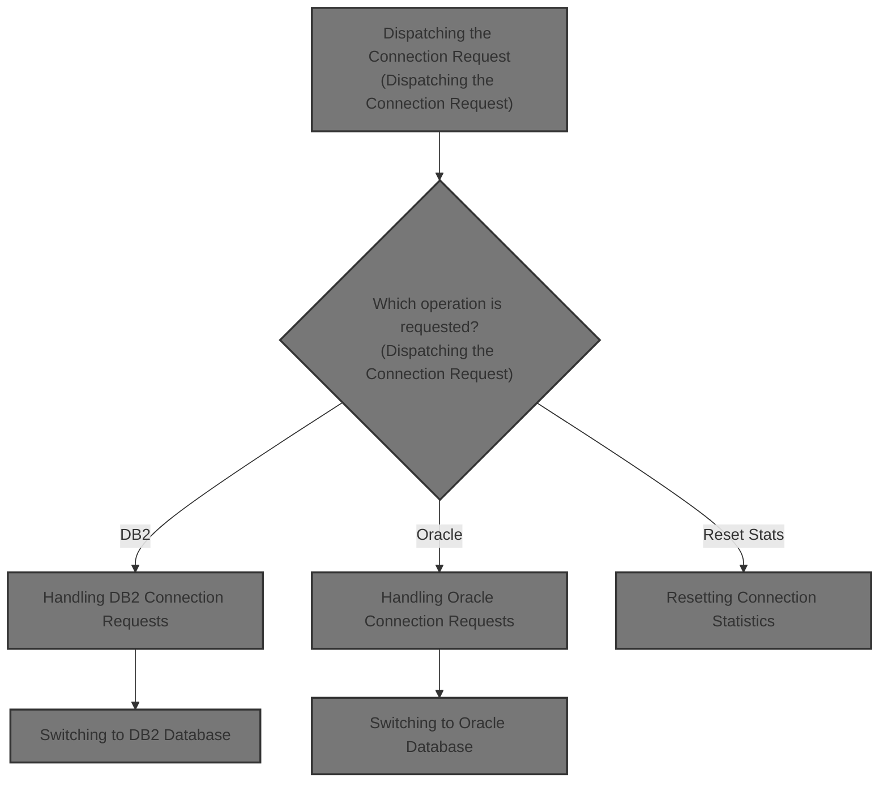
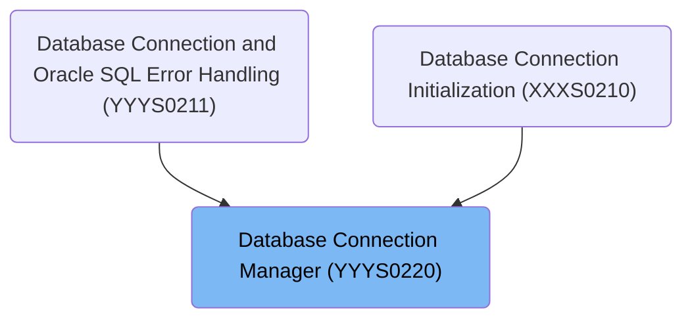

# Overview

This document describes how the system processes database connection requests, selects the appropriate database (DB2 or Oracle) based on the environment, and maintains connection statistics. The flow receives a connection request and returns the updated connection state, statistics, or information as needed.

## Dependencies

### Program

- YYYS0220 (<SwmPath>[base/src/YYYS0220.cbl](base/src/YYYS0220.cbl)</SwmPath>)

### Copybooks

- SQLCA
- XXXN001A (<SwmPath>[base/src/XXXN001A.cpy](base/src/XXXN001A.cpy)</SwmPath>)
- YYYC0220 (<SwmPath>[base/src/YYYC0220.cpy](base/src/YYYC0220.cpy)</SwmPath>)

# Where is this program used?

This program is used multiple times in the codebase as represented in the following diagram:

&nbsp;

*This is an auto-generated document by Swimm 🌊 and has not yet been verified by a human*

<SwmMeta version="3.0.0" repo-id="Z2l0aHViJTNBJTNBU3dpbW1pby1keW5jYWxsLWRlbW8lM0ElM0FHaXJpLVN3aW1t" repo-name="Swimmio-dyncall-demo">Powered by [Swimm](https://app.swimm.io/)</SwmMeta>
