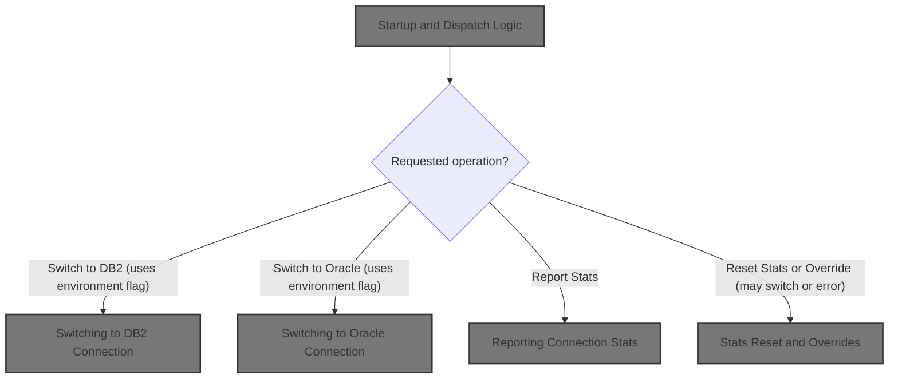
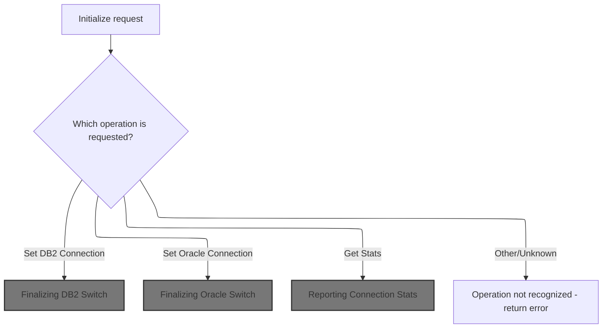
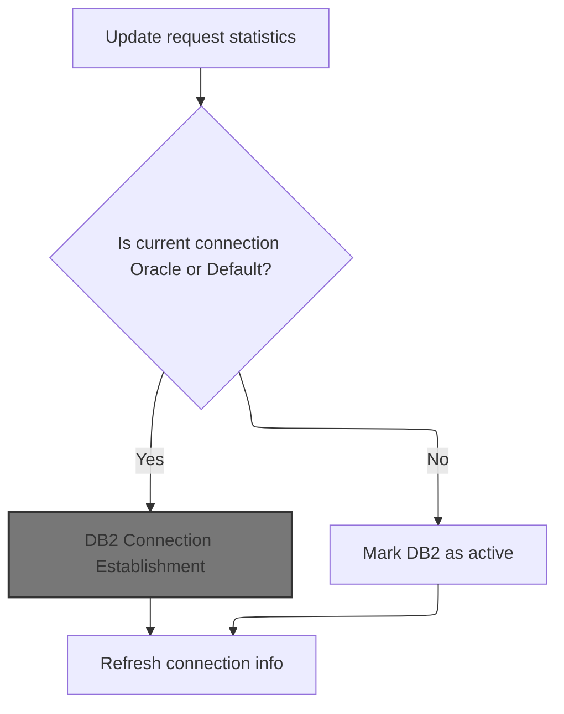
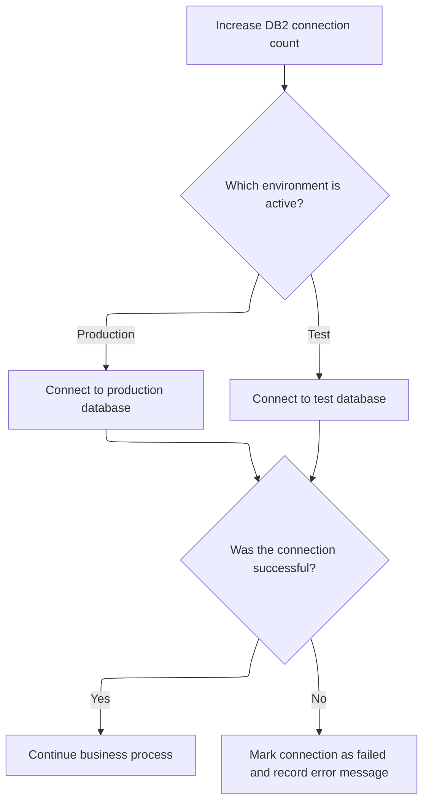
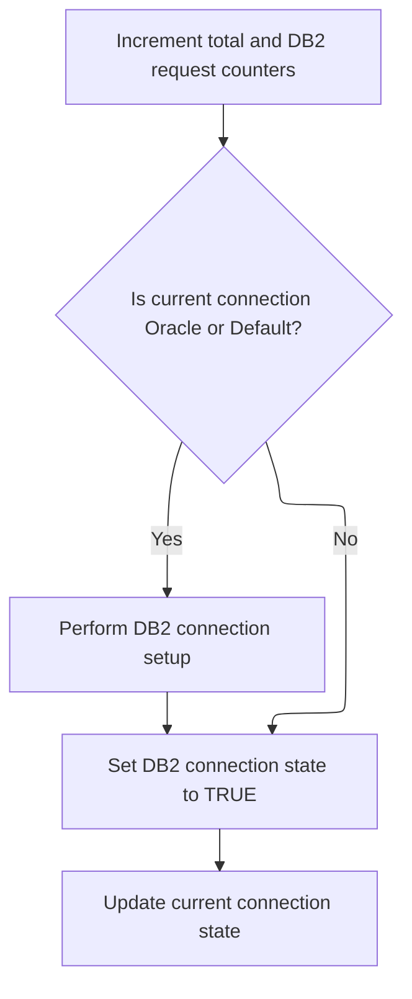
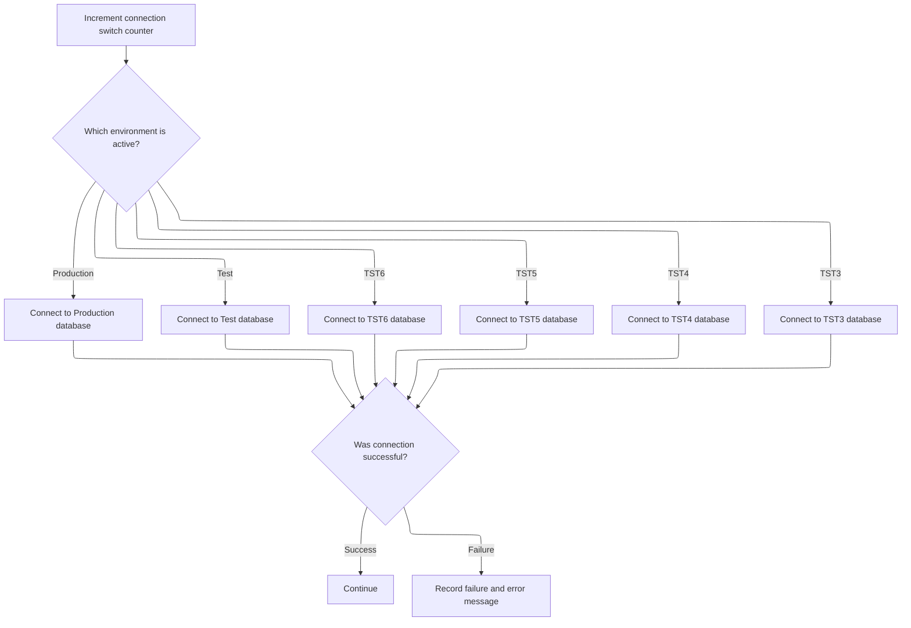
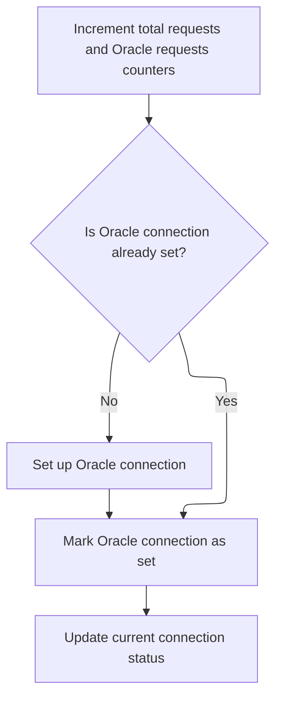
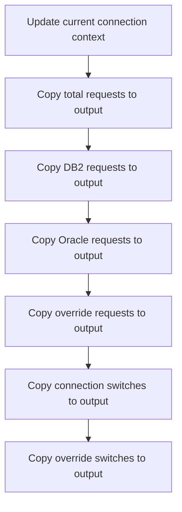

# Overview

This document describes the flow for managing database connections and tracking usage statistics. The system processes requests to switch between <SwmToken path="base/src/YYYS0220.cbl" pos="62:8:8" line-data="007100       WHEN YYYC0220-SET-DB2-CON                                  00007100">`DB2`</SwmToken> and Oracle environments, report connection statistics, and handle overrides, enabling flexible database management and real-time monitoring.



## Dependencies

### Program

- <SwmToken path="base/src/YYYS0220.cbl" pos="74:5:5" line-data="008300         MOVE &#39;YYYS0220 - Function not recognized!&#39;               00008300">`YYYS0220`</SwmToken> (<SwmPath>[base/src/YYYS0220.cbl](base/src/YYYS0220.cbl)</SwmPath>)

### Copybooks

- SQLCA
- <SwmToken path="base/src/YYYS0220.cbl" pos="86:4:4" line-data="009500     INITIALIZE XXXN001A                                          00009500">`XXXN001A`</SwmToken> (<SwmPath>[base/src/XXXN001A.cpy](base/src/XXXN001A.cpy)</SwmPath>)
- <SwmToken path="base/src/YYYS0220.cbl" pos="60:4:4" line-data="006900       WHEN YYYC0220-GET-CURR-CON                                 00006900">`YYYC0220`</SwmToken> (<SwmPath>[base/src/YYYC0220.cpy](base/src/YYYC0220.cpy)</SwmPath>)

# Where is this program used?

This program is used multiple times in the codebase as represented in the following diagram:

```mermaid
graph TD
  rpl88("Database Connection and Oracle SQL Error Handling (YYYS0211)") --> cpr08("Database Connection Manager (YYYS0220)"):::currentEntity
click rpl88 openCode "base/src/YYYS0211.cbl:1"
wxwaz("Database Connection Initialization (XXXS0210)") --> cpr08("Database Connection Manager (YYYS0220)"):::currentEntity
click wxwaz openCode "base/src/XXXS0210.cbl:1"
  
  
click cpr08 openCode "base/src/YYYS0220.cbl:1"
    classDef currentEntity color:#000000,fill:#7CB9F4

%% Swimm:
%% graph TD
%%   rpl88("Database Connection and Oracle SQL Error Handling (YYYS0211)") --> cpr08("Database Connection Manager (<SwmToken path="base/src/YYYS0220.cbl" pos="74:5:5" line-data="008300         MOVE &#39;YYYS0220 - Function not recognized!&#39;               00008300">`YYYS0220`</SwmToken>)"):::currentEntity
%% click rpl88 openCode "<SwmPath>[base/src/YYYS0211.cbl](base/src/YYYS0211.cbl)</SwmPath>:1"
%% wxwaz("Database Connection Initialization (XXXS0210)") --> cpr08("Database Connection Manager (<SwmToken path="base/src/YYYS0220.cbl" pos="74:5:5" line-data="008300         MOVE &#39;YYYS0220 - Function not recognized!&#39;               00008300">`YYYS0220`</SwmToken>)"):::currentEntity
%% click wxwaz openCode "<SwmPath>[base/src/XXXS0210.cbl](base/src/XXXS0210.cbl)</SwmPath>:1"
%%   
%%   
%% click cpr08 openCode "<SwmPath>[base/src/YYYS0220.cbl](base/src/YYYS0220.cbl)</SwmPath>:1"
%%     classDef currentEntity color:#000000,fill:#7CB9F4
```



## Detailed View of the Program's Functionality

# Program Startup and Request Dispatch

When the program starts, it first performs an initialization routine. This routine sets the environment to production mode, ensuring that all subsequent logic operates under the correct context and avoids using any test settings or uninitialized flags.

After initialization, the program examines the incoming request to determine which operation is being requested. The possible operations include:

- Fetching the current database connection type.
- Switching to a <SwmToken path="base/src/YYYS0220.cbl" pos="62:8:8" line-data="007100       WHEN YYYC0220-SET-DB2-CON                                  00007100">`DB2`</SwmToken> database connection.
- Switching to an Oracle database connection.
- Reporting connection statistics.
- Resetting statistics.
- Overriding the current connection.
- Handling any other or unknown operations.

Depending on the request, the program branches to the appropriate handler. If the request is not recognized, it marks the operation as a failure and sets an error message indicating the function is not recognized.

# Fetching the Current Connection

When asked to fetch the current connection, the program copies the internal representation of the current connection type to the output structure. This makes the current connection type available to the caller.

# Switching to <SwmToken path="base/src/YYYS0220.cbl" pos="62:8:8" line-data="007100       WHEN YYYC0220-SET-DB2-CON                                  00007100">`DB2`</SwmToken> Connection

When a request is made to switch to a <SwmToken path="base/src/YYYS0220.cbl" pos="62:8:8" line-data="007100       WHEN YYYC0220-SET-DB2-CON                                  00007100">`DB2`</SwmToken> connection, the program:

1. Increments both the total request counter and the DB2-specific request counter.
2. Checks if the current connection is either Oracle or the default (i.e., not already <SwmToken path="base/src/YYYS0220.cbl" pos="62:8:8" line-data="007100       WHEN YYYC0220-SET-DB2-CON                                  00007100">`DB2`</SwmToken>).
3. If so, it performs the <SwmToken path="base/src/YYYS0220.cbl" pos="62:8:8" line-data="007100       WHEN YYYC0220-SET-DB2-CON                                  00007100">`DB2`</SwmToken> connection setup routine:
   - Increments the connection switch counter.
   - Determines the active environment (production or test).
   - Connects to the appropriate <SwmToken path="base/src/YYYS0220.cbl" pos="62:8:8" line-data="007100       WHEN YYYC0220-SET-DB2-CON                                  00007100">`DB2`</SwmToken> database instance based on the environment.
   - Checks if the connection was successful. If not, it marks the operation as a failure and records an error message with the SQL error code.
4. Marks <SwmToken path="base/src/YYYS0220.cbl" pos="62:8:8" line-data="007100       WHEN YYYC0220-SET-DB2-CON                                  00007100">`DB2`</SwmToken> as the active connection.
5. Updates the output structure with the new connection type.

# Switching to Oracle Connection

When a request is made to switch to an Oracle connection, the program:

1. Increments both the total request counter and the Oracle-specific request counter.
2. Checks if Oracle is not already the active connection.
3. If not, it performs the Oracle connection setup routine:
   - Increments the connection switch counter.
   - Determines the active environment (production, test, or one of several test variants).
   - Connects to the appropriate Oracle database instance based on the environment, using a hardcoded connection string for each case.
   - Checks if the connection was successful. If not, it marks the operation as a failure and records an error message with the SQL error code.
4. Marks Oracle as the active connection.
5. Updates the output structure with the new connection type.

# Reporting Connection Statistics

When requested to report connection statistics, the program:

1. Updates the output structure with the current connection type to ensure the stats reflect the latest state.
2. Copies all tracked statistics from internal storage to the output structure. These statistics include:
   - Total number of requests.
   - Number of <SwmToken path="base/src/YYYS0220.cbl" pos="62:8:8" line-data="007100       WHEN YYYC0220-SET-DB2-CON                                  00007100">`DB2`</SwmToken> requests.
   - Number of Oracle requests.
   - Number of override requests.
   - Number of connection switches.
   - Number of override switches.

# Resetting Statistics

When requested to reset statistics, the program:

1. Initializes (resets) all statistics fields in both internal storage and the output structure, clearing any accumulated counts.

# Overriding the Current Connection

When a request is made to override the current connection, the program:

1. Increments the override request counter.
2. Checks which override flag is set (<SwmToken path="base/src/YYYS0220.cbl" pos="62:8:8" line-data="007100       WHEN YYYC0220-SET-DB2-CON                                  00007100">`DB2`</SwmToken> or Oracle).
   - If the <SwmToken path="base/src/YYYS0220.cbl" pos="62:8:8" line-data="007100       WHEN YYYC0220-SET-DB2-CON                                  00007100">`DB2`</SwmToken> override flag is set and <SwmToken path="base/src/YYYS0220.cbl" pos="62:8:8" line-data="007100       WHEN YYYC0220-SET-DB2-CON                                  00007100">`DB2`</SwmToken> is not already active, it marks <SwmToken path="base/src/YYYS0220.cbl" pos="62:8:8" line-data="007100       WHEN YYYC0220-SET-DB2-CON                                  00007100">`DB2`</SwmToken> as active and increments the override switch counter.
   - If the Oracle override flag is set and Oracle is not already active, it marks Oracle as active and increments the override switch counter.
   - If neither override flag is valid, it marks the operation as a failure and sets an error message indicating an invalid override connection.

# Error Handling

For any unrecognized operation or failed connection attempt, the program marks the operation as a failure and sets an appropriate error message in the output structure. This ensures that the caller is informed of any issues that occurred during processing.

# Rule Definition

| Paragraph Name                                                                                                                                                                                                                                                                                                                                                                                                                                                                                                                                                                                                                                                                                                                                                                                                                                                                                                                                                                                                                                                                                    | Rule ID | Category          | Description                                                                                                                                                                                                                                                                                                                                                                                                                                                                                                                                                                                                                                                                                                                                                                                                                                                                                                                                                                                                                                                                                                                                                                                                                                                                                                                                                                                                                                                                                                                                                                                                                                                                                                                                                                                                                                                                                                                                                                                                                                                                                                                                                                                                                                                                                                                                                                                                                        | Conditions                                                                                                                                                                                                  | Remarks                                                                                                                                                                                                                                                                                                                                                                                                                                                                                                                                                                                                                                                                                                                                                                                                                                                                                                                                                                                                                                                                                                                                                                                                                                                                                                                                                                                                                                                                                                                                                                                                                                                                                                                                                                                                                                                                                        |
| ------------------------------------------------------------------------------------------------------------------------------------------------------------------------------------------------------------------------------------------------------------------------------------------------------------------------------------------------------------------------------------------------------------------------------------------------------------------------------------------------------------------------------------------------------------------------------------------------------------------------------------------------------------------------------------------------------------------------------------------------------------------------------------------------------------------------------------------------------------------------------------------------------------------------------------------------------------------------------------------------------------------------------------------------------------------------------------------------- | ------- | ----------------- | ---------------------------------------------------------------------------------------------------------------------------------------------------------------------------------------------------------------------------------------------------------------------------------------------------------------------------------------------------------------------------------------------------------------------------------------------------------------------------------------------------------------------------------------------------------------------------------------------------------------------------------------------------------------------------------------------------------------------------------------------------------------------------------------------------------------------------------------------------------------------------------------------------------------------------------------------------------------------------------------------------------------------------------------------------------------------------------------------------------------------------------------------------------------------------------------------------------------------------------------------------------------------------------------------------------------------------------------------------------------------------------------------------------------------------------------------------------------------------------------------------------------------------------------------------------------------------------------------------------------------------------------------------------------------------------------------------------------------------------------------------------------------------------------------------------------------------------------------------------------------------------------------------------------------------------------------------------------------------------------------------------------------------------------------------------------------------------------------------------------------------------------------------------------------------------------------------------------------------------------------------------------------------------------------------------------------------------------------------------------------------------------------------------------------------------- | ----------------------------------------------------------------------------------------------------------------------------------------------------------------------------------------------------------- | ---------------------------------------------------------------------------------------------------------------------------------------------------------------------------------------------------------------------------------------------------------------------------------------------------------------------------------------------------------------------------------------------------------------------------------------------------------------------------------------------------------------------------------------------------------------------------------------------------------------------------------------------------------------------------------------------------------------------------------------------------------------------------------------------------------------------------------------------------------------------------------------------------------------------------------------------------------------------------------------------------------------------------------------------------------------------------------------------------------------------------------------------------------------------------------------------------------------------------------------------------------------------------------------------------------------------------------------------------------------------------------------------------------------------------------------------------------------------------------------------------------------------------------------------------------------------------------------------------------------------------------------------------------------------------------------------------------------------------------------------------------------------------------------------------------------------------------------------------------------------------------------------- |
| <SwmToken path="base/src/YYYS0220.cbl" pos="57:4:6" line-data="006600     PERFORM 100-INITIALIZATION                                   00006600">`100-INITIALIZATION`</SwmToken>                                                                                                                                                                                                                                                                                                                                                                                                                                                                                                                                                                                                                                                                                                                                                                                                                                                                                                                  | RL-001  | Data Assignment   | At program startup, all statistics counters are set to zero, the current connection type is set to blank, and the environment flag is set to production mode.                                                                                                                                                                                                                                                                                                                                                                                                                                                                                                                                                                                                                                                                                                                                                                                                                                                                                                                                                                                                                                                                                                                                                                                                                                                                                                                                                                                                                                                                                                                                                                                                                                                                                                                                                                                                                                                                                                                                                                                                                                                                                                                                                                                                                                                                      | Program is starting up.                                                                                                                                                                                     | Statistics counters: total requests, <SwmToken path="base/src/YYYS0220.cbl" pos="62:8:8" line-data="007100       WHEN YYYC0220-SET-DB2-CON                                  00007100">`DB2`</SwmToken> requests, Oracle requests, override requests, connection switches, override switches. Current connection type: blank (" "). Environment flag: 'P' for production. Output structure fields must be synchronized after initialization.                                                                                                                                                                                                                                                                                                                                                                                                                                                                                                                                                                                                                                                                                                                                                                                                                                                                                                                                                                                                                                                                                                                                                                                                                                                                                                                                                                                                                                                    |
| <SwmToken path="base/src/YYYS0220.cbl" pos="56:2:6" line-data="006500 0000-EXIT-DISPATCHER.                                            00006500">`0000-EXIT-DISPATCHER`</SwmToken>                                                                                                                                                                                                                                                                                                                                                                                                                                                                                                                                                                                                                                                                                                                                                                                                                                                                                                                | RL-002  | Conditional Logic | The dispatcher evaluates the operation flags in the input structure and performs the corresponding operation: get/set current connection, get/reset statistics, or override connection.                                                                                                                                                                                                                                                                                                                                                                                                                                                                                                                                                                                                                                                                                                                                                                                                                                                                                                                                                                                                                                                                                                                                                                                                                                                                                                                                                                                                                                                                                                                                                                                                                                                                                                                                                                                                                                                                                                                                                                                                                                                                                                                                                                                                                                            | A request is received with one or more operation flags set.                                                                                                                                                 | Operation flags: <SwmToken path="base/src/YYYS0220.cbl" pos="60:6:10" line-data="006900       WHEN YYYC0220-GET-CURR-CON                                 00006900">`GET-CURR-CON`</SwmToken>, <SwmToken path="base/src/YYYS0220.cbl" pos="62:6:10" line-data="007100       WHEN YYYC0220-SET-DB2-CON                                  00007100">`SET-DB2-CON`</SwmToken>, <SwmToken path="base/src/YYYS0220.cbl" pos="64:6:10" line-data="007300       WHEN YYYC0220-SET-ORACLE-CON                               00007300">`SET-ORACLE-CON`</SwmToken>, <SwmToken path="base/src/YYYS0220.cbl" pos="66:6:8" line-data="007500       WHEN YYYC0220-GET-STATS                                    00007500">`GET-STATS`</SwmToken>, <SwmToken path="base/src/YYYS0220.cbl" pos="68:6:8" line-data="007700       WHEN YYYC0220-SET-STATS                                    00007700">`SET-STATS`</SwmToken>, <SwmToken path="base/src/YYYS0220.cbl" pos="70:6:10" line-data="007900       WHEN YYYC0220-SET-OVERRIDE-CON                             00007900">`SET-OVERRIDE-CON`</SwmToken>. Only one operation is processed per request. If no recognized flag is set, an error is returned.                                                                                                                                                                                                                                                                                                                                                                                                                                                                                                                                                                                                                                                                                                   |
| <SwmToken path="base/src/YYYS0220.cbl" pos="63:4:10" line-data="007200         PERFORM 300-SET-DB2-CON                                  00007200">`300-SET-DB2-CON`</SwmToken>, <SwmToken path="base/src/YYYS0220.cbl" pos="111:4:12" line-data="012000       PERFORM 310-DO-SET-DB2-CON                                 00012000">`310-DO-SET-DB2-CON`</SwmToken>                                                                                                                                                                                                                                                                                                                                                                                                                                                                                                                                                                                                                                                                                                                                | RL-003  | Computation       | When a request to set <SwmToken path="base/src/YYYS0220.cbl" pos="62:8:8" line-data="007100       WHEN YYYC0220-SET-DB2-CON                                  00007100">`DB2`</SwmToken> connection is received, increment total and <SwmToken path="base/src/YYYS0220.cbl" pos="62:8:8" line-data="007100       WHEN YYYC0220-SET-DB2-CON                                  00007100">`DB2`</SwmToken> request counters. If the current connection is Oracle or Default, perform a connection switch to <SwmToken path="base/src/YYYS0220.cbl" pos="62:8:8" line-data="007100       WHEN YYYC0220-SET-DB2-CON                                  00007100">`DB2`</SwmToken>, increment connection switches, and set current connection to 'D'.                                                                                                                                                                                                                                                                                                                                                                                                                                                                                                                                                                                                                                                                                                                                                                                                                                                                                                                                                                                                                                                                                                                                                                                                                                                                                                                                                                                                                                                                                                                                                                                                                                                                                        | <SwmToken path="base/src/YYYS0220.cbl" pos="62:6:10" line-data="007100       WHEN YYYC0220-SET-DB2-CON                                  00007100">`SET-DB2-CON`</SwmToken> flag is set in the request.      | <SwmToken path="base/src/YYYS0220.cbl" pos="62:8:8" line-data="007100       WHEN YYYC0220-SET-DB2-CON                                  00007100">`DB2`</SwmToken> connection code: 'D'. Connection switch performed only if current is Oracle ('0') or Default (' '). Connection string: <SwmToken path="base/src/YYYS0220.cbl" pos="125:6:6" line-data="013400           CONNECT TO DB2P                                        00013400">`DB2P`</SwmToken> for production, <SwmToken path="base/src/YYYS0220.cbl" pos="129:6:6" line-data="013800           CONNECT TO DB2T                                        00013800">`DB2T`</SwmToken> otherwise.                                                                                                                                                                                                                                                                                                                                                                                                                                                                                                                                                                                                                                                                                                                                                                                                                                                                                                                                                                                                                                                                                                                                                                                                                                    |
| <SwmToken path="base/src/YYYS0220.cbl" pos="65:4:10" line-data="007400         PERFORM 400-SET-ORACLE-CON                               00007400">`400-SET-ORACLE-CON`</SwmToken>, <SwmToken path="base/src/YYYS0220.cbl" pos="155:4:12" line-data="016400       PERFORM 410-DO-SET-ORACLE-CON                              00016400">`410-DO-SET-ORACLE-CON`</SwmToken>                                                                                                                                                                                                                                                                                                                                                                                                                                                                                                                                                                                                                                                                                                                          | RL-004  | Computation       | When a request to set Oracle connection is received, increment total and Oracle request counters. If Oracle is not already active, perform a connection switch to Oracle, increment connection switches, and set current connection to '0'.                                                                                                                                                                                                                                                                                                                                                                                                                                                                                                                                                                                                                                                                                                                                                                                                                                                                                                                                                                                                                                                                                                                                                                                                                                                                                                                                                                                                                                                                                                                                                                                                                                                                                                                                                                                                                                                                                                                                                                                                                                                                                                                                                                                        | <SwmToken path="base/src/YYYS0220.cbl" pos="64:6:10" line-data="007300       WHEN YYYC0220-SET-ORACLE-CON                               00007300">`SET-ORACLE-CON`</SwmToken> flag is set in the request.   | Oracle connection code: '0'. Connection switch performed only if Oracle is not already active. Connection string: <SwmToken path="base/src/YYYS0220.cbl" pos="169:6:6" line-data="017800           CONNECT TO DRDAASP1                                    00017800">`DRDAASP1`</SwmToken> for production, <SwmToken path="base/src/YYYS0220.cbl" pos="174:6:6" line-data="018300           CONNECT TO DRDAASC7                                    00018300">`DRDAASC7`</SwmToken> for test, <SwmToken path="base/src/YYYS0220.cbl" pos="179:6:6" line-data="018800           CONNECT TO DRDAASC6                                    00018800">`DRDAASC6`</SwmToken> for <SwmToken path="base/src/YYYS0220.cbl" pos="177:6:6" line-data="018600       WHEN WS-TST6                                               00018600">`TST6`</SwmToken>, <SwmToken path="base/src/YYYS0220.cbl" pos="184:6:6" line-data="019300           CONNECT TO DRDAASC5                                    00019300">`DRDAASC5`</SwmToken> for <SwmToken path="base/src/YYYS0220.cbl" pos="182:6:6" line-data="019100       WHEN WS-TST5                                               00019100">`TST5`</SwmToken>, <SwmToken path="base/src/YYYS0220.cbl" pos="189:6:6" line-data="019800           CONNECT TO DRDAASD1                                    00019800">`DRDAASD1`</SwmToken> for <SwmToken path="base/src/YYYS0220.cbl" pos="187:6:6" line-data="019600       WHEN WS-TST4                                               00019600">`TST4`</SwmToken>, <SwmToken path="base/src/YYYS0220.cbl" pos="194:6:6" line-data="020300           CONNECT TO DRDAASC1                                    00020300">`DRDAASC1`</SwmToken> for <SwmToken path="base/src/YYYS0220.cbl" pos="89:7:7" line-data="009800*    SET WS-TST3 TO TRUE                                          00009800">`TST3`</SwmToken>. |
| <SwmToken path="base/src/YYYS0220.cbl" pos="61:4:10" line-data="007000         PERFORM 200-GET-CURR-CON                                 00007000">`200-GET-CURR-CON`</SwmToken>                                                                                                                                                                                                                                                                                                                                                                                                                                                                                                                                                                                                                                                                                                                                                                                                                                                                                                                   | RL-005  | Data Assignment   | When a request to get the current connection is received, set the output field for current connection type to the internal value ('D', '0', or blank).                                                                                                                                                                                                                                                                                                                                                                                                                                                                                                                                                                                                                                                                                                                                                                                                                                                                                                                                                                                                                                                                                                                                                                                                                                                                                                                                                                                                                                                                                                                                                                                                                                                                                                                                                                                                                                                                                                                                                                                                                                                                                                                                                                                                                                                                             | <SwmToken path="base/src/YYYS0220.cbl" pos="60:6:10" line-data="006900       WHEN YYYC0220-GET-CURR-CON                                 00006900">`GET-CURR-CON`</SwmToken> flag is set in the request.     | Current connection type: 'D' (<SwmToken path="base/src/YYYS0220.cbl" pos="62:8:8" line-data="007100       WHEN YYYC0220-SET-DB2-CON                                  00007100">`DB2`</SwmToken>), '0' (Oracle), or blank (Default). Output field is a single character string.                                                                                                                                                                                                                                                                                                                                                                                                                                                                                                                                                                                                                                                                                                                                                                                                                                                                                                                                                                                                                                                                                                                                                                                                                                                                                                                                                                                                                                                                                                                                                                                                                 |
| <SwmToken path="base/src/YYYS0220.cbl" pos="67:4:8" line-data="007600         PERFORM 500-GET-STATS                                    00007600">`500-GET-STATS`</SwmToken>                                                                                                                                                                                                                                                                                                                                                                                                                                                                                                                                                                                                                                                                                                                                                                                                                                                                                                                       | RL-006  | Data Assignment   | When a request to get statistics is received, update the output structure with the latest values of all statistics counters and the current connection type.                                                                                                                                                                                                                                                                                                                                                                                                                                                                                                                                                                                                                                                                                                                                                                                                                                                                                                                                                                                                                                                                                                                                                                                                                                                                                                                                                                                                                                                                                                                                                                                                                                                                                                                                                                                                                                                                                                                                                                                                                                                                                                                                                                                                                                                                       | <SwmToken path="base/src/YYYS0220.cbl" pos="66:6:8" line-data="007500       WHEN YYYC0220-GET-STATS                                    00007500">`GET-STATS`</SwmToken> flag is set in the request.         | Statistics counters: total requests, <SwmToken path="base/src/YYYS0220.cbl" pos="62:8:8" line-data="007100       WHEN YYYC0220-SET-DB2-CON                                  00007100">`DB2`</SwmToken> requests, Oracle requests, override requests, connection switches, override switches. Output fields are numeric, current connection is a single character string.                                                                                                                                                                                                                                                                                                                                                                                                                                                                                                                                                                                                                                                                                                                                                                                                                                                                                                                                                                                                                                                                                                                                                                                                                                                                                                                                                                                                                                                                                                                       |
| <SwmToken path="base/src/YYYS0220.cbl" pos="69:4:8" line-data="007800         PERFORM 600-SET-STATS                                    00007800">`600-SET-STATS`</SwmToken>                                                                                                                                                                                                                                                                                                                                                                                                                                                                                                                                                                                                                                                                                                                                                                                                                                                                                                                       | RL-007  | Data Assignment   | When a request to reset statistics is received, set all statistics counters in both internal and output structures to zero and synchronize the output structure.                                                                                                                                                                                                                                                                                                                                                                                                                                                                                                                                                                                                                                                                                                                                                                                                                                                                                                                                                                                                                                                                                                                                                                                                                                                                                                                                                                                                                                                                                                                                                                                                                                                                                                                                                                                                                                                                                                                                                                                                                                                                                                                                                                                                                                                                   | <SwmToken path="base/src/YYYS0220.cbl" pos="68:6:8" line-data="007700       WHEN YYYC0220-SET-STATS                                    00007700">`SET-STATS`</SwmToken> flag is set in the request.         | All statistics counters are set to 0. Output structure is synchronized.                                                                                                                                                                                                                                                                                                                                                                                                                                                                                                                                                                                                                                                                                                                                                                                                                                                                                                                                                                                                                                                                                                                                                                                                                                                                                                                                                                                                                                                                                                                                                                                                                                                                                                                                                                                                                        |
| <SwmToken path="base/src/YYYS0220.cbl" pos="71:4:10" line-data="008000         PERFORM 700-SET-OVERRIDE-CON                             00008000">`700-SET-OVERRIDE-CON`</SwmToken>                                                                                                                                                                                                                                                                                                                                                                                                                                                                                                                                                                                                                                                                                                                                                                                                                                                                                                               | RL-008  | Computation       | When a request to override the connection is received, increment override requests. If <SwmToken path="base/src/YYYS0220.cbl" pos="62:8:8" line-data="007100       WHEN YYYC0220-SET-DB2-CON                                  00007100">`DB2`</SwmToken> override is requested and <SwmToken path="base/src/YYYS0220.cbl" pos="62:8:8" line-data="007100       WHEN YYYC0220-SET-DB2-CON                                  00007100">`DB2`</SwmToken> is not already active, perform a connection switch to <SwmToken path="base/src/YYYS0220.cbl" pos="62:8:8" line-data="007100       WHEN YYYC0220-SET-DB2-CON                                  00007100">`DB2`</SwmToken>, increment override switches, and set current connection to 'D'. If Oracle override is requested and Oracle is not already active, perform a connection switch to Oracle, increment override switches, and set current connection to '0'. If neither override is valid, set FAILURE and error message.                                                                                                                                                                                                                                                                                                                                                                                                                                                                                                                                                                                                                                                                                                                                                                                                                                                                                                                                                                                                                                                                                                                                                                                                                                                                                                                                                                                                                                                | <SwmToken path="base/src/YYYS0220.cbl" pos="70:6:10" line-data="007900       WHEN YYYC0220-SET-OVERRIDE-CON                             00007900">`SET-OVERRIDE-CON`</SwmToken> flag is set in the request. | Override switches and requests counters are incremented as appropriate. Error message for invalid override: '<SwmToken path="base/src/YYYS0220.cbl" pos="74:5:5" line-data="008300         MOVE &#39;YYYS0220 - Function not recognized!&#39;               00008300">`YYYS0220`</SwmToken> - Invalid <SwmToken path="base/src/YYYS0220.cbl" pos="255:11:13" line-data="026400         MOVE &#39;YYYS0220 - Invalid over-ride connection!&#39;          00026400">`over-ride`</SwmToken> connection!'.                                                                                                                                                                                                                                                                                                                                                                                                                                                                                                                                                                                                                                                                                                                                                                                                                                                                                                                                                                                                                                                                                                                                                                                                                                                                                                                                                                                         |
| <SwmToken path="base/src/YYYS0220.cbl" pos="111:4:12" line-data="012000       PERFORM 310-DO-SET-DB2-CON                                 00012000">`310-DO-SET-DB2-CON`</SwmToken>, <SwmToken path="base/src/YYYS0220.cbl" pos="155:4:12" line-data="016400       PERFORM 410-DO-SET-ORACLE-CON                              00016400">`410-DO-SET-ORACLE-CON`</SwmToken>                                                                                                                                                                                                                                                                                                                                                                                                                                                                                                                                                                                                                                                                                                                         | RL-009  | Conditional Logic | When performing a connection switch, select the connection string based on the environment flag. For <SwmToken path="base/src/YYYS0220.cbl" pos="62:8:8" line-data="007100       WHEN YYYC0220-SET-DB2-CON                                  00007100">`DB2`</SwmToken>: <SwmToken path="base/src/YYYS0220.cbl" pos="125:6:6" line-data="013400           CONNECT TO DB2P                                        00013400">`DB2P`</SwmToken> if production, <SwmToken path="base/src/YYYS0220.cbl" pos="129:6:6" line-data="013800           CONNECT TO DB2T                                        00013800">`DB2T`</SwmToken> otherwise. For Oracle: <SwmToken path="base/src/YYYS0220.cbl" pos="169:6:6" line-data="017800           CONNECT TO DRDAASP1                                    00017800">`DRDAASP1`</SwmToken> for production, <SwmToken path="base/src/YYYS0220.cbl" pos="174:6:6" line-data="018300           CONNECT TO DRDAASC7                                    00018300">`DRDAASC7`</SwmToken> for test, <SwmToken path="base/src/YYYS0220.cbl" pos="179:6:6" line-data="018800           CONNECT TO DRDAASC6                                    00018800">`DRDAASC6`</SwmToken> for <SwmToken path="base/src/YYYS0220.cbl" pos="177:6:6" line-data="018600       WHEN WS-TST6                                               00018600">`TST6`</SwmToken>, <SwmToken path="base/src/YYYS0220.cbl" pos="184:6:6" line-data="019300           CONNECT TO DRDAASC5                                    00019300">`DRDAASC5`</SwmToken> for <SwmToken path="base/src/YYYS0220.cbl" pos="182:6:6" line-data="019100       WHEN WS-TST5                                               00019100">`TST5`</SwmToken>, <SwmToken path="base/src/YYYS0220.cbl" pos="189:6:6" line-data="019800           CONNECT TO DRDAASD1                                    00019800">`DRDAASD1`</SwmToken> for <SwmToken path="base/src/YYYS0220.cbl" pos="187:6:6" line-data="019600       WHEN WS-TST4                                               00019600">`TST4`</SwmToken>, <SwmToken path="base/src/YYYS0220.cbl" pos="194:6:6" line-data="020300           CONNECT TO DRDAASC1                                    00020300">`DRDAASC1`</SwmToken> for <SwmToken path="base/src/YYYS0220.cbl" pos="89:7:7" line-data="009800*    SET WS-TST3 TO TRUE                                          00009800">`TST3`</SwmToken>. | A connection switch is being performed.                                                                                                                                                                     | Environment flag values: 'P', 'T', '6', '5', '4', '3'. Connection string values as above.                                                                                                                                                                                                                                                                                                                                                                                                                                                                                                                                                                                                                                                                                                                                                                                                                                                                                                                                                                                                                                                                                                                                                                                                                                                                                                                                                                                                                                                                                                                                                                                                                                                                                                                                                                                                      |
| <SwmToken path="base/src/YYYS0220.cbl" pos="111:4:12" line-data="012000       PERFORM 310-DO-SET-DB2-CON                                 00012000">`310-DO-SET-DB2-CON`</SwmToken>, <SwmToken path="base/src/YYYS0220.cbl" pos="155:4:12" line-data="016400       PERFORM 410-DO-SET-ORACLE-CON                              00016400">`410-DO-SET-ORACLE-CON`</SwmToken>                                                                                                                                                                                                                                                                                                                                                                                                                                                                                                                                                                                                                                                                                                                         | RL-010  | Conditional Logic | If a connection attempt fails (SQLCODE not zero), set FAILURE to true and set the return message to indicate the failure and SQLCODE.                                                                                                                                                                                                                                                                                                                                                                                                                                                                                                                                                                                                                                                                                                                                                                                                                                                                                                                                                                                                                                                                                                                                                                                                                                                                                                                                                                                                                                                                                                                                                                                                                                                                                                                                                                                                                                                                                                                                                                                                                                                                                                                                                                                                                                                                                              | A connection attempt returns a non-zero SQLCODE.                                                                                                                                                            | Error message for <SwmToken path="base/src/YYYS0220.cbl" pos="62:8:8" line-data="007100       WHEN YYYC0220-SET-DB2-CON                                  00007100">`DB2`</SwmToken>: '<SwmToken path="base/src/YYYS0220.cbl" pos="74:5:5" line-data="008300         MOVE &#39;YYYS0220 - Function not recognized!&#39;               00008300">`YYYS0220`</SwmToken> - Failure connecting to <SwmToken path="base/src/YYYS0220.cbl" pos="62:8:8" line-data="007100       WHEN YYYC0220-SET-DB2-CON                                  00007100">`DB2`</SwmToken>, SQL=\[SQLCODE\]'. Error message for Oracle: '<SwmToken path="base/src/YYYS0220.cbl" pos="74:5:5" line-data="008300         MOVE &#39;YYYS0220 - Function not recognized!&#39;               00008300">`YYYS0220`</SwmToken> - Failure connecting to Oracle, SQL=\[SQLCODE\]'.                                                                                                                                                                                                                                                                                                                                                                                                                                                                                                                                                                                                                                                                                                                                                                                                                                                                                                                                                                                                                                                  |
| <SwmToken path="base/src/YYYS0220.cbl" pos="61:4:10" line-data="007000         PERFORM 200-GET-CURR-CON                                 00007000">`200-GET-CURR-CON`</SwmToken>, <SwmToken path="base/src/YYYS0220.cbl" pos="67:4:8" line-data="007600         PERFORM 500-GET-STATS                                    00007600">`500-GET-STATS`</SwmToken>, <SwmToken path="base/src/YYYS0220.cbl" pos="69:4:8" line-data="007800         PERFORM 600-SET-STATS                                    00007800">`600-SET-STATS`</SwmToken>, <SwmToken path="base/src/YYYS0220.cbl" pos="63:4:10" line-data="007200         PERFORM 300-SET-DB2-CON                                  00007200">`300-SET-DB2-CON`</SwmToken>, <SwmToken path="base/src/YYYS0220.cbl" pos="65:4:10" line-data="007400         PERFORM 400-SET-ORACLE-CON                               00007400">`400-SET-ORACLE-CON`</SwmToken>, <SwmToken path="base/src/YYYS0220.cbl" pos="71:4:10" line-data="008000         PERFORM 700-SET-OVERRIDE-CON                             00008000">`700-SET-OVERRIDE-CON`</SwmToken> | RL-011  | Data Assignment   | After any operation that changes the connection type or statistics, and whenever stats or current connection are requested, the output structure must be synchronized with the latest internal state.                                                                                                                                                                                                                                                                                                                                                                                                                                                                                                                                                                                                                                                                                                                                                                                                                                                                                                                                                                                                                                                                                                                                                                                                                                                                                                                                                                                                                                                                                                                                                                                                                                                                                                                                                                                                                                                                                                                                                                                                                                                                                                                                                                                                                              | Any operation that changes connection type or statistics, or when stats/current connection are requested.                                                                                                   | Output structure fields must match internal state for all statistics and current connection type.                                                                                                                                                                                                                                                                                                                                                                                                                                                                                                                                                                                                                                                                                                                                                                                                                                                                                                                                                                                                                                                                                                                                                                                                                                                                                                                                                                                                                                                                                                                                                                                                                                                                                                                                                                                              |
| <SwmToken path="base/src/YYYS0220.cbl" pos="56:2:6" line-data="006500 0000-EXIT-DISPATCHER.                                            00006500">`0000-EXIT-DISPATCHER`</SwmToken>                                                                                                                                                                                                                                                                                                                                                                                                                                                                                                                                                                                                                                                                                                                                                                                                                                                                                                                | RL-012  | Conditional Logic | All state updates and request handling are performed sequentially and atomically per request. Concurrency is not supported.                                                                                                                                                                                                                                                                                                                                                                                                                                                                                                                                                                                                                                                                                                                                                                                                                                                                                                                                                                                                                                                                                                                                                                                                                                                                                                                                                                                                                                                                                                                                                                                                                                                                                                                                                                                                                                                                                                                                                                                                                                                                                                                                                                                                                                                                                                        | Any request is being processed.                                                                                                                                                                             | No concurrency or parallelism is allowed. Each request is processed to completion before the next begins.                                                                                                                                                                                                                                                                                                                                                                                                                                                                                                                                                                                                                                                                                                                                                                                                                                                                                                                                                                                                                                                                                                                                                                                                                                                                                                                                                                                                                                                                                                                                                                                                                                                                                                                                                                                      |

# User Stories

## User Story 1: System initialization and state synchronization

---

### Story Description:

As a system, I want to initialize all statistics counters to zero, set the current connection type to blank, and set the environment flag to production mode at startup so that the system starts in a known, consistent state and the output structure matches the internal state.

---

### Business Rule Mapping:

| Rule ID | Paragraph Name                                                                                                                                                                                                                                                                                                                                                                                                                                                                                                                                                                                                                                                                                                                                                                                                                                                                                                                                                                                                                                                                                    | Rule Description                                                                                                                                                                                      |
| ------- | ------------------------------------------------------------------------------------------------------------------------------------------------------------------------------------------------------------------------------------------------------------------------------------------------------------------------------------------------------------------------------------------------------------------------------------------------------------------------------------------------------------------------------------------------------------------------------------------------------------------------------------------------------------------------------------------------------------------------------------------------------------------------------------------------------------------------------------------------------------------------------------------------------------------------------------------------------------------------------------------------------------------------------------------------------------------------------------------------- | ----------------------------------------------------------------------------------------------------------------------------------------------------------------------------------------------------- |
| RL-001  | <SwmToken path="base/src/YYYS0220.cbl" pos="57:4:6" line-data="006600     PERFORM 100-INITIALIZATION                                   00006600">`100-INITIALIZATION`</SwmToken>                                                                                                                                                                                                                                                                                                                                                                                                                                                                                                                                                                                                                                                                                                                                                                                                                                                                                                                  | At program startup, all statistics counters are set to zero, the current connection type is set to blank, and the environment flag is set to production mode.                                         |
| RL-011  | <SwmToken path="base/src/YYYS0220.cbl" pos="61:4:10" line-data="007000         PERFORM 200-GET-CURR-CON                                 00007000">`200-GET-CURR-CON`</SwmToken>, <SwmToken path="base/src/YYYS0220.cbl" pos="67:4:8" line-data="007600         PERFORM 500-GET-STATS                                    00007600">`500-GET-STATS`</SwmToken>, <SwmToken path="base/src/YYYS0220.cbl" pos="69:4:8" line-data="007800         PERFORM 600-SET-STATS                                    00007800">`600-SET-STATS`</SwmToken>, <SwmToken path="base/src/YYYS0220.cbl" pos="63:4:10" line-data="007200         PERFORM 300-SET-DB2-CON                                  00007200">`300-SET-DB2-CON`</SwmToken>, <SwmToken path="base/src/YYYS0220.cbl" pos="65:4:10" line-data="007400         PERFORM 400-SET-ORACLE-CON                               00007400">`400-SET-ORACLE-CON`</SwmToken>, <SwmToken path="base/src/YYYS0220.cbl" pos="71:4:10" line-data="008000         PERFORM 700-SET-OVERRIDE-CON                             00008000">`700-SET-OVERRIDE-CON`</SwmToken> | After any operation that changes the connection type or statistics, and whenever stats or current connection are requested, the output structure must be synchronized with the latest internal state. |

---

### Relevant Functionality:

- <SwmToken path="base/src/YYYS0220.cbl" pos="57:4:6" line-data="006600     PERFORM 100-INITIALIZATION                                   00006600">`100-INITIALIZATION`</SwmToken>
  1. **RL-001:**
     - Set all statistics counters to 0
     - Set current connection type to blank
     - Set environment flag to 'P' (production)
     - Synchronize output structure with internal state
- <SwmToken path="base/src/YYYS0220.cbl" pos="61:4:10" line-data="007000         PERFORM 200-GET-CURR-CON                                 00007000">`200-GET-CURR-CON`</SwmToken>
  1. **RL-011:**
     - After relevant operations, copy all internal state fields to output structure

## User Story 2: Request dispatch and operation handling

---

### Story Description:

As a system, I want to process requests based on operation flags in the input structure so that users can set or get the current connection, get or reset statistics, or override the connection, and receive appropriate feedback if an unrecognized operation is requested.

---

### Business Rule Mapping:

| Rule ID | Paragraph Name                                                                                                                                                                     | Rule Description                                                                                                                                                                        |
| ------- | ---------------------------------------------------------------------------------------------------------------------------------------------------------------------------------- | --------------------------------------------------------------------------------------------------------------------------------------------------------------------------------------- |
| RL-002  | <SwmToken path="base/src/YYYS0220.cbl" pos="56:2:6" line-data="006500 0000-EXIT-DISPATCHER.                                            00006500">`0000-EXIT-DISPATCHER`</SwmToken> | The dispatcher evaluates the operation flags in the input structure and performs the corresponding operation: get/set current connection, get/reset statistics, or override connection. |
| RL-012  | <SwmToken path="base/src/YYYS0220.cbl" pos="56:2:6" line-data="006500 0000-EXIT-DISPATCHER.                                            00006500">`0000-EXIT-DISPATCHER`</SwmToken> | All state updates and request handling are performed sequentially and atomically per request. Concurrency is not supported.                                                             |

---

### Relevant Functionality:

- <SwmToken path="base/src/YYYS0220.cbl" pos="56:2:6" line-data="006500 0000-EXIT-DISPATCHER.                                            00006500">`0000-EXIT-DISPATCHER`</SwmToken>
  1. **RL-002:**
     - Evaluate operation flags in input
     - For each recognized flag, perform the corresponding operation section
     - If no recognized flag, set FAILURE to true and set return message to '<SwmToken path="base/src/YYYS0220.cbl" pos="74:5:5" line-data="008300         MOVE &#39;YYYS0220 - Function not recognized!&#39;               00008300">`YYYS0220`</SwmToken> - Function not recognized!'
  2. **RL-012:**
     - Process each request fully before starting the next
     - Do not allow concurrent updates

## User Story 3: Set <SwmToken path="base/src/YYYS0220.cbl" pos="62:8:8" line-data="007100       WHEN YYYC0220-SET-DB2-CON                                  00007100">`DB2`</SwmToken> connection

---

### Story Description:

As a user, I want to set the connection to <SwmToken path="base/src/YYYS0220.cbl" pos="62:8:8" line-data="007100       WHEN YYYC0220-SET-DB2-CON                                  00007100">`DB2`</SwmToken> so that the system switches to <SwmToken path="base/src/YYYS0220.cbl" pos="62:8:8" line-data="007100       WHEN YYYC0220-SET-DB2-CON                                  00007100">`DB2`</SwmToken> if necessary, updates statistics counters, selects the correct connection string based on the environment, and provides error feedback if the connection fails.

---

### Business Rule Mapping:

| Rule ID | Paragraph Name                                                                                                                                                                                                                                                                                                                                                                                                                                                                                                                                                                                                                                                                                                                                                                                                                                                                                                                                                                                                                                                                                    | Rule Description                                                                                                                                                                                                                                                                                                                                                                                                                                                                                                                                                                                                                                                                                                                                                                                                                                                                                                                                                                                                                                                                                                                                                                                                                                                                                                                                                                                                                                                                                                                                                                                                                                                                                                                                                                                                                                                                                                                                                                                                                                                                                                                                                                                                                                                                                                                                                                                                                   |
| ------- | ------------------------------------------------------------------------------------------------------------------------------------------------------------------------------------------------------------------------------------------------------------------------------------------------------------------------------------------------------------------------------------------------------------------------------------------------------------------------------------------------------------------------------------------------------------------------------------------------------------------------------------------------------------------------------------------------------------------------------------------------------------------------------------------------------------------------------------------------------------------------------------------------------------------------------------------------------------------------------------------------------------------------------------------------------------------------------------------------- | ---------------------------------------------------------------------------------------------------------------------------------------------------------------------------------------------------------------------------------------------------------------------------------------------------------------------------------------------------------------------------------------------------------------------------------------------------------------------------------------------------------------------------------------------------------------------------------------------------------------------------------------------------------------------------------------------------------------------------------------------------------------------------------------------------------------------------------------------------------------------------------------------------------------------------------------------------------------------------------------------------------------------------------------------------------------------------------------------------------------------------------------------------------------------------------------------------------------------------------------------------------------------------------------------------------------------------------------------------------------------------------------------------------------------------------------------------------------------------------------------------------------------------------------------------------------------------------------------------------------------------------------------------------------------------------------------------------------------------------------------------------------------------------------------------------------------------------------------------------------------------------------------------------------------------------------------------------------------------------------------------------------------------------------------------------------------------------------------------------------------------------------------------------------------------------------------------------------------------------------------------------------------------------------------------------------------------------------------------------------------------------------------------------------------------------- |
| RL-012  | <SwmToken path="base/src/YYYS0220.cbl" pos="56:2:6" line-data="006500 0000-EXIT-DISPATCHER.                                            00006500">`0000-EXIT-DISPATCHER`</SwmToken>                                                                                                                                                                                                                                                                                                                                                                                                                                                                                                                                                                                                                                                                                                                                                                                                                                                                                                                | All state updates and request handling are performed sequentially and atomically per request. Concurrency is not supported.                                                                                                                                                                                                                                                                                                                                                                                                                                                                                                                                                                                                                                                                                                                                                                                                                                                                                                                                                                                                                                                                                                                                                                                                                                                                                                                                                                                                                                                                                                                                                                                                                                                                                                                                                                                                                                                                                                                                                                                                                                                                                                                                                                                                                                                                                                        |
| RL-011  | <SwmToken path="base/src/YYYS0220.cbl" pos="61:4:10" line-data="007000         PERFORM 200-GET-CURR-CON                                 00007000">`200-GET-CURR-CON`</SwmToken>, <SwmToken path="base/src/YYYS0220.cbl" pos="67:4:8" line-data="007600         PERFORM 500-GET-STATS                                    00007600">`500-GET-STATS`</SwmToken>, <SwmToken path="base/src/YYYS0220.cbl" pos="69:4:8" line-data="007800         PERFORM 600-SET-STATS                                    00007800">`600-SET-STATS`</SwmToken>, <SwmToken path="base/src/YYYS0220.cbl" pos="63:4:10" line-data="007200         PERFORM 300-SET-DB2-CON                                  00007200">`300-SET-DB2-CON`</SwmToken>, <SwmToken path="base/src/YYYS0220.cbl" pos="65:4:10" line-data="007400         PERFORM 400-SET-ORACLE-CON                               00007400">`400-SET-ORACLE-CON`</SwmToken>, <SwmToken path="base/src/YYYS0220.cbl" pos="71:4:10" line-data="008000         PERFORM 700-SET-OVERRIDE-CON                             00008000">`700-SET-OVERRIDE-CON`</SwmToken> | After any operation that changes the connection type or statistics, and whenever stats or current connection are requested, the output structure must be synchronized with the latest internal state.                                                                                                                                                                                                                                                                                                                                                                                                                                                                                                                                                                                                                                                                                                                                                                                                                                                                                                                                                                                                                                                                                                                                                                                                                                                                                                                                                                                                                                                                                                                                                                                                                                                                                                                                                                                                                                                                                                                                                                                                                                                                                                                                                                                                                              |
| RL-003  | <SwmToken path="base/src/YYYS0220.cbl" pos="63:4:10" line-data="007200         PERFORM 300-SET-DB2-CON                                  00007200">`300-SET-DB2-CON`</SwmToken>, <SwmToken path="base/src/YYYS0220.cbl" pos="111:4:12" line-data="012000       PERFORM 310-DO-SET-DB2-CON                                 00012000">`310-DO-SET-DB2-CON`</SwmToken>                                                                                                                                                                                                                                                                                                                                                                                                                                                                                                                                                                                                                                                                                                                                | When a request to set <SwmToken path="base/src/YYYS0220.cbl" pos="62:8:8" line-data="007100       WHEN YYYC0220-SET-DB2-CON                                  00007100">`DB2`</SwmToken> connection is received, increment total and <SwmToken path="base/src/YYYS0220.cbl" pos="62:8:8" line-data="007100       WHEN YYYC0220-SET-DB2-CON                                  00007100">`DB2`</SwmToken> request counters. If the current connection is Oracle or Default, perform a connection switch to <SwmToken path="base/src/YYYS0220.cbl" pos="62:8:8" line-data="007100       WHEN YYYC0220-SET-DB2-CON                                  00007100">`DB2`</SwmToken>, increment connection switches, and set current connection to 'D'.                                                                                                                                                                                                                                                                                                                                                                                                                                                                                                                                                                                                                                                                                                                                                                                                                                                                                                                                                                                                                                                                                                                                                                                                                                                                                                                                                                                                                                                                                                                                                                                                                                                                                        |
| RL-009  | <SwmToken path="base/src/YYYS0220.cbl" pos="111:4:12" line-data="012000       PERFORM 310-DO-SET-DB2-CON                                 00012000">`310-DO-SET-DB2-CON`</SwmToken>, <SwmToken path="base/src/YYYS0220.cbl" pos="155:4:12" line-data="016400       PERFORM 410-DO-SET-ORACLE-CON                              00016400">`410-DO-SET-ORACLE-CON`</SwmToken>                                                                                                                                                                                                                                                                                                                                                                                                                                                                                                                                                                                                                                                                                                                         | When performing a connection switch, select the connection string based on the environment flag. For <SwmToken path="base/src/YYYS0220.cbl" pos="62:8:8" line-data="007100       WHEN YYYC0220-SET-DB2-CON                                  00007100">`DB2`</SwmToken>: <SwmToken path="base/src/YYYS0220.cbl" pos="125:6:6" line-data="013400           CONNECT TO DB2P                                        00013400">`DB2P`</SwmToken> if production, <SwmToken path="base/src/YYYS0220.cbl" pos="129:6:6" line-data="013800           CONNECT TO DB2T                                        00013800">`DB2T`</SwmToken> otherwise. For Oracle: <SwmToken path="base/src/YYYS0220.cbl" pos="169:6:6" line-data="017800           CONNECT TO DRDAASP1                                    00017800">`DRDAASP1`</SwmToken> for production, <SwmToken path="base/src/YYYS0220.cbl" pos="174:6:6" line-data="018300           CONNECT TO DRDAASC7                                    00018300">`DRDAASC7`</SwmToken> for test, <SwmToken path="base/src/YYYS0220.cbl" pos="179:6:6" line-data="018800           CONNECT TO DRDAASC6                                    00018800">`DRDAASC6`</SwmToken> for <SwmToken path="base/src/YYYS0220.cbl" pos="177:6:6" line-data="018600       WHEN WS-TST6                                               00018600">`TST6`</SwmToken>, <SwmToken path="base/src/YYYS0220.cbl" pos="184:6:6" line-data="019300           CONNECT TO DRDAASC5                                    00019300">`DRDAASC5`</SwmToken> for <SwmToken path="base/src/YYYS0220.cbl" pos="182:6:6" line-data="019100       WHEN WS-TST5                                               00019100">`TST5`</SwmToken>, <SwmToken path="base/src/YYYS0220.cbl" pos="189:6:6" line-data="019800           CONNECT TO DRDAASD1                                    00019800">`DRDAASD1`</SwmToken> for <SwmToken path="base/src/YYYS0220.cbl" pos="187:6:6" line-data="019600       WHEN WS-TST4                                               00019600">`TST4`</SwmToken>, <SwmToken path="base/src/YYYS0220.cbl" pos="194:6:6" line-data="020300           CONNECT TO DRDAASC1                                    00020300">`DRDAASC1`</SwmToken> for <SwmToken path="base/src/YYYS0220.cbl" pos="89:7:7" line-data="009800*    SET WS-TST3 TO TRUE                                          00009800">`TST3`</SwmToken>. |
| RL-010  | <SwmToken path="base/src/YYYS0220.cbl" pos="111:4:12" line-data="012000       PERFORM 310-DO-SET-DB2-CON                                 00012000">`310-DO-SET-DB2-CON`</SwmToken>, <SwmToken path="base/src/YYYS0220.cbl" pos="155:4:12" line-data="016400       PERFORM 410-DO-SET-ORACLE-CON                              00016400">`410-DO-SET-ORACLE-CON`</SwmToken>                                                                                                                                                                                                                                                                                                                                                                                                                                                                                                                                                                                                                                                                                                                         | If a connection attempt fails (SQLCODE not zero), set FAILURE to true and set the return message to indicate the failure and SQLCODE.                                                                                                                                                                                                                                                                                                                                                                                                                                                                                                                                                                                                                                                                                                                                                                                                                                                                                                                                                                                                                                                                                                                                                                                                                                                                                                                                                                                                                                                                                                                                                                                                                                                                                                                                                                                                                                                                                                                                                                                                                                                                                                                                                                                                                                                                                              |

---

### Relevant Functionality:

- <SwmToken path="base/src/YYYS0220.cbl" pos="56:2:6" line-data="006500 0000-EXIT-DISPATCHER.                                            00006500">`0000-EXIT-DISPATCHER`</SwmToken>
  1. **RL-012:**
     - Process each request fully before starting the next
     - Do not allow concurrent updates
- <SwmToken path="base/src/YYYS0220.cbl" pos="61:4:10" line-data="007000         PERFORM 200-GET-CURR-CON                                 00007000">`200-GET-CURR-CON`</SwmToken>
  1. **RL-011:**
     - After relevant operations, copy all internal state fields to output structure
- <SwmToken path="base/src/YYYS0220.cbl" pos="63:4:10" line-data="007200         PERFORM 300-SET-DB2-CON                                  00007200">`300-SET-DB2-CON`</SwmToken>
  1. **RL-003:**
     - Increment total requests counter
     - Increment <SwmToken path="base/src/YYYS0220.cbl" pos="62:8:8" line-data="007100       WHEN YYYC0220-SET-DB2-CON                                  00007100">`DB2`</SwmToken> requests counter
     - If current connection is Oracle or Default:
       - Increment connection switches counter
       - Select connection string based on environment
       - Attempt to connect to <SwmToken path="base/src/YYYS0220.cbl" pos="62:8:8" line-data="007100       WHEN YYYC0220-SET-DB2-CON                                  00007100">`DB2`</SwmToken>
       - If connection fails, set FAILURE and error message
     - Set current connection to 'D'
     - Synchronize output structure
- <SwmToken path="base/src/YYYS0220.cbl" pos="111:4:12" line-data="012000       PERFORM 310-DO-SET-DB2-CON                                 00012000">`310-DO-SET-DB2-CON`</SwmToken>
  1. **RL-009:**
     - If switching to <SwmToken path="base/src/YYYS0220.cbl" pos="62:8:8" line-data="007100       WHEN YYYC0220-SET-DB2-CON                                  00007100">`DB2`</SwmToken>:
       - If environment is production, use <SwmToken path="base/src/YYYS0220.cbl" pos="125:6:6" line-data="013400           CONNECT TO DB2P                                        00013400">`DB2P`</SwmToken>
       - Else, use <SwmToken path="base/src/YYYS0220.cbl" pos="129:6:6" line-data="013800           CONNECT TO DB2T                                        00013800">`DB2T`</SwmToken>
     - If switching to Oracle:
       - Use connection string corresponding to environment flag
  2. **RL-010:**
     - If SQLCODE is not zero:
       - Set FAILURE to true
       - Set return message to appropriate error message with SQLCODE

## User Story 4: Set Oracle connection

---

### Story Description:

As a user, I want to set the connection to Oracle so that the system switches to Oracle if necessary, updates statistics counters, selects the correct connection string based on the environment, and provides error feedback if the connection fails.

---

### Business Rule Mapping:

| Rule ID | Paragraph Name                                                                                                                                                                                                                                                                                                                                                                                                                                                                                                                                                                                                                                                                                                                                                                                                                                                                                                                                                                                                                                                                                    | Rule Description                                                                                                                                                                                                                                                                                                                                                                                                                                                                                                                                                                                                                                                                                                                                                                                                                                                                                                                                                                                                                                                                                                                                                                                                                                                                                                                                                                                                                                                                                                                                                                                                                                                                                                                                                                                                                                                                                                                                                                                                                                                                                                                                                                                                                                                                                                                                                                                                                   |
| ------- | ------------------------------------------------------------------------------------------------------------------------------------------------------------------------------------------------------------------------------------------------------------------------------------------------------------------------------------------------------------------------------------------------------------------------------------------------------------------------------------------------------------------------------------------------------------------------------------------------------------------------------------------------------------------------------------------------------------------------------------------------------------------------------------------------------------------------------------------------------------------------------------------------------------------------------------------------------------------------------------------------------------------------------------------------------------------------------------------------- | ---------------------------------------------------------------------------------------------------------------------------------------------------------------------------------------------------------------------------------------------------------------------------------------------------------------------------------------------------------------------------------------------------------------------------------------------------------------------------------------------------------------------------------------------------------------------------------------------------------------------------------------------------------------------------------------------------------------------------------------------------------------------------------------------------------------------------------------------------------------------------------------------------------------------------------------------------------------------------------------------------------------------------------------------------------------------------------------------------------------------------------------------------------------------------------------------------------------------------------------------------------------------------------------------------------------------------------------------------------------------------------------------------------------------------------------------------------------------------------------------------------------------------------------------------------------------------------------------------------------------------------------------------------------------------------------------------------------------------------------------------------------------------------------------------------------------------------------------------------------------------------------------------------------------------------------------------------------------------------------------------------------------------------------------------------------------------------------------------------------------------------------------------------------------------------------------------------------------------------------------------------------------------------------------------------------------------------------------------------------------------------------------------------------------------------- |
| RL-012  | <SwmToken path="base/src/YYYS0220.cbl" pos="56:2:6" line-data="006500 0000-EXIT-DISPATCHER.                                            00006500">`0000-EXIT-DISPATCHER`</SwmToken>                                                                                                                                                                                                                                                                                                                                                                                                                                                                                                                                                                                                                                                                                                                                                                                                                                                                                                                | All state updates and request handling are performed sequentially and atomically per request. Concurrency is not supported.                                                                                                                                                                                                                                                                                                                                                                                                                                                                                                                                                                                                                                                                                                                                                                                                                                                                                                                                                                                                                                                                                                                                                                                                                                                                                                                                                                                                                                                                                                                                                                                                                                                                                                                                                                                                                                                                                                                                                                                                                                                                                                                                                                                                                                                                                                        |
| RL-011  | <SwmToken path="base/src/YYYS0220.cbl" pos="61:4:10" line-data="007000         PERFORM 200-GET-CURR-CON                                 00007000">`200-GET-CURR-CON`</SwmToken>, <SwmToken path="base/src/YYYS0220.cbl" pos="67:4:8" line-data="007600         PERFORM 500-GET-STATS                                    00007600">`500-GET-STATS`</SwmToken>, <SwmToken path="base/src/YYYS0220.cbl" pos="69:4:8" line-data="007800         PERFORM 600-SET-STATS                                    00007800">`600-SET-STATS`</SwmToken>, <SwmToken path="base/src/YYYS0220.cbl" pos="63:4:10" line-data="007200         PERFORM 300-SET-DB2-CON                                  00007200">`300-SET-DB2-CON`</SwmToken>, <SwmToken path="base/src/YYYS0220.cbl" pos="65:4:10" line-data="007400         PERFORM 400-SET-ORACLE-CON                               00007400">`400-SET-ORACLE-CON`</SwmToken>, <SwmToken path="base/src/YYYS0220.cbl" pos="71:4:10" line-data="008000         PERFORM 700-SET-OVERRIDE-CON                             00008000">`700-SET-OVERRIDE-CON`</SwmToken> | After any operation that changes the connection type or statistics, and whenever stats or current connection are requested, the output structure must be synchronized with the latest internal state.                                                                                                                                                                                                                                                                                                                                                                                                                                                                                                                                                                                                                                                                                                                                                                                                                                                                                                                                                                                                                                                                                                                                                                                                                                                                                                                                                                                                                                                                                                                                                                                                                                                                                                                                                                                                                                                                                                                                                                                                                                                                                                                                                                                                                              |
| RL-009  | <SwmToken path="base/src/YYYS0220.cbl" pos="111:4:12" line-data="012000       PERFORM 310-DO-SET-DB2-CON                                 00012000">`310-DO-SET-DB2-CON`</SwmToken>, <SwmToken path="base/src/YYYS0220.cbl" pos="155:4:12" line-data="016400       PERFORM 410-DO-SET-ORACLE-CON                              00016400">`410-DO-SET-ORACLE-CON`</SwmToken>                                                                                                                                                                                                                                                                                                                                                                                                                                                                                                                                                                                                                                                                                                                         | When performing a connection switch, select the connection string based on the environment flag. For <SwmToken path="base/src/YYYS0220.cbl" pos="62:8:8" line-data="007100       WHEN YYYC0220-SET-DB2-CON                                  00007100">`DB2`</SwmToken>: <SwmToken path="base/src/YYYS0220.cbl" pos="125:6:6" line-data="013400           CONNECT TO DB2P                                        00013400">`DB2P`</SwmToken> if production, <SwmToken path="base/src/YYYS0220.cbl" pos="129:6:6" line-data="013800           CONNECT TO DB2T                                        00013800">`DB2T`</SwmToken> otherwise. For Oracle: <SwmToken path="base/src/YYYS0220.cbl" pos="169:6:6" line-data="017800           CONNECT TO DRDAASP1                                    00017800">`DRDAASP1`</SwmToken> for production, <SwmToken path="base/src/YYYS0220.cbl" pos="174:6:6" line-data="018300           CONNECT TO DRDAASC7                                    00018300">`DRDAASC7`</SwmToken> for test, <SwmToken path="base/src/YYYS0220.cbl" pos="179:6:6" line-data="018800           CONNECT TO DRDAASC6                                    00018800">`DRDAASC6`</SwmToken> for <SwmToken path="base/src/YYYS0220.cbl" pos="177:6:6" line-data="018600       WHEN WS-TST6                                               00018600">`TST6`</SwmToken>, <SwmToken path="base/src/YYYS0220.cbl" pos="184:6:6" line-data="019300           CONNECT TO DRDAASC5                                    00019300">`DRDAASC5`</SwmToken> for <SwmToken path="base/src/YYYS0220.cbl" pos="182:6:6" line-data="019100       WHEN WS-TST5                                               00019100">`TST5`</SwmToken>, <SwmToken path="base/src/YYYS0220.cbl" pos="189:6:6" line-data="019800           CONNECT TO DRDAASD1                                    00019800">`DRDAASD1`</SwmToken> for <SwmToken path="base/src/YYYS0220.cbl" pos="187:6:6" line-data="019600       WHEN WS-TST4                                               00019600">`TST4`</SwmToken>, <SwmToken path="base/src/YYYS0220.cbl" pos="194:6:6" line-data="020300           CONNECT TO DRDAASC1                                    00020300">`DRDAASC1`</SwmToken> for <SwmToken path="base/src/YYYS0220.cbl" pos="89:7:7" line-data="009800*    SET WS-TST3 TO TRUE                                          00009800">`TST3`</SwmToken>. |
| RL-010  | <SwmToken path="base/src/YYYS0220.cbl" pos="111:4:12" line-data="012000       PERFORM 310-DO-SET-DB2-CON                                 00012000">`310-DO-SET-DB2-CON`</SwmToken>, <SwmToken path="base/src/YYYS0220.cbl" pos="155:4:12" line-data="016400       PERFORM 410-DO-SET-ORACLE-CON                              00016400">`410-DO-SET-ORACLE-CON`</SwmToken>                                                                                                                                                                                                                                                                                                                                                                                                                                                                                                                                                                                                                                                                                                                         | If a connection attempt fails (SQLCODE not zero), set FAILURE to true and set the return message to indicate the failure and SQLCODE.                                                                                                                                                                                                                                                                                                                                                                                                                                                                                                                                                                                                                                                                                                                                                                                                                                                                                                                                                                                                                                                                                                                                                                                                                                                                                                                                                                                                                                                                                                                                                                                                                                                                                                                                                                                                                                                                                                                                                                                                                                                                                                                                                                                                                                                                                              |
| RL-004  | <SwmToken path="base/src/YYYS0220.cbl" pos="65:4:10" line-data="007400         PERFORM 400-SET-ORACLE-CON                               00007400">`400-SET-ORACLE-CON`</SwmToken>, <SwmToken path="base/src/YYYS0220.cbl" pos="155:4:12" line-data="016400       PERFORM 410-DO-SET-ORACLE-CON                              00016400">`410-DO-SET-ORACLE-CON`</SwmToken>                                                                                                                                                                                                                                                                                                                                                                                                                                                                                                                                                                                                                                                                                                                          | When a request to set Oracle connection is received, increment total and Oracle request counters. If Oracle is not already active, perform a connection switch to Oracle, increment connection switches, and set current connection to '0'.                                                                                                                                                                                                                                                                                                                                                                                                                                                                                                                                                                                                                                                                                                                                                                                                                                                                                                                                                                                                                                                                                                                                                                                                                                                                                                                                                                                                                                                                                                                                                                                                                                                                                                                                                                                                                                                                                                                                                                                                                                                                                                                                                                                        |

---

### Relevant Functionality:

- <SwmToken path="base/src/YYYS0220.cbl" pos="56:2:6" line-data="006500 0000-EXIT-DISPATCHER.                                            00006500">`0000-EXIT-DISPATCHER`</SwmToken>
  1. **RL-012:**
     - Process each request fully before starting the next
     - Do not allow concurrent updates
- <SwmToken path="base/src/YYYS0220.cbl" pos="61:4:10" line-data="007000         PERFORM 200-GET-CURR-CON                                 00007000">`200-GET-CURR-CON`</SwmToken>
  1. **RL-011:**
     - After relevant operations, copy all internal state fields to output structure
- <SwmToken path="base/src/YYYS0220.cbl" pos="111:4:12" line-data="012000       PERFORM 310-DO-SET-DB2-CON                                 00012000">`310-DO-SET-DB2-CON`</SwmToken>
  1. **RL-009:**
     - If switching to <SwmToken path="base/src/YYYS0220.cbl" pos="62:8:8" line-data="007100       WHEN YYYC0220-SET-DB2-CON                                  00007100">`DB2`</SwmToken>:
       - If environment is production, use <SwmToken path="base/src/YYYS0220.cbl" pos="125:6:6" line-data="013400           CONNECT TO DB2P                                        00013400">`DB2P`</SwmToken>
       - Else, use <SwmToken path="base/src/YYYS0220.cbl" pos="129:6:6" line-data="013800           CONNECT TO DB2T                                        00013800">`DB2T`</SwmToken>
     - If switching to Oracle:
       - Use connection string corresponding to environment flag
  2. **RL-010:**
     - If SQLCODE is not zero:
       - Set FAILURE to true
       - Set return message to appropriate error message with SQLCODE
- <SwmToken path="base/src/YYYS0220.cbl" pos="65:4:10" line-data="007400         PERFORM 400-SET-ORACLE-CON                               00007400">`400-SET-ORACLE-CON`</SwmToken>
  1. **RL-004:**
     - Increment total requests counter
     - Increment Oracle requests counter
     - If Oracle is not already active:
       - Increment connection switches counter
       - Select connection string based on environment
       - Attempt to connect to Oracle
       - If connection fails, set FAILURE and error message
     - Set current connection to '0'
     - Synchronize output structure

## User Story 5: Get current connection

---

### Story Description:

As a user, I want to get the current connection type so that I can see whether the system is connected to <SwmToken path="base/src/YYYS0220.cbl" pos="62:8:8" line-data="007100       WHEN YYYC0220-SET-DB2-CON                                  00007100">`DB2`</SwmToken>, Oracle, or is in the default state, with the output structure reflecting the latest state.

---

### Business Rule Mapping:

| Rule ID | Paragraph Name                                                                                                                                                                                                                                                                                                                                                                                                                                                                                                                                                                                                                                                                                                                                                                                                                                                                                                                                                                                                                                                                                    | Rule Description                                                                                                                                                                                      |
| ------- | ------------------------------------------------------------------------------------------------------------------------------------------------------------------------------------------------------------------------------------------------------------------------------------------------------------------------------------------------------------------------------------------------------------------------------------------------------------------------------------------------------------------------------------------------------------------------------------------------------------------------------------------------------------------------------------------------------------------------------------------------------------------------------------------------------------------------------------------------------------------------------------------------------------------------------------------------------------------------------------------------------------------------------------------------------------------------------------------------- | ----------------------------------------------------------------------------------------------------------------------------------------------------------------------------------------------------- |
| RL-012  | <SwmToken path="base/src/YYYS0220.cbl" pos="56:2:6" line-data="006500 0000-EXIT-DISPATCHER.                                            00006500">`0000-EXIT-DISPATCHER`</SwmToken>                                                                                                                                                                                                                                                                                                                                                                                                                                                                                                                                                                                                                                                                                                                                                                                                                                                                                                                | All state updates and request handling are performed sequentially and atomically per request. Concurrency is not supported.                                                                           |
| RL-005  | <SwmToken path="base/src/YYYS0220.cbl" pos="61:4:10" line-data="007000         PERFORM 200-GET-CURR-CON                                 00007000">`200-GET-CURR-CON`</SwmToken>                                                                                                                                                                                                                                                                                                                                                                                                                                                                                                                                                                                                                                                                                                                                                                                                                                                                                                                   | When a request to get the current connection is received, set the output field for current connection type to the internal value ('D', '0', or blank).                                                |
| RL-011  | <SwmToken path="base/src/YYYS0220.cbl" pos="61:4:10" line-data="007000         PERFORM 200-GET-CURR-CON                                 00007000">`200-GET-CURR-CON`</SwmToken>, <SwmToken path="base/src/YYYS0220.cbl" pos="67:4:8" line-data="007600         PERFORM 500-GET-STATS                                    00007600">`500-GET-STATS`</SwmToken>, <SwmToken path="base/src/YYYS0220.cbl" pos="69:4:8" line-data="007800         PERFORM 600-SET-STATS                                    00007800">`600-SET-STATS`</SwmToken>, <SwmToken path="base/src/YYYS0220.cbl" pos="63:4:10" line-data="007200         PERFORM 300-SET-DB2-CON                                  00007200">`300-SET-DB2-CON`</SwmToken>, <SwmToken path="base/src/YYYS0220.cbl" pos="65:4:10" line-data="007400         PERFORM 400-SET-ORACLE-CON                               00007400">`400-SET-ORACLE-CON`</SwmToken>, <SwmToken path="base/src/YYYS0220.cbl" pos="71:4:10" line-data="008000         PERFORM 700-SET-OVERRIDE-CON                             00008000">`700-SET-OVERRIDE-CON`</SwmToken> | After any operation that changes the connection type or statistics, and whenever stats or current connection are requested, the output structure must be synchronized with the latest internal state. |

---

### Relevant Functionality:

- <SwmToken path="base/src/YYYS0220.cbl" pos="56:2:6" line-data="006500 0000-EXIT-DISPATCHER.                                            00006500">`0000-EXIT-DISPATCHER`</SwmToken>
  1. **RL-012:**
     - Process each request fully before starting the next
     - Do not allow concurrent updates
- <SwmToken path="base/src/YYYS0220.cbl" pos="61:4:10" line-data="007000         PERFORM 200-GET-CURR-CON                                 00007000">`200-GET-CURR-CON`</SwmToken>
  1. **RL-005:**
     - Copy internal current connection type to output structure
  2. **RL-011:**
     - After relevant operations, copy all internal state fields to output structure

## User Story 6: Get and reset statistics

---

### Story Description:

As a user, I want to get the latest statistics and reset them when needed so that I can monitor and manage system usage, with the output structure always synchronized to the internal state.

---

### Business Rule Mapping:

| Rule ID | Paragraph Name                                                                                                                                                                                                                                                                                                                                                                                                                                                                                                                                                                                                                                                                                                                                                                                                                                                                                                                                                                                                                                                                                    | Rule Description                                                                                                                                                                                      |
| ------- | ------------------------------------------------------------------------------------------------------------------------------------------------------------------------------------------------------------------------------------------------------------------------------------------------------------------------------------------------------------------------------------------------------------------------------------------------------------------------------------------------------------------------------------------------------------------------------------------------------------------------------------------------------------------------------------------------------------------------------------------------------------------------------------------------------------------------------------------------------------------------------------------------------------------------------------------------------------------------------------------------------------------------------------------------------------------------------------------------- | ----------------------------------------------------------------------------------------------------------------------------------------------------------------------------------------------------- |
| RL-012  | <SwmToken path="base/src/YYYS0220.cbl" pos="56:2:6" line-data="006500 0000-EXIT-DISPATCHER.                                            00006500">`0000-EXIT-DISPATCHER`</SwmToken>                                                                                                                                                                                                                                                                                                                                                                                                                                                                                                                                                                                                                                                                                                                                                                                                                                                                                                                | All state updates and request handling are performed sequentially and atomically per request. Concurrency is not supported.                                                                           |
| RL-011  | <SwmToken path="base/src/YYYS0220.cbl" pos="61:4:10" line-data="007000         PERFORM 200-GET-CURR-CON                                 00007000">`200-GET-CURR-CON`</SwmToken>, <SwmToken path="base/src/YYYS0220.cbl" pos="67:4:8" line-data="007600         PERFORM 500-GET-STATS                                    00007600">`500-GET-STATS`</SwmToken>, <SwmToken path="base/src/YYYS0220.cbl" pos="69:4:8" line-data="007800         PERFORM 600-SET-STATS                                    00007800">`600-SET-STATS`</SwmToken>, <SwmToken path="base/src/YYYS0220.cbl" pos="63:4:10" line-data="007200         PERFORM 300-SET-DB2-CON                                  00007200">`300-SET-DB2-CON`</SwmToken>, <SwmToken path="base/src/YYYS0220.cbl" pos="65:4:10" line-data="007400         PERFORM 400-SET-ORACLE-CON                               00007400">`400-SET-ORACLE-CON`</SwmToken>, <SwmToken path="base/src/YYYS0220.cbl" pos="71:4:10" line-data="008000         PERFORM 700-SET-OVERRIDE-CON                             00008000">`700-SET-OVERRIDE-CON`</SwmToken> | After any operation that changes the connection type or statistics, and whenever stats or current connection are requested, the output structure must be synchronized with the latest internal state. |
| RL-006  | <SwmToken path="base/src/YYYS0220.cbl" pos="67:4:8" line-data="007600         PERFORM 500-GET-STATS                                    00007600">`500-GET-STATS`</SwmToken>                                                                                                                                                                                                                                                                                                                                                                                                                                                                                                                                                                                                                                                                                                                                                                                                                                                                                                                       | When a request to get statistics is received, update the output structure with the latest values of all statistics counters and the current connection type.                                          |
| RL-007  | <SwmToken path="base/src/YYYS0220.cbl" pos="69:4:8" line-data="007800         PERFORM 600-SET-STATS                                    00007800">`600-SET-STATS`</SwmToken>                                                                                                                                                                                                                                                                                                                                                                                                                                                                                                                                                                                                                                                                                                                                                                                                                                                                                                                       | When a request to reset statistics is received, set all statistics counters in both internal and output structures to zero and synchronize the output structure.                                      |

---

### Relevant Functionality:

- <SwmToken path="base/src/YYYS0220.cbl" pos="56:2:6" line-data="006500 0000-EXIT-DISPATCHER.                                            00006500">`0000-EXIT-DISPATCHER`</SwmToken>
  1. **RL-012:**
     - Process each request fully before starting the next
     - Do not allow concurrent updates
- <SwmToken path="base/src/YYYS0220.cbl" pos="61:4:10" line-data="007000         PERFORM 200-GET-CURR-CON                                 00007000">`200-GET-CURR-CON`</SwmToken>
  1. **RL-011:**
     - After relevant operations, copy all internal state fields to output structure
- <SwmToken path="base/src/YYYS0220.cbl" pos="67:4:8" line-data="007600         PERFORM 500-GET-STATS                                    00007600">`500-GET-STATS`</SwmToken>
  1. **RL-006:**
     - Copy all internal statistics counters to output structure
     - Copy current connection type to output structure
- <SwmToken path="base/src/YYYS0220.cbl" pos="69:4:8" line-data="007800         PERFORM 600-SET-STATS                                    00007800">`600-SET-STATS`</SwmToken>
  1. **RL-007:**
     - Set all internal statistics counters to 0
     - Set all output statistics counters to 0

## User Story 7: Override connection

---

### Story Description:

As a user, I want to override the current connection to <SwmToken path="base/src/YYYS0220.cbl" pos="62:8:8" line-data="007100       WHEN YYYC0220-SET-DB2-CON                                  00007100">`DB2`</SwmToken> or Oracle so that the system switches connections if appropriate, updates override counters, and provides error feedback if the override is invalid or the connection fails.

---

### Business Rule Mapping:

| Rule ID | Paragraph Name                                                                                                                                                                                                                                                                                                                                                                                                                                                                                                                                                                                                                                                                                                                                                                                                                                                                                                                                                                                                                                                                                    | Rule Description                                                                                                                                                                                                                                                                                                                                                                                                                                                                                                                                                                                                                                                                                                                                                                                                                                                                                                                                                                                                                                                                                                                                                                                                                                                                                                                                                                                                                                                                                                                                                                                                                                                                                                                                                                                                                                                                                                                                                                                                                                                                                                                                                                                                                                                                                                                                                                                                                   |
| ------- | ------------------------------------------------------------------------------------------------------------------------------------------------------------------------------------------------------------------------------------------------------------------------------------------------------------------------------------------------------------------------------------------------------------------------------------------------------------------------------------------------------------------------------------------------------------------------------------------------------------------------------------------------------------------------------------------------------------------------------------------------------------------------------------------------------------------------------------------------------------------------------------------------------------------------------------------------------------------------------------------------------------------------------------------------------------------------------------------------- | ---------------------------------------------------------------------------------------------------------------------------------------------------------------------------------------------------------------------------------------------------------------------------------------------------------------------------------------------------------------------------------------------------------------------------------------------------------------------------------------------------------------------------------------------------------------------------------------------------------------------------------------------------------------------------------------------------------------------------------------------------------------------------------------------------------------------------------------------------------------------------------------------------------------------------------------------------------------------------------------------------------------------------------------------------------------------------------------------------------------------------------------------------------------------------------------------------------------------------------------------------------------------------------------------------------------------------------------------------------------------------------------------------------------------------------------------------------------------------------------------------------------------------------------------------------------------------------------------------------------------------------------------------------------------------------------------------------------------------------------------------------------------------------------------------------------------------------------------------------------------------------------------------------------------------------------------------------------------------------------------------------------------------------------------------------------------------------------------------------------------------------------------------------------------------------------------------------------------------------------------------------------------------------------------------------------------------------------------------------------------------------------------------------------------------------- |
| RL-012  | <SwmToken path="base/src/YYYS0220.cbl" pos="56:2:6" line-data="006500 0000-EXIT-DISPATCHER.                                            00006500">`0000-EXIT-DISPATCHER`</SwmToken>                                                                                                                                                                                                                                                                                                                                                                                                                                                                                                                                                                                                                                                                                                                                                                                                                                                                                                                | All state updates and request handling are performed sequentially and atomically per request. Concurrency is not supported.                                                                                                                                                                                                                                                                                                                                                                                                                                                                                                                                                                                                                                                                                                                                                                                                                                                                                                                                                                                                                                                                                                                                                                                                                                                                                                                                                                                                                                                                                                                                                                                                                                                                                                                                                                                                                                                                                                                                                                                                                                                                                                                                                                                                                                                                                                        |
| RL-011  | <SwmToken path="base/src/YYYS0220.cbl" pos="61:4:10" line-data="007000         PERFORM 200-GET-CURR-CON                                 00007000">`200-GET-CURR-CON`</SwmToken>, <SwmToken path="base/src/YYYS0220.cbl" pos="67:4:8" line-data="007600         PERFORM 500-GET-STATS                                    00007600">`500-GET-STATS`</SwmToken>, <SwmToken path="base/src/YYYS0220.cbl" pos="69:4:8" line-data="007800         PERFORM 600-SET-STATS                                    00007800">`600-SET-STATS`</SwmToken>, <SwmToken path="base/src/YYYS0220.cbl" pos="63:4:10" line-data="007200         PERFORM 300-SET-DB2-CON                                  00007200">`300-SET-DB2-CON`</SwmToken>, <SwmToken path="base/src/YYYS0220.cbl" pos="65:4:10" line-data="007400         PERFORM 400-SET-ORACLE-CON                               00007400">`400-SET-ORACLE-CON`</SwmToken>, <SwmToken path="base/src/YYYS0220.cbl" pos="71:4:10" line-data="008000         PERFORM 700-SET-OVERRIDE-CON                             00008000">`700-SET-OVERRIDE-CON`</SwmToken> | After any operation that changes the connection type or statistics, and whenever stats or current connection are requested, the output structure must be synchronized with the latest internal state.                                                                                                                                                                                                                                                                                                                                                                                                                                                                                                                                                                                                                                                                                                                                                                                                                                                                                                                                                                                                                                                                                                                                                                                                                                                                                                                                                                                                                                                                                                                                                                                                                                                                                                                                                                                                                                                                                                                                                                                                                                                                                                                                                                                                                              |
| RL-009  | <SwmToken path="base/src/YYYS0220.cbl" pos="111:4:12" line-data="012000       PERFORM 310-DO-SET-DB2-CON                                 00012000">`310-DO-SET-DB2-CON`</SwmToken>, <SwmToken path="base/src/YYYS0220.cbl" pos="155:4:12" line-data="016400       PERFORM 410-DO-SET-ORACLE-CON                              00016400">`410-DO-SET-ORACLE-CON`</SwmToken>                                                                                                                                                                                                                                                                                                                                                                                                                                                                                                                                                                                                                                                                                                                         | When performing a connection switch, select the connection string based on the environment flag. For <SwmToken path="base/src/YYYS0220.cbl" pos="62:8:8" line-data="007100       WHEN YYYC0220-SET-DB2-CON                                  00007100">`DB2`</SwmToken>: <SwmToken path="base/src/YYYS0220.cbl" pos="125:6:6" line-data="013400           CONNECT TO DB2P                                        00013400">`DB2P`</SwmToken> if production, <SwmToken path="base/src/YYYS0220.cbl" pos="129:6:6" line-data="013800           CONNECT TO DB2T                                        00013800">`DB2T`</SwmToken> otherwise. For Oracle: <SwmToken path="base/src/YYYS0220.cbl" pos="169:6:6" line-data="017800           CONNECT TO DRDAASP1                                    00017800">`DRDAASP1`</SwmToken> for production, <SwmToken path="base/src/YYYS0220.cbl" pos="174:6:6" line-data="018300           CONNECT TO DRDAASC7                                    00018300">`DRDAASC7`</SwmToken> for test, <SwmToken path="base/src/YYYS0220.cbl" pos="179:6:6" line-data="018800           CONNECT TO DRDAASC6                                    00018800">`DRDAASC6`</SwmToken> for <SwmToken path="base/src/YYYS0220.cbl" pos="177:6:6" line-data="018600       WHEN WS-TST6                                               00018600">`TST6`</SwmToken>, <SwmToken path="base/src/YYYS0220.cbl" pos="184:6:6" line-data="019300           CONNECT TO DRDAASC5                                    00019300">`DRDAASC5`</SwmToken> for <SwmToken path="base/src/YYYS0220.cbl" pos="182:6:6" line-data="019100       WHEN WS-TST5                                               00019100">`TST5`</SwmToken>, <SwmToken path="base/src/YYYS0220.cbl" pos="189:6:6" line-data="019800           CONNECT TO DRDAASD1                                    00019800">`DRDAASD1`</SwmToken> for <SwmToken path="base/src/YYYS0220.cbl" pos="187:6:6" line-data="019600       WHEN WS-TST4                                               00019600">`TST4`</SwmToken>, <SwmToken path="base/src/YYYS0220.cbl" pos="194:6:6" line-data="020300           CONNECT TO DRDAASC1                                    00020300">`DRDAASC1`</SwmToken> for <SwmToken path="base/src/YYYS0220.cbl" pos="89:7:7" line-data="009800*    SET WS-TST3 TO TRUE                                          00009800">`TST3`</SwmToken>. |
| RL-010  | <SwmToken path="base/src/YYYS0220.cbl" pos="111:4:12" line-data="012000       PERFORM 310-DO-SET-DB2-CON                                 00012000">`310-DO-SET-DB2-CON`</SwmToken>, <SwmToken path="base/src/YYYS0220.cbl" pos="155:4:12" line-data="016400       PERFORM 410-DO-SET-ORACLE-CON                              00016400">`410-DO-SET-ORACLE-CON`</SwmToken>                                                                                                                                                                                                                                                                                                                                                                                                                                                                                                                                                                                                                                                                                                                         | If a connection attempt fails (SQLCODE not zero), set FAILURE to true and set the return message to indicate the failure and SQLCODE.                                                                                                                                                                                                                                                                                                                                                                                                                                                                                                                                                                                                                                                                                                                                                                                                                                                                                                                                                                                                                                                                                                                                                                                                                                                                                                                                                                                                                                                                                                                                                                                                                                                                                                                                                                                                                                                                                                                                                                                                                                                                                                                                                                                                                                                                                              |
| RL-008  | <SwmToken path="base/src/YYYS0220.cbl" pos="71:4:10" line-data="008000         PERFORM 700-SET-OVERRIDE-CON                             00008000">`700-SET-OVERRIDE-CON`</SwmToken>                                                                                                                                                                                                                                                                                                                                                                                                                                                                                                                                                                                                                                                                                                                                                                                                                                                                                                               | When a request to override the connection is received, increment override requests. If <SwmToken path="base/src/YYYS0220.cbl" pos="62:8:8" line-data="007100       WHEN YYYC0220-SET-DB2-CON                                  00007100">`DB2`</SwmToken> override is requested and <SwmToken path="base/src/YYYS0220.cbl" pos="62:8:8" line-data="007100       WHEN YYYC0220-SET-DB2-CON                                  00007100">`DB2`</SwmToken> is not already active, perform a connection switch to <SwmToken path="base/src/YYYS0220.cbl" pos="62:8:8" line-data="007100       WHEN YYYC0220-SET-DB2-CON                                  00007100">`DB2`</SwmToken>, increment override switches, and set current connection to 'D'. If Oracle override is requested and Oracle is not already active, perform a connection switch to Oracle, increment override switches, and set current connection to '0'. If neither override is valid, set FAILURE and error message.                                                                                                                                                                                                                                                                                                                                                                                                                                                                                                                                                                                                                                                                                                                                                                                                                                                                                                                                                                                                                                                                                                                                                                                                                                                                                                                                                                                                                                                |

---

### Relevant Functionality:

- <SwmToken path="base/src/YYYS0220.cbl" pos="56:2:6" line-data="006500 0000-EXIT-DISPATCHER.                                            00006500">`0000-EXIT-DISPATCHER`</SwmToken>
  1. **RL-012:**
     - Process each request fully before starting the next
     - Do not allow concurrent updates
- <SwmToken path="base/src/YYYS0220.cbl" pos="61:4:10" line-data="007000         PERFORM 200-GET-CURR-CON                                 00007000">`200-GET-CURR-CON`</SwmToken>
  1. **RL-011:**
     - After relevant operations, copy all internal state fields to output structure
- <SwmToken path="base/src/YYYS0220.cbl" pos="111:4:12" line-data="012000       PERFORM 310-DO-SET-DB2-CON                                 00012000">`310-DO-SET-DB2-CON`</SwmToken>
  1. **RL-009:**
     - If switching to <SwmToken path="base/src/YYYS0220.cbl" pos="62:8:8" line-data="007100       WHEN YYYC0220-SET-DB2-CON                                  00007100">`DB2`</SwmToken>:
       - If environment is production, use <SwmToken path="base/src/YYYS0220.cbl" pos="125:6:6" line-data="013400           CONNECT TO DB2P                                        00013400">`DB2P`</SwmToken>
       - Else, use <SwmToken path="base/src/YYYS0220.cbl" pos="129:6:6" line-data="013800           CONNECT TO DB2T                                        00013800">`DB2T`</SwmToken>
     - If switching to Oracle:
       - Use connection string corresponding to environment flag
  2. **RL-010:**
     - If SQLCODE is not zero:
       - Set FAILURE to true
       - Set return message to appropriate error message with SQLCODE
- <SwmToken path="base/src/YYYS0220.cbl" pos="71:4:10" line-data="008000         PERFORM 700-SET-OVERRIDE-CON                             00008000">`700-SET-OVERRIDE-CON`</SwmToken>
  1. **RL-008:**
     - Increment override requests counter
     - If <SwmToken path="base/src/YYYS0220.cbl" pos="62:8:8" line-data="007100       WHEN YYYC0220-SET-DB2-CON                                  00007100">`DB2`</SwmToken> override requested and <SwmToken path="base/src/YYYS0220.cbl" pos="62:8:8" line-data="007100       WHEN YYYC0220-SET-DB2-CON                                  00007100">`DB2`</SwmToken> not active:
       - Set current connection to <SwmToken path="base/src/YYYS0220.cbl" pos="62:8:8" line-data="007100       WHEN YYYC0220-SET-DB2-CON                                  00007100">`DB2`</SwmToken>
       - Increment override switches
     - Else if Oracle override requested and Oracle not active:
       - Set current connection to Oracle
       - Increment override switches
     - Else:
       - Set FAILURE to true
       - Set return message to '<SwmToken path="base/src/YYYS0220.cbl" pos="74:5:5" line-data="008300         MOVE &#39;YYYS0220 - Function not recognized!&#39;               00008300">`YYYS0220`</SwmToken> - Invalid <SwmToken path="base/src/YYYS0220.cbl" pos="255:11:13" line-data="026400         MOVE &#39;YYYS0220 - Invalid over-ride connection!&#39;          00026400">`over-ride`</SwmToken> connection!'

# Workflow

# Startup and Dispatch Logic



This section governs the startup and dispatch logic for database connection management. It ensures that all requests are processed in production mode, routes each request to the appropriate handler based on the operation type, and provides error feedback for unrecognized operations.

| Category        | Rule Name                                                                                                                                                                           | Description                                                                                                                                                                                                                                                                                                                                                                                                                                                                                                                                                                                                                                                            |
| --------------- | ----------------------------------------------------------------------------------------------------------------------------------------------------------------------------------- | ---------------------------------------------------------------------------------------------------------------------------------------------------------------------------------------------------------------------------------------------------------------------------------------------------------------------------------------------------------------------------------------------------------------------------------------------------------------------------------------------------------------------------------------------------------------------------------------------------------------------------------------------------------------------- |
| Data validation | Production Mode Enforcement                                                                                                                                                         | All requests must be initialized in production mode before any operation is performed. Test flags are ignored and only production mode is set.                                                                                                                                                                                                                                                                                                                                                                                                                                                                                                                         |
| Business logic  | Current Connection Reporting                                                                                                                                                        | When the request is to get the current connection, the system must return the current connection type as stored internally.                                                                                                                                                                                                                                                                                                                                                                                                                                                                                                                                            |
| Business logic  | <SwmToken path="base/src/YYYS0220.cbl" pos="62:8:8" line-data="007100       WHEN YYYC0220-SET-DB2-CON                                  00007100">`DB2`</SwmToken> Connection Switch | When the request is to set the <SwmToken path="base/src/YYYS0220.cbl" pos="62:8:8" line-data="007100       WHEN YYYC0220-SET-DB2-CON                                  00007100">`DB2`</SwmToken> connection, the system must establish a <SwmToken path="base/src/YYYS0220.cbl" pos="62:8:8" line-data="007100       WHEN YYYC0220-SET-DB2-CON                                  00007100">`DB2`</SwmToken> connection, update statistics for total and <SwmToken path="base/src/YYYS0220.cbl" pos="62:8:8" line-data="007100       WHEN YYYC0220-SET-DB2-CON                                  00007100">`DB2`</SwmToken> requests, and return the new connection type. |
| Business logic  | Oracle Connection Switch                                                                                                                                                            | When the request is to set the Oracle connection, the system must establish an Oracle connection, update statistics for total and Oracle requests, and return the new connection type.                                                                                                                                                                                                                                                                                                                                                                                                                                                                                 |
| Business logic  | Statistics Reporting                                                                                                                                                                | When the request is to get statistics, the system must return all relevant usage and connection switch statistics, including total requests, <SwmToken path="base/src/YYYS0220.cbl" pos="62:8:8" line-data="007100       WHEN YYYC0220-SET-DB2-CON                                  00007100">`DB2`</SwmToken> requests, Oracle requests, connection switches, override requests, and override switches.                                                                                                                                                                                                                                                               |

<SwmSnippet path="/base/src/YYYS0220.cbl" line="56">

---

In <SwmToken path="base/src/YYYS0220.cbl" pos="56:2:6" line-data="006500 0000-EXIT-DISPATCHER.                                            00006500">`0000-EXIT-DISPATCHER`</SwmToken>, this is the entry point. It immediately calls <SwmToken path="base/src/YYYS0220.cbl" pos="57:4:6" line-data="006600     PERFORM 100-INITIALIZATION                                   00006600">`100-INITIALIZATION`</SwmToken> to set the environment to production mode, making sure all subsequent logic runs with the correct environment context. This prevents accidental use of test settings or uninitialized flags.

```cobol
006500 0000-EXIT-DISPATCHER.                                            00006500
006600     PERFORM 100-INITIALIZATION                                   00006600
```

---

</SwmSnippet>

<SwmSnippet path="/base/src/YYYS0220.cbl" line="85">

---

<SwmToken path="base/src/YYYS0220.cbl" pos="85:2:4" line-data="009400 100-INITIALIZATION.                                              00009400">`100-INITIALIZATION`</SwmToken> just sets the environment to production and ignores any test flags.

```cobol
009400 100-INITIALIZATION.                                              00009400
009500     INITIALIZE XXXN001A                                          00009500
009600                                                                  00009600
009700*    SET WS-TEST TO TRUE                                          00009700
009800*    SET WS-TST3 TO TRUE                                          00009800
009900     SET WS-PROD TO TRUE                                          00009900
010000     .                                                            00010000
```

---

</SwmSnippet>

<SwmSnippet path="/base/src/YYYS0220.cbl" line="59">

---

Back in <SwmToken path="base/src/YYYS0220.cbl" pos="56:2:6" line-data="006500 0000-EXIT-DISPATCHER.                                            00006500">`0000-EXIT-DISPATCHER`</SwmToken>, after initialization, we branch based on the requested operation. If the request is to get the current connection, we call <SwmToken path="base/src/YYYS0220.cbl" pos="61:4:10" line-data="007000         PERFORM 200-GET-CURR-CON                                 00007000">`200-GET-CURR-CON`</SwmToken> next to fetch and return the current database connection type. This keeps the dispatcher stateless and responsive to the input command.

```cobol
006800     EVALUATE TRUE                                                00006800
006900       WHEN YYYC0220-GET-CURR-CON                                 00006900
007000         PERFORM 200-GET-CURR-CON                                 00007000
007100       WHEN YYYC0220-SET-DB2-CON                                  00007100
007200         PERFORM 300-SET-DB2-CON                                  00007200
007300       WHEN YYYC0220-SET-ORACLE-CON                               00007300
007400         PERFORM 400-SET-ORACLE-CON                               00007400
007500       WHEN YYYC0220-GET-STATS                                    00007500
007600         PERFORM 500-GET-STATS                                    00007600
007700       WHEN YYYC0220-SET-STATS                                    00007700
007800         PERFORM 600-SET-STATS                                    00007800
007900       WHEN YYYC0220-SET-OVERRIDE-CON                             00007900
008000         PERFORM 700-SET-OVERRIDE-CON                             00008000
008100       WHEN OTHER                                                 00008100
008200         SET  FAILURE TO TRUE                                     00008200
008300         MOVE 'YYYS0220 - Function not recognized!'               00008300
008400           TO IS-RTRN-MSG-TXT                                     00008400
008500     END-EVALUATE                                                 00008500
008600                                                                  00008600
008700     GOBACK                                                       00008700
008800     .                                                            00008800
```

---

</SwmSnippet>

<SwmSnippet path="/base/src/YYYS0220.cbl" line="97">

---

<SwmToken path="base/src/YYYS0220.cbl" pos="97:2:8" line-data="010600 200-GET-CURR-CON.                                                00010600">`200-GET-CURR-CON`</SwmToken> just copies the current connection type from working storage to the output structure, so whatever is set internally is now available to whoever called this routine.

```cobol
010600 200-GET-CURR-CON.                                                00010600
010700     MOVE WS-YYYC0220-CURR-CON TO YYYC0220-CURR-CON               00010700
010800     .                                                            00010800
```

---

</SwmSnippet>

## Switching to <SwmToken path="base/src/YYYS0220.cbl" pos="62:8:8" line-data="007100       WHEN YYYC0220-SET-DB2-CON                                  00007100">`DB2`</SwmToken> Connection



This section governs the process of switching the active database connection to <SwmToken path="base/src/YYYS0220.cbl" pos="62:8:8" line-data="007100       WHEN YYYC0220-SET-DB2-CON                                  00007100">`DB2`</SwmToken>, including updating request statistics, determining if a switch is needed, performing the switch, and updating the connection state.

| Category       | Rule Name                                                                                                                                                                         | Description                                                                                                                                                                                                                                                                                                                                                                                                                                                |
| -------------- | --------------------------------------------------------------------------------------------------------------------------------------------------------------------------------- | ---------------------------------------------------------------------------------------------------------------------------------------------------------------------------------------------------------------------------------------------------------------------------------------------------------------------------------------------------------------------------------------------------------------------------------------------------------- |
| Business logic | Request Statistics Tracking                                                                                                                                                       | Every time a request to switch to <SwmToken path="base/src/YYYS0220.cbl" pos="62:8:8" line-data="007100       WHEN YYYC0220-SET-DB2-CON                                  00007100">`DB2`</SwmToken> is processed, increment both the total request counter and the <SwmToken path="base/src/YYYS0220.cbl" pos="62:8:8" line-data="007100       WHEN YYYC0220-SET-DB2-CON                                  00007100">`DB2`</SwmToken> request counter by 1. |
| Business logic | Conditional Connection Switch                                                                                                                                                     | If the current connection is Oracle or Default, initiate a <SwmToken path="base/src/YYYS0220.cbl" pos="62:8:8" line-data="007100       WHEN YYYC0220-SET-DB2-CON                                  00007100">`DB2`</SwmToken> connection establishment process before marking <SwmToken path="base/src/YYYS0220.cbl" pos="62:8:8" line-data="007100       WHEN YYYC0220-SET-DB2-CON                                  00007100">`DB2`</SwmToken> as active.  |
| Business logic | <SwmToken path="base/src/YYYS0220.cbl" pos="62:8:8" line-data="007100       WHEN YYYC0220-SET-DB2-CON                                  00007100">`DB2`</SwmToken> Activation Flag | After switching (or confirming) the connection, <SwmToken path="base/src/YYYS0220.cbl" pos="62:8:8" line-data="007100       WHEN YYYC0220-SET-DB2-CON                                  00007100">`DB2`</SwmToken> must be flagged as the active connection type.                                                                                                                                                                                           |
| Business logic | Connection Info Refresh                                                                                                                                                           | After <SwmToken path="base/src/YYYS0220.cbl" pos="62:8:8" line-data="007100       WHEN YYYC0220-SET-DB2-CON                                  00007100">`DB2`</SwmToken> is marked as active, refresh the connection information to reflect the new state.                                                                                                                                                                                                  |

<SwmSnippet path="/base/src/YYYS0220.cbl" line="105">

---

In <SwmToken path="base/src/YYYS0220.cbl" pos="105:2:8" line-data="011400 300-SET-DB2-CON.                                                 00011400">`300-SET-DB2-CON`</SwmToken>, we bump the total and <SwmToken path="base/src/YYYS0220.cbl" pos="105:6:6" line-data="011400 300-SET-DB2-CON.                                                 00011400">`DB2`</SwmToken> request counters, then check if we're currently on Oracle or default. If so, we call <SwmToken path="base/src/YYYS0220.cbl" pos="111:4:12" line-data="012000       PERFORM 310-DO-SET-DB2-CON                                 00012000">`310-DO-SET-DB2-CON`</SwmToken> to actually switch the connection. After that, we flag <SwmToken path="base/src/YYYS0220.cbl" pos="105:6:6" line-data="011400 300-SET-DB2-CON.                                                 00011400">`DB2`</SwmToken> as active and update the output with the new connection type.

```cobol
011400 300-SET-DB2-CON.                                                 00011400
011500     ADD 1 TO WS-TOT-REQS                                         00011500
011600     ADD 1 TO WS-DB2-REQS                                         00011600
011700                                                                  00011700
011800     IF WS-ORACLE-CON                                             00011800
011900     OR WS-DEFAULT-CON                                            00011900
012000       PERFORM 310-DO-SET-DB2-CON                                 00012000
012100     END-IF                                                       00012100
012200                                                                  00012200
012300     SET WS-DB2-CON TO TRUE                                       00012300
012400     PERFORM 200-GET-CURR-CON                                     00012400
```

---

</SwmSnippet>

### <SwmToken path="base/src/YYYS0220.cbl" pos="62:8:8" line-data="007100       WHEN YYYC0220-SET-DB2-CON                                  00007100">`DB2`</SwmToken> Connection Establishment



This section governs how <SwmToken path="base/src/YYYS0220.cbl" pos="62:8:8" line-data="007100       WHEN YYYC0220-SET-DB2-CON                                  00007100">`DB2`</SwmToken> connections are established based on the current environment, tracks connection attempts, and handles connection errors.

| Category        | Rule Name                                                                                                                                                                                     | Description                                                                                                                                                                                                                                                                                                                                                                                                                                                                                          |
| --------------- | --------------------------------------------------------------------------------------------------------------------------------------------------------------------------------------------- | ---------------------------------------------------------------------------------------------------------------------------------------------------------------------------------------------------------------------------------------------------------------------------------------------------------------------------------------------------------------------------------------------------------------------------------------------------------------------------------------------------- |
| Data validation | Successful connection continuation                                                                                                                                                            | If the <SwmToken path="base/src/YYYS0220.cbl" pos="62:8:8" line-data="007100       WHEN YYYC0220-SET-DB2-CON                                  00007100">`DB2`</SwmToken> connection attempt returns a SQLCODE of zero, the process must continue without interruption.                                                                                                                                                                                                                               |
| Business logic  | Connection attempt tracking                                                                                                                                                                   | Each time a <SwmToken path="base/src/YYYS0220.cbl" pos="62:8:8" line-data="007100       WHEN YYYC0220-SET-DB2-CON                                  00007100">`DB2`</SwmToken> connection is attempted, the connection switch counter must be incremented by 1.                                                                                                                                                                                                                                       |
| Business logic  | Environment-based <SwmToken path="base/src/YYYS0220.cbl" pos="62:8:8" line-data="007100       WHEN YYYC0220-SET-DB2-CON                                  00007100">`DB2`</SwmToken> selection | The system must connect to the production <SwmToken path="base/src/YYYS0220.cbl" pos="62:8:8" line-data="007100       WHEN YYYC0220-SET-DB2-CON                                  00007100">`DB2`</SwmToken> instance if the environment variable indicates production mode ('P'). Otherwise, it must connect to the test <SwmToken path="base/src/YYYS0220.cbl" pos="62:8:8" line-data="007100       WHEN YYYC0220-SET-DB2-CON                                  00007100">`DB2`</SwmToken> instance. |

<SwmSnippet path="/base/src/YYYS0220.cbl" line="119">

---

In <SwmToken path="base/src/YYYS0220.cbl" pos="119:2:10" line-data="012800 310-DO-SET-DB2-CON.                                              00012800">`310-DO-SET-DB2-CON`</SwmToken>, we increment the connection switch counter, then check if we're in production mode. If so, we call <SwmToken path="base/src/YYYS0220.cbl" pos="125:6:6" line-data="013400           CONNECT TO DB2P                                        00013400">`DB2P`</SwmToken>; otherwise, we call <SwmToken path="base/src/YYYS0220.cbl" pos="129:6:6" line-data="013800           CONNECT TO DB2T                                        00013800">`DB2T`</SwmToken>. This picks the right <SwmToken path="base/src/YYYS0220.cbl" pos="119:8:8" line-data="012800 310-DO-SET-DB2-CON.                                              00012800">`DB2`</SwmToken> instance for the environment.

```cobol
012800 310-DO-SET-DB2-CON.                                              00012800
012900     ADD 1 TO WS-CON-SWITCHES                                     00012900
013000                                                                  00013000
013100     EVALUATE TRUE                                                00013100
013200       WHEN WS-PROD                                               00013200
013300         EXEC SQL                                                 00013300
013400           CONNECT TO DB2P                                        00013400
013500         END-EXEC                                                 00013500
013600       WHEN OTHER                                                 00013600
013700         EXEC SQL                                                 00013700
013800           CONNECT TO DB2T                                        00013800
013900         END-EXEC                                                 00013900
014000     END-EVALUATE                                                 00014000
```

---

</SwmSnippet>

<SwmSnippet path="/base/src/YYYS0220.cbl" line="133">

---

After trying to connect in <SwmToken path="base/src/YYYS0220.cbl" pos="111:4:12" line-data="012000       PERFORM 310-DO-SET-DB2-CON                                 00012000">`310-DO-SET-DB2-CON`</SwmToken>, we check SQLCODE. If it's not zero, we flag a failure and build an error message with the code. If it's zero, we just continue.

```cobol
014200     EVALUATE TRUE                                                00014200
014300       WHEN SQLCODE = 0                                           00014300
014400         CONTINUE                                                 00014400
014500                                                                  00014500
014600       WHEN OTHER                                                 00014600
014700         SET  FAILURE TO TRUE                                     00014700
014800         MOVE SQLCODE TO WS-SQLCODE                               00014800
014900         STRING 'YYYS0220 - Failure connecting to DB2, SQL='      00014900
015000                WS-SQLCODE                                        00015000
015100             DELIMITED BY SIZE INTO IS-RTRN-MSG-TXT               00015100
015200     END-EVALUATE                                                 00015200
```

---

</SwmSnippet>

### Finalizing <SwmToken path="base/src/YYYS0220.cbl" pos="62:8:8" line-data="007100       WHEN YYYC0220-SET-DB2-CON                                  00007100">`DB2`</SwmToken> Switch



<SwmSnippet path="/base/src/YYYS0220.cbl" line="105">

---

After returning from <SwmToken path="base/src/YYYS0220.cbl" pos="111:4:12" line-data="012000       PERFORM 310-DO-SET-DB2-CON                                 00012000">`310-DO-SET-DB2-CON`</SwmToken> in <SwmToken path="base/src/YYYS0220.cbl" pos="105:2:8" line-data="011400 300-SET-DB2-CON.                                                 00011400">`300-SET-DB2-CON`</SwmToken>, we mark <SwmToken path="base/src/YYYS0220.cbl" pos="105:6:6" line-data="011400 300-SET-DB2-CON.                                                 00011400">`DB2`</SwmToken> as active and call <SwmToken path="base/src/YYYS0220.cbl" pos="115:4:10" line-data="012400     PERFORM 200-GET-CURR-CON                                     00012400">`200-GET-CURR-CON`</SwmToken> to push the new connection type to the output. This keeps the external state in sync with the internal flags.

```cobol
011400 300-SET-DB2-CON.                                                 00011400
011500     ADD 1 TO WS-TOT-REQS                                         00011500
011600     ADD 1 TO WS-DB2-REQS                                         00011600
011700                                                                  00011700
011800     IF WS-ORACLE-CON                                             00011800
011900     OR WS-DEFAULT-CON                                            00011900
012000       PERFORM 310-DO-SET-DB2-CON                                 00012000
012100     END-IF                                                       00012100
012200                                                                  00012200
012300     SET WS-DB2-CON TO TRUE                                       00012300
012400     PERFORM 200-GET-CURR-CON                                     00012400
```

---

</SwmSnippet>

## Switching to Oracle Connection

This section governs the business logic for switching the active database connection to Oracle, ensuring accurate tracking of requests and proper error handling if the connection cannot be established.

| Category        | Rule Name                       | Description                                                                                                                                                                 |
| --------------- | ------------------------------- | --------------------------------------------------------------------------------------------------------------------------------------------------------------------------- |
| Data validation | Prevent redundant Oracle switch | Only attempt to switch to Oracle if Oracle is not already the active connection.                                                                                            |
| Business logic  | Total request tracking          | Each time a request to switch to Oracle is processed, increment the total request counter by 1.                                                                             |
| Business logic  | Oracle request tracking         | Each time a request to switch to Oracle is processed, increment the Oracle request counter by 1.                                                                            |
| Business logic  | Oracle connection establishment | If the switch to Oracle is attempted, establish the connection to the correct Oracle environment based on system settings, and set an error status if the connection fails. |
| Business logic  | Oracle active state update      | After a successful switch, flag Oracle as the active connection and update the output to reflect the new connection type.                                                   |

<SwmSnippet path="/base/src/YYYS0220.cbl" line="150">

---

In <SwmToken path="base/src/YYYS0220.cbl" pos="150:2:8" line-data="015900 400-SET-ORACLE-CON.                                              00015900">`400-SET-ORACLE-CON`</SwmToken>, we increment the total and Oracle request counters, then check if Oracle isn't already active. If not, we call <SwmToken path="base/src/YYYS0220.cbl" pos="155:4:12" line-data="016400       PERFORM 410-DO-SET-ORACLE-CON                              00016400">`410-DO-SET-ORACLE-CON`</SwmToken> to switch. After that, we flag Oracle as active and update the output with the new connection type.

```cobol
015900 400-SET-ORACLE-CON.                                              00015900
016000     ADD 1 TO WS-TOT-REQS                                         00016000
016100     ADD 1 TO WS-OCL-REQS                                         00016100
016200                                                                  00016200
016300     IF NOT WS-ORACLE-CON                                         00016300
016400       PERFORM 410-DO-SET-ORACLE-CON                              00016400
016500     END-IF                                                       00016500
016600                                                                  00016600
016700     SET WS-ORACLE-CON TO TRUE                                    00016700
016800     PERFORM 200-GET-CURR-CON                                     00016800
```

---

</SwmSnippet>

### Oracle Connection Establishment



This section is responsible for establishing a connection to the correct Oracle database based on the current environment flag. It ensures that the connection attempt is tracked and that any errors are recorded for further analysis.

| Category        | Rule Name                            | Description                                                                                                                                                               |
| --------------- | ------------------------------------ | ------------------------------------------------------------------------------------------------------------------------------------------------------------------------- |
| Data validation | Environment flag validation          | The environment flag must be set to one of the valid values ('P', 'T', '6', '5', '4', '3') before attempting a connection. Each value maps to a specific Oracle database. |
| Business logic  | Environment-based database selection | Connect to the Oracle database that matches the current environment flag, using the corresponding hardcoded connection string.                                            |

<SwmSnippet path="/base/src/YYYS0220.cbl" line="163">

---

In <SwmToken path="base/src/YYYS0220.cbl" pos="163:2:10" line-data="017200 410-DO-SET-ORACLE-CON.                                           00017200">`410-DO-SET-ORACLE-CON`</SwmToken>, we increment the switch counter, then use the environment flags to pick which Oracle database to connect to. Each flag maps to a specific connection string.

```cobol
017200 410-DO-SET-ORACLE-CON.                                           00017200
017300     ADD 1 TO WS-CON-SWITCHES                                     00017300
017400                                                                  00017400
017500     EVALUATE TRUE                                                00017500
```

---

</SwmSnippet>

<SwmSnippet path="/base/src/YYYS0220.cbl" line="167">

---

Here we connect to the Oracle DB that matches the current environment flag, using a specific connection string for each case. These strings are hardcoded and map directly to the environment.

```cobol
017600       WHEN WS-PROD                                               00017600
017700         EXEC SQL                                                 00017700
017800           CONNECT TO DRDAASP1                                    00017800
017900         END-EXEC                                                 00017900
018000                                                                  00018000
018100       WHEN WS-TEST                                               00018100
018200         EXEC SQL                                                 00018200
018300           CONNECT TO DRDAASC7                                    00018300
018400         END-EXEC                                                 00018400
018500                                                                  00018500
018600       WHEN WS-TST6                                               00018600
018700         EXEC SQL                                                 00018700
018800           CONNECT TO DRDAASC6                                    00018800
018900         END-EXEC                                                 00018900
019000                                                                  00019000
019100       WHEN WS-TST5                                               00019100
019200         EXEC SQL                                                 00019200
019300           CONNECT TO DRDAASC5                                    00019300
019400         END-EXEC                                                 00019400
019500                                                                  00019500
019600       WHEN WS-TST4                                               00019600
019700         EXEC SQL                                                 00019700
019800           CONNECT TO DRDAASD1                                    00019800
019900         END-EXEC                                                 00019900
020000                                                                  00020000
020100       WHEN WS-TST3                                               00020100
```

---

</SwmSnippet>

<SwmSnippet path="/base/src/YYYS0220.cbl" line="193">

---

This part just continues the environment-to-connection mapping, connecting to the right Oracle DB for the <SwmToken path="base/src/YYYS0220.cbl" pos="89:5:7" line-data="009800*    SET WS-TST3 TO TRUE                                          00009800">`WS-TST3`</SwmToken> flag. Each WHEN branch is a different environment.

```cobol
020200         EXEC SQL                                                 00020200
020300           CONNECT TO DRDAASC1                                    00020300
020400         END-EXEC                                                 00020400
```

---

</SwmSnippet>

<SwmSnippet path="/base/src/YYYS0220.cbl" line="198">

---

After trying to connect in <SwmToken path="base/src/YYYS0220.cbl" pos="155:4:12" line-data="016400       PERFORM 410-DO-SET-ORACLE-CON                              00016400">`410-DO-SET-ORACLE-CON`</SwmToken>, we check SQLCODE. If it's not zero, we flag a failure and build an error message with the code. If it's zero, we just continue.

```cobol
020700     EVALUATE TRUE                                                00020700
020800       WHEN SQLCODE = 0                                           00020800
020900         CONTINUE                                                 00020900
021000                                                                  00021000
021100       WHEN OTHER                                                 00021100
021200         SET  FAILURE TO TRUE                                     00021200
021300         MOVE SQLCODE TO WS-SQLCODE                               00021300
021400         STRING 'YYYS0220 - Failure connecting to Oracle, SQL='   00021400
021500                WS-SQLCODE                                        00021500
021600             DELIMITED BY SIZE INTO IS-RTRN-MSG-TXT               00021600
021700     END-EVALUATE                                                 00021700
```

---

</SwmSnippet>

### Finalizing Oracle Switch



<SwmSnippet path="/base/src/YYYS0220.cbl" line="150">

---

After returning from <SwmToken path="base/src/YYYS0220.cbl" pos="155:4:12" line-data="016400       PERFORM 410-DO-SET-ORACLE-CON                              00016400">`410-DO-SET-ORACLE-CON`</SwmToken> in <SwmToken path="base/src/YYYS0220.cbl" pos="150:2:8" line-data="015900 400-SET-ORACLE-CON.                                              00015900">`400-SET-ORACLE-CON`</SwmToken>, we mark Oracle as active and call <SwmToken path="base/src/YYYS0220.cbl" pos="159:4:10" line-data="016800     PERFORM 200-GET-CURR-CON                                     00016800">`200-GET-CURR-CON`</SwmToken> to push the new connection type to the output. This keeps the external state in sync with the internal flags.

```cobol
015900 400-SET-ORACLE-CON.                                              00015900
016000     ADD 1 TO WS-TOT-REQS                                         00016000
016100     ADD 1 TO WS-OCL-REQS                                         00016100
016200                                                                  00016200
016300     IF NOT WS-ORACLE-CON                                         00016300
016400       PERFORM 410-DO-SET-ORACLE-CON                              00016400
016500     END-IF                                                       00016500
016600                                                                  00016600
016700     SET WS-ORACLE-CON TO TRUE                                    00016700
016800     PERFORM 200-GET-CURR-CON                                     00016800
```

---

</SwmSnippet>

## Reporting Connection Stats



The main product role of this section is to provide an up-to-date snapshot of connection usage and activity statistics to the caller. This ensures that the caller can monitor and audit connection behavior accurately at any point in time.

| Category        | Rule Name                       | Description                                                                                                                                                                                                                                                                                                                                                                            |
| --------------- | ------------------------------- | -------------------------------------------------------------------------------------------------------------------------------------------------------------------------------------------------------------------------------------------------------------------------------------------------------------------------------------------------------------------------------------- |
| Data validation | Default zero statistics         | All output statistics (total requests, <SwmToken path="base/src/YYYS0220.cbl" pos="62:8:8" line-data="007100       WHEN YYYC0220-SET-DB2-CON                                  00007100">`DB2`</SwmToken> requests, Oracle requests, override requests, connection switches, override switches) must be provided as integer values, with a default of zero if no activity has occurred. |
| Data validation | Consistent output structure     | The statistics must be reported in a single, consistent output structure to ensure reliable consumption by downstream processes or users.                                                                                                                                                                                                                                              |
| Business logic  | Current context synchronization | The reported statistics must always reflect the most recent connection context before being provided to the caller.                                                                                                                                                                                                                                                                    |
| Business logic  | Granular statistics reporting   | The statistics output must include separate counts for each type of request (total, <SwmToken path="base/src/YYYS0220.cbl" pos="62:8:8" line-data="007100       WHEN YYYC0220-SET-DB2-CON                                  00007100">`DB2`</SwmToken>, Oracle, override) and each type of switch (connection, override), allowing for granular monitoring.                             |

<SwmSnippet path="/base/src/YYYS0220.cbl" line="215">

---

In <SwmToken path="base/src/YYYS0220.cbl" pos="215:2:6" line-data="022400 500-GET-STATS.                                                   00022400">`500-GET-STATS`</SwmToken>, we start by updating the current connection type so the stats output reflects the latest state. This keeps the reported stats in sync with the actual connection.

```cobol
022400 500-GET-STATS.                                                   00022400
022500     PERFORM 200-GET-CURR-CON                                     00022500
```

---

</SwmSnippet>

<SwmSnippet path="/base/src/YYYS0220.cbl" line="218">

---

After updating the current connection, <SwmToken path="base/src/YYYS0220.cbl" pos="67:4:8" line-data="007600         PERFORM 500-GET-STATS                                    00007600">`500-GET-STATS`</SwmToken> copies all the tracked stats (requests, switches, etc.) from working storage to the output structure. This gives the caller a snapshot of usage and connection activity.

```cobol
022700     MOVE WS-TOT-REQS     TO YYYC0220-TOT-REQS                    00022700
022800     MOVE WS-DB2-REQS     TO YYYC0220-DB2-REQS                    00022800
022900     MOVE WS-OCL-REQS     TO YYYC0220-OCL-REQS                    00022900
023000     MOVE WS-OVR-REQS     TO YYYC0220-OVR-REQS                    00023000
023100     MOVE WS-CON-SWITCHES TO YYYC0220-CON-SWITCHES                00023100
023200     MOVE WS-OVR-SWITCHES TO YYYC0220-OVR-SWITCHES                00023200
023300     .                                                            00023300
```

---

</SwmSnippet>

## Stats Reset and Overrides

```mermaid
%%{init: {"flowchart": {"defaultRenderer": "elk"}} }%%
flowchart TD
  node1["Initialize statistics"] --> node2["Increment override request counter"]
  click node1 openCode "base/src/YYYS0220.cbl:23900:24200"
  click node2 openCode "base/src/YYYS0220.cbl:24800:24900"
  node2 --> node3{"Override type?"}
  click node3 openCode "base/src/YYYS0220.cbl:25100:26200"
  node3 -->|"DB2 and not set"| node4["Set DB2 connection, increment switch counter"]
  click node4 openCode "base/src/YYYS0220.cbl:25200:25500"
  node3 -->|"Oracle and not set"| node5["Set Oracle connection, increment switch counter"]
  click node5 openCode "base/src/YYYS0220.cbl:25700:26000"
  node3 -->|"Other/Invalid override"| node6["Mark failure, set error message: 'YYYS0220 - Invalid over-ride connection!'"]
  click node6 openCode "base/src/YYYS0220.cbl:26300:26500"
classDef HeadingStyle fill:#777777,stroke:#333,stroke-width:2px;

%% Swimm:
%% %%{init: {"flowchart": {"defaultRenderer": "elk"}} }%%
%% flowchart TD
%%   node1["Initialize statistics"] --> node2["Increment override request counter"]
%%   click node1 openCode "<SwmPath>[base/src/YYYS0220.cbl](base/src/YYYS0220.cbl)</SwmPath>:23900:24200"
%%   click node2 openCode "<SwmPath>[base/src/YYYS0220.cbl](base/src/YYYS0220.cbl)</SwmPath>:24800:24900"
%%   node2 --> node3{"Override type?"}
%%   click node3 openCode "<SwmPath>[base/src/YYYS0220.cbl](base/src/YYYS0220.cbl)</SwmPath>:25100:26200"
%%   node3 -->|"<SwmToken path="base/src/YYYS0220.cbl" pos="62:8:8" line-data="007100       WHEN YYYC0220-SET-DB2-CON                                  00007100">`DB2`</SwmToken> and not set"| node4["Set <SwmToken path="base/src/YYYS0220.cbl" pos="62:8:8" line-data="007100       WHEN YYYC0220-SET-DB2-CON                                  00007100">`DB2`</SwmToken> connection, increment switch counter"]
%%   click node4 openCode "<SwmPath>[base/src/YYYS0220.cbl](base/src/YYYS0220.cbl)</SwmPath>:25200:25500"
%%   node3 -->|"Oracle and not set"| node5["Set Oracle connection, increment switch counter"]
%%   click node5 openCode "<SwmPath>[base/src/YYYS0220.cbl](base/src/YYYS0220.cbl)</SwmPath>:25700:26000"
%%   node3 -->|"Other/Invalid override"| node6["Mark failure, set error message: '<SwmToken path="base/src/YYYS0220.cbl" pos="74:5:5" line-data="008300         MOVE &#39;YYYS0220 - Function not recognized!&#39;               00008300">`YYYS0220`</SwmToken> - Invalid <SwmToken path="base/src/YYYS0220.cbl" pos="255:11:13" line-data="026400         MOVE &#39;YYYS0220 - Invalid over-ride connection!&#39;          00026400">`over-ride`</SwmToken> connection!'"]
%%   click node6 openCode "<SwmPath>[base/src/YYYS0220.cbl](base/src/YYYS0220.cbl)</SwmPath>:26300:26500"
%% classDef HeadingStyle fill:#777777,stroke:#333,stroke-width:2px;
```



<SwmSnippet path="/base/src/YYYS0220.cbl" line="230">

---

<SwmToken path="base/src/YYYS0220.cbl" pos="230:2:6" line-data="023900 600-SET-STATS.                                                   00023900">`600-SET-STATS`</SwmToken> resets all the stats fields in both working storage and the output structure, clearing out any accumulated counts. This is basically a stats reset.

```cobol
023900 600-SET-STATS.                                                   00023900
024000     INITIALIZE WS-STATS                                          00024000
024100                YYYC0220-STATS                                    00024100
024200     .                                                            00024200
```

---

</SwmSnippet>

<SwmSnippet path="/base/src/YYYS0220.cbl" line="239">

---

<SwmToken path="base/src/YYYS0220.cbl" pos="239:2:8" line-data="024800 700-SET-OVERRIDE-CON.                                            00024800">`700-SET-OVERRIDE-CON`</SwmToken> checks which override flag is set (<SwmToken path="base/src/YYYS0220.cbl" pos="243:6:6" line-data="025200       WHEN YYYC0220-DB2-CON                                      00025200">`DB2`</SwmToken> or Oracle), sets the corresponding connection, and bumps the override counters. If neither is valid, it flags a failure and sets an error message. This assumes only one override flag is set at a time.

```cobol
024800 700-SET-OVERRIDE-CON.                                            00024800
024900     ADD 1 TO WS-OVR-REQS                                         00024900
025000                                                                  00025000
025100     EVALUATE TRUE                                                00025100
025200       WHEN YYYC0220-DB2-CON                                      00025200
025300       AND  NOT WS-DB2-CON                                        00025300
025400         SET WS-DB2-CON    TO TRUE                                00025400
025500         ADD 1             TO WS-OVR-SWITCHES                     00025500
025600                                                                  00025600
025700       WHEN YYYC0220-ORACLE-CON                                   00025700
025800       AND NOT WS-ORACLE-CON                                      00025800
025900         SET WS-ORACLE-CON TO TRUE                                00025900
026000         ADD 1             TO WS-OVR-SWITCHES                     00026000
026100                                                                  00026100
026200       WHEN OTHER                                                 00026200
026300         SET FAILURE TO TRUE                                      00026300
026400         MOVE 'YYYS0220 - Invalid over-ride connection!'          00026400
026500           TO IS-RTRN-MSG-TXT                                     00026500
026600     END-EVALUATE                                                 00026600
```

---

</SwmSnippet>

&nbsp;

*This is an auto-generated document by Swimm 🌊 and has not yet been verified by a human*

<SwmMeta version="3.0.0" repo-id="Z2l0aHViJTNBJTNBU3dpbW1pby1keW5jYWxsLWRlbW8lM0ElM0FHaXJpLVN3aW1t" repo-name="Swimmio-dyncall-demo"><sup>Powered by [Swimm](https://app.swimm.io/)</sup></SwmMeta>
