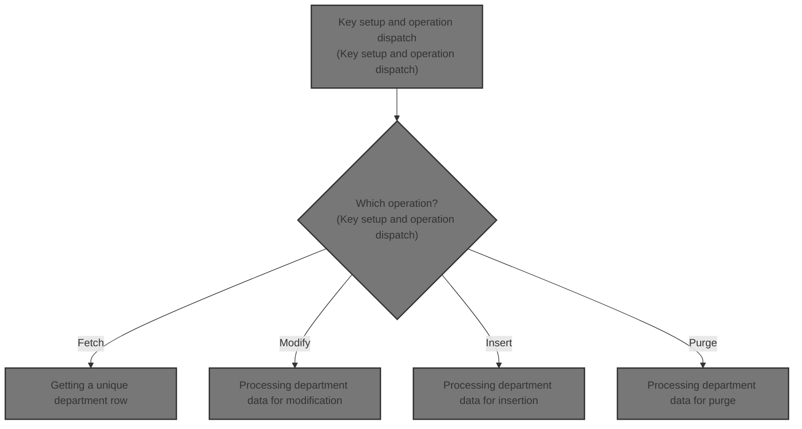

# Overview

This document explains the flow of department data management. The system processes requests to fetch, modify, insert, or purge department records, translating data between legacy and current formats as needed, and enforcing business rules for data integrity and error reporting.

## Dependencies

### Programs

- WWWS0040 (<SwmPath>[base/src/WWWS0040.cbl](base/src/WWWS0040.cbl)</SwmPath>)
- MMMS0258 (<SwmPath>[base/src/MMMS0258.cbl](base/src/MMMS0258.cbl)</SwmPath>)
- NNNS0573 (<SwmPath>[base/src/NNNS0573.cbl](base/src/NNNS0573.cbl)</SwmPath>)
- YYYS0210 (<SwmPath>[base/src/XXXS0210.cbl](base/src/XXXS0210.cbl)</SwmPath>)
- YYYS0220 (<SwmPath>[base/src/YYYS0220.cbl](base/src/YYYS0220.cbl)</SwmPath>)
- YYYS0211 (<SwmPath>[base/src/YYYS0211.cbl](base/src/YYYS0211.cbl)</SwmPath>)
- YYYS0212 (<SwmPath>[base/src/YYYS0212.cbl](base/src/YYYS0212.cbl)</SwmPath>)
- WWWS0100 (<SwmPath>[base/src/WWWS0100.cbl](base/src/WWWS0100.cbl)</SwmPath>)
- ZZZS0197 (<SwmPath>[base/src/ZZZS0197.cbl](base/src/ZZZS0197.cbl)</SwmPath>)
- YYYS0175
- YYYS0127
- YYYS0107
- MMMS0304
- YYYS0097

### Copybooks

- MMMC9012 (<SwmPath>[base/src/MMMC9012.cpy](base/src/MMMC9012.cpy)</SwmPath>)
- MMMK001B (<SwmPath>[base/src/MMMK001B.cpy](base/src/MMMK001B.cpy)</SwmPath>)
- YYYN000A (<SwmPath>[base/src/YYYN000A.cpy](base/src/YYYN000A.cpy)</SwmPath>)
- MMMN000A (<SwmPath>[base/src/MMMN000A.cpy](base/src/MMMN000A.cpy)</SwmPath>)
- XXXN001A (<SwmPath>[base/src/XXXN001A.cpy](base/src/XXXN001A.cpy)</SwmPath>)
- YYYN111A (<SwmPath>[base/src/YYYN111A.cpy](base/src/YYYN111A.cpy)</SwmPath>)
- DDDTDP01 (<SwmPath>[base/src/DDDTDP01.cpy](base/src/DDDTDP01.cpy)</SwmPath>)
- DDDLCT20
- YYYC0220 (<SwmPath>[base/src/YYYC0220.cpy](base/src/YYYC0220.cpy)</SwmPath>)
- SQLCA
- WWWC0100 (<SwmPath>[base/src/WWWC0100.cpy](base/src/WWWC0100.cpy)</SwmPath>)
- YYYC0175
- YYYN110A (<SwmPath>[base/src/YYYN110A.cpy](base/src/YYYN110A.cpy)</SwmPath>)
- ZZZC0197 (<SwmPath>[base/src/ZZZC0197.cpy](base/src/ZZZC0197.cpy)</SwmPath>)
- NNNN000U (<SwmPath>[base/src/NNNN000U.cpy](base/src/NNNN000U.cpy)</SwmPath>)
- HHHTDP01 (<SwmPath>[base/src/HHHTDP01.cpy](base/src/HHHTDP01.cpy)</SwmPath>)
- XXXEIBLK
- YYYC0107 (<SwmPath>[base/src/YYYC0107.cpy](base/src/YYYC0107.cpy)</SwmPath>)
- YYYC0127 (<SwmPath>[base/src/YYYC0127.cpy](base/src/YYYC0127.cpy)</SwmPath>)
- ZZZC0125 (<SwmPath>[base/src/ZZZC0125.cpy](base/src/ZZZC0125.cpy)</SwmPath>)
- ZZZC0550 (<SwmPath>[base/src/ZZZC0550.cpy](base/src/ZZZC0550.cpy)</SwmPath>)
- MMMC0257 (<SwmPath>[base/src/MMMC0257.cpy](base/src/MMMC0257.cpy)</SwmPath>)
- MMMK001D (<SwmPath>[base/src/MMMK001D.cpy](base/src/MMMK001D.cpy)</SwmPath>)
- MMMC0304 (<SwmPath>[base/src/MMMC0304.cpy](base/src/MMMC0304.cpy)</SwmPath>)
- YYYN005A (<SwmPath>[base/src/YYYN005A.cpy](base/src/YYYN005A.cpy)</SwmPath>)
- NNNN0000 (<SwmPath>[base/src/NNNN0000.cpy](base/src/NNNN0000.cpy)</SwmPath>)
- PPPTDP01 (<SwmPath>[base/src/PPPTDP01.cpy](base/src/PPPTDP01.cpy)</SwmPath>)
- YYYN000C (<SwmPath>[base/src/YYYN000C.cpy](base/src/YYYN000C.cpy)</SwmPath>)
- YYYC0097 (<SwmPath>[base/src/YYYC0097.cpy](base/src/YYYC0097.cpy)</SwmPath>)
- WWWC0040 (<SwmPath>[base/src/WWWC0040.cpy](base/src/WWWC0040.cpy)</SwmPath>)
- XXXLCT20 (<SwmPath>[base/src/XXXLCT20.cpy](base/src/XXXLCT20.cpy)</SwmPath>)

&nbsp;

*This is an auto-generated document by Swimm 🌊 and has not yet been verified by a human*

<SwmMeta version="3.0.0" repo-id="Z2l0aHViJTNBJTNBU3dpbW1pby1keW5jYWxsLWRlbW8lM0ElM0FHaXJpLVN3aW1t" repo-name="Swimmio-dyncall-demo">Powered by [Swimm](https://app.swimm.io/)</SwmMeta>
