# Overview

This document describes the flow for managing department records, including retrieval, insertion, modification, and purging. The flow ensures department data is validated, translated, and processed according to business rules, returning department data or status messages as needed.

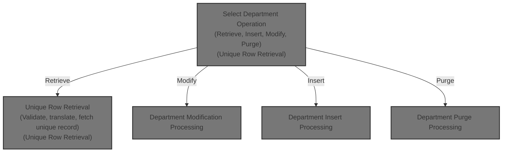

## Dependencies

### Programs

- <SwmToken path="base/src/WWWS0040.cbl" pos="106:5:5" line-data="012300     MOVE &#39;WWWS0040&#39;                TO YYYC0097-ERROR-PGM         00012300">`WWWS0040`</SwmToken> (<SwmPath>[base/src/WWWS0040.cbl](base/src/WWWS0040.cbl)</SwmPath>)
- <SwmToken path="base/src/WWWS0040.cbl" pos="324:4:4" line-data="034100     CALL MMMS0258-TRANSLATE-DP USING                             00034100">`MMMS0258`</SwmToken> (<SwmPath>[base/src/MMMS0258.cbl](base/src/MMMS0258.cbl)</SwmPath>)
- <SwmToken path="base/src/WWWS0040.cbl" pos="377:4:4" line-data="039400     CALL NNNS0573-DP-DAO USING                                   00039400">`NNNS0573`</SwmToken> (<SwmPath>[base/src/NNNS0573.cbl](base/src/NNNS0573.cbl)</SwmPath>)
- YYYS0210 (<SwmPath>[base/src/XXXS0210.cbl](base/src/XXXS0210.cbl)</SwmPath>)
- <SwmToken path="base/src/YYYS0211.cbl" pos="55:4:4" line-data="007500     CALL YYYS0220-DBMS-CON-MGR USING                             00007500">`YYYS0220`</SwmToken> (<SwmPath>[base/src/YYYS0220.cbl](base/src/YYYS0220.cbl)</SwmPath>)
- <SwmToken path="base/src/YYYS0211.cbl" pos="2:7:7" line-data="000200 PROGRAM-ID.    YYYS0211.                                         00000200">`YYYS0211`</SwmToken> (<SwmPath>[base/src/YYYS0211.cbl](base/src/YYYS0211.cbl)</SwmPath>)
- <SwmToken path="base/src/YYYS0212.cbl" pos="96:9:9" line-data="010300         STRING &#39;Error in YYYS0212. Oracle code:&#39;                 00010300">`YYYS0212`</SwmToken> (<SwmPath>[base/src/YYYS0212.cbl](base/src/YYYS0212.cbl)</SwmPath>)
- <SwmToken path="base/src/NNNS0573.cbl" pos="565:4:4" line-data="058500     CALL WWWS0100-CONTROL-SUBR USING                             00058500">`WWWS0100`</SwmToken> (<SwmPath>[base/src/WWWS0100.cbl](base/src/WWWS0100.cbl)</SwmPath>)
- <SwmToken path="base/src/NNNS0573.cbl" pos="589:4:4" line-data="060900     CALL ZZZS0197-EVENT-MGR USING                                00060900">`ZZZS0197`</SwmToken> (<SwmPath>[base/src/ZZZS0197.cbl](base/src/ZZZS0197.cbl)</SwmPath>)
- YYYS0175
- YYYS0127
- YYYS0107
- <SwmToken path="base/src/NNNS0573.cbl" pos="39:4:4" line-data="006310 01 MMMS0304-RI-DEL-CHK          PIC X(8)  VALUE &#39;MMMS0304&#39;.      00006310">`MMMS0304`</SwmToken>
- YYYS0097

### Copybooks

- <SwmToken path="base/src/MMMS0258.cbl" pos="32:4:4" line-data="004700 COPY MMMC9012.                                                   00004700">`MMMC9012`</SwmToken> (<SwmPath>[base/src/MMMC9012.cpy](base/src/MMMC9012.cpy)</SwmPath>)
- <SwmToken path="base/src/MMMS0258.cbl" pos="33:4:4" line-data="004800 COPY MMMK001B.                                                   00004800">`MMMK001B`</SwmToken> (<SwmPath>[base/src/MMMK001B.cpy](base/src/MMMK001B.cpy)</SwmPath>)
- <SwmToken path="base/src/WWWS0040.cbl" pos="21:4:4" line-data="003800 COPY YYYN000A.                                                   00003800">`YYYN000A`</SwmToken> (<SwmPath>[base/src/YYYN000A.cpy](base/src/YYYN000A.cpy)</SwmPath>)
- <SwmToken path="base/src/MMMS0258.cbl" pos="35:4:4" line-data="005000 COPY MMMN000A.                                                   00005000">`MMMN000A`</SwmToken> (<SwmPath>[base/src/MMMN000A.cpy](base/src/MMMN000A.cpy)</SwmPath>)
- <SwmToken path="base/src/WWWS0040.cbl" pos="104:4:4" line-data="012100     INITIALIZE XXXN001A                                          00012100">`XXXN001A`</SwmToken> (<SwmPath>[base/src/XXXN001A.cpy](base/src/XXXN001A.cpy)</SwmPath>)
- <SwmToken path="base/src/WWWS0040.cbl" pos="165:4:4" line-data="018200       SET YYYN111A-NEW-2-OLD       TO TRUE                       00018200">`YYYN111A`</SwmToken> (<SwmPath>[base/src/YYYN111A.cpy](base/src/YYYN111A.cpy)</SwmPath>)
- <SwmToken path="base/src/WWWS0040.cbl" pos="327:4:4" line-data="034400         P-DDDTDP01                                               00034400">`DDDTDP01`</SwmToken> (<SwmPath>[base/src/DDDTDP01.cpy](base/src/DDDTDP01.cpy)</SwmPath>)
- <SwmToken path="base/src/MMMS0258.cbl" pos="94:12:12" line-data="010900       TO CT-DEPARTMENT-SEQUENCE      OF DDDLCT20                 00010900">`DDDLCT20`</SwmToken>
- SQLCA
- <SwmToken path="base/src/YYYS0211.cbl" pos="54:4:4" line-data="007400     SET YYYC0220-SET-DB2-CON TO TRUE                             00007400">`YYYC0220`</SwmToken> (<SwmPath>[base/src/YYYC0220.cpy](base/src/YYYC0220.cpy)</SwmPath>)
- <SwmToken path="base/src/NNNS0573.cbl" pos="55:4:4" line-data="007900 COPY WWWC0100.                                                   00007900">`WWWC0100`</SwmToken> (<SwmPath>[base/src/WWWC0100.cpy](base/src/WWWC0100.cpy)</SwmPath>)
- YYYC0175
- <SwmToken path="base/src/WWWS0040.cbl" pos="110:4:4" line-data="012700         SET YYYN110A-CICS-ENV      TO TRUE                       00012700">`YYYN110A`</SwmToken> (<SwmPath>[base/src/YYYN110A.cpy](base/src/YYYN110A.cpy)</SwmPath>)
- <SwmToken path="base/src/NNNS0573.cbl" pos="52:4:4" line-data="007600 COPY ZZZC0197.                                                   00007600">`ZZZC0197`</SwmToken> (<SwmPath>[base/src/ZZZC0197.cpy](base/src/ZZZC0197.cpy)</SwmPath>)
- <SwmToken path="base/src/NNNS0573.cbl" pos="44:4:4" line-data="006800 COPY NNNN000U.                                                   00006800">`NNNN000U`</SwmToken> (<SwmPath>[base/src/NNNN000U.cpy](base/src/NNNN000U.cpy)</SwmPath>)
- <SwmToken path="base/src/NNNS0573.cbl" pos="45:4:4" line-data="006900 COPY HHHTDP01.                                                   00006900">`HHHTDP01`</SwmToken> (<SwmPath>[base/src/HHHTDP01.cpy](base/src/HHHTDP01.cpy)</SwmPath>)
- XXXEIBLK
- <SwmToken path="base/src/NNNS0573.cbl" pos="49:4:4" line-data="007300 COPY YYYC0107.                                                   00007300">`YYYC0107`</SwmToken> (<SwmPath>[base/src/YYYC0107.cpy](base/src/YYYC0107.cpy)</SwmPath>)
- <SwmToken path="base/src/NNNS0573.cbl" pos="50:4:4" line-data="007400 COPY YYYC0127.                                                   00007400">`YYYC0127`</SwmToken> (<SwmPath>[base/src/YYYC0127.cpy](base/src/YYYC0127.cpy)</SwmPath>)
- <SwmToken path="base/src/NNNS0573.cbl" pos="51:4:4" line-data="007500 COPY ZZZC0125.                                                   00007500">`ZZZC0125`</SwmToken> (<SwmPath>[base/src/ZZZC0125.cpy](base/src/ZZZC0125.cpy)</SwmPath>)
- <SwmToken path="base/src/NNNS0573.cbl" pos="53:4:4" line-data="007700 COPY ZZZC0550.                                                   00007700">`ZZZC0550`</SwmToken> (<SwmPath>[base/src/ZZZC0550.cpy](base/src/ZZZC0550.cpy)</SwmPath>)
- <SwmToken path="base/src/NNNS0573.cbl" pos="57:4:4" line-data="008100 COPY MMMC0257.                                                   00008100">`MMMC0257`</SwmToken> (<SwmPath>[base/src/MMMC0257.cpy](base/src/MMMC0257.cpy)</SwmPath>)
- <SwmToken path="base/src/WWWS0040.cbl" pos="26:4:4" line-data="004300 COPY MMMK001D.                                                   00004300">`MMMK001D`</SwmToken> (<SwmPath>[base/src/MMMK001D.cpy](base/src/MMMK001D.cpy)</SwmPath>)
- <SwmToken path="base/src/NNNS0573.cbl" pos="59:4:4" line-data="008210 COPY MMMC0304.                                                   00008210">`MMMC0304`</SwmToken> (<SwmPath>[base/src/MMMC0304.cpy](base/src/MMMC0304.cpy)</SwmPath>)
- <SwmToken path="base/src/WWWS0040.cbl" pos="109:4:4" line-data="012600       WHEN YYYN005A-CICS-ENV                                     00012600">`YYYN005A`</SwmToken> (<SwmPath>[base/src/YYYN005A.cpy](base/src/YYYN005A.cpy)</SwmPath>)
- <SwmToken path="base/src/WWWS0040.cbl" pos="348:4:4" line-data="036500     MOVE NNNN0000-EXIT-CODES       TO WS-NNNN0000-EXIT-CODES     00036500">`NNNN0000`</SwmToken> (<SwmPath>[base/src/NNNN0000.cpy](base/src/NNNN0000.cpy)</SwmPath>)
- <SwmToken path="base/src/WWWS0040.cbl" pos="31:4:4" line-data="004800 COPY PPPTDP01.                                                   00004800">`PPPTDP01`</SwmToken> (<SwmPath>[base/src/PPPTDP01.cpy](base/src/PPPTDP01.cpy)</SwmPath>)
- <SwmToken path="base/src/WWWS0040.cbl" pos="22:4:4" line-data="003900 COPY YYYN000C.                                                   00003900">`YYYN000C`</SwmToken> (<SwmPath>[base/src/YYYN000C.cpy](base/src/YYYN000C.cpy)</SwmPath>)
- <SwmToken path="base/src/WWWS0040.cbl" pos="106:10:10" line-data="012300     MOVE &#39;WWWS0040&#39;                TO YYYC0097-ERROR-PGM         00012300">`YYYC0097`</SwmToken> (<SwmPath>[base/src/YYYC0097.cpy](base/src/YYYC0097.cpy)</SwmPath>)
- <SwmToken path="base/src/WWWS0040.cbl" pos="49:4:4" line-data="006600 COPY WWWC0040.                                                   00006600">`WWWC0040`</SwmToken> (<SwmPath>[base/src/WWWC0040.cpy](base/src/WWWC0040.cpy)</SwmPath>)
- <SwmToken path="base/src/WWWS0040.cbl" pos="328:2:2" line-data="034500         XXXLCT20                                                 00034500">`XXXLCT20`</SwmToken> (<SwmPath>[base/src/XXXLCT20.cpy](base/src/XXXLCT20.cpy)</SwmPath>)

## Detailed View of the Program's Functionality

a. High-Level Purpose

The file <SwmPath>[base/src/NNNS0573.cbl](base/src/NNNS0573.cbl)</SwmPath> implements a data access object (DAO) for the department table in a <SwmToken path="base/src/WWWS0040.cbl" pos="207:6:6" line-data="022400             PERFORM 9998-DB2-530-ERROR                           00022400">`DB2`</SwmToken> database. It provides the logic for all CRUD (Create, Read, Update, Delete) operations on department records, manages translation between program data structures and database fields, and handles both <SwmToken path="base/src/WWWS0040.cbl" pos="207:6:6" line-data="022400             PERFORM 9998-DB2-530-ERROR                           00022400">`DB2`</SwmToken> and Oracle environments. It is called by higher-level business logic to perform actual database operations.

---

b. Initialization and Setup

- The program starts by initializing all working storage and parameter areas, including the main data structure, DB2-specific fields, return codes, and SQL state.
- It copies in all necessary data structures and SQL definitions, including the department table layout, control blocks, and error/status areas.
- It prepares the department record for processing by moving data from the parameter area to the internal DCL (declaration) structure, unless the operation is a cursor close.
- If the environment or operation requires Oracle, it connects to Oracle before proceeding.

---

c. Main Operation Dispatcher

- The main entry point (<SwmToken path="base/src/YYYS0211.cbl" pos="32:2:6" line-data="004700 0000-EXIT-DISPATCHER.                                            00004700">`0000-EXIT-DISPATCHER`</SwmToken>) checks the requested operation type (open/close cursor, get unique row, get next row, modify, insert, purge, or special functions).
- For each operation, it dispatches to the corresponding handler section (e.g., <SwmToken path="base/src/WWWS0040.cbl" pos="75:4:12" line-data="009200              PERFORM 1200-EXIT-GET-UNIQUE-ROW                    00009200">`1200-EXIT-GET-UNIQUE-ROW`</SwmToken> for fetching a unique department row).
- After the operation, it performs cleanup and post-processing (e.g., moving data back to the parameter area, updating checkpoint counters, and switching DB connections as needed).

---

d. Data Movement Between Structures

- Before most operations, the code moves data from the parameter area (the structure received from the caller) into the DCL structure, which is used for SQL operations.
- After successful operations, it moves data from the DCL structure back to the parameter area so the caller receives the updated or fetched data.

---

e. Database Operations

- **Open/Close Cursor:** Handles opening and closing of two possible cursors for department data, based on the requested cursor ID. If an invalid cursor ID is provided, it sets an error and returns a message.
- **Get Unique Row:** Executes a SELECT statement to fetch a single department record matching the provided department number and sub-department ID. The result is placed into the DCL structure, and then checked for null columns.
- **Get Next Row:** Depending on the cursor, fetches the next row from the result set and checks for null columns.
- **Modify Row:** Fetches the current department name for comparison, updates the record with new values and timestamps, and if the department name changed, triggers a staging event. If successful, it marks the operation as an update and triggers denormalization/event logic.
- **Insert Row:** Gets the next available organization ID, sets timestamps and user IDs, and inserts the new department record. If successful, it marks the operation as an add and triggers denormalization/event logic.
- **Purge Row:** Checks referential integrity constraints, deletes the department record if allowed, and if successful, marks the operation as a delete and triggers denormalization/event logic.

---

f. Error Handling and Status Management

- After each operation, the code checks the SQL return code (<SwmToken path="base/src/WWWS0040.cbl" pos="202:4:4" line-data="021900           WHEN SQLCODE = 100                                     00021900">`SQLCODE`</SwmToken>). If an error occurs, it sets the failure flag, stores the SQL code, and builds a user-friendly error message.
- For Oracle operations, it connects and, if connection fails, builds a specific error message.
- On exit, it updates the checkpoint counter, switches back to <SwmToken path="base/src/WWWS0040.cbl" pos="207:6:6" line-data="022400             PERFORM 9998-DB2-530-ERROR                           00022400">`DB2`</SwmToken> if needed, and stores the final SQL code for the caller.

---

g. Denormalization and Event Processing

- After successful updates, inserts, or deletes, the code triggers additional processing to update related data or fire business events. This includes copying environment data, calling control subroutines, and, if required, sending events to an event manager.
- If a department name change is detected during an update, it sets a flag to indicate that a staging event should be triggered.

---

h. Utility and Support Routines

- There are routines for editing null indicators, checking for null columns, and getting the current date and user ID (from either the system or CICS, depending on environment).
- There are also routines for handling referential integrity checks before deletes, and for calling the actual database update/insert/delete logic.

---

i. Special Functions

- The code includes a placeholder for special or custom SQL or business logic that might be required by the application but is not part of the standard CRUD operations.

---

j. Summary

This file is the core data access layer for department records. It abstracts all the SQL and database-specific logic away from the business logic, handles both <SwmToken path="base/src/WWWS0040.cbl" pos="207:6:6" line-data="022400             PERFORM 9998-DB2-530-ERROR                           00022400">`DB2`</SwmToken> and Oracle environments, manages all data movement between program and database, and ensures that errors and events are handled in a consistent, centralized way. All department-related database operations in the application ultimately flow through this module.

# Rule Definition

| Paragraph Name                                                                                                                                                                                                                                                                                                                                                                                                                                                                                                                                                                                                                                                                                                                          | Rule ID | Category          | Description                                                                                                                                                                                                                                                                                                                                                                                                                                                                                                                                                                                                                                                                                                                                                                                                                                                                                                                                                                                                                                                                                                                                                    | Conditions                                                                                                                                                                                                                         | Remarks                                                                                                                                                                                                                                                                                                                                                                                                                                                                                                                                                                                                                                                                                                                                                                                                                                                                                                                                                                                                                                                                                                                                                                                                                                                                                                                                                                                                                                                                                                                                                                                                                                                                                                                                                                                                                                                                                                                                                                                                                                                                                                                                                                                                                                                                                                                                                                                                                                                                                                                                                                                                                                                                                                                                                                                                                                                                                                                            |
| --------------------------------------------------------------------------------------------------------------------------------------------------------------------------------------------------------------------------------------------------------------------------------------------------------------------------------------------------------------------------------------------------------------------------------------------------------------------------------------------------------------------------------------------------------------------------------------------------------------------------------------------------------------------------------------------------------------------------------------- | ------- | ----------------- | -------------------------------------------------------------------------------------------------------------------------------------------------------------------------------------------------------------------------------------------------------------------------------------------------------------------------------------------------------------------------------------------------------------------------------------------------------------------------------------------------------------------------------------------------------------------------------------------------------------------------------------------------------------------------------------------------------------------------------------------------------------------------------------------------------------------------------------------------------------------------------------------------------------------------------------------------------------------------------------------------------------------------------------------------------------------------------------------------------------------------------------------------------------- | ---------------------------------------------------------------------------------------------------------------------------------------------------------------------------------------------------------------------------------- | ---------------------------------------------------------------------------------------------------------------------------------------------------------------------------------------------------------------------------------------------------------------------------------------------------------------------------------------------------------------------------------------------------------------------------------------------------------------------------------------------------------------------------------------------------------------------------------------------------------------------------------------------------------------------------------------------------------------------------------------------------------------------------------------------------------------------------------------------------------------------------------------------------------------------------------------------------------------------------------------------------------------------------------------------------------------------------------------------------------------------------------------------------------------------------------------------------------------------------------------------------------------------------------------------------------------------------------------------------------------------------------------------------------------------------------------------------------------------------------------------------------------------------------------------------------------------------------------------------------------------------------------------------------------------------------------------------------------------------------------------------------------------------------------------------------------------------------------------------------------------------------------------------------------------------------------------------------------------------------------------------------------------------------------------------------------------------------------------------------------------------------------------------------------------------------------------------------------------------------------------------------------------------------------------------------------------------------------------------------------------------------------------------------------------------------------------------------------------------------------------------------------------------------------------------------------------------------------------------------------------------------------------------------------------------------------------------------------------------------------------------------------------------------------------------------------------------------------------------------------------------------------------------------------------------------- |
| <SwmToken path="base/src/WWWS0040.cbl" pos="63:2:4" line-data="008000 000-MAIN.                                                        00008000">`000-MAIN`</SwmToken>, <SwmToken path="base/src/YYYS0211.cbl" pos="32:2:6" line-data="004700 0000-EXIT-DISPATCHER.                                            00004700">`0000-EXIT-DISPATCHER`</SwmToken>                                                                                                                                                                                                                                                                                                                                                                              | RL-001  | Conditional Logic | The main entry point determines which operation to perform by evaluating the value of <SwmToken path="base/src/WWWS0040.cbl" pos="348:4:8" line-data="036500     MOVE NNNN0000-EXIT-CODES       TO WS-NNNN0000-EXIT-CODES     00036500">`NNNN0000-EXIT-CODES`</SwmToken>. Supported codes are: 1 (Open Cursor), 2 (Close Cursor), 3 (Get Unique Row), 5 (Get Next Row), 8 (Modify Row), 9 (Insert Row), 10 (Purge Row).                                                                                                                                                                                                                                                                                                                                                                                                                                                                                                                                                                                                                                                                                                                                        | <SwmToken path="base/src/WWWS0040.cbl" pos="348:4:8" line-data="036500     MOVE NNNN0000-EXIT-CODES       TO WS-NNNN0000-EXIT-CODES     00036500">`NNNN0000-EXIT-CODES`</SwmToken> is set to one of the supported operation codes. | Supported codes: 1, 2, 3, 5, 8, 9, 10. Input and output structures: <SwmToken path="base/src/WWWS0040.cbl" pos="104:4:4" line-data="012100     INITIALIZE XXXN001A                                          00012100">`XXXN001A`</SwmToken>, <SwmToken path="base/src/WWWS0040.cbl" pos="109:4:4" line-data="012600       WHEN YYYN005A-CICS-ENV                                     00012600">`YYYN005A`</SwmToken>, <SwmToken path="base/src/WWWS0040.cbl" pos="381:2:4" line-data="039800         NNNN0000-PARMS                                           00039800">`NNNN0000-PARMS`</SwmToken>, <SwmToken path="base/src/WWWS0040.cbl" pos="49:4:4" line-data="006600 COPY WWWC0040.                                                   00006600">`WWWC0040`</SwmToken>, <SwmToken path="base/src/WWWS0040.cbl" pos="328:2:2" line-data="034500         XXXLCT20                                                 00034500">`XXXLCT20`</SwmToken>, <SwmToken path="base/src/WWWS0040.cbl" pos="327:2:4" line-data="034400         P-DDDTDP01                                               00034400">`P-DDDTDP01`</SwmToken>. All are updated in-place.                                                                                                                                                                                                                                                                                                                                                                                                                                                                                                                                                                                                                                                                                                                                                                                                                                                                                                                                                                                                                                                                                                                                                                                                                                                                                                                                                                                                                                                                                                                                                                                                                                                                                                                                                                         |
| <SwmToken path="base/src/WWWS0040.cbl" pos="71:4:10" line-data="008800              PERFORM 1000-EXIT-OPEN-CURSOR                       00008800">`1000-EXIT-OPEN-CURSOR`</SwmToken>, <SwmToken path="base/src/WWWS0040.cbl" pos="73:4:10" line-data="009000              PERFORM 1100-EXIT-CLOSE-CURSOR                      00009000">`1100-EXIT-CLOSE-CURSOR`</SwmToken>, <SwmToken path="base/src/WWWS0040.cbl" pos="77:4:12" line-data="009400              PERFORM 1300-EXIT-GET-NEXT-ROW                      00009400">`1300-EXIT-GET-NEXT-ROW`</SwmToken>                                                                                                                                                                      | RL-002  | Conditional Logic | For unsupported operations (Open Cursor, Close Cursor, Get Next Row), the program sets FAILURE and <SwmToken path="base/src/WWWS0040.cbl" pos="116:4:10" line-data="013300                                    TO IS-RTRN-MSG-TXT            00013300">`IS-RTRN-MSG-TXT`</SwmToken> to a specific message and leaves other fields unchanged.                                                                                                                                                                                                                                                                                                                                                                                                                                                                                                                                                                                                                                                                                                                                                                                                                    | <SwmToken path="base/src/WWWS0040.cbl" pos="348:4:8" line-data="036500     MOVE NNNN0000-EXIT-CODES       TO WS-NNNN0000-EXIT-CODES     00036500">`NNNN0000-EXIT-CODES`</SwmToken> is 1, 2, or 5.                                  | Messages: '<SwmToken path="base/src/WWWS0040.cbl" pos="106:5:5" line-data="012300     MOVE &#39;WWWS0040&#39;                TO YYYC0097-ERROR-PGM         00012300">`WWWS0040`</SwmToken> - Open Cursor is not supported - YET!', '<SwmToken path="base/src/WWWS0040.cbl" pos="106:5:5" line-data="012300     MOVE &#39;WWWS0040&#39;                TO YYYC0097-ERROR-PGM         00012300">`WWWS0040`</SwmToken> - Close Cursor is not supported - YET!', '<SwmToken path="base/src/WWWS0040.cbl" pos="106:5:5" line-data="012300     MOVE &#39;WWWS0040&#39;                TO YYYC0097-ERROR-PGM         00012300">`WWWS0040`</SwmToken> - <SwmToken path="base/src/WWWS0040.cbl" pos="176:9:11" line-data="019300     MOVE &#39;WWWS0040 - Get-Next is not supported - YET!&#39;           00019300">`Get-Next`</SwmToken> is not supported - YET!'.                                                                                                                                                                                                                                                                                                                                                                                                                                                                                                                                                                                                                                                                                                                                                                                                                                                                                                                                                                                                                                                                                                                                                                                                                                                                                                                                                                                                                                                                                                                                                                                                                                                                                                                                                                                                                                                                                                                                                                                                                                                                         |
| <SwmToken path="base/src/WWWS0040.cbl" pos="75:4:12" line-data="009200              PERFORM 1200-EXIT-GET-UNIQUE-ROW                    00009200">`1200-EXIT-GET-UNIQUE-ROW`</SwmToken>, <SwmToken path="base/src/WWWS0040.cbl" pos="158:4:8" line-data="017500     PERFORM 1210-PROCESS-DP                                      00017500">`1210-PROCESS-DP`</SwmToken>, <SwmToken path="base/src/WWWS0040.cbl" pos="163:4:8" line-data="018000     PERFORM 2200-GET-DP                                          00018000">`2200-GET-DP`</SwmToken>, <SwmToken path="base/src/WWWS0040.cbl" pos="341:4:10" line-data="035800        PERFORM 2210-GET-DP-RECORD                                00035800">`2210-GET-DP-RECORD`</SwmToken> | RL-003  | Computation       | Fetches the department record matching the key (<SwmToken path="base/src/NNNS0573.cbl" pos="90:14:18" line-data="011300         WHERE   (XXX_DEPT_NBR &gt;= :DCLXXX-DEPT.XXX-DEPT-NBR)      00011300">`XXX-DEPT-NBR`</SwmToken> and <SwmToken path="base/src/MMMS0258.cbl" pos="121:4:10" line-data="013600     MOVE STR-SUB-DEPT-ID  (1:1)                                  00013600">`STR-SUB-DEPT-ID`</SwmToken>) from the simulated database. Updates output structures and sets status codes/messages based on result.                                                                                                                                                                                                                                                                                                                                                                                                                                                                                                                                                                                                                                    | <SwmToken path="base/src/WWWS0040.cbl" pos="348:4:8" line-data="036500     MOVE NNNN0000-EXIT-CODES       TO WS-NNNN0000-EXIT-CODES     00036500">`NNNN0000-EXIT-CODES`</SwmToken> is 3.                                           | If found: set SUCCESS, clear FAILURE, clear <SwmToken path="base/src/WWWS0040.cbl" pos="116:4:10" line-data="013300                                    TO IS-RTRN-MSG-TXT            00013300">`IS-RTRN-MSG-TXT`</SwmToken>, update <SwmToken path="base/src/WWWS0040.cbl" pos="327:2:4" line-data="034400         P-DDDTDP01                                               00034400">`P-DDDTDP01`</SwmToken>. If not found: set FAILURE, clear SUCCESS, set <SwmToken path="base/src/WWWS0040.cbl" pos="116:4:10" line-data="013300                                    TO IS-RTRN-MSG-TXT            00013300">`IS-RTRN-MSG-TXT`</SwmToken> to '<SwmToken path="base/src/WWWS0040.cbl" pos="106:5:5" line-data="012300     MOVE &#39;WWWS0040&#39;                TO YYYC0097-ERROR-PGM         00012300">`WWWS0040`</SwmToken> - DEPT <key> not found in <SwmToken path="base/src/WWWS0040.cbl" pos="210:15:15" line-data="022700             STRING &#39;WWWS0040 - Failed on upd XXX_DEPT,SQL  =&#39;    00022700">`XXX_DEPT`</SwmToken>', set <SwmToken path="base/src/WWWS0040.cbl" pos="348:4:8" line-data="036500     MOVE NNNN0000-EXIT-CODES       TO WS-NNNN0000-EXIT-CODES     00036500">`NNNN0000-EXIT-CODES`</SwmToken> to 100. <key> is first 2 chars of <SwmToken path="base/src/NNNS0573.cbl" pos="90:14:18" line-data="011300         WHERE   (XXX_DEPT_NBR &gt;= :DCLXXX-DEPT.XXX-DEPT-NBR)      00011300">`XXX-DEPT-NBR`</SwmToken> and first char of <SwmToken path="base/src/MMMS0258.cbl" pos="121:4:10" line-data="013600     MOVE STR-SUB-DEPT-ID  (1:1)                                  00013600">`STR-SUB-DEPT-ID`</SwmToken>.                                                                                                                                                                                                                                                                                                                                                                                                                                                                                                                                                                                                                                                                                                                                                                                                                                                                                                                                                                                                                                                                                                                                                                                                                                                                         |
| <SwmToken path="base/src/WWWS0040.cbl" pos="79:4:12" line-data="009600              PERFORM 1400-EXIT-PUT-MODIFY-ROW                    00009600">`1400-EXIT-PUT-MODIFY-ROW`</SwmToken>, <SwmToken path="base/src/WWWS0040.cbl" pos="185:4:8" line-data="020200     PERFORM 1410-PROCESS-DP                                      00020200">`1410-PROCESS-DP`</SwmToken>                                                                                                                                                                                                                                                                                                                                                                 | RL-004  | Computation       | Updates the department record in the simulated database. Handles not found, constraint errors, other errors, and success.                                                                                                                                                                                                                                                                                                                                                                                                                                                                                                                                                                                                                                                                                                                                                                                                                                                                                                                                                                                                                                      | <SwmToken path="base/src/WWWS0040.cbl" pos="348:4:8" line-data="036500     MOVE NNNN0000-EXIT-CODES       TO WS-NNNN0000-EXIT-CODES     00036500">`NNNN0000-EXIT-CODES`</SwmToken> is 8.                                           | If not found: set FAILURE, clear SUCCESS, set <SwmToken path="base/src/WWWS0040.cbl" pos="116:4:10" line-data="013300                                    TO IS-RTRN-MSG-TXT            00013300">`IS-RTRN-MSG-TXT`</SwmToken> to '<SwmToken path="base/src/WWWS0040.cbl" pos="106:5:5" line-data="012300     MOVE &#39;WWWS0040&#39;                TO YYYC0097-ERROR-PGM         00012300">`WWWS0040`</SwmToken> - DEPT <key> not found in <SwmToken path="base/src/WWWS0040.cbl" pos="210:15:15" line-data="022700             STRING &#39;WWWS0040 - Failed on upd XXX_DEPT,SQL  =&#39;    00022700">`XXX_DEPT`</SwmToken>', set <SwmToken path="base/src/WWWS0040.cbl" pos="348:4:8" line-data="036500     MOVE NNNN0000-EXIT-CODES       TO WS-NNNN0000-EXIT-CODES     00036500">`NNNN0000-EXIT-CODES`</SwmToken> to 100. Constraint error: set FAILURE, clear SUCCESS, set <SwmToken path="base/src/WWWS0040.cbl" pos="116:4:10" line-data="013300                                    TO IS-RTRN-MSG-TXT            00013300">`IS-RTRN-MSG-TXT`</SwmToken> to '<SwmToken path="base/src/WWWS0040.cbl" pos="106:5:5" line-data="012300     MOVE &#39;WWWS0040&#39;                TO YYYC0097-ERROR-PGM         00012300">`WWWS0040`</SwmToken> - Failed on upd <SwmToken path="base/src/WWWS0040.cbl" pos="210:15:15" line-data="022700             STRING &#39;WWWS0040 - Failed on upd XXX_DEPT,SQL  =&#39;    00022700">`XXX_DEPT`</SwmToken>,SQL  =<SQLCODE>', set <SwmToken path="base/src/WWWS0040.cbl" pos="348:4:8" line-data="036500     MOVE NNNN0000-EXIT-CODES       TO WS-NNNN0000-EXIT-CODES     00036500">`NNNN0000-EXIT-CODES`</SwmToken> to -530. Other errors: set FAILURE, clear SUCCESS, set <SwmToken path="base/src/WWWS0040.cbl" pos="116:4:10" line-data="013300                                    TO IS-RTRN-MSG-TXT            00013300">`IS-RTRN-MSG-TXT`</SwmToken> to '<SwmToken path="base/src/WWWS0040.cbl" pos="106:5:5" line-data="012300     MOVE &#39;WWWS0040&#39;                TO YYYC0097-ERROR-PGM         00012300">`WWWS0040`</SwmToken> - Failed on upd <SwmToken path="base/src/WWWS0040.cbl" pos="210:15:15" line-data="022700             STRING &#39;WWWS0040 - Failed on upd XXX_DEPT,SQL  =&#39;    00022700">`XXX_DEPT`</SwmToken>,SQL  =<SQLCODE>', set <SwmToken path="base/src/WWWS0040.cbl" pos="348:4:8" line-data="036500     MOVE NNNN0000-EXIT-CODES       TO WS-NNNN0000-EXIT-CODES     00036500">`NNNN0000-EXIT-CODES`</SwmToken> to error code. Success: update <SwmToken path="base/src/WWWS0040.cbl" pos="327:2:4" line-data="034400         P-DDDTDP01                                               00034400">`P-DDDTDP01`</SwmToken>, set SUCCESS, clear FAILURE, clear <SwmToken path="base/src/WWWS0040.cbl" pos="116:4:10" line-data="013300                                    TO IS-RTRN-MSG-TXT            00013300">`IS-RTRN-MSG-TXT`</SwmToken>. |
| <SwmToken path="base/src/WWWS0040.cbl" pos="81:4:12" line-data="009800              PERFORM 1500-EXIT-PUT-INSERT-ROW                    00009800">`1500-EXIT-PUT-INSERT-ROW`</SwmToken>, <SwmToken path="base/src/WWWS0040.cbl" pos="228:4:8" line-data="024500     PERFORM 1510-PROCESS-DP                                      00024500">`1510-PROCESS-DP`</SwmToken>, <SwmToken path="base/src/WWWS0040.cbl" pos="246:4:8" line-data="026300                 PERFORM 1515-TRY-UPDATE                          00026300">`1515-TRY-UPDATE`</SwmToken>                                                                                                                                                                                 | RL-005  | Computation       | Inserts the department record into the simulated database. Handles duplicate key, constraint errors, other errors, and success.                                                                                                                                                                                                                                                                                                                                                                                                                                                                                                                                                                                                                                                                                                                                                                                                                                                                                                                                                                                                                                | <SwmToken path="base/src/WWWS0040.cbl" pos="348:4:8" line-data="036500     MOVE NNNN0000-EXIT-CODES       TO WS-NNNN0000-EXIT-CODES     00036500">`NNNN0000-EXIT-CODES`</SwmToken> is 9.                                           | Duplicate key: set FAILURE, clear SUCCESS, set <SwmToken path="base/src/WWWS0040.cbl" pos="116:4:10" line-data="013300                                    TO IS-RTRN-MSG-TXT            00013300">`IS-RTRN-MSG-TXT`</SwmToken> to '<SwmToken path="base/src/WWWS0040.cbl" pos="106:5:5" line-data="012300     MOVE &#39;WWWS0040&#39;                TO YYYC0097-ERROR-PGM         00012300">`WWWS0040`</SwmToken> - Failed adding <SwmToken path="base/src/WWWS0040.cbl" pos="210:15:15" line-data="022700             STRING &#39;WWWS0040 - Failed on upd XXX_DEPT,SQL  =&#39;    00022700">`XXX_DEPT`</SwmToken> ,SQL=<SQLCODE>', set <SwmToken path="base/src/WWWS0040.cbl" pos="348:4:8" line-data="036500     MOVE NNNN0000-EXIT-CODES       TO WS-NNNN0000-EXIT-CODES     00036500">`NNNN0000-EXIT-CODES`</SwmToken> to -803. Constraint error: set FAILURE, clear SUCCESS, set <SwmToken path="base/src/WWWS0040.cbl" pos="116:4:10" line-data="013300                                    TO IS-RTRN-MSG-TXT            00013300">`IS-RTRN-MSG-TXT`</SwmToken> to '<SwmToken path="base/src/WWWS0040.cbl" pos="106:5:5" line-data="012300     MOVE &#39;WWWS0040&#39;                TO YYYC0097-ERROR-PGM         00012300">`WWWS0040`</SwmToken> - Failed adding <SwmToken path="base/src/WWWS0040.cbl" pos="210:15:15" line-data="022700             STRING &#39;WWWS0040 - Failed on upd XXX_DEPT,SQL  =&#39;    00022700">`XXX_DEPT`</SwmToken> ,SQL=<SQLCODE>', set <SwmToken path="base/src/WWWS0040.cbl" pos="348:4:8" line-data="036500     MOVE NNNN0000-EXIT-CODES       TO WS-NNNN0000-EXIT-CODES     00036500">`NNNN0000-EXIT-CODES`</SwmToken> to -530. Other errors: set FAILURE, clear SUCCESS, set <SwmToken path="base/src/WWWS0040.cbl" pos="116:4:10" line-data="013300                                    TO IS-RTRN-MSG-TXT            00013300">`IS-RTRN-MSG-TXT`</SwmToken> to error message, set <SwmToken path="base/src/WWWS0040.cbl" pos="348:4:8" line-data="036500     MOVE NNNN0000-EXIT-CODES       TO WS-NNNN0000-EXIT-CODES     00036500">`NNNN0000-EXIT-CODES`</SwmToken> to error code. Success: update <SwmToken path="base/src/WWWS0040.cbl" pos="327:2:4" line-data="034400         P-DDDTDP01                                               00034400">`P-DDDTDP01`</SwmToken>, set SUCCESS, clear FAILURE, clear <SwmToken path="base/src/WWWS0040.cbl" pos="116:4:10" line-data="013300                                    TO IS-RTRN-MSG-TXT            00013300">`IS-RTRN-MSG-TXT`</SwmToken>.                                                                                                                                                                                                                                                                                                                                                                                 |
| <SwmToken path="base/src/WWWS0040.cbl" pos="83:4:12" line-data="010000              PERFORM 1600-EXIT-PUT-PURGE-ROW                     00010000">`1600-EXIT-PUT-PURGE-ROW`</SwmToken>, <SwmToken path="base/src/WWWS0040.cbl" pos="291:4:10" line-data="030800     PERFORM 1610-PURGE-DP-ROW                                    00030800">`1610-PURGE-DP-ROW`</SwmToken>                                                                                                                                                                                                                                                                                                                                                               | RL-006  | Computation       | Deletes the department record matching the key from the simulated database. Handles not found, constraint errors, other errors, and success.                                                                                                                                                                                                                                                                                                                                                                                                                                                                                                                                                                                                                                                                                                                                                                                                                                                                                                                                                                                                                   | <SwmToken path="base/src/WWWS0040.cbl" pos="348:4:8" line-data="036500     MOVE NNNN0000-EXIT-CODES       TO WS-NNNN0000-EXIT-CODES     00036500">`NNNN0000-EXIT-CODES`</SwmToken> is 10.                                          | If not found: set FAILURE, clear SUCCESS, set <SwmToken path="base/src/WWWS0040.cbl" pos="116:4:10" line-data="013300                                    TO IS-RTRN-MSG-TXT            00013300">`IS-RTRN-MSG-TXT`</SwmToken> to '<SwmToken path="base/src/WWWS0040.cbl" pos="106:5:5" line-data="012300     MOVE &#39;WWWS0040&#39;                TO YYYC0097-ERROR-PGM         00012300">`WWWS0040`</SwmToken> - DEPT <key> not found in <SwmToken path="base/src/WWWS0040.cbl" pos="210:15:15" line-data="022700             STRING &#39;WWWS0040 - Failed on upd XXX_DEPT,SQL  =&#39;    00022700">`XXX_DEPT`</SwmToken>', set <SwmToken path="base/src/WWWS0040.cbl" pos="348:4:8" line-data="036500     MOVE NNNN0000-EXIT-CODES       TO WS-NNNN0000-EXIT-CODES     00036500">`NNNN0000-EXIT-CODES`</SwmToken> to 100. Constraint error: set FAILURE, clear SUCCESS, set <SwmToken path="base/src/WWWS0040.cbl" pos="116:4:10" line-data="013300                                    TO IS-RTRN-MSG-TXT            00013300">`IS-RTRN-MSG-TXT`</SwmToken> to '<SwmToken path="base/src/WWWS0040.cbl" pos="106:5:5" line-data="012300     MOVE &#39;WWWS0040&#39;                TO YYYC0097-ERROR-PGM         00012300">`WWWS0040`</SwmToken> - Failed deleting <SwmToken path="base/src/WWWS0040.cbl" pos="210:15:15" line-data="022700             STRING &#39;WWWS0040 - Failed on upd XXX_DEPT,SQL  =&#39;    00022700">`XXX_DEPT`</SwmToken>,SQL=<SQLCODE>', set <SwmToken path="base/src/WWWS0040.cbl" pos="348:4:8" line-data="036500     MOVE NNNN0000-EXIT-CODES       TO WS-NNNN0000-EXIT-CODES     00036500">`NNNN0000-EXIT-CODES`</SwmToken> to -532. Other errors: set FAILURE, clear SUCCESS, set <SwmToken path="base/src/WWWS0040.cbl" pos="116:4:10" line-data="013300                                    TO IS-RTRN-MSG-TXT            00013300">`IS-RTRN-MSG-TXT`</SwmToken> to error message, set <SwmToken path="base/src/WWWS0040.cbl" pos="348:4:8" line-data="036500     MOVE NNNN0000-EXIT-CODES       TO WS-NNNN0000-EXIT-CODES     00036500">`NNNN0000-EXIT-CODES`</SwmToken> to error code. Success: set SUCCESS, clear FAILURE, clear <SwmToken path="base/src/WWWS0040.cbl" pos="116:4:10" line-data="013300                                    TO IS-RTRN-MSG-TXT            00013300">`IS-RTRN-MSG-TXT`</SwmToken>.                                                                                                                                                                                                                                                                                                                                                                                                                                                                                                                                                                         |
| <SwmToken path="base/src/WWWS0040.cbl" pos="341:4:10" line-data="035800        PERFORM 2210-GET-DP-RECORD                                00035800">`2210-GET-DP-RECORD`</SwmToken>, <SwmToken path="base/src/WWWS0040.cbl" pos="185:4:8" line-data="020200     PERFORM 1410-PROCESS-DP                                      00020200">`1410-PROCESS-DP`</SwmToken>, <SwmToken path="base/src/WWWS0040.cbl" pos="228:4:8" line-data="024500     PERFORM 1510-PROCESS-DP                                      00024500">`1510-PROCESS-DP`</SwmToken>, <SwmToken path="base/src/WWWS0040.cbl" pos="291:4:10" line-data="030800     PERFORM 1610-PURGE-DP-ROW                                    00030800">`1610-PURGE-DP-ROW`</SwmToken>   | RL-007  | Data Assignment   | All error messages must use the exact format specified, substituting <key> with the department key (first 2 chars of <SwmToken path="base/src/NNNS0573.cbl" pos="90:14:18" line-data="011300         WHERE   (XXX_DEPT_NBR &gt;= :DCLXXX-DEPT.XXX-DEPT-NBR)      00011300">`XXX-DEPT-NBR`</SwmToken> and first char of <SwmToken path="base/src/MMMS0258.cbl" pos="121:4:10" line-data="013600     MOVE STR-SUB-DEPT-ID  (1:1)                                  00013600">`STR-SUB-DEPT-ID`</SwmToken>).                                                                                                                                                                                                                                                                                                                                                                                                                                                                                                                                                                                                                                                       | Any error scenario in fetch, update, insert, or delete.                                                                                                                                                                            | Error message format: '<SwmToken path="base/src/WWWS0040.cbl" pos="106:5:5" line-data="012300     MOVE &#39;WWWS0040&#39;                TO YYYC0097-ERROR-PGM         00012300">`WWWS0040`</SwmToken> - DEPT <key> not found in <SwmToken path="base/src/WWWS0040.cbl" pos="210:15:15" line-data="022700             STRING &#39;WWWS0040 - Failed on upd XXX_DEPT,SQL  =&#39;    00022700">`XXX_DEPT`</SwmToken>', '<SwmToken path="base/src/WWWS0040.cbl" pos="106:5:5" line-data="012300     MOVE &#39;WWWS0040&#39;                TO YYYC0097-ERROR-PGM         00012300">`WWWS0040`</SwmToken> - Failed on upd <SwmToken path="base/src/WWWS0040.cbl" pos="210:15:15" line-data="022700             STRING &#39;WWWS0040 - Failed on upd XXX_DEPT,SQL  =&#39;    00022700">`XXX_DEPT`</SwmToken>,SQL  =<SQLCODE>', '<SwmToken path="base/src/WWWS0040.cbl" pos="106:5:5" line-data="012300     MOVE &#39;WWWS0040&#39;                TO YYYC0097-ERROR-PGM         00012300">`WWWS0040`</SwmToken> - Failed adding <SwmToken path="base/src/WWWS0040.cbl" pos="210:15:15" line-data="022700             STRING &#39;WWWS0040 - Failed on upd XXX_DEPT,SQL  =&#39;    00022700">`XXX_DEPT`</SwmToken> ,SQL=<SQLCODE>', '<SwmToken path="base/src/WWWS0040.cbl" pos="106:5:5" line-data="012300     MOVE &#39;WWWS0040&#39;                TO YYYC0097-ERROR-PGM         00012300">`WWWS0040`</SwmToken> - Failed deleting <SwmToken path="base/src/WWWS0040.cbl" pos="210:15:15" line-data="022700             STRING &#39;WWWS0040 - Failed on upd XXX_DEPT,SQL  =&#39;    00022700">`XXX_DEPT`</SwmToken>,SQL=<SQLCODE>'. <key> is constructed from first 2 chars of <SwmToken path="base/src/NNNS0573.cbl" pos="90:14:18" line-data="011300         WHERE   (XXX_DEPT_NBR &gt;= :DCLXXX-DEPT.XXX-DEPT-NBR)      00011300">`XXX-DEPT-NBR`</SwmToken> and first char of <SwmToken path="base/src/MMMS0258.cbl" pos="121:4:10" line-data="013600     MOVE STR-SUB-DEPT-ID  (1:1)                                  00013600">`STR-SUB-DEPT-ID`</SwmToken>.                                                                                                                                                                                                                                                                                                                                                                                                                                                                                                                                                                                                                                                                                                                                                                                                                                                                   |
| All operation handlers                                                                                                                                                                                                                                                                                                                                                                                                                                                                                                                                                                                                                                                                                                                  | RL-008  | Data Assignment   | All input and output structures (<SwmToken path="base/src/WWWS0040.cbl" pos="104:4:4" line-data="012100     INITIALIZE XXXN001A                                          00012100">`XXXN001A`</SwmToken>, <SwmToken path="base/src/WWWS0040.cbl" pos="109:4:4" line-data="012600       WHEN YYYN005A-CICS-ENV                                     00012600">`YYYN005A`</SwmToken>, <SwmToken path="base/src/WWWS0040.cbl" pos="381:2:4" line-data="039800         NNNN0000-PARMS                                           00039800">`NNNN0000-PARMS`</SwmToken>, <SwmToken path="base/src/WWWS0040.cbl" pos="49:4:4" line-data="006600 COPY WWWC0040.                                                   00006600">`WWWC0040`</SwmToken>, <SwmToken path="base/src/WWWS0040.cbl" pos="328:2:2" line-data="034500         XXXLCT20                                                 00034500">`XXXLCT20`</SwmToken>, <SwmToken path="base/src/WWWS0040.cbl" pos="327:2:4" line-data="034400         P-DDDTDP01                                               00034400">`P-DDDTDP01`</SwmToken>) must be updated in-place to reflect the result of the operation. | Any operation is performed.                                                                                                                                                                                                        | Structures are updated in-place; no new structures are created.                                                                                                                                                                                                                                                                                                                                                                                                                                                                                                                                                                                                                                                                                                                                                                                                                                                                                                                                                                                                                                                                                                                                                                                                                                                                                                                                                                                                                                                                                                                                                                                                                                                                                                                                                                                                                                                                                                                                                                                                                                                                                                                                                                                                                                                                                                                                                                                                                                                                                                                                                                                                                                                                                                                                                                                                                                                                    |
| DAO routines, error handling sections                                                                                                                                                                                                                                                                                                                                                                                                                                                                                                                                                                                                                                                                                                   | RL-009  | Computation       | The simulated database must support fetch, insert, update, and delete operations, and return status codes: 0 (success), 100 (not found), -803 (duplicate key), -530/-532 (constraint errors), other negative values (other errors).                                                                                                                                                                                                                                                                                                                                                                                                                                                                                                                                                                                                                                                                                                                                                                                                                                                                                                                            | Any database operation is performed.                                                                                                                                                                                               | Status codes: 0, 100, -803, -530, -532, other negative values.                                                                                                                                                                                                                                                                                                                                                                                                                                                                                                                                                                                                                                                                                                                                                                                                                                                                                                                                                                                                                                                                                                                                                                                                                                                                                                                                                                                                                                                                                                                                                                                                                                                                                                                                                                                                                                                                                                                                                                                                                                                                                                                                                                                                                                                                                                                                                                                                                                                                                                                                                                                                                                                                                                                                                                                                                                                                     |
| <SwmToken path="base/src/MMMS0258.cbl" pos="69:4:10" line-data="008400         PERFORM 500-OLD-2-NEW                                    00008400">`500-OLD-2-NEW`</SwmToken> in <SwmToken path="base/src/WWWS0040.cbl" pos="324:4:4" line-data="034100     CALL MMMS0258-TRANSLATE-DP USING                             00034100">`MMMS0258`</SwmToken>                                                                                                                                                                                                                                                                                                                                                                                 | RL-010  | Conditional Logic | Numeric fields must be validated for being numeric before use; if not, they must be set to zero.                                                                                                                                                                                                                                                                                                                                                                                                                                                                                                                                                                                                                                                                                                                                                                                                                                                                                                                                                                                                                                                               | Any numeric field is used in translation or assignment.                                                                                                                                                                            | Fields: <SwmToken path="base/src/MMMS0258.cbl" pos="100:4:10" line-data="011500       TO OA-REPT-GRP-CD              OF DDDLCT20                 00011500">`OA-REPT-GRP-CD`</SwmToken>, <SwmToken path="base/src/MMMS0258.cbl" pos="102:4:12" line-data="011700       TO OA-GRS-PRFT-LO-PCT          OF DDDLCT20                 00011700">`OA-GRS-PRFT-LO-PCT`</SwmToken>, <SwmToken path="base/src/MMMS0258.cbl" pos="104:4:12" line-data="011900       TO OA-GRS-PRFT-HI-PCT          OF DDDLCT20                 00011900">`OA-GRS-PRFT-HI-PCT`</SwmToken>, <SwmToken path="base/src/MMMS0258.cbl" pos="106:4:10" line-data="012100       TO OA-SHRINK-LO-PCT            OF DDDLCT20                 00012100">`OA-SHRINK-LO-PCT`</SwmToken>, <SwmToken path="base/src/MMMS0258.cbl" pos="108:4:10" line-data="012300       TO OA-SHRINK-HI-PCT            OF DDDLCT20                 00012300">`OA-SHRINK-HI-PCT`</SwmToken>. If not numeric, set to zero.                                                                                                                                                                                                                                                                                                                                                                                                                                                                                                                                                                                                                                                                                                                                                                                                                                                                                                                                                                                                                                                                                                                                                                                                                                                                                                                                                                                                                                                                                                                                                                                                                                                                                                                                                                                                                                                                                                                                                                   |
| <SwmToken path="base/src/WWWS0040.cbl" pos="166:4:8" line-data="018300       PERFORM 2000-DP-TRANSLATION                                00018300">`2000-DP-TRANSLATION`</SwmToken> in <SwmToken path="base/src/WWWS0040.cbl" pos="106:5:5" line-data="012300     MOVE &#39;WWWS0040&#39;                TO YYYC0097-ERROR-PGM         00012300">`WWWS0040`</SwmToken>, <SwmToken path="base/src/WWWS0040.cbl" pos="63:2:4" line-data="008000 000-MAIN.                                                        00008000">`000-MAIN`</SwmToken> in <SwmToken path="base/src/WWWS0040.cbl" pos="324:4:4" line-data="034100     CALL MMMS0258-TRANSLATE-DP USING                             00034100">`MMMS0258`</SwmToken>                | RL-011  | Computation       | Translation between old and new department formats must be supported, using the field mappings described in <SwmToken path="base/src/WWWS0040.cbl" pos="324:4:4" line-data="034100     CALL MMMS0258-TRANSLATE-DP USING                             00034100">`MMMS0258`</SwmToken>.                                                                                                                                                                                                                                                                                                                                                                                                                                                                                                                                                                                                                                                                                                                                                                                                                                                                           | Any operation requiring translation between formats.                                                                                                                                                                               | Field mappings as per <SwmToken path="base/src/WWWS0040.cbl" pos="324:4:4" line-data="034100     CALL MMMS0258-TRANSLATE-DP USING                             00034100">`MMMS0258`</SwmToken>: department name, abbreviation, group code, profit percent, shrink percent, etc. Key translation uses first 2 chars of department number and first char of sub-dept ID.                                                                                                                                                                                                                                                                                                                                                                                                                                                                                                                                                                                                                                                                                                                                                                                                                                                                                                                                                                                                                                                                                                                                                                                                                                                                                                                                                                                                                                                                                                                                                                                                                                                                                                                                                                                                                                                                                                                                                                                                                                                                                                                                                                                                                                                                                                                                                                                                                                                                                                                                                              |

# User Stories

## User Story 1: Main entry point operation dispatch and unsupported operation handling

---

### Story Description:

As a system, I want to accept all required input structures, determine the operation to perform based on the provided code, and handle unsupported operations with clear error messages so that the correct department operation is executed or the user is informed when an operation is not available.

---

### Business Rule Mapping:

| Rule ID | Paragraph Name                                                                                                                                                                                                                                                                                                                                                                                                                                                                                                                                                     | Rule Description                                                                                                                                                                                                                                                                                                                                                                                                                                                                                                                                                                                                                                                                                                                                                                                                                                                                                                                                                                                                                                                                                                                                               |
| ------- | ------------------------------------------------------------------------------------------------------------------------------------------------------------------------------------------------------------------------------------------------------------------------------------------------------------------------------------------------------------------------------------------------------------------------------------------------------------------------------------------------------------------------------------------------------------------ | -------------------------------------------------------------------------------------------------------------------------------------------------------------------------------------------------------------------------------------------------------------------------------------------------------------------------------------------------------------------------------------------------------------------------------------------------------------------------------------------------------------------------------------------------------------------------------------------------------------------------------------------------------------------------------------------------------------------------------------------------------------------------------------------------------------------------------------------------------------------------------------------------------------------------------------------------------------------------------------------------------------------------------------------------------------------------------------------------------------------------------------------------------------- |
| RL-001  | <SwmToken path="base/src/WWWS0040.cbl" pos="63:2:4" line-data="008000 000-MAIN.                                                        00008000">`000-MAIN`</SwmToken>, <SwmToken path="base/src/YYYS0211.cbl" pos="32:2:6" line-data="004700 0000-EXIT-DISPATCHER.                                            00004700">`0000-EXIT-DISPATCHER`</SwmToken>                                                                                                                                                                                                         | The main entry point determines which operation to perform by evaluating the value of <SwmToken path="base/src/WWWS0040.cbl" pos="348:4:8" line-data="036500     MOVE NNNN0000-EXIT-CODES       TO WS-NNNN0000-EXIT-CODES     00036500">`NNNN0000-EXIT-CODES`</SwmToken>. Supported codes are: 1 (Open Cursor), 2 (Close Cursor), 3 (Get Unique Row), 5 (Get Next Row), 8 (Modify Row), 9 (Insert Row), 10 (Purge Row).                                                                                                                                                                                                                                                                                                                                                                                                                                                                                                                                                                                                                                                                                                                                        |
| RL-002  | <SwmToken path="base/src/WWWS0040.cbl" pos="71:4:10" line-data="008800              PERFORM 1000-EXIT-OPEN-CURSOR                       00008800">`1000-EXIT-OPEN-CURSOR`</SwmToken>, <SwmToken path="base/src/WWWS0040.cbl" pos="73:4:10" line-data="009000              PERFORM 1100-EXIT-CLOSE-CURSOR                      00009000">`1100-EXIT-CLOSE-CURSOR`</SwmToken>, <SwmToken path="base/src/WWWS0040.cbl" pos="77:4:12" line-data="009400              PERFORM 1300-EXIT-GET-NEXT-ROW                      00009400">`1300-EXIT-GET-NEXT-ROW`</SwmToken> | For unsupported operations (Open Cursor, Close Cursor, Get Next Row), the program sets FAILURE and <SwmToken path="base/src/WWWS0040.cbl" pos="116:4:10" line-data="013300                                    TO IS-RTRN-MSG-TXT            00013300">`IS-RTRN-MSG-TXT`</SwmToken> to a specific message and leaves other fields unchanged.                                                                                                                                                                                                                                                                                                                                                                                                                                                                                                                                                                                                                                                                                                                                                                                                                    |
| RL-008  | All operation handlers                                                                                                                                                                                                                                                                                                                                                                                                                                                                                                                                             | All input and output structures (<SwmToken path="base/src/WWWS0040.cbl" pos="104:4:4" line-data="012100     INITIALIZE XXXN001A                                          00012100">`XXXN001A`</SwmToken>, <SwmToken path="base/src/WWWS0040.cbl" pos="109:4:4" line-data="012600       WHEN YYYN005A-CICS-ENV                                     00012600">`YYYN005A`</SwmToken>, <SwmToken path="base/src/WWWS0040.cbl" pos="381:2:4" line-data="039800         NNNN0000-PARMS                                           00039800">`NNNN0000-PARMS`</SwmToken>, <SwmToken path="base/src/WWWS0040.cbl" pos="49:4:4" line-data="006600 COPY WWWC0040.                                                   00006600">`WWWC0040`</SwmToken>, <SwmToken path="base/src/WWWS0040.cbl" pos="328:2:2" line-data="034500         XXXLCT20                                                 00034500">`XXXLCT20`</SwmToken>, <SwmToken path="base/src/WWWS0040.cbl" pos="327:2:4" line-data="034400         P-DDDTDP01                                               00034400">`P-DDDTDP01`</SwmToken>) must be updated in-place to reflect the result of the operation. |
| RL-010  | <SwmToken path="base/src/MMMS0258.cbl" pos="69:4:10" line-data="008400         PERFORM 500-OLD-2-NEW                                    00008400">`500-OLD-2-NEW`</SwmToken> in <SwmToken path="base/src/WWWS0040.cbl" pos="324:4:4" line-data="034100     CALL MMMS0258-TRANSLATE-DP USING                             00034100">`MMMS0258`</SwmToken>                                                                                                                                                                                                            | Numeric fields must be validated for being numeric before use; if not, they must be set to zero.                                                                                                                                                                                                                                                                                                                                                                                                                                                                                                                                                                                                                                                                                                                                                                                                                                                                                                                                                                                                                                                               |

---

### Relevant Functionality:

- <SwmToken path="base/src/WWWS0040.cbl" pos="63:2:4" line-data="008000 000-MAIN.                                                        00008000">`000-MAIN`</SwmToken>
  1. **RL-001:**
     - On entry, check <SwmToken path="base/src/WWWS0040.cbl" pos="348:4:8" line-data="036500     MOVE NNNN0000-EXIT-CODES       TO WS-NNNN0000-EXIT-CODES     00036500">`NNNN0000-EXIT-CODES`</SwmToken>
     - Dispatch to the corresponding operation handler
     - For unsupported codes, set FAILURE and <SwmToken path="base/src/WWWS0040.cbl" pos="116:4:10" line-data="013300                                    TO IS-RTRN-MSG-TXT            00013300">`IS-RTRN-MSG-TXT`</SwmToken> to the appropriate message
- <SwmToken path="base/src/WWWS0040.cbl" pos="71:4:10" line-data="008800              PERFORM 1000-EXIT-OPEN-CURSOR                       00008800">`1000-EXIT-OPEN-CURSOR`</SwmToken>
  1. **RL-002:**
     - If operation is unsupported:
       - Set FAILURE to TRUE
       - Set <SwmToken path="base/src/WWWS0040.cbl" pos="116:4:10" line-data="013300                                    TO IS-RTRN-MSG-TXT            00013300">`IS-RTRN-MSG-TXT`</SwmToken> to the corresponding message
       - Do not modify other fields
- **All operation handlers**
  1. **RL-008:**
     - After operation, update all structures with result data
     - Do not create new structures
- <SwmToken path="base/src/MMMS0258.cbl" pos="69:4:10" line-data="008400         PERFORM 500-OLD-2-NEW                                    00008400">`500-OLD-2-NEW`</SwmToken> **in** <SwmToken path="base/src/WWWS0040.cbl" pos="324:4:4" line-data="034100     CALL MMMS0258-TRANSLATE-DP USING                             00034100">`MMMS0258`</SwmToken>
  1. **RL-010:**
     - For each numeric field:
       - If not numeric, set to zero
       - Else, use value as-is

## User Story 2: Supported department operations with error handling and format translation

---

### Story Description:

As a user, I want to fetch, update, insert, and delete department records with accurate status codes, error messages, and format translation so that I can manage department data reliably and understand any issues that occur.

---

### Business Rule Mapping:

| Rule ID | Paragraph Name                                                                                                                                                                                                                                                                                                                                                                                                                                                                                                                                                                                                                                                                                                                          | Rule Description                                                                                                                                                                                                                                                                                                                                                                                                                                                                                                            |
| ------- | --------------------------------------------------------------------------------------------------------------------------------------------------------------------------------------------------------------------------------------------------------------------------------------------------------------------------------------------------------------------------------------------------------------------------------------------------------------------------------------------------------------------------------------------------------------------------------------------------------------------------------------------------------------------------------------------------------------------------------------- | --------------------------------------------------------------------------------------------------------------------------------------------------------------------------------------------------------------------------------------------------------------------------------------------------------------------------------------------------------------------------------------------------------------------------------------------------------------------------------------------------------------------------- |
| RL-003  | <SwmToken path="base/src/WWWS0040.cbl" pos="75:4:12" line-data="009200              PERFORM 1200-EXIT-GET-UNIQUE-ROW                    00009200">`1200-EXIT-GET-UNIQUE-ROW`</SwmToken>, <SwmToken path="base/src/WWWS0040.cbl" pos="158:4:8" line-data="017500     PERFORM 1210-PROCESS-DP                                      00017500">`1210-PROCESS-DP`</SwmToken>, <SwmToken path="base/src/WWWS0040.cbl" pos="163:4:8" line-data="018000     PERFORM 2200-GET-DP                                          00018000">`2200-GET-DP`</SwmToken>, <SwmToken path="base/src/WWWS0040.cbl" pos="341:4:10" line-data="035800        PERFORM 2210-GET-DP-RECORD                                00035800">`2210-GET-DP-RECORD`</SwmToken> | Fetches the department record matching the key (<SwmToken path="base/src/NNNS0573.cbl" pos="90:14:18" line-data="011300         WHERE   (XXX_DEPT_NBR &gt;= :DCLXXX-DEPT.XXX-DEPT-NBR)      00011300">`XXX-DEPT-NBR`</SwmToken> and <SwmToken path="base/src/MMMS0258.cbl" pos="121:4:10" line-data="013600     MOVE STR-SUB-DEPT-ID  (1:1)                                  00013600">`STR-SUB-DEPT-ID`</SwmToken>) from the simulated database. Updates output structures and sets status codes/messages based on result. |
| RL-007  | <SwmToken path="base/src/WWWS0040.cbl" pos="341:4:10" line-data="035800        PERFORM 2210-GET-DP-RECORD                                00035800">`2210-GET-DP-RECORD`</SwmToken>, <SwmToken path="base/src/WWWS0040.cbl" pos="185:4:8" line-data="020200     PERFORM 1410-PROCESS-DP                                      00020200">`1410-PROCESS-DP`</SwmToken>, <SwmToken path="base/src/WWWS0040.cbl" pos="228:4:8" line-data="024500     PERFORM 1510-PROCESS-DP                                      00024500">`1510-PROCESS-DP`</SwmToken>, <SwmToken path="base/src/WWWS0040.cbl" pos="291:4:10" line-data="030800     PERFORM 1610-PURGE-DP-ROW                                    00030800">`1610-PURGE-DP-ROW`</SwmToken>   | All error messages must use the exact format specified, substituting <key> with the department key (first 2 chars of <SwmToken path="base/src/NNNS0573.cbl" pos="90:14:18" line-data="011300         WHERE   (XXX_DEPT_NBR &gt;= :DCLXXX-DEPT.XXX-DEPT-NBR)      00011300">`XXX-DEPT-NBR`</SwmToken> and first char of <SwmToken path="base/src/MMMS0258.cbl" pos="121:4:10" line-data="013600     MOVE STR-SUB-DEPT-ID  (1:1)                                  00013600">`STR-SUB-DEPT-ID`</SwmToken>).                    |
| RL-004  | <SwmToken path="base/src/WWWS0040.cbl" pos="79:4:12" line-data="009600              PERFORM 1400-EXIT-PUT-MODIFY-ROW                    00009600">`1400-EXIT-PUT-MODIFY-ROW`</SwmToken>, <SwmToken path="base/src/WWWS0040.cbl" pos="185:4:8" line-data="020200     PERFORM 1410-PROCESS-DP                                      00020200">`1410-PROCESS-DP`</SwmToken>                                                                                                                                                                                                                                                                                                                                                                 | Updates the department record in the simulated database. Handles not found, constraint errors, other errors, and success.                                                                                                                                                                                                                                                                                                                                                                                                   |
| RL-005  | <SwmToken path="base/src/WWWS0040.cbl" pos="81:4:12" line-data="009800              PERFORM 1500-EXIT-PUT-INSERT-ROW                    00009800">`1500-EXIT-PUT-INSERT-ROW`</SwmToken>, <SwmToken path="base/src/WWWS0040.cbl" pos="228:4:8" line-data="024500     PERFORM 1510-PROCESS-DP                                      00024500">`1510-PROCESS-DP`</SwmToken>, <SwmToken path="base/src/WWWS0040.cbl" pos="246:4:8" line-data="026300                 PERFORM 1515-TRY-UPDATE                          00026300">`1515-TRY-UPDATE`</SwmToken>                                                                                                                                                                                 | Inserts the department record into the simulated database. Handles duplicate key, constraint errors, other errors, and success.                                                                                                                                                                                                                                                                                                                                                                                             |
| RL-006  | <SwmToken path="base/src/WWWS0040.cbl" pos="83:4:12" line-data="010000              PERFORM 1600-EXIT-PUT-PURGE-ROW                     00010000">`1600-EXIT-PUT-PURGE-ROW`</SwmToken>, <SwmToken path="base/src/WWWS0040.cbl" pos="291:4:10" line-data="030800     PERFORM 1610-PURGE-DP-ROW                                    00030800">`1610-PURGE-DP-ROW`</SwmToken>                                                                                                                                                                                                                                                                                                                                                               | Deletes the department record matching the key from the simulated database. Handles not found, constraint errors, other errors, and success.                                                                                                                                                                                                                                                                                                                                                                                |
| RL-009  | DAO routines, error handling sections                                                                                                                                                                                                                                                                                                                                                                                                                                                                                                                                                                                                                                                                                                   | The simulated database must support fetch, insert, update, and delete operations, and return status codes: 0 (success), 100 (not found), -803 (duplicate key), -530/-532 (constraint errors), other negative values (other errors).                                                                                                                                                                                                                                                                                         |
| RL-011  | <SwmToken path="base/src/WWWS0040.cbl" pos="166:4:8" line-data="018300       PERFORM 2000-DP-TRANSLATION                                00018300">`2000-DP-TRANSLATION`</SwmToken> in <SwmToken path="base/src/WWWS0040.cbl" pos="106:5:5" line-data="012300     MOVE &#39;WWWS0040&#39;                TO YYYC0097-ERROR-PGM         00012300">`WWWS0040`</SwmToken>, <SwmToken path="base/src/WWWS0040.cbl" pos="63:2:4" line-data="008000 000-MAIN.                                                        00008000">`000-MAIN`</SwmToken> in <SwmToken path="base/src/WWWS0040.cbl" pos="324:4:4" line-data="034100     CALL MMMS0258-TRANSLATE-DP USING                             00034100">`MMMS0258`</SwmToken>                | Translation between old and new department formats must be supported, using the field mappings described in <SwmToken path="base/src/WWWS0040.cbl" pos="324:4:4" line-data="034100     CALL MMMS0258-TRANSLATE-DP USING                             00034100">`MMMS0258`</SwmToken>.                                                                                                                                                                                                                                        |

---

### Relevant Functionality:

- <SwmToken path="base/src/WWWS0040.cbl" pos="75:4:12" line-data="009200              PERFORM 1200-EXIT-GET-UNIQUE-ROW                    00009200">`1200-EXIT-GET-UNIQUE-ROW`</SwmToken>
  1. **RL-003:**
     - Retrieve department by key
     - If found:
       - Update <SwmToken path="base/src/WWWS0040.cbl" pos="327:2:4" line-data="034400         P-DDDTDP01                                               00034400">`P-DDDTDP01`</SwmToken> with department data
       - Set SUCCESS
       - Clear FAILURE and <SwmToken path="base/src/WWWS0040.cbl" pos="116:4:10" line-data="013300                                    TO IS-RTRN-MSG-TXT            00013300">`IS-RTRN-MSG-TXT`</SwmToken>
     - If not found:
       - Set FAILURE
       - Clear SUCCESS
       - Set <SwmToken path="base/src/WWWS0040.cbl" pos="116:4:10" line-data="013300                                    TO IS-RTRN-MSG-TXT            00013300">`IS-RTRN-MSG-TXT`</SwmToken> to error message with key
       - Set <SwmToken path="base/src/WWWS0040.cbl" pos="348:4:8" line-data="036500     MOVE NNNN0000-EXIT-CODES       TO WS-NNNN0000-EXIT-CODES     00036500">`NNNN0000-EXIT-CODES`</SwmToken> to 100
- <SwmToken path="base/src/WWWS0040.cbl" pos="341:4:10" line-data="035800        PERFORM 2210-GET-DP-RECORD                                00035800">`2210-GET-DP-RECORD`</SwmToken>
  1. **RL-007:**
     - On error, construct message using specified format
     - Substitute <key> with department key
     - Assign message to <SwmToken path="base/src/WWWS0040.cbl" pos="116:4:10" line-data="013300                                    TO IS-RTRN-MSG-TXT            00013300">`IS-RTRN-MSG-TXT`</SwmToken>
- <SwmToken path="base/src/WWWS0040.cbl" pos="79:4:12" line-data="009600              PERFORM 1400-EXIT-PUT-MODIFY-ROW                    00009600">`1400-EXIT-PUT-MODIFY-ROW`</SwmToken>
  1. **RL-004:**
     - Attempt to update department by key
     - If not found:
       - Set FAILURE, clear SUCCESS
       - Set <SwmToken path="base/src/WWWS0040.cbl" pos="116:4:10" line-data="013300                                    TO IS-RTRN-MSG-TXT            00013300">`IS-RTRN-MSG-TXT`</SwmToken> to not found message
       - Set <SwmToken path="base/src/WWWS0040.cbl" pos="348:4:8" line-data="036500     MOVE NNNN0000-EXIT-CODES       TO WS-NNNN0000-EXIT-CODES     00036500">`NNNN0000-EXIT-CODES`</SwmToken> to 100
     - If constraint error:
       - Set FAILURE, clear SUCCESS
       - Set <SwmToken path="base/src/WWWS0040.cbl" pos="116:4:10" line-data="013300                                    TO IS-RTRN-MSG-TXT            00013300">`IS-RTRN-MSG-TXT`</SwmToken> to constraint error message
       - Set <SwmToken path="base/src/WWWS0040.cbl" pos="348:4:8" line-data="036500     MOVE NNNN0000-EXIT-CODES       TO WS-NNNN0000-EXIT-CODES     00036500">`NNNN0000-EXIT-CODES`</SwmToken> to -530
     - If other error:
       - Set FAILURE, clear SUCCESS
       - Set <SwmToken path="base/src/WWWS0040.cbl" pos="116:4:10" line-data="013300                                    TO IS-RTRN-MSG-TXT            00013300">`IS-RTRN-MSG-TXT`</SwmToken> to error message
       - Set <SwmToken path="base/src/WWWS0040.cbl" pos="348:4:8" line-data="036500     MOVE NNNN0000-EXIT-CODES       TO WS-NNNN0000-EXIT-CODES     00036500">`NNNN0000-EXIT-CODES`</SwmToken> to error code
     - If success:
       - Update <SwmToken path="base/src/WWWS0040.cbl" pos="327:2:4" line-data="034400         P-DDDTDP01                                               00034400">`P-DDDTDP01`</SwmToken>
       - Set SUCCESS, clear FAILURE, clear <SwmToken path="base/src/WWWS0040.cbl" pos="116:4:10" line-data="013300                                    TO IS-RTRN-MSG-TXT            00013300">`IS-RTRN-MSG-TXT`</SwmToken>
- <SwmToken path="base/src/WWWS0040.cbl" pos="81:4:12" line-data="009800              PERFORM 1500-EXIT-PUT-INSERT-ROW                    00009800">`1500-EXIT-PUT-INSERT-ROW`</SwmToken>
  1. **RL-005:**
     - Attempt to insert department
     - If duplicate key:
       - Set FAILURE, clear SUCCESS
       - Set <SwmToken path="base/src/WWWS0040.cbl" pos="116:4:10" line-data="013300                                    TO IS-RTRN-MSG-TXT            00013300">`IS-RTRN-MSG-TXT`</SwmToken> to duplicate key message
       - Set <SwmToken path="base/src/WWWS0040.cbl" pos="348:4:8" line-data="036500     MOVE NNNN0000-EXIT-CODES       TO WS-NNNN0000-EXIT-CODES     00036500">`NNNN0000-EXIT-CODES`</SwmToken> to -803
     - If constraint error:
       - Set FAILURE, clear SUCCESS
       - Set <SwmToken path="base/src/WWWS0040.cbl" pos="116:4:10" line-data="013300                                    TO IS-RTRN-MSG-TXT            00013300">`IS-RTRN-MSG-TXT`</SwmToken> to constraint error message
       - Set <SwmToken path="base/src/WWWS0040.cbl" pos="348:4:8" line-data="036500     MOVE NNNN0000-EXIT-CODES       TO WS-NNNN0000-EXIT-CODES     00036500">`NNNN0000-EXIT-CODES`</SwmToken> to -530
     - If other error:
       - Set FAILURE, clear SUCCESS
       - Set <SwmToken path="base/src/WWWS0040.cbl" pos="116:4:10" line-data="013300                                    TO IS-RTRN-MSG-TXT            00013300">`IS-RTRN-MSG-TXT`</SwmToken> to error message
       - Set <SwmToken path="base/src/WWWS0040.cbl" pos="348:4:8" line-data="036500     MOVE NNNN0000-EXIT-CODES       TO WS-NNNN0000-EXIT-CODES     00036500">`NNNN0000-EXIT-CODES`</SwmToken> to error code
     - If success:
       - Update <SwmToken path="base/src/WWWS0040.cbl" pos="327:2:4" line-data="034400         P-DDDTDP01                                               00034400">`P-DDDTDP01`</SwmToken>
       - Set SUCCESS, clear FAILURE, clear <SwmToken path="base/src/WWWS0040.cbl" pos="116:4:10" line-data="013300                                    TO IS-RTRN-MSG-TXT            00013300">`IS-RTRN-MSG-TXT`</SwmToken>
- <SwmToken path="base/src/WWWS0040.cbl" pos="83:4:12" line-data="010000              PERFORM 1600-EXIT-PUT-PURGE-ROW                     00010000">`1600-EXIT-PUT-PURGE-ROW`</SwmToken>
  1. **RL-006:**
     - Attempt to delete department by key
     - If not found:
       - Set FAILURE, clear SUCCESS
       - Set <SwmToken path="base/src/WWWS0040.cbl" pos="116:4:10" line-data="013300                                    TO IS-RTRN-MSG-TXT            00013300">`IS-RTRN-MSG-TXT`</SwmToken> to not found message
       - Set <SwmToken path="base/src/WWWS0040.cbl" pos="348:4:8" line-data="036500     MOVE NNNN0000-EXIT-CODES       TO WS-NNNN0000-EXIT-CODES     00036500">`NNNN0000-EXIT-CODES`</SwmToken> to 100
     - If constraint error:
       - Set FAILURE, clear SUCCESS
       - Set <SwmToken path="base/src/WWWS0040.cbl" pos="116:4:10" line-data="013300                                    TO IS-RTRN-MSG-TXT            00013300">`IS-RTRN-MSG-TXT`</SwmToken> to constraint error message
       - Set <SwmToken path="base/src/WWWS0040.cbl" pos="348:4:8" line-data="036500     MOVE NNNN0000-EXIT-CODES       TO WS-NNNN0000-EXIT-CODES     00036500">`NNNN0000-EXIT-CODES`</SwmToken> to -532
     - If other error:
       - Set FAILURE, clear SUCCESS
       - Set <SwmToken path="base/src/WWWS0040.cbl" pos="116:4:10" line-data="013300                                    TO IS-RTRN-MSG-TXT            00013300">`IS-RTRN-MSG-TXT`</SwmToken> to error message
       - Set <SwmToken path="base/src/WWWS0040.cbl" pos="348:4:8" line-data="036500     MOVE NNNN0000-EXIT-CODES       TO WS-NNNN0000-EXIT-CODES     00036500">`NNNN0000-EXIT-CODES`</SwmToken> to error code
     - If success:
       - Set SUCCESS, clear FAILURE, clear <SwmToken path="base/src/WWWS0040.cbl" pos="116:4:10" line-data="013300                                    TO IS-RTRN-MSG-TXT            00013300">`IS-RTRN-MSG-TXT`</SwmToken>
- **DAO routines**
  1. **RL-009:**
     - Perform database operation
     - Check returned status code
     - Handle according to business rules
- <SwmToken path="base/src/WWWS0040.cbl" pos="166:4:8" line-data="018300       PERFORM 2000-DP-TRANSLATION                                00018300">`2000-DP-TRANSLATION`</SwmToken> **in** <SwmToken path="base/src/WWWS0040.cbl" pos="106:5:5" line-data="012300     MOVE &#39;WWWS0040&#39;                TO YYYC0097-ERROR-PGM         00012300">`WWWS0040`</SwmToken>
  1. **RL-011:**
     - If translation required:
       - Call translation routine
       - Map fields according to specification
       - Validate numeric fields

# Workflow

# Entry and Dispatch Logic

This section governs the entry point and dispatch logic for the program, ensuring that the environment is correctly set up before any business operations are performed. It is responsible for determining the system mode, preparing necessary keys, and establishing error tracking, which are prerequisites for all subsequent operations.

| Category       | Rule Name                         | Description                                                                                                              |
| -------------- | --------------------------------- | ------------------------------------------------------------------------------------------------------------------------ |
| Business logic | Environment Mode Detection        | The system must determine and record whether it is running in batch or CICS mode during initialization.                  |
| Business logic | Key and Error Context Preparation | All required keys and error tracking context must be prepared and available after initialization completes successfully. |

<SwmSnippet path="/base/src/WWWS0040.cbl" line="63">

---

In <SwmToken path="base/src/WWWS0040.cbl" pos="63:2:4" line-data="008000 000-MAIN.                                                        00008000">`000-MAIN`</SwmToken> we kick off the flow by calling <SwmToken path="base/src/WWWS0040.cbl" pos="64:4:6" line-data="008100     PERFORM 100-INITIALIZE                                       00008100">`100-INITIALIZE`</SwmToken>. This sets up the environment and error tracking so we know if we're running in batch or CICS mode, and prepares the keys and error context. We need to do this first because all subsequent cursor operations depend on a valid environment. If initialization fails, the flow stops here and nothing else runs.

```cobol
008000 000-MAIN.                                                        00008000
008100     PERFORM 100-INITIALIZE                                       00008100
```

---

</SwmSnippet>

## Environment Setup and Validation

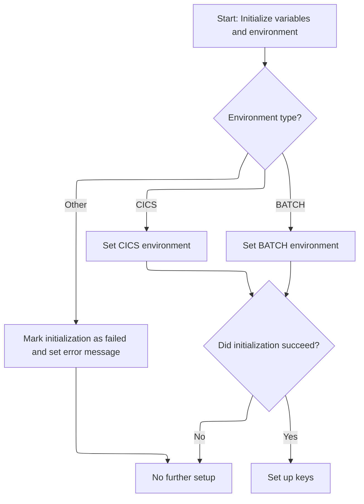

This section ensures the program is running in a supported environment (CICS or BATCH) before proceeding. It sets up error tracking and initializes keys only if the environment is valid, otherwise it halts further setup and provides an error message.

| Category       | Rule Name                   | Description                                                                                                                                                                                                                                                                     |
| -------------- | --------------------------- | ------------------------------------------------------------------------------------------------------------------------------------------------------------------------------------------------------------------------------------------------------------------------------- |
| Business logic | CICS environment setup      | If the environment flag indicates CICS, the system must set the CICS environment indicator to TRUE and proceed with further initialization.                                                                                                                                     |
| Business logic | BATCH environment setup     | If the environment flag indicates BATCH, the system must set the BATCH environment indicator to TRUE and proceed with further initialization.                                                                                                                                   |
| Business logic | Key setup on success        | If initialization is successful (SUCCESS = 0), the system must proceed to set up keys required for further processing.                                                                                                                                                          |
| Business logic | Error program name tracking | The error program name must always be set to <SwmToken path="base/src/WWWS0040.cbl" pos="106:5:5" line-data="012300     MOVE &#39;WWWS0040&#39;                TO YYYC0097-ERROR-PGM         00012300">`WWWS0040`</SwmToken> during initialization for error tracking purposes. |

<SwmSnippet path="/base/src/WWWS0040.cbl" line="95">

---

<SwmToken path="base/src/WWWS0040.cbl" pos="95:2:4" line-data="011200 100-INITIALIZE.                                                  00011200">`100-INITIALIZE`</SwmToken> calls <SwmToken path="base/src/WWWS0040.cbl" pos="96:4:8" line-data="011300     PERFORM 110-MISC-INITS                                       00011300">`110-MISC-INITS`</SwmToken> to figure out if we're in batch or CICS mode and to set up the error program name. If the environment is invalid, it flags failure and sets an error message. This check is needed before we can set up any keys or continue.

```cobol
011200 100-INITIALIZE.                                                  00011200
011300     PERFORM 110-MISC-INITS                                       00011300
011400     IF SUCCESS                                                   00011400
011500       PERFORM 120-SETUP-KEYS                                     00011500
011600     END-IF                                                       00011600
011700     .                                                            00011700
```

---

</SwmSnippet>

<SwmSnippet path="/base/src/WWWS0040.cbl" line="103">

---

<SwmToken path="base/src/WWWS0040.cbl" pos="103:2:6" line-data="012000 110-MISC-INITS.                                                  00012000">`110-MISC-INITS`</SwmToken> checks if we're in CICS or batch mode using repo-specific flags, sets the environment flag, and moves <SwmToken path="base/src/WWWS0040.cbl" pos="106:5:5" line-data="012300     MOVE &#39;WWWS0040&#39;                TO YYYC0097-ERROR-PGM         00012300">`WWWS0040`</SwmToken> to the error program name. If the environment is invalid, it sets FAILURE and an error message for error tracking.

```cobol
012000 110-MISC-INITS.                                                  00012000
012100     INITIALIZE XXXN001A                                          00012100
012200                                                                  00012200
012300     MOVE 'WWWS0040'                TO YYYC0097-ERROR-PGM         00012300
012400                                                                  00012400
012500     EVALUATE TRUE                                                00012500
012600       WHEN YYYN005A-CICS-ENV                                     00012600
012700         SET YYYN110A-CICS-ENV      TO TRUE                       00012700
012800       WHEN YYYN005A-BATCH-ENV                                    00012800
012900         SET YYYN110A-BATCH-ENV     TO TRUE                       00012900
013000       WHEN OTHER                                                 00013000
013100         SET FAILURE                TO TRUE                       00013100
013200         MOVE 'WWWS0040 - Invalid environment variable.'          00013200
013300                                    TO IS-RTRN-MSG-TXT            00013300
013400     END-EVALUATE                                                 00013400
```

---

</SwmSnippet>

## Key Setup and Operation Dispatch

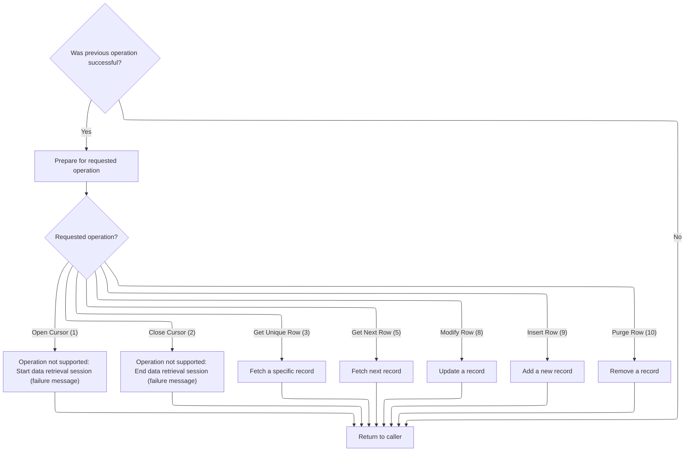

<SwmSnippet path="/base/src/WWWS0040.cbl" line="66">

---

Back in <SwmToken path="base/src/WWWS0040.cbl" pos="63:2:4" line-data="008000 000-MAIN.                                                        00008000">`000-MAIN`</SwmToken>, after returning from <SwmToken path="base/src/WWWS0040.cbl" pos="64:4:6" line-data="008100     PERFORM 100-INITIALIZE                                       00008100">`100-INITIALIZE`</SwmToken>, we check if SUCCESS is set. Only then do we run <SwmToken path="base/src/WWWS0040.cbl" pos="67:4:8" line-data="008400       PERFORM 120-SETUP-KEYS                                     00008400">`120-SETUP-KEYS`</SwmToken>. If initialization failed, we skip key setup and don't continue.

```cobol
008300     IF SUCCESS                                                   00008300
008400       PERFORM 120-SETUP-KEYS                                     00008400
```

---

</SwmSnippet>

<SwmSnippet path="/base/src/WWWS0040.cbl" line="68">

---

Finally in <SwmToken path="base/src/WWWS0040.cbl" pos="63:2:4" line-data="008000 000-MAIN.                                                        00008000">`000-MAIN`</SwmToken>, after key setup, we use the exit code to dispatch to the right cursor operation handler. For example, if the exit code is for opening a cursor, we call <SwmToken path="base/src/WWWS0040.cbl" pos="71:4:10" line-data="008800              PERFORM 1000-EXIT-OPEN-CURSOR                       00008800">`1000-EXIT-OPEN-CURSOR`</SwmToken>. Unsupported operations are handled with explicit error messages.

```cobol
008500       IF SUCCESS                                                 00008500
008600         EVALUATE TRUE                                            00008600
008700           WHEN EXIT-OPEN-CURSOR                                  00008700
008800              PERFORM 1000-EXIT-OPEN-CURSOR                       00008800
008900           WHEN EXIT-CLOSE-CURSOR                                 00008900
009000              PERFORM 1100-EXIT-CLOSE-CURSOR                      00009000
009100           WHEN EXIT-GET-UNIQUE-ROW                               00009100
009200              PERFORM 1200-EXIT-GET-UNIQUE-ROW                    00009200
009300           WHEN EXIT-GET-NEXT-ROW                                 00009300
009400              PERFORM 1300-EXIT-GET-NEXT-ROW                      00009400
009500           WHEN EXIT-PUT-MODIFY-ROW                               00009500
009600              PERFORM 1400-EXIT-PUT-MODIFY-ROW                    00009600
009700           WHEN EXIT-PUT-INSERT-ROW                               00009700
009800              PERFORM 1500-EXIT-PUT-INSERT-ROW                    00009800
009900           WHEN EXIT-PUT-PURGE-ROW                                00009900
010000              PERFORM 1600-EXIT-PUT-PURGE-ROW                     00010000
010100         END-EVALUATE                                             00010100
010200       END-IF                                                     00010200
010300     END-IF                                                       00010300
010400                                                                  00010400
010500     GOBACK                                                       00010500
010600     .                                                            00010600
```

---

</SwmSnippet>

<SwmSnippet path="/base/src/WWWS0040.cbl" line="137">

---

<SwmToken path="base/src/WWWS0040.cbl" pos="137:2:8" line-data="015400 1000-EXIT-OPEN-CURSOR.                                           00015400">`1000-EXIT-OPEN-CURSOR`</SwmToken> just sets FAILURE and moves a 'not supported' message to <SwmToken path="base/src/WWWS0040.cbl" pos="140:4:10" line-data="015700                                    TO IS-RTRN-MSG-TXT            00015700">`IS-RTRN-MSG-TXT`</SwmToken>. It's a stub for future cursor open support.

```cobol
015400 1000-EXIT-OPEN-CURSOR.                                           00015400
015500     SET  FAILURE                   TO TRUE                       00015500
015600     MOVE 'WWWS0040 - Open Cursor is not supported - YET!'        00015600
015700                                    TO IS-RTRN-MSG-TXT            00015700
015800     .                                                            00015800
```

---

</SwmSnippet>

<SwmSnippet path="/base/src/WWWS0040.cbl" line="147">

---

<SwmToken path="base/src/WWWS0040.cbl" pos="147:2:8" line-data="016400 1100-EXIT-CLOSE-CURSOR.                                          00016400">`1100-EXIT-CLOSE-CURSOR`</SwmToken> sets FAILURE and moves a 'not supported' message to <SwmToken path="base/src/WWWS0040.cbl" pos="150:4:10" line-data="016700                                    TO IS-RTRN-MSG-TXT            00016700">`IS-RTRN-MSG-TXT`</SwmToken>. It's just a placeholder for future cursor close support.

```cobol
016400 1100-EXIT-CLOSE-CURSOR.                                          00016400
016500     SET  FAILURE                   TO TRUE                       00016500
016600     MOVE 'WWWS0040 - Close Cursor is not supported - YET!'       00016600
016700                                    TO IS-RTRN-MSG-TXT            00016700
016800     .                                                            00016800
```

---

</SwmSnippet>

# Unique Row Retrieval

This section ensures that only one unique department row is retrieved and made available for downstream processes. It acts as a gatekeeper to prevent duplicate or incorrect department data from being processed.

| Category        | Rule Name                   | Description                                                                                                                                 |
| --------------- | --------------------------- | ------------------------------------------------------------------------------------------------------------------------------------------- |
| Data validation | Row Criteria Validation     | The retrieval process must validate that the department row meets all required criteria before it is considered unique and valid.           |
| Business logic  | Single Row Enforcement      | Only one department row may be retrieved per request. If multiple rows match the criteria, only the first matching row is considered valid. |
| Business logic  | Row Translation Requirement | The retrieved department row must be translated into the format required by downstream processes before being returned.                     |

<SwmSnippet path="/base/src/WWWS0040.cbl" line="157">

---

<SwmToken path="base/src/WWWS0040.cbl" pos="157:2:10" line-data="017400 1200-EXIT-GET-UNIQUE-ROW.                                        00017400">`1200-EXIT-GET-UNIQUE-ROW`</SwmToken> just hands off to <SwmToken path="base/src/WWWS0040.cbl" pos="158:4:8" line-data="017500     PERFORM 1210-PROCESS-DP                                      00017500">`1210-PROCESS-DP`</SwmToken>, which does the actual department data retrieval and translation. The naming is a bit misleading, but the real work happens in the next function.

```cobol
017400 1200-EXIT-GET-UNIQUE-ROW.                                        00017400
017500     PERFORM 1210-PROCESS-DP                                      00017500
017600     .                                                            00017600
```

---

</SwmSnippet>

# Department Data Processing

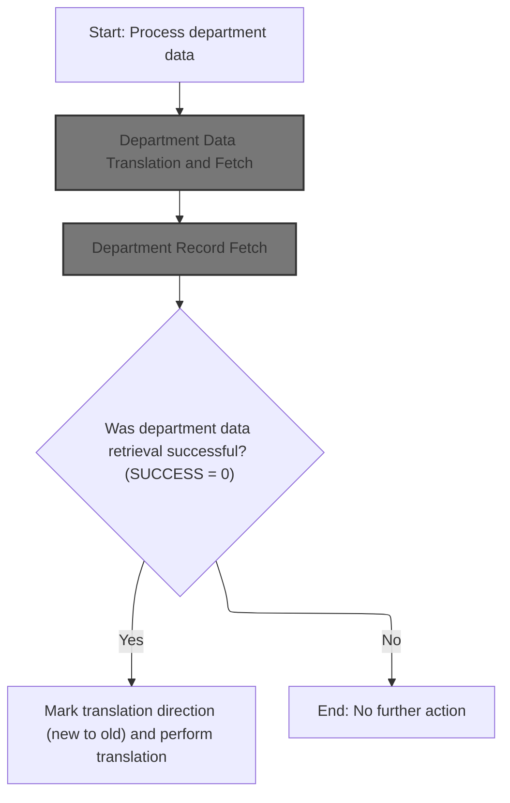

This section governs the processing of department data, including translation between formats and retrieval of department records. It ensures that only successfully retrieved records are translated and processed further.

| Category        | Rule Name                               | Description                                                                                                                                               |
| --------------- | --------------------------------------- | --------------------------------------------------------------------------------------------------------------------------------------------------------- |
| Data validation | Translation Direction Marking           | The translation direction must be explicitly marked as 'new to old' (YYYN111A-FUNCTION = 'N') when processing a successfully retrieved department record. |
| Business logic  | Department Data Translation Requirement | Department data must be translated from the old format to the new format before attempting to retrieve the department record.                             |
| Business logic  | Successful Retrieval Processing         | If department record retrieval is successful (SUCCESS = 0), the translation direction is marked as new to old and translation is performed.               |

<SwmSnippet path="/base/src/WWWS0040.cbl" line="162">

---

<SwmToken path="base/src/WWWS0040.cbl" pos="162:2:6" line-data="017900 1210-PROCESS-DP.                                                 00017900">`1210-PROCESS-DP`</SwmToken> hands off to <SwmToken path="base/src/WWWS0040.cbl" pos="163:4:8" line-data="018000     PERFORM 2200-GET-DP                                          00018000">`2200-GET-DP`</SwmToken> for department data translation and fetch.

```cobol
017900 1210-PROCESS-DP.                                                 00017900
018000     PERFORM 2200-GET-DP                                          00018000
```

---

</SwmSnippet>

## Department Data Translation and Fetch

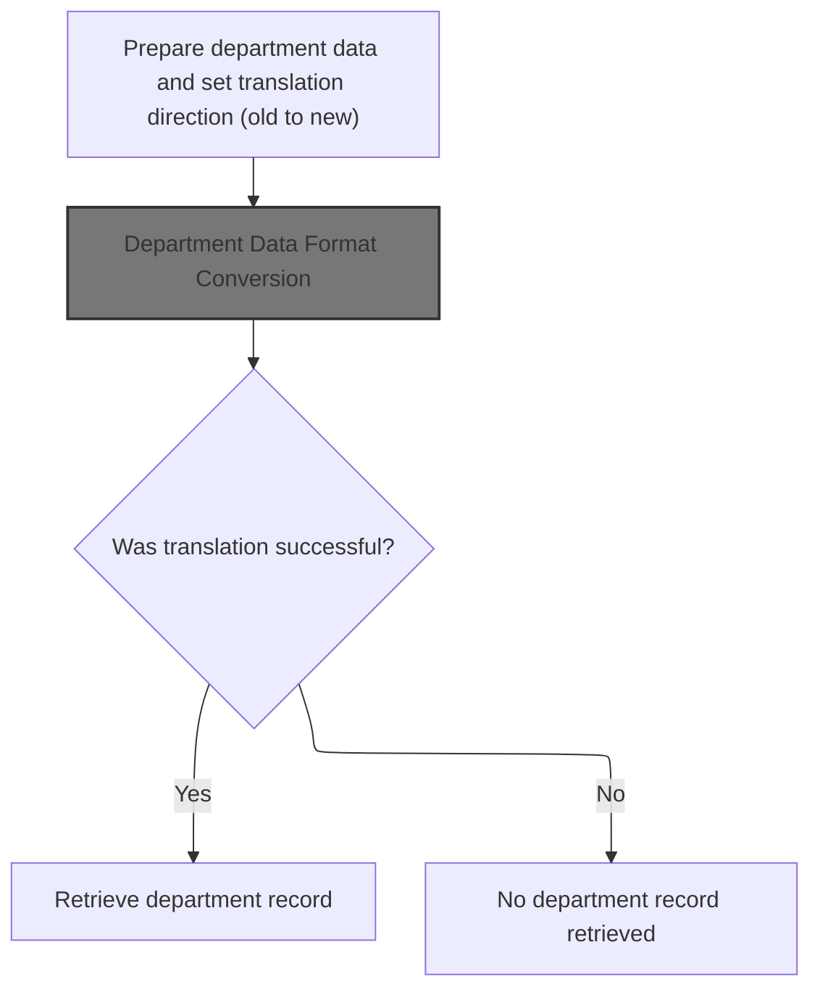

This section governs the translation of department data from an old format to a new format, ensuring that data is correctly converted before any retrieval or further processing. It also determines whether a department record can be fetched based on the success of the translation.

| Category        | Rule Name                       | Description                                                                                                                                                   |
| --------------- | ------------------------------- | ------------------------------------------------------------------------------------------------------------------------------------------------------------- |
| Data validation | Translation Success Requirement | If the translation of department data is successful (return code equals 0), the department record is retrieved; otherwise, no department record is retrieved. |
| Business logic  | Mandatory Data Translation      | Department data must be translated from the old format to the new format before any department record can be retrieved.                                       |
| Business logic  | Explicit Translation Direction  | The translation direction must be explicitly set to 'old to new' before performing the department data translation.                                           |

<SwmSnippet path="/base/src/WWWS0040.cbl" line="335">

---

In <SwmToken path="base/src/WWWS0040.cbl" pos="335:2:6" line-data="035200 2200-GET-DP.                                                     00035200">`2200-GET-DP`</SwmToken> we call <SwmToken path="base/src/WWWS0040.cbl" pos="339:4:8" line-data="035600     PERFORM 2000-DP-TRANSLATION                                  00035600">`2000-DP-TRANSLATION`</SwmToken> to convert department data formats before doing any fetch. This keeps translation logic reusable and separate from the actual data retrieval.

```cobol
035200 2200-GET-DP.                                                     00035200
035300                                                                  00035300
035400     INITIALIZE P-DDDTDP01                                        00035400
035500     SET YYYN111A-OLD-2-NEW TO TRUE                               00035500
035600     PERFORM 2000-DP-TRANSLATION                                  00035600
```

---

</SwmSnippet>

### Department Data Format Conversion

This section is responsible for converting department data formats using a reusable translation logic, ensuring that all department data adheres to the required standardized format for further processing.

| Category        | Rule Name                       | Description                                                                                                                                                                |
| --------------- | ------------------------------- | -------------------------------------------------------------------------------------------------------------------------------------------------------------------------- |
| Data validation | Location Type Coverage          | Department data conversion must support all location types defined in KONSTANTS, including vendor, store, account, warehouse, and DSD vendor.                              |
| Data validation | Maximum Value Enforcement       | Maximum values for specific fields (such as K-OB-MAX, K-PP-MAX, etc.) must not be exceeded during conversion; any data exceeding these limits must be flagged as an error. |
| Business logic  | Standardized Format Enforcement | All department data must be converted to the standardized format before it is used by any downstream processes or modules.                                                 |
| Business logic  | Reusable Translation Logic      | The translation logic for department data must be maintained in a separate, reusable program to support maintainability and reduce duplication.                            |
| Business logic  | Constants Application           | Constants defined in the KONSTANTS scope (such as location types and maximum values) must be used during the conversion to ensure business rules are consistently applied. |

<SwmSnippet path="/base/src/WWWS0040.cbl" line="323">

---

<SwmToken path="base/src/WWWS0040.cbl" pos="323:2:6" line-data="034000 2000-DP-TRANSLATION.                                             00034000">`2000-DP-TRANSLATION`</SwmToken> calls <SwmToken path="base/src/WWWS0040.cbl" pos="324:4:8" line-data="034100     CALL MMMS0258-TRANSLATE-DP USING                             00034100">`MMMS0258-TRANSLATE-DP`</SwmToken> to convert department data formats. The translation logic is kept in a separate program for reuse and maintainability.

```cobol
034000 2000-DP-TRANSLATION.                                             00034000
034100     CALL MMMS0258-TRANSLATE-DP USING                             00034100
034200         XXXN001A                                                 00034200
034300         YYYN111A                                                 00034300
034400         P-DDDTDP01                                               00034400
034500         XXXLCT20                                                 00034500
034600     .                                                            00034600
```

---

</SwmSnippet>

### Translation Dispatcher

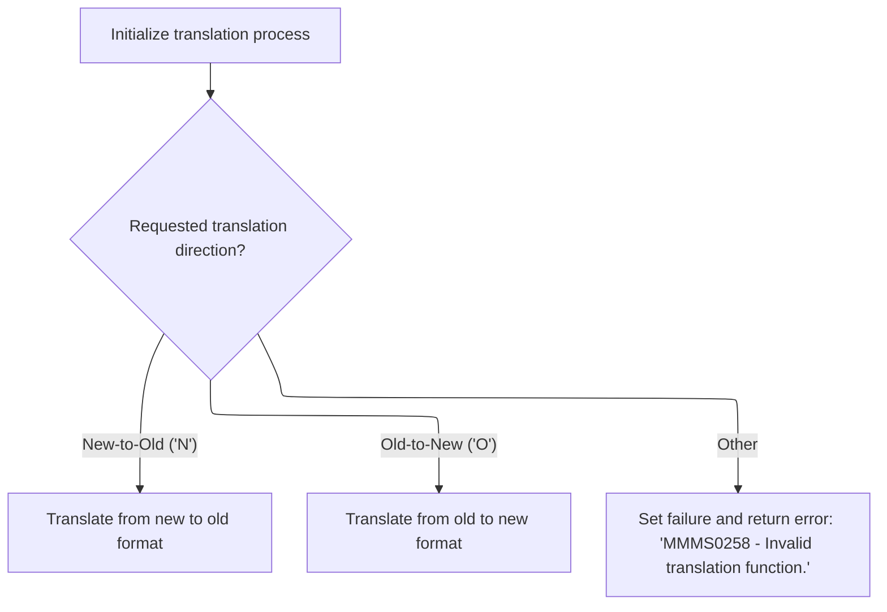

This section determines the translation direction based on the provided function code, dispatches the request to the appropriate translation process, and handles invalid requests by setting an error status and message.

| Category        | Rule Name                  | Description                                                                                                                 |
| --------------- | -------------------------- | --------------------------------------------------------------------------------------------------------------------------- |
| Data validation | Translation Initialization | The translation process must always begin with an initialization step before dispatching to any translation direction.      |
| Business logic  | New-to-Old Translation     | If the requested translation direction is 'N', the system must perform a translation from the new format to the old format. |
| Business logic  | Old-to-New Translation     | If the requested translation direction is 'O', the system must perform a translation from the old format to the new format. |

<SwmSnippet path="/base/src/MMMS0258.cbl" line="61">

---

<SwmToken path="base/src/MMMS0258.cbl" pos="61:2:4" line-data="007600 000-MAIN.                                                        00007600">`000-MAIN`</SwmToken> in <SwmToken path="base/src/MMMS0258.cbl" pos="73:5:5" line-data="008800         MOVE &#39;MMMS0258 - Invalid translation function.&#39;          00008800">`MMMS0258`</SwmToken> uses EVALUATE to pick the right translation based on YYYN111A-FUNCTION. It runs initialization first, then dispatches to either new-to-old or old-to-new translation, or sets FAILURE if the function code is invalid.

```cobol
007600 000-MAIN.                                                        00007600
007700     PERFORM 100-INITIALIZE                                       00007700
007800                                                                  00007800
007900     EVALUATE TRUE                                                00007900
008000       WHEN YYYN111A-NEW-2-OLD                                    00008000
008100         PERFORM 200-NEW-2-OLD                                    00008100
008200                                                                  00008200
008300       WHEN YYYN111A-OLD-2-NEW                                    00008300
008400         PERFORM 500-OLD-2-NEW                                    00008400
008500                                                                  00008500
008600       WHEN OTHER                                                 00008600
008700         SET FAILURE TO TRUE                                      00008700
008800         MOVE 'MMMS0258 - Invalid translation function.'          00008800
008900           TO IS-RTRN-MSG-TXT                                     00008900
009000     END-EVALUATE                                                 00009000
009100                                                                  00009100
009200     GOBACK                                                       00009200
009300     .                                                            00009300
```

---

</SwmSnippet>

### New-to-Old Department Data Conversion

This section is responsible for converting department data from a new format to an old format, ensuring all necessary fields are mapped correctly and generating a department key in the format expected by downstream consumers.

| Category        | Rule Name                 | Description                                                                                                                                                                                                   |
| --------------- | ------------------------- | ------------------------------------------------------------------------------------------------------------------------------------------------------------------------------------------------------------- |
| Data validation | Required field validation | If any required field for mapping or key construction is missing or invalid, the conversion process must not proceed and an error must be raised.                                                             |
| Business logic  | Complete field mapping    | All department fields (name, abbreviation, reporting group code, profit percentages, shrink percentages) must be mapped from the new format to their corresponding fields in the old format without omission. |

<SwmSnippet path="/base/src/MMMS0258.cbl" line="92">

---

<SwmToken path="base/src/MMMS0258.cbl" pos="92:2:8" line-data="010700 200-NEW-2-OLD.                                                   00010700">`200-NEW-2-OLD`</SwmToken> moves department fields from new to old format, then calls <SwmToken path="base/src/MMMS0258.cbl" pos="110:4:14" line-data="012500     PERFORM 210-DEPT-CONV-NUM-2-ALPHA                            00012500">`210-DEPT-CONV-NUM-2-ALPHA`</SwmToken> to build the department key. This keeps the key creation logic separate and reusable.

```cobol
010700 200-NEW-2-OLD.                                                   00010700
010800     MOVE WS-CT-DEPARTMENT-SEQUENCE                               00010800
010900       TO CT-DEPARTMENT-SEQUENCE      OF DDDLCT20                 00010900
011000     MOVE DEPT-NM                     OF P-DDDTDP01               00011000
011100       TO CT-DEPARTMENT-NAME          OF DDDLCT20                 00011100
011200     MOVE DEPT-ABB                    OF P-DDDTDP01               00011200
011300       TO ST-DEPARTMENT-ABBREVIATION  OF DDDLCT20                 00011300
011400     MOVE REPT-GRP-CD                 OF P-DDDTDP01               00011400
011500       TO OA-REPT-GRP-CD              OF DDDLCT20                 00011500
011600     MOVE GRPRFT-LO-PCT               OF P-DDDTDP01               00011600
011700       TO OA-GRS-PRFT-LO-PCT          OF DDDLCT20                 00011700
011800     MOVE GRPRFT-HI-PCT               OF P-DDDTDP01               00011800
011900       TO OA-GRS-PRFT-HI-PCT          OF DDDLCT20                 00011900
012000     MOVE SHRNK-LO-PCT                OF P-DDDTDP01               00012000
012100       TO OA-SHRINK-LO-PCT            OF DDDLCT20                 00012100
012200     MOVE SHRNK-HI-PCT                OF P-DDDTDP01               00012200
012300       TO OA-SHRINK-HI-PCT            OF DDDLCT20                 00012300
012400                                                                  00012400
012500     PERFORM 210-DEPT-CONV-NUM-2-ALPHA                            00012500
012600     .                                                            00012600
```

---

</SwmSnippet>

<SwmSnippet path="/base/src/MMMS0258.cbl" line="117">

---

<SwmToken path="base/src/MMMS0258.cbl" pos="117:2:12" line-data="013200 210-DEPT-CONV-NUM-2-ALPHA.                                       00013200">`210-DEPT-CONV-NUM-2-ALPHA`</SwmToken> builds the department key by grabbing the first two chars from <SwmToken path="base/src/MMMS0258.cbl" pos="118:4:8" line-data="013300     MOVE STR-DEPT-NBR     (1:2)                                  00013300">`STR-DEPT-NBR`</SwmToken> and the first char from <SwmToken path="base/src/MMMS0258.cbl" pos="121:4:10" line-data="013600     MOVE STR-SUB-DEPT-ID  (1:1)                                  00013600">`STR-SUB-DEPT-ID`</SwmToken>. The positions are fixed because that's what downstream expects.

```cobol
013200 210-DEPT-CONV-NUM-2-ALPHA.                                       00013200
013300     MOVE STR-DEPT-NBR     (1:2)                                  00013300
013400       TO ST-DEPARTMENT-KEY(1:2)                                  00013400
013500                                                                  00013500
013600     MOVE STR-SUB-DEPT-ID  (1:1)                                  00013600
013700       TO ST-DEPARTMENT-KEY(3:1)                                  00013700
013800     .                                                            00013800
```

---

</SwmSnippet>

### Old-to-New Department Data Conversion

```mermaid
%%{init: {"flowchart": {"defaultRenderer": "elk"}} }%%
flowchart TD
  node1["Start: Transform department data"]
  click node1 openCode "base/src/MMMS0258.cbl:129:130"
  node1 --> node2["Map department key, name, abbreviation"]
  click node2 openCode "base/src/MMMS0258.cbl:130:135"
  node2 --> node3{"Is report group code numeric?"}
  click node3 openCode "base/src/MMMS0258.cbl:137:143"
  node3 -->|"Yes"| node4["Use report group code"]
  click node4 openCode "base/src/MMMS0258.cbl:141:142"
  node3 -->|"No"| node5["Set report group code to zero"]
  click node5 openCode "base/src/MMMS0258.cbl:138:139"
  node4 --> node6{"Is gross profit low % numeric?"}
  node5 --> node6
  click node6 openCode "base/src/MMMS0258.cbl:145:151"
  node6 -->|"Yes"| node7["Use gross profit low %"]
  click node7 openCode "base/src/MMMS0258.cbl:149:150"
  node6 -->|"No"| node8["Set gross profit low % to zero"]
  click node8 openCode "base/src/MMMS0258.cbl:146:147"
  node7 --> node9{"Is gross profit high % numeric?"}
  node8 --> node9
  click node9 openCode "base/src/MMMS0258.cbl:153:159"
  node9 -->|"Yes"| node10["Use gross profit high %"]
  click node10 openCode "base/src/MMMS0258.cbl:157:158"
  node9 -->|"No"| node11["Set gross profit high % to zero"]
  click node11 openCode "base/src/MMMS0258.cbl:154:155"
  node10 --> node12{"Is shrink low % numeric?"}
  node11 --> node12
  click node12 openCode "base/src/MMMS0258.cbl:161:167"
  node12 -->|"Yes"| node13["Use shrink low %"]
  click node13 openCode "base/src/MMMS0258.cbl:165:166"
  node12 -->|"No"| node14["Set shrink low % to zero"]
  click node14 openCode "base/src/MMMS0258.cbl:162:163"
  node13 --> node15{"Is shrink high % numeric?"}
  node14 --> node15
  click node15 openCode "base/src/MMMS0258.cbl:169:175"
  node15 -->|"Yes"| node16["Use shrink high %"]
  click node16 openCode "base/src/MMMS0258.cbl:173:174"
  node15 -->|"No"| node17["Set shrink high % to zero"]
  click node17 openCode "base/src/MMMS0258.cbl:170:171"
  node16 --> node18["Populate new department structure"]
  node17 --> node18["Populate new department structure"]
  click node18 openCode "base/src/MMMS0258.cbl:177:178"
classDef HeadingStyle fill:#777777,stroke:#333,stroke-width:2px;

%% Swimm:
%% %%{init: {"flowchart": {"defaultRenderer": "elk"}} }%%
%% flowchart TD
%%   node1["Start: Transform department data"]
%%   click node1 openCode "<SwmPath>[base/src/MMMS0258.cbl](base/src/MMMS0258.cbl)</SwmPath>:129:130"
%%   node1 --> node2["Map department key, name, abbreviation"]
%%   click node2 openCode "<SwmPath>[base/src/MMMS0258.cbl](base/src/MMMS0258.cbl)</SwmPath>:130:135"
%%   node2 --> node3{"Is report group code numeric?"}
%%   click node3 openCode "<SwmPath>[base/src/MMMS0258.cbl](base/src/MMMS0258.cbl)</SwmPath>:137:143"
%%   node3 -->|"Yes"| node4["Use report group code"]
%%   click node4 openCode "<SwmPath>[base/src/MMMS0258.cbl](base/src/MMMS0258.cbl)</SwmPath>:141:142"
%%   node3 -->|"No"| node5["Set report group code to zero"]
%%   click node5 openCode "<SwmPath>[base/src/MMMS0258.cbl](base/src/MMMS0258.cbl)</SwmPath>:138:139"
%%   node4 --> node6{"Is gross profit low % numeric?"}
%%   node5 --> node6
%%   click node6 openCode "<SwmPath>[base/src/MMMS0258.cbl](base/src/MMMS0258.cbl)</SwmPath>:145:151"
%%   node6 -->|"Yes"| node7["Use gross profit low %"]
%%   click node7 openCode "<SwmPath>[base/src/MMMS0258.cbl](base/src/MMMS0258.cbl)</SwmPath>:149:150"
%%   node6 -->|"No"| node8["Set gross profit low % to zero"]
%%   click node8 openCode "<SwmPath>[base/src/MMMS0258.cbl](base/src/MMMS0258.cbl)</SwmPath>:146:147"
%%   node7 --> node9{"Is gross profit high % numeric?"}
%%   node8 --> node9
%%   click node9 openCode "<SwmPath>[base/src/MMMS0258.cbl](base/src/MMMS0258.cbl)</SwmPath>:153:159"
%%   node9 -->|"Yes"| node10["Use gross profit high %"]
%%   click node10 openCode "<SwmPath>[base/src/MMMS0258.cbl](base/src/MMMS0258.cbl)</SwmPath>:157:158"
%%   node9 -->|"No"| node11["Set gross profit high % to zero"]
%%   click node11 openCode "<SwmPath>[base/src/MMMS0258.cbl](base/src/MMMS0258.cbl)</SwmPath>:154:155"
%%   node10 --> node12{"Is shrink low % numeric?"}
%%   node11 --> node12
%%   click node12 openCode "<SwmPath>[base/src/MMMS0258.cbl](base/src/MMMS0258.cbl)</SwmPath>:161:167"
%%   node12 -->|"Yes"| node13["Use shrink low %"]
%%   click node13 openCode "<SwmPath>[base/src/MMMS0258.cbl](base/src/MMMS0258.cbl)</SwmPath>:165:166"
%%   node12 -->|"No"| node14["Set shrink low % to zero"]
%%   click node14 openCode "<SwmPath>[base/src/MMMS0258.cbl](base/src/MMMS0258.cbl)</SwmPath>:162:163"
%%   node13 --> node15{"Is shrink high % numeric?"}
%%   node14 --> node15
%%   click node15 openCode "<SwmPath>[base/src/MMMS0258.cbl](base/src/MMMS0258.cbl)</SwmPath>:169:175"
%%   node15 -->|"Yes"| node16["Use shrink high %"]
%%   click node16 openCode "<SwmPath>[base/src/MMMS0258.cbl](base/src/MMMS0258.cbl)</SwmPath>:173:174"
%%   node15 -->|"No"| node17["Set shrink high % to zero"]
%%   click node17 openCode "<SwmPath>[base/src/MMMS0258.cbl](base/src/MMMS0258.cbl)</SwmPath>:170:171"
%%   node16 --> node18["Populate new department structure"]
%%   node17 --> node18["Populate new department structure"]
%%   click node18 openCode "<SwmPath>[base/src/MMMS0258.cbl](base/src/MMMS0258.cbl)</SwmPath>:177:178"
%% classDef HeadingStyle fill:#777777,stroke:#333,stroke-width:2px;
```

This section converts legacy department data to a new format, ensuring all required fields are mapped and validated for numeric correctness. If any numeric field is invalid, it is set to zero to maintain data integrity. The section also handles the population of department number fields, accommodating both numeric and non-numeric cases for compatibility.

| Category        | Rule Name                       | Description                                                                                                                                                                                       |
| --------------- | ------------------------------- | ------------------------------------------------------------------------------------------------------------------------------------------------------------------------------------------------- |
| Data validation | Report group code validation    | If the report group code is not numeric, it must be set to zero in the new department structure.                                                                                                  |
| Data validation | Gross profit low % validation   | If gross profit low percentage is not numeric, it must be set to zero in the new department structure.                                                                                            |
| Data validation | Gross profit high % validation  | If gross profit high percentage is not numeric, it must be set to zero in the new department structure.                                                                                           |
| Data validation | Shrink low % validation         | If shrink low percentage is not numeric, it must be set to zero in the new department structure.                                                                                                  |
| Data validation | Shrink high % validation        | If shrink high percentage is not numeric, it must be set to zero in the new department structure.                                                                                                 |
| Business logic  | Direct field mapping            | Department key, name, and abbreviation from the old format must be mapped directly to the corresponding fields in the new department structure.                                                   |
| Business logic  | Department number compatibility | Department number fields must be populated using substrings from the department key, with logic to handle both numeric and non-numeric cases to ensure compatibility with legacy and new formats. |

<SwmSnippet path="/base/src/MMMS0258.cbl" line="129">

---

<SwmToken path="base/src/MMMS0258.cbl" pos="129:2:8" line-data="014400 500-OLD-2-NEW.                                                   00014400">`500-OLD-2-NEW`</SwmToken> moves department fields to the new format, checks if numeric fields are valid, and sets them to zero if not. Then it calls <SwmToken path="base/src/MMMS0258.cbl" pos="177:4:10" line-data="019200     PERFORM 510-POPULATE-STR-DEPT                                00019200">`510-POPULATE-STR-DEPT`</SwmToken> to finish populating department number fields.

```cobol
014400 500-OLD-2-NEW.                                                   00014400
014500     MOVE ST-DEPARTMENT-KEY                                       00014500
014600       TO WS-STR-DEPT-NBR                                         00014600
014700     MOVE CT-DEPARTMENT-NAME                                      00014700
014800       TO DEPT-NM                     OF P-DDDTDP01               00014800
014900     MOVE ST-DEPARTMENT-ABBREVIATION                              00014900
015000       TO DEPT-ABB                    OF P-DDDTDP01               00015000
015100                                                                  00015100
015200     IF OA-REPT-GRP-CD        NOT NUMERIC                         00015200
015300        MOVE ZERO                                                 00015300
015400          TO REPT-GRP-CD              OF P-DDDTDP01               00015400
015500     ELSE                                                         00015500
015600        MOVE OA-REPT-GRP-CD                                       00015600
015700          TO REPT-GRP-CD              OF P-DDDTDP01               00015700
015800     END-IF                                                       00015800
015900                                                                  00015900
016000     IF OA-GRS-PRFT-LO-PCT    NOT NUMERIC                         00016000
016100        MOVE ZERO                                                 00016100
016200          TO GRPRFT-LO-PCT            OF P-DDDTDP01               00016200
016300     ELSE                                                         00016300
016400        MOVE OA-GRS-PRFT-LO-PCT                                   00016400
016500          TO GRPRFT-LO-PCT            OF P-DDDTDP01               00016500
016600     END-IF                                                       00016600
016700                                                                  00016700
016800     IF OA-GRS-PRFT-HI-PCT    NOT NUMERIC                         00016800
016900        MOVE ZERO                                                 00016900
017000          TO GRPRFT-HI-PCT            OF P-DDDTDP01               00017000
017100     ELSE                                                         00017100
017200        MOVE OA-GRS-PRFT-HI-PCT                                   00017200
017300          TO GRPRFT-HI-PCT            OF P-DDDTDP01               00017300
017400     END-IF                                                       00017400
017500                                                                  00017500
017600     IF OA-SHRINK-LO-PCT      NOT NUMERIC                         00017600
017700        MOVE ZERO                                                 00017700
017800          TO SHRNK-LO-PCT             OF P-DDDTDP01               00017800
017900     ELSE                                                         00017900
018000        MOVE OA-SHRINK-LO-PCT                                     00018000
018100          TO SHRNK-LO-PCT             OF P-DDDTDP01               00018100
018200     END-IF                                                       00018200
018300                                                                  00018300
018400     IF OA-SHRINK-HI-PCT      NOT NUMERIC                         00018400
018500        MOVE ZERO                                                 00018500
018600          TO SHRNK-HI-PCT             OF P-DDDTDP01               00018600
018700     ELSE                                                         00018700
018800        MOVE OA-SHRINK-HI-PCT                                     00018800
018900          TO SHRNK-HI-PCT             OF P-DDDTDP01               00018900
019000     END-IF                                                       00019000
019100                                                                  00019100
019200     PERFORM 510-POPULATE-STR-DEPT                                00019200
019300     .                                                            00019300
```

---

</SwmSnippet>

<SwmSnippet path="/base/src/MMMS0258.cbl" line="184">

---

<SwmToken path="base/src/MMMS0258.cbl" pos="184:2:8" line-data="019900 510-POPULATE-STR-DEPT.                                           00019900">`510-POPULATE-STR-DEPT`</SwmToken> moves substrings from working storage to department fields, checks if they're numeric, and conditionally moves or builds the department number. The logic is complex because it needs to handle both numeric and non-numeric cases for compatibility.

```cobol
019900 510-POPULATE-STR-DEPT.                                           00019900
020000     MOVE WS-STR-DEPT-NBR-X-L3(1:1)                               00020000
020100       TO STR-SUB-DEPT-ID OF P-DDDTDP01                           00020100
020200     MOVE WS-STR-DEPT-NBR-X-L2(1:2)                               00020200
020300       TO WS-STR-DEPT                                             00020300
020400                                                                  00020400
020500     IF WS-STR-DEPT-N2 IS NUMERIC                                 00020500
020600       MOVE WS-STR-DEPT-N2                                        00020600
020700         TO STR-DEPT-NBR            OF P-DDDTDP01                 00020700
020800     ELSE                                                         00020800
020900       MOVE WS-STR-DEPT-X2(2:1)                                   00020900
021000         TO WS-STR-DEPT-X3(1:1)                                   00021000
021100       IF WS-STR-DEPT-X3(1:1) IS NUMERIC                          00021100
021200          MOVE WS-STR-DEPT-X3(1:1)                                00021200
021300            TO WS-STR-DEPT-N3                                     00021300
021400          MOVE WS-STR-DEPT-N3                                     00021400
021500            TO STR-DEPT-NBR            OF P-DDDTDP01              00021500
021600       ELSE                                                       00021600
021700          MOVE WS-STR-DEPT-X3(1:1)                                00021700
021800            TO STR-DEPT-NBR            OF P-DDDTDP01              00021800
021900       END-IF                                                     00021900
022000     END-IF                                                       00022000
022100     .                                                            00022100
```

---

</SwmSnippet>

### Conditional Department Record Fetch

<SwmSnippet path="/base/src/WWWS0040.cbl" line="340">

---

In <SwmToken path="base/src/WWWS0040.cbl" pos="341:4:10" line-data="035800        PERFORM 2210-GET-DP-RECORD                                00035800">`2210-GET-DP-RECORD`</SwmToken> we set <SwmToken path="base/src/WWWS0040.cbl" pos="74:4:10" line-data="009100           WHEN EXIT-GET-UNIQUE-ROW                               00009100">`EXIT-GET-UNIQUE-ROW`</SwmToken> to TRUE, then call <SwmToken path="base/src/WWWS0040.cbl" pos="197:4:10" line-data="021400         PERFORM 2400-CALL-DP-DAO                                 00021400">`2400-CALL-DP-DAO`</SwmToken> to fetch the department record from the database. The flag makes sure we get a unique row.

```cobol
035700     IF SUCCESS                                                   00035700
035800        PERFORM 2210-GET-DP-RECORD                                00035800
035900     END-IF                                                       00035900
```

---

</SwmSnippet>

## Department Record Fetch

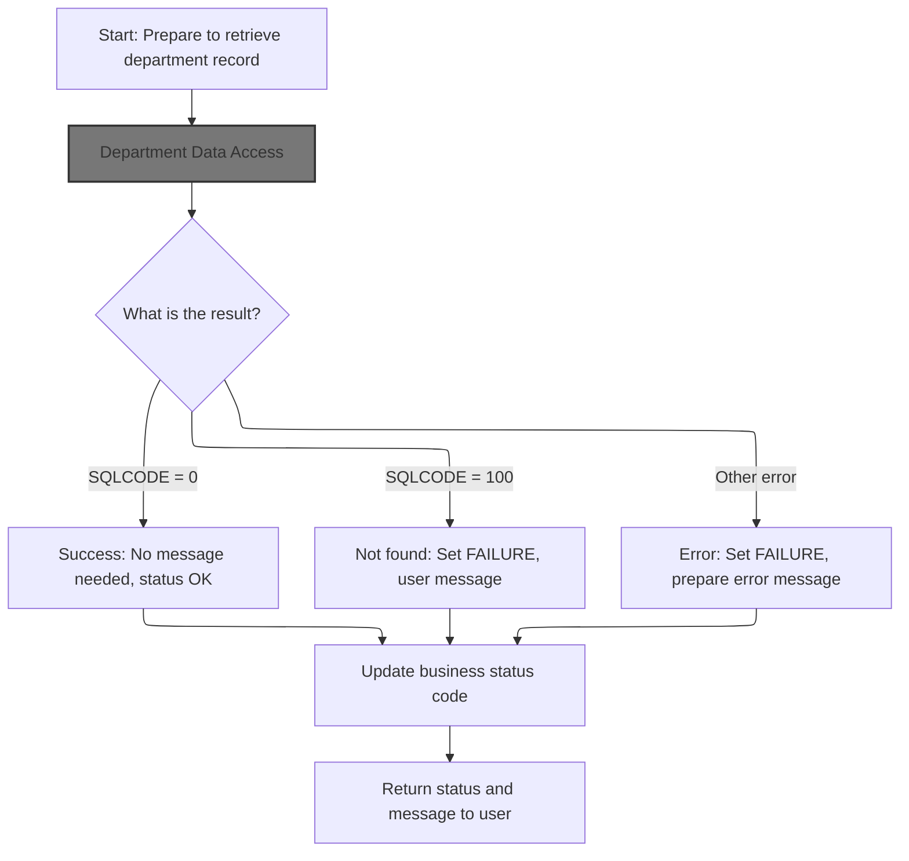

This section governs the retrieval of a department record from the database, ensuring that only a unique record is fetched and that the user is informed of the outcome with an appropriate status and message.

| Category       | Rule Name                   | Description                                                                                                                                                                        |
| -------------- | --------------------------- | ---------------------------------------------------------------------------------------------------------------------------------------------------------------------------------- |
| Business logic | Successful department fetch | If the department record is found (SQLCODE = 0), the operation is considered successful and no user message is required. The status code is set to indicate success.               |
| Business logic | Business status update      | After determining the result of the fetch operation, the business status code must be updated to reflect the outcome (success or failure) before returning the result to the user. |

<SwmSnippet path="/base/src/WWWS0040.cbl" line="346">

---

In <SwmToken path="base/src/WWWS0040.cbl" pos="346:2:8" line-data="036300 2210-GET-DP-RECORD.                                              00036300">`2210-GET-DP-RECORD`</SwmToken> we set <SwmToken path="base/src/WWWS0040.cbl" pos="349:4:10" line-data="036600     SET  EXIT-GET-UNIQUE-ROW       TO TRUE                       00036600">`EXIT-GET-UNIQUE-ROW`</SwmToken> to TRUE, then call <SwmToken path="base/src/WWWS0040.cbl" pos="351:4:10" line-data="036800     PERFORM 2400-CALL-DP-DAO                                     00036800">`2400-CALL-DP-DAO`</SwmToken> to fetch the department record from the database. The flag makes sure we get a unique row.

```cobol
036300 2210-GET-DP-RECORD.                                              00036300
036400                                                                  00036400
036500     MOVE NNNN0000-EXIT-CODES       TO WS-NNNN0000-EXIT-CODES     00036500
036600     SET  EXIT-GET-UNIQUE-ROW       TO TRUE                       00036600
036700                                                                  00036700
036800     PERFORM 2400-CALL-DP-DAO                                     00036800
```

---

</SwmSnippet>

### Department Data Access

This section is responsible for handling all department table operations by delegating them to a reusable DAO program. It ensures that department data is accessed, modified, or retrieved according to business requirements, while maintaining separation of concerns and reusability.

| Category        | Rule Name                          | Description                                                                                                                                                     |
| --------------- | ---------------------------------- | --------------------------------------------------------------------------------------------------------------------------------------------------------------- |
| Data validation | Mandatory Parameter Passing        | The DAO program must receive all required parameters, including department data, SQL control area, and operation-specific parameters, for each call.            |
| Business logic  | Centralized Department Data Access | All department table operations must be routed through the designated DAO program to ensure consistency and maintainability.                                    |
| Business logic  | Multi-Operation Support            | The DAO program must support multiple types of department table operations, such as create, read, update, and delete, as specified by the operation parameters. |

<SwmSnippet path="/base/src/WWWS0040.cbl" line="376">

---

<SwmToken path="base/src/WWWS0040.cbl" pos="376:2:8" line-data="039300 2400-CALL-DP-DAO.                                                00039300">`2400-CALL-DP-DAO`</SwmToken> calls <SwmToken path="base/src/WWWS0040.cbl" pos="377:4:8" line-data="039400     CALL NNNS0573-DP-DAO USING                                   00039400">`NNNS0573-DP-DAO`</SwmToken> to handle department table operations. The DAO logic is kept in a separate program for reuse and maintainability.

```cobol
039300 2400-CALL-DP-DAO.                                                00039300
039400     CALL NNNS0573-DP-DAO USING                                   00039400
039500         XXXN001A                                                 00039500
039600         SQLCA                                                    00039600
039700         YYYN005A                                                 00039700
039800         NNNN0000-PARMS                                           00039800
039900         P-DDDTDP01                                               00039900
040000     .                                                            00040000
```

---

</SwmSnippet>

### DAO Operation Dispatcher

The DAO Operation Dispatcher section is responsible for managing and routing database operations based on specific exit codes and parameters. It determines which database action to perform (such as opening a cursor, inserting a row, or retrieving data) according to the values set in the <SwmToken path="base/src/WWWS0040.cbl" pos="381:2:4" line-data="039800         NNNN0000-PARMS                                           00039800">`NNNN0000-PARMS`</SwmToken> structure and related variables.

| Category        | Rule Name              | Description                                                                                                                                                                                                                                                                                                 |
| --------------- | ---------------------- | ----------------------------------------------------------------------------------------------------------------------------------------------------------------------------------------------------------------------------------------------------------------------------------------------------------- |
| Data validation | Operation Success      | If the operation result code is SUCCESS (value 0), the dispatcher must indicate a successful completion of the requested operation.                                                                                                                                                                         |
| Business logic  | Open Cursor Operation  | When <SwmToken path="base/src/WWWS0040.cbl" pos="70:4:8" line-data="008700           WHEN EXIT-OPEN-CURSOR                                  00008700">`EXIT-OPEN-CURSOR`</SwmToken> is set to 1, the dispatcher must initiate a database cursor for subsequent operations.                                  |
| Business logic  | Close Cursor Operation | When <SwmToken path="base/src/WWWS0040.cbl" pos="72:4:8" line-data="008900           WHEN EXIT-CLOSE-CURSOR                                 00008900">`EXIT-CLOSE-CURSOR`</SwmToken> is set to 2, the dispatcher must close the active database cursor to release resources and finalize the operation.     |
| Business logic  | Get Unique Row         | When <SwmToken path="base/src/WWWS0040.cbl" pos="74:4:10" line-data="009100           WHEN EXIT-GET-UNIQUE-ROW                               00009100">`EXIT-GET-UNIQUE-ROW`</SwmToken> is set to 3, the dispatcher must retrieve a unique row from the database based on the provided key.                 |
| Business logic  | Get Next Row           | When <SwmToken path="base/src/WWWS0040.cbl" pos="76:4:10" line-data="009300           WHEN EXIT-GET-NEXT-ROW                                 00009300">`EXIT-GET-NEXT-ROW`</SwmToken> is set to 5, the dispatcher must fetch the next available row from the database cursor.                               |
| Business logic  | Modify Row Operation   | When <SwmToken path="base/src/WWWS0040.cbl" pos="78:4:10" line-data="009500           WHEN EXIT-PUT-MODIFY-ROW                               00009500">`EXIT-PUT-MODIFY-ROW`</SwmToken> is set to 8, the dispatcher must update an existing row in the database with new values.                            |
| Business logic  | Insert Row Operation   | When <SwmToken path="base/src/WWWS0040.cbl" pos="80:4:10" line-data="009700           WHEN EXIT-PUT-INSERT-ROW                               00009700">`EXIT-PUT-INSERT-ROW`</SwmToken> is set to 9, the dispatcher must insert a new row into the database.                                                |
| Business logic  | Purge Row Operation    | When <SwmToken path="base/src/WWWS0040.cbl" pos="82:4:10" line-data="009900           WHEN EXIT-PUT-PURGE-ROW                                00009900">`EXIT-PUT-PURGE-ROW`</SwmToken> is set to 10, the dispatcher must remove a row from the database.                                                    |
| Business logic  | Special IO Functions   | When <SwmToken path="base/src/NNNS0573.cbl" pos="169:4:12" line-data="019200       WHEN EXIT-DO-SPECIAL-IO-FUNCS                              00019200">`EXIT-DO-SPECIAL-IO-FUNCS`</SwmToken> is set to 90, the dispatcher must perform special input/output functions as defined by business requirements. |

See <SwmLink doc-title="Department Table Operations Dispatch Flow">[Department Table Operations Dispatch Flow](.swm%5Cdepartment-table-operations-dispatch-flow.fiq6t7wk.sw.md)</SwmLink>

### DAO Exit and Connection Handling

```mermaid
%%{init: {"flowchart": {"defaultRenderer": "elk"}} }%%
flowchart TD
    node1{"Was the operation successful? (SUCCESS = 0)"}
    click node1 openCode "base/src/NNNS0573.cbl:246:251"
    node1 -->|"Yes"| node2{"Is cursor close required? (EXIT-CLOSE-CURSOR = 2)"}
    click node2 openCode "base/src/NNNS0573.cbl:247:249"
    node2 -->|"No"| node3["Prepare data fields for next operation"]
    click node3 openCode "base/src/NNNS0573.cbl:248:249"
    node3 --> node4["Increment checkpoint counter"]
    click node4 openCode "base/src/NNNS0573.cbl:250:251"
    node2 -->|"Yes"| node4
    node4 --> node5{"Is Oracle or row operation? (YYYN005A-ORACLE = 'O' or EXIT-PUT-INSERT-ROW = 9 or EXIT-PUT-MODIFY-ROW = 8 or EXIT-PUT-PURGE-ROW = 10)"}
    click node5 openCode "base/src/NNNS0573.cbl:252:255"
    node5 -->|"Yes"| node6["Establish database connection"]
    click node6 openCode "base/src/NNNS0573.cbl:254:255"
    node5 -->|"No"| node7["Record SQL outcome"]
    click node7 openCode "base/src/NNNS0573.cbl:256:257"
    node6 --> node7
    node1 -->|"No"| node7
classDef HeadingStyle fill:#777777,stroke:#333,stroke-width:2px;

%% Swimm:
%% %%{init: {"flowchart": {"defaultRenderer": "elk"}} }%%
%% flowchart TD
%%     node1{"Was the operation successful? (SUCCESS = 0)"}
%%     click node1 openCode "<SwmPath>[base/src/NNNS0573.cbl](base/src/NNNS0573.cbl)</SwmPath>:246:251"
%%     node1 -->|"Yes"| node2{"Is cursor close required? (<SwmToken path="base/src/WWWS0040.cbl" pos="72:4:8" line-data="008900           WHEN EXIT-CLOSE-CURSOR                                 00008900">`EXIT-CLOSE-CURSOR`</SwmToken> = 2)"}
%%     click node2 openCode "<SwmPath>[base/src/NNNS0573.cbl](base/src/NNNS0573.cbl)</SwmPath>:247:249"
%%     node2 -->|"No"| node3["Prepare data fields for next operation"]
%%     click node3 openCode "<SwmPath>[base/src/NNNS0573.cbl](base/src/NNNS0573.cbl)</SwmPath>:248:249"
%%     node3 --> node4["Increment checkpoint counter"]
%%     click node4 openCode "<SwmPath>[base/src/NNNS0573.cbl](base/src/NNNS0573.cbl)</SwmPath>:250:251"
%%     node2 -->|"Yes"| node4
%%     node4 --> node5{"Is Oracle or row operation? (<SwmToken path="base/src/NNNS0573.cbl" pos="252:5:7" line-data="027500     IF (YYYN005A-ORACLE       OR EXIT-PUT-INSERT-ROW             00027500">`YYYN005A-ORACLE`</SwmToken> = 'O' or <SwmToken path="base/src/WWWS0040.cbl" pos="80:4:10" line-data="009700           WHEN EXIT-PUT-INSERT-ROW                               00009700">`EXIT-PUT-INSERT-ROW`</SwmToken> = 9 or <SwmToken path="base/src/WWWS0040.cbl" pos="78:4:10" line-data="009500           WHEN EXIT-PUT-MODIFY-ROW                               00009500">`EXIT-PUT-MODIFY-ROW`</SwmToken> = 8 or <SwmToken path="base/src/WWWS0040.cbl" pos="82:4:10" line-data="009900           WHEN EXIT-PUT-PURGE-ROW                                00009900">`EXIT-PUT-PURGE-ROW`</SwmToken> = 10)"}
%%     click node5 openCode "<SwmPath>[base/src/NNNS0573.cbl](base/src/NNNS0573.cbl)</SwmPath>:252:255"
%%     node5 -->|"Yes"| node6["Establish database connection"]
%%     click node6 openCode "<SwmPath>[base/src/NNNS0573.cbl](base/src/NNNS0573.cbl)</SwmPath>:254:255"
%%     node5 -->|"No"| node7["Record SQL outcome"]
%%     click node7 openCode "<SwmPath>[base/src/NNNS0573.cbl](base/src/NNNS0573.cbl)</SwmPath>:256:257"
%%     node6 --> node7
%%     node1 -->|"No"| node7
%% classDef HeadingStyle fill:#777777,stroke:#333,stroke-width:2px;
```

The 'DAO Exit and Connection Handling' section governs the post-operation cleanup and connection logic for DAO operations. It ensures that transaction state is correctly updated, database connections are established when necessary, and SQL outcomes are tracked for error handling and auditing.

| Category       | Rule Name                       | Description                                                                                                                                                                                                                                                                                                                                                                                                                                                                                                                                                                                                                                                                                                                                                                                                                                                                          |
| -------------- | ------------------------------- | ------------------------------------------------------------------------------------------------------------------------------------------------------------------------------------------------------------------------------------------------------------------------------------------------------------------------------------------------------------------------------------------------------------------------------------------------------------------------------------------------------------------------------------------------------------------------------------------------------------------------------------------------------------------------------------------------------------------------------------------------------------------------------------------------------------------------------------------------------------------------------------ |
| Business logic | Cursor Close Requirement        | If the DAO operation is successful (SUCCESS = 0), the system must determine if a cursor close is required (<SwmToken path="base/src/WWWS0040.cbl" pos="72:4:8" line-data="008900           WHEN EXIT-CLOSE-CURSOR                                 00008900">`EXIT-CLOSE-CURSOR`</SwmToken> = 2). If not required, data fields must be prepared for the next operation.                                                                                                                                                                                                                                                                                                                                                                                                                                                                                                               |
| Business logic | Checkpoint Increment            | After a successful operation, the checkpoint counter (<SwmToken path="base/src/NNNS0573.cbl" pos="250:12:16" line-data="027300       ADD WS-CHECKPOINT-INC TO YYYN005A-CHKPT-CNT                00027300">`YYYN005A-CHKPT-CNT`</SwmToken>) must be incremented by the value of <SwmToken path="base/src/NNNS0573.cbl" pos="250:4:8" line-data="027300       ADD WS-CHECKPOINT-INC TO YYYN005A-CHKPT-CNT                00027300">`WS-CHECKPOINT-INC`</SwmToken>.                                                                                                                                                                                                                                                                                                                                                                                                                     |
| Business logic | Conditional Database Connection | If the operation involves Oracle (<SwmToken path="base/src/NNNS0573.cbl" pos="252:5:7" line-data="027500     IF (YYYN005A-ORACLE       OR EXIT-PUT-INSERT-ROW             00027500">`YYYN005A-ORACLE`</SwmToken> = 'O') or is a row operation (<SwmToken path="base/src/WWWS0040.cbl" pos="80:4:10" line-data="009700           WHEN EXIT-PUT-INSERT-ROW                               00009700">`EXIT-PUT-INSERT-ROW`</SwmToken> = 9, <SwmToken path="base/src/WWWS0040.cbl" pos="78:4:10" line-data="009500           WHEN EXIT-PUT-MODIFY-ROW                               00009500">`EXIT-PUT-MODIFY-ROW`</SwmToken> = 8, <SwmToken path="base/src/WWWS0040.cbl" pos="82:4:10" line-data="009900           WHEN EXIT-PUT-PURGE-ROW                                00009900">`EXIT-PUT-PURGE-ROW`</SwmToken> = 10), a database connection must be established before proceeding. |
| Business logic | SQL Outcome Recording           | Regardless of operation success, the SQL outcome (SQLCODE) must be recorded in <SwmToken path="base/src/NNNS0573.cbl" pos="256:8:12" line-data="027900     MOVE SQLCODE TO DB2-SQL-CODE                                 00027900">`DB2-SQL-CODE`</SwmToken> for error tracking and auditing.                                                                                                                                                                                                                                                                                                                                                                                                                                                                                                                                                                                         |

<SwmSnippet path="/base/src/NNNS0573.cbl" line="245">

---

<SwmToken path="base/src/NNNS0573.cbl" pos="245:2:6" line-data="026800 120-EXIT-STUFF.                                                  00026800">`120-EXIT-STUFF`</SwmToken> handles post-operation cleanup: moves department data if needed, bumps the checkpoint counter, and connects to <SwmToken path="base/src/NNNS0573.cbl" pos="254:10:10" line-data="027700       PERFORM 125-CONNECT-TO-DB2                                 00027700">`DB2`</SwmToken> if any relevant flags are set. It also updates the <SwmToken path="base/src/NNNS0573.cbl" pos="254:10:10" line-data="027700       PERFORM 125-CONNECT-TO-DB2                                 00027700">`DB2`</SwmToken> SQL code for error tracking.

```cobol
026800 120-EXIT-STUFF.                                                  00026800
026900     IF SUCCESS                                                   00026900
027000       IF NOT EXIT-CLOSE-CURSOR                                   00027000
027100         PERFORM 130-MOVE-DCL-2-PDA-FIELDS                        00027100
027200       END-IF                                                     00027200
027300       ADD WS-CHECKPOINT-INC TO YYYN005A-CHKPT-CNT                00027300
027400     END-IF                                                       00027400
027500     IF (YYYN005A-ORACLE       OR EXIT-PUT-INSERT-ROW             00027500
027600         OR EXIT-PUT-PURGE-ROW OR EXIT-PUT-MODIFY-ROW)            00027600
027700       PERFORM 125-CONNECT-TO-DB2                                 00027700
027800     END-IF                                                       00027800
027900     MOVE SQLCODE TO DB2-SQL-CODE                                 00027900
028000     .                                                            00028000
```

---

</SwmSnippet>

### <SwmToken path="base/src/WWWS0040.cbl" pos="207:6:6" line-data="022400             PERFORM 9998-DB2-530-ERROR                           00022400">`DB2`</SwmToken> Connection Initiation

This section ensures that the system is properly connected to the <SwmToken path="base/src/WWWS0040.cbl" pos="207:6:6" line-data="022400             PERFORM 9998-DB2-530-ERROR                           00022400">`DB2`</SwmToken> database before any database operations are performed. It centralizes the connection logic for reuse and reliability.

| Category        | Rule Name                                                                                                                                                                              | Description                                                                                                                                                                                                                                                           |
| --------------- | -------------------------------------------------------------------------------------------------------------------------------------------------------------------------------------- | --------------------------------------------------------------------------------------------------------------------------------------------------------------------------------------------------------------------------------------------------------------------- |
| Data validation | <SwmToken path="base/src/WWWS0040.cbl" pos="207:6:6" line-data="022400             PERFORM 9998-DB2-530-ERROR                           00022400">`DB2`</SwmToken> Connection Required | The system must establish a connection to the <SwmToken path="base/src/WWWS0040.cbl" pos="207:6:6" line-data="022400             PERFORM 9998-DB2-530-ERROR                           00022400">`DB2`</SwmToken> database before any database operations can proceed. |

<SwmSnippet path="/base/src/NNNS0573.cbl" line="260">

---

<SwmToken path="base/src/NNNS0573.cbl" pos="260:2:8" line-data="028300 125-CONNECT-TO-DB2.                                              00028300">`125-CONNECT-TO-DB2`</SwmToken> calls <SwmToken path="base/src/NNNS0573.cbl" pos="261:4:8" line-data="028400     CALL Z-DB2-CONNECT         USING XXXN001A                    00028400">`Z-DB2-CONNECT`</SwmToken> to switch the system connection to <SwmToken path="base/src/NNNS0573.cbl" pos="260:8:8" line-data="028300 125-CONNECT-TO-DB2.                                              00028300">`DB2`</SwmToken>. The connection logic is kept in a separate program for reuse and maintainability.

```cobol
028300 125-CONNECT-TO-DB2.                                              00028300
028400     CALL Z-DB2-CONNECT         USING XXXN001A                    00028400
028500                                      SQLCA                       00028500
028600     .                                                            00028600
```

---

</SwmSnippet>

### Connection Manager Dispatch

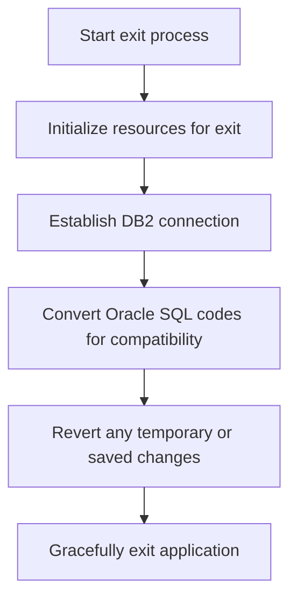

This section centralizes the logic for application exit, ensuring that all necessary resource management, database connection switching, error code compatibility, and state restoration steps are performed before the application terminates. It ensures a consistent and reliable exit process for the application.

| Category       | Rule Name                                                                                                                                                                                 | Description                                                                                                                                                                                                                                                                           |
| -------------- | ----------------------------------------------------------------------------------------------------------------------------------------------------------------------------------------- | ------------------------------------------------------------------------------------------------------------------------------------------------------------------------------------------------------------------------------------------------------------------------------------- |
| Business logic | Exit Resource Initialization                                                                                                                                                              | The application must always initialize exit resources before performing any other exit-related operations.                                                                                                                                                                            |
| Business logic | <SwmToken path="base/src/WWWS0040.cbl" pos="207:6:6" line-data="022400             PERFORM 9998-DB2-530-ERROR                           00022400">`DB2`</SwmToken> Connection Enforcement | The active database connection must be switched to <SwmToken path="base/src/WWWS0040.cbl" pos="207:6:6" line-data="022400             PERFORM 9998-DB2-530-ERROR                           00022400">`DB2`</SwmToken> before the application exits, regardless of the previous state. |
| Business logic | Oracle Error Code Conversion                                                                                                                                                              | Any Oracle SQL error codes encountered during the exit process must be converted to DB2-compatible codes.                                                                                                                                                                             |
| Business logic | State Restoration                                                                                                                                                                         | All temporary or saved changes in working storage must be reverted before the application exits.                                                                                                                                                                                      |
| Business logic | Connection Statistics Tracking                                                                                                                                                            | The connection manager must track and update connection statistics whenever a database switch occurs during exit.                                                                                                                                                                     |
| Business logic | Graceful Exit Enforcement                                                                                                                                                                 | The application must exit gracefully, ensuring no resources are left allocated and all connections are properly closed.                                                                                                                                                               |

<SwmSnippet path="/base/src/YYYS0211.cbl" line="32">

---

<SwmToken path="base/src/YYYS0211.cbl" pos="32:2:6" line-data="004700 0000-EXIT-DISPATCHER.                                            00004700">`0000-EXIT-DISPATCHER`</SwmToken> runs initialization, switches to <SwmToken path="base/src/YYYS0211.cbl" pos="34:10:10" line-data="004900     PERFORM 200-CONNECT-TO-DB2                                   00004900">`DB2`</SwmToken>, converts Oracle error codes, and restores working storage before exiting. This centralizes connection and error handling.

```cobol
004700 0000-EXIT-DISPATCHER.                                            00004700
004800     PERFORM 100-INITIALIZATION                                   00004800
004900     PERFORM 200-CONNECT-TO-DB2                                   00004900
005000     PERFORM 300-CNV-ORACLE-SQLCODE                               00005000
005100     PERFORM 400-REVERT-SAVED-XXXN001A                            00005100
005300     GOBACK                                                       00005300
005400     .                                                            00005400
```

---

</SwmSnippet>

<SwmSnippet path="/base/src/YYYS0211.cbl" line="53">

---

<SwmToken path="base/src/YYYS0211.cbl" pos="53:2:8" line-data="007300 200-CONNECT-TO-DB2.                                              00007300">`200-CONNECT-TO-DB2`</SwmToken> sets the <SwmToken path="base/src/YYYS0211.cbl" pos="53:8:8" line-data="007300 200-CONNECT-TO-DB2.                                              00007300">`DB2`</SwmToken> connection flag and calls the connection manager to switch the active connection. The manager handles the switch and tracks stats.

```cobol
007300 200-CONNECT-TO-DB2.                                              00007300
007400     SET YYYC0220-SET-DB2-CON TO TRUE                             00007400
007500     CALL YYYS0220-DBMS-CON-MGR USING                             00007500
007600         XXXN001A                                                 00007600
007700         YYYC0220                                                 00007700
008100     .                                                            00008100
```

---

</SwmSnippet>

### Oracle Error Code Conversion

This section ensures that Oracle error codes and messages are translated into a standardized internal format when a specific error condition is met, enabling consistent error handling across the system.

| Category       | Rule Name          | Description                                                                                                                     |
| -------------- | ------------------ | ------------------------------------------------------------------------------------------------------------------------------- |
| Business logic | Error Code Mapping | The conversion program must map Oracle error codes and messages to DB2-style codes and user-friendly messages for internal use. |

<SwmSnippet path="/base/src/YYYS0211.cbl" line="65">

---

In <SwmToken path="base/src/YYYS0211.cbl" pos="65:2:8" line-data="009500 300-CNV-ORACLE-SQLCODE.                                          00009500">`300-CNV-ORACLE-SQLCODE`</SwmToken>, we check if the last DB operation was marked SUCCESS but returned SQLCODE -84. If so, we call the <SwmToken path="base/src/YYYS0211.cbl" pos="68:4:10" line-data="009720       CALL Z-ORA-ERR-CONVERSION USING                            00009720">`Z-ORA-ERR-CONVERSION`</SwmToken> program to translate the Oracle error details into our internal format. This step is needed because Oracle errors use different codes and messages, and we want to standardize them for downstream error handling. The next call to <SwmPath>[base/src/YYYS0212.cbl](base/src/YYYS0212.cbl)</SwmPath> does the actual conversion and mapping of Oracle error codes to DB2-style codes and user messages.

```cobol
009500 300-CNV-ORACLE-SQLCODE.                                          00009500
009600     IF  SUCCESS                                                  00009600
009610     AND SQLCODE = -84                                            00009610
009720       CALL Z-ORA-ERR-CONVERSION USING                            00009720
009730           XXXN001A                                               00009730
009740           SQLCA                                                  00009740
009750     END-IF                                                       00009750
010200     .                                                            00010200
```

---

</SwmSnippet>

### Oracle Error Message Formatting

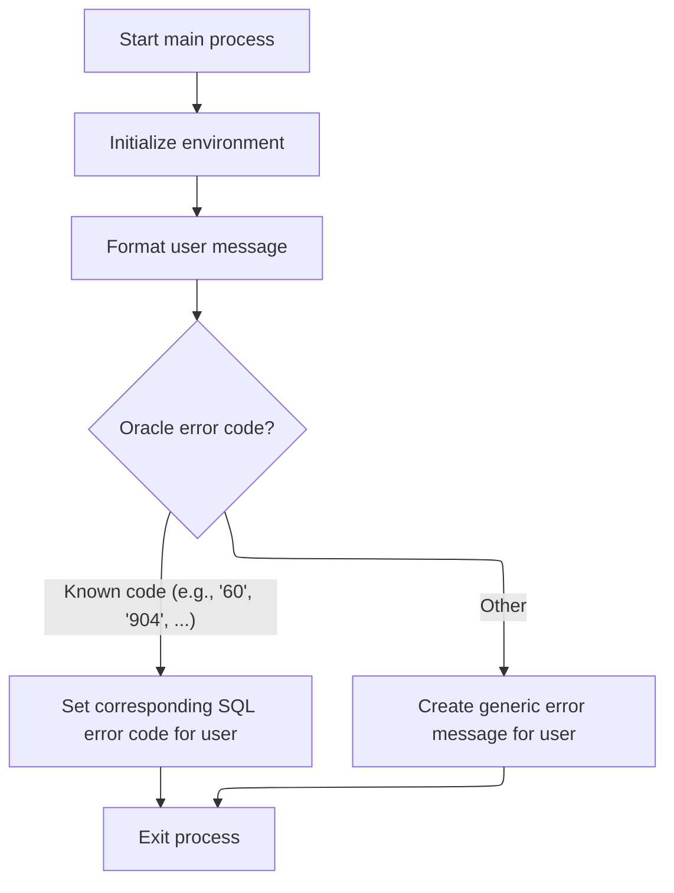

This section is responsible for interpreting Oracle error messages and presenting them to users in a standardized format. It ensures that known Oracle error codes are mapped to corresponding DB2-style SQLCODEs, while unknown codes result in a generic error message that includes the original Oracle code.

| Category       | Rule Name                               | Description                                                                                                                                       |
| -------------- | --------------------------------------- | ------------------------------------------------------------------------------------------------------------------------------------------------- |
| Business logic | Known Oracle Code Mapping               | If the Oracle error code matches a predefined list of known codes, the corresponding DB2-style SQLCODE must be set for the user.                  |
| Business logic | Generic Error Message for Unknown Codes | If the Oracle error code does not match any known code, a generic error message must be created for the user, including the original Oracle code. |

<SwmSnippet path="/base/src/YYYS0212.cbl" line="29">

---

<SwmToken path="base/src/YYYS0212.cbl" pos="29:2:6" line-data="003800 000-MAIN-PROCESS.                                                00003800">`000-MAIN-PROCESS`</SwmToken> resets error fields, then formats the Oracle error message into a mapped code or a generic message if the code isn't recognized.

```cobol
003800 000-MAIN-PROCESS.                                                00003800
003900     PERFORM 100-INITIALIZE                                       00003900
004000     PERFORM 200-FORMAT-USER-MSG-TXT                              00004000
004100     GOBACK                                                       00004100
004200     .                                                            00004200
```

---

</SwmSnippet>

<SwmSnippet path="/base/src/YYYS0212.cbl" line="50">

---

<SwmToken path="base/src/YYYS0212.cbl" pos="50:2:10" line-data="005900 200-FORMAT-USER-MSG-TXT.                                         00005900">`200-FORMAT-USER-MSG-TXT`</SwmToken> parses the SQLERRMC string into four fields using UNSTRING, grabs the Oracle error code, and then uses EVALUATE to map it to a DB2-style SQLCODE. If the code isn't recognized, it builds a generic error message with the code included. The mapping only works if the input string is formatted as expected, with the Oracle code at the end.

```cobol
005900 200-FORMAT-USER-MSG-TXT.                                         00005900
006000     UNSTRING SQLERRMC  DELIMITED BY SPACE INTO                   00006000
006100                        WS-ERR-MSG1                               00006100
006200                        WS-ERR-MSG2                               00006200
006300                        WS-ERR-MSG3                               00006300
006400                        WS-ERR-ORA-CODE                           00006400
006500     EVALUATE WS-ERR-ORA-CODE                                     00006500
006510       WHEN  '60   '                                              00006510
006520         MOVE  -911                             TO SQLCODE        00006520
006600       WHEN  '904  '                                              00006600
006700       WHEN  '310  '                                              00006700
006800         MOVE  -206                             TO SQLCODE        00006800
006900       WHEN  '615  '                                              00006900
007000       WHEN  '616  '                                              00007000
007100         MOVE  -420                             TO SQLCODE        00007100
007200       WHEN  '942  '                                              00007200
007300         MOVE  -204                             TO SQLCODE        00007300
007400       WHEN  '1403 '                                              00007400
007500         MOVE  -100                             TO SQLCODE        00007500
007600       WHEN  '1001 '                                              00007600
007700         MOVE  -501                             TO SQLCODE        00007700
007800       WHEN  '1438 '                                              00007800
007900         MOVE  -413                             TO SQLCODE        00007900
008000       WHEN  '2112 '                                              00008000
008100       WHEN  '1422 '                                              00008100
008200         MOVE  -811                             TO SQLCODE        00008200
008300       WHEN  '2049 '                                              00008300
008400         MOVE  -913                             TO SQLCODE        00008400
008500       WHEN  '2291 '                                              00008500
008600         MOVE  -530                             TO SQLCODE        00008600
008700       WHEN  '2292 '                                              00008700
008800         MOVE  -532                             TO SQLCODE        00008800
008900       WHEN  '6502 '                                              00008900
009000         MOVE  -304                             TO SQLCODE        00009000
009100       WHEN  '6508 '                                              00009100
009200         MOVE  -440                             TO SQLCODE        00009200
009300       WHEN  '6511 '                                              00009300
009400         MOVE  -502                             TO SQLCODE        00009400
009500       WHEN  '6550 '                                              00009500
009600       WHEN  '6553 '                                              00009600
009700         MOVE  -440                             TO SQLCODE        00009700
009800       WHEN  '14028'                                              00009800
009900         MOVE  -538                             TO SQLCODE        00009900
010000       WHEN  '30006'                                              00010000
010100         MOVE  -904                             TO SQLCODE        00010100
010200       WHEN OTHER                                                 00010200
010300         STRING 'Error in YYYS0212. Oracle code:'                 00010300
010300                 WS-ERR-ORA-CODE                                  00010320
010300         DELIMITED BY SIZE INTO IS-RTRN-MSG2-TXT                  00010330
010500     END-EVALUATE                                                 00010500
010600     MOVE SPACES                                TO SQLERRMC       00010600
010700     .                                                            00010700
```

---

</SwmSnippet>

### Department Record Fetch Result Handling

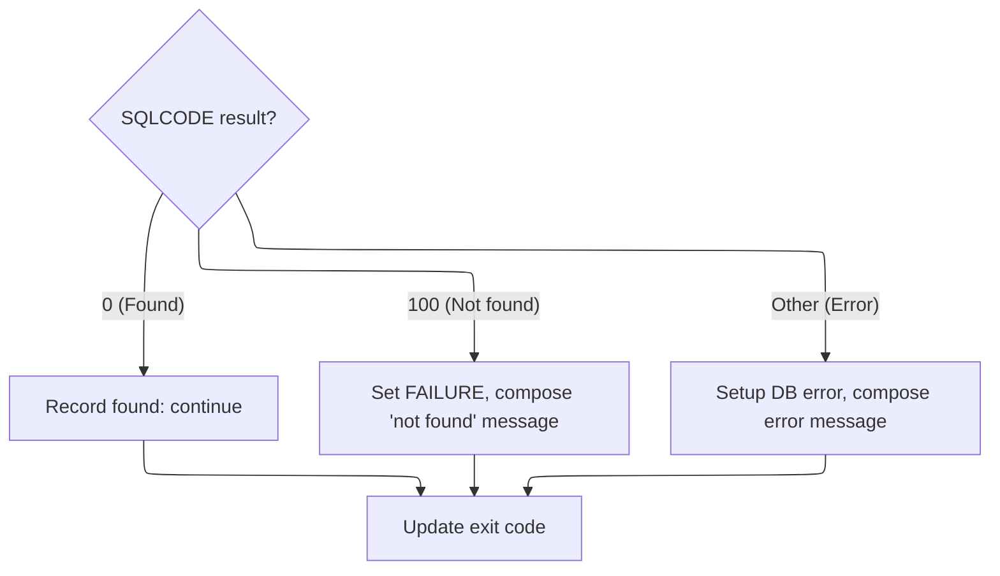

<SwmSnippet path="/base/src/WWWS0040.cbl" line="353">

---

Back in <SwmToken path="base/src/WWWS0040.cbl" pos="341:4:10" line-data="035800        PERFORM 2210-GET-DP-RECORD                                00035800">`2210-GET-DP-RECORD`</SwmToken>, we just returned from <SwmToken path="base/src/WWWS0040.cbl" pos="197:4:10" line-data="021400         PERFORM 2400-CALL-DP-DAO                                 00021400">`2400-CALL-DP-DAO`</SwmToken>. The code checks SQLCODE: 0 means success, 100 means department not found (so we set FAILURE and build a message with the department key and table name), and any other code triggers error setup and a detailed message with the SQLCODE. We also move the exit code from working storage to the main exit code variable to reflect the result.

```cobol
037000     EVALUATE TRUE                                                00037000
037100       WHEN SQLCODE = 0                                           00037100
037200         CONTINUE                                                 00037200
037300       WHEN SQLCODE = 100                                         00037300
037400         MOVE SPACES                TO IS-RTRN-MSG-TXT            00037400
037500         SET  FAILURE               TO TRUE                       00037500
037600         STRING 'WWWS0040 - DEPT ' ST-DEPARTMENT-KEY              00037600
037700                ' not found in XXX_DEPT'                          00037700
037800                DELIMITED BY SIZE INTO IS-RTRN-MSG-TXT            00037800
037900       WHEN OTHER                                                 00037900
038000         PERFORM 9999-SETUP-DB2-ERROR                             00038000
038100         STRING 'WWWS0040 - Failed on XXX_DEPT(DP),SQL='          00038100
038200                 WS-SQLCODE                                       00038200
038300                 DELIMITED BY SIZE INTO IS-RTRN-MSG-TXT           00038300
038400     END-EVALUATE                                                 00038400
038500                                                                  00038500
038600     MOVE WS-NNNN0000-EXIT-CODES    TO NNNN0000-EXIT-CODES        00038600
038700     .                                                            00038700
```

---

</SwmSnippet>

## Post-Department Data Fetch Actions

<SwmSnippet path="/base/src/WWWS0040.cbl" line="164">

---

After <SwmToken path="base/src/WWWS0040.cbl" pos="163:4:8" line-data="018000     PERFORM 2200-GET-DP                                          00018000">`2200-GET-DP`</SwmToken> in <SwmToken path="base/src/WWWS0040.cbl" pos="158:4:8" line-data="017500     PERFORM 1210-PROCESS-DP                                      00017500">`1210-PROCESS-DP`</SwmToken>, we set the translation flag and run the translation routine to get the data in the right format.

```cobol
018100     IF SUCCESS                                                   00018100
018200       SET YYYN111A-NEW-2-OLD       TO TRUE                       00018200
018300       PERFORM 2000-DP-TRANSLATION                                00018300
018400     END-IF                                                       00018400
```

---

</SwmSnippet>

# Department Row Modification Entry

This section is responsible for processing requests to modify department data. It ensures that department modifications are handled according to business requirements and validation rules.

| Category        | Rule Name                       | Description                                                                                                                       |
| --------------- | ------------------------------- | --------------------------------------------------------------------------------------------------------------------------------- |
| Data validation | Department existence validation | A department row can only be modified if the department exists in the system.                                                     |
| Data validation | Required fields validation      | All required department fields must be provided and valid before a modification is accepted.                                      |
| Business logic  | Protected fields restriction    | Department modifications must comply with business rules, such as not allowing changes to protected fields (e.g., department ID). |
| Business logic  | Modification audit logging      | Successful modifications must be logged for audit and tracking purposes.                                                          |

<SwmSnippet path="/base/src/WWWS0040.cbl" line="184">

---

<SwmToken path="base/src/WWWS0040.cbl" pos="184:2:10" line-data="020100 1400-EXIT-PUT-MODIFY-ROW.                                        00020100">`1400-EXIT-PUT-MODIFY-ROW`</SwmToken> just delegates to <SwmToken path="base/src/WWWS0040.cbl" pos="185:4:8" line-data="020200     PERFORM 1410-PROCESS-DP                                      00020200">`1410-PROCESS-DP`</SwmToken> for department modification.

```cobol
020100 1400-EXIT-PUT-MODIFY-ROW.                                        00020100
020200     PERFORM 1410-PROCESS-DP                                      00020200
020300     .                                                            00020300
```

---

</SwmSnippet>

# Department Modification Processing

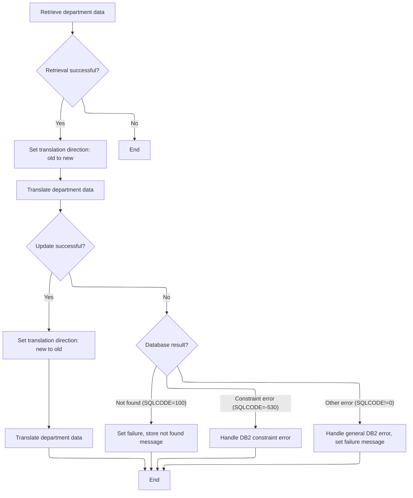

This section governs the process for modifying department data, including retrieval, translation, update, and error handling. The main product role is to ensure department records are correctly updated and that any errors are communicated clearly to the client.

| Category        | Rule Name                                | Description                                                                                                                                      |
| --------------- | ---------------------------------------- | ------------------------------------------------------------------------------------------------------------------------------------------------ |
| Data validation | Department retrieval prerequisite        | Department data must be retrieved before any modification or translation can occur. If retrieval fails, no further processing is performed.      |
| Business logic  | Translation direction setup (old-to-new) | If department data is successfully retrieved, the translation direction must be set to old-to-new before updating the record.                    |
| Business logic  | Translation direction setup (new-to-old) | After a successful update, the translation direction must be set to new-to-old to prepare the data for client consumption or further processing. |
| Business logic  | Successful modification outcome          | A successful department modification must result in a success status and the updated department data returned in the expected format.            |

<SwmSnippet path="/base/src/WWWS0040.cbl" line="189">

---

In <SwmToken path="base/src/WWWS0040.cbl" pos="189:2:6" line-data="020600 1410-PROCESS-DP.                                                 00020600">`1410-PROCESS-DP`</SwmToken>, we start by fetching the department data with <SwmToken path="base/src/WWWS0040.cbl" pos="190:4:8" line-data="020700     PERFORM 2200-GET-DP                                          00020700">`2200-GET-DP`</SwmToken>. This gives us the current record so we can translate and update it as needed. The next step is to set the translation direction and run the translation routine.

```cobol
020600 1410-PROCESS-DP.                                                 00020600
020700     PERFORM 2200-GET-DP                                          00020700
```

---

</SwmSnippet>

<SwmSnippet path="/base/src/WWWS0040.cbl" line="191">

---

After returning from <SwmToken path="base/src/WWWS0040.cbl" pos="163:4:8" line-data="018000     PERFORM 2200-GET-DP                                          00018000">`2200-GET-DP`</SwmToken> in <SwmToken path="base/src/WWWS0040.cbl" pos="185:4:8" line-data="020200     PERFORM 1410-PROCESS-DP                                      00020200">`1410-PROCESS-DP`</SwmToken>, if the fetch was successful, we set the translation direction to old-to-new and run <SwmToken path="base/src/WWWS0040.cbl" pos="194:4:8" line-data="021100       PERFORM 2000-DP-TRANSLATION                                00021100">`2000-DP-TRANSLATION`</SwmToken>. This makes sure the data is in the right format for the next step.

```cobol
020800     IF SUCCESS                                                   00020800
020900                                                                  00020900
021000       SET YYYN111A-OLD-2-NEW       TO TRUE                       00021000
021100       PERFORM 2000-DP-TRANSLATION                                00021100
```

---

</SwmSnippet>

<SwmSnippet path="/base/src/WWWS0040.cbl" line="196">

---

After running <SwmToken path="base/src/WWWS0040.cbl" pos="166:4:8" line-data="018300       PERFORM 2000-DP-TRANSLATION                                00018300">`2000-DP-TRANSLATION`</SwmToken> in <SwmToken path="base/src/WWWS0040.cbl" pos="185:4:8" line-data="020200     PERFORM 1410-PROCESS-DP                                      00020200">`1410-PROCESS-DP`</SwmToken>, if translation succeeded, we call <SwmToken path="base/src/WWWS0040.cbl" pos="197:4:10" line-data="021400         PERFORM 2400-CALL-DP-DAO                                 00021400">`2400-CALL-DP-DAO`</SwmToken> to perform the actual database update or modification. The DAO expects the data in the translated format.

```cobol
021300       IF SUCCESS                                                 00021300
021400         PERFORM 2400-CALL-DP-DAO                                 00021400
```

---

</SwmSnippet>

<SwmSnippet path="/base/src/WWWS0040.cbl" line="199">

---

After returning from <SwmToken path="base/src/WWWS0040.cbl" pos="197:4:10" line-data="021400         PERFORM 2400-CALL-DP-DAO                                 00021400">`2400-CALL-DP-DAO`</SwmToken> in <SwmToken path="base/src/WWWS0040.cbl" pos="185:4:8" line-data="020200     PERFORM 1410-PROCESS-DP                                      00020200">`1410-PROCESS-DP`</SwmToken>, we check SQLCODE: 100 means department not found (set FAILURE and build a message), -530 triggers a special <SwmToken path="base/src/WWWS0040.cbl" pos="207:6:6" line-data="022400             PERFORM 9998-DB2-530-ERROR                           00022400">`DB2`</SwmToken> error handler, and any other non-zero code runs the general error setup and logs a message with the SQLCODE. This makes sure the client gets the right error info.

```cobol
021600         EVALUATE TRUE                                            00021600
021700           WHEN NOT SUCCESS                                       00021700
021800             CONTINUE                                             00021800
021900           WHEN SQLCODE = 100                                     00021900
022000             SET FAILURE TO TRUE                                  00022000
022100             MOVE 'WWWS0040 - Store Department not found!'        00022100
022200               TO IS-RTRN-MSG-TXT                                 00022200
022300           WHEN SQLCODE = -530                                    00022300
022400             PERFORM 9998-DB2-530-ERROR                           00022400
022500           WHEN SQLCODE NOT = 0                                   00022500
022600             PERFORM 9999-SETUP-DB2-ERROR                         00022600
022700             STRING 'WWWS0040 - Failed on upd XXX_DEPT,SQL  ='    00022700
022800                 WS-SQLCODE                                       00022800
022900                 DELIMITED BY SIZE INTO IS-RTRN-MSG-TXT           00022900
023000         END-EVALUATE                                             00023000
```

---

</SwmSnippet>

<SwmSnippet path="/base/src/WWWS0040.cbl" line="215">

---

If everything succeeded in <SwmToken path="base/src/WWWS0040.cbl" pos="185:4:8" line-data="020200     PERFORM 1410-PROCESS-DP                                      00020200">`1410-PROCESS-DP`</SwmToken>, we set the translation direction to new-to-old and run <SwmToken path="base/src/WWWS0040.cbl" pos="217:4:8" line-data="023400           PERFORM 2000-DP-TRANSLATION                            00023400">`2000-DP-TRANSLATION`</SwmToken> again. This makes sure the final returned department data is in the format expected by the client or next step.

```cobol
023200         IF SUCCESS                                               00023200
023300           SET YYYN111A-NEW-2-OLD   TO TRUE                       00023300
023400           PERFORM 2000-DP-TRANSLATION                            00023400
023500         END-IF                                                   00023500
```

---

</SwmSnippet>

# Department Row Insert Entry

This section is responsible for handling the insertion of a new department row into the system. It ensures that all necessary business conditions are met before a department entry is added.

| Category        | Rule Name                    | Description                                                                                                               |
| --------------- | ---------------------------- | ------------------------------------------------------------------------------------------------------------------------- |
| Data validation | Mandatory fields validation  | A department row can only be inserted if all mandatory department fields are provided and valid.                          |
| Data validation | Unique department identifier | A department row cannot be inserted if a department with the same identifier already exists in the system.                |
| Business logic  | Department policy compliance | A department row must be inserted in accordance with organizational policies, such as allowed department types or status. |

<SwmSnippet path="/base/src/WWWS0040.cbl" line="227">

---

<SwmToken path="base/src/WWWS0040.cbl" pos="227:2:10" line-data="024400 1500-EXIT-PUT-INSERT-ROW.                                        00024400">`1500-EXIT-PUT-INSERT-ROW`</SwmToken> just delegates to <SwmToken path="base/src/WWWS0040.cbl" pos="228:4:8" line-data="024500     PERFORM 1510-PROCESS-DP                                      00024500">`1510-PROCESS-DP`</SwmToken> for department insert handling.

```cobol
024400 1500-EXIT-PUT-INSERT-ROW.                                        00024400
024500     PERFORM 1510-PROCESS-DP                                      00024500
024600     .                                                            00024600
```

---

</SwmSnippet>

# Department Insert Processing

This section manages the insertion and update of department records. It ensures department data is translated to the correct format before database operations, handles duplicate key errors by switching to update logic, and manages error reporting for failed operations.

| Category        | Rule Name                       | Description                                                                                                                 |
| --------------- | ------------------------------- | --------------------------------------------------------------------------------------------------------------------------- |
| Data validation | Translation Success Requirement | Department insert or update operations must only proceed if the translation of department data is successful (SUCCESS = 0). |
| Business logic  | Department Data Translation     | Department data must be translated from old format to new format before any insert or update operation is attempted.        |

<SwmSnippet path="/base/src/WWWS0040.cbl" line="232">

---

In <SwmToken path="base/src/WWWS0040.cbl" pos="232:2:6" line-data="024900 1510-PROCESS-DP.                                                 00024900">`1510-PROCESS-DP`</SwmToken>, we set the translation direction to old-to-new and run <SwmToken path="base/src/WWWS0040.cbl" pos="234:4:8" line-data="025100     PERFORM 2000-DP-TRANSLATION                                  00025100">`2000-DP-TRANSLATION`</SwmToken>. This makes sure the department data is in the right format before we try to insert or update it in the database.

```cobol
024900 1510-PROCESS-DP.                                                 00024900
025000     SET YYYN111A-OLD-2-NEW         TO TRUE                       00025000
025100     PERFORM 2000-DP-TRANSLATION                                  00025100
```

---

</SwmSnippet>

<SwmSnippet path="/base/src/WWWS0040.cbl" line="236">

---

After running <SwmToken path="base/src/WWWS0040.cbl" pos="166:4:8" line-data="018300       PERFORM 2000-DP-TRANSLATION                                00018300">`2000-DP-TRANSLATION`</SwmToken> in <SwmToken path="base/src/WWWS0040.cbl" pos="228:4:8" line-data="024500     PERFORM 1510-PROCESS-DP                                      00024500">`1510-PROCESS-DP`</SwmToken>, if translation succeeded, we call <SwmToken path="base/src/WWWS0040.cbl" pos="237:4:10" line-data="025400       PERFORM 2400-CALL-DP-DAO                                   00025400">`2400-CALL-DP-DAO`</SwmToken> to perform the actual database insert or update. The DAO expects the data in the translated format.

```cobol
025300     IF SUCCESS                                                   00025300
025400       PERFORM 2400-CALL-DP-DAO                                   00025400
```

---

</SwmSnippet>

<SwmSnippet path="/base/src/WWWS0040.cbl" line="239">

---

After returning from <SwmToken path="base/src/WWWS0040.cbl" pos="197:4:10" line-data="021400         PERFORM 2400-CALL-DP-DAO                                 00021400">`2400-CALL-DP-DAO`</SwmToken> in <SwmToken path="base/src/WWWS0040.cbl" pos="228:4:8" line-data="024500     PERFORM 1510-PROCESS-DP                                      00024500">`1510-PROCESS-DP`</SwmToken>, if we hit a duplicate key error (-803), we fetch the existing department data with <SwmToken path="base/src/WWWS0040.cbl" pos="241:4:8" line-data="025800            PERFORM 2200-GET-DP                                   00025800">`2200-GET-DP`</SwmToken>, re-translate it, and then try to update. This way, we handle both insert and update cases in one go.

```cobol
025600       EVALUATE TRUE                                              00025600
025700         WHEN SQLCODE = -803                                      00025700
025800            PERFORM 2200-GET-DP                                   00025800
025900            IF SUCCESS                                            00025900
026000              SET YYYN111A-OLD-2-NEW TO TRUE                      00026000
026100              PERFORM 2000-DP-TRANSLATION                         00026100
026200              IF SUCCESS                                          00026200
026300                 PERFORM 1515-TRY-UPDATE                          00026300
026400              END-IF                                              00026400
026500            END-IF                                                00026500
026600         WHEN NOT SUCCESS                                         00026600
026700           CONTINUE                                               00026700
026800         WHEN SQLCODE = -530                                      00026800
026900           PERFORM 9998-DB2-530-ERROR                             00026900
027000         WHEN SQLCODE NOT = 0                                     00027000
027100           PERFORM 9999-SETUP-DB2-ERROR                           00027100
027200           STRING 'WWWS0040 - Failed adding XXX_DEPT ,SQL='       00027200
027300               WS-SQLCODE                                         00027300
027400               DELIMITED BY SIZE INTO IS-RTRN-MSG-TXT             00027400
027500       END-EVALUATE                                               00027500
```

---

</SwmSnippet>

## Department Update Retry Logic

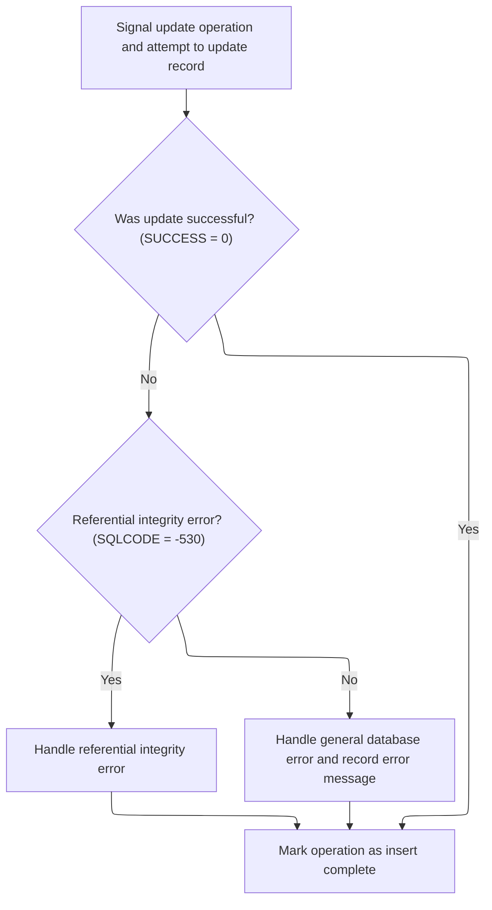

This section governs the retry logic for updating a department record in the database. It ensures that update attempts are handled correctly, errors are classified and reported accurately, and the operation status is set based on the outcome.

| Category       | Rule Name                    | Description                                                                                                                                                                                                                                                                                                                                                                                                                                                                                                                                        |
| -------------- | ---------------------------- | -------------------------------------------------------------------------------------------------------------------------------------------------------------------------------------------------------------------------------------------------------------------------------------------------------------------------------------------------------------------------------------------------------------------------------------------------------------------------------------------------------------------------------------------------- |
| Business logic | Successful update completion | If the department update operation is successful (SUCCESS = 0), the operation must be marked as complete and no error handling is triggered.                                                                                                                                                                                                                                                                                                                                                                                                       |
| Business logic | Operation completion status  | After any update attempt (successful or failed), the operation must be marked as complete by setting the appropriate status flag (<SwmToken path="base/src/WWWS0040.cbl" pos="80:4:10" line-data="009700           WHEN EXIT-PUT-INSERT-ROW                               00009700">`EXIT-PUT-INSERT-ROW`</SwmToken> for insert complete, <SwmToken path="base/src/WWWS0040.cbl" pos="78:4:10" line-data="009500           WHEN EXIT-PUT-MODIFY-ROW                               00009500">`EXIT-PUT-MODIFY-ROW`</SwmToken> for modify complete). |

<SwmSnippet path="/base/src/WWWS0040.cbl" line="268">

---

In <SwmToken path="base/src/WWWS0040.cbl" pos="268:2:6" line-data="028500 1515-TRY-UPDATE.                                                 00028500">`1515-TRY-UPDATE`</SwmToken>, we set the modify flag and call <SwmToken path="base/src/WWWS0040.cbl" pos="271:4:10" line-data="028800     PERFORM 2400-CALL-DP-DAO                                     00028800">`2400-CALL-DP-DAO`</SwmToken> to retry the department update. This tells the DAO to run an update operation instead of an insert.

```cobol
028500 1515-TRY-UPDATE.                                                 00028500
028600                                                                  00028600
028700     SET EXIT-PUT-MODIFY-ROW        TO TRUE                       00028700
028800     PERFORM 2400-CALL-DP-DAO                                     00028800
```

---

</SwmSnippet>

<SwmSnippet path="/base/src/WWWS0040.cbl" line="272">

---

After returning from <SwmToken path="base/src/WWWS0040.cbl" pos="197:4:10" line-data="021400         PERFORM 2400-CALL-DP-DAO                                 00021400">`2400-CALL-DP-DAO`</SwmToken> in <SwmToken path="base/src/WWWS0040.cbl" pos="246:4:8" line-data="026300                 PERFORM 1515-TRY-UPDATE                          00026300">`1515-TRY-UPDATE`</SwmToken>, we check SQLCODE: -530 triggers a special <SwmToken path="base/src/WWWS0040.cbl" pos="276:6:6" line-data="029300         PERFORM 9998-DB2-530-ERROR                               00029300">`DB2`</SwmToken> error handler, and any other non-zero code runs the general error setup and logs a message with the SQLCODE. This makes sure the client gets the right error info.

```cobol
028900     EVALUATE TRUE                                                00028900
029000       WHEN NOT SUCCESS                                           00029000
029100         CONTINUE                                                 00029100
029200       WHEN SQLCODE = -530                                        00029200
029300         PERFORM 9998-DB2-530-ERROR                               00029300
029400       WHEN SQLCODE NOT = 0                                       00029400
029500         PERFORM 9999-SETUP-DB2-ERROR                             00029500
029600         STRING 'WWWS0040 - Failed on upd XXX_DEPT ,SQL='         00029600
029700             WS-SQLCODE                                           00029700
029800             DELIMITED BY SIZE INTO IS-RTRN-MSG-TXT               00029800
029900     END-EVALUATE                                                 00029900
030000     SET EXIT-PUT-INSERT-ROW        TO TRUE                       00030000
030100     .                                                            00030100
```

---

</SwmSnippet>

## Post-Update Data Translation

<SwmSnippet path="/base/src/WWWS0040.cbl" line="260">

---

After returning from <SwmToken path="base/src/WWWS0040.cbl" pos="246:4:8" line-data="026300                 PERFORM 1515-TRY-UPDATE                          00026300">`1515-TRY-UPDATE`</SwmToken> in <SwmToken path="base/src/WWWS0040.cbl" pos="228:4:8" line-data="024500     PERFORM 1510-PROCESS-DP                                      00024500">`1510-PROCESS-DP`</SwmToken>, if the update was successful, we set the translation direction to new-to-old and run <SwmToken path="base/src/WWWS0040.cbl" pos="262:4:8" line-data="027900         PERFORM 2000-DP-TRANSLATION                              00027900">`2000-DP-TRANSLATION`</SwmToken> again. This makes sure the final returned department data is in the format expected by the client or next step.

```cobol
027700       IF SUCCESS                                                 00027700
027800         SET YYYN111A-NEW-2-OLD     TO TRUE                       00027800
027900         PERFORM 2000-DP-TRANSLATION                              00027900
028000       END-IF                                                     00028000
```

---

</SwmSnippet>

# Department Row Purge Entry

This section is responsible for purging a department row from the system. It ensures that when a department needs to be removed, the appropriate purge logic is executed to maintain data integrity and compliance with business requirements.

| Category        | Rule Name                               | Description                                                                                                               |
| --------------- | --------------------------------------- | ------------------------------------------------------------------------------------------------------------------------- |
| Data validation | Dependency check before purge           | A department row may only be purged if it is not referenced by any active transactions or dependencies within the system. |
| Data validation | Protected/archived department safeguard | Department rows marked as 'protected' or 'archived' cannot be purged under any circumstances.                             |
| Business logic  | Audit logging for purge                 | All purge actions must be logged with department identifiers and timestamps for audit and compliance purposes.            |

<SwmSnippet path="/base/src/WWWS0040.cbl" line="290">

---

<SwmToken path="base/src/WWWS0040.cbl" pos="290:2:10" line-data="030700 1600-EXIT-PUT-PURGE-ROW.                                         00030700">`1600-EXIT-PUT-PURGE-ROW`</SwmToken> just delegates to <SwmToken path="base/src/WWWS0040.cbl" pos="291:4:10" line-data="030800     PERFORM 1610-PURGE-DP-ROW                                    00030800">`1610-PURGE-DP-ROW`</SwmToken> for department purge handling.

```cobol
030700 1600-EXIT-PUT-PURGE-ROW.                                         00030700
030800     PERFORM 1610-PURGE-DP-ROW                                    00030800
030900     .                                                            00030900
```

---

</SwmSnippet>

# Department Purge Processing

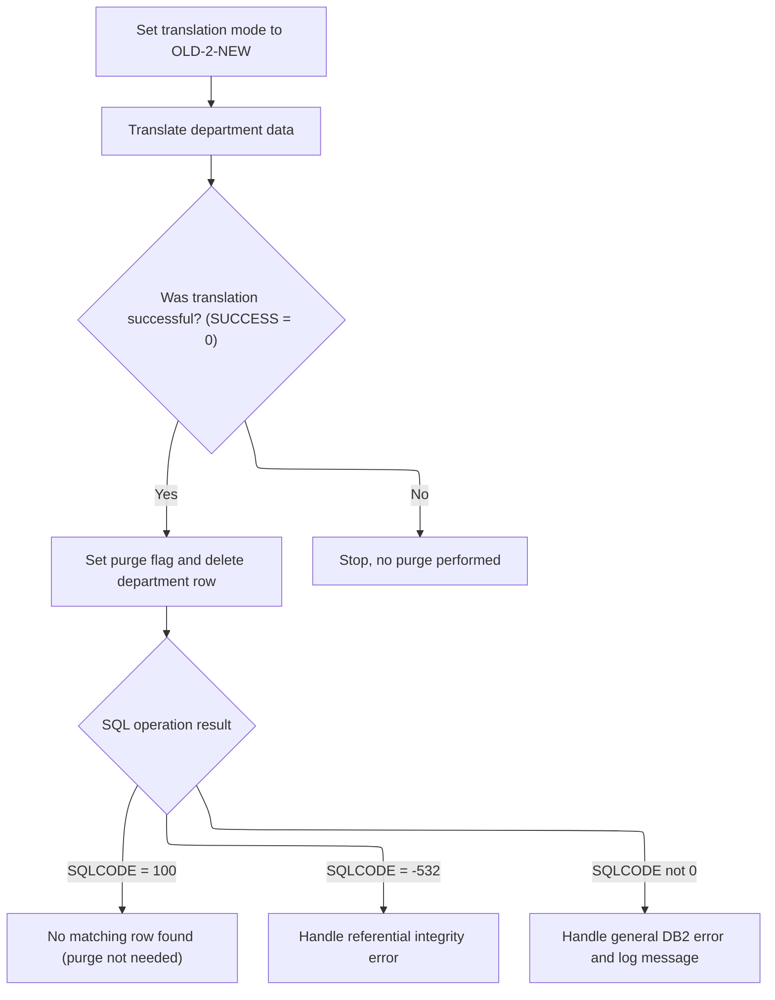

This section governs the process for purging department records from the database, ensuring that data is correctly translated before deletion and that all relevant error conditions are handled according to business requirements.

| Category        | Rule Name                    | Description                                                                                                                |
| --------------- | ---------------------------- | -------------------------------------------------------------------------------------------------------------------------- |
| Data validation | Translation success required | A department record may only be purged if the translation is successful, indicated by a return code of 0 (SUCCESS).        |
| Data validation | Abort on translation failure | If translation fails (return code not 0), no purge operation is performed and processing stops for that department record. |
| Business logic  | Mandatory data translation   | Department data must be translated from the old format to the new format before any purge operation is attempted.          |

<SwmSnippet path="/base/src/WWWS0040.cbl" line="295">

---

In <SwmToken path="base/src/WWWS0040.cbl" pos="295:2:8" line-data="031200 1610-PURGE-DP-ROW.                                               00031200">`1610-PURGE-DP-ROW`</SwmToken>, we set the translation direction to old-to-new and run <SwmToken path="base/src/WWWS0040.cbl" pos="297:4:8" line-data="031400     PERFORM 2000-DP-TRANSLATION                                  00031400">`2000-DP-TRANSLATION`</SwmToken>. This makes sure the department data is in the right format before we try to purge it from the database.

```cobol
031200 1610-PURGE-DP-ROW.                                               00031200
031300     SET YYYN111A-OLD-2-NEW         TO TRUE                       00031300
031400     PERFORM 2000-DP-TRANSLATION                                  00031400
```

---

</SwmSnippet>

<SwmSnippet path="/base/src/WWWS0040.cbl" line="299">

---

After translation in <SwmToken path="base/src/WWWS0040.cbl" pos="291:4:10" line-data="030800     PERFORM 1610-PURGE-DP-ROW                                    00030800">`1610-PURGE-DP-ROW`</SwmToken>, we call the DAO to purge the department record and handle errors as needed.

```cobol
031600     IF SUCCESS                                                   00031600
031700       SET EXIT-PUT-PURGE-ROW       TO TRUE                       00031700
031800       PERFORM 2400-CALL-DP-DAO                                   00031800
031900                                                                  00031900
032000       EVALUATE TRUE                                              00032000
032100         WHEN NOT SUCCESS                                         00032100
032200           CONTINUE                                               00032200
032300         WHEN SQLCODE = 100                                       00032300
032400           INITIALIZE XXXN001A                                    00032400
032500         WHEN SQLCODE = -532                                      00032500
032600           PERFORM 9998-DB2-530-ERROR                             00032600
032700         WHEN SQLCODE NOT = 0                                     00032700
032800           PERFORM 9999-SETUP-DB2-ERROR                           00032800
032900           STRING 'WWWS0040 - Failed deleting XXX_DEPT,SQL='      00032900
033000               WS-SQLCODE                                         00033000
033100               DELIMITED BY SIZE INTO IS-RTRN-MSG-TXT             00033100
033200       END-EVALUATE                                               00033200
033300     END-IF                                                       00033300
```

---

</SwmSnippet>

&nbsp;

*This is an auto-generated document by Swimm 🌊 and has not yet been verified by a human*

<SwmMeta version="3.0.0" repo-id="Z2l0aHViJTNBJTNBU3dpbW1pby1keW5jYWxsLWRlbW8lM0ElM0FHaXJpLVN3aW1t" repo-name="Swimmio-dyncall-demo"><sup>Powered by [Swimm](https://app.swimm.io/)</sup></SwmMeta>
