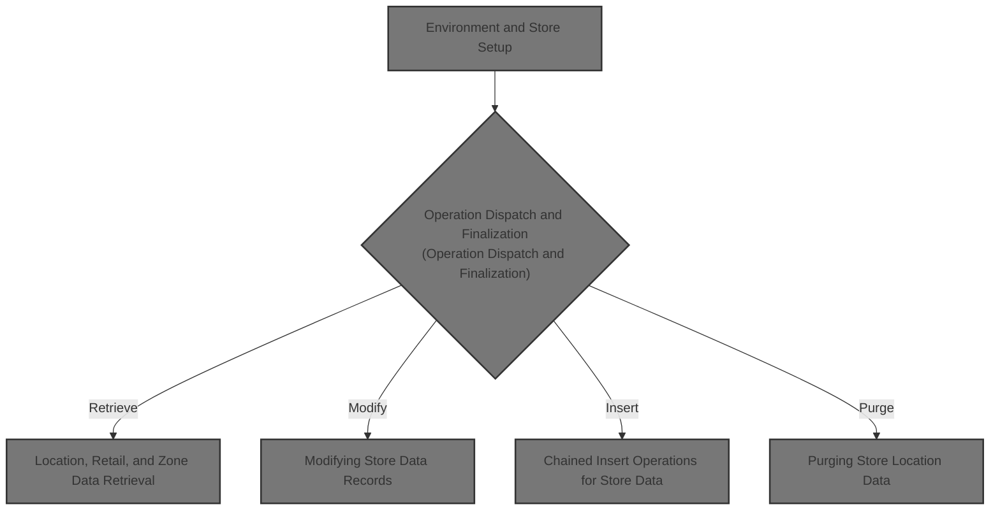

# Overview

This document describes the flow for managing store data operations. The process validates the environment and input, determines the requested business operation, and ensures that location, retail ledger, and clearance zone data are processed in the correct sequence to maintain consistency across retail operations.

## Dependencies

### Programs

- WWWS0003 (<SwmPath>[base/src/WWWS0003.cbl](base/src/WWWS0003.cbl)</SwmPath>)
- YYYS0210 (<SwmPath>[base/src/XXXS0210.cbl](base/src/XXXS0210.cbl)</SwmPath>)
- YYYS0220 (<SwmPath>[base/src/YYYS0220.cbl](base/src/YYYS0220.cbl)</SwmPath>)
- YYYS0211 (<SwmPath>[base/src/YYYS0211.cbl](base/src/YYYS0211.cbl)</SwmPath>)
- YYYS0212 (<SwmPath>[base/src/YYYS0212.cbl](base/src/YYYS0212.cbl)</SwmPath>)
- NNNS0487 (<SwmPath>[base/src/NNNS0487.cbl](base/src/NNNS0487.cbl)</SwmPath>)
- YYYS0134 (<SwmPath>[base/src/YYYS0134.cbl](base/src/YYYS0134.cbl)</SwmPath>)
- MMMS0291 (<SwmPath>[base/src/MMMS0291.cbl](base/src/MMMS0291.cbl)</SwmPath>)
- NNNS0457
- NNNS0486
- WWWS0100 (<SwmPath>[base/src/WWWS0100.cbl](base/src/WWWS0100.cbl)</SwmPath>)
- MMMS0135
- MMMS0157
- MMMS0265
- ZZZS0197 (<SwmPath>[base/src/ZZZS0197.cbl](base/src/ZZZS0197.cbl)</SwmPath>)
- YYYS0127
- YYYS0107
- MMMS0474
- NNNS0488 (<SwmPath>[base/src/NNNS0488.cbl](base/src/NNNS0488.cbl)</SwmPath>)
- NNNS0575
- NNNS0483
- NNNS0473 (<SwmPath>[base/src/NNNS0473.cbl](base/src/NNNS0473.cbl)</SwmPath>)
- NNNS2294
- MMMS0304
- NNNU0487
- MMMU0487
- MMMS0711 (<SwmPath>[base/src/MMMS0711.cbl](base/src/MMMS0711.cbl)</SwmPath>)
- WWWS0099
- NNNSSS20
- NNNS0007
- MMMU0003
- YYYS0097

### Copybooks

- YYYN000A (<SwmPath>[base/src/YYYN000A.cpy](base/src/YYYN000A.cpy)</SwmPath>)
- YYYC0220 (<SwmPath>[base/src/YYYC0220.cpy](base/src/YYYC0220.cpy)</SwmPath>)
- XXXN001A (<SwmPath>[base/src/XXXN001A.cpy](base/src/XXXN001A.cpy)</SwmPath>)
- SQLCA
- WWWC0099
- YYYN005A (<SwmPath>[base/src/YYYN005A.cpy](base/src/YYYN005A.cpy)</SwmPath>)
- DDDTLS01
- DDDTPT01
- DDDTVI01
- DDDTSI01
- DDDTLO01 (<SwmPath>[base/src/DDDTLO01.cpy](base/src/DDDTLO01.cpy)</SwmPath>)
- MMMC0711 (<SwmPath>[base/src/MMMC0711.cpy](base/src/MMMC0711.cpy)</SwmPath>)
- NNNN000U (<SwmPath>[base/src/NNNN000U.cpy](base/src/NNNN000U.cpy)</SwmPath>)
- MMMC0291 (<SwmPath>[base/src/MMMC0291.cpy](base/src/MMMC0291.cpy)</SwmPath>)
- PPPTAP01
- PPPTLD01
- PPPTLR01 (<SwmPath>[base/src/PPPTLR01.cpy](base/src/PPPTLR01.cpy)</SwmPath>)
- PPPTFX01 (<SwmPath>[base/src/PPPTFX01.cpy](base/src/PPPTFX01.cpy)</SwmPath>)
- PPPTCZ01 (<SwmPath>[base/src/PPPTCZ01.cpy](base/src/PPPTCZ01.cpy)</SwmPath>)
- PPPTDT01
- PPPTCY01
- DFHEIBLK
- HHHTLO01 (<SwmPath>[base/src/HHHTLO01.cpy](base/src/HHHTLO01.cpy)</SwmPath>)
- MMMC0474
- YYYN110A (<SwmPath>[base/src/YYYN110A.cpy](base/src/YYYN110A.cpy)</SwmPath>)
- YYYC0107 (<SwmPath>[base/src/YYYC0107.cpy](base/src/YYYC0107.cpy)</SwmPath>)
- YYYC0127 (<SwmPath>[base/src/YYYC0127.cpy](base/src/YYYC0127.cpy)</SwmPath>)
- ZZZC0094 (<SwmPath>[base/src/ZZZC0094.cpy](base/src/ZZZC0094.cpy)</SwmPath>)
- ZZZC0122
- ZZZC0123
- ZZZC0124
- ZZZC0020
- ZZZC0032 (<SwmPath>[base/src/ZZZC0032.cpy](base/src/ZZZC0032.cpy)</SwmPath>)
- ZZZC0044
- ZZZC0197 (<SwmPath>[base/src/ZZZC0197.cpy](base/src/ZZZC0197.cpy)</SwmPath>)
- WWWC0100 (<SwmPath>[base/src/WWWC0100.cpy](base/src/WWWC0100.cpy)</SwmPath>)
- ZZZC0550 (<SwmPath>[base/src/ZZZC0550.cpy](base/src/ZZZC0550.cpy)</SwmPath>)
- MMMC0135
- MMMC0157
- MMMC0153
- MMMC0265
- MMMK001B (<SwmPath>[base/src/MMMK001B.cpy](base/src/MMMK001B.cpy)</SwmPath>)
- MMMC0304 (<SwmPath>[base/src/MMMC0304.cpy](base/src/MMMC0304.cpy)</SwmPath>)
- DDDTCZ01 (<SwmPath>[base/src/DDDTCZ01.cpy](base/src/DDDTCZ01.cpy)</SwmPath>)
- DDDTLR01
- DDDTDT01
- DDDTFX01
- DDDTAP01
- DDDTLW01
- DDDTLB01
- NNNN0000 (<SwmPath>[base/src/NNNN0000.cpy](base/src/NNNN0000.cpy)</SwmPath>)
- PPPTLO01 (<SwmPath>[base/src/PPPTLO01.cpy](base/src/PPPTLO01.cpy)</SwmPath>)
- YYYN000C (<SwmPath>[base/src/YYYN000C.cpy](base/src/YYYN000C.cpy)</SwmPath>)
- YYYN111A (<SwmPath>[base/src/YYYN111A.cpy](base/src/YYYN111A.cpy)</SwmPath>)
- YYYC0097 (<SwmPath>[base/src/YYYC0097.cpy](base/src/YYYC0097.cpy)</SwmPath>)
- MMMK002A (<SwmPath>[base/src/MMMK002A.cpy](base/src/MMMK002A.cpy)</SwmPath>)
- PPPTZSSS
- WWWC0003 (<SwmPath>[base/src/WWWC0003.cpy](base/src/WWWC0003.cpy)</SwmPath>)
- XXXPSTTT
- PPPTRL01 (<SwmPath>[base/src/PPPTRL01.cpy](base/src/PPPTRL01.cpy)</SwmPath>)

&nbsp;

*This is an auto-generated document by Swimm 🌊 and has not yet been verified by a human*

<SwmMeta version="3.0.0" repo-id="Z2l0aHViJTNBJTNBU3dpbW1pby1keW5jYWxsLWRlbW8lM0ElM0FHaXJpLVN3aW1t" repo-name="Swimmio-dyncall-demo">Powered by [Swimm](https://app.swimm.io/)</SwmMeta>
