# Overview

This document describes the flow for managing store, ledger, and clearance zone data. The flow sets up the environment and database connection, validates store type, and dispatches business operations such as retrieval, modification, insertion, or deletion of data rows, ensuring data integrity and correct business logic.

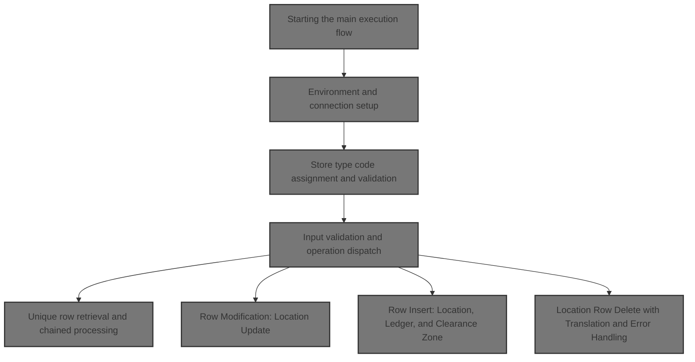
```mermaid
flowchart TD
    node1["Starting the main execution flow"]:::HeadingStyle --> node2["Environment and connection setup"]:::HeadingStyle
    click node1 goToHeading "Starting the main execution flow"
    click node2 goToHeading "Environment and connection setup"
    node2 --> node3["Store type code assignment and validation"]:::HeadingStyle
    click node3 goToHeading "Store type code assignment and validation"
    node3 --> node4["Input validation and operation dispatch"]:::HeadingStyle
    click node4 goToHeading "Input validation and operation dispatch"
    node4 --> node5["Unique row retrieval and chained processing"]:::HeadingStyle
    click node5 goToHeading "Unique row retrieval and chained processing"
    node4 --> node6["Row Modification: Location Update"]:::HeadingStyle
    click node6 goToHeading "Row Modification: Location Update"
    node4 --> node7["Row Insert: Location, Ledger, and Clearance Zone"]:::HeadingStyle
    click node7 goToHeading "Row Insert: Location, Ledger, and Clearance Zone"
    node4 --> node8["Location Row Delete with Translation and Error Handling"]:::HeadingStyle
    click node8 goToHeading "Location Row Delete with Translation and Error Handling"

classDef HeadingStyle fill:#777777,stroke:#333,stroke-width:2px;
```

## Dependencies

### Programs

- <SwmToken path="base/src/WWWS0003.cbl" pos="145:5:5" line-data="017100     MOVE &#39;WWWS0003&#39; TO YYYC0097-ERROR-PGM                        00017100">`WWWS0003`</SwmToken> (<SwmPath>[base/src/WWWS0003.cbl](base/src/WWWS0003.cbl)</SwmPath>)
- <SwmToken path="base/src/XXXS0210.cbl" pos="2:7:7" line-data="000200 PROGRAM-ID.    YYYS0210.                                         00000200">`YYYS0210`</SwmToken> (<SwmPath>[base/src/XXXS0210.cbl](base/src/XXXS0210.cbl)</SwmPath>)
- <SwmToken path="base/src/XXXS0210.cbl" pos="55:4:4" line-data="007540     CALL YYYS0220-DBMS-CON-MGR USING                             00007540">`YYYS0220`</SwmToken> (<SwmPath>[base/src/YYYS0220.cbl](base/src/YYYS0220.cbl)</SwmPath>)
- YYYS0211 (<SwmPath>[base/src/YYYS0211.cbl](base/src/YYYS0211.cbl)</SwmPath>)
- YYYS0212 (<SwmPath>[base/src/YYYS0212.cbl](base/src/YYYS0212.cbl)</SwmPath>)
- <SwmToken path="base/src/WWWS0003.cbl" pos="778:4:4" line-data="080400     CALL NNNS0487-LO-DAO USING                                   00080400">`NNNS0487`</SwmToken> (<SwmPath>[base/src/NNNS0487.cbl](base/src/NNNS0487.cbl)</SwmPath>)
- YYYS0134 (<SwmPath>[base/src/YYYS0134.cbl](base/src/YYYS0134.cbl)</SwmPath>)
- MMMS0291 (<SwmPath>[base/src/MMMS0291.cbl](base/src/MMMS0291.cbl)</SwmPath>)
- NNNS0457
- NNNS0486
- WWWS0100 (<SwmPath>[base/src/WWWS0100.cbl](base/src/WWWS0100.cbl)</SwmPath>)
- MMMS0135
- MMMS0157
- MMMS0265
- ZZZS0197 (<SwmPath>[base/src/ZZZS0197.cbl](base/src/ZZZS0197.cbl)</SwmPath>)
- YYYS0175
- YYYS0127
- YYYS0107
- MMMS0474
- <SwmToken path="base/src/WWWS0003.cbl" pos="15:20:20" line-data="004100     05 WS-LR-DAO                       PIC X(8) VALUE &#39;NNNS0488&#39;.00004100">`NNNS0488`</SwmToken> (<SwmPath>[base/src/NNNS0488.cbl](base/src/NNNS0488.cbl)</SwmPath>)
- NNNS0575
- NNNS0483
- <SwmToken path="base/src/WWWS0003.cbl" pos="16:20:20" line-data="004200     05 WS-CZ-DAO                       PIC X(8) VALUE &#39;NNNS0473&#39;.00004200">`NNNS0473`</SwmToken> (<SwmPath>[base/src/NNNS0473.cbl](base/src/NNNS0473.cbl)</SwmPath>)
- NNNS2294
- MMMS0304
- NNNU0487
- MMMU0487
- MMMS0711 (<SwmPath>[base/src/MMMS0711.cbl](base/src/MMMS0711.cbl)</SwmPath>)
- WWWS0099
- <SwmToken path="base/src/WWWS0003.cbl" pos="17:20:20" line-data="004300     05 WS-RC-DAO                       PIC X(8) VALUE &#39;NNNSSS20&#39;.00004300">`NNNSSS20`</SwmToken>
- <SwmToken path="base/src/WWWS0003.cbl" pos="18:20:20" line-data="004400     05 WS-AA-DAO                       PIC X(8) VALUE &#39;NNNS0007&#39;.00004400">`NNNS0007`</SwmToken>
- <SwmToken path="base/src/WWWS0003.cbl" pos="908:4:4" line-data="093400     SET MMMU0003-DELETE     TO TRUE                              00093400">`MMMU0003`</SwmToken>
- YYYS0097

### Copybooks

- <SwmToken path="base/src/WWWS0003.cbl" pos="50:4:4" line-data="007600 COPY YYYN000A.                                                   00007600">`YYYN000A`</SwmToken> (<SwmPath>[base/src/YYYN000A.cpy](base/src/YYYN000A.cpy)</SwmPath>)
- <SwmToken path="base/src/XXXS0210.cbl" pos="53:4:4" line-data="007510     SET YYYC0220-SET-ORACLE-CON TO TRUE                          00007510">`YYYC0220`</SwmToken> (<SwmPath>[base/src/YYYC0220.cpy](base/src/YYYC0220.cpy)</SwmPath>)
- <SwmToken path="base/src/WWWS0003.cbl" pos="144:4:4" line-data="017000     INITIALIZE XXXN001A                                          00017000">`XXXN001A`</SwmToken> (<SwmPath>[base/src/XXXN001A.cpy](base/src/XXXN001A.cpy)</SwmPath>)
- SQLCA
- MMMC0291 (<SwmPath>[base/src/MMMC0291.cpy](base/src/MMMC0291.cpy)</SwmPath>)
- WWWC0100 (<SwmPath>[base/src/WWWC0100.cpy](base/src/WWWC0100.cpy)</SwmPath>)
- YYYC0175
- <SwmToken path="base/src/WWWS0003.cbl" pos="149:4:4" line-data="017500         SET YYYN110A-CICS-ENV TO TRUE                            00017500">`YYYN110A`</SwmToken> (<SwmPath>[base/src/YYYN110A.cpy](base/src/YYYN110A.cpy)</SwmPath>)
- ZZZC0197 (<SwmPath>[base/src/ZZZC0197.cpy](base/src/ZZZC0197.cpy)</SwmPath>)
- WWWC0099
- <SwmToken path="base/src/WWWS0003.cbl" pos="148:4:4" line-data="017400       WHEN YYYN005A-CICS-ENV                                     00017400">`YYYN005A`</SwmToken> (<SwmPath>[base/src/YYYN005A.cpy](base/src/YYYN005A.cpy)</SwmPath>)
- DDDTLS01
- DDDTPT01
- DDDTVI01
- DDDTSI01
- <SwmToken path="base/src/WWWS0003.cbl" pos="716:4:4" line-data="074200         P-DDDTLO01                                               00074200">`DDDTLO01`</SwmToken> (<SwmPath>[base/src/DDDTLO01.cpy](base/src/DDDTLO01.cpy)</SwmPath>)
- MMMC0711 (<SwmPath>[base/src/MMMC0711.cpy](base/src/MMMC0711.cpy)</SwmPath>)
- <SwmToken path="base/src/WWWS0003.cbl" pos="57:4:4" line-data="008300 COPY NNNN000U.                                                   00008300">`NNNN000U`</SwmToken> (<SwmPath>[base/src/NNNN000U.cpy](base/src/NNNN000U.cpy)</SwmPath>)
- PPPTAP01
- PPPTLD01
- <SwmToken path="base/src/WWWS0003.cbl" pos="69:4:4" line-data="009500 COPY PPPTLR01.                                                   00009500">`PPPTLR01`</SwmToken> (<SwmPath>[base/src/PPPTLR01.cpy](base/src/PPPTLR01.cpy)</SwmPath>)
- <SwmToken path="base/src/WWWS0003.cbl" pos="68:4:4" line-data="009400 COPY PPPTFX01.                                                   00009400">`PPPTFX01`</SwmToken> (<SwmPath>[base/src/PPPTFX01.cpy](base/src/PPPTFX01.cpy)</SwmPath>)
- <SwmToken path="base/src/WWWS0003.cbl" pos="70:4:4" line-data="009600 COPY PPPTCZ01.                                                   00009600">`PPPTCZ01`</SwmToken> (<SwmPath>[base/src/PPPTCZ01.cpy](base/src/PPPTCZ01.cpy)</SwmPath>)
- PPPTDT01
- PPPTCY01
- DFHEIBLK
- HHHTLO01 (<SwmPath>[base/src/HHHTLO01.cpy](base/src/HHHTLO01.cpy)</SwmPath>)
- MMMC0474
- YYYC0107 (<SwmPath>[base/src/YYYC0107.cpy](base/src/YYYC0107.cpy)</SwmPath>)
- YYYC0127 (<SwmPath>[base/src/YYYC0127.cpy](base/src/YYYC0127.cpy)</SwmPath>)
- ZZZC0094 (<SwmPath>[base/src/ZZZC0094.cpy](base/src/ZZZC0094.cpy)</SwmPath>)
- ZZZC0122
- ZZZC0123
- ZZZC0124
- ZZZC0020
- ZZZC0032 (<SwmPath>[base/src/ZZZC0032.cpy](base/src/ZZZC0032.cpy)</SwmPath>)
- ZZZC0044
- ZZZC0550 (<SwmPath>[base/src/ZZZC0550.cpy](base/src/ZZZC0550.cpy)</SwmPath>)
- MMMC0135
- MMMC0157
- MMMC0153
- MMMC0265
- <SwmToken path="base/src/WWWS0003.cbl" pos="56:4:4" line-data="008200 COPY MMMK001B.                                                   00008200">`MMMK001B`</SwmToken> (<SwmPath>[base/src/MMMK001B.cpy](base/src/MMMK001B.cpy)</SwmPath>)
- MMMC0304 (<SwmPath>[base/src/MMMC0304.cpy](base/src/MMMC0304.cpy)</SwmPath>)
- <SwmToken path="base/src/WWWS0003.cbl" pos="464:24:24" line-data="049000     MOVE WS-CZ (I) TO ITM-CLS-CD OF P-DDDTCZ01                   00049000">`DDDTCZ01`</SwmToken> (<SwmPath>[base/src/DDDTCZ01.cpy](base/src/DDDTCZ01.cpy)</SwmPath>)
- <SwmToken path="base/src/WWWS0003.cbl" pos="726:4:4" line-data="075200         P-DDDTLR01                                               00075200">`DDDTLR01`</SwmToken>
- DDDTDT01
- DDDTFX01
- DDDTAP01
- DDDTLW01
- DDDTLB01
- <SwmToken path="base/src/WWWS0003.cbl" pos="792:2:2" line-data="081800         NNNN0000-PARMS                                           00081800">`NNNN0000`</SwmToken> (<SwmPath>[base/src/NNNN0000.cpy](base/src/NNNN0000.cpy)</SwmPath>)
- <SwmToken path="base/src/WWWS0003.cbl" pos="67:4:4" line-data="009300 COPY PPPTLO01.                                                   00009300">`PPPTLO01`</SwmToken> (<SwmPath>[base/src/PPPTLO01.cpy](base/src/PPPTLO01.cpy)</SwmPath>)
- <SwmToken path="base/src/WWWS0003.cbl" pos="51:4:4" line-data="007700 COPY YYYN000C.                                                   00007700">`YYYN000C`</SwmToken> (<SwmPath>[base/src/YYYN000C.cpy](base/src/YYYN000C.cpy)</SwmPath>)
- <SwmToken path="base/src/WWWS0003.cbl" pos="309:4:4" line-data="033500       SET YYYN111A-NEW-2-OLD TO TRUE                             00033500">`YYYN111A`</SwmToken> (<SwmPath>[base/src/YYYN111A.cpy](base/src/YYYN111A.cpy)</SwmPath>)
- <SwmToken path="base/src/WWWS0003.cbl" pos="145:10:10" line-data="017100     MOVE &#39;WWWS0003&#39; TO YYYC0097-ERROR-PGM                        00017100">`YYYC0097`</SwmToken> (<SwmPath>[base/src/YYYC0097.cpy](base/src/YYYC0097.cpy)</SwmPath>)
- <SwmToken path="base/src/WWWS0003.cbl" pos="55:4:4" line-data="008100 COPY MMMK002A.                                                   00008100">`MMMK002A`</SwmToken> (<SwmPath>[base/src/MMMK002A.cpy](base/src/MMMK002A.cpy)</SwmPath>)
- PPPTZSSS
- <SwmToken path="base/src/WWWS0003.cbl" pos="86:4:4" line-data="011200 COPY WWWC0003.                                                   00011200">`WWWC0003`</SwmToken> (<SwmPath>[base/src/WWWC0003.cpy](base/src/WWWC0003.cpy)</SwmPath>)
- XXXPSTTT
- <SwmToken path="base/src/WWWS0003.cbl" pos="88:4:4" line-data="011400 COPY PPPTRL01.                                                   00011400">`PPPTRL01`</SwmToken> (<SwmPath>[base/src/PPPTRL01.cpy](base/src/PPPTRL01.cpy)</SwmPath>)

## Detailed View of the Program's Functionality

# Main Execution Flow

The main program starts by performing initialization, input validation, and then dispatching the requested business operation. The flow is strictly gated by success/failure flags at each step.

## Initialization

- The main entry point first performs an initialization routine. This sets up the environment, checks which type of runtime (transactional or batch) is active, and establishes the necessary database connections.
- If the initialization is successful, it proceeds to set up keys and validate store types, especially for purge operations. If the store type is missing, it attempts to resolve it using the store number and a default type code, validating against the database. If it cannot resolve the type, it marks the operation as failed and sets an error message.

## Input Validation

- After initialization, if successful, the program validates the input data. This includes checking if required fields are present and if the data is in the expected format.
- If input validation fails, the process ends with an error.

## Operation Dispatch

- If both initialization and input validation succeed, the program dispatches the requested business operation. Supported operations include opening/closing cursors, retrieving unique or next rows, modifying, inserting, or purging rows.
- Each operation is handled by a dedicated routine. Unsupported operations (like open/close cursor) immediately set failure and return a not-supported message.

# Environment and Connection Setup

## Environment Flag Checks

- The initialization routine checks environment flags to determine if the program is running in a transactional or batch mode.
- If neither is set, it marks the operation as failed and sets an error message indicating an invalid environment.

## Database Connection Decision

- Based on environment flags and business logic (such as the type of operation requested), the program decides whether to connect to Oracle.
- If an Oracle connection is required, it calls an external routine to establish the connection. If the connection fails, it logs the SQL error code and sets an error message.

# Store Type Code Assignment and Validation

## Store Type Resolution

- If the store type is missing and a purge operation is requested, the program attempts to resolve the store type by querying the database for the given store number and a default type code.
- If the type cannot be resolved, it tries a fallback type code. If still unresolved, it marks the operation as failed and sets an error message.

## Store Type Validation

- The program runs a SQL count query to check if the location type exists for the given store number and type code.
- If the query fails, it marks the operation as failed and logs the error code. If the type exists, it updates the store type in the output structure.

# Unique Row Retrieval and Chained Processing

## Location Record Retrieval

- For unique row retrieval, the program first fetches the location record from the database using the store number and type.
- If the fetch is successful, it sets a translation flag and calls an external translation routine to convert the location data for downstream use.

## Ledger Record Retrieval

- After successfully fetching and translating the location record, the program fetches the ledger record for the store.
- If the ledger fetch is successful, it sets a translation flag and calls an external translation routine to convert the ledger data.

## Class Zone Retrieval and Translation

- If both location and ledger retrievals are successful, the program initializes class zones and loops through up to five possible zones for the store.
- For each zone, it checks if the zone exists and, if so, translates it using an external routine.

# Row Modification: Location, Ledger, and Clearance Zone

## Location Update

- For row modification, the program fetches the location record, translates it, and then attempts to update it in the database.
- It handles various database outcomes, including not found, constraint violations, and other errors, setting appropriate error messages and flags.

## Ledger Update

- After a successful location update, the program fetches and translates the ledger record, then attempts to update it in the database.
- It handles database errors similarly to the location update, including not found, constraint violations, and other errors.

## Clearance Zone Update/Delete

- After updating location and ledger, the program loops through each possible class zone for the store.
- For each zone, it checks if a clearance zone is needed based on product category and status variables. If not needed, it deletes the zone; if needed, it updates or inserts the zone.
- If the store does not require clearance zone logic, it deletes all related zones in one step.

# Row Insert: Location, Ledger, and Clearance Zone

## Location Insert/Update

- For row insertion, the program sets translation flags, translates the location data, and attempts to insert it into the database.
- If a duplicate key error occurs, it tries to update the record instead. Other errors are handled with appropriate routines.

## Ledger Insert/Update

- After a successful location insert/update, the program translates the ledger data and attempts to insert it into the database.
- If a duplicate key error occurs, it fetches the existing ledger record, re-translates, and tries to update it. Other errors are handled as needed.

## Clearance Zone Insert/Update

- After successful location and ledger operations, the program loops through possible clearance zones for the store, updating or inserting them as needed.

# Row Delete: Location

- For row deletion, the program translates the location data and attempts to delete the record from the database.
- It handles not found and other database errors, setting appropriate error messages and flags.

# Database Connection Management

## Oracle Connection

- The connection manager increments request counters, checks if an Oracle connection is already established, and if not, selects the appropriate Oracle database instance based on environment variables.
- It handles connection errors by setting failure flags and logging error messages.

## <SwmToken path="base/src/WWWS0003.cbl" pos="204:8:8" line-data="023000 125-CONNECT-TO-DB2.                                              00023000">`DB2`</SwmToken> Connection

- The connection manager increments request counters, switches from Oracle or default to <SwmToken path="base/src/WWWS0003.cbl" pos="204:8:8" line-data="023000 125-CONNECT-TO-DB2.                                              00023000">`DB2`</SwmToken> if needed, and updates the current connection state.
- It selects the appropriate <SwmToken path="base/src/WWWS0003.cbl" pos="204:8:8" line-data="023000 125-CONNECT-TO-DB2.                                              00023000">`DB2`</SwmToken> instance based on environment variables and handles connection errors similarly to Oracle.

## Stats and Override Logic

- The connection manager can reset all stats counters, handle override requests to switch connections externally, and log errors for invalid override requests.

# Error Handling

- Throughout the flow, error handling is consistent: database errors trigger routines that set failure flags and log error messages with the SQL code.
- Special routines handle constraint violations and other specific database errors.

# External Calls and Translation

- Data translation for location, ledger, and clearance zones is handled by external routines, which are called with the necessary data structures.
- All database operations (fetch, insert, update, delete) are delegated to external DAO routines, with the main code handling only the outcome and error management.

# Summary

The code implements a robust, gated flow for store data management, handling initialization, environment setup, database connection management, input validation, business operation dispatch, and error handling. All database and translation logic is delegated to external routines, with the main code focused on orchestrating the flow and managing state and errors.

# Rule Definition

| Paragraph Name                                                                                                                                                                                                                                                                                                                                                                                                                                                                                                                                                                                                                                                                                                                                                                                                                                                                                                                                                                                                                                                                                                                                                                                             | Rule ID | Category          | Description                                                                                                                                                                                                                                                                        | Conditions                                                                                                                                                                                                                                | Remarks                                                                                                                                                                                                                                                                                                                                                                                                                                                                                                                                                                                                                                                          |
| ---------------------------------------------------------------------------------------------------------------------------------------------------------------------------------------------------------------------------------------------------------------------------------------------------------------------------------------------------------------------------------------------------------------------------------------------------------------------------------------------------------------------------------------------------------------------------------------------------------------------------------------------------------------------------------------------------------------------------------------------------------------------------------------------------------------------------------------------------------------------------------------------------------------------------------------------------------------------------------------------------------------------------------------------------------------------------------------------------------------------------------------------------------------------------------------------------------- | ------- | ----------------- | ---------------------------------------------------------------------------------------------------------------------------------------------------------------------------------------------------------------------------------------------------------------------------------- | ----------------------------------------------------------------------------------------------------------------------------------------------------------------------------------------------------------------------------------------- | ---------------------------------------------------------------------------------------------------------------------------------------------------------------------------------------------------------------------------------------------------------------------------------------------------------------------------------------------------------------------------------------------------------------------------------------------------------------------------------------------------------------------------------------------------------------------------------------------------------------------------------------------------------------- |
| PROCEDURE DIVISION USING (<SwmPath>[base/src/WWWS0003.cbl](base/src/WWWS0003.cbl)</SwmPath>, lines 90-96)                                                                                                                                                                                                                                                                                                                                                                                                                                                                                                                                                                                                                                                                                                                                                                                                                                                                                                                                                                                                                                                                                                  | RL-001  | Data Assignment   | The system must accept a composite input structure containing connection context, environment flags, operation parameters, store record, and a location/ledger/class zone record.                                                                                                  | Program is invoked and receives input parameters via the PROCEDURE DIVISION USING clause.                                                                                                                                                 | Input structure includes connection context, environment flags, operation parameters, store record, and location/ledger/class zone record. Each field is passed as a structured parameter, typically as strings, numbers, or composite records.                                                                                                                                                                                                                                                                                                                                                                                                                  |
| <SwmToken path="base/src/WWWS0003.cbl" pos="136:4:8" line-data="016200     PERFORM 110-MISC-INITS                                       00016200">`110-MISC-INITS`</SwmToken> (<SwmPath>[base/src/WWWS0003.cbl](base/src/WWWS0003.cbl)</SwmPath>, lines 143-156)                                                                                                                                                                                                                                                                                                                                                                                                                                                                                                                                                                                                                                                                                                                                                                                                                                                                                                                                           | RL-002  | Conditional Logic | The system must determine the environment (CICS, batch, or other) based on environment flags and set the appropriate internal state.                                                                                                                                               | Environment flags are present in the input structure.                                                                                                                                                                                     | Environment flags are checked for CICS or batch. If neither, set FAILURE and output error message.                                                                                                                                                                                                                                                                                                                                                                                                                                                                                                                                                               |
| <SwmToken path="base/src/WWWS0003.cbl" pos="106:4:8" line-data="013200       PERFORM 200-CHECK-INPUTS                                   00013200">`200-CHECK-INPUTS`</SwmToken> (<SwmPath>[base/src/WWWS0003.cbl](base/src/WWWS0003.cbl)</SwmPath>, lines 237-260)                                                                                                                                                                                                                                                                                                                                                                                                                                                                                                                                                                                                                                                                                                                                                                                                                                                                                                                                         | RL-003  | Conditional Logic | The system must validate the input parameters and store record before proceeding with any business operation.                                                                                                                                                                      | Business operation is about to be performed.                                                                                                                                                                                              | Validation includes checking if store record is current, initializing records, and setting up exit codes. Error messages and status flags are set if validation fails.                                                                                                                                                                                                                                                                                                                                                                                                                                                                                           |
| <SwmToken path="base/src/WWWS0003.cbl" pos="102:2:4" line-data="012800 000-MAIN.                                                        00012800">`000-MAIN`</SwmToken>, EVALUATE TRUE (<SwmPath>[base/src/WWWS0003.cbl](base/src/WWWS0003.cbl)</SwmPath>, lines 108-123)                                                                                                                                                                                                                                                                                                                                                                                                                                                                                                                                                                                                                                                                                                                                                                                                                                                                                                                                  | RL-004  | Conditional Logic | The system must support business operations (open/close cursor, get/modify/insert/purge row) determined by the operation code in the input.                                                                                                                                        | Operation code is present in input structure and validation is successful.                                                                                                                                                                | Operation code determines which PERFORM block is executed. Each operation has a dedicated section (e.g., <SwmToken path="base/src/WWWS0003.cbl" pos="114:4:12" line-data="014000              PERFORM 1200-EXIT-GET-UNIQUE-ROW                    00014000">`1200-EXIT-GET-UNIQUE-ROW`</SwmToken>, <SwmToken path="base/src/WWWS0003.cbl" pos="118:4:12" line-data="014400              PERFORM 1400-EXIT-PUT-MODIFY-ROW                    00014400">`1400-EXIT-PUT-MODIFY-ROW`</SwmToken>, etc.).                                                                                                                                                              |
| <SwmToken path="base/src/WWWS0003.cbl" pos="114:4:12" line-data="014000              PERFORM 1200-EXIT-GET-UNIQUE-ROW                    00014000">`1200-EXIT-GET-UNIQUE-ROW`</SwmToken>, <SwmToken path="base/src/WWWS0003.cbl" pos="296:4:8" line-data="032200     PERFORM 1210-PROCESS-LO                                      00032200">`1210-PROCESS-LO`</SwmToken>, <SwmToken path="base/src/WWWS0003.cbl" pos="298:4:8" line-data="032400       PERFORM 1220-PROCESS-LR                                    00032400">`1220-PROCESS-LR`</SwmToken>, <SwmToken path="base/src/WWWS0003.cbl" pos="301:4:8" line-data="032700       PERFORM 1230-PROCESS-CZ                                    00032700">`1230-PROCESS-CZ`</SwmToken> (<SwmPath>[base/src/WWWS0003.cbl](base/src/WWWS0003.cbl)</SwmPath>, lines 295-336)                                                                                                                                                                                                                                                                                                                                                                                | RL-005  | Computation       | For Get Unique Row, retrieve location record using store number and type, translate location data, retrieve and translate ledger record, and process class zones as needed.                                                                                                        | Operation code is for Get Unique Row and input validation is successful.                                                                                                                                                                  | Location and ledger records are retrieved and translated using dedicated routines. Up to five class zones are processed per store (<SwmToken path="base/src/WWWS0003.cbl" pos="328:8:12" line-data="035400           UNTIL I &gt; K-CZ-MAX OR NOT SUCCESS                      00035400">`K-CZ-MAX`</SwmToken> = 5).                                                                                                                                                                                                                                                                                                                                             |
| <SwmToken path="base/src/WWWS0003.cbl" pos="118:4:12" line-data="014400              PERFORM 1400-EXIT-PUT-MODIFY-ROW                    00014400">`1400-EXIT-PUT-MODIFY-ROW`</SwmToken>, <SwmToken path="base/src/WWWS0003.cbl" pos="365:4:8" line-data="039100     PERFORM 1410-PROCESS-LO                                      00039100">`1410-PROCESS-LO`</SwmToken>, <SwmToken path="base/src/WWWS0003.cbl" pos="367:4:8" line-data="039300       PERFORM 1420-PROCESS-LR                                    00039300">`1420-PROCESS-LR`</SwmToken>, <SwmToken path="base/src/WWWS0003.cbl" pos="370:4:8" line-data="039600       PERFORM 1430-PROCESS-CZ                                    00039600">`1430-PROCESS-CZ`</SwmToken> (<SwmPath>[base/src/WWWS0003.cbl](base/src/WWWS0003.cbl)</SwmPath>, lines 364-459)                                                                                                                                                                                                                                                                                                                                                                                | RL-006  | Computation       | For Modify Row, update location record, translate data, update ledger record, translate data, and update or delete clearance zone records as required.                                                                                                                             | Operation code is for Modify Row and input validation is successful.                                                                                                                                                                      | Location and ledger records are updated and translated (direction: old-to-new then new-to-old). Clearance zone records are updated or deleted based on product class and business rules.                                                                                                                                                                                                                                                                                                                                                                                                                                                                         |
| <SwmToken path="base/src/WWWS0003.cbl" pos="120:4:12" line-data="014600              PERFORM 1500-EXIT-PUT-INSERT-ROW                    00014600">`1500-EXIT-PUT-INSERT-ROW`</SwmToken>, <SwmToken path="base/src/WWWS0003.cbl" pos="564:4:8" line-data="059000     PERFORM 1510-PROCESS-LO                                      00059000">`1510-PROCESS-LO`</SwmToken>, <SwmToken path="base/src/WWWS0003.cbl" pos="566:4:8" line-data="059200       PERFORM 1530-PROCESS-LR                                    00059200">`1530-PROCESS-LR`</SwmToken>, <SwmToken path="base/src/WWWS0003.cbl" pos="569:4:8" line-data="059500       PERFORM 1540-PROCESS-CZ                                    00059500">`1540-PROCESS-CZ`</SwmToken> (<SwmPath>[base/src/WWWS0003.cbl](base/src/WWWS0003.cbl)</SwmPath>, lines 563-683)                                                                                                                                                                                                                                                                                                                                                                                | RL-007  | Computation       | For Insert Row, insert or update location record, translate data, insert or update ledger record, translate data, and insert or update clearance zone records as required.                                                                                                         | Operation code is for Insert Row and input validation is successful.                                                                                                                                                                      | Insert attempts update on duplicate key error (-803). Up to five class zones processed per store. Translation routines use direction flags.                                                                                                                                                                                                                                                                                                                                                                                                                                                                                                                      |
| <SwmToken path="base/src/WWWS0003.cbl" pos="122:4:12" line-data="014800              PERFORM 1600-EXIT-PUT-PURGE-ROW                     00014800">`1600-EXIT-PUT-PURGE-ROW`</SwmToken> (<SwmPath>[base/src/WWWS0003.cbl](base/src/WWWS0003.cbl)</SwmPath>, lines 689-705)                                                                                                                                                                                                                                                                                                                                                                                                                                                                                                                                                                                                                                                                                                                                                                                                                                                                                                                                 | RL-008  | Computation       | For Purge Row, translate location record for deletion, delete location from database, and handle not found or error conditions by setting appropriate status and message.                                                                                                          | Operation code is for Purge Row and input validation is successful.                                                                                                                                                                       | Translation is performed before deletion. Error handling sets status and message for not found (SQLCODE=100) or other errors.                                                                                                                                                                                                                                                                                                                                                                                                                                                                                                                                    |
| <SwmToken path="base/src/WWWS0003.cbl" pos="124:4:8" line-data="015000         PERFORM 300-EXIT-STUFF                                   00015000">`300-EXIT-STUFF`</SwmToken>, throughout operation blocks (<SwmPath>[base/src/WWWS0003.cbl](base/src/WWWS0003.cbl)</SwmPath>, lines 264-269, 295-705)                                                                                                                                                                                                                                                                                                                                                                                                                                                                                                                                                                                                                                                                                                                                                                                                                                                                                                     | RL-009  | Data Assignment   | For all operations, update output records with latest data, set SUCCESS or FAILURE status flag, populate error message text if applicable, and set SQL code from last database operation.                                                                                          | Any business operation is completed.                                                                                                                                                                                                      | Output structure includes updated records, status flags (SUCCESS/FAILURE), error message (string), and SQL code (number).                                                                                                                                                                                                                                                                                                                                                                                                                                                                                                                                        |
| <SwmToken path="base/src/WWWS0003.cbl" pos="310:4:8" line-data="033600       PERFORM 2000-LO-TRANSLATION                                00033600">`2000-LO-TRANSLATION`</SwmToken>, <SwmToken path="base/src/WWWS0003.cbl" pos="319:4:8" line-data="034500       PERFORM 2010-LR-TRANSLATION                                00034500">`2010-LR-TRANSLATION`</SwmToken>, <SwmToken path="base/src/WWWS0003.cbl" pos="332:4:8" line-data="035800           PERFORM 2020-CZ-TRANSLATION                            00035800">`2020-CZ-TRANSLATION`</SwmToken> (<SwmPath>[base/src/WWWS0003.cbl](base/src/WWWS0003.cbl)</SwmPath>, lines 712-771)                                                                                                                                                                                                                                                                                                                                                                                                                                                                                                                                                              | RL-010  | Computation       | All translations (location, ledger, clearance zone) must use appropriate translation routines, with flags indicating direction (old-to-new or new-to-old) as required by the operation.                                                                                            | Translation is required for any operation.                                                                                                                                                                                                | Translation routines are invoked with direction flags (<SwmToken path="base/src/WWWS0003.cbl" pos="379:4:10" line-data="040500       SET YYYN111A-OLD-2-NEW TO TRUE                             00040500">`YYYN111A-OLD-2-NEW`</SwmToken>, <SwmToken path="base/src/WWWS0003.cbl" pos="309:4:10" line-data="033500       SET YYYN111A-NEW-2-OLD TO TRUE                             00033500">`YYYN111A-NEW-2-OLD`</SwmToken>).                                                                                                                                                                                                                                  |
| <SwmToken path="base/src/WWWS0003.cbl" pos="564:4:8" line-data="059000     PERFORM 1510-PROCESS-LO                                      00059000">`1510-PROCESS-LO`</SwmToken>, <SwmToken path="base/src/WWWS0003.cbl" pos="581:4:8" line-data="060700           PERFORM 1520-TRY-UPDATE                                00060700">`1520-TRY-UPDATE`</SwmToken>, <SwmToken path="base/src/WWWS0003.cbl" pos="566:4:8" line-data="059200       PERFORM 1530-PROCESS-LR                                    00059200">`1530-PROCESS-LR`</SwmToken>, <SwmToken path="base/src/WWWS0003.cbl" pos="632:4:8" line-data="065800               PERFORM 1525-TRY-UPDATE                            00065800">`1525-TRY-UPDATE`</SwmToken> (<SwmPath>[base/src/WWWS0003.cbl](base/src/WWWS0003.cbl)</SwmPath>, lines 575-669)                                                                                                                                                                                                                                                                                                                                                                                          | RL-011  | Conditional Logic | Handle referential integrity and duplicate key errors by attempting updates after failed inserts, or by setting specific error messages and status flags.                                                                                                                          | Insert operation encounters duplicate key or referential integrity error.                                                                                                                                                                 | Duplicate key error (-803) triggers update attempt. Referential integrity error (-530) triggers error handler.                                                                                                                                                                                                                                                                                                                                                                                                                                                                                                                                                   |
| <SwmToken path="base/src/WWWS0003.cbl" pos="301:4:8" line-data="032700       PERFORM 1230-PROCESS-CZ                                    00032700">`1230-PROCESS-CZ`</SwmToken>, <SwmToken path="base/src/WWWS0003.cbl" pos="370:4:8" line-data="039600       PERFORM 1430-PROCESS-CZ                                    00039600">`1430-PROCESS-CZ`</SwmToken>, <SwmToken path="base/src/WWWS0003.cbl" pos="569:4:8" line-data="059500       PERFORM 1540-PROCESS-CZ                                    00059500">`1540-PROCESS-CZ`</SwmToken> (<SwmPath>[base/src/WWWS0003.cbl](base/src/WWWS0003.cbl)</SwmPath>, lines 324-683)                                                                                                                                                                                                                                                                                                                                                                                                                                                                                                                                                                          | RL-012  | Computation       | Process up to five class zones per store, checking for existence and updating, inserting, or deleting as required by product class and business rules.                                                                                                                             | Store is a class zone store and operation requires class zone processing.                                                                                                                                                                 | <SwmToken path="base/src/WWWS0003.cbl" pos="328:8:12" line-data="035400           UNTIL I &gt; K-CZ-MAX OR NOT SUCCESS                      00035400">`K-CZ-MAX`</SwmToken> = 5. Class zones are processed in a loop, checking existence and updating/inserting/deleting as needed.                                                                                                                                                                                                                                                                                                                                                                              |
| Throughout operation blocks, output assignment (<SwmPath>[base/src/WWWS0003.cbl](base/src/WWWS0003.cbl)</SwmPath>, lines 300-3000+)                                                                                                                                                                                                                                                                                                                                                                                                                                                                                                                                                                                                                                                                                                                                                                                                                                                                                                                                                                                                                                                                        | RL-013  | Data Assignment   | Provide output as a composite structure containing updated records, status flags, error message, and SQL code.                                                                                                                                                                     | Any business operation is completed.                                                                                                                                                                                                      | Output structure includes updated records (location, ledger, class zones), status flags (SUCCESS/FAILURE), error message (string, up to 80 bytes), and SQL code (number, 4 bytes). Alignment and padding are as per record definitions.                                                                                                                                                                                                                                                                                                                                                                                                                          |
| <SwmToken path="base/src/WWWS0003.cbl" pos="159:4:10" line-data="018500       PERFORM 115-CONNECT-TO-ORACLE                              00018500">`115-CONNECT-TO-ORACLE`</SwmToken>, <SwmToken path="base/src/WWWS0003.cbl" pos="204:2:8" line-data="023000 125-CONNECT-TO-DB2.                                              00023000">`125-CONNECT-TO-DB2`</SwmToken> (<SwmPath>[base/src/WWWS0003.cbl](base/src/WWWS0003.cbl)</SwmPath>, lines 167-177, 204-207); <SwmToken path="base/src/XXXS0210.cbl" pos="35:4:10" line-data="004600     PERFORM 200-CONNECT-TO-ORACLE                                00004600">`200-CONNECT-TO-ORACLE`</SwmToken> (<SwmPath>[base/src/XXXS0210.cbl](base/src/XXXS0210.cbl)</SwmPath>, lines 52-58); <SwmToken path="base/src/YYYS0220.cbl" pos="65:4:10" line-data="007400         PERFORM 400-SET-ORACLE-CON                               00007400">`400-SET-ORACLE-CON`</SwmToken>, <SwmToken path="base/src/YYYS0220.cbl" pos="63:4:10" line-data="007200         PERFORM 300-SET-DB2-CON                                  00007200">`300-SET-DB2-CON`</SwmToken> (<SwmPath>[base/src/YYYS0220.cbl](base/src/YYYS0220.cbl)</SwmPath>, lines 150-209, 105-144) | RL-014  | Conditional Logic | The system must establish a database connection (Oracle or <SwmToken path="base/src/WWWS0003.cbl" pos="204:8:8" line-data="023000 125-CONNECT-TO-DB2.                                              00023000">`DB2`</SwmToken>) as required by the operation and environment flags. | Operation or environment flags indicate need for Oracle or <SwmToken path="base/src/WWWS0003.cbl" pos="204:8:8" line-data="023000 125-CONNECT-TO-DB2.                                              00023000">`DB2`</SwmToken> connection. | Oracle connection uses a generic Oracle connection routine. <SwmToken path="base/src/WWWS0003.cbl" pos="204:8:8" line-data="023000 125-CONNECT-TO-DB2.                                              00023000">`DB2`</SwmToken> connection uses a generic <SwmToken path="base/src/WWWS0003.cbl" pos="204:8:8" line-data="023000 125-CONNECT-TO-DB2.                                              00023000">`DB2`</SwmToken> connection routine or SQL CONNECT statements. Connection targets (production, test, etc.) depend on environment switch (production, test, etc.). Status and error messages are set using generic status flags and error text fields. |

# User Stories

## User Story 1: Composite Input Handling and Validation

---

### Story Description:

As a system, I want to accept a composite input structure containing connection context, environment flags, operation parameters, store record, and location/ledger/class zone records, and validate these inputs so that only valid requests are processed and errors are reported early.

---

### Business Rule Mapping:

| Rule ID | Paragraph Name                                                                                                                                                                                                                                                     | Rule Description                                                                                                                                                                  |
| ------- | ------------------------------------------------------------------------------------------------------------------------------------------------------------------------------------------------------------------------------------------------------------------ | --------------------------------------------------------------------------------------------------------------------------------------------------------------------------------- |
| RL-001  | PROCEDURE DIVISION USING (<SwmPath>[base/src/WWWS0003.cbl](base/src/WWWS0003.cbl)</SwmPath>, lines 90-96)                                                                                                                                                          | The system must accept a composite input structure containing connection context, environment flags, operation parameters, store record, and a location/ledger/class zone record. |
| RL-003  | <SwmToken path="base/src/WWWS0003.cbl" pos="106:4:8" line-data="013200       PERFORM 200-CHECK-INPUTS                                   00013200">`200-CHECK-INPUTS`</SwmToken> (<SwmPath>[base/src/WWWS0003.cbl](base/src/WWWS0003.cbl)</SwmPath>, lines 237-260) | The system must validate the input parameters and store record before proceeding with any business operation.                                                                     |

---

### Relevant Functionality:

- **PROCEDURE DIVISION USING (**<SwmPath>[base/src/WWWS0003.cbl](base/src/WWWS0003.cbl)</SwmPath>
  1. **RL-001:**
     - On program start, receive all required input structures via PROCEDURE DIVISION USING.
     - Assign each input parameter to its respective internal working storage or linkage section area.
- <SwmToken path="base/src/WWWS0003.cbl" pos="106:4:8" line-data="013200       PERFORM 200-CHECK-INPUTS                                   00013200">`200-CHECK-INPUTS`</SwmToken> **(**<SwmPath>[base/src/WWWS0003.cbl](base/src/WWWS0003.cbl)</SwmPath>
  1. **RL-003:**
     - Check if store record is current.
     - If not, initialize required records and set exit codes.
     - If validation fails, set FAILURE and output error message.

## User Story 2: System Environment and Database Connection Setup

---

### Story Description:

As a system, I want to determine the execution environment (CICS, batch, or other) and establish the appropriate database connection (Oracle or <SwmToken path="base/src/WWWS0003.cbl" pos="204:8:8" line-data="023000 125-CONNECT-TO-DB2.                                              00023000">`DB2`</SwmToken>) based on environment flags and operation requirements so that operations are executed in the correct context and with the correct resources.

---

### Business Rule Mapping:

| Rule ID | Paragraph Name                                                                                                                                                                                                                                                                                                                                                                                                                                                                                                                                                                                                                                                                                                                                                                                                                                                                                                                                                                                                                                                                                                                                                                                             | Rule Description                                                                                                                                                                                                                                                                   |
| ------- | ---------------------------------------------------------------------------------------------------------------------------------------------------------------------------------------------------------------------------------------------------------------------------------------------------------------------------------------------------------------------------------------------------------------------------------------------------------------------------------------------------------------------------------------------------------------------------------------------------------------------------------------------------------------------------------------------------------------------------------------------------------------------------------------------------------------------------------------------------------------------------------------------------------------------------------------------------------------------------------------------------------------------------------------------------------------------------------------------------------------------------------------------------------------------------------------------------------- | ---------------------------------------------------------------------------------------------------------------------------------------------------------------------------------------------------------------------------------------------------------------------------------- |
| RL-014  | <SwmToken path="base/src/WWWS0003.cbl" pos="159:4:10" line-data="018500       PERFORM 115-CONNECT-TO-ORACLE                              00018500">`115-CONNECT-TO-ORACLE`</SwmToken>, <SwmToken path="base/src/WWWS0003.cbl" pos="204:2:8" line-data="023000 125-CONNECT-TO-DB2.                                              00023000">`125-CONNECT-TO-DB2`</SwmToken> (<SwmPath>[base/src/WWWS0003.cbl](base/src/WWWS0003.cbl)</SwmPath>, lines 167-177, 204-207); <SwmToken path="base/src/XXXS0210.cbl" pos="35:4:10" line-data="004600     PERFORM 200-CONNECT-TO-ORACLE                                00004600">`200-CONNECT-TO-ORACLE`</SwmToken> (<SwmPath>[base/src/XXXS0210.cbl](base/src/XXXS0210.cbl)</SwmPath>, lines 52-58); <SwmToken path="base/src/YYYS0220.cbl" pos="65:4:10" line-data="007400         PERFORM 400-SET-ORACLE-CON                               00007400">`400-SET-ORACLE-CON`</SwmToken>, <SwmToken path="base/src/YYYS0220.cbl" pos="63:4:10" line-data="007200         PERFORM 300-SET-DB2-CON                                  00007200">`300-SET-DB2-CON`</SwmToken> (<SwmPath>[base/src/YYYS0220.cbl](base/src/YYYS0220.cbl)</SwmPath>, lines 150-209, 105-144) | The system must establish a database connection (Oracle or <SwmToken path="base/src/WWWS0003.cbl" pos="204:8:8" line-data="023000 125-CONNECT-TO-DB2.                                              00023000">`DB2`</SwmToken>) as required by the operation and environment flags. |
| RL-002  | <SwmToken path="base/src/WWWS0003.cbl" pos="136:4:8" line-data="016200     PERFORM 110-MISC-INITS                                       00016200">`110-MISC-INITS`</SwmToken> (<SwmPath>[base/src/WWWS0003.cbl](base/src/WWWS0003.cbl)</SwmPath>, lines 143-156)                                                                                                                                                                                                                                                                                                                                                                                                                                                                                                                                                                                                                                                                                                                                                                                                                                                                                                                                           | The system must determine the environment (CICS, batch, or other) based on environment flags and set the appropriate internal state.                                                                                                                                               |

---

### Relevant Functionality:

- <SwmToken path="base/src/WWWS0003.cbl" pos="159:4:10" line-data="018500       PERFORM 115-CONNECT-TO-ORACLE                              00018500">`115-CONNECT-TO-ORACLE`</SwmToken>
  1. **RL-014:**
     - If Oracle connection required:
       - Call Oracle connection routine with connection context and environment information.
     - If <SwmToken path="base/src/WWWS0003.cbl" pos="204:8:8" line-data="023000 125-CONNECT-TO-DB2.                                              00023000">`DB2`</SwmToken> connection required:
       - Call <SwmToken path="base/src/WWWS0003.cbl" pos="204:8:8" line-data="023000 125-CONNECT-TO-DB2.                                              00023000">`DB2`</SwmToken> connection routine or execute SQL CONNECT statement with connection context and environment information.
     - Set connection state flags (e.g., Oracle-connected, DB2-connected) accordingly.
     - On error, set status flag to FAILURE and populate error message with SQL code.
- <SwmToken path="base/src/WWWS0003.cbl" pos="136:4:8" line-data="016200     PERFORM 110-MISC-INITS                                       00016200">`110-MISC-INITS`</SwmToken> **(**<SwmPath>[base/src/WWWS0003.cbl](base/src/WWWS0003.cbl)</SwmPath>
  1. **RL-002:**
     - Evaluate environment flags.
       - If CICS flag is set, set internal CICS state.
       - If batch flag is set, set internal batch state.
       - Else, set FAILURE and output error message.

## User Story 3: Business Operation Execution and Data Processing

---

### Story Description:

As a user, I want the system to route and execute the requested business operation (open/close cursor, get/modify/insert/purge row), including retrieving, updating, inserting, purging, and translating location, ledger, and class zone records, handling up to five class zones per store, and managing error conditions such as duplicate keys and referential integrity, so that all business logic is performed correctly and data integrity is maintained.

---

### Business Rule Mapping:

| Rule ID | Paragraph Name                                                                                                                                                                                                                                                                                                                                                                                                                                                                                                                                                                                                                                                                                                                                                                                                              | Rule Description                                                                                                                                                                        |
| ------- | --------------------------------------------------------------------------------------------------------------------------------------------------------------------------------------------------------------------------------------------------------------------------------------------------------------------------------------------------------------------------------------------------------------------------------------------------------------------------------------------------------------------------------------------------------------------------------------------------------------------------------------------------------------------------------------------------------------------------------------------------------------------------------------------------------------------------- | --------------------------------------------------------------------------------------------------------------------------------------------------------------------------------------- |
| RL-004  | <SwmToken path="base/src/WWWS0003.cbl" pos="102:2:4" line-data="012800 000-MAIN.                                                        00012800">`000-MAIN`</SwmToken>, EVALUATE TRUE (<SwmPath>[base/src/WWWS0003.cbl](base/src/WWWS0003.cbl)</SwmPath>, lines 108-123)                                                                                                                                                                                                                                                                                                                                                                                                                                                                                                                                                   | The system must support business operations (open/close cursor, get/modify/insert/purge row) determined by the operation code in the input.                                             |
| RL-005  | <SwmToken path="base/src/WWWS0003.cbl" pos="114:4:12" line-data="014000              PERFORM 1200-EXIT-GET-UNIQUE-ROW                    00014000">`1200-EXIT-GET-UNIQUE-ROW`</SwmToken>, <SwmToken path="base/src/WWWS0003.cbl" pos="296:4:8" line-data="032200     PERFORM 1210-PROCESS-LO                                      00032200">`1210-PROCESS-LO`</SwmToken>, <SwmToken path="base/src/WWWS0003.cbl" pos="298:4:8" line-data="032400       PERFORM 1220-PROCESS-LR                                    00032400">`1220-PROCESS-LR`</SwmToken>, <SwmToken path="base/src/WWWS0003.cbl" pos="301:4:8" line-data="032700       PERFORM 1230-PROCESS-CZ                                    00032700">`1230-PROCESS-CZ`</SwmToken> (<SwmPath>[base/src/WWWS0003.cbl](base/src/WWWS0003.cbl)</SwmPath>, lines 295-336) | For Get Unique Row, retrieve location record using store number and type, translate location data, retrieve and translate ledger record, and process class zones as needed.             |
| RL-010  | <SwmToken path="base/src/WWWS0003.cbl" pos="310:4:8" line-data="033600       PERFORM 2000-LO-TRANSLATION                                00033600">`2000-LO-TRANSLATION`</SwmToken>, <SwmToken path="base/src/WWWS0003.cbl" pos="319:4:8" line-data="034500       PERFORM 2010-LR-TRANSLATION                                00034500">`2010-LR-TRANSLATION`</SwmToken>, <SwmToken path="base/src/WWWS0003.cbl" pos="332:4:8" line-data="035800           PERFORM 2020-CZ-TRANSLATION                            00035800">`2020-CZ-TRANSLATION`</SwmToken> (<SwmPath>[base/src/WWWS0003.cbl](base/src/WWWS0003.cbl)</SwmPath>, lines 712-771)                                                                                                                                                                               | All translations (location, ledger, clearance zone) must use appropriate translation routines, with flags indicating direction (old-to-new or new-to-old) as required by the operation. |
| RL-012  | <SwmToken path="base/src/WWWS0003.cbl" pos="301:4:8" line-data="032700       PERFORM 1230-PROCESS-CZ                                    00032700">`1230-PROCESS-CZ`</SwmToken>, <SwmToken path="base/src/WWWS0003.cbl" pos="370:4:8" line-data="039600       PERFORM 1430-PROCESS-CZ                                    00039600">`1430-PROCESS-CZ`</SwmToken>, <SwmToken path="base/src/WWWS0003.cbl" pos="569:4:8" line-data="059500       PERFORM 1540-PROCESS-CZ                                    00059500">`1540-PROCESS-CZ`</SwmToken> (<SwmPath>[base/src/WWWS0003.cbl](base/src/WWWS0003.cbl)</SwmPath>, lines 324-683)                                                                                                                                                                                           | Process up to five class zones per store, checking for existence and updating, inserting, or deleting as required by product class and business rules.                                  |
| RL-006  | <SwmToken path="base/src/WWWS0003.cbl" pos="118:4:12" line-data="014400              PERFORM 1400-EXIT-PUT-MODIFY-ROW                    00014400">`1400-EXIT-PUT-MODIFY-ROW`</SwmToken>, <SwmToken path="base/src/WWWS0003.cbl" pos="365:4:8" line-data="039100     PERFORM 1410-PROCESS-LO                                      00039100">`1410-PROCESS-LO`</SwmToken>, <SwmToken path="base/src/WWWS0003.cbl" pos="367:4:8" line-data="039300       PERFORM 1420-PROCESS-LR                                    00039300">`1420-PROCESS-LR`</SwmToken>, <SwmToken path="base/src/WWWS0003.cbl" pos="370:4:8" line-data="039600       PERFORM 1430-PROCESS-CZ                                    00039600">`1430-PROCESS-CZ`</SwmToken> (<SwmPath>[base/src/WWWS0003.cbl](base/src/WWWS0003.cbl)</SwmPath>, lines 364-459) | For Modify Row, update location record, translate data, update ledger record, translate data, and update or delete clearance zone records as required.                                  |
| RL-007  | <SwmToken path="base/src/WWWS0003.cbl" pos="120:4:12" line-data="014600              PERFORM 1500-EXIT-PUT-INSERT-ROW                    00014600">`1500-EXIT-PUT-INSERT-ROW`</SwmToken>, <SwmToken path="base/src/WWWS0003.cbl" pos="564:4:8" line-data="059000     PERFORM 1510-PROCESS-LO                                      00059000">`1510-PROCESS-LO`</SwmToken>, <SwmToken path="base/src/WWWS0003.cbl" pos="566:4:8" line-data="059200       PERFORM 1530-PROCESS-LR                                    00059200">`1530-PROCESS-LR`</SwmToken>, <SwmToken path="base/src/WWWS0003.cbl" pos="569:4:8" line-data="059500       PERFORM 1540-PROCESS-CZ                                    00059500">`1540-PROCESS-CZ`</SwmToken> (<SwmPath>[base/src/WWWS0003.cbl](base/src/WWWS0003.cbl)</SwmPath>, lines 563-683) | For Insert Row, insert or update location record, translate data, insert or update ledger record, translate data, and insert or update clearance zone records as required.              |
| RL-011  | <SwmToken path="base/src/WWWS0003.cbl" pos="564:4:8" line-data="059000     PERFORM 1510-PROCESS-LO                                      00059000">`1510-PROCESS-LO`</SwmToken>, <SwmToken path="base/src/WWWS0003.cbl" pos="581:4:8" line-data="060700           PERFORM 1520-TRY-UPDATE                                00060700">`1520-TRY-UPDATE`</SwmToken>, <SwmToken path="base/src/WWWS0003.cbl" pos="566:4:8" line-data="059200       PERFORM 1530-PROCESS-LR                                    00059200">`1530-PROCESS-LR`</SwmToken>, <SwmToken path="base/src/WWWS0003.cbl" pos="632:4:8" line-data="065800               PERFORM 1525-TRY-UPDATE                            00065800">`1525-TRY-UPDATE`</SwmToken> (<SwmPath>[base/src/WWWS0003.cbl](base/src/WWWS0003.cbl)</SwmPath>, lines 575-669)           | Handle referential integrity and duplicate key errors by attempting updates after failed inserts, or by setting specific error messages and status flags.                               |
| RL-008  | <SwmToken path="base/src/WWWS0003.cbl" pos="122:4:12" line-data="014800              PERFORM 1600-EXIT-PUT-PURGE-ROW                     00014800">`1600-EXIT-PUT-PURGE-ROW`</SwmToken> (<SwmPath>[base/src/WWWS0003.cbl](base/src/WWWS0003.cbl)</SwmPath>, lines 689-705)                                                                                                                                                                                                                                                                                                                                                                                                                                                                                                                                                  | For Purge Row, translate location record for deletion, delete location from database, and handle not found or error conditions by setting appropriate status and message.               |

---

### Relevant Functionality:

- <SwmToken path="base/src/WWWS0003.cbl" pos="102:2:4" line-data="012800 000-MAIN.                                                        00012800">`000-MAIN`</SwmToken>
  1. **RL-004:**
     - Evaluate operation code.
     - Dispatch to the corresponding PERFORM block for the operation.
     - Execute operation-specific logic.
- <SwmToken path="base/src/WWWS0003.cbl" pos="114:4:12" line-data="014000              PERFORM 1200-EXIT-GET-UNIQUE-ROW                    00014000">`1200-EXIT-GET-UNIQUE-ROW`</SwmToken>
  1. **RL-005:**
     - Retrieve location record using store number and type.
     - Translate location data (direction: new-to-old).
     - Retrieve ledger record and translate (direction: new-to-old).
     - For each class zone (up to 5):
       - Retrieve and translate if exists.
- <SwmToken path="base/src/WWWS0003.cbl" pos="310:4:8" line-data="033600       PERFORM 2000-LO-TRANSLATION                                00033600">`2000-LO-TRANSLATION`</SwmToken>
  1. **RL-010:**
     - For each record type (location, ledger, clearance zone):
       - Call translation routine with direction flag as required by operation.
- <SwmToken path="base/src/WWWS0003.cbl" pos="301:4:8" line-data="032700       PERFORM 1230-PROCESS-CZ                                    00032700">`1230-PROCESS-CZ`</SwmToken>
  1. **RL-012:**
     - For each class zone (up to 5):
       - Check existence.
       - If needed, update or insert.
       - If not needed, delete.
- <SwmToken path="base/src/WWWS0003.cbl" pos="118:4:12" line-data="014400              PERFORM 1400-EXIT-PUT-MODIFY-ROW                    00014400">`1400-EXIT-PUT-MODIFY-ROW`</SwmToken>
  1. **RL-006:**
     - Update location record and translate (old-to-new).
     - Update ledger record and translate (old-to-new).
     - For each class zone:
       - Check status, update or delete as required.
     - If not a class zone store, delete all clearance zones.
- <SwmToken path="base/src/WWWS0003.cbl" pos="120:4:12" line-data="014600              PERFORM 1500-EXIT-PUT-INSERT-ROW                    00014600">`1500-EXIT-PUT-INSERT-ROW`</SwmToken>
  1. **RL-007:**
     - Insert location record and translate (old-to-new).
     - On duplicate key error, attempt update.
     - Insert ledger record and translate (old-to-new).
     - On duplicate key error, attempt update.
     - For each class zone:
       - Insert or update as required.
- <SwmToken path="base/src/WWWS0003.cbl" pos="564:4:8" line-data="059000     PERFORM 1510-PROCESS-LO                                      00059000">`1510-PROCESS-LO`</SwmToken>
  1. **RL-011:**
     - On insert, if duplicate key error (-803):
       - Attempt update instead.
     - On referential integrity error (-530):
       - Call error handler and set status/message.
- <SwmToken path="base/src/WWWS0003.cbl" pos="122:4:12" line-data="014800              PERFORM 1600-EXIT-PUT-PURGE-ROW                     00014800">`1600-EXIT-PUT-PURGE-ROW`</SwmToken> **(**<SwmPath>[base/src/WWWS0003.cbl](base/src/WWWS0003.cbl)</SwmPath>
  1. **RL-008:**
     - Translate location record for deletion.
     - Delete location from database.
     - If not found, set status and message.
     - If error, set status and error message.

## User Story 4: Output Structure and Status Reporting

---

### Story Description:

As a system, I want to provide output as a composite structure containing updated records, status flags, error message, and SQL code after each operation so that users receive clear and complete results of their requests.

---

### Business Rule Mapping:

| Rule ID | Paragraph Name                                                                                                                                                                                                                                                                                         | Rule Description                                                                                                                                                                          |
| ------- | ------------------------------------------------------------------------------------------------------------------------------------------------------------------------------------------------------------------------------------------------------------------------------------------------------ | ----------------------------------------------------------------------------------------------------------------------------------------------------------------------------------------- |
| RL-009  | <SwmToken path="base/src/WWWS0003.cbl" pos="124:4:8" line-data="015000         PERFORM 300-EXIT-STUFF                                   00015000">`300-EXIT-STUFF`</SwmToken>, throughout operation blocks (<SwmPath>[base/src/WWWS0003.cbl](base/src/WWWS0003.cbl)</SwmPath>, lines 264-269, 295-705) | For all operations, update output records with latest data, set SUCCESS or FAILURE status flag, populate error message text if applicable, and set SQL code from last database operation. |
| RL-013  | Throughout operation blocks, output assignment (<SwmPath>[base/src/WWWS0003.cbl](base/src/WWWS0003.cbl)</SwmPath>, lines 300-3000+)                                                                                                                                                                    | Provide output as a composite structure containing updated records, status flags, error message, and SQL code.                                                                            |

---

### Relevant Functionality:

- <SwmToken path="base/src/WWWS0003.cbl" pos="124:4:8" line-data="015000         PERFORM 300-EXIT-STUFF                                   00015000">`300-EXIT-STUFF`</SwmToken>
  1. **RL-009:**
     - After operation, update output records with latest data.
     - Set status flag (SUCCESS/FAILURE).
     - Populate error message if applicable.
     - Set SQL code from last database operation.
- **Throughout operation blocks**
  1. **RL-013:**
     - After operation, assemble output structure:
       - Include updated records.
       - Set status flags.
       - Populate error message and SQL code.
     - Return output structure to caller.

# Workflow

# Starting the main execution flow

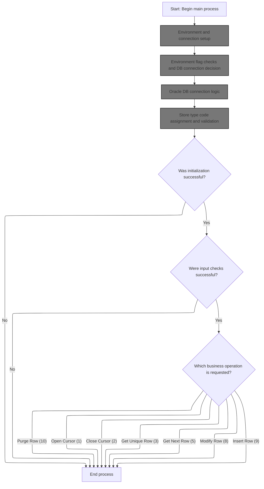
```mermaid
%%{init: {"flowchart": {"defaultRenderer": "elk"}} }%%
flowchart TD
  node1["Start: Begin main process"] --> node2["Environment and connection setup"]
  click node1 openCode "base/src/WWWS0003.cbl:102:103"
  
  node2 --> node3["Environment flag checks and DB connection decision"]
  
  node3 --> node4["Oracle DB connection logic"]
  
  node4 --> node5["Store type code assignment and validation"]
  
  node5 --> node6{"Was initialization successful?"}
  click node6 openCode "base/src/WWWS0003.cbl:105:106"
  node6 -->|"Yes"| node7{"Were input checks successful?"}
  node6 -->|"No"| node9["End process"]
  click node9 openCode "base/src/WWWS0003.cbl:154:155"
  node7 -->|"Yes"| node8{"Which business operation is requested?"}
  click node7 openCode "base/src/WWWS0003.cbl:107:108"
  node7 -->|"No"| node9
  node8 -->|"Open Cursor (1)"| node9
  node8 -->|"Close Cursor (2)"| node9
  node8 -->|"Get Unique Row (3)"| node9
  node8 -->|"Get Next Row (5)"| node9
  node8 -->|"Modify Row (8)"| node9
  node8 -->|"Insert Row (9)"| node9
  node8 -->|"Purge Row (10)"| node9
  click node8 openCode "base/src/WWWS0003.cbl:109:123"

classDef HeadingStyle fill:#777777,stroke:#333,stroke-width:2px;
click node2 goToHeading "Environment and connection setup"
node2:::HeadingStyle
click node3 goToHeading "Environment flag checks and DB connection decision"
node3:::HeadingStyle
click node4 goToHeading "Oracle DB connection logic"
node4:::HeadingStyle
click node5 goToHeading "Store type code assignment and validation"
node5:::HeadingStyle

%% Swimm:
%% %%{init: {"flowchart": {"defaultRenderer": "elk"}} }%%
%% flowchart TD
%%   node1["Start: Begin main process"] --> node2["Environment and connection setup"]
%%   click node1 openCode "<SwmPath>[base/src/WWWS0003.cbl](base/src/WWWS0003.cbl)</SwmPath>:102:103"
%%   
%%   node2 --> node3["Environment flag checks and DB connection decision"]
%%   
%%   node3 --> node4["Oracle DB connection logic"]
%%   
%%   node4 --> node5["Store type code assignment and validation"]
%%   
%%   node5 --> node6{"Was initialization successful?"}
%%   click node6 openCode "<SwmPath>[base/src/WWWS0003.cbl](base/src/WWWS0003.cbl)</SwmPath>:105:106"
%%   node6 -->|"Yes"| node7{"Were input checks successful?"}
%%   node6 -->|"No"| node9["End process"]
%%   click node9 openCode "<SwmPath>[base/src/WWWS0003.cbl](base/src/WWWS0003.cbl)</SwmPath>:154:155"
%%   node7 -->|"Yes"| node8{"Which business operation is requested?"}
%%   click node7 openCode "<SwmPath>[base/src/WWWS0003.cbl](base/src/WWWS0003.cbl)</SwmPath>:107:108"
%%   node7 -->|"No"| node9
%%   node8 -->|"Open Cursor (1)"| node9
%%   node8 -->|"Close Cursor (2)"| node9
%%   node8 -->|"Get Unique Row (3)"| node9
%%   node8 -->|"Get Next Row (5)"| node9
%%   node8 -->|"Modify Row (8)"| node9
%%   node8 -->|"Insert Row (9)"| node9
%%   node8 -->|"Purge Row (10)"| node9
%%   click node8 openCode "<SwmPath>[base/src/WWWS0003.cbl](base/src/WWWS0003.cbl)</SwmPath>:109:123"
%% 
%% classDef HeadingStyle fill:#777777,stroke:#333,stroke-width:2px;
%% click node2 goToHeading "Environment and connection setup"
%% node2:::HeadingStyle
%% click node3 goToHeading "Environment flag checks and DB connection decision"
%% node3:::HeadingStyle
%% click node4 goToHeading "Oracle DB connection logic"
%% node4:::HeadingStyle
%% click node5 goToHeading "Store type code assignment and validation"
%% node5:::HeadingStyle
```

This section governs the start of the main execution flow, ensuring the environment and database connection are correctly set up before any business operations are processed. It validates the store type and determines which business operation to execute based on input, handling errors and process termination as needed.

| Category        | Rule Name                  | Description                                                                                                                                                                                                                                      |
| --------------- | -------------------------- | ------------------------------------------------------------------------------------------------------------------------------------------------------------------------------------------------------------------------------------------------ |
| Data validation | Store type validation      | The store type code must be assigned and validated against the system database before any business operation is executed.                                                                                                                        |
| Data validation | Precondition enforcement   | Successful initialization and input validation are required before any business operation is executed.                                                                                                                                           |
| Business logic  | Mandatory initialization   | The main process must always begin with environment and database connection setup before any business operation is performed.                                                                                                                    |
| Business logic  | Operation dispatch by code | Business operation execution is determined by the input request code, which must match one of the supported operations: Open Cursor (1), Close Cursor (2), Get Unique Row (3), Get Next Row (5), Modify Row (8), Insert Row (9), Purge Row (10). |

<SwmSnippet path="/base/src/WWWS0003.cbl" line="102">

---

In <SwmToken path="base/src/WWWS0003.cbl" pos="102:2:4" line-data="012800 000-MAIN.                                                        00012800">`000-MAIN`</SwmToken>, we kick off the flow by calling <SwmToken path="base/src/WWWS0003.cbl" pos="103:4:6" line-data="012900     PERFORM 100-INITIALIZE                                       00012900">`100-INITIALIZE`</SwmToken>. This sets up the environment and DB connection, which is needed before anything else can run. Without this, later logic can't know which DB to use or how to handle errors, so we always start here.

```cobol
012800 000-MAIN.                                                        00012800
012900     PERFORM 100-INITIALIZE                                       00012900
```

---

</SwmSnippet>

## Environment and connection setup

This section is responsible for preparing the application environment and connection settings before any business logic or database operations are performed. It ensures that the system knows which environment it is running in and sets the necessary flags and keys for further processing.

| Category        | Rule Name                           | Description                                                                                                                             |
| --------------- | ----------------------------------- | --------------------------------------------------------------------------------------------------------------------------------------- |
| Data validation | Conditional key setup               | Keys for further processing must only be set up if the environment initialization is successful (i.e., SUCCESS = 0).                    |
| Business logic  | Environment identification required | The environment must be identified and the corresponding flags set before any database or business logic operations are performed.      |
| Business logic  | Consistent flag setting             | The environment flags must be set in a way that is consistent with the detected environment (e.g., test, production, middleware usage). |

<SwmSnippet path="/base/src/WWWS0003.cbl" line="135">

---

<SwmToken path="base/src/WWWS0003.cbl" pos="135:2:4" line-data="016100 100-INITIALIZE.                                                  00016100">`100-INITIALIZE`</SwmToken> starts by calling <SwmToken path="base/src/WWWS0003.cbl" pos="136:4:8" line-data="016200     PERFORM 110-MISC-INITS                                       00016200">`110-MISC-INITS`</SwmToken> to check which environment we're running in and set the right flags. This is needed before any DB or business logic, since everything else depends on knowing the environment.

```cobol
016100 100-INITIALIZE.                                                  00016100
016200     PERFORM 110-MISC-INITS                                       00016200
016300     IF SUCCESS                                                   00016300
016400       PERFORM 120-SETUP-KEYS                                     00016400
016500     END-IF                                                       00016500
016600     .                                                            00016600
```

---

</SwmSnippet>

## Environment flag checks and DB connection decision

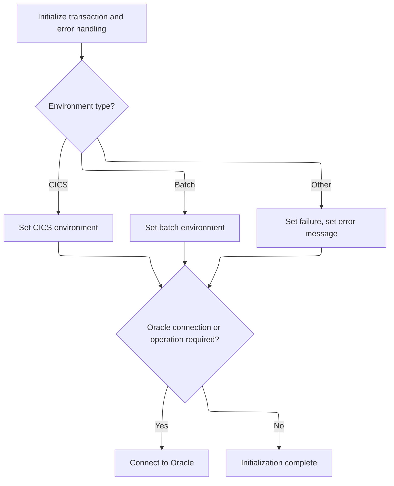
```mermaid
%%{init: {"flowchart": {"defaultRenderer": "elk"}} }%%
flowchart TD
    node1["Initialize transaction and error handling"]
    click node1 openCode "base/src/WWWS0003.cbl:143:146"
    node1 --> node2{"Environment type?"}
    click node2 openCode "base/src/WWWS0003.cbl:147:147"
    node2 -->|"CICS"| node3["Set CICS environment"]
    click node3 openCode "base/src/WWWS0003.cbl:148:149"
    node2 -->|"Batch"| node4["Set batch environment"]
    click node4 openCode "base/src/WWWS0003.cbl:150:151"
    node2 -->|"Other"| node5["Set failure, set error message"]
    click node5 openCode "base/src/WWWS0003.cbl:152:155"
    node3 --> node6{"Oracle connection or operation required?"}
    node4 --> node6
    node5 --> node6
    click node6 openCode "base/src/WWWS0003.cbl:157:158"
    node6 -->|"Yes"| node7["Connect to Oracle"]
    click node7 openCode "base/src/WWWS0003.cbl:159:159"
    node6 -->|"No"| node8["Initialization complete"]
    click node8 openCode "base/src/WWWS0003.cbl:160:160"
classDef HeadingStyle fill:#777777,stroke:#333,stroke-width:2px;

%% Swimm:
%% %%{init: {"flowchart": {"defaultRenderer": "elk"}} }%%
%% flowchart TD
%%     node1["Initialize transaction and error handling"]
%%     click node1 openCode "<SwmPath>[base/src/WWWS0003.cbl](base/src/WWWS0003.cbl)</SwmPath>:143:146"
%%     node1 --> node2{"Environment type?"}
%%     click node2 openCode "<SwmPath>[base/src/WWWS0003.cbl](base/src/WWWS0003.cbl)</SwmPath>:147:147"
%%     node2 -->|"CICS"| node3["Set CICS environment"]
%%     click node3 openCode "<SwmPath>[base/src/WWWS0003.cbl](base/src/WWWS0003.cbl)</SwmPath>:148:149"
%%     node2 -->|"Batch"| node4["Set batch environment"]
%%     click node4 openCode "<SwmPath>[base/src/WWWS0003.cbl](base/src/WWWS0003.cbl)</SwmPath>:150:151"
%%     node2 -->|"Other"| node5["Set failure, set error message"]
%%     click node5 openCode "<SwmPath>[base/src/WWWS0003.cbl](base/src/WWWS0003.cbl)</SwmPath>:152:155"
%%     node3 --> node6{"Oracle connection or operation required?"}
%%     node4 --> node6
%%     node5 --> node6
%%     click node6 openCode "<SwmPath>[base/src/WWWS0003.cbl](base/src/WWWS0003.cbl)</SwmPath>:157:158"
%%     node6 -->|"Yes"| node7["Connect to Oracle"]
%%     click node7 openCode "<SwmPath>[base/src/WWWS0003.cbl](base/src/WWWS0003.cbl)</SwmPath>:159:159"
%%     node6 -->|"No"| node8["Initialization complete"]
%%     click node8 openCode "<SwmPath>[base/src/WWWS0003.cbl](base/src/WWWS0003.cbl)</SwmPath>:160:160"
%% classDef HeadingStyle fill:#777777,stroke:#333,stroke-width:2px;
```

This section governs how the application determines its operating environment and whether to establish a connection to Oracle, based on a set of input flags and transaction codes. It ensures the correct environment is set and that database connections are only made when business logic requires.

| Category       | Rule Name                   | Description                                                                                                                                                                                                      |
| -------------- | --------------------------- | ---------------------------------------------------------------------------------------------------------------------------------------------------------------------------------------------------------------- |
| Business logic | CICS environment selection  | If the environment flag indicates CICS, the system must set the environment to CICS mode.                                                                                                                        |
| Business logic | Batch environment selection | If the environment flag indicates batch, the system must set the environment to batch mode.                                                                                                                      |
| Business logic | Oracle connection trigger   | If any of the following flags are set: Oracle connection required, exit code for insert row (9), exit code for modify row (8), or exit code for purge row (10), the system must initiate a connection to Oracle. |
| Business logic | No Oracle connection needed | If none of the Oracle-related flags or exit codes are set, the system must complete initialization without connecting to Oracle.                                                                                 |

<SwmSnippet path="/base/src/WWWS0003.cbl" line="143">

---

In <SwmToken path="base/src/WWWS0003.cbl" pos="143:2:6" line-data="016900 110-MISC-INITS.                                                  00016900">`110-MISC-INITS`</SwmToken>, we check the environment flags to decide if we're in CICS or batch mode. If neither is set, we fail and log an error. The code assumes these flags are set correctly before entry, but that's not obvious from the signature.

```cobol
016900 110-MISC-INITS.                                                  00016900
017000     INITIALIZE XXXN001A                                          00017000
017100     MOVE 'WWWS0003' TO YYYC0097-ERROR-PGM                        00017100
017200                                                                  00017200
017300     EVALUATE TRUE                                                00017300
017400       WHEN YYYN005A-CICS-ENV                                     00017400
017500         SET YYYN110A-CICS-ENV TO TRUE                            00017500
017600       WHEN YYYN005A-BATCH-ENV                                    00017600
017700         SET YYYN110A-BATCH-ENV TO TRUE                           00017700
017800       WHEN OTHER                                                 00017800
017900         SET FAILURE TO TRUE                                      00017900
018000         MOVE 'WWWS0003 - Invalid environment variable.'          00018000
018100           TO IS-RTRN-MSG-TXT                                     00018100
018200     END-EVALUATE                                                 00018200
```

---

</SwmSnippet>

<SwmSnippet path="/base/src/WWWS0003.cbl" line="157">

---

After finishing <SwmToken path="base/src/WWWS0003.cbl" pos="136:4:8" line-data="016200     PERFORM 110-MISC-INITS                                       00016200">`110-MISC-INITS`</SwmToken>, we check a set of flags to see if we need to connect to Oracle. If any are set, we call <SwmToken path="base/src/WWWS0003.cbl" pos="159:4:10" line-data="018500       PERFORM 115-CONNECT-TO-ORACLE                              00018500">`115-CONNECT-TO-ORACLE`</SwmToken>. This is based on business logic, not just environment.

```cobol
018300     IF (YYYN005A-ORACLE       OR EXIT-PUT-INSERT-ROW             00018300
018400         OR EXIT-PUT-PURGE-ROW OR EXIT-PUT-MODIFY-ROW)            00018400
018500       PERFORM 115-CONNECT-TO-ORACLE                              00018500
018600     END-IF                                                       00018600
```

---

</SwmSnippet>

## Oracle DB connection logic

The main product role of this section is to establish a connection to the Oracle database and handle any errors that occur during the connection attempt, ensuring that error information is captured and communicated clearly.

| Category       | Rule Name             | Description                                                                                                                                                                                                                                                                                                                                |
| -------------- | --------------------- | ------------------------------------------------------------------------------------------------------------------------------------------------------------------------------------------------------------------------------------------------------------------------------------------------------------------------------------------ |
| Business logic | Error message context | The error message for a failed connection must include the program identifier (<SwmToken path="base/src/WWWS0003.cbl" pos="145:5:5" line-data="017100     MOVE &#39;WWWS0003&#39; TO YYYC0097-ERROR-PGM                        00017100">`WWWS0003`</SwmToken>) and the SQL error code to provide context for support and troubleshooting. |

<SwmSnippet path="/base/src/WWWS0003.cbl" line="167">

---

<SwmToken path="base/src/WWWS0003.cbl" pos="167:2:8" line-data="019300 115-CONNECT-TO-ORACLE.                                           00019300">`115-CONNECT-TO-ORACLE`</SwmToken> calls <SwmToken path="base/src/WWWS0003.cbl" pos="168:4:8" line-data="019400     CALL Z-ORA-CONNECT USING XXXN001A                            00019400">`Z-ORA-CONNECT`</SwmToken> to set up the Oracle DB connection. If it fails, we log the SQL error code and build an error message. The actual connection logic is handled by the external program.

```cobol
019300 115-CONNECT-TO-ORACLE.                                           00019300
019400     CALL Z-ORA-CONNECT USING XXXN001A                            00019400
019500                              SQLCA                               00019500
019600                                                                  00019600
019700     IF NOT SUCCESS                                               00019700
019800       MOVE SQLCODE TO WS-SQLCODE                                 00019800
019900       MOVE SPACES  TO IS-RTRN-MSG-TXT                            00019900
020000       STRING 'WWWS0003 - Error connecting to Oracle. Sqlcode ='  00020000
020100               WS-SQLCODE                                         00020100
020200               DELIMITED BY SIZE INTO IS-RTRN-MSG-TXT             00020200
020300     END-IF                                                       00020300
```

---

</SwmSnippet>

## Dispatching DB connection setup

This section governs the process of preparing and switching the database connection to Oracle, ensuring that all necessary initialization steps are completed before the connection is established.

| Category        | Rule Name                   | Description                                                                                                         |
| --------------- | --------------------------- | ------------------------------------------------------------------------------------------------------------------- |
| Data validation | Initialization prerequisite | The system must perform all required initialization steps before attempting to connect to the Oracle database.      |
| Business logic  | Mandatory Oracle connection | The system must establish a connection to the Oracle database before any database-dependent operations can proceed. |

<SwmSnippet path="/base/src/XXXS0210.cbl" line="33">

---

<SwmToken path="base/src/XXXS0210.cbl" pos="33:2:6" line-data="004400 0000-EXIT-DISPATCHER.                                            00004400">`0000-EXIT-DISPATCHER`</SwmToken> in <SwmPath>[base/src/XXXS0210.cbl](base/src/XXXS0210.cbl)</SwmPath> does the setup and then calls <SwmToken path="base/src/XXXS0210.cbl" pos="35:4:10" line-data="004600     PERFORM 200-CONNECT-TO-ORACLE                                00004600">`200-CONNECT-TO-ORACLE`</SwmToken> to actually switch the DB connection to Oracle. It's the entry point for connection management.

```cobol
004400 0000-EXIT-DISPATCHER.                                            00004400
004500     PERFORM 100-INITIALIZATION                                   00004500
004600     PERFORM 200-CONNECT-TO-ORACLE                                00004600
005000     GOBACK                                                       00005000
005100     .                                                            00005100
```

---

</SwmSnippet>

## Switching to Oracle connection

This section manages the process of switching the database connection to Oracle. It sets the appropriate flag to request an Oracle connection and delegates the connection management to a dedicated manager routine, ensuring the system state is updated accordingly.

| Category       | Rule Name                           | Description                                                                                                                                        |
| -------------- | ----------------------------------- | -------------------------------------------------------------------------------------------------------------------------------------------------- |
| Business logic | Oracle Connection Request Flag      | When a request to switch to Oracle is received, the system must set the connection function flag to 'S0' to indicate an Oracle connection request. |
| Business logic | Connection Manager Delegation       | The system must delegate the actual connection management to the DBMS connection manager routine whenever a connection switch is requested.        |
| Business logic | Update Current Connection Indicator | After switching to Oracle, the current connection indicator must be updated to '0' to reflect the active Oracle connection.                        |
| Business logic | Track Connection Switches           | Each time a connection switch to Oracle occurs, the system must increment the connection switch counter in the statistics struct.                  |

<SwmSnippet path="/base/src/XXXS0210.cbl" line="52">

---

<SwmToken path="base/src/XXXS0210.cbl" pos="52:2:8" line-data="007500 200-CONNECT-TO-ORACLE.                                           00007500">`200-CONNECT-TO-ORACLE`</SwmToken> sets a flag to request Oracle, then calls <SwmToken path="base/src/XXXS0210.cbl" pos="55:4:10" line-data="007540     CALL YYYS0220-DBMS-CON-MGR USING                             00007540">`YYYS0220-DBMS-CON-MGR`</SwmToken> to actually manage the connection switch and update state.

```cobol
007500 200-CONNECT-TO-ORACLE.                                           00007500
007510     SET YYYC0220-SET-ORACLE-CON TO TRUE                          00007510
007530                                                                  00007530
007540     CALL YYYS0220-DBMS-CON-MGR USING                             00007540
007550         XXXN001A                                                 00007550
007560         YYYC0220                                                 00007560
010400     .                                                            00010400
```

---

</SwmSnippet>

## Connection manager dispatch and <SwmToken path="base/src/WWWS0003.cbl" pos="204:8:8" line-data="023000 125-CONNECT-TO-DB2.                                              00023000">`DB2`</SwmToken> logic

This section manages routing of connection-related requests and statistics updates for <SwmToken path="base/src/WWWS0003.cbl" pos="204:8:8" line-data="023000 125-CONNECT-TO-DB2.                                              00023000">`DB2`</SwmToken>, Oracle, and override connections. It ensures the correct handler is invoked based on the requested function, updates usage statistics, and maintains the current connection state for downstream logic.

| Category       | Rule Name                                                                                                                                                                                    | Description                                                                                                                                                                                                                                                                                                                                                                                                                                                                                                          |
| -------------- | -------------------------------------------------------------------------------------------------------------------------------------------------------------------------------------------- | -------------------------------------------------------------------------------------------------------------------------------------------------------------------------------------------------------------------------------------------------------------------------------------------------------------------------------------------------------------------------------------------------------------------------------------------------------------------------------------------------------------------- |
| Business logic | <SwmToken path="base/src/WWWS0003.cbl" pos="204:8:8" line-data="023000 125-CONNECT-TO-DB2.                                              00023000">`DB2`</SwmToken> request statistics update | When a request to set the <SwmToken path="base/src/WWWS0003.cbl" pos="204:8:8" line-data="023000 125-CONNECT-TO-DB2.                                              00023000">`DB2`</SwmToken> connection is received, the system must increment both the total request counter and the <SwmToken path="base/src/WWWS0003.cbl" pos="204:8:8" line-data="023000 125-CONNECT-TO-DB2.                                              00023000">`DB2`</SwmToken> request counter.                                            |
| Business logic | <SwmToken path="base/src/WWWS0003.cbl" pos="204:8:8" line-data="023000 125-CONNECT-TO-DB2.                                              00023000">`DB2`</SwmToken> connection switching      | If the current connection is Oracle or default, and a request to set <SwmToken path="base/src/WWWS0003.cbl" pos="204:8:8" line-data="023000 125-CONNECT-TO-DB2.                                              00023000">`DB2`</SwmToken> connection is received, the system must switch the connection to <SwmToken path="base/src/WWWS0003.cbl" pos="204:8:8" line-data="023000 125-CONNECT-TO-DB2.                                              00023000">`DB2`</SwmToken> and update the current connection state. |
| Business logic | Current connection state update                                                                                                                                                              | After setting the <SwmToken path="base/src/WWWS0003.cbl" pos="204:8:8" line-data="023000 125-CONNECT-TO-DB2.                                              00023000">`DB2`</SwmToken> connection, the system must update the current connection state so that other logic can reference the active connection type.                                                                                                                                                                                                   |
| Business logic | Function code routing                                                                                                                                                                        | Each function code (such as 'GC', 'SD', 'S0', 'GS', 'SS', 'SO') must be routed to its corresponding handler to perform the requested operation.                                                                                                                                                                                                                                                                                                                                                                      |

<SwmSnippet path="/base/src/YYYS0220.cbl" line="56">

---

<SwmToken path="base/src/YYYS0220.cbl" pos="56:2:6" line-data="006500 0000-EXIT-DISPATCHER.                                            00006500">`0000-EXIT-DISPATCHER`</SwmToken> in <SwmPath>[base/src/YYYS0220.cbl](base/src/YYYS0220.cbl)</SwmPath> routes the request to the right handler (<SwmToken path="base/src/YYYS0220.cbl" pos="62:8:8" line-data="007100       WHEN YYYC0220-SET-DB2-CON                                  00007100">`DB2`</SwmToken>, Oracle, stats, override, etc) using a big EVALUATE TRUE block. For <SwmToken path="base/src/YYYS0220.cbl" pos="62:8:8" line-data="007100       WHEN YYYC0220-SET-DB2-CON                                  00007100">`DB2`</SwmToken>, it calls <SwmToken path="base/src/YYYS0220.cbl" pos="63:4:10" line-data="007200         PERFORM 300-SET-DB2-CON                                  00007200">`300-SET-DB2-CON`</SwmToken>.

```cobol
006500 0000-EXIT-DISPATCHER.                                            00006500
006600     PERFORM 100-INITIALIZATION                                   00006600
006700                                                                  00006700
006800     EVALUATE TRUE                                                00006800
006900       WHEN YYYC0220-GET-CURR-CON                                 00006900
007000         PERFORM 200-GET-CURR-CON                                 00007000
007100       WHEN YYYC0220-SET-DB2-CON                                  00007100
007200         PERFORM 300-SET-DB2-CON                                  00007200
007300       WHEN YYYC0220-SET-ORACLE-CON                               00007300
007400         PERFORM 400-SET-ORACLE-CON                               00007400
007500       WHEN YYYC0220-GET-STATS                                    00007500
007600         PERFORM 500-GET-STATS                                    00007600
007700       WHEN YYYC0220-SET-STATS                                    00007700
007800         PERFORM 600-SET-STATS                                    00007800
007900       WHEN YYYC0220-SET-OVERRIDE-CON                             00007900
008000         PERFORM 700-SET-OVERRIDE-CON                             00008000
008100       WHEN OTHER                                                 00008100
008200         SET  FAILURE TO TRUE                                     00008200
008300         MOVE 'YYYS0220 - Function not recognized!'               00008300
008400           TO IS-RTRN-MSG-TXT                                     00008400
008500     END-EVALUATE                                                 00008500
008600                                                                  00008600
008700     GOBACK                                                       00008700
008800     .                                                            00008800
```

---

</SwmSnippet>

<SwmSnippet path="/base/src/YYYS0220.cbl" line="105">

---

<SwmToken path="base/src/YYYS0220.cbl" pos="105:2:8" line-data="011400 300-SET-DB2-CON.                                                 00011400">`300-SET-DB2-CON`</SwmToken> bumps the request counters, switches from Oracle/default to <SwmToken path="base/src/YYYS0220.cbl" pos="105:6:6" line-data="011400 300-SET-DB2-CON.                                                 00011400">`DB2`</SwmToken> if needed, sets the <SwmToken path="base/src/YYYS0220.cbl" pos="105:6:6" line-data="011400 300-SET-DB2-CON.                                                 00011400">`DB2`</SwmToken> connection flag, and updates the current connection state for other code to use.

```cobol
011400 300-SET-DB2-CON.                                                 00011400
011500     ADD 1 TO WS-TOT-REQS                                         00011500
011600     ADD 1 TO WS-DB2-REQS                                         00011600
011700                                                                  00011700
011800     IF WS-ORACLE-CON                                             00011800
011900     OR WS-DEFAULT-CON                                            00011900
012000       PERFORM 310-DO-SET-DB2-CON                                 00012000
012100     END-IF                                                       00012100
012200                                                                  00012200
012300     SET WS-DB2-CON TO TRUE                                       00012300
012400     PERFORM 200-GET-CURR-CON                                     00012400
012500     .                                                            00012500
```

---

</SwmSnippet>

### Oracle connection setup and environment selection

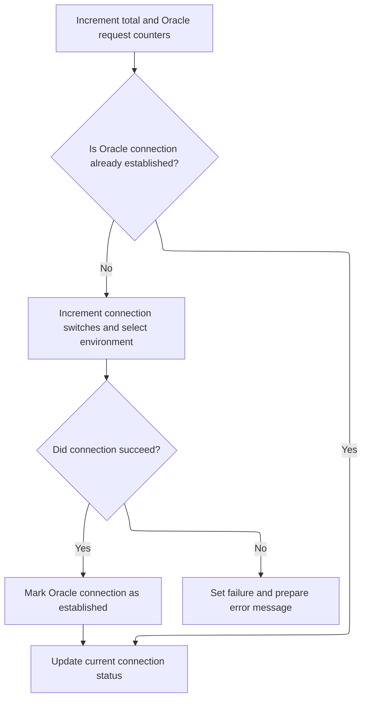
```mermaid
%%{init: {"flowchart": {"defaultRenderer": "elk"}} }%%
flowchart TD
    node1["Increment total and Oracle request counters"]
    click node1 openCode "base/src/YYYS0220.cbl:160:161"
    node1 --> node2{"Is Oracle connection already established?"}
    click node2 openCode "base/src/YYYS0220.cbl:163:163"
    node2 -->|"No"| node3["Increment connection switches and select environment"]
    click node3 openCode "base/src/YYYS0220.cbl:173:205"
    node3 --> node4{"Did connection succeed?"}
    click node4 openCode "base/src/YYYS0220.cbl:208:217"
    node4 -->|"Yes"| node5["Mark Oracle connection as established"]
    click node5 openCode "base/src/YYYS0220.cbl:167:167"
    node4 -->|"No"| node6["Set failure and prepare error message"]
    click node6 openCode "base/src/YYYS0220.cbl:212:216"
    node5 --> node7["Update current connection status"]
    click node7 openCode "base/src/YYYS0220.cbl:168:168"
    node2 -->|"Yes"| node7
classDef HeadingStyle fill:#777777,stroke:#333,stroke-width:2px;

%% Swimm:
%% %%{init: {"flowchart": {"defaultRenderer": "elk"}} }%%
%% flowchart TD
%%     node1["Increment total and Oracle request counters"]
%%     click node1 openCode "<SwmPath>[base/src/YYYS0220.cbl](base/src/YYYS0220.cbl)</SwmPath>:160:161"
%%     node1 --> node2{"Is Oracle connection already established?"}
%%     click node2 openCode "<SwmPath>[base/src/YYYS0220.cbl](base/src/YYYS0220.cbl)</SwmPath>:163:163"
%%     node2 -->|"No"| node3["Increment connection switches and select environment"]
%%     click node3 openCode "<SwmPath>[base/src/YYYS0220.cbl](base/src/YYYS0220.cbl)</SwmPath>:173:205"
%%     node3 --> node4{"Did connection succeed?"}
%%     click node4 openCode "<SwmPath>[base/src/YYYS0220.cbl](base/src/YYYS0220.cbl)</SwmPath>:208:217"
%%     node4 -->|"Yes"| node5["Mark Oracle connection as established"]
%%     click node5 openCode "<SwmPath>[base/src/YYYS0220.cbl](base/src/YYYS0220.cbl)</SwmPath>:167:167"
%%     node4 -->|"No"| node6["Set failure and prepare error message"]
%%     click node6 openCode "<SwmPath>[base/src/YYYS0220.cbl](base/src/YYYS0220.cbl)</SwmPath>:212:216"
%%     node5 --> node7["Update current connection status"]
%%     click node7 openCode "<SwmPath>[base/src/YYYS0220.cbl](base/src/YYYS0220.cbl)</SwmPath>:168:168"
%%     node2 -->|"Yes"| node7
%% classDef HeadingStyle fill:#777777,stroke:#333,stroke-width:2px;
```

This section manages the logic for connecting to the correct Oracle database instance based on the environment, tracks connection and request statistics, and handles connection errors.

| Category       | Rule Name                              | Description                                                                                                                                                                           |
| -------------- | -------------------------------------- | ------------------------------------------------------------------------------------------------------------------------------------------------------------------------------------- |
| Business logic | Request Counting                       | Every time a request is processed, increment both the total request counter and the Oracle request counter by one.                                                                    |
| Business logic | Environment-Based Connection Selection | If the Oracle connection is not already established, increment the connection switch counter and select the appropriate Oracle environment based on the current environment variable. |
| Business logic | Successful Connection Update           | If the Oracle connection is successfully established (SQLCODE equals 0), mark the Oracle connection as established and update the current connection status.                          |
| Business logic | Environment Mapping                    | The Oracle database instance to connect to is determined by the environment variable, with specific mappings for production, test, and various staging environments.                  |

<SwmSnippet path="/base/src/YYYS0220.cbl" line="150">

---

<SwmToken path="base/src/YYYS0220.cbl" pos="150:2:8" line-data="015900 400-SET-ORACLE-CON.                                              00015900">`400-SET-ORACLE-CON`</SwmToken> bumps the request counters, checks if we're already on Oracle, and if not, calls <SwmToken path="base/src/YYYS0220.cbl" pos="155:4:12" line-data="016400       PERFORM 410-DO-SET-ORACLE-CON                              00016400">`410-DO-SET-ORACLE-CON`</SwmToken> to connect to the right Oracle DB. Then it sets the Oracle flag and updates the connection state.

```cobol
015900 400-SET-ORACLE-CON.                                              00015900
016000     ADD 1 TO WS-TOT-REQS                                         00016000
016100     ADD 1 TO WS-OCL-REQS                                         00016100
016200                                                                  00016200
016300     IF NOT WS-ORACLE-CON                                         00016300
016400       PERFORM 410-DO-SET-ORACLE-CON                              00016400
016500     END-IF                                                       00016500
016600                                                                  00016600
016700     SET WS-ORACLE-CON TO TRUE                                    00016700
016800     PERFORM 200-GET-CURR-CON                                     00016800
016900     .                                                            00016900
```

---

</SwmSnippet>

<SwmSnippet path="/base/src/YYYS0220.cbl" line="163">

---

<SwmToken path="base/src/YYYS0220.cbl" pos="163:2:10" line-data="017200 410-DO-SET-ORACLE-CON.                                           00017200">`410-DO-SET-ORACLE-CON`</SwmToken> picks the Oracle DB instance based on the environment variable, bumps the connection switch counter, and checks SQLCODE for errors. If the connection fails, it sets failure and logs the error code.

```cobol
017200 410-DO-SET-ORACLE-CON.                                           00017200
017300     ADD 1 TO WS-CON-SWITCHES                                     00017300
017400                                                                  00017400
017500     EVALUATE TRUE                                                00017500
017600       WHEN WS-PROD                                               00017600
017700         EXEC SQL                                                 00017700
017800           CONNECT TO DRDAASP1                                    00017800
017900         END-EXEC                                                 00017900
018000                                                                  00018000
018100       WHEN WS-TEST                                               00018100
018200         EXEC SQL                                                 00018200
018300           CONNECT TO DRDAASC7                                    00018300
018400         END-EXEC                                                 00018400
018500                                                                  00018500
018600       WHEN WS-TST6                                               00018600
018700         EXEC SQL                                                 00018700
018800           CONNECT TO DRDAASC6                                    00018800
018900         END-EXEC                                                 00018900
019000                                                                  00019000
019100       WHEN WS-TST5                                               00019100
019200         EXEC SQL                                                 00019200
019300           CONNECT TO DRDAASC5                                    00019300
019400         END-EXEC                                                 00019400
019500                                                                  00019500
019600       WHEN WS-TST4                                               00019600
019700         EXEC SQL                                                 00019700
019800           CONNECT TO DRDAASD1                                    00019800
019900         END-EXEC                                                 00019900
020000                                                                  00020000
020100       WHEN WS-TST3                                               00020100
020200         EXEC SQL                                                 00020200
020300           CONNECT TO DRDAASC1                                    00020300
020400         END-EXEC                                                 00020400
020500     END-EVALUATE                                                 00020500
020600                                                                  00020600
020700     EVALUATE TRUE                                                00020700
020800       WHEN SQLCODE = 0                                           00020800
020900         CONTINUE                                                 00020900
021000                                                                  00021000
021100       WHEN OTHER                                                 00021100
021200         SET  FAILURE TO TRUE                                     00021200
021300         MOVE SQLCODE TO WS-SQLCODE                               00021300
021400         STRING 'YYYS0220 - Failure connecting to Oracle, SQL='   00021400
021500                WS-SQLCODE                                        00021500
021600             DELIMITED BY SIZE INTO IS-RTRN-MSG-TXT               00021600
021700     END-EVALUATE                                                 00021700
021800     .                                                            00021800
```

---

</SwmSnippet>

### Stats reset and override connection logic


```mermaid
%%{init: {"flowchart": {"defaultRenderer": "elk"}} }%%
flowchart TD
    node1["Initialize statistics"]
    click node1 openCode "base/src/YYYS0220.cbl:23900:24200"
    node1 --> node6["Increment override request count"]
    click node6 openCode "base/src/YYYS0220.cbl:24800:24900"
    node6 --> node2{"What override connection is requested?"}
    click node2 openCode "base/src/YYYS0220.cbl:25100:26200"
    node2 -->|"DB2 and not already set"| node3["Set DB2 connection, increment override switches"]
    click node3 openCode "base/src/YYYS0220.cbl:25200:25500"
    node2 -->|"Oracle and not already set"| node4["Set Oracle connection, increment override switches"]
    click node4 openCode "base/src/YYYS0220.cbl:25700:26000"
    node2 -->|"Invalid"| node5["Set failure, record error: 'Invalid over-ride connection!'"]
    click node5 openCode "base/src/YYYS0220.cbl:26300:26500"
classDef HeadingStyle fill:#777777,stroke:#333,stroke-width:2px;

%% Swimm:
%% %%{init: {"flowchart": {"defaultRenderer": "elk"}} }%%
%% flowchart TD
%%     node1["Initialize statistics"]
%%     click node1 openCode "<SwmPath>[base/src/YYYS0220.cbl](base/src/YYYS0220.cbl)</SwmPath>:23900:24200"
%%     node1 --> node6["Increment override request count"]
%%     click node6 openCode "<SwmPath>[base/src/YYYS0220.cbl](base/src/YYYS0220.cbl)</SwmPath>:24800:24900"
%%     node6 --> node2{"What override connection is requested?"}
%%     click node2 openCode "<SwmPath>[base/src/YYYS0220.cbl](base/src/YYYS0220.cbl)</SwmPath>:25100:26200"
%%     node2 -->|"<SwmToken path="base/src/WWWS0003.cbl" pos="204:8:8" line-data="023000 125-CONNECT-TO-DB2.                                              00023000">`DB2`</SwmToken> and not already set"| node3["Set <SwmToken path="base/src/WWWS0003.cbl" pos="204:8:8" line-data="023000 125-CONNECT-TO-DB2.                                              00023000">`DB2`</SwmToken> connection, increment override switches"]
%%     click node3 openCode "<SwmPath>[base/src/YYYS0220.cbl](base/src/YYYS0220.cbl)</SwmPath>:25200:25500"
%%     node2 -->|"Oracle and not already set"| node4["Set Oracle connection, increment override switches"]
%%     click node4 openCode "<SwmPath>[base/src/YYYS0220.cbl](base/src/YYYS0220.cbl)</SwmPath>:25700:26000"
%%     node2 -->|"Invalid"| node5["Set failure, record error: 'Invalid <SwmToken path="base/src/YYYS0220.cbl" pos="255:11:13" line-data="026400         MOVE &#39;YYYS0220 - Invalid over-ride connection!&#39;          00026400">`over-ride`</SwmToken> connection!'"]
%%     click node5 openCode "<SwmPath>[base/src/YYYS0220.cbl](base/src/YYYS0220.cbl)</SwmPath>:26300:26500"
%% classDef HeadingStyle fill:#777777,stroke:#333,stroke-width:2px;
```

<SwmSnippet path="/base/src/YYYS0220.cbl" line="230">

---

<SwmToken path="base/src/YYYS0220.cbl" pos="230:2:6" line-data="023900 600-SET-STATS.                                                   00023900">`600-SET-STATS`</SwmToken> resets all stats counters for requests, connections, and overrides by initializing the relevant structures.

```cobol
023900 600-SET-STATS.                                                   00023900
024000     INITIALIZE WS-STATS                                          00024000
024100                YYYC0220-STATS                                    00024100
024200     .                                                            00024200
```

---

</SwmSnippet>

<SwmSnippet path="/base/src/YYYS0220.cbl" line="239">

---

<SwmToken path="base/src/YYYS0220.cbl" pos="239:2:8" line-data="024800 700-SET-OVERRIDE-CON.                                            00024800">`700-SET-OVERRIDE-CON`</SwmToken> bumps the override request counter, sets the <SwmToken path="base/src/YYYS0220.cbl" pos="243:6:6" line-data="025200       WHEN YYYC0220-DB2-CON                                      00025200">`DB2`</SwmToken> or Oracle flag and override switch counter if the override is valid, or sets failure and logs an error if not.

```cobol
024800 700-SET-OVERRIDE-CON.                                            00024800
024900     ADD 1 TO WS-OVR-REQS                                         00024900
025000                                                                  00025000
025100     EVALUATE TRUE                                                00025100
025200       WHEN YYYC0220-DB2-CON                                      00025200
025300       AND  NOT WS-DB2-CON                                        00025300
025400         SET WS-DB2-CON    TO TRUE                                00025400
025500         ADD 1             TO WS-OVR-SWITCHES                     00025500
025600                                                                  00025600
025700       WHEN YYYC0220-ORACLE-CON                                   00025700
025800       AND NOT WS-ORACLE-CON                                      00025800
025900         SET WS-ORACLE-CON TO TRUE                                00025900
026000         ADD 1             TO WS-OVR-SWITCHES                     00026000
026100                                                                  00026100
026200       WHEN OTHER                                                 00026200
026300         SET FAILURE TO TRUE                                      00026300
026400         MOVE 'YYYS0220 - Invalid over-ride connection!'          00026400
026500           TO IS-RTRN-MSG-TXT                                     00026500
026600     END-EVALUATE                                                 00026600
026700     .                                                            00026700
```

---

</SwmSnippet>

## Store type code assignment and validation

This section ensures that when a store type is missing and a purge operation is requested, the correct store type code is resolved and validated against the system database before proceeding. It prevents invalid store types from being used in downstream processes.

| Category        | Rule Name                          | Description                                                                                                                                                   |
| --------------- | ---------------------------------- | ------------------------------------------------------------------------------------------------------------------------------------------------------------- |
| Data validation | Mandatory type validation on purge | If the store type code is blank and the purge flag is set, the system must resolve and validate the store type code before any further processing is allowed. |
| Business logic  | Store type update on success       | If the type code is valid, the store type must be updated in the system data to reflect the resolved value.                                                   |

<SwmSnippet path="/base/src/WWWS0003.cbl" line="181">

---

In <SwmToken path="base/src/WWWS0003.cbl" pos="181:2:6" line-data="020700 120-SETUP-KEYS.                                                  00020700">`120-SETUP-KEYS`</SwmToken>, if the store type is blank and the purge flag is set, we set up location number and type, then call <SwmToken path="base/src/WWWS0003.cbl" pos="186:4:8" line-data="021200       PERFORM 130-CHECK-TYPE                                     00021200">`130-CHECK-TYPE`</SwmToken> to validate the type in the DB. This is needed to resolve the correct type code before continuing.

```cobol
020700 120-SETUP-KEYS.                                                  00020700
020800     IF  ST-STORE-TYPE = SPACES                                   00020800
020900     AND EXIT-PUT-PURGE-ROW                                       00020900
021000       MOVE ST-STORE-NUMBER TO LOC-NBR    OF DCLXXXATION          00021000
021100       MOVE 'S '            TO LOC-TYP-CD OF DCLXXXATION          00021100
021200       PERFORM 130-CHECK-TYPE                                     00021200
```

---

</SwmSnippet>

### Store type validation against DB

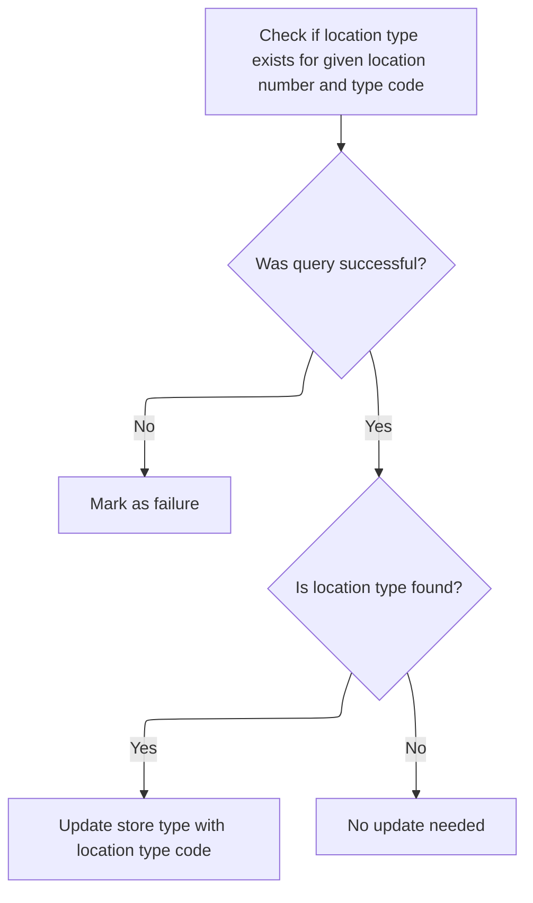
```mermaid
%%{init: {"flowchart": {"defaultRenderer": "elk"}} }%%
flowchart TD
    node1["Check if location type exists for given location number and type code"]
    click node1 openCode "base/src/WWWS0003.cbl:209:216"
    node1 --> node2{"Was query successful?"}
    click node2 openCode "base/src/WWWS0003.cbl:218:224"
    node2 -->|"No"| node3["Mark as failure"]
    click node3 openCode "base/src/WWWS0003.cbl:218:223"
    node2 -->|"Yes"| node4{"Is location type found?"}
    click node4 openCode "base/src/WWWS0003.cbl:225:228"
    node4 -->|"Yes"| node5["Update store type with location type code"]
    click node5 openCode "base/src/WWWS0003.cbl:226:227"
    node4 -->|"No"| node6["No update needed"]
    click node6 openCode "base/src/WWWS0003.cbl:229:230"

classDef HeadingStyle fill:#777777,stroke:#333,stroke-width:2px;

%% Swimm:
%% %%{init: {"flowchart": {"defaultRenderer": "elk"}} }%%
%% flowchart TD
%%     node1["Check if location type exists for given location number and type code"]
%%     click node1 openCode "<SwmPath>[base/src/WWWS0003.cbl](base/src/WWWS0003.cbl)</SwmPath>:209:216"
%%     node1 --> node2{"Was query successful?"}
%%     click node2 openCode "<SwmPath>[base/src/WWWS0003.cbl](base/src/WWWS0003.cbl)</SwmPath>:218:224"
%%     node2 -->|"No"| node3["Mark as failure"]
%%     click node3 openCode "<SwmPath>[base/src/WWWS0003.cbl](base/src/WWWS0003.cbl)</SwmPath>:218:223"
%%     node2 -->|"Yes"| node4{"Is location type found?"}
%%     click node4 openCode "<SwmPath>[base/src/WWWS0003.cbl](base/src/WWWS0003.cbl)</SwmPath>:225:228"
%%     node4 -->|"Yes"| node5["Update store type with location type code"]
%%     click node5 openCode "<SwmPath>[base/src/WWWS0003.cbl](base/src/WWWS0003.cbl)</SwmPath>:226:227"
%%     node4 -->|"No"| node6["No update needed"]
%%     click node6 openCode "<SwmPath>[base/src/WWWS0003.cbl](base/src/WWWS0003.cbl)</SwmPath>:229:230"
%% 
%% classDef HeadingStyle fill:#777777,stroke:#333,stroke-width:2px;
```

This section ensures that the store type for a given location is only updated if the location type code exists in the database for the specified location number. It also handles error reporting if the database query fails.

| Category       | Rule Name                                | Description                                                                                                                                     |
| -------------- | ---------------------------------------- | ----------------------------------------------------------------------------------------------------------------------------------------------- |
| Business logic | Store type update on valid location type | If the location type code exists for the given location number in the database, the store type must be updated to match the location type code. |
| Business logic | No update on missing location type       | If the location type code does not exist for the given location number in the database, no update should be made to the store type.             |

<SwmSnippet path="/base/src/WWWS0003.cbl" line="209">

---

In <SwmToken path="base/src/WWWS0003.cbl" pos="209:2:6" line-data="023500 130-CHECK-TYPE.                                                  00023500">`130-CHECK-TYPE`</SwmToken>, we run a SQL count on the XXXATION table for the given location number and type code to see if the type exists in the DB. This is a direct DB validation step.

```cobol
023500 130-CHECK-TYPE.                                                  00023500
023600     EXEC SQL                                                     00023600
023700       SELECT COUNT(*)                                            00023700
023800       INTO   :WS-CNT                                             00023800
023900       FROM   XXXATION                                            00023900
024000       WHERE  LOC_NBR = :DCLXXXATION.LOC-NBR                      00024000
024100       AND    LOC_TYP_CD = :DCLXXXATION.LOC-TYP-CD                00024100
024200     END-EXEC                                                     00024200
```

---

</SwmSnippet>

<SwmSnippet path="/base/src/WWWS0003.cbl" line="218">

---

After the SQL check in <SwmToken path="base/src/WWWS0003.cbl" pos="186:4:8" line-data="021200       PERFORM 130-CHECK-TYPE                                     00021200">`130-CHECK-TYPE`</SwmToken>, if there's a DB error, we set failure and log the error code. If the type exists, we copy it to the output structure. Otherwise, nothing changes.

```cobol
024400     IF SQLCODE NOT = 0                                           00024400
024500       SET  FAILURE TO TRUE                                       00024500
024600       MOVE SQLCODE TO WS-SQLCODE                                 00024600
024700       STRING 'WWWS0003 - Error resolving key, SQL='              00024700
024800              WS-SQLCODE                                          00024800
024900              DELIMITED BY SIZE INTO IS-RTRN-MSG-TXT              00024900
025000     ELSE                                                         00025000
025100       IF WS-CNT > 0                                              00025100
025200         MOVE LOC-TYP-CD OF DCLXXXATION                           00025200
025300           TO ST-STORE-TYPE OF XXXPSTTT                           00025300
025400       END-IF                                                     00025400
025500     END-IF                                                       00025500
025600     .                                                            00025600
```

---

</SwmSnippet>

### Fallback and error handling for unresolved store type

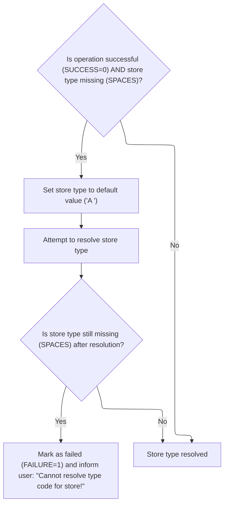
```mermaid
%%{init: {"flowchart": {"defaultRenderer": "elk"}} }%%
flowchart TD
    node1{"Is operation successful (SUCCESS=0) AND store type missing (SPACES)?"}
    click node1 openCode "base/src/WWWS0003.cbl:188:189"
    node1 -->|"Yes"| node2["Set store type to default value ('A ')"]
    click node2 openCode "base/src/WWWS0003.cbl:189:190"
    node2 --> node3["Attempt to resolve store type"]
    click node3 openCode "base/src/WWWS0003.cbl:190:191"
    node3 --> node4{"Is store type still missing (SPACES) after resolution?"}
    click node4 openCode "base/src/WWWS0003.cbl:191:192"
    node4 -->|"Yes"| node5["Mark as failed (FAILURE=1) and inform user: #quot;Cannot resolve type code for store!#quot;"]
    click node5 openCode "base/src/WWWS0003.cbl:192:194"
    node4 -->|"No"| node6["Store type resolved"]
    click node6 openCode "base/src/WWWS0003.cbl:195:196"
    node1 -->|"No"| node6
classDef HeadingStyle fill:#777777,stroke:#333,stroke-width:2px;

%% Swimm:
%% %%{init: {"flowchart": {"defaultRenderer": "elk"}} }%%
%% flowchart TD
%%     node1{"Is operation successful (SUCCESS=0) AND store type missing (SPACES)?"}
%%     click node1 openCode "<SwmPath>[base/src/WWWS0003.cbl](base/src/WWWS0003.cbl)</SwmPath>:188:189"
%%     node1 -->|"Yes"| node2["Set store type to default value ('A ')"]
%%     click node2 openCode "<SwmPath>[base/src/WWWS0003.cbl](base/src/WWWS0003.cbl)</SwmPath>:189:190"
%%     node2 --> node3["Attempt to resolve store type"]
%%     click node3 openCode "<SwmPath>[base/src/WWWS0003.cbl](base/src/WWWS0003.cbl)</SwmPath>:190:191"
%%     node3 --> node4{"Is store type still missing (SPACES) after resolution?"}
%%     click node4 openCode "<SwmPath>[base/src/WWWS0003.cbl](base/src/WWWS0003.cbl)</SwmPath>:191:192"
%%     node4 -->|"Yes"| node5["Mark as failed (FAILURE=1) and inform user: #quot;Cannot resolve type code for store!#quot;"]
%%     click node5 openCode "<SwmPath>[base/src/WWWS0003.cbl](base/src/WWWS0003.cbl)</SwmPath>:192:194"
%%     node4 -->|"No"| node6["Store type resolved"]
%%     click node6 openCode "<SwmPath>[base/src/WWWS0003.cbl](base/src/WWWS0003.cbl)</SwmPath>:195:196"
%%     node1 -->|"No"| node6
%% classDef HeadingStyle fill:#777777,stroke:#333,stroke-width:2px;
```

<SwmSnippet path="/base/src/WWWS0003.cbl" line="188">

---

Back in <SwmToken path="base/src/WWWS0003.cbl" pos="138:4:8" line-data="016400       PERFORM 120-SETUP-KEYS                                     00016400">`120-SETUP-KEYS`</SwmToken>, after returning from <SwmToken path="base/src/WWWS0003.cbl" pos="190:4:8" line-data="021600         PERFORM 130-CHECK-TYPE                                   00021600">`130-CHECK-TYPE`</SwmToken>, if the type is still unresolved, we try a fallback type and check again. If still unresolved, we set failure and log a specific error message.

```cobol
021400       IF SUCCESS AND ST-STORE-TYPE = SPACES                      00021400
021500         MOVE 'A '            TO LOC-TYP-CD OF DCLXXXATION        00021500
021600         PERFORM 130-CHECK-TYPE                                   00021600
021700         IF SUCCESS AND ST-STORE-TYPE = SPACES                    00021700
021800           SET  FAILURE TO TRUE                                   00021800
021900           MOVE 'WWWS0003 - Cannot resolve type code for store!'  00021900
022000             TO IS-RTRN-MSG-TXT                                   00022000
022100         END-IF                                                   00022100
022200       END-IF                                                     00022200
```

---

</SwmSnippet>

## Input validation and operation dispatch

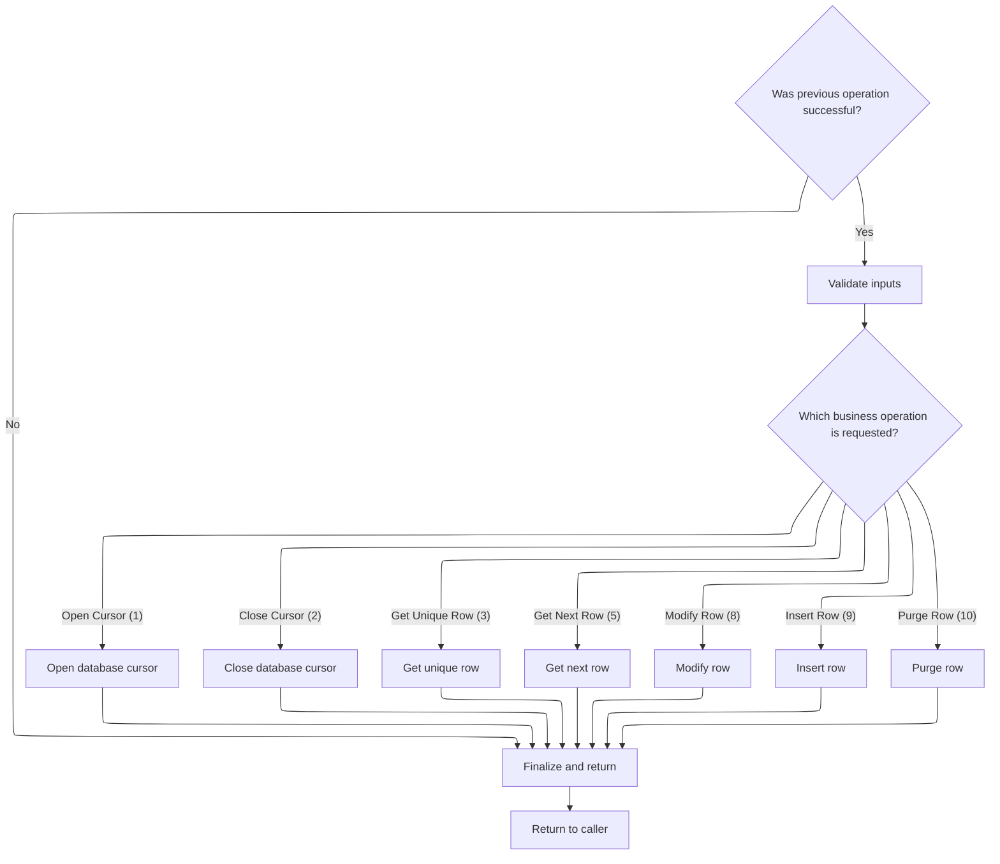
```mermaid
%%{init: {"flowchart": {"defaultRenderer": "elk"}} }%%
flowchart TD
    node1{"Was previous operation successful?"}
    click node1 openCode "base/src/WWWS0003.cbl:105:106"
    node1 -->|"Yes"| node2["Validate inputs"]
    click node2 openCode "base/src/WWWS0003.cbl:106:107"
    node2 --> node3{"Which business operation is requested?"}
    click node3 openCode "base/src/WWWS0003.cbl:108:123"
    node3 -->|"Open Cursor (1)"| node4["Open database cursor"]
    click node4 openCode "base/src/WWWS0003.cbl:110:110"
    node3 -->|"Close Cursor (2)"| node5["Close database cursor"]
    click node5 openCode "base/src/WWWS0003.cbl:112:112"
    node3 -->|"Get Unique Row (3)"| node6["Get unique row"]
    click node6 openCode "base/src/WWWS0003.cbl:114:114"
    node3 -->|"Get Next Row (5)"| node7["Get next row"]
    click node7 openCode "base/src/WWWS0003.cbl:116:116"
    node3 -->|"Modify Row (8)"| node8["Modify row"]
    click node8 openCode "base/src/WWWS0003.cbl:118:118"
    node3 -->|"Insert Row (9)"| node9["Insert row"]
    click node9 openCode "base/src/WWWS0003.cbl:120:120"
    node3 -->|"Purge Row (10)"| node10["Purge row"]
    click node10 openCode "base/src/WWWS0003.cbl:122:122"
    node4 --> node11["Finalize and return"]
    node5 --> node11
    node6 --> node11
    node7 --> node11
    node8 --> node11
    node9 --> node11
    node10 --> node11
    node1 -->|"No"| node11
    node11 --> node12["Return to caller"]
    click node11 openCode "base/src/WWWS0003.cbl:124:128"
    click node12 openCode "base/src/WWWS0003.cbl:128:129"
classDef HeadingStyle fill:#777777,stroke:#333,stroke-width:2px;

%% Swimm:
%% %%{init: {"flowchart": {"defaultRenderer": "elk"}} }%%
%% flowchart TD
%%     node1{"Was previous operation successful?"}
%%     click node1 openCode "<SwmPath>[base/src/WWWS0003.cbl](base/src/WWWS0003.cbl)</SwmPath>:105:106"
%%     node1 -->|"Yes"| node2["Validate inputs"]
%%     click node2 openCode "<SwmPath>[base/src/WWWS0003.cbl](base/src/WWWS0003.cbl)</SwmPath>:106:107"
%%     node2 --> node3{"Which business operation is requested?"}
%%     click node3 openCode "<SwmPath>[base/src/WWWS0003.cbl](base/src/WWWS0003.cbl)</SwmPath>:108:123"
%%     node3 -->|"Open Cursor (1)"| node4["Open database cursor"]
%%     click node4 openCode "<SwmPath>[base/src/WWWS0003.cbl](base/src/WWWS0003.cbl)</SwmPath>:110:110"
%%     node3 -->|"Close Cursor (2)"| node5["Close database cursor"]
%%     click node5 openCode "<SwmPath>[base/src/WWWS0003.cbl](base/src/WWWS0003.cbl)</SwmPath>:112:112"
%%     node3 -->|"Get Unique Row (3)"| node6["Get unique row"]
%%     click node6 openCode "<SwmPath>[base/src/WWWS0003.cbl](base/src/WWWS0003.cbl)</SwmPath>:114:114"
%%     node3 -->|"Get Next Row (5)"| node7["Get next row"]
%%     click node7 openCode "<SwmPath>[base/src/WWWS0003.cbl](base/src/WWWS0003.cbl)</SwmPath>:116:116"
%%     node3 -->|"Modify Row (8)"| node8["Modify row"]
%%     click node8 openCode "<SwmPath>[base/src/WWWS0003.cbl](base/src/WWWS0003.cbl)</SwmPath>:118:118"
%%     node3 -->|"Insert Row (9)"| node9["Insert row"]
%%     click node9 openCode "<SwmPath>[base/src/WWWS0003.cbl](base/src/WWWS0003.cbl)</SwmPath>:120:120"
%%     node3 -->|"Purge Row (10)"| node10["Purge row"]
%%     click node10 openCode "<SwmPath>[base/src/WWWS0003.cbl](base/src/WWWS0003.cbl)</SwmPath>:122:122"
%%     node4 --> node11["Finalize and return"]
%%     node5 --> node11
%%     node6 --> node11
%%     node7 --> node11
%%     node8 --> node11
%%     node9 --> node11
%%     node10 --> node11
%%     node1 -->|"No"| node11
%%     node11 --> node12["Return to caller"]
%%     click node11 openCode "<SwmPath>[base/src/WWWS0003.cbl](base/src/WWWS0003.cbl)</SwmPath>:124:128"
%%     click node12 openCode "<SwmPath>[base/src/WWWS0003.cbl](base/src/WWWS0003.cbl)</SwmPath>:128:129"
%% classDef HeadingStyle fill:#777777,stroke:#333,stroke-width:2px;
```

<SwmSnippet path="/base/src/WWWS0003.cbl" line="105">

---

Back in <SwmToken path="base/src/WWWS0003.cbl" pos="102:2:4" line-data="012800 000-MAIN.                                                        00012800">`000-MAIN`</SwmToken>, after <SwmToken path="base/src/WWWS0003.cbl" pos="103:4:6" line-data="012900     PERFORM 100-INITIALIZE                                       00012900">`100-INITIALIZE`</SwmToken>, if setup succeeded, we move on to input validation by calling <SwmToken path="base/src/WWWS0003.cbl" pos="106:4:8" line-data="013200       PERFORM 200-CHECK-INPUTS                                   00013200">`200-CHECK-INPUTS`</SwmToken>. This only happens if the environment and DB setup didn't fail.

```cobol
013100     IF SUCCESS                                                   00013100
013200       PERFORM 200-CHECK-INPUTS                                   00013200
```

---

</SwmSnippet>

<SwmSnippet path="/base/src/WWWS0003.cbl" line="107">

---

Finishing <SwmToken path="base/src/WWWS0003.cbl" pos="102:2:4" line-data="012800 000-MAIN.                                                        00012800">`000-MAIN`</SwmToken>, we dispatch to the right handler based on the requested operation. For close cursor, we call <SwmToken path="base/src/WWWS0003.cbl" pos="112:4:10" line-data="013800              PERFORM 1100-EXIT-CLOSE-CURSOR                      00013800">`1100-EXIT-CLOSE-CURSOR`</SwmToken>, which is just a stub for now.

```cobol
013300       IF SUCCESS                                                 00013300
013400         EVALUATE TRUE                                            00013400
013500           WHEN EXIT-OPEN-CURSOR                                  00013500
013600              PERFORM 1000-EXIT-OPEN-CURSOR                       00013600
013700           WHEN EXIT-CLOSE-CURSOR                                 00013700
013800              PERFORM 1100-EXIT-CLOSE-CURSOR                      00013800
013900           WHEN EXIT-GET-UNIQUE-ROW                               00013900
014000              PERFORM 1200-EXIT-GET-UNIQUE-ROW                    00014000
014100           WHEN EXIT-GET-NEXT-ROW                                 00014100
014200              PERFORM 1300-EXIT-GET-NEXT-ROW                      00014200
014300           WHEN EXIT-PUT-MODIFY-ROW                               00014300
014400              PERFORM 1400-EXIT-PUT-MODIFY-ROW                    00014400
014500           WHEN EXIT-PUT-INSERT-ROW                               00014500
014600              PERFORM 1500-EXIT-PUT-INSERT-ROW                    00014600
014700           WHEN EXIT-PUT-PURGE-ROW                                00014700
014800              PERFORM 1600-EXIT-PUT-PURGE-ROW                     00014800
014900         END-EVALUATE                                             00014900
015000         PERFORM 300-EXIT-STUFF                                   00015000
015100       END-IF                                                     00015100
015200     END-IF                                                       00015200
015300                                                                  00015300
015400     GOBACK                                                       00015400
015500     .                                                            00015500
```

---

</SwmSnippet>

<SwmSnippet path="/base/src/WWWS0003.cbl" line="285">

---

<SwmToken path="base/src/WWWS0003.cbl" pos="285:2:8" line-data="031100 1100-EXIT-CLOSE-CURSOR.                                          00031100">`1100-EXIT-CLOSE-CURSOR`</SwmToken> just sets failure and a not-supported message instead of closing a cursor. It's a stub for future implementation.

```cobol
031100 1100-EXIT-CLOSE-CURSOR.                                          00031100
031200     SET  FAILURE TO TRUE                                         00031200
031300     MOVE 'WWWS0003 - Close Cursor is not supported - YET!'       00031300
031400       TO IS-RTRN-MSG-TXT                                         00031400
031500     .                                                            00031500
```

---

</SwmSnippet>

# Unique row retrieval and chained processing

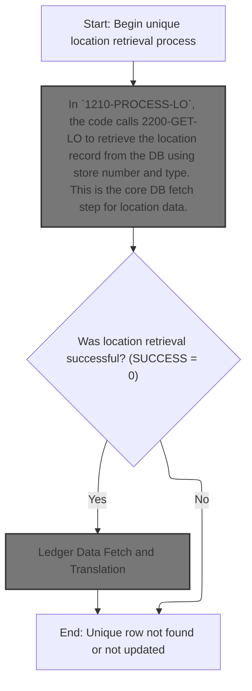
```mermaid
%%{init: {"flowchart": {"defaultRenderer": "elk"}} }%%
flowchart TD
  node1["Start: Begin unique location retrieval process"]
  click node1 openCode "base/src/WWWS0003.cbl:295:296"
  node1 --> node2["In `1210-PROCESS-LO`, the code calls 2200-GET-LO to retrieve the location record from the DB using store number and type. This is the core DB fetch step for location data."]
  
  node2 --> node3{"Was location retrieval successful? (SUCCESS = 0)"}
  click node3 openCode "base/src/WWWS0003.cbl:297:299"
  node3 -->|"Yes"| node4["Ledger Data Fetch and Translation"]
  
  node3 -->|"No"| node5["End: Unique row not found or not updated"]
  click node5 openCode "base/src/WWWS0003.cbl:295:302"
  node4 --> node5
classDef HeadingStyle fill:#777777,stroke:#333,stroke-width:2px;
click node2 goToHeading "In `1210-PROCESS-LO`, the code calls 2200-GET-LO to retrieve the location record from the DB using store number and type. This is the core DB fetch step for location data."
node2:::HeadingStyle
click node4 goToHeading "Ledger Data Fetch and Translation"
node4:::HeadingStyle

%% Swimm:
%% %%{init: {"flowchart": {"defaultRenderer": "elk"}} }%%
%% flowchart TD
%%   node1["Start: Begin unique location retrieval process"]
%%   click node1 openCode "<SwmPath>[base/src/WWWS0003.cbl](base/src/WWWS0003.cbl)</SwmPath>:295:296"
%%   node1 --> node2["In `<SwmToken path="base/src/WWWS0003.cbl" pos="296:4:8" line-data="032200     PERFORM 1210-PROCESS-LO                                      00032200">`1210-PROCESS-LO`</SwmToken>`, the code calls <SwmToken path="base/src/WWWS0003.cbl" pos="307:4:8" line-data="033300     PERFORM 2200-GET-LO                                          00033300">`2200-GET-LO`</SwmToken> to retrieve the location record from the DB using store number and type. This is the core DB fetch step for location data."]
%%   
%%   node2 --> node3{"Was location retrieval successful? (SUCCESS = 0)"}
%%   click node3 openCode "<SwmPath>[base/src/WWWS0003.cbl](base/src/WWWS0003.cbl)</SwmPath>:297:299"
%%   node3 -->|"Yes"| node4["Ledger Data Fetch and Translation"]
%%   
%%   node3 -->|"No"| node5["End: Unique row not found or not updated"]
%%   click node5 openCode "<SwmPath>[base/src/WWWS0003.cbl](base/src/WWWS0003.cbl)</SwmPath>:295:302"
%%   node4 --> node5
%% classDef HeadingStyle fill:#777777,stroke:#333,stroke-width:2px;
%% click node2 goToHeading "In `<SwmToken path="base/src/WWWS0003.cbl" pos="296:4:8" line-data="032200     PERFORM 1210-PROCESS-LO                                      00032200">`1210-PROCESS-LO`</SwmToken>`, the code calls <SwmToken path="base/src/WWWS0003.cbl" pos="307:4:8" line-data="033300     PERFORM 2200-GET-LO                                          00033300">`2200-GET-LO`</SwmToken> to retrieve the location record from the DB using store number and type. This is the core DB fetch step for location data."
%% node2:::HeadingStyle
%% click node4 goToHeading "Ledger Data Fetch and Translation"
%% node4:::HeadingStyle
```

This section governs the retrieval and translation of a unique location record, ensuring that only one record is processed and that subsequent steps are gated by the success of the retrieval.

| Category        | Rule Name                 | Description                                                                                                                                                               |
| --------------- | ------------------------- | ------------------------------------------------------------------------------------------------------------------------------------------------------------------------- |
| Data validation | Unique location retrieval | A location record must be retrieved using a combination of store number and store type. If no record matches these criteria, the process ends without further processing. |
| Data validation | Single record enforcement | Only one unique location record may be processed per invocation of this section; multiple matches or ambiguous results must not proceed to translation or further steps.  |
| Business logic  | Location data translation | If the location record is successfully retrieved (SUCCESS = 0), the record must be translated using an external translation service before any further processing occurs. |

<SwmSnippet path="/base/src/WWWS0003.cbl" line="295">

---

In <SwmToken path="base/src/WWWS0003.cbl" pos="295:2:10" line-data="032100 1200-EXIT-GET-UNIQUE-ROW.                                        00032100">`1200-EXIT-GET-UNIQUE-ROW`</SwmToken>, we start by calling <SwmToken path="base/src/WWWS0003.cbl" pos="296:4:8" line-data="032200     PERFORM 1210-PROCESS-LO                                      00032200">`1210-PROCESS-LO`</SwmToken> to fetch and translate the location record. This is the first step in a chain, each gated by the SUCCESS flag.

```cobol
032100 1200-EXIT-GET-UNIQUE-ROW.                                        00032100
032200     PERFORM 1210-PROCESS-LO                                      00032200
```

---

</SwmSnippet>

## In <SwmToken path="base/src/WWWS0003.cbl" pos="296:4:8" line-data="032200     PERFORM 1210-PROCESS-LO                                      00032200">`1210-PROCESS-LO`</SwmToken>, the code calls <SwmToken path="base/src/WWWS0003.cbl" pos="307:4:8" line-data="033300     PERFORM 2200-GET-LO                                          00033300">`2200-GET-LO`</SwmToken> to retrieve the location record from the DB using store number and type. This is the core DB fetch step for location data.

This section governs the retrieval of location records from the database based on store number and store type, ensuring that valid location data is returned or appropriate error handling is performed.

| Category       | Rule Name                 | Description                                                                                                                                                |
| -------------- | ------------------------- | ---------------------------------------------------------------------------------------------------------------------------------------------------------- |
| Business logic | Location record retrieval | A location record must be retrieved from the database using the provided store number and store type. If the record exists, the location data is returned. |

<SwmSnippet path="/base/src/WWWS0003.cbl" line="306">

---

In <SwmToken path="base/src/WWWS0003.cbl" pos="306:2:6" line-data="033200 1210-PROCESS-LO.                                                 00033200">`1210-PROCESS-LO`</SwmToken>, we call <SwmToken path="base/src/WWWS0003.cbl" pos="307:4:8" line-data="033300     PERFORM 2200-GET-LO                                          00033300">`2200-GET-LO`</SwmToken> to fetch the location record from the DB using store number and type. This is the core DB fetch step for location data.

```cobol
033200 1210-PROCESS-LO.                                                 00033200
033300     PERFORM 2200-GET-LO                                          00033300
```

---

</SwmSnippet>

### Location record retrieval from DB

This section governs the retrieval of a location record from the database, ensuring that the correct record is fetched and that any errors or failures are properly indicated through exit codes and error messages.

| Category        | Rule Name                         | Description                                                                                                                               |
| --------------- | --------------------------------- | ----------------------------------------------------------------------------------------------------------------------------------------- |
| Data validation | Valid file identifier enforcement | Only location records associated with valid file identifiers (as defined in the NNNN0000-FILE struct) may be retrieved.                   |
| Data validation | Key length restriction            | The key used to retrieve the location record must not exceed 255 characters in length.                                                    |
| Business logic  | Successful retrieval indication   | If the location record is successfully retrieved from the database, the exit code must be set to 0 and the success indicator must be set. |

See <SwmLink doc-title="Location Data Retrieval and Management Flow">[Location Data Retrieval and Management Flow](.swm%5Clocation-data-retrieval-and-management-flow.1jjqc8xw.sw.md)</SwmLink>

### Location translation after DB fetch

<SwmSnippet path="/base/src/WWWS0003.cbl" line="308">

---

Back in <SwmToken path="base/src/WWWS0003.cbl" pos="296:4:8" line-data="032200     PERFORM 1210-PROCESS-LO                                      00032200">`1210-PROCESS-LO`</SwmToken>, after <SwmToken path="base/src/WWWS0003.cbl" pos="307:4:8" line-data="033300     PERFORM 2200-GET-LO                                          00033300">`2200-GET-LO`</SwmToken>, if the fetch worked, we set a translation flag and call <SwmToken path="base/src/WWWS0003.cbl" pos="310:4:8" line-data="033600       PERFORM 2000-LO-TRANSLATION                                00033600">`2000-LO-TRANSLATION`</SwmToken> to convert the location data using an external service. This makes sure the data is usable for the next steps.

```cobol
033400     IF SUCCESS                                                   00033400
033500       SET YYYN111A-NEW-2-OLD TO TRUE                             00033500
033600       PERFORM 2000-LO-TRANSLATION                                00033600
033700     END-IF                                                       00033700
```

---

</SwmSnippet>

<SwmSnippet path="/base/src/WWWS0003.cbl" line="712">

---

<SwmToken path="base/src/WWWS0003.cbl" pos="712:2:6" line-data="073800 2000-LO-TRANSLATION.                                             00073800">`2000-LO-TRANSLATION`</SwmToken> just wraps a call to <SwmToken path="base/src/WWWS0003.cbl" pos="713:4:8" line-data="073900     CALL MMMSSS58-TRANSLATE-LO USING                             00073900">`MMMSSS58-TRANSLATE-LO`</SwmToken>, passing in all the required data structures for location translation. The actual logic is offloaded to that external program, so this section is just about delegating the work and assuming the parameters are set up right. If the parameters are wrong, things break, but there's no validation here—it's all trust.

```cobol
073800 2000-LO-TRANSLATION.                                             00073800
073900     CALL MMMSSS58-TRANSLATE-LO USING                             00073900
074000         XXXN001A                                                 00074000
074100         YYYN111A                                                 00074100
074200         P-DDDTLO01                                               00074200
074300         XXXPSTTT                                                 00074300
074400         P-DDDTRL01                                               00074400
074500     .                                                            00074500
```

---

</SwmSnippet>

## Ledger Record Retrieval and Processing

<SwmSnippet path="/base/src/WWWS0003.cbl" line="297">

---

Back in <SwmToken path="base/src/WWWS0003.cbl" pos="114:4:12" line-data="014000              PERFORM 1200-EXIT-GET-UNIQUE-ROW                    00014000">`1200-EXIT-GET-UNIQUE-ROW`</SwmToken>, after <SwmToken path="base/src/WWWS0003.cbl" pos="296:4:8" line-data="032200     PERFORM 1210-PROCESS-LO                                      00032200">`1210-PROCESS-LO`</SwmToken>, if SUCCESS is still set, we move on to <SwmToken path="base/src/WWWS0003.cbl" pos="298:4:8" line-data="032400       PERFORM 1220-PROCESS-LR                                    00032400">`1220-PROCESS-LR`</SwmToken>. This is where we fetch and process the ledger record, which is the next required piece of data for the operation. If the location fetch failed, we skip this step.

```cobol
032300     IF SUCCESS                                                   00032300
032400       PERFORM 1220-PROCESS-LR                                    00032400
032500     END-IF                                                       00032500
```

---

</SwmSnippet>

## Ledger Data Fetch and Translation

This section ensures that the latest ledger data for a store is available before any translation or update logic is executed. It acts as a gatekeeper, allowing further processing only if the ledger fetch is successful.

| Category        | Rule Name                        | Description                                                                                                                              |
| --------------- | -------------------------------- | ---------------------------------------------------------------------------------------------------------------------------------------- |
| Data validation | Store Identification Requirement | The fetch operation must use the store number and store type as input parameters to ensure the correct ledger record is retrieved.       |
| Data validation | Fetch Output Completeness        | The output of the ledger fetch must include both a status code and a result or error message to inform subsequent logic or user actions. |
| Business logic  | Ledger Data Prerequisite         | Ledger data must be fetched for the specified store before any translation or update logic is executed.                                  |

<SwmSnippet path="/base/src/WWWS0003.cbl" line="315">

---

In <SwmToken path="base/src/WWWS0003.cbl" pos="315:2:6" line-data="034100 1220-PROCESS-LR.                                                 00034100">`1220-PROCESS-LR`</SwmToken>, we immediately call <SwmToken path="base/src/WWWS0003.cbl" pos="316:4:8" line-data="034200     PERFORM 2210-GET-LR                                          00034200">`2210-GET-LR`</SwmToken> to fetch the ledger record for the store. This is needed because the rest of the logic depends on having the latest ledger data available. If this fetch fails, we can't continue with translation or updates.

```cobol
034100 1220-PROCESS-LR.                                                 00034100
034200     PERFORM 2210-GET-LR                                          00034200
```

---

</SwmSnippet>

### Ledger DB Fetch and DAO Call

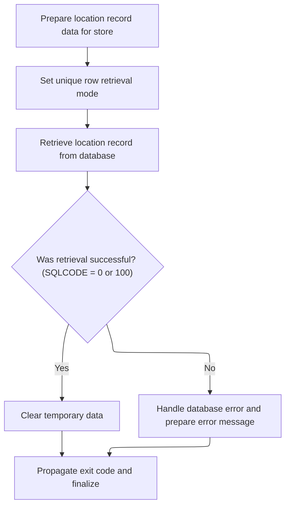
```mermaid
%%{init: {"flowchart": {"defaultRenderer": "elk"}} }%%
flowchart TD
    node1["Prepare location record data for store"] --> node2["Set unique row retrieval mode"]
    click node1 openCode "base/src/WWWS0003.cbl:858:862"
    click node2 openCode "base/src/WWWS0003.cbl:864:864"
    node2 --> node3["Retrieve location record from database"]
    click node3 openCode "base/src/WWWS0003.cbl:865:865"
    node3 --> node4{"Was retrieval successful? (SQLCODE = 0 or 100)"}
    click node4 openCode "base/src/WWWS0003.cbl:867:868"
    node4 -->|"Yes"| node5["Clear temporary data"]
    click node5 openCode "base/src/WWWS0003.cbl:870:870"
    node4 -->|"No"| node6["Handle database error and prepare error message"]
    click node6 openCode "base/src/WWWS0003.cbl:872:875"
    node5 --> node7["Propagate exit code and finalize"]
    click node7 openCode "base/src/WWWS0003.cbl:877:878"
    node6 --> node7
classDef HeadingStyle fill:#777777,stroke:#333,stroke-width:2px;

%% Swimm:
%% %%{init: {"flowchart": {"defaultRenderer": "elk"}} }%%
%% flowchart TD
%%     node1["Prepare location record data for store"] --> node2["Set unique row retrieval mode"]
%%     click node1 openCode "<SwmPath>[base/src/WWWS0003.cbl](base/src/WWWS0003.cbl)</SwmPath>:858:862"
%%     click node2 openCode "<SwmPath>[base/src/WWWS0003.cbl](base/src/WWWS0003.cbl)</SwmPath>:864:864"
%%     node2 --> node3["Retrieve location record from database"]
%%     click node3 openCode "<SwmPath>[base/src/WWWS0003.cbl](base/src/WWWS0003.cbl)</SwmPath>:865:865"
%%     node3 --> node4{"Was retrieval successful? (SQLCODE = 0 or 100)"}
%%     click node4 openCode "<SwmPath>[base/src/WWWS0003.cbl](base/src/WWWS0003.cbl)</SwmPath>:867:868"
%%     node4 -->|"Yes"| node5["Clear temporary data"]
%%     click node5 openCode "<SwmPath>[base/src/WWWS0003.cbl](base/src/WWWS0003.cbl)</SwmPath>:870:870"
%%     node4 -->|"No"| node6["Handle database error and prepare error message"]
%%     click node6 openCode "<SwmPath>[base/src/WWWS0003.cbl](base/src/WWWS0003.cbl)</SwmPath>:872:875"
%%     node5 --> node7["Propagate exit code and finalize"]
%%     click node7 openCode "<SwmPath>[base/src/WWWS0003.cbl](base/src/WWWS0003.cbl)</SwmPath>:877:878"
%%     node6 --> node7
%% classDef HeadingStyle fill:#777777,stroke:#333,stroke-width:2px;
```

This section is responsible for fetching a specific ledger record from the database using store number and type, ensuring only one unique record is retrieved, and handling the result appropriately for downstream processing.

| Category        | Rule Name                         | Description                                                                                                                                                                                     |
| --------------- | --------------------------------- | ----------------------------------------------------------------------------------------------------------------------------------------------------------------------------------------------- |
| Data validation | Success or no data found handling | If the database retrieval result code (SQLCODE) is 0 (success) or 100 (no data found), the system must clear any temporary data and reset state or flags to ensure clean downstream processing. |

<SwmSnippet path="/base/src/WWWS0003.cbl" line="858">

---

In <SwmToken path="base/src/WWWS0003.cbl" pos="858:2:6" line-data="088400 2210-GET-LR.                                                     00088400">`2210-GET-LR`</SwmToken>, after prepping the ledger record structure with store number and type, we call <SwmToken path="base/src/WWWS0003.cbl" pos="865:4:10" line-data="089100     PERFORM 2110-CALL-LR-DAO                                     00089100">`2110-CALL-LR-DAO`</SwmToken>. That's the part that actually talks to the DB and gets the ledger data. Without this call, we wouldn't have the info we need for the rest of the flow.

```cobol
088400 2210-GET-LR.                                                     00088400
088500     MOVE NNNN0000-EXIT-CODES TO WS-NNNN0000-EXIT-CODES           00088500
088600     INITIALIZE P-DDDTLR01                                        00088600
088700     MOVE ST-STORE-NUMBER    TO LOC-NBR    OF P-DDDTLR01          00088700
088800     MOVE ST-STORE-TYPE      TO LOC-TYP-CD OF P-DDDTLR01          00088800
088900                                                                  00088900
089000     SET  EXIT-GET-UNIQUE-ROW TO TRUE                             00089000
089100     PERFORM 2110-CALL-LR-DAO                                     00089100
```

---

</SwmSnippet>

<SwmSnippet path="/base/src/WWWS0003.cbl" line="787">

---

<SwmToken path="base/src/WWWS0003.cbl" pos="787:2:8" line-data="081300 2110-CALL-LR-DAO.                                                00081300">`2110-CALL-LR-DAO`</SwmToken> just calls <SwmToken path="base/src/WWWS0003.cbl" pos="15:20:20" line-data="004100     05 WS-LR-DAO                       PIC X(8) VALUE &#39;NNNS0488&#39;.00004100">`NNNS0488`</SwmToken>, passing all the required parameters for the ledger DB operation. <SwmToken path="base/src/WWWS0003.cbl" pos="15:20:20" line-data="004100     05 WS-LR-DAO                       PIC X(8) VALUE &#39;NNNS0488&#39;.00004100">`NNNS0488`</SwmToken> does the actual DB work—query, update, whatever's needed—and returns the result. The main code doesn't care about the details, just the outcome.

```cobol
081300 2110-CALL-LR-DAO.                                                00081300
081400     CALL WS-LR-DAO USING                                         00081400
081500         XXXN001A                                                 00081500
081600         SQLCA                                                    00081600
081700         YYYN005A                                                 00081700
081800         NNNN0000-PARMS                                           00081800
081900         P-DDDTLR01                                               00081900
082000     .                                                            00082000
```

---

</SwmSnippet>

<SwmSnippet path="/base/src/WWWS0003.cbl" line="867">

---

Back in <SwmToken path="base/src/WWWS0003.cbl" pos="316:4:8" line-data="034200     PERFORM 2210-GET-LR                                          00034200">`2210-GET-LR`</SwmToken>, after the DAO call, we check SQLCODE. If it's 0 or 100, we reset state or flags. If it's anything else, we handle the DB error and set up a message with the SQL code for logging or user feedback.

```cobol
089300     EVALUATE TRUE                                                00089300
089400       WHEN SQLCODE = 0                                           00089400
089500       OR   SQLCODE = 100                                         00089500
089600         INITIALIZE XXXN001A                                      00089600
089700       WHEN OTHER                                                 00089700
089800         PERFORM 9999-SETUP-DB2-ERROR                             00089800
089900         STRING 'WWWS0003 - Failed on Ret-Loc table(LR),SQL='     00089900
090000                 WS-SQLCODE                                       00090000
090100                 DELIMITED BY SIZE INTO IS-RTRN-MSG-TXT           00090100
090200     END-EVALUATE                                                 00090200
090300     MOVE WS-NNNN0000-EXIT-CODES TO NNNN0000-EXIT-CODES           00090300
090400     .                                                            00090400
```

---

</SwmSnippet>

### Ledger Record Translation and Ad Zone Update

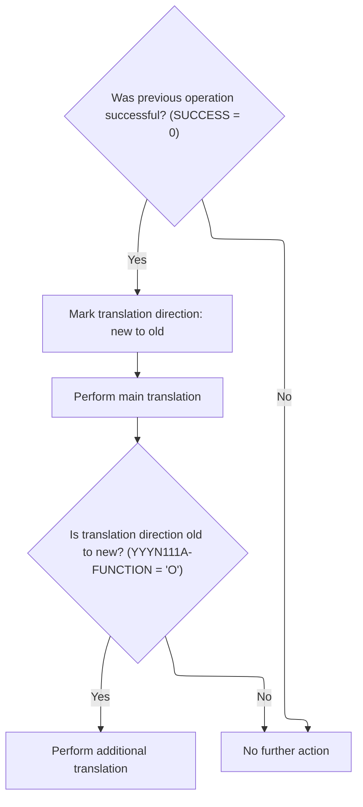
```mermaid
%%{init: {"flowchart": {"defaultRenderer": "elk"}} }%%
flowchart TD
    node1{"Was previous operation successful? (SUCCESS = 0)"}
    click node1 openCode "base/src/WWWS0003.cbl:317:320"
    node1 -->|"Yes"| node2["Mark translation direction: new to old"]
    click node2 openCode "base/src/WWWS0003.cbl:318:318"
    node2 --> node3["Perform main translation"]
    click node3 openCode "base/src/WWWS0003.cbl:319:319"
    node3 --> node4{"Is translation direction old to new? (YYYN111A-FUNCTION = 'O')"}
    click node4 openCode "base/src/WWWS0003.cbl:730:732"
    node4 -->|"Yes"| node5["Perform additional translation"]
    click node5 openCode "base/src/WWWS0003.cbl:731:731"
    node4 -->|"No"| node6["No further action"]
    node1 -->|"No"| node6
classDef HeadingStyle fill:#777777,stroke:#333,stroke-width:2px;

%% Swimm:
%% %%{init: {"flowchart": {"defaultRenderer": "elk"}} }%%
%% flowchart TD
%%     node1{"Was previous operation successful? (SUCCESS = 0)"}
%%     click node1 openCode "<SwmPath>[base/src/WWWS0003.cbl](base/src/WWWS0003.cbl)</SwmPath>:317:320"
%%     node1 -->|"Yes"| node2["Mark translation direction: new to old"]
%%     click node2 openCode "<SwmPath>[base/src/WWWS0003.cbl](base/src/WWWS0003.cbl)</SwmPath>:318:318"
%%     node2 --> node3["Perform main translation"]
%%     click node3 openCode "<SwmPath>[base/src/WWWS0003.cbl](base/src/WWWS0003.cbl)</SwmPath>:319:319"
%%     node3 --> node4{"Is translation direction old to new? (YYYN111A-FUNCTION = 'O')"}
%%     click node4 openCode "<SwmPath>[base/src/WWWS0003.cbl](base/src/WWWS0003.cbl)</SwmPath>:730:732"
%%     node4 -->|"Yes"| node5["Perform additional translation"]
%%     click node5 openCode "<SwmPath>[base/src/WWWS0003.cbl](base/src/WWWS0003.cbl)</SwmPath>:731:731"
%%     node4 -->|"No"| node6["No further action"]
%%     node1 -->|"No"| node6
%% classDef HeadingStyle fill:#777777,stroke:#333,stroke-width:2px;
```

<SwmSnippet path="/base/src/WWWS0003.cbl" line="317">

---

Back in <SwmToken path="base/src/WWWS0003.cbl" pos="298:4:8" line-data="032400       PERFORM 1220-PROCESS-LR                                    00032400">`1220-PROCESS-LR`</SwmToken>, after getting the ledger record, if SUCCESS is set, we flip the new-to-old flag and call <SwmToken path="base/src/WWWS0003.cbl" pos="319:4:8" line-data="034500       PERFORM 2010-LR-TRANSLATION                                00034500">`2010-LR-TRANSLATION`</SwmToken>. This step converts the ledger data for downstream use.

```cobol
034300     IF SUCCESS                                                   00034300
034400       SET YYYN111A-NEW-2-OLD TO TRUE                             00034400
034500       PERFORM 2010-LR-TRANSLATION                                00034500
034600     END-IF                                                       00034600
```

---

</SwmSnippet>

<SwmSnippet path="/base/src/WWWS0003.cbl" line="722">

---

<SwmToken path="base/src/WWWS0003.cbl" pos="722:2:6" line-data="074800 2010-LR-TRANSLATION.                                             00074800">`2010-LR-TRANSLATION`</SwmToken> calls <SwmToken path="base/src/WWWS0003.cbl" pos="723:4:8" line-data="074900     CALL MMMSSS60-TRANSLATE-LR USING                             00074900">`MMMSSS60-TRANSLATE-LR`</SwmToken> to handle the ledger translation. If the old-to-new flag is set, it also runs <SwmToken path="base/src/WWWS0003.cbl" pos="731:4:8" line-data="075700       PERFORM 2015-AA-TRANSLATION                                00075700">`2015-AA-TRANSLATION`</SwmToken> to fetch ad zone info from the DB. This covers both standard and special conversion cases.

```cobol
074800 2010-LR-TRANSLATION.                                             00074800
074900     CALL MMMSSS60-TRANSLATE-LR USING                             00074900
075000         XXXN001A                                                 00075000
075100         YYYN111A                                                 00075100
075200         P-DDDTLR01                                               00075200
075300         XXXPSTTT                                                 00075300
075400         P-DDDTRL01                                               00075400
075500                                                                  00075500
075600     IF YYYN111A-OLD-2-NEW                                        00075600
075700       PERFORM 2015-AA-TRANSLATION                                00075700
075800     END-IF                                                       00075800
```

---

</SwmSnippet>

## Class Zone Retrieval and Czech Translation

<SwmSnippet path="/base/src/WWWS0003.cbl" line="300">

---

After location and ledger, <SwmToken path="base/src/WWWS0003.cbl" pos="114:4:12" line-data="014000              PERFORM 1200-EXIT-GET-UNIQUE-ROW                    00014000">`1200-EXIT-GET-UNIQUE-ROW`</SwmToken> checks for class zones and translates them if needed.

```cobol
032600     IF SUCCESS                                                   00032600
032700       PERFORM 1230-PROCESS-CZ                                    00032700
032800     END-IF                                                       00032800
```

---

</SwmSnippet>

# Class Zone Initialization

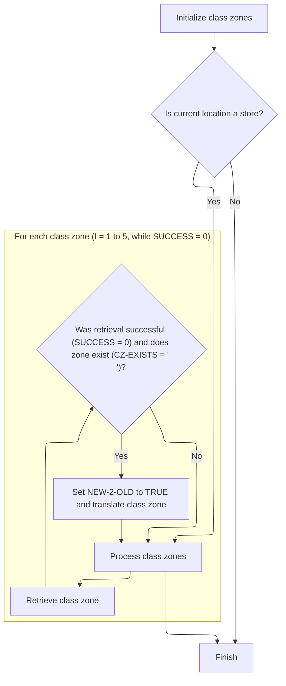
```mermaid
%%{init: {"flowchart": {"defaultRenderer": "elk"}} }%%
flowchart TD
    node1["Initialize class zones"]
    click node1 openCode "base/src/WWWS0003.cbl:324:325"
    node1 --> node2{"Is current location a store?"}
    click node2 openCode "base/src/WWWS0003.cbl:326:335"
    node2 -->|"Yes"| node3["Process class zones"]
    node2 -->|"No"| node6["Finish"]
    subgraph loop1["For each class zone (I = 1 to 5, while SUCCESS = 0)"]
        node3 --> node4["Retrieve class zone"]
        click node4 openCode "base/src/WWWS0003.cbl:329:329"
        node4 --> node5{"Was retrieval successful (SUCCESS = 0) and does zone exist (CZ-EXISTS = ' ')?"}
        click node5 openCode "base/src/WWWS0003.cbl:330:333"
        node5 -->|"Yes"| node8["Set NEW-2-OLD to TRUE and translate class zone"]
        click node8 openCode "base/src/WWWS0003.cbl:331:332"
        node5 -->|"No"| node3
        node8 --> node3
    end
    node3 --> node6["Finish"]
    click node6 openCode "base/src/WWWS0003.cbl:335:335"
classDef HeadingStyle fill:#777777,stroke:#333,stroke-width:2px;

%% Swimm:
%% %%{init: {"flowchart": {"defaultRenderer": "elk"}} }%%
%% flowchart TD
%%     node1["Initialize class zones"]
%%     click node1 openCode "<SwmPath>[base/src/WWWS0003.cbl](base/src/WWWS0003.cbl)</SwmPath>:324:325"
%%     node1 --> node2{"Is current location a store?"}
%%     click node2 openCode "<SwmPath>[base/src/WWWS0003.cbl](base/src/WWWS0003.cbl)</SwmPath>:326:335"
%%     node2 -->|"Yes"| node3["Process class zones"]
%%     node2 -->|"No"| node6["Finish"]
%%     subgraph loop1["For each class zone (I = 1 to 5, while SUCCESS = 0)"]
%%         node3 --> node4["Retrieve class zone"]
%%         click node4 openCode "<SwmPath>[base/src/WWWS0003.cbl](base/src/WWWS0003.cbl)</SwmPath>:329:329"
%%         node4 --> node5{"Was retrieval successful (SUCCESS = 0) and does zone exist (<SwmToken path="base/src/WWWS0003.cbl" pos="330:8:10" line-data="035600         IF SUCCESS AND CZ-EXISTS                                 00035600">`CZ-EXISTS`</SwmToken> = ' ')?"}
%%         click node5 openCode "<SwmPath>[base/src/WWWS0003.cbl](base/src/WWWS0003.cbl)</SwmPath>:330:333"
%%         node5 -->|"Yes"| node8["Set <SwmToken path="base/src/WWWS0003.cbl" pos="309:6:10" line-data="033500       SET YYYN111A-NEW-2-OLD TO TRUE                             00033500">`NEW-2-OLD`</SwmToken> to TRUE and translate class zone"]
%%         click node8 openCode "<SwmPath>[base/src/WWWS0003.cbl](base/src/WWWS0003.cbl)</SwmPath>:331:332"
%%         node5 -->|"No"| node3
%%         node8 --> node3
%%     end
%%     node3 --> node6["Finish"]
%%     click node6 openCode "<SwmPath>[base/src/WWWS0003.cbl](base/src/WWWS0003.cbl)</SwmPath>:335:335"
%% classDef HeadingStyle fill:#777777,stroke:#333,stroke-width:2px;
```

The main product role of this section is to ensure that all relevant class zones for a store are identified, validated for existence, and translated as needed, supporting downstream business logic that depends on accurate zone setup.

| Category        | Rule Name                              | Description                                                                                                                                                                                                                                                                                             |
| --------------- | -------------------------------------- | ------------------------------------------------------------------------------------------------------------------------------------------------------------------------------------------------------------------------------------------------------------------------------------------------------- |
| Data validation | Store location requirement             | Class zone processing only occurs if the current location is identified as a store.                                                                                                                                                                                                                     |
| Data validation | Class zone existence validation        | Each class zone is only processed if retrieval is successful (SUCCESS = 0) and the zone exists (<SwmToken path="base/src/WWWS0003.cbl" pos="330:8:10" line-data="035600         IF SUCCESS AND CZ-EXISTS                                 00035600">`CZ-EXISTS`</SwmToken> = ' ').                       |
| Business logic  | Class zone initialization prerequisite | Class zones must be initialized before any processing or validation occurs for a store location.                                                                                                                                                                                                        |
| Business logic  | Class zone maximum limit               | A maximum of five class zones (<SwmToken path="base/src/WWWS0003.cbl" pos="328:8:12" line-data="035400           UNTIL I &gt; K-CZ-MAX OR NOT SUCCESS                      00035400">`K-CZ-MAX`</SwmToken> = 5) may be processed for each store location.                                               |
| Business logic  | Class zone translation and marking     | When a class zone is successfully retrieved and exists, it must be translated to Czech and marked as processed (<SwmToken path="base/src/WWWS0003.cbl" pos="309:6:10" line-data="033500       SET YYYN111A-NEW-2-OLD TO TRUE                             00033500">`NEW-2-OLD`</SwmToken> set to TRUE). |

<SwmSnippet path="/base/src/WWWS0003.cbl" line="324">

---

In <SwmToken path="base/src/WWWS0003.cbl" pos="324:2:6" line-data="035000 1230-PROCESS-CZ.                                                 00035000">`1230-PROCESS-CZ`</SwmToken>, we kick things off by initializing the class zones with <SwmToken path="base/src/WWWS0003.cbl" pos="325:4:10" line-data="035100     PERFORM 1235-INIT-CLASS-ZONES                                00035100">`1235-INIT-CLASS-ZONES`</SwmToken>. This sets up the structures so we can check and process each zone in the next steps.

```cobol
035000 1230-PROCESS-CZ.                                                 00035000
035100     PERFORM 1235-INIT-CLASS-ZONES                                00035100
```

---

</SwmSnippet>

<SwmSnippet path="/base/src/WWWS0003.cbl" line="326">

---

After initializing, <SwmToken path="base/src/WWWS0003.cbl" pos="301:4:8" line-data="032700       PERFORM 1230-PROCESS-CZ                                    00032700">`1230-PROCESS-CZ`</SwmToken> loops through up to five possible class zones for the store. For each, it calls <SwmToken path="base/src/WWWS0003.cbl" pos="329:4:8" line-data="035500         PERFORM 2220-GET-CZ                                      00035500">`2220-GET-CZ`</SwmToken> to check if the zone exists, and if it does, translates it to Czech.

```cobol
035200     IF ST-XXX-STORE                                              00035200
035300       PERFORM VARYING I FROM 1 BY 1                              00035300
035400           UNTIL I > K-CZ-MAX OR NOT SUCCESS                      00035400
035500         PERFORM 2220-GET-CZ                                      00035500
035600         IF SUCCESS AND CZ-EXISTS                                 00035600
035700           SET YYYN111A-NEW-2-OLD TO TRUE                         00035700
035800           PERFORM 2020-CZ-TRANSLATION                            00035800
035900         END-IF                                                   00035900
036000       END-PERFORM                                                00036000
036100     END-IF                                                       00036100
```

---

</SwmSnippet>

# Class Zone DB Check and DAO Call

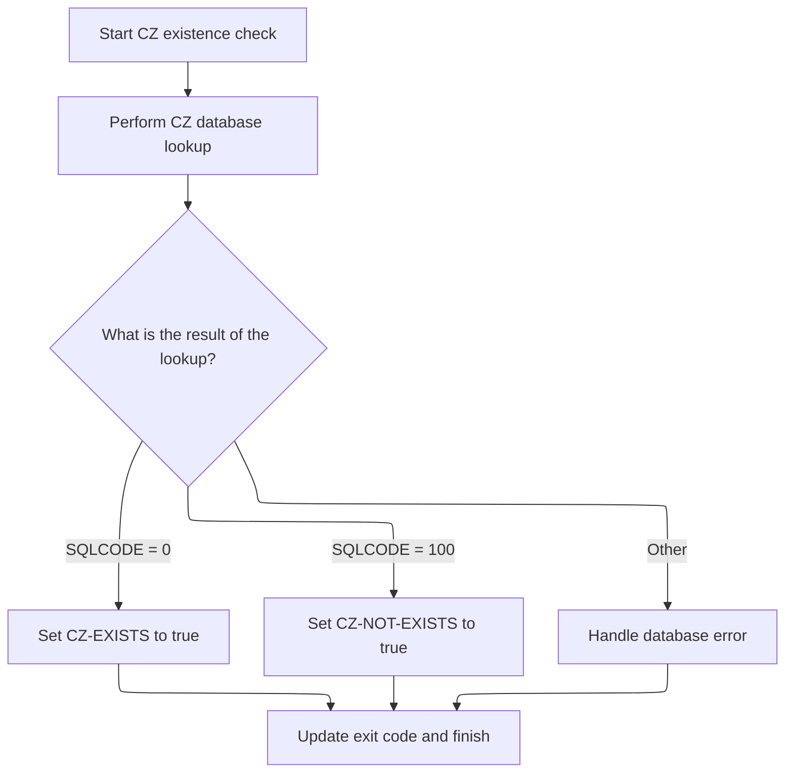
```mermaid
%%{init: {"flowchart": {"defaultRenderer": "elk"}} }%%
flowchart TD
    node1["Start CZ existence check"]
    click node1 openCode "base/src/WWWS0003.cbl:881:888"
    node1 --> node2["Perform CZ database lookup"]
    click node2 openCode "base/src/WWWS0003.cbl:889:890"
    node2 --> node3{"What is the result of the lookup?"}
    click node3 openCode "base/src/WWWS0003.cbl:891:892"
    node3 -->|"SQLCODE = 0"| node4["Set CZ-EXISTS to true"]
    click node4 openCode "base/src/WWWS0003.cbl:893:893"
    node3 -->|"SQLCODE = 100"| node5["Set CZ-NOT-EXISTS to true"]
    click node5 openCode "base/src/WWWS0003.cbl:895:896"
    node3 -->|"Other"| node6["Handle database error"]
    click node6 openCode "base/src/WWWS0003.cbl:898:901"
    node4 --> node7["Update exit code and finish"]
    node5 --> node7
    node6 --> node7
    click node7 openCode "base/src/WWWS0003.cbl:903:904"
classDef HeadingStyle fill:#777777,stroke:#333,stroke-width:2px;

%% Swimm:
%% %%{init: {"flowchart": {"defaultRenderer": "elk"}} }%%
%% flowchart TD
%%     node1["Start CZ existence check"]
%%     click node1 openCode "<SwmPath>[base/src/WWWS0003.cbl](base/src/WWWS0003.cbl)</SwmPath>:881:888"
%%     node1 --> node2["Perform CZ database lookup"]
%%     click node2 openCode "<SwmPath>[base/src/WWWS0003.cbl](base/src/WWWS0003.cbl)</SwmPath>:889:890"
%%     node2 --> node3{"What is the result of the lookup?"}
%%     click node3 openCode "<SwmPath>[base/src/WWWS0003.cbl](base/src/WWWS0003.cbl)</SwmPath>:891:892"
%%     node3 -->|"SQLCODE = 0"| node4["Set <SwmToken path="base/src/WWWS0003.cbl" pos="330:8:10" line-data="035600         IF SUCCESS AND CZ-EXISTS                                 00035600">`CZ-EXISTS`</SwmToken> to true"]
%%     click node4 openCode "<SwmPath>[base/src/WWWS0003.cbl](base/src/WWWS0003.cbl)</SwmPath>:893:893"
%%     node3 -->|"SQLCODE = 100"| node5["Set <SwmToken path="base/src/WWWS0003.cbl" pos="528:4:8" line-data="055400         IF CZ-NOT-EXISTS                                         00055400">`CZ-NOT-EXISTS`</SwmToken> to true"]
%%     click node5 openCode "<SwmPath>[base/src/WWWS0003.cbl](base/src/WWWS0003.cbl)</SwmPath>:895:896"
%%     node3 -->|"Other"| node6["Handle database error"]
%%     click node6 openCode "<SwmPath>[base/src/WWWS0003.cbl](base/src/WWWS0003.cbl)</SwmPath>:898:901"
%%     node4 --> node7["Update exit code and finish"]
%%     node5 --> node7
%%     node6 --> node7
%%     click node7 openCode "<SwmPath>[base/src/WWWS0003.cbl](base/src/WWWS0003.cbl)</SwmPath>:903:904"
%% classDef HeadingStyle fill:#777777,stroke:#333,stroke-width:2px;
```

This section governs the process for checking the existence of a class zone in the database for a given store and class code, and sets appropriate flags and exit codes based on the result.

| Category        | Rule Name                              | Description                                                                                                                                                                                                                                                                                                                                                                      |
| --------------- | -------------------------------------- | -------------------------------------------------------------------------------------------------------------------------------------------------------------------------------------------------------------------------------------------------------------------------------------------------------------------------------------------------------------------------------- |
| Data validation | Data Structure Preparation Requirement | The class zone check must only be performed after the relevant data structure (<SwmToken path="base/src/WWWS0003.cbl" pos="464:22:24" line-data="049000     MOVE WS-CZ (I) TO ITM-CLS-CD OF P-DDDTCZ01                   00049000">`P-DDDTCZ01`</SwmToken>) is initialized and populated with the store type, store number, and class code.                                      |
| Business logic  | Class Zone Exists Flag                 | If the database lookup for the class zone returns SQLCODE = 0, the system must set the <SwmToken path="base/src/WWWS0003.cbl" pos="330:8:10" line-data="035600         IF SUCCESS AND CZ-EXISTS                                 00035600">`CZ-EXISTS`</SwmToken> flag to true, indicating the class zone exists for the provided parameters.                                     |
| Business logic  | Class Zone Not Exists Flag             | If the database lookup for the class zone returns SQLCODE = 100, the system must set the <SwmToken path="base/src/WWWS0003.cbl" pos="528:4:8" line-data="055400         IF CZ-NOT-EXISTS                                         00055400">`CZ-NOT-EXISTS`</SwmToken> flag to true and reset SQLCODE to 0, indicating the class zone does not exist for the provided parameters. |
| Business logic  | Exit Code Update                       | The system must always update the exit code after processing the class zone check, regardless of the outcome, to ensure downstream processes receive the correct status.                                                                                                                                                                                                         |

<SwmSnippet path="/base/src/WWWS0003.cbl" line="881">

---

In <SwmToken path="base/src/WWWS0003.cbl" pos="881:2:6" line-data="090700 2220-GET-CZ.                                                     00090700">`2220-GET-CZ`</SwmToken>, we prep the <SwmToken path="base/src/WWWS0003.cbl" pos="884:4:6" line-data="091000     INITIALIZE P-DDDTCZ01                                        00091000">`P-DDDTCZ01`</SwmToken> structure with store type, number, and class code, then call <SwmToken path="base/src/WWWS0003.cbl" pos="889:4:10" line-data="091500     PERFORM 2120-CALL-CZ-DAO                                     00091500">`2120-CALL-CZ-DAO`</SwmToken> to check the DB for the zone. The flags and data structures are all domain-specific, so you have to know the repo to follow this.

```cobol
090700 2220-GET-CZ.                                                     00090700
090800     MOVE NNNN0000-EXIT-CODES TO WS-NNNN0000-EXIT-CODES           00090800
090900                                                                  00090900
091000     INITIALIZE P-DDDTCZ01                                        00091000
091100     MOVE ST-STORE-TYPE       TO LOC-TYP-CD OF P-DDDTCZ01         00091100
091200     MOVE ST-STORE-NUMBER     TO LOC-NBR    OF P-DDDTCZ01         00091200
091300     MOVE WS-CZ (I)           TO ITM-CLS-CD OF P-DDDTCZ01         00091300
091400     SET  EXIT-GET-UNIQUE-ROW TO TRUE                             00091400
091500     PERFORM 2120-CALL-CZ-DAO                                     00091500
```

---

</SwmSnippet>

<SwmSnippet path="/base/src/WWWS0003.cbl" line="797">

---

<SwmToken path="base/src/WWWS0003.cbl" pos="797:2:8" line-data="082300 2120-CALL-CZ-DAO.                                                00082300">`2120-CALL-CZ-DAO`</SwmToken> just calls <SwmToken path="base/src/WWWS0003.cbl" pos="16:20:20" line-data="004200     05 WS-CZ-DAO                       PIC X(8) VALUE &#39;NNNS0473&#39;.00004200">`NNNS0473`</SwmToken>, passing all the required parameters for the class zone DB operation. <SwmToken path="base/src/WWWS0003.cbl" pos="16:20:20" line-data="004200     05 WS-CZ-DAO                       PIC X(8) VALUE &#39;NNNS0473&#39;.00004200">`NNNS0473`</SwmToken> does the actual DB work and returns the result. The main code just cares about the outcome.

```cobol
082300 2120-CALL-CZ-DAO.                                                00082300
082400     CALL WS-CZ-DAO USING                                         00082400
082500         XXXN001A                                                 00082500
082600         SQLCA                                                    00082600
082700         YYYN005A                                                 00082700
082800         NNNN0000-PARMS                                           00082800
082900         P-DDDTCZ01                                               00082900
083000     .                                                            00083000
```

---

</SwmSnippet>

<SwmSnippet path="/base/src/WWWS0003.cbl" line="891">

---

Back in <SwmToken path="base/src/WWWS0003.cbl" pos="329:4:8" line-data="035500         PERFORM 2220-GET-CZ                                      00035500">`2220-GET-CZ`</SwmToken>, after the DAO call, we check SQLCODE. If it's 0, we set <SwmToken path="base/src/WWWS0003.cbl" pos="893:4:6" line-data="091900         SET CZ-EXISTS TO TRUE                                    00091900">`CZ-EXISTS`</SwmToken>; if 100, we set <SwmToken path="base/src/WWWS0003.cbl" pos="895:4:8" line-data="092100         SET CZ-NOT-EXISTS TO TRUE                                00092100">`CZ-NOT-EXISTS`</SwmToken> and reset SQLCODE. For other errors, we handle the DB error and set up a message with the SQL code.

```cobol
091700     EVALUATE TRUE                                                00091700
091800       WHEN SQLCODE = 0                                           00091800
091900         SET CZ-EXISTS TO TRUE                                    00091900
092000       WHEN SQLCODE = 100                                         00092000
092100         SET CZ-NOT-EXISTS TO TRUE                                00092100
092200         MOVE 0            TO SQLCODE                             00092200
092300       WHEN OTHER                                                 00092300
092400         PERFORM 9999-SETUP-DB2-ERROR                             00092400
092500         STRING 'WWWS0003 - Failed on Cls-Zne table(CZ),SQL='     00092500
092600                 WS-SQLCODE                                       00092600
092700                 DELIMITED BY SIZE INTO IS-RTRN-MSG-TXT           00092700
092800     END-EVALUATE                                                 00092800
092900     MOVE WS-NNNN0000-EXIT-CODES TO NNNN0000-EXIT-CODES           00092900
093000     .                                                            00093000
```

---

</SwmSnippet>

# Row Modification: Location Update

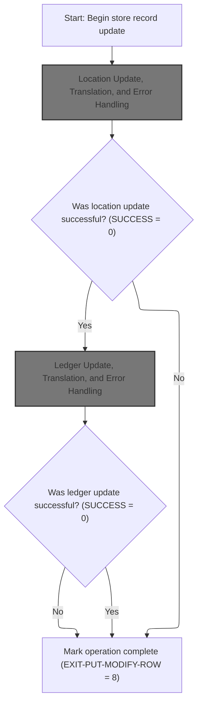
```mermaid
%%{init: {"flowchart": {"defaultRenderer": "elk"}} }%%
flowchart TD
    node1["Start: Begin store record update"] --> node2["Location Update, Translation, and Error Handling"]
    click node1 openCode "base/src/WWWS0003.cbl:364:365"
    
    node2 --> node3{"Was location update successful? (SUCCESS = 0)"}
    click node3 openCode "base/src/WWWS0003.cbl:366:368"
    node3 -->|"Yes"| node4["Ledger Update, Translation, and Error Handling"]
    
    node3 -->|"No"| node5["Mark operation complete (EXIT-PUT-MODIFY-ROW = 8)"]
    click node5 openCode "base/src/WWWS0003.cbl:369:373"
    node4 --> node6{"Was ledger update successful? (SUCCESS = 0)"}
    click node6 openCode "base/src/WWWS0003.cbl:369:371"
    node6 -->|"Yes"| node5
    node6 -->|"No"| node5

classDef HeadingStyle fill:#777777,stroke:#333,stroke-width:2px;
click node2 goToHeading "Location Update, Translation, and Error Handling"
node2:::HeadingStyle
click node4 goToHeading "Ledger Update, Translation, and Error Handling"
node4:::HeadingStyle

%% Swimm:
%% %%{init: {"flowchart": {"defaultRenderer": "elk"}} }%%
%% flowchart TD
%%     node1["Start: Begin store record update"] --> node2["Location Update, Translation, and Error Handling"]
%%     click node1 openCode "<SwmPath>[base/src/WWWS0003.cbl](base/src/WWWS0003.cbl)</SwmPath>:364:365"
%%     
%%     node2 --> node3{"Was location update successful? (SUCCESS = 0)"}
%%     click node3 openCode "<SwmPath>[base/src/WWWS0003.cbl](base/src/WWWS0003.cbl)</SwmPath>:366:368"
%%     node3 -->|"Yes"| node4["Ledger Update, Translation, and Error Handling"]
%%     
%%     node3 -->|"No"| node5["Mark operation complete (<SwmToken path="base/src/WWWS0003.cbl" pos="117:4:10" line-data="014300           WHEN EXIT-PUT-MODIFY-ROW                               00014300">`EXIT-PUT-MODIFY-ROW`</SwmToken> = 8)"]
%%     click node5 openCode "<SwmPath>[base/src/WWWS0003.cbl](base/src/WWWS0003.cbl)</SwmPath>:369:373"
%%     node4 --> node6{"Was ledger update successful? (SUCCESS = 0)"}
%%     click node6 openCode "<SwmPath>[base/src/WWWS0003.cbl](base/src/WWWS0003.cbl)</SwmPath>:369:371"
%%     node6 -->|"Yes"| node5
%%     node6 -->|"No"| node5
%% 
%% classDef HeadingStyle fill:#777777,stroke:#333,stroke-width:2px;
%% click node2 goToHeading "Location Update, Translation, and Error Handling"
%% node2:::HeadingStyle
%% click node4 goToHeading "Ledger Update, Translation, and Error Handling"
%% node4:::HeadingStyle
```

This section governs the business logic for updating a store's location and ledger records, ensuring that both are processed in sequence and that errors are handled appropriately. It determines whether the operation is successful or should be marked as complete with an error code.

| Category       | Rule Name                            | Description                                                                                                                                                                                                                                                       |
| -------------- | ------------------------------------ | ----------------------------------------------------------------------------------------------------------------------------------------------------------------------------------------------------------------------------------------------------------------- |
| Business logic | Mandatory Location Update            | A location update must be attempted for every store record modification request. If the location update is successful (SUCCESS = 0), the process continues to update the ledger record. If unsuccessful, the operation is marked complete with an exit code of 8. |
| Business logic | Ledger Update After Location Success | If the location update is successful, a ledger update must be attempted. If the ledger update fails, the operation is still marked complete with exit code 8.                                                                                                     |
| Business logic | Operation Completion Requirement     | The operation is considered complete only after either a successful ledger update or any failure in location or ledger update, and must be marked with the appropriate exit code.                                                                                 |

<SwmSnippet path="/base/src/WWWS0003.cbl" line="364">

---

<SwmToken path="base/src/WWWS0003.cbl" pos="364:2:10" line-data="039000 1400-EXIT-PUT-MODIFY-ROW.                                        00039000">`1400-EXIT-PUT-MODIFY-ROW`</SwmToken> starts by updating the location record.

```cobol
039000 1400-EXIT-PUT-MODIFY-ROW.                                        00039000
039100     PERFORM 1410-PROCESS-LO                                      00039100
```

---

</SwmSnippet>

## Location Update, Translation, and Error Handling

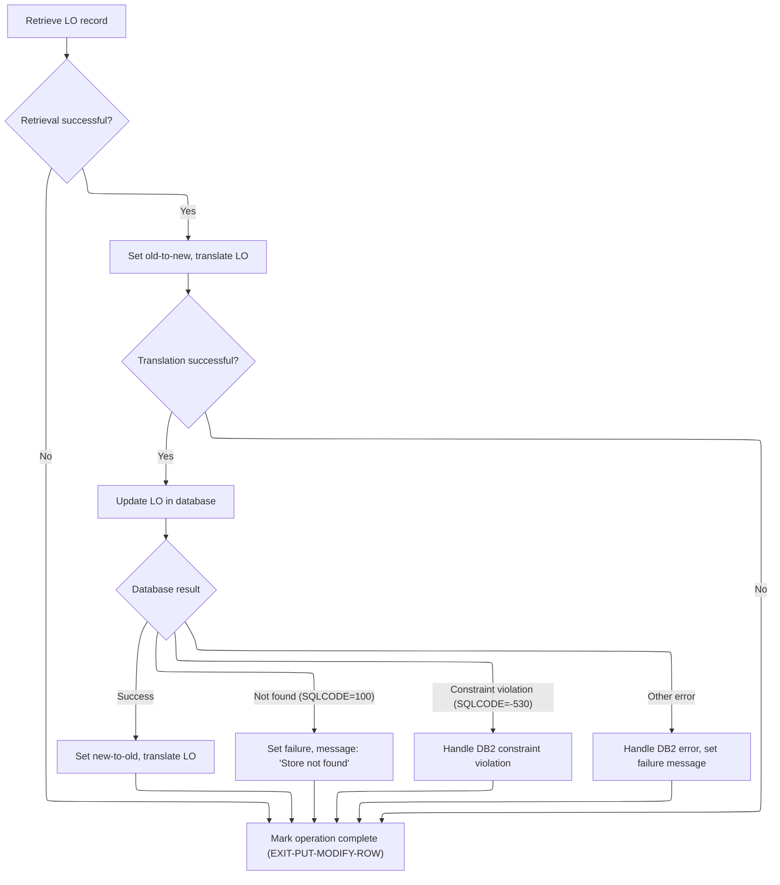
```mermaid
%%{init: {"flowchart": {"defaultRenderer": "elk"}} }%%
flowchart TD
    node1["Retrieve LO record"] 
    click node1 openCode "base/src/WWWS0003.cbl:377:377"
    node1 --> node2{"Retrieval successful?"}
    click node2 openCode "base/src/WWWS0003.cbl:378:378"
    node2 -->|"Yes"| node3["Set old-to-new, translate LO"]
    click node3 openCode "base/src/WWWS0003.cbl:379:380"
    node2 -->|"No"| node9["Mark operation complete (EXIT-PUT-MODIFY-ROW)"]
    node3 --> node4{"Translation successful?"}
    click node4 openCode "base/src/WWWS0003.cbl:381:381"
    node4 -->|"Yes"| node5["Update LO in database"]
    click node5 openCode "base/src/WWWS0003.cbl:382:382"
    node4 -->|"No"| node9
    node5 --> node6{"Database result"}
    click node6 openCode "base/src/WWWS0003.cbl:384:399"
    node6 -->|"Success"| node7["Set new-to-old, translate LO"]
    click node7 openCode "base/src/WWWS0003.cbl:400:402"
    node6 -->|"Not found (SQLCODE=100)"| node8["Set failure, message: 'Store not found'"]
    click node8 openCode "base/src/WWWS0003.cbl:388:390"
    node6 -->|"Constraint violation (SQLCODE=-530)"| node10["Handle DB2 constraint violation"]
    click node10 openCode "base/src/WWWS0003.cbl:392:392"
    node6 -->|"Other error"| node11["Handle DB2 error, set failure message"]
    click node11 openCode "base/src/WWWS0003.cbl:394:397"
    node7 --> node9
    node8 --> node9
    node10 --> node9
    node11 --> node9
    node9["Mark operation complete (EXIT-PUT-MODIFY-ROW)"]
    click node9 openCode "base/src/WWWS0003.cbl:406:406"
classDef HeadingStyle fill:#777777,stroke:#333,stroke-width:2px;

%% Swimm:
%% %%{init: {"flowchart": {"defaultRenderer": "elk"}} }%%
%% flowchart TD
%%     node1["Retrieve LO record"] 
%%     click node1 openCode "<SwmPath>[base/src/WWWS0003.cbl](base/src/WWWS0003.cbl)</SwmPath>:377:377"
%%     node1 --> node2{"Retrieval successful?"}
%%     click node2 openCode "<SwmPath>[base/src/WWWS0003.cbl](base/src/WWWS0003.cbl)</SwmPath>:378:378"
%%     node2 -->|"Yes"| node3["Set old-to-new, translate LO"]
%%     click node3 openCode "<SwmPath>[base/src/WWWS0003.cbl](base/src/WWWS0003.cbl)</SwmPath>:379:380"
%%     node2 -->|"No"| node9["Mark operation complete (<SwmToken path="base/src/WWWS0003.cbl" pos="117:4:10" line-data="014300           WHEN EXIT-PUT-MODIFY-ROW                               00014300">`EXIT-PUT-MODIFY-ROW`</SwmToken>)"]
%%     node3 --> node4{"Translation successful?"}
%%     click node4 openCode "<SwmPath>[base/src/WWWS0003.cbl](base/src/WWWS0003.cbl)</SwmPath>:381:381"
%%     node4 -->|"Yes"| node5["Update LO in database"]
%%     click node5 openCode "<SwmPath>[base/src/WWWS0003.cbl](base/src/WWWS0003.cbl)</SwmPath>:382:382"
%%     node4 -->|"No"| node9
%%     node5 --> node6{"Database result"}
%%     click node6 openCode "<SwmPath>[base/src/WWWS0003.cbl](base/src/WWWS0003.cbl)</SwmPath>:384:399"
%%     node6 -->|"Success"| node7["Set new-to-old, translate LO"]
%%     click node7 openCode "<SwmPath>[base/src/WWWS0003.cbl](base/src/WWWS0003.cbl)</SwmPath>:400:402"
%%     node6 -->|"Not found (SQLCODE=100)"| node8["Set failure, message: 'Store not found'"]
%%     click node8 openCode "<SwmPath>[base/src/WWWS0003.cbl](base/src/WWWS0003.cbl)</SwmPath>:388:390"
%%     node6 -->|"Constraint violation (SQLCODE=-530)"| node10["Handle <SwmToken path="base/src/WWWS0003.cbl" pos="204:8:8" line-data="023000 125-CONNECT-TO-DB2.                                              00023000">`DB2`</SwmToken> constraint violation"]
%%     click node10 openCode "<SwmPath>[base/src/WWWS0003.cbl](base/src/WWWS0003.cbl)</SwmPath>:392:392"
%%     node6 -->|"Other error"| node11["Handle <SwmToken path="base/src/WWWS0003.cbl" pos="204:8:8" line-data="023000 125-CONNECT-TO-DB2.                                              00023000">`DB2`</SwmToken> error, set failure message"]
%%     click node11 openCode "<SwmPath>[base/src/WWWS0003.cbl](base/src/WWWS0003.cbl)</SwmPath>:394:397"
%%     node7 --> node9
%%     node8 --> node9
%%     node10 --> node9
%%     node11 --> node9
%%     node9["Mark operation complete (<SwmToken path="base/src/WWWS0003.cbl" pos="117:4:10" line-data="014300           WHEN EXIT-PUT-MODIFY-ROW                               00014300">`EXIT-PUT-MODIFY-ROW`</SwmToken>)"]
%%     click node9 openCode "<SwmPath>[base/src/WWWS0003.cbl](base/src/WWWS0003.cbl)</SwmPath>:406:406"
%% classDef HeadingStyle fill:#777777,stroke:#333,stroke-width:2px;
```

This section governs the business logic for updating a location record, including translation of data and error handling for database operations. It ensures that location updates are processed correctly and that appropriate error messages are returned when issues occur.

| Category        | Rule Name                      | Description                                                                                                                                                                                                                                                                          |
| --------------- | ------------------------------ | ------------------------------------------------------------------------------------------------------------------------------------------------------------------------------------------------------------------------------------------------------------------------------------ |
| Data validation | Location retrieval required    | If the location record cannot be retrieved, the operation is marked as complete and no update is attempted.                                                                                                                                                                          |
| Data validation | Translation success required   | If translation fails, the operation is marked as complete and no update is attempted.                                                                                                                                                                                                |
| Business logic  | Data translation before update | If the location record is retrieved, the data must be translated before any update is attempted.                                                                                                                                                                                     |
| Business logic  | Post-update translation        | If the database update is successful, the new-to-old flag is set and the data is translated again before marking the operation as complete.                                                                                                                                          |
| Business logic  | Operation completion guarantee | The operation is always marked as complete by setting <SwmToken path="base/src/WWWS0003.cbl" pos="117:4:10" line-data="014300           WHEN EXIT-PUT-MODIFY-ROW                               00014300">`EXIT-PUT-MODIFY-ROW`</SwmToken> to TRUE, regardless of success or failure. |

<SwmSnippet path="/base/src/WWWS0003.cbl" line="376">

---

In <SwmToken path="base/src/WWWS0003.cbl" pos="376:2:6" line-data="040200 1410-PROCESS-LO.                                                 00040200">`1410-PROCESS-LO`</SwmToken>, we start by fetching the location record with <SwmToken path="base/src/WWWS0003.cbl" pos="377:4:8" line-data="040300     PERFORM 2200-GET-LO                                          00040300">`2200-GET-LO`</SwmToken>. If that works, we set the old-to-new flag and translate the data before moving on to the DAO update.

```cobol
040200 1410-PROCESS-LO.                                                 00040200
040300     PERFORM 2200-GET-LO                                          00040300
```

---

</SwmSnippet>

<SwmSnippet path="/base/src/WWWS0003.cbl" line="378">

---

After getting the location in <SwmToken path="base/src/WWWS0003.cbl" pos="365:4:8" line-data="039100     PERFORM 1410-PROCESS-LO                                      00039100">`1410-PROCESS-LO`</SwmToken>, we set the old-to-new flag and run <SwmToken path="base/src/WWWS0003.cbl" pos="380:4:8" line-data="040600       PERFORM 2000-LO-TRANSLATION                                00040600">`2000-LO-TRANSLATION`</SwmToken>. This step converts the data as needed for the update.

```cobol
040400     IF SUCCESS                                                   00040400
040500       SET YYYN111A-OLD-2-NEW TO TRUE                             00040500
040600       PERFORM 2000-LO-TRANSLATION                                00040600
```

---

</SwmSnippet>

<SwmSnippet path="/base/src/WWWS0003.cbl" line="381">

---

After translating in <SwmToken path="base/src/WWWS0003.cbl" pos="365:4:8" line-data="039100     PERFORM 1410-PROCESS-LO                                      00039100">`1410-PROCESS-LO`</SwmToken>, if SUCCESS is still set, we call <SwmToken path="base/src/WWWS0003.cbl" pos="382:4:10" line-data="040800         PERFORM 2100-CALL-LO-DAO                                 00040800">`2100-CALL-LO-DAO`</SwmToken> to push the updated location data to the DB.

```cobol
040700       IF SUCCESS                                                 00040700
040800         PERFORM 2100-CALL-LO-DAO                                 00040800
```

---

</SwmSnippet>

<SwmSnippet path="/base/src/WWWS0003.cbl" line="384">

---

After the DAO call in <SwmToken path="base/src/WWWS0003.cbl" pos="365:4:8" line-data="039100     PERFORM 1410-PROCESS-LO                                      00039100">`1410-PROCESS-LO`</SwmToken>, we check SQLCODE. 100 means not found, so we set an error message. -530 triggers a special error handler. Anything else gets the generic <SwmToken path="base/src/WWWS0003.cbl" pos="392:6:6" line-data="041800             PERFORM 9998-DB2-530-ERROR                           00041800">`DB2`</SwmToken> error handler.

```cobol
041000         EVALUATE TRUE                                            00041000
041100           WHEN NOT SUCCESS                                       00041100
041200             CONTINUE                                             00041200
041300           WHEN SQLCODE = 100                                     00041300
041400             SET FAILURE TO TRUE                                  00041400
041500             MOVE 'WWWS0003 - Store XXXATION not found!'          00041500
041600               TO IS-RTRN-MSG-TXT                                 00041600
041700           WHEN SQLCODE = -530                                    00041700
041800             PERFORM 9998-DB2-530-ERROR                           00041800
041900           WHEN SQLCODE NOT = 0                                   00041900
042000             PERFORM 9999-SETUP-DB2-ERROR                         00042000
042100             STRING 'WWWS0003 - Failed on upd XXXATION(LO),SQL='  00042100
042200                 WS-SQLCODE                                       00042200
042300                 DELIMITED BY SIZE INTO IS-RTRN-MSG-TXT           00042300
042400         END-EVALUATE                                             00042400
```

---

</SwmSnippet>

<SwmSnippet path="/base/src/WWWS0003.cbl" line="930">

---

<SwmToken path="base/src/WWWS0003.cbl" pos="930:2:8" line-data="095600 9998-DB2-530-ERROR.                                              00095600">`9998-DB2-530-ERROR`</SwmToken> hands off error handling to <SwmToken path="base/src/WWWS0003.cbl" pos="931:4:10" line-data="095700     CALL Z-DB2-ERROR-HANDLER USING                               00095700">`Z-DB2-ERROR-HANDLER`</SwmToken>.

```cobol
095600 9998-DB2-530-ERROR.                                              00095600
095700     CALL Z-DB2-ERROR-HANDLER USING                               00095700
095800         XXXN001A                                                 00095800
095900         SQLCA                                                    00095900
096000         YYYN005A                                                 00096000
096100         YYYC0097                                                 00096100
096200     .                                                            00096200
```

---

</SwmSnippet>

<SwmSnippet path="/base/src/WWWS0003.cbl" line="400">

---

After all the error handling and updates in <SwmToken path="base/src/WWWS0003.cbl" pos="365:4:8" line-data="039100     PERFORM 1410-PROCESS-LO                                      00039100">`1410-PROCESS-LO`</SwmToken>, if SUCCESS is still set, we flip the new-to-old flag and translate again. Then we set <SwmToken path="base/src/WWWS0003.cbl" pos="406:4:10" line-data="043200     SET EXIT-PUT-MODIFY-ROW TO TRUE                              00043200">`EXIT-PUT-MODIFY-ROW`</SwmToken> to signal we're done.

```cobol
042600         IF SUCCESS                                               00042600
042700           SET YYYN111A-NEW-2-OLD TO TRUE                         00042700
042800           PERFORM 2000-LO-TRANSLATION                            00042800
042900         END-IF                                                   00042900
043000       END-IF                                                     00043000
043100     END-IF                                                       00043100
043200     SET EXIT-PUT-MODIFY-ROW TO TRUE                              00043200
043300     .                                                            00043300
```

---

</SwmSnippet>

## Row Modification: Ledger Update

<SwmSnippet path="/base/src/WWWS0003.cbl" line="366">

---

Back in <SwmToken path="base/src/WWWS0003.cbl" pos="118:4:12" line-data="014400              PERFORM 1400-EXIT-PUT-MODIFY-ROW                    00014400">`1400-EXIT-PUT-MODIFY-ROW`</SwmToken>, after updating the location, if SUCCESS is set, we run <SwmToken path="base/src/WWWS0003.cbl" pos="367:4:8" line-data="039300       PERFORM 1420-PROCESS-LR                                    00039300">`1420-PROCESS-LR`</SwmToken> to update the ledger record for the store.

```cobol
039200     IF SUCCESS                                                   00039200
039300       PERFORM 1420-PROCESS-LR                                    00039300
039400     END-IF                                                       00039400
```

---

</SwmSnippet>

## Ledger Update, Translation, and Error Handling

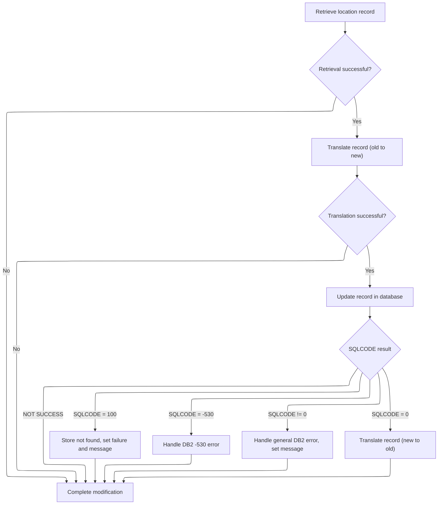
```mermaid
%%{init: {"flowchart": {"defaultRenderer": "elk"}} }%%
flowchart TD
    node1["Retrieve location record"] --> node2{"Retrieval successful?"}
    click node1 openCode "base/src/WWWS0003.cbl:437:438"
    node2 -->|"Yes"| node3["Translate record (old to new)"]
    click node2 openCode "base/src/WWWS0003.cbl:438:440"
    node2 -->|"No"| node11["Complete modification"]
    click node11 openCode "base/src/WWWS0003.cbl:466:467"
    node3 --> node4{"Translation successful?"}
    click node3 openCode "base/src/WWWS0003.cbl:439:440"
    node4 -->|"Yes"| node5["Update record in database"]
    click node4 openCode "base/src/WWWS0003.cbl:441:458"
    node4 -->|"No"| node11
    node5 --> node6{"SQLCODE result"}
    click node5 openCode "base/src/WWWS0003.cbl:442:458"
    node6 -->|"SQLCODE = 100"| node7["Store not found, set failure and message"]
    click node7 openCode "base/src/WWWS0003.cbl:447:450"
    node6 -->|"SQLCODE = -530"| node8["Handle DB2 -530 error"]
    click node8 openCode "base/src/WWWS0003.cbl:451:452"
    node6 -->|"SQLCODE != 0"| node9["Handle general DB2 error, set message"]
    click node9 openCode "base/src/WWWS0003.cbl:453:457"
    node6 -->|"SQLCODE = 0"| node10["Translate record (new to old)"]
    click node10 openCode "base/src/WWWS0003.cbl:461:462"
    node10 --> node11
    node7 --> node11
    node8 --> node11
    node9 --> node11
    node6 -->|"NOT SUCCESS"| node11
classDef HeadingStyle fill:#777777,stroke:#333,stroke-width:2px;

%% Swimm:
%% %%{init: {"flowchart": {"defaultRenderer": "elk"}} }%%
%% flowchart TD
%%     node1["Retrieve location record"] --> node2{"Retrieval successful?"}
%%     click node1 openCode "<SwmPath>[base/src/WWWS0003.cbl](base/src/WWWS0003.cbl)</SwmPath>:437:438"
%%     node2 -->|"Yes"| node3["Translate record (old to new)"]
%%     click node2 openCode "<SwmPath>[base/src/WWWS0003.cbl](base/src/WWWS0003.cbl)</SwmPath>:438:440"
%%     node2 -->|"No"| node11["Complete modification"]
%%     click node11 openCode "<SwmPath>[base/src/WWWS0003.cbl](base/src/WWWS0003.cbl)</SwmPath>:466:467"
%%     node3 --> node4{"Translation successful?"}
%%     click node3 openCode "<SwmPath>[base/src/WWWS0003.cbl](base/src/WWWS0003.cbl)</SwmPath>:439:440"
%%     node4 -->|"Yes"| node5["Update record in database"]
%%     click node4 openCode "<SwmPath>[base/src/WWWS0003.cbl](base/src/WWWS0003.cbl)</SwmPath>:441:458"
%%     node4 -->|"No"| node11
%%     node5 --> node6{"SQLCODE result"}
%%     click node5 openCode "<SwmPath>[base/src/WWWS0003.cbl](base/src/WWWS0003.cbl)</SwmPath>:442:458"
%%     node6 -->|"SQLCODE = 100"| node7["Store not found, set failure and message"]
%%     click node7 openCode "<SwmPath>[base/src/WWWS0003.cbl](base/src/WWWS0003.cbl)</SwmPath>:447:450"
%%     node6 -->|"SQLCODE = -530"| node8["Handle <SwmToken path="base/src/WWWS0003.cbl" pos="204:8:8" line-data="023000 125-CONNECT-TO-DB2.                                              00023000">`DB2`</SwmToken> -530 error"]
%%     click node8 openCode "<SwmPath>[base/src/WWWS0003.cbl](base/src/WWWS0003.cbl)</SwmPath>:451:452"
%%     node6 -->|"SQLCODE != 0"| node9["Handle general <SwmToken path="base/src/WWWS0003.cbl" pos="204:8:8" line-data="023000 125-CONNECT-TO-DB2.                                              00023000">`DB2`</SwmToken> error, set message"]
%%     click node9 openCode "<SwmPath>[base/src/WWWS0003.cbl](base/src/WWWS0003.cbl)</SwmPath>:453:457"
%%     node6 -->|"SQLCODE = 0"| node10["Translate record (new to old)"]
%%     click node10 openCode "<SwmPath>[base/src/WWWS0003.cbl](base/src/WWWS0003.cbl)</SwmPath>:461:462"
%%     node10 --> node11
%%     node7 --> node11
%%     node8 --> node11
%%     node9 --> node11
%%     node6 -->|"NOT SUCCESS"| node11
%% classDef HeadingStyle fill:#777777,stroke:#333,stroke-width:2px;
```

This section governs the business logic for updating ledger records, including translation between formats, database update operations, and error handling for specific database conditions.

| Category        | Rule Name                    | Description                                                                                                                                                                                                                                                                              |
| --------------- | ---------------------------- | ---------------------------------------------------------------------------------------------------------------------------------------------------------------------------------------------------------------------------------------------------------------------------------------- |
| Data validation | Record Retrieval Required    | If the location record cannot be retrieved, the modification process is completed without attempting translation or update.                                                                                                                                                              |
| Data validation | Translation Success Required | If translation from old to new format fails, the modification process is completed without updating the database.                                                                                                                                                                        |
| Business logic  | Pre-Update Translation       | Records must be translated from old to new format before any database update is attempted.                                                                                                                                                                                               |
| Business logic  | Post-Update Translation      | If the database update is successful (SQLCODE = 0), the record must be translated back from new to old format before signaling completion.                                                                                                                                               |
| Business logic  | Completion Flag Set          | Upon completion of the process, the completion flag <SwmToken path="base/src/WWWS0003.cbl" pos="117:4:10" line-data="014300           WHEN EXIT-PUT-MODIFY-ROW                               00014300">`EXIT-PUT-MODIFY-ROW`</SwmToken> must be set to indicate the end of modification. |

<SwmSnippet path="/base/src/WWWS0003.cbl" line="410">

---

In <SwmToken path="base/src/WWWS0003.cbl" pos="410:2:6" line-data="043600 1420-PROCESS-LR.                                                 00043600">`1420-PROCESS-LR`</SwmToken>, we start by fetching the ledger record with <SwmToken path="base/src/WWWS0003.cbl" pos="411:4:8" line-data="043700     PERFORM 2210-GET-LR                                          00043700">`2210-GET-LR`</SwmToken>. If that works, we set the old-to-new flag and translate the data before moving on to the DAO update.

```cobol
043600 1420-PROCESS-LR.                                                 00043600
043700     PERFORM 2210-GET-LR                                          00043700
```

---

</SwmSnippet>

<SwmSnippet path="/base/src/WWWS0003.cbl" line="412">

---

After getting the ledger in <SwmToken path="base/src/WWWS0003.cbl" pos="367:4:8" line-data="039300       PERFORM 1420-PROCESS-LR                                    00039300">`1420-PROCESS-LR`</SwmToken>, we set the old-to-new flag and run <SwmToken path="base/src/WWWS0003.cbl" pos="414:4:8" line-data="044000       PERFORM 2010-LR-TRANSLATION                                00044000">`2010-LR-TRANSLATION`</SwmToken>. This step converts the data as needed for the update.

```cobol
043800     IF SUCCESS                                                   00043800
043900       SET YYYN111A-OLD-2-NEW TO TRUE                             00043900
044000       PERFORM 2010-LR-TRANSLATION                                00044000
```

---

</SwmSnippet>

<SwmSnippet path="/base/src/WWWS0003.cbl" line="415">

---

After translating in <SwmToken path="base/src/WWWS0003.cbl" pos="367:4:8" line-data="039300       PERFORM 1420-PROCESS-LR                                    00039300">`1420-PROCESS-LR`</SwmToken>, if SUCCESS is still set, we call <SwmToken path="base/src/WWWS0003.cbl" pos="416:4:10" line-data="044200         PERFORM 2110-CALL-LR-DAO                                 00044200">`2110-CALL-LR-DAO`</SwmToken> to push the updated ledger data to the DB.

```cobol
044100       IF SUCCESS                                                 00044100
044200         PERFORM 2110-CALL-LR-DAO                                 00044200
```

---

</SwmSnippet>

<SwmSnippet path="/base/src/WWWS0003.cbl" line="418">

---

After the DAO call in <SwmToken path="base/src/WWWS0003.cbl" pos="367:4:8" line-data="039300       PERFORM 1420-PROCESS-LR                                    00039300">`1420-PROCESS-LR`</SwmToken>, we check SQLCODE. 100 means not found, so we set an error message. -530 triggers a special error handler. Anything else gets the generic <SwmToken path="base/src/WWWS0003.cbl" pos="426:6:6" line-data="045200             PERFORM 9998-DB2-530-ERROR                           00045200">`DB2`</SwmToken> error handler.

```cobol
044400         EVALUATE TRUE                                            00044400
044500           WHEN NOT SUCCESS                                       00044500
044600             CONTINUE                                             00044600
044700           WHEN SQLCODE = 100                                     00044700
044800             SET FAILURE TO TRUE                                  00044800
044900             MOVE 'WWWS0003 - Store XXXATION not found (LR)!'     00044900
045000               TO IS-RTRN-MSG-TXT                                 00045000
045100           WHEN SQLCODE = -530                                    00045100
045200             PERFORM 9998-DB2-530-ERROR                           00045200
045300           WHEN SQLCODE NOT = 0                                   00045300
045400             PERFORM 9999-SETUP-DB2-ERROR                         00045400
045500             STRING 'WWWS0003 - Failed on upd RtlLoc(LR),SQL='    00045500
045600                 WS-SQLCODE                                       00045600
045700                 DELIMITED BY SIZE INTO IS-RTRN-MSG-TXT           00045700
045800         END-EVALUATE                                             00045800
```

---

</SwmSnippet>

<SwmSnippet path="/base/src/WWWS0003.cbl" line="434">

---

After all the error handling and updates in <SwmToken path="base/src/WWWS0003.cbl" pos="367:4:8" line-data="039300       PERFORM 1420-PROCESS-LR                                    00039300">`1420-PROCESS-LR`</SwmToken>, if SUCCESS is still set, we flip the new-to-old flag and translate again. Then we set <SwmToken path="base/src/WWWS0003.cbl" pos="440:4:10" line-data="046600     SET EXIT-PUT-MODIFY-ROW TO TRUE                              00046600">`EXIT-PUT-MODIFY-ROW`</SwmToken> to signal we're done.

```cobol
046000         IF SUCCESS                                               00046000
046100           SET YYYN111A-NEW-2-OLD TO TRUE                         00046100
046200           PERFORM 2010-LR-TRANSLATION                            00046200
046300         END-IF                                                   00046300
046400       END-IF                                                     00046400
046500     END-IF                                                       00046500
046600     SET EXIT-PUT-MODIFY-ROW TO TRUE                              00046600
046700     .                                                            00046700
```

---

</SwmSnippet>

## Row Modification: Clearance Zone Update

<SwmSnippet path="/base/src/WWWS0003.cbl" line="369">

---

Back in <SwmToken path="base/src/WWWS0003.cbl" pos="118:4:12" line-data="014400              PERFORM 1400-EXIT-PUT-MODIFY-ROW                    00014400">`1400-EXIT-PUT-MODIFY-ROW`</SwmToken>, after updating location and ledger, if SUCCESS is set, we run <SwmToken path="base/src/WWWS0003.cbl" pos="370:4:8" line-data="039600       PERFORM 1430-PROCESS-CZ                                    00039600">`1430-PROCESS-CZ`</SwmToken> to update or delete clearance zone records for the store.

```cobol
039500     IF SUCCESS                                                   00039500
039600       PERFORM 1430-PROCESS-CZ                                    00039600
039700     END-IF                                                       00039700
039800     SET EXIT-PUT-MODIFY-ROW TO TRUE                              00039800
039900     .                                                            00039900
```

---

</SwmSnippet>

# Clearance Zone Processing Loop

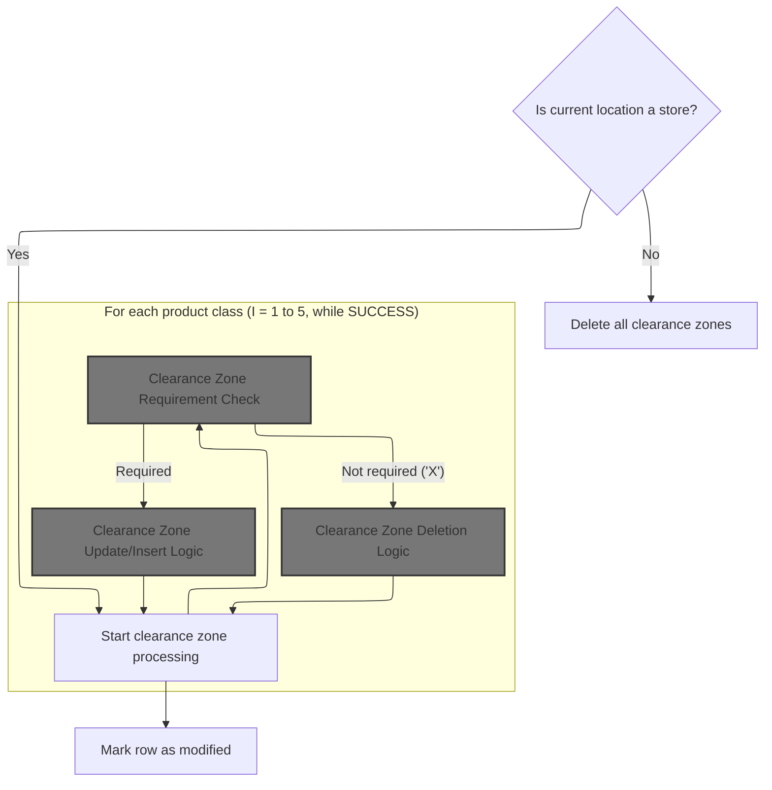
```mermaid
%%{init: {"flowchart": {"defaultRenderer": "elk"}} }%%
flowchart TD
    node1{"Is current location a store?"}
    click node1 openCode "base/src/WWWS0003.cbl:444:456"
    node1 -->|"Yes"| node2["Start clearance zone processing"]
    node1 -->|"No"| node5["Delete all clearance zones"]
    click node5 openCode "base/src/WWWS0003.cbl:456:458"
    subgraph loop1["For each product class (I = 1 to 5, while SUCCESS)"]
        node2 --> node3["Clearance Zone Requirement Check"]
        
        node3 -->|"Not required ('X')"| node4["Clearance Zone Deletion Logic"]
        
        node3 -->|"Required"| node6["Clearance Zone Update/Insert Logic"]
        
        node4 --> node2
        node6 --> node2
    end
    node2 --> node7["Mark row as modified"]
    click node7 openCode "base/src/WWWS0003.cbl:455:456"

classDef HeadingStyle fill:#777777,stroke:#333,stroke-width:2px;
click node3 goToHeading "Clearance Zone Requirement Check"
node3:::HeadingStyle
click node4 goToHeading "Clearance Zone Deletion Logic"
node4:::HeadingStyle
click node6 goToHeading "Clearance Zone Update/Insert Logic"
node6:::HeadingStyle

%% Swimm:
%% %%{init: {"flowchart": {"defaultRenderer": "elk"}} }%%
%% flowchart TD
%%     node1{"Is current location a store?"}
%%     click node1 openCode "<SwmPath>[base/src/WWWS0003.cbl](base/src/WWWS0003.cbl)</SwmPath>:444:456"
%%     node1 -->|"Yes"| node2["Start clearance zone processing"]
%%     node1 -->|"No"| node5["Delete all clearance zones"]
%%     click node5 openCode "<SwmPath>[base/src/WWWS0003.cbl](base/src/WWWS0003.cbl)</SwmPath>:456:458"
%%     subgraph loop1["For each product class (I = 1 to 5, while SUCCESS)"]
%%         node2 --> node3["Clearance Zone Requirement Check"]
%%         
%%         node3 -->|"Not required ('X')"| node4["Clearance Zone Deletion Logic"]
%%         
%%         node3 -->|"Required"| node6["Clearance Zone Update/Insert Logic"]
%%         
%%         node4 --> node2
%%         node6 --> node2
%%     end
%%     node2 --> node7["Mark row as modified"]
%%     click node7 openCode "<SwmPath>[base/src/WWWS0003.cbl](base/src/WWWS0003.cbl)</SwmPath>:455:456"
%% 
%% classDef HeadingStyle fill:#777777,stroke:#333,stroke-width:2px;
%% click node3 goToHeading "Clearance Zone Requirement Check"
%% node3:::HeadingStyle
%% click node4 goToHeading "Clearance Zone Deletion Logic"
%% node4:::HeadingStyle
%% click node6 goToHeading "Clearance Zone Update/Insert Logic"
%% node6:::HeadingStyle
```

This section ensures that clearance zones for each product class at a store location are kept in sync with business requirements. It determines which zones are needed, deletes those that are not, and updates or inserts those that are required, minimizing unnecessary database operations.

| Category        | Rule Name                      | Description                                                                                                                                                                                                                                                                                              |
| --------------- | ------------------------------ | -------------------------------------------------------------------------------------------------------------------------------------------------------------------------------------------------------------------------------------------------------------------------------------------------------- |
| Data validation | Store location gating          | Clearance zone processing is only performed if the current location is identified as a store. If not, all clearance zones for the location are deleted.                                                                                                                                                  |
| Business logic  | Product class zone requirement | For each product class (up to five per store), the system checks if a clearance zone is required based on business rules for meat and market categories.                                                                                                                                                 |
| Business logic  | Unneeded zone deletion         | If a clearance zone is not required for a product class (requirement status is 'X'), the corresponding clearance zone is deleted for that class.                                                                                                                                                         |
| Business logic  | Required zone update/insert    | If a clearance zone is required for a product class, the system updates or inserts the clearance zone data for that class.                                                                                                                                                                               |
| Business logic  | Product class processing limit | The loop for processing product classes is limited to a maximum of five iterations, as defined by the business constant <SwmToken path="base/src/WWWS0003.cbl" pos="328:8:12" line-data="035400           UNTIL I &gt; K-CZ-MAX OR NOT SUCCESS                      00035400">`K-CZ-MAX`</SwmToken> = 5. |
| Technical step  | Modification tracking          | After processing all product classes for a store, the row is marked as modified to indicate that changes have been made to clearance zones.                                                                                                                                                              |

<SwmSnippet path="/base/src/WWWS0003.cbl" line="444">

---

In <SwmToken path="base/src/WWWS0003.cbl" pos="444:2:6" line-data="047000 1430-PROCESS-CZ.                                                 00047000">`1430-PROCESS-CZ`</SwmToken>, we loop through each possible class zone for the store (up to five), and for each one, we call <SwmToken path="base/src/WWWS0003.cbl" pos="448:4:10" line-data="047400         PERFORM 1440-CHECK-CZ-STATUS                             00047400">`1440-CHECK-CZ-STATUS`</SwmToken> to figure out if the zone is needed or not. Based on the result, we either delete the zone (if <SwmToken path="base/src/WWWS0003.cbl" pos="449:4:8" line-data="047500         IF NO-NEED-CZ                                            00047500">`NO-NEED-CZ`</SwmToken> is set) or update it. This avoids unnecessary DB work and keeps the clearance zones in sync with business rules.

```cobol
047000 1430-PROCESS-CZ.                                                 00047000
047100     IF ST-XXX-STORE                                              00047100
047200       PERFORM VARYING I FROM 1 BY 1                              00047200
047300           UNTIL I > K-CZ-MAX OR NOT SUCCESS                      00047300
047400         PERFORM 1440-CHECK-CZ-STATUS                             00047400
047500         IF NO-NEED-CZ                                            00047500
047600           PERFORM 1450-DELETE-CZ                                 00047600
047700         ELSE                                                     00047700
047800           PERFORM 1460-UPDATE-CZ                                 00047800
047900         END-IF                                                   00047900
048000       END-PERFORM                                                00048000
048100       SET EXIT-PUT-MODIFY-ROW TO TRUE                            00048100
```

---

</SwmSnippet>

## Clearance Zone Requirement Check

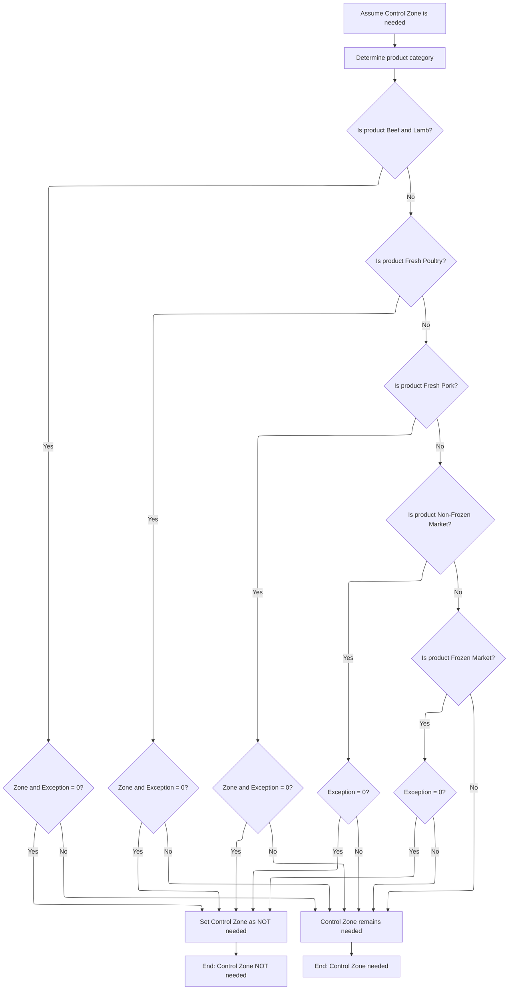
```mermaid
%%{init: {"flowchart": {"defaultRenderer": "elk"}} }%%
flowchart TD
    node1["Assume Control Zone is needed"] --> node2["Determine product category"]
    click node1 openCode "base/src/WWWS0003.cbl:489:489"
    click node2 openCode "base/src/WWWS0003.cbl:490:491"
    node2 --> node3{"Is product Beef and Lamb?"}
    click node3 openCode "base/src/WWWS0003.cbl:494:494"
    node3 -->|"Yes"| node4{"Zone and Exception = 0?"}
    click node4 openCode "base/src/WWWS0003.cbl:495:496"
    node3 -->|"No"| node5{"Is product Fresh Poultry?"}
    click node5 openCode "base/src/WWWS0003.cbl:499:499"
    node4 -->|"Yes"| node8["Set Control Zone as NOT needed"]
    click node8 openCode "base/src/WWWS0003.cbl:497:497"
    node4 -->|"No"| node9["Control Zone remains needed"]
    click node9 openCode "base/src/WWWS0003.cbl:489:489"
    node5 -->|"Yes"| node6{"Zone and Exception = 0?"}
    click node6 openCode "base/src/WWWS0003.cbl:500:501"
    node5 -->|"No"| node10{"Is product Fresh Pork?"}
    click node10 openCode "base/src/WWWS0003.cbl:504:504"
    node6 -->|"Yes"| node8
    node6 -->|"No"| node9
    node10 -->|"Yes"| node11{"Zone and Exception = 0?"}
    click node11 openCode "base/src/WWWS0003.cbl:505:506"
    node10 -->|"No"| node12{"Is product Non-Frozen Market?"}
    click node12 openCode "base/src/WWWS0003.cbl:509:509"
    node11 -->|"Yes"| node8
    node11 -->|"No"| node9
    node12 -->|"Yes"| node13{"Exception = 0?"}
    click node13 openCode "base/src/WWWS0003.cbl:510:510"
    node12 -->|"No"| node14{"Is product Frozen Market?"}
    click node14 openCode "base/src/WWWS0003.cbl:513:513"
    node13 -->|"Yes"| node8
    node13 -->|"No"| node9
    node14 -->|"Yes"| node15{"Exception = 0?"}
    click node15 openCode "base/src/WWWS0003.cbl:514:514"
    node14 -->|"No"| node9
    node15 -->|"Yes"| node8
    node15 -->|"No"| node9
    node8 --> node16["End: Control Zone NOT needed"]
    click node16 openCode "base/src/WWWS0003.cbl:497:497"
    node9 --> node17["End: Control Zone needed"]
    click node17 openCode "base/src/WWWS0003.cbl:489:489"
classDef HeadingStyle fill:#777777,stroke:#333,stroke-width:2px;

%% Swimm:
%% %%{init: {"flowchart": {"defaultRenderer": "elk"}} }%%
%% flowchart TD
%%     node1["Assume Control Zone is needed"] --> node2["Determine product category"]
%%     click node1 openCode "<SwmPath>[base/src/WWWS0003.cbl](base/src/WWWS0003.cbl)</SwmPath>:489:489"
%%     click node2 openCode "<SwmPath>[base/src/WWWS0003.cbl](base/src/WWWS0003.cbl)</SwmPath>:490:491"
%%     node2 --> node3{"Is product Beef and Lamb?"}
%%     click node3 openCode "<SwmPath>[base/src/WWWS0003.cbl](base/src/WWWS0003.cbl)</SwmPath>:494:494"
%%     node3 -->|"Yes"| node4{"Zone and Exception = 0?"}
%%     click node4 openCode "<SwmPath>[base/src/WWWS0003.cbl](base/src/WWWS0003.cbl)</SwmPath>:495:496"
%%     node3 -->|"No"| node5{"Is product Fresh Poultry?"}
%%     click node5 openCode "<SwmPath>[base/src/WWWS0003.cbl](base/src/WWWS0003.cbl)</SwmPath>:499:499"
%%     node4 -->|"Yes"| node8["Set Control Zone as NOT needed"]
%%     click node8 openCode "<SwmPath>[base/src/WWWS0003.cbl](base/src/WWWS0003.cbl)</SwmPath>:497:497"
%%     node4 -->|"No"| node9["Control Zone remains needed"]
%%     click node9 openCode "<SwmPath>[base/src/WWWS0003.cbl](base/src/WWWS0003.cbl)</SwmPath>:489:489"
%%     node5 -->|"Yes"| node6{"Zone and Exception = 0?"}
%%     click node6 openCode "<SwmPath>[base/src/WWWS0003.cbl](base/src/WWWS0003.cbl)</SwmPath>:500:501"
%%     node5 -->|"No"| node10{"Is product Fresh Pork?"}
%%     click node10 openCode "<SwmPath>[base/src/WWWS0003.cbl](base/src/WWWS0003.cbl)</SwmPath>:504:504"
%%     node6 -->|"Yes"| node8
%%     node6 -->|"No"| node9
%%     node10 -->|"Yes"| node11{"Zone and Exception = 0?"}
%%     click node11 openCode "<SwmPath>[base/src/WWWS0003.cbl](base/src/WWWS0003.cbl)</SwmPath>:505:506"
%%     node10 -->|"No"| node12{"Is product Non-Frozen Market?"}
%%     click node12 openCode "<SwmPath>[base/src/WWWS0003.cbl](base/src/WWWS0003.cbl)</SwmPath>:509:509"
%%     node11 -->|"Yes"| node8
%%     node11 -->|"No"| node9
%%     node12 -->|"Yes"| node13{"Exception = 0?"}
%%     click node13 openCode "<SwmPath>[base/src/WWWS0003.cbl](base/src/WWWS0003.cbl)</SwmPath>:510:510"
%%     node12 -->|"No"| node14{"Is product Frozen Market?"}
%%     click node14 openCode "<SwmPath>[base/src/WWWS0003.cbl](base/src/WWWS0003.cbl)</SwmPath>:513:513"
%%     node13 -->|"Yes"| node8
%%     node13 -->|"No"| node9
%%     node14 -->|"Yes"| node15{"Exception = 0?"}
%%     click node15 openCode "<SwmPath>[base/src/WWWS0003.cbl](base/src/WWWS0003.cbl)</SwmPath>:514:514"
%%     node14 -->|"No"| node9
%%     node15 -->|"Yes"| node8
%%     node15 -->|"No"| node9
%%     node8 --> node16["End: Control Zone NOT needed"]
%%     click node16 openCode "<SwmPath>[base/src/WWWS0003.cbl](base/src/WWWS0003.cbl)</SwmPath>:497:497"
%%     node9 --> node17["End: Control Zone needed"]
%%     click node17 openCode "<SwmPath>[base/src/WWWS0003.cbl](base/src/WWWS0003.cbl)</SwmPath>:489:489"
%% classDef HeadingStyle fill:#777777,stroke:#333,stroke-width:2px;
```

This section determines whether a clearance zone requirement applies to a product based on its category and associated status variables. The decision is used to control whether clearance zone processing is performed for the product.

| Category       | Rule Name                          | Description                                                                                                                                                                |
| -------------- | ---------------------------------- | -------------------------------------------------------------------------------------------------------------------------------------------------------------------------- |
| Business logic | Beef and Lamb Exemption            | If the product category is Beef and Lamb (class code 12), and both the zone and exception status variables for this class are zero, then the clearance zone is not needed. |
| Business logic | Fresh Poultry Exemption            | If the product category is Fresh Poultry (class code 13), and both the zone and exception status variables for this class are zero, then the clearance zone is not needed. |
| Business logic | Fresh Pork Exemption               | If the product category is Fresh Pork (class code 14), and both the zone and exception status variables for this class are zero, then the clearance zone is not needed.    |
| Business logic | Non-Frozen Market Exemption        | If the product category is Non-Frozen Market (class code 36), and the exception status variable for this class is zero, then the clearance zone is not needed.             |
| Business logic | Frozen Market Exemption            | If the product category is Frozen Market (class code 37), and the exception status variable for this class is zero, then the clearance zone is not needed.                 |
| Business logic | Default Clearance Zone Requirement | If none of the exemption conditions for the product category are met, the clearance zone is required.                                                                      |

<SwmSnippet path="/base/src/WWWS0003.cbl" line="462">

---

We set <SwmToken path="base/src/WWWS0003.cbl" pos="463:4:6" line-data="048900     SET  NEED-CZ   TO TRUE                                       00048900">`NEED-CZ`</SwmToken>, move the class code, and check if the current class and its status variables mean we can skip clearance zone work by setting <SwmToken path="base/src/WWWS0003.cbl" pos="449:4:8" line-data="047500         IF NO-NEED-CZ                                            00047500">`NO-NEED-CZ`</SwmToken>.

```cobol
048800 1440-CHECK-CZ-STATUS.                                            00048800
048900     SET  NEED-CZ   TO TRUE                                       00048900
049000     MOVE WS-CZ (I) TO ITM-CLS-CD OF P-DDDTCZ01                   00049000
049100     MOVE ITM-CLS-CD OF P-DDDTCZ01 to CLASS1                      00049100
```

---

</SwmSnippet>

<SwmSnippet path="/base/src/WWWS0003.cbl" line="467">

---

Here we start the EVALUATE block, checking if the current class is <SwmToken path="base/src/WWWS0003.cbl" pos="468:4:8" line-data="049400       WHEN BEEF-AND-LAMB                                         00049400">`BEEF-AND-LAMB`</SwmToken>. If so, and both related status variables are zero, we set <SwmToken path="base/src/WWWS0003.cbl" pos="471:4:8" line-data="049700           SET NO-NEED-CZ TO TRUE                                 00049700">`NO-NEED-CZ`</SwmToken>. This pattern repeats for other classes in the next snippets.

```cobol
049300     EVALUATE TRUE                                                00049300
049400       WHEN BEEF-AND-LAMB                                         00049400
049500         IF  ST-CLASS12-ZONE              = 0                     00049500
049600         AND ST-CLASS12-EXCEPTION-AD-ZONE = 0                     00049600
049700           SET NO-NEED-CZ TO TRUE                                 00049700
049800         END-IF                                                   00049800
```

---

</SwmSnippet>

<SwmSnippet path="/base/src/WWWS0003.cbl" line="473">

---

Now we check for <SwmToken path="base/src/WWWS0003.cbl" pos="473:4:6" line-data="049900       WHEN FRESH-POULTRY                                         00049900">`FRESH-POULTRY`</SwmToken>. Same logic: if both status variables are zero, we set <SwmToken path="base/src/WWWS0003.cbl" pos="476:4:8" line-data="050200           SET NO-NEED-CZ TO TRUE                                 00050200">`NO-NEED-CZ`</SwmToken>. This is just another branch in the same EVALUATE block.

```cobol
049900       WHEN FRESH-POULTRY                                         00049900
050000         IF  ST-CLASS13-ZONE              = 0                     00050000
050100         AND ST-CLASS13-EXCEPTION-AD-ZONE = 0                     00050100
050200           SET NO-NEED-CZ TO TRUE                                 00050200
050300         END-IF                                                   00050300
```

---

</SwmSnippet>

<SwmSnippet path="/base/src/WWWS0003.cbl" line="478">

---

Same deal for <SwmToken path="base/src/WWWS0003.cbl" pos="478:4:6" line-data="050400       WHEN FRESH-PORK                                            00050400">`FRESH-PORK`</SwmToken>: if both status variables are zero, we set <SwmToken path="base/src/WWWS0003.cbl" pos="481:4:8" line-data="050700           SET NO-NEED-CZ TO TRUE                                 00050700">`NO-NEED-CZ`</SwmToken>. It's just another branch in the EVALUATE block, mirroring the previous logic.

```cobol
050400       WHEN FRESH-PORK                                            00050400
050500         IF  ST-CLASS14-ZONE              = 0                     00050500
050600         AND ST-CLASS14-EXCEPTION-AD-ZONE = 0                     00050600
050700           SET NO-NEED-CZ TO TRUE                                 00050700
050800         END-IF                                                   00050800
```

---

</SwmSnippet>

<SwmSnippet path="/base/src/WWWS0003.cbl" line="483">

---

For <SwmToken path="base/src/WWWS0003.cbl" pos="483:4:8" line-data="050900       WHEN NON-FROZEN-MARKET                                     00050900">`NON-FROZEN-MARKET`</SwmToken>, we just check the exception ad zone status. If it's zero, we set <SwmToken path="base/src/WWWS0003.cbl" pos="485:4:8" line-data="051100           SET NO-NEED-CZ TO TRUE                                 00051100">`NO-NEED-CZ`</SwmToken>. This is a simpler check than the previous ones.

```cobol
050900       WHEN NON-FROZEN-MARKET                                     00050900
051000         IF ST-CLASS36-EXCEPTION-AD-ZONE  = 0                     00051000
051100           SET NO-NEED-CZ TO TRUE                                 00051100
051200         END-IF                                                   00051200
```

---

</SwmSnippet>

<SwmSnippet path="/base/src/WWWS0003.cbl" line="487">

---

After all the checks, we end up with either <SwmToken path="base/src/WWWS0003.cbl" pos="489:6:8" line-data="051500           SET NO-NEED-CZ TO TRUE                                 00051500">`NEED-CZ`</SwmToken> or <SwmToken path="base/src/WWWS0003.cbl" pos="489:4:8" line-data="051500           SET NO-NEED-CZ TO TRUE                                 00051500">`NO-NEED-CZ`</SwmToken> set. The caller uses these flags to decide if it should delete or update the clearance zone for this class.

```cobol
051300       WHEN FROZEN-MARKET                                         00051300
051400         IF ST-CLASS37-EXCEPTION-AD-ZONE  = 0                     00051400
051500           SET NO-NEED-CZ TO TRUE                                 00051500
051600         END-IF                                                   00051600
051700     END-EVALUATE                                                 00051700
```

---

</SwmSnippet>

## Clearance Zone Deletion Logic

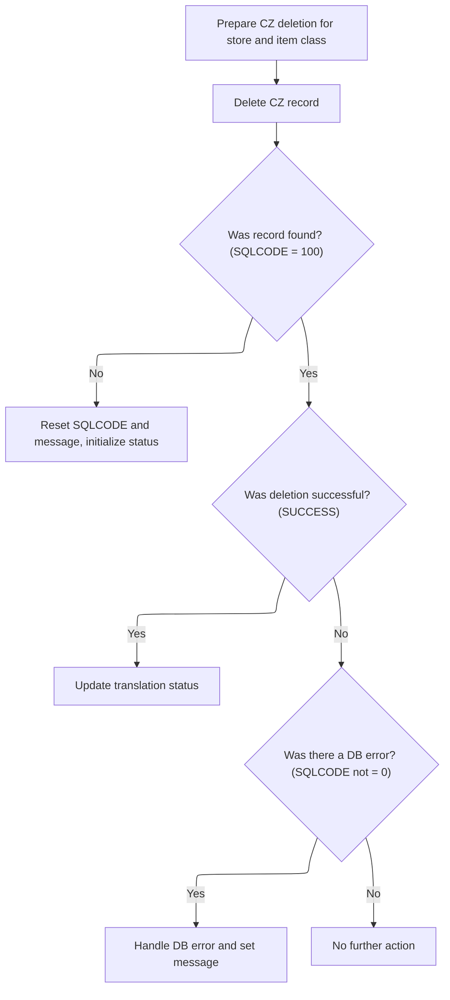
```mermaid
%%{init: {"flowchart": {"defaultRenderer": "elk"}} }%%
flowchart TD
    node1["Prepare CZ deletion for store and item class"]
    click node1 openCode "base/src/WWWS0003.cbl:495:499"
    node1 --> node2["Delete CZ record"]
    click node2 openCode "base/src/WWWS0003.cbl:500:500"
    node2 --> node3{"Was record found? (SQLCODE = 100)"}
    click node3 openCode "base/src/WWWS0003.cbl:502:504"
    node3 -->|"No"| node4["Reset SQLCODE and message, initialize status"]
    click node4 openCode "base/src/WWWS0003.cbl:504:505"
    node3 -->|"Yes"| node5{"Was deletion successful? (SUCCESS)"}
    click node5 openCode "base/src/WWWS0003.cbl:506:515"
    node5 -->|"Yes"| node6["Update translation status"]
    click node6 openCode "base/src/WWWS0003.cbl:516:517"
    node5 -->|"No"| node7{"Was there a DB error? (SQLCODE not = 0)"}
    click node7 openCode "base/src/WWWS0003.cbl:508:509"
    node7 -->|"Yes"| node8["Handle DB error and set message"]
    click node8 openCode "base/src/WWWS0003.cbl:509:512"
    node7 -->|"No"| node9["No further action"]
    click node9 openCode "base/src/WWWS0003.cbl:507:507"

classDef HeadingStyle fill:#777777,stroke:#333,stroke-width:2px;

%% Swimm:
%% %%{init: {"flowchart": {"defaultRenderer": "elk"}} }%%
%% flowchart TD
%%     node1["Prepare CZ deletion for store and item class"]
%%     click node1 openCode "<SwmPath>[base/src/WWWS0003.cbl](base/src/WWWS0003.cbl)</SwmPath>:495:499"
%%     node1 --> node2["Delete CZ record"]
%%     click node2 openCode "<SwmPath>[base/src/WWWS0003.cbl](base/src/WWWS0003.cbl)</SwmPath>:500:500"
%%     node2 --> node3{"Was record found? (SQLCODE = 100)"}
%%     click node3 openCode "<SwmPath>[base/src/WWWS0003.cbl](base/src/WWWS0003.cbl)</SwmPath>:502:504"
%%     node3 -->|"No"| node4["Reset SQLCODE and message, initialize status"]
%%     click node4 openCode "<SwmPath>[base/src/WWWS0003.cbl](base/src/WWWS0003.cbl)</SwmPath>:504:505"
%%     node3 -->|"Yes"| node5{"Was deletion successful? (SUCCESS)"}
%%     click node5 openCode "<SwmPath>[base/src/WWWS0003.cbl](base/src/WWWS0003.cbl)</SwmPath>:506:515"
%%     node5 -->|"Yes"| node6["Update translation status"]
%%     click node6 openCode "<SwmPath>[base/src/WWWS0003.cbl](base/src/WWWS0003.cbl)</SwmPath>:516:517"
%%     node5 -->|"No"| node7{"Was there a DB error? (SQLCODE not = 0)"}
%%     click node7 openCode "<SwmPath>[base/src/WWWS0003.cbl](base/src/WWWS0003.cbl)</SwmPath>:508:509"
%%     node7 -->|"Yes"| node8["Handle DB error and set message"]
%%     click node8 openCode "<SwmPath>[base/src/WWWS0003.cbl](base/src/WWWS0003.cbl)</SwmPath>:509:512"
%%     node7 -->|"No"| node9["No further action"]
%%     click node9 openCode "<SwmPath>[base/src/WWWS0003.cbl](base/src/WWWS0003.cbl)</SwmPath>:507:507"
%% 
%% classDef HeadingStyle fill:#777777,stroke:#333,stroke-width:2px;
```

This section governs the business logic for deleting a clearance zone (CZ) record for a specific store and item class. It ensures that the deletion is attempted, handles cases where the record is not found, manages database errors, and updates translation status for output consistency.

| Category       | Rule Name                 | Description                                                                                                                       |
| -------------- | ------------------------- | --------------------------------------------------------------------------------------------------------------------------------- |
| Business logic | Translation Status Update | If the deletion is successful (SUCCESS = 0), the translation status must be updated to ensure output is in Czech for consistency. |

<SwmSnippet path="/base/src/WWWS0003.cbl" line="495">

---

In <SwmToken path="base/src/WWWS0003.cbl" pos="495:2:6" line-data="052100 1450-DELETE-CZ.                                                  00052100">`1450-DELETE-CZ`</SwmToken>, we prep the DAO structure with the current store and class info, set the flag to indicate a purge, and then call <SwmToken path="base/src/WWWS0003.cbl" pos="500:4:10" line-data="052600     PERFORM 2120-CALL-CZ-DAO                                     00052600">`2120-CALL-CZ-DAO`</SwmToken> to actually delete the clearance zone from the DB. This keeps all DB logic in one place.

```cobol
052100 1450-DELETE-CZ.                                                  00052100
052200     MOVE ST-STORE-TYPE       TO LOC-TYP-CD OF P-DDDTCZ01         00052200
052300     MOVE ST-STORE-NUMBER     TO LOC-NBR    OF P-DDDTCZ01         00052300
052400     MOVE WS-CZ (I)           TO ITM-CLS-CD OF P-DDDTCZ01         00052400
052500     SET EXIT-PUT-PURGE-ROW   TO TRUE                             00052500
052600     PERFORM 2120-CALL-CZ-DAO                                     00052600
```

---

</SwmSnippet>

<SwmSnippet path="/base/src/WWWS0003.cbl" line="502">

---

Back in <SwmToken path="base/src/WWWS0003.cbl" pos="450:4:8" line-data="047600           PERFORM 1450-DELETE-CZ                                 00047600">`1450-DELETE-CZ`</SwmToken> after <SwmToken path="base/src/WWWS0003.cbl" pos="500:4:10" line-data="052600     PERFORM 2120-CALL-CZ-DAO                                     00052600">`2120-CALL-CZ-DAO`</SwmToken>, we check SQLCODE. If the record wasn't found, we reset things and move on. For DB errors, we call the error handler and build a message. This keeps error handling consistent.

```cobol
052800     EVALUATE TRUE                                                00052800
052900       WHEN SQLCODE = 100                                         00052900
053000         MOVE 0 TO SQLCODE                                        00053000
053100         INITIALIZE XXXN001A                                      00053100
053200       WHEN NOT SUCCESS                                           00053200
053300         CONTINUE                                                 00053300
053400       WHEN SQLCODE NOT = 0                                       00053400
053500         PERFORM 9999-SETUP-DB2-ERROR                             00053500
053600         STRING 'WWWS0003 - Failed deleting Zne(CZ),SQL='         00053600
053700             WS-SQLCODE                                           00053700
053800              DELIMITED BY SIZE INTO IS-RTRN-MSG-TXT              00053800
053900     END-EVALUATE                                                 00053900
```

---

</SwmSnippet>

<SwmSnippet path="/base/src/WWWS0003.cbl" line="515">

---

If the delete worked in <SwmToken path="base/src/WWWS0003.cbl" pos="450:4:8" line-data="047600           PERFORM 1450-DELETE-CZ                                 00047600">`1450-DELETE-CZ`</SwmToken>, we set the flag for new-to-old and call the translation routine so the output is in Czech. This is just for output consistency.

```cobol
054100     IF SUCCESS                                                   00054100
054200       SET YYYN111A-NEW-2-OLD TO TRUE                             00054200
054300       PERFORM 2020-CZ-TRANSLATION                                00054300
054400     END-IF                                                       00054400
```

---

</SwmSnippet>

## Clearance Zone Update/Insert Logic


```mermaid
%%{init: {"flowchart": {"defaultRenderer": "elk"}} }%%
flowchart TD
    node1["Start: Update Retail Zone (CZ)"] --> node2["Retrieve CZ information"]
    click node1 openCode "base/src/WWWS0003.cbl:522:523"
    click node2 openCode "base/src/WWWS0003.cbl:523:524"
    node2 --> node3{"Was retrieval successful?"}
    click node3 openCode "base/src/WWWS0003.cbl:524:525"
    node3 -->|"Yes"| node4["Set OLD-2-NEW flag and translate CZ"]
    click node4 openCode "base/src/WWWS0003.cbl:525:526"
    node3 -->|"No"| node10["No update performed"]
    click node10 openCode "base/src/WWWS0003.cbl:535:537"
    node4 --> node5{"Was translation successful?"}
    click node5 openCode "base/src/WWWS0003.cbl:527:528"
    node5 -->|"Yes"| node6{"Does CZ record exist?"}
    click node6 openCode "base/src/WWWS0003.cbl:528:531"
    node5 -->|"No"| node10
    node6 -->|"CZ does not exist"| node7["Prepare to insert new CZ record"]
    click node7 openCode "base/src/WWWS0003.cbl:529:530"
    node6 -->|"CZ exists"| node8["Prepare to modify existing CZ record"]
    click node8 openCode "base/src/WWWS0003.cbl:531:532"
    node7 --> node9["Handle database outcomes"]
    node8 --> node9
    click node9 openCode "base/src/WWWS0003.cbl:535:549"
    node9 --> node11{"SQLCODE result"}
    click node11 openCode "base/src/WWWS0003.cbl:535:549"
    node11 -->|"Success"| node12["Set NEW-2-OLD flag and translate CZ"]
    click node12 openCode "base/src/WWWS0003.cbl:551:553"
    node11 -->|"Not found (100)"| node13["Retail Zone not found"]
    click node13 openCode "base/src/WWWS0003.cbl:539:541"
    node11 -->|"DB2 error (-530)"| node14["Handle DB2-530 error"]
    click node14 openCode "base/src/WWWS0003.cbl:543:543"
    node11 -->|"Other error"| node15["Handle general DB2 error"]
    click node15 openCode "base/src/WWWS0003.cbl:545:548"
    node12 --> node16["Update complete"]
    click node16 openCode "base/src/WWWS0003.cbl:554:554"
classDef HeadingStyle fill:#777777,stroke:#333,stroke-width:2px;

%% Swimm:
%% %%{init: {"flowchart": {"defaultRenderer": "elk"}} }%%
%% flowchart TD
%%     node1["Start: Update Retail Zone (CZ)"] --> node2["Retrieve CZ information"]
%%     click node1 openCode "<SwmPath>[base/src/WWWS0003.cbl](base/src/WWWS0003.cbl)</SwmPath>:522:523"
%%     click node2 openCode "<SwmPath>[base/src/WWWS0003.cbl](base/src/WWWS0003.cbl)</SwmPath>:523:524"
%%     node2 --> node3{"Was retrieval successful?"}
%%     click node3 openCode "<SwmPath>[base/src/WWWS0003.cbl](base/src/WWWS0003.cbl)</SwmPath>:524:525"
%%     node3 -->|"Yes"| node4["Set <SwmToken path="base/src/WWWS0003.cbl" pos="379:6:10" line-data="040500       SET YYYN111A-OLD-2-NEW TO TRUE                             00040500">`OLD-2-NEW`</SwmToken> flag and translate CZ"]
%%     click node4 openCode "<SwmPath>[base/src/WWWS0003.cbl](base/src/WWWS0003.cbl)</SwmPath>:525:526"
%%     node3 -->|"No"| node10["No update performed"]
%%     click node10 openCode "<SwmPath>[base/src/WWWS0003.cbl](base/src/WWWS0003.cbl)</SwmPath>:535:537"
%%     node4 --> node5{"Was translation successful?"}
%%     click node5 openCode "<SwmPath>[base/src/WWWS0003.cbl](base/src/WWWS0003.cbl)</SwmPath>:527:528"
%%     node5 -->|"Yes"| node6{"Does CZ record exist?"}
%%     click node6 openCode "<SwmPath>[base/src/WWWS0003.cbl](base/src/WWWS0003.cbl)</SwmPath>:528:531"
%%     node5 -->|"No"| node10
%%     node6 -->|"CZ does not exist"| node7["Prepare to insert new CZ record"]
%%     click node7 openCode "<SwmPath>[base/src/WWWS0003.cbl](base/src/WWWS0003.cbl)</SwmPath>:529:530"
%%     node6 -->|"CZ exists"| node8["Prepare to modify existing CZ record"]
%%     click node8 openCode "<SwmPath>[base/src/WWWS0003.cbl](base/src/WWWS0003.cbl)</SwmPath>:531:532"
%%     node7 --> node9["Handle database outcomes"]
%%     node8 --> node9
%%     click node9 openCode "<SwmPath>[base/src/WWWS0003.cbl](base/src/WWWS0003.cbl)</SwmPath>:535:549"
%%     node9 --> node11{"SQLCODE result"}
%%     click node11 openCode "<SwmPath>[base/src/WWWS0003.cbl](base/src/WWWS0003.cbl)</SwmPath>:535:549"
%%     node11 -->|"Success"| node12["Set <SwmToken path="base/src/WWWS0003.cbl" pos="309:6:10" line-data="033500       SET YYYN111A-NEW-2-OLD TO TRUE                             00033500">`NEW-2-OLD`</SwmToken> flag and translate CZ"]
%%     click node12 openCode "<SwmPath>[base/src/WWWS0003.cbl](base/src/WWWS0003.cbl)</SwmPath>:551:553"
%%     node11 -->|"Not found (100)"| node13["Retail Zone not found"]
%%     click node13 openCode "<SwmPath>[base/src/WWWS0003.cbl](base/src/WWWS0003.cbl)</SwmPath>:539:541"
%%     node11 -->|"<SwmToken path="base/src/WWWS0003.cbl" pos="204:8:8" line-data="023000 125-CONNECT-TO-DB2.                                              00023000">`DB2`</SwmToken> error (-530)"| node14["Handle <SwmToken path="base/src/WWWS0003.cbl" pos="392:6:8" line-data="041800             PERFORM 9998-DB2-530-ERROR                           00041800">`DB2-530`</SwmToken> error"]
%%     click node14 openCode "<SwmPath>[base/src/WWWS0003.cbl](base/src/WWWS0003.cbl)</SwmPath>:543:543"
%%     node11 -->|"Other error"| node15["Handle general <SwmToken path="base/src/WWWS0003.cbl" pos="204:8:8" line-data="023000 125-CONNECT-TO-DB2.                                              00023000">`DB2`</SwmToken> error"]
%%     click node15 openCode "<SwmPath>[base/src/WWWS0003.cbl](base/src/WWWS0003.cbl)</SwmPath>:545:548"
%%     node12 --> node16["Update complete"]
%%     click node16 openCode "<SwmPath>[base/src/WWWS0003.cbl](base/src/WWWS0003.cbl)</SwmPath>:554:554"
%% classDef HeadingStyle fill:#777777,stroke:#333,stroke-width:2px;
```

The main product role of this section is to ensure that the Clearance Zone data is accurately updated or inserted in the database, with clear handling of success and error conditions, and to maintain data integrity by setting the correct operational flags and messages.

| Category        | Rule Name                                 | Description                                                                                                                                                                                                                                                                                                                              |
| --------------- | ----------------------------------------- | ---------------------------------------------------------------------------------------------------------------------------------------------------------------------------------------------------------------------------------------------------------------------------------------------------------------------------------------- |
| Data validation | Abort on Retrieval or Translation Failure | If the initial CZ retrieval or translation fails, no update or insert operation should be performed, and the process should exit gracefully.                                                                                                                                                                                             |
| Business logic  | Successful CZ Retrieval Handling          | If the Clearance Zone (CZ) retrieval is successful, the system must set the <SwmToken path="base/src/WWWS0003.cbl" pos="379:6:10" line-data="040500       SET YYYN111A-OLD-2-NEW TO TRUE                             00040500">`OLD-2-NEW`</SwmToken> flag and perform a translation of the CZ data before proceeding.                   |
| Business logic  | Insert or Update Decision                 | If the Clearance Zone does not exist, the system must prepare to insert a new CZ record; otherwise, it must prepare to modify the existing record.                                                                                                                                                                                       |
| Business logic  | Post-Update Translation                   | If the database operation is successful, the system must set the <SwmToken path="base/src/WWWS0003.cbl" pos="309:6:10" line-data="033500       SET YYYN111A-NEW-2-OLD TO TRUE                             00033500">`NEW-2-OLD`</SwmToken> flag and perform a translation of the CZ data to prepare the output for downstream processes. |

<SwmSnippet path="/base/src/WWWS0003.cbl" line="522">

---

In <SwmToken path="base/src/WWWS0003.cbl" pos="522:2:6" line-data="054800 1460-UPDATE-CZ.                                                  00054800">`1460-UPDATE-CZ`</SwmToken>, we start by calling <SwmToken path="base/src/WWWS0003.cbl" pos="523:4:8" line-data="054900     PERFORM 2220-GET-CZ                                          00054900">`2220-GET-CZ`</SwmToken> to see if the clearance zone exists. This sets up the flags so we know if we're doing an insert or update later.

```cobol
054800 1460-UPDATE-CZ.                                                  00054800
054900     PERFORM 2220-GET-CZ                                          00054900
```

---

</SwmSnippet>

<SwmSnippet path="/base/src/WWWS0003.cbl" line="524">

---

Back in <SwmToken path="base/src/WWWS0003.cbl" pos="452:4:8" line-data="047800           PERFORM 1460-UPDATE-CZ                                 00047800">`1460-UPDATE-CZ`</SwmToken> after <SwmToken path="base/src/WWWS0003.cbl" pos="329:4:8" line-data="035500         PERFORM 2220-GET-CZ                                      00035500">`2220-GET-CZ`</SwmToken>, if SUCCESS is set, we flip the old-to-new flag and run the translation. This sets up the data for the DB operation, and the flags control whether we insert or update.

```cobol
055000     IF SUCCESS                                                   00055000
055100       SET YYYN111A-OLD-2-NEW TO TRUE                             00055100
055200       PERFORM 2020-CZ-TRANSLATION                                00055200
```

---

</SwmSnippet>

<SwmSnippet path="/base/src/WWWS0003.cbl" line="527">

---

After translating, if SUCCESS is still set, we check if the zone didn't exist. If so, we set the insert flag; otherwise, we set the modify flag. This tells the DAO what to do next.

```cobol
055300       IF SUCCESS                                                 00055300
055400         IF CZ-NOT-EXISTS                                         00055400
055500           SET EXIT-PUT-INSERT-ROW TO TRUE                        00055500
055600         ELSE                                                     00055600
055700           SET EXIT-PUT-MODIFY-ROW TO TRUE                        00055700
055800         END-IF                                                   00055800
```

---

</SwmSnippet>

<SwmSnippet path="/base/src/WWWS0003.cbl" line="533">

---

Now we call <SwmToken path="base/src/WWWS0003.cbl" pos="533:4:10" line-data="055900         PERFORM 2120-CALL-CZ-DAO                                 00055900">`2120-CALL-CZ-DAO`</SwmToken>, which looks at the flags we just set and does the actual DB insert or update for the clearance zone.

```cobol
055900         PERFORM 2120-CALL-CZ-DAO                                 00055900
```

---

</SwmSnippet>

<SwmSnippet path="/base/src/WWWS0003.cbl" line="535">

---

Back in <SwmToken path="base/src/WWWS0003.cbl" pos="452:4:8" line-data="047800           PERFORM 1460-UPDATE-CZ                                 00047800">`1460-UPDATE-CZ`</SwmToken> after the DAO call, we check for DB errors. If not found, we set a failure and message. If it's a -530 error, we call the special error handler. Other errors go to the generic handler. This keeps error handling clear and specific.

```cobol
056100         EVALUATE TRUE                                            00056100
056200           WHEN NOT SUCCESS                                       00056200
056300             CONTINUE                                             00056300
056400           WHEN SQLCODE = 100                                     00056400
056500             SET FAILURE TO TRUE                                  00056500
056600             MOVE 'WWWS0003 - Retail Zone not found!'             00056600
056700               TO IS-RTRN-MSG-TXT                                 00056700
056800           WHEN SQLCODE = -530                                    00056800
056900             PERFORM 9998-DB2-530-ERROR                           00056900
057000           WHEN SQLCODE NOT = 0                                   00057000
057100             PERFORM 9999-SETUP-DB2-ERROR                         00057100
057200             STRING 'WWWS0003 - Failed on upd Rtl Zne(CZ),SQL='   00057200
057300                 WS-SQLCODE                                       00057300
057400                  DELIMITED BY SIZE INTO IS-RTRN-MSG-TXT          00057400
057500         END-EVALUATE                                             00057500
```

---

</SwmSnippet>

<SwmSnippet path="/base/src/WWWS0003.cbl" line="551">

---

If the DB operation worked in <SwmToken path="base/src/WWWS0003.cbl" pos="452:4:8" line-data="047800           PERFORM 1460-UPDATE-CZ                                 00047800">`1460-UPDATE-CZ`</SwmToken>, we flip the flag to new-to-old and run the translation again. This makes sure the output is in the right format for whatever comes next.

```cobol
057700         IF SUCCESS                                               00057700
057800           SET YYYN111A-NEW-2-OLD TO TRUE                         00057800
057900           PERFORM 2020-CZ-TRANSLATION                            00057900
058000         END-IF                                                   00058000
```

---

</SwmSnippet>

## Fallback: Bulk Clearance Zone Deletion

<SwmSnippet path="/base/src/WWWS0003.cbl" line="456">

---

Back in <SwmToken path="base/src/WWWS0003.cbl" pos="370:4:8" line-data="039600       PERFORM 1430-PROCESS-CZ                                    00039600">`1430-PROCESS-CZ`</SwmToken>, if the store doesn't need any clearance zone logic, we skip the loop and call <SwmToken path="base/src/WWWS0003.cbl" pos="457:4:8" line-data="048300       PERFORM 2300-DELETE-CZS                                    00048300">`2300-DELETE-CZS`</SwmToken> to wipe all related zones in one go. This is just a cleanup step.

```cobol
048200     ELSE                                                         00048200
048300       PERFORM 2300-DELETE-CZS                                    00048300
048400     END-IF                                                       00048400
```

---

</SwmSnippet>

# Bulk Clearance Zone Delete Routine

This section is responsible for handling bulk deletion of Clearance Zone records. It ensures that the correct flag is set for deletion, delegates the actual database operation to a dedicated routine, and maintains consistent status reporting.

| Category       | Rule Name                    | Description                                                                                                                                                                    |
| -------------- | ---------------------------- | ------------------------------------------------------------------------------------------------------------------------------------------------------------------------------ |
| Business logic | Bulk Delete Flagging         | When a bulk delete operation is initiated for the Clearance Zone, all relevant records must be flagged for deletion using the designated delete flag value ('D').              |
| Business logic | Centralized Deletion Routine | After the delete flag is set, the system must delegate the actual database deletion to a centralized routine to ensure consistency and maintainability of database operations. |

<SwmSnippet path="/base/src/WWWS0003.cbl" line="907">

---

In <SwmToken path="base/src/WWWS0003.cbl" pos="907:2:6" line-data="093300 2300-DELETE-CZS.                                                 00093300">`2300-DELETE-CZS`</SwmToken>, we set the delete flag and call the CUD routine to handle the DB delete. After that, we reset SQLCODE. This keeps all DB ops in one place and makes the code simpler.

```cobol
093300 2300-DELETE-CZS.                                                 00093300
093400     SET MMMU0003-DELETE     TO TRUE                              00093400
093500     PERFORM 5000-CALL-MMMU0003-CUD-ROUTINE                       00093500
093600                                                                  00093600
093700     MOVE 0 TO SQLCODE                                            00093700
093800     .                                                            00093800
```

---

</SwmSnippet>

# Oracle CUD Operation Dispatcher

This section is responsible for reliably dispatching CUD operations to the Oracle database, ensuring that all required parameters are present and that the database connection is established before any operation is attempted.

| Category        | Rule Name                   | Description                                                                                                                                                                                                                                                                                         |
| --------------- | --------------------------- | --------------------------------------------------------------------------------------------------------------------------------------------------------------------------------------------------------------------------------------------------------------------------------------------------- |
| Data validation | Mandatory DB Connection     | A database connection must be established before any CUD operation is attempted. If the connection cannot be established, no database operation should proceed.                                                                                                                                     |
| Data validation | Parameter Completeness      | The Oracle update routine must be called with all required parameters, including the operation flag, to ensure the correct CUD operation is performed.                                                                                                                                              |
| Data validation | Valid Operation Enforcement | Only valid CUD operations (Create, Update, Delete) should be dispatched to the Oracle database. Invalid operation flags must not trigger any database changes.                                                                                                                                      |
| Business logic  | Default Operation Flag      | If the operation flag (<SwmToken path="base/src/WWWS0003.cbl" pos="923:2:6" line-data="094900           UPD-FLAG-CHECK                                         00094900">`UPD-FLAG-CHECK`</SwmToken>) is not set, the default value should be SPACE, indicating no specific operation is requested. |

<SwmSnippet path="/base/src/WWWS0003.cbl" line="915">

---

In <SwmToken path="base/src/WWWS0003.cbl" pos="915:2:10" line-data="094100 5000-CALL-MMMU0003-CUD-ROUTINE.                                  00094100">`5000-CALL-MMMU0003-CUD-ROUTINE`</SwmToken>, we always call <SwmToken path="base/src/WWWS0003.cbl" pos="916:4:10" line-data="094200     PERFORM 115-CONNECT-TO-ORACLE                                00094200">`115-CONNECT-TO-ORACLE`</SwmToken> first to make sure the DB connection is up before doing any CUD work. No connection, no DB ops.

```cobol
094100 5000-CALL-MMMU0003-CUD-ROUTINE.                                  00094100
094200     PERFORM 115-CONNECT-TO-ORACLE                                00094200
```

---

</SwmSnippet>

<SwmSnippet path="/base/src/WWWS0003.cbl" line="917">

---

Back in <SwmToken path="base/src/WWWS0003.cbl" pos="909:4:12" line-data="093500     PERFORM 5000-CALL-MMMU0003-CUD-ROUTINE                       00093500">`5000-CALL-MMMU0003-CUD-ROUTINE`</SwmToken> after connecting, we call the Oracle update routine with all the params and the operation flag. This is where the DB work actually happens.

```cobol
094300      CALL MMMU0003-ORACLE-UPDATE USING                           00094300
094400           XXXN001A                                               00094400
094500           SQLCA                                                  00094500
094600           YYYN005A                                               00094600
094700           NNNN0000-PARMS                                         00094700
094800           P-DDDTLO01                                             00094800
094900           UPD-FLAG-CHECK                                         00094900
095000     .                                                            00095000
```

---

</SwmSnippet>

# Row Insert: Location, Ledger, and Clearance Zone

```mermaid
%%{init: {"flowchart": {"defaultRenderer": "elk"}} }%%
flowchart TD
  node1["Start: Insert or update location"]
  click node1 openCode "base/src/WWWS0003.cbl:563:564"
  node1 --> node2["Location Insert/Update with Error Handling"]
  
  node2 --> node3{"Was location processing successful? (SUCCESS = 0)"}
  click node3 openCode "base/src/WWWS0003.cbl:565:567"
  node3 -->|"Yes"| node4["Ledger Insert/Update with Error Handling"]
  
  node3 -->|"No"| node5["Process ends"]
  click node5 openCode "base/src/WWWS0003.cbl:563:570"
  node4 --> node6{"Was ledger record processing successful? (SUCCESS = 0)"}
  click node6 openCode "base/src/WWWS0003.cbl:568:570"
  node6 -->|"Yes"| node7["Perform additional processing"]
  click node7 openCode "base/src/WWWS0003.cbl:672:682"
  node6 -->|"No"| node5

classDef HeadingStyle fill:#777777,stroke:#333,stroke-width:2px;
click node2 goToHeading "Location Insert/Update with Error Handling"
node2:::HeadingStyle
click node4 goToHeading "Ledger Insert/Update with Error Handling"
node4:::HeadingStyle

%% Swimm:
%% %%{init: {"flowchart": {"defaultRenderer": "elk"}} }%%
%% flowchart TD
%%   node1["Start: Insert or update location"]
%%   click node1 openCode "<SwmPath>[base/src/WWWS0003.cbl](base/src/WWWS0003.cbl)</SwmPath>:563:564"
%%   node1 --> node2["Location Insert/Update with Error Handling"]
%%   
%%   node2 --> node3{"Was location processing successful? (SUCCESS = 0)"}
%%   click node3 openCode "<SwmPath>[base/src/WWWS0003.cbl](base/src/WWWS0003.cbl)</SwmPath>:565:567"
%%   node3 -->|"Yes"| node4["Ledger Insert/Update with Error Handling"]
%%   
%%   node3 -->|"No"| node5["Process ends"]
%%   click node5 openCode "<SwmPath>[base/src/WWWS0003.cbl](base/src/WWWS0003.cbl)</SwmPath>:563:570"
%%   node4 --> node6{"Was ledger record processing successful? (SUCCESS = 0)"}
%%   click node6 openCode "<SwmPath>[base/src/WWWS0003.cbl](base/src/WWWS0003.cbl)</SwmPath>:568:570"
%%   node6 -->|"Yes"| node7["Perform additional processing"]
%%   click node7 openCode "<SwmPath>[base/src/WWWS0003.cbl](base/src/WWWS0003.cbl)</SwmPath>:672:682"
%%   node6 -->|"No"| node5
%% 
%% classDef HeadingStyle fill:#777777,stroke:#333,stroke-width:2px;
%% click node2 goToHeading "Location Insert/Update with Error Handling"
%% node2:::HeadingStyle
%% click node4 goToHeading "Ledger Insert/Update with Error Handling"
%% node4:::HeadingStyle
```

This section governs the business logic for inserting or updating location and ledger records, ensuring that each step is validated and errors are handled appropriately before proceeding to subsequent actions.

| Category       | Rule Name                            | Description                                                                                                                                                                                               |
| -------------- | ------------------------------------ | --------------------------------------------------------------------------------------------------------------------------------------------------------------------------------------------------------- |
| Business logic | Location Precedence                  | A location record must be inserted or updated before any ledger record processing can occur. If the location step fails, the process terminates and no ledger record is processed.                        |
| Business logic | Ledger Conditional Processing        | If the location record processing returns a status of SUCCESS (0), the ledger record must then be inserted or updated. If the ledger step fails, the process terminates and no further actions are taken. |
| Business logic | Success-Driven Additional Processing | Additional processing steps are only performed if both the location and ledger record insert/update operations are successful.                                                                            |

<SwmSnippet path="/base/src/WWWS0003.cbl" line="563">

---

We process the location first, then move on if it works.

```cobol
058900 1500-EXIT-PUT-INSERT-ROW.                                        00058900
059000     PERFORM 1510-PROCESS-LO                                      00059000
```

---

</SwmSnippet>

## Location Insert/Update with Error Handling

This section manages the insertion or update of location records, ensuring that duplicate entries are handled gracefully and that errors are communicated clearly to downstream processes.

| Category        | Rule Name                    | Description                                                                                                                                                               |
| --------------- | ---------------------------- | ------------------------------------------------------------------------------------------------------------------------------------------------------------------------- |
| Data validation | Translation Success Required | If the location data translation is successful, attempt to add the location record to the database. If the translation fails, do not proceed with the database operation. |
| Business logic  | Duplicate Key Update         | If a duplicate key error (SQLCODE = -803) occurs during insertion, attempt to update the existing location record instead of failing the transaction.                     |
| Business logic  | Post-Transaction Flag Update | After a successful insert or update, set the flag to indicate the direction of data translation and perform a final translation for output.                               |

<SwmSnippet path="/base/src/WWWS0003.cbl" line="574">

---

In <SwmToken path="base/src/WWWS0003.cbl" pos="574:2:6" line-data="060000 1510-PROCESS-LO.                                                 00060000">`1510-PROCESS-LO`</SwmToken>, we set the old-to-new flag, translate the data, and if that works, call the DAO to add or update the location. If we get a duplicate key error, we try an update. Other errors go to their handlers. If it all works, we flip the flag and translate again for output.

```cobol
060000 1510-PROCESS-LO.                                                 00060000
060100     SET YYYN111A-OLD-2-NEW           TO TRUE                     00060100
060200     PERFORM 2000-LO-TRANSLATION                                  00060200
```

---

</SwmSnippet>

<SwmSnippet path="/base/src/WWWS0003.cbl" line="577">

---

Back in <SwmToken path="base/src/WWWS0003.cbl" pos="564:4:8" line-data="059000     PERFORM 1510-PROCESS-LO                                      00059000">`1510-PROCESS-LO`</SwmToken> after translating, if it worked, we call the DAO to do the DB add or update. No point calling the DB if the data isn't ready.

```cobol
060300     IF SUCCESS                                                   00060300
060400       PERFORM 2100-CALL-LO-DAO                                   00060400
```

---

</SwmSnippet>

<SwmSnippet path="/base/src/WWWS0003.cbl" line="579">

---

Back in <SwmToken path="base/src/WWWS0003.cbl" pos="564:4:8" line-data="059000     PERFORM 1510-PROCESS-LO                                      00059000">`1510-PROCESS-LO`</SwmToken> after the DAO call, if we get a duplicate key error, we call <SwmToken path="base/src/WWWS0003.cbl" pos="581:4:8" line-data="060700           PERFORM 1520-TRY-UPDATE                                00060700">`1520-TRY-UPDATE`</SwmToken> to try updating instead. Other errors go to their handlers. This keeps the flow robust.

```cobol
060500       EVALUATE TRUE                                              00060500
060600         WHEN SQLCODE = -803                                      00060600
060700           PERFORM 1520-TRY-UPDATE                                00060700
060800         WHEN SQLCODE = -530                                      00060800
060900           PERFORM 9998-DB2-530-ERROR                             00060900
061000         WHEN NOT SUCCESS                                         00061000
061100           CONTINUE                                               00061100
061200         WHEN SQLCODE NOT = 0                                     00061200
061300           PERFORM 9999-SETUP-DB2-ERROR                           00061300
061400           STRING 'WWWS0003 - Failed adding XXXATION(LO),SQL='    00061400
061500               WS-SQLCODE                                         00061500
061600               DELIMITED BY SIZE INTO IS-RTRN-MSG-TXT             00061600
061700       END-EVALUATE                                               00061700
```

---

</SwmSnippet>

### Location Update Retry Logic

```mermaid
%%{init: {"flowchart": {"defaultRenderer": "elk"}} }%%
flowchart TD
    node1["Mark update attempt"] --> node2["Try to update record"]
    click node1 openCode "base/src/WWWS0003.cbl:628:628"
    click node2 openCode "base/src/WWWS0003.cbl:629:629"
    node2 --> node3{"Update successful? (SUCCESS = 0)"}
    click node3 openCode "base/src/WWWS0003.cbl:631:631"
    node3 -->|"Yes"| node6["Mark insert attempt"]
    click node6 openCode "base/src/WWWS0003.cbl:641:641"
    node3 -->|"No"| node4{"Referential integrity error? (SQLCODE = -530)"}
    click node4 openCode "base/src/WWWS0003.cbl:633:633"
    node4 -->|"Yes"| node7["Handle referential integrity error"]
    click node7 openCode "base/src/WWWS0003.cbl:634:634"
    node4 -->|"No"| node5{"Other DB error? (SQLCODE != 0)"}
    click node5 openCode "base/src/WWWS0003.cbl:635:635"
    node5 -->|"Yes"| node8["Handle other DB error"]
    click node8 openCode "base/src/WWWS0003.cbl:636:639"
    node5 -->|"No error"| node6
    node7 --> node6
    node8 --> node6
classDef HeadingStyle fill:#777777,stroke:#333,stroke-width:2px;

%% Swimm:
%% %%{init: {"flowchart": {"defaultRenderer": "elk"}} }%%
%% flowchart TD
%%     node1["Mark update attempt"] --> node2["Try to update record"]
%%     click node1 openCode "<SwmPath>[base/src/WWWS0003.cbl](base/src/WWWS0003.cbl)</SwmPath>:628:628"
%%     click node2 openCode "<SwmPath>[base/src/WWWS0003.cbl](base/src/WWWS0003.cbl)</SwmPath>:629:629"
%%     node2 --> node3{"Update successful? (SUCCESS = 0)"}
%%     click node3 openCode "<SwmPath>[base/src/WWWS0003.cbl](base/src/WWWS0003.cbl)</SwmPath>:631:631"
%%     node3 -->|"Yes"| node6["Mark insert attempt"]
%%     click node6 openCode "<SwmPath>[base/src/WWWS0003.cbl](base/src/WWWS0003.cbl)</SwmPath>:641:641"
%%     node3 -->|"No"| node4{"Referential integrity error? (SQLCODE = -530)"}
%%     click node4 openCode "<SwmPath>[base/src/WWWS0003.cbl](base/src/WWWS0003.cbl)</SwmPath>:633:633"
%%     node4 -->|"Yes"| node7["Handle referential integrity error"]
%%     click node7 openCode "<SwmPath>[base/src/WWWS0003.cbl](base/src/WWWS0003.cbl)</SwmPath>:634:634"
%%     node4 -->|"No"| node5{"Other DB error? (SQLCODE != 0)"}
%%     click node5 openCode "<SwmPath>[base/src/WWWS0003.cbl](base/src/WWWS0003.cbl)</SwmPath>:635:635"
%%     node5 -->|"Yes"| node8["Handle other DB error"]
%%     click node8 openCode "<SwmPath>[base/src/WWWS0003.cbl](base/src/WWWS0003.cbl)</SwmPath>:636:639"
%%     node5 -->|"No error"| node6
%%     node7 --> node6
%%     node8 --> node6
%% classDef HeadingStyle fill:#777777,stroke:#333,stroke-width:2px;
```

This section governs the retry logic for updating a location record in the database. If an insert fails due to a duplicate, the system attempts to update the existing record, handling errors according to their type and determining whether to retry or escalate.

| Category        | Rule Name                  | Description                                                                                                                                                                                                                                                                                                  |
| --------------- | -------------------------- | ------------------------------------------------------------------------------------------------------------------------------------------------------------------------------------------------------------------------------------------------------------------------------------------------------------ |
| Data validation | Error type distinction     | The system must distinguish between referential integrity errors and other database errors to apply the correct error handling procedure.                                                                                                                                                                    |
| Business logic  | Successful update handling | If the update attempt is successful (SUCCESS = 0), the system marks the insert attempt and proceeds to the next step.                                                                                                                                                                                        |
| Business logic  | Insert retry flag setting  | After any update attempt, regardless of outcome, the system sets the flag to retry the insert operation if needed (<SwmToken path="base/src/WWWS0003.cbl" pos="119:4:10" line-data="014500           WHEN EXIT-PUT-INSERT-ROW                               00014500">`EXIT-PUT-INSERT-ROW`</SwmToken> = 9). |

<SwmSnippet path="/base/src/WWWS0003.cbl" line="601">

---

In <SwmToken path="base/src/WWWS0003.cbl" pos="601:2:6" line-data="062700 1520-TRY-UPDATE.                                                 00062700">`1520-TRY-UPDATE`</SwmToken>, we set the flag for modify and call the DAO again, this time to update the location record. This is the fallback if insert failed due to a duplicate.

```cobol
062700 1520-TRY-UPDATE.                                                 00062700
062800     SET EXIT-PUT-MODIFY-ROW TO TRUE                              00062800
062900     PERFORM 2100-CALL-LO-DAO                                     00062900
```

---

</SwmSnippet>

<SwmSnippet path="/base/src/WWWS0003.cbl" line="604">

---

Back in <SwmToken path="base/src/WWWS0003.cbl" pos="581:4:8" line-data="060700           PERFORM 1520-TRY-UPDATE                                00060700">`1520-TRY-UPDATE`</SwmToken> after the DAO call, we check for errors. If it's a -530, we call the special error handler. Other errors go to the generic handler. At the end, we set the flag to try insert again if needed.

```cobol
063000     EVALUATE TRUE                                                00063000
063100       WHEN NOT SUCCESS                                           00063100
063200         CONTINUE                                                 00063200
063300       WHEN SQLCODE = -530                                        00063300
063400         PERFORM 9998-DB2-530-ERROR                               00063400
063500       WHEN SQLCODE NOT = 0                                       00063500
063600         PERFORM 9999-SETUP-DB2-ERROR                             00063600
063700         STRING 'WWWS0003 - Failed on try-upd XXXATION(LO),SQL='  00063700
063800             WS-SQLCODE                                           00063800
063900             DELIMITED BY SIZE INTO IS-RTRN-MSG-TXT               00063900
064000     END-EVALUATE                                                 00064000
064100     SET EXIT-PUT-INSERT-ROW TO TRUE                              00064100
064200     .                                                            00064200
```

---

</SwmSnippet>

### Final Location Translation After DB Ops

<SwmSnippet path="/base/src/WWWS0003.cbl" line="593">

---

Back in <SwmToken path="base/src/WWWS0003.cbl" pos="564:4:8" line-data="059000     PERFORM 1510-PROCESS-LO                                      00059000">`1510-PROCESS-LO`</SwmToken>, if the DB op worked, we flip the flag and translate again. This makes sure the output is in the right format for downstream consumers.

```cobol
061900       IF SUCCESS                                                 00061900
062000         SET YYYN111A-NEW-2-OLD TO TRUE                           00062000
062100         PERFORM 2000-LO-TRANSLATION                              00062100
062200       END-IF                                                     00062200
```

---

</SwmSnippet>

## Row Insert: Ledger and Clearance Zone

<SwmSnippet path="/base/src/WWWS0003.cbl" line="565">

---

Back in <SwmToken path="base/src/WWWS0003.cbl" pos="120:4:12" line-data="014600              PERFORM 1500-EXIT-PUT-INSERT-ROW                    00014600">`1500-EXIT-PUT-INSERT-ROW`</SwmToken>, if the location insert worked, we move on to process the ledger. No point in doing ledger work if the location didn't go in.

```cobol
059100     IF SUCCESS                                                   00059100
059200       PERFORM 1530-PROCESS-LR                                    00059200
059300     END-IF                                                       00059300
```

---

</SwmSnippet>

## Ledger Insert/Update with Error Handling

This section governs the process for inserting or updating ledger records in the database, including translation of input data and handling of database errors such as duplicate keys or referential integrity violations.

| Category        | Rule Name                         | Description                                                                                                                                                                                                                                                                                                            |
| --------------- | --------------------------------- | ---------------------------------------------------------------------------------------------------------------------------------------------------------------------------------------------------------------------------------------------------------------------------------------------------------------------- |
| Data validation | Mandatory data translation        | Ledger data must be translated before any database operation. If translation fails, no insert or update is attempted.                                                                                                                                                                                                  |
| Business logic  | Translation mode flag requirement | The <SwmToken path="base/src/WWWS0003.cbl" pos="379:6:10" line-data="040500       SET YYYN111A-OLD-2-NEW TO TRUE                             00040500">`OLD-2-NEW`</SwmToken> flag must be set to TRUE before translation to ensure the translation routine processes the data correctly for insert/update operations. |

<SwmSnippet path="/base/src/WWWS0003.cbl" line="619">

---

In <SwmToken path="base/src/WWWS0003.cbl" pos="619:2:6" line-data="064500 1530-PROCESS-LR.                                                 00064500">`1530-PROCESS-LR`</SwmToken>, we set the <SwmToken path="base/src/WWWS0003.cbl" pos="620:6:10" line-data="064600     SET YYYN111A-OLD-2-NEW TO TRUE                               00064600">`OLD-2-NEW`</SwmToken> flag to TRUE and immediately call <SwmToken path="base/src/WWWS0003.cbl" pos="621:4:8" line-data="064700     PERFORM 2010-LR-TRANSLATION                                  00064700">`2010-LR-TRANSLATION`</SwmToken>. This translation step is needed to prep the ledger data for the DB operation. If the translation fails, we bail out early. If it works, we move on to the DAO call. The flag controls how the translation routine behaves, so it's not just a cosmetic step—it's required for the data to be in the right shape for the DB insert/update.

```cobol
064500 1530-PROCESS-LR.                                                 00064500
064600     SET YYYN111A-OLD-2-NEW TO TRUE                               00064600
064700     PERFORM 2010-LR-TRANSLATION                                  00064700
```

---

</SwmSnippet>

<SwmSnippet path="/base/src/WWWS0003.cbl" line="622">

---

Back in <SwmToken path="base/src/WWWS0003.cbl" pos="566:4:8" line-data="059200       PERFORM 1530-PROCESS-LR                                    00059200">`1530-PROCESS-LR`</SwmToken>, after <SwmToken path="base/src/WWWS0003.cbl" pos="319:4:8" line-data="034500       PERFORM 2010-LR-TRANSLATION                                00034500">`2010-LR-TRANSLATION`</SwmToken>, if SUCCESS is set, we call <SwmToken path="base/src/WWWS0003.cbl" pos="623:4:10" line-data="064900       PERFORM 2110-CALL-LR-DAO                                   00064900">`2110-CALL-LR-DAO`</SwmToken>. This is where we actually try to write the translated ledger data to the DB. If translation failed, we skip the DAO call entirely.

```cobol
064800     IF SUCCESS                                                   00064800
064900       PERFORM 2110-CALL-LR-DAO                                   00064900
```

---

</SwmSnippet>

<SwmSnippet path="/base/src/WWWS0003.cbl" line="625">

---

Back in <SwmToken path="base/src/WWWS0003.cbl" pos="566:4:8" line-data="059200       PERFORM 1530-PROCESS-LR                                    00059200">`1530-PROCESS-LR`</SwmToken>, after the DAO call, if we hit a duplicate key error (-803), we call <SwmToken path="base/src/WWWS0003.cbl" pos="627:4:8" line-data="065300           PERFORM 2210-GET-LR                                    00065300">`2210-GET-LR`</SwmToken> to fetch the existing ledger record. If that works, we re-translate and try to update instead of insert. This way, we don't fail just because the record is already there.

```cobol
065100       EVALUATE TRUE                                              00065100
065200         WHEN SQLCODE = -803                                      00065200
065300           PERFORM 2210-GET-LR                                    00065300
065400           IF SUCCESS                                             00065400
065500             SET YYYN111A-OLD-2-NEW TO TRUE                       00065500
065600             PERFORM 2010-LR-TRANSLATION                          00065600
065700             IF SUCCESS                                           00065700
065800               PERFORM 1525-TRY-UPDATE                            00065800
065900             END-IF                                               00065900
066000           END-IF                                                 00066000
066100         WHEN NOT SUCCESS                                         00066100
066200           CONTINUE                                               00066200
066300         WHEN SQLCODE = -530                                      00066300
066400           PERFORM 9998-DB2-530-ERROR                             00066400
066500         WHEN SQLCODE NOT = 0                                     00066500
066600           PERFORM 9999-SETUP-DB2-ERROR                           00066600
066700           STRING 'WWWS0003 - Failed adding Rtl-Loc(LR),SQL='     00066700
066800               WS-SQLCODE                                         00066800
066900               DELIMITED BY SIZE INTO IS-RTRN-MSG-TXT             00066900
067000       END-EVALUATE                                               00067000
```

---

</SwmSnippet>

### Ledger Update Retry and Error Handling

```mermaid
%%{init: {"flowchart": {"defaultRenderer": "elk"}} }%%
flowchart TD
    node1["Set update intent (EXIT-PUT-MODIFY-ROW)"] --> node2["Perform update operation"]
    click node1 openCode "base/src/WWWS0003.cbl:655:655"
    click node2 openCode "base/src/WWWS0003.cbl:656:656"
    node2 --> node3{"Was update successful? (SUCCESS = 0)"}
    click node3 openCode "base/src/WWWS0003.cbl:657:658"
    node3 -->|"Yes"| node6["Mark operation complete (EXIT-PUT-INSERT-ROW)"]
    node3 -->|"No"| node4{"SQLCODE = -530?"}
    click node4 openCode "base/src/WWWS0003.cbl:660:661"
    node4 -->|"Yes"| node7["Handle foreign key violation"]
    click node7 openCode "base/src/WWWS0003.cbl:661:661"
    node4 -->|"No"| node5{"SQLCODE != 0?"}
    click node5 openCode "base/src/WWWS0003.cbl:662:663"
    node5 -->|"Yes"| node8["Handle other SQL error"]
    click node8 openCode "base/src/WWWS0003.cbl:663:666"
    node5 -->|"No"| node6
    node7 --> node6
    node8 --> node6
    click node6 openCode "base/src/WWWS0003.cbl:668:668"
classDef HeadingStyle fill:#777777,stroke:#333,stroke-width:2px;

%% Swimm:
%% %%{init: {"flowchart": {"defaultRenderer": "elk"}} }%%
%% flowchart TD
%%     node1["Set update intent (<SwmToken path="base/src/WWWS0003.cbl" pos="117:4:10" line-data="014300           WHEN EXIT-PUT-MODIFY-ROW                               00014300">`EXIT-PUT-MODIFY-ROW`</SwmToken>)"] --> node2["Perform update operation"]
%%     click node1 openCode "<SwmPath>[base/src/WWWS0003.cbl](base/src/WWWS0003.cbl)</SwmPath>:655:655"
%%     click node2 openCode "<SwmPath>[base/src/WWWS0003.cbl](base/src/WWWS0003.cbl)</SwmPath>:656:656"
%%     node2 --> node3{"Was update successful? (SUCCESS = 0)"}
%%     click node3 openCode "<SwmPath>[base/src/WWWS0003.cbl](base/src/WWWS0003.cbl)</SwmPath>:657:658"
%%     node3 -->|"Yes"| node6["Mark operation complete (<SwmToken path="base/src/WWWS0003.cbl" pos="119:4:10" line-data="014500           WHEN EXIT-PUT-INSERT-ROW                               00014500">`EXIT-PUT-INSERT-ROW`</SwmToken>)"]
%%     node3 -->|"No"| node4{"SQLCODE = -530?"}
%%     click node4 openCode "<SwmPath>[base/src/WWWS0003.cbl](base/src/WWWS0003.cbl)</SwmPath>:660:661"
%%     node4 -->|"Yes"| node7["Handle foreign key violation"]
%%     click node7 openCode "<SwmPath>[base/src/WWWS0003.cbl](base/src/WWWS0003.cbl)</SwmPath>:661:661"
%%     node4 -->|"No"| node5{"SQLCODE != 0?"}
%%     click node5 openCode "<SwmPath>[base/src/WWWS0003.cbl](base/src/WWWS0003.cbl)</SwmPath>:662:663"
%%     node5 -->|"Yes"| node8["Handle other SQL error"]
%%     click node8 openCode "<SwmPath>[base/src/WWWS0003.cbl](base/src/WWWS0003.cbl)</SwmPath>:663:666"
%%     node5 -->|"No"| node6
%%     node7 --> node6
%%     node8 --> node6
%%     click node6 openCode "<SwmPath>[base/src/WWWS0003.cbl](base/src/WWWS0003.cbl)</SwmPath>:668:668"
%% classDef HeadingStyle fill:#777777,stroke:#333,stroke-width:2px;
```

This section governs the retry logic and error handling for ledger updates, ensuring that failed insert attempts are followed by an update attempt, and that all SQL errors are processed according to business rules.

| Category       | Rule Name                       | Description                                                                                                                                                               |
| -------------- | ------------------------------- | ------------------------------------------------------------------------------------------------------------------------------------------------------------------------- |
| Business logic | Successful update completion    | If the update operation is successful (SUCCESS = 0), the ledger update is marked as complete and no further error handling is required.                                   |
| Business logic | Completion after error handling | After any error handling (foreign key or generic SQL error), the ledger update operation is marked as complete to ensure the process does not hang or retry indefinitely. |
| Business logic | Update after failed insert      | The update attempt is only performed after a failed insert, ensuring that duplicate errors do not cause the process to fail unnecessarily.                                |

<SwmSnippet path="/base/src/WWWS0003.cbl" line="654">

---

In <SwmToken path="base/src/WWWS0003.cbl" pos="654:2:6" line-data="068000 1525-TRY-UPDATE.                                                 00068000">`1525-TRY-UPDATE`</SwmToken>, we set the exit code for modify and call <SwmToken path="base/src/WWWS0003.cbl" pos="656:4:10" line-data="068200     PERFORM 2110-CALL-LR-DAO                                     00068200">`2110-CALL-LR-DAO`</SwmToken> again. This is the update attempt after a failed insert, so we can handle both cases without erroring out on duplicates.

```cobol
068000 1525-TRY-UPDATE.                                                 00068000
068100     SET EXIT-PUT-MODIFY-ROW TO TRUE                              00068100
068200     PERFORM 2110-CALL-LR-DAO                                     00068200
```

---

</SwmSnippet>

<SwmSnippet path="/base/src/WWWS0003.cbl" line="657">

---

After the DAO call in <SwmToken path="base/src/WWWS0003.cbl" pos="632:4:8" line-data="065800               PERFORM 1525-TRY-UPDATE                            00065800">`1525-TRY-UPDATE`</SwmToken>, we handle -530 with a special routine, and other errors with the generic handler.

```cobol
068300     EVALUATE TRUE                                                00068300
068400       WHEN NOT SUCCESS                                           00068400
068500         CONTINUE                                                 00068500
068600       WHEN SQLCODE = -530                                        00068600
068700         PERFORM 9998-DB2-530-ERROR                               00068700
068800       WHEN SQLCODE NOT = 0                                       00068800
068900         PERFORM 9999-SETUP-DB2-ERROR                             00068900
069000         STRING 'WWWS0003 - Failed on Rtl-Loc(LR),SQL='           00069000
069100             WS-SQLCODE                                           00069100
069200             DELIMITED BY SIZE INTO IS-RTRN-MSG-TXT               00069200
069300     END-EVALUATE                                                 00069300
069400     SET EXIT-PUT-INSERT-ROW TO TRUE                              00069400
069500     .                                                            00069500
```

---

</SwmSnippet>

### Final Ledger Translation and Output Prep

<SwmSnippet path="/base/src/WWWS0003.cbl" line="646">

---

Back in <SwmToken path="base/src/WWWS0003.cbl" pos="566:4:8" line-data="059200       PERFORM 1530-PROCESS-LR                                    00059200">`1530-PROCESS-LR`</SwmToken>, if everything worked, we set the <SwmToken path="base/src/WWWS0003.cbl" pos="647:6:10" line-data="067300         SET YYYN111A-NEW-2-OLD TO TRUE                           00067300">`NEW-2-OLD`</SwmToken> flag and run the translation again. This makes sure the output is in the right format for whatever comes next, not just for the DB.

```cobol
067200       IF SUCCESS                                                 00067200
067300         SET YYYN111A-NEW-2-OLD TO TRUE                           00067300
067400         PERFORM 2010-LR-TRANSLATION                              00067400
067500       END-IF                                                     00067500
```

---

</SwmSnippet>

## Clearance Zone Insert/Update Dispatch

```mermaid
%%{init: {"flowchart": {"defaultRenderer": "elk"}} }%%
flowchart TD
    node1{"SUCCESS == 0?"}
    click node1 openCode "base/src/WWWS0003.cbl:568:570"
    node1 -->|"Yes"| node2{"Is store context?"}
    click node2 openCode "base/src/WWWS0003.cbl:673:682"
    node1 -->|"No"| node7["End"]
    click node7 openCode "base/src/WWWS0003.cbl:570:570"
    node2 -->|"No"| node7
    node2 -->|"Yes"| node3["Process CZs"]
    click node3 openCode "base/src/WWWS0003.cbl:674:681"
    
    subgraph loop1["For each CZ (I = 1 to K-CZ-MAX, while SUCCESS == 0)"]
      node3 --> node4{"Does CZ need update?"}
      click node4 openCode "base/src/WWWS0003.cbl:677:679"
      node4 -->|"Yes"| node5["Update CZ"]
      click node5 openCode "base/src/WWWS0003.cbl:678:679"
      node5 --> node6["Next CZ"]
      click node6 openCode "base/src/WWWS0003.cbl:674:681"
      node4 -->|"No"| node6
      node6 --> node3
    end
    node3 --> node8["Mark row as processed"]
    click node8 openCode "base/src/WWWS0003.cbl:681:681"

classDef HeadingStyle fill:#777777,stroke:#333,stroke-width:2px;

%% Swimm:
%% %%{init: {"flowchart": {"defaultRenderer": "elk"}} }%%
%% flowchart TD
%%     node1{"SUCCESS == 0?"}
%%     click node1 openCode "<SwmPath>[base/src/WWWS0003.cbl](base/src/WWWS0003.cbl)</SwmPath>:568:570"
%%     node1 -->|"Yes"| node2{"Is store context?"}
%%     click node2 openCode "<SwmPath>[base/src/WWWS0003.cbl](base/src/WWWS0003.cbl)</SwmPath>:673:682"
%%     node1 -->|"No"| node7["End"]
%%     click node7 openCode "<SwmPath>[base/src/WWWS0003.cbl](base/src/WWWS0003.cbl)</SwmPath>:570:570"
%%     node2 -->|"No"| node7
%%     node2 -->|"Yes"| node3["Process CZs"]
%%     click node3 openCode "<SwmPath>[base/src/WWWS0003.cbl](base/src/WWWS0003.cbl)</SwmPath>:674:681"
%%     
%%     subgraph loop1["For each CZ (I = 1 to <SwmToken path="base/src/WWWS0003.cbl" pos="328:8:12" line-data="035400           UNTIL I &gt; K-CZ-MAX OR NOT SUCCESS                      00035400">`K-CZ-MAX`</SwmToken>, while SUCCESS == 0)"]
%%       node3 --> node4{"Does CZ need update?"}
%%       click node4 openCode "<SwmPath>[base/src/WWWS0003.cbl](base/src/WWWS0003.cbl)</SwmPath>:677:679"
%%       node4 -->|"Yes"| node5["Update CZ"]
%%       click node5 openCode "<SwmPath>[base/src/WWWS0003.cbl](base/src/WWWS0003.cbl)</SwmPath>:678:679"
%%       node5 --> node6["Next CZ"]
%%       click node6 openCode "<SwmPath>[base/src/WWWS0003.cbl](base/src/WWWS0003.cbl)</SwmPath>:674:681"
%%       node4 -->|"No"| node6
%%       node6 --> node3
%%     end
%%     node3 --> node8["Mark row as processed"]
%%     click node8 openCode "<SwmPath>[base/src/WWWS0003.cbl](base/src/WWWS0003.cbl)</SwmPath>:681:681"
%% 
%% classDef HeadingStyle fill:#777777,stroke:#333,stroke-width:2px;
```

<SwmSnippet path="/base/src/WWWS0003.cbl" line="568">

---

Back in <SwmToken path="base/src/WWWS0003.cbl" pos="120:4:12" line-data="014600              PERFORM 1500-EXIT-PUT-INSERT-ROW                    00014600">`1500-EXIT-PUT-INSERT-ROW`</SwmToken>, after <SwmToken path="base/src/WWWS0003.cbl" pos="566:4:8" line-data="059200       PERFORM 1530-PROCESS-LR                                    00059200">`1530-PROCESS-LR`</SwmToken>, if SUCCESS is still set, we call <SwmToken path="base/src/WWWS0003.cbl" pos="569:4:8" line-data="059500       PERFORM 1540-PROCESS-CZ                                    00059500">`1540-PROCESS-CZ`</SwmToken>. This step loops through the possible clearance zones for the store and updates or inserts them as needed. If the ledger failed, we skip this entirely.

```cobol
059400     IF SUCCESS                                                   00059400
059500       PERFORM 1540-PROCESS-CZ                                    00059500
059600     END-IF                                                       00059600
```

---

</SwmSnippet>

<SwmSnippet path="/base/src/WWWS0003.cbl" line="672">

---

<SwmToken path="base/src/WWWS0003.cbl" pos="672:2:6" line-data="069800 1540-PROCESS-CZ.                                                 00069800">`1540-PROCESS-CZ`</SwmToken> loops through up to five possible class zones for the store. For each, it calls <SwmToken path="base/src/WWWS0003.cbl" pos="676:4:10" line-data="070200         PERFORM 1440-CHECK-CZ-STATUS                             00070200">`1440-CHECK-CZ-STATUS`</SwmToken> to see if a clearance zone is needed. If so, we update or insert it. If not, we skip it. This keeps the clearance zones in sync with the store's current state.

```cobol
069800 1540-PROCESS-CZ.                                                 00069800
069900     IF ST-XXX-STORE                                              00069900
070000       PERFORM VARYING I FROM 1 BY 1                              00070000
070100           UNTIL I > K-CZ-MAX OR NOT SUCCESS                      00070100
070200         PERFORM 1440-CHECK-CZ-STATUS                             00070200
070300         IF NEED-CZ                                               00070300
070400           PERFORM 1460-UPDATE-CZ                                 00070400
070500         END-IF                                                   00070500
070600       END-PERFORM                                                00070600
070700       SET EXIT-PUT-INSERT-ROW TO TRUE                            00070700
070800     END-IF                                                       00070800
```

---

</SwmSnippet>

# Location Row Delete with Translation and Error Handling

```mermaid
%%{init: {"flowchart": {"defaultRenderer": "elk"}} }%%
flowchart TD
    node1["Mark operation as 'old-to-new' transition"]
    click node1 openCode "base/src/WWWS0003.cbl:690:690"
    node1 --> node2["Translate row for deletion"]
    click node2 openCode "base/src/WWWS0003.cbl:691:691"
    node2 --> node3{"Was translation successful?"}
    click node3 openCode "base/src/WWWS0003.cbl:692:692"
    node3 -->|"Yes (SUCCESS=0)"| node4["Attempt to delete row from database"]
    click node4 openCode "base/src/WWWS0003.cbl:693:693"
    node4 --> node5{"Database result"}
    click node5 openCode "base/src/WWWS0003.cbl:694:699"
    node5 -->|"Row not found (SQLCODE=100)"| node6["Reset SQLCODE to 0"]
    click node6 openCode "base/src/WWWS0003.cbl:696:696"
    node5 -->|"Error (SQLCODE not 0)"| node7["Handle database error and set error message"]
    click node7 openCode "base/src/WWWS0003.cbl:700:703"
    node5 -->|"Success (SQLCODE=0)"| node8["Finish"]
    click node8 openCode "base/src/WWWS0003.cbl:704:705"
    node3 -->|"No"| node9["No deletion performed"]
    click node9 openCode "base/src/WWWS0003.cbl:698:698"

classDef HeadingStyle fill:#777777,stroke:#333,stroke-width:2px;

%% Swimm:
%% %%{init: {"flowchart": {"defaultRenderer": "elk"}} }%%
%% flowchart TD
%%     node1["Mark operation as 'old-to-new' transition"]
%%     click node1 openCode "<SwmPath>[base/src/WWWS0003.cbl](base/src/WWWS0003.cbl)</SwmPath>:690:690"
%%     node1 --> node2["Translate row for deletion"]
%%     click node2 openCode "<SwmPath>[base/src/WWWS0003.cbl](base/src/WWWS0003.cbl)</SwmPath>:691:691"
%%     node2 --> node3{"Was translation successful?"}
%%     click node3 openCode "<SwmPath>[base/src/WWWS0003.cbl](base/src/WWWS0003.cbl)</SwmPath>:692:692"
%%     node3 -->|"Yes (SUCCESS=0)"| node4["Attempt to delete row from database"]
%%     click node4 openCode "<SwmPath>[base/src/WWWS0003.cbl](base/src/WWWS0003.cbl)</SwmPath>:693:693"
%%     node4 --> node5{"Database result"}
%%     click node5 openCode "<SwmPath>[base/src/WWWS0003.cbl](base/src/WWWS0003.cbl)</SwmPath>:694:699"
%%     node5 -->|"Row not found (SQLCODE=100)"| node6["Reset SQLCODE to 0"]
%%     click node6 openCode "<SwmPath>[base/src/WWWS0003.cbl](base/src/WWWS0003.cbl)</SwmPath>:696:696"
%%     node5 -->|"Error (SQLCODE not 0)"| node7["Handle database error and set error message"]
%%     click node7 openCode "<SwmPath>[base/src/WWWS0003.cbl](base/src/WWWS0003.cbl)</SwmPath>:700:703"
%%     node5 -->|"Success (SQLCODE=0)"| node8["Finish"]
%%     click node8 openCode "<SwmPath>[base/src/WWWS0003.cbl](base/src/WWWS0003.cbl)</SwmPath>:704:705"
%%     node3 -->|"No"| node9["No deletion performed"]
%%     click node9 openCode "<SwmPath>[base/src/WWWS0003.cbl](base/src/WWWS0003.cbl)</SwmPath>:698:698"
%% 
%% classDef HeadingStyle fill:#777777,stroke:#333,stroke-width:2px;
```

This section governs the process for deleting a location row, including translation of data, error handling, and ensuring business rules are followed for database operations.

| Category        | Rule Name                        | Description                                                                                                       |
| --------------- | -------------------------------- | ----------------------------------------------------------------------------------------------------------------- |
| Data validation | Row Translation Requirement      | Location row data must be translated into the required format before deletion is attempted.                       |
| Business logic  | Transition Marking               | The operation must be marked as an 'old-to-new' transition before any deletion attempt is made.                   |
| Business logic  | Successful Deletion Confirmation | If the database returns SQLCODE=0, the deletion is considered successful and the process completes without error. |

<SwmSnippet path="/base/src/WWWS0003.cbl" line="689">

---

In <SwmToken path="base/src/WWWS0003.cbl" pos="689:2:10" line-data="071500 1600-EXIT-PUT-PURGE-ROW.                                         00071500">`1600-EXIT-PUT-PURGE-ROW`</SwmToken>, we set the <SwmToken path="base/src/WWWS0003.cbl" pos="690:6:10" line-data="071600     SET YYYN111A-OLD-2-NEW TO TRUE                               00071600">`OLD-2-NEW`</SwmToken> flag and call <SwmToken path="base/src/WWWS0003.cbl" pos="691:4:8" line-data="071700     PERFORM 2000-LO-TRANSLATION                                  00071700">`2000-LO-TRANSLATION`</SwmToken>. This preps the location data for deletion by translating it into the right format. If translation fails, we stop here. If it works, we move on to the DB delete.

```cobol
071500 1600-EXIT-PUT-PURGE-ROW.                                         00071500
071600     SET YYYN111A-OLD-2-NEW TO TRUE                               00071600
071700     PERFORM 2000-LO-TRANSLATION                                  00071700
```

---

</SwmSnippet>

<SwmSnippet path="/base/src/WWWS0003.cbl" line="692">

---

Back in <SwmToken path="base/src/WWWS0003.cbl" pos="122:4:12" line-data="014800              PERFORM 1600-EXIT-PUT-PURGE-ROW                     00014800">`1600-EXIT-PUT-PURGE-ROW`</SwmToken>, after translating, if SUCCESS is set, we call <SwmToken path="base/src/WWWS0003.cbl" pos="693:4:10" line-data="071900       PERFORM 2100-CALL-LO-DAO                                   00071900">`2100-CALL-LO-DAO`</SwmToken> to actually delete the location from the DB. After that, we check SQLCODE for not found or DB errors and handle them as needed.

```cobol
071800     IF SUCCESS                                                   00071800
071900       PERFORM 2100-CALL-LO-DAO                                   00071900
072000       EVALUATE TRUE                                              00072000
072100         WHEN SQLCODE = 100                                       00072100
072200           MOVE 0 TO SQLCODE                                      00072200
072300         WHEN NOT SUCCESS                                         00072300
072400           CONTINUE                                               00072400
072500         WHEN SQLCODE NOT = 0                                     00072500
072600           PERFORM 9999-SETUP-DB2-ERROR                           00072600
072700           STRING 'WWWS0003 - Failed deleting store,SQL='         00072700
072800               WS-SQLCODE                                         00072800
072900               DELIMITED BY SIZE INTO IS-RTRN-MSG-TXT             00072900
073000       END-EVALUATE                                               00073000
073100     END-IF                                                       00073100
```

---

</SwmSnippet>

# <SwmToken path="base/src/WWWS0003.cbl" pos="204:8:8" line-data="023000 125-CONNECT-TO-DB2.                                              00023000">`DB2`</SwmToken> Connection Switch and Status Update

This section ensures that the application is connected to the correct database (<SwmToken path="base/src/WWWS0003.cbl" pos="204:8:8" line-data="023000 125-CONNECT-TO-DB2.                                              00023000">`DB2`</SwmToken>) before continuing with further processing. It also records the outcome of the <SwmToken path="base/src/WWWS0003.cbl" pos="204:8:8" line-data="023000 125-CONNECT-TO-DB2.                                              00023000">`DB2`</SwmToken> connection attempt for status tracking and error handling.

| Category        | Rule Name                                                                                                                                                                                     | Description                                                                                                                                                                                                                                                                                                                                                                                                                                                                     |
| --------------- | --------------------------------------------------------------------------------------------------------------------------------------------------------------------------------------------- | ------------------------------------------------------------------------------------------------------------------------------------------------------------------------------------------------------------------------------------------------------------------------------------------------------------------------------------------------------------------------------------------------------------------------------------------------------------------------------- |
| Data validation | Mandatory Status Update                                                                                                                                                                       | The <SwmToken path="base/src/WWWS0003.cbl" pos="268:8:12" line-data="029400     MOVE SQLCODE TO DB2-SQL-CODE                                 00029400">`DB2-SQL-CODE`</SwmToken> status field must always be updated after a <SwmToken path="base/src/WWWS0003.cbl" pos="204:8:8" line-data="023000 125-CONNECT-TO-DB2.                                              00023000">`DB2`</SwmToken> connection attempt, regardless of whether the connection was successful or not. |
| Business logic  | Oracle to <SwmToken path="base/src/WWWS0003.cbl" pos="204:8:8" line-data="023000 125-CONNECT-TO-DB2.                                              00023000">`DB2`</SwmToken> Switch           | If the current database context is Oracle, the system must attempt to switch the connection to <SwmToken path="base/src/WWWS0003.cbl" pos="204:8:8" line-data="023000 125-CONNECT-TO-DB2.                                              00023000">`DB2`</SwmToken> before proceeding.                                                                                                                                                                                            |
| Business logic  | <SwmToken path="base/src/WWWS0003.cbl" pos="204:8:8" line-data="023000 125-CONNECT-TO-DB2.                                              00023000">`DB2`</SwmToken> Connection Status Tracking | The result of the <SwmToken path="base/src/WWWS0003.cbl" pos="204:8:8" line-data="023000 125-CONNECT-TO-DB2.                                              00023000">`DB2`</SwmToken> connection attempt must be recorded in the <SwmToken path="base/src/WWWS0003.cbl" pos="268:8:12" line-data="029400     MOVE SQLCODE TO DB2-SQL-CODE                                 00029400">`DB2-SQL-CODE`</SwmToken> status field for tracking and subsequent error handling.           |

<SwmSnippet path="/base/src/WWWS0003.cbl" line="264">

---

<SwmToken path="base/src/WWWS0003.cbl" pos="264:2:6" line-data="029000 300-EXIT-STUFF.                                                  00029000">`300-EXIT-STUFF`</SwmToken> checks if we're on Oracle, and if so, calls <SwmToken path="base/src/WWWS0003.cbl" pos="266:4:10" line-data="029200       PERFORM 125-CONNECT-TO-DB2                                 00029200">`125-CONNECT-TO-DB2`</SwmToken> to switch over. After that, it copies the SQLCODE to the <SwmToken path="base/src/WWWS0003.cbl" pos="266:10:10" line-data="029200       PERFORM 125-CONNECT-TO-DB2                                 00029200">`DB2`</SwmToken> status field for tracking. This is just about making sure we're on the right DB before continuing.

```cobol
029000 300-EXIT-STUFF.                                                  00029000
029100     IF YYYN005A-ORACLE                                           00029100
029200       PERFORM 125-CONNECT-TO-DB2                                 00029200
029300     END-IF                                                       00029300
029400     MOVE SQLCODE TO DB2-SQL-CODE                                 00029400
029500     .                                                            00029500
```

---

</SwmSnippet>

<SwmSnippet path="/base/src/WWWS0003.cbl" line="204">

---

<SwmToken path="base/src/WWWS0003.cbl" pos="204:2:8" line-data="023000 125-CONNECT-TO-DB2.                                              00023000">`125-CONNECT-TO-DB2`</SwmToken> just calls <SwmToken path="base/src/WWWS0003.cbl" pos="205:4:8" line-data="023100     CALL Z-DB2-CONNECT         USING XXXN001A                    00023100">`Z-DB2-CONNECT`</SwmToken> (YYYS0211), passing in the connection context and SQLCA. All the real <SwmToken path="base/src/WWWS0003.cbl" pos="204:8:8" line-data="023000 125-CONNECT-TO-DB2.                                              00023000">`DB2`</SwmToken> connection logic happens in that external program, so this is just a wrapper.

```cobol
023000 125-CONNECT-TO-DB2.                                              00023000
023100     CALL Z-DB2-CONNECT         USING XXXN001A                    00023100
023200                                      SQLCA                       00023200
023300     .                                                            00023300
```

---

</SwmSnippet>

&nbsp;

*This is an auto-generated document by Swimm 🌊 and has not yet been verified by a human*

<SwmMeta version="3.0.0" repo-id="Z2l0aHViJTNBJTNBU3dpbW1pby1keW5jYWxsLWRlbW8lM0ElM0FHaXJpLVN3aW1t" repo-name="Swimmio-dyncall-demo"><sup>Powered by [Swimm](https://app.swimm.io/)</sup></SwmMeta>
