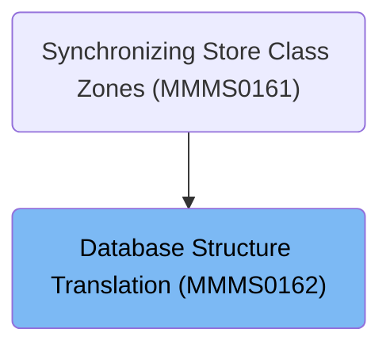

# Overview

## Dependencies

### Program

- MMMS0162 (<SwmPath>[base/src/MMMS0162.cbl](base/src/MMMS0162.cbl)</SwmPath>)

### Copybooks

- XXXN001A (<SwmPath>[base/src/XXXN001A.cpy](base/src/XXXN001A.cpy)</SwmPath>)
- YYYN111A (<SwmPath>[base/src/YYYN111A.cpy](base/src/YYYN111A.cpy)</SwmPath>)
- PPPTCZ01 (<SwmPath>[base/src/PPPTCZ01.cpy](base/src/PPPTCZ01.cpy)</SwmPath>)
- DDDPST01 (<SwmPath>[base/src/DDDPST01.cpy](base/src/DDDPST01.cpy)</SwmPath>)
- PPPTRL01 (<SwmPath>[base/src/PPPTRL01.cpy](base/src/PPPTRL01.cpy)</SwmPath>)

# Where is this program used?

This program is used once, as represented in the following diagram:

&nbsp;

*This is an auto-generated document by Swimm 🌊 and has not yet been verified by a human*

<SwmMeta version="3.0.0" repo-id="Z2l0aHViJTNBJTNBU3dpbW1pby1keW5jYWxsLWRlbW8lM0ElM0FHaXJpLVN3aW1t" repo-name="Swimmio-dyncall-demo">Powered by [Swimm](https://app.swimm.io/)</SwmMeta>
