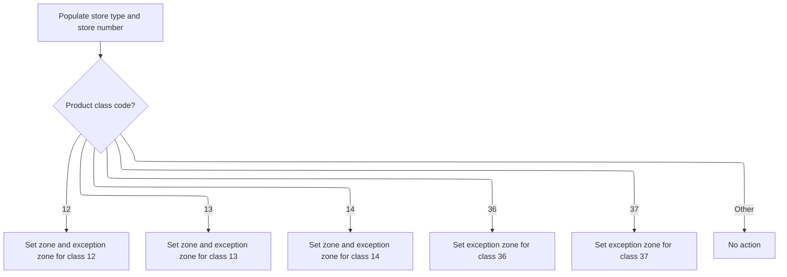
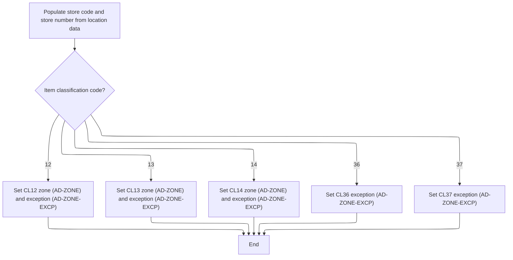
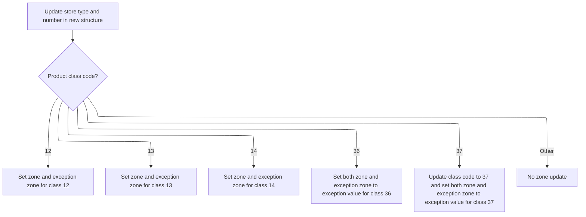

# Overview

This document describes the flow for translating store and item class data between legacy and new database formats. The process routes translation requests, maps store and item class information, and ensures correct zone and exception zone assignments for supported item classes.

## Dependencies

### Program

- <SwmToken path="base/src/MMMS0162.cbl" pos="65:5:5" line-data="006900         MOVE &#39;MMMS0162 - Invalid translation function.&#39;          00006900">`MMMS0162`</SwmToken> (<SwmPath>[base/src/MMMS0162.cbl](base/src/MMMS0162.cbl)</SwmPath>)

### Copybooks

- <SwmToken path="base/src/MMMS0162.cbl" pos="36:4:4" line-data="004000 COPY XXXN001A.                                                   00004000">`XXXN001A`</SwmToken> (<SwmPath>[base/src/XXXN001A.cpy](base/src/XXXN001A.cpy)</SwmPath>)
- <SwmToken path="base/src/MMMS0162.cbl" pos="57:4:4" line-data="006100       WHEN YYYN111A-NEW-2-OLD                                    00006100">`YYYN111A`</SwmToken> (<SwmPath>[base/src/YYYN111A.cpy](base/src/YYYN111A.cpy)</SwmPath>)
- <SwmToken path="base/src/MMMS0162.cbl" pos="38:4:4" line-data="004200 COPY PPPTCZ01.                                                   00004200">`PPPTCZ01`</SwmToken> (<SwmPath>[base/src/PPPTCZ01.cpy](base/src/PPPTCZ01.cpy)</SwmPath>)
- <SwmToken path="base/src/MMMS0162.cbl" pos="85:8:8" line-data="008900     PERFORM 210-POPULATE-DDDPST01                                00008900">`DDDPST01`</SwmToken> (<SwmPath>[base/src/DDDPST01.cpy](base/src/DDDPST01.cpy)</SwmPath>)
- <SwmToken path="base/src/MMMS0162.cbl" pos="40:4:4" line-data="004400 COPY PPPTRL01.                                                   00004400">`PPPTRL01`</SwmToken> (<SwmPath>[base/src/PPPTRL01.cpy](base/src/PPPTRL01.cpy)</SwmPath>)

# Where is this program used?

This program is used once, as represented in the following diagram:

```mermaid
graph TD
  dt3bi("Synchronizing Store Class Zones (MMMS0161)") --> gokm4("Database Structure Translation (MMMS0162)"):::currentEntity
click dt3bi openCode "base/src/MMMS0161.cbl:1"
  
  
click gokm4 openCode "base/src/MMMS0162.cbl:1"
    classDef currentEntity color:#000000,fill:#7CB9F4

%% Swimm:
%% graph TD
%%   dt3bi("Synchronizing Store Class Zones (MMMS0161)") --> gokm4("Database Structure Translation (<SwmToken path="base/src/MMMS0162.cbl" pos="65:5:5" line-data="006900         MOVE &#39;MMMS0162 - Invalid translation function.&#39;          00006900">`MMMS0162`</SwmToken>)"):::currentEntity
%% click dt3bi openCode "<SwmPath>[base/src/MMMS0161.cbl](base/src/MMMS0161.cbl)</SwmPath>:1"
%%   
%%   
%% click gokm4 openCode "<SwmPath>[base/src/MMMS0162.cbl](base/src/MMMS0162.cbl)</SwmPath>:1"
%%     classDef currentEntity color:#000000,fill:#7CB9F4
```



## Detailed View of the Program's Functionality

## a. Entry Point and Translation Routing

The program begins execution in its main section. The very first action is to reset or initialize the working storage area, ensuring that any data from previous runs does not interfere with the current operation.

After initialization, the program checks which translation function has been requested. This is determined by a control field that indicates whether the translation should be from the new format to the old format, from the old format to the new format, or if an invalid function code was provided.

- If the request is for new-to-old translation, the program branches to the routine responsible for this conversion.
- If the request is for old-to-new translation, it branches to the corresponding routine for that direction.
- If the function code is not recognized, the program sets a failure flag and populates an error message indicating an invalid translation function.

After handling the translation or error, the program ends and returns control to the caller.

---

## b. New Format to Old Format Mapping

When the new-to-old translation is requested, the program first populates the old format's store and item class information using data from the new format. This is done in a dedicated routine.

- The store type and store number are copied from the new format input to the old format output.
- The program then examines the item class code:
  - For class codes 12, 13, or 14, both the zone and exception zone values are copied from the new format to the corresponding fields for each class in the old format.
  - For class codes 36 or 37, only the exception zone is set in the old format.
  - For any other class code, no zone fields are updated.

If the store and item class mapping is successful, the program proceeds to populate the location and reporting fields in the old format's reporting structure.

- The store code and store number are again copied from the new format input to the reporting structure.
- The item class code is checked:
  - For class codes 12, 13, or 14, both the zone and exception zone values are set in the reporting structure.
  - For class codes 36 or 37, only the exception zone is set.
  - For any other class code, no zone fields are updated.

---

## c. Old Format to New Format Mapping

When the old-to-new translation is requested, the program starts by copying the store type and store number from the old format fields to the new format structure.

- The item class code is then examined:
  - For class codes 12, 13, or 14, both the zone and exception zone values are copied from the old format to the new format.
  - For class code 36, the exception zone value from the old format is used to set both the zone and exception zone fields in the new format.
  - For class code 37, the class code in the new format is explicitly set to 37, and the exception zone value from the old format is used for both the zone and exception zone fields.
  - For any other class code, no zone fields are updated.

---

## d. Error Handling

If an invalid translation function is requested (i.e., the function code is neither new-to-old nor old-to-new), the program sets a failure indicator and writes a specific error message to the output area. This ensures that the caller is informed of the incorrect usage.

---

## e. Initialization

Before any translation logic is executed, the program performs an explicit initialization of the main working storage area. This step is crucial to clear any residual data and ensure that each run of the program starts with a clean slate.

---

## f. Summary

- The program acts as a bridge between two database formats, translating store and item class information in both directions.
- It uses clear branching logic to determine which translation to perform.
- The mapping of fields is highly dependent on the item class code, with special handling for certain classes.
- Robust error handling is in place for invalid requests.
- Initialization is always performed to guarantee data integrity.

# Rule Definition

| Paragraph Name                                                                                                                                                                                                                                                                                                                                                                                                                                                                                                                                         | Rule ID | Category          | Description                                                                                                                                                                                                                                           | Conditions                                                              | Remarks                                                                                                                                                                                                                                                                                                                                               |
| ------------------------------------------------------------------------------------------------------------------------------------------------------------------------------------------------------------------------------------------------------------------------------------------------------------------------------------------------------------------------------------------------------------------------------------------------------------------------------------------------------------------------------------------------------ | ------- | ----------------- | ----------------------------------------------------------------------------------------------------------------------------------------------------------------------------------------------------------------------------------------------------- | ----------------------------------------------------------------------- | ----------------------------------------------------------------------------------------------------------------------------------------------------------------------------------------------------------------------------------------------------------------------------------------------------------------------------------------------------- |
| <SwmToken path="base/src/MMMS0162.cbl" pos="54:4:6" line-data="005800     PERFORM 100-INITIALIZE                                       00005800">`100-INITIALIZE`</SwmToken>                                                                                                                                                                                                                                                                                                                                                                           | RL-001  | Data Assignment   | Before processing each translation request, all working storage and output fields must be set to blank or zero values to ensure no residual data from previous requests affects the current operation.                                                | At the start of each translation request, before any processing occurs. | All fields are set to their default values (blank for alphanumeric, zero for numeric). This prevents data leakage between requests.                                                                                                                                                                                                                   |
| <SwmToken path="base/src/MMMS0162.cbl" pos="53:2:4" line-data="005700 000-MAIN.                                                        00005700">`000-MAIN`</SwmToken>                                                                                                                                                                                                                                                                                                                                                                                 | RL-002  | Conditional Logic | The program must check the translation function code. If it is not 'N' (new to old) or 'O' (old to new), it must set a FAILURE flag and return a specific error message.                                                                              | The function code is not 'N' or 'O'.                                    | The error message is '<SwmToken path="base/src/MMMS0162.cbl" pos="65:5:5" line-data="006900         MOVE &#39;MMMS0162 - Invalid translation function.&#39;          00006900">`MMMS0162`</SwmToken> - Invalid translation function.' The FAILURE flag is set to TRUE. The function code is provided in the input field for the translation function. |
| <SwmToken path="base/src/MMMS0162.cbl" pos="58:4:10" line-data="006200         PERFORM 200-NEW-2-OLD                                    00006200">`200-NEW-2-OLD`</SwmToken>, <SwmToken path="base/src/MMMS0162.cbl" pos="85:4:8" line-data="008900     PERFORM 210-POPULATE-DDDPST01                                00008900">`210-POPULATE-DDDPST01`</SwmToken>, <SwmToken path="base/src/MMMS0162.cbl" pos="87:4:8" line-data="009100       PERFORM 220-POPULATE-DDDTRL01                              00009100">`220-POPULATE-DDDTRL01`</SwmToken> | RL-003  | Computation       | When the function code is 'N', the program copies and maps fields from the new format input to the old format output, with specific handling for item class codes 12, 13, 14, 36, and 37. Only the specified fields are set; others remain unchanged. | Function code is 'N'.                                                   | Mappings:                                                                                                                                                                                                                                                                                                                                             |

- <SwmToken path="base/src/MMMS0162.cbl" pos="96:4:8" line-data="010000     MOVE LOC-TYP-CD                   OF P-DDDTCZ01              00010000">`LOC-TYP-CD`</SwmToken> and <SwmToken path="base/src/MMMS0162.cbl" pos="99:4:6" line-data="010300     MOVE LOC-NBR                      OF P-DDDTCZ01              00010300">`LOC-NBR`</SwmToken> from new input to <SwmToken path="base/src/MMMS0162.cbl" pos="97:4:8" line-data="010100       TO ST-STORE-TYPE                                           00010100">`ST-STORE-TYPE`</SwmToken> and <SwmToken path="base/src/MMMS0162.cbl" pos="100:4:8" line-data="010400       TO ST-STORE-NUMBER                                         00010400">`ST-STORE-NUMBER`</SwmToken> in <SwmToken path="base/src/MMMS0162.cbl" pos="85:8:8" line-data="008900     PERFORM 210-POPULATE-DDDPST01                                00008900">`DDDPST01`</SwmToken>, and to <SwmToken path="base/src/MMMS0162.cbl" pos="142:4:10" line-data="014600       TO FC-RL-STORE-CD                                          00014600">`FC-RL-STORE-CD`</SwmToken> and <SwmToken path="base/src/MMMS0162.cbl" pos="145:4:8" line-data="014900       TO FC-STORE-NO                                             00014900">`FC-STORE-NO`</SwmToken> in <SwmToken path="base/src/MMMS0162.cbl" pos="87:8:8" line-data="009100       PERFORM 220-POPULATE-DDDTRL01                              00009100">`DDDTRL01`</SwmToken>.
- For <SwmToken path="base/src/MMMS0162.cbl" pos="102:4:8" line-data="010600     EVALUATE ITM-CLS-CD                                          00010600">`ITM-CLS-CD`</SwmToken> = 12, 13, 14: <SwmToken path="base/src/MMMS0162.cbl" pos="105:4:6" line-data="010900       MOVE AD-ZONE                    OF P-DDDTCZ01              00010900">`AD-ZONE`</SwmToken> and <SwmToken path="base/src/MMMS0162.cbl" pos="107:4:8" line-data="011100       MOVE AD-ZONE-EXCP               OF P-DDDTCZ01              00011100">`AD-ZONE-EXCP`</SwmToken> are mapped to both <SwmToken path="base/src/MMMS0162.cbl" pos="85:8:8" line-data="008900     PERFORM 210-POPULATE-DDDPST01                                00008900">`DDDPST01`</SwmToken> and <SwmToken path="base/src/MMMS0162.cbl" pos="87:8:8" line-data="009100       PERFORM 220-POPULATE-DDDTRL01                              00009100">`DDDTRL01`</SwmToken> class-specific fields.
- For <SwmToken path="base/src/MMMS0162.cbl" pos="102:4:8" line-data="010600     EVALUATE ITM-CLS-CD                                          00010600">`ITM-CLS-CD`</SwmToken> = 36, 37: Only <SwmToken path="base/src/MMMS0162.cbl" pos="107:4:8" line-data="011100       MOVE AD-ZONE-EXCP               OF P-DDDTCZ01              00011100">`AD-ZONE-EXCP`</SwmToken> is mapped to the corresponding exception fields.
- For other codes, no zone fields are set. | | <SwmToken path="base/src/MMMS0162.cbl" pos="61:4:10" line-data="006500         PERFORM 500-OLD-2-NEW                                    00006500">`500-OLD-2-NEW`</SwmToken> | RL-004 | Computation | When the function code is 'O', the program copies and maps fields from the old format input to the new format output, with specific handling for the presence of class-specific fields. The item class code and zone fields are set according to which old format fields are present. | Function code is 'O'. | Mappings:
- <SwmToken path="base/src/MMMS0162.cbl" pos="97:4:8" line-data="010100       TO ST-STORE-TYPE                                           00010100">`ST-STORE-TYPE`</SwmToken> and <SwmToken path="base/src/MMMS0162.cbl" pos="100:4:8" line-data="010400       TO ST-STORE-NUMBER                                         00010400">`ST-STORE-NUMBER`</SwmToken> from <SwmToken path="base/src/MMMS0162.cbl" pos="85:8:8" line-data="008900     PERFORM 210-POPULATE-DDDPST01                                00008900">`DDDPST01`</SwmToken> to <SwmToken path="base/src/MMMS0162.cbl" pos="96:4:8" line-data="010000     MOVE LOC-TYP-CD                   OF P-DDDTCZ01              00010000">`LOC-TYP-CD`</SwmToken> and <SwmToken path="base/src/MMMS0162.cbl" pos="99:4:6" line-data="010300     MOVE LOC-NBR                      OF P-DDDTCZ01              00010300">`LOC-NBR`</SwmToken> in new output.
- If <SwmToken path="base/src/MMMS0162.cbl" pos="106:4:8" line-data="011000         TO ST-CLASS12-ZONE                                       00011000">`ST-CLASS12-ZONE`</SwmToken> or <SwmToken path="base/src/MMMS0162.cbl" pos="108:4:12" line-data="011200         TO ST-CLASS12-EXCEPTION-AD-ZONE                          00011200">`ST-CLASS12-EXCEPTION-AD-ZONE`</SwmToken> present: set <SwmToken path="base/src/MMMS0162.cbl" pos="102:4:8" line-data="010600     EVALUATE ITM-CLS-CD                                          00010600">`ITM-CLS-CD`</SwmToken> to 12, map zones.
- If <SwmToken path="base/src/MMMS0162.cbl" pos="113:4:8" line-data="011700         TO ST-CLASS13-ZONE                                       00011700">`ST-CLASS13-ZONE`</SwmToken> or <SwmToken path="base/src/MMMS0162.cbl" pos="115:4:12" line-data="011900         TO ST-CLASS13-EXCEPTION-AD-ZONE                          00011900">`ST-CLASS13-EXCEPTION-AD-ZONE`</SwmToken> present: set <SwmToken path="base/src/MMMS0162.cbl" pos="102:4:8" line-data="010600     EVALUATE ITM-CLS-CD                                          00010600">`ITM-CLS-CD`</SwmToken> to 13, map zones.
- If <SwmToken path="base/src/MMMS0162.cbl" pos="120:4:8" line-data="012400         TO ST-CLASS14-ZONE                                       00012400">`ST-CLASS14-ZONE`</SwmToken> or <SwmToken path="base/src/MMMS0162.cbl" pos="122:4:12" line-data="012600         TO ST-CLASS14-EXCEPTION-AD-ZONE                          00012600">`ST-CLASS14-EXCEPTION-AD-ZONE`</SwmToken> present: set <SwmToken path="base/src/MMMS0162.cbl" pos="102:4:8" line-data="010600     EVALUATE ITM-CLS-CD                                          00010600">`ITM-CLS-CD`</SwmToken> to 14, map zones.
- If <SwmToken path="base/src/MMMS0162.cbl" pos="127:4:12" line-data="013100         TO ST-CLASS36-EXCEPTION-AD-ZONE                          00013100">`ST-CLASS36-EXCEPTION-AD-ZONE`</SwmToken> present: set <SwmToken path="base/src/MMMS0162.cbl" pos="102:4:8" line-data="010600     EVALUATE ITM-CLS-CD                                          00010600">`ITM-CLS-CD`</SwmToken> to 36, set <SwmToken path="base/src/MMMS0162.cbl" pos="105:4:6" line-data="010900       MOVE AD-ZONE                    OF P-DDDTCZ01              00010900">`AD-ZONE`</SwmToken> to blank, map exception zone.
- If <SwmToken path="base/src/MMMS0162.cbl" pos="132:4:12" line-data="013600         TO ST-CLASS37-EXCEPTION-AD-ZONE                          00013600">`ST-CLASS37-EXCEPTION-AD-ZONE`</SwmToken> present: set <SwmToken path="base/src/MMMS0162.cbl" pos="102:4:8" line-data="010600     EVALUATE ITM-CLS-CD                                          00010600">`ITM-CLS-CD`</SwmToken> to 37, set <SwmToken path="base/src/MMMS0162.cbl" pos="105:4:6" line-data="010900       MOVE AD-ZONE                    OF P-DDDTCZ01              00010900">`AD-ZONE`</SwmToken> to blank, map exception zone.
- Otherwise, do not set zone fields. | | <SwmToken path="base/src/MMMS0162.cbl" pos="58:4:10" line-data="006200         PERFORM 200-NEW-2-OLD                                    00006200">`200-NEW-2-OLD`</SwmToken>, <SwmToken path="base/src/MMMS0162.cbl" pos="85:4:8" line-data="008900     PERFORM 210-POPULATE-DDDPST01                                00008900">`210-POPULATE-DDDPST01`</SwmToken>, <SwmToken path="base/src/MMMS0162.cbl" pos="87:4:8" line-data="009100       PERFORM 220-POPULATE-DDDTRL01                              00009100">`220-POPULATE-DDDTRL01`</SwmToken>, <SwmToken path="base/src/MMMS0162.cbl" pos="61:4:10" line-data="006500         PERFORM 500-OLD-2-NEW                                    00006500">`500-OLD-2-NEW`</SwmToken> | RL-005 | Conditional Logic | The program must not set any fields in the output that are not explicitly mapped by the translation rules for the given direction and item class code. | During any translation operation, for any item class code. | Only the fields specified in the mapping rules are set; all others remain at their initialized values (blank or zero). |

# User Stories

## User Story 1: Translate from new format to old format

---

### Story Description:

As a user, I want to translate data from the new format to the old format so that legacy systems can process the information correctly, with only the specified fields mapped, all others left blank or zero, and invalid function codes detected and reported.

---

### Business Rule Mapping:

| Rule ID | Paragraph Name                                                                                                                                                                                                                                                                                                                                                                                                                                                                                                                                                                                                                                                                                                                       | Rule Description                                                                                                                                                                                                                                      |
| ------- | ------------------------------------------------------------------------------------------------------------------------------------------------------------------------------------------------------------------------------------------------------------------------------------------------------------------------------------------------------------------------------------------------------------------------------------------------------------------------------------------------------------------------------------------------------------------------------------------------------------------------------------------------------------------------------------------------------------------------------------ | ----------------------------------------------------------------------------------------------------------------------------------------------------------------------------------------------------------------------------------------------------- |
| RL-002  | <SwmToken path="base/src/MMMS0162.cbl" pos="53:2:4" line-data="005700 000-MAIN.                                                        00005700">`000-MAIN`</SwmToken>                                                                                                                                                                                                                                                                                                                                                                                                                                                                                                                                                               | The program must check the translation function code. If it is not 'N' (new to old) or 'O' (old to new), it must set a FAILURE flag and return a specific error message.                                                                              |
| RL-003  | <SwmToken path="base/src/MMMS0162.cbl" pos="58:4:10" line-data="006200         PERFORM 200-NEW-2-OLD                                    00006200">`200-NEW-2-OLD`</SwmToken>, <SwmToken path="base/src/MMMS0162.cbl" pos="85:4:8" line-data="008900     PERFORM 210-POPULATE-DDDPST01                                00008900">`210-POPULATE-DDDPST01`</SwmToken>, <SwmToken path="base/src/MMMS0162.cbl" pos="87:4:8" line-data="009100       PERFORM 220-POPULATE-DDDTRL01                              00009100">`220-POPULATE-DDDTRL01`</SwmToken>                                                                                                                                                                               | When the function code is 'N', the program copies and maps fields from the new format input to the old format output, with specific handling for item class codes 12, 13, 14, 36, and 37. Only the specified fields are set; others remain unchanged. |
| RL-005  | <SwmToken path="base/src/MMMS0162.cbl" pos="58:4:10" line-data="006200         PERFORM 200-NEW-2-OLD                                    00006200">`200-NEW-2-OLD`</SwmToken>, <SwmToken path="base/src/MMMS0162.cbl" pos="85:4:8" line-data="008900     PERFORM 210-POPULATE-DDDPST01                                00008900">`210-POPULATE-DDDPST01`</SwmToken>, <SwmToken path="base/src/MMMS0162.cbl" pos="87:4:8" line-data="009100       PERFORM 220-POPULATE-DDDTRL01                              00009100">`220-POPULATE-DDDTRL01`</SwmToken>, <SwmToken path="base/src/MMMS0162.cbl" pos="61:4:10" line-data="006500         PERFORM 500-OLD-2-NEW                                    00006500">`500-OLD-2-NEW`</SwmToken> | The program must not set any fields in the output that are not explicitly mapped by the translation rules for the given direction and item class code.                                                                                                |
| RL-001  | <SwmToken path="base/src/MMMS0162.cbl" pos="54:4:6" line-data="005800     PERFORM 100-INITIALIZE                                       00005800">`100-INITIALIZE`</SwmToken>                                                                                                                                                                                                                                                                                                                                                                                                                                                                                                                                                         | Before processing each translation request, all working storage and output fields must be set to blank or zero values to ensure no residual data from previous requests affects the current operation.                                                |

---

### Relevant Functionality:

- <SwmToken path="base/src/MMMS0162.cbl" pos="53:2:4" line-data="005700 000-MAIN.                                                        00005700">`000-MAIN`</SwmToken>
  1. **RL-002:**
     - If the function code is not 'N' or 'O':
       - Set FAILURE flag to TRUE
       - Set the return message text to '<SwmToken path="base/src/MMMS0162.cbl" pos="65:5:5" line-data="006900         MOVE &#39;MMMS0162 - Invalid translation function.&#39;          00006900">`MMMS0162`</SwmToken> - Invalid translation function.'
- <SwmToken path="base/src/MMMS0162.cbl" pos="58:4:10" line-data="006200         PERFORM 200-NEW-2-OLD                                    00006200">`200-NEW-2-OLD`</SwmToken>
  1. **RL-003:**
     - If function code is 'N':
       - Copy location type and number from new input to old output fields.
       - Evaluate item class code:
         - If 12, 13, or 14:
           - Map <SwmToken path="base/src/MMMS0162.cbl" pos="105:4:6" line-data="010900       MOVE AD-ZONE                    OF P-DDDTCZ01              00010900">`AD-ZONE`</SwmToken> and <SwmToken path="base/src/MMMS0162.cbl" pos="107:4:8" line-data="011100       MOVE AD-ZONE-EXCP               OF P-DDDTCZ01              00011100">`AD-ZONE-EXCP`</SwmToken> to class-specific fields in both <SwmToken path="base/src/MMMS0162.cbl" pos="85:8:8" line-data="008900     PERFORM 210-POPULATE-DDDPST01                                00008900">`DDDPST01`</SwmToken> and <SwmToken path="base/src/MMMS0162.cbl" pos="87:8:8" line-data="009100       PERFORM 220-POPULATE-DDDTRL01                              00009100">`DDDTRL01`</SwmToken>.
         - If 36 or 37:
           - Map <SwmToken path="base/src/MMMS0162.cbl" pos="107:4:8" line-data="011100       MOVE AD-ZONE-EXCP               OF P-DDDTCZ01              00011100">`AD-ZONE-EXCP`</SwmToken> to the class-specific exception fields.
         - Otherwise:
           - Do not set any zone or exception zone fields.
  2. **RL-005:**
     - After initialization, only set fields as specified by the mapping rules for the current translation direction and item class code.
     - Do not assign values to any other output fields.
- <SwmToken path="base/src/MMMS0162.cbl" pos="54:4:6" line-data="005800     PERFORM 100-INITIALIZE                                       00005800">`100-INITIALIZE`</SwmToken>
  1. **RL-001:**
     - On entry to the program or before processing a new request:
       - Set all working storage and output fields to blank or zero.

## User Story 2: Translate from old format to new format

---

### Story Description:

As a user, I want to translate data from the old format to the new format so that modern systems can process the information correctly, with only the specified fields mapped, all others left blank or zero, and invalid function codes detected and reported.

---

### Business Rule Mapping:

| Rule ID | Paragraph Name                                                                                                                                                                                                                                                                                                                                                                                                                                                                                                                                                                                                                                                                                                                       | Rule Description                                                                                                                                                                                                                                                                      |
| ------- | ------------------------------------------------------------------------------------------------------------------------------------------------------------------------------------------------------------------------------------------------------------------------------------------------------------------------------------------------------------------------------------------------------------------------------------------------------------------------------------------------------------------------------------------------------------------------------------------------------------------------------------------------------------------------------------------------------------------------------------ | ------------------------------------------------------------------------------------------------------------------------------------------------------------------------------------------------------------------------------------------------------------------------------------- |
| RL-002  | <SwmToken path="base/src/MMMS0162.cbl" pos="53:2:4" line-data="005700 000-MAIN.                                                        00005700">`000-MAIN`</SwmToken>                                                                                                                                                                                                                                                                                                                                                                                                                                                                                                                                                               | The program must check the translation function code. If it is not 'N' (new to old) or 'O' (old to new), it must set a FAILURE flag and return a specific error message.                                                                                                              |
| RL-005  | <SwmToken path="base/src/MMMS0162.cbl" pos="58:4:10" line-data="006200         PERFORM 200-NEW-2-OLD                                    00006200">`200-NEW-2-OLD`</SwmToken>, <SwmToken path="base/src/MMMS0162.cbl" pos="85:4:8" line-data="008900     PERFORM 210-POPULATE-DDDPST01                                00008900">`210-POPULATE-DDDPST01`</SwmToken>, <SwmToken path="base/src/MMMS0162.cbl" pos="87:4:8" line-data="009100       PERFORM 220-POPULATE-DDDTRL01                              00009100">`220-POPULATE-DDDTRL01`</SwmToken>, <SwmToken path="base/src/MMMS0162.cbl" pos="61:4:10" line-data="006500         PERFORM 500-OLD-2-NEW                                    00006500">`500-OLD-2-NEW`</SwmToken> | The program must not set any fields in the output that are not explicitly mapped by the translation rules for the given direction and item class code.                                                                                                                                |
| RL-004  | <SwmToken path="base/src/MMMS0162.cbl" pos="61:4:10" line-data="006500         PERFORM 500-OLD-2-NEW                                    00006500">`500-OLD-2-NEW`</SwmToken>                                                                                                                                                                                                                                                                                                                                                                                                                                                                                                                                                         | When the function code is 'O', the program copies and maps fields from the old format input to the new format output, with specific handling for the presence of class-specific fields. The item class code and zone fields are set according to which old format fields are present. |
| RL-001  | <SwmToken path="base/src/MMMS0162.cbl" pos="54:4:6" line-data="005800     PERFORM 100-INITIALIZE                                       00005800">`100-INITIALIZE`</SwmToken>                                                                                                                                                                                                                                                                                                                                                                                                                                                                                                                                                         | Before processing each translation request, all working storage and output fields must be set to blank or zero values to ensure no residual data from previous requests affects the current operation.                                                                                |

---

### Relevant Functionality:

- <SwmToken path="base/src/MMMS0162.cbl" pos="53:2:4" line-data="005700 000-MAIN.                                                        00005700">`000-MAIN`</SwmToken>
  1. **RL-002:**
     - If the function code is not 'N' or 'O':
       - Set FAILURE flag to TRUE
       - Set the return message text to '<SwmToken path="base/src/MMMS0162.cbl" pos="65:5:5" line-data="006900         MOVE &#39;MMMS0162 - Invalid translation function.&#39;          00006900">`MMMS0162`</SwmToken> - Invalid translation function.'
- <SwmToken path="base/src/MMMS0162.cbl" pos="58:4:10" line-data="006200         PERFORM 200-NEW-2-OLD                                    00006200">`200-NEW-2-OLD`</SwmToken>
  1. **RL-005:**
     - After initialization, only set fields as specified by the mapping rules for the current translation direction and item class code.
     - Do not assign values to any other output fields.
- <SwmToken path="base/src/MMMS0162.cbl" pos="61:4:10" line-data="006500         PERFORM 500-OLD-2-NEW                                    00006500">`500-OLD-2-NEW`</SwmToken>
  1. **RL-004:**
     - If function code is 'O':
       - Copy store type and number from old input to new output fields.
       - Evaluate which class-specific fields are present:
         - If class 12 fields present:
           - Set <SwmToken path="base/src/MMMS0162.cbl" pos="102:4:8" line-data="010600     EVALUATE ITM-CLS-CD                                          00010600">`ITM-CLS-CD`</SwmToken> to 12, map zones.
         - If class 13 fields present:
           - Set <SwmToken path="base/src/MMMS0162.cbl" pos="102:4:8" line-data="010600     EVALUATE ITM-CLS-CD                                          00010600">`ITM-CLS-CD`</SwmToken> to 13, map zones.
         - If class 14 fields present:
           - Set <SwmToken path="base/src/MMMS0162.cbl" pos="102:4:8" line-data="010600     EVALUATE ITM-CLS-CD                                          00010600">`ITM-CLS-CD`</SwmToken> to 14, map zones.
         - If class 36 exception present:
           - Set <SwmToken path="base/src/MMMS0162.cbl" pos="102:4:8" line-data="010600     EVALUATE ITM-CLS-CD                                          00010600">`ITM-CLS-CD`</SwmToken> to 36, set <SwmToken path="base/src/MMMS0162.cbl" pos="105:4:6" line-data="010900       MOVE AD-ZONE                    OF P-DDDTCZ01              00010900">`AD-ZONE`</SwmToken> to blank, map exception zone.
         - If class 37 exception present:
           - Set <SwmToken path="base/src/MMMS0162.cbl" pos="102:4:8" line-data="010600     EVALUATE ITM-CLS-CD                                          00010600">`ITM-CLS-CD`</SwmToken> to 37, set <SwmToken path="base/src/MMMS0162.cbl" pos="105:4:6" line-data="010900       MOVE AD-ZONE                    OF P-DDDTCZ01              00010900">`AD-ZONE`</SwmToken> to blank, map exception zone.
         - Otherwise:
           - Do not set any zone or exception zone fields.
- <SwmToken path="base/src/MMMS0162.cbl" pos="54:4:6" line-data="005800     PERFORM 100-INITIALIZE                                       00005800">`100-INITIALIZE`</SwmToken>
  1. **RL-001:**
     - On entry to the program or before processing a new request:
       - Set all working storage and output fields to blank or zero.

# Workflow

# Entry Point and Translation Routing

```mermaid
%%{init: {"flowchart": {"defaultRenderer": "elk"}} }%%
flowchart TD
    node1["Start and initialize"] --> node2{"Requested translation function?"}
    click node1 openCode "base/src/MMMS0162.cbl:53:54"
    node2 -->|"NEW-2-OLD ('N')"| node3["Perform NEW-2-OLD translation"]
    click node2 openCode "base/src/MMMS0162.cbl:56:57"
    click node3 openCode "base/src/MMMS0162.cbl:58:58"
    node2 -->|"OLD-2-NEW ('O')"| node4["Perform OLD-2-NEW translation"]
    click node4 openCode "base/src/MMMS0162.cbl:61:61"
    node2 -->|"Other"| node5["Set FAILURE to TRUE and error message: 'MMMS0162 - Invalid translation function.'"]
    click node5 openCode "base/src/MMMS0162.cbl:64:66"
    node3 --> node6["End"]
    node4 --> node6
    node5 --> node6
    click node6 openCode "base/src/MMMS0162.cbl:69:69"

classDef HeadingStyle fill:#777777,stroke:#333,stroke-width:2px;

%% Swimm:
%% %%{init: {"flowchart": {"defaultRenderer": "elk"}} }%%
%% flowchart TD
%%     node1["Start and initialize"] --> node2{"Requested translation function?"}
%%     click node1 openCode "<SwmPath>[base/src/MMMS0162.cbl](base/src/MMMS0162.cbl)</SwmPath>:53:54"
%%     node2 -->|"<SwmToken path="base/src/MMMS0162.cbl" pos="57:6:10" line-data="006100       WHEN YYYN111A-NEW-2-OLD                                    00006100">`NEW-2-OLD`</SwmToken> ('N')"| node3["Perform <SwmToken path="base/src/MMMS0162.cbl" pos="57:6:10" line-data="006100       WHEN YYYN111A-NEW-2-OLD                                    00006100">`NEW-2-OLD`</SwmToken> translation"]
%%     click node2 openCode "<SwmPath>[base/src/MMMS0162.cbl](base/src/MMMS0162.cbl)</SwmPath>:56:57"
%%     click node3 openCode "<SwmPath>[base/src/MMMS0162.cbl](base/src/MMMS0162.cbl)</SwmPath>:58:58"
%%     node2 -->|"<SwmToken path="base/src/MMMS0162.cbl" pos="60:6:10" line-data="006400       WHEN YYYN111A-OLD-2-NEW                                    00006400">`OLD-2-NEW`</SwmToken> ('O')"| node4["Perform <SwmToken path="base/src/MMMS0162.cbl" pos="60:6:10" line-data="006400       WHEN YYYN111A-OLD-2-NEW                                    00006400">`OLD-2-NEW`</SwmToken> translation"]
%%     click node4 openCode "<SwmPath>[base/src/MMMS0162.cbl](base/src/MMMS0162.cbl)</SwmPath>:61:61"
%%     node2 -->|"Other"| node5["Set FAILURE to TRUE and error message: '<SwmToken path="base/src/MMMS0162.cbl" pos="65:5:5" line-data="006900         MOVE &#39;MMMS0162 - Invalid translation function.&#39;          00006900">`MMMS0162`</SwmToken> - Invalid translation function.'"]
%%     click node5 openCode "<SwmPath>[base/src/MMMS0162.cbl](base/src/MMMS0162.cbl)</SwmPath>:64:66"
%%     node3 --> node6["End"]
%%     node4 --> node6
%%     node5 --> node6
%%     click node6 openCode "<SwmPath>[base/src/MMMS0162.cbl](base/src/MMMS0162.cbl)</SwmPath>:69:69"
%% 
%% classDef HeadingStyle fill:#777777,stroke:#333,stroke-width:2px;
```



This section acts as the entry point for translation requests, initializing the environment and routing the request to the appropriate translation routine based on the specified function code. It also handles invalid function codes by setting a failure flag and returning an error message.

| Category       | Rule Name                      | Description                                                                                 |
| -------------- | ------------------------------ | ------------------------------------------------------------------------------------------- |
| Business logic | New-to-Old Translation Routing | If the translation function code is 'N', the system must perform a new-to-old translation.  |
| Business logic | Old-to-New Translation Routing | If the translation function code is 'O', the system must perform an old-to-new translation. |

<SwmSnippet path="/base/src/MMMS0162.cbl" line="53">

---

In <SwmToken path="base/src/MMMS0162.cbl" pos="53:2:4" line-data="005700 000-MAIN.                                                        00005700">`000-MAIN`</SwmToken> we kick off the flow by calling <SwmToken path="base/src/MMMS0162.cbl" pos="54:4:6" line-data="005800     PERFORM 100-INITIALIZE                                       00005800">`100-INITIALIZE`</SwmToken> to reset the environment. This sets up the working storage so we don't get any leftover junk from previous operations. Right after, the function code is checked to decide which translation routine to run: new-to-old or old-to-new. If the code is invalid, we bail out with a failure flag and an error message.

```cobol
005700 000-MAIN.                                                        00005700
005800     PERFORM 100-INITIALIZE                                       00005800
```

---

</SwmSnippet>

<SwmSnippet path="/base/src/MMMS0162.cbl" line="56">

---

After initialization, we use an EVALUATE block to check YYYN111A-FUNCTION. If it's 'N', we call <SwmToken path="base/src/MMMS0162.cbl" pos="58:4:10" line-data="006200         PERFORM 200-NEW-2-OLD                                    00006200">`200-NEW-2-OLD`</SwmToken> to handle new-to-old translation. If it's 'O', we call <SwmToken path="base/src/MMMS0162.cbl" pos="61:4:10" line-data="006500         PERFORM 500-OLD-2-NEW                                    00006500">`500-OLD-2-NEW`</SwmToken> for the reverse. Anything else, we set FAILURE and return an error message.

```cobol
006000     EVALUATE TRUE                                                00006000
006100       WHEN YYYN111A-NEW-2-OLD                                    00006100
006200         PERFORM 200-NEW-2-OLD                                    00006200
006300                                                                  00006300
006400       WHEN YYYN111A-OLD-2-NEW                                    00006400
006500         PERFORM 500-OLD-2-NEW                                    00006500
006600                                                                  00006600
006700       WHEN OTHER                                                 00006700
006800         SET FAILURE TO TRUE                                      00006800
006900         MOVE 'MMMS0162 - Invalid translation function.'          00006900
007000           TO IS-RTRN-MSG-TXT                                     00007000
007100     END-EVALUATE                                                 00007100
007200                                                                  00007200
007300     GOBACK                                                       00007300
007400     .                                                            00007400
```

---

</SwmSnippet>

# New Format to Old Format Mapping

This section ensures that data from a new format is correctly mapped to an old format, following a two-step process: first mapping store and item class information, and then, if successful, mapping location and reporting fields.

| Category       | Rule Name                                  | Description                                                                                                                                                                                  |
| -------------- | ------------------------------------------ | -------------------------------------------------------------------------------------------------------------------------------------------------------------------------------------------- |
| Business logic | Store and Item Class Mapping Prerequisite  | Store and item class information must be mapped from the new format to the old format before any further mapping occurs.                                                                     |
| Business logic | Conditional Location and Reporting Mapping | If the mapping of store and item class information is successful (indicated by a return code of 0), then location and reporting fields must be mapped from the new format to the old format. |

<SwmSnippet path="/base/src/MMMS0162.cbl" line="84">

---

<SwmToken path="base/src/MMMS0162.cbl" pos="84:2:8" line-data="008800 200-NEW-2-OLD.                                                   00008800">`200-NEW-2-OLD`</SwmToken> starts by calling <SwmToken path="base/src/MMMS0162.cbl" pos="85:4:8" line-data="008900     PERFORM 210-POPULATE-DDDPST01                                00008900">`210-POPULATE-DDDPST01`</SwmToken> to map store and item class info from the new format to the old. If that works (SUCCESS), we move on to <SwmToken path="base/src/MMMS0162.cbl" pos="87:4:8" line-data="009100       PERFORM 220-POPULATE-DDDTRL01                              00009100">`220-POPULATE-DDDTRL01`</SwmToken> to handle location and reporting fields.

```cobol
008800 200-NEW-2-OLD.                                                   00008800
008900     PERFORM 210-POPULATE-DDDPST01                                00008900
009000     IF SUCCESS                                                   00009000
009100       PERFORM 220-POPULATE-DDDTRL01                              00009100
009200     END-IF                                                       00009200
009300     .                                                            00009300
```

---

</SwmSnippet>

# Store and Item Class Zone Assignment



This section governs how store and item class zone assignments are made based on the item class code. It ensures that only the correct zone and exception zone fields are populated for each supported item class, and that store identification information is always copied to the output.

| Category        | Rule Name                       | Description                                                                                                                                                                  |
| --------------- | ------------------------------- | ---------------------------------------------------------------------------------------------------------------------------------------------------------------------------- |
| Data validation | Unsupported class code handling | If the item class code is not 12, 13, 14, 36, or 37, no zone or exception zone fields are set in the output record.                                                          |
| Business logic  | Store identification copy       | Store type and store number must always be copied from the input to the output record, regardless of item class code.                                                        |
| Business logic  | Class 12 zone assignment        | If the item class code is 12, the zone and exception zone from the input must be assigned to the class 12 zone and exception zone fields in the output.                      |
| Business logic  | Class 13 zone assignment        | If the item class code is 13, the zone and exception zone from the input must be assigned to the class 13 zone and exception zone fields in the output.                      |
| Business logic  | Class 14 zone assignment        | If the item class code is 14, the zone and exception zone from the input must be assigned to the class 14 zone and exception zone fields in the output.                      |
| Business logic  | Class 36 exception zone only    | If the item class code is 36, only the exception zone from the input must be assigned to the class 36 exception zone field in the output. The regular zone field is not set. |
| Business logic  | Class 37 exception zone only    | If the item class code is 37, only the exception zone from the input must be assigned to the class 37 exception zone field in the output. The regular zone field is not set. |

<SwmSnippet path="/base/src/MMMS0162.cbl" line="95">

---

In <SwmToken path="base/src/MMMS0162.cbl" pos="95:2:6" line-data="009900 210-POPULATE-DDDPST01.                                           00009900">`210-POPULATE-DDDPST01`</SwmToken> we start by copying the store type and store number from the input to the output structure. This sets up the basic store info before we deal with item class zones.

```cobol
009900 210-POPULATE-DDDPST01.                                           00009900
010000     MOVE LOC-TYP-CD                   OF P-DDDTCZ01              00010000
010100       TO ST-STORE-TYPE                                           00010100
010200                                                                  00010200
010300     MOVE LOC-NBR                      OF P-DDDTCZ01              00010300
010400       TO ST-STORE-NUMBER                                         00010400
```

---

</SwmSnippet>

<SwmSnippet path="/base/src/MMMS0162.cbl" line="102">

---

After setting up store info, we use EVALUATE to check the item class code. For code 12, we move the zone and exception zone from the input to the class 12 fields in the output.

```cobol
010600     EVALUATE ITM-CLS-CD                                          00010600
010700      WHEN 12                                                     00010700
010800                                                                  00010800
010900       MOVE AD-ZONE                    OF P-DDDTCZ01              00010900
011000         TO ST-CLASS12-ZONE                                       00011000
011100       MOVE AD-ZONE-EXCP               OF P-DDDTCZ01              00011100
011200         TO ST-CLASS12-EXCEPTION-AD-ZONE                          00011200
```

---

</SwmSnippet>

<SwmSnippet path="/base/src/MMMS0162.cbl" line="110">

---

For item class 13, we do the same thing as for 12: move the zone and exception zone to the class 13 fields.

```cobol
011400      WHEN 13                                                     00011400
011500                                                                  00011500
011600       MOVE AD-ZONE                    OF P-DDDTCZ01              00011600
011700         TO ST-CLASS13-ZONE                                       00011700
011800       MOVE AD-ZONE-EXCP               OF P-DDDTCZ01              00011800
011900         TO ST-CLASS13-EXCEPTION-AD-ZONE                          00011900
```

---

</SwmSnippet>

<SwmSnippet path="/base/src/MMMS0162.cbl" line="117">

---

For item class 14, we again move the zone and exception zone to the class 14 fields. It's just repeating the same mapping for each class.

```cobol
012100      WHEN 14                                                     00012100
012200                                                                  00012200
012300       MOVE AD-ZONE                    OF P-DDDTCZ01              00012300
012400         TO ST-CLASS14-ZONE                                       00012400
012500       MOVE AD-ZONE-EXCP               OF P-DDDTCZ01              00012500
012600         TO ST-CLASS14-EXCEPTION-AD-ZONE                          00012600
```

---

</SwmSnippet>

<SwmSnippet path="/base/src/MMMS0162.cbl" line="124">

---

For item class 36, we only set the exception zone field, no regular zone here.

```cobol
012800      WHEN 36                                                     00012800
012900                                                                  00012900
013000       MOVE AD-ZONE-EXCP               OF P-DDDTCZ01              00013000
013100         TO ST-CLASS36-EXCEPTION-AD-ZONE                          00013100
```

---

</SwmSnippet>

<SwmSnippet path="/base/src/MMMS0162.cbl" line="129">

---

After handling all the item class codes, we finish the EVALUATE block. If the code wasn't one of the expected values, no fields are set for zones or exception zones.

```cobol
013300      WHEN 37                                                     00013300
013400                                                                  00013400
013500       MOVE AD-ZONE-EXCP               OF P-DDDTCZ01              00013500
013600         TO ST-CLASS37-EXCEPTION-AD-ZONE                          00013600
013700     END-EVALUATE                                                 00013700
```

---

</SwmSnippet>

# Location and Reporting Structure Mapping



This section maps location and item classification data to the reporting structure, ensuring that store identifiers and relevant zone information are correctly assigned for downstream reporting and analytics.

| Category       | Rule Name                          | Description                                                                                                                                                                                                                                                                                                                                                                                                                                                                                                       |
| -------------- | ---------------------------------- | ----------------------------------------------------------------------------------------------------------------------------------------------------------------------------------------------------------------------------------------------------------------------------------------------------------------------------------------------------------------------------------------------------------------------------------------------------------------------------------------------------------------- |
| Business logic | Store identifier mapping           | The store code and store number in the reporting structure must always be populated from the corresponding location data fields, regardless of item classification.                                                                                                                                                                                                                                                                                                                                               |
| Business logic | Class 12 zone assignment           | If the item classification code is 12, the reporting structure must have both the <SwmToken path="base/src/MMMS0162.cbl" pos="150:8:8" line-data="015400         TO FC-RL-CL12-ZONE-NO                                    00015400">`CL12`</SwmToken> zone and <SwmToken path="base/src/MMMS0162.cbl" pos="150:8:8" line-data="015400         TO FC-RL-CL12-ZONE-NO                                    00015400">`CL12`</SwmToken> exception zone fields populated from the input zone and exception zone values. |
| Business logic | Class 13 zone assignment           | If the item classification code is 13, the reporting structure must have both the <SwmToken path="base/src/MMMS0162.cbl" pos="157:8:8" line-data="016100         TO FC-RL-CL13-ZONE-NO                                    00016100">`CL13`</SwmToken> zone and <SwmToken path="base/src/MMMS0162.cbl" pos="157:8:8" line-data="016100         TO FC-RL-CL13-ZONE-NO                                    00016100">`CL13`</SwmToken> exception zone fields populated from the input zone and exception zone values. |
| Business logic | Class 14 zone assignment           | If the item classification code is 14, the reporting structure must have both the <SwmToken path="base/src/MMMS0162.cbl" pos="164:8:8" line-data="016800         TO FC-RL-CL14-ZONE-NO                                    00016800">`CL14`</SwmToken> zone and <SwmToken path="base/src/MMMS0162.cbl" pos="164:8:8" line-data="016800         TO FC-RL-CL14-ZONE-NO                                    00016800">`CL14`</SwmToken> exception zone fields populated from the input zone and exception zone values. |
| Business logic | Class 36 exception zone assignment | If the item classification code is 36, only the <SwmToken path="base/src/MMMS0162.cbl" pos="171:8:8" line-data="017500         TO FC-RL-CL36-ADZN-NO                                    00017500">`CL36`</SwmToken> exception zone field in the reporting structure must be populated from the input exception zone value; the zone field is not set.                                                                                                                                                             |
| Business logic | Class 37 exception zone assignment | If the item classification code is 37, only the <SwmToken path="base/src/MMMS0162.cbl" pos="176:8:8" line-data="018000         TO FC-RL-CL37-ADZN-NO                                    00018000">`CL37`</SwmToken> exception zone field in the reporting structure must be populated from the input exception zone value; the zone field is not set.                                                                                                                                                             |
| Business logic | Unhandled item class exclusion     | If the item classification code is not 12, 13, 14, 36, or 37, no zone or exception zone fields are set in the reporting structure for that item.                                                                                                                                                                                                                                                                                                                                                                  |

<SwmSnippet path="/base/src/MMMS0162.cbl" line="140">

---

In <SwmToken path="base/src/MMMS0162.cbl" pos="140:2:6" line-data="014400 220-POPULATE-DDDTRL01.                                           00014400">`220-POPULATE-DDDTRL01`</SwmToken> we copy the store code and store number from the input to the reporting structure fields. This sets up the basic reporting info before handling item class zones.

```cobol
014400 220-POPULATE-DDDTRL01.                                           00014400
014500     MOVE LOC-TYP-CD                   OF P-DDDTCZ01              00014500
014600       TO FC-RL-STORE-CD                                          00014600
014700                                                                  00014700
014800     MOVE LOC-NBR                      OF P-DDDTCZ01              00014800
014900       TO FC-STORE-NO                                             00014900
```

---

</SwmSnippet>

<SwmSnippet path="/base/src/MMMS0162.cbl" line="147">

---

For item class 12, we set the reporting structure's zone and exception zone fields from the input.

```cobol
015100     EVALUATE ITM-CLS-CD                                          00015100
015200      WHEN 12                                                     00015200
015300       MOVE AD-ZONE                    OF P-DDDTCZ01              00015300
015400         TO FC-RL-CL12-ZONE-NO                                    00015400
015500       MOVE AD-ZONE-EXCP               OF P-DDDTCZ01              00015500
015600         TO FC-RL-CL12-ADZN-NO                                    00015600
```

---

</SwmSnippet>

<SwmSnippet path="/base/src/MMMS0162.cbl" line="154">

---

For item class 13, we do the same thing: set the reporting zone and exception zone fields.

```cobol
015800      WHEN 13                                                     00015800
015900                                                                  00015900
016000       MOVE AD-ZONE                    OF P-DDDTCZ01              00016000
016100         TO FC-RL-CL13-ZONE-NO                                    00016100
016200       MOVE AD-ZONE-EXCP               OF P-DDDTCZ01              00016200
016300         TO FC-RL-CL13-ADZN-NO                                    00016300
```

---

</SwmSnippet>

<SwmSnippet path="/base/src/MMMS0162.cbl" line="161">

---

For item class 14, we again set the reporting zone and exception zone fields. It's just repeating the same mapping for each class.

```cobol
016500      WHEN 14                                                     00016500
016600                                                                  00016600
016700       MOVE AD-ZONE                    OF P-DDDTCZ01              00016700
016800         TO FC-RL-CL14-ZONE-NO                                    00016800
016900       MOVE AD-ZONE-EXCP               OF P-DDDTCZ01              00016900
017000         TO FC-RL-CL14-ADZN-NO                                    00017000
```

---

</SwmSnippet>

<SwmSnippet path="/base/src/MMMS0162.cbl" line="168">

---

For item class 36, we only set the exception zone field in the reporting structure.

```cobol
017200      WHEN 36                                                     00017200
017300                                                                  00017300
017400       MOVE AD-ZONE-EXCP               OF P-DDDTCZ01              00017400
017500         TO FC-RL-CL36-ADZN-NO                                    00017500
```

---

</SwmSnippet>

<SwmSnippet path="/base/src/MMMS0162.cbl" line="173">

---

After handling all the item class codes, we finish the EVALUATE block. If the code wasn't one of the expected values, no fields are set for zones or exception zones in the reporting structure.

```cobol
017700      WHEN 37                                                     00017700
017800                                                                  00017800
017900       MOVE AD-ZONE-EXCP               OF P-DDDTCZ01              00017900
018000         TO FC-RL-CL37-ADZN-NO                                    00018000
018100     END-EVALUATE                                                 00018100
```

---

</SwmSnippet>

# Old Format to New Format Mapping



This section ensures that store and item class information from the legacy format is accurately mapped to the new format structure, with specific logic for different item class codes to ensure correct zone and exception zone assignment.

| Category       | Rule Name                             | Description                                                                                                                                                                              |
| -------------- | ------------------------------------- | ---------------------------------------------------------------------------------------------------------------------------------------------------------------------------------------- |
| Business logic | Store info initialization             | The store type and store number from the old format must always be copied to the new format structure before any further processing.                                                     |
| Business logic | Class 12 zone mapping                 | If the item class code is 12, the zone and exception zone values from the old format must be set in the new format structure.                                                            |
| Business logic | Class 13 zone mapping                 | If the item class code is 13, the zone and exception zone values from the old format must be set in the new format structure.                                                            |
| Business logic | Class 14 zone mapping                 | If the item class code is 14, the zone and exception zone values from the old format must be set in the new format structure.                                                            |
| Business logic | Class 36 exception mapping            | If the item class code is 36, both the zone and exception zone in the new format must be set to the exception zone value from the old format.                                            |
| Business logic | Class 37 update and exception mapping | If the item class code is 37, the item class code in the new format must be set to 37, and both the zone and exception zone must be set to the exception zone value from the old format. |
| Business logic | Other class codes exclusion           | If the item class code is not 12, 13, 14, 36, or 37, no zone or exception zone values are set in the new format structure.                                                               |

<SwmSnippet path="/base/src/MMMS0162.cbl" line="184">

---

In <SwmToken path="base/src/MMMS0162.cbl" pos="184:2:8" line-data="018800 500-OLD-2-NEW.                                                   00018800">`500-OLD-2-NEW`</SwmToken> we start by copying the store type and store number from the old format fields to the new format structure. This sets up the basic store info before we deal with item class zones.

```cobol
018800 500-OLD-2-NEW.                                                   00018800
018900     MOVE ST-STORE-TYPE                                           00018900
019000       TO LOC-TYP-CD                   OF P-DDDTCZ01              00019000
019100                                                                  00019100
019200     MOVE ST-STORE-NUMBER                                         00019200
019300       TO LOC-NBR                      OF P-DDDTCZ01              00019300
```

---

</SwmSnippet>

<SwmSnippet path="/base/src/MMMS0162.cbl" line="191">

---

After setting up store info, we use EVALUATE to check the item class code. For code 12, we move the zone and exception zone from the old format fields to the new format structure.

```cobol
019500     EVALUATE ITM-CLS-CD                                          00019500
019600      WHEN 12                                                     00019600
019900       MOVE ST-CLASS12-ZONE                                       00019900
020000         TO AD-ZONE                    OF P-DDDTCZ01              00020000
020100       MOVE ST-CLASS12-EXCEPTION-AD-ZONE                          00020100
020200         TO AD-ZONE-EXCP               OF P-DDDTCZ01              00020200
```

---

</SwmSnippet>

<SwmSnippet path="/base/src/MMMS0162.cbl" line="198">

---

For item class 13, we do the same thing as for 12: move the zone and exception zone to the new format fields.

```cobol
020400      WHEN 13                                                     00020400
020700       MOVE ST-CLASS13-ZONE                                       00020700
020800         TO AD-ZONE                    OF P-DDDTCZ01              00020800
020900       MOVE ST-CLASS13-EXCEPTION-AD-ZONE                          00020900
021000         TO AD-ZONE-EXCP               OF P-DDDTCZ01              00021000
```

---

</SwmSnippet>

<SwmSnippet path="/base/src/MMMS0162.cbl" line="204">

---

For item class 14, we again move the zone and exception zone to the new format fields. It's just repeating the same mapping for each class.

```cobol
021200      WHEN 14                                                     00021200
021500       MOVE ST-CLASS14-ZONE                                       00021500
021600         TO AD-ZONE                    OF P-DDDTCZ01              00021600
021700       MOVE ST-CLASS14-EXCEPTION-AD-ZONE                          00021700
021800         TO AD-ZONE-EXCP               OF P-DDDTCZ01              00021800
```

---

</SwmSnippet>

<SwmSnippet path="/base/src/MMMS0162.cbl" line="210">

---

For item class 36, we only set the exception zone field in the new format structure.

```cobol
022000      WHEN 36                                                     00022000
022300       MOVE ST-CLASS36-EXCEPTION-AD-ZONE                          00022300
022400         TO AD-ZONE                    OF P-DDDTCZ01              00022400
022500       MOVE ST-CLASS36-EXCEPTION-AD-ZONE                          00022500
022600         TO AD-ZONE-EXCP               OF P-DDDTCZ01              00022600
```

---

</SwmSnippet>

<SwmSnippet path="/base/src/MMMS0162.cbl" line="216">

---

After handling all the item class codes, we finish the EVALUATE block. If the code wasn't one of the expected values, no fields are set for zones or exception zones in the new format structure.

```cobol
022800      WHEN 37                                                     00022800
023000       MOVE 37                                                    00023000
023100         TO ITM-CLS-CD                 OF P-DDDTCZ01              00023100
023200       MOVE ST-CLASS37-EXCEPTION-AD-ZONE                          00023200
023300         TO AD-ZONE                    OF P-DDDTCZ01              00023300
023400       MOVE ST-CLASS37-EXCEPTION-AD-ZONE                          00023400
023500         TO AD-ZONE-EXCP               OF P-DDDTCZ01              00023500
023600     END-EVALUATE                                                 00023600
```

---

</SwmSnippet>

&nbsp;

*This is an auto-generated document by Swimm 🌊 and has not yet been verified by a human*

<SwmMeta version="3.0.0" repo-id="Z2l0aHViJTNBJTNBU3dpbW1pby1keW5jYWxsLWRlbW8lM0ElM0FHaXJpLVN3aW1t" repo-name="Swimmio-dyncall-demo"><sup>Powered by [Swimm](https://app.swimm.io/)</sup></SwmMeta>
