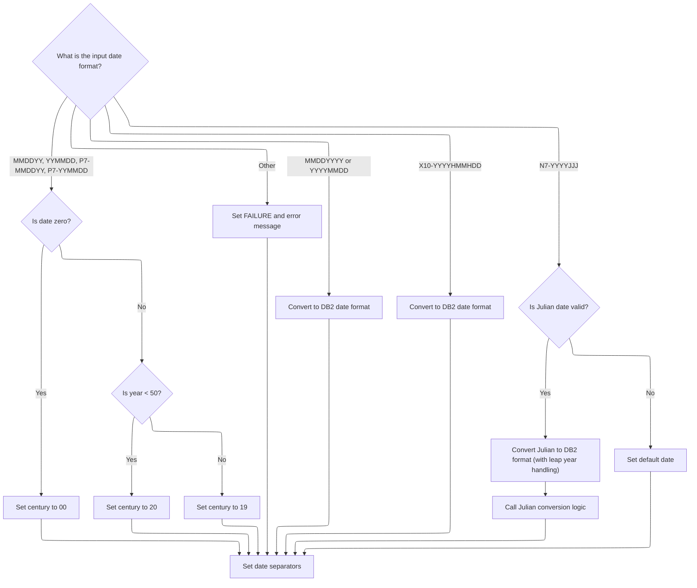
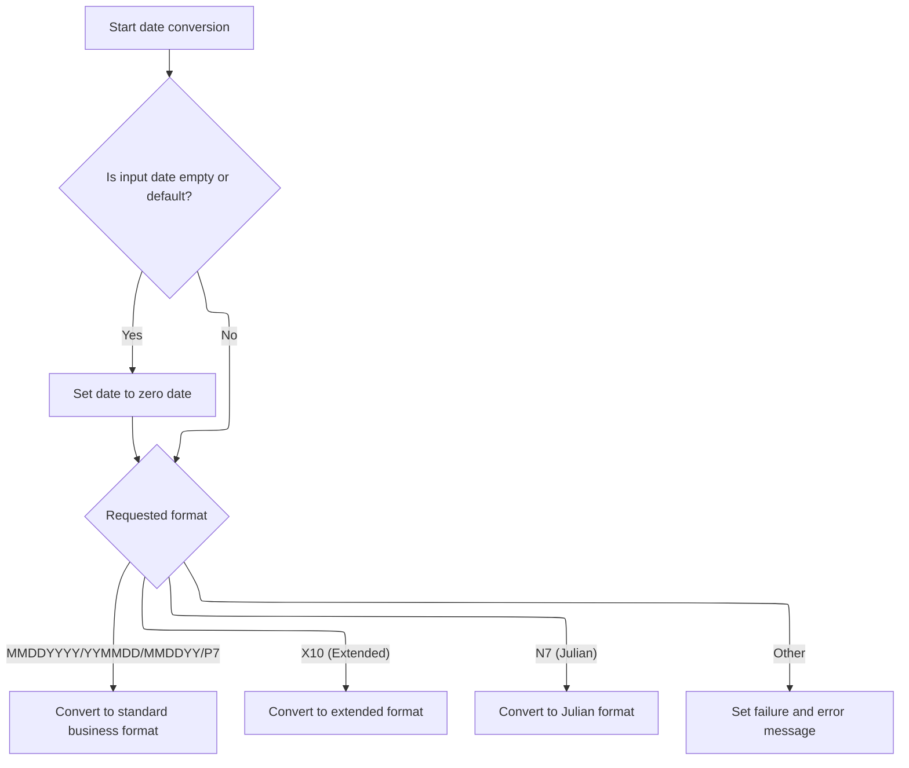

This document describes the flow for converting date values between business formats and DB2 database formats. The flow receives a date value and a conversion type as input, validates them, and then performs the requested conversion. It supports multiple date representations and applies business rules to ensure accurate conversion. The output is the converted date or an error message if the input is invalid.

# Spec

## Detailed View of the Program's Functionality

# Entry and Input Validation

## Program Start and Initialization

The main entry point of the program begins by performing an initialization routine. This routine resets or prepares the working storage and input/output areas to ensure a clean state for processing. After initialization, the program proceeds to validate the input data.

## Input Validation

The input validation routine checks the format and content of the incoming date data. For each supported date format, it verifies whether the input is numeric. If the input is not numeric, it resets the value to zero. This check is performed for multiple formats, including 8-digit and 6-digit numeric dates, packed 7-digit dates, and Julian dates. If any input fails validation, an error message is set, and further processing is skipped.

## Conversion Decision

After validation, the program evaluates which conversion operation to perform based on the requested function (convert to DB2 format or convert from DB2 format). If the input is invalid, it skips conversion. If the function is not recognized, it sets an error message indicating an invalid conversion function.

# Date to DB2 Format Conversion

## Format Branching

When converting to DB2 format, the program examines the input date format and branches accordingly:

- For 8-digit numeric formats (either month-day-year or year-month-day), it rearranges the components into the DB2 standard format.
- For 6-digit formats (month-day-year or year-month-day), as well as packed 7-digit formats, it checks if the date is zero. If so, it sets the century to "00". Otherwise, it determines the century based on the year value: years less than 50 are assigned to the 21st century ("20"), and years 50 or greater to the 20th century ("19").
- For extended 10-character formats, it rearranges the components into the DB2 format.
- For 7-digit Julian formats, it checks if the input is zero. If not, it calls a subroutine to convert the Julian date to DB2 format, handling leap years and month/day calculations. If the input is zero, it assigns a default date.
- If the format is not recognized, it sets an error message.

## Julian Date Conversion

The Julian date conversion subroutine handles the transformation of a year and day-of-year value into a standard date. For days 1-31, it assigns January; for days 32-59, it assigns February. For higher days, it determines if the year is a leap year and then loops through a table of month start and end days to find the correct month and day. Special handling is included for leap years, particularly for the 60th day.

## Final Formatting

After conversion, the program sets the date separators in the output format to ensure consistency.

# DB2 to Business Date Conversion

## Initial Checks

When converting from DB2 format, the program first checks if the input date is empty or set to a default value. If so, it sets the output to a zero date.

## Format Branching

The program then branches based on the requested output format:

- For standard business formats (8-digit, 6-digit, packed 7-digit), it rearranges the DB2 date components into the requested format.
- For extended 10-character formats, it rearranges the components and inserts separators.
- For Julian formats, it calls a subroutine to convert the DB2 date back to a Julian format.
- If the format is not recognized, it sets an error message.

# Julian Date and Leap Year Logic

## Julian to DB2 Conversion

The Julian-to-DB2 conversion subroutine initializes temporary storage and counters. It then determines the month and day based on the day-of-year value, using a table of month ranges. For leap years, it adjusts the calculation as needed, especially for the 60th day.

## DB2 to Julian Conversion

The DB2-to-Julian conversion subroutine takes the year, month, and day from the DB2 format and calculates the corresponding Julian day-of-year. It uses the month number to find the starting day for that month and adds the day value, adjusting for leap years if necessary.

## Leap Year Determination

The leap year determination subroutine checks if the year is divisible by 4, 100, and 400, following standard leap year rules. It sets a flag indicating whether the year is a leap year or a regular year, which is used in the Julian conversion logic.

# Error Handling

Throughout the flow, if any input or format is invalid or unsupported, the program sets a failure flag and provides a descriptive error message in the output area. This ensures that calling programs or users are informed of the reason for any failed conversion.

# Rule Definition

| Paragraph Name                                                 | Rule ID | Category          | Description                                                                                                                                                                                                                    | Conditions                                                                                               | Remarks                                                                                                                                                                                                  |
| -------------------------------------------------------------- | ------- | ----------------- | ------------------------------------------------------------------------------------------------------------------------------------------------------------------------------------------------------------------------------ | -------------------------------------------------------------------------------------------------------- | -------------------------------------------------------------------------------------------------------------------------------------------------------------------------------------------------------- |
| 200-CHECK-INPUTS                                               | RL-001  | Conditional Logic | Before attempting any date conversion, the program must validate that the input date is numeric and that the format code is supported. If the input is invalid, the output must indicate FAILURE and provide an error message. | Input date must be numeric for the selected format code; format code must be one of the supported codes. | Supported format codes: N8-MMDDYYYY, N8-YYYYMMDD, N6-MMDDYY, N6-YYMMDD, P7-MMDDYY, P7-YYMMDD, X10-YYYYHMMHDD, N7-YYYYJJJ. Error message: 'MMMS9012 - Invalid input date format.' Output status: FAILURE. |
| 200-CHECK-INPUTS, 300-CONV-TO-DB2, 400-CONV-FROM-DB2           | RL-002  | Conditional Logic | The program must support and recognize the following input format codes: N8-MMDDYYYY, N8-YYYYMMDD, N6-MMDDYY, N6-YYMMDD, P7-MMDDYY, P7-YYMMDD, X10-YYYYHMMHDD, N7-YYYYJJJ.                                                     | Input format code must match one of the supported codes.                                                 | Format codes are checked in EVALUATE statements. Unsupported codes result in FAILURE.                                                                                                                    |
| 300-CONV-TO-DB2                                                | RL-003  | Computation       | For input formats with 2-digit years (N6-MMDDYY, N6-YYMMDD, P7-MMDDYY, P7-YYMMDD), the century must be determined: if year < 50, use century 20; if year >= 50, use century 19.                                                | Input format is one of the 2-digit year formats and year value is present.                               | Century is set to '20' if year < 50, otherwise '19'. Output year is constructed as CCYY.                                                                                                                 |
| 300-CONV-TO-DB2, 900-JULIAN-TO-DB2-CONV, 990-LEAP-YEAR-FIND    | RL-004  | Computation       | For N7-YYYYJJJ input, convert year and Julian day to month and day, accounting for leap years. If Julian day is zero or invalid, set output to default date and indicate FAILURE.                                              | Input format is N7-YYYYJJJ and Julian day is valid (1-365/366 depending on leap year).                   | Default date used if Julian day is zero or invalid. Leap year calculation uses division and remainder logic. Output format is MM/DD/YYYY.                                                                |
| 300-CONV-TO-DB2, 400-CONV-FROM-DB2                             | RL-005  | Computation       | For X10-YYYYHMMHDD input, parse the date using hyphens as separators and convert to the requested output format.                                                                                                               | Input format is X10-YYYYHMMHDD.                                                                          | Input is 10 characters: 4-digit year, hyphen, 2-digit month, hyphen, 2-digit day. Output format is determined by requested conversion.                                                                   |
| 300-CONV-TO-DB2                                                | RL-006  | Computation       | The program must convert all supported input formats to the DB2 date format (MM/DD/YYYY) when requested.                                                                                                                       | Requested conversion is to DB2 format and input format is supported.                                     | DB2 date format: MM/DD/YYYY (10 characters, slashes as separators).                                                                                                                                      |
| 400-CONV-FROM-DB2                                              | RL-007  | Computation       | The program must support conversion from DB2 date format to any of the supported business formats, rearranging date components as required by the output format code.                                                          | Requested conversion is from DB2 format and output format code is supported.                             | Output format is determined by requested business format code. Rearrangement of components as per format specification.                                                                                  |
| 300-CONV-TO-DB2                                                | RL-008  | Data Assignment   | When producing DB2 format output, the program must set slashes as separators between month, day, and year.                                                                                                                     | Output format is DB2 (MM/DD/YYYY).                                                                       | DB2 format: MM/DD/YYYY, 10 characters, slashes at positions 3 and 6.                                                                                                                                     |
| 300-CONV-TO-DB2, 400-CONV-FROM-DB2                             | RL-009  | Conditional Logic | If the requested output format is not supported, the program must indicate FAILURE and provide an error message.                                                                                                               | Requested output format code is not among supported codes.                                               | Error message: 'MMMS9012 - Invalid date conversion type.' Output status: FAILURE.                                                                                                                        |
| 000-MAIN, 200-CHECK-INPUTS, 300-CONV-TO-DB2, 400-CONV-FROM-DB2 | RL-010  | Data Assignment   | The output must include the converted date, a status (SUCCESS or FAILURE), and an error message if applicable.                                                                                                                 | Any conversion attempt.                                                                                  | Output fields: converted date (format varies), status (SUCCESS/FAILURE), error message (string, if applicable).                                                                                          |

# User Stories

## User Story 1: Input validation and error handling

---

### Story Description:

As a user, I want the program to validate my input date and format code before conversion so that I receive clear feedback if my input is invalid.

---

### Business Rule Mapping:

| Rule ID | Paragraph Name                                                 | Rule Description                                                                                                                                                                                                               |
| ------- | -------------------------------------------------------------- | ------------------------------------------------------------------------------------------------------------------------------------------------------------------------------------------------------------------------------ |
| RL-010  | 000-MAIN, 200-CHECK-INPUTS, 300-CONV-TO-DB2, 400-CONV-FROM-DB2 | The output must include the converted date, a status (SUCCESS or FAILURE), and an error message if applicable.                                                                                                                 |
| RL-001  | 200-CHECK-INPUTS                                               | Before attempting any date conversion, the program must validate that the input date is numeric and that the format code is supported. If the input is invalid, the output must indicate FAILURE and provide an error message. |
| RL-002  | 200-CHECK-INPUTS, 300-CONV-TO-DB2, 400-CONV-FROM-DB2           | The program must support and recognize the following input format codes: N8-MMDDYYYY, N8-YYYYMMDD, N6-MMDDYY, N6-YYMMDD, P7-MMDDYY, P7-YYMMDD, X10-YYYYHMMHDD, N7-YYYYJJJ.                                                     |
| RL-009  | 300-CONV-TO-DB2, 400-CONV-FROM-DB2                             | If the requested output format is not supported, the program must indicate FAILURE and provide an error message.                                                                                                               |

---

### Relevant Functionality:

- **000-MAIN**
  1. **RL-010:**
     - After conversion, set output date field.
     - Set status to SUCCESS or FAILURE.
     - If FAILURE, set error message field.
- **200-CHECK-INPUTS**
  1. **RL-001:**
     - For each supported format code:
       - If input date is not numeric, set output date to zero/default and indicate FAILURE.
     - If format code is not supported, indicate FAILURE and set error message.
  2. **RL-002:**
     - When processing input, check if format code matches one of the supported codes.
     - If not, set FAILURE and provide error message.
- **300-CONV-TO-DB2**
  1. **RL-009:**
     - If output format code is not supported:
       - Set FAILURE status.
       - Set error message.

## User Story 2: Conversion to DB2 date format

---

### Story Description:

As a user, I want to convert dates from any supported business format to the DB2 date format (MM/DD/YYYY) so that I can use standardized dates in my database.

---

### Business Rule Mapping:

| Rule ID | Paragraph Name                                                 | Rule Description                                                                                                                                                                  |
| ------- | -------------------------------------------------------------- | --------------------------------------------------------------------------------------------------------------------------------------------------------------------------------- |
| RL-010  | 000-MAIN, 200-CHECK-INPUTS, 300-CONV-TO-DB2, 400-CONV-FROM-DB2 | The output must include the converted date, a status (SUCCESS or FAILURE), and an error message if applicable.                                                                    |
| RL-003  | 300-CONV-TO-DB2                                                | For input formats with 2-digit years (N6-MMDDYY, N6-YYMMDD, P7-MMDDYY, P7-YYMMDD), the century must be determined: if year < 50, use century 20; if year >= 50, use century 19.   |
| RL-004  | 300-CONV-TO-DB2, 900-JULIAN-TO-DB2-CONV, 990-LEAP-YEAR-FIND    | For N7-YYYYJJJ input, convert year and Julian day to month and day, accounting for leap years. If Julian day is zero or invalid, set output to default date and indicate FAILURE. |
| RL-005  | 300-CONV-TO-DB2, 400-CONV-FROM-DB2                             | For X10-YYYYHMMHDD input, parse the date using hyphens as separators and convert to the requested output format.                                                                  |
| RL-006  | 300-CONV-TO-DB2                                                | The program must convert all supported input formats to the DB2 date format (MM/DD/YYYY) when requested.                                                                          |
| RL-008  | 300-CONV-TO-DB2                                                | When producing DB2 format output, the program must set slashes as separators between month, day, and year.                                                                        |

---

### Relevant Functionality:

- **000-MAIN**
  1. **RL-010:**
     - After conversion, set output date field.
     - Set status to SUCCESS or FAILURE.
     - If FAILURE, set error message field.
- **300-CONV-TO-DB2**
  1. **RL-003:**
     - Extract 2-digit year from input.
     - If year < 50, set century to 20.
     - Else, set century to 19.
     - Combine century and year for output.
  2. **RL-004:**
     - If Julian day is zero, set output to default date and indicate FAILURE.
     - Else, determine if year is leap year.
     - Use conversion table to map Julian day to month and day.
     - Construct output date as MM/DD/YYYY.
  3. **RL-005:**
     - Parse year, month, and day from input using hyphens as delimiters.
     - Rearrange components as required by output format.
  4. **RL-006:**
     - For each supported input format:
       - Extract date components.
       - Rearrange components to MM/DD/YYYY.
       - Insert slashes as separators.
  5. **RL-008:**
     - After constructing MMDDYYYY, insert '/' at positions 3 and 6.

## User Story 3: Conversion from DB2 to business formats

---

### Story Description:

As a user, I want to convert dates from DB2 format to any supported business format so that I can use dates in the format required by my business processes.

---

### Business Rule Mapping:

| Rule ID | Paragraph Name                                                 | Rule Description                                                                                                                                                           |
| ------- | -------------------------------------------------------------- | -------------------------------------------------------------------------------------------------------------------------------------------------------------------------- |
| RL-010  | 000-MAIN, 200-CHECK-INPUTS, 300-CONV-TO-DB2, 400-CONV-FROM-DB2 | The output must include the converted date, a status (SUCCESS or FAILURE), and an error message if applicable.                                                             |
| RL-002  | 200-CHECK-INPUTS, 300-CONV-TO-DB2, 400-CONV-FROM-DB2           | The program must support and recognize the following input format codes: N8-MMDDYYYY, N8-YYYYMMDD, N6-MMDDYY, N6-YYMMDD, P7-MMDDYY, P7-YYMMDD, X10-YYYYHMMHDD, N7-YYYYJJJ. |
| RL-005  | 300-CONV-TO-DB2, 400-CONV-FROM-DB2                             | For X10-YYYYHMMHDD input, parse the date using hyphens as separators and convert to the requested output format.                                                           |
| RL-009  | 300-CONV-TO-DB2, 400-CONV-FROM-DB2                             | If the requested output format is not supported, the program must indicate FAILURE and provide an error message.                                                           |
| RL-007  | 400-CONV-FROM-DB2                                              | The program must support conversion from DB2 date format to any of the supported business formats, rearranging date components as required by the output format code.      |

---

### Relevant Functionality:

- **000-MAIN**
  1. **RL-010:**
     - After conversion, set output date field.
     - Set status to SUCCESS or FAILURE.
     - If FAILURE, set error message field.
- **200-CHECK-INPUTS**
  1. **RL-002:**
     - When processing input, check if format code matches one of the supported codes.
     - If not, set FAILURE and provide error message.
- **300-CONV-TO-DB2**
  1. **RL-005:**
     - Parse year, month, and day from input using hyphens as delimiters.
     - Rearrange components as required by output format.
  2. **RL-009:**
     - If output format code is not supported:
       - Set FAILURE status.
       - Set error message.
- **400-CONV-FROM-DB2**
  1. **RL-007:**
     - Extract MM, DD, YYYY from DB2 format.
     - Rearrange components as required by output format code.
     - For X10-YYYYHMMHDD, insert hyphens; for N8/N6/P7 formats, concatenate as per specification.

# Code Walkthrough

## Entry and Input Validation

<SwmSnippet path="/base/src/MMMS9012.cbl" line="120">

---

`000-MAIN` starts the flow, validates the input, and only then decides which conversion to run. If the input is bad, it sets an error and skips conversion.

```cobol
012700 000-MAIN.                                                        00012700
012800     PERFORM 100-INITIALIZE                                       00012800
012900     PERFORM 200-CHECK-INPUTS                                     00012900
013000                                                                  00013000
013100     EVALUATE TRUE                                                00013100
013200       WHEN NOT SUCCESS                                           00013200
013300         CONTINUE                                                 00013300
013400                                                                  00013400
013500       WHEN MMMC9012-CONV-TO-DB2                                  00013500
013600         PERFORM 300-CONV-TO-DB2                                  00013600
013700                                                                  00013700
013800       WHEN MMMC9012-CONV-FROM-DB2                                00013800
013900         PERFORM 400-CONV-FROM-DB2                                00013900
014000                                                                  00014000
014100       WHEN OTHER                                                 00014100
014200         SET FAILURE TO TRUE                                      00014200
014300         MOVE 'MMMS9012 - Invalid date conversion function.'      00014300
014400           TO IS-RTRN-MSG-TXT                                     00014400
014500     END-EVALUATE                                                 00014500
014600                                                                  00014600
014700     GOBACK                                                       00014700
014800     .                                                            00014800
```

---

</SwmSnippet>

<SwmSnippet path="/base/src/MMMS9012.cbl" line="155">

---

`200-CHECK-INPUTS` validates the date input for each format, resets non-numeric values to zero, and sets an error message if anything's off.

```cobol
016200 200-CHECK-INPUTS.                                                00016200
016300     EVALUATE TRUE                                                00016300
016400       WHEN MMMC9012-CONV-TO-DB2                                  00016400
016500       AND  MMMC9012-PIC-N8-MMDDYYYY                              00016500
016600         IF WS-DATE-N8 NOT NUMERIC                                00016600
016700           MOVE 0 TO WS-DATE-N8                                   00016700
016800         END-IF                                                   00016800
016900       WHEN MMMC9012-CONV-TO-DB2                                  00016900
017000       AND  MMMC9012-PIC-N8-YYYYMMDD                              00017000
017100         IF WS-DATE-N8 NOT NUMERIC                                00017100
017200           MOVE 0 TO WS-DATE-N8                                   00017200
017300         END-IF                                                   00017300
017400       WHEN MMMC9012-CONV-TO-DB2                                  00017400
017500       AND  MMMC9012-PIC-N6-MMDDYY                                00017500
017600         IF WS-DATE-N6 NOT NUMERIC                                00017600
017700           MOVE 0 TO WS-DATE-N6                                   00017700
017800         END-IF                                                   00017800
017900       WHEN MMMC9012-CONV-TO-DB2                                  00017900
018000       AND  MMMC9012-PIC-N6-YYMMDD                                00018000
018100         IF WS-DATE-N6 NOT NUMERIC                                00018100
018200           MOVE 0 TO WS-DATE-N6                                   00018200
018300         END-IF                                                   00018300
018400       WHEN MMMC9012-CONV-TO-DB2                                  00018400
018500       AND  MMMC9012-PIC-P7-MMDDYY                                00018500
018600         IF WS-DATE-P7 NOT NUMERIC                                00018600
018700           MOVE 0 TO WS-DATE-P7                                   00018700
018800         END-IF                                                   00018800
018900       WHEN MMMC9012-CONV-TO-DB2                                  00018900
019000       AND  MMMC9012-PIC-P7-YYMMDD                                00019000
019100         IF WS-DATE-P7 NOT NUMERIC                                00019100
019200           MOVE 0 TO WS-DATE-P7                                   00019200
019300         END-IF                                                   00019300
019400       WHEN MMMC9012-CONV-TO-DB2                                  00019400
019500       AND  MMMC9012-PIC-X10-YYYYHMMHDD                           00019500
019600           CONTINUE                                               00019600
019700       WHEN MMMC9012-CONV-TO-DB2                                  00019700
019800       AND  MMMC9012-PIC-N7-YYYYJJJ                               00019800
019900       IF  WS-DATE-N7 NOT NUMERIC                                 00019900
020000          MOVE 0  TO WS-DATE-N7                                   00020000
020100       END-IF                                                     00020100
020200     END-EVALUATE                                                 00020200
020300                                                                  00020300
020400     IF NOT SUCCESS                                               00020400
020500       MOVE 'MMMS9012 - Invalid input date format.'               00020500
020600         TO IS-RTRN-MSG-TXT                                       00020600
020700     END-IF                                                       00020700
020800     .                                                            00020800
```

---

</SwmSnippet>

### Date to DB2 Format Conversion



<SwmSnippet path="/base/src/MMMS9012.cbl" line="207">

---

`300-CONV-TO-DB2` handles all the logic for converting various input date formats to the DB2 standard. It branches based on the repository's format codes, rearranges date components, and applies business rules for century calculation on 2-digit years. For Julian dates, it calls 900-JULIAN-TO-DB2-CONV to do the actual conversion, since that's a more complex calculation. If the Julian input is zero, it just assigns a default date. Unsupported formats trigger an error message.

```cobol
021400 300-CONV-TO-DB2.                                                 00021400
021500     EVALUATE TRUE                                                00021500
021600       WHEN MMMC9012-PIC-N8-MMDDYYYY                              00021600
021700         MOVE WS-DATE-N8       TO WS-MMDDYYYY                     00021700
021800         MOVE WS-MMDDYYYY-MM   TO WS-MM-DD-YYYY-MM                00021800
021900         MOVE WS-MMDDYYYY-DD   TO WS-MM-DD-YYYY-DD                00021900
022000         MOVE WS-MMDDYYYY-YYYY TO WS-MM-DD-YYYY-YYYY              00022000
022100       WHEN MMMC9012-PIC-N8-YYYYMMDD                              00022100
022200         MOVE WS-DATE-N8       TO WS-YYYYMMDD                     00022200
022300         MOVE WS-YYYYMMDD-MM   TO WS-MM-DD-YYYY-MM                00022300
022400         MOVE WS-YYYYMMDD-DD   TO WS-MM-DD-YYYY-DD                00022400
022500         MOVE WS-YYYYMMDD-YYYY TO WS-MM-DD-YYYY-YYYY              00022500
022600       WHEN MMMC9012-PIC-N6-MMDDYY                                00022600
022700         MOVE WS-DATE-N6       TO WS-MMDDYY                       00022700
022800         MOVE WS-MMDDYY-MM     TO WS-MM-DD-YYYY-MM                00022800
022900         MOVE WS-MMDDYY-DD     TO WS-MM-DD-YYYY-DD                00022900
023000         MOVE WS-MMDDYY-YY     TO WS-MM-DD-YYYY-YY                00023000
023100         IF WS-MMDDYY = 0                                         00023100
023200             MOVE 00 TO WS-MM-DD-YYYY-CC                          00023200
023300         ELSE                                                     00023300
023400*            IF WS-MMDDYY-YY < 20                                 00023400
023410             IF WS-MMDDYY-YY < 50                                 00023410
023500               MOVE 20 TO WS-MM-DD-YYYY-CC                        00023500
023600             ELSE                                                 00023600
023700               MOVE 19 TO WS-MM-DD-YYYY-CC                        00023700
023800             END-IF                                               00023800
023900         END-IF                                                   00023900
024000       WHEN MMMC9012-PIC-N6-YYMMDD                                00024000
024100         MOVE WS-DATE-N6       TO WS-YYMMDD                       00024100
024200         MOVE WS-YYMMDD-MM     TO WS-MM-DD-YYYY-MM                00024200
024300         MOVE WS-YYMMDD-DD     TO WS-MM-DD-YYYY-DD                00024300
024400         MOVE WS-YYMMDD-YY     TO WS-MM-DD-YYYY-YY                00024400
024500         IF WS-YYMMDD = 0                                         00024500
024600            MOVE 00 TO WS-MM-DD-YYYY-CC                           00024600
024700         ELSE                                                     00024700
024800*            IF WS-YYMMDD-YY < 20                                 00024800
024810             IF WS-YYMMDD-YY < 50                                 00024810
024900               MOVE 20 TO WS-MM-DD-YYYY-CC                        00024900
025000             ELSE                                                 00025000
025100               MOVE 19 TO WS-MM-DD-YYYY-CC                        00025100
025200             END-IF                                               00025200
025300         END-IF                                                   00025300
025400       WHEN MMMC9012-PIC-P7-MMDDYY                                00025400
025500         MOVE WS-DATE-P7       TO WS-MMDDYY                       00025500
025600         MOVE WS-MMDDYY-MM     TO WS-MM-DD-YYYY-MM                00025600
025700         MOVE WS-MMDDYY-DD     TO WS-MM-DD-YYYY-DD                00025700
025800         MOVE WS-MMDDYY-YY     TO WS-MM-DD-YYYY-YY                00025800
025900         IF WS-MMDDYY = 0                                         00025900
026000             MOVE 00 TO WS-MM-DD-YYYY-CC                          00026000
026100         ELSE                                                     00026100
026200*            IF WS-MMDDYY-YY < 40                                 00026200
026210             IF WS-MMDDYY-YY < 50                                 00026210
026300               MOVE 20 TO WS-MM-DD-YYYY-CC                        00026300
026400             ELSE                                                 00026400
026500               MOVE 19 TO WS-MM-DD-YYYY-CC                        00026500
026600             END-IF                                               00026600
026700         END-IF                                                   00026700
026800       WHEN MMMC9012-PIC-P7-YYMMDD                                00026800
026900         MOVE WS-DATE-P7       TO WS-YYMMDD                       00026900
027000         MOVE WS-YYMMDD-MM     TO WS-MM-DD-YYYY-MM                00027000
027100         MOVE WS-YYMMDD-DD     TO WS-MM-DD-YYYY-DD                00027100
027200         MOVE WS-YYMMDD-YY     TO WS-MM-DD-YYYY-YY                00027200
027300         IF WS-YYMMDD = 0                                         00027300
027400            MOVE 00 TO WS-MM-DD-YYYY-CC                           00027400
027500         ELSE                                                     00027500
027600*            IF WS-YYMMDD-YY < 20                                 00027600
027610             IF WS-YYMMDD-YY < 50                                 00027610
027700               MOVE 20 TO WS-MM-DD-YYYY-CC                        00027700
027800             ELSE                                                 00027800
027900               MOVE 19 TO WS-MM-DD-YYYY-CC                        00027900
028000             END-IF                                               00028000
028100         END-IF                                                   00028100
028200       WHEN MMMC9012-PIC-X10-YYYYHMMHDD                           00028200
028300         MOVE WS-DATE                TO   WS-YYYYHMMHDD           00028300
028400         MOVE WS-YYYYHMMHDD-MM       TO   WS-MM-DD-YYYY-MM        00028400
028500         MOVE WS-YYYYHMMHDD-DD       TO   WS-MM-DD-YYYY-DD        00028500
028600         MOVE WS-YYYYHMMHDD-YYYY     TO   WS-MM-DD-YYYY-YYYY      00028600
028700       WHEN MMMC9012-PIC-N7-YYYYJJJ                               00028700
028800         IF WS-DATE-N7 NOT EQUAL ZERO                             00028800
028900            MOVE WS-DATE-N7           TO WS-YYYYJJJ               00028900
029000            PERFORM 900-JULIAN-TO-DB2-CONV                        00029000
029100         ELSE                                                     00029100
029200            MOVE K-DEF-DT             TO WS-MM-DD-YYYY            00029200
029300         END-IF                                                   00029300
029400       WHEN OTHER                                                 00029400
029500         SET FAILURE TO TRUE                                      00029500
029600         MOVE 'MMMS9012 - Invalid date conversion type.'          00029600
029700           TO IS-RTRN-MSG-TXT                                     00029700
029800     END-EVALUATE                                                 00029800
029900                                                                  00029900
030000     MOVE '/' TO  WS-MM-DD-YYYY-S1                                00030000
030100     MOVE '/' TO  WS-MM-DD-YYYY-S2                                00030100
030200     .                                                            00030200
```

---

</SwmSnippet>

<SwmSnippet path="/base/src/MMMS9012.cbl" line="361">

---

`900-JULIAN-TO-DB2-CONV` converts a Julian date (year + day-of-year) to a standard date. For days 1-31 and 32-59, it just assigns January or February. For higher days, it checks if it's a leap year, then loops through arrays of month start/end days to find the right month and day. If it's a leap year and the day is 60, it bumps the day by one. The loop exits early by setting the counter to 13 when a match is found.

```cobol
036400 900-JULIAN-TO-DB2-CONV.                                          00036400
036500     INITIALIZE WS-TEMP WS-MM-DD-YYYY WS-CNTR                     00036500
036600                                                                  00036600
036700     IF WS-YYYYJJJ-JJJ IS >= 1 AND WS-YYYYJJJ-JJJ  <= 31          00036700
036800        MOVE WS-YYYYJJJ-JJJ           TO WS-MM-DD-YYYY-DD         00036800
036900        MOVE 1                        TO WS-MM-DD-YYYY-MM         00036900
037000        MOVE WS-YYYYJJJ-YYYY          TO WS-MM-DD-YYYY-YYYY       00037000
037100     ELSE IF                                                      00037100
037200            WS-YYYYJJJ-JJJ IS >= 32 AND WS-YYYYJJJ-JJJ  <= 59     00037200
037300            SUBTRACT 31 FROM WS-YYYYJJJ-JJJ                       00037300
037400                        GIVING WS-MM-DD-YYYY-DD                   00037400
037500            MOVE 2                    TO WS-MM-DD-YYYY-MM         00037500
037600            MOVE WS-YYYYJJJ-YYYY      TO WS-MM-DD-YYYY-YYYY       00037600
037700     ELSE                                                         00037700
037800       PERFORM 990-LEAP-YEAR-FIND                                 00037800
037900       IF WS-ORDY-YEAR                                            00037900
038000          PERFORM VARYING WS-CNTR FROM +1 BY +1 UNTIL WS-CNTR > 1200038000
038100           IF WS-YYYYJJJ-JJJ IS >= WS-JUL-MNTH-STRT(WS-CNTR)      00038100
038200              AND WS-YYYYJJJ-JJJ IS <= WS-JUL-MNTH-END (WS-CNTR)  00038200
038300              MOVE WS-JUL-MNTH-NUM(WS-CNTR)                       00038300
038400                                      TO WS-MM-DD-YYYY-MM         00038400
038500              SUBTRACT WS-JUL-MNTH-STRT(WS-CNTR)                  00038500
038600                                  FROM WS-YYYYJJJ-JJJ             00038600
038700                                  GIVING WS-TEMP                  00038700
038800              ADD 1                   TO WS-TEMP                  00038800
038900              MOVE WS-TEMP            TO WS-MM-DD-YYYY-DD         00038900
039000              MOVE WS-YYYYJJJ-YYYY    TO WS-MM-DD-YYYY-YYYY       00039000
039100              MOVE 13                 TO WS-CNTR                  00039100
039200           END-IF                                                 00039200
039300          END-PERFORM                                             00039300
039400       ELSE                                                       00039400
039500          PERFORM VARYING WS-CNTR FROM +1 BY +1 UNTIL WS-CNTR > 1200039500
039600           IF WS-YYYYJJJ-JJJ IS >= WS-JUL-MNTH-STRT(WS-CNTR) + 1  00039600
039700           AND WS-YYYYJJJ-JJJ IS <= WS-JUL-MNTH-END (WS-CNTR) + 1 00039700
039800              MOVE WS-JUL-MNTH-NUM(WS-CNTR)                       00039800
039900                                      TO WS-MM-DD-YYYY-MM         00039900
040000              SUBTRACT WS-JUL-MNTH-STRT(WS-CNTR)                  00040000
040100                                  FROM WS-YYYYJJJ-JJJ             00040100
040200                                  GIVING WS-TEMP                  00040200
040300*             ADD 1                   TO WS-TEMP                  00040300
040400              MOVE WS-TEMP            TO WS-MM-DD-YYYY-DD         00040400
040500              MOVE WS-YYYYJJJ-YYYY    TO WS-MM-DD-YYYY-YYYY       00040500
040600              MOVE 13                 TO WS-CNTR                  00040600
040700           END-IF                                                 00040700
040800          END-PERFORM                                             00040800
040900* MFR Deals and Cost leap year conversion change start            00040900
041000         IF WS-LEAP-YEAR AND WS-YYYYJJJ-JJJ = 60                  00041000
041100           ADD 1         TO WS-MM-DD-YYYY-DD                      00041100
041200         END-IF                                                   00041200
041300* MFR Deals and Cost leap year conversion change end              00041300
041400       END-IF                                                     00041400
041500     END-IF                                                       00041500
041600     .                                                            00041600
```

---

</SwmSnippet>

### DB2 to Business Date Conversion



<SwmSnippet path="/base/src/MMMS9012.cbl" line="305">

---

`400-CONV-FROM-DB2` takes a DB2-style date and converts it to the requested business format. If the input is blank or the default date, it sets it to zero date. It then branches on the format code, rearranges date components, or calls the Julian conversion subroutine as needed. If the format isn't recognized, it sets an error message.

```cobol
030800 400-CONV-FROM-DB2.                                               00030800
030900     EVALUATE TRUE                                                00030900
031000       WHEN WS-MM-DD-YYYY = SPACES                                00031000
031100        MOVE K-ZERO-DT TO WS-MM-DD-YYYY                           00031100
031200       WHEN WS-MM-DD-YYYY = K-DEF-DT                              00031200
031300        MOVE K-ZERO-DT TO WS-MM-DD-YYYY                           00031300
031400     END-EVALUATE                                                 00031400
031500                                                                  00031500
031600     EVALUATE TRUE                                                00031600
031700       WHEN MMMC9012-PIC-N8-MMDDYYYY                              00031700
031800         MOVE WS-MM-DD-YYYY-MM   TO WS-MMDDYYYY-MM                00031800
031900         MOVE WS-MM-DD-YYYY-DD   TO WS-MMDDYYYY-DD                00031900
032000         MOVE WS-MM-DD-YYYY-YYYY TO WS-MMDDYYYY-YYYY              00032000
032100         MOVE WS-MMDDYYYY        TO WS-DATE-N8                    00032100
032200       WHEN MMMC9012-PIC-N8-YYYYMMDD                              00032200
032300         MOVE WS-MM-DD-YYYY-MM   TO WS-YYYYMMDD-MM                00032300
032400         MOVE WS-MM-DD-YYYY-DD   TO WS-YYYYMMDD-DD                00032400
032500         MOVE WS-MM-DD-YYYY-YYYY TO WS-YYYYMMDD-YYYY              00032500
032600         MOVE WS-YYYYMMDD        TO WS-DATE-N8                    00032600
032700       WHEN MMMC9012-PIC-N6-MMDDYY                                00032700
032800         MOVE WS-MM-DD-YYYY-MM   TO WS-MMDDYY-MM                  00032800
032900         MOVE WS-MM-DD-YYYY-DD   TO WS-MMDDYY-DD                  00032900
033000         MOVE WS-MM-DD-YYYY-YY   TO WS-MMDDYY-YY                  00033000
033100         MOVE WS-MMDDYY          TO WS-DATE-N6                    00033100
033200       WHEN MMMC9012-PIC-N6-YYMMDD                                00033200
033300         MOVE WS-MM-DD-YYYY-MM   TO WS-YYMMDD-MM                  00033300
033400         MOVE WS-MM-DD-YYYY-DD   TO WS-YYMMDD-DD                  00033400
033500         MOVE WS-MM-DD-YYYY-YY   TO WS-YYMMDD-YY                  00033500
033600         MOVE WS-YYMMDD          TO WS-DATE-N6                    00033600
033700       WHEN MMMC9012-PIC-P7-MMDDYY                                00033700
033800         MOVE WS-MM-DD-YYYY-MM   TO WS-MMDDYY-MM                  00033800
033900         MOVE WS-MM-DD-YYYY-DD   TO WS-MMDDYY-DD                  00033900
034000         MOVE WS-MM-DD-YYYY-YY   TO WS-MMDDYY-YY                  00034000
034100         MOVE WS-MMDDYY          TO WS-DATE-P7                    00034100
034200       WHEN MMMC9012-PIC-P7-YYMMDD                                00034200
034300         MOVE WS-MM-DD-YYYY-MM   TO WS-YYMMDD-MM                  00034300
034400         MOVE WS-MM-DD-YYYY-DD   TO WS-YYMMDD-DD                  00034400
034500         MOVE WS-MM-DD-YYYY-YY   TO WS-YYMMDD-YY                  00034500
034600         MOVE WS-YYMMDD          TO WS-DATE-P7                    00034600
034700       WHEN MMMC9012-PIC-X10-YYYYHMMHDD                           00034700
034800         MOVE WS-MM-DD-YYYY-MM   TO WS-YYYYHMMHDD-MM              00034800
034900         MOVE WS-MM-DD-YYYY-DD   TO WS-YYYYHMMHDD-DD              00034900
035000         MOVE WS-MM-DD-YYYY-YYYY TO WS-YYYYHMMHDD-YYYY            00035000
035100         MOVE '-'                TO WS-YYYYHMMHDD-H1              00035100
035200         MOVE '-'                TO WS-YYYYHMMHDD-H2              00035200
035300         MOVE WS-YYYYHMMHDD    TO WS-DATE                         00035300
035400       WHEN MMMC9012-PIC-N7-YYYYJJJ                               00035400
035500         PERFORM 950-DB2-TO-JULIAN-CONV                           00035500
035600       WHEN OTHER                                                 00035600
035700         SET FAILURE TO TRUE                                      00035700
035800         MOVE 'MMMS9012 - Invalid date conversion type.'          00035800
035900           TO IS-RTRN-MSG-TXT                                     00035900
036000     END-EVALUATE                                                 00036000
036100     .                                                            00036100
```

---

</SwmSnippet>

&nbsp;

*This is an auto-generated document by Swimm 🌊 and has not yet been verified by a human*

<SwmMeta version="3.0.0" repo-id="Z2l0aHViJTNBJTNBU3dpbW1pby1keW5jYWxsLWRlbW8lM0ElM0FHaXJpLVN3aW1t" repo-name="Swimmio-dyncall-demo"><sup>Powered by [Swimm](https://app.swimm.io/)</sup></SwmMeta>
