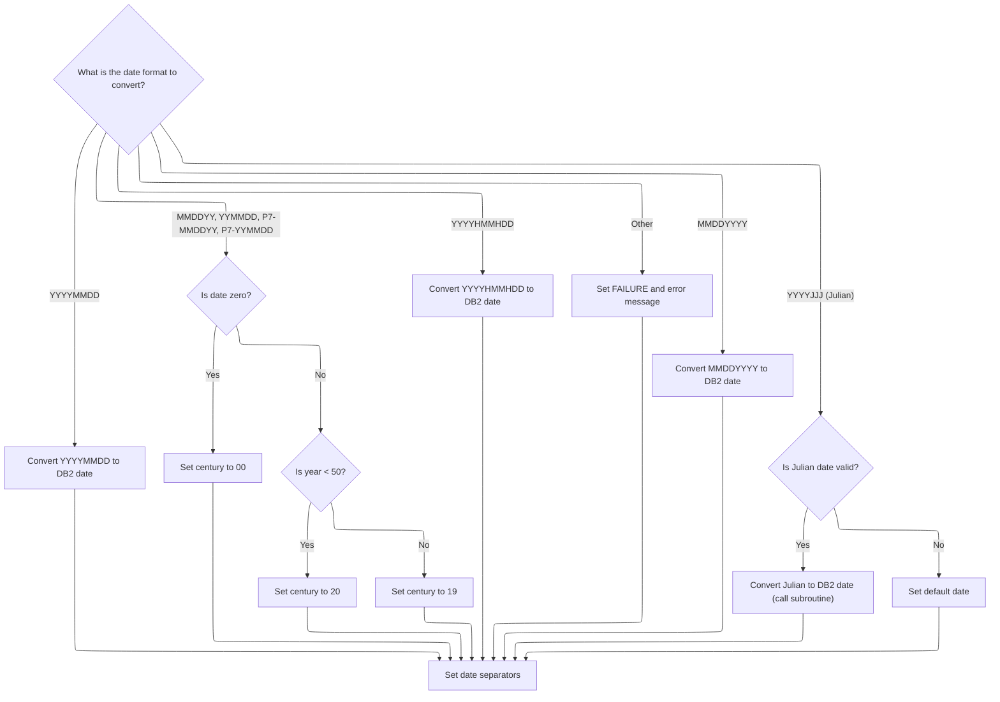
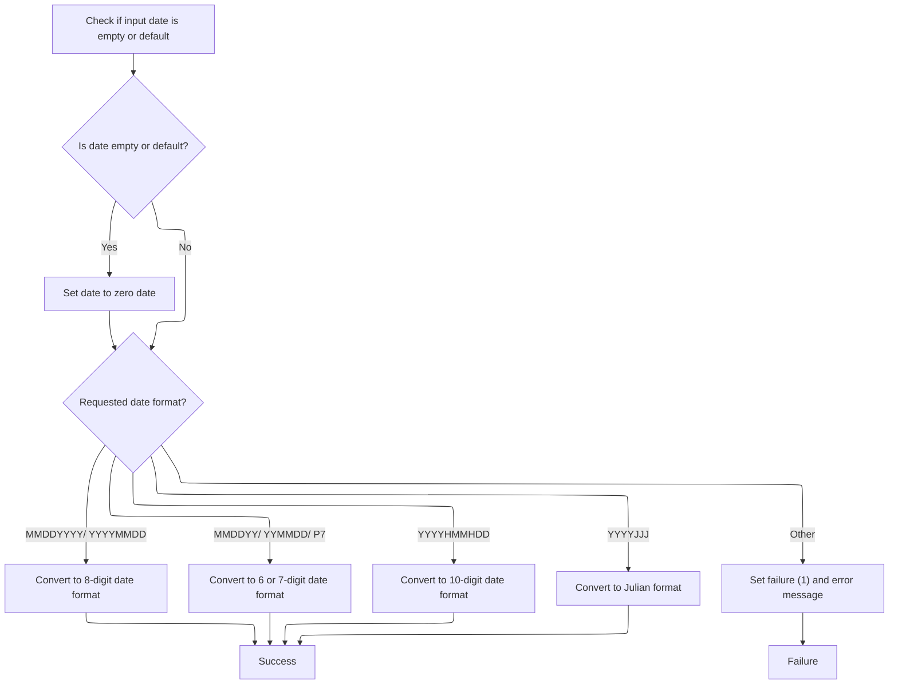

This document outlines the process for converting dates between business formats and DB2 format. The flow supports multiple business date representations, ensuring accurate transformation for storage or retrieval in DB2. Input is a date value and conversion direction; output is the converted date or an error message.

# Spec

## Detailed View of the Program's Functionality

## a. Program Initialization and Main Routine

The program begins by defining its identity and purpose: it is a date conversion utility that translates between various business date formats and the DB2 database date format. The main routine is responsible for initializing the environment, validating inputs, and branching to the appropriate conversion logic.

- **Initialization**: The program initializes working storage and linkage section variables, preparing the environment for processing.
- **Input Validation**: It checks the input date fields for numeric validity, resetting any non-numeric fields to zero. This ensures that subsequent logic can easily detect invalid dates.
- **Branching**: Based on the requested conversion direction (to or from DB2), the main routine dispatches to the corresponding conversion routine. If the direction is not supported, it sets an error flag and message.

## b. Input Validation Logic

The input validation routine examines the incoming date based on the expected format:

- For each supported format (e.g., 8-digit MMDDYYYY, 8-digit YYYYMMDD, 6-digit MMDDYY, 6-digit YYMMDD, packed 7-digit MMDDYY or YYMMDD, 10-character YYYYHMMHDD, 7-digit Julian YYYYJJJ), it checks if the input is numeric.
- If the input is not numeric, it is reset to zero.
- If any validation fails, a specific error message is set for the caller.

This step ensures that only valid, well-formed dates proceed to the conversion routines.

## c. Conversion to DB2 Format

When converting to DB2 format, the program handles multiple input formats:

- **MMDDYYYY and YYYYMMDD**: The input is split into month, day, and year components and moved into the DB2 date structure.
- **MMDDYY, YYMMDD, P7-MMDDYY, P7-YYMMDD**: The input is split into components. For two-digit years, the program determines the century:
  - If the year is less than 50, it assumes the 21st century (20xx).
  - Otherwise, it assumes the 20th century (19xx).
  - If the date is zero, the century is set to 00.
- **YYYYHMMHDD**: The input is parsed into year, month, and day, and moved into the DB2 date structure.
- **YYYYJJJ (Julian)**: If the Julian date is non-zero, it is converted to standard date format by calling a dedicated subroutine. If the Julian date is zero, a default date is set.
- **Unrecognized Formats**: If the format is not supported, the program sets a failure flag and an error message.

After conversion, the program sets the date separators (e.g., slashes) in the DB2 date structure.

## d. Julian Date to DB2 Date Conversion

The Julian-to-DB2 conversion routine translates a Julian date (year and day-of-year) into a standard date:

- For days 1–31, it assigns January; for days 32–59, February.
- For other days, it loops through a table of month start and end days to find the correct month and day.
- It checks for leap years and adjusts for February 29 if necessary.
- The result is a standard DB2 date (YYYY-MM-DD).

## e. Conversion from DB2 Format

When converting from DB2 format to a business format:

- If the input DB2 date is empty or a default value, it is normalized to a zero date.
- Based on the requested output format:
  - **MMDDYYYY or YYYYMMDD**: The DB2 date components are moved into the corresponding output structure.
  - **MMDDYY, YYMMDD, P7**: The DB2 date is split and moved into the appropriate 6- or 7-digit output structure.
  - **YYYYHMMHDD**: The DB2 date is formatted into a 10-character output with hyphens.
  - **YYYYJJJ (Julian)**: The program calls a subroutine to convert the DB2 date to Julian format.
- If the format is not recognized, the program sets a failure flag and an error message.

## f. DB2 Date to Julian Date Conversion

The DB2-to-Julian conversion routine translates a standard date into a Julian date:

- The year is moved directly.
- For January and February, the day-of-year is calculated directly.
- For other months, the program adds the number of days in preceding months to the day, adjusting for leap years as needed.
- The result is a 7-digit Julian date (YYYYJJJ).

## g. Leap Year Calculation

A dedicated routine determines if a given year is a leap year:

- The year is divided by 4. If there is no remainder, it may be a leap year.
- If the year is also divisible by 100, it must also be divisible by 400 to be a leap year.
- The result sets a flag indicating whether the year is a leap year or a regular year.

---

This detailed breakdown covers the main flow and logic of the program, describing how it initializes, validates, converts, and handles errors for various date formats, including special handling for Julian dates and leap years.

# Rule Definition

| Paragraph Name   | Rule ID | Category          | Description                                                                                                                                                                         | Conditions                                                                                                                                                | Remarks                                |
| ---------------- | ------- | ----------------- | ----------------------------------------------------------------------------------------------------------------------------------------------------------------------------------- | --------------------------------------------------------------------------------------------------------------------------------------------------------- | -------------------------------------- |
| 200-CHECK-INPUTS | RL-001  | Conditional Logic | For each supported numeric date format, the system must check if the input is numeric and of the expected length. If not, the date is set to zero and an error message is prepared. | The input format flag indicates a numeric format (MMDDYYYY, YYYYMMDD, MMDDYY, YYMMDD, P7-MMDDYY, P7-YYMMDD, YYYYJJJ) and the conversion is to DB2 format. | \- MMDDYYYY, YYYYMMDD: 8-digit numeric |

- MMDDYY, YYMMDD: 6-digit numeric
- P7-MMDDYY, P7-YYMMDD: 7-digit packed decimal (numeric)
- YYYYJJJ: 7-digit numeric
- If not numeric, set value to zero and error message to 'MMMS9012 - Invalid input date format.' | | 300-CONV-TO-DB2, 400-CONV-FROM-DB2 | RL-002 | Conditional Logic | If the input date is zero or matches the default date for the format, the output is set to a zero date (all zeros for numeric formats, spaces or zeros for YYYYHMMHDD). | Input date is zero or matches the default date for the format, in either conversion direction. | - Zero date: all zeros for numeric formats, spaces or zeros for YYYYHMMHDD
- Default date constant: K-DEF-DT
- Zero date constant: K-ZERO-DT | | 300-CONV-TO-DB2 | RL-003 | Computation | When converting MMDDYY, YYMMDD, P7-MMDDYY, or P7-YYMMDD to DB2 format, determine the century based on the year value: if YY < 50, use 20YY; if YY >= 50, use 19YY. | Input format is MMDDYY, YYMMDD, P7-MMDDYY, or P7-YYMMDD and conversion is to DB2 format. | - Century cutoff: 50
- Output format: YYYY/MM/DD (10-character string with slashes)
- YY < 50: 20YY; YY >= 50: 19YY | | 300-CONV-TO-DB2, 400-CONV-FROM-DB2, 900-JULIAN-TO-DB2-CONV, 950-DB2-TO-JULIAN-CONV, 990-LEAP-YEAR-FIND | RL-004 | Computation | For YYYYJJJ format, convert between Julian day and month/day, accounting for leap years using a lookup table and arithmetic. Leap year is determined by divisibility rules. | Input or output format is YYYYJJJ and conversion is to or from DB2 format. | - Leap year: divisible by 4, not by 100 unless also by 400
- Uses lookup table for month/day boundaries
- Output format for DB2: YYYY/MM/DD (10-character string)
- Output format for YYYYJJJ: 7-digit numeric | | 300-CONV-TO-DB2, 400-CONV-FROM-DB2 | RL-005 | Data Assignment | The output date must match the requested format for the conversion direction and format flag, including correct field sizes, separators, and padding. | A valid conversion direction and format flag is provided. | - DB2 output: 10-character string YYYY/MM/DD (slashes)
- YYYYHMMHDD: 10-character string YYYY-MM-DD (hyphens)
- Numeric formats: right-justified, zero-padded as needed
- Packed decimal: 7-digit numeric
- All fields must be assigned according to their format specification | | 000-MAIN, 300-CONV-TO-DB2, 400-CONV-FROM-DB2 | RL-006 | Conditional Logic | If the format flag or conversion direction is not recognized, set failure status and an error message in the response. | Format flag or conversion direction does not match any supported value. | - Status field set to FAILURE
- Error message: 'MMMS9012 - Invalid date conversion function.' or 'MMMS9012 - Invalid date conversion type.' | | 000-MAIN, 300-CONV-TO-DB2, 400-CONV-FROM-DB2 | RL-007 | Data Assignment | The response must include the converted date, a status field (SUCCESS or FAILURE), and an error message if applicable. | Every conversion attempt, regardless of outcome. | - Response fields: converted date (format as specified), status (SUCCESS/FAILURE), error message (if any) |

# User Stories

## User Story 1: Validate and handle input date formats

---

### Story Description:

As a system, I want to validate incoming date values for supported formats and handle invalid inputs by setting the date to zero and providing an error message so that users receive clear feedback when their input does not meet format requirements.

---

### Business Rule Mapping:

| Rule ID | Paragraph Name                               | Rule Description                                                                                                                                                                    |
| ------- | -------------------------------------------- | ----------------------------------------------------------------------------------------------------------------------------------------------------------------------------------- |
| RL-006  | 000-MAIN, 300-CONV-TO-DB2, 400-CONV-FROM-DB2 | If the format flag or conversion direction is not recognized, set failure status and an error message in the response.                                                              |
| RL-001  | 200-CHECK-INPUTS                             | For each supported numeric date format, the system must check if the input is numeric and of the expected length. If not, the date is set to zero and an error message is prepared. |

---

### Relevant Functionality:

- **000-MAIN**
  1. **RL-006:**
     - If format flag or direction is not recognized:
       - Set status to FAILURE
       - Set appropriate error message
- **200-CHECK-INPUTS**
  1. **RL-001:**
     - For each numeric format:
       - If the input is not numeric:
         - Set the date value to zero
         - Set error message in the response

## User Story 2: Convert dates to and from DB2 format according to format specifications

---

### Story Description:

As a system, I want to convert dates between supported legacy formats and DB2 format, applying correct century logic, Julian day conversion with leap year handling, and output formatting so that users receive accurate and properly formatted dates for their requested conversion direction and format.

---

### Business Rule Mapping:

| Rule ID | Paragraph Name                                                                                         | Rule Description                                                                                                                                                            |
| ------- | ------------------------------------------------------------------------------------------------------ | --------------------------------------------------------------------------------------------------------------------------------------------------------------------------- |
| RL-003  | 300-CONV-TO-DB2                                                                                        | When converting MMDDYY, YYMMDD, P7-MMDDYY, or P7-YYMMDD to DB2 format, determine the century based on the year value: if YY < 50, use 20YY; if YY >= 50, use 19YY.          |
| RL-004  | 300-CONV-TO-DB2, 400-CONV-FROM-DB2, 900-JULIAN-TO-DB2-CONV, 950-DB2-TO-JULIAN-CONV, 990-LEAP-YEAR-FIND | For YYYYJJJ format, convert between Julian day and month/day, accounting for leap years using a lookup table and arithmetic. Leap year is determined by divisibility rules. |
| RL-005  | 300-CONV-TO-DB2, 400-CONV-FROM-DB2                                                                     | The output date must match the requested format for the conversion direction and format flag, including correct field sizes, separators, and padding.                       |

---

### Relevant Functionality:

- **300-CONV-TO-DB2**
  1. **RL-003:**
     - Extract two-digit year (YY)
     - If YY < 50:
       - Set century to 20
     - Else:
       - Set century to 19
     - Concatenate century and year for output
  2. **RL-004:**
     - For conversion to DB2:
       - Parse year and Julian day
       - Determine if year is leap year
       - Use lookup table/arithmetic to find month and day
     - For conversion from DB2:
       - Parse year, month, day
       - Determine if year is leap year
       - Use lookup table/arithmetic to compute Julian day
  3. **RL-005:**
     - For each format flag:
       - Assign output fields according to format (size, separators, padding)
       - For DB2, ensure slashes; for YYYYHMMHDD, ensure hyphens

## User Story 3: Return conversion results and handle errors in the response

---

### Story Description:

As a system, I want to return the converted date, a status field indicating success or failure, and an error message if applicable, including handling unrecognized format flags or conversion directions, so that users can reliably interpret the outcome of their conversion request and receive clear feedback on errors.

---

### Business Rule Mapping:

| Rule ID | Paragraph Name                               | Rule Description                                                                                                       |
| ------- | -------------------------------------------- | ---------------------------------------------------------------------------------------------------------------------- |
| RL-006  | 000-MAIN, 300-CONV-TO-DB2, 400-CONV-FROM-DB2 | If the format flag or conversion direction is not recognized, set failure status and an error message in the response. |
| RL-007  | 000-MAIN, 300-CONV-TO-DB2, 400-CONV-FROM-DB2 | The response must include the converted date, a status field (SUCCESS or FAILURE), and an error message if applicable. |

---

### Relevant Functionality:

- **000-MAIN**
  1. **RL-006:**
     - If format flag or direction is not recognized:
       - Set status to FAILURE
       - Set appropriate error message
  2. **RL-007:**
     - After conversion or error:
       - Assign converted date to response
       - Set status field
       - Set error message if applicable

## User Story 4: Validate and handle input date formats, including zero/default dates

---

### Story Description:

As a system, I want to validate incoming date values for supported formats, handle invalid inputs by setting the date to zero and providing an error message, and process zero or default dates appropriately so that users receive clear feedback and correct handling for all input scenarios.

---

### Business Rule Mapping:

| Rule ID | Paragraph Name                     | Rule Description                                                                                                                                                                    |
| ------- | ---------------------------------- | ----------------------------------------------------------------------------------------------------------------------------------------------------------------------------------- |
| RL-001  | 200-CHECK-INPUTS                   | For each supported numeric date format, the system must check if the input is numeric and of the expected length. If not, the date is set to zero and an error message is prepared. |
| RL-002  | 300-CONV-TO-DB2, 400-CONV-FROM-DB2 | If the input date is zero or matches the default date for the format, the output is set to a zero date (all zeros for numeric formats, spaces or zeros for YYYYHMMHDD).             |

---

### Relevant Functionality:

- **200-CHECK-INPUTS**
  1. **RL-001:**
     - For each numeric format:
       - If the input is not numeric:
         - Set the date value to zero
         - Set error message in the response
- **300-CONV-TO-DB2**
  1. **RL-002:**
     - If input is zero or default date:
       - Set output to zero date (all zeros or spaces as appropriate)

# Code Walkthrough

## Main Routine: Initialization, Input Validation, and Branching

<SwmSnippet path="/base/src/MMMS9012.cbl" line="120">

---

`000-MAIN` starts everything, sets up the environment, checks inputs for validity, and then branches to the right conversion routine or sets an error if the direction is unsupported.

```cobol
012700 000-MAIN.                                                        00012700
012800     PERFORM 100-INITIALIZE                                       00012800
012900     PERFORM 200-CHECK-INPUTS                                     00012900
013000                                                                  00013000
013100     EVALUATE TRUE                                                00013100
013200       WHEN NOT SUCCESS                                           00013200
013300         CONTINUE                                                 00013300
013400                                                                  00013400
013500       WHEN MMMC9012-CONV-TO-DB2                                  00013500
013600         PERFORM 300-CONV-TO-DB2                                  00013600
013700                                                                  00013700
013800       WHEN MMMC9012-CONV-FROM-DB2                                00013800
013900         PERFORM 400-CONV-FROM-DB2                                00013900
014000                                                                  00014000
014100       WHEN OTHER                                                 00014100
014200         SET FAILURE TO TRUE                                      00014200
014300         MOVE 'MMMS9012 - Invalid date conversion function.'      00014300
014400           TO IS-RTRN-MSG-TXT                                     00014400
014500     END-EVALUATE                                                 00014500
014600                                                                  00014600
014700     GOBACK                                                       00014700
014800     .                                                            00014800
```

---

</SwmSnippet>

<SwmSnippet path="/base/src/MMMS9012.cbl" line="155">

---

`200-CHECK-INPUTS` checks the input date fields for numeric validity based on the requested format. For each format, if the date isn't numeric, it gets reset to 0. This makes it easy for later logic to spot invalid dates. If any validation fails, it sets a specific error message for the caller.

```cobol
016200 200-CHECK-INPUTS.                                                00016200
016300     EVALUATE TRUE                                                00016300
016400       WHEN MMMC9012-CONV-TO-DB2                                  00016400
016500       AND  MMMC9012-PIC-N8-MMDDYYYY                              00016500
016600         IF WS-DATE-N8 NOT NUMERIC                                00016600
016700           MOVE 0 TO WS-DATE-N8                                   00016700
016800         END-IF                                                   00016800
016900       WHEN MMMC9012-CONV-TO-DB2                                  00016900
017000       AND  MMMC9012-PIC-N8-YYYYMMDD                              00017000
017100         IF WS-DATE-N8 NOT NUMERIC                                00017100
017200           MOVE 0 TO WS-DATE-N8                                   00017200
017300         END-IF                                                   00017300
017400       WHEN MMMC9012-CONV-TO-DB2                                  00017400
017500       AND  MMMC9012-PIC-N6-MMDDYY                                00017500
017600         IF WS-DATE-N6 NOT NUMERIC                                00017600
017700           MOVE 0 TO WS-DATE-N6                                   00017700
017800         END-IF                                                   00017800
017900       WHEN MMMC9012-CONV-TO-DB2                                  00017900
018000       AND  MMMC9012-PIC-N6-YYMMDD                                00018000
018100         IF WS-DATE-N6 NOT NUMERIC                                00018100
018200           MOVE 0 TO WS-DATE-N6                                   00018200
018300         END-IF                                                   00018300
018400       WHEN MMMC9012-CONV-TO-DB2                                  00018400
018500       AND  MMMC9012-PIC-P7-MMDDYY                                00018500
018600         IF WS-DATE-P7 NOT NUMERIC                                00018600
018700           MOVE 0 TO WS-DATE-P7                                   00018700
018800         END-IF                                                   00018800
018900       WHEN MMMC9012-CONV-TO-DB2                                  00018900
019000       AND  MMMC9012-PIC-P7-YYMMDD                                00019000
019100         IF WS-DATE-P7 NOT NUMERIC                                00019100
019200           MOVE 0 TO WS-DATE-P7                                   00019200
019300         END-IF                                                   00019300
019400       WHEN MMMC9012-CONV-TO-DB2                                  00019400
019500       AND  MMMC9012-PIC-X10-YYYYHMMHDD                           00019500
019600           CONTINUE                                               00019600
019700       WHEN MMMC9012-CONV-TO-DB2                                  00019700
019800       AND  MMMC9012-PIC-N7-YYYYJJJ                               00019800
019900       IF  WS-DATE-N7 NOT NUMERIC                                 00019900
020000          MOVE 0  TO WS-DATE-N7                                   00020000
020100       END-IF                                                     00020100
020200     END-EVALUATE                                                 00020200
020300                                                                  00020300
020400     IF NOT SUCCESS                                               00020400
020500       MOVE 'MMMS9012 - Invalid input date format.'               00020500
020600         TO IS-RTRN-MSG-TXT                                       00020600
020700     END-IF                                                       00020700
020800     .                                                            00020800
```

---

</SwmSnippet>

### Date Conversion to DB2 Format and Julian Handling



<SwmSnippet path="/base/src/MMMS9012.cbl" line="207">

---

`300-CONV-TO-DB2` takes the validated date input and converts it to DB2 format, handling multiple input formats. For two-digit years, it uses hardcoded cutoff values to pick the century. If the input is a Julian date, it calls 900-JULIAN-TO-DB2-CONV to do the conversion. If the format isn't recognized, it sets a failure flag and error message. The separators are set at the end.

```cobol
021400 300-CONV-TO-DB2.                                                 00021400
021500     EVALUATE TRUE                                                00021500
021600       WHEN MMMC9012-PIC-N8-MMDDYYYY                              00021600
021700         MOVE WS-DATE-N8       TO WS-MMDDYYYY                     00021700
021800         MOVE WS-MMDDYYYY-MM   TO WS-MM-DD-YYYY-MM                00021800
021900         MOVE WS-MMDDYYYY-DD   TO WS-MM-DD-YYYY-DD                00021900
022000         MOVE WS-MMDDYYYY-YYYY TO WS-MM-DD-YYYY-YYYY              00022000
022100       WHEN MMMC9012-PIC-N8-YYYYMMDD                              00022100
022200         MOVE WS-DATE-N8       TO WS-YYYYMMDD                     00022200
022300         MOVE WS-YYYYMMDD-MM   TO WS-MM-DD-YYYY-MM                00022300
022400         MOVE WS-YYYYMMDD-DD   TO WS-MM-DD-YYYY-DD                00022400
022500         MOVE WS-YYYYMMDD-YYYY TO WS-MM-DD-YYYY-YYYY              00022500
022600       WHEN MMMC9012-PIC-N6-MMDDYY                                00022600
022700         MOVE WS-DATE-N6       TO WS-MMDDYY                       00022700
022800         MOVE WS-MMDDYY-MM     TO WS-MM-DD-YYYY-MM                00022800
022900         MOVE WS-MMDDYY-DD     TO WS-MM-DD-YYYY-DD                00022900
023000         MOVE WS-MMDDYY-YY     TO WS-MM-DD-YYYY-YY                00023000
023100         IF WS-MMDDYY = 0                                         00023100
023200             MOVE 00 TO WS-MM-DD-YYYY-CC                          00023200
023300         ELSE                                                     00023300
023400*            IF WS-MMDDYY-YY < 20                                 00023400
023410             IF WS-MMDDYY-YY < 50                                 00023410
023500               MOVE 20 TO WS-MM-DD-YYYY-CC                        00023500
023600             ELSE                                                 00023600
023700               MOVE 19 TO WS-MM-DD-YYYY-CC                        00023700
023800             END-IF                                               00023800
023900         END-IF                                                   00023900
024000       WHEN MMMC9012-PIC-N6-YYMMDD                                00024000
024100         MOVE WS-DATE-N6       TO WS-YYMMDD                       00024100
024200         MOVE WS-YYMMDD-MM     TO WS-MM-DD-YYYY-MM                00024200
024300         MOVE WS-YYMMDD-DD     TO WS-MM-DD-YYYY-DD                00024300
024400         MOVE WS-YYMMDD-YY     TO WS-MM-DD-YYYY-YY                00024400
024500         IF WS-YYMMDD = 0                                         00024500
024600            MOVE 00 TO WS-MM-DD-YYYY-CC                           00024600
024700         ELSE                                                     00024700
024800*            IF WS-YYMMDD-YY < 20                                 00024800
024810             IF WS-YYMMDD-YY < 50                                 00024810
024900               MOVE 20 TO WS-MM-DD-YYYY-CC                        00024900
025000             ELSE                                                 00025000
025100               MOVE 19 TO WS-MM-DD-YYYY-CC                        00025100
025200             END-IF                                               00025200
025300         END-IF                                                   00025300
025400       WHEN MMMC9012-PIC-P7-MMDDYY                                00025400
025500         MOVE WS-DATE-P7       TO WS-MMDDYY                       00025500
025600         MOVE WS-MMDDYY-MM     TO WS-MM-DD-YYYY-MM                00025600
025700         MOVE WS-MMDDYY-DD     TO WS-MM-DD-YYYY-DD                00025700
025800         MOVE WS-MMDDYY-YY     TO WS-MM-DD-YYYY-YY                00025800
025900         IF WS-MMDDYY = 0                                         00025900
026000             MOVE 00 TO WS-MM-DD-YYYY-CC                          00026000
026100         ELSE                                                     00026100
026200*            IF WS-MMDDYY-YY < 40                                 00026200
026210             IF WS-MMDDYY-YY < 50                                 00026210
026300               MOVE 20 TO WS-MM-DD-YYYY-CC                        00026300
026400             ELSE                                                 00026400
026500               MOVE 19 TO WS-MM-DD-YYYY-CC                        00026500
026600             END-IF                                               00026600
026700         END-IF                                                   00026700
026800       WHEN MMMC9012-PIC-P7-YYMMDD                                00026800
026900         MOVE WS-DATE-P7       TO WS-YYMMDD                       00026900
027000         MOVE WS-YYMMDD-MM     TO WS-MM-DD-YYYY-MM                00027000
027100         MOVE WS-YYMMDD-DD     TO WS-MM-DD-YYYY-DD                00027100
027200         MOVE WS-YYMMDD-YY     TO WS-MM-DD-YYYY-YY                00027200
027300         IF WS-YYMMDD = 0                                         00027300
027400            MOVE 00 TO WS-MM-DD-YYYY-CC                           00027400
027500         ELSE                                                     00027500
027600*            IF WS-YYMMDD-YY < 20                                 00027600
027610             IF WS-YYMMDD-YY < 50                                 00027610
027700               MOVE 20 TO WS-MM-DD-YYYY-CC                        00027700
027800             ELSE                                                 00027800
027900               MOVE 19 TO WS-MM-DD-YYYY-CC                        00027900
028000             END-IF                                               00028000
028100         END-IF                                                   00028100
028200       WHEN MMMC9012-PIC-X10-YYYYHMMHDD                           00028200
028300         MOVE WS-DATE                TO   WS-YYYYHMMHDD           00028300
028400         MOVE WS-YYYYHMMHDD-MM       TO   WS-MM-DD-YYYY-MM        00028400
028500         MOVE WS-YYYYHMMHDD-DD       TO   WS-MM-DD-YYYY-DD        00028500
028600         MOVE WS-YYYYHMMHDD-YYYY     TO   WS-MM-DD-YYYY-YYYY      00028600
028700       WHEN MMMC9012-PIC-N7-YYYYJJJ                               00028700
028800         IF WS-DATE-N7 NOT EQUAL ZERO                             00028800
028900            MOVE WS-DATE-N7           TO WS-YYYYJJJ               00028900
029000            PERFORM 900-JULIAN-TO-DB2-CONV                        00029000
029100         ELSE                                                     00029100
029200            MOVE K-DEF-DT             TO WS-MM-DD-YYYY            00029200
029300         END-IF                                                   00029300
029400       WHEN OTHER                                                 00029400
029500         SET FAILURE TO TRUE                                      00029500
029600         MOVE 'MMMS9012 - Invalid date conversion type.'          00029600
029700           TO IS-RTRN-MSG-TXT                                     00029700
029800     END-EVALUATE                                                 00029800
029900                                                                  00029900
030000     MOVE '/' TO  WS-MM-DD-YYYY-S1                                00030000
030100     MOVE '/' TO  WS-MM-DD-YYYY-S2                                00030100
030200     .                                                            00030200
```

---

</SwmSnippet>

<SwmSnippet path="/base/src/MMMS9012.cbl" line="361">

---

`900-JULIAN-TO-DB2-CONV` converts a Julian date (year + day-of-year) to standard YYYY-MM-DD. For days 1-31 and 32-59, it assigns January and February directly. For other days, it loops through month start/end arrays to find the right month and day, adjusting for leap years. If it's a leap year and day 60, it bumps the day by one to handle Feb 29.

```cobol
036400 900-JULIAN-TO-DB2-CONV.                                          00036400
036500     INITIALIZE WS-TEMP WS-MM-DD-YYYY WS-CNTR                     00036500
036600                                                                  00036600
036700     IF WS-YYYYJJJ-JJJ IS >= 1 AND WS-YYYYJJJ-JJJ  <= 31          00036700
036800        MOVE WS-YYYYJJJ-JJJ           TO WS-MM-DD-YYYY-DD         00036800
036900        MOVE 1                        TO WS-MM-DD-YYYY-MM         00036900
037000        MOVE WS-YYYYJJJ-YYYY          TO WS-MM-DD-YYYY-YYYY       00037000
037100     ELSE IF                                                      00037100
037200            WS-YYYYJJJ-JJJ IS >= 32 AND WS-YYYYJJJ-JJJ  <= 59     00037200
037300            SUBTRACT 31 FROM WS-YYYYJJJ-JJJ                       00037300
037400                        GIVING WS-MM-DD-YYYY-DD                   00037400
037500            MOVE 2                    TO WS-MM-DD-YYYY-MM         00037500
037600            MOVE WS-YYYYJJJ-YYYY      TO WS-MM-DD-YYYY-YYYY       00037600
037700     ELSE                                                         00037700
037800       PERFORM 990-LEAP-YEAR-FIND                                 00037800
037900       IF WS-ORDY-YEAR                                            00037900
038000          PERFORM VARYING WS-CNTR FROM +1 BY +1 UNTIL WS-CNTR > 1200038000
038100           IF WS-YYYYJJJ-JJJ IS >= WS-JUL-MNTH-STRT(WS-CNTR)      00038100
038200              AND WS-YYYYJJJ-JJJ IS <= WS-JUL-MNTH-END (WS-CNTR)  00038200
038300              MOVE WS-JUL-MNTH-NUM(WS-CNTR)                       00038300
038400                                      TO WS-MM-DD-YYYY-MM         00038400
038500              SUBTRACT WS-JUL-MNTH-STRT(WS-CNTR)                  00038500
038600                                  FROM WS-YYYYJJJ-JJJ             00038600
038700                                  GIVING WS-TEMP                  00038700
038800              ADD 1                   TO WS-TEMP                  00038800
038900              MOVE WS-TEMP            TO WS-MM-DD-YYYY-DD         00038900
039000              MOVE WS-YYYYJJJ-YYYY    TO WS-MM-DD-YYYY-YYYY       00039000
039100              MOVE 13                 TO WS-CNTR                  00039100
039200           END-IF                                                 00039200
039300          END-PERFORM                                             00039300
039400       ELSE                                                       00039400
039500          PERFORM VARYING WS-CNTR FROM +1 BY +1 UNTIL WS-CNTR > 1200039500
039600           IF WS-YYYYJJJ-JJJ IS >= WS-JUL-MNTH-STRT(WS-CNTR) + 1  00039600
039700           AND WS-YYYYJJJ-JJJ IS <= WS-JUL-MNTH-END (WS-CNTR) + 1 00039700
039800              MOVE WS-JUL-MNTH-NUM(WS-CNTR)                       00039800
039900                                      TO WS-MM-DD-YYYY-MM         00039900
040000              SUBTRACT WS-JUL-MNTH-STRT(WS-CNTR)                  00040000
040100                                  FROM WS-YYYYJJJ-JJJ             00040100
040200                                  GIVING WS-TEMP                  00040200
040300*             ADD 1                   TO WS-TEMP                  00040300
040400              MOVE WS-TEMP            TO WS-MM-DD-YYYY-DD         00040400
040500              MOVE WS-YYYYJJJ-YYYY    TO WS-MM-DD-YYYY-YYYY       00040500
040600              MOVE 13                 TO WS-CNTR                  00040600
040700           END-IF                                                 00040700
040800          END-PERFORM                                             00040800
040900* MFR Deals and Cost leap year conversion change start            00040900
041000         IF WS-LEAP-YEAR AND WS-YYYYJJJ-JJJ = 60                  00041000
041100           ADD 1         TO WS-MM-DD-YYYY-DD                      00041100
041200         END-IF                                                   00041200
041300* MFR Deals and Cost leap year conversion change end              00041300
041400       END-IF                                                     00041400
041500     END-IF                                                       00041500
041600     .                                                            00041600
```

---

</SwmSnippet>

### Date Conversion from DB2 Format and Output Handling



<SwmSnippet path="/base/src/MMMS9012.cbl" line="305">

---

`400-CONV-FROM-DB2` takes the DB2 date and converts it to the requested business format. If the input is spaces or the default date, it normalizes it to zero date. Then, based on the format flag, it moves date parts into the right output structure or calls the Julian conversion routine. If the format isn't recognized, it sets a failure flag and error message.

```cobol
030800 400-CONV-FROM-DB2.                                               00030800
030900     EVALUATE TRUE                                                00030900
031000       WHEN WS-MM-DD-YYYY = SPACES                                00031000
031100        MOVE K-ZERO-DT TO WS-MM-DD-YYYY                           00031100
031200       WHEN WS-MM-DD-YYYY = K-DEF-DT                              00031200
031300        MOVE K-ZERO-DT TO WS-MM-DD-YYYY                           00031300
031400     END-EVALUATE                                                 00031400
031500                                                                  00031500
031600     EVALUATE TRUE                                                00031600
031700       WHEN MMMC9012-PIC-N8-MMDDYYYY                              00031700
031800         MOVE WS-MM-DD-YYYY-MM   TO WS-MMDDYYYY-MM                00031800
031900         MOVE WS-MM-DD-YYYY-DD   TO WS-MMDDYYYY-DD                00031900
032000         MOVE WS-MM-DD-YYYY-YYYY TO WS-MMDDYYYY-YYYY              00032000
032100         MOVE WS-MMDDYYYY        TO WS-DATE-N8                    00032100
032200       WHEN MMMC9012-PIC-N8-YYYYMMDD                              00032200
032300         MOVE WS-MM-DD-YYYY-MM   TO WS-YYYYMMDD-MM                00032300
032400         MOVE WS-MM-DD-YYYY-DD   TO WS-YYYYMMDD-DD                00032400
032500         MOVE WS-MM-DD-YYYY-YYYY TO WS-YYYYMMDD-YYYY              00032500
032600         MOVE WS-YYYYMMDD        TO WS-DATE-N8                    00032600
032700       WHEN MMMC9012-PIC-N6-MMDDYY                                00032700
032800         MOVE WS-MM-DD-YYYY-MM   TO WS-MMDDYY-MM                  00032800
032900         MOVE WS-MM-DD-YYYY-DD   TO WS-MMDDYY-DD                  00032900
033000         MOVE WS-MM-DD-YYYY-YY   TO WS-MMDDYY-YY                  00033000
033100         MOVE WS-MMDDYY          TO WS-DATE-N6                    00033100
033200       WHEN MMMC9012-PIC-N6-YYMMDD                                00033200
033300         MOVE WS-MM-DD-YYYY-MM   TO WS-YYMMDD-MM                  00033300
033400         MOVE WS-MM-DD-YYYY-DD   TO WS-YYMMDD-DD                  00033400
033500         MOVE WS-MM-DD-YYYY-YY   TO WS-YYMMDD-YY                  00033500
033600         MOVE WS-YYMMDD          TO WS-DATE-N6                    00033600
033700       WHEN MMMC9012-PIC-P7-MMDDYY                                00033700
033800         MOVE WS-MM-DD-YYYY-MM   TO WS-MMDDYY-MM                  00033800
033900         MOVE WS-MM-DD-YYYY-DD   TO WS-MMDDYY-DD                  00033900
034000         MOVE WS-MM-DD-YYYY-YY   TO WS-MMDDYY-YY                  00034000
034100         MOVE WS-MMDDYY          TO WS-DATE-P7                    00034100
034200       WHEN MMMC9012-PIC-P7-YYMMDD                                00034200
034300         MOVE WS-MM-DD-YYYY-MM   TO WS-YYMMDD-MM                  00034300
034400         MOVE WS-MM-DD-YYYY-DD   TO WS-YYMMDD-DD                  00034400
034500         MOVE WS-MM-DD-YYYY-YY   TO WS-YYMMDD-YY                  00034500
034600         MOVE WS-YYMMDD          TO WS-DATE-P7                    00034600
034700       WHEN MMMC9012-PIC-X10-YYYYHMMHDD                           00034700
034800         MOVE WS-MM-DD-YYYY-MM   TO WS-YYYYHMMHDD-MM              00034800
034900         MOVE WS-MM-DD-YYYY-DD   TO WS-YYYYHMMHDD-DD              00034900
035000         MOVE WS-MM-DD-YYYY-YYYY TO WS-YYYYHMMHDD-YYYY            00035000
035100         MOVE '-'                TO WS-YYYYHMMHDD-H1              00035100
035200         MOVE '-'                TO WS-YYYYHMMHDD-H2              00035200
035300         MOVE WS-YYYYHMMHDD    TO WS-DATE                         00035300
035400       WHEN MMMC9012-PIC-N7-YYYYJJJ                               00035400
035500         PERFORM 950-DB2-TO-JULIAN-CONV                           00035500
035600       WHEN OTHER                                                 00035600
035700         SET FAILURE TO TRUE                                      00035700
035800         MOVE 'MMMS9012 - Invalid date conversion type.'          00035800
035900           TO IS-RTRN-MSG-TXT                                     00035900
036000     END-EVALUATE                                                 00036000
036100     .                                                            00036100
```

---

</SwmSnippet>

&nbsp;

*This is an auto-generated document by Swimm 🌊 and has not yet been verified by a human*

<SwmMeta version="3.0.0" repo-id="Z2l0aHViJTNBJTNBU3dpbW1pby1keW5jYWxsLWRlbW8lM0ElM0FHaXJpLVN3aW1t" repo-name="Swimmio-dyncall-demo"><sup>Powered by [Swimm](https://app.swimm.io/)</sup></SwmMeta>
