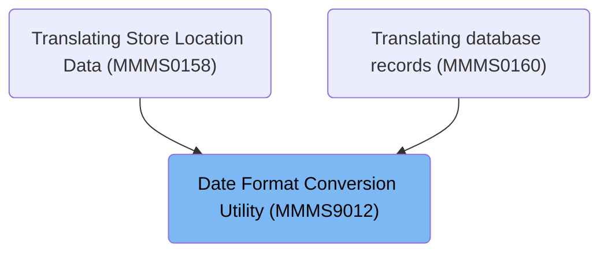

# Overview

This document explains the flow of converting date formats between business layouts and DB2 formats. The flow validates and sanitizes input dates, applies conversion logic for various formats, and handles special cases such as century assignment and Julian dates. The output is a converted date value or an error message for invalid inputs.

## Dependencies

### Program

- MMMS9012 (<SwmPath>[base/src/MMMS9012.cbl](base/src/MMMS9012.cbl)</SwmPath>)

### Copybooks

- MMMK001B (<SwmPath>[base/src/MMMK001B.cpy](base/src/MMMK001B.cpy)</SwmPath>)
- XXXN001A (<SwmPath>[base/src/XXXN001A.cpy](base/src/XXXN001A.cpy)</SwmPath>)
- MMMC9012 (<SwmPath>[base/src/MMMC9012.cpy](base/src/MMMC9012.cpy)</SwmPath>)

# Where is this program used?

This program is used multiple times in the codebase as represented in the following diagram:

&nbsp;

*This is an auto-generated document by Swimm 🌊 and has not yet been verified by a human*

<SwmMeta version="3.0.0" repo-id="Z2l0aHViJTNBJTNBU3dpbW1pby1keW5jYWxsLWRlbW8lM0ElM0FHaXJpLVN3aW1t" repo-name="Swimmio-dyncall-demo">Powered by [Swimm](https://app.swimm.io/)</SwmMeta>
