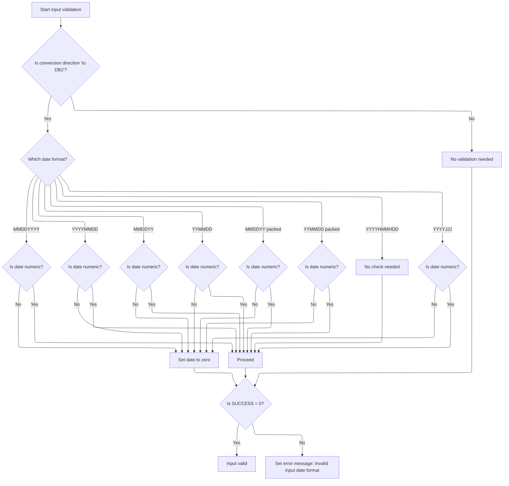
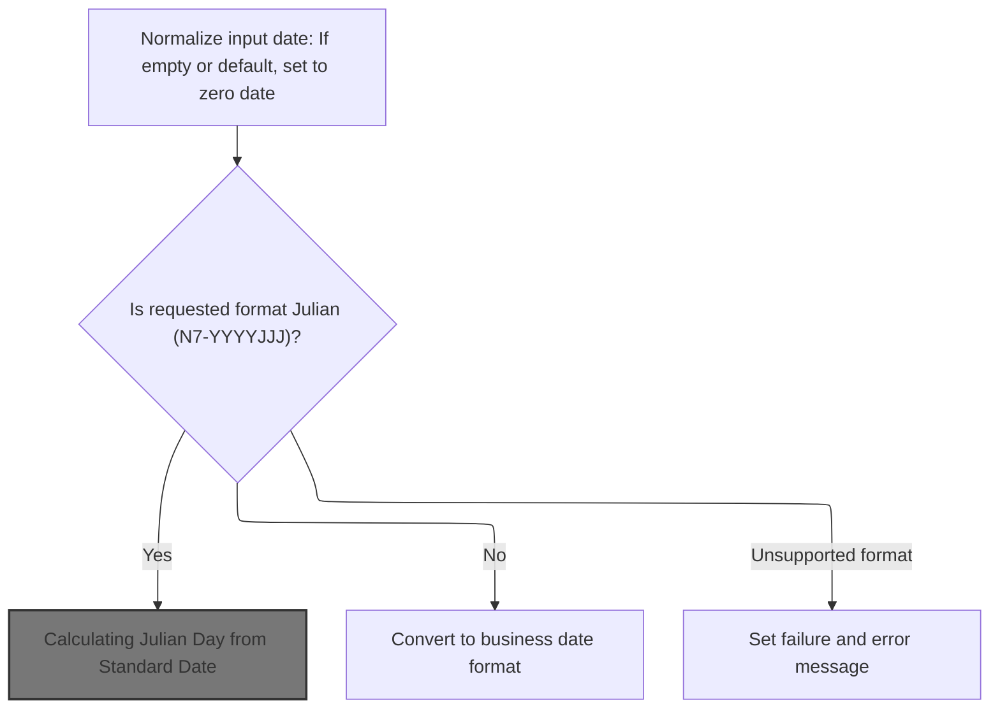
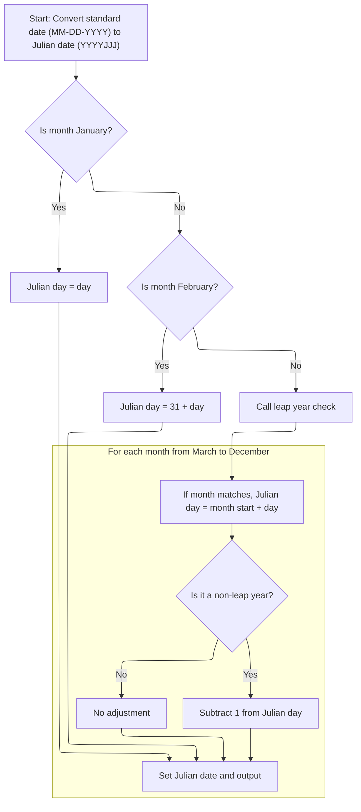

# Overview

This document describes the flow for converting date values between business formats and <SwmToken path="base/src/MMMS9012.cbl" pos="128:10:10" line-data="013500       WHEN MMMC9012-CONV-TO-DB2                                  00013500">`DB2`</SwmToken> format. The process validates incoming dates, determines the conversion direction, and transforms the date according to business rules. Invalid or unsupported inputs result in an error message.

## Dependencies

### Program

- <SwmToken path="base/src/MMMS9012.cbl" pos="136:5:5" line-data="014300         MOVE &#39;MMMS9012 - Invalid date conversion function.&#39;      00014300">`MMMS9012`</SwmToken> (<SwmPath>[base/src/MMMS9012.cbl](base/src/MMMS9012.cbl)</SwmPath>)

### Copybooks

- <SwmToken path="base/src/MMMS9012.cbl" pos="83:4:4" line-data="009000 COPY MMMK001B.                                                   00009000">`MMMK001B`</SwmToken> (<SwmPath>[base/src/MMMK001B.cpy](base/src/MMMK001B.cpy)</SwmPath>)
- <SwmToken path="base/src/MMMS9012.cbl" pos="86:4:4" line-data="009300 COPY XXXN001A.                                                   00009300">`XXXN001A`</SwmToken> (<SwmPath>[base/src/XXXN001A.cpy](base/src/XXXN001A.cpy)</SwmPath>)
- <SwmToken path="base/src/MMMS9012.cbl" pos="128:4:4" line-data="013500       WHEN MMMC9012-CONV-TO-DB2                                  00013500">`MMMC9012`</SwmToken> (<SwmPath>[base/src/MMMC9012.cpy](base/src/MMMC9012.cpy)</SwmPath>)

# Where is this program used?

This program is used multiple times in the codebase as represented in the following diagram:

```mermaid
graph TD
  xjym0("Translating Store Location Data (MMMS0158)") --> 8rnyo("Date Format Conversion Utility (MMMS9012)"):::currentEntity
click xjym0 openCode "base/src/MMMS0158.cbl:1"
u8mut("Translating database records (MMMS0160)") --> 8rnyo("Date Format Conversion Utility (MMMS9012)"):::currentEntity
click u8mut openCode "base/src/MMMS0160.cbl:1"
  
  
click 8rnyo openCode "base/src/MMMS9012.cbl:1"
    classDef currentEntity color:#000000,fill:#7CB9F4

%% Swimm:
%% graph TD
%%   xjym0("Translating Store Location Data (MMMS0158)") --> 8rnyo("Date Format Conversion Utility (<SwmToken path="base/src/MMMS9012.cbl" pos="136:5:5" line-data="014300         MOVE &#39;MMMS9012 - Invalid date conversion function.&#39;      00014300">`MMMS9012`</SwmToken>)"):::currentEntity
%% click xjym0 openCode "<SwmPath>[base/src/MMMS0158.cbl](base/src/MMMS0158.cbl)</SwmPath>:1"
%% u8mut("Translating database records (MMMS0160)") --> 8rnyo("Date Format Conversion Utility (<SwmToken path="base/src/MMMS9012.cbl" pos="136:5:5" line-data="014300         MOVE &#39;MMMS9012 - Invalid date conversion function.&#39;      00014300">`MMMS9012`</SwmToken>)"):::currentEntity
%% click u8mut openCode "<SwmPath>[base/src/MMMS0160.cbl](base/src/MMMS0160.cbl)</SwmPath>:1"
%%   
%%   
%% click 8rnyo openCode "<SwmPath>[base/src/MMMS9012.cbl](base/src/MMMS9012.cbl)</SwmPath>:1"
%%     classDef currentEntity color:#000000,fill:#7CB9F4
```



## Detailed View of the Program's Functionality

# Main Control and Routing

The program begins by initializing its working storage and input structures. Immediately after initialization, it performs input validation to ensure that the date fields provided are in a usable format. This validation step is crucial because it prevents the rest of the logic from operating on invalid or corrupted data.

Once input validation is complete, the program checks the result of the validation. If the validation failed, it does not proceed with any conversion and simply ends. If the validation was successful, the program determines which conversion direction to take based on a control field: either converting a business date to a <SwmToken path="base/src/MMMS9012.cbl" pos="128:10:10" line-data="013500       WHEN MMMC9012-CONV-TO-DB2                                  00013500">`DB2`</SwmToken> format or converting a <SwmToken path="base/src/MMMS9012.cbl" pos="128:10:10" line-data="013500       WHEN MMMC9012-CONV-TO-DB2                                  00013500">`DB2`</SwmToken> date back to a business format. If the conversion direction is not recognized, the program sets an error message and marks the operation as failed.

# Input Validation and Format Checking

During input validation, the program examines both the conversion direction and the specific date format code. For each supported format, it checks whether the input date is numeric. If the input is not numeric, the program resets the date field to zero. This ensures that subsequent logic does not process invalid data.

For example, if the format is MMDDYYYY or YYYYMMDD, the program checks if the corresponding field is numeric and zeroes it out if not. The same logic applies to other formats such as MMDDYY, YYMMDD, and their packed decimal equivalents. For the <SwmToken path="base/src/MMMS9012.cbl" pos="188:8:10" line-data="019500       AND  MMMC9012-PIC-X10-YYYYHMMHDD                           00019500">`X10-YYYYHMMHDD`</SwmToken> format, the program skips validation entirely. For the Julian date format (YYYYJJJ), it checks for numeric input and resets to zero if necessary.

After all checks, if any validation failed, the program sets an error message indicating an invalid input date format.

# Conversion Routing and Error Handling

After input validation, the program routes the conversion based on the direction specified. If the previous operation was not successful, it ends without performing any conversion. If the direction is "to <SwmToken path="base/src/MMMS9012.cbl" pos="128:10:10" line-data="013500       WHEN MMMC9012-CONV-TO-DB2                                  00013500">`DB2`</SwmToken>," it calls the routine to convert the business date to <SwmToken path="base/src/MMMS9012.cbl" pos="128:10:10" line-data="013500       WHEN MMMC9012-CONV-TO-DB2                                  00013500">`DB2`</SwmToken> format. If the direction is "from <SwmToken path="base/src/MMMS9012.cbl" pos="128:10:10" line-data="013500       WHEN MMMC9012-CONV-TO-DB2                                  00013500">`DB2`</SwmToken>," it calls the routine to convert from <SwmToken path="base/src/MMMS9012.cbl" pos="128:10:10" line-data="013500       WHEN MMMC9012-CONV-TO-DB2                                  00013500">`DB2`</SwmToken> format to a business date. If the direction is not recognized, it sets an error message and marks the operation as failed.

# Business Date to <SwmToken path="base/src/MMMS9012.cbl" pos="128:10:10" line-data="013500       WHEN MMMC9012-CONV-TO-DB2                                  00013500">`DB2`</SwmToken> Format Conversion

When converting a business date to <SwmToken path="base/src/MMMS9012.cbl" pos="128:10:10" line-data="013500       WHEN MMMC9012-CONV-TO-DB2                                  00013500">`DB2`</SwmToken> format, the program branches based on the input format code:

- For MMDDYYYY and YYYYMMDD formats, it splits the date into month, day, and year components and moves them into the DB2-compatible structure.
- For MMDDYY and YYMMDD formats, it splits the date and determines the century. If the year is less than 50, it assumes the century is 20 (i.e., 2000s); otherwise, it assumes 19 (i.e., 1900s). This logic is applied to both packed and unpacked formats.
- For the <SwmToken path="base/src/MMMS9012.cbl" pos="188:8:10" line-data="019500       AND  MMMC9012-PIC-X10-YYYYHMMHDD                           00019500">`X10-YYYYHMMHDD`</SwmToken> format, it moves the entire date into the <SwmToken path="base/src/MMMS9012.cbl" pos="128:10:10" line-data="013500       WHEN MMMC9012-CONV-TO-DB2                                  00013500">`DB2`</SwmToken> structure without additional logic.
- For the Julian date format (YYYYJJJ), if the input is not zero, it moves the value and calls a subroutine to convert the Julian date to standard <SwmToken path="base/src/MMMS9012.cbl" pos="128:10:10" line-data="013500       WHEN MMMC9012-CONV-TO-DB2                                  00013500">`DB2`</SwmToken> format. If the input is zero, it sets a default date.

If the format code is not recognized, the program sets an error message and marks the operation as failed. At the end of the conversion, it sets the separator fields to '/' to format the output date string for <SwmToken path="base/src/MMMS9012.cbl" pos="128:10:10" line-data="013500       WHEN MMMC9012-CONV-TO-DB2                                  00013500">`DB2`</SwmToken> compatibility.

# Julian to Standard Date Conversion

When converting a Julian date to standard <SwmToken path="base/src/MMMS9012.cbl" pos="128:10:10" line-data="013500       WHEN MMMC9012-CONV-TO-DB2                                  00013500">`DB2`</SwmToken> format, the program first checks if the Julian day falls within January or February. If so, it assigns the month and day directly. For days beyond February, it determines whether the year is a leap year and adjusts the month/day mapping accordingly.

- For ordinary years, it loops through a table of month boundaries to find where the Julian day fits, then calculates the month and day.
- For leap years, it adjusts the boundaries to account for the extra day in February.
- If the Julian day is 60 in a leap year, it makes a special adjustment for the leap day.

After conversion, the result is moved into the output field for use by the calling routine.

# <SwmToken path="base/src/MMMS9012.cbl" pos="128:10:10" line-data="013500       WHEN MMMC9012-CONV-TO-DB2                                  00013500">`DB2`</SwmToken> Conversion Error Handling and Output

After converting to <SwmToken path="base/src/MMMS9012.cbl" pos="128:10:10" line-data="013500       WHEN MMMC9012-CONV-TO-DB2                                  00013500">`DB2`</SwmToken> format, if the format code is not recognized, the program sets an error message and marks the operation as failed. The output date string is formatted with '/' separators for <SwmToken path="base/src/MMMS9012.cbl" pos="128:10:10" line-data="013500       WHEN MMMC9012-CONV-TO-DB2                                  00013500">`DB2`</SwmToken> compatibility.

# <SwmToken path="base/src/MMMS9012.cbl" pos="128:10:10" line-data="013500       WHEN MMMC9012-CONV-TO-DB2                                  00013500">`DB2`</SwmToken> to Business Date Conversion

When converting from <SwmToken path="base/src/MMMS9012.cbl" pos="128:10:10" line-data="013500       WHEN MMMC9012-CONV-TO-DB2                                  00013500">`DB2`</SwmToken> format to a business date, the program first checks if the input date is blank or set to a default value. If so, it sets the date to zero to standardize the input.

The program then branches based on the requested output format:

- For MMDDYYYY, YYYYMMDD, MMDDYY, YYMMDD, and their packed equivalents, it moves the date components into the target structure for each format.
- For the <SwmToken path="base/src/MMMS9012.cbl" pos="188:8:10" line-data="019500       AND  MMMC9012-PIC-X10-YYYYHMMHDD                           00019500">`X10-YYYYHMMHDD`</SwmToken> format, it assembles the date components and inserts hyphens as separators.
- For the Julian date format (YYYYJJJ), it calls a subroutine to calculate the Julian day from the standard date, including leap year handling.

If the format code is not recognized, the program sets an error message and marks the operation as failed.

# Calculating Julian Day from Standard Date

When converting a standard date (<SwmToken path="base/src/MMMS9012.cbl" pos="211:14:18" line-data="021800         MOVE WS-MMDDYYYY-MM   TO WS-MM-DD-YYYY-MM                00021800">`MM-DD-YYYY`</SwmToken>) to a Julian date (YYYYJJJ), the program prepares temporary variables and copies the year into the output structure.

- If the month is January, the Julian day is simply the day of the month.
- If the month is February, the Julian day is 31 plus the day of the month.
- For months after February, the program checks for leap years and loops through a table to find the correct offset. If it is a non-leap year, it subtracts one from the Julian day for adjustment.

After calculation, the result is moved into the output field for use by the calling routine.

# Handling Unknown Format Codes and Errors

If, during conversion, the format code is not recognized, the program sets an error message and marks the operation as failed. This ensures that unsupported formats do not produce unpredictable results and that the caller is informed of the failure.

# Rule Definition

| Paragraph Name                                                                                                                                                                                                                                                                                                                                           | Rule ID | Category          | Description                                                                                                                                                                                                                                                                                                                                                                                                                                                                                                               | Conditions                                                                                                   | Remarks                                                                                                                                                                                                                                                                               |
| -------------------------------------------------------------------------------------------------------------------------------------------------------------------------------------------------------------------------------------------------------------------------------------------------------------------------------------------------------- | ------- | ----------------- | ------------------------------------------------------------------------------------------------------------------------------------------------------------------------------------------------------------------------------------------------------------------------------------------------------------------------------------------------------------------------------------------------------------------------------------------------------------------------------------------------------------------------- | ------------------------------------------------------------------------------------------------------------ | ------------------------------------------------------------------------------------------------------------------------------------------------------------------------------------------------------------------------------------------------------------------------------------- |
| <SwmToken path="base/src/MMMS9012.cbl" pos="122:4:8" line-data="012900     PERFORM 200-CHECK-INPUTS                                     00012900">`200-CHECK-INPUTS`</SwmToken>, <SwmToken path="base/src/MMMS9012.cbl" pos="120:2:4" line-data="012700 000-MAIN.                                                        00012700">`000-MAIN`</SwmToken> | RL-001  | Conditional Logic | The program must check if the provided format code is one of the recognized values ('1' to '8'). If not, it must set the error message field to indicate an invalid date format code.                                                                                                                                                                                                                                                                                                                                     | Format code is not in the set {'1','2','3','4','5','6','7','8'}                                              | Error message: '<SwmToken path="base/src/MMMS9012.cbl" pos="136:5:5" line-data="014300         MOVE &#39;MMMS9012 - Invalid date conversion function.&#39;      00014300">`MMMS9012`</SwmToken> - Invalid date format code.' Format code is a string up to 12 characters.             |
| <SwmToken path="base/src/MMMS9012.cbl" pos="120:2:4" line-data="012700 000-MAIN.                                                        00012700">`000-MAIN`</SwmToken>                                                                                                                                                                                  | RL-002  | Conditional Logic | The program must check if the conversion direction code is '1' (to <SwmToken path="base/src/MMMS9012.cbl" pos="128:10:10" line-data="013500       WHEN MMMC9012-CONV-TO-DB2                                  00013500">`DB2`</SwmToken>) or '2' (from <SwmToken path="base/src/MMMS9012.cbl" pos="128:10:10" line-data="013500       WHEN MMMC9012-CONV-TO-DB2                                  00013500">`DB2`</SwmToken>). If not, it must set the error message field to indicate an invalid date conversion function. | Conversion direction code is not '1' or '2'                                                                  | Error message: '<SwmToken path="base/src/MMMS9012.cbl" pos="136:5:5" line-data="014300         MOVE &#39;MMMS9012 - Invalid date conversion function.&#39;      00014300">`MMMS9012`</SwmToken> - Invalid date conversion function.' Conversion direction code is a single character. |
| <SwmToken path="base/src/MMMS9012.cbl" pos="122:4:8" line-data="012900     PERFORM 200-CHECK-INPUTS                                     00012900">`200-CHECK-INPUTS`</SwmToken>                                                                                                                                                                          | RL-003  | Conditional Logic | The program must validate the input date value based on the format code. For numeric formats, the value must be numeric. For packed decimal formats, the value must be a valid packed decimal. For hyphenated format, no validation is required.                                                                                                                                                                                                                                                                          | Format code is one of: '1', '2', '3', '4', '8' (numeric); '5', '6' (packed decimal); '7' (hyphenated string) | If validation fails, set date value to zero and error message to '<SwmToken path="base/src/MMMS9012.cbl" pos="136:5:5" line-data="014300         MOVE &#39;MMMS9012 - Invalid date conversion function.&#39;      00014300">`MMMS9012`</SwmToken> - Invalid input date format.'       |

- MMDDYYYY, YYYYMMDD, MMDDYY, YYMMDD, YYYYJJJ: 6-8 digit numeric
- MMDDYY packed, YYMMDD packed: 7-digit packed decimal
- YYYY-HH-MM-DD: 10-character string, no validation | | <SwmToken path="base/src/MMMS9012.cbl" pos="129:4:10" line-data="013600         PERFORM 300-CONV-TO-DB2                                  00013600">`300-CONV-TO-DB2`</SwmToken> | RL-004 | Computation | When conversion direction is '1', the program parses the input date according to the format code and converts it to <SwmToken path="base/src/MMMS9012.cbl" pos="128:10:10" line-data="013500       WHEN MMMC9012-CONV-TO-DB2                                  00013500">`DB2`</SwmToken> format (MM/DD/YYYY). For 2-digit years, the century is determined by the year value. For Julian dates, conversion accounts for leap years. | Conversion direction code is '1' and format code is valid | Output format: MM/DD/YYYY (string, 10 characters, with '/' separators). For MMDDYY/YYMMDD, if year < 50, century is 20; else 19. Julian date conversion uses leap year logic. | | <SwmToken path="base/src/MMMS9012.cbl" pos="132:4:10" line-data="013900         PERFORM 400-CONV-FROM-DB2                                00013900">`400-CONV-FROM-DB2`</SwmToken> | RL-005 | Computation | When conversion direction is '2', the program parses the input date from <SwmToken path="base/src/MMMS9012.cbl" pos="128:10:10" line-data="013500       WHEN MMMC9012-CONV-TO-DB2                                  00013500">`DB2`</SwmToken> format (MM/DD/YYYY) and converts it to the requested format overlay. For Julian format, it converts the standard date to Julian day, accounting for leap years. | Conversion direction code is '2' and format code is valid | Input format: MM/DD/YYYY (string, 10 characters, with '/' separators). For format code '8', convert to Julian day. Output both requested format and <SwmToken path="base/src/MMMS9012.cbl" pos="128:10:10" line-data="013500       WHEN MMMC9012-CONV-TO-DB2                                  00013500">`DB2`</SwmToken> format fields. | | <SwmToken path="base/src/MMMS9012.cbl" pos="122:4:8" line-data="012900     PERFORM 200-CHECK-INPUTS                                     00012900">`200-CHECK-INPUTS`</SwmToken>, <SwmToken path="base/src/MMMS9012.cbl" pos="120:2:4" line-data="012700 000-MAIN.                                                        00012700">`000-MAIN`</SwmToken>, <SwmToken path="base/src/MMMS9012.cbl" pos="129:4:10" line-data="013600         PERFORM 300-CONV-TO-DB2                                  00013600">`300-CONV-TO-DB2`</SwmToken>, <SwmToken path="base/src/MMMS9012.cbl" pos="132:4:10" line-data="013900         PERFORM 400-CONV-FROM-DB2                                00013900">`400-CONV-FROM-DB2`</SwmToken> | RL-006 | Data Assignment | If any validation or conversion fails, the program must set the error message field with the appropriate message and avoid performing the conversion. | Any validation or conversion fails | Error messages: '<SwmToken path="base/src/MMMS9012.cbl" pos="136:5:5" line-data="014300         MOVE &#39;MMMS9012 - Invalid date conversion function.&#39;      00014300">`MMMS9012`</SwmToken> - Invalid input date format.', '<SwmToken path="base/src/MMMS9012.cbl" pos="136:5:5" line-data="014300         MOVE &#39;MMMS9012 - Invalid date conversion function.&#39;      00014300">`MMMS9012`</SwmToken> - Invalid date conversion function.', '<SwmToken path="base/src/MMMS9012.cbl" pos="136:5:5" line-data="014300         MOVE &#39;MMMS9012 - Invalid date conversion function.&#39;      00014300">`MMMS9012`</SwmToken> - Invalid date format code.', '<SwmToken path="base/src/MMMS9012.cbl" pos="136:5:5" line-data="014300         MOVE &#39;MMMS9012 - Invalid date conversion function.&#39;      00014300">`MMMS9012`</SwmToken> - Invalid date conversion type.' | | <SwmToken path="base/src/MMMS9012.cbl" pos="129:4:10" line-data="013600         PERFORM 300-CONV-TO-DB2                                  00013600">`300-CONV-TO-DB2`</SwmToken>, <SwmToken path="base/src/MMMS9012.cbl" pos="132:4:10" line-data="013900         PERFORM 400-CONV-FROM-DB2                                00013900">`400-CONV-FROM-DB2`</SwmToken> | RL-007 | Data Assignment | The program must always output the converted date in both the requested format (as specified by the format code) and in <SwmToken path="base/src/MMMS9012.cbl" pos="128:10:10" line-data="013500       WHEN MMMC9012-CONV-TO-DB2                                  00013500">`DB2`</SwmToken> format (MM/DD/YYYY), unless an error occurs. | No validation or conversion error | Requested format: as specified by the format code (could be 6, 7, 8, or 10 characters, numeric or string, with or without separators). <SwmToken path="base/src/MMMS9012.cbl" pos="128:10:10" line-data="013500       WHEN MMMC9012-CONV-TO-DB2                                  00013500">`DB2`</SwmToken> format: string, 10 characters, formatted as MM/DD/YYYY with '/' separators. |

# User Stories

## User Story 1: Input validation and error messaging

---

### Story Description:

As a user, I want the program to validate the input date, format code, and conversion direction code so that I receive clear error messages when my input is invalid and only valid data is processed.

---

### Business Rule Mapping:

| Rule ID | Paragraph Name                                                                                                                                                                                                                                                                                                                                                                                                                                                                                                                                                                                                                                                                                                               | Rule Description                                                                                                                                                                                                                                                                                                                                                                                                                                                                                                          |
| ------- | ---------------------------------------------------------------------------------------------------------------------------------------------------------------------------------------------------------------------------------------------------------------------------------------------------------------------------------------------------------------------------------------------------------------------------------------------------------------------------------------------------------------------------------------------------------------------------------------------------------------------------------------------------------------------------------------------------------------------------- | ------------------------------------------------------------------------------------------------------------------------------------------------------------------------------------------------------------------------------------------------------------------------------------------------------------------------------------------------------------------------------------------------------------------------------------------------------------------------------------------------------------------------- |
| RL-002  | <SwmToken path="base/src/MMMS9012.cbl" pos="120:2:4" line-data="012700 000-MAIN.                                                        00012700">`000-MAIN`</SwmToken>                                                                                                                                                                                                                                                                                                                                                                                                                                                                                                                                                      | The program must check if the conversion direction code is '1' (to <SwmToken path="base/src/MMMS9012.cbl" pos="128:10:10" line-data="013500       WHEN MMMC9012-CONV-TO-DB2                                  00013500">`DB2`</SwmToken>) or '2' (from <SwmToken path="base/src/MMMS9012.cbl" pos="128:10:10" line-data="013500       WHEN MMMC9012-CONV-TO-DB2                                  00013500">`DB2`</SwmToken>). If not, it must set the error message field to indicate an invalid date conversion function. |
| RL-001  | <SwmToken path="base/src/MMMS9012.cbl" pos="122:4:8" line-data="012900     PERFORM 200-CHECK-INPUTS                                     00012900">`200-CHECK-INPUTS`</SwmToken>, <SwmToken path="base/src/MMMS9012.cbl" pos="120:2:4" line-data="012700 000-MAIN.                                                        00012700">`000-MAIN`</SwmToken>                                                                                                                                                                                                                                                                                                                                                                     | The program must check if the provided format code is one of the recognized values ('1' to '8'). If not, it must set the error message field to indicate an invalid date format code.                                                                                                                                                                                                                                                                                                                                     |
| RL-003  | <SwmToken path="base/src/MMMS9012.cbl" pos="122:4:8" line-data="012900     PERFORM 200-CHECK-INPUTS                                     00012900">`200-CHECK-INPUTS`</SwmToken>                                                                                                                                                                                                                                                                                                                                                                                                                                                                                                                                              | The program must validate the input date value based on the format code. For numeric formats, the value must be numeric. For packed decimal formats, the value must be a valid packed decimal. For hyphenated format, no validation is required.                                                                                                                                                                                                                                                                          |
| RL-006  | <SwmToken path="base/src/MMMS9012.cbl" pos="122:4:8" line-data="012900     PERFORM 200-CHECK-INPUTS                                     00012900">`200-CHECK-INPUTS`</SwmToken>, <SwmToken path="base/src/MMMS9012.cbl" pos="120:2:4" line-data="012700 000-MAIN.                                                        00012700">`000-MAIN`</SwmToken>, <SwmToken path="base/src/MMMS9012.cbl" pos="129:4:10" line-data="013600         PERFORM 300-CONV-TO-DB2                                  00013600">`300-CONV-TO-DB2`</SwmToken>, <SwmToken path="base/src/MMMS9012.cbl" pos="132:4:10" line-data="013900         PERFORM 400-CONV-FROM-DB2                                00013900">`400-CONV-FROM-DB2`</SwmToken> | If any validation or conversion fails, the program must set the error message field with the appropriate message and avoid performing the conversion.                                                                                                                                                                                                                                                                                                                                                                     |

---

### Relevant Functionality:

- <SwmToken path="base/src/MMMS9012.cbl" pos="120:2:4" line-data="012700 000-MAIN.                                                        00012700">`000-MAIN`</SwmToken>
  1. **RL-002:**
     - If conversion direction code is not '1' or '2':
       - Set failure flag
       - Set error message to '<SwmToken path="base/src/MMMS9012.cbl" pos="136:5:5" line-data="014300         MOVE &#39;MMMS9012 - Invalid date conversion function.&#39;      00014300">`MMMS9012`</SwmToken> - Invalid date conversion function.'
- <SwmToken path="base/src/MMMS9012.cbl" pos="122:4:8" line-data="012900     PERFORM 200-CHECK-INPUTS                                     00012900">`200-CHECK-INPUTS`</SwmToken>
  1. **RL-001:**
     - If format code is not recognized:
       - Set failure flag
       - Set error message to '<SwmToken path="base/src/MMMS9012.cbl" pos="136:5:5" line-data="014300         MOVE &#39;MMMS9012 - Invalid date conversion function.&#39;      00014300">`MMMS9012`</SwmToken> - Invalid date format code.'
  2. **RL-003:**
     - For each format code:
       - If numeric format and value is not numeric:
         - Set date value to zero
         - Set error message
       - If packed decimal format and value is not numeric:
         - Set date value to zero
         - Set error message
       - If hyphenated format, skip validation
  3. **RL-006:**
     - On validation or conversion failure:
       - Set failure flag
       - Set appropriate error message
       - Do not perform conversion

## User Story 2: Convert date to <SwmToken path="base/src/MMMS9012.cbl" pos="128:10:10" line-data="013500       WHEN MMMC9012-CONV-TO-DB2                                  00013500">`DB2`</SwmToken> format

---

### Story Description:

As a user, I want to convert a date from various formats to <SwmToken path="base/src/MMMS9012.cbl" pos="128:10:10" line-data="013500       WHEN MMMC9012-CONV-TO-DB2                                  00013500">`DB2`</SwmToken> format (MM/DD/YYYY) so that I can use standardized date values in my database operations.

---

### Business Rule Mapping:

| Rule ID | Paragraph Name                                                                                                                                                                                                                                                                                                                                                                                                                                                                                                                                                                                                                                                                                                               | Rule Description                                                                                                                                                                                                                                                                                                                                                                                                                    |
| ------- | ---------------------------------------------------------------------------------------------------------------------------------------------------------------------------------------------------------------------------------------------------------------------------------------------------------------------------------------------------------------------------------------------------------------------------------------------------------------------------------------------------------------------------------------------------------------------------------------------------------------------------------------------------------------------------------------------------------------------------- | ----------------------------------------------------------------------------------------------------------------------------------------------------------------------------------------------------------------------------------------------------------------------------------------------------------------------------------------------------------------------------------------------------------------------------------- |
| RL-006  | <SwmToken path="base/src/MMMS9012.cbl" pos="122:4:8" line-data="012900     PERFORM 200-CHECK-INPUTS                                     00012900">`200-CHECK-INPUTS`</SwmToken>, <SwmToken path="base/src/MMMS9012.cbl" pos="120:2:4" line-data="012700 000-MAIN.                                                        00012700">`000-MAIN`</SwmToken>, <SwmToken path="base/src/MMMS9012.cbl" pos="129:4:10" line-data="013600         PERFORM 300-CONV-TO-DB2                                  00013600">`300-CONV-TO-DB2`</SwmToken>, <SwmToken path="base/src/MMMS9012.cbl" pos="132:4:10" line-data="013900         PERFORM 400-CONV-FROM-DB2                                00013900">`400-CONV-FROM-DB2`</SwmToken> | If any validation or conversion fails, the program must set the error message field with the appropriate message and avoid performing the conversion.                                                                                                                                                                                                                                                                               |
| RL-004  | <SwmToken path="base/src/MMMS9012.cbl" pos="129:4:10" line-data="013600         PERFORM 300-CONV-TO-DB2                                  00013600">`300-CONV-TO-DB2`</SwmToken>                                                                                                                                                                                                                                                                                                                                                                                                                                                                                                                                              | When conversion direction is '1', the program parses the input date according to the format code and converts it to <SwmToken path="base/src/MMMS9012.cbl" pos="128:10:10" line-data="013500       WHEN MMMC9012-CONV-TO-DB2                                  00013500">`DB2`</SwmToken> format (MM/DD/YYYY). For 2-digit years, the century is determined by the year value. For Julian dates, conversion accounts for leap years. |
| RL-007  | <SwmToken path="base/src/MMMS9012.cbl" pos="129:4:10" line-data="013600         PERFORM 300-CONV-TO-DB2                                  00013600">`300-CONV-TO-DB2`</SwmToken>, <SwmToken path="base/src/MMMS9012.cbl" pos="132:4:10" line-data="013900         PERFORM 400-CONV-FROM-DB2                                00013900">`400-CONV-FROM-DB2`</SwmToken>                                                                                                                                                                                                                                                                                                                                                           | The program must always output the converted date in both the requested format (as specified by the format code) and in <SwmToken path="base/src/MMMS9012.cbl" pos="128:10:10" line-data="013500       WHEN MMMC9012-CONV-TO-DB2                                  00013500">`DB2`</SwmToken> format (MM/DD/YYYY), unless an error occurs.                                                                                           |

---

### Relevant Functionality:

- <SwmToken path="base/src/MMMS9012.cbl" pos="122:4:8" line-data="012900     PERFORM 200-CHECK-INPUTS                                     00012900">`200-CHECK-INPUTS`</SwmToken>
  1. **RL-006:**
     - On validation or conversion failure:
       - Set failure flag
       - Set appropriate error message
       - Do not perform conversion
- <SwmToken path="base/src/MMMS9012.cbl" pos="129:4:10" line-data="013600         PERFORM 300-CONV-TO-DB2                                  00013600">`300-CONV-TO-DB2`</SwmToken>
  1. **RL-004:**
     - Parse input date according to format code
     - For MMDDYY/YYMMDD and packed equivalents:
       - If year < 50, set century to 20
       - Else, set century to 19
     - For YYYYJJJ:
       - Convert Julian to MM/DD/YYYY, account for leap years
     - Format output as MM/DD/YYYY
     - Populate both requested format and <SwmToken path="base/src/MMMS9012.cbl" pos="128:10:10" line-data="013500       WHEN MMMC9012-CONV-TO-DB2                                  00013500">`DB2`</SwmToken> format fields
  2. **RL-007:**
     - After successful conversion:
       - Populate the output field for the requested format with the converted date in the specified overlay
       - Populate the output field for <SwmToken path="base/src/MMMS9012.cbl" pos="128:10:10" line-data="013500       WHEN MMMC9012-CONV-TO-DB2                                  00013500">`DB2`</SwmToken> format with the date in MM/DD/YYYY format

## User Story 3: Convert date from <SwmToken path="base/src/MMMS9012.cbl" pos="128:10:10" line-data="013500       WHEN MMMC9012-CONV-TO-DB2                                  00013500">`DB2`</SwmToken> format

---

### Story Description:

As a user, I want to convert a date from <SwmToken path="base/src/MMMS9012.cbl" pos="128:10:10" line-data="013500       WHEN MMMC9012-CONV-TO-DB2                                  00013500">`DB2`</SwmToken> format (MM/DD/YYYY) to other supported formats so that I can work with dates in the format required by my application.

---

### Business Rule Mapping:

| Rule ID | Paragraph Name                                                                                                                                                                                                                                                                                                                                                                                                                                                                                                                                                                                                                                                                                                               | Rule Description                                                                                                                                                                                                                                                                                                                                                                                              |
| ------- | ---------------------------------------------------------------------------------------------------------------------------------------------------------------------------------------------------------------------------------------------------------------------------------------------------------------------------------------------------------------------------------------------------------------------------------------------------------------------------------------------------------------------------------------------------------------------------------------------------------------------------------------------------------------------------------------------------------------------------- | ------------------------------------------------------------------------------------------------------------------------------------------------------------------------------------------------------------------------------------------------------------------------------------------------------------------------------------------------------------------------------------------------------------- |
| RL-006  | <SwmToken path="base/src/MMMS9012.cbl" pos="122:4:8" line-data="012900     PERFORM 200-CHECK-INPUTS                                     00012900">`200-CHECK-INPUTS`</SwmToken>, <SwmToken path="base/src/MMMS9012.cbl" pos="120:2:4" line-data="012700 000-MAIN.                                                        00012700">`000-MAIN`</SwmToken>, <SwmToken path="base/src/MMMS9012.cbl" pos="129:4:10" line-data="013600         PERFORM 300-CONV-TO-DB2                                  00013600">`300-CONV-TO-DB2`</SwmToken>, <SwmToken path="base/src/MMMS9012.cbl" pos="132:4:10" line-data="013900         PERFORM 400-CONV-FROM-DB2                                00013900">`400-CONV-FROM-DB2`</SwmToken> | If any validation or conversion fails, the program must set the error message field with the appropriate message and avoid performing the conversion.                                                                                                                                                                                                                                                         |
| RL-007  | <SwmToken path="base/src/MMMS9012.cbl" pos="129:4:10" line-data="013600         PERFORM 300-CONV-TO-DB2                                  00013600">`300-CONV-TO-DB2`</SwmToken>, <SwmToken path="base/src/MMMS9012.cbl" pos="132:4:10" line-data="013900         PERFORM 400-CONV-FROM-DB2                                00013900">`400-CONV-FROM-DB2`</SwmToken>                                                                                                                                                                                                                                                                                                                                                           | The program must always output the converted date in both the requested format (as specified by the format code) and in <SwmToken path="base/src/MMMS9012.cbl" pos="128:10:10" line-data="013500       WHEN MMMC9012-CONV-TO-DB2                                  00013500">`DB2`</SwmToken> format (MM/DD/YYYY), unless an error occurs.                                                                     |
| RL-005  | <SwmToken path="base/src/MMMS9012.cbl" pos="132:4:10" line-data="013900         PERFORM 400-CONV-FROM-DB2                                00013900">`400-CONV-FROM-DB2`</SwmToken>                                                                                                                                                                                                                                                                                                                                                                                                                                                                                                                                            | When conversion direction is '2', the program parses the input date from <SwmToken path="base/src/MMMS9012.cbl" pos="128:10:10" line-data="013500       WHEN MMMC9012-CONV-TO-DB2                                  00013500">`DB2`</SwmToken> format (MM/DD/YYYY) and converts it to the requested format overlay. For Julian format, it converts the standard date to Julian day, accounting for leap years. |

---

### Relevant Functionality:

- <SwmToken path="base/src/MMMS9012.cbl" pos="122:4:8" line-data="012900     PERFORM 200-CHECK-INPUTS                                     00012900">`200-CHECK-INPUTS`</SwmToken>
  1. **RL-006:**
     - On validation or conversion failure:
       - Set failure flag
       - Set appropriate error message
       - Do not perform conversion
- <SwmToken path="base/src/MMMS9012.cbl" pos="129:4:10" line-data="013600         PERFORM 300-CONV-TO-DB2                                  00013600">`300-CONV-TO-DB2`</SwmToken>
  1. **RL-007:**
     - After successful conversion:
       - Populate the output field for the requested format with the converted date in the specified overlay
       - Populate the output field for <SwmToken path="base/src/MMMS9012.cbl" pos="128:10:10" line-data="013500       WHEN MMMC9012-CONV-TO-DB2                                  00013500">`DB2`</SwmToken> format with the date in MM/DD/YYYY format
- <SwmToken path="base/src/MMMS9012.cbl" pos="132:4:10" line-data="013900         PERFORM 400-CONV-FROM-DB2                                00013900">`400-CONV-FROM-DB2`</SwmToken>
  1. **RL-005:**
     - Parse input date from MM/DD/YYYY
     - For format code '8', convert to Julian day (YYYYJJJ), account for leap years
     - Populate requested format and <SwmToken path="base/src/MMMS9012.cbl" pos="128:10:10" line-data="013500       WHEN MMMC9012-CONV-TO-DB2                                  00013500">`DB2`</SwmToken> format fields

# Workflow

# Main Control and Routing

This section ensures that all incoming date inputs are validated before any conversion or further processing occurs. It acts as the gatekeeper to prevent invalid data from entering the main business logic, thereby maintaining data integrity and reducing downstream errors.

| Category        | Rule Name                              | Description                                                                                                                                                                                                                                                                                                                                              |
| --------------- | -------------------------------------- | -------------------------------------------------------------------------------------------------------------------------------------------------------------------------------------------------------------------------------------------------------------------------------------------------------------------------------------------------------- |
| Data validation | Input validation gatekeeper            | All date input fields must be validated for correctness according to the specified format before any conversion or further processing is allowed.                                                                                                                                                                                                        |
| Business logic  | Validation precondition for processing | No conversion or further processing of date fields is permitted unless all input validations have passed successfully.                                                                                                                                                                                                                                   |
| Business logic  | Conversion direction enforcement       | The system must distinguish between conversion directions (to or from <SwmToken path="base/src/MMMS9012.cbl" pos="128:10:10" line-data="013500       WHEN MMMC9012-CONV-TO-DB2                                  00013500">`DB2`</SwmToken>) based on the value of the direction variable, ensuring the correct validation and processing path is chosen. |

<SwmSnippet path="/base/src/MMMS9012.cbl" line="120">

---

In <SwmToken path="base/src/MMMS9012.cbl" pos="120:2:4" line-data="012700 000-MAIN.                                                        00012700">`000-MAIN`</SwmToken> we kick things off by running initialization and then immediately call <SwmToken path="base/src/MMMS9012.cbl" pos="122:4:8" line-data="012900     PERFORM 200-CHECK-INPUTS                                     00012900">`200-CHECK-INPUTS`</SwmToken>. This is where we make sure the date fields are actually usable before we even think about which conversion path to take. If we don't do this, the rest of the logic could end up working with junk data, so input validation is the gatekeeper for the rest of the flow.

```cobol
012700 000-MAIN.                                                        00012700
012800     PERFORM 100-INITIALIZE                                       00012800
012900     PERFORM 200-CHECK-INPUTS                                     00012900
```

---

</SwmSnippet>

## Input Validation and Format Checking



This section ensures that date inputs are valid and in the correct format before further processing. It prevents invalid or non-numeric date values from being used in downstream logic by resetting them to zero and signaling errors when necessary.

| Category        | Rule Name                             | Description                                                                                                                                                                                                                                                                                  |
| --------------- | ------------------------------------- | -------------------------------------------------------------------------------------------------------------------------------------------------------------------------------------------------------------------------------------------------------------------------------------------- |
| Data validation | Numeric date enforcement              | For each supported date format (MMDDYYYY, YYYYMMDD, MMDDYY, YYMMDD, MMDDYY packed, YYMMDD packed, YYYYJJJ), if the input date is not numeric, the date value is reset to zero.                                                                                                               |
| Data validation | Success indicator for valid input     | A date input is considered valid if, after all checks, the SUCCESS indicator is set to 0.                                                                                                                                                                                                    |
| Business logic  | Skip validation for non-DB2 direction | If the conversion direction is not 'to <SwmToken path="base/src/MMMS9012.cbl" pos="128:10:10" line-data="013500       WHEN MMMC9012-CONV-TO-DB2                                  00013500">`DB2`</SwmToken>', no input validation is performed and the input is considered valid by default. |
| Business logic  | No check for YYYYHMMHDD format        | For the YYYYHMMHDD format, no validation or numeric check is performed; the input is accepted as-is.                                                                                                                                                                                         |

<SwmSnippet path="/base/src/MMMS9012.cbl" line="155">

---

In <SwmToken path="base/src/MMMS9012.cbl" pos="155:2:6" line-data="016200 200-CHECK-INPUTS.                                                00016200">`200-CHECK-INPUTS`</SwmToken> we branch based on the conversion direction and date format code. For each supported format, we check if the input date is numeric. If not, we reset it to 0. This keeps the rest of the flow from working with garbage data.

```cobol
016200 200-CHECK-INPUTS.                                                00016200
016300     EVALUATE TRUE                                                00016300
016400       WHEN MMMC9012-CONV-TO-DB2                                  00016400
016500       AND  MMMC9012-PIC-N8-MMDDYYYY                              00016500
016600         IF WS-DATE-N8 NOT NUMERIC                                00016600
016700           MOVE 0 TO WS-DATE-N8                                   00016700
016800         END-IF                                                   00016800
```

---

</SwmSnippet>

<SwmSnippet path="/base/src/MMMS9012.cbl" line="162">

---

Here we do the same numeric check for the YYYYMMDD format as we did for MMDDYYYY. If it's not numeric, we zero it out. This keeps the logic consistent across formats.

```cobol
016900       WHEN MMMC9012-CONV-TO-DB2                                  00016900
017000       AND  MMMC9012-PIC-N8-YYYYMMDD                              00017000
017100         IF WS-DATE-N8 NOT NUMERIC                                00017100
017200           MOVE 0 TO WS-DATE-N8                                   00017200
017300         END-IF                                                   00017300
```

---

</SwmSnippet>

<SwmSnippet path="/base/src/MMMS9012.cbl" line="167">

---

Now we're checking the <SwmToken path="base/src/MMMS9012.cbl" pos="168:8:8" line-data="017500       AND  MMMC9012-PIC-N6-MMDDYY                                00017500">`N6`</SwmToken> (MMDDYY) format. If <SwmToken path="base/src/MMMS9012.cbl" pos="169:4:8" line-data="017600         IF WS-DATE-N6 NOT NUMERIC                                00017600">`WS-DATE-N6`</SwmToken> isn't numeric, we set it to 0. This is just like the previous checks, but for a different field size.

```cobol
017400       WHEN MMMC9012-CONV-TO-DB2                                  00017400
017500       AND  MMMC9012-PIC-N6-MMDDYY                                00017500
017600         IF WS-DATE-N6 NOT NUMERIC                                00017600
017700           MOVE 0 TO WS-DATE-N6                                   00017700
017800         END-IF                                                   00017800
```

---

</SwmSnippet>

<SwmSnippet path="/base/src/MMMS9012.cbl" line="172">

---

This is the same numeric check, but for the <SwmToken path="base/src/MMMS9012.cbl" pos="173:8:8" line-data="018000       AND  MMMC9012-PIC-N6-YYMMDD                                00018000">`N6`</SwmToken> YYMMDD format. If it's not numeric, we set it to 0, just like the other cases.

```cobol
017900       WHEN MMMC9012-CONV-TO-DB2                                  00017900
018000       AND  MMMC9012-PIC-N6-YYMMDD                                00018000
018100         IF WS-DATE-N6 NOT NUMERIC                                00018100
018200           MOVE 0 TO WS-DATE-N6                                   00018200
018300         END-IF                                                   00018300
```

---

</SwmSnippet>

<SwmSnippet path="/base/src/MMMS9012.cbl" line="177">

---

Here we're validating the packed decimal MMDDYY format. If <SwmToken path="base/src/MMMS9012.cbl" pos="179:4:8" line-data="018600         IF WS-DATE-P7 NOT NUMERIC                                00018600">`WS-DATE-P7`</SwmToken> isn't numeric, we reset it to 0. Same idea as before, just a different storage type.

```cobol
018400       WHEN MMMC9012-CONV-TO-DB2                                  00018400
018500       AND  MMMC9012-PIC-P7-MMDDYY                                00018500
018600         IF WS-DATE-P7 NOT NUMERIC                                00018600
018700           MOVE 0 TO WS-DATE-P7                                   00018700
018800         END-IF                                                   00018800
```

---

</SwmSnippet>

<SwmSnippet path="/base/src/MMMS9012.cbl" line="182">

---

This is the numeric check for the packed YYMMDD format. If it's not numeric, we set it to 0, just like the other packed and unpacked formats.

```cobol
018900       WHEN MMMC9012-CONV-TO-DB2                                  00018900
019000       AND  MMMC9012-PIC-P7-YYMMDD                                00019000
019100         IF WS-DATE-P7 NOT NUMERIC                                00019100
019200           MOVE 0 TO WS-DATE-P7                                   00019200
019300         END-IF                                                   00019300
```

---

</SwmSnippet>

<SwmSnippet path="/base/src/MMMS9012.cbl" line="187">

---

For the <SwmToken path="base/src/MMMS9012.cbl" pos="188:8:10" line-data="019500       AND  MMMC9012-PIC-X10-YYYYHMMHDD                           00019500">`X10-YYYYHMMHDD`</SwmToken> format, we just skip validation entirely. CONTINUE means we don't check anything for this format.

```cobol
019400       WHEN MMMC9012-CONV-TO-DB2                                  00019400
019500       AND  MMMC9012-PIC-X10-YYYYHMMHDD                           00019500
019600           CONTINUE                                               00019600
```

---

</SwmSnippet>

<SwmSnippet path="/base/src/MMMS9012.cbl" line="190">

---

Here we validate the <SwmToken path="base/src/MMMS9012.cbl" pos="191:8:10" line-data="019800       AND  MMMC9012-PIC-N7-YYYYJJJ                               00019800">`N7-YYYYJJJ`</SwmToken> (Julian) format. If <SwmToken path="base/src/MMMS9012.cbl" pos="192:4:8" line-data="019900       IF  WS-DATE-N7 NOT NUMERIC                                 00019900">`WS-DATE-N7`</SwmToken> isn't numeric, we set it to 0. This is the last format check before ending the EVALUATE block.

```cobol
019700       WHEN MMMC9012-CONV-TO-DB2                                  00019700
019800       AND  MMMC9012-PIC-N7-YYYYJJJ                               00019800
019900       IF  WS-DATE-N7 NOT NUMERIC                                 00019900
020000          MOVE 0  TO WS-DATE-N7                                   00020000
020100       END-IF                                                     00020100
020200     END-EVALUATE                                                 00020200
```

---

</SwmSnippet>

<SwmSnippet path="/base/src/MMMS9012.cbl" line="197">

---

After all the checks, if validation failed, we set an error message. This is how we signal to the rest of the program that the input was invalid.

```cobol
020400     IF NOT SUCCESS                                               00020400
020500       MOVE 'MMMS9012 - Invalid input date format.'               00020500
020600         TO IS-RTRN-MSG-TXT                                       00020600
020700     END-IF                                                       00020700
```

---

</SwmSnippet>

## Conversion Routing and Error Handling

```mermaid
%%{init: {"flowchart": {"defaultRenderer": "elk"}} }%%
flowchart TD
    node0{"Was previous operation successful?"}
    click node0 openCode "base/src/MMMS9012.cbl:124:126"
    node0 -->|"No"| node5["End without conversion"]
    click node5 openCode "base/src/MMMS9012.cbl:126:127"
    node0 -->|"Yes"| node1{"Conversion direction?"}
    click node1 openCode "base/src/MMMS9012.cbl:128:134"
    node1 -->|"To DB2 ('1')"| node2["Convert date to DB2 format"]
    click node2 openCode "base/src/MMMS9012.cbl:129:130"
    node1 -->|"From DB2 ('2')"| node3["Convert date from DB2 format"]
    click node3 openCode "base/src/MMMS9012.cbl:131:132"
    node1 -->|"Other"| node4["Set failure and error message: 'MMMS9012 - Invalid date conversion function.'"]
    click node4 openCode "base/src/MMMS9012.cbl:135:137"

classDef HeadingStyle fill:#777777,stroke:#333,stroke-width:2px;

%% Swimm:
%% %%{init: {"flowchart": {"defaultRenderer": "elk"}} }%%
%% flowchart TD
%%     node0{"Was previous operation successful?"}
%%     click node0 openCode "<SwmPath>[base/src/MMMS9012.cbl](base/src/MMMS9012.cbl)</SwmPath>:124:126"
%%     node0 -->|"No"| node5["End without conversion"]
%%     click node5 openCode "<SwmPath>[base/src/MMMS9012.cbl](base/src/MMMS9012.cbl)</SwmPath>:126:127"
%%     node0 -->|"Yes"| node1{"Conversion direction?"}
%%     click node1 openCode "<SwmPath>[base/src/MMMS9012.cbl](base/src/MMMS9012.cbl)</SwmPath>:128:134"
%%     node1 -->|"To <SwmToken path="base/src/MMMS9012.cbl" pos="128:10:10" line-data="013500       WHEN MMMC9012-CONV-TO-DB2                                  00013500">`DB2`</SwmToken> ('1')"| node2["Convert date to <SwmToken path="base/src/MMMS9012.cbl" pos="128:10:10" line-data="013500       WHEN MMMC9012-CONV-TO-DB2                                  00013500">`DB2`</SwmToken> format"]
%%     click node2 openCode "<SwmPath>[base/src/MMMS9012.cbl](base/src/MMMS9012.cbl)</SwmPath>:129:130"
%%     node1 -->|"From <SwmToken path="base/src/MMMS9012.cbl" pos="128:10:10" line-data="013500       WHEN MMMC9012-CONV-TO-DB2                                  00013500">`DB2`</SwmToken> ('2')"| node3["Convert date from <SwmToken path="base/src/MMMS9012.cbl" pos="128:10:10" line-data="013500       WHEN MMMC9012-CONV-TO-DB2                                  00013500">`DB2`</SwmToken> format"]
%%     click node3 openCode "<SwmPath>[base/src/MMMS9012.cbl](base/src/MMMS9012.cbl)</SwmPath>:131:132"
%%     node1 -->|"Other"| node4["Set failure and error message: '<SwmToken path="base/src/MMMS9012.cbl" pos="136:5:5" line-data="014300         MOVE &#39;MMMS9012 - Invalid date conversion function.&#39;      00014300">`MMMS9012`</SwmToken> - Invalid date conversion function.'"]
%%     click node4 openCode "<SwmPath>[base/src/MMMS9012.cbl](base/src/MMMS9012.cbl)</SwmPath>:135:137"
%% 
%% classDef HeadingStyle fill:#777777,stroke:#333,stroke-width:2px;
```



<SwmSnippet path="/base/src/MMMS9012.cbl" line="124">

---

Back in <SwmToken path="base/src/MMMS9012.cbl" pos="120:2:4" line-data="012700 000-MAIN.                                                        00012700">`000-MAIN`</SwmToken> after input validation, we branch based on the conversion direction. If it's 'to <SwmToken path="base/src/MMMS9012.cbl" pos="128:10:10" line-data="013500       WHEN MMMC9012-CONV-TO-DB2                                  00013500">`DB2`</SwmToken>', we call <SwmToken path="base/src/MMMS9012.cbl" pos="129:4:10" line-data="013600         PERFORM 300-CONV-TO-DB2                                  00013600">`300-CONV-TO-DB2`</SwmToken>. If it's 'from <SwmToken path="base/src/MMMS9012.cbl" pos="128:10:10" line-data="013500       WHEN MMMC9012-CONV-TO-DB2                                  00013500">`DB2`</SwmToken>', we call <SwmToken path="base/src/MMMS9012.cbl" pos="132:4:10" line-data="013900         PERFORM 400-CONV-FROM-DB2                                00013900">`400-CONV-FROM-DB2`</SwmToken>. If neither, we set an error. This keeps the flow tight and avoids running the wrong conversion.

```cobol
013100     EVALUATE TRUE                                                00013100
013200       WHEN NOT SUCCESS                                           00013200
013300         CONTINUE                                                 00013300
013400                                                                  00013400
013500       WHEN MMMC9012-CONV-TO-DB2                                  00013500
013600         PERFORM 300-CONV-TO-DB2                                  00013600
013700                                                                  00013700
013800       WHEN MMMC9012-CONV-FROM-DB2                                00013800
013900         PERFORM 400-CONV-FROM-DB2                                00013900
014000                                                                  00014000
014100       WHEN OTHER                                                 00014100
014200         SET FAILURE TO TRUE                                      00014200
014300         MOVE 'MMMS9012 - Invalid date conversion function.'      00014300
014400           TO IS-RTRN-MSG-TXT                                     00014400
014500     END-EVALUATE                                                 00014500
014600                                                                  00014600
014700     GOBACK                                                       00014700
014800     .                                                            00014800
```

---

</SwmSnippet>

# Business Date to <SwmToken path="base/src/MMMS9012.cbl" pos="128:10:10" line-data="013500       WHEN MMMC9012-CONV-TO-DB2                                  00013500">`DB2`</SwmToken> Format Conversion

This section standardizes various business date formats into the <SwmToken path="base/src/MMMS9012.cbl" pos="128:10:10" line-data="013500       WHEN MMMC9012-CONV-TO-DB2                                  00013500">`DB2`</SwmToken> date format (YYYY-MM-DD), ensuring that all downstream systems receive dates in a consistent and valid format regardless of the original input format.

| Category       | Rule Name                                                                                                                                                                                     | Description                                                                                                                                                                                                                                                                                                                                                                                                                                                    |
| -------------- | --------------------------------------------------------------------------------------------------------------------------------------------------------------------------------------------- | -------------------------------------------------------------------------------------------------------------------------------------------------------------------------------------------------------------------------------------------------------------------------------------------------------------------------------------------------------------------------------------------------------------------------------------------------------------- |
| Business logic | Standard 8-digit date conversion                                                                                                                                                              | If the input format is MMDDYYYY or YYYYMMDD, the date components (month, day, year) must be extracted and placed into the <SwmToken path="base/src/MMMS9012.cbl" pos="128:10:10" line-data="013500       WHEN MMMC9012-CONV-TO-DB2                                  00013500">`DB2`</SwmToken> date format without any century logic adjustments.                                                                                                              |
| Business logic | Two-digit year century logic                                                                                                                                                                  | For 6-digit dates (MMDDYY or YYMMDD), if the year is less than 50, the century must be set to '20'; otherwise, it must be set to '19'.                                                                                                                                                                                                                                                                                                                         |
| Business logic | Julian date conversion                                                                                                                                                                        | For Julian date inputs (YYYYJJJ), if the input is not zero, the date must be converted to <SwmToken path="base/src/MMMS9012.cbl" pos="128:10:10" line-data="013500       WHEN MMMC9012-CONV-TO-DB2                                  00013500">`DB2`</SwmToken> format using the Julian-to-DB2 conversion logic; if zero, the default date is used.                                                                                                             |
| Business logic | Packed date century logic                                                                                                                                                                     | For packed date formats (<SwmToken path="base/src/MMMS9012.cbl" pos="178:8:8" line-data="018500       AND  MMMC9012-PIC-P7-MMDDYY                                00018500">`P7`</SwmToken>), the same two-digit year century logic applies as for numeric formats: years less than 50 are in the 2000s, otherwise in the 1900s.                                                                                                                                |
| Business logic | Direct transfer for <SwmToken path="base/src/MMMS9012.cbl" pos="188:8:8" line-data="019500       AND  MMMC9012-PIC-X10-YYYYHMMHDD                           00019500">`X10`</SwmToken> format | For the <SwmToken path="base/src/MMMS9012.cbl" pos="188:8:10" line-data="019500       AND  MMMC9012-PIC-X10-YYYYHMMHDD                           00019500">`X10-YYYYHMMHDD`</SwmToken> format, the date is transferred directly to the <SwmToken path="base/src/MMMS9012.cbl" pos="128:10:10" line-data="013500       WHEN MMMC9012-CONV-TO-DB2                                  00013500">`DB2`</SwmToken> format without additional logic or transformation. |

<SwmSnippet path="/base/src/MMMS9012.cbl" line="207">

---

In <SwmToken path="base/src/MMMS9012.cbl" pos="207:2:8" line-data="021400 300-CONV-TO-DB2.                                                 00021400">`300-CONV-TO-DB2`</SwmToken> we start by branching on the input format code. For MMDDYYYY, we move the pieces into the working structure for <SwmToken path="base/src/MMMS9012.cbl" pos="207:8:8" line-data="021400 300-CONV-TO-DB2.                                                 00021400">`DB2`</SwmToken> formatting. Each WHEN handles a different format code.

```cobol
021400 300-CONV-TO-DB2.                                                 00021400
021500     EVALUATE TRUE                                                00021500
021600       WHEN MMMC9012-PIC-N8-MMDDYYYY                              00021600
021700         MOVE WS-DATE-N8       TO WS-MMDDYYYY                     00021700
021800         MOVE WS-MMDDYYYY-MM   TO WS-MM-DD-YYYY-MM                00021800
021900         MOVE WS-MMDDYYYY-DD   TO WS-MM-DD-YYYY-DD                00021900
022000         MOVE WS-MMDDYYYY-YYYY TO WS-MM-DD-YYYY-YYYY              00022000
```

---

</SwmSnippet>

<SwmSnippet path="/base/src/MMMS9012.cbl" line="214">

---

Here we handle the YYYYMMDD format. We split and move the pieces into the <SwmToken path="base/src/MMMS9012.cbl" pos="128:10:10" line-data="013500       WHEN MMMC9012-CONV-TO-DB2                                  00013500">`DB2`</SwmToken> structure, just like the previous case but with a different source.

```cobol
022100       WHEN MMMC9012-PIC-N8-YYYYMMDD                              00022100
022200         MOVE WS-DATE-N8       TO WS-YYYYMMDD                     00022200
022300         MOVE WS-YYYYMMDD-MM   TO WS-MM-DD-YYYY-MM                00022300
022400         MOVE WS-YYYYMMDD-DD   TO WS-MM-DD-YYYY-DD                00022400
022500         MOVE WS-YYYYMMDD-YYYY TO WS-MM-DD-YYYY-YYYY              00022500
```

---

</SwmSnippet>

<SwmSnippet path="/base/src/MMMS9012.cbl" line="219">

---

For MMDDYY, we split the date and then figure out the century. If the year is less than 50, we use 20; otherwise, 19. This is a business rule for handling two-digit years.

```cobol
022600       WHEN MMMC9012-PIC-N6-MMDDYY                                00022600
022700         MOVE WS-DATE-N6       TO WS-MMDDYY                       00022700
022800         MOVE WS-MMDDYY-MM     TO WS-MM-DD-YYYY-MM                00022800
022900         MOVE WS-MMDDYY-DD     TO WS-MM-DD-YYYY-DD                00022900
023000         MOVE WS-MMDDYY-YY     TO WS-MM-DD-YYYY-YY                00023000
023100         IF WS-MMDDYY = 0                                         00023100
023200             MOVE 00 TO WS-MM-DD-YYYY-CC                          00023200
023300         ELSE                                                     00023300
023400*            IF WS-MMDDYY-YY < 20                                 00023400
023410             IF WS-MMDDYY-YY < 50                                 00023410
023500               MOVE 20 TO WS-MM-DD-YYYY-CC                        00023500
023600             ELSE                                                 00023600
023700               MOVE 19 TO WS-MM-DD-YYYY-CC                        00023700
023800             END-IF                                               00023800
023900         END-IF                                                   00023900
```

---

</SwmSnippet>

<SwmSnippet path="/base/src/MMMS9012.cbl" line="234">

---

For YYMMDD, we do the same century logic as MMDDYY. If the year is less than 50, it's 20xx; otherwise, 19xx. The rest is just splitting and moving fields.

```cobol
024000       WHEN MMMC9012-PIC-N6-YYMMDD                                00024000
024100         MOVE WS-DATE-N6       TO WS-YYMMDD                       00024100
024200         MOVE WS-YYMMDD-MM     TO WS-MM-DD-YYYY-MM                00024200
024300         MOVE WS-YYMMDD-DD     TO WS-MM-DD-YYYY-DD                00024300
024400         MOVE WS-YYMMDD-YY     TO WS-MM-DD-YYYY-YY                00024400
024500         IF WS-YYMMDD = 0                                         00024500
024600            MOVE 00 TO WS-MM-DD-YYYY-CC                           00024600
024700         ELSE                                                     00024700
024800*            IF WS-YYMMDD-YY < 20                                 00024800
024810             IF WS-YYMMDD-YY < 50                                 00024810
024900               MOVE 20 TO WS-MM-DD-YYYY-CC                        00024900
025000             ELSE                                                 00025000
025100               MOVE 19 TO WS-MM-DD-YYYY-CC                        00025100
025200             END-IF                                               00025200
025300         END-IF                                                   00025300
```

---

</SwmSnippet>

<SwmSnippet path="/base/src/MMMS9012.cbl" line="249">

---

Here we handle the packed MMDDYY format. The century logic is the same as before, just with a packed input field.

```cobol
025400       WHEN MMMC9012-PIC-P7-MMDDYY                                00025400
025500         MOVE WS-DATE-P7       TO WS-MMDDYY                       00025500
025600         MOVE WS-MMDDYY-MM     TO WS-MM-DD-YYYY-MM                00025600
025700         MOVE WS-MMDDYY-DD     TO WS-MM-DD-YYYY-DD                00025700
025800         MOVE WS-MMDDYY-YY     TO WS-MM-DD-YYYY-YY                00025800
025900         IF WS-MMDDYY = 0                                         00025900
026000             MOVE 00 TO WS-MM-DD-YYYY-CC                          00026000
026100         ELSE                                                     00026100
026200*            IF WS-MMDDYY-YY < 40                                 00026200
026210             IF WS-MMDDYY-YY < 50                                 00026210
026300               MOVE 20 TO WS-MM-DD-YYYY-CC                        00026300
026400             ELSE                                                 00026400
026500               MOVE 19 TO WS-MM-DD-YYYY-CC                        00026500
026600             END-IF                                               00026600
026700         END-IF                                                   00026700
```

---

</SwmSnippet>

<SwmSnippet path="/base/src/MMMS9012.cbl" line="264">

---

This is the packed YYMMDD format. Same century logic as before, just a different field type.

```cobol
026800       WHEN MMMC9012-PIC-P7-YYMMDD                                00026800
026900         MOVE WS-DATE-P7       TO WS-YYMMDD                       00026900
027000         MOVE WS-YYMMDD-MM     TO WS-MM-DD-YYYY-MM                00027000
027100         MOVE WS-YYMMDD-DD     TO WS-MM-DD-YYYY-DD                00027100
027200         MOVE WS-YYMMDD-YY     TO WS-MM-DD-YYYY-YY                00027200
027300         IF WS-YYMMDD = 0                                         00027300
027400            MOVE 00 TO WS-MM-DD-YYYY-CC                           00027400
027500         ELSE                                                     00027500
027600*            IF WS-YYMMDD-YY < 20                                 00027600
027610             IF WS-YYMMDD-YY < 50                                 00027610
027700               MOVE 20 TO WS-MM-DD-YYYY-CC                        00027700
027800             ELSE                                                 00027800
027900               MOVE 19 TO WS-MM-DD-YYYY-CC                        00027900
028000             END-IF                                               00028000
028100         END-IF                                                   00028100
```

---

</SwmSnippet>

<SwmSnippet path="/base/src/MMMS9012.cbl" line="279">

---

For the <SwmToken path="base/src/MMMS9012.cbl" pos="279:8:10" line-data="028200       WHEN MMMC9012-PIC-X10-YYYYHMMHDD                           00028200">`X10-YYYYHMMHDD`</SwmToken> format, we just move the whole thing into the <SwmToken path="base/src/MMMS9012.cbl" pos="128:10:10" line-data="013500       WHEN MMMC9012-CONV-TO-DB2                                  00013500">`DB2`</SwmToken> structure. No extra logic here.

```cobol
028200       WHEN MMMC9012-PIC-X10-YYYYHMMHDD                           00028200
028300         MOVE WS-DATE                TO   WS-YYYYHMMHDD           00028300
028400         MOVE WS-YYYYHMMHDD-MM       TO   WS-MM-DD-YYYY-MM        00028400
028500         MOVE WS-YYYYHMMHDD-DD       TO   WS-MM-DD-YYYY-DD        00028500
028600         MOVE WS-YYYYHMMHDD-YYYY     TO   WS-MM-DD-YYYY-YYYY      00028600
```

---

</SwmSnippet>

<SwmSnippet path="/base/src/MMMS9012.cbl" line="284">

---

For the Julian date format, if the input isn't zero, we move it and call <SwmToken path="base/src/MMMS9012.cbl" pos="287:4:12" line-data="029000            PERFORM 900-JULIAN-TO-DB2-CONV                        00029000">`900-JULIAN-TO-DB2-CONV`</SwmToken> to do the conversion. If it's zero, we just set a default date.

```cobol
028700       WHEN MMMC9012-PIC-N7-YYYYJJJ                               00028700
028800         IF WS-DATE-N7 NOT EQUAL ZERO                             00028800
028900            MOVE WS-DATE-N7           TO WS-YYYYJJJ               00028900
029000            PERFORM 900-JULIAN-TO-DB2-CONV                        00029000
029100         ELSE                                                     00029100
029200            MOVE K-DEF-DT             TO WS-MM-DD-YYYY            00029200
029300         END-IF                                                   00029300
```

---

</SwmSnippet>

## Julian to Standard Date Conversion

```mermaid
%%{init: {"flowchart": {"defaultRenderer": "elk"}} }%%
flowchart TD
  node1["Convert Julian date to DB2 date"] --> node2{"Julian day 1-31? (January)"}
  click node1 openCode "base/src/MMMS9012.cbl:361:364"
  node2 -->|"Yes"| node3["Set month to January, day = Julian day"]
  click node2 openCode "base/src/MMMS9012.cbl:364:367"
  click node3 openCode "base/src/MMMS9012.cbl:365:367"
  node2 -->|"No"| node4{"Julian day 32-59? (February)"}
  click node4 openCode "base/src/MMMS9012.cbl:368:372"
  node4 -->|"Yes"| node5["Set month to February, day = Julian day - 31"]
  click node5 openCode "base/src/MMMS9012.cbl:370:376"
  node4 -->|"No"| node6{"Leap year? (flag = 'X')"}
  click node6 openCode "base/src/MMMS9012.cbl:375:376"
  node6 -->|"No (flag = ' ')"| subgraph loop1["For each month (ordinary year), find where Julian day fits"]
    node7["If Julian day in month boundary, set month and day"]
    click node7 openCode "base/src/MMMS9012.cbl:392:408"
  end
  node6 -->|"Yes (flag = 'X')"| subgraph loop2["For each month (leap year), find where Julian day fits"]
    node8["If Julian day in month boundary, set month and day"]
    click node8 openCode "base/src/MMMS9012.cbl:377:393"
    node8 --> node9{"Julian day = 60?"}
    click node9 openCode "base/src/MMMS9012.cbl:407:412"
    node9 -->|"Yes"| node10["Adjust for leap day"]
    click node10 openCode "base/src/MMMS9012.cbl:408:412"
    node9 -->|"No"| node11["Conversion complete"]
    node10 --> node11
  end
  loop1 --> node11["Conversion complete"]
  node5 --> node11
  node3 --> node11
classDef HeadingStyle fill:#777777,stroke:#333,stroke-width:2px;

%% Swimm:
%% %%{init: {"flowchart": {"defaultRenderer": "elk"}} }%%
%% flowchart TD
%%   node1["Convert Julian date to <SwmToken path="base/src/MMMS9012.cbl" pos="128:10:10" line-data="013500       WHEN MMMC9012-CONV-TO-DB2                                  00013500">`DB2`</SwmToken> date"] --> node2{"Julian day 1-31? (January)"}
%%   click node1 openCode "<SwmPath>[base/src/MMMS9012.cbl](base/src/MMMS9012.cbl)</SwmPath>:361:364"
%%   node2 -->|"Yes"| node3["Set month to January, day = Julian day"]
%%   click node2 openCode "<SwmPath>[base/src/MMMS9012.cbl](base/src/MMMS9012.cbl)</SwmPath>:364:367"
%%   click node3 openCode "<SwmPath>[base/src/MMMS9012.cbl](base/src/MMMS9012.cbl)</SwmPath>:365:367"
%%   node2 -->|"No"| node4{"Julian day 32-59? (February)"}
%%   click node4 openCode "<SwmPath>[base/src/MMMS9012.cbl](base/src/MMMS9012.cbl)</SwmPath>:368:372"
%%   node4 -->|"Yes"| node5["Set month to February, day = Julian day - 31"]
%%   click node5 openCode "<SwmPath>[base/src/MMMS9012.cbl](base/src/MMMS9012.cbl)</SwmPath>:370:376"
%%   node4 -->|"No"| node6{"Leap year? (flag = 'X')"}
%%   click node6 openCode "<SwmPath>[base/src/MMMS9012.cbl](base/src/MMMS9012.cbl)</SwmPath>:375:376"
%%   node6 -->|"No (flag = ' ')"| subgraph loop1["For each month (ordinary year), find where Julian day fits"]
%%     node7["If Julian day in month boundary, set month and day"]
%%     click node7 openCode "<SwmPath>[base/src/MMMS9012.cbl](base/src/MMMS9012.cbl)</SwmPath>:392:408"
%%   end
%%   node6 -->|"Yes (flag = 'X')"| subgraph loop2["For each month (leap year), find where Julian day fits"]
%%     node8["If Julian day in month boundary, set month and day"]
%%     click node8 openCode "<SwmPath>[base/src/MMMS9012.cbl](base/src/MMMS9012.cbl)</SwmPath>:377:393"
%%     node8 --> node9{"Julian day = 60?"}
%%     click node9 openCode "<SwmPath>[base/src/MMMS9012.cbl](base/src/MMMS9012.cbl)</SwmPath>:407:412"
%%     node9 -->|"Yes"| node10["Adjust for leap day"]
%%     click node10 openCode "<SwmPath>[base/src/MMMS9012.cbl](base/src/MMMS9012.cbl)</SwmPath>:408:412"
%%     node9 -->|"No"| node11["Conversion complete"]
%%     node10 --> node11
%%   end
%%   loop1 --> node11["Conversion complete"]
%%   node5 --> node11
%%   node3 --> node11
%% classDef HeadingStyle fill:#777777,stroke:#333,stroke-width:2px;
```

This section converts a Julian date to a standard calendar date, ensuring correct month and day assignment, including special handling for leap years and the leap day.

| Category       | Rule Name                   | Description                                                                                                                                                       |
| -------------- | --------------------------- | ----------------------------------------------------------------------------------------------------------------------------------------------------------------- |
| Business logic | January direct mapping      | If the Julian day is between 1 and 31 (inclusive), the month is set to January and the day is set to the Julian day value.                                        |
| Business logic | February direct mapping     | If the Julian day is between 32 and 59 (inclusive), the month is set to February and the day is set to the Julian day minus 31.                                   |
| Business logic | Leap year determination     | If the Julian day is greater than 59, the system must determine if the year is a leap year or an ordinary year before mapping the Julian day to a month and day.  |
| Business logic | Ordinary year month mapping | For ordinary years, the Julian day is mapped to the correct month and day using predefined month boundary tables for non-leap years.                              |
| Business logic | Leap year month mapping     | For leap years, the Julian day is mapped to the correct month and day using month boundary tables adjusted by one day after February to account for the leap day. |
| Business logic | Leap day adjustment         | If the Julian day is exactly 60 in a leap year, the day is incremented by one to account for the leap day (February 29).                                          |

<SwmSnippet path="/base/src/MMMS9012.cbl" line="361">

---

In <SwmToken path="base/src/MMMS9012.cbl" pos="361:2:10" line-data="036400 900-JULIAN-TO-DB2-CONV.                                          00036400">`900-JULIAN-TO-DB2-CONV`</SwmToken> we start by checking if the Julian day is in January or February. If so, we assign the month and day directly. Otherwise, we move on to leap year logic.

```cobol
036400 900-JULIAN-TO-DB2-CONV.                                          00036400
036500     INITIALIZE WS-TEMP WS-MM-DD-YYYY WS-CNTR                     00036500
036600                                                                  00036600
036700     IF WS-YYYYJJJ-JJJ IS >= 1 AND WS-YYYYJJJ-JJJ  <= 31          00036700
036800        MOVE WS-YYYYJJJ-JJJ           TO WS-MM-DD-YYYY-DD         00036800
036900        MOVE 1                        TO WS-MM-DD-YYYY-MM         00036900
037000        MOVE WS-YYYYJJJ-YYYY          TO WS-MM-DD-YYYY-YYYY       00037000
```

---

</SwmSnippet>

<SwmSnippet path="/base/src/MMMS9012.cbl" line="368">

---

For days 32-59, we subtract 31 to get the day in February and set the month to 2. After that, we move to leap year logic for higher days.

```cobol
037100     ELSE IF                                                      00037100
037200            WS-YYYYJJJ-JJJ IS >= 32 AND WS-YYYYJJJ-JJJ  <= 59     00037200
037300            SUBTRACT 31 FROM WS-YYYYJJJ-JJJ                       00037300
037400                        GIVING WS-MM-DD-YYYY-DD                   00037400
037500            MOVE 2                    TO WS-MM-DD-YYYY-MM         00037500
037600            MOVE WS-YYYYJJJ-YYYY      TO WS-MM-DD-YYYY-YYYY       00037600
```

---

</SwmSnippet>

<SwmSnippet path="/base/src/MMMS9012.cbl" line="374">

---

For days beyond 59, we call the leap year subroutine to see if we need to adjust the month/day mapping. This sets up the next step for handling ordinary vs leap years.

```cobol
037700     ELSE                                                         00037700
037800       PERFORM 990-LEAP-YEAR-FIND                                 00037800
```

---

</SwmSnippet>

<SwmSnippet path="/base/src/MMMS9012.cbl" line="376">

---

For ordinary years, we loop through the month boundary arrays to find where the Julian day fits. Once we find the right month, we calculate the day and set the output fields.

```cobol
037900       IF WS-ORDY-YEAR                                            00037900
038000          PERFORM VARYING WS-CNTR FROM +1 BY +1 UNTIL WS-CNTR > 1200038000
038100           IF WS-YYYYJJJ-JJJ IS >= WS-JUL-MNTH-STRT(WS-CNTR)      00038100
038200              AND WS-YYYYJJJ-JJJ IS <= WS-JUL-MNTH-END (WS-CNTR)  00038200
038300              MOVE WS-JUL-MNTH-NUM(WS-CNTR)                       00038300
038400                                      TO WS-MM-DD-YYYY-MM         00038400
038500              SUBTRACT WS-JUL-MNTH-STRT(WS-CNTR)                  00038500
038600                                  FROM WS-YYYYJJJ-JJJ             00038600
038700                                  GIVING WS-TEMP                  00038700
038800              ADD 1                   TO WS-TEMP                  00038800
038900              MOVE WS-TEMP            TO WS-MM-DD-YYYY-DD         00038900
039000              MOVE WS-YYYYJJJ-YYYY    TO WS-MM-DD-YYYY-YYYY       00039000
039100              MOVE 13                 TO WS-CNTR                  00039100
039200           END-IF                                                 00039200
039300          END-PERFORM                                             00039300
```

---

</SwmSnippet>

<SwmSnippet path="/base/src/MMMS9012.cbl" line="391">

---

For leap years, we loop through the arrays but add 1 to the month boundaries. This shifts everything after February to account for the extra day.

```cobol
039400       ELSE                                                       00039400
039500          PERFORM VARYING WS-CNTR FROM +1 BY +1 UNTIL WS-CNTR > 1200039500
039600           IF WS-YYYYJJJ-JJJ IS >= WS-JUL-MNTH-STRT(WS-CNTR) + 1  00039600
039700           AND WS-YYYYJJJ-JJJ IS <= WS-JUL-MNTH-END (WS-CNTR) + 1 00039700
039800              MOVE WS-JUL-MNTH-NUM(WS-CNTR)                       00039800
039900                                      TO WS-MM-DD-YYYY-MM         00039900
040000              SUBTRACT WS-JUL-MNTH-STRT(WS-CNTR)                  00040000
040100                                  FROM WS-YYYYJJJ-JJJ             00040100
040200                                  GIVING WS-TEMP                  00040200
040300*             ADD 1                   TO WS-TEMP                  00040300
040400              MOVE WS-TEMP            TO WS-MM-DD-YYYY-DD         00040400
040500              MOVE WS-YYYYJJJ-YYYY    TO WS-MM-DD-YYYY-YYYY       00040500
040600              MOVE 13                 TO WS-CNTR                  00040600
040700           END-IF                                                 00040700
040800          END-PERFORM                                             00040800
```

---

</SwmSnippet>

<SwmSnippet path="/base/src/MMMS9012.cbl" line="407">

---

If it's a leap year and the Julian day is 60, we bump the day by 1 to handle the leap day. That's the last adjustment before finishing the conversion.

```cobol
041000         IF WS-LEAP-YEAR AND WS-YYYYJJJ-JJJ = 60                  00041000
041100           ADD 1         TO WS-MM-DD-YYYY-DD                      00041100
041200         END-IF                                                   00041200
041300* MFR Deals and Cost leap year conversion change end              00041300
041400       END-IF                                                     00041400
```

---

</SwmSnippet>

## <SwmToken path="base/src/MMMS9012.cbl" pos="128:10:10" line-data="013500       WHEN MMMC9012-CONV-TO-DB2                                  00013500">`DB2`</SwmToken> Conversion Error Handling and Output

<SwmSnippet path="/base/src/MMMS9012.cbl" line="291">

---

Back in <SwmToken path="base/src/MMMS9012.cbl" pos="129:4:10" line-data="013600         PERFORM 300-CONV-TO-DB2                                  00013600">`300-CONV-TO-DB2`</SwmToken> after the Julian conversion, if the format code isn't recognized, we set FAILURE and an error message. This is the catch-all for unsupported formats.

```cobol
029400       WHEN OTHER                                                 00029400
029500         SET FAILURE TO TRUE                                      00029500
029600         MOVE 'MMMS9012 - Invalid date conversion type.'          00029600
029700           TO IS-RTRN-MSG-TXT                                     00029700
029800     END-EVALUATE                                                 00029800
```

---

</SwmSnippet>

<SwmSnippet path="/base/src/MMMS9012.cbl" line="297">

---

At the end of <SwmToken path="base/src/MMMS9012.cbl" pos="129:4:10" line-data="013600         PERFORM 300-CONV-TO-DB2                                  00013600">`300-CONV-TO-DB2`</SwmToken>, we set the separator fields to '/'. This formats the output date string for <SwmToken path="base/src/MMMS9012.cbl" pos="128:10:10" line-data="013500       WHEN MMMC9012-CONV-TO-DB2                                  00013500">`DB2`</SwmToken> compatibility.

```cobol
030000     MOVE '/' TO  WS-MM-DD-YYYY-S1                                00030000
030100     MOVE '/' TO  WS-MM-DD-YYYY-S2                                00030100
030200     .                                                            00030200
```

---

</SwmSnippet>

# <SwmToken path="base/src/MMMS9012.cbl" pos="128:10:10" line-data="013500       WHEN MMMC9012-CONV-TO-DB2                                  00013500">`DB2`</SwmToken> to Business Date Conversion



This section standardizes and converts <SwmToken path="base/src/MMMS9012.cbl" pos="128:10:10" line-data="013500       WHEN MMMC9012-CONV-TO-DB2                                  00013500">`DB2`</SwmToken> date inputs into business date formats required by downstream systems, ensuring all outputs conform to expected business rules and formats.

| Category        | Rule Name                        | Description                                                                                                                                                                                                                                                                 |
| --------------- | -------------------------------- | --------------------------------------------------------------------------------------------------------------------------------------------------------------------------------------------------------------------------------------------------------------------------- |
| Data validation | Zero date normalization          | If the input date is blank or matches the default date ('01/01/1600'), it must be replaced with the zero date ('00/00/0000') before any further processing.                                                                                                                 |
| Business logic  | Format selection by picture code | The output date format must match the requested business format, which can be one of: MMDDYYYY, YYYYMMDD, MMDDYY, YYMMDD, packed MMDDYY, packed YYMMDD, hyphenated YYYY-MM-DD, or Julian YYYYJJJ. The format is determined by the value of the picture code in the request. |
| Business logic  | Julian date calculation          | If the requested format is Julian (YYYYJJJ), the output must be a seven-digit number where the first four digits are the year and the last three are the day-of-year, calculated according to the calendar (including leap years).                                          |
| Business logic  | Component placement enforcement  | All output dates must be constructed so that each component (year, month, day) is placed in the correct position for the requested format, including insertion of hyphens for hyphenated formats.                                                                           |

<SwmSnippet path="/base/src/MMMS9012.cbl" line="305">

---

In <SwmToken path="base/src/MMMS9012.cbl" pos="305:2:8" line-data="030800 400-CONV-FROM-DB2.                                               00030800">`400-CONV-FROM-DB2`</SwmToken> we start by checking if the input date is blank or the default. If so, we set it to the zero date. This standardizes the input before conversion.

```cobol
030800 400-CONV-FROM-DB2.                                               00030800
030900     EVALUATE TRUE                                                00030900
031000       WHEN WS-MM-DD-YYYY = SPACES                                00031000
031100        MOVE K-ZERO-DT TO WS-MM-DD-YYYY                           00031100
031200       WHEN WS-MM-DD-YYYY = K-DEF-DT                              00031200
031300        MOVE K-ZERO-DT TO WS-MM-DD-YYYY                           00031300
031400     END-EVALUATE                                                 00031400
```

---

</SwmSnippet>

<SwmSnippet path="/base/src/MMMS9012.cbl" line="313">

---

Here we handle the MMDDYYYY format. We move the pieces from the working date into the target structure for this format.

```cobol
031600     EVALUATE TRUE                                                00031600
031700       WHEN MMMC9012-PIC-N8-MMDDYYYY                              00031700
031800         MOVE WS-MM-DD-YYYY-MM   TO WS-MMDDYYYY-MM                00031800
031900         MOVE WS-MM-DD-YYYY-DD   TO WS-MMDDYYYY-DD                00031900
032000         MOVE WS-MM-DD-YYYY-YYYY TO WS-MMDDYYYY-YYYY              00032000
032100         MOVE WS-MMDDYYYY        TO WS-DATE-N8                    00032100
```

---

</SwmSnippet>

<SwmSnippet path="/base/src/MMMS9012.cbl" line="319">

---

This is the YYYYMMDD format. We move the date components into the target structure for this layout.

```cobol
032200       WHEN MMMC9012-PIC-N8-YYYYMMDD                              00032200
032300         MOVE WS-MM-DD-YYYY-MM   TO WS-YYYYMMDD-MM                00032300
032400         MOVE WS-MM-DD-YYYY-DD   TO WS-YYYYMMDD-DD                00032400
032500         MOVE WS-MM-DD-YYYY-YYYY TO WS-YYYYMMDD-YYYY              00032500
032600         MOVE WS-YYYYMMDD        TO WS-DATE-N8                    00032600
```

---

</SwmSnippet>

<SwmSnippet path="/base/src/MMMS9012.cbl" line="324">

---

Here we handle the MMDDYY format. We move the date components into the target structure for this layout.

```cobol
032700       WHEN MMMC9012-PIC-N6-MMDDYY                                00032700
032800         MOVE WS-MM-DD-YYYY-MM   TO WS-MMDDYY-MM                  00032800
032900         MOVE WS-MM-DD-YYYY-DD   TO WS-MMDDYY-DD                  00032900
033000         MOVE WS-MM-DD-YYYY-YY   TO WS-MMDDYY-YY                  00033000
033100         MOVE WS-MMDDYY          TO WS-DATE-N6                    00033100
```

---

</SwmSnippet>

<SwmSnippet path="/base/src/MMMS9012.cbl" line="329">

---

This is the YYMMDD format. We move the date components into the target structure for this layout.

```cobol
033200       WHEN MMMC9012-PIC-N6-YYMMDD                                00033200
033300         MOVE WS-MM-DD-YYYY-MM   TO WS-YYMMDD-MM                  00033300
033400         MOVE WS-MM-DD-YYYY-DD   TO WS-YYMMDD-DD                  00033400
033500         MOVE WS-MM-DD-YYYY-YY   TO WS-YYMMDD-YY                  00033500
033600         MOVE WS-YYMMDD          TO WS-DATE-N6                    00033600
```

---

</SwmSnippet>

<SwmSnippet path="/base/src/MMMS9012.cbl" line="334">

---

Here we handle the packed MMDDYY format. We move the date components into the packed target field for this layout.

```cobol
033700       WHEN MMMC9012-PIC-P7-MMDDYY                                00033700
033800         MOVE WS-MM-DD-YYYY-MM   TO WS-MMDDYY-MM                  00033800
033900         MOVE WS-MM-DD-YYYY-DD   TO WS-MMDDYY-DD                  00033900
034000         MOVE WS-MM-DD-YYYY-YY   TO WS-MMDDYY-YY                  00034000
034100         MOVE WS-MMDDYY          TO WS-DATE-P7                    00034100
```

---

</SwmSnippet>

<SwmSnippet path="/base/src/MMMS9012.cbl" line="339">

---

Here we're handling the packed YYMMDD format in <SwmToken path="base/src/MMMS9012.cbl" pos="132:4:10" line-data="013900         PERFORM 400-CONV-FROM-DB2                                00013900">`400-CONV-FROM-DB2`</SwmToken>. We move the split date components into the packed working storage, then assemble them into the output field. This keeps the packed format logic separate from the unpacked ones, so each output format gets what it expects. The next snippet moves on to the <SwmToken path="base/src/MMMS9012.cbl" pos="188:8:10" line-data="019500       AND  MMMC9012-PIC-X10-YYYYHMMHDD                           00019500">`X10-YYYYHMMHDD`</SwmToken> format, which is a different structure entirely.

```cobol
034200       WHEN MMMC9012-PIC-P7-YYMMDD                                00034200
034300         MOVE WS-MM-DD-YYYY-MM   TO WS-YYMMDD-MM                  00034300
034400         MOVE WS-MM-DD-YYYY-DD   TO WS-YYMMDD-DD                  00034400
034500         MOVE WS-MM-DD-YYYY-YY   TO WS-YYMMDD-YY                  00034500
034600         MOVE WS-YYMMDD          TO WS-DATE-P7                    00034600
```

---

</SwmSnippet>

<SwmSnippet path="/base/src/MMMS9012.cbl" line="344">

---

Here we're building the <SwmToken path="base/src/MMMS9012.cbl" pos="344:8:10" line-data="034700       WHEN MMMC9012-PIC-X10-YYYYHMMHDD                           00034700">`X10-YYYYHMMHDD`</SwmToken> format by moving the date components into their spots and inserting hyphens as separators. This is a fixed-width, hyphen-delimited format, so we have to explicitly set the hyphens. After this, the flow moves to handling the Julian date format, which is a different conversion path.

```cobol
034700       WHEN MMMC9012-PIC-X10-YYYYHMMHDD                           00034700
034800         MOVE WS-MM-DD-YYYY-MM   TO WS-YYYYHMMHDD-MM              00034800
034900         MOVE WS-MM-DD-YYYY-DD   TO WS-YYYYHMMHDD-DD              00034900
035000         MOVE WS-MM-DD-YYYY-YYYY TO WS-YYYYHMMHDD-YYYY            00035000
035100         MOVE '-'                TO WS-YYYYHMMHDD-H1              00035100
035200         MOVE '-'                TO WS-YYYYHMMHDD-H2              00035200
035300         MOVE WS-YYYYHMMHDD    TO WS-DATE                         00035300
```

---

</SwmSnippet>

<SwmSnippet path="/base/src/MMMS9012.cbl" line="351">

---

Here we branch to the Julian date conversion by calling <SwmToken path="base/src/MMMS9012.cbl" pos="352:4:12" line-data="035500         PERFORM 950-DB2-TO-JULIAN-CONV                           00035500">`950-DB2-TO-JULIAN-CONV`</SwmToken>. This is needed because converting to YYYYJJJ isn't just a field move—it needs actual calculation for the day-of-year, including leap year handling. The rest of the flow waits for this subroutine to finish before moving on.

```cobol
035400       WHEN MMMC9012-PIC-N7-YYYYJJJ                               00035400
035500         PERFORM 950-DB2-TO-JULIAN-CONV                           00035500
```

---

</SwmSnippet>

## Calculating Julian Day from Standard Date



This section converts a standard date (<SwmToken path="base/src/MMMS9012.cbl" pos="211:14:18" line-data="021800         MOVE WS-MMDDYYYY-MM   TO WS-MM-DD-YYYY-MM                00021800">`MM-DD-YYYY`</SwmToken>) into a Julian date (YYYYJJJ), calculating the day-of-year based on the month, day, and leap year status. It ensures the Julian date is correctly calculated for all months, including leap year adjustments.

| Category        | Rule Name                   | Description                                                                                                                                   |
| --------------- | --------------------------- | --------------------------------------------------------------------------------------------------------------------------------------------- |
| Data validation | Input validation assumption | No input validation is performed in this section; it is assumed that all inputs are valid and pre-checked.                                    |
| Business logic  | January shortcut            | If the month is January, the Julian day is set equal to the day of the month without any additional calculation.                              |
| Business logic  | February offset             | If the month is February, the Julian day is calculated by adding 31 to the day of the month.                                                  |
| Business logic  | Month table offset          | For months March through December, the Julian day is calculated by adding a month-specific offset to the day, as defined in the month table.  |
| Business logic  | Leap year adjustment        | If the year is not a leap year and the month is after February, subtract 1 from the calculated Julian day to adjust for the missing leap day. |
| Business logic  | Year consistency            | The year portion of the Julian date is always set to the input year, regardless of month or day.                                              |
| Business logic  | Output availability         | After calculation, the Julian date is made available to other routines by storing it in the designated output field.                          |

<SwmSnippet path="/base/src/MMMS9012.cbl" line="416">

---

In <SwmToken path="base/src/MMMS9012.cbl" pos="416:2:10" line-data="041900 950-DB2-TO-JULIAN-CONV.                                          00041900">`950-DB2-TO-JULIAN-CONV`</SwmToken> we kick off by prepping temp variables and copying the year into the Julian output. This sets up the structure for the rest of the conversion, which will calculate the day-of-year next. No input validation happens here; that's assumed to be done already.

```cobol
041900 950-DB2-TO-JULIAN-CONV.                                          00041900
042000     INITIALIZE WS-TEMP WS-YYYYJJJ WS-CNTR                        00042000
042100                                                                  00042100
042200     MOVE WS-MM-DD-YYYY-YYYY          TO WS-YYYYJJJ-YYYY          00042200
```

---

</SwmSnippet>

<SwmSnippet path="/base/src/MMMS9012.cbl" line="421">

---

Here we check if the month is January. If so, we just set the Julian day to the day of the month—no extra math needed. This is the simplest case before we handle February and the rest.

```cobol
042400     IF WS-MM-DD-YYYY-MM = 1                                      00042400
042500        MOVE WS-MM-DD-YYYY-DD         TO WS-YYYYJJJ-JJJ           00042500
```

---

</SwmSnippet>

<SwmSnippet path="/base/src/MMMS9012.cbl" line="423">

---

If it's February, we add 31 to the day to get the Julian day. This is a shortcut for the first two months before we get into looping for March and beyond.

```cobol
042600     ELSE IF                                                      00042600
042700            WS-MM-DD-YYYY-MM = 2                                  00042700
042800            ADD 31 TO WS-MM-DD-YYYY-DD                            00042800
042900                        GIVING WS-YYYYJJJ-JJJ                     00042900
```

---

</SwmSnippet>

<SwmSnippet path="/base/src/MMMS9012.cbl" line="427">

---

For months after February, we call the leap year check, then loop through the month table to find the right offset. We add that to the day, and if it's a leap year, we subtract one to adjust. This covers all the months that aren't handled by the earlier shortcuts.

```cobol
043000     ELSE                                                         00043000
043100       PERFORM 990-LEAP-YEAR-FIND                                 00043100
```

---

</SwmSnippet>

<SwmSnippet path="/base/src/MMMS9012.cbl" line="429">

---

After all the Julian day math, we move the result into <SwmToken path="base/src/MMMS9012.cbl" pos="159:4:6" line-data="016600         IF WS-DATE-N8 NOT NUMERIC                                00016600">`WS-DATE`</SwmToken>. This makes the converted date available to the rest of the program, so the calling routine can use it just like any other format.

```cobol
043200       PERFORM VARYING WS-CNTR FROM +3 BY +1 UNTIL WS-CNTR > 12   00043200
043300         IF WS-MM-DD-YYYY-MM = WS-JUL-MNTH-NUM(WS-CNTR)           00043300
043400            ADD WS-JUL-MNTH-STRT(WS-CNTR)                         00043400
043500                                      TO WS-MM-DD-YYYY-DD         00043500
043600                                  GIVING WS-YYYYJJJ-JJJ           00043600
043700            IF WS-ORDY-YEAR                                       00043700
043800              SUBTRACT 1 FROM WS-YYYYJJJ-JJJ                      00043800
043900                                  GIVING WS-YYYYJJJ-JJJ           00043900
044000            END-IF                                                00044000
044100            MOVE 13                   TO WS-CNTR                  00044100
044200         END-IF                                                   00044200
044300       END-PERFORM                                                00044300
```

---

</SwmSnippet>

<SwmSnippet path="/base/src/MMMS9012.cbl" line="442">

---

After finishing the Julian day calculation, we move the result into <SwmToken path="base/src/MMMS9012.cbl" pos="445:10:12" line-data="044800     MOVE WS-YYYYJJJ TO WS-DATE                                   00044800">`WS-DATE`</SwmToken>. This is the output field the rest of the program expects, so the converted Julian date is now ready for use by the calling routine. No extra checks or error handling here—just a straight move.

```cobol
044500     END-IF                                                       00044500
044600*MFR - deals and cost                                             00044600
044700*/Added below line to move working str to linkage section variable00044700
044800     MOVE WS-YYYYJJJ TO WS-DATE                                   00044800
044900*MFR - deals and cost                                             00044900
045000                                                                  00045000
045100     .                                                            00045100
```

---

</SwmSnippet>

## Handling Unknown Format Codes and Errors

<SwmSnippet path="/base/src/MMMS9012.cbl" line="353">

---

Back in <SwmToken path="base/src/MMMS9012.cbl" pos="132:4:10" line-data="013900         PERFORM 400-CONV-FROM-DB2                                00013900">`400-CONV-FROM-DB2`</SwmToken>, after returning from <SwmToken path="base/src/MMMS9012.cbl" pos="352:4:12" line-data="035500         PERFORM 950-DB2-TO-JULIAN-CONV                           00035500">`950-DB2-TO-JULIAN-CONV`</SwmToken>, we hit the default branch. If the format code isn't one of the known types, we set FAILURE and write an error message. This keeps the output clean and lets the caller know the conversion didn't happen.

```cobol
035600       WHEN OTHER                                                 00035600
035700         SET FAILURE TO TRUE                                      00035700
035800         MOVE 'MMMS9012 - Invalid date conversion type.'          00035800
035900           TO IS-RTRN-MSG-TXT                                     00035900
036000     END-EVALUATE                                                 00036000
```

---

</SwmSnippet>

&nbsp;

*This is an auto-generated document by Swimm 🌊 and has not yet been verified by a human*

<SwmMeta version="3.0.0" repo-id="Z2l0aHViJTNBJTNBU3dpbW1pby1keW5jYWxsLWRlbW8lM0ElM0FHaXJpLVN3aW1t" repo-name="Swimmio-dyncall-demo"><sup>Powered by [Swimm](https://app.swimm.io/)</sup></SwmMeta>
