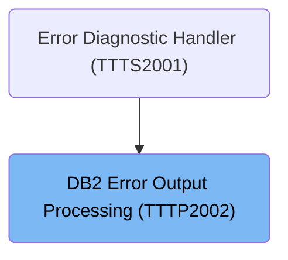

# Overview

This document describes the flow for handling DB2 errors. When an error occurs, the system prepares for error processing, determines the appropriate actions, formats and logs error messages, and communicates the outcome through a return code.

## Dependencies

### Programs

- TTTP2002 (<SwmPath>[base/src/TTTP2002.cbl](base/src/TTTP2002.cbl)</SwmPath>)
- DSNTIAR

### Copybooks

- SQLCA
- T01N2001

# Where is this program used?

This program is used once, as represented in the following diagram:

&nbsp;

*This is an auto-generated document by Swimm 🌊 and has not yet been verified by a human*

<SwmMeta version="3.0.0" repo-id="Z2l0aHViJTNBJTNBU3dpbW1pby1keW5jYWxsLWRlbW8lM0ElM0FHaXJpLVN3aW1t" repo-name="Swimmio-dyncall-demo">Powered by [Swimm](https://app.swimm.io/)</SwmMeta>
