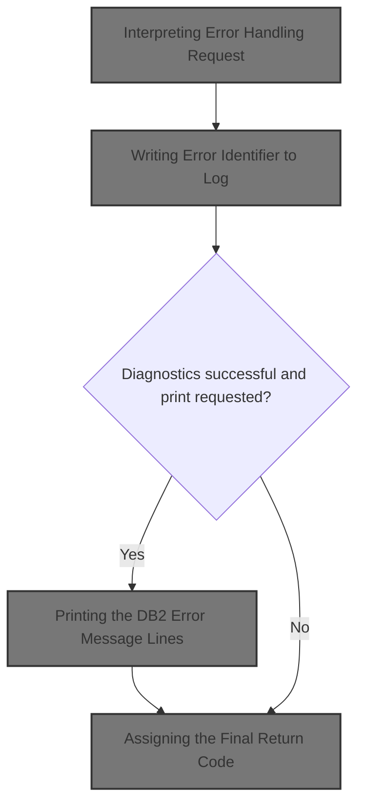
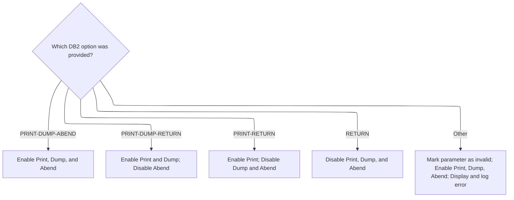
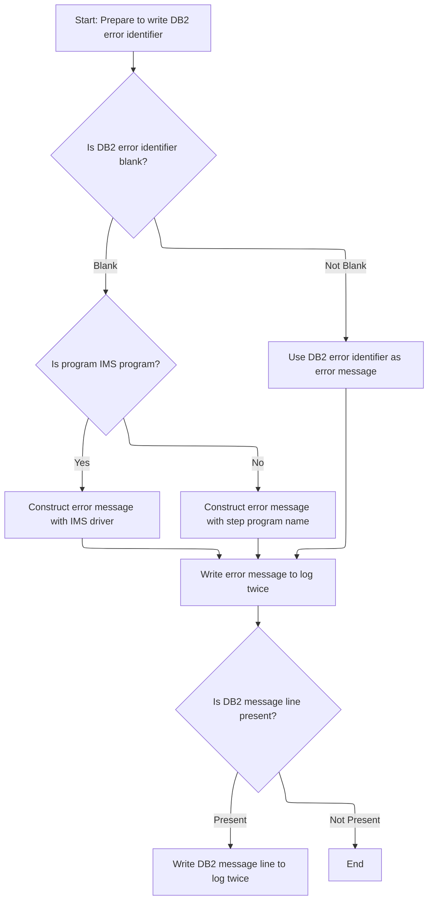
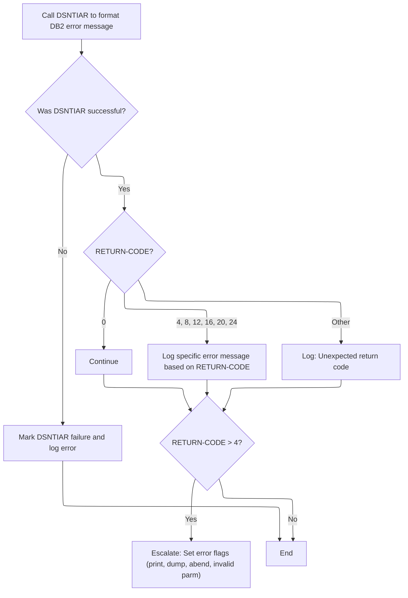
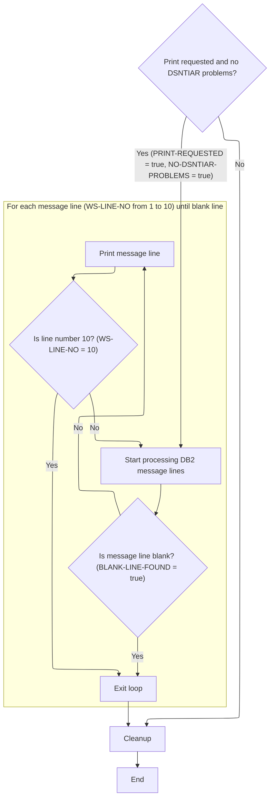
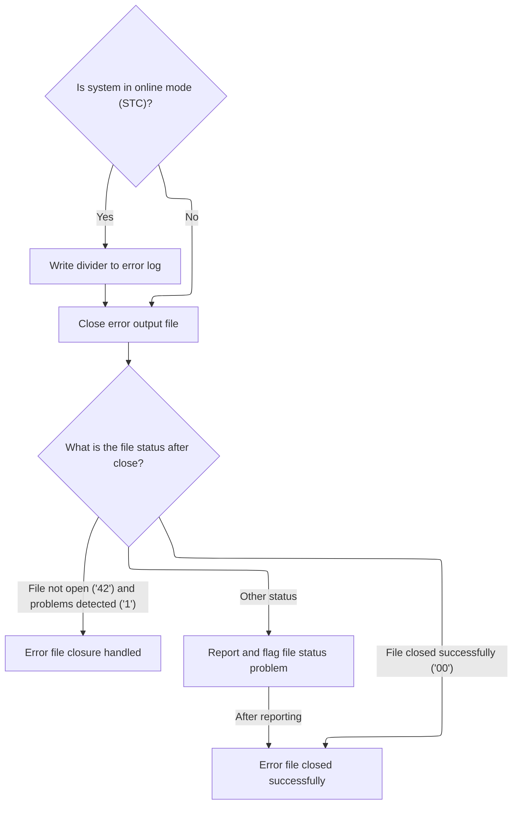
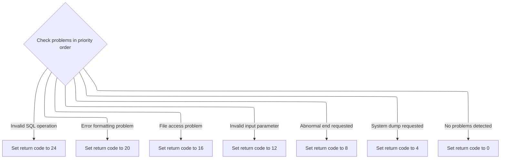

# Overview

This document describes the flow for handling and reporting <SwmToken path="base/src/TTTP2002.cbl" pos="199:2:2" line-data="022700                               DB2-MESSAGE-AREA">`DB2`</SwmToken> errors. The process prepares the system, interprets error handling requests, logs error information, generates diagnostic messages, and signals the outcome through a return code.



## Dependencies

### Programs

- <SwmToken path="base/src/TTTP2002.cbl" pos="284:5:5" line-data="031200           STRING &#39;TTTP2002- INVALID DB2 OPTION-BYTE PASSED:&#39;">`TTTP2002`</SwmToken> (<SwmPath>[base/src/TTTP2002.cbl](base/src/TTTP2002.cbl)</SwmPath>)
- DSNTIAR

### Copybooks

- SQLCA
- <SwmToken path="base/src/TTTP2002.cbl" pos="159:4:4" line-data="018700    COPY T01N2001.">`T01N2001`</SwmToken>

# Where is this program used?

This program is used once, as represented in the following diagram:

```mermaid
graph TD
  4mjdx("Error Diagnostic Handler (TTTS2001)") --> lifxc("DB2 Error Output Processing (TTTP2002)"):::currentEntity
click 4mjdx openCode "base/src/TTTS2001.cbl:1"
  
  
click lifxc openCode "base/src/TTTP2002.cbl:1"
    classDef currentEntity color:#000000,fill:#7CB9F4

%% Swimm:
%% graph TD
%%   4mjdx("Error Diagnostic Handler (TTTS2001)") --> lifxc("<SwmToken path="base/src/TTTP2002.cbl" pos="199:2:2" line-data="022700                               DB2-MESSAGE-AREA">`DB2`</SwmToken> Error Output Processing (<SwmToken path="base/src/TTTP2002.cbl" pos="284:5:5" line-data="031200           STRING &#39;TTTP2002- INVALID DB2 OPTION-BYTE PASSED:&#39;">`TTTP2002`</SwmToken>)"):::currentEntity
%% click 4mjdx openCode "<SwmPath>[base/src/TTTS2001.cbl](base/src/TTTS2001.cbl)</SwmPath>:1"
%%   
%%   
%% click lifxc openCode "<SwmPath>[base/src/TTTP2002.cbl](base/src/TTTP2002.cbl)</SwmPath>:1"
%%     classDef currentEntity color:#000000,fill:#7CB9F4
```



## Input and Output Tables/Files used in the Program

| Table / File Name                                                                                                                            | Type                                                                                                                                    | Description                                                                                                                                                                                        | Usage Mode | Key Fields / Layout Highlights           |
| -------------------------------------------------------------------------------------------------------------------------------------------- | --------------------------------------------------------------------------------------------------------------------------------------- | -------------------------------------------------------------------------------------------------------------------------------------------------------------------------------------------------- | ---------- | ---------------------------------------- |
| <SwmToken path="base/src/TTTP2002.cbl" pos="440:6:10" line-data="046800     OPEN OUTPUT ERROR-OUTPUT-FILE">`ERROR-OUTPUT-FILE`</SwmToken>    | <SwmToken path="base/src/TTTP2002.cbl" pos="199:2:2" line-data="022700                               DB2-MESSAGE-AREA">`DB2`</SwmToken> | Output file for <SwmToken path="base/src/TTTP2002.cbl" pos="199:2:2" line-data="022700                               DB2-MESSAGE-AREA">`DB2`</SwmToken> error messages and diagnostics             | Output     | Database table with relational structure |
| <SwmToken path="base/src/TTTP2002.cbl" pos="25:4:6" line-data="005300 01  ERROR-RECORD                 PIC X(80).">`ERROR-RECORD`</SwmToken> | <SwmToken path="base/src/TTTP2002.cbl" pos="199:2:2" line-data="022700                               DB2-MESSAGE-AREA">`DB2`</SwmToken> | Single error message line, up to 80 chars, for <SwmToken path="base/src/TTTP2002.cbl" pos="199:2:2" line-data="022700                               DB2-MESSAGE-AREA">`DB2`</SwmToken> diagnostics | Output     | Database table with relational structure |

&nbsp;

## Detailed View of the Program's Functionality

# Program Initialization and Setup

The program begins by defining its identification, environment, and file handling setup. It declares a file for error output, which is assigned to a specific system resource and has its status tracked. The data section defines the structure of the error output record and sets up various flags and working variables to track the state of error handling, message processing, and program context.

# Error Handling State Preparation

When the main logic starts, it performs an initialization routine. This routine resets all error flags to indicate no problems, sets up message and pointer indexes, and prepares the environment for error handling. It attempts to open the error log file, and if this fails (due to missing resources or other file errors), it logs the issue to the console and sets a flag to indicate file problems. The program then retrieves context information about the running job, such as the program name, job type, and driver, by navigating system control blocks. If the program is not running under a specific control environment, it logs a warning both to the console and the error log.

After gathering context, the initialization routine ensures that the error program and paragraph fields are correctly aligned, updating them if necessary.

# Option Parameter Validation

Next, the program validates the error handling option parameter. It checks which error handling mode was requested (such as print, dump, abend, or combinations thereof) and sets the corresponding flags. If the parameter is invalid or unrecognized, it marks it as invalid, enables all error handling actions, and logs the invalid parameter both to the console and the error log.

# Error Identifier Logging

If printing is requested, the program prepares to write an error identifier to the log. If no identifier is provided, it constructs one using a fixed prefix and either the driver or step program name, depending on the execution context. If an identifier is present, it uses it directly. The identifier is written to the error log twice. If there is an initial <SwmToken path="base/src/TTTP2002.cbl" pos="199:2:2" line-data="022700                               DB2-MESSAGE-AREA">`DB2`</SwmToken> message line, it is also written to the log twice.

# <SwmToken path="base/src/TTTP2002.cbl" pos="199:2:2" line-data="022700                               DB2-MESSAGE-AREA">`DB2`</SwmToken> Error Message Generation and Handling

The program then calls a diagnostic routine to format the <SwmToken path="base/src/TTTP2002.cbl" pos="199:2:2" line-data="022700                               DB2-MESSAGE-AREA">`DB2`</SwmToken> error message. It sets up pointers for message length and line length, and invokes the routine with the necessary parameters. If the call fails, it marks the diagnostic routine as problematic and logs an error. If the call succeeds, it checks the return code:

- If the return code is zero, it continues.
- For specific error codes (such as message area overflow, line length out of range, text area too small, internal errors, load failures, or invalid SQLCA), it logs a descriptive error message to both the console and the error log.
- For any other return code, it logs a generic error message with the code value.
- If the return code indicates a serious problem (greater than 4), it sets all error handling flags to escalate the response.

# Printing <SwmToken path="base/src/TTTP2002.cbl" pos="199:2:2" line-data="022700                               DB2-MESSAGE-AREA">`DB2`</SwmToken> Error Message Lines

If printing is requested and there were no problems with the diagnostic routine, the program enters a loop to process and print each <SwmToken path="base/src/TTTP2002.cbl" pos="199:2:2" line-data="022700                               DB2-MESSAGE-AREA">`DB2`</SwmToken> message line. For each line:

- If the line is blank, it sets a flag to exit the loop.
- If the line is not blank, it copies the line to working storage and writes it to the error log.
- The loop also exits after processing ten lines, matching the expected message format.

# Final Cleanup and Return Code Assignment

After processing messages, the program performs cleanup. It closes the error log, and if running in a specific mode, writes a divider line to the log before closing. It checks the file status after closing:

- If the file closed successfully or was not open but problems were already flagged, it continues.
- For any other status, it logs the issue and marks the file as problematic.

Finally, the program assigns a return code based on the highest-priority problem detected:

- Invalid SQL operation: return code 24
- Error formatting problem: return code 20
- File access problem: return code 16
- Invalid input parameter: return code 12
- Abnormal end requested: return code 8
- System dump requested: return code 4
- No problems detected: return code 0

The program then returns control to the caller.

# Data Definitions

| Table / Record Name                                                                                                                          | Type                                                                                                                                    | Short Description                                                                                                                                                                                  | Usage Mode |
| -------------------------------------------------------------------------------------------------------------------------------------------- | --------------------------------------------------------------------------------------------------------------------------------------- | -------------------------------------------------------------------------------------------------------------------------------------------------------------------------------------------------- | ---------- |
| <SwmToken path="base/src/TTTP2002.cbl" pos="440:6:10" line-data="046800     OPEN OUTPUT ERROR-OUTPUT-FILE">`ERROR-OUTPUT-FILE`</SwmToken>    | <SwmToken path="base/src/TTTP2002.cbl" pos="199:2:2" line-data="022700                               DB2-MESSAGE-AREA">`DB2`</SwmToken> | Output file for <SwmToken path="base/src/TTTP2002.cbl" pos="199:2:2" line-data="022700                               DB2-MESSAGE-AREA">`DB2`</SwmToken> error messages and diagnostics             | Output     |
| <SwmToken path="base/src/TTTP2002.cbl" pos="25:4:6" line-data="005300 01  ERROR-RECORD                 PIC X(80).">`ERROR-RECORD`</SwmToken> | <SwmToken path="base/src/TTTP2002.cbl" pos="199:2:2" line-data="022700                               DB2-MESSAGE-AREA">`DB2`</SwmToken> | Single error message line, up to 80 chars, for <SwmToken path="base/src/TTTP2002.cbl" pos="199:2:2" line-data="022700                               DB2-MESSAGE-AREA">`DB2`</SwmToken> diagnostics | Output     |

&nbsp;

# Rule Definition

| Paragraph Name                                                                                                                                                                                                                                                                                                                               | Rule ID | Category          | Description                                                                                                                                                                                                                                                                                                                                                                                                                                                                                                                                                                  | Conditions                                                                                                                                                                                          | Remarks                                                                                                                                                                                                                                   |
| -------------------------------------------------------------------------------------------------------------------------------------------------------------------------------------------------------------------------------------------------------------------------------------------------------------------------------------------- | ------- | ----------------- | ---------------------------------------------------------------------------------------------------------------------------------------------------------------------------------------------------------------------------------------------------------------------------------------------------------------------------------------------------------------------------------------------------------------------------------------------------------------------------------------------------------------------------------------------------------------------------- | --------------------------------------------------------------------------------------------------------------------------------------------------------------------------------------------------- | ----------------------------------------------------------------------------------------------------------------------------------------------------------------------------------------------------------------------------------------- |
| <SwmToken path="base/src/TTTP2002.cbl" pos="210:4:6" line-data="023800     PERFORM 100-INITIALIZE">`100-INITIALIZE`</SwmToken>                                                                                                                                                                                                               | RL-001  | Data Assignment   | Before any error processing, all error handling flags and state variables must be set to their initial values to ensure a known starting state.                                                                                                                                                                                                                                                                                                                                                                                                                              | Program start or entry into main logic.                                                                                                                                                             | Flags include file problems, print/dump/abend switches, DSNTIAR problems, SQLCODE validity, etc. All are set to their 'no problem' or 'not found' states.                                                                                 |
| <SwmToken path="base/src/TTTP2002.cbl" pos="246:4:10" line-data="027400     PERFORM 600-OPEN-ERROR-FILE">`600-OPEN-ERROR-FILE`</SwmToken>                                                                                                                                                                                                    | RL-002  | Conditional Logic | The program must attempt to open the error log file and set a flag if the file is unavailable or an error occurs during open.                                                                                                                                                                                                                                                                                                                                                                                                                                                | During initialization, when error log file needs to be opened.                                                                                                                                      | File status codes: '00' (good), '96' (DD missing), '42' (not open). On failure, set file problems flag and log to console.                                                                                                                |
| <SwmToken path="base/src/TTTP2002.cbl" pos="212:4:10" line-data="024000     PERFORM 150-VALIDATE-OPTION-PARM">`150-VALIDATE-OPTION-PARM`</SwmToken>                                                                                                                                                                                          | RL-003  | Conditional Logic | The program must validate the error handling option parameter and set flags for print, dump, and abend requests according to the value provided. If invalid, set all error handling flags and log the invalid parameter.                                                                                                                                                                                                                                                                                                                                                     | After initialization, when option parameter is available.                                                                                                                                           | Valid options trigger combinations of print, dump, abend flags. Invalid option sets all flags and logs the issue to both console and error log.                                                                                           |
| <SwmToken path="base/src/TTTP2002.cbl" pos="215:4:8" line-data="024300        PERFORM 200-WRITE-IDENTIFIER">`200-WRITE-IDENTIFIER`</SwmToken>                                                                                                                                                                                                | RL-004  | Computation       | If print is requested, write the error identifier to the error log twice. If a <SwmToken path="base/src/TTTP2002.cbl" pos="199:2:2" line-data="022700                               DB2-MESSAGE-AREA">`DB2`</SwmToken> message line is present, write it to the error log twice as well.                                                                                                                                                                                                                                                                                     | Print requested flag is set.                                                                                                                                                                        | Error identifier is either provided or constructed from program/step name. Each entry is a plain text line of exactly 80 characters.                                                                                                      |
| <SwmToken path="base/src/TTTP2002.cbl" pos="217:4:10" line-data="024500     PERFORM 300-GET-DB2-MESSAGE">`300-GET-DB2-MESSAGE`</SwmToken>                                                                                                                                                                                                    | RL-005  | Computation       | The program must call the <SwmToken path="base/src/TTTP2002.cbl" pos="199:2:2" line-data="022700                               DB2-MESSAGE-AREA">`DB2`</SwmToken> diagnostic routine DSNTIAR to format the <SwmToken path="base/src/TTTP2002.cbl" pos="199:2:2" line-data="022700                               DB2-MESSAGE-AREA">`DB2`</SwmToken> error message from the SQLCA, check the return code, and log a specific error message for each known return code. For code 24, log 'SQLCA:' and the first 80 bytes of SQLCA. For codes > 4, set all error handling flags. | <SwmToken path="base/src/TTTP2002.cbl" pos="199:2:2" line-data="022700                               DB2-MESSAGE-AREA">`DB2`</SwmToken> error message needs formatting after identifier is written. | Known return codes: 0, 4, 8, 12, 16, 20, 24. For 24, log 'SQLCA:' and first 80 bytes of SQLCA. For codes > 4, set all error handling flags.                                                                                               |
| <SwmToken path="base/src/TTTP2002.cbl" pos="220:4:8" line-data="024800        PERFORM 400-PRINT-MESSAGE">`400-PRINT-MESSAGE`</SwmToken>                                                                                                                                                                                                      | RL-006  | Conditional Logic | If print is requested and there are no DSNTIAR problems, print each <SwmToken path="base/src/TTTP2002.cbl" pos="199:2:2" line-data="022700                               DB2-MESSAGE-AREA">`DB2`</SwmToken> message line to the error log until a blank line is found or 10 lines have been processed.                                                                                                                                                                                                                                                                       | Print requested and no DSNTIAR problems after DSNTIAR call.                                                                                                                                         | Each message line is written as a plain text line of exactly 80 characters. Processing stops at blank line or after 10 lines.                                                                                                             |
| Definition of <SwmToken path="base/src/TTTP2002.cbl" pos="25:4:6" line-data="005300 01  ERROR-RECORD                 PIC X(80).">`ERROR-RECORD`</SwmToken>, all log writes (e.g., <SwmToken path="base/src/TTTP2002.cbl" pos="289:4:12" line-data="031700           PERFORM 610-WRITE-TO-DB2ERROR-DD">`610-WRITE-TO-DB2ERROR-DD`</SwmToken>) | RL-007  | Data Assignment   | Each error log entry must be written as a plain text line of exactly 80 characters, padded with spaces or truncated as needed.                                                                                                                                                                                                                                                                                                                                                                                                                                               | Whenever writing to the error log file.                                                                                                                                                             | <SwmToken path="base/src/TTTP2002.cbl" pos="25:4:6" line-data="005300 01  ERROR-RECORD                 PIC X(80).">`ERROR-RECORD`</SwmToken> is defined as 80 characters. All log entries must be formatted to fit exactly 80 characters. |
| <SwmToken path="base/src/TTTP2002.cbl" pos="230:4:6" line-data="025800     PERFORM 500-CLEANUP">`500-CLEANUP`</SwmToken>, <SwmToken path="base/src/TTTP2002.cbl" pos="416:4:10" line-data="044400     PERFORM 620-CLOSE-ERROR-FILE">`620-CLOSE-ERROR-FILE`</SwmToken>                                                                        | RL-008  | Conditional Logic | After error processing, the program must close the error log file and check the file status, logging and flagging any problems encountered during close.                                                                                                                                                                                                                                                                                                                                                                                                                     | After all error processing is complete.                                                                                                                                                             | File status codes checked after close. Problems are logged to console and file problems flag is set.                                                                                                                                      |
| <SwmToken path="base/src/TTTP2002.cbl" pos="230:4:6" line-data="025800     PERFORM 500-CLEANUP">`500-CLEANUP`</SwmToken>                                                                                                                                                                                                                     | RL-009  | Computation       | The program must assign the final return code according to the following priority: 24 (invalid SQL operation), 20 (error formatting problem), 16 (file access problem), 12 (invalid input parameter), 8 (abnormal end requested), 4 (system dump requested), 0 (no problems detected). The final code is returned to the caller.                                                                                                                                                                                                                                             | At the end of error processing, before returning to caller.                                                                                                                                         | Priority order: 24, 20, 16, 12, 8, 4, 0. Only the highest priority code is returned.                                                                                                                                                      |

# User Stories

## User Story 1: Initialize and manage error handling lifecycle

---

### Story Description:

As a system, I want to initialize all error handling state, manage the opening and closing of the error log file, and handle any file access problems so that error processing starts and ends in a known, reliable state and any file issues are properly flagged and logged.

---

### Business Rule Mapping:

| Rule ID | Paragraph Name                                                                                                                                                                                                                                                        | Rule Description                                                                                                                                         |
| ------- | --------------------------------------------------------------------------------------------------------------------------------------------------------------------------------------------------------------------------------------------------------------------- | -------------------------------------------------------------------------------------------------------------------------------------------------------- |
| RL-001  | <SwmToken path="base/src/TTTP2002.cbl" pos="210:4:6" line-data="023800     PERFORM 100-INITIALIZE">`100-INITIALIZE`</SwmToken>                                                                                                                                        | Before any error processing, all error handling flags and state variables must be set to their initial values to ensure a known starting state.          |
| RL-002  | <SwmToken path="base/src/TTTP2002.cbl" pos="246:4:10" line-data="027400     PERFORM 600-OPEN-ERROR-FILE">`600-OPEN-ERROR-FILE`</SwmToken>                                                                                                                             | The program must attempt to open the error log file and set a flag if the file is unavailable or an error occurs during open.                            |
| RL-008  | <SwmToken path="base/src/TTTP2002.cbl" pos="230:4:6" line-data="025800     PERFORM 500-CLEANUP">`500-CLEANUP`</SwmToken>, <SwmToken path="base/src/TTTP2002.cbl" pos="416:4:10" line-data="044400     PERFORM 620-CLOSE-ERROR-FILE">`620-CLOSE-ERROR-FILE`</SwmToken> | After error processing, the program must close the error log file and check the file status, logging and flagging any problems encountered during close. |

---

### Relevant Functionality:

- <SwmToken path="base/src/TTTP2002.cbl" pos="210:4:6" line-data="023800     PERFORM 100-INITIALIZE">`100-INITIALIZE`</SwmToken>
  1. **RL-001:**
     - Set all error handling flags (file problems, blank line found, reason code found, QWIKREF problems, DSNTIAR problems, SQLCODE validity, parameter validity) to their initial 'no problem' or 'not found' states.
     - Initialize message index and pointers.
     - Open the error log file and retrieve program/job context information.
- <SwmToken path="base/src/TTTP2002.cbl" pos="246:4:10" line-data="027400     PERFORM 600-OPEN-ERROR-FILE">`600-OPEN-ERROR-FILE`</SwmToken>
  1. **RL-002:**
     - Attempt to open the error log file for output.
     - Check file status:
       - If good, continue.
       - If DD missing or other error, set file problems flag, log error to console, and route output to console.
- <SwmToken path="base/src/TTTP2002.cbl" pos="230:4:6" line-data="025800     PERFORM 500-CLEANUP">`500-CLEANUP`</SwmToken>
  1. **RL-008:**
     - Close the error log file.
     - Check file status:
       - If not good, log error to console and set file problems flag.

## User Story 2: Comprehensive error reporting and logging

---

### Story Description:

As a system, I want to write error identifiers and <SwmToken path="base/src/TTTP2002.cbl" pos="199:2:2" line-data="022700                               DB2-MESSAGE-AREA">`DB2`</SwmToken> message lines to the error log, format <SwmToken path="base/src/TTTP2002.cbl" pos="199:2:2" line-data="022700                               DB2-MESSAGE-AREA">`DB2`</SwmToken> error messages using DSNTIAR, handle all known return codes, and ensure all log entries are exactly 80 characters, so that errors are clearly documented for troubleshooting and compliance.

---

### Business Rule Mapping:

| Rule ID | Paragraph Name                                                                                                                                                                                                                                                                                                                               | Rule Description                                                                                                                                                                                                                                                                                                                                                                                                                                                                                                                                                             |
| ------- | -------------------------------------------------------------------------------------------------------------------------------------------------------------------------------------------------------------------------------------------------------------------------------------------------------------------------------------------- | ---------------------------------------------------------------------------------------------------------------------------------------------------------------------------------------------------------------------------------------------------------------------------------------------------------------------------------------------------------------------------------------------------------------------------------------------------------------------------------------------------------------------------------------------------------------------------- |
| RL-004  | <SwmToken path="base/src/TTTP2002.cbl" pos="215:4:8" line-data="024300        PERFORM 200-WRITE-IDENTIFIER">`200-WRITE-IDENTIFIER`</SwmToken>                                                                                                                                                                                                | If print is requested, write the error identifier to the error log twice. If a <SwmToken path="base/src/TTTP2002.cbl" pos="199:2:2" line-data="022700                               DB2-MESSAGE-AREA">`DB2`</SwmToken> message line is present, write it to the error log twice as well.                                                                                                                                                                                                                                                                                     |
| RL-005  | <SwmToken path="base/src/TTTP2002.cbl" pos="217:4:10" line-data="024500     PERFORM 300-GET-DB2-MESSAGE">`300-GET-DB2-MESSAGE`</SwmToken>                                                                                                                                                                                                    | The program must call the <SwmToken path="base/src/TTTP2002.cbl" pos="199:2:2" line-data="022700                               DB2-MESSAGE-AREA">`DB2`</SwmToken> diagnostic routine DSNTIAR to format the <SwmToken path="base/src/TTTP2002.cbl" pos="199:2:2" line-data="022700                               DB2-MESSAGE-AREA">`DB2`</SwmToken> error message from the SQLCA, check the return code, and log a specific error message for each known return code. For code 24, log 'SQLCA:' and the first 80 bytes of SQLCA. For codes > 4, set all error handling flags. |
| RL-006  | <SwmToken path="base/src/TTTP2002.cbl" pos="220:4:8" line-data="024800        PERFORM 400-PRINT-MESSAGE">`400-PRINT-MESSAGE`</SwmToken>                                                                                                                                                                                                      | If print is requested and there are no DSNTIAR problems, print each <SwmToken path="base/src/TTTP2002.cbl" pos="199:2:2" line-data="022700                               DB2-MESSAGE-AREA">`DB2`</SwmToken> message line to the error log until a blank line is found or 10 lines have been processed.                                                                                                                                                                                                                                                                       |
| RL-007  | Definition of <SwmToken path="base/src/TTTP2002.cbl" pos="25:4:6" line-data="005300 01  ERROR-RECORD                 PIC X(80).">`ERROR-RECORD`</SwmToken>, all log writes (e.g., <SwmToken path="base/src/TTTP2002.cbl" pos="289:4:12" line-data="031700           PERFORM 610-WRITE-TO-DB2ERROR-DD">`610-WRITE-TO-DB2ERROR-DD`</SwmToken>) | Each error log entry must be written as a plain text line of exactly 80 characters, padded with spaces or truncated as needed.                                                                                                                                                                                                                                                                                                                                                                                                                                               |

---

### Relevant Functionality:

- <SwmToken path="base/src/TTTP2002.cbl" pos="215:4:8" line-data="024300        PERFORM 200-WRITE-IDENTIFIER">`200-WRITE-IDENTIFIER`</SwmToken>
  1. **RL-004:**
     - If print requested:
       - If error identifier is blank, construct it from IMS driver or step program name.
       - Write the error identifier to the error log twice.
       - If <SwmToken path="base/src/TTTP2002.cbl" pos="199:2:2" line-data="022700                               DB2-MESSAGE-AREA">`DB2`</SwmToken> message line is present, write it to the error log twice.
- <SwmToken path="base/src/TTTP2002.cbl" pos="217:4:10" line-data="024500     PERFORM 300-GET-DB2-MESSAGE">`300-GET-DB2-MESSAGE`</SwmToken>
  1. **RL-005:**
     - Call DSNTIAR with SQLCA and message pointers.
     - Evaluate return code:
       - For each known code, log a specific message to console and error log.
       - For code 24, log 'SQLCA:' and first 80 bytes of SQLCA.
       - For codes > 4, set DSNTIAR problems, invalid parameter, print, dump, and abend flags.
- <SwmToken path="base/src/TTTP2002.cbl" pos="220:4:8" line-data="024800        PERFORM 400-PRINT-MESSAGE">`400-PRINT-MESSAGE`</SwmToken>
  1. **RL-006:**
     - For each <SwmToken path="base/src/TTTP2002.cbl" pos="199:2:2" line-data="022700                               DB2-MESSAGE-AREA">`DB2`</SwmToken> message line (up to 10):
       - If line is blank, stop.
       - Otherwise, write line to error log.
       - If 10 lines processed, stop.
- **Definition of** <SwmToken path="base/src/TTTP2002.cbl" pos="25:4:6" line-data="005300 01  ERROR-RECORD                 PIC X(80).">`ERROR-RECORD`</SwmToken>
  1. **RL-007:**
     - Before writing to error log, ensure message line is exactly 80 characters (pad with spaces or truncate as needed).
     - Write to error log file.

## User Story 3: Configure error handling and communicate outcome

---

### Story Description:

As a system, I want to validate the error handling option parameter, set the appropriate flags for print, dump, and abend requests, and assign and return the final return code based on the highest priority error condition so that error handling behavior matches user intent and the outcome is accurately communicated.

---

### Business Rule Mapping:

| Rule ID | Paragraph Name                                                                                                                                      | Rule Description                                                                                                                                                                                                                                                                                                                 |
| ------- | --------------------------------------------------------------------------------------------------------------------------------------------------- | -------------------------------------------------------------------------------------------------------------------------------------------------------------------------------------------------------------------------------------------------------------------------------------------------------------------------------- |
| RL-003  | <SwmToken path="base/src/TTTP2002.cbl" pos="212:4:10" line-data="024000     PERFORM 150-VALIDATE-OPTION-PARM">`150-VALIDATE-OPTION-PARM`</SwmToken> | The program must validate the error handling option parameter and set flags for print, dump, and abend requests according to the value provided. If invalid, set all error handling flags and log the invalid parameter.                                                                                                         |
| RL-009  | <SwmToken path="base/src/TTTP2002.cbl" pos="230:4:6" line-data="025800     PERFORM 500-CLEANUP">`500-CLEANUP`</SwmToken>                            | The program must assign the final return code according to the following priority: 24 (invalid SQL operation), 20 (error formatting problem), 16 (file access problem), 12 (invalid input parameter), 8 (abnormal end requested), 4 (system dump requested), 0 (no problems detected). The final code is returned to the caller. |

---

### Relevant Functionality:

- <SwmToken path="base/src/TTTP2002.cbl" pos="212:4:10" line-data="024000     PERFORM 150-VALIDATE-OPTION-PARM">`150-VALIDATE-OPTION-PARM`</SwmToken>
  1. **RL-003:**
     - Evaluate the option parameter value:
       - For each valid value, set the corresponding print, dump, abend flags.
       - If invalid, set all error handling flags, log the invalid parameter to console and error log.
- <SwmToken path="base/src/TTTP2002.cbl" pos="230:4:6" line-data="025800     PERFORM 500-CLEANUP">`500-CLEANUP`</SwmToken>
  1. **RL-009:**
     - Evaluate all error flags in priority order:
       - If invalid SQLCODE, set return code to 24.
       - Else if DSNTIAR problems, set to 20.
       - Else if file problems, set to 16.
       - Else if invalid parameter, set to 12.
       - Else if abend requested, set to 8.
       - Else if dump requested, set to 4.
       - Else, set to 0.
     - Return the final code to the caller.

# Workflow

# Starting the Main Error Handling Flow

```mermaid
%%{init: {"flowchart": {"defaultRenderer": "elk"}} }%%
flowchart TD
    node1["Start error handling process"]
    click node1 openCode "base/src/TTTP2002.cbl:198:205"
    node1 --> node2["Preparing Error Handling State"]
    
    node2 --> node3["Interpreting Error Handling Request"]
    
    node3 --> node4{"Is printing requested? (PRINT-REQUESTED = '1')"}
    click node4 openCode "base/src/TTTP2002.cbl:214:217"
    node4 -->|"Yes"| node5["Writing Error Identifier to Log"]
    
    node4 -->|"No"| node6["Calling DB2 Diagnostic Routine and Handling Results"]
    
    node5 --> node6
    node6 --> node7{"Are printing requested and no DSNTIAR problems? (PRINT-REQUESTED = '1' AND NO-DSNTIAR-PROBLEMS = '0')"}
    click node7 openCode "base/src/TTTP2002.cbl:219:228"
    node7 -->|"Yes"| loop1
    node7 -->|"No"| node9["Cleanup and finish"]
    click node9 openCode "base/src/TTTP2002.cbl:230:233"
    subgraph loop1["Print each message line until blank line found"]
      node8{"Is blank line found? (BLANK-LINE-FOUND = '1')"}
      click node8 openCode "base/src/TTTP2002.cbl:400:411"
      node8 -->|"No"| node10["Print message line"]
      click node10 openCode "base/src/TTTP2002.cbl:400:411"
      node10 --> node8
      node8 -->|"Yes"| node9
    end

classDef HeadingStyle fill:#777777,stroke:#333,stroke-width:2px;
click node2 goToHeading "Preparing Error Handling State"
node2:::HeadingStyle
click node3 goToHeading "Interpreting Error Handling Request"
node3:::HeadingStyle
click node5 goToHeading "Writing Error Identifier to Log"
node5:::HeadingStyle
click node6 goToHeading "Calling DB2 Diagnostic Routine and Handling Results"
node6:::HeadingStyle

%% Swimm:
%% %%{init: {"flowchart": {"defaultRenderer": "elk"}} }%%
%% flowchart TD
%%     node1["Start error handling process"]
%%     click node1 openCode "<SwmPath>[base/src/TTTP2002.cbl](base/src/TTTP2002.cbl)</SwmPath>:198:205"
%%     node1 --> node2["Preparing Error Handling State"]
%%     
%%     node2 --> node3["Interpreting Error Handling Request"]
%%     
%%     node3 --> node4{"Is printing requested? (<SwmToken path="base/src/TTTP2002.cbl" pos="214:4:6" line-data="024200     IF PRINT-REQUESTED">`PRINT-REQUESTED`</SwmToken> = '1')"}
%%     click node4 openCode "<SwmPath>[base/src/TTTP2002.cbl](base/src/TTTP2002.cbl)</SwmPath>:214:217"
%%     node4 -->|"Yes"| node5["Writing Error Identifier to Log"]
%%     
%%     node4 -->|"No"| node6["Calling <SwmToken path="base/src/TTTP2002.cbl" pos="199:2:2" line-data="022700                               DB2-MESSAGE-AREA">`DB2`</SwmToken> Diagnostic Routine and Handling Results"]
%%     
%%     node5 --> node6
%%     node6 --> node7{"Are printing requested and no DSNTIAR problems? (<SwmToken path="base/src/TTTP2002.cbl" pos="214:4:6" line-data="024200     IF PRINT-REQUESTED">`PRINT-REQUESTED`</SwmToken> = '1' AND <SwmToken path="base/src/TTTP2002.cbl" pos="219:10:14" line-data="024700     IF PRINT-REQUESTED AND NO-DSNTIAR-PROBLEMS">`NO-DSNTIAR-PROBLEMS`</SwmToken> = '0')"}
%%     click node7 openCode "<SwmPath>[base/src/TTTP2002.cbl](base/src/TTTP2002.cbl)</SwmPath>:219:228"
%%     node7 -->|"Yes"| loop1
%%     node7 -->|"No"| node9["Cleanup and finish"]
%%     click node9 openCode "<SwmPath>[base/src/TTTP2002.cbl](base/src/TTTP2002.cbl)</SwmPath>:230:233"
%%     subgraph loop1["Print each message line until blank line found"]
%%       node8{"Is blank line found? (<SwmToken path="base/src/TTTP2002.cbl" pos="222:4:8" line-data="025000           UNTIL BLANK-LINE-FOUND">`BLANK-LINE-FOUND`</SwmToken> = '1')"}
%%       click node8 openCode "<SwmPath>[base/src/TTTP2002.cbl](base/src/TTTP2002.cbl)</SwmPath>:400:411"
%%       node8 -->|"No"| node10["Print message line"]
%%       click node10 openCode "<SwmPath>[base/src/TTTP2002.cbl](base/src/TTTP2002.cbl)</SwmPath>:400:411"
%%       node10 --> node8
%%       node8 -->|"Yes"| node9
%%     end
%% 
%% classDef HeadingStyle fill:#777777,stroke:#333,stroke-width:2px;
%% click node2 goToHeading "Preparing Error Handling State"
%% node2:::HeadingStyle
%% click node3 goToHeading "Interpreting Error Handling Request"
%% node3:::HeadingStyle
%% click node5 goToHeading "Writing Error Identifier to Log"
%% node5:::HeadingStyle
%% click node6 goToHeading "Calling <SwmToken path="base/src/TTTP2002.cbl" pos="199:2:2" line-data="022700                               DB2-MESSAGE-AREA">`DB2`</SwmToken> Diagnostic Routine and Handling Results"
%% node6:::HeadingStyle
```



This section governs the start of the error handling process, ensuring the system is ready to handle errors, logs are initialized, and the correct actions are taken based on user or system requests for error message printing or diagnostics.

| Category        | Rule Name                     | Description                                                                                                                                                                                                                                                                                                                                                                                                                                                                          |
| --------------- | ----------------------------- | ------------------------------------------------------------------------------------------------------------------------------------------------------------------------------------------------------------------------------------------------------------------------------------------------------------------------------------------------------------------------------------------------------------------------------------------------------------------------------------ |
| Data validation | Operation Option Validation   | The type of error handling operation (such as printing, dumping, or abnormal termination) must be validated at the start, and if an invalid option is provided, an error must be logged and the process must not proceed with invalid settings.                                                                                                                                                                                                                                      |
| Business logic  | Error Handling Initialization | The error handling process must always begin by preparing the system state, initializing all relevant flags, counters, and opening the error log before any further validation or error processing occurs.                                                                                                                                                                                                                                                                           |
| Business logic  | Print Request Logging         | If printing of error messages is requested (<SwmToken path="base/src/TTTP2002.cbl" pos="214:4:6" line-data="024200     IF PRINT-REQUESTED">`PRINT-REQUESTED`</SwmToken> = '1'), the system must write the error identifier to the log before proceeding with further diagnostics or message printing.                                                                                                                                                                                |
| Business logic  | Diagnostic Routine Invocation | If printing is not requested, the system must call the <SwmToken path="base/src/TTTP2002.cbl" pos="199:2:2" line-data="022700                               DB2-MESSAGE-AREA">`DB2`</SwmToken> diagnostic routine to generate a human-readable error message and handle any issues with message formatting or retrieval.                                                                                                                                                             |
| Business logic  | Conditional Message Printing  | If both printing is requested and there are no DSNTIAR problems (<SwmToken path="base/src/TTTP2002.cbl" pos="214:4:6" line-data="024200     IF PRINT-REQUESTED">`PRINT-REQUESTED`</SwmToken> = '1' AND <SwmToken path="base/src/TTTP2002.cbl" pos="219:10:14" line-data="024700     IF PRINT-REQUESTED AND NO-DSNTIAR-PROBLEMS">`NO-DSNTIAR-PROBLEMS`</SwmToken> = '0'), the system must print each error message line until a blank line is found, at which point the process ends. |
| Business logic  | Error Handling Completion     | The process must terminate the error handling flow and perform cleanup once all required error messages are printed or if conditions for further processing are not met (such as no print request or DSNTIAR problems detected).                                                                                                                                                                                                                                                     |

<SwmSnippet path="/base/src/TTTP2002.cbl" line="198">

---

In <SwmToken path="base/src/TTTP2002.cbl" pos="198:2:4" line-data="022600 PROCEDURE DIVISION    USING   SQLCA">`PROCEDURE DIVISION`</SwmToken>, this is where the flow starts. The function signature sets up the parameters for the rest of the program, replacing the old <SwmToken path="base/src/TTTP2002.cbl" pos="201:5:7" line-data="022900* REPLACED QWIK-REF PARMS WITH DUMMY PARMS">`QWIK-REF`</SwmToken> parameters with dummy ones. This means the downstream logic doesn't depend on those original parameters anymore, but the structure is kept for compatibility.

```cobol
022600 PROCEDURE DIVISION    USING   SQLCA
022700                               DB2-MESSAGE-AREA
022800********************************************* 2003/06/09 - PGLB - COMNT
022900* REPLACED QWIK-REF PARMS WITH DUMMY PARMS
023000*                              QW-LOOKUP-MSG
023100*                              QW-RESULT-MSG.
023200                               DUMMY-PARM1
023300                               DUMMY-PARM2.
```

---

</SwmSnippet>

<SwmSnippet path="/base/src/TTTP2002.cbl" line="210">

---

Right after entering <SwmToken path="base/src/TTTP2002.cbl" pos="198:2:4" line-data="022600 PROCEDURE DIVISION    USING   SQLCA">`PROCEDURE DIVISION`</SwmToken>, the code calls <SwmToken path="base/src/TTTP2002.cbl" pos="210:4:6" line-data="023800     PERFORM 100-INITIALIZE">`100-INITIALIZE`</SwmToken> to prep all the error handling state, open the error log, and set up the environment. This has to happen before any validation or further logic, so the system is ready to handle errors from the start.

```cobol
023800     PERFORM 100-INITIALIZE
023900
024000     PERFORM 150-VALIDATE-OPTION-PARM
```

---

</SwmSnippet>

## Preparing Error Handling State

This section ensures that the program starts with a known, clean error handling state. It prepares all error and state flags, attempts to open the error log, and gathers program context to support robust error tracking and reporting throughout the program's execution.

| Category       | Rule Name                   | Description                                                                                                                                                                                                                  |
| -------------- | --------------------------- | ---------------------------------------------------------------------------------------------------------------------------------------------------------------------------------------------------------------------------- |
| Business logic | Reset error and state flags | All error and state flags must be reset to their default values at the start of program execution to ensure no residual errors or statuses affect the current run.                                                           |
| Business logic | Capture program context     | After attempting to open the error log, the program must obtain and record the current program's technical identification, including job type, step program name, and IMS driver, to provide context for all error messages. |

<SwmSnippet path="/base/src/TTTP2002.cbl" line="235">

---

In <SwmToken path="base/src/TTTP2002.cbl" pos="235:2:4" line-data="026300 100-INITIALIZE.">`100-INITIALIZE`</SwmToken>, all the error and state flags are reset so the rest of the flow starts clean.

```cobol
026300 100-INITIALIZE.
026400
026500     SET NO-FILE-PROBLEMS TO TRUE
026600     SET BLANK-LINE-NOT-FOUND TO TRUE
026700     SET REASON-CODE-NOT-FOUND TO TRUE
026800     SET NO-QWIKREF-PROBLEMS TO TRUE
026900     SET NO-DSNTIAR-PROBLEMS TO TRUE
027000     SET VALID-SQLCODE TO TRUE
027100     MOVE 1 TO WS-MESSAGE-INDEX
027200     MOVE 1 TO WS-SQLERRMC-PTR
```

---

</SwmSnippet>

<SwmSnippet path="/base/src/TTTP2002.cbl" line="246">

---

After setting up the state, the code calls <SwmToken path="base/src/TTTP2002.cbl" pos="246:4:10" line-data="027400     PERFORM 600-OPEN-ERROR-FILE">`600-OPEN-ERROR-FILE`</SwmToken> to try to open the error log. If that fails, it logs to the console and sets a flag so the rest of the program knows the file isn't available. Then it grabs program info for context.

```cobol
027400     PERFORM 600-OPEN-ERROR-FILE
027500     PERFORM 900-GET-PROGRAM-INFO
```

---

</SwmSnippet>

<SwmSnippet path="/base/src/TTTP2002.cbl" line="436">

---

<SwmToken path="base/src/TTTP2002.cbl" pos="436:2:8" line-data="046400 600-OPEN-ERROR-FILE.">`600-OPEN-ERROR-FILE`</SwmToken> tries to open the error log and checks the result using file status codes. If the file is missing (status '96') or any other error occurs, it logs to the console and sets <SwmToken path="base/src/TTTP2002.cbl" pos="450:4:6" line-data="047800          SET FILE-PROBLEMS TO TRUE">`FILE-PROBLEMS`</SwmToken> to TRUE so the rest of the program knows to avoid using the file.

```cobol
046400 600-OPEN-ERROR-FILE.
046500
046600     MOVE SPACES TO WS-MESSAGE-LINE
046700
046800     OPEN OUTPUT ERROR-OUTPUT-FILE
046900
047000     EVALUATE TRUE
047100       WHEN GOOD-FILE-STATUS
047200          CONTINUE
047300       WHEN DB2ERROR-DD-MISSING
047400          DISPLAY 'TTTP2002- DB2ERROR DD CARD MISSING'
047500             UPON CONSOLE
047600          DISPLAY 'TTTP2002- ROUTING OUTPUT TO CONSOLE'
047700             UPON CONSOLE
047800          SET FILE-PROBLEMS TO TRUE
047900       WHEN OTHER
048000          DISPLAY 'TTTP2002- BAD FILE STATUS ON DB2ERROR OPEN: '
048100             WS-FILE-STATUS UPON CONSOLE
048200          DISPLAY 'TTTP2002- ROUTING OUTPUT TO CONSOLE'
048300             UPON CONSOLE
048400          SET FILE-PROBLEMS TO TRUE
048500     END-EVALUATE
```

---

</SwmSnippet>

<SwmSnippet path="/base/src/TTTP2002.cbl" line="246">

---

Back in <SwmToken path="base/src/TTTP2002.cbl" pos="210:4:6" line-data="023800     PERFORM 100-INITIALIZE">`100-INITIALIZE`</SwmToken>, after trying to open the error log, the code immediately fetches program and job info. This gives context for error messages and helps with tracking, especially if the program isn't running under IMS.

```cobol
027400     PERFORM 600-OPEN-ERROR-FILE
027500     PERFORM 900-GET-PROGRAM-INFO
```

---

</SwmSnippet>

### Retrieving Program and Job Context

This section ensures that the program is running in the correct environment by extracting and validating context information from system control blocks. It also provides visibility into environment issues by logging warnings when necessary.

<SwmSnippet path="/base/src/TTTP2002.cbl" line="663">

---

In <SwmToken path="base/src/TTTP2002.cbl" pos="663:2:8" line-data="069100 900-GET-PROGRAM-INFO.">`900-GET-PROGRAM-INFO`</SwmToken>, the code sets up pointers to system control blocks using fixed offsets, then pulls out the step program name, job type, and IMS driver. This info is used to check if the program is running under IMS and for later error reporting.

```cobol
069100 900-GET-PROGRAM-INFO.
069200
069300*    PSA (PREFIXED SAVE AREA) STARTS AT ADDRESS ZERO
069400     SET ADDRESS OF PSA-CONTROL-BLOCK   TO  NULL
069500
069600*    PSA  OFFSET 540 POINTS TO TCB (TASK CONTROL BLOCK)
069700     SET ADDRESS OF TCB-CONTROL-BLOCK   TO  TCB-PTR
069800
069900*    TCB  OFFSET 0   POINTS TO RB (REQUEST BLOCK)
070000     SET ADDRESS OF RB-CONTROL-BLOCK    TO  RB-PTR
070100
070200*    TCB  OFFSET 180 POINTS TO JSCB (JOB/STEP CONTROL BLOCK)
070300     SET ADDRESS OF JSCB-CONTROL-BLOCK  TO  JSCB-PTR
070400
070500*    JSCB OFFSET 316 POINTS TO SSIB (SUBSYSTEM IDENTIFICATION BLOCK)
070600     SET ADDRESS OF SSIB-CONTROL-BLOCK  TO  SSIB-PTR
070700
070800*    JSCB OFFSET 360 CONTAINS JOB STEP PROGRAM NAME
070900     MOVE STEP-PROGNAME TO WS-STEP-PROGNAME
071000
071100*    SSIB OFFSET 12  CONTAINS JOB/STC ID
071200     MOVE JOB-TYPE TO WS-JOB-PREFIX
071300
071400*    RB   OFFSET 96  CONTAINS EXTENDED SAVE AREA INFO, OF WHICH
071500*                    THE FIRST 8 BYTES IS THE FIRST PROGRAM
071600*                    CALLED USING MVS "LINK" TYPE CALL
071700     MOVE LINK-PROGNAME TO WS-IMS-DRIVER
```

---

</SwmSnippet>

<SwmSnippet path="/base/src/TTTP2002.cbl" line="691">

---

After checking the program context, if it's not running under IMS, the code logs a warning to both the console and the error log using <SwmToken path="base/src/TTTP2002.cbl" pos="696:4:12" line-data="072400        PERFORM 610-WRITE-TO-DB2ERROR-DD">`610-WRITE-TO-DB2ERROR-DD`</SwmToken>. This makes sure the environment issue is visible.

```cobol
071900     IF NOT IMS-PROGRAM
072000        MOVE 'TTTP2002- WARNING: NOT EXECUTING UNDER IMS CONTROL!'
072100             TO WS-MESSAGE-LINE
072200        DISPLAY WS-MESSAGE-LINE
072300                 UPON CONSOLE
072400        PERFORM 610-WRITE-TO-DB2ERROR-DD
072500        STRING 'TTTP2002- EXECUTING PROGRAM: ' DELIMITED BY SIZE
072600               WS-STEP-PROGNAME                DELIMITED BY SIZE
072700               INTO WS-MESSAGE-LINE
072800        DISPLAY WS-MESSAGE-LINE
072900                 UPON CONSOLE
073000        PERFORM 610-WRITE-TO-DB2ERROR-DD
073100     END-IF
```

---

</SwmSnippet>

### Finalizing Initialization State

<SwmSnippet path="/base/src/TTTP2002.cbl" line="248">

---

After getting program info, <SwmToken path="base/src/TTTP2002.cbl" pos="210:4:6" line-data="023800     PERFORM 100-INITIALIZE">`100-INITIALIZE`</SwmToken> updates the error program and paragraph fields if they're not aligned.

```cobol
027600     IF DB2-ERROR-PROGNAME NOT EQUAL WS-IMS-DRIVER
027700     AND DB2-ERROR-PARAGRAPH EQUAL SPACES
027800        MOVE DB2-ERROR-PROGNAME TO DB2-ERROR-PARAGRAPH
027900        MOVE WS-IMS-DRIVER TO DB2-ERROR-PROGNAME
028000     END-IF
```

---

</SwmSnippet>

## Validating Error Handling Options

<SwmSnippet path="/base/src/TTTP2002.cbl" line="210">

---

Back in `PROCEDURE-DIVISION`, after initialization, the code immediately validates the option parameter to figure out what kind of error handling is needed (print, dump, abend, etc.) before doing anything else.

```cobol
023800     PERFORM 100-INITIALIZE
023900
024000     PERFORM 150-VALIDATE-OPTION-PARM
```

---

</SwmSnippet>

## Interpreting Error Handling Request



This section interprets the <SwmToken path="base/src/TTTP2002.cbl" pos="199:2:2" line-data="022700                               DB2-MESSAGE-AREA">`DB2`</SwmToken> error handling request and determines which error handling actions (print, dump, abend, or return) should be enabled based on the provided option byte. It ensures that the correct combination of actions is set for each valid input, and handles invalid inputs by enabling all error handling actions and logging the error.

| Category       | Rule Name                   | Description                                                                                                                                                                                                                                                                                                                                                                                         |
| -------------- | --------------------------- | --------------------------------------------------------------------------------------------------------------------------------------------------------------------------------------------------------------------------------------------------------------------------------------------------------------------------------------------------------------------------------------------------- |
| Business logic | Full error handling enabled | If the <SwmToken path="base/src/TTTP2002.cbl" pos="199:2:2" line-data="022700                               DB2-MESSAGE-AREA">`DB2`</SwmToken> option byte is <SwmToken path="base/src/TTTP2002.cbl" pos="259:6:10" line-data="028700        WHEN DB2-PRINT-DUMP-ABEND">`PRINT-DUMP-ABEND`</SwmToken>, then print, dump, and abend actions must all be enabled for the operation.                   |
| Business logic | Print and dump only         | If the <SwmToken path="base/src/TTTP2002.cbl" pos="199:2:2" line-data="022700                               DB2-MESSAGE-AREA">`DB2`</SwmToken> option byte is <SwmToken path="base/src/TTTP2002.cbl" pos="264:6:10" line-data="029200        WHEN DB2-PRINT-DUMP-RETURN">`PRINT-DUMP-RETURN`</SwmToken>, then print and dump actions must be enabled, but abend must be disabled for the operation. |
| Business logic | Print only                  | If the <SwmToken path="base/src/TTTP2002.cbl" pos="199:2:2" line-data="022700                               DB2-MESSAGE-AREA">`DB2`</SwmToken> option byte is <SwmToken path="base/src/TTTP2002.cbl" pos="269:6:8" line-data="029700        WHEN DB2-PRINT-RETURN">`PRINT-RETURN`</SwmToken>, then only the print action must be enabled; dump and abend must be disabled.                          |
| Business logic | No error handling actions   | If the <SwmToken path="base/src/TTTP2002.cbl" pos="199:2:2" line-data="022700                               DB2-MESSAGE-AREA">`DB2`</SwmToken> option byte is 'RETURN', then print, dump, and abend actions must all be disabled for the operation.                                                                                                                                                 |

<SwmSnippet path="/base/src/TTTP2002.cbl" line="255">

---

In <SwmToken path="base/src/TTTP2002.cbl" pos="255:2:8" line-data="028300 150-VALIDATE-OPTION-PARM.">`150-VALIDATE-OPTION-PARM`</SwmToken>, the code checks the <SwmToken path="base/src/TTTP2002.cbl" pos="286:2:6" line-data="031400                  DB2-OPTION-BYTE DELIMITED BY SIZE">`DB2-OPTION-BYTE`</SwmToken> and sets the print, dump, and abend flags based on what was requested. It's a switch-case setup using EVALUATE TRUE for clarity.

```cobol
028300 150-VALIDATE-OPTION-PARM.
028400
028500     EVALUATE TRUE
028600
028700        WHEN DB2-PRINT-DUMP-ABEND
028800           SET PRINT-REQUESTED TO TRUE
028900           SET DUMP-REQUESTED TO TRUE
029000           SET ABEND-REQUESTED TO TRUE
```

---

</SwmSnippet>

<SwmSnippet path="/base/src/TTTP2002.cbl" line="264">

---

Here the code handles the other combinations of print, dump, and abend requests, setting or negating the flags as needed for each option byte value.

```cobol
029200        WHEN DB2-PRINT-DUMP-RETURN
029300           SET PRINT-REQUESTED TO TRUE
029400           SET DUMP-REQUESTED TO TRUE
029500           SET NO-ABEND-REQUESTED TO TRUE
029600
029700        WHEN DB2-PRINT-RETURN
029800           SET PRINT-REQUESTED TO TRUE
029900           SET NO-DUMP-REQUESTED TO TRUE
030000           SET NO-ABEND-REQUESTED TO TRUE
030100
030200        WHEN DB2-RETURN
030300           SET NO-PRINT-REQUESTED TO TRUE
030400           SET NO-DUMP-REQUESTED TO TRUE
030500           SET NO-ABEND-REQUESTED TO TRUE
```

---

</SwmSnippet>

<SwmSnippet path="/base/src/TTTP2002.cbl" line="279">

---

If the option byte doesn't match any known value, the code sets all the error handling flags, logs the invalid option to the console, and writes it to the error log using <SwmToken path="base/src/TTTP2002.cbl" pos="289:4:12" line-data="031700           PERFORM 610-WRITE-TO-DB2ERROR-DD">`610-WRITE-TO-DB2ERROR-DD`</SwmToken>.

```cobol
030700        WHEN OTHER
030800           SET INVALID-PARM TO TRUE
030900           SET PRINT-REQUESTED TO TRUE
031000           SET DUMP-REQUESTED TO TRUE
031100           SET ABEND-REQUESTED TO TRUE
031200           STRING 'TTTP2002- INVALID DB2 OPTION-BYTE PASSED:'
031300                                            DELIMITED BY SIZE
031400                  DB2-OPTION-BYTE DELIMITED BY SIZE
031500             INTO WS-MESSAGE-LINE
031600           DISPLAY WS-MESSAGE-LINE UPON CONSOLE
031700           PERFORM 610-WRITE-TO-DB2ERROR-DD
031800
031900     END-EVALUATE
```

---

</SwmSnippet>

## Logging and Message Generation

<SwmSnippet path="/base/src/TTTP2002.cbl" line="214">

---

Back in `PROCEDURE-DIVISION`, after validating options, the code writes the error identifier to the log only if print is requested. This keeps the log clean and only logs when needed.

```cobol
024200     IF PRINT-REQUESTED
024300        PERFORM 200-WRITE-IDENTIFIER
024400
024500     PERFORM 300-GET-DB2-MESSAGE
```

---

</SwmSnippet>

## Writing Error Identifier to Log



This section governs how <SwmToken path="base/src/TTTP2002.cbl" pos="199:2:2" line-data="022700                               DB2-MESSAGE-AREA">`DB2`</SwmToken> error identifiers and related messages are written to the error log, ensuring that all relevant error information is captured and logged consistently.

| Category       | Rule Name                     | Description                                                                                                                                                                                                                                                                                                                                                                                                                                                                                                               |
| -------------- | ----------------------------- | ------------------------------------------------------------------------------------------------------------------------------------------------------------------------------------------------------------------------------------------------------------------------------------------------------------------------------------------------------------------------------------------------------------------------------------------------------------------------------------------------------------------------- |
| Business logic | Blank Identifier Construction | If the <SwmToken path="base/src/TTTP2002.cbl" pos="199:2:2" line-data="022700                               DB2-MESSAGE-AREA">`DB2`</SwmToken> error identifier is blank, the error message must be constructed using a fixed prefix ('<SwmToken path="base/src/TTTP2002.cbl" pos="199:2:2" line-data="022700                               DB2-MESSAGE-AREA">`DB2`</SwmToken> ERROR TRAPPED IN ENCLAVE') and either the IMS driver name or the step program name, depending on whether the program is running under IMS. |
| Business logic | Provided Identifier Usage     | If the <SwmToken path="base/src/TTTP2002.cbl" pos="199:2:2" line-data="022700                               DB2-MESSAGE-AREA">`DB2`</SwmToken> error identifier is provided (not blank), it must be used as the error message for logging without modification.                                                                                                                                                                                                                                                           |
| Business logic | Error Message Redundancy      | The constructed error message (identifier) must be written to the error log twice for redundancy.                                                                                                                                                                                                                                                                                                                                                                                                                         |
| Business logic | Message Line Redundancy       | If a <SwmToken path="base/src/TTTP2002.cbl" pos="199:2:2" line-data="022700                               DB2-MESSAGE-AREA">`DB2`</SwmToken> message line is present, it must also be written to the error log twice, immediately after the error identifier.                                                                                                                                                                                                                                                             |
| Business logic | No Message Line Handling      | If no <SwmToken path="base/src/TTTP2002.cbl" pos="199:2:2" line-data="022700                               DB2-MESSAGE-AREA">`DB2`</SwmToken> message line is present, only the error identifier is logged and the process ends.                                                                                                                                                                                                                                                                                          |

<SwmSnippet path="/base/src/TTTP2002.cbl" line="294">

---

In <SwmToken path="base/src/TTTP2002.cbl" pos="294:2:6" line-data="032200 200-WRITE-IDENTIFIER.">`200-WRITE-IDENTIFIER`</SwmToken>, the code builds the error identifier string. If none is provided, it uses a fixed prefix and either the IMS driver or the step program name, depending on whether it's running under IMS.

```cobol
032200 200-WRITE-IDENTIFIER.
032300
032400     IF DB2-ERROR-IDENTIFIER EQUAL TO SPACES
032500        IF IMS-PROGRAM
032600           STRING 'DB2 ERROR TRAPPED '         DELIMITED BY SIZE
032700                  'IN ENCLAVE '                DELIMITED BY SIZE
032800                  WS-IMS-DRIVER                DELIMITED BY SIZE
032900             INTO WS-ERROR-ID
033000        ELSE
033100           STRING 'DB2 ERROR TRAPPED '         DELIMITED BY SIZE
033200                  'IN ENCLAVE '                DELIMITED BY SIZE
033300                  WS-STEP-PROGNAME             DELIMITED BY SIZE
033400             INTO WS-ERROR-ID
033500        END-IF
```

---

</SwmSnippet>

<SwmSnippet path="/base/src/TTTP2002.cbl" line="308">

---

If an identifier is already provided, the code just uses it as-is for the error log entry.

```cobol
033600     ELSE
033700        MOVE DB2-ERROR-IDENTIFIER TO WS-ERROR-ID
033800     END-IF
```

---

</SwmSnippet>

<SwmSnippet path="/base/src/TTTP2002.cbl" line="311">

---

After building the identifier, the code writes it to the error log twice using <SwmToken path="base/src/TTTP2002.cbl" pos="312:4:12" line-data="034000     PERFORM 610-WRITE-TO-DB2ERROR-DD">`610-WRITE-TO-DB2ERROR-DD`</SwmToken>. This makes sure both the identifier and any related lines are logged.

```cobol
033900     MOVE WS-FIRST-LINE TO WS-MESSAGE-LINE
034000     PERFORM 610-WRITE-TO-DB2ERROR-DD
034100     PERFORM 610-WRITE-TO-DB2ERROR-DD
```

---

</SwmSnippet>

<SwmSnippet path="/base/src/TTTP2002.cbl" line="314">

---

If there's a <SwmToken path="base/src/TTTP2002.cbl" pos="314:4:4" line-data="034200     IF DB2-MESSAGE-LINE(1) NOT EQUAL SPACES">`DB2`</SwmToken> message line, it's also written to the error log twice, so all error details are captured in the output.

```cobol
034200     IF DB2-MESSAGE-LINE(1) NOT EQUAL SPACES
034300        MOVE DB2-MESSAGE-LINE(1) TO WS-MESSAGE-LINE
034400        PERFORM 610-WRITE-TO-DB2ERROR-DD
034500        PERFORM 610-WRITE-TO-DB2ERROR-DD
034600     END-IF
```

---

</SwmSnippet>

## Generating and Handling <SwmToken path="base/src/TTTP2002.cbl" pos="199:2:2" line-data="022700                               DB2-MESSAGE-AREA">`DB2`</SwmToken> Error Messages

<SwmSnippet path="/base/src/TTTP2002.cbl" line="214">

---

Back in `PROCEDURE-DIVISION`, after logging the identifier, the code calls <SwmToken path="base/src/TTTP2002.cbl" pos="217:4:10" line-data="024500     PERFORM 300-GET-DB2-MESSAGE">`300-GET-DB2-MESSAGE`</SwmToken> to generate and handle the actual <SwmToken path="base/src/TTTP2002.cbl" pos="217:8:8" line-data="024500     PERFORM 300-GET-DB2-MESSAGE">`DB2`</SwmToken> error message, making sure both context and details are logged.

```cobol
024200     IF PRINT-REQUESTED
024300        PERFORM 200-WRITE-IDENTIFIER
024400
024500     PERFORM 300-GET-DB2-MESSAGE
```

---

</SwmSnippet>

## Calling <SwmToken path="base/src/TTTP2002.cbl" pos="199:2:2" line-data="022700                               DB2-MESSAGE-AREA">`DB2`</SwmToken> Diagnostic Routine and Handling Results



This section governs how <SwmToken path="base/src/TTTP2002.cbl" pos="199:2:2" line-data="022700                               DB2-MESSAGE-AREA">`DB2`</SwmToken> error messages are retrieved, formatted, and handled in the event of issues with the DSNTIAR diagnostic routine. It ensures that all error scenarios are properly logged and that critical failures are escalated according to business requirements.

| Category       | Rule Name                   | Description                                                                                                                                 |
| -------------- | --------------------------- | ------------------------------------------------------------------------------------------------------------------------------------------- |
| Business logic | Normal operation on success | If DSNTIAR returns code 0, the process continues without additional error handling or escalation.                                           |
| Business logic | Escalation on severe error  | If DSNTIAR returns a code greater than 4, all error handling flags must be set to ensure the program prints, dumps, and abends as required. |

<SwmSnippet path="/base/src/TTTP2002.cbl" line="321">

---

In <SwmToken path="base/src/TTTP2002.cbl" pos="321:2:8" line-data="034900 300-GET-DB2-MESSAGE.">`300-GET-DB2-MESSAGE`</SwmToken>, the code sets up pointers for message length and line length, then calls the DSNTIAR routine to generate the <SwmToken path="base/src/TTTP2002.cbl" pos="321:6:6" line-data="034900 300-GET-DB2-MESSAGE.">`DB2`</SwmToken> error message from the SQLCA.

```cobol
034900 300-GET-DB2-MESSAGE.
035000
035100     SET ADDRESS OF DSNTIAR-MESSAGE-PTR
035200         TO ADDRESS OF DB2-MESSAGE-LENGTH
035300     SET ADDRESS OF DSNTIAR-LRECL-PTR
035400         TO ADDRESS OF DB2-LINE-LENGTH
035500
035600     CALL WS-DSNTIAR  USING  SQLCA
035700                             DSNTIAR-MESSAGE-PTR
035800                             DSNTIAR-LRECL-PTR
035900************ MADE COBOL II COMPLIANT FOR TELON - 2003/06/23 - PGLB
036000******* ON EXCEPTION
036100*******    SET DSNTIAR-PROBLEMS TO TRUE
036200*******    MOVE 'TTTP2002- EXCEPTION LOADING DSNTIAR MODULE!!'
036300*******      TO WS-MESSAGE-LINE
036400*******    DISPLAY WS-MESSAGE-LINE UPON CONSOLE
036500*******    PERFORM 610-WRITE-TO-DB2ERROR-DD
036600******* NOT ON EXCEPTION
036700           CANCEL WS-DSNTIAR
```

---

</SwmSnippet>

<SwmSnippet path="/base/src/TTTP2002.cbl" line="343">

---

After calling DSNTIAR, the code checks <SwmToken path="base/src/TTTP2002.cbl" pos="344:4:6" line-data="037200        EVALUATE RETURN-CODE">`RETURN-CODE`</SwmToken>. If it's 0, everything's fine and it just continues.

```cobol
037100     IF NO-DSNTIAR-PROBLEMS
037200        EVALUATE RETURN-CODE
037300           WHEN 0
037400              CONTINUE
```

---

</SwmSnippet>

<SwmSnippet path="/base/src/TTTP2002.cbl" line="347">

---

If <SwmToken path="base/src/TTTP2002.cbl" pos="344:4:6" line-data="037200        EVALUATE RETURN-CODE">`RETURN-CODE`</SwmToken> is 4, the code logs a message area overflow error to both the console and the error log.

```cobol
037500           WHEN 4
037600              MOVE 'TTTP2002- DSNTIAR - MESSAGE AREA OVERFLOW'
037700                TO WS-MESSAGE-LINE
037800              DISPLAY WS-MESSAGE-LINE UPON CONSOLE
037900              PERFORM 610-WRITE-TO-DB2ERROR-DD
```

---

</SwmSnippet>

<SwmSnippet path="/base/src/TTTP2002.cbl" line="352">

---

If <SwmToken path="base/src/TTTP2002.cbl" pos="344:4:6" line-data="037200        EVALUATE RETURN-CODE">`RETURN-CODE`</SwmToken> is 8, the code logs an LRECL out of range error to both the console and the error log.

```cobol
038000           WHEN 8
038100              MOVE 'TTTP2002- DSNTIAR - LRECL OUT OF RANGE'
038200                TO WS-MESSAGE-LINE
038300              DISPLAY WS-MESSAGE-LINE UPON CONSOLE
038400              PERFORM 610-WRITE-TO-DB2ERROR-DD
```

---

</SwmSnippet>

<SwmSnippet path="/base/src/TTTP2002.cbl" line="357">

---

If <SwmToken path="base/src/TTTP2002.cbl" pos="344:4:6" line-data="037200        EVALUATE RETURN-CODE">`RETURN-CODE`</SwmToken> is 12, the code logs a text area too small error to both the console and the error log.

```cobol
038500           WHEN 12
038600              MOVE 'TTTP2002- DSNTIAR - TEXT AREA TOO SMALL'
038700                TO WS-MESSAGE-LINE
038800              DISPLAY WS-MESSAGE-LINE UPON CONSOLE
038900              PERFORM 610-WRITE-TO-DB2ERROR-DD
```

---

</SwmSnippet>

<SwmSnippet path="/base/src/TTTP2002.cbl" line="362">

---

If <SwmToken path="base/src/TTTP2002.cbl" pos="344:4:6" line-data="037200        EVALUATE RETURN-CODE">`RETURN-CODE`</SwmToken> is 16, the code logs an internal DSNTIAR error to both the console and the error log.

```cobol
039000           WHEN 16
039100              MOVE 'TTTP2002- INTERNAL ERROR IN DSNTIAR ROUTINE!'
039200                TO WS-MESSAGE-LINE
039300              DISPLAY WS-MESSAGE-LINE UPON CONSOLE
039400              PERFORM 610-WRITE-TO-DB2ERROR-DD
```

---

</SwmSnippet>

<SwmSnippet path="/base/src/TTTP2002.cbl" line="367">

---

If <SwmToken path="base/src/TTTP2002.cbl" pos="344:4:6" line-data="037200        EVALUATE RETURN-CODE">`RETURN-CODE`</SwmToken> is 20, the code logs a <SwmToken path="base/src/TTTP2002.cbl" pos="368:16:16" line-data="039600              MOVE &#39;TTTP2002- DSNTIAR COULD NOT LOAD DSNTIA1!!&#39;">`DSNTIA1`</SwmToken> load failure to both the console and the error log.

```cobol
039500           WHEN 20
039600              MOVE 'TTTP2002- DSNTIAR COULD NOT LOAD DSNTIA1!!'
039700                TO WS-MESSAGE-LINE
039800              DISPLAY WS-MESSAGE-LINE UPON CONSOLE
039900              PERFORM 610-WRITE-TO-DB2ERROR-DD
```

---

</SwmSnippet>

<SwmSnippet path="/base/src/TTTP2002.cbl" line="372">

---

If <SwmToken path="base/src/TTTP2002.cbl" pos="344:4:6" line-data="037200        EVALUATE RETURN-CODE">`RETURN-CODE`</SwmToken> is 24, the code logs an invalid SQLCA error, writes 'SQLCA:' and the actual SQLCA contents to the error log.

```cobol
040000           WHEN 24
040100              MOVE 'TTTP2002- INVALID SQLCA PASSED TO DSNTIAR!!'
040200                TO WS-MESSAGE-LINE
040300              DISPLAY WS-MESSAGE-LINE UPON CONSOLE
040400              PERFORM 610-WRITE-TO-DB2ERROR-DD
040500              MOVE 'SQLCA:' TO WS-MESSAGE-LINE
040600              PERFORM 610-WRITE-TO-DB2ERROR-DD
040700              MOVE SQLCA TO WS-MESSAGE-LINE
040800              PERFORM 610-WRITE-TO-DB2ERROR-DD
```

---

</SwmSnippet>

<SwmSnippet path="/base/src/TTTP2002.cbl" line="381">

---

For any other <SwmToken path="base/src/TTTP2002.cbl" pos="382:4:6" line-data="041000              MOVE RETURN-CODE TO WS-DISP-RC">`RETURN-CODE`</SwmToken>, the code logs a generic error message with the code value to both the console and the error log.

```cobol
040900           WHEN OTHER
041000              MOVE RETURN-CODE TO WS-DISP-RC
041100              STRING 'TTTP2002- BAD RETURN CODE FROM DSNTIAR: '
041200                                              DELIMITED BY SIZE
041300                     WS-DISP-RC               DELIMITED BY SIZE
041400                INTO WS-MESSAGE-LINE
041500              DISPLAY WS-MESSAGE-LINE UPON CONSOLE
041600              PERFORM 610-WRITE-TO-DB2ERROR-DD
041700        END-EVALUATE
```

---

</SwmSnippet>

<SwmSnippet path="/base/src/TTTP2002.cbl" line="390">

---

If <SwmToken path="base/src/TTTP2002.cbl" pos="390:4:6" line-data="041800        IF RETURN-CODE &gt; 4">`RETURN-CODE`</SwmToken> is greater than 4, all the error handling flags are set so the program will print, dump, and abend as needed.

```cobol
041800        IF RETURN-CODE > 4
041900           SET DSNTIAR-PROBLEMS TO TRUE
042000           SET INVALID-PARM TO TRUE
042100           SET PRINT-REQUESTED TO TRUE
042200           SET DUMP-REQUESTED TO TRUE
042300           SET ABEND-REQUESTED TO TRUE
042400        END-IF
```

---

</SwmSnippet>

## Printing the <SwmToken path="base/src/TTTP2002.cbl" pos="199:2:2" line-data="022700                               DB2-MESSAGE-AREA">`DB2`</SwmToken> Error Message Lines



<SwmSnippet path="/base/src/TTTP2002.cbl" line="219">

---

After <SwmToken path="base/src/TTTP2002.cbl" pos="217:4:10" line-data="024500     PERFORM 300-GET-DB2-MESSAGE">`300-GET-DB2-MESSAGE`</SwmToken>, PROCEDURE-DIVISION checks if it should print the <SwmToken path="base/src/TTTP2002.cbl" pos="199:2:2" line-data="022700                               DB2-MESSAGE-AREA">`DB2`</SwmToken> error message lines, and if so, calls <SwmToken path="base/src/TTTP2002.cbl" pos="220:4:8" line-data="024800        PERFORM 400-PRINT-MESSAGE">`400-PRINT-MESSAGE`</SwmToken> in a loop to output each non-blank line until done.

```cobol
024700     IF PRINT-REQUESTED AND NO-DSNTIAR-PROBLEMS
024800        PERFORM 400-PRINT-MESSAGE
024900           VARYING WS-LINE-NO FROM 1 BY 1
025000           UNTIL BLANK-LINE-FOUND
025100********************************************* 2003/06/09 - PGLB - COMNT
025200*       IF BATCH-MODE AND NO-FILE-PROBLEMS
025300*          PERFORM 700-PRINT-QWIKREF-INFO
025400*       END-IF
025500********************************************* 2003/06/09 - PGLB - END
025600     END-IF
```

---

</SwmSnippet>

<SwmSnippet path="/base/src/TTTP2002.cbl" line="400">

---

<SwmToken path="base/src/TTTP2002.cbl" pos="400:2:6" line-data="042800 400-PRINT-MESSAGE.">`400-PRINT-MESSAGE`</SwmToken> checks if the current <SwmToken path="base/src/TTTP2002.cbl" pos="402:4:4" line-data="043000     IF DB2-MESSAGE-LINE(WS-LINE-NO) = SPACES">`DB2`</SwmToken> message line is blank. If so, it sets the stop flag. If not, it copies the line to working storage and calls <SwmToken path="base/src/TTTP2002.cbl" pos="407:4:12" line-data="043500           PERFORM 610-WRITE-TO-DB2ERROR-DD">`610-WRITE-TO-DB2ERROR-DD`</SwmToken> to log it. It also stops after 10 lines, matching <SwmToken path="base/src/TTTP2002.cbl" pos="402:4:4" line-data="043000     IF DB2-MESSAGE-LINE(WS-LINE-NO) = SPACES">`DB2`</SwmToken>'s message format.

```cobol
042800 400-PRINT-MESSAGE.
042900
043000     IF DB2-MESSAGE-LINE(WS-LINE-NO) = SPACES
043100        THEN SET BLANK-LINE-FOUND TO TRUE
043200        ELSE
043300           MOVE DB2-MESSAGE-LINE(WS-LINE-NO)
043400              TO WS-MESSAGE-LINE
043500           PERFORM 610-WRITE-TO-DB2ERROR-DD
043600           IF WS-LINE-NO = 10
043700              THEN SET BLANK-LINE-FOUND TO TRUE
043800           END-IF
043900     END-IF
```

---

</SwmSnippet>

<SwmSnippet path="/base/src/TTTP2002.cbl" line="230">

---

After returning from <SwmToken path="base/src/TTTP2002.cbl" pos="220:4:8" line-data="024800        PERFORM 400-PRINT-MESSAGE">`400-PRINT-MESSAGE`</SwmToken>, PROCEDURE-DIVISION calls <SwmToken path="base/src/TTTP2002.cbl" pos="230:4:6" line-data="025800     PERFORM 500-CLEANUP">`500-CLEANUP`</SwmToken> to close out the error log and set the return code based on what happened. This is the last step before returning control to the caller.

```cobol
025800     PERFORM 500-CLEANUP
025900
026000     GOBACK
026100     .
```

---

</SwmSnippet>

# Final Cleanup and Return Code Assignment

The 'Final Cleanup and Return Code Assignment' section ensures that all error logging is properly finalized, all relevant error and status flags are checked, and the program's return code accurately reflects the outcome of its execution. This section is critical for reliable error reporting and for signaling the completion state to downstream processes or operators.

| Category        | Rule Name                     | Description                                                                                                                                                             |
| --------------- | ----------------------------- | ----------------------------------------------------------------------------------------------------------------------------------------------------------------------- |
| Data validation | Invalid Parameter Reporting   | If invalid parameters were detected, the program must set the return code to indicate a parameter error, ensuring that input validation failures are reported.          |
| Data validation | Invalid SQL Code Reporting    | If an invalid SQL code was encountered, the program must set the return code to indicate a database error, ensuring that data access issues are reported.               |
| Business logic  | File Handling Error Status    | If any file handling problems were detected during execution, the program must record this status and ensure the return code reflects a file error condition.           |
| Business logic  | Abend Status Enforcement      | If an abnormal termination (abend) was requested, the program must set the return code to indicate an abend occurred, regardless of other statuses.                     |
| Business logic  | Dump Request Handling         | If a dump was requested due to a critical error, the program must ensure the return code signals this condition for diagnostic purposes.                                |
| Business logic  | DSNTIAR Problem Reporting     | If DSNTIAR problems were detected, the program must set the return code to indicate a DSNTIAR error, ensuring that message formatting or reporting issues are surfaced. |
| Business logic  | Error Log Closure Requirement | The error log file must always be closed at the end of processing, and any problems encountered during file closure must be reported and reflected in the final status. |

<SwmSnippet path="/base/src/TTTP2002.cbl" line="414">

---

<SwmToken path="base/src/TTTP2002.cbl" pos="414:2:4" line-data="044200 500-CLEANUP.">`500-CLEANUP`</SwmToken> starts by calling <SwmToken path="base/src/TTTP2002.cbl" pos="416:4:10" line-data="044400     PERFORM 620-CLOSE-ERROR-FILE">`620-CLOSE-ERROR-FILE`</SwmToken> to finish up the error log, including any online-specific steps.

```cobol
044200 500-CLEANUP.
044300
044400     PERFORM 620-CLOSE-ERROR-FILE
```

---

</SwmSnippet>

## Closing the Error Log and Handling File Status



This section governs the process for closing the error log file at the end of a job. It ensures that error entries are clearly separated for online jobs, and that any issues with closing the file are flagged and reported to prevent unreliable error logging.

| Category        | Rule Name               | Description                                                                                                                                                                                                                                                                                                  |
| --------------- | ----------------------- | ------------------------------------------------------------------------------------------------------------------------------------------------------------------------------------------------------------------------------------------------------------------------------------------------------------ |
| Data validation | Successful file closure | After attempting to close the error log file, if the file status is '00', the closure is considered successful and no further action is required.                                                                                                                                                            |
| Business logic  | Online mode divider     | If the system is in online mode (<SwmToken path="base/src/TTTP2002.cbl" pos="684:10:14" line-data="071200     MOVE JOB-TYPE TO WS-JOB-PREFIX">`WS-JOB-PREFIX`</SwmToken> = 'STC'), a divider line must be written to the error log before closing it. This ensures separation of error entries between jobs. |

<SwmSnippet path="/base/src/TTTP2002.cbl" line="481">

---

In <SwmToken path="base/src/TTTP2002.cbl" pos="481:2:8" line-data="050900 620-CLOSE-ERROR-FILE.">`620-CLOSE-ERROR-FILE`</SwmToken>, if we're in online mode, the code writes a divider line to the error log before closing it. This helps separate error entries from different jobs in the shared log.

```cobol
050900 620-CLOSE-ERROR-FILE.
051000
051100     IF ONLINE-MODE
051200        MOVE WS-ERROR-DIVIDER TO WS-MESSAGE-LINE
051300        PERFORM 610-WRITE-TO-DB2ERROR-DD
051400     END-IF
```

---

</SwmSnippet>

<SwmSnippet path="/base/src/TTTP2002.cbl" line="488">

---

After closing the error log in <SwmToken path="base/src/TTTP2002.cbl" pos="416:4:10" line-data="044400     PERFORM 620-CLOSE-ERROR-FILE">`620-CLOSE-ERROR-FILE`</SwmToken>, the code checks the file status. If it's not '00' (good) or a known 'not open' case with existing problems, it logs an error and sets <SwmToken path="base/src/TTTP2002.cbl" pos="494:4:6" line-data="052200        AND FILE-PROBLEMS">`FILE-PROBLEMS`</SwmToken> to true. This flags the error log as unreliable for the rest of the run.

```cobol
051600     CLOSE ERROR-OUTPUT-FILE
051700
051800     EVALUATE TRUE
051900       WHEN GOOD-FILE-STATUS
052000          CONTINUE
052100       WHEN DB2ERROR-NOT-OPEN
052200        AND FILE-PROBLEMS
052300          CONTINUE
052400       WHEN OTHER
052500          DISPLAY 'TTTP2002- BAD FILE STATUS ON DB2ERROR CLOSE: '
052600             WS-FILE-STATUS UPON CONSOLE
052700          SET FILE-PROBLEMS TO TRUE
052800     END-EVALUATE
```

---

</SwmSnippet>

## Assigning the Final Return Code



<SwmSnippet path="/base/src/TTTP2002.cbl" line="418">

---

Back in <SwmToken path="base/src/TTTP2002.cbl" pos="230:4:6" line-data="025800     PERFORM 500-CLEANUP">`500-CLEANUP`</SwmToken> after closing the error log, the code checks all the error flags and assigns a specific return code for each. This lets the caller know what went wrong just by checking the return code.

```cobol
044600     EVALUATE TRUE
044700        WHEN INVALID-SQLCODE
044800           MOVE 24 TO RETURN-CODE
044900        WHEN DSNTIAR-PROBLEMS
045000           MOVE 20 TO RETURN-CODE
045100        WHEN FILE-PROBLEMS
045200           MOVE 16 TO RETURN-CODE
045300        WHEN INVALID-PARM
045400           MOVE 12 TO RETURN-CODE
045500        WHEN ABEND-REQUESTED
045600           MOVE 8  TO RETURN-CODE
045700        WHEN DUMP-REQUESTED
045800           MOVE 4  TO RETURN-CODE
045900        WHEN OTHER
046000           MOVE 0  TO RETURN-CODE
046100     END-EVALUATE
```

---

</SwmSnippet>

&nbsp;

*This is an auto-generated document by Swimm 🌊 and has not yet been verified by a human*

<SwmMeta version="3.0.0" repo-id="Z2l0aHViJTNBJTNBU3dpbW1pby1keW5jYWxsLWRlbW8lM0ElM0FHaXJpLVN3aW1t" repo-name="Swimmio-dyncall-demo"><sup>Powered by [Swimm](https://app.swimm.io/)</sup></SwmMeta>
