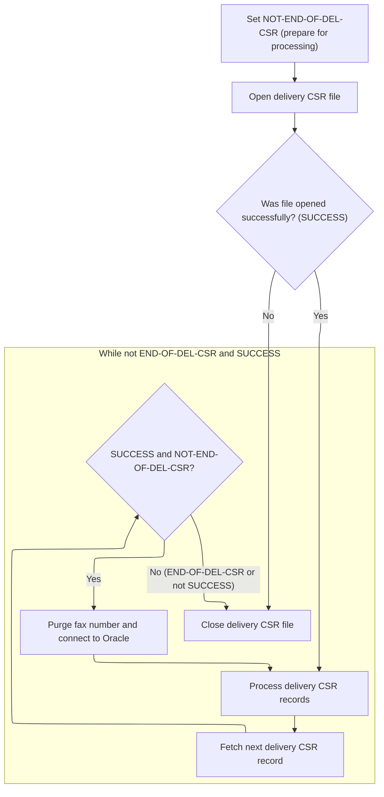
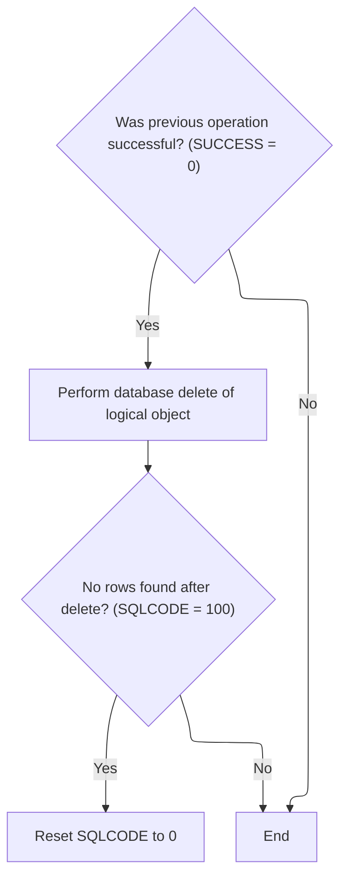

This document describes the flow for deleting a location within the location management feature. When a request to delete a location is received, the system first purges all fax numbers associated with the location to maintain data consistency. After ensuring related data is removed, the system checks if the location can be deleted and, if so, performs the deletion and handles the outcome appropriately.

# Spec

## Detailed View of the Program's Functionality

a. Starting the Location Deletion Sequence

The process to delete a location begins by first removing all fax numbers associated with that location. This is done to ensure that no orphaned fax records remain if the location itself is deleted. The deletion sequence is initiated by calling a routine responsible for purging fax numbers, followed by a check to determine if the location can be safely deleted (for example, ensuring there are no referential integrity issues).

b. Purging Related Fax Numbers

To purge fax numbers, the code sets a flag indicating that the end of the fax number records has not been reached. It then opens a database cursor to select all fax numbers associated with the location. If the cursor opens successfully, the code enters a loop that continues until all relevant fax records have been processed or an error occurs.

Within the loop:

- The next fax record is fetched.
- If a record is successfully fetched and the end of the records has not been reached, the code proceeds to purge (delete) the fax number from the database.
- After each deletion, the code reconnects to the Oracle database. This reconnection is necessary to maintain a valid session or reset the state for reliable database operations.
- The loop repeats until there are no more fax records or an error occurs.

After all fax numbers have been processed, the cursor is closed to release database resources.

c. Finalizing Location Deletion and Handling Results

Once the fax numbers have been purged, the code checks if the previous operations were successful. If so, it proceeds to delete the location record from the database. After attempting the deletion, the code checks if the database returned a special code indicating that no rows were found (meaning the location was already gone or did not exist). If this is the case, the code resets the status code to indicate success, so that the absence of the record is not treated as an error.

This sequence ensures that all related data (fax numbers) is cleaned up before the location is deleted, and that the deletion process is robust against cases where the location might already be missing. The logic also ensures that the database session remains valid throughout the process, and that any special cases (such as "no data found") are handled gracefully.

# Rule Definition

| Paragraph Name                                                                                                                                 | Rule ID | Category          | Description                                                                                                                                                     | Conditions                                                                                          | Remarks                                                                                                                                                                                                                     |
| ---------------------------------------------------------------------------------------------------------------------------------------------- | ------- | ----------------- | --------------------------------------------------------------------------------------------------------------------------------------------------------------- | --------------------------------------------------------------------------------------------------- | --------------------------------------------------------------------------------------------------------------------------------------------------------------------------------------------------------------------------- |
| 100-INITIALIZATION, 110-MOVE-PDA-FIELDS-2-DCL                                                                                                  | RL-001  | Data Assignment   | The routine must accept a location type code and location number as primary inputs, along with all other location fields as provided in the parameter area.     | Routine is invoked with parameters including location type code and location number.                | Location type code is a string (typically 1-2 characters), location number is a number (typically up to 9 digits). All other location fields are passed in the parameter area as strings, numbers, or dates as appropriate. |
| 1691-EXIT-PUT-PURGE-FAX-NUM, 1692-OPEN-DEL-CSR, 1693-FETCH-DEL-CSR, 1694-EXIT-PURGE-FAX-NUM, 1695-CLOSE-DEL-CSR                                | RL-002  | Conditional Logic | For each fax number record in the XXX_NUMBERS table where location type code and location number match the provided location, delete the record.                | Fax number records exist in XXX_NUMBERS table with matching location type code and location number. | Fax number records are identified by FAX_ID, location type code, and location number. Deletion is performed in a loop until all matching records are removed.                                                               |
| 1694-EXIT-PURGE-FAX-NUM, 115-CONNECT-TO-ORACLE                                                                                                 | RL-003  | Computation       | After each fax number deletion, reconnect to the Oracle database to maintain session integrity.                                                                 | A fax number record has just been deleted from XXX_NUMBERS.                                         | Connection is re-established using a dedicated routine. No specific format for connection parameters is required beyond those already in use.                                                                               |
| 1690-DELETE-LO, 4500-CALL-MMMS0304-RI-DEL-CHK                                                                                                  | RL-004  | Conditional Logic | Once all fax numbers for the location are deleted, check if the location can be deleted using business logic (external routine).                                | All fax numbers for the location have been deleted.                                                 | Eligibility is determined by calling an external routine (MMMS0304-RI-DEL-CHK). The details of the business logic are not specified in this program.                                                                        |
| 1690-DELETE-LO, 5000-CALL-NNNS0487-CUD-ROUTINE                                                                                                 | RL-005  | Conditional Logic | If the location is eligible for deletion, delete or update the corresponding record in the XXXATION table where location type code and location number match.   | Location is eligible for deletion and record exists in XXXATION table.                              | Deletion or update is performed using a dedicated routine. If SQLCODE = 100 (no rows found), special handling is required.                                                                                                  |
| 1690-DELETE-LO, 1694-EXIT-PURGE-FAX-NUM, 1610-DELETE-STORE, 1620-DELETE-DSD-VENDOR, 1640-DELETE-BKHAUL, 1650-DELETE-TERMINAL, 1660-DELETE-WHSE | RL-006  | Conditional Logic | If the delete operation on the location record results in SQLCODE = 100 (no rows found), reset SQLCODE to 0 so that 'no data found' is not treated as an error. | Delete operation on location record returns SQLCODE = 100.                                          | SQLCODE is an integer. Value 100 indicates 'no data found'. After resetting, SQLCODE should be 0 (success).                                                                                                                 |
| 120-EXIT-STUFF, error handling in various paragraphs (e.g., 115-CONNECT-TO-ORACLE, 1692-OPEN-DEL-CSR, 1694-EXIT-PURGE-FAX-NUM, etc.)           | RL-007  | Data Assignment   | Routine must return a status indicating success or failure, and a message text describing the result of the operation.                                          | Routine completes processing (success or failure).                                                  | Status is typically a boolean or flag (success/failure). Message text is a string describing the result or error. Output format: { status: 'success'                                                                        |
| 120-EXIT-STUFF, 130-MOVE-DCL-2-PDA-FIELDS                                                                                                      | RL-008  | Data Assignment   | The output must reflect the updated state of the XXX_NUMBERS and XXXATION tables, and provide a return message text for status or error reporting.              | Routine completes processing and tables have been updated.                                          | Output includes all relevant fields from XXX_NUMBERS and XXXATION as strings, numbers, or dates. Message text is included for status reporting.                                                                             |

# User Stories

## User Story 1: Routine invocation and result reporting

---

### Story Description:

As a system, I want to accept location parameters and return a status and message reflecting the updated state of the tables so that users can understand the outcome of the operation and see the current data.

---

### Business Rule Mapping:

| Rule ID | Paragraph Name                                                                                                                       | Rule Description                                                                                                                                            |
| ------- | ------------------------------------------------------------------------------------------------------------------------------------ | ----------------------------------------------------------------------------------------------------------------------------------------------------------- |
| RL-001  | 100-INITIALIZATION, 110-MOVE-PDA-FIELDS-2-DCL                                                                                        | The routine must accept a location type code and location number as primary inputs, along with all other location fields as provided in the parameter area. |
| RL-007  | 120-EXIT-STUFF, error handling in various paragraphs (e.g., 115-CONNECT-TO-ORACLE, 1692-OPEN-DEL-CSR, 1694-EXIT-PURGE-FAX-NUM, etc.) | Routine must return a status indicating success or failure, and a message text describing the result of the operation.                                      |
| RL-008  | 120-EXIT-STUFF, 130-MOVE-DCL-2-PDA-FIELDS                                                                                            | The output must reflect the updated state of the XXX_NUMBERS and XXXATION tables, and provide a return message text for status or error reporting.          |

---

### Relevant Functionality:

- **100-INITIALIZATION**
  1. **RL-001:**
     - On invocation, read location type code and location number from input parameters
     - Assign these values to the working data area for further processing
     - Copy all other location fields from the parameter area to the working data area
- **120-EXIT-STUFF**
  1. **RL-007:**
     - On completion of routine:
       - Set status to success or failure
       - Set message text to describe result or error
       - Return both to caller
  2. **RL-008:**
     - After all operations:
       - Copy updated fields from working data area to output parameter area
       - Include message text describing status or error

## User Story 2: Fax number deletion and session management

---

### Story Description:

As a system, I want to delete all fax number records for a given location and reconnect to the database after each deletion so that session integrity is maintained and all related fax numbers are properly removed.

---

### Business Rule Mapping:

| Rule ID | Paragraph Name                                                                                                  | Rule Description                                                                                                                                 |
| ------- | --------------------------------------------------------------------------------------------------------------- | ------------------------------------------------------------------------------------------------------------------------------------------------ |
| RL-002  | 1691-EXIT-PUT-PURGE-FAX-NUM, 1692-OPEN-DEL-CSR, 1693-FETCH-DEL-CSR, 1694-EXIT-PURGE-FAX-NUM, 1695-CLOSE-DEL-CSR | For each fax number record in the XXX_NUMBERS table where location type code and location number match the provided location, delete the record. |
| RL-003  | 1694-EXIT-PURGE-FAX-NUM, 115-CONNECT-TO-ORACLE                                                                  | After each fax number deletion, reconnect to the Oracle database to maintain session integrity.                                                  |

---

### Relevant Functionality:

- **1691-EXIT-PUT-PURGE-FAX-NUM**
  1. **RL-002:**
     - Open a cursor on XXX_NUMBERS for matching location type code and location number
     - For each fetched fax number record:
       - Delete the record
       - Reconnect to Oracle database after each deletion
     - Close the cursor after all records are processed
- **1694-EXIT-PURGE-FAX-NUM**
  1. **RL-003:**
     - After deleting a fax number record:
       - Call the Oracle connection routine to re-establish the session

## User Story 3: Location deletion and error management

---

### Story Description:

As a system, I want to check if a location can be deleted, perform the deletion or update if eligible, and handle 'no data found' errors gracefully so that the location data is accurately maintained and errors do not disrupt processing.

---

### Business Rule Mapping:

| Rule ID | Paragraph Name                                                                                                                                 | Rule Description                                                                                                                                                |
| ------- | ---------------------------------------------------------------------------------------------------------------------------------------------- | --------------------------------------------------------------------------------------------------------------------------------------------------------------- |
| RL-004  | 1690-DELETE-LO, 4500-CALL-MMMS0304-RI-DEL-CHK                                                                                                  | Once all fax numbers for the location are deleted, check if the location can be deleted using business logic (external routine).                                |
| RL-005  | 1690-DELETE-LO, 5000-CALL-NNNS0487-CUD-ROUTINE                                                                                                 | If the location is eligible for deletion, delete or update the corresponding record in the XXXATION table where location type code and location number match.   |
| RL-006  | 1690-DELETE-LO, 1694-EXIT-PURGE-FAX-NUM, 1610-DELETE-STORE, 1620-DELETE-DSD-VENDOR, 1640-DELETE-BKHAUL, 1650-DELETE-TERMINAL, 1660-DELETE-WHSE | If the delete operation on the location record results in SQLCODE = 100 (no rows found), reset SQLCODE to 0 so that 'no data found' is not treated as an error. |

---

### Relevant Functionality:

- **1690-DELETE-LO**
  1. **RL-004:**
     - After all fax numbers are deleted:
       - Call the external routine to check if location is eligible for deletion
       - Proceed only if eligible
  2. **RL-005:**
     - If location is eligible for deletion:
       - Attempt to delete or update the location record in XXXATION
       - If SQLCODE = 100, reset SQLCODE to 0
  3. **RL-006:**
     - After attempting to delete a location record:
       - If SQLCODE = 100, set SQLCODE to 0

# Code Walkthrough

## Starting the Location Deletion Sequence

<SwmSnippet path="/base/src/NNNS0487.cbl" line="2954">

---

In `1690-DELETE-LO`, we start by purging fax numbers for the location, then immediately check if the location can be deleted. Purging first prevents leftover fax records if the location is removed.

```cobol
303100 1690-DELETE-LO.                                                  00303100
303200     PERFORM 1691-EXIT-PUT-PURGE-FAX-NUM                          00303200
303300                                                                  00303300
303400     PERFORM 4500-CALL-MMMS0304-RI-DEL-CHK                        00303400
```

---

</SwmSnippet>

### Purging Related Fax Numbers



<SwmSnippet path="/base/src/NNNS0487.cbl" line="2968">

---

In `1691-EXIT-PUT-PURGE-FAX-NUM`, we set up to process fax number deletions by marking the cursor as not at end and opening the cursor for the records to be purged. This sets up the loop for fetching and deleting each fax number tied to the location.

```cobol
304500 1691-EXIT-PUT-PURGE-FAX-NUM.                                     00304500
304600     SET NOT-END-OF-DEL-CSR TO TRUE                               00304600
304700     PERFORM 1692-OPEN-DEL-CSR                                    00304700
```

---

</SwmSnippet>

<SwmSnippet path="/base/src/NNNS0487.cbl" line="2971">

---

After opening the cursor and confirming success, we loop through each fax record: fetch, purge, and reconnect to Oracle after each deletion. The reconnect is there to keep the session alive or reset state, which is needed for reliable database operations. Once done, we close the cursor.

```cobol
304800     IF SUCCESS                                                   00304800
304900       PERFORM UNTIL END-OF-DEL-CSR OR NOT SUCCESS                00304900
305000         PERFORM 1693-FETCH-DEL-CSR                               00305000
305100         IF SUCCESS AND NOT-END-OF-DEL-CSR                        00305100
305200           PERFORM 1694-EXIT-PURGE-FAX-NUM                        00305200
305300           PERFORM 115-CONNECT-TO-ORACLE                          00305300
305400         END-IF                                                   00305400
305500       END-PERFORM                                                00305500
305600     END-IF                                                       00305600
305700     PERFORM 1695-CLOSE-DEL-CSR                                   00305700
```

---

</SwmSnippet>

### Finalizing Location Deletion and Handling Results



<SwmSnippet path="/base/src/NNNS0487.cbl" line="2958">

---

Back in `1690-DELETE-LO`, after returning from the fax purge routine, we check if the deletion check succeeded (SUCCESS). If so, we update the location record and handle the case where SQLCODE is 100 by resetting it to 0, so the flow doesn't treat 'no data found' as an error. This wraps up the main logic for deleting a location and cleaning up related data.

```cobol
303500     IF SUCCESS                                                   00303500
303600        PERFORM 5000-CALL-NNNS0487-CUD-ROUTINE                    00303600
303700                                                                  00303700
303800        IF SQLCODE = 100                                          00303800
303900           MOVE 0 TO SQLCODE                                      00303900
304000        END-IF                                                    00304000
304100     END-IF                                                       00304100
```

---

</SwmSnippet>

&nbsp;

*This is an auto-generated document by Swimm 🌊 and has not yet been verified by a human*

<SwmMeta version="3.0.0" repo-id="Z2l0aHViJTNBJTNBU3dpbW1pby1keW5jYWxsLWRlbW8lM0ElM0FHaXJpLVN3aW1t" repo-name="Swimmio-dyncall-demo"><sup>Powered by [Swimm](https://app.swimm.io/)</sup></SwmMeta>
