This document describes the process of validating and matching department and district codes. In our record processing system, each record must be checked to ensure its department and district codes are valid and matched to their respective names. The flow receives department and district codes as input, searches for their names in lookup tables, and retrieves missing data when necessary. The output is an updated record with department and district names, or error flags/messages if the codes are invalid.

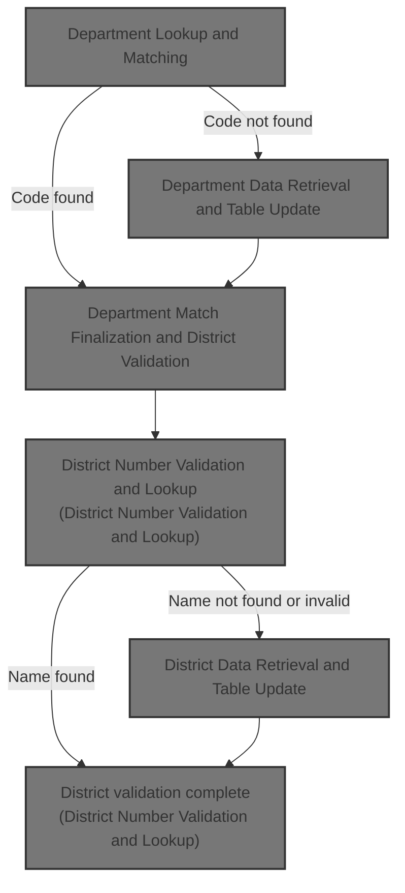

# Spec

## Detailed View of the Program's Functionality

## Department Lookup and Matching

### Initialization and Department Table Search Loop

- The process begins by initializing a counter to start searching for a department.
- A loop is performed that searches through a department lookup table. This loop continues until a search flag indicates that searching is done.
- For each entry in the table:
  - If the counter exceeds the maximum allowed entries or the current entry is blank, the search is marked as done.
  - If the department code in the table matches the department code being searched for, both the match and search flags are set, and the department name is copied from the table to the output area.
  - The counter is incremented to check the next entry.

### After Table Search

- Once the search loop completes, the search flag is reset.
- If a match was found, the match flag is cleared.
- If no match was found, a routine is called to retrieve department information from an external source (likely a database).
- After handling the department, the process continues to validate the district information.

---

## Department Data Retrieval and Table Update

### Department Data Fetch

- The department code is prepared and placed into a key structure.
- A sequence value is set, and the key is moved into an I/O area for the department.
- Several environment flags are set to indicate batch processing and to request a unique row.
- An external routine is called to fetch department information, passing in various control and parameter blocks.

### Handling Fetch Results

- If the fetch is successful and the SQL code is zero (meaning the department was found):
  - The department name is moved to the output area.
  - If there is room in the lookup table, the department counter is incremented, and the department number and name are stored in the table for future lookups.
  - If the table is full, an error message is written to the error file.
- If the department is not found (SQL code 100):
  - The department key is cleared.
  - The department name is set to "INVALID DEPARTMENT".
  - An error flag is set.
- For any other error:
  - The error context is set to "GET DEPT".
  - Flags are set to request error printing and a dump.
  - A diagnostic routine is called to handle and log the error.

---

## Error Handling and Diagnostic Dispatch

### Diagnostic Routine Invocation

- A diagnostic routine is called, which in turn calls another program to process and print DB2 error information.
- After the call, the return code from the diagnostic routine determines the next action:
  - If the action code is zero, control returns to the caller.
  - If the action code indicates a dump and abend, a formatted error message is created and a system abend is triggered.
  - For any other action code, a special error code and message are set, and a system abend is triggered.

---

## Error Diagnosis and TTTP2002 Invocation

### TTTP2002 Diagnostic Program

- The diagnostic program is called with the SQL communication area and a message area.
- After the call, the program is canceled (unloaded from memory), and the return code is stored for further evaluation.

---

## DB2 Error Message Processing and Output

### Initialization and Option Validation

- The error logging environment is initialized: all error flags are set to "no problem", counters are reset, and the error log file is opened.
- Program and job control information is gathered, including the program name, job type, and driver program.
- If the error program name is different from the IMS driver and the error paragraph is blank, the names are swapped for accurate reporting.

### Option Parameter Validation

- The option parameter is evaluated to determine what kind of error handling is requested (print, dump, abend, etc.).
- Flags are set accordingly, and if the option is invalid, an error message is displayed and logged.

### Error Identifier Construction and Message Output

- An error identifier is constructed based on the context (IMS or batch program).
- The identifier and the first message line are written to the error log.
- If a DB2 message is present, it is also written to the log.

### DB2 Error Message Retrieval

- The program sets up pointers and calls the DB2 message formatting routine (DSNTIAR) to retrieve a formatted error message.
- The return code from DSNTIAR is evaluated:
  - If successful, nothing further is done.
  - If there are issues (overflow, invalid parameters, etc.), appropriate error messages are displayed and logged, and flags are set to indicate problems.
  - If the return code is greater than 4, flags are set to request printing, dumping, and abend.

### Printing Message Lines

- For each line of the DB2 error message:
  - If the line is blank or the line number reaches 10, the print loop ends.
  - Otherwise, the line is written to the error log.

---

## Error Log Finalization and Return Code Setting

### Cleanup

- The error log file is closed.
- The return code is set based on which error flags are active:
  - SQL error: 24
  - DB2 error reporting issue: 20
  - File error: 16
  - Invalid parameter: 12
  - Abnormal end requested: 8
  - Dump requested: 4
  - No problem: 0
- If there are file errors during close, messages are displayed and the file error flag is set.

---

## Final Error Handling and Program Exit

- After all error handling routines are completed, the program prints any remaining messages and performs cleanup before exiting.

---

## Department Match Finalization and District Validation

### After Department Handling

- The search flag is reset.
- If a department match was found, the match flag is cleared.
- If no match was found, the department retrieval routine is called.
- The process then continues to district validation.

---

## District Number Validation and Lookup

### District Number Validation

- The district number is checked to ensure it is not greater than 99.
- If it is out of range, an error message is written, and the district retrieval routine is called.
- If the district name is already present in the lookup table for the given district number, it is assigned to the output area.
- If not, the district retrieval routine is called.

---

## District Data Retrieval and Table Update

### District Data Fetch

- The district code is prepared and placed into a key structure.
- A sequence value is set, and the key is moved into an I/O area for the district.
- The district code is also moved into a structure for the SQL select.
- Environment flags are set for batch processing.

### SQL Select and Result Handling

- A SQL select is executed to fetch the district name for the given district ID.

- The SQL code is stored for evaluation.

- If the fetch is successful and the district is found (SQL code 0):

  - The district name is moved to the output area.
  - If the district number is less than 100, the district name is also stored in the lookup table for future use.

- If the district is not found (SQL code 100):

  - The district name is set to "INVALID DISTRICT".
  - An error flag is set.

- For any other error:

  - The error context is set to "GET DIST".
  - Flags are set to request error printing and a dump.
  - A diagnostic routine is called to handle and log the error.

---

## Summary

This flow ensures that department and district information is validated and retrieved, using lookup tables for efficiency and falling back to database queries when necessary. Errors are handled robustly, with detailed logging and diagnostic routines to capture and report issues, including integration with DB2 error reporting and system abend mechanisms when required. The process is modular, with clear separation between lookup, retrieval, and error handling logic.

# Rule Definition

| Paragraph Name                                            | Rule ID | Category          | Description                                                                                                                                                                                                                                                                                                    | Conditions                                                                                                 | Remarks                                                                                                                                                                                                                                                                                                   |
| --------------------------------------------------------- | ------- | ----------------- | -------------------------------------------------------------------------------------------------------------------------------------------------------------------------------------------------------------------------------------------------------------------------------------------------------------- | ---------------------------------------------------------------------------------------------------------- | --------------------------------------------------------------------------------------------------------------------------------------------------------------------------------------------------------------------------------------------------------------------------------------------------------- |
| PROCESS-RECORD, READ-STRIP                                | RL-001  | Data Assignment   | For each input audit record, extract the store number, department/sub-department, and district number fields for processing.                                                                                                                                                                                   | A record is available in the input file XXXP-AUDIT-STRIP.                                                  | Input records are read from a file. The extracted fields are used for subsequent lookup and validation steps. Field formats: store number (numeric, up to 5 digits), department/sub-department (alphanumeric, 3 characters), district number (numeric, up to 2 digits).                                   |
| DEPT-MATCH, DEPT-TABLE-SEARCH, GET-DEPT                   | RL-002  | Conditional Logic | Search the department table for a matching department number. If found, assign the corresponding department name. If not found, attempt to retrieve department information externally and update the table if space allows. If retrieval fails or table is full, assign 'INVALID DEPARTMENT' and log an error. | Department number extracted from input record is available.                                                | Department table supports up to 2000 entries, each with a 3-character department number and a 30-character department name. If table is full, error message is written as a 133-character string. If department information cannot be retrieved, 'INVALID DEPARTMENT' is assigned.                        |
| DISTRICT-MATCH, GET-DISTRICT                              | RL-003  | Conditional Logic | Validate the district number. If greater than 99, assign 'INVALID DISTRICT' and log an error. If valid, check the district table for a name. If not present, attempt external retrieval and update the table if possible. If retrieval fails, assign 'INVALID DISTRICT' and log an error.                      | District number extracted from input record is available.                                                  | District table supports up to 99 entries, each with a 30-character district name, indexed by district number (1-based). Error messages are 133-character strings. 'INVALID DISTRICT' is assigned if validation fails or lookup/retrieval fails.                                                           |
| WRITE-OUTPUT-RECORD, PROCESS-RECORD                       | RL-004  | Data Assignment   | For each processed record, write an output record to the daily audit file, including store number, department/sub-department, district number, department name, and district name. Ensure department and district names are always populated, either with valid names or placeholders.                         | A record has been processed, with all lookups and validations complete.                                    | Output record includes: store number (up to 5 digits), department/sub-department (3 characters), district number (up to 2 digits), department name (30 characters), district name (30 characters). Names are always populated, with 'INVALID DEPARTMENT' or 'INVALID DISTRICT' as placeholders if needed. |
| ERROR-PARA, WRITE-ERROR                                   | RL-005  | Data Assignment   | All error messages must be written as 133-character strings to the error file. Error messages are triggered by invalid department, district, or table overflow conditions.                                                                                                                                     | An error condition is detected during processing (invalid department, invalid district, table full, etc.). | Error messages are always 133-character strings. Messages include context such as which field failed and relevant record information. Table overflow messages are predefined and also written as 133-character strings.                                                                                   |
| DEPT-TABLE-SEARCH, GET-DEPT, DISTRICT-MATCH, GET-DISTRICT | RL-006  | Computation       | Enforce maximum sizes for department and district tables. Department table allows up to 2000 entries; district table allows up to 99 entries. Prevent adding new entries if the table is full and log an error.                                                                                                | Attempting to add a new entry to department or district table.                                             | Department table: max 2000 entries, each with 3-character number and 30-character name. District table: max 99 entries, each with 30-character name. If table is full, error message is written as a 133-character string.                                                                                |

# User Stories

## User Story 1: Validate and enrich department and district information

---

### Story Description:

As a system, I want to validate and enrich department and district information for each record, including searching tables, retrieving externally if needed, enforcing table size limits, and handling errors, so that each record has accurate or placeholder names and errors are logged appropriately.

---

### Business Rule Mapping:

| Rule ID | Paragraph Name                                            | Rule Description                                                                                                                                                                                                                                                                                               |
| ------- | --------------------------------------------------------- | -------------------------------------------------------------------------------------------------------------------------------------------------------------------------------------------------------------------------------------------------------------------------------------------------------------- |
| RL-002  | DEPT-MATCH, DEPT-TABLE-SEARCH, GET-DEPT                   | Search the department table for a matching department number. If found, assign the corresponding department name. If not found, attempt to retrieve department information externally and update the table if space allows. If retrieval fails or table is full, assign 'INVALID DEPARTMENT' and log an error. |
| RL-006  | DEPT-TABLE-SEARCH, GET-DEPT, DISTRICT-MATCH, GET-DISTRICT | Enforce maximum sizes for department and district tables. Department table allows up to 2000 entries; district table allows up to 99 entries. Prevent adding new entries if the table is full and log an error.                                                                                                |
| RL-003  | DISTRICT-MATCH, GET-DISTRICT                              | Validate the district number. If greater than 99, assign 'INVALID DISTRICT' and log an error. If valid, check the district table for a name. If not present, attempt external retrieval and update the table if possible. If retrieval fails, assign 'INVALID DISTRICT' and log an error.                      |
| RL-005  | ERROR-PARA, WRITE-ERROR                                   | All error messages must be written as 133-character strings to the error file. Error messages are triggered by invalid department, district, or table overflow conditions.                                                                                                                                     |

---

### Relevant Functionality:

- **DEPT-MATCH**
  1. **RL-002:**
     - Search department table for department number
       - If found, assign department name to output
       - If not found, attempt external retrieval
         - If successful and table not full, add new entry and assign name
         - If table full, assign 'INVALID DEPARTMENT' and write error
         - If retrieval fails, assign 'INVALID DEPARTMENT' and write error
- **DEPT-TABLE-SEARCH**
  1. **RL-006:**
     - Before adding new entry, check table size
     - If table is full, do not add entry
     - Write error message to error file
- **DISTRICT-MATCH**
  1. **RL-003:**
     - If district number > 99
       - Assign 'INVALID DISTRICT' to output
       - Write error message
     - Else
       - If district name present in table, assign to output
       - If not present, attempt external retrieval
         - If successful and district number < 100, update table and assign name
         - If retrieval fails, assign 'INVALID DISTRICT' and write error
- **ERROR-PARA**
  1. **RL-005:**
     - On error condition, compose error message as 133-character string
     - Include relevant context (field, record info)
     - Write error message to error file
     - Write a blank/spaced-out line after each error message

## User Story 2: Process audit records and write output

---

### Story Description:

As a system, I want to read audit records from the input file, extract store number, department/sub-department, and district number, and write processed records to the daily audit file with all required fields populated, so that audit data is accurately captured and output is complete.

---

### Business Rule Mapping:

| Rule ID | Paragraph Name                      | Rule Description                                                                                                                                                                                                                                                                       |
| ------- | ----------------------------------- | -------------------------------------------------------------------------------------------------------------------------------------------------------------------------------------------------------------------------------------------------------------------------------------- |
| RL-001  | PROCESS-RECORD, READ-STRIP          | For each input audit record, extract the store number, department/sub-department, and district number fields for processing.                                                                                                                                                           |
| RL-004  | WRITE-OUTPUT-RECORD, PROCESS-RECORD | For each processed record, write an output record to the daily audit file, including store number, department/sub-department, district number, department name, and district name. Ensure department and district names are always populated, either with valid names or placeholders. |

---

### Relevant Functionality:

- **PROCESS-RECORD**
  1. **RL-001:**
     - Read next record from input file
     - Extract store number, department/sub-department, and district number from the record
     - Store extracted values for use in lookup and validation
- **WRITE-OUTPUT-RECORD**
  1. **RL-004:**
     - Compose output record with required fields
     - Ensure department and district names are populated
     - Write output record to daily audit file

# Code Walkthrough

## Department Lookup and Matching

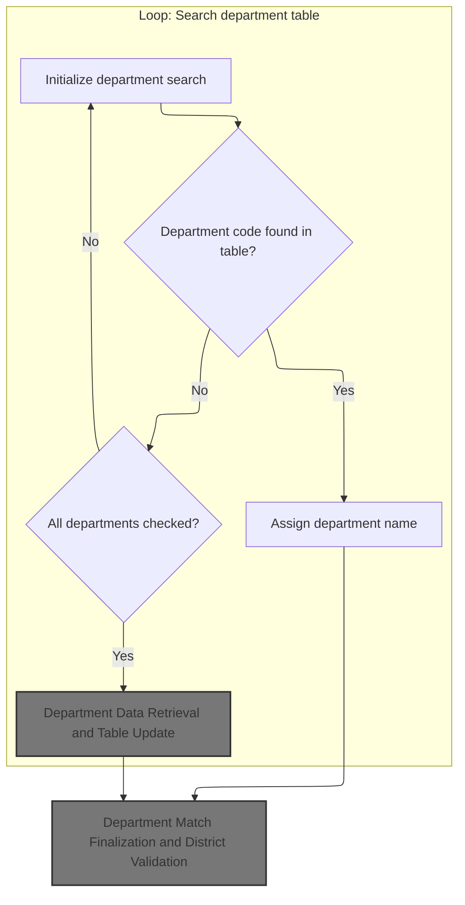

<SwmSnippet path="/base/src/XXXP12DK.cbl" line="340">

---

In `DEPT-MATCH`, we kick off the flow by setting up the department search loop. The code performs DEPT-TABLE-SEARCH repeatedly until DONE-SEARCHING is set, which means we keep searching for a matching department entry in the lookup table. This is necessary because the department might not be present in the table, and we need to exhaust all possibilities before moving on. Once the search is done, we reset the SEARCH-FLAG and, depending on whether a match was found, either clear the MATCH-FLAG or call GET-DEPT to fetch department info. After that, we move on to district validation.

```cobol
040200 DEPT-MATCH.
040300     MOVE 1 TO CTR.
040400     PERFORM DEPT-TABLE-SEARCH UNTIL DONE-SEARCHING.
```

---

</SwmSnippet>

<SwmSnippet path="/base/src/XXXP12DK.cbl" line="350">

---

`DEPT-TABLE-SEARCH` loops through department entries using CTR, sets flags when it finds a match or hits the end, and copies the department name if matched.

```cobol
041200 DEPT-TABLE-SEARCH.
041300     IF CTR GREATER THAN MAX-DEPT-NBR
041400          OR DEPT-NUMBER (CTR) = SPACES
041500         MOVE 'Y' TO SEARCH-FLAG
041600     ELSE IF DEPT-NUMBER (CTR) = DA-DEPT-SUB-DEPT
041700              MOVE 'Y' TO MATCH-FLAG  SEARCH-FLAG
041800              MOVE DEPT-NAME (CTR) TO DA-DEPT-NAME.
041900     ADD 1 TO CTR.
```

---

</SwmSnippet>

<SwmSnippet path="/base/src/XXXP12DK.cbl" line="343">

---

Back in `DEPT-MATCH`, after returning from DEPT-TABLE-SEARCH, we reset SEARCH-FLAG and check if a match was found. If FOUND-MATCH is true, we clear MATCH-FLAG; otherwise, we call GET-DEPT to fetch department info. Finally, we move on to DISTRICT-MATCH to validate the district data. This keeps the flow moving from department to district validation, handling missing data as needed.

```cobol
040500     MOVE SPACE TO SEARCH-FLAG.
040600     IF FOUND-MATCH
040700         MOVE SPACE TO MATCH-FLAG
040800     ELSE
040900         PERFORM GET-DEPT.
041000     PERFORM DISTRICT-MATCH.
```

---

</SwmSnippet>

### Department Data Retrieval and Table Update

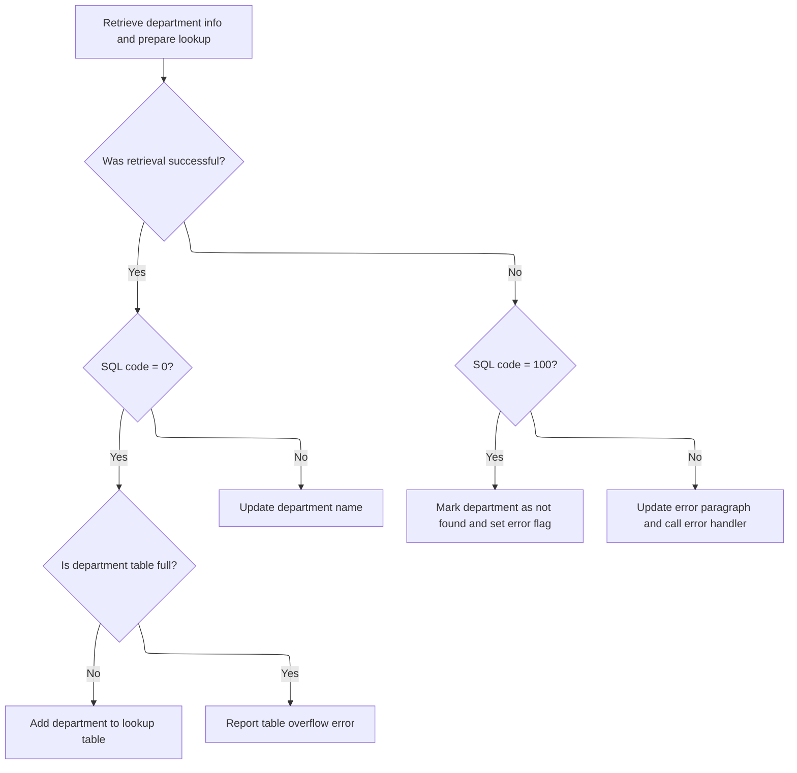

<SwmSnippet path="/base/src/XXXP12DK.cbl" line="360">

---

In `GET-DEPT`, we do more than just fetch department data. We prep the department code, set up the sequence, and call an external routine to get the department info. If successful, we update the output and, if there's room, increment the counter and store the department number and name in the arrays. If the table is full, we log an error. If the department is invalid, we set a flag and write a specific message. This keeps the department table up to date and handles edge cases.

```cobol
042200 GET-DEPT.
042300     MOVE DA-DEPT-SUB-DEPT TO DEPT-CODE.
043000     MOVE '200' TO CT-DEPARTMENT-SEQUENCE
043100     MOVE DEPT-KEY TO DEPT-I-O-AREA(1:10)
043300     SET YYYN005A-BATCH-ENV   TO  TRUE
043400     SET EXIT-GET-UNIQUE-ROW  TO  TRUE
049400     CALL WWWS0040-STR-DEPT-TRANSI USING
049500                                  XXXN001A
049600                                  YYYN005A
049700                                  NNNN0000-PARMS
049800                                  WWWC0040
049900                                  DEPT-I-O-AREA
```

---

</SwmSnippet>

<SwmSnippet path="/base/src/XXXP12DK.cbl" line="372">

---

After fetching department data, we update the table if there's space, or log an error if it's full.

```cobol
044100     EVALUATE TRUE
044200     WHEN SUCCESS
044300       IF DB2-SQL-CODE = 0
044400         MOVE CT-DEPARTMENT-NAME TO DA-DEPT-NAME
044500         IF DEPT-CTR < MAX-DEPT-NBR
044600            ADD 1 TO DEPT-CTR
044700            MOVE DA-DEPT-SUB-DEPT TO DEPT-NUMBER (DEPT-CTR)
044800            MOVE CT-DEPARTMENT-NAME TO DEPT-NAME (DEPT-CTR)
044900         ELSE
045000            MOVE E-MSG1 TO ERROR-REC
045100            WRITE ERROR-REC
045200            WRITE ERROR-REC FROM SPACED-OUT
045300         END-IF
046200       END-IF
```

---

</SwmSnippet>

<SwmSnippet path="/base/src/XXXP12DK.cbl" line="386">

---

If the department isn't found, we flag it as invalid and set the name to 'INVALID DEPARTMENT'.

```cobol
046300      WHEN NOT SUCCESS
045700        IF DB2-SQL-CODE = 100
045800         MOVE SPACES           TO ST-DEPARTMENT-KEY
045900         MOVE INVALID-DEPT-MSG TO DA-DEPT-NAME
046000         MOVE 'Y' TO DEPT-FLAG
              END-IF
```

---

</SwmSnippet>

<SwmSnippet path="/base/src/XXXP12DK.cbl" line="392">

---

When GET-DEPT hits an unexpected error, we set up the error paragraph and call TTTS2001 to handle diagnostics and reporting. This makes sure any DB2 errors are logged and abend logic is triggered if necessary.

```cobol
046300      WHEN OTHER
046400         MOVE 'GET DEPT' TO DB2-ERROR-PARAGRAPH
052720         SET DB2121-PRINT-AND-DUMP TO TRUE
052730         CALL 'TTTS2001' USING SQLCA
052740                                 DB2121-MESSAGE-AREA.
```

---

</SwmSnippet>

### Error Handling and Diagnostic Dispatch

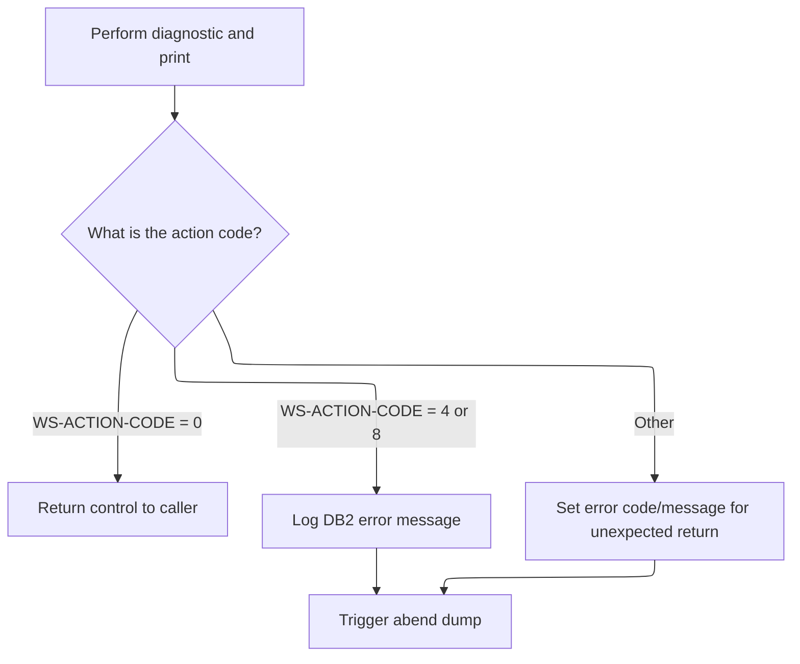

<SwmSnippet path="/base/src/TTTS2001.cbl" line="36">

---

In `PROCEDURE DIVISION` of TTTS2001, we run 100-DIAGNOSE-N-PRINT to process error diagnostics, then evaluate the action code to decide if we continue, abend, or log a bad return code. This keeps error handling flexible and responsive to the type of error encountered.

```cobol
007300 PROCEDURE DIVISION      USING  SQLCA
007400                                DB279-MESSAGE-AREA.
007500
007600     PERFORM 100-DIAGNOSE-N-PRINT
007700
007800     EVALUATE TRUE
007900
008000        WHEN  RETURN-CONTROL-TO-CALLER
008100              CONTINUE
008200
008300        WHEN  DUMP-N-ABEND
008400              MOVE SQLCODE TO WS-SQLCODE-DISP
008500              STRING
008600                 'ABEND FROM '
008700                 DB2-ERROR-PROGNAME       DELIMITED BY SIZE
008800                 ' - DB2 ERROR SQLCODE: ' DELIMITED BY SIZE
008900                 WS-SQLCODE-DISP          DELIMITED BY SIZE
009000                 INTO SSSABEND-MESG
009100              PERFORM 999-SSSABEND-DUMP-N-ABEND
009200
009300        WHEN  OTHER
009400              MOVE 4032 TO SSSABEND-CODE
009500              MOVE RETURN-CODE TO WS-DISP-RC
009600              DISPLAY 'TTTS2001: BAD RETURN CODE FROM TTTP2002:'
009700                 WS-DISP-RC UPON CONSOLE
009800              MOVE 'TTTS2001: BAD RETURN CODE FROM TTTP2002'
009900                 TO SSSABEND-MESG
010000              PERFORM 999-SSSABEND-DUMP-N-ABEND
010100
010200     END-EVALUATE
010300
010400     GOBACK
010500     .
```

---

</SwmSnippet>

### Error Diagnosis and TTTP2002 Invocation

<SwmSnippet path="/base/src/TTTS2001.cbl" line="73">

---

`100-DIAGNOSE-N-PRINT` calls TTTP2002 to process DB2 error info, then cancels it and stores the return code for further error handling. This lets us delegate error message formatting and logging to TTTP2002.

```cobol
011000 100-DIAGNOSE-N-PRINT.
011100     CALL TTTP2002      USING  SQLCA
011200                               DB279-MESSAGE-AREA
011300     CANCEL TTTP2002
011400     MOVE RETURN-CODE TO WS-ACTION-CODE
011500     .
```

---

</SwmSnippet>

### DB2 Error Message Processing and Output

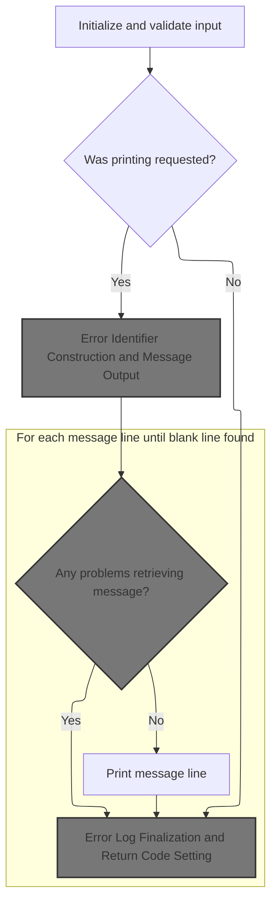

<SwmSnippet path="/base/src/TTTP2002.cbl" line="198">

---

TTTP2002 sets up the environment, validates options, and runs error message routines if needed, then cleans up.

```cobol
022600 PROCEDURE DIVISION    USING   SQLCA
022700                               DB2-MESSAGE-AREA
022800********************************************* 2003/06/09 - PGLB - COMNT
022900* REPLACED QWIK-REF PARMS WITH DUMMY PARMS
023000*                              QW-LOOKUP-MSG
023100*                              QW-RESULT-MSG.
023200                               DUMMY-PARM1
023300                               DUMMY-PARM2.
023400********************************************* 2003/06/09 - PGLB - COMNT
023500
023600
023700
023800     PERFORM 100-INITIALIZE
023900
024000     PERFORM 150-VALIDATE-OPTION-PARM
024100
024200     IF PRINT-REQUESTED
024300        PERFORM 200-WRITE-IDENTIFIER
024400
024500     PERFORM 300-GET-DB2-MESSAGE
024600
024700     IF PRINT-REQUESTED AND NO-DSNTIAR-PROBLEMS
024800        PERFORM 400-PRINT-MESSAGE
024900           VARYING WS-LINE-NO FROM 1 BY 1
025000           UNTIL BLANK-LINE-FOUND
025100********************************************* 2003/06/09 - PGLB - COMNT
025200*       IF BATCH-MODE AND NO-FILE-PROBLEMS
025300*          PERFORM 700-PRINT-QWIKREF-INFO
025400*       END-IF
025500********************************************* 2003/06/09 - PGLB - END
025600     END-IF
025700
025800     PERFORM 500-CLEANUP
025900
026000     GOBACK
026100     .
026200
026300 100-INITIALIZE.
```

---

</SwmSnippet>

#### Error Logging Initialization and Program Info Gathering

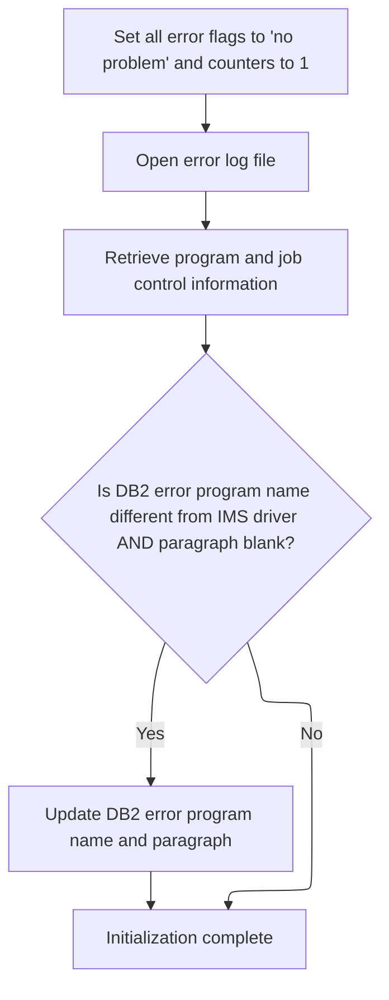

<SwmSnippet path="/base/src/TTTP2002.cbl" line="235">

---

We initialize error logging, gather program info, and swap error program names if needed for accurate error reporting.

```cobol
026300 100-INITIALIZE.
026400
026500     SET NO-FILE-PROBLEMS TO TRUE
026600     SET BLANK-LINE-NOT-FOUND TO TRUE
026700     SET REASON-CODE-NOT-FOUND TO TRUE
026800     SET NO-QWIKREF-PROBLEMS TO TRUE
026900     SET NO-DSNTIAR-PROBLEMS TO TRUE
027000     SET VALID-SQLCODE TO TRUE
027100     MOVE 1 TO WS-MESSAGE-INDEX
027200     MOVE 1 TO WS-SQLERRMC-PTR
027300*    MOVE SPACES TO QW-RESULT-MSG
027400     PERFORM 600-OPEN-ERROR-FILE
027500     PERFORM 900-GET-PROGRAM-INFO
027600     IF DB2-ERROR-PROGNAME NOT EQUAL WS-IMS-DRIVER
027700     AND DB2-ERROR-PARAGRAPH EQUAL SPACES
027800        MOVE DB2-ERROR-PROGNAME TO DB2-ERROR-PARAGRAPH
027900        MOVE WS-IMS-DRIVER TO DB2-ERROR-PROGNAME
028000     END-IF
028100     .
```

---

</SwmSnippet>

<SwmSnippet path="/base/src/TTTP2002.cbl" line="663">

---

`900-GET-PROGRAM-INFO` sets up pointers to system control blocks using fixed offsets, grabs program and job info, and checks if we're running under IMS. If not, it logs a warning to the error log and console. This helps track the execution environment for error diagnostics.

```cobol
069100 900-GET-PROGRAM-INFO.
069200
069300*    PSA (PREFIXED SAVE AREA) STARTS AT ADDRESS ZERO
069400     SET ADDRESS OF PSA-CONTROL-BLOCK   TO  NULL
069500
069600*    PSA  OFFSET 540 POINTS TO TCB (TASK CONTROL BLOCK)
069700     SET ADDRESS OF TCB-CONTROL-BLOCK   TO  TCB-PTR
069800
069900*    TCB  OFFSET 0   POINTS TO RB (REQUEST BLOCK)
070000     SET ADDRESS OF RB-CONTROL-BLOCK    TO  RB-PTR
070100
070200*    TCB  OFFSET 180 POINTS TO JSCB (JOB/STEP CONTROL BLOCK)
070300     SET ADDRESS OF JSCB-CONTROL-BLOCK  TO  JSCB-PTR
070400
070500*    JSCB OFFSET 316 POINTS TO SSIB (SUBSYSTEM IDENTIFICATION BLOCK)
070600     SET ADDRESS OF SSIB-CONTROL-BLOCK  TO  SSIB-PTR
070700
070800*    JSCB OFFSET 360 CONTAINS JOB STEP PROGRAM NAME
070900     MOVE STEP-PROGNAME TO WS-STEP-PROGNAME
071000
071100*    SSIB OFFSET 12  CONTAINS JOB/STC ID
071200     MOVE JOB-TYPE TO WS-JOB-PREFIX
071300
071400*    RB   OFFSET 96  CONTAINS EXTENDED SAVE AREA INFO, OF WHICH
071500*                    THE FIRST 8 BYTES IS THE FIRST PROGRAM
071600*                    CALLED USING MVS "LINK" TYPE CALL
071700     MOVE LINK-PROGNAME TO WS-IMS-DRIVER
071800
071900     IF NOT IMS-PROGRAM
072000        MOVE 'TTTP2002- WARNING: NOT EXECUTING UNDER IMS CONTROL!'
072100             TO WS-MESSAGE-LINE
072200        DISPLAY WS-MESSAGE-LINE
072300                 UPON CONSOLE
072400        PERFORM 610-WRITE-TO-DB2ERROR-DD
072500        STRING 'TTTP2002- EXECUTING PROGRAM: ' DELIMITED BY SIZE
072600               WS-STEP-PROGNAME                DELIMITED BY SIZE
072700               INTO WS-MESSAGE-LINE
072800        DISPLAY WS-MESSAGE-LINE
072900                 UPON CONSOLE
073000        PERFORM 610-WRITE-TO-DB2ERROR-DD
073100     END-IF
073200     .
```

---

</SwmSnippet>

#### Error Identifier Construction and Message Output

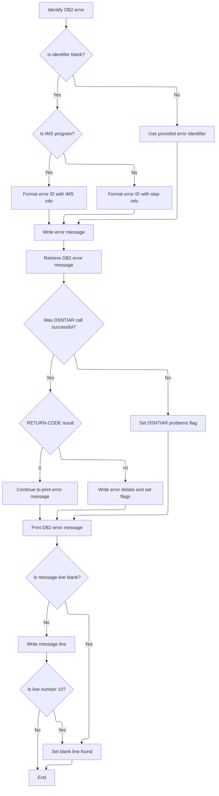

<SwmSnippet path="/base/src/TTTP2002.cbl" line="294">

---

`200-WRITE-IDENTIFIER` builds the error identifier string based on whether we're running under IMS, then writes it out using 610-WRITE-TO-DB2ERROR-DD. It repeats the write for formatting reasons and handles the first message line if present. This keeps error logs consistent and context-aware.

```cobol
032200 200-WRITE-IDENTIFIER.
032300
032400     IF DB2-ERROR-IDENTIFIER EQUAL TO SPACES
032500        IF IMS-PROGRAM
032600           STRING 'DB2 ERROR TRAPPED '         DELIMITED BY SIZE
032700                  'IN ENCLAVE '                DELIMITED BY SIZE
032800                  WS-IMS-DRIVER                DELIMITED BY SIZE
032900             INTO WS-ERROR-ID
033000        ELSE
033100           STRING 'DB2 ERROR TRAPPED '         DELIMITED BY SIZE
033200                  'IN ENCLAVE '                DELIMITED BY SIZE
033300                  WS-STEP-PROGNAME             DELIMITED BY SIZE
033400             INTO WS-ERROR-ID
033500        END-IF
033600     ELSE
033700        MOVE DB2-ERROR-IDENTIFIER TO WS-ERROR-ID
033800     END-IF
033900     MOVE WS-FIRST-LINE TO WS-MESSAGE-LINE
034000     PERFORM 610-WRITE-TO-DB2ERROR-DD
034100     PERFORM 610-WRITE-TO-DB2ERROR-DD
034200     IF DB2-MESSAGE-LINE(1) NOT EQUAL SPACES
034300        MOVE DB2-MESSAGE-LINE(1) TO WS-MESSAGE-LINE
034400        PERFORM 610-WRITE-TO-DB2ERROR-DD
034500        PERFORM 610-WRITE-TO-DB2ERROR-DD
034600     END-IF
034700     .
```

---

</SwmSnippet>

<SwmSnippet path="/base/src/TTTP2002.cbl" line="321">

---

`300-GET-DB2-MESSAGE` sets up pointers for DSNTIAR, calls it to get DB2 diagnostic messages, and checks the return code to decide what error handling steps to take. If the code is bad, we set flags for printing, dumping, or abend as needed.

```cobol
034900 300-GET-DB2-MESSAGE.
035000
035100     SET ADDRESS OF DSNTIAR-MESSAGE-PTR
035200         TO ADDRESS OF DB2-MESSAGE-LENGTH
035300     SET ADDRESS OF DSNTIAR-LRECL-PTR
035400         TO ADDRESS OF DB2-LINE-LENGTH
035500
035600     CALL WS-DSNTIAR  USING  SQLCA
035700                             DSNTIAR-MESSAGE-PTR
035800                             DSNTIAR-LRECL-PTR
035900************ MADE COBOL II COMPLIANT FOR TELON - 2003/06/23 - PGLB
036000******* ON EXCEPTION
036100*******    SET DSNTIAR-PROBLEMS TO TRUE
036200*******    MOVE 'TTTP2002- EXCEPTION LOADING DSNTIAR MODULE!!'
036300*******      TO WS-MESSAGE-LINE
036400*******    DISPLAY WS-MESSAGE-LINE UPON CONSOLE
036500*******    PERFORM 610-WRITE-TO-DB2ERROR-DD
036600******* NOT ON EXCEPTION
036700           CANCEL WS-DSNTIAR
036800**** END-CALL
036900************ MADE COBOL II COMPLIANT FOR TELON - 2003/06/23 - PGLB
037000
037100     IF NO-DSNTIAR-PROBLEMS
037200        EVALUATE RETURN-CODE
037300           WHEN 0
037400              CONTINUE
037500           WHEN 4
037600              MOVE 'TTTP2002- DSNTIAR - MESSAGE AREA OVERFLOW'
037700                TO WS-MESSAGE-LINE
037800              DISPLAY WS-MESSAGE-LINE UPON CONSOLE
037900              PERFORM 610-WRITE-TO-DB2ERROR-DD
038000           WHEN 8
038100              MOVE 'TTTP2002- DSNTIAR - LRECL OUT OF RANGE'
038200                TO WS-MESSAGE-LINE
038300              DISPLAY WS-MESSAGE-LINE UPON CONSOLE
038400              PERFORM 610-WRITE-TO-DB2ERROR-DD
038500           WHEN 12
038600              MOVE 'TTTP2002- DSNTIAR - TEXT AREA TOO SMALL'
038700                TO WS-MESSAGE-LINE
038800              DISPLAY WS-MESSAGE-LINE UPON CONSOLE
038900              PERFORM 610-WRITE-TO-DB2ERROR-DD
039000           WHEN 16
039100              MOVE 'TTTP2002- INTERNAL ERROR IN DSNTIAR ROUTINE!'
039200                TO WS-MESSAGE-LINE
039300              DISPLAY WS-MESSAGE-LINE UPON CONSOLE
039400              PERFORM 610-WRITE-TO-DB2ERROR-DD
039500           WHEN 20
039600              MOVE 'TTTP2002- DSNTIAR COULD NOT LOAD DSNTIA1!!'
039700                TO WS-MESSAGE-LINE
039800              DISPLAY WS-MESSAGE-LINE UPON CONSOLE
039900              PERFORM 610-WRITE-TO-DB2ERROR-DD
040000           WHEN 24
040100              MOVE 'TTTP2002- INVALID SQLCA PASSED TO DSNTIAR!!'
040200                TO WS-MESSAGE-LINE
040300              DISPLAY WS-MESSAGE-LINE UPON CONSOLE
040400              PERFORM 610-WRITE-TO-DB2ERROR-DD
040500              MOVE 'SQLCA:' TO WS-MESSAGE-LINE
040600              PERFORM 610-WRITE-TO-DB2ERROR-DD
040700              MOVE SQLCA TO WS-MESSAGE-LINE
040800              PERFORM 610-WRITE-TO-DB2ERROR-DD
040900           WHEN OTHER
041000              MOVE RETURN-CODE TO WS-DISP-RC
041100              STRING 'TTTP2002- BAD RETURN CODE FROM DSNTIAR: '
041200                                              DELIMITED BY SIZE
041300                     WS-DISP-RC               DELIMITED BY SIZE
041400                INTO WS-MESSAGE-LINE
041500              DISPLAY WS-MESSAGE-LINE UPON CONSOLE
041600              PERFORM 610-WRITE-TO-DB2ERROR-DD
041700        END-EVALUATE
041800        IF RETURN-CODE > 4
041900           SET DSNTIAR-PROBLEMS TO TRUE
042000           SET INVALID-PARM TO TRUE
042100           SET PRINT-REQUESTED TO TRUE
042200           SET DUMP-REQUESTED TO TRUE
042300           SET ABEND-REQUESTED TO TRUE
042400        END-IF
042500     END-IF
042600     .
```

---

</SwmSnippet>

<SwmSnippet path="/base/src/TTTP2002.cbl" line="400">

---

`400-PRINT-MESSAGE` checks if the current DB2 message line is blank. If so, it sets BLANK-LINE-FOUND; if not, it writes the line to the error log and stops after 10 lines. This keeps error output concise and avoids flooding the log.

```cobol
042800 400-PRINT-MESSAGE.
042900
043000     IF DB2-MESSAGE-LINE(WS-LINE-NO) = SPACES
043100        THEN SET BLANK-LINE-FOUND TO TRUE
043200        ELSE
043300           MOVE DB2-MESSAGE-LINE(WS-LINE-NO)
043400              TO WS-MESSAGE-LINE
043500           PERFORM 610-WRITE-TO-DB2ERROR-DD
043600           IF WS-LINE-NO = 10
043700              THEN SET BLANK-LINE-FOUND TO TRUE
043800           END-IF
043900     END-IF
044000     .
```

---

</SwmSnippet>

#### Error Log Finalization and Return Code Setting

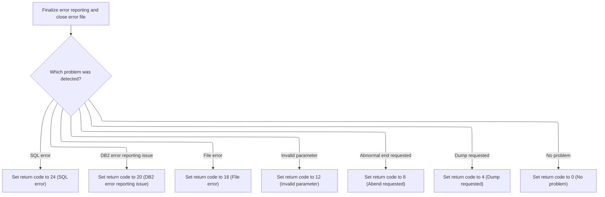

<SwmSnippet path="/base/src/TTTP2002.cbl" line="414">

---

`500-CLEANUP` closes the error log file and sets the return code based on which error flags are active. Each flag maps to a specific numeric code, so downstream logic can react accordingly.

```cobol
044200 500-CLEANUP.
044300
044400     PERFORM 620-CLOSE-ERROR-FILE
044500
044600     EVALUATE TRUE
044700        WHEN INVALID-SQLCODE
044800           MOVE 24 TO RETURN-CODE
044900        WHEN DSNTIAR-PROBLEMS
045000           MOVE 20 TO RETURN-CODE
045100        WHEN FILE-PROBLEMS
045200           MOVE 16 TO RETURN-CODE
045300        WHEN INVALID-PARM
045400           MOVE 12 TO RETURN-CODE
045500        WHEN ABEND-REQUESTED
045600           MOVE 8  TO RETURN-CODE
045700        WHEN DUMP-REQUESTED
045800           MOVE 4  TO RETURN-CODE
045900        WHEN OTHER
046000           MOVE 0  TO RETURN-CODE
046100     END-EVALUATE
046200     .
```

---

</SwmSnippet>

<SwmSnippet path="/base/src/TTTP2002.cbl" line="481">

---

`620-CLOSE-ERROR-FILE` writes a divider to the error log if we're in ONLINE-MODE, then closes the file and checks status flags to decide if we need to log or display file errors. This keeps error logs organized and makes file handling issues visible.

```cobol
050900 620-CLOSE-ERROR-FILE.
051000
051100     IF ONLINE-MODE
051200        MOVE WS-ERROR-DIVIDER TO WS-MESSAGE-LINE
051300        PERFORM 610-WRITE-TO-DB2ERROR-DD
051400     END-IF
051500
051600     CLOSE ERROR-OUTPUT-FILE
051700
051800     EVALUATE TRUE
051900       WHEN GOOD-FILE-STATUS
052000          CONTINUE
052100       WHEN DB2ERROR-NOT-OPEN
052200        AND FILE-PROBLEMS
052300          CONTINUE
052400       WHEN OTHER
052500          DISPLAY 'TTTP2002- BAD FILE STATUS ON DB2ERROR CLOSE: '
052600             WS-FILE-STATUS UPON CONSOLE
052700          SET FILE-PROBLEMS TO TRUE
052800     END-EVALUATE
052900     .
```

---

</SwmSnippet>

#### Final Error Handling and Program Exit

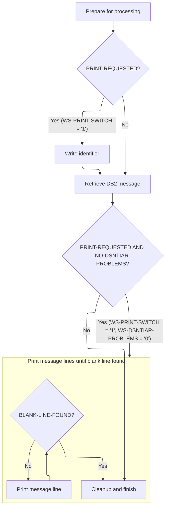

<SwmSnippet path="/base/src/TTTP2002.cbl" line="198">

---

After returning from TTTP2002, we finish up by running all error handling routines, printing messages, and cleaning up before exiting. This makes sure everything is logged and the program exits cleanly.

```cobol
022600 PROCEDURE DIVISION    USING   SQLCA
022700                               DB2-MESSAGE-AREA
022800********************************************* 2003/06/09 - PGLB - COMNT
022900* REPLACED QWIK-REF PARMS WITH DUMMY PARMS
023000*                              QW-LOOKUP-MSG
023100*                              QW-RESULT-MSG.
023200                               DUMMY-PARM1
023300                               DUMMY-PARM2.
023400********************************************* 2003/06/09 - PGLB - COMNT
023500
023600
023700
023800     PERFORM 100-INITIALIZE
023900
024000     PERFORM 150-VALIDATE-OPTION-PARM
024100
024200     IF PRINT-REQUESTED
024300        PERFORM 200-WRITE-IDENTIFIER
024400
024500     PERFORM 300-GET-DB2-MESSAGE
024600
024700     IF PRINT-REQUESTED AND NO-DSNTIAR-PROBLEMS
024800        PERFORM 400-PRINT-MESSAGE
024900           VARYING WS-LINE-NO FROM 1 BY 1
025000           UNTIL BLANK-LINE-FOUND
025100********************************************* 2003/06/09 - PGLB - COMNT
025200*       IF BATCH-MODE AND NO-FILE-PROBLEMS
025300*          PERFORM 700-PRINT-QWIKREF-INFO
025400*       END-IF
025500********************************************* 2003/06/09 - PGLB - END
025600     END-IF
025700
025800     PERFORM 500-CLEANUP
025900
026000     GOBACK
026100     .
026200
026300 100-INITIALIZE.
```

---

</SwmSnippet>

### Department Match Finalization and District Validation

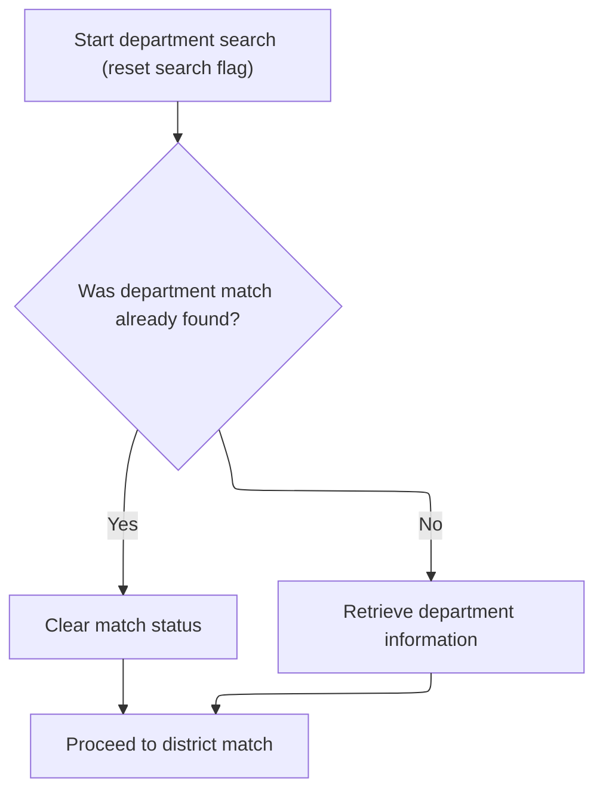

<SwmSnippet path="/base/src/XXXP12DK.cbl" line="343">

---

After GET-DEPT, we reset flags and call DISTRICT-MATCH to validate district data.

```cobol
040500     MOVE SPACE TO SEARCH-FLAG.
040600     IF FOUND-MATCH
040700         MOVE SPACE TO MATCH-FLAG
040800     ELSE
040900         PERFORM GET-DEPT.
041000     PERFORM DISTRICT-MATCH.
```

---

</SwmSnippet>

## District Number Validation and Lookup

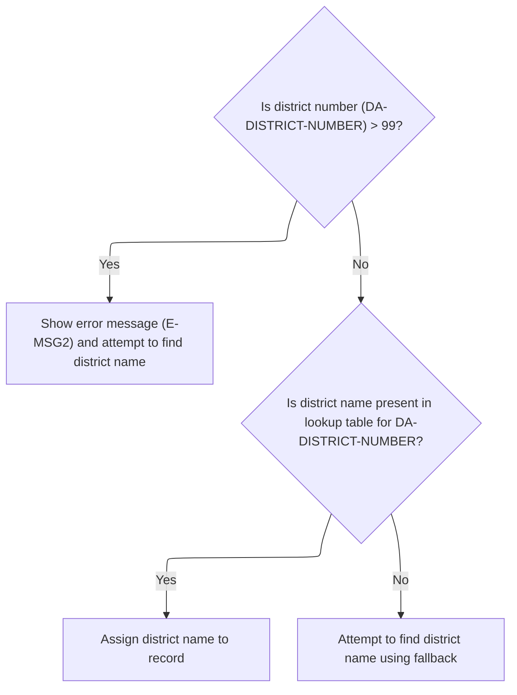

<SwmSnippet path="/base/src/XXXP12DK.cbl" line="398">

---

We validate the district number, log errors for out-of-range values, and call GET-DISTRICT if the name is missing or invalid.

```cobol
047000 DISTRICT-MATCH.
047100     IF DA-DISTRICT-NUMBER GREATER THAN 99
047200         MOVE E-MSG2 TO ERROR-REC
047300         WRITE ERROR-REC
047400         WRITE ERROR-REC FROM SPACED-OUT
047500         PERFORM GET-DISTRICT
047600     ELSE IF DISTRICT-NAME (DA-DISTRICT-NUMBER) NOT = SPACES
047700             MOVE DISTRICT-NAME (DA-DISTRICT-NUMBER)
047800             TO DA-DISTRICT-NAME
047900          ELSE PERFORM GET-DISTRICT.
```

---

</SwmSnippet>

## District Data Retrieval and Table Update

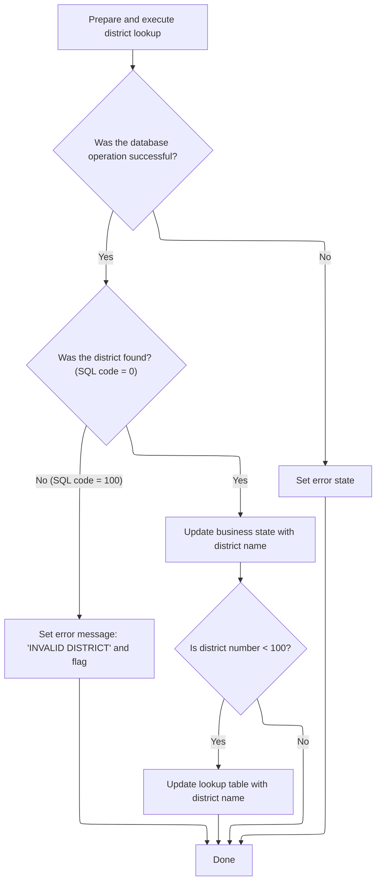

<SwmSnippet path="/base/src/XXXP12DK.cbl" line="409">

---

In `GET-DISTRICT`, we prep the district code and key using the magic number '201', then run a SQL select to fetch the district name. This assumes the district number is valid and doesn't check for out-of-range values here.

```cobol
048100 GET-DISTRICT.
048300     MOVE DA-DISTRICT-NUMBER TO DISTRICT-CODE.
049000     MOVE '201' TO CT-DISTRICT-SEQUENCE
049100     MOVE DISTRICT-KEY TO DISTRICT-I-O-AREA(1:10)
           MOVE DISTRICT-CODE      TO DIST-ID OF DCLXXXT
049200     SET YYYN005A-BATCH-ENV    TO  TRUE

           EXEC SQL
             SELECT  DIST_NM
               INTO :DCLXXXT.DIST-NM
             FROM XXXT
             WHERE DIST_ID = :DCLXXXT.DIST-ID
           END-EXEC
```

---

</SwmSnippet>

<SwmSnippet path="/base/src/XXXP12DK.cbl" line="423">

---

After fetching the district name, we update the DISTRICT-NAME array only if the number is less than 100. If the district isn't found, we flag it as invalid. For other DB2 errors, we call TTTS2001 to handle diagnostics and reporting.

```cobol
050200     MOVE SQLCODE TO DB2-SQL-CODE
050200
050200     EVALUATE TRUE
050300     WHEN SUCCESS
050400       IF DB2-SQL-CODE = 0
               MOVE DIST-NM OF DCLXXXT  TO CT-DISTRICT-NAME             
050500         MOVE CT-DISTRICT-NAME TO DA-DISTRICT-NAME
050600         IF DA-DISTRICT-NUMBER LESS THAN 100
050700             MOVE CT-DISTRICT-NAME TO
050800               DISTRICT-NAME (DA-DISTRICT-NUMBER)
050900         ELSE NEXT SENTENCE
051000         END-IF
051200       ELSE IF DB2-SQL-CODE = 100
051300          MOVE INVALID-DIST-MSG TO DA-DISTRICT-NAME
051400          MOVE 'Y' TO DISTRICT-FLAG
051600       END-IF
051700       END-IF
051800     WHEN OTHER
051900         MOVE 'GET DIST' TO DB2-ERROR-PARAGRAPH
052720         SET DB2121-PRINT-AND-DUMP TO TRUE
052730         CALL 'TTTS2001' USING SQLCA
052740                                 DB2121-MESSAGE-AREA.
```

---

</SwmSnippet>

&nbsp;

*This is an auto-generated document by Swimm 🌊 and has not yet been verified by a human*

<SwmMeta version="3.0.0" repo-id="Z2l0aHViJTNBJTNBU3dpbW1pby1keW5jYWxsLWRlbW8lM0ElM0FHaXJpLVN3aW1t" repo-name="Swimmio-dyncall-demo"><sup>Powered by [Swimm](https://app.swimm.io/)</sup></SwmMeta>
