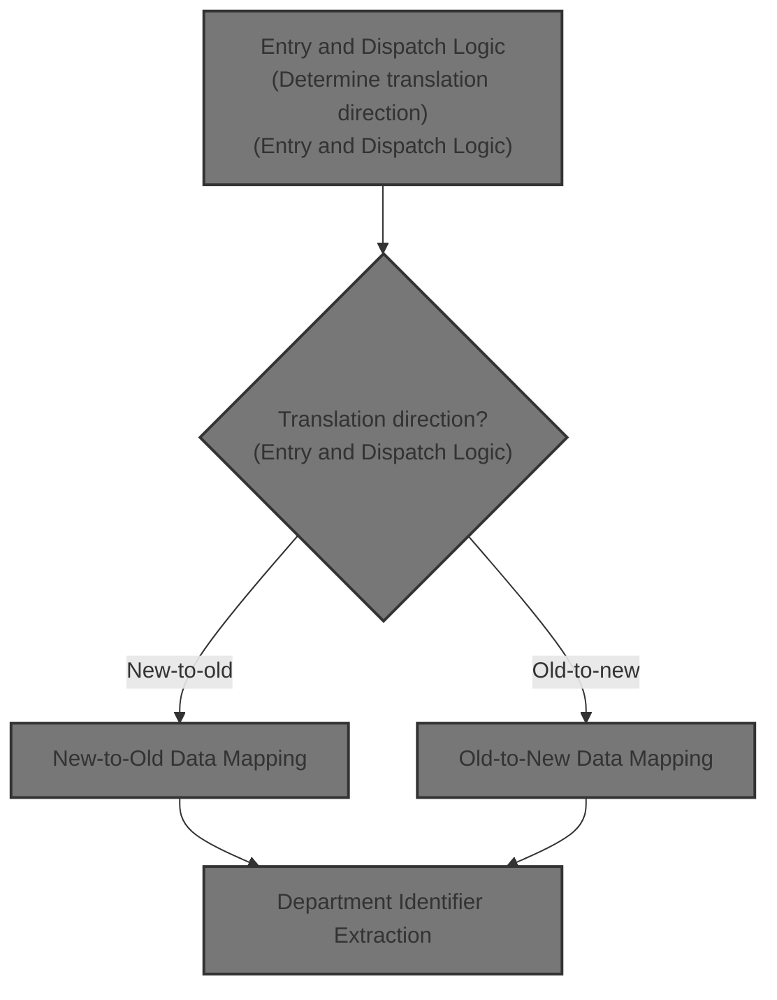
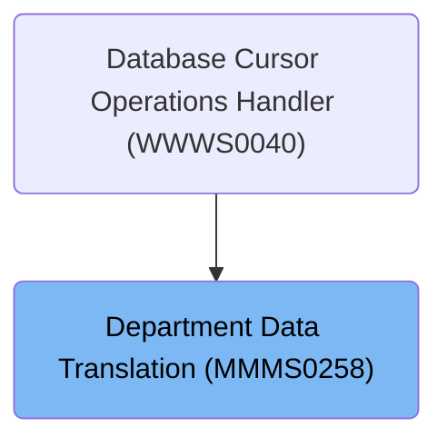

# Overview

This document describes the flow for translating department data between new and old formats. The process determines the translation direction, validates and maps department fields, and ensures compatibility for downstream systems.

## Dependencies

### Program

- MMMS0258 (<SwmPath>[base/src/MMMS0258.cbl](base/src/MMMS0258.cbl)</SwmPath>)

### Copybooks

- MMMC9012 (<SwmPath>[base/src/MMMC9012.cpy](base/src/MMMC9012.cpy)</SwmPath>)
- MMMK001B (<SwmPath>[base/src/MMMK001B.cpy](base/src/MMMK001B.cpy)</SwmPath>)
- YYYN000A (<SwmPath>[base/src/YYYN000A.cpy](base/src/YYYN000A.cpy)</SwmPath>)
- MMMN000A (<SwmPath>[base/src/MMMN000A.cpy](base/src/MMMN000A.cpy)</SwmPath>)
- XXXN001A (<SwmPath>[base/src/XXXN001A.cpy](base/src/XXXN001A.cpy)</SwmPath>)
- YYYN111A (<SwmPath>[base/src/YYYN111A.cpy](base/src/YYYN111A.cpy)</SwmPath>)
- DDDTDP01 (<SwmPath>[base/src/DDDTDP01.cpy](base/src/DDDTDP01.cpy)</SwmPath>)
- DDDLCT20

# Where is this program used?

This program is used once, as represented in the following diagram:

&nbsp;

*This is an auto-generated document by Swimm 🌊 and has not yet been verified by a human*

<SwmMeta version="3.0.0" repo-id="Z2l0aHViJTNBJTNBU3dpbW1pby1keW5jYWxsLWRlbW8lM0ElM0FHaXJpLVN3aW1t" repo-name="Swimmio-dyncall-demo">Powered by [Swimm](https://app.swimm.io/)</SwmMeta>
