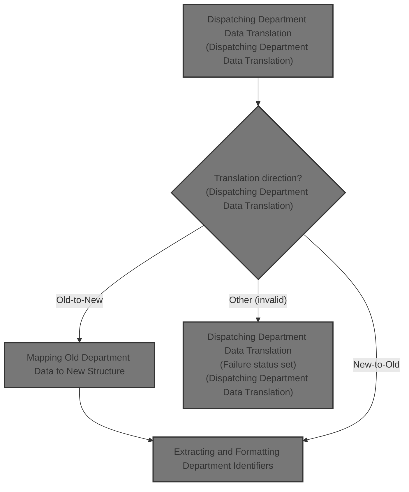
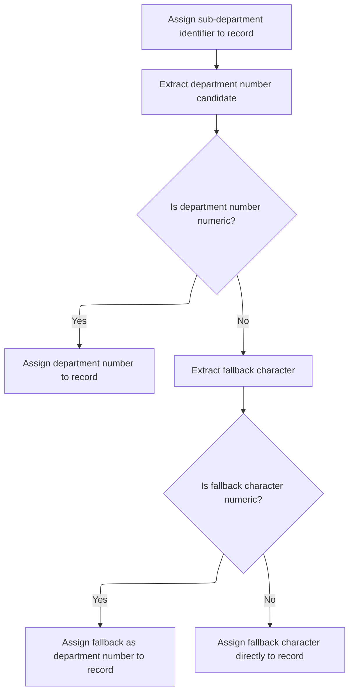

# Overview

This document describes the flow for translating department data between legacy and modern formats. The process receives department data and a translation direction, validates and maps all relevant fields, and ensures identifiers are correctly extracted and formatted for downstream use.



## Dependencies

### Program

- <SwmToken path="base/src/MMMS0258.cbl" pos="73:5:5" line-data="008800         MOVE &#39;MMMS0258 - Invalid translation function.&#39;          00008800">`MMMS0258`</SwmToken> (<SwmPath>[base/src/MMMS0258.cbl](base/src/MMMS0258.cbl)</SwmPath>)

### Copybooks

- <SwmToken path="base/src/MMMS0258.cbl" pos="32:4:4" line-data="004700 COPY MMMC9012.                                                   00004700">`MMMC9012`</SwmToken> (<SwmPath>[base/src/MMMC9012.cpy](base/src/MMMC9012.cpy)</SwmPath>)
- <SwmToken path="base/src/MMMS0258.cbl" pos="33:4:4" line-data="004800 COPY MMMK001B.                                                   00004800">`MMMK001B`</SwmToken> (<SwmPath>[base/src/MMMK001B.cpy](base/src/MMMK001B.cpy)</SwmPath>)
- <SwmToken path="base/src/MMMS0258.cbl" pos="34:4:4" line-data="004900 COPY YYYN000A.                                                   00004900">`YYYN000A`</SwmToken> (<SwmPath>[base/src/YYYN000A.cpy](base/src/YYYN000A.cpy)</SwmPath>)
- <SwmToken path="base/src/MMMS0258.cbl" pos="35:4:4" line-data="005000 COPY MMMN000A.                                                   00005000">`MMMN000A`</SwmToken> (<SwmPath>[base/src/MMMN000A.cpy](base/src/MMMN000A.cpy)</SwmPath>)
- <SwmToken path="base/src/MMMS0258.cbl" pos="45:4:4" line-data="006000 COPY XXXN001A.                                                   00006000">`XXXN001A`</SwmToken> (<SwmPath>[base/src/XXXN001A.cpy](base/src/XXXN001A.cpy)</SwmPath>)
- <SwmToken path="base/src/MMMS0258.cbl" pos="65:4:4" line-data="008000       WHEN YYYN111A-NEW-2-OLD                                    00008000">`YYYN111A`</SwmToken> (<SwmPath>[base/src/YYYN111A.cpy](base/src/YYYN111A.cpy)</SwmPath>)
- <SwmToken path="base/src/MMMS0258.cbl" pos="133:12:12" line-data="014800       TO DEPT-NM                     OF P-DDDTDP01               00014800">`DDDTDP01`</SwmToken> (<SwmPath>[base/src/DDDTDP01.cpy](base/src/DDDTDP01.cpy)</SwmPath>)
- <SwmToken path="base/src/MMMS0258.cbl" pos="48:4:4" line-data="006300 COPY DDDLCT20.                                                   00006300">`DDDLCT20`</SwmToken>

# Where is this program used?

This program is used once, as represented in the following diagram:

```mermaid
graph TD
  su0id("Database Cursor Operations Handler (WWWS0040)") --> 84xom("Department Data Translation (MMMS0258)"):::currentEntity
click su0id openCode "base/src/WWWS0040.cbl:1"
  
  
click 84xom openCode "base/src/MMMS0258.cbl:1"
    classDef currentEntity color:#000000,fill:#7CB9F4

%% Swimm:
%% graph TD
%%   su0id("Database Cursor Operations Handler (WWWS0040)") --> 84xom("Department Data Translation (<SwmToken path="base/src/MMMS0258.cbl" pos="73:5:5" line-data="008800         MOVE &#39;MMMS0258 - Invalid translation function.&#39;          00008800">`MMMS0258`</SwmToken>)"):::currentEntity
%% click su0id openCode "<SwmPath>[base/src/WWWS0040.cbl](base/src/WWWS0040.cbl)</SwmPath>:1"
%%   
%%   
%% click 84xom openCode "<SwmPath>[base/src/MMMS0258.cbl](base/src/MMMS0258.cbl)</SwmPath>:1"
%%     classDef currentEntity color:#000000,fill:#7CB9F4
```



## Detailed View of the Program's Functionality

a. Program Initialization and Entry Point

The program begins by defining its metadata and setting up the environment and data structures. It includes several external copybooks to bring in shared data definitions and structures. The main entry point of the program is a procedure that expects several data structures as input parameters.

At the start of execution, the program performs an initialization routine. This routine resets one of the main data structures used for communication, ensuring that any previous data is cleared and the structure is in a known, clean state before processing begins.

b. Main Translation Dispatch Logic

After initialization, the program evaluates which translation function has been requested. There are three possible paths:

- If the request is to translate from the new format to the old format, the program performs a routine that maps data from the new structure to the old structure.
- If the request is to translate from the old format to the new format, the program performs a different routine that maps data from the old structure to the new structure.
- If the request is neither of these, the program sets a failure status and writes an error message indicating that the translation function is invalid.

After handling the request, the program returns control to the caller.

c. Translating from New Format to Old Format

When translating from the new format to the old format, the program copies each relevant field from the new structure to the corresponding field in the old structure. This includes department sequence, name, abbreviation, group code, and several percentage fields. After copying the main fields, the program performs a subroutine to convert the department number and sub-department identifier from their structured representation into the format expected by the old structure.

d. Department Number and Sub-Department Conversion (New to Old)

In this subroutine, the program takes the department number and sub-department identifier from the new structure and assembles them into a single key for the old structure. It does this by copying the first two characters of the department number and the first character of the sub-department identifier into specific positions in the old structure's department key.

e. Translating from Old Format to New Format

When translating from the old format to the new format, the program first copies the department key from the old structure into a working area. It then copies the department name and abbreviation into the new structure.

For each numeric field (such as group code and various percentage fields), the program checks if the value in the old structure is numeric. If it is, the value is copied into the new structure. If it is not numeric, the program sets the corresponding field in the new structure to zero. This ensures that the new structure does not contain invalid or non-numeric data in fields that are expected to be numeric.

After all fields are copied and validated, the program performs a subroutine to extract and format the department identifiers from the department key.

f. Extracting and Formatting Department Identifiers (Old to New)

In this subroutine, the program extracts specific characters from the department key string to populate the department and sub-department identifiers in the new structure.

- The first character of a specific substring is assigned as the sub-department identifier.
- The first two characters of another substring are extracted as the candidate for the department number.

The program then checks if this candidate department number is numeric:

- If it is numeric, it is assigned directly as the department number in the new structure.
- If it is not numeric, the program attempts to use a fallback character (the second character of the substring). If this fallback character is numeric, it is used as the department number. If not, the fallback character is assigned directly, even if it is not numeric.

This logic ensures that the new structure always has some value for the department number, even if the original data is not in the expected format.

g. Error Handling

If an invalid translation function is requested, the program sets a failure status and writes a specific error message to the output structure. This allows the caller to detect and handle the error appropriately.

h. Program Termination

After completing the requested translation or handling an error, the program returns control to the caller, signaling the end of its processing.

# Rule Definition

| Paragraph Name                                                                                                                                                                                                                                                                                                                                                      | Rule ID | Category          | Description                                                                                                                                                                                                                                                                                                                                                                                                                                                                                                                                                                                                                                                                                                                                                                                                                                                                                                                                                                                                              | Conditions                                                     | Remarks                                                                                                                                                                                                                                                                                                                                                                                                                                                                                                                                                                                        |
| ------------------------------------------------------------------------------------------------------------------------------------------------------------------------------------------------------------------------------------------------------------------------------------------------------------------------------------------------------------------- | ------- | ----------------- | ------------------------------------------------------------------------------------------------------------------------------------------------------------------------------------------------------------------------------------------------------------------------------------------------------------------------------------------------------------------------------------------------------------------------------------------------------------------------------------------------------------------------------------------------------------------------------------------------------------------------------------------------------------------------------------------------------------------------------------------------------------------------------------------------------------------------------------------------------------------------------------------------------------------------------------------------------------------------------------------------------------------------ | -------------------------------------------------------------- | ---------------------------------------------------------------------------------------------------------------------------------------------------------------------------------------------------------------------------------------------------------------------------------------------------------------------------------------------------------------------------------------------------------------------------------------------------------------------------------------------------------------------------------------------------------------------------------------------- |
| <SwmToken path="base/src/MMMS0258.cbl" pos="62:4:6" line-data="007700     PERFORM 100-INITIALIZE                                       00007700">`100-INITIALIZE`</SwmToken>                                                                                                                                                                                        | RL-001  | Data Assignment   | Before any translation begins, all output department structures must be set to a clean state to avoid residual data from previous operations.                                                                                                                                                                                                                                                                                                                                                                                                                                                                                                                                                                                                                                                                                                                                                                                                                                                                            | Always at program start, before translation logic is executed. | Uses the INITIALIZE statement on the output structure. No specific format requirements beyond clearing all fields.                                                                                                                                                                                                                                                                                                                                                                                                                                                                             |
| <SwmToken path="base/src/MMMS0258.cbl" pos="61:2:4" line-data="007600 000-MAIN.                                                        00007600">`000-MAIN`</SwmToken>                                                                                                                                                                                              | RL-002  | Conditional Logic | The translation direction is determined by the value of YYYN111A-FUNCTION. If 'O', perform old-to-new translation; if 'N', perform new-to-old translation; otherwise, set failure status and error message.                                                                                                                                                                                                                                                                                                                                                                                                                                                                                                                                                                                                                                                                                                                                                                                                              | Value of YYYN111A-FUNCTION must be checked.                    | Valid values: 'O' (old-to-new), 'N' (new-to-old). Error message: '<SwmToken path="base/src/MMMS0258.cbl" pos="73:5:5" line-data="008800         MOVE &#39;MMMS0258 - Invalid translation function.&#39;          00008800">`MMMS0258`</SwmToken> - Invalid translation function.'                                                                                                                                                                                                                                                                                                              |
| <SwmToken path="base/src/MMMS0258.cbl" pos="66:4:10" line-data="008100         PERFORM 200-NEW-2-OLD                                    00008100">`200-NEW-2-OLD`</SwmToken>, <SwmToken path="base/src/MMMS0258.cbl" pos="69:4:10" line-data="008400         PERFORM 500-OLD-2-NEW                                    00008400">`500-OLD-2-NEW`</SwmToken>          | RL-003  | Data Assignment   | Department name and abbreviation are copied directly between structures, regardless of translation direction.                                                                                                                                                                                                                                                                                                                                                                                                                                                                                                                                                                                                                                                                                                                                                                                                                                                                                                            | Always applies during translation, both directions.            | Department name: string, abbreviation: string. No transformation required.                                                                                                                                                                                                                                                                                                                                                                                                                                                                                                                     |
| <SwmToken path="base/src/MMMS0258.cbl" pos="69:4:10" line-data="008400         PERFORM 500-OLD-2-NEW                                    00008400">`500-OLD-2-NEW`</SwmToken>                                                                                                                                                                                        | RL-004  | Conditional Logic | For <SwmToken path="base/src/MMMS0258.cbl" pos="137:4:10" line-data="015200     IF OA-REPT-GRP-CD        NOT NUMERIC                         00015200">`OA-REPT-GRP-CD`</SwmToken>, <SwmToken path="base/src/MMMS0258.cbl" pos="145:4:12" line-data="016000     IF OA-GRS-PRFT-LO-PCT    NOT NUMERIC                         00016000">`OA-GRS-PRFT-LO-PCT`</SwmToken>, <SwmToken path="base/src/MMMS0258.cbl" pos="153:4:12" line-data="016800     IF OA-GRS-PRFT-HI-PCT    NOT NUMERIC                         00016800">`OA-GRS-PRFT-HI-PCT`</SwmToken>, <SwmToken path="base/src/MMMS0258.cbl" pos="161:4:10" line-data="017600     IF OA-SHRINK-LO-PCT      NOT NUMERIC                         00017600">`OA-SHRINK-LO-PCT`</SwmToken>, <SwmToken path="base/src/MMMS0258.cbl" pos="169:4:10" line-data="018400     IF OA-SHRINK-HI-PCT      NOT NUMERIC                         00018400">`OA-SHRINK-HI-PCT`</SwmToken>: if the source field is numeric, copy its value; otherwise, set the target field to zero. | Translation direction is old-to-new ('O').                     | Fields are numeric. Zero value is used if source is not numeric.                                                                                                                                                                                                                                                                                                                                                                                                                                                                                                                               |
| <SwmToken path="base/src/MMMS0258.cbl" pos="66:4:10" line-data="008100         PERFORM 200-NEW-2-OLD                                    00008100">`200-NEW-2-OLD`</SwmToken>                                                                                                                                                                                        | RL-005  | Computation       | For <SwmToken path="base/src/MMMS0258.cbl" pos="137:6:10" line-data="015200     IF OA-REPT-GRP-CD        NOT NUMERIC                         00015200">`REPT-GRP-CD`</SwmToken>, <SwmToken path="base/src/MMMS0258.cbl" pos="147:4:8" line-data="016200          TO GRPRFT-LO-PCT            OF P-DDDTDP01               00016200">`GRPRFT-LO-PCT`</SwmToken>, <SwmToken path="base/src/MMMS0258.cbl" pos="155:4:8" line-data="017000          TO GRPRFT-HI-PCT            OF P-DDDTDP01               00017000">`GRPRFT-HI-PCT`</SwmToken>, <SwmToken path="base/src/MMMS0258.cbl" pos="163:4:8" line-data="017800          TO SHRNK-LO-PCT             OF P-DDDTDP01               00017800">`SHRNK-LO-PCT`</SwmToken>, <SwmToken path="base/src/MMMS0258.cbl" pos="171:4:8" line-data="018600          TO SHRNK-HI-PCT             OF P-DDDTDP01               00018600">`SHRNK-HI-PCT`</SwmToken>: convert numeric value to string and assign to corresponding field in the old structure.                           | Translation direction is new-to-old ('N').                     | Fields are converted from numeric to string format.                                                                                                                                                                                                                                                                                                                                                                                                                                                                                                                                            |
| <SwmToken path="base/src/MMMS0258.cbl" pos="69:4:10" line-data="008400         PERFORM 500-OLD-2-NEW                                    00008400">`500-OLD-2-NEW`</SwmToken>, <SwmToken path="base/src/MMMS0258.cbl" pos="177:4:10" line-data="019200     PERFORM 510-POPULATE-STR-DEPT                                00019200">`510-POPULATE-STR-DEPT`</SwmToken> | RL-006  | Computation       | Parse <SwmToken path="base/src/MMMS0258.cbl" pos="130:4:8" line-data="014500     MOVE ST-DEPARTMENT-KEY                                       00014500">`ST-DEPARTMENT-KEY`</SwmToken> to extract <SwmToken path="base/src/MMMS0258.cbl" pos="131:6:10" line-data="014600       TO WS-STR-DEPT-NBR                                         00014600">`STR-DEPT-NBR`</SwmToken> and <SwmToken path="base/src/MMMS0258.cbl" pos="186:4:10" line-data="020100       TO STR-SUB-DEPT-ID OF P-DDDTDP01                           00020100">`STR-SUB-DEPT-ID`</SwmToken>. If <SwmToken path="base/src/MMMS0258.cbl" pos="130:4:8" line-data="014500     MOVE ST-DEPARTMENT-KEY                                       00014500">`ST-DEPARTMENT-KEY`</SwmToken> is numeric, assign numeric portion; otherwise, use fallback logic to assign a usable value.                                                                                                                                                                      | Translation direction is old-to-new ('O').                     | <SwmToken path="base/src/MMMS0258.cbl" pos="131:6:10" line-data="014600       TO WS-STR-DEPT-NBR                                         00014600">`STR-DEPT-NBR`</SwmToken>: numeric if possible, otherwise fallback to character. <SwmToken path="base/src/MMMS0258.cbl" pos="186:4:10" line-data="020100       TO STR-SUB-DEPT-ID OF P-DDDTDP01                           00020100">`STR-SUB-DEPT-ID`</SwmToken>: extracted from key. Fallback logic checks if extracted character is numeric.                                                                                              |
| <SwmToken path="base/src/MMMS0258.cbl" pos="110:4:14" line-data="012500     PERFORM 210-DEPT-CONV-NUM-2-ALPHA                            00012500">`210-DEPT-CONV-NUM-2-ALPHA`</SwmToken>                                                                                                                                                                           | RL-007  | Computation       | Assign <SwmToken path="base/src/MMMS0258.cbl" pos="130:4:8" line-data="014500     MOVE ST-DEPARTMENT-KEY                                       00014500">`ST-DEPARTMENT-KEY`</SwmToken> using <SwmToken path="base/src/MMMS0258.cbl" pos="131:6:10" line-data="014600       TO WS-STR-DEPT-NBR                                         00014600">`STR-DEPT-NBR`</SwmToken> and <SwmToken path="base/src/MMMS0258.cbl" pos="186:4:10" line-data="020100       TO STR-SUB-DEPT-ID OF P-DDDTDP01                           00020100">`STR-SUB-DEPT-ID`</SwmToken> from the new structure.                                                                                                                                                                                                                                                                                                                                                                                                                                   | Translation direction is new-to-old ('N').                     | <SwmToken path="base/src/MMMS0258.cbl" pos="130:4:8" line-data="014500     MOVE ST-DEPARTMENT-KEY                                       00014500">`ST-DEPARTMENT-KEY`</SwmToken>: 3-character string, first two from <SwmToken path="base/src/MMMS0258.cbl" pos="131:6:10" line-data="014600       TO WS-STR-DEPT-NBR                                         00014600">`STR-DEPT-NBR`</SwmToken>, third from <SwmToken path="base/src/MMMS0258.cbl" pos="186:4:10" line-data="020100       TO STR-SUB-DEPT-ID OF P-DDDTDP01                           00020100">`STR-SUB-DEPT-ID`</SwmToken>. |
| <SwmToken path="base/src/MMMS0258.cbl" pos="61:2:4" line-data="007600 000-MAIN.                                                        00007600">`000-MAIN`</SwmToken>                                                                                                                                                                                              | RL-008  | Conditional Logic | If the translation direction is not 'O' or 'N', set a failure status and return error message.                                                                                                                                                                                                                                                                                                                                                                                                                                                                                                                                                                                                                                                                                                                                                                                                                                                                                                                           | Translation direction is not 'O' or 'N'.                       | Error message: '<SwmToken path="base/src/MMMS0258.cbl" pos="73:5:5" line-data="008800         MOVE &#39;MMMS0258 - Invalid translation function.&#39;          00008800">`MMMS0258`</SwmToken> - Invalid translation function.'                                                                                                                                                                                                                                                                                                                                                                |
| <SwmToken path="base/src/MMMS0258.cbl" pos="61:2:4" line-data="007600 000-MAIN.                                                        00007600">`000-MAIN`</SwmToken>                                                                                                                                                                                              | RL-009  | Data Assignment   | After translation, always return control to the caller, with the output structure populated according to the translation direction.                                                                                                                                                                                                                                                                                                                                                                                                                                                                                                                                                                                                                                                                                                                                                                                                                                                                                      | Always after translation logic completes.                      | Output structure is either new or old department structure, populated as per translation rules.                                                                                                                                                                                                                                                                                                                                                                                                                                                                                                |

# User Stories

## User Story 1: Initialize and determine translation direction

---

### Story Description:

As a system, I want to initialize all output department structures and determine the translation direction so that translation begins with a clean state and the correct logic is executed.

---

### Business Rule Mapping:

| Rule ID | Paragraph Name                                                                                                                                                               | Rule Description                                                                                                                                                                                            |
| ------- | ---------------------------------------------------------------------------------------------------------------------------------------------------------------------------- | ----------------------------------------------------------------------------------------------------------------------------------------------------------------------------------------------------------- |
| RL-002  | <SwmToken path="base/src/MMMS0258.cbl" pos="61:2:4" line-data="007600 000-MAIN.                                                        00007600">`000-MAIN`</SwmToken>       | The translation direction is determined by the value of YYYN111A-FUNCTION. If 'O', perform old-to-new translation; if 'N', perform new-to-old translation; otherwise, set failure status and error message. |
| RL-001  | <SwmToken path="base/src/MMMS0258.cbl" pos="62:4:6" line-data="007700     PERFORM 100-INITIALIZE                                       00007700">`100-INITIALIZE`</SwmToken> | Before any translation begins, all output department structures must be set to a clean state to avoid residual data from previous operations.                                                               |

---

### Relevant Functionality:

- <SwmToken path="base/src/MMMS0258.cbl" pos="61:2:4" line-data="007600 000-MAIN.                                                        00007600">`000-MAIN`</SwmToken>
  1. **RL-002:**
     - Evaluate YYYN111A-FUNCTION:
       - If value is 'N', perform new-to-old translation
       - If value is 'O', perform old-to-new translation
       - Otherwise, set failure status and error message
- <SwmToken path="base/src/MMMS0258.cbl" pos="62:4:6" line-data="007700     PERFORM 100-INITIALIZE                                       00007700">`100-INITIALIZE`</SwmToken>
  1. **RL-001:**
     - At program start, perform initialization routine
       - Set all fields in the output department structure to their default (empty/zero) values

## User Story 2: Translate department data from old to new structure

---

### Story Description:

As a user, I want department data to be translated from the old structure to the new structure so that the new structure is populated accurately according to business rules.

---

### Business Rule Mapping:

| Rule ID | Paragraph Name                                                                                                                                                                                                                                                                                                                                                      | Rule Description                                                                                                                                                                                                                                                                                                                                                                                                                                                                                                                                                                                                                                                                                                                                                                                                                                                                                                                                                                                                         |
| ------- | ------------------------------------------------------------------------------------------------------------------------------------------------------------------------------------------------------------------------------------------------------------------------------------------------------------------------------------------------------------------- | ------------------------------------------------------------------------------------------------------------------------------------------------------------------------------------------------------------------------------------------------------------------------------------------------------------------------------------------------------------------------------------------------------------------------------------------------------------------------------------------------------------------------------------------------------------------------------------------------------------------------------------------------------------------------------------------------------------------------------------------------------------------------------------------------------------------------------------------------------------------------------------------------------------------------------------------------------------------------------------------------------------------------ |
| RL-009  | <SwmToken path="base/src/MMMS0258.cbl" pos="61:2:4" line-data="007600 000-MAIN.                                                        00007600">`000-MAIN`</SwmToken>                                                                                                                                                                                              | After translation, always return control to the caller, with the output structure populated according to the translation direction.                                                                                                                                                                                                                                                                                                                                                                                                                                                                                                                                                                                                                                                                                                                                                                                                                                                                                      |
| RL-004  | <SwmToken path="base/src/MMMS0258.cbl" pos="69:4:10" line-data="008400         PERFORM 500-OLD-2-NEW                                    00008400">`500-OLD-2-NEW`</SwmToken>                                                                                                                                                                                        | For <SwmToken path="base/src/MMMS0258.cbl" pos="137:4:10" line-data="015200     IF OA-REPT-GRP-CD        NOT NUMERIC                         00015200">`OA-REPT-GRP-CD`</SwmToken>, <SwmToken path="base/src/MMMS0258.cbl" pos="145:4:12" line-data="016000     IF OA-GRS-PRFT-LO-PCT    NOT NUMERIC                         00016000">`OA-GRS-PRFT-LO-PCT`</SwmToken>, <SwmToken path="base/src/MMMS0258.cbl" pos="153:4:12" line-data="016800     IF OA-GRS-PRFT-HI-PCT    NOT NUMERIC                         00016800">`OA-GRS-PRFT-HI-PCT`</SwmToken>, <SwmToken path="base/src/MMMS0258.cbl" pos="161:4:10" line-data="017600     IF OA-SHRINK-LO-PCT      NOT NUMERIC                         00017600">`OA-SHRINK-LO-PCT`</SwmToken>, <SwmToken path="base/src/MMMS0258.cbl" pos="169:4:10" line-data="018400     IF OA-SHRINK-HI-PCT      NOT NUMERIC                         00018400">`OA-SHRINK-HI-PCT`</SwmToken>: if the source field is numeric, copy its value; otherwise, set the target field to zero. |
| RL-006  | <SwmToken path="base/src/MMMS0258.cbl" pos="69:4:10" line-data="008400         PERFORM 500-OLD-2-NEW                                    00008400">`500-OLD-2-NEW`</SwmToken>, <SwmToken path="base/src/MMMS0258.cbl" pos="177:4:10" line-data="019200     PERFORM 510-POPULATE-STR-DEPT                                00019200">`510-POPULATE-STR-DEPT`</SwmToken> | Parse <SwmToken path="base/src/MMMS0258.cbl" pos="130:4:8" line-data="014500     MOVE ST-DEPARTMENT-KEY                                       00014500">`ST-DEPARTMENT-KEY`</SwmToken> to extract <SwmToken path="base/src/MMMS0258.cbl" pos="131:6:10" line-data="014600       TO WS-STR-DEPT-NBR                                         00014600">`STR-DEPT-NBR`</SwmToken> and <SwmToken path="base/src/MMMS0258.cbl" pos="186:4:10" line-data="020100       TO STR-SUB-DEPT-ID OF P-DDDTDP01                           00020100">`STR-SUB-DEPT-ID`</SwmToken>. If <SwmToken path="base/src/MMMS0258.cbl" pos="130:4:8" line-data="014500     MOVE ST-DEPARTMENT-KEY                                       00014500">`ST-DEPARTMENT-KEY`</SwmToken> is numeric, assign numeric portion; otherwise, use fallback logic to assign a usable value.                                                                                                                                                                      |
| RL-003  | <SwmToken path="base/src/MMMS0258.cbl" pos="66:4:10" line-data="008100         PERFORM 200-NEW-2-OLD                                    00008100">`200-NEW-2-OLD`</SwmToken>, <SwmToken path="base/src/MMMS0258.cbl" pos="69:4:10" line-data="008400         PERFORM 500-OLD-2-NEW                                    00008400">`500-OLD-2-NEW`</SwmToken>          | Department name and abbreviation are copied directly between structures, regardless of translation direction.                                                                                                                                                                                                                                                                                                                                                                                                                                                                                                                                                                                                                                                                                                                                                                                                                                                                                                            |

---

### Relevant Functionality:

- <SwmToken path="base/src/MMMS0258.cbl" pos="61:2:4" line-data="007600 000-MAIN.                                                        00007600">`000-MAIN`</SwmToken>
  1. **RL-009:**
     - After translation logic:
       - Return control to caller
       - Output structure contains translated data
- <SwmToken path="base/src/MMMS0258.cbl" pos="69:4:10" line-data="008400         PERFORM 500-OLD-2-NEW                                    00008400">`500-OLD-2-NEW`</SwmToken>
  1. **RL-004:**
     - For each relevant field:
       - If source field is numeric, copy value to target
       - Else, set target field to zero
  2. **RL-006:**
     - Move <SwmToken path="base/src/MMMS0258.cbl" pos="130:4:8" line-data="014500     MOVE ST-DEPARTMENT-KEY                                       00014500">`ST-DEPARTMENT-KEY`</SwmToken> to working storage
     - Extract first two characters for <SwmToken path="base/src/MMMS0258.cbl" pos="131:6:10" line-data="014600       TO WS-STR-DEPT-NBR                                         00014600">`STR-DEPT-NBR`</SwmToken>
     - Extract third character for <SwmToken path="base/src/MMMS0258.cbl" pos="186:4:10" line-data="020100       TO STR-SUB-DEPT-ID OF P-DDDTDP01                           00020100">`STR-SUB-DEPT-ID`</SwmToken>
     - If <SwmToken path="base/src/MMMS0258.cbl" pos="131:6:10" line-data="014600       TO WS-STR-DEPT-NBR                                         00014600">`STR-DEPT-NBR`</SwmToken> is numeric, assign as department number
     - Else, fallback: extract character, check if numeric, assign accordingly
- <SwmToken path="base/src/MMMS0258.cbl" pos="66:4:10" line-data="008100         PERFORM 200-NEW-2-OLD                                    00008100">`200-NEW-2-OLD`</SwmToken>
  1. **RL-003:**
     - For both translation directions:
       - Copy department name from source to target
       - Copy department abbreviation from source to target

## User Story 3: Translate department data from new to old structure

---

### Story Description:

As a user, I want department data to be translated from the new structure to the old structure so that the old structure is populated accurately according to business rules.

---

### Business Rule Mapping:

| Rule ID | Paragraph Name                                                                                                                                                                                                                                                                                                                                             | Rule Description                                                                                                                                                                                                                                                                                                                                                                                                                                                                                                                                                                                                                                                                                                                                                                                                                                                                                                                                                                               |
| ------- | ---------------------------------------------------------------------------------------------------------------------------------------------------------------------------------------------------------------------------------------------------------------------------------------------------------------------------------------------------------- | ---------------------------------------------------------------------------------------------------------------------------------------------------------------------------------------------------------------------------------------------------------------------------------------------------------------------------------------------------------------------------------------------------------------------------------------------------------------------------------------------------------------------------------------------------------------------------------------------------------------------------------------------------------------------------------------------------------------------------------------------------------------------------------------------------------------------------------------------------------------------------------------------------------------------------------------------------------------------------------------------- |
| RL-009  | <SwmToken path="base/src/MMMS0258.cbl" pos="61:2:4" line-data="007600 000-MAIN.                                                        00007600">`000-MAIN`</SwmToken>                                                                                                                                                                                     | After translation, always return control to the caller, with the output structure populated according to the translation direction.                                                                                                                                                                                                                                                                                                                                                                                                                                                                                                                                                                                                                                                                                                                                                                                                                                                            |
| RL-003  | <SwmToken path="base/src/MMMS0258.cbl" pos="66:4:10" line-data="008100         PERFORM 200-NEW-2-OLD                                    00008100">`200-NEW-2-OLD`</SwmToken>, <SwmToken path="base/src/MMMS0258.cbl" pos="69:4:10" line-data="008400         PERFORM 500-OLD-2-NEW                                    00008400">`500-OLD-2-NEW`</SwmToken> | Department name and abbreviation are copied directly between structures, regardless of translation direction.                                                                                                                                                                                                                                                                                                                                                                                                                                                                                                                                                                                                                                                                                                                                                                                                                                                                                  |
| RL-005  | <SwmToken path="base/src/MMMS0258.cbl" pos="66:4:10" line-data="008100         PERFORM 200-NEW-2-OLD                                    00008100">`200-NEW-2-OLD`</SwmToken>                                                                                                                                                                               | For <SwmToken path="base/src/MMMS0258.cbl" pos="137:6:10" line-data="015200     IF OA-REPT-GRP-CD        NOT NUMERIC                         00015200">`REPT-GRP-CD`</SwmToken>, <SwmToken path="base/src/MMMS0258.cbl" pos="147:4:8" line-data="016200          TO GRPRFT-LO-PCT            OF P-DDDTDP01               00016200">`GRPRFT-LO-PCT`</SwmToken>, <SwmToken path="base/src/MMMS0258.cbl" pos="155:4:8" line-data="017000          TO GRPRFT-HI-PCT            OF P-DDDTDP01               00017000">`GRPRFT-HI-PCT`</SwmToken>, <SwmToken path="base/src/MMMS0258.cbl" pos="163:4:8" line-data="017800          TO SHRNK-LO-PCT             OF P-DDDTDP01               00017800">`SHRNK-LO-PCT`</SwmToken>, <SwmToken path="base/src/MMMS0258.cbl" pos="171:4:8" line-data="018600          TO SHRNK-HI-PCT             OF P-DDDTDP01               00018600">`SHRNK-HI-PCT`</SwmToken>: convert numeric value to string and assign to corresponding field in the old structure. |
| RL-007  | <SwmToken path="base/src/MMMS0258.cbl" pos="110:4:14" line-data="012500     PERFORM 210-DEPT-CONV-NUM-2-ALPHA                            00012500">`210-DEPT-CONV-NUM-2-ALPHA`</SwmToken>                                                                                                                                                                  | Assign <SwmToken path="base/src/MMMS0258.cbl" pos="130:4:8" line-data="014500     MOVE ST-DEPARTMENT-KEY                                       00014500">`ST-DEPARTMENT-KEY`</SwmToken> using <SwmToken path="base/src/MMMS0258.cbl" pos="131:6:10" line-data="014600       TO WS-STR-DEPT-NBR                                         00014600">`STR-DEPT-NBR`</SwmToken> and <SwmToken path="base/src/MMMS0258.cbl" pos="186:4:10" line-data="020100       TO STR-SUB-DEPT-ID OF P-DDDTDP01                           00020100">`STR-SUB-DEPT-ID`</SwmToken> from the new structure.                                                                                                                                                                                                                                                                                                                                                                                                         |

---

### Relevant Functionality:

- <SwmToken path="base/src/MMMS0258.cbl" pos="61:2:4" line-data="007600 000-MAIN.                                                        00007600">`000-MAIN`</SwmToken>
  1. **RL-009:**
     - After translation logic:
       - Return control to caller
       - Output structure contains translated data
- <SwmToken path="base/src/MMMS0258.cbl" pos="66:4:10" line-data="008100         PERFORM 200-NEW-2-OLD                                    00008100">`200-NEW-2-OLD`</SwmToken>
  1. **RL-003:**
     - For both translation directions:
       - Copy department name from source to target
       - Copy department abbreviation from source to target
  2. **RL-005:**
     - For each relevant field:
       - Convert numeric value to string
       - Assign string value to target field
- <SwmToken path="base/src/MMMS0258.cbl" pos="110:4:14" line-data="012500     PERFORM 210-DEPT-CONV-NUM-2-ALPHA                            00012500">`210-DEPT-CONV-NUM-2-ALPHA`</SwmToken>
  1. **RL-007:**
     - Assign first two characters of <SwmToken path="base/src/MMMS0258.cbl" pos="131:6:10" line-data="014600       TO WS-STR-DEPT-NBR                                         00014600">`STR-DEPT-NBR`</SwmToken> to <SwmToken path="base/src/MMMS0258.cbl" pos="130:4:8" line-data="014500     MOVE ST-DEPARTMENT-KEY                                       00014500">`ST-DEPARTMENT-KEY`</SwmToken>
     - Assign <SwmToken path="base/src/MMMS0258.cbl" pos="186:4:10" line-data="020100       TO STR-SUB-DEPT-ID OF P-DDDTDP01                           00020100">`STR-SUB-DEPT-ID`</SwmToken> as third character of <SwmToken path="base/src/MMMS0258.cbl" pos="130:4:8" line-data="014500     MOVE ST-DEPARTMENT-KEY                                       00014500">`ST-DEPARTMENT-KEY`</SwmToken>

## User Story 4: Handle invalid translation direction

---

### Story Description:

As a system, I want to set a failure status and return an error message when the translation direction is invalid so that the caller is informed of the issue.

---

### Business Rule Mapping:

| Rule ID | Paragraph Name                                                                                                                                                         | Rule Description                                                                                                                    |
| ------- | ---------------------------------------------------------------------------------------------------------------------------------------------------------------------- | ----------------------------------------------------------------------------------------------------------------------------------- |
| RL-008  | <SwmToken path="base/src/MMMS0258.cbl" pos="61:2:4" line-data="007600 000-MAIN.                                                        00007600">`000-MAIN`</SwmToken> | If the translation direction is not 'O' or 'N', set a failure status and return error message.                                      |
| RL-009  | <SwmToken path="base/src/MMMS0258.cbl" pos="61:2:4" line-data="007600 000-MAIN.                                                        00007600">`000-MAIN`</SwmToken> | After translation, always return control to the caller, with the output structure populated according to the translation direction. |

---

### Relevant Functionality:

- <SwmToken path="base/src/MMMS0258.cbl" pos="61:2:4" line-data="007600 000-MAIN.                                                        00007600">`000-MAIN`</SwmToken>
  1. **RL-008:**
     - If translation direction is invalid:
       - Set failure status to true
       - Set error message to '<SwmToken path="base/src/MMMS0258.cbl" pos="73:5:5" line-data="008800         MOVE &#39;MMMS0258 - Invalid translation function.&#39;          00008800">`MMMS0258`</SwmToken> - Invalid translation function.'
  2. **RL-009:**
     - After translation logic:
       - Return control to caller
       - Output structure contains translated data

# Workflow

# Dispatching Department Data Translation

```mermaid
%%{init: {"flowchart": {"defaultRenderer": "elk"}} }%%
flowchart TD
    node1["Begin translation request"] --> node2{"Requested translation direction?"}
    click node1 openCode "base/src/MMMS0258.cbl:77:79"
    node2 -->|"New-to-Old"| node3["Translate from new format to old format"]
    click node2 openCode "base/src/MMMS0258.cbl:79:81"
    node2 -->|"Old-to-New"| node4["Translate from old format to new format"]
    click node2 openCode "base/src/MMMS0258.cbl:83:84"
    node2 -->|"Other"| node5["Set failure status to TRUE and error message: 'MMMS0258 - Invalid translation function.'"]
    click node2 openCode "base/src/MMMS0258.cbl:86:89"
    node3 --> node6["Return to caller"]
    click node3 openCode "base/src/MMMS0258.cbl:81:92"
    node4 --> node6
    click node4 openCode "base/src/MMMS0258.cbl:84:92"
    node5 --> node6
    click node5 openCode "base/src/MMMS0258.cbl:87:92"
    click node6 openCode "base/src/MMMS0258.cbl:92:92"
classDef HeadingStyle fill:#777777,stroke:#333,stroke-width:2px;

%% Swimm:
%% %%{init: {"flowchart": {"defaultRenderer": "elk"}} }%%
%% flowchart TD
%%     node1["Begin translation request"] --> node2{"Requested translation direction?"}
%%     click node1 openCode "<SwmPath>[base/src/MMMS0258.cbl](base/src/MMMS0258.cbl)</SwmPath>:77:79"
%%     node2 -->|"New-to-Old"| node3["Translate from new format to old format"]
%%     click node2 openCode "<SwmPath>[base/src/MMMS0258.cbl](base/src/MMMS0258.cbl)</SwmPath>:79:81"
%%     node2 -->|"Old-to-New"| node4["Translate from old format to new format"]
%%     click node2 openCode "<SwmPath>[base/src/MMMS0258.cbl](base/src/MMMS0258.cbl)</SwmPath>:83:84"
%%     node2 -->|"Other"| node5["Set failure status to TRUE and error message: '<SwmToken path="base/src/MMMS0258.cbl" pos="73:5:5" line-data="008800         MOVE &#39;MMMS0258 - Invalid translation function.&#39;          00008800">`MMMS0258`</SwmToken> - Invalid translation function.'"]
%%     click node2 openCode "<SwmPath>[base/src/MMMS0258.cbl](base/src/MMMS0258.cbl)</SwmPath>:86:89"
%%     node3 --> node6["Return to caller"]
%%     click node3 openCode "<SwmPath>[base/src/MMMS0258.cbl](base/src/MMMS0258.cbl)</SwmPath>:81:92"
%%     node4 --> node6
%%     click node4 openCode "<SwmPath>[base/src/MMMS0258.cbl](base/src/MMMS0258.cbl)</SwmPath>:84:92"
%%     node5 --> node6
%%     click node5 openCode "<SwmPath>[base/src/MMMS0258.cbl](base/src/MMMS0258.cbl)</SwmPath>:87:92"
%%     click node6 openCode "<SwmPath>[base/src/MMMS0258.cbl](base/src/MMMS0258.cbl)</SwmPath>:92:92"
%% classDef HeadingStyle fill:#777777,stroke:#333,stroke-width:2px;
```



This section determines the requested translation direction for department data (new-to-old or old-to-new), performs the appropriate translation, or returns an error if the request is invalid. It ensures the main data structure is reset before processing and communicates the result back to the caller.

| Category       | Rule Name              | Description                                                                                                                        |
| -------------- | ---------------------- | ---------------------------------------------------------------------------------------------------------------------------------- |
| Business logic | New-to-Old Translation | If the translation direction is 'N' (new-to-old), the system must translate department data from the new format to the old format. |
| Business logic | Old-to-New Translation | If the translation direction is 'O' (old-to-new), the system must translate department data from the old format to the new format. |

<SwmSnippet path="/base/src/MMMS0258.cbl" line="61">

---

In <SwmToken path="base/src/MMMS0258.cbl" pos="61:2:4" line-data="007600 000-MAIN.                                                        00007600">`000-MAIN`</SwmToken>, we kick off the flow by calling <SwmToken path="base/src/MMMS0258.cbl" pos="62:4:6" line-data="007700     PERFORM 100-INITIALIZE                                       00007700">`100-INITIALIZE`</SwmToken> to reset the main data structure. This sets up a clean state before we branch into the translation logic based on the requested function type.

```cobol
007600 000-MAIN.                                                        00007600
007700     PERFORM 100-INITIALIZE                                       00007700
```

---

</SwmSnippet>

<SwmSnippet path="/base/src/MMMS0258.cbl" line="64">

---

After initialization, we use EVALUATE to branch based on YYYN111A-FUNCTION. If it's 'O', we call <SwmToken path="base/src/MMMS0258.cbl" pos="69:4:10" line-data="008400         PERFORM 500-OLD-2-NEW                                    00008400">`500-OLD-2-NEW`</SwmToken> to map old-format department data into the new structure. If it's 'N', we call <SwmToken path="base/src/MMMS0258.cbl" pos="66:4:10" line-data="008100         PERFORM 200-NEW-2-OLD                                    00008100">`200-NEW-2-OLD`</SwmToken>. If neither, we flag an error and exit. The function ends with GOBACK, returning control to the caller.

```cobol
007900     EVALUATE TRUE                                                00007900
008000       WHEN YYYN111A-NEW-2-OLD                                    00008000
008100         PERFORM 200-NEW-2-OLD                                    00008100
008200                                                                  00008200
008300       WHEN YYYN111A-OLD-2-NEW                                    00008300
008400         PERFORM 500-OLD-2-NEW                                    00008400
008500                                                                  00008500
008600       WHEN OTHER                                                 00008600
008700         SET FAILURE TO TRUE                                      00008700
008800         MOVE 'MMMS0258 - Invalid translation function.'          00008800
008900           TO IS-RTRN-MSG-TXT                                     00008900
009000     END-EVALUATE                                                 00009000
009100                                                                  00009100
009200     GOBACK                                                       00009200
009300     .                                                            00009300
```

---

</SwmSnippet>

# Mapping Old Department Data to New Structure

```mermaid
%%{init: {"flowchart": {"defaultRenderer": "elk"}} }%%
flowchart TD
    node1["Copy department key, name, and abbreviation to new structure"]
    click node1 openCode "base/src/MMMS0258.cbl:129:135"
    node1 --> node2{"Is group code numeric?"}
    click node2 openCode "base/src/MMMS0258.cbl:137:143"
    node2 -->|"Yes"| node3["Set group code (value)"]
    node2 -->|"No"| node4["Set group code to zero"]
    click node3 openCode "base/src/MMMS0258.cbl:141:142"
    click node4 openCode "base/src/MMMS0258.cbl:138:139"
    node3 --> node5{"Is low gross profit % numeric?"}
    node4 --> node5
    click node5 openCode "base/src/MMMS0258.cbl:145:151"
    node5 -->|"Yes"| node6["Set low gross profit % (value)"]
    node5 -->|"No"| node7["Set low gross profit % to zero"]
    click node6 openCode "base/src/MMMS0258.cbl:149:150"
    click node7 openCode "base/src/MMMS0258.cbl:146:147"
    node6 --> node8{"Is high gross profit % numeric?"}
    node7 --> node8
    click node8 openCode "base/src/MMMS0258.cbl:153:159"
    node8 -->|"Yes"| node9["Set high gross profit % (value)"]
    node8 -->|"No"| node10["Set high gross profit % to zero"]
    click node9 openCode "base/src/MMMS0258.cbl:157:158"
    click node10 openCode "base/src/MMMS0258.cbl:154:155"
    node9 --> node11{"Is low shrink % numeric?"}
    node10 --> node11
    click node11 openCode "base/src/MMMS0258.cbl:161:167"
    node11 -->|"Yes"| node12["Set low shrink % (value)"]
    node11 -->|"No"| node13["Set low shrink % to zero"]
    click node12 openCode "base/src/MMMS0258.cbl:165:166"
    click node13 openCode "base/src/MMMS0258.cbl:162:163"
    node12 --> node14{"Is high shrink % numeric?"}
    node13 --> node14
    click node14 openCode "base/src/MMMS0258.cbl:169:175"
    node14 -->|"Yes"| node15["Set high shrink % (value)"]
    node14 -->|"No"| node16["Set high shrink % to zero"]
    click node15 openCode "base/src/MMMS0258.cbl:173:174"
    click node16 openCode "base/src/MMMS0258.cbl:170:171"
    node15 --> node17["Populate additional department structure fields"]
    node16 --> node17
    click node17 openCode "base/src/MMMS0258.cbl:177:177"

classDef HeadingStyle fill:#777777,stroke:#333,stroke-width:2px;

%% Swimm:
%% %%{init: {"flowchart": {"defaultRenderer": "elk"}} }%%
%% flowchart TD
%%     node1["Copy department key, name, and abbreviation to new structure"]
%%     click node1 openCode "<SwmPath>[base/src/MMMS0258.cbl](base/src/MMMS0258.cbl)</SwmPath>:129:135"
%%     node1 --> node2{"Is group code numeric?"}
%%     click node2 openCode "<SwmPath>[base/src/MMMS0258.cbl](base/src/MMMS0258.cbl)</SwmPath>:137:143"
%%     node2 -->|"Yes"| node3["Set group code (value)"]
%%     node2 -->|"No"| node4["Set group code to zero"]
%%     click node3 openCode "<SwmPath>[base/src/MMMS0258.cbl](base/src/MMMS0258.cbl)</SwmPath>:141:142"
%%     click node4 openCode "<SwmPath>[base/src/MMMS0258.cbl](base/src/MMMS0258.cbl)</SwmPath>:138:139"
%%     node3 --> node5{"Is low gross profit % numeric?"}
%%     node4 --> node5
%%     click node5 openCode "<SwmPath>[base/src/MMMS0258.cbl](base/src/MMMS0258.cbl)</SwmPath>:145:151"
%%     node5 -->|"Yes"| node6["Set low gross profit % (value)"]
%%     node5 -->|"No"| node7["Set low gross profit % to zero"]
%%     click node6 openCode "<SwmPath>[base/src/MMMS0258.cbl](base/src/MMMS0258.cbl)</SwmPath>:149:150"
%%     click node7 openCode "<SwmPath>[base/src/MMMS0258.cbl](base/src/MMMS0258.cbl)</SwmPath>:146:147"
%%     node6 --> node8{"Is high gross profit % numeric?"}
%%     node7 --> node8
%%     click node8 openCode "<SwmPath>[base/src/MMMS0258.cbl](base/src/MMMS0258.cbl)</SwmPath>:153:159"
%%     node8 -->|"Yes"| node9["Set high gross profit % (value)"]
%%     node8 -->|"No"| node10["Set high gross profit % to zero"]
%%     click node9 openCode "<SwmPath>[base/src/MMMS0258.cbl](base/src/MMMS0258.cbl)</SwmPath>:157:158"
%%     click node10 openCode "<SwmPath>[base/src/MMMS0258.cbl](base/src/MMMS0258.cbl)</SwmPath>:154:155"
%%     node9 --> node11{"Is low shrink % numeric?"}
%%     node10 --> node11
%%     click node11 openCode "<SwmPath>[base/src/MMMS0258.cbl](base/src/MMMS0258.cbl)</SwmPath>:161:167"
%%     node11 -->|"Yes"| node12["Set low shrink % (value)"]
%%     node11 -->|"No"| node13["Set low shrink % to zero"]
%%     click node12 openCode "<SwmPath>[base/src/MMMS0258.cbl](base/src/MMMS0258.cbl)</SwmPath>:165:166"
%%     click node13 openCode "<SwmPath>[base/src/MMMS0258.cbl](base/src/MMMS0258.cbl)</SwmPath>:162:163"
%%     node12 --> node14{"Is high shrink % numeric?"}
%%     node13 --> node14
%%     click node14 openCode "<SwmPath>[base/src/MMMS0258.cbl](base/src/MMMS0258.cbl)</SwmPath>:169:175"
%%     node14 -->|"Yes"| node15["Set high shrink % (value)"]
%%     node14 -->|"No"| node16["Set high shrink % to zero"]
%%     click node15 openCode "<SwmPath>[base/src/MMMS0258.cbl](base/src/MMMS0258.cbl)</SwmPath>:173:174"
%%     click node16 openCode "<SwmPath>[base/src/MMMS0258.cbl](base/src/MMMS0258.cbl)</SwmPath>:170:171"
%%     node15 --> node17["Populate additional department structure fields"]
%%     node16 --> node17
%%     click node17 openCode "<SwmPath>[base/src/MMMS0258.cbl](base/src/MMMS0258.cbl)</SwmPath>:177:177"
%% 
%% classDef HeadingStyle fill:#777777,stroke:#333,stroke-width:2px;
```



This section is responsible for mapping old department data into a new structure, ensuring all numeric fields are validated and defaulted to zero if invalid, and preparing the data for further processing.

| Category        | Rule Name                             | Description                                                                                                                                                                      |
| --------------- | ------------------------------------- | -------------------------------------------------------------------------------------------------------------------------------------------------------------------------------- |
| Data validation | Validate group code                   | If the group code in the old structure is not numeric, the group code in the new structure must be set to zero. If it is numeric, the value must be copied as-is.                |
| Data validation | Validate low gross profit percentage  | If the low gross profit percentage in the old structure is not numeric, the value in the new structure must be set to zero. If it is numeric, the value must be copied as-is.    |
| Data validation | Validate high gross profit percentage | If the high gross profit percentage in the old structure is not numeric, the value in the new structure must be set to zero. If it is numeric, the value must be copied as-is.   |
| Data validation | Validate low shrink percentage        | If the low shrink percentage in the old structure is not numeric, the value in the new structure must be set to zero. If it is numeric, the value must be copied as-is.          |
| Data validation | Validate high shrink percentage       | If the high shrink percentage in the old structure is not numeric, the value in the new structure must be set to zero. If it is numeric, the value must be copied as-is.         |
| Business logic  | Copy department identifiers           | The department key, name, and abbreviation from the old structure must be copied directly into the new department structure without modification.                                |
| Business logic  | Populate additional fields            | After all fields are mapped and validated, additional department structure fields must be populated to ensure the new structure is complete and ready for downstream processing. |

<SwmSnippet path="/base/src/MMMS0258.cbl" line="129">

---

In <SwmToken path="base/src/MMMS0258.cbl" pos="129:2:8" line-data="014400 500-OLD-2-NEW.                                                   00014400">`500-OLD-2-NEW`</SwmToken>, we start by copying department key, name, and abbreviation into the new structure. Then, for each numeric field, we check if the source is numeric—if not, we default to zero. This keeps the data clean for downstream use.

```cobol
014400 500-OLD-2-NEW.                                                   00014400
014500     MOVE ST-DEPARTMENT-KEY                                       00014500
014600       TO WS-STR-DEPT-NBR                                         00014600
014700     MOVE CT-DEPARTMENT-NAME                                      00014700
014800       TO DEPT-NM                     OF P-DDDTDP01               00014800
014900     MOVE ST-DEPARTMENT-ABBREVIATION                              00014900
015000       TO DEPT-ABB                    OF P-DDDTDP01               00015000
015100                                                                  00015100
015200     IF OA-REPT-GRP-CD        NOT NUMERIC                         00015200
015300        MOVE ZERO                                                 00015300
015400          TO REPT-GRP-CD              OF P-DDDTDP01               00015400
015500     ELSE                                                         00015500
015600        MOVE OA-REPT-GRP-CD                                       00015600
015700          TO REPT-GRP-CD              OF P-DDDTDP01               00015700
015800     END-IF                                                       00015800
```

---

</SwmSnippet>

<SwmSnippet path="/base/src/MMMS0258.cbl" line="145">

---

Next we validate and move <SwmToken path="base/src/MMMS0258.cbl" pos="145:4:12" line-data="016000     IF OA-GRS-PRFT-LO-PCT    NOT NUMERIC                         00016000">`OA-GRS-PRFT-LO-PCT`</SwmToken> into the structure, using zero if it's not numeric. This follows the same pattern as the previous field and keeps each value independently checked.

```cobol
016000     IF OA-GRS-PRFT-LO-PCT    NOT NUMERIC                         00016000
016100        MOVE ZERO                                                 00016100
016200          TO GRPRFT-LO-PCT            OF P-DDDTDP01               00016200
016300     ELSE                                                         00016300
016400        MOVE OA-GRS-PRFT-LO-PCT                                   00016400
016500          TO GRPRFT-LO-PCT            OF P-DDDTDP01               00016500
016600     END-IF                                                       00016600
```

---

</SwmSnippet>

<SwmSnippet path="/base/src/MMMS0258.cbl" line="153">

---

Now we do the same numeric check for <SwmToken path="base/src/MMMS0258.cbl" pos="153:4:12" line-data="016800     IF OA-GRS-PRFT-HI-PCT    NOT NUMERIC                         00016800">`OA-GRS-PRFT-HI-PCT`</SwmToken>, moving it or zero as needed. This keeps the validation consistent across all percent fields.

```cobol
016800     IF OA-GRS-PRFT-HI-PCT    NOT NUMERIC                         00016800
016900        MOVE ZERO                                                 00016900
017000          TO GRPRFT-HI-PCT            OF P-DDDTDP01               00017000
017100     ELSE                                                         00017100
017200        MOVE OA-GRS-PRFT-HI-PCT                                   00017200
017300          TO GRPRFT-HI-PCT            OF P-DDDTDP01               00017300
017400     END-IF                                                       00017400
```

---

</SwmSnippet>

<SwmSnippet path="/base/src/MMMS0258.cbl" line="161">

---

We keep going with the same pattern for <SwmToken path="base/src/MMMS0258.cbl" pos="161:4:10" line-data="017600     IF OA-SHRINK-LO-PCT      NOT NUMERIC                         00017600">`OA-SHRINK-LO-PCT`</SwmToken>, checking if it's numeric and moving zero if not. Each field is handled in isolation for clarity.

```cobol
017600     IF OA-SHRINK-LO-PCT      NOT NUMERIC                         00017600
017700        MOVE ZERO                                                 00017700
017800          TO SHRNK-LO-PCT             OF P-DDDTDP01               00017800
017900     ELSE                                                         00017900
018000        MOVE OA-SHRINK-LO-PCT                                     00018000
018100          TO SHRNK-LO-PCT             OF P-DDDTDP01               00018100
018200     END-IF                                                       00018200
```

---

</SwmSnippet>

<SwmSnippet path="/base/src/MMMS0258.cbl" line="169">

---

Finally, we call <SwmToken path="base/src/MMMS0258.cbl" pos="177:4:10" line-data="019200     PERFORM 510-POPULATE-STR-DEPT                                00019200">`510-POPULATE-STR-DEPT`</SwmToken> to break down and format the department number string into structured IDs. This wraps up the translation by making sure the identifiers are ready for whatever comes next.

```cobol
018400     IF OA-SHRINK-HI-PCT      NOT NUMERIC                         00018400
018500        MOVE ZERO                                                 00018500
018600          TO SHRNK-HI-PCT             OF P-DDDTDP01               00018600
018700     ELSE                                                         00018700
018800        MOVE OA-SHRINK-HI-PCT                                     00018800
018900          TO SHRNK-HI-PCT             OF P-DDDTDP01               00018900
019000     END-IF                                                       00019000
019100                                                                  00019100
019200     PERFORM 510-POPULATE-STR-DEPT                                00019200
```

---

</SwmSnippet>

# Extracting and Formatting Department Identifiers



This section is responsible for extracting and formatting department identifiers from a department number string. It ensures that both department and sub-department IDs are populated in the output record, applying fallback logic if the primary extraction is not numeric.

| Category        | Rule Name                            | Description                                                                                                                                                                         |
| --------------- | ------------------------------------ | ----------------------------------------------------------------------------------------------------------------------------------------------------------------------------------- |
| Data validation | Primary department number extraction | The next two characters of the department number string are extracted and checked for numeric content. If numeric, they are assigned as the department number in the output record. |
| Business logic  | Sub-department assignment            | The first character of the department number string is always assigned as the sub-department identifier in the output record.                                                       |

<SwmSnippet path="/base/src/MMMS0258.cbl" line="184">

---

In <SwmToken path="base/src/MMMS0258.cbl" pos="184:2:8" line-data="019900 510-POPULATE-STR-DEPT.                                           00019900">`510-POPULATE-STR-DEPT`</SwmToken>, we start by pulling out specific characters from the department number string using fixed positions. These are moved into the output structure to set up the department and sub-department IDs.

```cobol
019900 510-POPULATE-STR-DEPT.                                           00019900
020000     MOVE WS-STR-DEPT-NBR-X-L3(1:1)                               00020000
020100       TO STR-SUB-DEPT-ID OF P-DDDTDP01                           00020100
020200     MOVE WS-STR-DEPT-NBR-X-L2(1:2)                               00020200
020300       TO WS-STR-DEPT                                             00020300
```

---

</SwmSnippet>

<SwmSnippet path="/base/src/MMMS0258.cbl" line="190">

---

Next we check if the extracted department number is numeric. If it is, we move it straight into the output. If not, we prep for a fallback extraction from the string.

```cobol
020500     IF WS-STR-DEPT-N2 IS NUMERIC                                 00020500
020600       MOVE WS-STR-DEPT-N2                                        00020600
020700         TO STR-DEPT-NBR            OF P-DDDTDP01                 00020700
```

---

</SwmSnippet>

<SwmSnippet path="/base/src/MMMS0258.cbl" line="193">

---

Finally, if the department number isn't numeric, we try to salvage a usable value by shifting characters and checking again. The result is always something in <SwmToken path="base/src/MMMS0258.cbl" pos="200:4:8" line-data="021500            TO STR-DEPT-NBR            OF P-DDDTDP01              00021500">`STR-DEPT-NBR`</SwmToken>, even if we have to fall back to a single character.

```cobol
020800     ELSE                                                         00020800
020900       MOVE WS-STR-DEPT-X2(2:1)                                   00020900
021000         TO WS-STR-DEPT-X3(1:1)                                   00021000
021100       IF WS-STR-DEPT-X3(1:1) IS NUMERIC                          00021100
021200          MOVE WS-STR-DEPT-X3(1:1)                                00021200
021300            TO WS-STR-DEPT-N3                                     00021300
021400          MOVE WS-STR-DEPT-N3                                     00021400
021500            TO STR-DEPT-NBR            OF P-DDDTDP01              00021500
021600       ELSE                                                       00021600
021700          MOVE WS-STR-DEPT-X3(1:1)                                00021700
021800            TO STR-DEPT-NBR            OF P-DDDTDP01              00021800
021900       END-IF                                                     00021900
```

---

</SwmSnippet>

&nbsp;

*This is an auto-generated document by Swimm 🌊 and has not yet been verified by a human*

<SwmMeta version="3.0.0" repo-id="Z2l0aHViJTNBJTNBU3dpbW1pby1keW5jYWxsLWRlbW8lM0ElM0FHaXJpLVN3aW1t" repo-name="Swimmio-dyncall-demo"><sup>Powered by [Swimm](https://app.swimm.io/)</sup></SwmMeta>
