This document describes how department table operations are dispatched and processed. Each request (such as opening or closing a cursor, fetching, modifying, inserting, purging, or performing special I/O) is handled by preparing the necessary data and connection state, then branching to the appropriate operation. For operations that change department data, business events are triggered to keep downstream systems updated. The input is a department table operation request, and the output is the result of the requested operation, with business events triggered as needed.

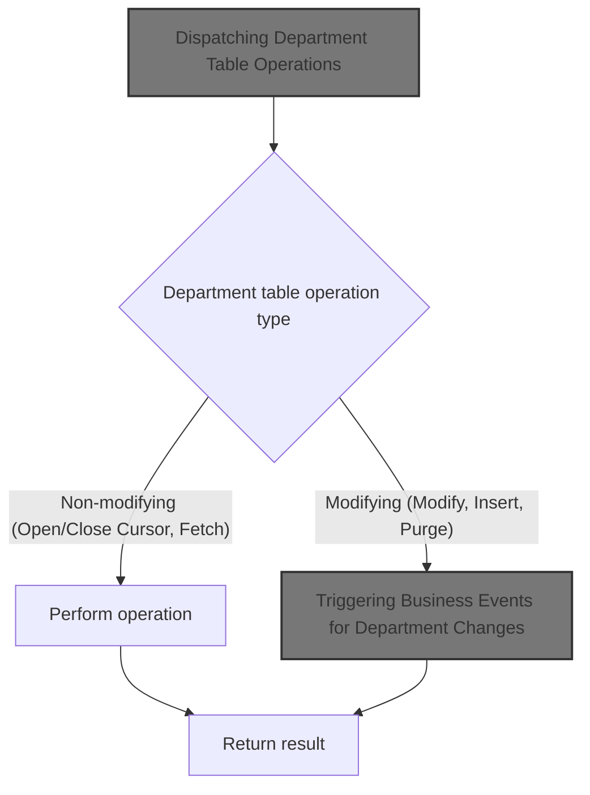
```mermaid
flowchart TD
  node1["Dispatching Department Table Operations"]:::HeadingStyle
  click node1 goToHeading "Dispatching Department Table Operations"
  node1 --> node2{"Department table operation type"}
  node2 -->|"Non-modifying (Open/Close Cursor, Fetch)"| node3["Perform operation"]
  node2 -->|"Modifying (Modify, Insert, Purge)"| node4["Triggering Business Events for Department Changes"]:::HeadingStyle
  click node4 goToHeading "Triggering Business Events for Department Changes"
  node3 --> node5["Return result"]
  node4 --> node5["Return result"]
classDef HeadingStyle fill:#777777,stroke:#333,stroke-width:2px;
```

# Spec

## Detailed View of the Program's Functionality

# A. Program Initialization and Main Dispatcher

The main entry point for the department table operations is a dispatcher routine. When this dispatcher is invoked, it first performs a full initialization of all working data and the database connection state. This ensures that every operation starts with a clean slate and avoids any leftover state from previous calls.

After initialization, the dispatcher examines which department operation is being requested (such as open cursor, close cursor, get row, modify, insert, purge, or special I/O). It does this by evaluating a set of flags or codes that indicate the desired operation. Based on the result, it branches to the appropriate handler routine for that operation. Each handler is a separate routine dedicated to a specific type of database or business operation.

Once the requested operation is complete, the dispatcher performs finalization steps, such as moving any updated data back to the caller’s structures and updating checkpoint counters. It then returns control to the caller.

# B. Preparing Department Data and Connection State

During initialization, all relevant data structures for department operations are reset. This includes clearing out transaction variables, resetting error codes, and preparing the data structures that will be used for database operations.

If the operation is not a cursor close, the department master data is copied from the input structure to the internal working structure. This is done field-by-field to ensure data consistency. There is a special rule: if the organization ID field is blank, it is set to zero before being moved, to avoid empty organization IDs in the database.

The initialization also checks if a connection to the Oracle database is required. This is determined by a combination of flags: if the system is configured for Oracle, or if the operation is an insert, modify, or purge, then a connection to Oracle is established.

# C. Connecting to Oracle Database

If a connection to Oracle is needed, a dedicated routine is called to establish this connection. The connection is attempted using the current state and a standard SQL communication area. If the connection fails, an error message is constructed that includes the SQL error code, and this message is stored for return to the caller.

The actual connection logic is handled by a separate program, which is responsible for managing the connection state for the rest of the flow.

# D. Initializing Connection Manager

The connection manager program is responsible for switching the active database connection to Oracle. When invoked, it first initializes its own working storage, then calls a routine to set the active connection to Oracle. This ensures that all subsequent database operations are directed to the correct database system.

# E. Switching Active Database Connection

To switch the active connection, a flag is set to indicate that Oracle should be used. The connection manager then calls a central routine that manages all database connections and statistics. This routine updates the connection state and tracks usage statistics for monitoring and debugging purposes.

# F. Managing Connection Requests

The central connection manager receives requests to switch or query the current database connection, as well as to retrieve or reset usage statistics. It evaluates the requested operation and dispatches to the appropriate handler. If an unrecognized operation is requested, it sets a failure flag and returns an error message.

## 1\. Switching to DB2 Connection and Tracking Usage

When a request is made to switch to the DB2 database, the manager increments request counters and checks if the current connection is Oracle or the default. If so, it performs the switch to DB2, connecting to either the production or test environment as appropriate. After connecting, it checks for errors and updates the current connection context.

## 2\. Switching to Oracle Connection and Tracking Usage

When switching to Oracle, the manager increments the relevant counters and checks if the connection is already active. If not, it performs the switch, connecting to the correct Oracle environment based on configuration. It then marks Oracle as active and updates the connection context.

## 3\. Resetting Connection Statistics

There is a routine to reset all connection and usage counters, which is useful for monitoring and debugging. Another routine allows for externally overriding the current connection, with error handling for invalid requests.

# G. Opening and Closing Department Table Cursors

When an open or close cursor operation is requested, the handler checks which cursor ID is specified. If the ID matches a known cursor, it opens or closes the corresponding database cursor using embedded SQL. If the ID is invalid, it sets a failure flag and returns an error message.

# H. Fetching Department Rows

## 1\. Fetching a Unique Row

To fetch a specific department row, a SQL SELECT is performed using the primary key fields. The result is mapped into the internal working structure. After fetching, a routine checks for any null columns in the result.

## 2\. Fetching the Next Row

To fetch the next row in a cursor, the handler checks which cursor is active and performs the appropriate fetch operation. The result is mapped into the working structure, and null columns are checked. If the cursor ID is invalid, a failure flag and error message are set.

# I. Modifying Department Rows and Fetching User Info

When modifying a department row, the handler first ensures that null indicators are valid. It then retrieves the current date and user information, which are needed for audit fields. If successful, it fetches the current values of the row and performs the update operation.

# J. Updating Department Row and Staging Events

After updating the row, the handler updates the timestamp and user fields in the record. It then performs the actual update operation. If the update is successful, it sets various flags and increments the checkpoint counter. If the department name has changed, it stages an event for further processing. Finally, it triggers a denormalization process to handle any downstream business logic.

# K. Triggering Business Events for Department Changes

The denormalization process copies system environment data and calls a control subroutine to handle business logic. If this succeeds, it issues business events for the department change by preparing event data and calling the event manager.

# L. Running Control Logic for Master Data Events

The control subroutine is responsible for managing workflow tasks related to master data events. It sets a flag to indicate which task is being performed and calls a workflow management subroutine. This subroutine initializes its own data, checks which task is set, and performs the appropriate business operation.

# M. Staging and Issuing Department Events

When issuing events, the handler prepares the event data, assigns transaction and program IDs, and calls the event manager to stage the event. If the first call succeeds and certain flags are set, it updates the event data and calls the event manager again to handle scan events. The event manager is responsible for filtering, deduplicating, and issuing the event downstream.

# N. Filtering and Issuing Master Data Events

The event manager initializes the event system and, unless the transaction ID is a special case, performs event filtering. Only events flagged for processing are issued. Filtering includes checking event type and batch mode, as well as deduplicating events to avoid sending duplicates.

## 1\. Filtering Events by Type and Duplicates

Events are filtered by checking if the transaction ID matches a hard-coded list and if the environment is batch. If both conditions are met, the event is marked for further processing. The manager also checks for duplicate events by comparing the current event data with previously processed events.

## 2\. Staging Master Data Events

When an event is ready to be issued, the manager prepares the event context, sets the environment and database type, and determines the action type (add, delete, modify). It then calls a stager routine to queue the event for downstream processing.

# O. Inserting Department Rows and Triggering Events

When inserting a new department row, the handler prepares the required fields, retrieves the current date and user, and performs the insert operation. If successful, it sets flags, increments the checkpoint counter, and triggers the denormalization process to handle any related business events.

# P. Purging Department Rows and Triggering Events

When purging (deleting) a department row, the handler first performs a business rule check to ensure the delete is allowed. If the check passes, it performs the delete operation. If the delete is successful, it sets flags, updates related processes, and triggers the denormalization process for downstream event handling.

# Rule Definition

| Paragraph Name                                                                                             | Rule ID | Category          | Description                                                                                                                                                                                                  | Conditions                                                     | Remarks                                                                                                                                                                                 |
| ---------------------------------------------------------------------------------------------------------- | ------- | ----------------- | ------------------------------------------------------------------------------------------------------------------------------------------------------------------------------------------------------------ | -------------------------------------------------------------- | --------------------------------------------------------------------------------------------------------------------------------------------------------------------------------------- |
| 100-INITIALIZATION in NNNS0573.cbl, 100-INITIALIZATION in YYYS0220.cbl, 100-INITIALIZATION in XXXS0210.cbl | RL-001  | Data Assignment   | Before performing any operation, all transaction variables and connection state must be initialized. This includes resetting all fields in the context structure and preparing the department row structure. | Always applies at the start of a dispatcher call.              | All fields in the context structure (XXXN001A) and department row structure (P-DDDTDP01) are reset. No output is produced at this stage.                                                |
| 0000-EXIT-DISPATCHER in NNNS0573.cbl, EVALUATE TRUE block                                                  | RL-002  | Conditional Logic | The dispatcher must check which EXIT flag is set in the context structure to determine the requested operation. Only one EXIT flag should be set per call.                                                   | At least one EXIT flag is set to TRUE; only one should be set. | EXIT flags include EXIT-OPEN-CURSOR, EXIT-CLOSE-CURSOR, EXIT-GET-UNIQUE-ROW, EXIT-GET-NEXT-ROW, EXIT-PUT-MODIFY-ROW, EXIT-PUT-INSERT-ROW, EXIT-PUT-PURGE-ROW, EXIT-DO-SPECIAL-IO-FUNCS. |
| 1000-EXIT-OPEN-CURSOR in NNNS0573.cbl                                                                      | RL-003  | Conditional Logic | If EXIT-OPEN-CURSOR is set, open the department table cursor for the specified cursor ID. Only valid cursor IDs ('DDDXDP01', 'DDDXDP02') are accepted. If invalid, set FAILURE and populate error message.   | EXIT-OPEN-CURSOR is TRUE; cursor ID is provided.               | Valid cursor IDs: 'DDDXDP01', 'DDDXDP02'. Error message: 'NNNS0573 - Invalid open cursor ID.'                                                                                           |
| 1100-EXIT-CLOSE-CURSOR in NNNS0573.cbl                                                                     | RL-004  | Conditional Logic | If EXIT-CLOSE-CURSOR is set, close the department table cursor for the specified cursor ID. Only valid cursor IDs are accepted. If invalid, set FAILURE and populate error message.                          | EXIT-CLOSE-CURSOR is TRUE; cursor ID is provided.              | Valid cursor IDs: 'DDDXDP01', 'DDDXDP02'. Error message: 'NNNS0573 - Invalid close cursor ID.'                                                                                          |
| 1200-EXIT-GET-UNIQUE-ROW in NNNS0573.cbl                                                                   | RL-005  | Computation       | If EXIT-GET-UNIQUE-ROW is set, fetch a unique department row using the primary key fields in the department row structure. If not found, set FAILURE and error message.                                      | EXIT-GET-UNIQUE-ROW is TRUE; primary key fields are provided.  | Primary key: XXX_DEPT_NBR, STR_SUB_DEPT_ID. Error message: 'NNNS0573 - Record not found.'                                                                                               |
| 1300-EXIT-GET-NEXT-ROW in NNNS0573.cbl                                                                     | RL-006  | Computation       | If EXIT-GET-NEXT-ROW is set, fetch the next department row using the active cursor. If cursor ID is invalid or next record not found, set FAILURE and error message.                                         | EXIT-GET-NEXT-ROW is TRUE; cursor ID is provided.              | Valid cursor IDs: 'DDDXDP01', 'DDDXDP02'. Error message: 'NNNS0573 - Invalid fetch cursor ID.' or 'NNNS0573 - Record not found.'                                                        |
| 1400-EXIT-PUT-MODIFY-ROW, 1405-GET-CURR-VALUES, 1410-DO-MODIFY-ROW, 2000-DENORM-PROCESS in NNNS0573.cbl    | RL-007  | Computation       | If EXIT-PUT-MODIFY-ROW is set, update the department row in the database, update audit fields, and trigger business events if the department name changes. On failure, set FAILURE and error message.        | EXIT-PUT-MODIFY-ROW is TRUE; department row data provided.     | Audit fields: last update user, timestamp. Event triggered if department name changes. Error message: 'NNNS0573 - Error getting current values, RC=...' or 'NNNS0573 - Modify failed.'  |
| 1500-EXIT-PUT-INSERT-ROW, 1510-D0-INSERT-ROW, 1520-EXIT-GET-ORG-ID, 2000-DENORM-PROCESS in NNNS0573.cbl    | RL-008  | Computation       | If EXIT-PUT-INSERT-ROW is set, insert a new department row, update audit fields, and trigger business events. On failure, set FAILURE and error message.                                                     | EXIT-PUT-INSERT-ROW is TRUE; department row data provided.     | Audit fields: last update user, timestamp. Error message: 'NNNS0573 - Error getting ORG_ID!' or 'NNNS0573 - Insert failed.'                                                             |
| 1600-EXIT-PUT-PURGE-ROW, 4500-CALL-MMMS0304-RI-DEL-CHK, 2000-DENORM-PROCESS in NNNS0573.cbl                | RL-009  | Computation       | If EXIT-PUT-PURGE-ROW is set, delete the department row after performing business rule checks. Trigger business events if delete succeeds. On failure, set FAILURE and error message.                        | EXIT-PUT-PURGE-ROW is TRUE; department row data provided.      | Business rule checks performed before delete. Error message: 'NNNS0573 - Purge failed.'                                                                                                 |
| 10000-DO-SPECIAL-IO-FUNCS in NNNS0573.cbl                                                                  | RL-010  | Computation       | If EXIT-DO-SPECIAL-IO-FUNCS is set, perform special I/O functions as defined by business logic.                                                                                                              | EXIT-DO-SPECIAL-IO-FUNCS is TRUE.                              | Special I/O functions are implementation-specific and may vary.                                                                                                                         |
| Operation handlers in NNNS0573.cbl, EVALUATE TRUE block, 120-EXIT-STUFF                                    | RL-011  | Data Assignment   | For all operations, update the SUCCESS or FAILURE flag in the context structure to indicate the result, and populate IS-RTRN-MSG-TXT with a relevant message.                                                | After any operation is performed.                              | SUCCESS/FAILURE flag is set. Message is populated with operation result or error.                                                                                                       |
| 120-EXIT-STUFF in NNNS0573.cbl, end of 0000-EXIT-DISPATCHER                                                | RL-012  | Data Assignment   | Always finalize the operation by updating the context structure and returning control to the caller.                                                                                                         | After any operation is performed.                              | Context structure is updated with final status and data.                                                                                                                                |
| 110-MOVE-PDA-FIELDS-2-DCL, 130-MOVE-DCL-2-PDA-FIELDS in NNNS0573.cbl                                       | RL-013  | Data Assignment   | All database operations must use the department row structure for input and output mapping.                                                                                                                  | Any database operation is performed.                           | Department row structure (P-DDDTDP01) is used for all input/output.                                                                                                                     |
| Operation handlers in NNNS0573.cbl, 120-EXIT-STUFF                                                         | RL-014  | Conditional Logic | The dispatcher must not return any values directly; all results, status, and messages must be reflected in the updated context and department row structures.                                                | After any operation is performed.                              | No direct return values; all output is via context and department row structures.                                                                                                       |
| Operation handlers in NNNS0573.cbl (implied by spec)                                                       | RL-015  | Computation       | The dispatcher must support simulation of database operations using in-memory data structures if a real database is not present.                                                                             | Database is not present; simulation mode is enabled.           | Simulation mode uses in-memory structures to mimic database operations.                                                                                                                 |
| EVALUATE TRUE block in NNNS0573.cbl                                                                        | RL-016  | Conditional Logic | The dispatcher must not process more than one operation per call; only the operation indicated by the EXIT flag set to TRUE must be performed.                                                               | Dispatcher call is made; EXIT flags are checked.               | Only one operation is performed per call.                                                                                                                                               |

# User Stories

## User Story 1: Dispatcher operation selection and execution

---

### Story Description:

As a system, I want the dispatcher to determine which operation to perform based on the EXIT flag set in the context structure, and execute only the requested operation (open/close cursor, fetch unique/next row, modify/insert/purge row, or special I/O functions), supporting simulation mode if a real database is not present, so that department-related operations are processed accurately and flexibly according to business logic.

---

### Business Rule Mapping:

| Rule ID | Paragraph Name                                                                                          | Rule Description                                                                                                                                                                                           |
| ------- | ------------------------------------------------------------------------------------------------------- | ---------------------------------------------------------------------------------------------------------------------------------------------------------------------------------------------------------- |
| RL-007  | 1400-EXIT-PUT-MODIFY-ROW, 1405-GET-CURR-VALUES, 1410-DO-MODIFY-ROW, 2000-DENORM-PROCESS in NNNS0573.cbl | If EXIT-PUT-MODIFY-ROW is set, update the department row in the database, update audit fields, and trigger business events if the department name changes. On failure, set FAILURE and error message.      |
| RL-008  | 1500-EXIT-PUT-INSERT-ROW, 1510-D0-INSERT-ROW, 1520-EXIT-GET-ORG-ID, 2000-DENORM-PROCESS in NNNS0573.cbl | If EXIT-PUT-INSERT-ROW is set, insert a new department row, update audit fields, and trigger business events. On failure, set FAILURE and error message.                                                   |
| RL-009  | 1600-EXIT-PUT-PURGE-ROW, 4500-CALL-MMMS0304-RI-DEL-CHK, 2000-DENORM-PROCESS in NNNS0573.cbl             | If EXIT-PUT-PURGE-ROW is set, delete the department row after performing business rule checks. Trigger business events if delete succeeds. On failure, set FAILURE and error message.                      |
| RL-002  | 0000-EXIT-DISPATCHER in NNNS0573.cbl, EVALUATE TRUE block                                               | The dispatcher must check which EXIT flag is set in the context structure to determine the requested operation. Only one EXIT flag should be set per call.                                                 |
| RL-003  | 1000-EXIT-OPEN-CURSOR in NNNS0573.cbl                                                                   | If EXIT-OPEN-CURSOR is set, open the department table cursor for the specified cursor ID. Only valid cursor IDs ('DDDXDP01', 'DDDXDP02') are accepted. If invalid, set FAILURE and populate error message. |
| RL-004  | 1100-EXIT-CLOSE-CURSOR in NNNS0573.cbl                                                                  | If EXIT-CLOSE-CURSOR is set, close the department table cursor for the specified cursor ID. Only valid cursor IDs are accepted. If invalid, set FAILURE and populate error message.                        |
| RL-005  | 1200-EXIT-GET-UNIQUE-ROW in NNNS0573.cbl                                                                | If EXIT-GET-UNIQUE-ROW is set, fetch a unique department row using the primary key fields in the department row structure. If not found, set FAILURE and error message.                                    |
| RL-006  | 1300-EXIT-GET-NEXT-ROW in NNNS0573.cbl                                                                  | If EXIT-GET-NEXT-ROW is set, fetch the next department row using the active cursor. If cursor ID is invalid or next record not found, set FAILURE and error message.                                       |
| RL-010  | 10000-DO-SPECIAL-IO-FUNCS in NNNS0573.cbl                                                               | If EXIT-DO-SPECIAL-IO-FUNCS is set, perform special I/O functions as defined by business logic.                                                                                                            |
| RL-015  | Operation handlers in NNNS0573.cbl (implied by spec)                                                    | The dispatcher must support simulation of database operations using in-memory data structures if a real database is not present.                                                                           |

---

### Relevant Functionality:

- **1400-EXIT-PUT-MODIFY-ROW**
  1. **RL-007:**
     - Get current department name
     - If update succeeds, update audit fields
     - If department name changed, trigger event
     - If update fails, set FAILURE flag and error message
- **1500-EXIT-PUT-INSERT-ROW**
  1. **RL-008:**
     - Get next ORG_ID
     - Insert department row
     - Update audit fields
     - Trigger event
     - If insert fails, set FAILURE flag and error message
- **1600-EXIT-PUT-PURGE-ROW**
  1. **RL-009:**
     - Perform delete checks
     - If checks pass, delete row
     - Trigger event if delete succeeds
     - If delete fails, set FAILURE flag and error message
- **0000-EXIT-DISPATCHER in NNNS0573.cbl**
  1. **RL-002:**
     - Check each EXIT flag in context structure
     - Branch to corresponding operation handler
     - If more than one EXIT flag is set, treat as error
- **1000-EXIT-OPEN-CURSOR in NNNS0573.cbl**
  1. **RL-003:**
     - If cursor ID is 'DDDXDP01', open DDDXDP01 cursor
     - If cursor ID is 'DDDXDP02', open DDDXDP02 cursor
     - Else, set FAILURE flag and error message
- **1100-EXIT-CLOSE-CURSOR in NNNS0573.cbl**
  1. **RL-004:**
     - If cursor ID is 'DDDXDP01', close DDDXDP01 cursor
     - If cursor ID is 'DDDXDP02', close DDDXDP02 cursor
     - Else, set FAILURE flag and error message
- **1200-EXIT-GET-UNIQUE-ROW in NNNS0573.cbl**
  1. **RL-005:**
     - Execute SELECT by primary key
     - If found, populate department row structure
     - If not found, set FAILURE flag and error message
- **1300-EXIT-GET-NEXT-ROW in NNNS0573.cbl**
  1. **RL-006:**
     - If cursor ID is valid, fetch next row
     - If not found or cursor ID invalid, set FAILURE flag and error message
- **10000-DO-SPECIAL-IO-FUNCS in NNNS0573.cbl**
  1. **RL-010:**
     - Execute special I/O logic as defined
- **Operation handlers in NNNS0573.cbl (implied by spec)**
  1. **RL-015:**
     - If simulation mode, perform operations using in-memory structures
     - Otherwise, use real database

## User Story 2: Dispatcher result handling and finalization

---

### Story Description:

As a system, I want the dispatcher to update the SUCCESS or FAILURE flag and populate the return message in the context structure after any operation, finalize the operation by updating the context structure and returning control to the caller, and ensure all results are reflected in the context and department row structures without returning values directly, so that operation outcomes are communicated consistently and reliably to the caller.

---

### Business Rule Mapping:

| Rule ID | Paragraph Name                                                          | Rule Description                                                                                                                                              |
| ------- | ----------------------------------------------------------------------- | ------------------------------------------------------------------------------------------------------------------------------------------------------------- |
| RL-011  | Operation handlers in NNNS0573.cbl, EVALUATE TRUE block, 120-EXIT-STUFF | For all operations, update the SUCCESS or FAILURE flag in the context structure to indicate the result, and populate IS-RTRN-MSG-TXT with a relevant message. |
| RL-014  | Operation handlers in NNNS0573.cbl, 120-EXIT-STUFF                      | The dispatcher must not return any values directly; all results, status, and messages must be reflected in the updated context and department row structures. |
| RL-012  | 120-EXIT-STUFF in NNNS0573.cbl, end of 0000-EXIT-DISPATCHER             | Always finalize the operation by updating the context structure and returning control to the caller.                                                          |

---

### Relevant Functionality:

- **Operation handlers in NNNS0573.cbl**
  1. **RL-011:**
     - After operation, set SUCCESS or FAILURE flag
     - Populate IS-RTRN-MSG-TXT with result or error message
  2. **RL-014:**
     - Populate context structure with status and message
     - Populate department row structure with data
     - Do not return values directly
- **120-EXIT-STUFF in NNNS0573.cbl**
  1. **RL-012:**
     - Update context structure
     - Return control to caller

## User Story 3: Dispatcher initialization, input/output mapping, and call constraints

---

### Story Description:

As a system, I want the dispatcher to initialize all transaction variables and connection state, reset all fields in the context and department row structures, ensure all database operations use the department row structure for input and output mapping, and process only one operation per call so that each dispatcher call starts with a clean state, uses consistent data structures, and avoids unintended multiple operations.

---

### Business Rule Mapping:

| Rule ID | Paragraph Name                                                                                             | Rule Description                                                                                                                                                                                             |
| ------- | ---------------------------------------------------------------------------------------------------------- | ------------------------------------------------------------------------------------------------------------------------------------------------------------------------------------------------------------ |
| RL-013  | 110-MOVE-PDA-FIELDS-2-DCL, 130-MOVE-DCL-2-PDA-FIELDS in NNNS0573.cbl                                       | All database operations must use the department row structure for input and output mapping.                                                                                                                  |
| RL-001  | 100-INITIALIZATION in NNNS0573.cbl, 100-INITIALIZATION in YYYS0220.cbl, 100-INITIALIZATION in XXXS0210.cbl | Before performing any operation, all transaction variables and connection state must be initialized. This includes resetting all fields in the context structure and preparing the department row structure. |
| RL-016  | EVALUATE TRUE block in NNNS0573.cbl                                                                        | The dispatcher must not process more than one operation per call; only the operation indicated by the EXIT flag set to TRUE must be performed.                                                               |

---

### Relevant Functionality:

- **110-MOVE-PDA-FIELDS-2-DCL**
  1. **RL-013:**
     - Map input fields from department row structure
     - Map output fields to department row structure
- **100-INITIALIZATION in NNNS0573.cbl**
  1. **RL-001:**
     - Initialize context structure
     - Initialize department row structure
     - Reset SQLCODE and related status fields
     - Prepare connection state
- **EVALUATE TRUE block in NNNS0573.cbl**
  1. **RL-016:**
     - Check which EXIT flag is set
     - Perform only the corresponding operation
     - Ignore other EXIT flags

# Code Walkthrough

## Dispatching Department Table Operations

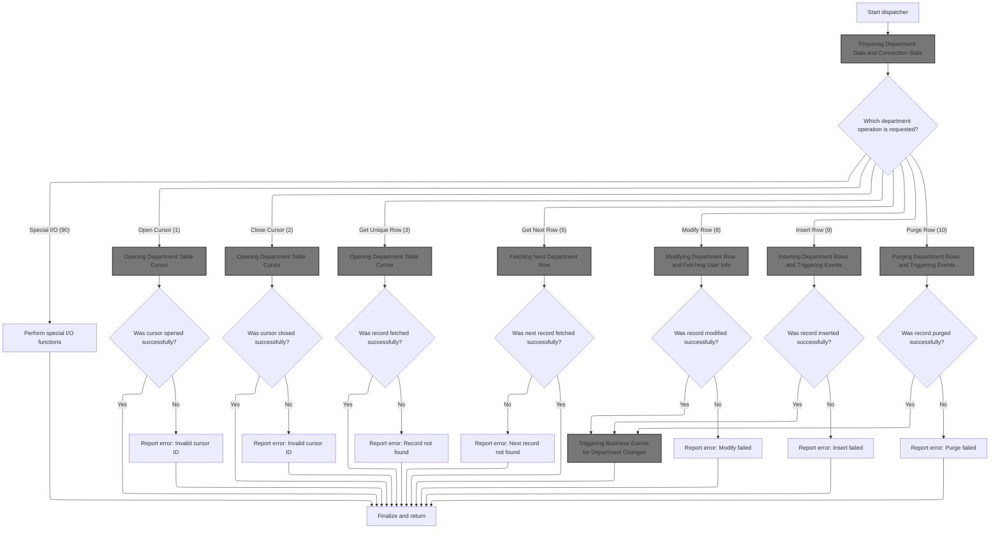
```mermaid
%%{init: {"flowchart": {"defaultRenderer": "elk"}} }%%
flowchart TD
    node1["Start dispatcher"] --> node2["Preparing Department Data and Connection State"]
    click node1 openCode "base/src/NNNS0573.cbl:17300:17400"
    
    node2 --> node3{"Which department operation is requested?"}
    click node3 openCode "base/src/NNNS0573.cbl:17500:19400"
    node3 -->|"Open Cursor (1)"| node4["Opening Department Table Cursor"]
    
    node3 -->|"Close Cursor (2)"| node5["Opening Department Table Cursor"]
    
    node3 -->|"Get Unique Row (3)"| node6["Opening Department Table Cursor"]
    
    node3 -->|"Get Next Row (5)"| node7["Fetching Next Department Row"]
    
    node3 -->|"Modify Row (8)"| node8["Modifying Department Row and Fetching User Info"]
    
    node3 -->|"Insert Row (9)"| node9["Inserting Department Rows and Triggering Events"]
    
    node3 -->|"Purge Row (10)"| node10["Purging Department Rows and Triggering Events"]
    
    node3 -->|"Special I/O (90)"| node11["Perform special I/O functions"]
    click node11 openCode "base/src/NNNS0573.cbl:19300:19400"
    node4 --> node12{"Was cursor opened successfully?"}
    node5 --> node13{"Was cursor closed successfully?"}
    node6 --> node14{"Was record fetched successfully?"}
    node7 --> node15{"Was next record fetched successfully?"}
    node8 --> node16{"Was record modified successfully?"}
    node9 --> node17{"Was record inserted successfully?"}
    node10 --> node18{"Was record purged successfully?"}
    node12 -->|"Yes"| node19["Proceed to finalize"]
    node12 -->|"No"| node20["Report error: Invalid cursor ID"]
    node13 -->|"Yes"| node19
    node13 -->|"No"| node21["Report error: Invalid cursor ID"]
    node14 -->|"Yes"| node19
    node14 -->|"No"| node22["Report error: Record not found"]
    node15 -->|"Yes"| node19
    node15 -->|"No"| node23["Report error: Next record not found"]
    node16 -->|"Yes"| node24["Triggering Business Events for Department Changes"]
    node16 -->|"No"| node25["Report error: Modify failed"]
    node17 -->|"Yes"| node24
    node17 -->|"No"| node26["Report error: Insert failed"]
    node18 -->|"Yes"| node24
    node18 -->|"No"| node27["Report error: Purge failed"]
    node11 --> node19
    node24 --> node19
    node20 --> node19
    node21 --> node19
    node22 --> node19
    node23 --> node19
    node25 --> node19
    node26 --> node19
    node27 --> node19
    node19["Finalize and return"]
    click node19 openCode "base/src/NNNS0573.cbl:19500:19600"
classDef HeadingStyle fill:#777777,stroke:#333,stroke-width:2px;
click node2 goToHeading "Preparing Department Data and Connection State"
node2:::HeadingStyle
click node4 goToHeading "Opening Department Table Cursor"
node4:::HeadingStyle
click node5 goToHeading "Opening Department Table Cursor"
node5:::HeadingStyle
click node6 goToHeading "Opening Department Table Cursor"
node6:::HeadingStyle
click node7 goToHeading "Fetching Next Department Row"
node7:::HeadingStyle
click node8 goToHeading "Modifying Department Row and Fetching User Info"
node8:::HeadingStyle
click node9 goToHeading "Inserting Department Rows and Triggering Events"
node9:::HeadingStyle
click node10 goToHeading "Purging Department Rows and Triggering Events"
node10:::HeadingStyle
click node24 goToHeading "Triggering Business Events for Department Changes"
node24:::HeadingStyle
```

<SwmSnippet path="/base/src/NNNS0573.cbl" line="150">

---

0000-EXIT-DISPATCHER kicks off the flow by always running 100-INITIALIZATION to prep all the working data and connection state. After that, it uses EVALUATE to branch to the right handler based on the EXIT code (like open cursor, close cursor, get row, etc). Each branch is a PERFORM to a specific routine for that operation. At the end, it finalizes with 120-EXIT-STUFF and returns control. The call to 100-INITIALIZATION is needed up front so every operation starts with a clean slate and the right DB connection, avoiding any leftover state from previous calls.

```cobol
017300 0000-EXIT-DISPATCHER.                                            00017300
017400     PERFORM 100-INITIALIZATION                                   00017400
017500     EVALUATE TRUE                                                00017500
017600       WHEN NOT SUCCESS                                           00017600
017700          CONTINUE                                                00017700
017800       WHEN EXIT-OPEN-CURSOR                                      00017800
017900          PERFORM 1000-EXIT-OPEN-CURSOR                           00017900
018000       WHEN EXIT-CLOSE-CURSOR                                     00018000
018100          PERFORM 1100-EXIT-CLOSE-CURSOR                          00018100
018200       WHEN EXIT-GET-UNIQUE-ROW                                   00018200
018300          PERFORM 1200-EXIT-GET-UNIQUE-ROW                        00018300
018400       WHEN EXIT-GET-NEXT-ROW                                     00018400
018500          PERFORM 1300-EXIT-GET-NEXT-ROW                          00018500
018600       WHEN EXIT-PUT-MODIFY-ROW                                   00018600
018700          PERFORM 1400-EXIT-PUT-MODIFY-ROW                        00018700
018800       WHEN EXIT-PUT-INSERT-ROW                                   00018800
018900          PERFORM 1500-EXIT-PUT-INSERT-ROW                        00018900
019000       WHEN EXIT-PUT-PURGE-ROW                                    00019000
019100          PERFORM 1600-EXIT-PUT-PURGE-ROW                         00019100
019200       WHEN EXIT-DO-SPECIAL-IO-FUNCS                              00019200
019300          PERFORM 10000-DO-SPECIAL-IO-FUNCS                       00019300
019400     END-EVALUATE                                                 00019400
019500     PERFORM 120-EXIT-STUFF                                       00019500
019600     GOBACK                                                       00019600
019700     .                                                            00019700
```

---

</SwmSnippet>

### Preparing Department Data and Connection State

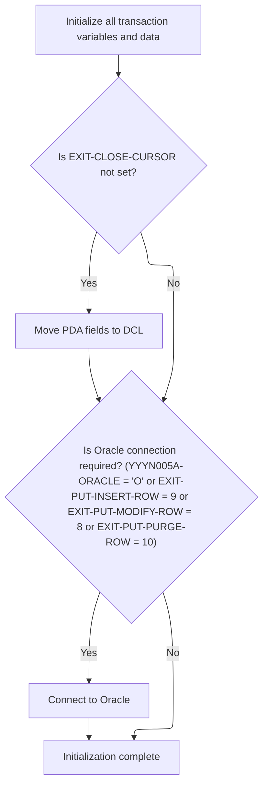
```mermaid
%%{init: {"flowchart": {"defaultRenderer": "elk"}} }%%
flowchart TD
    node1["Initialize all transaction variables and data"] --> node2{"Is EXIT-CLOSE-CURSOR not set?"}
    click node1 openCode "base/src/NNNS0573.cbl:180:187"
    node2 -->|"Yes"| node3["Move PDA fields to DCL"]
    click node2 openCode "base/src/NNNS0573.cbl:188:190"
    click node3 openCode "base/src/NNNS0573.cbl:202:226"
    node2 -->|"No"| node4{"Is Oracle connection required? (YYYN005A-ORACLE = 'O' or EXIT-PUT-INSERT-ROW = 9 or EXIT-PUT-MODIFY-ROW = 8 or EXIT-PUT-PURGE-ROW = 10)"}
    node3 --> node4
    click node4 openCode "base/src/NNNS0573.cbl:191:194"
    node4 -->|"Yes"| node5["Connect to Oracle"]
    click node5 openCode "base/src/NNNS0573.cbl:193:194"
    node4 -->|"No"| node6["Initialization complete"]
    click node6 openCode "base/src/NNNS0573.cbl:195:195"
    node5 --> node6
classDef HeadingStyle fill:#777777,stroke:#333,stroke-width:2px;
```

<SwmSnippet path="/base/src/NNNS0573.cbl" line="180">

---

100-INITIALIZATION resets all the department data and connection state, then checks if we're not closing a cursor. If so, it moves department master data from the PDA structure to the DCL structure by calling 110-MOVE-PDA-FIELDS-2-DCL. This sets up the data for DB operations. It also checks a bunch of flags to see if we need to connect to Oracle, and if any are set, it calls 115-CONNECT-TO-ORACLE to handle the DB connection.

```cobol
020300 100-INITIALIZATION.                                              00020300
020400     INITIALIZE XXXN001A                                          00020400
020500                DB2-STUFF                                         00020500
020600                DAO-RETURN-CODE                                   00020600
020700     MOVE NNNN0000-INDEX-HANDLE TO DDDTDP01-INDEX-HANDLE          00020700
020800     MOVE 0 TO WS-CHECKPOINT-INC                                  00020800
020900     MOVE 0 TO SQLCODE                                            00020900
021000     MOVE 0 TO SQL-INIT-FLAG                                      00021000
021100     IF NOT EXIT-CLOSE-CURSOR                                     00021100
021200       PERFORM 110-MOVE-PDA-FIELDS-2-DCL                          00021200
021300     END-IF                                                       00021300
021400     IF (YYYN005A-ORACLE       OR EXIT-PUT-INSERT-ROW             00021400
021500         OR EXIT-PUT-PURGE-ROW OR EXIT-PUT-MODIFY-ROW)            00021500
021600       PERFORM 115-CONNECT-TO-ORACLE                              00021600
021700     END-IF                                                       00021700
021800     .                                                            00021800
```

---

</SwmSnippet>

<SwmSnippet path="/base/src/NNNS0573.cbl" line="202">

---

110-MOVE-PDA-FIELDS-2-DCL copies department master data field-by-field from the source to the destination structure. If ORG-ID-X is blank, it sets ORG-ID to zero before moving it, so we don't end up with empty org IDs in the DB. This is a repo-specific rule for data consistency.

```cobol
022500 110-MOVE-PDA-FIELDS-2-DCL.                                       00022500
022600     MOVE XXX-DEPT-NBR OF P-DDDTDP01                              00022600
022700       TO XXX-DEPT-NBR OF DCLXXX-DEPT                             00022700
022800     MOVE STR-SUB-DEPT-ID OF P-DDDTDP01                           00022800
022900       TO STR-SUB-DEPT-ID OF DCLXXX-DEPT                          00022900
023000     MOVE DEPT-NM OF P-DDDTDP01 TO DEPT-NM OF DCLXXX-DEPT         00023000
023100     MOVE DEPT-ABB OF P-DDDTDP01 TO DEPT-ABB OF DCLXXX-DEPT       00023100
023200     MOVE REPT-GRP-CD OF P-DDDTDP01 TO REPT-GRP-CD OF DCLXXX-DEPT 00023200
023300     MOVE GRPRFT-LO-PCT OF P-DDDTDP01                             00023300
023400       TO GRPRFT-LO-PCT OF DCLXXX-DEPT                            00023400
023500     MOVE GRPRFT-HI-PCT OF P-DDDTDP01                             00023500
023600       TO GRPRFT-HI-PCT OF DCLXXX-DEPT                            00023600
023700     MOVE SHRNK-LO-PCT OF P-DDDTDP01                              00023700
023800       TO SHRNK-LO-PCT OF DCLXXX-DEPT                             00023800
023900     MOVE SHRNK-HI-PCT OF P-DDDTDP01                              00023900
024000       TO SHRNK-HI-PCT OF DCLXXX-DEPT                             00024000
024100     MOVE LST-UPDT-USR-ID OF P-DDDTDP01                           00024100
024200       TO LST-UPDT-USR-ID OF DCLXXX-DEPT                          00024200
024300     MOVE LST-UPDT-TS OF P-DDDTDP01 TO LST-UPDT-TS OF DCLXXX-DEPT 00024300
024400     IF ORG-ID-X OF P-DDDTDP01 = SPACES                           00024400
024500       MOVE ZERO TO ORG-ID OF P-DDDTDP01                          00024500
024600     END-IF                                                       00024600
024700     MOVE ORG-ID OF P-DDDTDP01                                    00024700
024800       TO ORG-ID OF DCLXXX-DEPT                                   00024800
024900     .                                                            00024900
```

---

</SwmSnippet>

### Connecting to Oracle Database

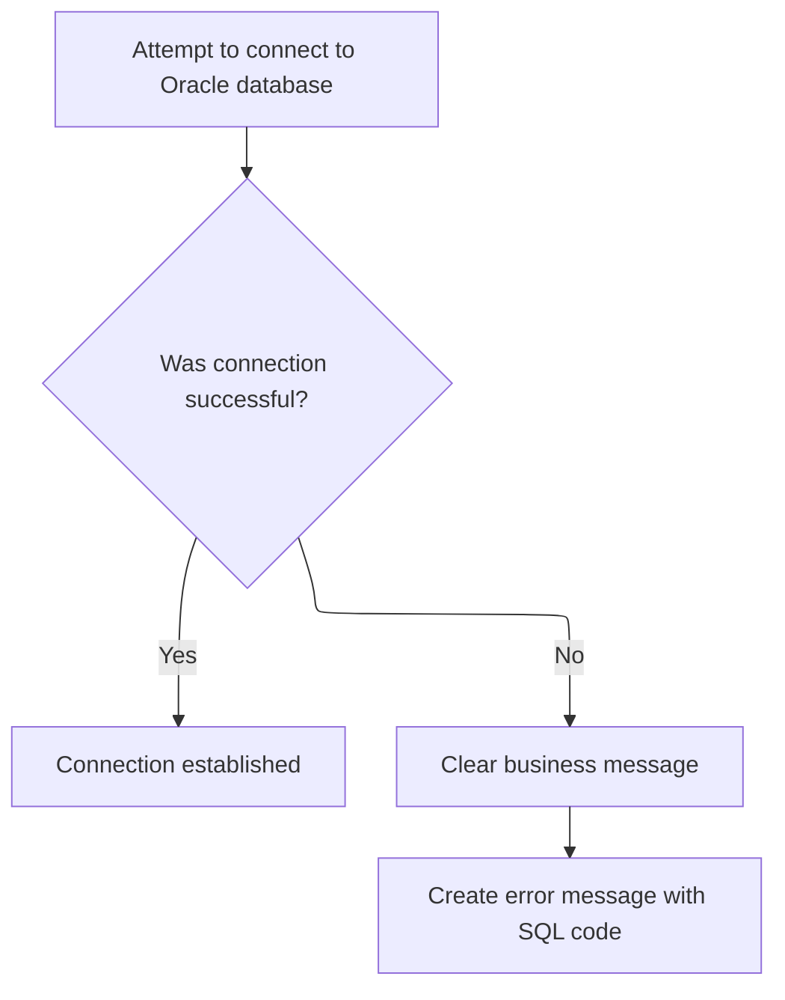
```mermaid
%%{init: {"flowchart": {"defaultRenderer": "elk"}} }%%
flowchart TD
    node1["Attempt to connect to Oracle database"] --> node2{"Was connection successful?"}
    click node1 openCode "base/src/NNNS0573.cbl:229:231"
    node2 -->|"Yes"| node3["Connection established"]
    click node2 openCode "base/src/NNNS0573.cbl:232:232"
    click node3 openCode "base/src/NNNS0573.cbl:232:232"
    node2 -->|"No"| node4["Clear business message"]
    click node4 openCode "base/src/NNNS0573.cbl:234:234"
    node4 --> node5["Create error message with SQL code"]
    click node5 openCode "base/src/NNNS0573.cbl:235:237"

classDef HeadingStyle fill:#777777,stroke:#333,stroke-width:2px;
```

<SwmSnippet path="/base/src/NNNS0573.cbl" line="229">

---

115-CONNECT-TO-ORACLE calls Z-ORA-CONNECT to set up the Oracle DB connection using the current state and SQLCA. If the connection fails, it builds an error message with the returned SQLCODE. Next, we need to call base/src/XXXS0210.cbl because that's the actual program that manages the connection setup and state for the rest of the flow.

```cobol
025200 115-CONNECT-TO-ORACLE.                                           00025200
025300     CALL Z-ORA-CONNECT USING XXXN001A                            00025300
025400                              SQLCA                               00025400
025500     IF NOT SUCCESS                                               00025500
025600       MOVE SQLCODE TO WS-SQLCODE                                 00025600
025700       MOVE SPACES  TO IS-RTRN-MSG-TXT                            00025700
025800       STRING 'NNNS0573 - Error connecting to Oracle. Sqlcode ='  00025800
025900               WS-SQLCODE                                         00025900
026000               DELIMITED BY SIZE INTO IS-RTRN-MSG-TXT             00026000
026100     END-IF                                                       00026100
026200     .                                                            00026200
```

---

</SwmSnippet>

### Initializing Connection Manager

<SwmSnippet path="/base/src/XXXS0210.cbl" line="33">

---

0000-EXIT-DISPATCHER in base/src/XXXS0210.cbl runs initialization to prep working storage, then calls 200-CONNECT-TO-ORACLE to switch the active DB connection to Oracle. This sets up the connection manager for the rest of the flow.

```cobol
004400 0000-EXIT-DISPATCHER.                                            00004400
004500     PERFORM 100-INITIALIZATION                                   00004500
004600     PERFORM 200-CONNECT-TO-ORACLE                                00004600
005000     GOBACK                                                       00005000
005100     .                                                            00005100
```

---

</SwmSnippet>

### Switching Active Database Connection

<SwmSnippet path="/base/src/XXXS0210.cbl" line="52">

---

200-CONNECT-TO-ORACLE sets the flag to switch to Oracle, then calls YYYS0220-DBMS-CON-MGR to actually perform the switch and update connection stats. This hands off control to the connection manager for DB switching.

```cobol
007500 200-CONNECT-TO-ORACLE.                                           00007500
007510     SET YYYC0220-SET-ORACLE-CON TO TRUE                          00007510
007530                                                                  00007530
007540     CALL YYYS0220-DBMS-CON-MGR USING                             00007540
007550         XXXN001A                                                 00007550
007560         YYYC0220                                                 00007560
010400     .                                                            00010400
```

---

</SwmSnippet>

### Managing Connection Requests

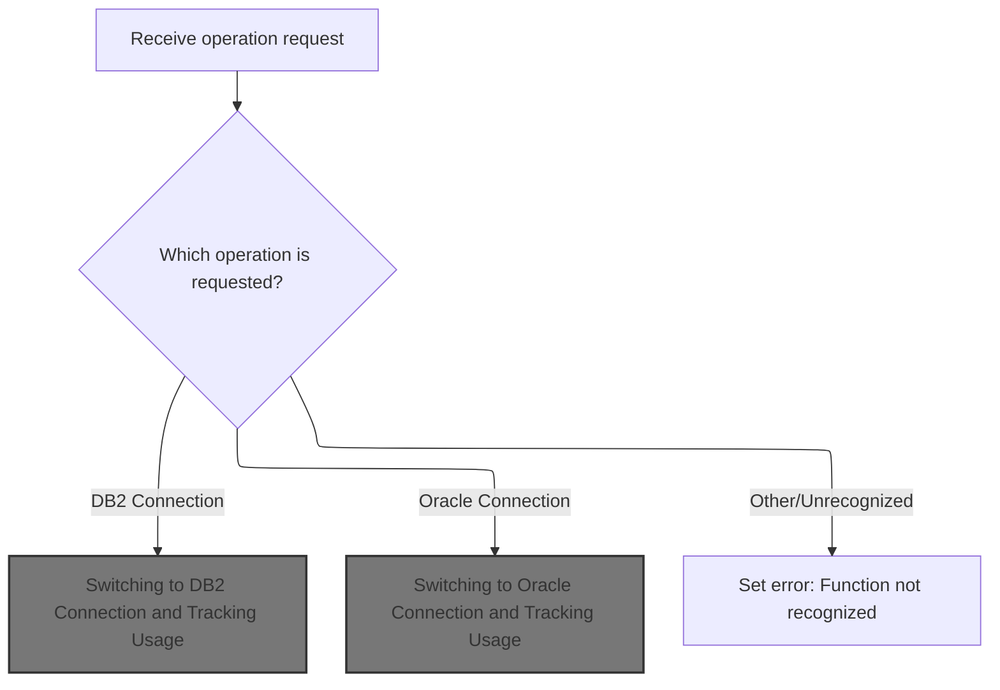
```mermaid
%%{init: {"flowchart": {"defaultRenderer": "elk"}} }%%
flowchart TD
    node1["Receive operation request"] --> node2{"Which operation is requested?"}
    click node1 openCode "base/src/YYYS0220.cbl:56:58"
    node2 -->|"DB2 Connection"| node3["Switching to DB2 Connection and Tracking Usage"]
    click node2 openCode "base/src/YYYS0220.cbl:59:73"
    
    node2 -->|"Oracle Connection"| node4["Switching to Oracle Connection and Tracking Usage"]
    
    node2 -->|"Other/Unrecognized"| node5["Set error: Function not recognized"]
    click node5 openCode "base/src/YYYS0220.cbl:73:76"

classDef HeadingStyle fill:#777777,stroke:#333,stroke-width:2px;
click node3 goToHeading "Switching to DB2 Connection and Tracking Usage"
node3:::HeadingStyle
click node4 goToHeading "Switching to Oracle Connection and Tracking Usage"
node4:::HeadingStyle
```

<SwmSnippet path="/base/src/YYYS0220.cbl" line="56">

---

0000-EXIT-DISPATCHER in base/src/YYYS0220.cbl checks which connection or stats function is requested and runs the right routine. If it gets something unknown, it sets a failure flag and writes an error message. This centralizes connection and stats management.

```cobol
006500 0000-EXIT-DISPATCHER.                                            00006500
006600     PERFORM 100-INITIALIZATION                                   00006600
006700                                                                  00006700
006800     EVALUATE TRUE                                                00006800
006900       WHEN YYYC0220-GET-CURR-CON                                 00006900
007000         PERFORM 200-GET-CURR-CON                                 00007000
007100       WHEN YYYC0220-SET-DB2-CON                                  00007100
007200         PERFORM 300-SET-DB2-CON                                  00007200
007300       WHEN YYYC0220-SET-ORACLE-CON                               00007300
007400         PERFORM 400-SET-ORACLE-CON                               00007400
007500       WHEN YYYC0220-GET-STATS                                    00007500
007600         PERFORM 500-GET-STATS                                    00007600
007700       WHEN YYYC0220-SET-STATS                                    00007700
007800         PERFORM 600-SET-STATS                                    00007800
007900       WHEN YYYC0220-SET-OVERRIDE-CON                             00007900
008000         PERFORM 700-SET-OVERRIDE-CON                             00008000
008100       WHEN OTHER                                                 00008100
008200         SET  FAILURE TO TRUE                                     00008200
008300         MOVE 'YYYS0220 - Function not recognized!'               00008300
008400           TO IS-RTRN-MSG-TXT                                     00008400
008500     END-EVALUATE                                                 00008500
008600                                                                  00008600
008700     GOBACK                                                       00008700
008800     .                                                            00008800
```

---

</SwmSnippet>

#### Switching to DB2 Connection and Tracking Usage

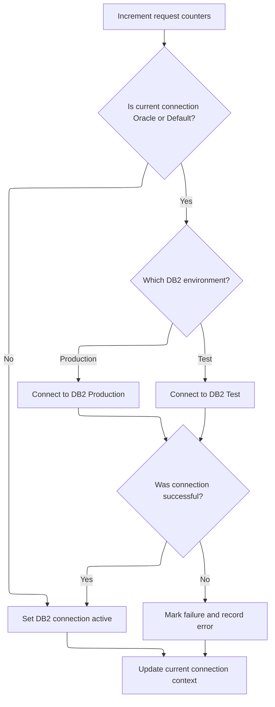
```mermaid
%%{init: {"flowchart": {"defaultRenderer": "elk"}} }%%
flowchart TD
  node1["Increment request counters"]
  click node1 openCode "base/src/YYYS0220.cbl:115:116"
  node1 --> node2{"Is current connection Oracle or Default?"}
  click node2 openCode "base/src/YYYS0220.cbl:118:119"
  node2 -->|"Yes"| node3{"Which DB2 environment?"}
  click node3 openCode "base/src/YYYS0220.cbl:131:140"
  node3 -->|"Production"| node4["Connect to DB2 Production"]
  click node4 openCode "base/src/YYYS0220.cbl:134:135"
  node3 -->|"Test"| node5["Connect to DB2 Test"]
  click node5 openCode "base/src/YYYS0220.cbl:138:139"
  node4 --> node6{"Was connection successful?"}
  node5 --> node6
  click node6 openCode "base/src/YYYS0220.cbl:143:146"
  node6 -->|"Yes"| node7["Set DB2 connection active"]
  node6 -->|"No"| node8["Mark failure and record error"]
  click node7 openCode "base/src/YYYS0220.cbl:123:123"
  click node8 openCode "base/src/YYYS0220.cbl:147:151"
  node7 --> node9["Update current connection context"]
  node8 --> node9
  click node9 openCode "base/src/YYYS0220.cbl:124:124"
  node2 -->|"No"| node7
classDef HeadingStyle fill:#777777,stroke:#333,stroke-width:2px;
```

<SwmSnippet path="/base/src/YYYS0220.cbl" line="105">

---

300-SET-DB2-CON bumps the total and DB2 request counters, then checks if we're on Oracle or Default. If so, it runs 310-DO-SET-DB2-CON to switch to DB2. After that, it marks DB2 as active and fetches the current connection type for tracking.

```cobol
011400 300-SET-DB2-CON.                                                 00011400
011500     ADD 1 TO WS-TOT-REQS                                         00011500
011600     ADD 1 TO WS-DB2-REQS                                         00011600
011700                                                                  00011700
011800     IF WS-ORACLE-CON                                             00011800
011900     OR WS-DEFAULT-CON                                            00011900
012000       PERFORM 310-DO-SET-DB2-CON                                 00012000
012100     END-IF                                                       00012100
012200                                                                  00012200
012300     SET WS-DB2-CON TO TRUE                                       00012300
012400     PERFORM 200-GET-CURR-CON                                     00012400
012500     .                                                            00012500
```

---

</SwmSnippet>

<SwmSnippet path="/base/src/YYYS0220.cbl" line="119">

---

310-DO-SET-DB2-CON bumps the connection switch counter, then checks the environment flag. If we're in production, it connects to DB2P; otherwise, it connects to DB2T. After connecting, it checks SQLCODE for success and sets a failure flag and error message if it didn't work.

```cobol
012800 310-DO-SET-DB2-CON.                                              00012800
012900     ADD 1 TO WS-CON-SWITCHES                                     00012900
013000                                                                  00013000
013100     EVALUATE TRUE                                                00013100
013200       WHEN WS-PROD                                               00013200
013300         EXEC SQL                                                 00013300
013400           CONNECT TO DB2P                                        00013400
013500         END-EXEC                                                 00013500
013600       WHEN OTHER                                                 00013600
013700         EXEC SQL                                                 00013700
013800           CONNECT TO DB2T                                        00013800
013900         END-EXEC                                                 00013900
014000     END-EVALUATE                                                 00014000
014100                                                                  00014100
014200     EVALUATE TRUE                                                00014200
014300       WHEN SQLCODE = 0                                           00014300
014400         CONTINUE                                                 00014400
014500                                                                  00014500
014600       WHEN OTHER                                                 00014600
014700         SET  FAILURE TO TRUE                                     00014700
014800         MOVE SQLCODE TO WS-SQLCODE                               00014800
014900         STRING 'YYYS0220 - Failure connecting to DB2, SQL='      00014900
015000                WS-SQLCODE                                        00015000
015100             DELIMITED BY SIZE INTO IS-RTRN-MSG-TXT               00015100
015200     END-EVALUATE                                                 00015200
015300     .                                                            00015300
```

---

</SwmSnippet>

#### Switching to Oracle Connection and Tracking Usage

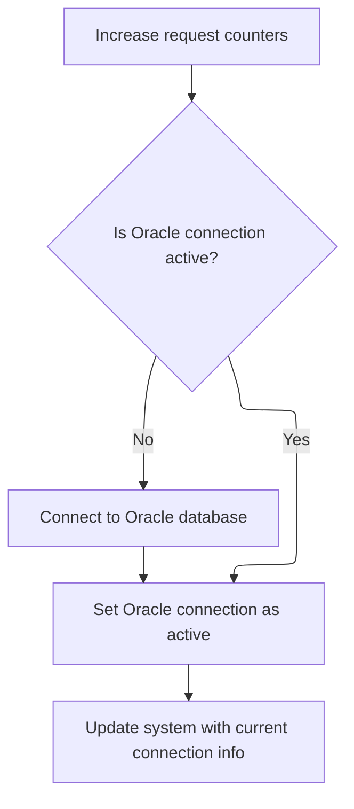
```mermaid
%%{init: {"flowchart": {"defaultRenderer": "elk"}} }%%
flowchart TD
  node1["Increase request counters"]
  click node1 openCode "base/src/YYYS0220.cbl:160:161"
  node1 --> node2{"Is Oracle connection active?"}
  click node2 openCode "base/src/YYYS0220.cbl:163:163"
  node2 -->|"No"| node3["Connect to Oracle database"]
  click node3 openCode "base/src/YYYS0220.cbl:164:165"
  node2 -->|"Yes"| node4["Set Oracle connection as active"]
  click node4 openCode "base/src/YYYS0220.cbl:167:167"
  node3 --> node4
  node4 --> node5["Update system with current connection info"]
  click node5 openCode "base/src/YYYS0220.cbl:168:168"
classDef HeadingStyle fill:#777777,stroke:#333,stroke-width:2px;
```

<SwmSnippet path="/base/src/YYYS0220.cbl" line="150">

---

400-SET-ORACLE-CON bumps the total and Oracle request counters, then checks if we're not already on Oracle. If so, it runs 410-DO-SET-ORACLE-CON to switch. After that, it marks Oracle as active and fetches the current connection type for tracking.

```cobol
015900 400-SET-ORACLE-CON.                                              00015900
016000     ADD 1 TO WS-TOT-REQS                                         00016000
016100     ADD 1 TO WS-OCL-REQS                                         00016100
016200                                                                  00016200
016300     IF NOT WS-ORACLE-CON                                         00016300
016400       PERFORM 410-DO-SET-ORACLE-CON                              00016400
016500     END-IF                                                       00016500
016600                                                                  00016600
016700     SET WS-ORACLE-CON TO TRUE                                    00016700
016800     PERFORM 200-GET-CURR-CON                                     00016800
016900     .                                                            00016900
```

---

</SwmSnippet>

<SwmSnippet path="/base/src/YYYS0220.cbl" line="163">

---

410-DO-SET-ORACLE-CON bumps the connection switch counter, then checks which environment flag is set. It connects to the right Oracle DB based on that flag. After connecting, it checks SQLCODE for success and sets a failure flag and error message if it didn't work.

```cobol
017200 410-DO-SET-ORACLE-CON.                                           00017200
017300     ADD 1 TO WS-CON-SWITCHES                                     00017300
017400                                                                  00017400
017500     EVALUATE TRUE                                                00017500
017600       WHEN WS-PROD                                               00017600
017700         EXEC SQL                                                 00017700
017800           CONNECT TO DRDAASP1                                    00017800
017900         END-EXEC                                                 00017900
018000                                                                  00018000
018100       WHEN WS-TEST                                               00018100
018200         EXEC SQL                                                 00018200
018300           CONNECT TO DRDAASC7                                    00018300
018400         END-EXEC                                                 00018400
018500                                                                  00018500
018600       WHEN WS-TST6                                               00018600
018700         EXEC SQL                                                 00018700
018800           CONNECT TO DRDAASC6                                    00018800
018900         END-EXEC                                                 00018900
019000                                                                  00019000
019100       WHEN WS-TST5                                               00019100
019200         EXEC SQL                                                 00019200
019300           CONNECT TO DRDAASC5                                    00019300
019400         END-EXEC                                                 00019400
019500                                                                  00019500
019600       WHEN WS-TST4                                               00019600
019700         EXEC SQL                                                 00019700
019800           CONNECT TO DRDAASD1                                    00019800
019900         END-EXEC                                                 00019900
020000                                                                  00020000
020100       WHEN WS-TST3                                               00020100
020200         EXEC SQL                                                 00020200
020300           CONNECT TO DRDAASC1                                    00020300
020400         END-EXEC                                                 00020400
020500     END-EVALUATE                                                 00020500
020600                                                                  00020600
020700     EVALUATE TRUE                                                00020700
020800       WHEN SQLCODE = 0                                           00020800
020900         CONTINUE                                                 00020900
021000                                                                  00021000
021100       WHEN OTHER                                                 00021100
021200         SET  FAILURE TO TRUE                                     00021200
021300         MOVE SQLCODE TO WS-SQLCODE                               00021300
021400         STRING 'YYYS0220 - Failure connecting to Oracle, SQL='   00021400
021500                WS-SQLCODE                                        00021500
021600             DELIMITED BY SIZE INTO IS-RTRN-MSG-TXT               00021600
021700     END-EVALUATE                                                 00021700
021800     .                                                            00021800
```

---

</SwmSnippet>

#### Resetting Connection Statistics

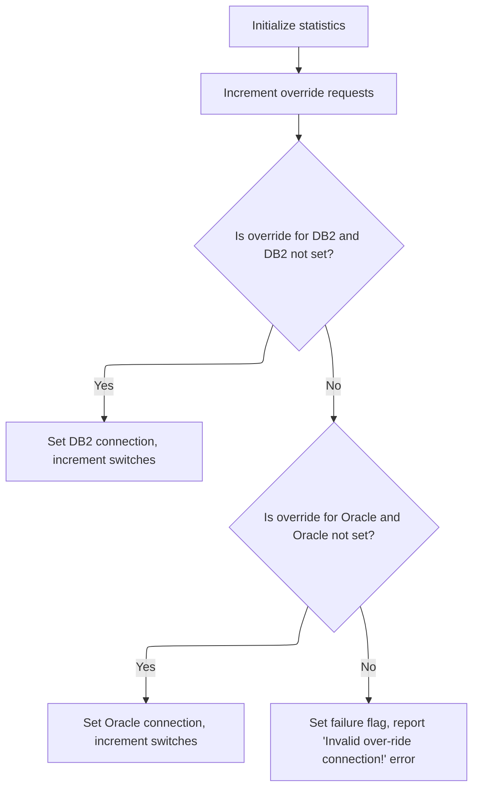
```mermaid
%%{init: {"flowchart": {"defaultRenderer": "elk"}} }%%
flowchart TD
    node1["Initialize statistics"]
    click node1 openCode "base/src/YYYS0220.cbl:23900:24200"
    node1 --> node2["Increment override requests"]
    click node2 openCode "base/src/YYYS0220.cbl:24800:24900"
    node2 --> node3{"Is override for DB2 and DB2 not set?"}
    click node3 openCode "base/src/YYYS0220.cbl:25100:25300"
    node3 -->|"Yes"| node4["Set DB2 connection, increment switches"]
    click node4 openCode "base/src/YYYS0220.cbl:25400:25500"
    node3 -->|"No"| node5{"Is override for Oracle and Oracle not set?"}
    click node5 openCode "base/src/YYYS0220.cbl:25700:25800"
    node5 -->|"Yes"| node6["Set Oracle connection, increment switches"]
    click node6 openCode "base/src/YYYS0220.cbl:25900:26000"
    node5 -->|"No"| node7["Set failure flag, report 'Invalid over-ride connection!' error"]
    click node7 openCode "base/src/YYYS0220.cbl:26300:26500"

classDef HeadingStyle fill:#777777,stroke:#333,stroke-width:2px;
```

<SwmSnippet path="/base/src/YYYS0220.cbl" line="230">

---

600-SET-STATS resets all the connection and usage counters in WS-STATS and YYYC0220-STATS so we start with a clean slate for tracking connection activity.

```cobol
023900 600-SET-STATS.                                                   00023900
024000     INITIALIZE WS-STATS                                          00024000
024100                YYYC0220-STATS                                    00024100
024200     .                                                            00024200
```

---

</SwmSnippet>

<SwmSnippet path="/base/src/YYYS0220.cbl" line="239">

---

700-SET-OVERRIDE-CON bumps the override request counter, then checks which override flag is set. It sets the right connection flag and bumps the override switch counter, or sets a failure flag and error message if the input is invalid.

```cobol
024800 700-SET-OVERRIDE-CON.                                            00024800
024900     ADD 1 TO WS-OVR-REQS                                         00024900
025000                                                                  00025000
025100     EVALUATE TRUE                                                00025100
025200       WHEN YYYC0220-DB2-CON                                      00025200
025300       AND  NOT WS-DB2-CON                                        00025300
025400         SET WS-DB2-CON    TO TRUE                                00025400
025500         ADD 1             TO WS-OVR-SWITCHES                     00025500
025600                                                                  00025600
025700       WHEN YYYC0220-ORACLE-CON                                   00025700
025800       AND NOT WS-ORACLE-CON                                      00025800
025900         SET WS-ORACLE-CON TO TRUE                                00025900
026000         ADD 1             TO WS-OVR-SWITCHES                     00026000
026100                                                                  00026100
026200       WHEN OTHER                                                 00026200
026300         SET FAILURE TO TRUE                                      00026300
026400         MOVE 'YYYS0220 - Invalid over-ride connection!'          00026400
026500           TO IS-RTRN-MSG-TXT                                     00026500
026600     END-EVALUATE                                                 00026600
026700     .                                                            00026700
```

---

</SwmSnippet>

### Opening Department Table Cursor

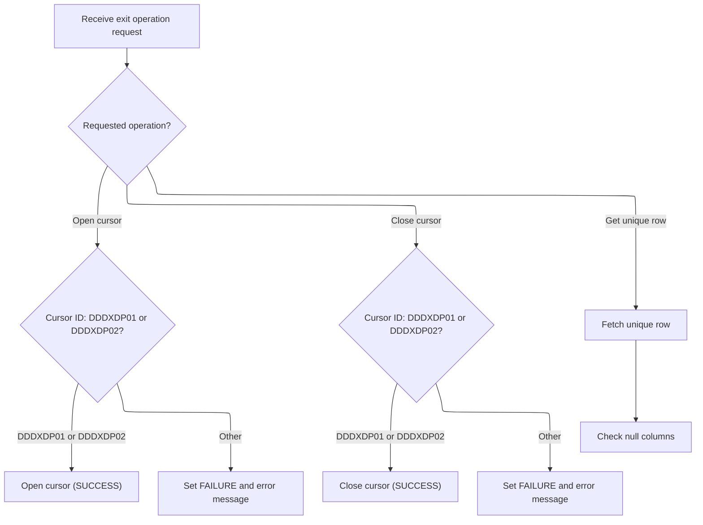
```mermaid
%%{init: {"flowchart": {"defaultRenderer": "elk"}} }%%
flowchart TD
    node1["Receive exit operation request"] --> node2{"Requested operation?"}
    click node1 openCode "base/src/NNNS0573.cbl:297:388"
    node2 -->|"Open cursor"| node3{"Cursor ID: DDDXDP01 or DDDXDP02?"}
    click node2 openCode "base/src/NNNS0573.cbl:297:388"
    node3 -->|"DDDXDP01 or DDDXDP02"| node4["Open cursor (SUCCESS)"]
    click node4 openCode "base/src/NNNS0573.cbl:297:311"
    node3 -->|"Other"| node5["Set FAILURE and error message"]
    click node5 openCode "base/src/NNNS0573.cbl:308:311"
    node2 -->|"Close cursor"| node6{"Cursor ID: DDDXDP01 or DDDXDP02?"}
    click node6 openCode "base/src/NNNS0573.cbl:315:330"
    node6 -->|"DDDXDP01 or DDDXDP02"| node7["Close cursor (SUCCESS)"]
    click node7 openCode "base/src/NNNS0573.cbl:317:324"
    node6 -->|"Other"| node8["Set FAILURE and error message"]
    click node8 openCode "base/src/NNNS0573.cbl:325:328"
    node2 -->|"Get unique row"| node9["Fetch unique row"]
    click node9 openCode "base/src/NNNS0573.cbl:333:362"
    node9 --> node10["Check null columns"]
    click node10 openCode "base/src/NNNS0573.cbl:364:365"
classDef HeadingStyle fill:#777777,stroke:#333,stroke-width:2px;
```

<SwmSnippet path="/base/src/NNNS0573.cbl" line="297">

---

1000-EXIT-OPEN-CURSOR checks which cursor ID is set and opens the matching DB cursor using embedded SQL. If the ID isn't valid, it sets a failure flag and error message.

```cobol
032000 1000-EXIT-OPEN-CURSOR.                                           00032000
032100     EVALUATE TRUE                                                00032100
032200       WHEN DDDXDP01                                              00032200
032300         EXEC SQL                                                 00032300
032400           OPEN DDDXDP01                                          00032400
032500         END-EXEC                                                 00032500
032600       WHEN DDDXDP02                                              00032600
032700         EXEC SQL                                                 00032700
032800           OPEN DDDXDP02                                          00032800
032900         END-EXEC                                                 00032900
033000       WHEN OTHER                                                 00033000
033100         SET FAILURE TO TRUE                                      00033100
033200         MOVE 'NNNS0573 - Invalid open cursor ID.'                00033200
033300           TO IS-RTRN-MSG-TXT OF XXXN001A                         00033300
033400     END-EVALUATE                                                 00033400
033500     .                                                            00033500
```

---

</SwmSnippet>

<SwmSnippet path="/base/src/NNNS0573.cbl" line="315">

---

1100-EXIT-CLOSE-CURSOR checks which cursor ID is set and closes the matching DB cursor using embedded SQL. If the ID isn't valid, it sets a failure flag and error message.

```cobol
033800 1100-EXIT-CLOSE-CURSOR.                                          00033800
033900     EVALUATE TRUE                                                00033900
034000       WHEN DDDXDP01                                              00034000
034100         EXEC SQL                                                 00034100
034200           CLOSE DDDXDP01                                         00034200
034300         END-EXEC                                                 00034300
034400       WHEN DDDXDP02                                              00034400
034500         EXEC SQL                                                 00034500
034600           CLOSE DDDXDP02                                         00034600
034700         END-EXEC                                                 00034700
034800       WHEN OTHER                                                 00034800
034900         SET FAILURE TO TRUE                                      00034900
035000         MOVE 'NNNS0573 - Invalid close cursor ID.'               00035000
035100           TO IS-RTRN-MSG-TXT OF XXXN001A                         00035100
035200     END-EVALUATE                                                 00035200
035300     .                                                            00035300
```

---

</SwmSnippet>

<SwmSnippet path="/base/src/NNNS0573.cbl" line="333">

---

1200-EXIT-GET-UNIQUE-ROW runs a SQL SELECT to fetch a department row by primary key, then checks for null columns in the result. The key fields must be set up before calling this.

```cobol
035600 1200-EXIT-GET-UNIQUE-ROW.                                        00035600
035700     EXEC SQL                                                     00035700
035800         SELECT XXX_DEPT_NBR,                                     00035800
035900                STR_SUB_DEPT_ID,                                  00035900
036000                DEPT_NM,                                          00036000
036100                DEPT_ABB,                                         00036100
036200                REPT_GRP_CD,                                      00036200
036300                GRPRFT_LO_PCT,                                    00036300
036400                GRPRFT_HI_PCT,                                    00036400
036500                SHRNK_LO_PCT,                                     00036500
036600                SHRNK_HI_PCT,                                     00036600
036700                LST_UPDT_USR_ID,                                  00036700
036800                LST_UPDT_TS,                                      00036800
036900                ORG_ID                                            00036900
037000         INTO   :DCLXXX-DEPT.XXX-DEPT-NBR,                        00037000
037100                :DCLXXX-DEPT.STR-SUB-DEPT-ID,                     00037100
037200                :DCLXXX-DEPT.DEPT-NM,                             00037200
037300                :DCLXXX-DEPT.DEPT-ABB,                            00037300
037400                :DCLXXX-DEPT.REPT-GRP-CD,                         00037400
037500                :DCLXXX-DEPT.GRPRFT-LO-PCT,                       00037500
037600                :DCLXXX-DEPT.GRPRFT-HI-PCT,                       00037600
037700                :DCLXXX-DEPT.SHRNK-LO-PCT,                        00037700
037800                :DCLXXX-DEPT.SHRNK-HI-PCT,                        00037800
037900                :DCLXXX-DEPT.LST-UPDT-USR-ID,                     00037900
038000                :DCLXXX-DEPT.LST-UPDT-TS,                         00038000
038100                :DCLXXX-DEPT.ORG-ID                               00038100
038200         FROM   XXX_DEPT                                          00038200
038300         WHERE  XXX_DEPT_NBR = :DCLXXX-DEPT.XXX-DEPT-NBR          00038300
038400         AND    STR_SUB_DEPT_ID = :DCLXXX-DEPT.STR-SUB-DEPT-ID    00038400
038500     END-EXEC                                                     00038500
038600                                                                  00038600
038700     PERFORM 1700-CHECK-NULL-COLUMNS                              00038700
038800     .                                                            00038800
```

---

</SwmSnippet>

### Fetching Next Department Row

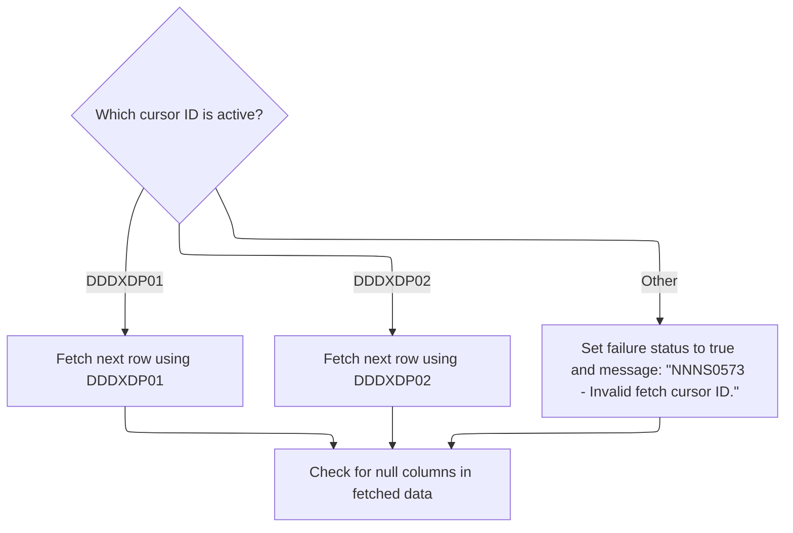
```mermaid
%%{init: {"flowchart": {"defaultRenderer": "elk"}} }%%
flowchart TD
    node1{"Which cursor ID is active?"}
    click node1 openCode "base/src/NNNS0573.cbl:369:378"
    node1 -->|"DDDXDP01"| node2["Fetch next row using DDDXDP01"]
    click node2 openCode "base/src/NNNS0573.cbl:384:400"
    node1 -->|"DDDXDP02"| node3["Fetch next row using DDDXDP02"]
    click node3 openCode "base/src/NNNS0573.cbl:395:396"
    node1 -->|"Other"| node4["Set failure status to true and message: #quot;NNNS0573 - Invalid fetch cursor ID.#quot;"]
    click node4 openCode "base/src/NNNS0573.cbl:397:400"
    node2 --> node5["Check for null columns in fetched data"]
    node3 --> node5
    node4 --> node5
    click node5 openCode "base/src/NNNS0573.cbl:380:380"
classDef HeadingStyle fill:#777777,stroke:#333,stroke-width:2px;
```

<SwmSnippet path="/base/src/NNNS0573.cbl" line="368">

---

1300-EXIT-GET-NEXT-ROW checks which cursor ID is set and calls the right fetch routine. After fetching, it checks for null columns. If the ID isn't valid, it sets a failure flag and error message.

```cobol
039100 1300-EXIT-GET-NEXT-ROW.                                          00039100
039200     EVALUATE TRUE                                                00039200
039300       WHEN DDDXDP01                                              00039300
039400         PERFORM 1301-FETCH-DDDXDP01                              00039400
039500       WHEN DDDXDP02                                              00039500
039600         PERFORM 1302-FETCH-DDDXDP02                              00039600
039700       WHEN OTHER                                                 00039700
039800         SET FAILURE TO TRUE                                      00039800
039900         MOVE 'NNNS0573 - Invalid fetch cursor ID.'               00039900
040000           TO IS-RTRN-MSG-TXT OF XXXN001A                         00040000
040100     END-EVALUATE                                                 00040100
040200                                                                  00040200
040300     PERFORM 1700-CHECK-NULL-COLUMNS                              00040300
040400     .                                                            00040400
```

---

</SwmSnippet>

<SwmSnippet path="/base/src/NNNS0573.cbl" line="384">

---

1301-FETCH-DDDXDP01 fetches the next row from the DDDXDP01 cursor and maps the columns into the DCLXXX-DEPT structure. The cursor and structure must match for this to work.

```cobol
040700 1301-FETCH-DDDXDP01.                                             00040700
040800     EXEC SQL                                                     00040800
040900         FETCH DDDXDP01                                           00040900
041000         INTO  :DCLXXX-DEPT.XXX-DEPT-NBR,                         00041000
041100               :DCLXXX-DEPT.STR-SUB-DEPT-ID,                      00041100
041200               :DCLXXX-DEPT.DEPT-NM,                              00041200
041300               :DCLXXX-DEPT.DEPT-ABB,                             00041300
041400               :DCLXXX-DEPT.REPT-GRP-CD,                          00041400
041500               :DCLXXX-DEPT.GRPRFT-LO-PCT,                        00041500
041600               :DCLXXX-DEPT.GRPRFT-HI-PCT,                        00041600
041700               :DCLXXX-DEPT.SHRNK-LO-PCT,                         00041700
041800               :DCLXXX-DEPT.SHRNK-HI-PCT,                         00041800
041900               :DCLXXX-DEPT.LST-UPDT-USR-ID,                      00041900
042000               :DCLXXX-DEPT.LST-UPDT-TS,                          00042000
042100               :DCLXXX-DEPT.ORG-ID                                00042100
042200     END-EXEC                                                     00042200
042300     .                                                            00042300
```

---

</SwmSnippet>

### Modifying Department Row and Fetching User Info

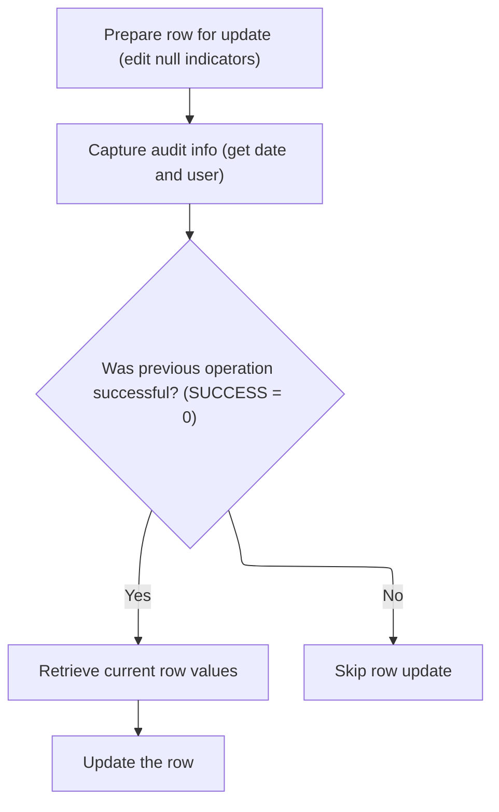
```mermaid
%%{init: {"flowchart": {"defaultRenderer": "elk"}} }%%
flowchart TD
    node1["Prepare row for update (edit null indicators)"]
    click node1 openCode "base/src/NNNS0573.cbl:446:446"
    node1 --> node2["Capture audit info (get date and user)"]
    click node2 openCode "base/src/NNNS0573.cbl:447:447"
    node2 --> node3{"Was previous operation successful? (SUCCESS = 0)"}
    click node3 openCode "base/src/NNNS0573.cbl:449:449"
    node3 -->|"Yes"| node4["Retrieve current row values"]
    click node4 openCode "base/src/NNNS0573.cbl:450:450"
    node4 --> node5["Update the row"]
    click node5 openCode "base/src/NNNS0573.cbl:451:451"
    node3 -->|"No"| node6["Skip row update"]
    click node6 openCode "base/src/NNNS0573.cbl:453:453"
classDef HeadingStyle fill:#777777,stroke:#333,stroke-width:2px;
```

<SwmSnippet path="/base/src/NNNS0573.cbl" line="422">

---

1400-EXIT-PUT-MODIFY-ROW edits null indicators, then fetches the current date and user info by calling 2040-GET-DATE-AND-USER. If that's successful, it grabs current values and runs the modify routine. Date and user info are needed for audit fields in the DB row.

```cobol
044500 1400-EXIT-PUT-MODIFY-ROW.                                        00044500
044600     PERFORM 1800-EDIT-NULL-INDICATORS                            00044600
044700     PERFORM 2040-GET-DATE-AND-USER                               00044700
044800                                                                  00044800
044900     IF SUCCESS                                                   00044900
045000       PERFORM 1405-GET-CURR-VALUES                               00045000
045100       PERFORM 1410-DO-MODIFY-ROW                                 00045100
045200     END-IF                                                       00045200
045300     .                                                            00045300
```

---

</SwmSnippet>

<SwmSnippet path="/base/src/NNNS0573.cbl" line="611">

---

2040-GET-DATE-AND-USER calls Z-DATE-FUNCTIONS to get the date, then if successful and in CICS, calls Z-GET-CICS-USER-ID for the user. If either fails, it sets the user ID to 'NNNS0573' as a fallback.

```cobol
063100 2040-GET-DATE-AND-USER.                                          00063100
063200     CALL Z-DATE-FUNCTIONS USING                                  00063200
063300         XXXN001A                                                 00063300
063400         YYYC0127                                                 00063400
063500                                                                  00063500
063600     IF  SUCCESS                                                  00063600
063700     AND YYYN005A-CICS-ENV                                        00063700
063800     CALL Z-GET-CICS-USER-ID USING                                00063800
063900         EIBLK    WS-DUMMY                                        00063900
064000         XXXN001A YYYC0107                                        00064000
064100     ELSE                                                         00064100
064200       MOVE 'NNNS0573' TO YYYC0107-USER                           00064200
064300     END-IF                                                       00064300
064400     .                                                            00064400
```

---

</SwmSnippet>

### Updating Department Row and Staging Events

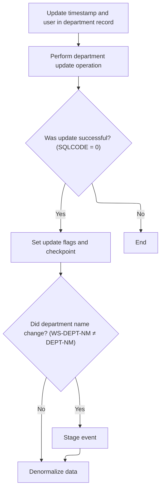
```mermaid
%%{init: {"flowchart": {"defaultRenderer": "elk"}} }%%
flowchart TD
    node1["Update timestamp and user in department record"]
    click node1 openCode "base/src/NNNS0573.cbl:453:454"
    node1 --> node2["Perform department update operation"]
    click node2 openCode "base/src/NNNS0573.cbl:456:456"
    node2 --> node3{"Was update successful? (SQLCODE = 0)"}
    click node3 openCode "base/src/NNNS0573.cbl:458:458"
    node3 -->|"Yes"| node4["Set update flags and checkpoint"]
    click node4 openCode "base/src/NNNS0573.cbl:459:462"
    node4 --> node5{"Did department name change? (WS-DEPT-NM ≠ DEPT-NM)"}
    click node5 openCode "base/src/NNNS0573.cbl:463:463"
    node5 -->|"Yes"| node6["Stage event"]
    click node6 openCode "base/src/NNNS0573.cbl:464:464"
    node6 --> node7["Denormalize data"]
    click node7 openCode "base/src/NNNS0573.cbl:466:466"
    node5 -->|"No"| node7
    node3 -->|"No"| node8["End"]
    click node8 openCode "base/src/NNNS0573.cbl:468:468"
classDef HeadingStyle fill:#777777,stroke:#333,stroke-width:2px;
```

<SwmSnippet path="/base/src/NNNS0573.cbl" line="452">

---

This routine updates the row, sets flags, and triggers event processing if the name changed.

```cobol
047500 1410-DO-MODIFY-ROW.                                              00047500
047600     MOVE YYYC0127-TS   TO LST-UPDT-TS     OF DCLXXX-DEPT         00047600
047700     MOVE YYYC0107-USER TO LST-UPDT-USR-ID OF DCLXXX-DEPT         00047700
047800                                                                  00047800
047900     PERFORM 5000-CALL-NNNS0573-CUD-ROUTINE                       00047900
048000                                                                  00048000
048100     IF SQLCODE = 0                                               00048100
048200       MOVE 1 TO WS-CHECKPOINT-INC                                00048200
048300       SET YYYN110A-UPD TO TRUE                                   00048300
048400       SET STD-UPD TO TRUE                                        00048400
048500       SET MODIFY-OPERATION     TO TRUE                           00048500
048600       IF (WS-DEPT-NM        NOT = DEPT-NM OF DCLXXX-DEPT)        00048600
048700          SET STAGE-EVENT TO TRUE                                 00048700
048800       END-IF                                                     00048800
048900       PERFORM 2000-DENORM-PROCESS                                00048900
049000     END-IF                                                       00049000
049100     .                                                            00049100
```

---

</SwmSnippet>

### Triggering Business Events for Department Changes

<SwmSnippet path="/base/src/NNNS0573.cbl" line="554">

---

2000-DENORM-PROCESS copies system environment data, then calls the control subroutine to handle business logic. If that succeeds, it issues business events for the department change.

```cobol
057400 2000-DENORM-PROCESS.                                             00057400
057500     MOVE YYYN005A-SYS-ENV      TO YYYN110A-SYS-ENV               00057500
057600     PERFORM 2010-CALL-CONTROL-SUBR                               00057600
057700     IF SUCCESS                                                   00057700
057800        PERFORM 2030-ISSUE-EVENTS                                 00057800
057900     END-IF                                                       00057900
058000     .                                                            00058000
```

---

</SwmSnippet>

### Running Control Logic for Master Data Events

<SwmSnippet path="/base/src/NNNS0573.cbl" line="563">

---

2010-CALL-CONTROL-SUBR sets the GET-TASK flag and calls WWWS0100-CONTROL-SUBR to handle workflow management for master data events. This gets the current workflow state for downstream event logic.

```cobol
058300 2010-CALL-CONTROL-SUBR.                                          00058300
058400     SET WWWC0100-GET-TASK  TO TRUE                               00058400
058500     CALL WWWS0100-CONTROL-SUBR USING                             00058500
058600         XXXN001A                                                 00058600
058700         WWWC0100                                                 00058700
058800     .                                                            00058800
```

---

</SwmSnippet>

### Master Data Workflow Task Handling

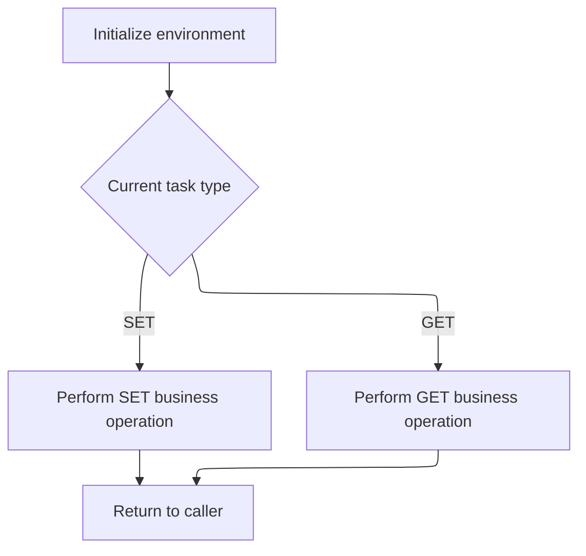
```mermaid
%%{init: {"flowchart": {"defaultRenderer": "elk"}} }%%
flowchart TD
    node1["Initialize environment"]
    click node1 openCode "base/src/WWWS0100.cbl:55:57"
    node1 --> node2{"Current task type"}
    click node2 openCode "base/src/WWWS0100.cbl:41:46"
    node2 -->|"SET"| node3["Perform SET business operation"]
    click node3 openCode "base/src/WWWS0100.cbl:43:43"
    node2 -->|"GET"| node4["Perform GET business operation"]
    click node4 openCode "base/src/WWWS0100.cbl:45:45"
    node3 --> node5["Return to caller"]
    click node5 openCode "base/src/WWWS0100.cbl:48:49"
    node4 --> node5
classDef HeadingStyle fill:#777777,stroke:#333,stroke-width:2px;
```

<SwmSnippet path="/base/src/WWWS0100.cbl" line="38">

---

000-MAIN in base/src/WWWS0100.cbl runs initialization, then checks which task flag is set and runs the right subroutine for workflow management. Only one flag should be set at a time.

```cobol
011700 000-MAIN.                                                        00011700
011800     PERFORM 100-INITIALIZE                                       00011800
011900                                                                  00011900
012300     EVALUATE TRUE                                                00012300
012400       WHEN WWWC0100-SET-TASK                                     00012400
012500         PERFORM 200-SET-TASK                                     00012500
012600       WHEN WWWC0100-GET-TASK                                     00012600
012700         PERFORM 300-GET-TASK                                     00012700
013800     END-EVALUATE                                                 00013800
014100                                                                  00014100
014200     GOBACK                                                       00014200
014300     .                                                            00014300
```

---

</SwmSnippet>

<SwmSnippet path="/base/src/WWWS0100.cbl" line="55">

---

100-INITIALIZE just resets the XXXN001A structure for master data workflow. There’s no other logic or side effect in the snippet, so it’s a straight-up structure clear before any workflow task handling.

```cobol
014900 100-INITIALIZE.                                                  00014900
015800     INITIALIZE XXXN001A                                          00015800
017000     .                                                            00017000
```

---

</SwmSnippet>

### Staging and Issuing Department Events

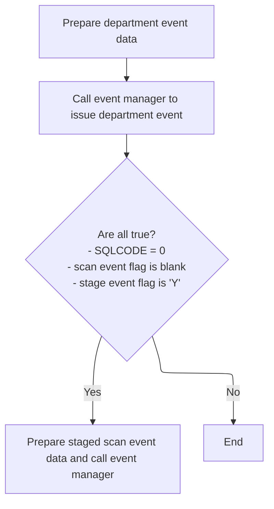
```mermaid
%%{init: {"flowchart": {"defaultRenderer": "elk"}} }%%
flowchart TD
    node1["Prepare department event data"] --> node2["Call event manager to issue department event"]
    click node1 openCode "base/src/NNNS0573.cbl:59400:60800"
    click node2 openCode "base/src/NNNS0573.cbl:60900:61300"
    node2 --> node3{"Are all true?
- SQLCODE = 0
- scan event flag is blank
- stage event flag is 'Y'"}
    click node3 openCode "base/src/NNNS0573.cbl:61400:61500"
    node3 -->|"Yes"| node4["Prepare staged scan event data and call event manager"]
    click node4 openCode "base/src/NNNS0573.cbl:61600:62600"
    node3 -->|"No"| node5["End"]
    click node5 openCode "base/src/NNNS0573.cbl:62800:62800"
classDef HeadingStyle fill:#777777,stroke:#333,stroke-width:2px;
```

<SwmSnippet path="/base/src/NNNS0573.cbl" line="573">

---

2030-ISSUE-EVENTS sets up department event data, assigns transaction and program IDs, and calls ZZZS0197-EVENT-MGR to stage the event. If the first call succeeds and certain flags are set, it updates the event data and calls the event manager again to handle scan events. The call to base/src/ZZZS0197.cbl is needed because that program actually filters, deduplicates, and issues the event downstream.

```cobol
059300 2030-ISSUE-EVENTS.                                               00059300
059400     INITIALIZE ZZZC0550                                          00059400
059500     SET YYYN110A-ORACLE    TO TRUE                               00059500
059600     SET DEPARTMENT-EVENT   TO TRUE                               00059600
059700     MOVE XXX-DEPT-NBR OF P-DDDTDP01                              00059700
059800       TO XXX-DEPT-NBR OF ZZZC0125                                00059800
059900          XXX-DEPT-NBR      OF ZZZC0550-DEPT-DATA                 00059900
060000     MOVE STR-SUB-DEPT-ID OF P-DDDTDP01                           00060000
060100       TO STR-SUB-DEPT-ID OF ZZZC0125                             00060100
060200          STR-SUB-DEPT-ID   OF ZZZC0550-DEPT-DATA                 00060200
060300                                                                  00060300
060400     MOVE 'SDPM'                TO ZZZC0197-TRX-ID                00060400
060500     MOVE ZZZC0125              TO ZZZC0197-TRX-REC               00060500
060600     MOVE 'XXXS0512'            TO ZZZC0197-PROGRAM               00060600
060700     MOVE '    '                TO ZZZC0197-USER                  00060700
060800     MOVE YYYN005A-SYS-ENV      TO YYYN110A-SYS-ENV               00060800
060900     CALL ZZZS0197-EVENT-MGR USING                                00060900
061000          XXXN001A                                                00061000
061100          YYYN110A                                                00061100
061200          ZZZC0197                                                00061200
061300                                                                  00061300
061400     IF SQLCODE = 0 AND WWWC0100-CREATE-SCAN-EVENT AND            00061400
061500        STAGE-EVENT                                               00061500
061600         SET  MODIFY-OPERATION      TO TRUE                       00061600
061700         MOVE ZZZC0550              TO ZZZC0197-TRX-REC           00061700
061800         MOVE ZZZC0550-TRX          TO ZZZC0197-TRX-ID            00061800
061900                                       ZZZC0197-TRX-CD            00061900
062000         MOVE 'NNNS0573'            TO ZZZC0197-PROGRAM           00062000
062100         MOVE YYYC0107-USER         TO ZZZC0197-USER              00062100
062200         MOVE YYYN005A-SYS-ENV      TO YYYN110A-SYS-ENV           00062200
062300         CALL ZZZS0197-EVENT-MGR USING                            00062300
062400              XXXN001A                                            00062400
062500              YYYN110A                                            00062500
062600              ZZZC0197                                            00062600
062700     END-IF                                                       00062700
062800     .                                                            00062800
```

---

</SwmSnippet>

### Filtering and Issuing Master Data Events

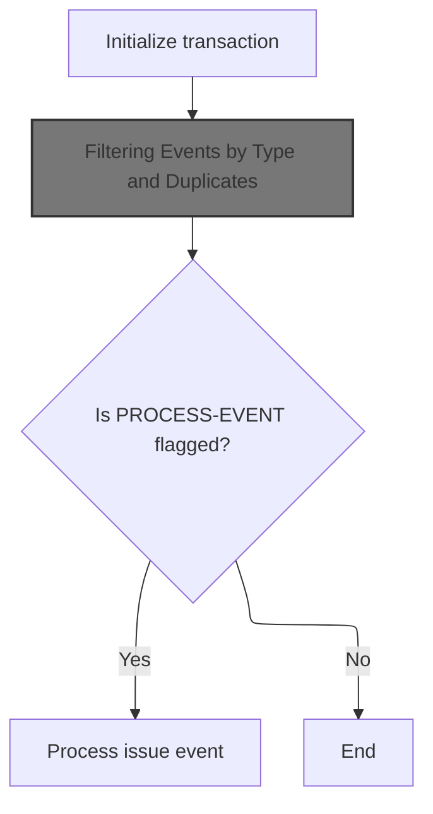
```mermaid
%%{init: {"flowchart": {"defaultRenderer": "elk"}} }%%
flowchart TD
    node1["Initialize transaction"] --> node2["Filtering Events by Type and Duplicates"]
    click node1 openCode "base/src/ZZZS0197.cbl:57:59"
    
    node2 --> node3{"Is PROCESS-EVENT flagged?"}
    click node3 openCode "base/src/ZZZS0197.cbl:64:66"
    node3 -->|"Yes"| node4["Process issue event"]
    click node4 openCode "base/src/ZZZS0197.cbl:199:234"
    node3 -->|"No"| node5["End"]
    click node5 openCode "base/src/ZZZS0197.cbl:68:69"

classDef HeadingStyle fill:#777777,stroke:#333,stroke-width:2px;
click node2 goToHeading "Filtering Events by Type and Duplicates"
node2:::HeadingStyle
```

<SwmSnippet path="/base/src/ZZZS0197.cbl" line="57">

---

000-MAINLINE initializes the event system, skips filtering for 'CFIP' transaction IDs, runs event filtering for others, and only issues events if the PROCESS-EVENT flag is set. The call to ZZZS0197.cbl is what actually filters and issues master data events downstream.

```cobol
008400 000-MAINLINE.                                                    00008400
008500     PERFORM 100-INITIALIZE                                       00008500
008600                                                                  00008600
008700*    IF  ZZZC0197-TRX-ID NOT = 'CFIP'                             00008700
008800       PERFORM 200-WEED-EVENT                                     00008800
008900*    END-IF                                                       00008900
009000                                                                  00009000
009100     IF PROCESS-EVENT                                             00009100
009200       PERFORM 300-ISSUE-EVENT                                    00009200
009300     END-IF                                                       00009300
009400                                                                  00009400
009500     GOBACK                                                       00009500
009600     .                                                            00009600
```

---

</SwmSnippet>

#### Filtering Events by Type and Duplicates

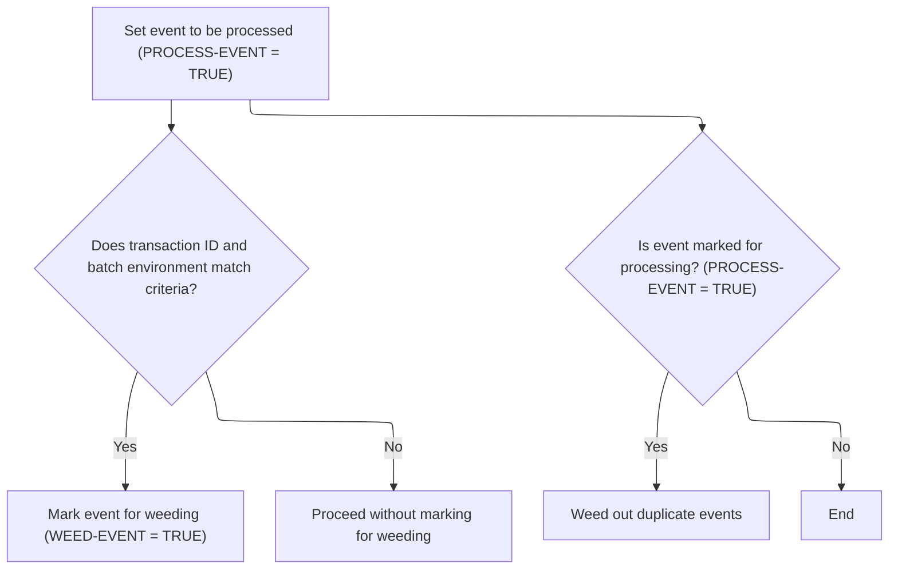
```mermaid
%%{init: {"flowchart": {"defaultRenderer": "elk"}} }%%
flowchart TD
    node1["Set event to be processed (PROCESS-EVENT = TRUE)"] --> node2{"Does transaction ID and batch environment match criteria?"}
    click node1 openCode "base/src/ZZZS0197.cbl:117:117"
    node2 -->|"Yes"| node3["Mark event for weeding (WEED-EVENT = TRUE)"]
    click node2 openCode "base/src/ZZZS0197.cbl:126:184"
    click node3 openCode "base/src/ZZZS0197.cbl:185:185"
    node2 -->|"No"| node4["Proceed without marking for weeding"]
    click node4 openCode "base/src/ZZZS0197.cbl:118:118"
    node1 --> node5{"Is event marked for processing? (PROCESS-EVENT = TRUE)"}
    click node5 openCode "base/src/ZZZS0197.cbl:119:119"
    node5 -->|"Yes"| node6["Weed out duplicate events"]
    click node6 openCode "base/src/ZZZS0197.cbl:120:120"
    node5 -->|"No"| node7["End"]
    click node7 openCode "base/src/ZZZS0197.cbl:122:122"

classDef HeadingStyle fill:#777777,stroke:#333,stroke-width:2px;
```

<SwmSnippet path="/base/src/ZZZS0197.cbl" line="89">

---

200-WEED-EVENT filters events by type and batch mode, then checks for duplicates before allowing them to be processed.

```cobol
011600 200-WEED-EVENT.                                                  00011600
011700     SET PROCESS-EVENT TO TRUE                                    00011700
011800     PERFORM 210-WEED-BY-HARD-CODE                                00011800
011900     IF PROCESS-EVENT                                             00011900
012000       PERFORM 220-WEED-DUP-EVENTS                                00012000
012100     END-IF                                                       00012100
012200     .                                                            00012200
```

---

</SwmSnippet>

<SwmSnippet path="/base/src/ZZZS0197.cbl" line="98">

---

210-WEED-BY-HARD-CODE checks if the transaction ID matches any in a long hard-coded list and if the environment is batch. If both match, it sets the WEED-EVENT flag so the event can be processed further. This is a brute-force membership check, not a data-driven one.

```cobol
012500 210-WEED-BY-HARD-CODE.                                           00012500
012600     IF  (ZZZC0197-TRX-ID = 'BVLM'                                00012600
012700*      OR ZZZC0197-TRX-ID = 'APLM'                                00012700
012800*      OR ZZZC0197-TRX-ID = 'BDMM'                                00012800
012900*      OR ZZZC0197-TRX-ID = 'BCAM'                                00012900
013000*      OR ZZZC0197-TRX-ID = 'CCSM'                                00013000
013100*      OR ZZZC0197-TRX-ID = 'CEMM'                                00013100
013200       OR ZZZC0197-TRX-ID = 'CNCM'                                00013200
013300*      OR ZZZC0197-TRX-ID = 'COMM'                                00013300
013400*      OR ZZZC0197-TRX-ID = 'CRCM'                                00013400
013500*      OR ZZZC0197-TRX-ID = 'CSCM'                                00013500
013600*      OR ZZZC0197-TRX-ID = 'CTOM'                                00013600
013700*      OR ZZZC0197-TRX-ID = 'DIRM'                                00013700
013800*      OR ZZZC0197-TRX-ID = 'DISM'                                00013800
013900*      OR ZZZC0197-TRX-ID = 'DSDM'                                00013900
014000*      OR ZZZC0197-TRX-ID = 'FINM'                                00014000
014100*      OR ZZZC0197-TRX-ID = 'ICCM'                                00014100
014200*      OR ZZZC0197-TRX-ID = 'ITMM'                                00014200
014300       OR ZZZC0197-TRX-ID = 'IWVM'                                00014300
014400*      OR ZZZC0197-TRX-ID = 'LOBM'                                00014400
014500*      OR ZZZC0197-TRX-ID = 'MCEM'                                00014500
014600*      OR ZZZC0197-TRX-ID = 'MRGM'                                00014600
014700       OR ZZZC0197-TRX-ID = 'OBSM'                                00014700
014800*      OR ZZZC0197-TRX-ID = 'ORBM'                                00014800
014900       OR ZZZC0197-TRX-ID = 'PBCM'                                00014900
015000*      OR ZZZC0197-TRX-ID = 'PBNM'                                00015000
015100       OR ZZZC0197-TRX-ID = 'PBTM'                                00015100
015200*      OR ZZZC0197-TRX-ID = 'PCCM'                                00015200
015300*      OR ZZZC0197-TRX-ID = 'PCTM'                                00015300
015400*      OR ZZZC0197-TRX-ID = 'PDSH'                                00015400
015500*      OR ZZZC0197-TRX-ID = 'PDUA'                                00015500
015600*      OR ZZZC0197-TRX-ID = 'PDUP'                                00015600
015700       OR ZZZC0197-TRX-ID = 'PIPM'                                00015700
015800*      OR ZZZC0197-TRX-ID = 'PRIM'                                00015800
015900*      OR ZZZC0197-TRX-ID = 'PRMM'                                00015900
016000*      OR ZZZC0197-TRX-ID = 'PRRM'                                00016000
016100       OR ZZZC0197-TRX-ID = 'PSBM'                                00016100
016200*      OR ZZZC0197-TRX-ID = 'PSCM'                                00016200
016300       OR ZZZC0197-TRX-ID = 'RARM'                                00016300
016400       OR ZZZC0197-TRX-ID = 'RFTM'                                00016400
016500       OR ZZZC0197-TRX-ID = 'RITM'                                00016500
016600       OR ZZZC0197-TRX-ID = 'RRFM'                                00016600
016700       OR ZZZC0197-TRX-ID = 'RTDM'                                00016700
016800*      OR ZZZC0197-TRX-ID = 'RTTM'                                00016800
016900       OR ZZZC0197-TRX-ID = 'SCAM'                                00016900
017000*      OR ZZZC0197-TRX-ID = 'SDPM'                                00017000
017100*      OR ZZZC0197-TRX-ID = 'SLDM'                                00017100
017200       OR ZZZC0197-TRX-ID = 'STAM'                                00017200
017300*      OR ZZZC0197-TRX-ID = 'STPM'                                00017300
017400*      OR ZZZC0197-TRX-ID = 'STRM'                                00017400
017500       OR ZZZC0197-TRX-ID = 'STTM'                                00017500
017600*      OR ZZZC0197-TRX-ID = 'T2TM'                                00017600
017700       OR ZZZC0197-TRX-ID = 'TRDM'                                00017700
017800*      OR ZZZC0197-TRX-ID = 'VCMM'                                00017800
017900*      OR ZZZC0197-TRX-ID = 'VENM'                                00017900
018000*      OR ZZZC0197-TRX-ID = 'VISM'                                00018000
018100*      OR ZZZC0197-TRX-ID = 'VLIM'                                00018100
018200*      OR ZZZC0197-TRX-ID = 'WHSM'                                00018200
018300       OR ZZZC0197-TRX-ID = 'WLIM')                               00018300
018400       AND YYYN110A-BATCH-ENV                                     00018400
018500         SET WEED-EVENT TO TRUE                                   00018500
018600     END-IF                                                       00018600
018700     .                                                            00018700
```

---

</SwmSnippet>

#### Staging Master Data Events

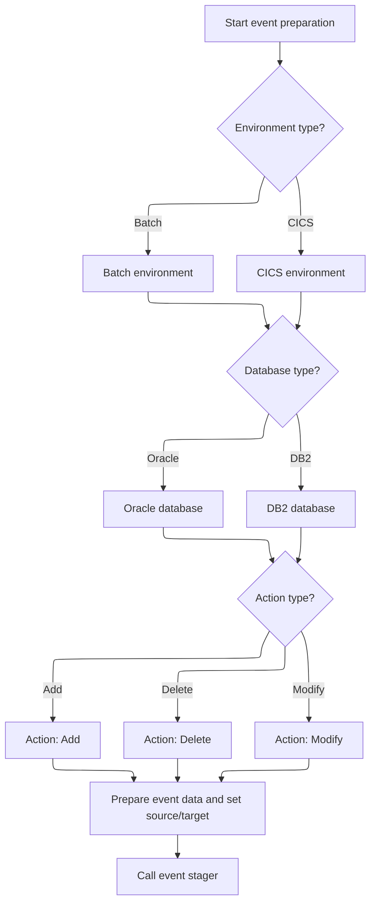
```mermaid
%%{init: {"flowchart": {"defaultRenderer": "elk"}} }%%
flowchart TD
  node1["Start event preparation"]
  click node1 openCode "base/src/ZZZS0197.cbl:22600:22700"
  node1 --> node2{"Environment type?"}
  click node2 openCode "base/src/ZZZS0197.cbl:22900:23300"
  node2 -->|"Batch"| node3["Batch environment"]
  node2 -->|"CICS"| node4["CICS environment"]
  node3 --> node5{"Database type?"}
  node4 --> node5
  click node5 openCode "base/src/ZZZS0197.cbl:23310:23350"
  node5 -->|"Oracle"| node6["Oracle database"]
  node5 -->|"DB2"| node7["DB2 database"]
  node6 --> node8{"Action type?"}
  node7 --> node8
  click node8 openCode "base/src/ZZZS0197.cbl:23700:24400"
  node8 -->|"Add"| node9["Action: Add"]
  node8 -->|"Delete"| node10["Action: Delete"]
  node8 -->|"Modify"| node11["Action: Modify"]
  node9 --> node12["Prepare event data and set source/target"]
  node10 --> node12
  node11 --> node12
  click node12 openCode "base/src/ZZZS0197.cbl:23500:25100"
  node12 --> node13["Call event stager"]
  click node13 openCode "base/src/ZZZS0197.cbl:25200:25500"
classDef HeadingStyle fill:#777777,stroke:#333,stroke-width:2px;
```

<SwmSnippet path="/base/src/ZZZS0197.cbl" line="199">

---

300-ISSUE-EVENT sets up event context and calls the stager to queue the event.

```cobol
022600 300-ISSUE-EVENT.                                                 00022600
022700     INITIALIZE YYYC0175                                          00022700
022800                                                                  00022800
022900     IF YYYN110A-BATCH-ENV                                        00022900
023000       SET YYYC0175-BATCH-ENV TO TRUE                             00023000
023100     ELSE                                                         00023100
023200       SET YYYC0175-CICS-ENV  TO TRUE                             00023200
023300     END-IF                                                       00023300
023301                                                                  00023301
023310     IF YYYN110A-ORACLE                                           00023310
023320       SET YYYC0175-ORACLE    TO TRUE                             00023320
023330     ELSE                                                         00023330
023340       SET YYYC0175-DB2       TO TRUE                             00023340
023350     END-IF                                                       00023350
023400                                                                  00023400
023500     MOVE ZZZC0197-TRX-ID  TO YYYC0175-TRX-CD                     00023500
023600     MOVE ZZZC0197-TRX-REC TO YYYC0175-DATA                       00023600
023700     EVALUATE TRUE                                                00023700
023800       WHEN YYYN110A-ADD                                          00023800
023900         MOVE 'A' TO YYYC0175-ACTION-CD                           00023900
024000       WHEN YYYN110A-DEL                                          00024000
024100         MOVE 'P' TO YYYC0175-ACTION-CD                           00024100
024200       WHEN OTHER                                                 00024200
024300         MOVE 'M' TO YYYC0175-ACTION-CD                           00024300
024400     END-EVALUATE                                                 00024400
024500                                                                  00024500
024600     MOVE ZZZC0197-PROGRAM TO YYYC0175-CALLING-PROG               00024600
024700     MOVE ZZZC0197-USER    TO YYYC0175-CALLING-USER               00024700
024800                                                                  00024800
024900     SET  YYYC0175-SOURCE-WMS       TO TRUE                       00024900
025000     SET  YYYC0175-TARGET-MAINFRAME TO TRUE                       00025000
025100                                                                  00025100
025200     CALL WS-EVENT-STAGER USING                                   00025200
025300         XXXN001A                                                 00025300
025400         YYYC0175                                                 00025400
025500     .                                                            00025500
```

---

</SwmSnippet>

### Inserting Department Rows and Triggering Events

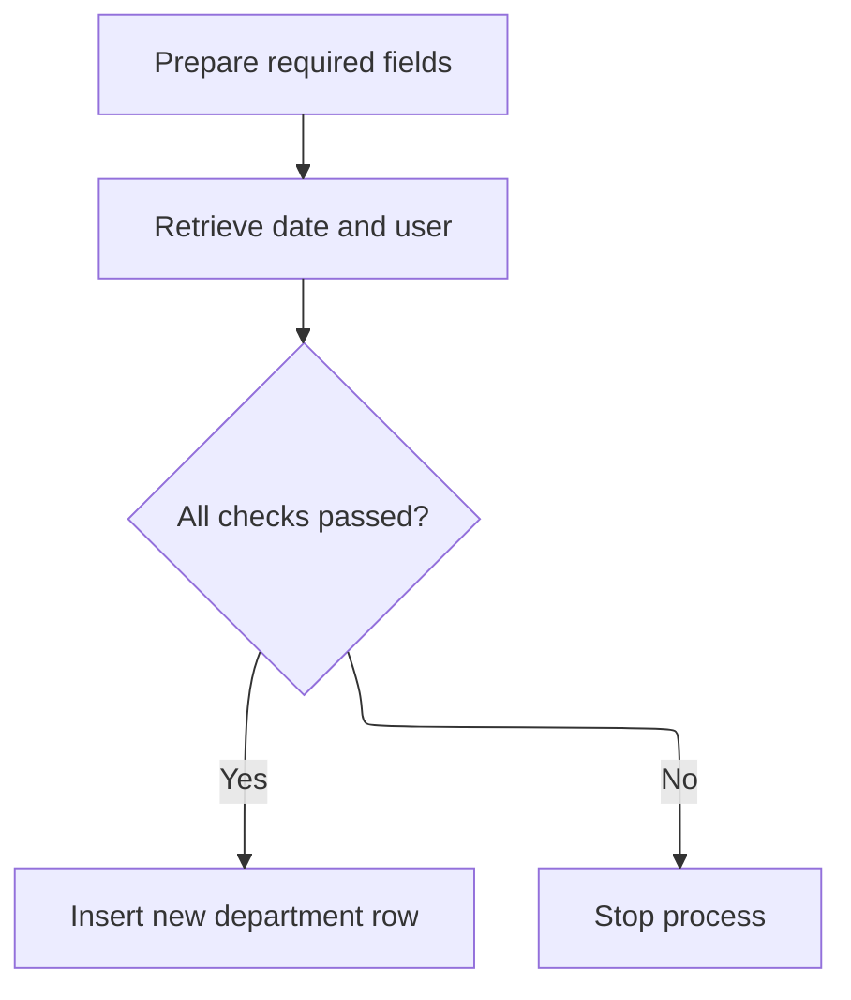
```mermaid
%%{init: {"flowchart": {"defaultRenderer": "elk"}} }%%
flowchart TD
    node1["Prepare required fields"] --> node2["Retrieve date and user"]
    click node1 openCode "base/src/NNNS0573.cbl:495:495"
    node2 --> node3{"All checks passed?"}
    click node2 openCode "base/src/NNNS0573.cbl:497:497"
    node3 -->|"Yes"| node4["Insert new department row"]
    click node3 openCode "base/src/NNNS0573.cbl:498:500"
    click node4 openCode "base/src/NNNS0573.cbl:499:499"
    node3 -->|"No"| node5["Stop process"]
    click node5 openCode "base/src/NNNS0573.cbl:500:500"

classDef HeadingStyle fill:#777777,stroke:#333,stroke-width:2px;
```

<SwmSnippet path="/base/src/NNNS0573.cbl" line="471">

---

1500-EXIT-PUT-INSERT-ROW edits null indicators, fetches the current date and user, and if successful, inserts the department row. The call to 2040-GET-DATE-AND-USER is needed to get audit info for the new row.

```cobol
049400 1500-EXIT-PUT-INSERT-ROW.                                        00049400
049500     PERFORM 1800-EDIT-NULL-INDICATORS                            00049500
049600                                                                  00049600
049700     PERFORM 2040-GET-DATE-AND-USER                               00049700
049800     IF SUCCESS                                                   00049800
049900       PERFORM 1510-D0-INSERT-ROW                                 00049900
050000     END-IF                                                       00050000
050100     .                                                            00050100
```

---

</SwmSnippet>

<SwmSnippet path="/base/src/NNNS0573.cbl" line="481">

---

1510-D0-INSERT-ROW inserts the row, sets flags, and triggers event processing if the insert worked.

```cobol
050400 1510-D0-INSERT-ROW.                                              00050400
050500     PERFORM 1520-EXIT-GET-ORG-ID                                 00050500
050600     IF SUCCESS                                                   00050600
050700       MOVE YYYC0127-TS   TO LST-UPDT-TS     OF DCLXXX-DEPT       00050700
050800       MOVE YYYC0107-USER TO LST-UPDT-USR-ID OF DCLXXX-DEPT       00050800
050900                                                                  00050900
051000       PERFORM 5000-CALL-NNNS0573-CUD-ROUTINE                     00051000
051100                                                                  00051100
051200       IF SQLCODE = 0                                             00051200
051300         MOVE 1 TO WS-CHECKPOINT-INC                              00051300
051400         SET YYYN110A-ADD TO TRUE                                 00051400
051500         SET STD-ADD TO TRUE                                      00051500
051600         PERFORM 2000-DENORM-PROCESS                              00051600
051700       END-IF                                                     00051700
051800     END-IF                                                       00051800
051900     .                                                            00051900
```

---

</SwmSnippet>

### Purging Department Rows and Triggering Events

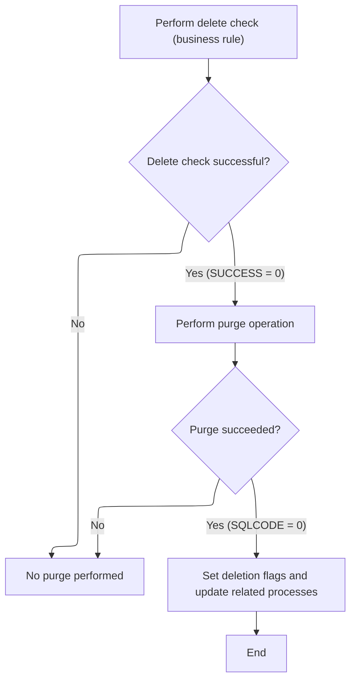
```mermaid
%%{init: {"flowchart": {"defaultRenderer": "elk"}} }%%
flowchart TD
    node1["Perform delete check (business rule)"] --> node2{"Delete check successful?"}
    click node1 openCode "base/src/NNNS0573.cbl:521:522"
    node2 -->|"Yes (SUCCESS = 0)"| node3["Perform purge operation"]
    click node2 openCode "base/src/NNNS0573.cbl:522:523"
    node2 -->|"No"| node6["No purge performed"]
    click node6 openCode "base/src/NNNS0573.cbl:532:532"
    node3 --> node4{"Purge succeeded?"}
    click node3 openCode "base/src/NNNS0573.cbl:523:525"
    node4 -->|"Yes (SQLCODE = 0)"| node5["Set deletion flags and update related processes"]
    click node4 openCode "base/src/NNNS0573.cbl:525:530"
    node4 -->|"No"| node6
    node5 --> node7["End"]
    click node5 openCode "base/src/NNNS0573.cbl:526:530"
    click node7 openCode "base/src/NNNS0573.cbl:532:532"

classDef HeadingStyle fill:#777777,stroke:#333,stroke-width:2px;
```

<SwmSnippet path="/base/src/NNNS0573.cbl" line="519">

---

1600-EXIT-PUT-PURGE-ROW checks delete rules, deletes the row, sets flags, and triggers event processing if the delete worked.

```cobol
054200 1600-EXIT-PUT-PURGE-ROW.                                         00054200
054300                                                                  00054300
054310     PERFORM 4500-CALL-MMMS0304-RI-DEL-CHK                        00054310
054320     IF SUCCESS                                                   00054320
054400       PERFORM 5000-CALL-NNNS0573-CUD-ROUTINE                     00054400
054500                                                                  00054500
054600       IF SQLCODE = 0                                             00054600
054700         MOVE 1 TO WS-CHECKPOINT-INC                              00054700
054800         SET YYYN110A-DEL TO TRUE                                 00054800
054900         SET STD-DEL TO TRUE                                      00054900
055000         PERFORM 2000-DENORM-PROCESS                              00055000
055100       END-IF                                                     00055100
055110     END-IF                                                       00055110
055200     .                                                            00055200
```

---

</SwmSnippet>

&nbsp;

*This is an auto-generated document by Swimm 🌊 and has not yet been verified by a human*

<SwmMeta version="3.0.0" repo-id="Z2l0aHViJTNBJTNBU3dpbW1pby1keW5jYWxsLWRlbW8lM0ElM0FHaXJpLVN3aW1t" repo-name="Swimmio-dyncall-demo"><sup>Powered by [Swimm](https://app.swimm.io/)</sup></SwmMeta>
