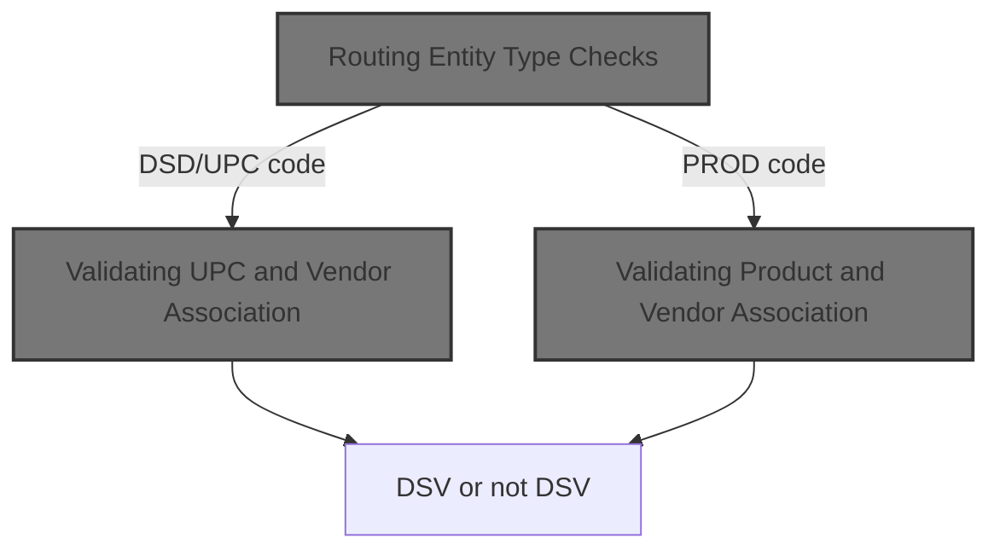
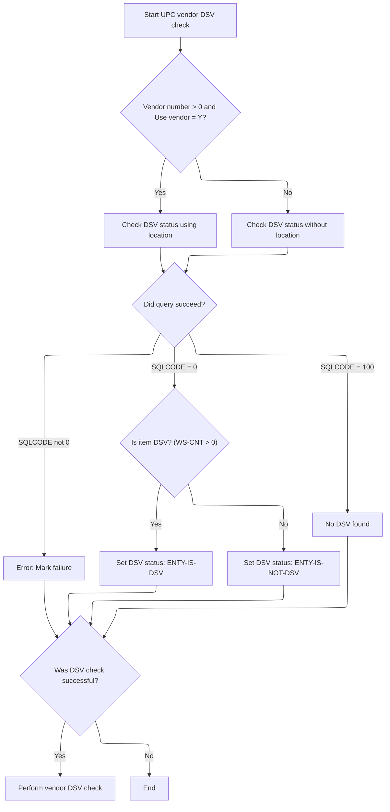
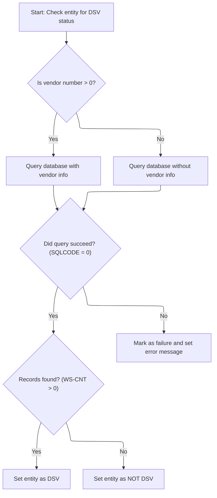

This document outlines how the system determines whether an item or product is associated with a direct store vendor. The flow uses the entity type code to select the appropriate validation path and outputs whether the entity is considered DSV, supporting routing and vendor management.



# Spec

## Detailed View of the Program's Functionality

a. Main Routing Logic

The program begins execution in its main routine. After initialization, it determines which type of check to perform based on a function code provided as input. If the function is to check if a vendor is a direct store vendor (DSV), it performs a vendor DSV check. If the function is to check if an item (entity) is DSV, it performs an entity DSV check. If the function code is invalid, it marks the operation as a failure and sets an error message.

b. Initialization

During initialization, the program resets output and status fields to their default values, indicating that neither the entity nor the vendor is a DSV by default, and that the entity exists. It also ensures that the vendor type code is set to a default value if not already provided. The initialization includes validation: if required vendor or entity information is missing or invalid, it marks the operation as a failure and sets an appropriate error message.

c. Routing Entity Type Checks

When checking if an entity is a DSV, the program evaluates the type of item key code provided. If the code indicates a DSD (Direct Store Delivery) or UPC (Universal Product Code) type, it proceeds to validate the UPC and vendor association. If the code indicates a product type, it checks the product-vendor association. The logic does not handle unknown codes and assumes the input is valid.

d. Validating UPC and Vendor Association

For DSD or UPC types, the program prepares the relevant item and location data, then checks if the UPC and vendor combination is associated with a DSV. This check involves querying the database, with the query structure depending on whether a vendor number is present and a flag indicating if the vendor should be checked. If both vendor number and the flag are set, the query joins several tables to count matching records for the UPC, vendor, and location. If not, a simpler query is used.

After the query, the program evaluates the result:

- If the query succeeds and records are found, it marks the entity as a DSV.
- If the query succeeds but no records are found, it marks the entity as not a DSV.
- If the query returns a "not found" code, it resets the code to neutral.
- If the query fails, it marks the operation as a failure and logs an error message.

Regardless of the outcome, it always checks if the UPC exists in the system by running another query. If the initial DSV check was successful, it then performs an additional vendor DSV check.

e. Vendor DSV Check

This check validates whether the vendor is associated with a DSV location. It queries the database for a count of matching records based on the vendor and location information. If records are found, it marks the vendor as a DSV; otherwise, it marks the vendor as not a DSV. If the query fails, it marks the operation as a failure and logs an error message.

f. Validating Product and Vendor Association

For product-type entities, the program prepares the product and vendor data, then checks the association by querying the database. If a vendor number is present, the query joins several tables to count records matching the product, vendor, and location. If no vendor number is present, a simpler query is used.

After the query:

- If the query succeeds and records are found, it marks the entity as a DSV.
- If the query succeeds but no records are found, it marks the entity as not a DSV.
- If the query fails, it marks the operation as a failure and logs an error message.

g. Checking if UPC Exists

Whenever a UPC DSV check is performed, the program also checks if the UPC exists in the system by querying a scan code table. If the UPC is found, it marks the entity as existing; otherwise, it marks it as not existing. If the query fails, it marks the operation as a failure and logs an error message.

h. Error Handling

Throughout the process, if any database operation fails (other than a simple "not found" result), the program sets a failure flag and constructs a detailed error message including the error code. This ensures that any issues during validation are clearly reported back to the caller.

# Rule Definition

| Paragraph Name                                                                                                                | Rule ID | Category          | Description                                                                                                                                                                                                                                                                                                        | Conditions                                                                                                              | Remarks                                                                                                                                                                           |
| ----------------------------------------------------------------------------------------------------------------------------- | ------- | ----------------- | ------------------------------------------------------------------------------------------------------------------------------------------------------------------------------------------------------------------------------------------------------------------------------------------------------------------ | ----------------------------------------------------------------------------------------------------------------------- | --------------------------------------------------------------------------------------------------------------------------------------------------------------------------------- |
| 000-MAIN, 100-INITIALIZE, Linkage Section                                                                                     | RL-001  | Data Assignment   | The program must read the input record from the MMMC0711 structure, using the following fields: entity ID, entity type, vendor number, vendor type code, and function code.                                                                                                                                        | On program start, the input structure is passed in the USING clause and its fields are referenced throughout the logic. | Fields used: ENTY-ID (number), ENTY-TYP (string, 5 chars), VEND-NBR (number), VEND-TYP-CD (string, 1 char), FUNC (string, function code).                                         |
| 000-MAIN                                                                                                                      | RL-002  | Conditional Logic | The routing logic must use the value of MMMC0711-FUNC to determine whether to perform a vendor DSV check or an item DSV check.                                                                                                                                                                                     | MMMC0711-FUNC is checked for specific values indicating vendor or item DSV check.                                       | Function codes are mapped to internal flags (e.g., MMMC0711-IS-DSV-FUNC, MMMC0711-IS-DSV-ITEM-FUNC).                                                                              |
| 300-CHECK-ENTY-IS-DSV                                                                                                         | RL-003  | Conditional Logic | For item DSV checks, the program must use entity type to select the validation path: 'DSD  ' or 'UPC  ' for UPC/vendor validation, 'PRD  ' for product/vendor validation.                                                                                                                                          | MMMC0711-FUNC indicates item DSV check; ENTY-TYP is checked for 'DSD  ', 'UPC  ', or 'PRD  '.                           | Entity type codes: 'DSD  ', 'UPC  ', 'PRD  ' (5 chars, trailing spaces).                                                                                                          |
| 310-CHECK-UPC-VEND, 315-CHECK-UPC-IS-DSV                                                                                      | RL-004  | Computation       | For UPC/vendor DSV validation, the program checks if the vendor number is greater than zero and if the 'Use vendor' flag is true. Depending on this, it queries different tables and sets DSV status flags based on the query result.                                                                              | Entity type is 'DSD  ' or 'UPC  '; vendor number > 0 and 'Use vendor' flag is true or not.                              | DSV sub-type code: 'DSV  ' (5 chars); item key type code: 'DSD  ' (5 chars); queries AP_XXX_SUB_TYP, XXXD_LOC_ITM, XXXATION; sets ENTY-IS-DSV or ENTY-IS-NOT-DSV.                 |
| 320-CHECK-PROD-VEND                                                                                                           | RL-005  | Computation       | For product/vendor DSV validation, the program checks if the vendor number is present. If so, it queries AP_XXX_SUB_TYP, XXXD_LOC_ITM, XXXATION, and PROD_ITEM; otherwise, it queries AP_XXX_SUB_TYP, XXXD_LOC_ITM, and PROD_ITEM. Sets DSV status flags based on query result.                                    | Entity type is 'PRD  '; vendor number present or not.                                                                   | DSV sub-type code: 'DSV  ' (5 chars); queries AP_XXX_SUB_TYP, XXXD_LOC_ITM, XXXATION, PROD_ITEM; sets ENTY-IS-DSV or ENTY-IS-NOT-DSV.                                             |
| 200-CHECK-VEND-IS-DSV                                                                                                         | RL-006  | Computation       | For vendor DSV validation, the program queries AP_XXX_SUB_TYP and XXXATION, joining on location and AP fields, filtering for sub-type code 'DSV  ', and sets vendor DSV status flags based on the query result.                                                                                                    | MMMC0711-FUNC indicates vendor DSV check.                                                                               | DSV sub-type code: 'DSV  ' (5 chars); queries AP_XXX_SUB_TYP, XXXATION; sets VEND-IS-DSV or VEND-IS-NOT-DSV.                                                                      |
| 100-INITIALIZE, 200-CHECK-VEND-IS-DSV, 310-CHECK-UPC-VEND, 315-CHECK-UPC-IS-DSV, 320-CHECK-PROD-VEND, 315-CHECK-IF-UPC-EXISTS | RL-007  | Data Assignment   | The program must write the results to the output area of the MMMC0711 structure, setting the following flags and message: ENTY-IS-DSV, ENTY-IS-NOT-DSV, VEND-IS-DSV, VEND-IS-NOT-DSV, ENTY-EXISTS, ENTY-DOES-NOT-EXIST, FAILURE, IS-RTRN-MSG-TXT.                                                                  | After each validation and at program end.                                                                               | Output flags are boolean (true/false); IS-RTRN-MSG-TXT is a string (80 chars, left-aligned, padded with spaces).                                                                  |
| 200-CHECK-VEND-IS-DSV, 315-CHECK-UPC-IS-DSV, 320-CHECK-PROD-VEND, 315-CHECK-IF-UPC-EXISTS                                     | RL-008  | Conditional Logic | For all queries, if the SQL status code is 0, the program checks the accumulated result to determine DSV status; if the SQL status code is 100, it sets the entity as not DSV; if the SQL status code is any other value, it sets the FAILURE flag and provides an error message in the output error message area. | After each SQL query.                                                                                                   | SQL status code values: 0 (success), 100 (not found), other (error). Error message written to the output error message area (string, 80 chars, left-aligned, padded with spaces). |

# User Stories

## User Story 1: Read input and route to correct validation logic

---

### Story Description:

As a system, I want to read the input record from the MMMC0711 structure and use the function code to route to the correct DSV validation logic so that the program performs the appropriate vendor or item DSV check based on user request.

---

### Business Rule Mapping:

| Rule ID | Paragraph Name                            | Rule Description                                                                                                                                                            |
| ------- | ----------------------------------------- | --------------------------------------------------------------------------------------------------------------------------------------------------------------------------- |
| RL-001  | 000-MAIN, 100-INITIALIZE, Linkage Section | The program must read the input record from the MMMC0711 structure, using the following fields: entity ID, entity type, vendor number, vendor type code, and function code. |
| RL-002  | 000-MAIN                                  | The routing logic must use the value of MMMC0711-FUNC to determine whether to perform a vendor DSV check or an item DSV check.                                              |

---

### Relevant Functionality:

- **000-MAIN**
  1. **RL-001:**
     - On entry, receive MMMC0711 structure as input
     - Read ENTY-ID, ENTY-TYP, VEND-NBR, VEND-TYP-CD, FUNC from input structure
     - Use these fields for routing and validation
  2. **RL-002:**
     - If FUNC indicates vendor DSV, perform vendor DSV check
     - If FUNC indicates item DSV, perform item DSV check
     - Otherwise, set FAILURE flag and error message

## User Story 2: Perform item DSV validation (UPC or product) and set output flags

---

### Story Description:

As a system, I want to validate item DSV status for UPC/vendor or product/vendor associations based on entity type, execute the appropriate queries, interpret the results, and set the corresponding output flags and messages so that the user receives accurate DSV status and error information for items.

---

### Business Rule Mapping:

| Rule ID | Paragraph Name                                                                                                                | Rule Description                                                                                                                                                                                                                                                                                                   |
| ------- | ----------------------------------------------------------------------------------------------------------------------------- | ------------------------------------------------------------------------------------------------------------------------------------------------------------------------------------------------------------------------------------------------------------------------------------------------------------------ |
| RL-003  | 300-CHECK-ENTY-IS-DSV                                                                                                         | For item DSV checks, the program must use entity type to select the validation path: 'DSD  ' or 'UPC  ' for UPC/vendor validation, 'PRD  ' for product/vendor validation.                                                                                                                                          |
| RL-004  | 310-CHECK-UPC-VEND, 315-CHECK-UPC-IS-DSV                                                                                      | For UPC/vendor DSV validation, the program checks if the vendor number is greater than zero and if the 'Use vendor' flag is true. Depending on this, it queries different tables and sets DSV status flags based on the query result.                                                                              |
| RL-005  | 320-CHECK-PROD-VEND                                                                                                           | For product/vendor DSV validation, the program checks if the vendor number is present. If so, it queries AP_XXX_SUB_TYP, XXXD_LOC_ITM, XXXATION, and PROD_ITEM; otherwise, it queries AP_XXX_SUB_TYP, XXXD_LOC_ITM, and PROD_ITEM. Sets DSV status flags based on query result.                                    |
| RL-007  | 100-INITIALIZE, 200-CHECK-VEND-IS-DSV, 310-CHECK-UPC-VEND, 315-CHECK-UPC-IS-DSV, 320-CHECK-PROD-VEND, 315-CHECK-IF-UPC-EXISTS | The program must write the results to the output area of the MMMC0711 structure, setting the following flags and message: ENTY-IS-DSV, ENTY-IS-NOT-DSV, VEND-IS-DSV, VEND-IS-NOT-DSV, ENTY-EXISTS, ENTY-DOES-NOT-EXIST, FAILURE, IS-RTRN-MSG-TXT.                                                                  |
| RL-008  | 200-CHECK-VEND-IS-DSV, 315-CHECK-UPC-IS-DSV, 320-CHECK-PROD-VEND, 315-CHECK-IF-UPC-EXISTS                                     | For all queries, if the SQL status code is 0, the program checks the accumulated result to determine DSV status; if the SQL status code is 100, it sets the entity as not DSV; if the SQL status code is any other value, it sets the FAILURE flag and provides an error message in the output error message area. |

---

### Relevant Functionality:

- **300-CHECK-ENTY-IS-DSV**
  1. **RL-003:**
     - If ENTY-TYP is 'DSD  ' or 'UPC  ', perform UPC/vendor DSV validation
     - If ENTY-TYP is 'PRD  ', perform product/vendor DSV validation
- **310-CHECK-UPC-VEND**
  1. **RL-004:**
     - If vendor number > 0 and 'Use vendor' flag is true:
       - Query AP_XXX_SUB_TYP, XXXD_LOC_ITM, XXXATION with joins and filters
     - Else:
       - Query AP_XXX_SUB_TYP, XXXD_LOC_ITM with filters
     - If query returns count > 0, set ENTY-IS-DSV
     - Else, set ENTY-IS-NOT-DSV
     - Always check if UPC exists and set ENTY-EXISTS or ENTY-DOES-NOT-EXIST
- **320-CHECK-PROD-VEND**
  1. **RL-005:**
     - If vendor number present:
       - Query AP_XXX_SUB_TYP, XXXD_LOC_ITM, XXXATION, PROD_ITEM with joins and filters
     - Else:
       - Query AP_XXX_SUB_TYP, XXXD_LOC_ITM, PROD_ITEM with filters
     - If query returns count > 0, set ENTY-IS-DSV
     - Else, set ENTY-IS-NOT-DSV
- **100-INITIALIZE**
  1. **RL-007:**
     - Set output flags according to validation results
     - Write error messages to IS-RTRN-MSG-TXT as needed
     - Output structure is updated before program exit
- **200-CHECK-VEND-IS-DSV**
  1. **RL-008:**
     - If the SQL status code is 0:
       - If the accumulated result > 0, set DSV status flag
       - Else, set not DSV status flag
     - If the SQL status code is 100:
       - Set not DSV status flag
     - If the SQL status code is not 0 or 100:
       - Set FAILURE flag
       - Write error message to the output error message area

## User Story 3: Perform vendor DSV validation and set output flags

---

### Story Description:

As a system, I want to validate vendor DSV status by executing the appropriate queries, interpreting the results, and setting the corresponding output flags and messages so that the user receives accurate DSV status and error information for vendors.

---

### Business Rule Mapping:

| Rule ID | Paragraph Name                                                                                                                | Rule Description                                                                                                                                                                                                                                                                                                   |
| ------- | ----------------------------------------------------------------------------------------------------------------------------- | ------------------------------------------------------------------------------------------------------------------------------------------------------------------------------------------------------------------------------------------------------------------------------------------------------------------ |
| RL-006  | 200-CHECK-VEND-IS-DSV                                                                                                         | For vendor DSV validation, the program queries AP_XXX_SUB_TYP and XXXATION, joining on location and AP fields, filtering for sub-type code 'DSV  ', and sets vendor DSV status flags based on the query result.                                                                                                    |
| RL-008  | 200-CHECK-VEND-IS-DSV, 315-CHECK-UPC-IS-DSV, 320-CHECK-PROD-VEND, 315-CHECK-IF-UPC-EXISTS                                     | For all queries, if the SQL status code is 0, the program checks the accumulated result to determine DSV status; if the SQL status code is 100, it sets the entity as not DSV; if the SQL status code is any other value, it sets the FAILURE flag and provides an error message in the output error message area. |
| RL-007  | 100-INITIALIZE, 200-CHECK-VEND-IS-DSV, 310-CHECK-UPC-VEND, 315-CHECK-UPC-IS-DSV, 320-CHECK-PROD-VEND, 315-CHECK-IF-UPC-EXISTS | The program must write the results to the output area of the MMMC0711 structure, setting the following flags and message: ENTY-IS-DSV, ENTY-IS-NOT-DSV, VEND-IS-DSV, VEND-IS-NOT-DSV, ENTY-EXISTS, ENTY-DOES-NOT-EXIST, FAILURE, IS-RTRN-MSG-TXT.                                                                  |

---

### Relevant Functionality:

- **200-CHECK-VEND-IS-DSV**
  1. **RL-006:**
     - Query AP_XXX_SUB_TYP, XXXATION with joins and filters
     - If query returns count > 0, set VEND-IS-DSV
     - Else, set VEND-IS-NOT-DSV
  2. **RL-008:**
     - If the SQL status code is 0:
       - If the accumulated result > 0, set DSV status flag
       - Else, set not DSV status flag
     - If the SQL status code is 100:
       - Set not DSV status flag
     - If the SQL status code is not 0 or 100:
       - Set FAILURE flag
       - Write error message to the output error message area
- **100-INITIALIZE**
  1. **RL-007:**
     - Set output flags according to validation results
     - Write error messages to IS-RTRN-MSG-TXT as needed
     - Output structure is updated before program exit

# Code Walkthrough

## Routing Entity Type Checks

<SwmSnippet path="/base/src/MMMS0711.cbl" line="207">

---

We start the flow in 300-CHECK-ENTY-IS-DSV, which uses EVALUATE to decide which check to run based on the item key code. If the code is DSD or UPC, it calls 310-CHECK-UPC-VEND to validate the UPC and vendor as a direct store vendor. If it's PROD, it calls 320-CHECK-PROD-VEND to check product-vendor association. The call to 310-CHECK-UPC-VEND is necessary because DSD and UPC types require vendor validation, while PROD types use a different path. The function assumes the input is always valid and doesn't handle unknown codes.

```cobol
021500 300-CHECK-ENTY-IS-DSV.                                           00022100
021600      EVALUATE TRUE                                               00022200
021700        WHEN ( DSD-ITEM-KEY-CD OR UPC-ITEM-KEY-CD )               00022300
021800          PERFORM 310-CHECK-UPC-VEND                              00022400
021900                                                                  00022500
022000        WHEN PRD-ITEM-KEY-CD                                      00022600
022100          PERFORM 320-CHECK-PROD-VEND                             00022700
022200      END-EVALUATE                                                00022800
022300      .                                                           00022900
```

---

</SwmSnippet>

### Validating UPC and Vendor Association



<SwmSnippet path="/base/src/MMMS0711.cbl" line="219">

---

310-CHECK-UPC-VEND sets up the item and location data, then calls 315-CHECK-UPC-IS-DSV to check if the UPC and vendor match a direct store vendor. If that check passes (SUCCESS), it calls 200-CHECK-VEND-IS-DSV for additional vendor validation. The call to 315-CHECK-UPC-IS-DSV is what determines if the UPC/vendor combo is even eligible for further checks.

```cobol
022700 310-CHECK-UPC-VEND.                                              00023300
022800     MOVE MMMC0711-I-ENTY-ID      TO ITM-ID     OF DCLXXXD-LOC-ITM00023400
022900     MOVE MMMC0711-I-VEND-NBR     TO LOC-NBR    OF DCLXXXATION    00023500
023000     MOVE MMMC0711-I-VEND-TYP-CD                                  00023600
023100                                  TO LOC-TYP-CD OF DCLXXXATION    00023700
023200                                                                  00023800
023300     PERFORM 315-CHECK-UPC-IS-DSV                                 00023900
023400     IF SUCCESS                                                   00024000
023500       PERFORM 200-CHECK-VEND-IS-DSV                              00024100
023600     END-IF                                                       00024200
023700     .                                                            00024300
```

---

</SwmSnippet>

<SwmSnippet path="/base/src/MMMS0711.cbl" line="235">

---

315-CHECK-UPC-IS-DSV runs one of two SQL queries depending on whether vendor info is present and CHECK-WITH-VEND is true. It sets DSV flags based on the query result and SQLCODE, and always calls 315-CHECK-IF-UPC-EXISTS to check if the UPC exists. Errors are logged and flagged as failures.

```cobol
024300 315-CHECK-UPC-IS-DSV.                                            00024900
024400     IF MMMC0711-I-VEND-NBR > 0 AND CHECK-WITH-VEND               00025000
024500       EXEC SQL                                                   00025100
024600           SELECT COALESCE(COUNT (*),0)                           00025200
024700             INTO :WS-CNT                                         00025300
024800             FROM AP_XXX_SUB_TYP SUB ,                            00025400
024900                  XXXD_LOC_ITM VLI,                               00025500
025000                  XXXATION     LOC                                00025600
025100           WHERE SUB.AP_SUB_TYP_CD   = :K-DSV-LOC-SUB-TYP-CD      00025700
025200             AND SUB.AP_NBR          = LOC.AP_NBR                 00025800
025300             AND SUB.AP_TYP_CD       = LOC.AP_TYP_CD              00025900
025400             AND VLI.VEND_LOC_TYP_CD = LOC.LOC_TYP_CD             00026000
025500             AND VLI.VEND_LOC_NBR    = LOC.LOC_NBR                00026100
025600             AND VLI.ITM_KEY_TYP_CD  = :K-DSD-ITEM-KEY-CD         00026200
025700             AND VLI.ITM_ID          = :DCLXXXD-LOC-ITM.ITM-ID    00026300
025800             AND LOC.LOC_NBR         = :DCLXXXATION.LOC-NBR       00026400
025900             AND LOC.LOC_TYP_CD      = :DCLXXXATION.LOC-TYP-CD    00026500
026000       END-EXEC                                                   00026600
026100     ELSE                                                         00026700
026200       EXEC SQL                                                   00026800
026300           SELECT COALESCE(COUNT (*),0)                           00026900
026400             INTO :WS-CNT                                         00027000
026500             FROM AP_XXX_SUB_TYP SUB ,                            00027100
026600                  XXXD_LOC_ITM VLI                                00027200
026700           WHERE SUB.AP_SUB_TYP_CD   = :K-DSV-LOC-SUB-TYP-CD      00027300
026800             AND SUB.AP_NBR          =  VLI.VEND_LOC_NBR          00027400
026900             AND SUB.AP_TYP_CD       = :K-DSD-AP-TYP-CD           00027500
027000             AND VLI.VEND_LOC_TYP_CD = :K-DSD-VEND-LOC-TYP-CD     00027600
027100             AND VLI.ITM_KEY_TYP_CD  = :K-DSD-ITEM-KEY-CD         00027700
027200             AND VLI.ITM_ID          = :DCLXXXD-LOC-ITM.ITM-ID    00027800
027300       END-EXEC                                                   00027900
027400     END-IF                                                       00028000
027500                                                                  00028100
027600     EVALUATE TRUE                                                00028200
027700       WHEN SQLCODE = 0                                           00028300
027800         IF WS-CNT > 0                                            00028400
027900           SET ENTY-IS-DSV TO TRUE                                00028500
028000         ELSE                                                     00028600
028100           SET ENTY-IS-NOT-DSV TO TRUE                            00028700
028200         END-IF                                                   00028800
028300         PERFORM 315-CHECK-IF-UPC-EXISTS                          00028900
028400       WHEN SQLCODE = 100                                         00029000
028500         MOVE 0 TO SQLCODE                                        00029100
028600       WHEN SQLCODE NOT = 0                                       00029200
028700         SET  FAILURE TO TRUE                                     00029300
028800         MOVE SPACES  TO IS-RTRN-MSG-TXT                          00029400
028900         MOVE SQLCODE TO WS-SQLCODE                               00029500
029000         STRING 'MMMS0711 - Error checking SUB/VLI, '             00029600
029100                'RC=' WS-SQLCODE '.'                              00029700
029200                DELIMITED BY SIZE INTO IS-RTRN-MSG-TXT            00029800
029300     END-EVALUATE                                                 00029900
029400     .                                                            00030000
```

---

</SwmSnippet>

### Validating Product and Vendor Association



<SwmSnippet path="/base/src/MMMS0711.cbl" line="324">

---

320-CHECK-PROD-VEND checks product-vendor association by running one of two SQL queries depending on whether a vendor number is present. It sets DSV status flags based on the result and logs errors if the query fails.

```cobol
033200 320-CHECK-PROD-VEND.                                             00033800
033300     MOVE MMMC0711-I-ENTY-ID  TO PROD-ID    OF DCLPROD-ITEM       00033900
033400     MOVE MMMC0711-I-VEND-NBR TO LOC-NBR    OF DCLXXXATION        00034000
033500                                 AP-NBR     OF DCLAP-XXX-SUB-TYP  00034100
033600     MOVE MMMC0711-I-VEND-TYP-CD                                  00034200
033700                              TO LOC-TYP-CD OF DCLXXXATION        00034300
033800                                                                  00034400
033900     IF MMMC0711-I-VEND-NBR > 0                                   00034500
034000       EXEC SQL                                                   00034600
034100           SELECT COUNT (*)                                       00034700
034200             INTO :WS-CNT                                         00034800
034300             FROM AP_XXX_SUB_TYP SUB ,                            00034900
034400                  XXXD_LOC_ITM VLI,                               00035000
034500                  XXXATION LOC,                                   00035100
034600                  PROD_ITEM PI                                    00035200
034700           WHERE SUB.AP_SUB_TYP_CD   = :K-DSV-LOC-SUB-TYP-CD      00035300
034800             AND SUB.AP_NBR          = LOC.AP_NBR                 00035400
034900             AND SUB.AP_TYP_CD       = LOC.AP_TYP_CD              00035500
035000             AND VLI.VEND_LOC_NBR    = LOC.LOC_NBR                00035600
035100             AND VLI.VEND_LOC_TYP_CD = LOC.LOC_TYP_CD             00035700
035200             AND LOC.LOC_NBR         = :DCLXXXATION.LOC-NBR       00035800
035300             AND LOC.LOC_TYP_CD      = :DCLXXXATION.LOC-TYP-CD    00035900
035400             AND VLI.ITM_ID          = PI.ITM_ID                  00036000
035500             AND VLI.ITM_KEY_TYP_CD  = PI.ITM_KEY_TYP_CD          00036100
035600             AND PI.PROD_ID          = :DCLPROD-ITEM.PROD-ID      00036200
035700       END-EXEC                                                   00036300
035800     ELSE                                                         00036400
035900       EXEC SQL                                                   00036500
036000           SELECT COUNT (*)                                       00036600
036100             INTO :WS-CNT                                         00036700
036200             FROM AP_XXX_SUB_TYP SUB ,                            00036800
036300                  XXXD_LOC_ITM VLI,                               00036900
036400                  PROD_ITEM PI                                    00037000
036500           WHERE SUB.AP_SUB_TYP_CD   = :K-DSV-LOC-SUB-TYP-CD      00037100
036600             AND VLI.VEND_LOC_NBR    = SUB.AP_NBR                 00037200
036700             AND VLI.VEND_LOC_TYP_CD = :K-DSD-VEND-LOC-TYP-CD     00037300
036800             AND VLI.ITM_ID          = PI.ITM_ID                  00037400
036900             AND VLI.ITM_KEY_TYP_CD  = PI.ITM_KEY_TYP_CD          00037500
037000             AND PI.PROD_ID          = :DCLPROD-ITEM.PROD-ID      00037600
037100       END-EXEC                                                   00037700
037200     END-IF                                                       00037800
037300                                                                  00037900
037400     EVALUATE TRUE                                                00038000
037500       WHEN SQLCODE = 0                                           00038100
037600         IF WS-CNT > 0                                            00038200
037700           SET ENTY-IS-DSV TO TRUE                                00038300
037800         ELSE                                                     00038400
037900           SET ENTY-IS-NOT-DSV TO TRUE                            00038500
038000         END-IF                                                   00038600
038100       WHEN SQLCODE NOT = 0                                       00038700
038200         SET  FAILURE TO TRUE                                     00038800
038300         MOVE SPACES  TO IS-RTRN-MSG-TXT                          00038900
038400         MOVE SQLCODE TO WS-SQLCODE                               00039000
038500         STRING 'MMMS0711 - Error checking SUB/VLI, '             00039100
038600                'RC=' WS-SQLCODE '.'                              00039200
038700                DELIMITED BY SIZE INTO IS-RTRN-MSG-TXT            00039300
038800     END-EVALUATE                                                 00039400
038900     .                                                            00039500
```

---

</SwmSnippet>

&nbsp;

*This is an auto-generated document by Swimm 🌊 and has not yet been verified by a human*

<SwmMeta version="3.0.0" repo-id="Z2l0aHViJTNBJTNBU3dpbW1pby1keW5jYWxsLWRlbW8lM0ElM0FHaXJpLVN3aW1t" repo-name="Swimmio-dyncall-demo"><sup>Powered by [Swimm](https://app.swimm.io/)</sup></SwmMeta>
