This document describes the flow for dispatching and executing database table operations. The flow prepares the environment, selects the appropriate table action based on the requested operation, and performs the necessary business logic for each operation, such as fetching, modifying, inserting, or purging rows. After the operation, it triggers synchronization and event handling as needed. This ensures that data changes are processed correctly and that downstream systems are updated when required.

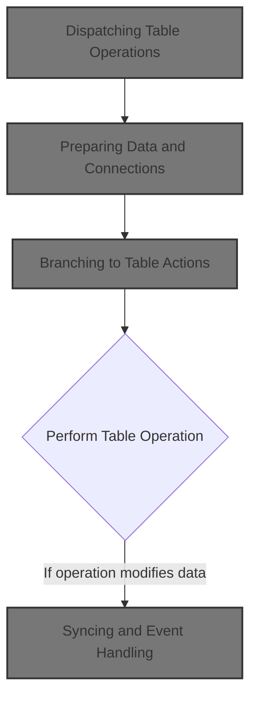

# Spec

## Detailed View of the Program's Functionality

## Main Program Logic and Initialization

The main entry point for the table IO dispatcher first prepares all necessary data structures and environment for database operations. This includes resetting control fields, initializing status and checkpoint counters, and ensuring the database connection is ready if required. The initialization routine also synchronizes key fields between input and working structures, but only if the operation is not a cursor close. If the operation involves Oracle or is a row modification, insertion, or purge, it connects to the Oracle database and handles any connection errors by building an error message.

## Dispatching Table Operations

After initialization, the dispatcher examines the requested operation code and branches to the appropriate subroutine. If the previous operation was not successful, it simply continues without action. Otherwise, it checks the operation code and performs one of the following actions:

- Opens a cursor for table access if the code matches one of the valid cursor IDs; otherwise, it fails and sets an error message.
- Closes a cursor if the code matches a valid cursor ID; otherwise, it fails and sets an error message.
- Retrieves a unique row from the table using key fields, then checks for null columns to ensure data integrity.
- Fetches the next row from the table using the active cursor, again checking for null columns after the fetch.
- Modifies a table row, first editing null indicators and checking for any triggered events, then updating the row if the previous steps were successful.
- Inserts a new row into the table after validating business rules and editing null indicators, marking the row as added and triggering denormalization and event handling if successful.
- Purges (deletes) a row from the table, marking the row as deleted and triggering denormalization and event handling if successful.
- Handles special IO functions if requested.

After any operation, the dispatcher performs exit processing, which may include copying updated fields back to the input structure, updating checkpoint counters, and connecting to DB2 if needed.

## Table Row Modification and Update

When modifying a table row, the flow first ensures null indicators are valid and checks for any business events that may need to be triggered. If the database operation is successful, it marks the checkpoint, sets update flags, and initiates denormalization and event synchronization. The actual update is performed by calling an external routine that executes the SQL UPDATE statement, changing the row in the database based on the provided key fields and new values.

## Table Row Insertion and Validation

For inserting a new row, the flow first prepares the data and edits null indicators. It then calls an external validation routine, which checks business rules for the new row. If the validation passes, it performs the database insert, marks the row as added, updates location and checkpoint flags, and triggers denormalization and event handling. The validation routine copies relevant fields into its own structure, sets flags for insert and Oracle, and calls another subroutine to perform the actual checks.

## Table Row Purge and Synchronization

When purging a row, the flow calls the database update routine to perform the SQL DELETE. If successful, it marks the checkpoint, sets delete flags, marks the row as updated, and triggers denormalization and event handling. The update routine is used for both deletes and updates to keep downstream logic consistent.

## Denormalization and Event Handling

After modifying, inserting, or purging a row, the flow may trigger denormalization and event handling. This process copies environment context, gets workflow state, and, if successful, synchronizes location data and issues events. The synchronization routine sets flags for last call and Oracle, marks the class zone as current, and calls another routine to sync store zone data between legacy and master databases.

If synchronization is successful, the flow issues customer and store events using hardcoded IDs and program names, relying on user and environment fields set earlier. The event manager call is tightly coupled to business rules and always issues a customer event, with a second store event if the location is a store.

## Store Data Synchronization and Deletion

The synchronization routine checks for success, retrieves the store data, and only updates it if the retrieval worked. If the store does not exist, it resets the working record. If the fetch is successful, it clears the relevant ad zone and exception fields based on the item class code, then updates the store record if it exists. The clearing logic uses a switch-case on item class, and only recognized codes trigger field resets.

## Vendor Location Operations and Validation

For vendor location operations, the dispatcher initializes the environment and dispatches to a specific validation subroutine based on the table code. Only recognized codes are valid; otherwise, it sets a failure and error message. If Oracle is needed, it connects before returning. The initialization routine is strict about what triggers DB2 connection, only allowing it for insert operations.

## Retail Location and Attribute Checks

Retail location checks are performed only if the previous operation succeeded. The flow runs an e-commerce market area check, and if that also succeeds and the parent flag is set, it runs a computer type check. The parent flag is a hidden dependency that controls extra validation. Item class checks and AA-ZONES checks are chained, not parallel, and only run if previous steps succeed and the parent flag is set.

## Summary

The overall flow is a robust dispatcher for table IO operations, handling initialization, branching to specific routines based on operation codes, performing database actions, validating business rules, and triggering synchronization and event handling as needed. Each step is conditional on the success of previous steps, with error handling and messaging built in to ensure data integrity and proper resource management. The logic is tightly coupled to business rules and relies on a series of external routines and subroutines for validation, synchronization, and event management.

# Rule Definition

| Paragraph Name                                                                                                                                                                                                   | Rule ID | Category          | Description                                                                                                                                                                                                                                                                                       | Conditions                                                                                                      | Remarks                                                                                                                                                                                                                                                      |
| ---------------------------------------------------------------------------------------------------------------------------------------------------------------------------------------------------------------- | ------- | ----------------- | ------------------------------------------------------------------------------------------------------------------------------------------------------------------------------------------------------------------------------------------------------------------------------------------------- | --------------------------------------------------------------------------------------------------------------- | ------------------------------------------------------------------------------------------------------------------------------------------------------------------------------------------------------------------------------------------------------------ |
| PROCEDURE DIVISION header in NNNS0473.cbl, lines 33-38                                                                                                                                                           | RL-001  | Data Assignment   | The dispatcher routine must accept the following input structures by reference: control_block, sqlca, environment, params, and pda_record.                                                                                                                                                        | Dispatcher is invoked (entry point of NNNS0473).                                                                | Structures: control_block (XXXN001A), sqlca, environment (YYYN005A), params (NNNN0000-PARMS), pda_record (P-DDDTCZ01). All are passed by reference and updated in-place. No direct return values.                                                            |
| 0000-EXIT-DISPATCHER, EVALUATE TRUE, lines 201-220 in NNNS0473.cbl                                                                                                                                               | RL-002  | Conditional Logic | The operation to perform is determined by the EXIT-CODE field in the control block. Valid values are: 1 (open cursor), 2 (close cursor), 3 (get unique row), 5 (get next row), 8 (modify row), 9 (insert row), 10 (purge row), 90 (special I/O). Any other value results in no action or failure. | Dispatcher is invoked and EXIT-CODE is set in control_block.                                                    | EXIT-CODE values: 1=open, 2=close, 3=get unique, 5=get next, 8=modify, 9=insert, 10=purge, 90=special I/O. Any other value triggers failure and error message.                                                                                               |
| 1000-EXIT-OPEN-CURSOR, 1100-EXIT-CLOSE-CURSOR, 1300-EXIT-GET-NEXT-ROW, lines 327-375, 401-415 in NNNS0473.cbl                                                                                                    | RL-003  | Conditional Logic | For cursor operations, the CURSOR-ID field in params must be validated. Only DDDXCZ01, DDDXCZ02, DDDXCZ03, DDDXCZ04 are valid. Any other value results in failure and sets the error message in control_block.                                                                                    | Operation is a cursor operation (open, close, get next row).                                                    | Valid CURSOR-ID values: DDDXCZ01, DDDXCZ02, DDDXCZ03, DDDXCZ04. Error message for invalid ID: 'NNNS0473 - Invalid open/close/fetch cursor ID.'                                                                                                               |
| 110-MOVE-PDA-FIELDS-2-DCL, 130-MOVE-DCL-2-PDA-FIELDS, lines 249-259, 309-319 in NNNS0473.cbl                                                                                                                     | RL-004  | Data Assignment   | The PDA record must contain LOC-TYP-CD, LOC-NBR, ITM-CLS-CD, AD-ZONE, AD-ZONE-EXCP. These are used as keys and values for all table operations.                                                                                                                                                   | Any table operation is performed.                                                                               | Fields: LOC-TYP-CD, LOC-NBR, ITM-CLS-CD, AD-ZONE, AD-ZONE-EXCP. All are alphanumeric or numeric as defined in the copybooks. Used as keys for SELECT/UPDATE/DELETE/INSERT.                                                                                   |
| Throughout dispatcher, especially after each operation and in error handling, e.g., lines 346-348, 372-374, 412-414 in NNNS0473.cbl                                                                              | RL-005  | Data Assignment   | After the operation, the dispatcher must update the control_block with the result: SUCCESS/FAILURE flag and IS-RTRN-MSG-TXT error message if applicable.                                                                                                                                          | Any operation completes (success or failure).                                                                   | SUCCESS/FAILURE is a flag in control_block. IS-RTRN-MSG-TXT is a string field for error messages. Messages must match originals for invalid cursor IDs, connection failures, referential integrity, and SQL errors.                                          |
| After each SQL operation, e.g., lines 293, 472, 499, 511 in NNNS0473.cbl                                                                                                                                         | RL-006  | Data Assignment   | The SQLCA structure must be updated with the SQLCODE and SQLSTATE from the database operation. SQLCODE values must be handled as follows: 0 = success, 100 = not found, other = error.                                                                                                            | Any SQL operation is performed.                                                                                 | SQLCA is updated in-place. SQLCODE: 0=success, 100=not found, other=error. SQLSTATE is also updated as per DB2/Oracle standards.                                                                                                                             |
| 130-MOVE-DCL-2-PDA-FIELDS, lines 309-319 in NNNS0473.cbl                                                                                                                                                         | RL-007  | Data Assignment   | The PDA record must be updated to reflect the result of the operation (fetched data, inserted/modified data, or cleared fields after delete).                                                                                                                                                     | Any table operation completes.                                                                                  | PDA record fields are updated from the DCL structure after fetch/insert/update/delete. Cleared after delete.                                                                                                                                                 |
| Error handling in 1000-EXIT-OPEN-CURSOR, 1100-EXIT-CLOSE-CURSOR, 1300-EXIT-GET-NEXT-ROW, 4600-CALL-MMMS0335-RI-ADD-CHK, 115-CONNECT-TO-ORACLE, lines 346-348, 372-374, 412-414, 273-275, 497-506 in NNNS0473.cbl | RL-008  | Conditional Logic | Error messages must match the originals for invalid cursor IDs, connection failures, referential integrity checks, and other failures, including the SQLCODE in the message where appropriate.                                                                                                    | An error condition is detected (invalid cursor ID, connection failure, referential integrity error, SQL error). | Messages: 'NNNS0473 - Invalid open/close/fetch cursor ID.', 'NNNS0473 - Error connecting to Oracle. Sqlcode = ...', 'MMMS0335 - ...' for RI errors, etc. IS-RTRN-MSG-TXT is a string field for messages.                                                     |
| Throughout dispatcher, enforced by PROCEDURE DIVISION USING and no RETURN VALUE statements                                                                                                                       | RL-009  | Data Assignment   | The dispatcher must not return a value directly; all output must be reflected in the updated input structures.                                                                                                                                                                                    | Dispatcher is invoked.                                                                                          | All output is via control_block, sqlca, environment, params, pda_record, updated in-place.                                                                                                                                                                   |
| 100-INITIALIZATION, lines 229-243 in NNNS0473.cbl                                                                                                                                                                | RL-010  | Data Assignment   | The dispatcher must always perform initialization before any operation, ensuring all control/data structures are reset and the environment is prepared.                                                                                                                                           | Dispatcher is invoked.                                                                                          | INITIALIZE is called on all relevant structures. Environment flags are set as needed.                                                                                                                                                                        |
| 120-EXIT-STUFF, lines 282-292 in NNNS0473.cbl                                                                                                                                                                    | RL-011  | Data Assignment   | The dispatcher must always perform exit/cleanup processing after the requested operation, regardless of outcome.                                                                                                                                                                                  | Any operation completes (success or failure).                                                                   | Cleanup includes moving DCL fields to PDA, updating checkpoint, and reconnecting to DB2 if needed.                                                                                                                                                           |
| 1420-D0-MODIFY-ROW, 1500-EXIT-PUT-INSERT-ROW, 1600-EXIT-PUT-PURGE-ROW, lines 487-488, 502-503, 514-515 in NNNS0473.cbl                                                                                           | RL-012  | Data Assignment   | Business flags such as add, update, delete, location updated, and checkpoint increment must be set according to the operation performed (insert, update, delete) and its outcome (success).                                                                                                       | Operation completes successfully.                                                                               | Flags: add, update, delete, location updated, checkpoint increment. These are set as appropriate for the operation performed and its outcome. For example, after a successful insert, the add flag, location updated flag, and checkpoint increment are set. |

# User Stories

## User Story 1: Dispatcher Initialization and Cleanup

---

### Story Description:

As a system invoking the dispatcher, I want all control and data structures to be properly initialized before any operation and cleaned up after, so that the environment is always prepared and consistent regardless of the outcome.

---

### Business Rule Mapping:

| Rule ID | Paragraph Name                                                                             | Rule Description                                                                                                                                        |
| ------- | ------------------------------------------------------------------------------------------ | ------------------------------------------------------------------------------------------------------------------------------------------------------- |
| RL-010  | 100-INITIALIZATION, lines 229-243 in NNNS0473.cbl                                          | The dispatcher must always perform initialization before any operation, ensuring all control/data structures are reset and the environment is prepared. |
| RL-001  | PROCEDURE DIVISION header in NNNS0473.cbl, lines 33-38                                     | The dispatcher routine must accept the following input structures by reference: control_block, sqlca, environment, params, and pda_record.              |
| RL-009  | Throughout dispatcher, enforced by PROCEDURE DIVISION USING and no RETURN VALUE statements | The dispatcher must not return a value directly; all output must be reflected in the updated input structures.                                          |
| RL-011  | 120-EXIT-STUFF, lines 282-292 in NNNS0473.cbl                                              | The dispatcher must always perform exit/cleanup processing after the requested operation, regardless of outcome.                                        |

---

### Relevant Functionality:

- **100-INITIALIZATION**
  1. **RL-010:**
     - INITIALIZE all control/data structures
     - Set environment flags as needed
- **PROCEDURE DIVISION header in NNNS0473.cbl**
  1. **RL-001:**
     - PROCEDURE DIVISION USING control_block, sqlca, environment, params, pda_record
     - All updates to results, errors, and flags are made by modifying these structures in-place.
- **Throughout dispatcher**
  1. **RL-009:**
     - Do not return values from the dispatcher
     - Update all output fields in the input structures
- **120-EXIT-STUFF**
  1. **RL-011:**
     - After operation, perform cleanup:
       - Move DCL fields to PDA
       - Update checkpoint
       - Reconnect to DB2 if needed

## User Story 2: Operation Execution and Data Handling

---

### Story Description:

As a system requesting a database operation, I want the dispatcher to interpret the requested operation, validate cursor IDs, perform the necessary table actions, update the PDA record, and set business flags so that the correct business logic is executed and reflected in the data structures.

---

### Business Rule Mapping:

| Rule ID | Paragraph Name                                                                                                         | Rule Description                                                                                                                                                                                                                                                                                  |
| ------- | ---------------------------------------------------------------------------------------------------------------------- | ------------------------------------------------------------------------------------------------------------------------------------------------------------------------------------------------------------------------------------------------------------------------------------------------- |
| RL-002  | 0000-EXIT-DISPATCHER, EVALUATE TRUE, lines 201-220 in NNNS0473.cbl                                                     | The operation to perform is determined by the EXIT-CODE field in the control block. Valid values are: 1 (open cursor), 2 (close cursor), 3 (get unique row), 5 (get next row), 8 (modify row), 9 (insert row), 10 (purge row), 90 (special I/O). Any other value results in no action or failure. |
| RL-004  | 110-MOVE-PDA-FIELDS-2-DCL, 130-MOVE-DCL-2-PDA-FIELDS, lines 249-259, 309-319 in NNNS0473.cbl                           | The PDA record must contain LOC-TYP-CD, LOC-NBR, ITM-CLS-CD, AD-ZONE, AD-ZONE-EXCP. These are used as keys and values for all table operations.                                                                                                                                                   |
| RL-003  | 1000-EXIT-OPEN-CURSOR, 1100-EXIT-CLOSE-CURSOR, 1300-EXIT-GET-NEXT-ROW, lines 327-375, 401-415 in NNNS0473.cbl          | For cursor operations, the CURSOR-ID field in params must be validated. Only DDDXCZ01, DDDXCZ02, DDDXCZ03, DDDXCZ04 are valid. Any other value results in failure and sets the error message in control_block.                                                                                    |
| RL-012  | 1420-D0-MODIFY-ROW, 1500-EXIT-PUT-INSERT-ROW, 1600-EXIT-PUT-PURGE-ROW, lines 487-488, 502-503, 514-515 in NNNS0473.cbl | Business flags such as add, update, delete, location updated, and checkpoint increment must be set according to the operation performed (insert, update, delete) and its outcome (success).                                                                                                       |
| RL-007  | 130-MOVE-DCL-2-PDA-FIELDS, lines 309-319 in NNNS0473.cbl                                                               | The PDA record must be updated to reflect the result of the operation (fetched data, inserted/modified data, or cleared fields after delete).                                                                                                                                                     |

---

### Relevant Functionality:

- **0000-EXIT-DISPATCHER**
  1. **RL-002:**
     - Read EXIT-CODE from control_block
     - EVALUATE EXIT-CODE
       - WHEN 1: PERFORM open cursor logic
       - WHEN 2: PERFORM close cursor logic
       - WHEN 3: PERFORM get unique row logic
       - WHEN 5: PERFORM get next row logic
       - WHEN 8: PERFORM modify row logic
       - WHEN 9: PERFORM insert row logic
       - WHEN 10: PERFORM purge row logic
       - WHEN 90: PERFORM special I/O logic
       - WHEN OTHER: SET FAILURE, set error message in control_block
- **110-MOVE-PDA-FIELDS-2-DCL**
  1. **RL-004:**
     - On input: MOVE fields from pda_record to DCL structure
     - On output: MOVE fields from DCL structure back to pda_record
- **1000-EXIT-OPEN-CURSOR**
  1. **RL-003:**
     - For cursor operations, check CURSOR-ID in params
     - If CURSOR-ID is not one of the valid values:
       - SET FAILURE
       - MOVE error message to IS-RTRN-MSG-TXT in control_block
- **1420-D0-MODIFY-ROW**
  1. **RL-012:**
     - On successful insert: set add flag, set location updated flag, increment checkpoint
     - On successful update: set update flag, set location updated flag, increment checkpoint
     - On successful delete: set delete flag, set location updated flag, increment checkpoint
- **130-MOVE-DCL-2-PDA-FIELDS**
  1. **RL-007:**
     - After operation, MOVE fields from DCL structure to pda_record

## User Story 3: Result Reporting and Error Handling

---

### Story Description:

As a system relying on the dispatcher, I want the dispatcher to update the control block and SQLCA with the result of the operation and provide accurate error messages when failures occur so that I can reliably detect success, handle errors, and understand the reasons for any issues.

---

### Business Rule Mapping:

| Rule ID | Paragraph Name                                                                                                                                                                                                   | Rule Description                                                                                                                                                                               |
| ------- | ---------------------------------------------------------------------------------------------------------------------------------------------------------------------------------------------------------------- | ---------------------------------------------------------------------------------------------------------------------------------------------------------------------------------------------- |
| RL-005  | Throughout dispatcher, especially after each operation and in error handling, e.g., lines 346-348, 372-374, 412-414 in NNNS0473.cbl                                                                              | After the operation, the dispatcher must update the control_block with the result: SUCCESS/FAILURE flag and IS-RTRN-MSG-TXT error message if applicable.                                       |
| RL-006  | After each SQL operation, e.g., lines 293, 472, 499, 511 in NNNS0473.cbl                                                                                                                                         | The SQLCA structure must be updated with the SQLCODE and SQLSTATE from the database operation. SQLCODE values must be handled as follows: 0 = success, 100 = not found, other = error.         |
| RL-008  | Error handling in 1000-EXIT-OPEN-CURSOR, 1100-EXIT-CLOSE-CURSOR, 1300-EXIT-GET-NEXT-ROW, 4600-CALL-MMMS0335-RI-ADD-CHK, 115-CONNECT-TO-ORACLE, lines 346-348, 372-374, 412-414, 273-275, 497-506 in NNNS0473.cbl | Error messages must match the originals for invalid cursor IDs, connection failures, referential integrity checks, and other failures, including the SQLCODE in the message where appropriate. |

---

### Relevant Functionality:

- **Throughout dispatcher**
  1. **RL-005:**
     - On success: SET SUCCESS flag
     - On failure: SET FAILURE flag, MOVE error message to IS-RTRN-MSG-TXT
- **After each SQL operation**
  1. **RL-006:**
     - After SQL operation, MOVE SQLCODE and SQLSTATE to SQLCA
     - If SQLCODE=0: treat as success
     - If SQLCODE=100: treat as not found, set failure
     - If SQLCODE!=0 and !=100: treat as error, set failure
- **Error handling in 1000-EXIT-OPEN-CURSOR**
  1. **RL-008:**
     - On error, set FAILURE
     - Set IS-RTRN-MSG-TXT to appropriate message, including SQLCODE if relevant

# Code Walkthrough

## Dispatching Table Operations

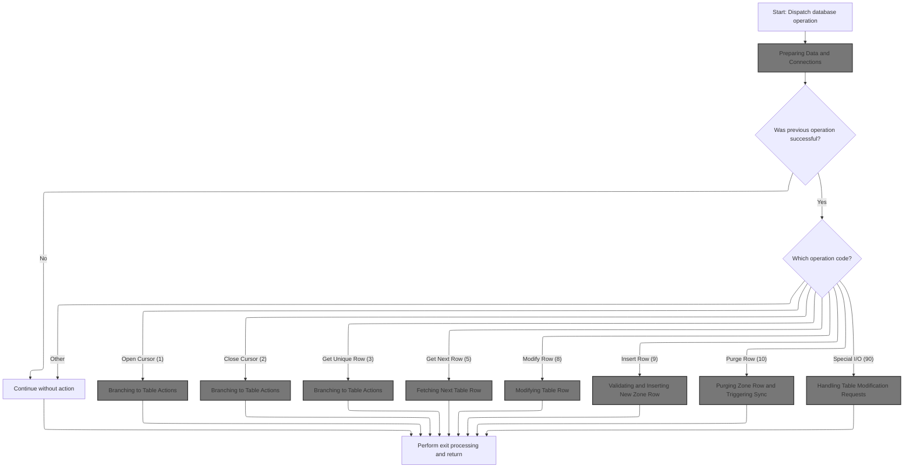

<SwmSnippet path="/base/src/NNNS0473.cbl" line="199">

---

`0000-EXIT-DISPATCHER` kicks off the flow. It first calls 100-INITIALIZATION to prep all the control/data structures and make sure the environment is ready for any DB operation. Then, it uses an EVALUATE statement to branch to the right subroutine based on the exit code (like open cursor, close cursor, get row, etc.). Each exit code is a named constant, so the dispatcher is easy to read and extend. After the requested operation, it always does exit cleanup and returns. Initialization is needed up front so that every operation starts with a consistent state and the right DB connection if required.

```cobol
020800 0000-EXIT-DISPATCHER.                                            00020800
020900     PERFORM 100-INITIALIZATION                                   00020900
021000     EVALUATE TRUE                                                00021000
021100       WHEN NOT SUCCESS                                           00021100
021200          CONTINUE                                                00021200
021300       WHEN EXIT-OPEN-CURSOR                                      00021300
021400          PERFORM 1000-EXIT-OPEN-CURSOR                           00021400
021500       WHEN EXIT-CLOSE-CURSOR                                     00021500
021600          PERFORM 1100-EXIT-CLOSE-CURSOR                          00021600
021700       WHEN EXIT-GET-UNIQUE-ROW                                   00021700
021800          PERFORM 1200-EXIT-GET-UNIQUE-ROW                        00021800
021900       WHEN EXIT-GET-NEXT-ROW                                     00021900
022000          PERFORM 1300-EXIT-GET-NEXT-ROW                          00022000
022100       WHEN EXIT-PUT-MODIFY-ROW                                   00022100
022200          PERFORM 1400-EXIT-PUT-MODIFY-ROW                        00022200
022300       WHEN EXIT-PUT-INSERT-ROW                                   00022300
022400          PERFORM 1500-EXIT-PUT-INSERT-ROW                        00022400
022500       WHEN EXIT-PUT-PURGE-ROW                                    00022500
022600          PERFORM 1600-EXIT-PUT-PURGE-ROW                         00022600
022700       WHEN EXIT-DO-SPECIAL-IO-FUNCS                              00022700
022800          PERFORM 10000-DO-SPECIAL-IO-FUNCS                       00022800
022900     END-EVALUATE                                                 00022900
023000     PERFORM 120-EXIT-STUFF                                       00023000
023100     GOBACK                                                       00023100
023200     .                                                            00023200
```

---

</SwmSnippet>

### Preparing Data and Connections

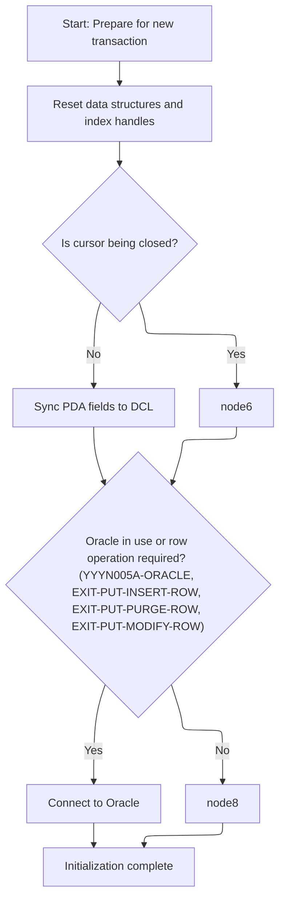

<SwmSnippet path="/base/src/NNNS0473.cbl" line="229">

---

`100-INITIALIZATION` gets everything ready for DB work, and only copies fields if we're not closing a cursor.

```cobol
023800 100-INITIALIZATION.                                              00023800
023900     INITIALIZE XXXN001A                                          00023900
024000                DAO-STATUS                                        00024000
024100     MOVE NNNN0000-INDEX-HANDLE TO DDDTCZ01-INDEX-HANDLE          00024100
024200     MOVE 0 TO WS-CHECKPOINT-INC                                  00024200
024300     MOVE 0 TO SQLCODE                                            00024300
024400     MOVE 0 TO SQL-INIT-FLAG                                      00024400
024500     IF NOT EXIT-CLOSE-CURSOR                                     00024500
024600       PERFORM 110-MOVE-PDA-FIELDS-2-DCL                          00024600
024700     END-IF                                                       00024700
024800     IF (YYYN005A-ORACLE       OR EXIT-PUT-INSERT-ROW             00024800
024900         OR EXIT-PUT-PURGE-ROW OR EXIT-PUT-MODIFY-ROW)            00024900
025000       PERFORM 115-CONNECT-TO-ORACLE                              00025000
025100     END-IF                                                       00025100
025200     .                                                            00025200
```

---

</SwmSnippet>

<SwmSnippet path="/base/src/NNNS0473.cbl" line="249">

---

`110-MOVE-PDA-FIELDS-2-DCL` copies location and classification fields from one record structure to another, prepping the data for DB2 table handling. This keeps the right values in sync for downstream DB logic.

```cobol
025800 110-MOVE-PDA-FIELDS-2-DCL.                                       00025800
025900     MOVE LOC-TYP-CD OF P-DDDTCZ01                                00025900
026000       TO LOC-TYP-CD OF DCLXXXL-LOC-CLS-AD-ZN                     00026000
026100     MOVE LOC-NBR OF P-DDDTCZ01                                   00026100
026200       TO LOC-NBR OF DCLXXXL-LOC-CLS-AD-ZN                        00026200
026300     MOVE ITM-CLS-CD OF P-DDDTCZ01                                00026300
026400       TO ITM-CLS-CD OF DCLXXXL-LOC-CLS-AD-ZN                     00026400
026500     MOVE AD-ZONE OF P-DDDTCZ01                                   00026500
026600       TO AD-ZONE OF DCLXXXL-LOC-CLS-AD-ZN                        00026600
026700     MOVE AD-ZONE-EXCP OF P-DDDTCZ01                              00026700
026800       TO AD-ZONE-EXCP OF DCLXXXL-LOC-CLS-AD-ZN                   00026800
026900     .                                                            00026900
```

---

</SwmSnippet>

<SwmSnippet path="/base/src/NNNS0473.cbl" line="266">

---

`115-CONNECT-TO-ORACLE` calls Z-ORA-CONNECT to set up the Oracle DB connection if the operation needs it. If the connection fails, it builds an error message with the SQLCODE. The next step is handled by base/src/XXXS0210.cbl, which manages the actual connection logic.

```cobol
027500 115-CONNECT-TO-ORACLE.                                           00027500
027600     CALL Z-ORA-CONNECT USING XXXN001A                            00027600
027700                              SQLCA                               00027700
027800                                                                  00027800
027900     IF NOT SUCCESS                                               00027900
028000       MOVE SQLCODE TO WS-SQLCODE                                 00028000
028100       MOVE SPACES  TO IS-RTRN-MSG-TXT                            00028100
028200       STRING 'NNNS0473 - Error connecting to Oracle. Sqlcode ='  00028200
028300               WS-SQLCODE                                         00028300
028400               DELIMITED BY SIZE INTO IS-RTRN-MSG-TXT             00028400
028500     END-IF                                                       00028500
028600     .                                                            00028600
```

---

</SwmSnippet>

### Branching to Table Actions

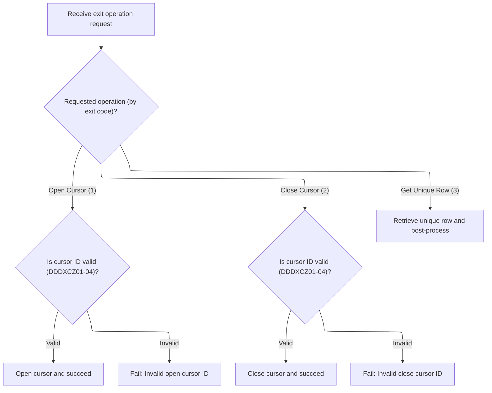

<SwmSnippet path="/base/src/NNNS0473.cbl" line="327">

---

`1000-EXIT-OPEN-CURSOR` opens the right DB cursor based on the input handle. If the handle isn't valid, it marks the operation as failed and sets an error message, blocking further work on that cursor.

```cobol
033600 1000-EXIT-OPEN-CURSOR.                                           00033600
033700     EVALUATE TRUE                                                00033700
033800       WHEN DDDXCZ01                                              00033800
033900         EXEC SQL                                                 00033900
034000           OPEN DDDXCZ01                                          00034000
034100         END-EXEC                                                 00034100
034200       WHEN DDDXCZ02                                              00034200
034300         EXEC SQL                                                 00034300
034400           OPEN DDDXCZ02                                          00034400
034500         END-EXEC                                                 00034500
034600       WHEN DDDXCZ03                                              00034600
034700         EXEC SQL                                                 00034700
034800           OPEN DDDXCZ03                                          00034800
034900         END-EXEC                                                 00034900
035000       WHEN DDDXCZ04                                              00035000
035100         EXEC SQL                                                 00035100
035200           OPEN DDDXCZ04                                          00035200
035300         END-EXEC                                                 00035300
035400       WHEN OTHER                                                 00035400
035500         SET FAILURE TO TRUE                                      00035500
035600         MOVE 'NNNS0473 - Invalid open cursor ID.'                00035600
035700           TO IS-RTRN-MSG-TXT OF XXXN001A                         00035700
035800     END-EVALUATE                                                 00035800
035900     .                                                            00035900
```

---

</SwmSnippet>

<SwmSnippet path="/base/src/NNNS0473.cbl" line="353">

---

`1100-EXIT-CLOSE-CURSOR` closes the DB cursor matching the input ID. If the ID isn't one of the four known handles, it fails and sets an error message. This keeps resource management tight and avoids orphaned cursors.

```cobol
036200 1100-EXIT-CLOSE-CURSOR.                                          00036200
036300     EVALUATE TRUE                                                00036300
036400       WHEN DDDXCZ01                                              00036400
036500         EXEC SQL                                                 00036500
036600           CLOSE DDDXCZ01                                         00036600
036700         END-EXEC                                                 00036700
036800       WHEN DDDXCZ02                                              00036800
036900         EXEC SQL                                                 00036900
037000           CLOSE DDDXCZ02                                         00037000
037100         END-EXEC                                                 00037100
037200       WHEN DDDXCZ03                                              00037200
037300         EXEC SQL                                                 00037300
037400           CLOSE DDDXCZ03                                         00037400
037500         END-EXEC                                                 00037500
037600       WHEN DDDXCZ04                                              00037600
037700         EXEC SQL                                                 00037700
037800           CLOSE DDDXCZ04                                         00037800
037900         END-EXEC                                                 00037900
038000       WHEN OTHER                                                 00038000
038100         SET FAILURE TO TRUE                                      00038100
038200         MOVE 'NNNS0473 - Invalid close cursor ID.'               00038200
038300           TO IS-RTRN-MSG-TXT OF XXXN001A                         00038300
038400     END-EVALUATE                                                 00038400
038500     .                                                            00038500
```

---

</SwmSnippet>

<SwmSnippet path="/base/src/NNNS0473.cbl" line="379">

---

`1200-EXIT-GET-UNIQUE-ROW` runs a SELECT to fetch a unique row from the LOC-CLS-AD-ZN table using key fields from the input structure. After the fetch, it checks for nulls in the result to make sure the data is usable.

```cobol
038800 1200-EXIT-GET-UNIQUE-ROW.                                        00038800
038900     EXEC SQL                                                     00038900
039000         SELECT LOC_TYP_CD,                                       00039000
039100                LOC_NBR,                                          00039100
039200                ITM_CLS_CD,                                       00039200
039300                AD_ZONE,                                          00039300
039400                AD_ZONE_EXCP                                      00039400
039500         INTO   :DCLXXXL-LOC-CLS-AD-ZN.LOC-TYP-CD,                00039500
039600                :DCLXXXL-LOC-CLS-AD-ZN.LOC-NBR,                   00039600
039700                :DCLXXXL-LOC-CLS-AD-ZN.ITM-CLS-CD,                00039700
039800                :DCLXXXL-LOC-CLS-AD-ZN.AD-ZONE,                   00039800
039900                :DCLXXXL-LOC-CLS-AD-ZN.AD-ZONE-EXCP               00039900
040000         FROM   XXXL_LOC_CLS_AD_ZN                                00040000
040100         WHERE  LOC_TYP_CD = :DCLXXXL-LOC-CLS-AD-ZN.LOC-TYP-CD    00040100
040200         AND    LOC_NBR = :DCLXXXL-LOC-CLS-AD-ZN.LOC-NBR          00040200
040300         AND    ITM_CLS_CD = :DCLXXXL-LOC-CLS-AD-ZN.ITM-CLS-CD    00040300
040400     END-EXEC                                                     00040400
040500                                                                  00040500
040600     PERFORM 1700-CHECK-NULL-COLUMNS                              00040600
040700     .                                                            00040700
```

---

</SwmSnippet>

### Fetching Next Table Row

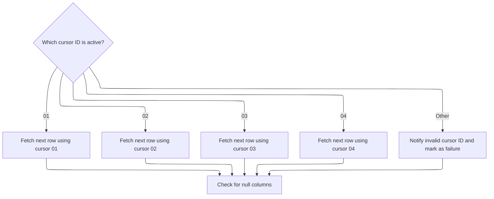

<SwmSnippet path="/base/src/NNNS0473.cbl" line="401">

---

`1300-EXIT-GET-NEXT-ROW` picks the right fetch routine based on the cursor ID, so we get the next row for the current index. If the ID is invalid, it fails and sets an error message. After fetching, it checks for nulls to keep the data clean.

```cobol
041000 1300-EXIT-GET-NEXT-ROW.                                          00041000
041100     EVALUATE TRUE                                                00041100
041200       WHEN DDDXCZ01                                              00041200
041300         PERFORM 1301-FETCH-DDDXCZ01                              00041300
041400       WHEN DDDXCZ02                                              00041400
041500         PERFORM 1302-FETCH-DDDXCZ02                              00041500
041600       WHEN DDDXCZ03                                              00041600
041700         PERFORM 1303-FETCH-DDDXCZ03                              00041700
041800       WHEN DDDXCZ04                                              00041800
041900         PERFORM 1304-FETCH-DDDXCZ04                              00041900
042000       WHEN OTHER                                                 00042000
042100         SET FAILURE TO TRUE                                      00042100
042200         MOVE 'NNNS0473 - Invalid fetch cursor ID.'               00042200
042300           TO IS-RTRN-MSG-TXT OF XXXN001A                         00042300
042400     END-EVALUATE                                                 00042400
042500                                                                  00042500
042600     PERFORM 1700-CHECK-NULL-COLUMNS                              00042600
042700     .                                                            00042700
```

---

</SwmSnippet>

<SwmSnippet path="/base/src/NNNS0473.cbl" line="421">

---

`1301-FETCH-DDDXCZ01` grabs the next record for the current cursor.

```cobol
043000 1301-FETCH-DDDXCZ01.                                             00043000
043100     EXEC SQL                                                     00043100
043200         FETCH DDDXCZ01                                           00043200
043300         INTO  :DCLXXXL-LOC-CLS-AD-ZN.LOC-TYP-CD,                 00043300
043400               :DCLXXXL-LOC-CLS-AD-ZN.LOC-NBR,                    00043400
043500               :DCLXXXL-LOC-CLS-AD-ZN.ITM-CLS-CD,                 00043500
043600               :DCLXXXL-LOC-CLS-AD-ZN.AD-ZONE,                    00043600
043700               :DCLXXXL-LOC-CLS-AD-ZN.AD-ZONE-EXCP                00043700
043800     END-EXEC                                                     00043800
043900     .                                                            00043900
```

---

</SwmSnippet>

### Modifying Table Row

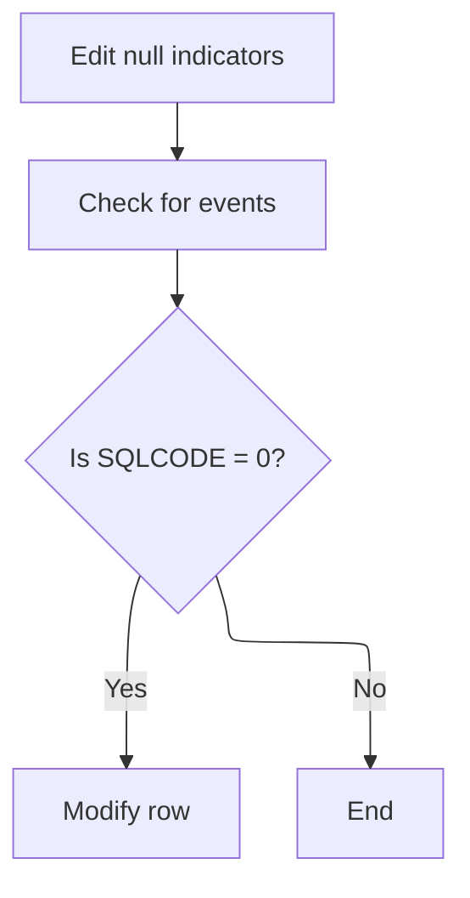

<SwmSnippet path="/base/src/NNNS0473.cbl" line="469">

---

`1400-EXIT-PUT-MODIFY-ROW` first edits null indicators, then checks for any triggered events, and only if everything is good (SQLCODE = 0), it updates the row by calling 1420-D0-MODIFY-ROW. This keeps the update safe and clean.

```cobol
047800 1400-EXIT-PUT-MODIFY-ROW.                                        00047800
047900     PERFORM 1800-EDIT-NULL-INDICATORS                            00047900
048000     PERFORM 1410-CHECK-FOR-EVENTS                                00048000
048100     IF SQLCODE = 0                                               00048100
048200       PERFORM 1420-D0-MODIFY-ROW                                 00048200
048300     END-IF                                                       00048300
048400     .                                                            00048400
```

---

</SwmSnippet>

### Updating the Database Row

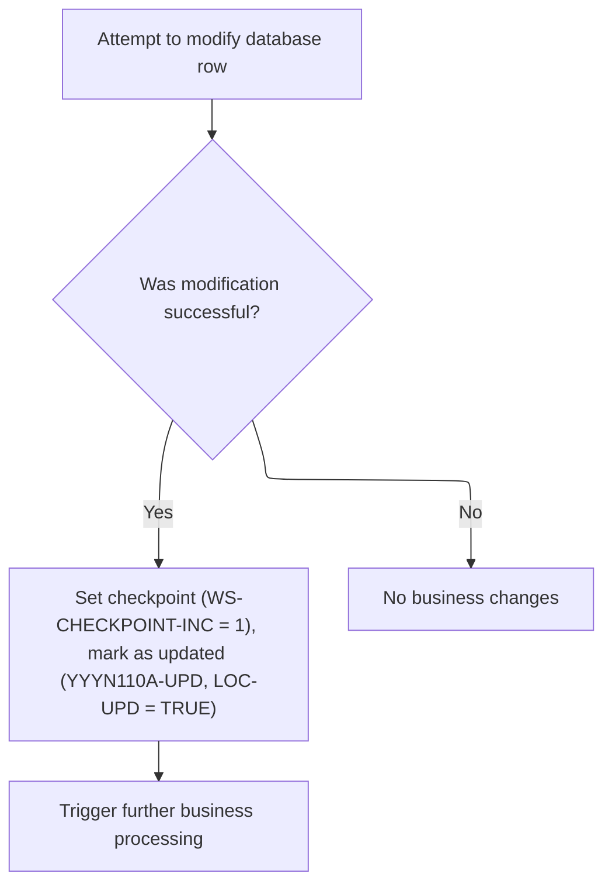

<SwmSnippet path="/base/src/NNNS0473.cbl" line="483">

---

`1420-D0-MODIFY-ROW` calls the Oracle update routine to change the DB row, then checks SQLCODE. If the update worked, it marks the checkpoint, sets update flags, and kicks off denormalization and event sync.

```cobol
049200 1420-D0-MODIFY-ROW.                                              00049200
050900     PERFORM 5000-CALL-NNNS0473-CUD-ROUTINE                       00050900
051000     IF SQLCODE = 0                                               00051000
051100       MOVE 1 TO WS-CHECKPOINT-INC                                00051100
051200       SET YYYN110A-UPD TO TRUE                                   00051200
051300       SET LOC-UPD      TO TRUE                                   00051300
051400       PERFORM 2000-DENORM-PROCESS                                00051400
051500     END-IF                                                       00051500
051600     .                                                            00051600
```

---

</SwmSnippet>

### Calling the Update Routine

<SwmSnippet path="/base/src/NNNS0473.cbl" line="639">

---

`5000-CALL-NNNS0473-CUD-ROUTINE` calls NNNU0473-ORACLE-UPDATE to do the actual DB update, passing all the control and table data needed. The next step is handled by base/src/NNNU0473.cbl, which runs the update logic.

```cobol
066400 5000-CALL-NNNS0473-CUD-ROUTINE.                                  00066400
066410     CALL NNNU0473-ORACLE-UPDATE USING                            00066410
066420          XXXN001A                                                00066420
066430          SQLCA                                                   00066430
066440          YYYN005A                                                00066440
066450          NNNN0000-PARMS                                          00066450
066460          DDDTCZ01                                                00066460
066470     .                                                            00066470
```

---

</SwmSnippet>

### Handling Table Modification Requests

<SwmSnippet path="/base/src/NNNU0473.cbl" line="44">

---

`0000-EXIT-DISPATCHER` in NNNU0473.cbl branches to the right table operation (modify, insert, purge) using EVALUATE and exit codes. Each branch calls the relevant routine to handle the DB change.

```cobol
004800 0000-EXIT-DISPATCHER.                                            00480000
004900      EVALUATE TRUE                                               00490000
005000       WHEN EXIT-PUT-MODIFY-ROW                                   00500000
005100          PERFORM 1400-EXIT-PUT-MODIFY-ROW                        00510000
005200       WHEN EXIT-PUT-INSERT-ROW                                   00520000
005300          PERFORM 1500-EXIT-PUT-INSERT-ROW                        00530000
005400       WHEN EXIT-PUT-PURGE-ROW                                    00540000
005500          PERFORM 1600-EXIT-PUT-PURGE-ROW                         00550000
005600      END-EVALUATE                                                00560000
005700     GOBACK                                                       00570000
005800     .                                                            00580000
```

---

</SwmSnippet>

#### Inserting a New Table Row

<SwmSnippet path="/base/src/NNNU0473.cbl" line="81">

---

`1500-EXIT-PUT-INSERT-ROW` just calls 1505-DO-INSERT to add a new row to the table. The actual insert logic is handled in the next routine.

```cobol
007100 1500-EXIT-PUT-INSERT-ROW.                                        00710000
007200      PERFORM 1505-DO-INSERT                                      00720000
007300     .                                                            00730000
```

---

</SwmSnippet>

<SwmSnippet path="/base/src/NNNU0473.cbl" line="86">

---

`1505-DO-INSERT` runs an embedded SQL INSERT to add a new record to the table, mapping fields from the input structure to the DB columns. It assumes the input data is valid for the insert.

```cobol
007600 1505-DO-INSERT.                                                  00760000
007700     EXEC SQL                                                     00770000
048900         INSERT INTO XXXX_LOC_CLS_AD_ZN (                         00048900
049000             LOC_TYP_CD,                                          00049000
049100             LOC_NBR,                                             00049100
049200             ITM_CLS_CD,                                          00049200
049300             AD_ZONE,                                             00049300
049400             AD_ZONE_EXCP )                                       00049400
049500         VALUES (                                                 00049500
049600             :DCLXXXX-LOC-CLS-AD-ZN.LOC-TYP-CD,                   00049600
049700             :DCLXXXX-LOC-CLS-AD-ZN.LOC-NBR,                      00049700
049800             :DCLXXXX-LOC-CLS-AD-ZN.ITM-CLS-CD,                   00049800
049900             :DCLXXXX-LOC-CLS-AD-ZN.AD-ZONE,                      00049900
050000             :DCLXXXX-LOC-CLS-AD-ZN.AD-ZONE-EXCP )                00050000
007800     END-EXEC                                                     00780000
007900     .                                                            00790000
```

---

</SwmSnippet>

#### Purging a Table Row

<SwmSnippet path="/base/src/NNNU0473.cbl" line="104">

---

`1600-EXIT-PUT-PURGE-ROW` runs an embedded SQL DELETE to remove rows from the table using key fields from the input structure. It assumes those fields are set correctly to target the right row.

```cobol
008200 1600-EXIT-PUT-PURGE-ROW.                                         00820000
008300       EXEC SQL                                                   00830000
051400         DELETE FROM XXXX_LOC_CLS_AD_ZN                           00051400
051500         WHERE  LOC_TYP_CD = :DCLXXXX-LOC-CLS-AD-ZN.LOC-TYP-CD    00051500
051600         AND    LOC_NBR = :DCLXXXX-LOC-CLS-AD-ZN.LOC-NBR          00051600
051700         AND    ITM_CLS_CD = :DCLXXXX-LOC-CLS-AD-ZN.ITM-CLS-CD    00051700
008400       END-EXEC                                                   00840000
008500     .                                                            00850000
```

---

</SwmSnippet>

### Syncing and Event Handling

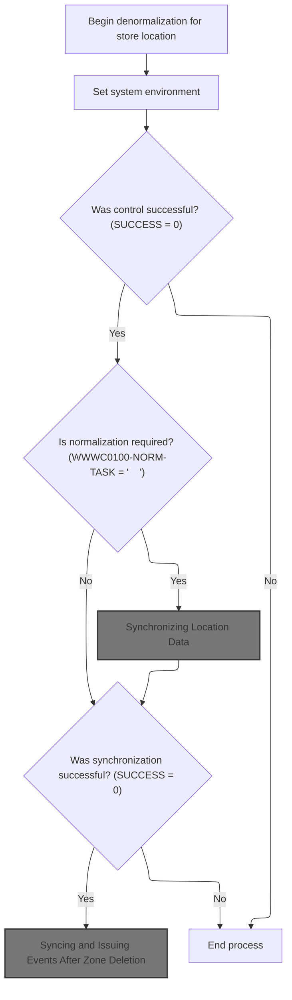

<SwmSnippet path="/base/src/NNNS0473.cbl" line="540">

---

`2000-DENORM-PROCESS` copies the environment context, gets the workflow state, and if everything's good, syncs location data and issues events. Each step is conditional on the previous one succeeding.

```cobol
058200 2000-DENORM-PROCESS.                                             00058200
058300     MOVE YYYN005A-SYS-ENV      TO YYYN110A-SYS-ENV               00058300
058400     PERFORM 2010-CALL-CONTROL-SUBR                               00058400
058500     IF  SUCCESS                                                  00058500
058600     AND WWWC0100-NORM-TASK                                       00058600
058700       PERFORM 2020-CALL-SYNC-SUBR                                00058700
058800     END-IF                                                       00058800
058900     IF SUCCESS                                                   00058900
059200          PERFORM 2030-ISSUE-EVENTS                               00059200
059400     END-IF                                                       00059400
059500     .                                                            00059500
```

---

</SwmSnippet>

<SwmSnippet path="/base/src/NNNS0473.cbl" line="553">

---

`2010-CALL-CONTROL-SUBR` sets up the task request and calls WWWS0100-CONTROL-SUBR to get the workflow state. This info is needed for downstream sync and event logic.

```cobol
059800 2010-CALL-CONTROL-SUBR.                                          00059800
059900     SET WWWC0100-GET-TASK  TO TRUE                               00059900
060000     CALL WWWS0100-CONTROL-SUBR USING                             00060000
060100         XXXN001A                                                 00060100
060200         WWWC0100                                                 00060200
060300     .                                                            00060300
```

---

</SwmSnippet>

#### Synchronizing Location Data

<SwmSnippet path="/base/src/NNNS0473.cbl" line="561">

---

`2020-CALL-SYNC-SUBR` sets flags for last call and Oracle, marks the class zone as current, then calls MMMS0161-SYNC-CZ to sync store zone data between legacy and master DBs.

```cobol
060600 2020-CALL-SYNC-SUBR.                                             00060600
060700     SET YYYN110A-LAST-CALL     TO TRUE                           00060700
060710     SET YYYN110A-ORACLE        TO TRUE                           00060710
060800     SET MMMC0161-CZ-IS-CURRENT TO TRUE                           00060800
060900     CALL MMMS0161-SYNC-CZ USING                                  00060900
061000         XXXN001A                                                 00061000
061100         YYYN110A                                                 00061100
061200         MMMC0161                                                 00061200
061300         P-DDDTCZ01                                               00061300
061400     .                                                            00061400
```

---

</SwmSnippet>

#### Main Sync/Delete Dispatcher

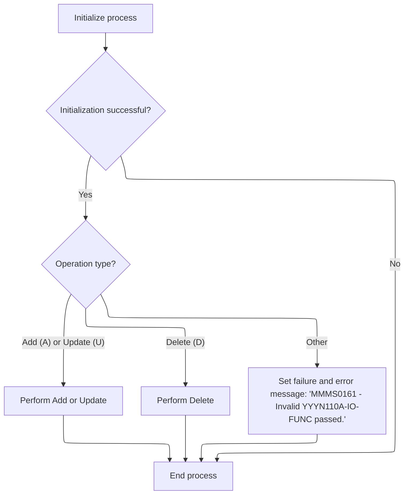

<SwmSnippet path="/base/src/MMMS0161.cbl" line="82">

---

`000-MAIN` runs initialization, checks for success, then branches to sync or delete routines based on IO-FUNC. If the function code is invalid, it fails and sets an error message.

```cobol
009000 000-MAIN.                                                        00009000
009100     PERFORM 100-INITIALIZE                                       00009100
009200                                                                  00009200
009300     IF SUCCESS                                                   00009300
009400       EVALUATE TRUE                                              00009400
009500         WHEN YYYN110A-ADD                                        00009500
009600         OR   YYYN110A-UPD                                        00009600
009700           PERFORM 1000-DO-THE-SYNC                               00009700
009800                                                                  00009800
009900         WHEN YYYN110A-DEL                                        00009900
010000           PERFORM 2000-DO-THE-DELETE                             00010000
010100                                                                  00010100
010200         WHEN OTHER                                               00010200
010300           SET FAILURE TO TRUE                                    00010300
010400           MOVE 'MMMS0161 - Invalid YYYN110A-IO-FUNC passed.'     00010400
010500             TO IS-RTRN-MSG-TXT                                   00010500
010600       END-EVALUATE                                               00010600
010700     END-IF                                                       00010700
010800                                                                  00010800
010900     GOBACK                                                       00010900
011000     .                                                            00011000
```

---

</SwmSnippet>

#### Initializing Sync Environment

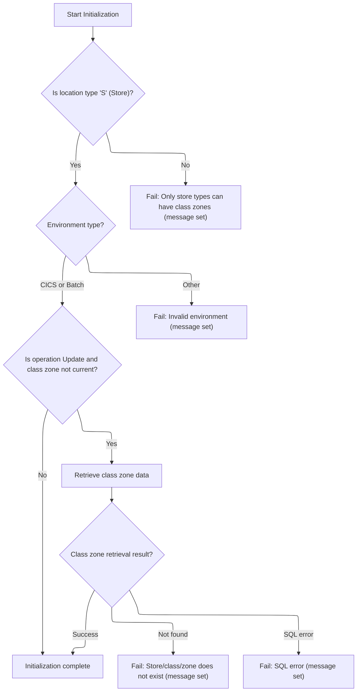

<SwmSnippet path="/base/src/MMMS0161.cbl" line="108">

---

`100-INITIALIZE` runs environment setup, checks if the location type is a store, and fails with a message if not. If all flags are good, it calls 120-GET-CZ to fetch the class zone record.

```cobol
011600 100-INITIALIZE.                                                  00011600
011700     PERFORM 110-MISC-INITS                                       00011700
011800                                                                  00011800
011900     IF LOC-TYP-CD OF P-DDDTCZ01 NOT = K-STORE-LOC-TYPE           00011900
012000       SET FAILURE TO TRUE                                        00012000
012100       MOVE 'MMMS0161 - only store types can have class zones!'   00012100
012200         TO IS-RTRN-MSG-TXT                                       00012200
012300     END-IF                                                       00012300
012400                                                                  00012400
012500     IF  SUCCESS                                                  00012500
012600     AND MMMC0161-CZ-IS-NOT-CURRENT                               00012600
012700     AND YYYN110A-UPD                                             00012700
012800       PERFORM 120-GET-CZ                                         00012800
012900     END-IF                                                       00012900
013000     .                                                            00013000
```

---

</SwmSnippet>

<SwmSnippet path="/base/src/MMMS0161.cbl" line="125">

---

`110-MISC-INITS` checks the environment variable, sets flags for CICS or BATCH, and marks Oracle if needed. If the variable is invalid, it fails and sets an error message.

```cobol
013300 110-MISC-INITS.                                                  00013300
013400     INITIALIZE XXXN001A                                          00013400
013500                DDDPST01                                          00013500
013600                P-DDDTRL01                                        00013600
013700                                                                  00013700
013800     EVALUATE TRUE                                                00013800
013900       WHEN YYYN110A-CICS-ENV                                     00013900
014000         SET YYYN005A-CICS-ENV        TO TRUE                     00014000
014100       WHEN YYYN110A-BATCH-ENV                                    00014100
014200         SET YYYN005A-BATCH-ENV       TO TRUE                     00014200
014300       WHEN OTHER                                                 00014300
014400         SET FAILURE TO TRUE                                      00014400
014500         MOVE 'MMMS0161 - Invalid environment variable.'          00014500
014600           TO IS-RTRN-MSG-TXT                                     00014600
014700     END-EVALUATE                                                 00014700
014710     IF YYYN110A-ORACLE                                           00014710
014720         SET YYYN005A-ORACLE  TO TRUE                             00014720
014730     END-IF                                                       00014730
014800     .                                                            00014800
```

---

</SwmSnippet>

<SwmSnippet path="/base/src/MMMS0161.cbl" line="146">

---

`120-GET-CZ` sets the exit code for unique row fetch and calls NNNS0473-CZ-DAO to get the record. It then checks SQLCODE and sets failure or error messages if the row isn't found or there's a DB error.

```cobol
015100 120-GET-CZ.                                                      00015100
015200     SET EXIT-GET-UNIQUE-ROW TO TRUE                              00015200
015300     CALL NNNS0473-CZ-DAO USING                                   00015300
015400         XXXN001A                                                 00015400
015500         SQLCA                                                    00015500
015600         YYYN005A                                                 00015600
015700         NNNN0000-PARMS                                           00015700
015800         P-DDDTCZ01                                               00015800
015900                                                                  00015900
016000     EVALUATE TRUE                                                00016000
016100       WHEN NOT SUCCESS                                           00016100
016200         CONTINUE                                                 00016200
016300                                                                  00016300
016400       WHEN SQLCODE = 100                                         00016400
016500         SET  FAILURE                 TO TRUE                     00016500
016600         MOVE 'MMMS0161 - Store/Cls/Zone does not exist!'         00016600
016700           TO IS-RTRN-MSG-TXT                                     00016700
016800                                                                  00016800
016900       WHEN SQLCODE NOT = 0                                       00016900
017000         MOVE SQLCODE                 TO WS-SQLCODE               00017000
017100         SET  FAILURE                 TO TRUE                     00017100
017200         MOVE SPACES                  TO IS-RTRN-MSG-TXT          00017200
017300         STRING 'MMMS0161 - Failure getting Cls Ad Zn, SQLCODE='  00017300
017400                 WS-SQLCODE                                       00017400
017500                 DELIMITED BY SIZE                                00017500
017600                 INTO IS-RTRN-MSG-TXT                             00017600
017700     END-EVALUATE                                                 00017700
017800     .                                                            00017800
```

---

</SwmSnippet>

#### Syncing Store Data

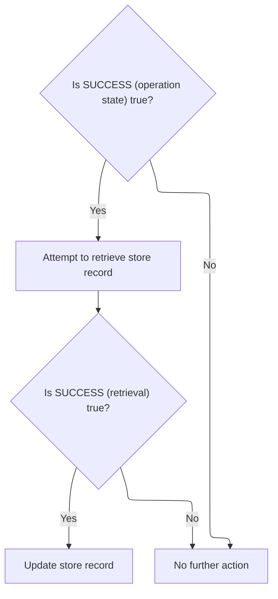

<SwmSnippet path="/base/src/MMMS0161.cbl" line="179">

---

`1000-DO-THE-SYNC` checks for success, gets the store data, and only updates it if the get worked. This keeps the sync process clean and avoids bad updates.

```cobol
018400 1000-DO-THE-SYNC.                                                00018400
018500     IF SUCCESS                                                   00018500
018600       PERFORM 1400-GET-DDDTRL01                                  00018600
018700       IF SUCCESS                                                 00018700
018800         PERFORM 1500-UPDATE-DDDTRL01                             00018800
018900       END-IF                                                     00018900
019000     END-IF                                                       00019000
019100     .                                                            00019100
```

---

</SwmSnippet>

<SwmSnippet path="/base/src/MMMS0161.cbl" line="194">

---

`1400-GET-DDDTRL01` translates location data to old format, tries to get the store row, and sets flags based on whether the row exists or not. It builds error messages using the store key and SQLCODE if needed.

```cobol
019900 1400-GET-DDDTRL01.                                               00019900
020000     PERFORM 9000-TRANSLATE-TO-OLD                                00020000
020100     IF SUCCESS                                                   00020100
020200       SET DDDTRL01-EXISTS            TO TRUE                     00020200
020300       SET EXIT-GET-UNIQUE-ROW        TO TRUE                     00020300
020400       PERFORM 9200-CALL-DDDTRL01-DAO                             00020400
020500                                                                  00020500
020600       EVALUATE TRUE                                              00020600
020700         WHEN SQLCODE = 100                                       00020700
020800           SET  DDDTRL01-DOES-NOT-EXIST TO TRUE                   00020800
020900           SET  FAILURE                 TO TRUE                   00020900
021000           MOVE 'MMMS0161 - Store not found in DB2 Table (FCRL)!' 00021000
021100             TO IS-RTRN-MSG-TXT                                   00021100
021200                                                                  00021200
021300         WHEN SQLCODE NOT = 0                                     00021300
021400           SET  FAILURE TO TRUE                                   00021400
021500           MOVE SQLCODE TO WS-SQLCODE                             00021500
021600           MOVE SPACES  TO IS-RTRN-MSG-TXT                        00021600
021700           STRING 'MMMS0161 - Error reading DB2 Store, '          00021700
021800                  'key='      ST-STORE-KEY OF DDDPST01            00021800
021900                  ',SQL=' WS-SQLCODE '.'                          00021900
022000                  DELIMITED BY SIZE INTO IS-RTRN-MSG-TXT          00022000
022100       END-EVALUATE                                               00022100
022200     END-IF                                                       00022200
022300     .                                                            00022300
```

---

</SwmSnippet>

#### Deleting Store Zone Data and Clearing Classification Fields

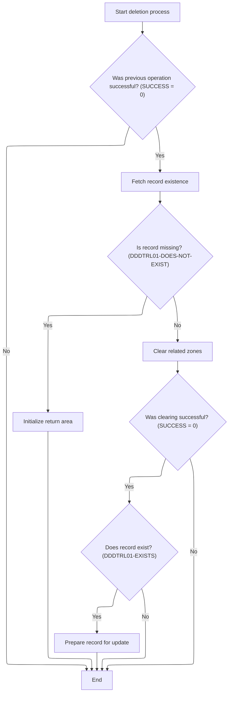

<SwmSnippet path="/base/src/MMMS0161.cbl" line="270">

---

`2000-DO-THE-DELETE` runs the store data fetch, and if the store doesn't exist, it resets the working record. If the fetch is successful, it clears the relevant ad zone and exception fields based on the item class code, then updates the store record if it exists. The clearing logic is a switch-case on item class, and only recognized codes trigger field resets. If the code isn't handled, nothing happens and no error is raised. This keeps the zone data clean for valid classes but ignores anything unexpected.

```cobol
027500 2000-DO-THE-DELETE.                                              00027500
027600     IF SUCCESS                                                   00027600
027700       PERFORM 1400-GET-DDDTRL01                                  00027700
027800       IF  NOT SUCCESS                                            00027800
027900       AND DDDTRL01-DOES-NOT-EXIST                                00027900
028000         INITIALIZE XXXN001A                                      00028000
028100       END-IF                                                     00028100
028200     END-IF                                                       00028200
028300                                                                  00028300
028400     IF SUCCESS                                                   00028400
028500       PERFORM 2010-CLEAR-ZONE                                    00028500
028600       IF SUCCESS                                                 00028600
028700         IF DDDTRL01-EXISTS                                       00028700
028800           PERFORM 1520-READY-UPD-DDDTRL01                        00028800
028900         END-IF                                                   00028900
029000       END-IF                                                     00029000
029100     END-IF                                                       00029100
029200     .                                                            00029200
```

---

</SwmSnippet>

<SwmSnippet path="/base/src/MMMS0161.cbl" line="290">

---

`2010-CLEAR-ZONE` uses a switch-case on ITM-CLS-CD to clear ad zone and exception fields for class codes 12, 13, 14, 36, and 37. If the code isn't one of these, the function does nothing and doesn't report an error. The mapping of codes to fields is domain-specific and not obvious from the code alone.

```cobol
029500 2010-CLEAR-ZONE.                                                 00029500
029600     EVALUATE ITM-CLS-CD                                          00029600
029700      WHEN 12                                                     00029700
029800        INITIALIZE ST-CLASS12-ZONE                                00029800
029900                   ST-CLASS12-EXCEPTION-AD-ZONE                   00029900
030000                   FC-RL-CL12-ZONE-NO                             00030000
030100                   FC-RL-CL12-ADZN-NO                             00030100
030200      WHEN 13                                                     00030200
030300        INITIALIZE ST-CLASS13-ZONE                                00030300
030400                   ST-CLASS13-EXCEPTION-AD-ZONE                   00030400
030500                   FC-RL-CL13-ZONE-NO                             00030500
030600                   FC-RL-CL13-ADZN-NO                             00030600
030700      WHEN 14                                                     00030700
030800        INITIALIZE ST-CLASS14-ZONE                                00030800
030900                   ST-CLASS14-EXCEPTION-AD-ZONE                   00030900
031000                   FC-RL-CL14-ZONE-NO                             00031000
031100                   FC-RL-CL14-ADZN-NO                             00031100
031200      WHEN 36                                                     00031200
031300        INITIALIZE ST-CLASS36-EXCEPTION-AD-ZONE                   00031300
031400                   FC-RL-CL36-ADZN-NO                             00031400
031500      WHEN 37                                                     00031500
031600        INITIALIZE ST-CLASS37-EXCEPTION-AD-ZONE                   00031600
031700                   FC-RL-CL37-ADZN-NO                             00031700
031800     END-EVALUATE                                                 00031800
031900     .                                                            00031900
```

---

</SwmSnippet>

#### Syncing and Issuing Events After Zone Deletion

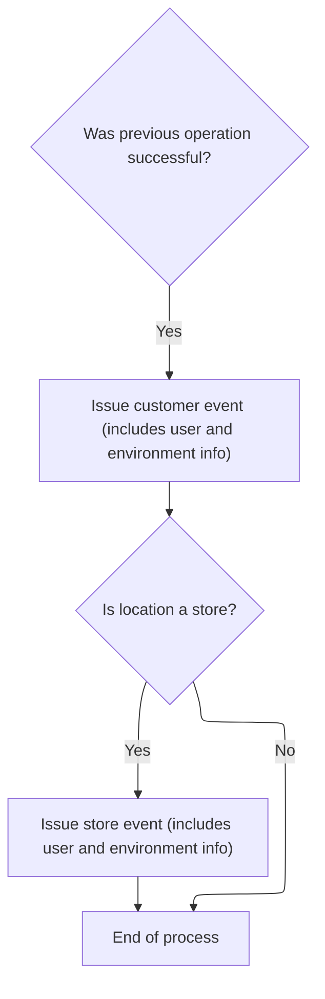

<SwmSnippet path="/base/src/NNNS0473.cbl" line="573">

---

`2030-ISSUE-EVENTS` builds and sends event payloads using repo-specific structures and constants. It always issues a customer event, and if the location is a store, it sends a second store event. The event manager call uses hardcoded IDs and program names, and relies on user/environment fields set earlier. This logic is tightly coupled to the repo's business rules.

```cobol
061700 2030-ISSUE-EVENTS.                                               00061700
061710     SET YYYN110A-ORACLE        TO TRUE                           00061710
061800     PERFORM 2040-GET-CURRENT-USER                                00061800
061900     IF SUCCESS                                                   00061900
062000       MOVE LOC-NBR OF P-DDDTCZ01 TO ST-STORE-NUMBER OF ZZZC0032  00062000
062100                                     LOC-NBR OF ZZZC0094          00062100
062200       SET  ZZZC0032-UPD-FXXX     TO TRUE                         00062200
062300       MOVE ZZZC0032              TO ZZZC0197-TRX-REC             00062300
062400       MOVE 'CUST'                TO ZZZC0197-TRX-ID              00062400
062500       MOVE 'NNNS0473'            TO ZZZC0197-PROGRAM             00062500
062600       MOVE YYYC0107-USER         TO ZZZC0197-USER                00062600
062700       MOVE YYYN005A-SYS-ENV      TO YYYN110A-SYS-ENV             00062700
062800       CALL ZZZS0197-EVENT-MGR USING                              00062800
062900           XXXN001A                                               00062900
063000           YYYN110A                                               00063000
063100           ZZZC0197                                               00063100
063200                                                                  00063200
063300       EVALUATE TRUE                                              00063300
063400                                                                  00063400
063500       WHEN LOC-TYP-CD   OF P-DDDTCZ01 = K-STORE-LOC-TYPE         00063500
063600         MOVE LOC-TYP-CD OF P-DDDTCZ01 TO                         00063600
063700                                       LOC-TYP-CD OF ZZZC0094     00063700
063800         MOVE ZZZC0094              TO ZZZC0197-TRX-REC           00063800
063900         MOVE 'STRM'                TO ZZZC0197-TRX-ID            00063900
064000         MOVE 'NNNS0473'            TO ZZZC0197-PROGRAM           00064000
064100         MOVE YYYC0107-USER         TO ZZZC0197-USER              00064100
064200         MOVE YYYN005A-SYS-ENV      TO YYYN110A-SYS-ENV           00064200
064300         CALL ZZZS0197-EVENT-MGR USING                            00064300
064400              XXXN001A                                            00064400
064500              YYYN110A                                            00064500
064600              ZZZC0197                                            00064600
064700                                                                  00064700
064800       END-EVALUATE                                               00064800
064900     END-IF                                                       00064900
065000     .                                                            00065000
```

---

</SwmSnippet>

### Validating and Inserting New Zone Row

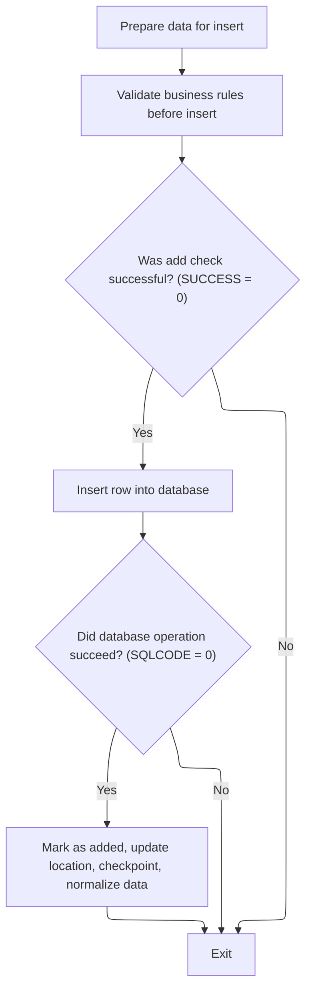

<SwmSnippet path="/base/src/NNNS0473.cbl" line="494">

---

`1500-EXIT-PUT-INSERT-ROW` runs null indicator edits, then calls an external validation for the new zone row. If the check passes, it updates the DB, sets checkpoint and business flags, and triggers denormalization and event handling. The insertion check blocks bad data from getting into the table.

```cobol
051900 1500-EXIT-PUT-INSERT-ROW.                                        00051900
052000     PERFORM 1800-EDIT-NULL-INDICATORS                            00052000
052100                                                                  00052100
052200     PERFORM 4600-CALL-MMMS0335-RI-ADD-CHK                        00052200
052300     IF SUCCESS                                                   00052300
053600        PERFORM 5000-CALL-NNNS0473-CUD-ROUTINE                    00053600
053700        IF SQLCODE = 0                                            00053700
053800           MOVE 1 TO WS-CHECKPOINT-INC                            00053800
053900           SET YYYN110A-ADD TO TRUE                               00053900
054000           SET LOC-UPD      TO TRUE                               00054000
054100           PERFORM 2000-DENORM-PROCESS                            00054100
054200        END-IF                                                    00054200
054210     END-IF                                                       00054210
054300     .                                                            00054300
```

---

</SwmSnippet>

### Preparing and Validating Zone Data for Insert

<SwmSnippet path="/base/src/NNNS0473.cbl" line="622">

---

`4600-CALL-MMMS0335-RI-ADD-CHK` sets up the validation structure by copying fields from the input, sets flags for insert and Oracle, then calls the external validation routine. It assumes the input is good and leaves all checks to the called subroutine.

```cobol
066320 4600-CALL-MMMS0335-RI-ADD-CHK.                                   00066320
066330     INITIALIZE MMMC0335                                          00066330
066340     MOVE ITM-CLS-CD                   OF DCLXXXL-LOC-CLS-AD-ZN   00066340
066350                                       TO MMMC0335-ITM-CLS-CD     00066350
066360     MOVE AD-ZONE-EXCP                 OF DCLXXXL-LOC-CLS-AD-ZN   00066360
066370                                       TO MMMC0335-AD-ZONE-EXCP   00066370
066371     MOVE AD-ZONE                      OF DCLXXXL-LOC-CLS-AD-ZN   00066371
066372                                       TO MMMC0335-AD-ZONE        00066372
066380     SET   MMMC0335-INSERT-CHECK       TO TRUE                    00066380
066390     SET   MMMC0335-XXXL-LOC-CLS-AD-ZN TO TRUE                    00066390
066391     SET   MMMC0335-ORACLE             TO TRUE                    00066391
066392     CALL  MMMC0335-RI-INSERT-CHK      USING                      00066392
066393           XXXN001A                                               00066393
066394           MMMC0335                                               00066394
066395     .                                                            00066395
```

---

</SwmSnippet>

### Dispatching and Validating Vendor Location Operations

<SwmSnippet path="/base/src/MMMS0335.cbl" line="86">

---

`000-MAIN-LINE` runs initialization, then dispatches to a specific validation subroutine based on the table code. If the code isn't recognized, it sets a failure and error message. If Oracle is needed, it connects before returning. The dispatch logic is strict—only codes 001-011 are valid.

```cobol
010600 000-MAIN-LINE.                                                   00010600
010700     PERFORM 010-INITIALIZE                                       00010700
010800     EVALUATE MMMC0335-TABLE                                      00010800
010900       WHEN 001                                                   00010900
011100       WHEN 002                                                   00011100
011300       WHEN 003                                                   00011300
011500       WHEN 004                                                   00011500
011600         CONTINUE                                                 00011600
011700       WHEN 005                                                   00011700
011800         PERFORM 500-CHK-XXX-VEND-LOC                             00011800
011900       WHEN 006                                                   00011900
012000         PERFORM 600-CHK-LOC-SHPNG-OPT                            00012000
012100       WHEN 007                                                   00012100
012200         PERFORM 700-CHK-RETAIL-LOC                               00012200
012300       WHEN 008                                                   00012300
012400         PERFORM 800-CHK-RETL-LOC-CLS-AD-ZN                       00012400
012500       WHEN 009                                                   00012500
012600         PERFORM 900-CHK-XXX-VEND-LOC                             00012600
012700       WHEN 010                                                   00012700
012800         PERFORM 1000-CHK-VEND-TRXAL-CNTL                         00012800
012900       WHEN 011                                                   00012900
013000         PERFORM 1100-CHK-VENDOR-COMMENTS                         00013000
013100       WHEN OTHER                                                 00013100
013200         SET FAILURE   TO TRUE                                    00013200
013300         MOVE SPACES  TO IS-RTRN-MSG-TXT                          00013300
013400         STRING 'MMMS0335 - invalid table passed '                00013400
013500                DELIMITED BY SIZE INTO IS-RTRN-MSG-TXT            00013500
013600     END-EVALUATE                                                 00013600
013700     IF MMMC0335-ORACLE                                           00013700
013800       MOVE XXXN001A   TO  WS-XXXN001A                            00013800
013900       MOVE SQLCA      TO  WS-SQLCA                               00013900
014000       PERFORM 020-CONNECT-TO-ORACLE                              00014000
014100       MOVE WS-XXXN001A  TO XXXN001A                              00014100
014200       MOVE WS-SQLCA     TO SQLCA                                 00014200
014300     END-IF                                                       00014300
014400                                                                  00014400
014500     GOBACK                                                       00014500
014600     .                                                            00014600
```

---

</SwmSnippet>

#### Initializing and Connecting for Insert Validation

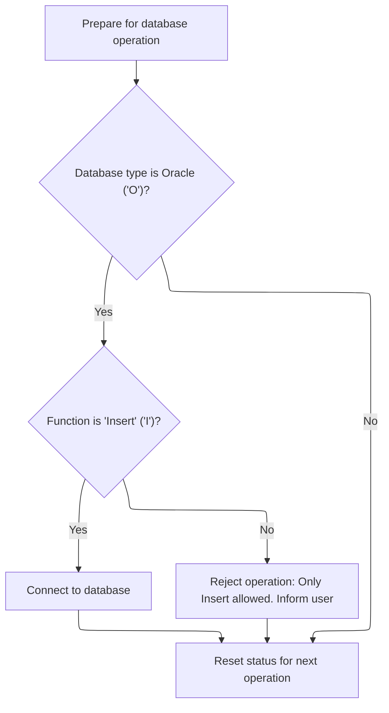

<SwmSnippet path="/base/src/MMMS0335.cbl" line="129">

---

`010-INITIALIZE` sets up the environment, checks if Oracle is flagged, and only connects to DB2 if the function is insert. If not, it fails and sets an error message. The status field is reset at the end. The logic is strict about what triggers DB2 connection.

```cobol
015200 010-INITIALIZE.                                                  00015200
015300     INITIALIZE XXXN001A                                          00015300
015400                WS-XXXN001A                                       00015400
015500                WS-SQLCA                                          00015500
015600                                                                  00015600
015700     IF MMMC0335-ORACLE                                           00015700
015800       IF MMMC0335-FUNC  = 'I'                                    00015800
015900         PERFORM 015-CONNECT-TO-DB2                               00015900
016000       ELSE                                                       00016000
016100         SET FAILURE TO TRUE                                      00016100
016200         MOVE SPACES  TO IS-RTRN-MSG-TXT                          00016200
016300         STRING 'MMMS0335 - invalid function passed '             00016300
016400                'function should be insert'                       00016400
016500                DELIMITED BY SIZE INTO IS-RTRN-MSG-TXT            00016500
016600       END-IF                                                     00016600
016700     END-IF                                                       00016700
016800                                                                  00016800
016900     MOVE SPACES   TO MMMC0335-STATUS                             00016900
017000     .                                                            00017000
```

---

</SwmSnippet>

<SwmSnippet path="/base/src/MMMS0335.cbl" line="153">

---

`015-CONNECT-TO-DB2` calls Z-DB2-CONNECT to set up the DB2 connection, handle error translation, and restore any backup record data. This is needed before any DB2-specific validation or insert logic.

```cobol
017600 015-CONNECT-TO-DB2.                                              00017600
017700     CALL Z-DB2-CONNECT         USING XXXN001A                    00017700
017800                                      SQLCA                       00017800
017900     .                                                            00017900
```

---

</SwmSnippet>

#### Checking Retail Location and Related Attributes

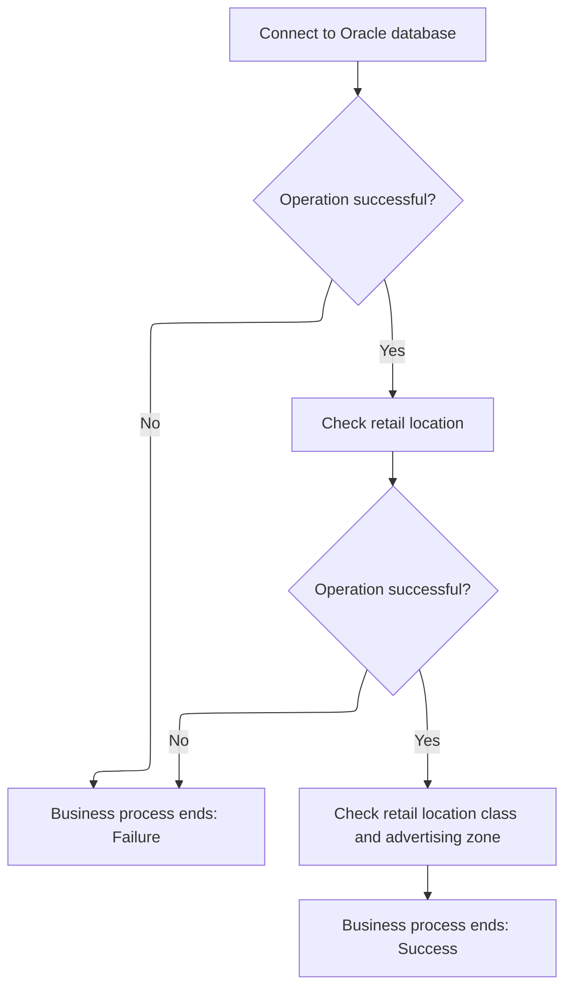

<SwmSnippet path="/base/src/MMMS0335.cbl" line="260">

---

`700-CHK-RETAIL-LOC` checks if the previous operation succeeded, then runs the e-commerce market area check. If that also succeeds and the parent flag is set, it runs the computer type check. The parent flag is a hidden dependency that controls extra validation.

```cobol
046200 700-CHK-RETAIL-LOC.                                              00046200
046300      IF SUCCESS                                                  00046300
046400*       PERFORM 705-CHK-ECOMM-MKT-AREA                            00046400
046500*       IF SUCCESS AND MMMC0335-PARENT                            00046500
046600*         PERFORM 710-CHK-CMPTR-TYP                               00046600
046700*       END-IF                                                    00046700
046800        CONTINUE                                                  00046800
046900      END-IF                                                      00046900
047000      .                                                           00047000
```

---

</SwmSnippet>

<SwmSnippet path="/base/src/MMMS0335.cbl" line="308">

---

`800-CHK-RETL-LOC-CLS-AD-ZN` runs the item class check if the previous step succeeded, then runs the AA-ZONES check if both success and parent flag are set. This is a chained validation flow, not parallel.

```cobol
054700 800-CHK-RETL-LOC-CLS-AD-ZN.                                      00054700
054800      IF SUCCESS                                                  00054800
054900*       PERFORM 805-CHK-ITM-CLS                                   00054900
055000*       IF SUCCESS AND MMMC0335-PARENT                            00055000
055100*         PERFORM 810-CHK-AA-ZONES                                00055100
055200*       END-IF                                                    00055200
055300        CONTINUE                                                  00055300
055400      END-IF                                                      00055400
055500      .                                                           00055500
```

---

</SwmSnippet>

<SwmSnippet path="/base/src/MMMS0335.cbl" line="162">

---

`020-CONNECT-TO-ORACLE` calls Z-ORA-CONNECT to set up the Oracle DB connection and prep system variables. This is needed before any Oracle-specific validation or data handling.

```cobol
018500 020-CONNECT-TO-ORACLE.                                           00018500
018600     CALL Z-ORA-CONNECT USING XXXN001A                            00018600
018700                              SQLCA                               00018700
018800     .                                                            00018800
```

---

</SwmSnippet>

### Purging Zone Row and Triggering Sync

<SwmSnippet path="/base/src/NNNS0473.cbl" line="510">

---

`1600-EXIT-PUT-PURGE-ROW` calls the DB update routine, and if the SQL succeeds, sets checkpoint and delete flags, marks the row as updated, and triggers denormalization and event handling. The update call is used for both deletes and updates to keep downstream logic consistent.

```cobol
054600 1600-EXIT-PUT-PURGE-ROW.                                         00054600
055300     PERFORM 5000-CALL-NNNS0473-CUD-ROUTINE                       00055300
055400     IF SQLCODE = 0                                               00055400
055500       MOVE 1 TO WS-CHECKPOINT-INC                                00055500
055600       SET YYYN110A-DEL TO TRUE                                   00055600
055700       SET LOC-UPD      TO TRUE                                   00055700
055800       PERFORM 2000-DENORM-PROCESS                                00055800
055900     END-IF                                                       00055900
056000     .                                                            00056000
```

---

</SwmSnippet>

&nbsp;

*This is an auto-generated document by Swimm 🌊 and has not yet been verified by a human*

<SwmMeta version="3.0.0" repo-id="Z2l0aHViJTNBJTNBU3dpbW1pby1keW5jYWxsLWRlbW8lM0ElM0FHaXJpLVN3aW1t" repo-name="Swimmio-dyncall-demo"><sup>Powered by [Swimm](https://app.swimm.io/)</sup></SwmMeta>
