This document describes how department table operations are dispatched and executed. Each request is identified by an exit code, which determines the business operation to perform—such as opening or closing a cursor, fetching, modifying, inserting, or purging a department row. Audit fields are updated and business events are issued when data changes occur. The flow concludes with cleanup and finalization.

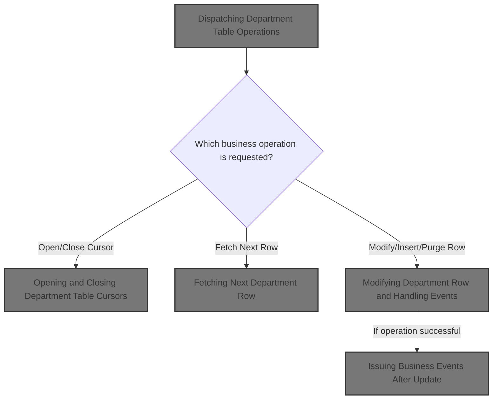

# Spec

## Detailed View of the Program's Functionality

## Main Program Entry and Operation Dispatch

The main entry point for department table operations first resets all relevant state and data structures to ensure a clean start for each request. It then checks which business operation is requested by evaluating a symbolic code that represents the desired action (such as opening a cursor, inserting a row, fetching, modifying, purging, or performing special I/O). Each code triggers a specific subroutine that performs the corresponding database operation. If the code does not match any known operation, the program simply continues without taking action. After the requested operation is performed, a cleanup routine is called to finalize the process before returning control.

---

## Preparing Department Data Structures

Before any database operation, the program initializes all department-related fields, resets status indicators, and synchronizes index handles. It clears checkpoint and SQL status values to ensure no residual state affects the new operation. If the operation is not a cursor close, it copies all department master data fields from the input structure to the working structure, ensuring that the latest data is used for database operations. If the operation involves inserting, purging, or modifying a row, the program establishes a connection to the Oracle database to prepare for these actions.

---

## Establishing Oracle Connectivity

When a connection to Oracle is required, the program calls an external routine to set up the database connection. If the connection attempt fails, it captures the error code and constructs an error message for reporting. This step ensures that subsequent department operations have the necessary database connectivity.

---

## Initializing and Routing Connection Requests

For connection management, a dedicated entry point sets up the environment and then calls a routine to switch the active database connection to Oracle. This routine sets a flag indicating the desired connection type and invokes a connection manager, which performs the actual switch and updates usage statistics.

---

## Switching Active Database Connection

To change the active database environment, the program sets a flag for the desired connection type (Oracle or DB2) and calls a connection manager. This manager checks the requested operation and routes to the appropriate subroutine to switch the connection, update statistics, or handle reporting. If the requested operation is not recognized, it sets a failure flag and records an error message.

---

## Managing Connection State and Statistics

The connection manager maintains counters for total requests, requests by database type, and connection switches. It can report the current connection type, reset statistics, and allow external overrides of the connection state. When switching to DB2, it increments counters, checks if a switch is needed, and connects to either the production or test environment based on configuration. If the connection fails, it records the error. When switching to Oracle, it similarly increments counters, checks the environment, and connects to the appropriate Oracle instance, handling errors as needed. The manager can also report all usage statistics and reset them to zero.

---

## Opening and Closing Department Table Cursors

When requested to open or close a database cursor for department queries, the program checks the validity of the cursor identifier. If valid, it opens or closes the corresponding cursor; otherwise, it sets a failure flag and records an error message. This mechanism ensures that only recognized cursors are used for department data operations.

---

## Fetching Next Department Row

To retrieve the next department row, the program checks which cursor is active and calls the appropriate fetch routine. If the cursor identifier is invalid, it sets a failure flag and records an error message. After fetching, it checks for null columns to ensure the integrity of the retrieved data.

---

## Modifying Department Row and Handling Events

When modifying a department row, the program first prepares the data by editing null indicators and capturing audit information such as the current date and user. If all checks pass, it retrieves the current values from the database and performs the update. This sequence ensures that modifications are tracked and only occur when all prerequisites are met.

---

## Updating Department Row and Triggering Events

After updating a department row, the program stamps the record with the new timestamp and user, then performs the update operation. If the update is successful, it sets flags to indicate the update status and triggers further processing if the department name has changed. This may include staging an event for downstream systems and denormalizing the record.

---

## Issuing Business Events After Update

Following a successful update or denormalization, the program sets the operational environment and calls a control subroutine. If the control process succeeds, it issues business events to notify other systems of the department update. If the control process fails, no events are issued.

---

## Event Payload Construction and Issuance

To issue business events, the program constructs an event payload containing department data and system environment information. It sets transaction and program identifiers and calls an event manager to issue the event. If certain flags are set and the update succeeded, it may issue a secondary event with modified data to reflect additional changes.

---

## Filtering and Issuing Master Data Events

When issuing master data events, the program first initializes its state and then applies filtering rules. Events are only processed if they match specific transaction types and the batch environment is active. If the event passes these checks, it is further screened for duplicates before being issued.

---

## Filtering Events by Transaction Type and Duplicates

The event filtering routine marks events for processing if their transaction type matches a hard-coded list and the batch environment is active. It then checks for duplicate events by comparing the current event data with previously processed events. Only non-duplicate, qualifying events are marked for processing and issued.

---

## Inserting a Department Row

When inserting a new department row, the program prepares all required fields and retrieves audit information. If successful, it proceeds to insert the new row into the database.

---

## Assigning ORG_ID and Completing Insert

Before inserting a new department row, the program retrieves the next available organization identifier by checking both the location and department tables. If successful, it updates audit fields and inserts the new row. If the insert succeeds, it marks the operation for checkpointing and triggers denormalization to update downstream systems.

---

## Purging a Department Row

To delete a department row, the program first checks if the row can be deleted by calling an external routine. If the check is successful, it deletes the row from the database, sets flags to mark the row as deleted, increments the checkpoint, and performs cleanup. If any step fails, no action is taken.

# Rule Definition

| Paragraph Name                                                                            | Rule ID | Category          | Description                                                                                                                                                                                     | Conditions                                                  | Remarks                                                                                                                                                                                                                                                  |
| ----------------------------------------------------------------------------------------- | ------- | ----------------- | ----------------------------------------------------------------------------------------------------------------------------------------------------------------------------------------------- | ----------------------------------------------------------- | -------------------------------------------------------------------------------------------------------------------------------------------------------------------------------------------------------------------------------------------------------- |
| 100-INITIALIZATION                                                                        | RL-001  | Data Assignment   | Before performing any operation, the dispatcher must initialize all department-related fields and status areas to ensure a clean state.                                                         | Always, before any operation is performed.                  | The initialization includes the status area (XXXN001A), department record, and any DB2-specific or DAO return code fields. All fields are set to their default or blank values as appropriate.                                                           |
| PROCEDURE DIVISION USING                                                                  | RL-002  | Data Assignment   | The dispatcher must accept a department record, dispatcher control structure, status area, and SQLCA as input for all operations.                                                               | On every invocation of the dispatcher program.              | Inputs are department record (P-DDDTDP01), dispatcher control structure (NNNN0000-PARMS), status area (XXXN001A), and SQLCA. These are passed via the PROCEDURE DIVISION USING clause.                                                                   |
| 0000-EXIT-DISPATCHER (EVALUATE TRUE)                                                      | RL-003  | Conditional Logic | The dispatcher determines which operation to perform by checking which symbolic exit code field in the control structure is set to its numeric value. Only one operation code is set at a time. | On every invocation, before performing any operation.       | Operation codes are mutually exclusive. Examples: EXIT-OPEN-CURSOR (1), EXIT-CLOSE-CURSOR (2), EXIT-GET-UNIQUE-ROW (3), EXIT-GET-NEXT-ROW (5), EXIT-PUT-MODIFY-ROW (8), EXIT-PUT-INSERT-ROW (9), EXIT-PUT-PURGE-ROW (10), EXIT-DO-SPECIAL-IO-FUNCS (90). |
| 1000-EXIT-OPEN-CURSOR, 1100-EXIT-CLOSE-CURSOR                                             | RL-004  | Conditional Logic | When opening or closing a cursor, the dispatcher must validate that the cursor ID is either DDDXDP01 or DDDXDP02.                                                                               | When EXIT-OPEN-CURSOR or EXIT-CLOSE-CURSOR is set.          | Valid cursor IDs are DDDXDP01 and DDDXDP02. If an invalid ID is provided, set FAILURE to TRUE and return an error message in the status area.                                                                                                            |
| 1200-EXIT-GET-UNIQUE-ROW, 1700-CHECK-NULL-COLUMNS                                         | RL-005  | Computation       | When fetching a department row by primary key, update the department record with the result and check all columns for null values.                                                              | When EXIT-GET-UNIQUE-ROW is set.                            | All columns in the result must be checked for null values after fetch. Null handling logic may be implemented in a separate paragraph.                                                                                                                   |
| 1300-EXIT-GET-NEXT-ROW, 1301-FETCH-DDDXDP01, 1302-FETCH-DDDXDP02, 1700-CHECK-NULL-COLUMNS | RL-006  | Computation       | When fetching the next department row using the active cursor, update the department record and check all columns for null values.                                                              | When EXIT-GET-NEXT-ROW is set.                              | Fetch is performed using the currently open cursor (DDDXDP01 or DDDXDP02). All columns must be checked for null values after fetch.                                                                                                                      |
| 1400-EXIT-PUT-MODIFY-ROW, 1405-GET-CURR-VALUES, 1410-DO-MODIFY-ROW, 2000-DENORM-PROCESS   | RL-007  | Computation       | When updating a department row, update audit fields (last update user and timestamp). If the department name changes, trigger the event process.                                                | When EXIT-PUT-MODIFY-ROW is set.                            | Audit fields are last update user and timestamp. If department name changes, set STAGE-EVENT to TRUE and perform denormalization/event process.                                                                                                          |
| 1500-EXIT-PUT-INSERT-ROW, 1510-D0-INSERT-ROW, 1520-EXIT-GET-ORG-ID, 2000-DENORM-PROCESS   | RL-008  | Computation       | When inserting a new department row, assign the next available ORG-ID by selecting the maximum from LOCATION and XXX_DEPT and adding 1. Update audit fields before insert.                      | When EXIT-PUT-INSERT-ROW is set.                            | ORG-ID is computed as GREATEST(MAX(LOC.ORG_ID), MAX(DEPT.ORG_ID)) + 1. Audit fields are updated before insert. After insert, perform denormalization/event process.                                                                                      |
| 1600-EXIT-PUT-PURGE-ROW, 4500-CALL-MMMS0304-RI-DEL-CHK, 2000-DENORM-PROCESS               | RL-009  | Computation       | Before deleting a department row, check if deletion is allowed. If so, delete the row, mark the record as deleted, and trigger the denormalization process.                                     | When EXIT-PUT-PURGE-ROW is set.                             | Deletion check is performed by a separate routine. After successful deletion, set delete flags and perform denormalization/event process.                                                                                                                |
| 10000-DO-SPECIAL-IO-FUNCS                                                                 | RL-010  | Computation       | If the special I/O function code is set, perform the special function as defined for the repository.                                                                                            | When EXIT-DO-SPECIAL-IO-FUNCS is set.                       | Special I/O functions are repository-specific and may be implemented as needed.                                                                                                                                                                          |
| 120-EXIT-STUFF                                                                            | RL-011  | Data Assignment   | After any operation, update the status area with success/failure and error message, and update SQLCA with the SQLCODE from the DB operation.                                                    | After every operation, regardless of outcome.               | Status area (XXXN001A) contains success/failure and error message. SQLCA is updated with the SQLCODE from the last DB operation.                                                                                                                         |
| 120-EXIT-STUFF                                                                            | RL-012  | Data Assignment   | The dispatcher must always finalize and clean up state before returning, regardless of operation outcome.                                                                                       | At the end of every invocation, before returning.           | Finalization includes moving any checkpoint increments, resetting or updating any state as needed, and ensuring all outputs are up to date.                                                                                                              |
| 110-MOVE-PDA-FIELDS-2-DCL, 130-MOVE-DCL-2-PDA-FIELDS                                      | RL-013  | Data Assignment   | All field mappings between the program data area (PDA), DCL, and DB must be one-to-one, except that if ORG-ID-X is blank in PDA, ORG-ID must be set to zero before use.                         | Whenever moving data between PDA, DCL, and DB structures.   | All fields are mapped directly except ORG-ID, which is set to zero if ORG-ID-X is blank in the PDA.                                                                                                                                                      |
| 0000-EXIT-DISPATCHER (EVALUATE TRUE, WHEN NOT SUCCESS)                                    | RL-014  | Conditional Logic | If the operation code is not recognized or not set, the dispatcher must perform no action and return immediately.                                                                               | If no valid operation code is set in the control structure. | No operation is performed. Status area may be updated to indicate no action taken.                                                                                                                                                                       |
| PROCEDURE DIVISION USING, 120-EXIT-STUFF                                                  | RL-015  | Data Assignment   | The dispatcher must always return the updated department record, status area, and SQLCA as output, regardless of the operation performed.                                                       | At the end of every invocation.                             | Outputs are department record (P-DDDTDP01), status area (XXXN001A), and SQLCA, all updated with the results of the operation.                                                                                                                            |

# User Stories

## User Story 1: Dispatcher Lifecycle Management

---

### Story Description:

As a system, I want the dispatcher to initialize all department-related fields and status areas before any operation, accept and return the required input/output structures, finalize and clean up state, and always update the status area and SQLCA, so that all operations are performed reliably and outputs are consistent.

---

### Business Rule Mapping:

| Rule ID | Paragraph Name                           | Rule Description                                                                                                                             |
| ------- | ---------------------------------------- | -------------------------------------------------------------------------------------------------------------------------------------------- |
| RL-001  | 100-INITIALIZATION                       | Before performing any operation, the dispatcher must initialize all department-related fields and status areas to ensure a clean state.      |
| RL-002  | PROCEDURE DIVISION USING                 | The dispatcher must accept a department record, dispatcher control structure, status area, and SQLCA as input for all operations.            |
| RL-015  | PROCEDURE DIVISION USING, 120-EXIT-STUFF | The dispatcher must always return the updated department record, status area, and SQLCA as output, regardless of the operation performed.    |
| RL-011  | 120-EXIT-STUFF                           | After any operation, update the status area with success/failure and error message, and update SQLCA with the SQLCODE from the DB operation. |
| RL-012  | 120-EXIT-STUFF                           | The dispatcher must always finalize and clean up state before returning, regardless of operation outcome.                                    |

---

### Relevant Functionality:

- **100-INITIALIZATION**
  1. **RL-001:**
     - Initialize status area
     - Initialize department-related working storage and return code fields
     - Set SQLCODE and other flags to zero or default values
     - If not closing cursor, move PDA fields to DCL structure
     - If operation involves Oracle or certain operations, connect to Oracle
- **PROCEDURE DIVISION USING**
  1. **RL-002:**
     - Define PROCEDURE DIVISION USING with all required input structures
     - Use these structures throughout the program for all operations
  2. **RL-015:**
     - Ensure all output structures are updated before returning
     - Return department record, status area, and SQLCA
- **120-EXIT-STUFF**
  1. **RL-011:**
     - After operation, set status area fields to indicate success or failure
     - Move error message if any
     - Move SQLCODE to SQLCA
  2. **RL-012:**
     - Add checkpoint increments if needed
     - Reset or update any working storage state
     - Ensure all output structures are current

## User Story 2: Operation Code Evaluation and Control Flow

---

### Story Description:

As a system, I want the dispatcher to determine which operation to perform based on the operation code, perform no action if the code is not recognized or not set, and ensure only one operation is performed at a time, so that dispatcher logic is predictable and safe.

---

### Business Rule Mapping:

| Rule ID | Paragraph Name                                         | Rule Description                                                                                                                                                                                |
| ------- | ------------------------------------------------------ | ----------------------------------------------------------------------------------------------------------------------------------------------------------------------------------------------- |
| RL-003  | 0000-EXIT-DISPATCHER (EVALUATE TRUE)                   | The dispatcher determines which operation to perform by checking which symbolic exit code field in the control structure is set to its numeric value. Only one operation code is set at a time. |
| RL-014  | 0000-EXIT-DISPATCHER (EVALUATE TRUE, WHEN NOT SUCCESS) | If the operation code is not recognized or not set, the dispatcher must perform no action and return immediately.                                                                               |

---

### Relevant Functionality:

- **0000-EXIT-DISPATCHER (EVALUATE TRUE)**
  1. **RL-003:**
     - Evaluate each possible operation code in priority order
     - If a code is set, perform the corresponding operation
     - If no code is set, perform no action and return immediately
- **0000-EXIT-DISPATCHER (EVALUATE TRUE**
  1. **RL-014:**
     - Check if any valid operation code is set
     - If not, return immediately without performing any operation

## User Story 3: Cursor Management and Department Query Operations

---

### Story Description:

As a user, I want to open or close department query cursors with valid IDs, fetch department rows by primary key or using the active cursor, and have all columns checked for null values, so that I can reliably access and validate department data through controlled database operations.

---

### Business Rule Mapping:

| Rule ID | Paragraph Name                                                                            | Rule Description                                                                                                                             |
| ------- | ----------------------------------------------------------------------------------------- | -------------------------------------------------------------------------------------------------------------------------------------------- |
| RL-004  | 1000-EXIT-OPEN-CURSOR, 1100-EXIT-CLOSE-CURSOR                                             | When opening or closing a cursor, the dispatcher must validate that the cursor ID is either DDDXDP01 or DDDXDP02.                            |
| RL-005  | 1200-EXIT-GET-UNIQUE-ROW, 1700-CHECK-NULL-COLUMNS                                         | When fetching a department row by primary key, update the department record with the result and check all columns for null values.           |
| RL-006  | 1300-EXIT-GET-NEXT-ROW, 1301-FETCH-DDDXDP01, 1302-FETCH-DDDXDP02, 1700-CHECK-NULL-COLUMNS | When fetching the next department row using the active cursor, update the department record and check all columns for null values.           |
| RL-011  | 120-EXIT-STUFF                                                                            | After any operation, update the status area with success/failure and error message, and update SQLCA with the SQLCODE from the DB operation. |
| RL-012  | 120-EXIT-STUFF                                                                            | The dispatcher must always finalize and clean up state before returning, regardless of operation outcome.                                    |
| RL-015  | PROCEDURE DIVISION USING, 120-EXIT-STUFF                                                  | The dispatcher must always return the updated department record, status area, and SQLCA as output, regardless of the operation performed.    |

---

### Relevant Functionality:

- **1000-EXIT-OPEN-CURSOR**
  1. **RL-004:**
     - Check if cursor ID is DDDXDP01 or DDDXDP02
     - If valid, perform open/close operation
     - If invalid, set failure flag and return error message
- **1200-EXIT-GET-UNIQUE-ROW**
  1. **RL-005:**
     - Perform SQL SELECT by primary key
     - Move result into DCL structure
     - Check each column for null values and handle as needed
     - Move DCL fields back to PDA
- **1300-EXIT-GET-NEXT-ROW**
  1. **RL-006:**
     - Determine active cursor
     - Perform FETCH using cursor
     - Move result into DCL structure
     - Check each column for null values
     - Move DCL fields back to PDA
- **120-EXIT-STUFF**
  1. **RL-011:**
     - After operation, set status area fields to indicate success or failure
     - Move error message if any
     - Move SQLCODE to SQLCA
  2. **RL-012:**
     - Add checkpoint increments if needed
     - Reset or update any working storage state
     - Ensure all output structures are current
- **PROCEDURE DIVISION USING**
  1. **RL-015:**
     - Ensure all output structures are updated before returning
     - Return department record, status area, and SQLCA

## User Story 4: Modify, Insert, and Purge Department Row Operations

---

### Story Description:

As a user, I want to update, insert, or delete department rows with proper audit field updates, validation checks, and event/denormalization processing, so that department data is managed safely, changes are tracked, and system integrity is maintained.

---

### Business Rule Mapping:

| Rule ID | Paragraph Name                                                                          | Rule Description                                                                                                                                                           |
| ------- | --------------------------------------------------------------------------------------- | -------------------------------------------------------------------------------------------------------------------------------------------------------------------------- |
| RL-007  | 1400-EXIT-PUT-MODIFY-ROW, 1405-GET-CURR-VALUES, 1410-DO-MODIFY-ROW, 2000-DENORM-PROCESS | When updating a department row, update audit fields (last update user and timestamp). If the department name changes, trigger the event process.                           |
| RL-008  | 1500-EXIT-PUT-INSERT-ROW, 1510-D0-INSERT-ROW, 1520-EXIT-GET-ORG-ID, 2000-DENORM-PROCESS | When inserting a new department row, assign the next available ORG-ID by selecting the maximum from LOCATION and XXX_DEPT and adding 1. Update audit fields before insert. |
| RL-009  | 1600-EXIT-PUT-PURGE-ROW, 4500-CALL-MMMS0304-RI-DEL-CHK, 2000-DENORM-PROCESS             | Before deleting a department row, check if deletion is allowed. If so, delete the row, mark the record as deleted, and trigger the denormalization process.                |
| RL-011  | 120-EXIT-STUFF                                                                          | After any operation, update the status area with success/failure and error message, and update SQLCA with the SQLCODE from the DB operation.                               |
| RL-012  | 120-EXIT-STUFF                                                                          | The dispatcher must always finalize and clean up state before returning, regardless of operation outcome.                                                                  |
| RL-015  | PROCEDURE DIVISION USING, 120-EXIT-STUFF                                                | The dispatcher must always return the updated department record, status area, and SQLCA as output, regardless of the operation performed.                                  |

---

### Relevant Functionality:

- **1400-EXIT-PUT-MODIFY-ROW**
  1. **RL-007:**
     - Fetch current department name
     - Compare with new name
     - If different, set event trigger
     - Update audit fields
     - Perform update operation
     - If successful, perform denormalization/event process
- **1500-EXIT-PUT-INSERT-ROW**
  1. **RL-008:**
     - Select max ORG-ID from LOCATION and XXX_DEPT
     - Add 1 to get next ORG-ID
     - Update audit fields
     - Perform insert operation
     - If successful, perform denormalization/event process
- **1600-EXIT-PUT-PURGE-ROW**
  1. **RL-009:**
     - Call deletion check routine
     - If allowed, perform delete operation
     - If successful, set delete flags
     - Perform denormalization/event process
- **120-EXIT-STUFF**
  1. **RL-011:**
     - After operation, set status area fields to indicate success or failure
     - Move error message if any
     - Move SQLCODE to SQLCA
  2. **RL-012:**
     - Add checkpoint increments if needed
     - Reset or update any working storage state
     - Ensure all output structures are current
- **PROCEDURE DIVISION USING**
  1. **RL-015:**
     - Ensure all output structures are updated before returning
     - Return department record, status area, and SQLCA

## User Story 5: Perform Special I/O Functions

---

### Story Description:

As a system, I want to perform special I/O functions as defined for the repository when the corresponding operation code is set, and ensure all outputs and status areas are updated accordingly, so that repository-specific operations are supported and results are reported.

---

### Business Rule Mapping:

| Rule ID | Paragraph Name                           | Rule Description                                                                                                                             |
| ------- | ---------------------------------------- | -------------------------------------------------------------------------------------------------------------------------------------------- |
| RL-010  | 10000-DO-SPECIAL-IO-FUNCS                | If the special I/O function code is set, perform the special function as defined for the repository.                                         |
| RL-011  | 120-EXIT-STUFF                           | After any operation, update the status area with success/failure and error message, and update SQLCA with the SQLCODE from the DB operation. |
| RL-012  | 120-EXIT-STUFF                           | The dispatcher must always finalize and clean up state before returning, regardless of operation outcome.                                    |
| RL-015  | PROCEDURE DIVISION USING, 120-EXIT-STUFF | The dispatcher must always return the updated department record, status area, and SQLCA as output, regardless of the operation performed.    |

---

### Relevant Functionality:

- **10000-DO-SPECIAL-IO-FUNCS**
  1. **RL-010:**
     - Check for special I/O function code
     - Perform special function logic as defined
- **120-EXIT-STUFF**
  1. **RL-011:**
     - After operation, set status area fields to indicate success or failure
     - Move error message if any
     - Move SQLCODE to SQLCA
  2. **RL-012:**
     - Add checkpoint increments if needed
     - Reset or update any working storage state
     - Ensure all output structures are current
- **PROCEDURE DIVISION USING**
  1. **RL-015:**
     - Ensure all output structures are updated before returning
     - Return department record, status area, and SQLCA

## User Story 6: Field Mapping and Data Assignment

---

### Story Description:

As a system, I want all field mappings between PDA, DCL, and DB to be one-to-one, except for ORG-ID which is set to zero if blank, and ensure all data assignments are handled correctly during input/output and operation processing, so that data is transferred accurately between structures and outputs are consistent.

---

### Business Rule Mapping:

| Rule ID | Paragraph Name                                       | Rule Description                                                                                                                                                        |
| ------- | ---------------------------------------------------- | ----------------------------------------------------------------------------------------------------------------------------------------------------------------------- |
| RL-013  | 110-MOVE-PDA-FIELDS-2-DCL, 130-MOVE-DCL-2-PDA-FIELDS | All field mappings between the program data area (PDA), DCL, and DB must be one-to-one, except that if ORG-ID-X is blank in PDA, ORG-ID must be set to zero before use. |
| RL-002  | PROCEDURE DIVISION USING                             | The dispatcher must accept a department record, dispatcher control structure, status area, and SQLCA as input for all operations.                                       |
| RL-015  | PROCEDURE DIVISION USING, 120-EXIT-STUFF             | The dispatcher must always return the updated department record, status area, and SQLCA as output, regardless of the operation performed.                               |

---

### Relevant Functionality:

- **110-MOVE-PDA-FIELDS-2-DCL**
  1. **RL-013:**
     - For each field, move value directly between structures
     - If ORG-ID-X is blank, set ORG-ID to zero before use
- **PROCEDURE DIVISION USING**
  1. **RL-002:**
     - Define PROCEDURE DIVISION USING with all required input structures
     - Use these structures throughout the program for all operations
  2. **RL-015:**
     - Ensure all output structures are updated before returning
     - Return department record, status area, and SQLCA

# Code Walkthrough

## Dispatching Department Table Operations

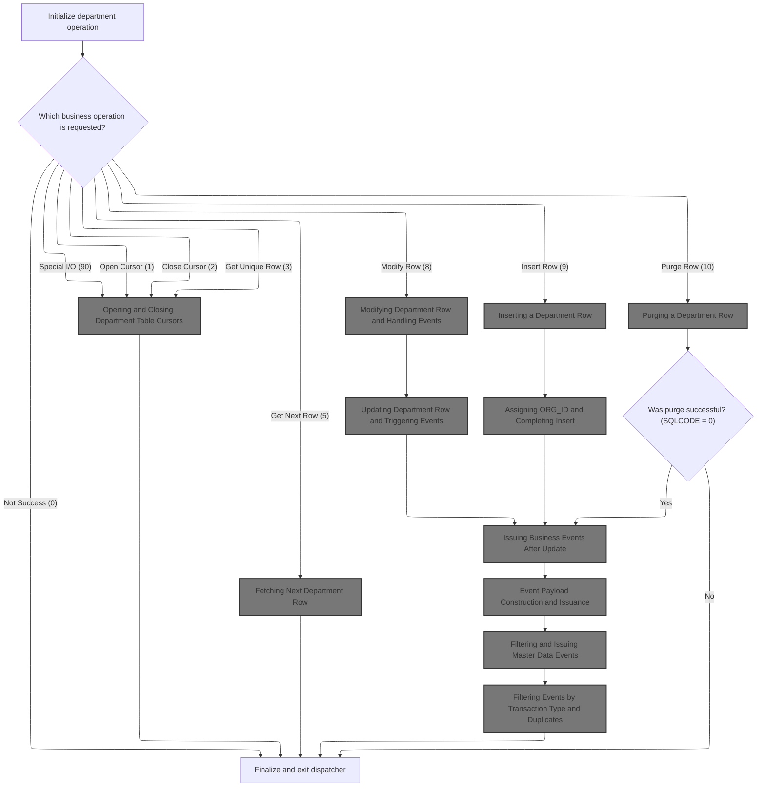

<SwmSnippet path="/base/src/NNNS0573.cbl" line="150">

---

`0000-EXIT-DISPATCHER` is where the flow starts. It always calls 100-INITIALIZATION first to reset state and prep data structures, so every operation starts clean. Then, it uses an EVALUATE block to check which symbolic exit code (like EXIT-OPEN-CURSOR, EXIT-PUT-INSERT-ROW, etc.) is set—these are mapped to numeric values in NNNN0000-PARMS and are specific to this repo. Each code triggers a different database operation (open cursor, insert, fetch, etc.). If the code doesn't match any known value, nothing happens. After the operation, it calls 120-EXIT-STUFF for cleanup and returns. The dispatcher expects only valid exit codes; otherwise, it just skips the logic.

```cobol
017300 0000-EXIT-DISPATCHER.                                            00017300
017400     PERFORM 100-INITIALIZATION                                   00017400
017500     EVALUATE TRUE                                                00017500
017600       WHEN NOT SUCCESS                                           00017600
017700          CONTINUE                                                00017700
017800       WHEN EXIT-OPEN-CURSOR                                      00017800
017900          PERFORM 1000-EXIT-OPEN-CURSOR                           00017900
018000       WHEN EXIT-CLOSE-CURSOR                                     00018000
018100          PERFORM 1100-EXIT-CLOSE-CURSOR                          00018100
018200       WHEN EXIT-GET-UNIQUE-ROW                                   00018200
018300          PERFORM 1200-EXIT-GET-UNIQUE-ROW                        00018300
018400       WHEN EXIT-GET-NEXT-ROW                                     00018400
018500          PERFORM 1300-EXIT-GET-NEXT-ROW                          00018500
018600       WHEN EXIT-PUT-MODIFY-ROW                                   00018600
018700          PERFORM 1400-EXIT-PUT-MODIFY-ROW                        00018700
018800       WHEN EXIT-PUT-INSERT-ROW                                   00018800
018900          PERFORM 1500-EXIT-PUT-INSERT-ROW                        00018900
019000       WHEN EXIT-PUT-PURGE-ROW                                    00019000
019100          PERFORM 1600-EXIT-PUT-PURGE-ROW                         00019100
019200       WHEN EXIT-DO-SPECIAL-IO-FUNCS                              00019200
019300          PERFORM 10000-DO-SPECIAL-IO-FUNCS                       00019300
019400     END-EVALUATE                                                 00019400
019500     PERFORM 120-EXIT-STUFF                                       00019500
019600     GOBACK                                                       00019600
019700     .                                                            00019700
```

---

</SwmSnippet>

### Preparing Department Data Structures

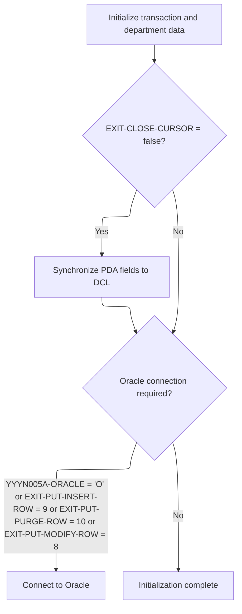

<SwmSnippet path="/base/src/NNNS0573.cbl" line="180">

---

`100-INITIALIZATION` resets department-related fields, syncs index handles, and clears checkpoint and SQL status. If we're not closing a cursor, it calls 110-MOVE-PDA-FIELDS-2-DCL to copy department master data into the working structure, making sure DB operations use up-to-date info. If we're about to do an insert, purge, or modify, it connects to Oracle next.

```cobol
020300 100-INITIALIZATION.                                              00020300
020400     INITIALIZE XXXN001A                                          00020400
020500                DB2-STUFF                                         00020500
020600                DAO-RETURN-CODE                                   00020600
020700     MOVE NNNN0000-INDEX-HANDLE TO DDDTDP01-INDEX-HANDLE          00020700
020800     MOVE 0 TO WS-CHECKPOINT-INC                                  00020800
020900     MOVE 0 TO SQLCODE                                            00020900
021000     MOVE 0 TO SQL-INIT-FLAG                                      00021000
021100     IF NOT EXIT-CLOSE-CURSOR                                     00021100
021200       PERFORM 110-MOVE-PDA-FIELDS-2-DCL                          00021200
021300     END-IF                                                       00021300
021400     IF (YYYN005A-ORACLE       OR EXIT-PUT-INSERT-ROW             00021400
021500         OR EXIT-PUT-PURGE-ROW OR EXIT-PUT-MODIFY-ROW)            00021500
021600       PERFORM 115-CONNECT-TO-ORACLE                              00021600
021700     END-IF                                                       00021700
021800     .                                                            00021800
```

---

</SwmSnippet>

<SwmSnippet path="/base/src/NNNS0573.cbl" line="202">

---

`110-MOVE-PDA-FIELDS-2-DCL` copies department fields from P-DDDTDP01 to DCLXXX-DEPT one by one. If ORG-ID-X is blank, it sets ORG-ID to zero before moving it, so DB ops don't get a bogus org ID. This is a repo-specific rule.

```cobol
022500 110-MOVE-PDA-FIELDS-2-DCL.                                       00022500
022600     MOVE XXX-DEPT-NBR OF P-DDDTDP01                              00022600
022700       TO XXX-DEPT-NBR OF DCLXXX-DEPT                             00022700
022800     MOVE STR-SUB-DEPT-ID OF P-DDDTDP01                           00022800
022900       TO STR-SUB-DEPT-ID OF DCLXXX-DEPT                          00022900
023000     MOVE DEPT-NM OF P-DDDTDP01 TO DEPT-NM OF DCLXXX-DEPT         00023000
023100     MOVE DEPT-ABB OF P-DDDTDP01 TO DEPT-ABB OF DCLXXX-DEPT       00023100
023200     MOVE REPT-GRP-CD OF P-DDDTDP01 TO REPT-GRP-CD OF DCLXXX-DEPT 00023200
023300     MOVE GRPRFT-LO-PCT OF P-DDDTDP01                             00023300
023400       TO GRPRFT-LO-PCT OF DCLXXX-DEPT                            00023400
023500     MOVE GRPRFT-HI-PCT OF P-DDDTDP01                             00023500
023600       TO GRPRFT-HI-PCT OF DCLXXX-DEPT                            00023600
023700     MOVE SHRNK-LO-PCT OF P-DDDTDP01                              00023700
023800       TO SHRNK-LO-PCT OF DCLXXX-DEPT                             00023800
023900     MOVE SHRNK-HI-PCT OF P-DDDTDP01                              00023900
024000       TO SHRNK-HI-PCT OF DCLXXX-DEPT                             00024000
024100     MOVE LST-UPDT-USR-ID OF P-DDDTDP01                           00024100
024200       TO LST-UPDT-USR-ID OF DCLXXX-DEPT                          00024200
024300     MOVE LST-UPDT-TS OF P-DDDTDP01 TO LST-UPDT-TS OF DCLXXX-DEPT 00024300
024400     IF ORG-ID-X OF P-DDDTDP01 = SPACES                           00024400
024500       MOVE ZERO TO ORG-ID OF P-DDDTDP01                          00024500
024600     END-IF                                                       00024600
024700     MOVE ORG-ID OF P-DDDTDP01                                    00024700
024800       TO ORG-ID OF DCLXXX-DEPT                                   00024800
024900     .                                                            00024900
```

---

</SwmSnippet>

### Establishing Oracle Connectivity

<SwmSnippet path="/base/src/NNNS0573.cbl" line="229">

---

`115-CONNECT-TO-ORACLE` calls Z-ORA-CONNECT to set up the Oracle DB connection. If it fails, it grabs the SQLCODE and builds an error message. This sets up the DB state for later department operations.

```cobol
025200 115-CONNECT-TO-ORACLE.                                           00025200
025300     CALL Z-ORA-CONNECT USING XXXN001A                            00025300
025400                              SQLCA                               00025400
025500     IF NOT SUCCESS                                               00025500
025600       MOVE SQLCODE TO WS-SQLCODE                                 00025600
025700       MOVE SPACES  TO IS-RTRN-MSG-TXT                            00025700
025800       STRING 'NNNS0573 - Error connecting to Oracle. Sqlcode ='  00025800
025900               WS-SQLCODE                                         00025900
026000               DELIMITED BY SIZE INTO IS-RTRN-MSG-TXT             00026000
026100     END-IF                                                       00026100
026200     .                                                            00026200
```

---

</SwmSnippet>

### Initializing and Routing Connection Requests

<SwmSnippet path="/base/src/XXXS0210.cbl" line="33">

---

`0000-EXIT-DISPATCHER` in XXXS0210.cbl sets up the environment and then calls 200-CONNECT-TO-ORACLE to switch the DB connection to Oracle. This is the entry point for connection management.

```cobol
004400 0000-EXIT-DISPATCHER.                                            00004400
004500     PERFORM 100-INITIALIZATION                                   00004500
004600     PERFORM 200-CONNECT-TO-ORACLE                                00004600
005000     GOBACK                                                       00005000
005100     .                                                            00005100
```

---

</SwmSnippet>

### Switching Active Database Connection

<SwmSnippet path="/base/src/XXXS0210.cbl" line="52">

---

`200-CONNECT-TO-ORACLE` sets a flag to switch to Oracle and calls YYYS0220-DBMS-CON-MGR, which does the actual connection switch and updates stats. This is how the system changes DB environments.

```cobol
007500 200-CONNECT-TO-ORACLE.                                           00007500
007510     SET YYYC0220-SET-ORACLE-CON TO TRUE                          00007510
007530                                                                  00007530
007540     CALL YYYS0220-DBMS-CON-MGR USING                             00007540
007550         XXXN001A                                                 00007550
007560         YYYC0220                                                 00007560
010400     .                                                            00010400
```

---

</SwmSnippet>

### Managing Connection State and Statistics

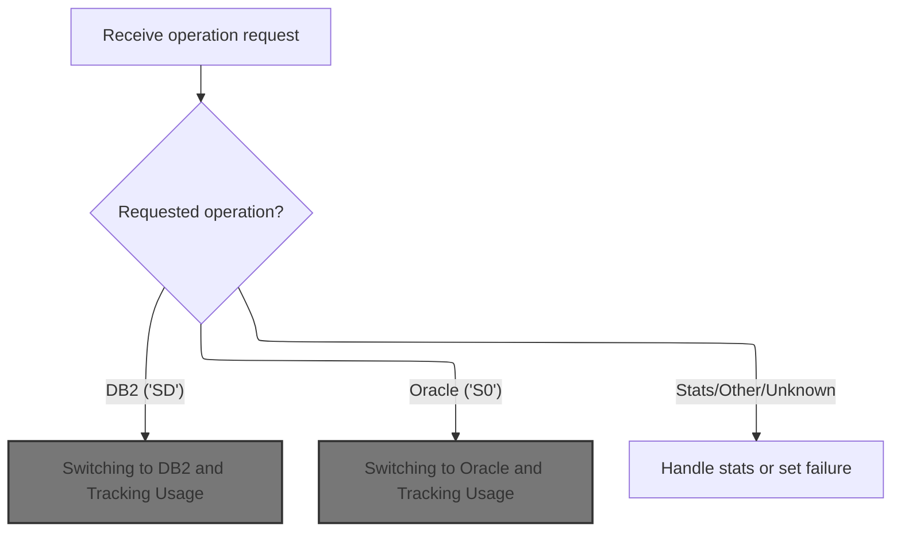

<SwmSnippet path="/base/src/YYYS0220.cbl" line="56">

---

`0000-EXIT-DISPATCHER` in YYYS0220.cbl checks which connection or stats function is requested and routes to the right subroutine. If the code isn't recognized, it sets a failure flag and error message. 200-GET-CURR-CON just copies the current connection type to the output field.

```cobol
006500 0000-EXIT-DISPATCHER.                                            00006500
006600     PERFORM 100-INITIALIZATION                                   00006600
006700                                                                  00006700
006800     EVALUATE TRUE                                                00006800
006900       WHEN YYYC0220-GET-CURR-CON                                 00006900
007000         PERFORM 200-GET-CURR-CON                                 00007000
007100       WHEN YYYC0220-SET-DB2-CON                                  00007100
007200         PERFORM 300-SET-DB2-CON                                  00007200
007300       WHEN YYYC0220-SET-ORACLE-CON                               00007300
007400         PERFORM 400-SET-ORACLE-CON                               00007400
007500       WHEN YYYC0220-GET-STATS                                    00007500
007600         PERFORM 500-GET-STATS                                    00007600
007700       WHEN YYYC0220-SET-STATS                                    00007700
007800         PERFORM 600-SET-STATS                                    00007800
007900       WHEN YYYC0220-SET-OVERRIDE-CON                             00007900
008000         PERFORM 700-SET-OVERRIDE-CON                             00008000
008100       WHEN OTHER                                                 00008100
008200         SET  FAILURE TO TRUE                                     00008200
008300         MOVE 'YYYS0220 - Function not recognized!'               00008300
008400           TO IS-RTRN-MSG-TXT                                     00008400
008500     END-EVALUATE                                                 00008500
008600                                                                  00008600
008700     GOBACK                                                       00008700
008800     .                                                            00008800
```

---

</SwmSnippet>

<SwmSnippet path="/base/src/YYYS0220.cbl" line="97">

---

`200-GET-CURR-CON` just copies the current connection type from internal state to the output field. There's no logic to set or validate the connection here.

```cobol
010600 200-GET-CURR-CON.                                                00010600
010700     MOVE WS-YYYC0220-CURR-CON TO YYYC0220-CURR-CON               00010700
010800     .                                                            00010800
```

---

</SwmSnippet>

#### Switching to DB2 and Tracking Usage

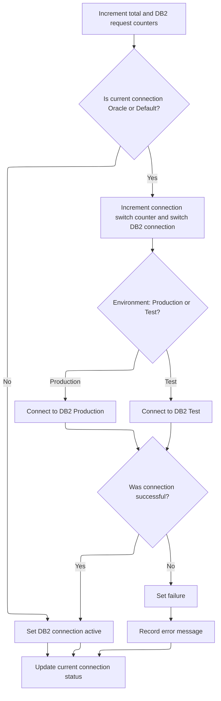

<SwmSnippet path="/base/src/YYYS0220.cbl" line="105">

---

`300-SET-DB2-CON` bumps the total and DB2 request counters, checks if we're switching from Oracle or default, and if so, runs 310-DO-SET-DB2-CON to actually connect. Then it marks DB2 as active and gets the current connection type for reporting.

```cobol
011400 300-SET-DB2-CON.                                                 00011400
011500     ADD 1 TO WS-TOT-REQS                                         00011500
011600     ADD 1 TO WS-DB2-REQS                                         00011600
011700                                                                  00011700
011800     IF WS-ORACLE-CON                                             00011800
011900     OR WS-DEFAULT-CON                                            00011900
012000       PERFORM 310-DO-SET-DB2-CON                                 00012000
012100     END-IF                                                       00012100
012200                                                                  00012200
012300     SET WS-DB2-CON TO TRUE                                       00012300
012400     PERFORM 200-GET-CURR-CON                                     00012400
012500     .                                                            00012500
```

---

</SwmSnippet>

<SwmSnippet path="/base/src/YYYS0220.cbl" line="119">

---

`310-DO-SET-DB2-CON` bumps the connection switch counter, then checks if we're in prod or test and connects to the right DB2 instance. If the connection fails, it sets a failure flag and builds an error message with the SQLCODE.

```cobol
012800 310-DO-SET-DB2-CON.                                              00012800
012900     ADD 1 TO WS-CON-SWITCHES                                     00012900
013000                                                                  00013000
013100     EVALUATE TRUE                                                00013100
013200       WHEN WS-PROD                                               00013200
013300         EXEC SQL                                                 00013300
013400           CONNECT TO DB2P                                        00013400
013500         END-EXEC                                                 00013500
013600       WHEN OTHER                                                 00013600
013700         EXEC SQL                                                 00013700
013800           CONNECT TO DB2T                                        00013800
013900         END-EXEC                                                 00013900
014000     END-EVALUATE                                                 00014000
014100                                                                  00014100
014200     EVALUATE TRUE                                                00014200
014300       WHEN SQLCODE = 0                                           00014300
014400         CONTINUE                                                 00014400
014500                                                                  00014500
014600       WHEN OTHER                                                 00014600
014700         SET  FAILURE TO TRUE                                     00014700
014800         MOVE SQLCODE TO WS-SQLCODE                               00014800
014900         STRING 'YYYS0220 - Failure connecting to DB2, SQL='      00014900
015000                WS-SQLCODE                                        00015000
015100             DELIMITED BY SIZE INTO IS-RTRN-MSG-TXT               00015100
015200     END-EVALUATE                                                 00015200
015300     .                                                            00015300
```

---

</SwmSnippet>

#### Switching to Oracle and Tracking Usage

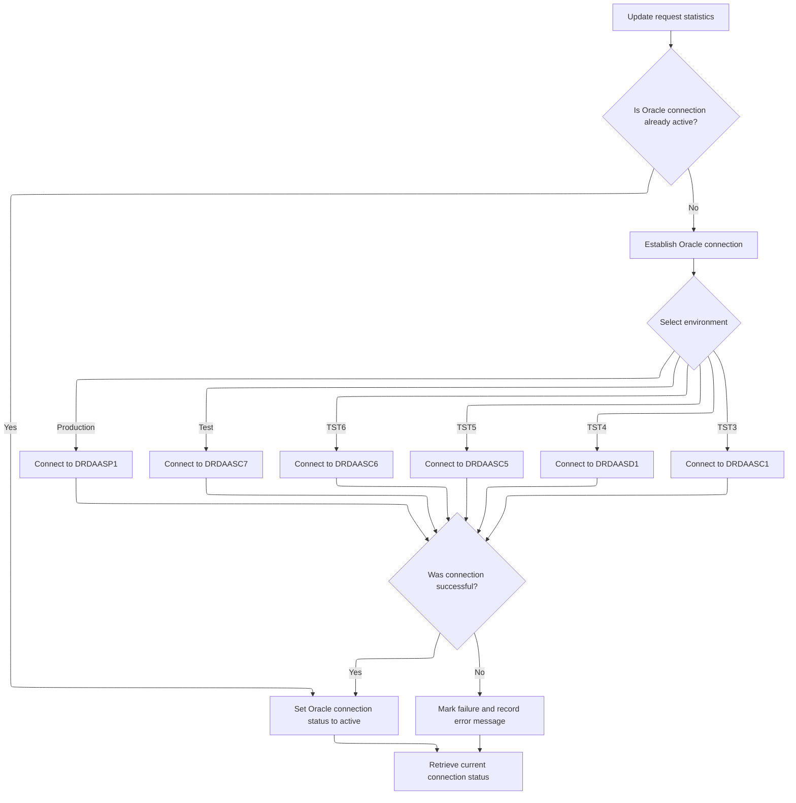

<SwmSnippet path="/base/src/YYYS0220.cbl" line="150">

---

`400-SET-ORACLE-CON` bumps the total and Oracle request counters, checks if we're not already connected, and if so, runs 410-DO-SET-ORACLE-CON to actually connect. Then it marks Oracle as active and gets the current connection type for reporting.

```cobol
015900 400-SET-ORACLE-CON.                                              00015900
016000     ADD 1 TO WS-TOT-REQS                                         00016000
016100     ADD 1 TO WS-OCL-REQS                                         00016100
016200                                                                  00016200
016300     IF NOT WS-ORACLE-CON                                         00016300
016400       PERFORM 410-DO-SET-ORACLE-CON                              00016400
016500     END-IF                                                       00016500
016600                                                                  00016600
016700     SET WS-ORACLE-CON TO TRUE                                    00016700
016800     PERFORM 200-GET-CURR-CON                                     00016800
016900     .                                                            00016900
```

---

</SwmSnippet>

<SwmSnippet path="/base/src/YYYS0220.cbl" line="163">

---

`410-DO-SET-ORACLE-CON` bumps the connection switch counter, checks which environment is active, and connects to the right Oracle DB. If the connection fails, it sets a failure flag and builds an error message with the SQLCODE.

```cobol
017200 410-DO-SET-ORACLE-CON.                                           00017200
017300     ADD 1 TO WS-CON-SWITCHES                                     00017300
017400                                                                  00017400
017500     EVALUATE TRUE                                                00017500
017600       WHEN WS-PROD                                               00017600
017700         EXEC SQL                                                 00017700
017800           CONNECT TO DRDAASP1                                    00017800
017900         END-EXEC                                                 00017900
018000                                                                  00018000
018100       WHEN WS-TEST                                               00018100
018200         EXEC SQL                                                 00018200
018300           CONNECT TO DRDAASC7                                    00018300
018400         END-EXEC                                                 00018400
018500                                                                  00018500
018600       WHEN WS-TST6                                               00018600
018700         EXEC SQL                                                 00018700
018800           CONNECT TO DRDAASC6                                    00018800
018900         END-EXEC                                                 00018900
019000                                                                  00019000
019100       WHEN WS-TST5                                               00019100
019200         EXEC SQL                                                 00019200
019300           CONNECT TO DRDAASC5                                    00019300
019400         END-EXEC                                                 00019400
019500                                                                  00019500
019600       WHEN WS-TST4                                               00019600
019700         EXEC SQL                                                 00019700
019800           CONNECT TO DRDAASD1                                    00019800
019900         END-EXEC                                                 00019900
020000                                                                  00020000
020100       WHEN WS-TST3                                               00020100
020200         EXEC SQL                                                 00020200
020300           CONNECT TO DRDAASC1                                    00020300
020400         END-EXEC                                                 00020400
020500     END-EVALUATE                                                 00020500
020600                                                                  00020600
020700     EVALUATE TRUE                                                00020700
020800       WHEN SQLCODE = 0                                           00020800
020900         CONTINUE                                                 00020900
021000                                                                  00021000
021100       WHEN OTHER                                                 00021100
021200         SET  FAILURE TO TRUE                                     00021200
021300         MOVE SQLCODE TO WS-SQLCODE                               00021300
021400         STRING 'YYYS0220 - Failure connecting to Oracle, SQL='   00021400
021500                WS-SQLCODE                                        00021500
021600             DELIMITED BY SIZE INTO IS-RTRN-MSG-TXT               00021600
021700     END-EVALUATE                                                 00021700
021800     .                                                            00021800
```

---

</SwmSnippet>

#### Reporting Connection and Usage Statistics

<SwmSnippet path="/base/src/YYYS0220.cbl" line="215">

---

`500-GET-STATS` grabs the current connection type and copies all the usage counters into the output structure, so you get a full report of connection activity.

```cobol
022400 500-GET-STATS.                                                   00022400
022500     PERFORM 200-GET-CURR-CON                                     00022500
022600                                                                  00022600
022700     MOVE WS-TOT-REQS     TO YYYC0220-TOT-REQS                    00022700
022800     MOVE WS-DB2-REQS     TO YYYC0220-DB2-REQS                    00022800
022900     MOVE WS-OCL-REQS     TO YYYC0220-OCL-REQS                    00022900
023000     MOVE WS-OVR-REQS     TO YYYC0220-OVR-REQS                    00023000
023100     MOVE WS-CON-SWITCHES TO YYYC0220-CON-SWITCHES                00023100
023200     MOVE WS-OVR-SWITCHES TO YYYC0220-OVR-SWITCHES                00023200
023300     .                                                            00023300
```

---

</SwmSnippet>

<SwmSnippet path="/base/src/YYYS0220.cbl" line="230">

---

`600-SET-STATS` just resets all the stats fields for connection and usage tracking, so reporting starts from zero.

```cobol
023900 600-SET-STATS.                                                   00023900
024000     INITIALIZE WS-STATS                                          00024000
024100                YYYC0220-STATS                                    00024100
024200     .                                                            00024200
```

---

</SwmSnippet>

### Opening and Closing Department Table Cursors

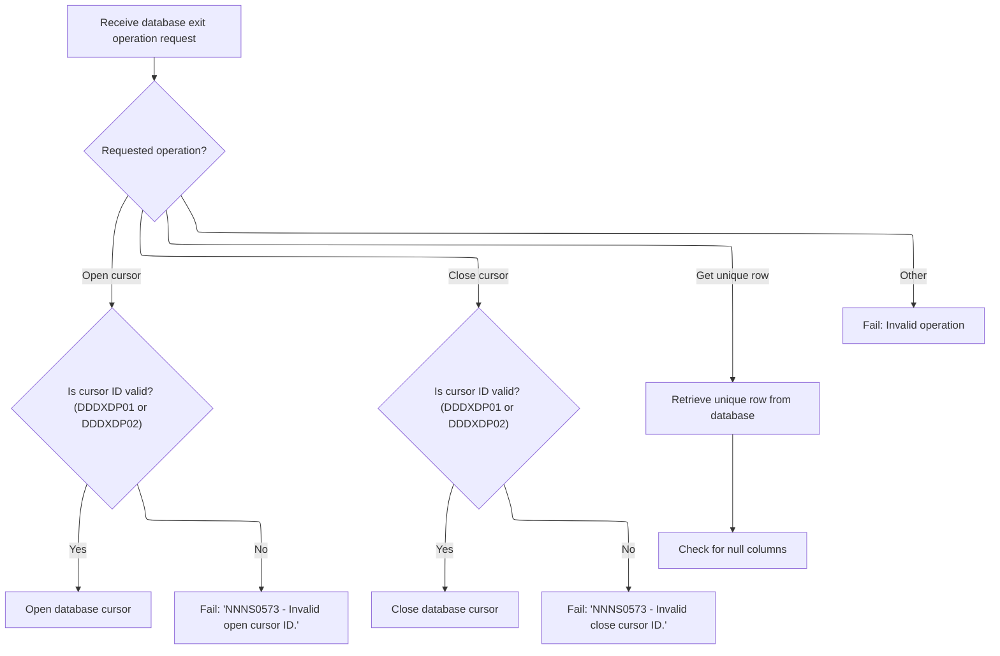

<SwmSnippet path="/base/src/NNNS0573.cbl" line="297">

---

`1000-EXIT-OPEN-CURSOR` checks which cursor ID is set and opens the right DB cursor for department queries. If the ID isn't valid, it sets a failure flag and error message.

```cobol
032000 1000-EXIT-OPEN-CURSOR.                                           00032000
032100     EVALUATE TRUE                                                00032100
032200       WHEN DDDXDP01                                              00032200
032300         EXEC SQL                                                 00032300
032400           OPEN DDDXDP01                                          00032400
032500         END-EXEC                                                 00032500
032600       WHEN DDDXDP02                                              00032600
032700         EXEC SQL                                                 00032700
032800           OPEN DDDXDP02                                          00032800
032900         END-EXEC                                                 00032900
033000       WHEN OTHER                                                 00033000
033100         SET FAILURE TO TRUE                                      00033100
033200         MOVE 'NNNS0573 - Invalid open cursor ID.'                00033200
033300           TO IS-RTRN-MSG-TXT OF XXXN001A                         00033300
033400     END-EVALUATE                                                 00033400
033500     .                                                            00033500
```

---

</SwmSnippet>

<SwmSnippet path="/base/src/NNNS0573.cbl" line="315">

---

`1100-EXIT-CLOSE-CURSOR` checks which cursor ID is set and closes the right DB cursor for department queries. If the ID isn't valid, it sets a failure flag and error message.

```cobol
033800 1100-EXIT-CLOSE-CURSOR.                                          00033800
033900     EVALUATE TRUE                                                00033900
034000       WHEN DDDXDP01                                              00034000
034100         EXEC SQL                                                 00034100
034200           CLOSE DDDXDP01                                         00034200
034300         END-EXEC                                                 00034300
034400       WHEN DDDXDP02                                              00034400
034500         EXEC SQL                                                 00034500
034600           CLOSE DDDXDP02                                         00034600
034700         END-EXEC                                                 00034700
034800       WHEN OTHER                                                 00034800
034900         SET FAILURE TO TRUE                                      00034900
035000         MOVE 'NNNS0573 - Invalid close cursor ID.'               00035000
035100           TO IS-RTRN-MSG-TXT OF XXXN001A                         00035100
035200     END-EVALUATE                                                 00035200
035300     .                                                            00035300
```

---

</SwmSnippet>

<SwmSnippet path="/base/src/NNNS0573.cbl" line="333">

---

`1200-EXIT-GET-UNIQUE-ROW` runs a SELECT to fetch a department row by primary key and loads it into the working structure. Then it checks for null columns to make sure the data is usable.

```cobol
035600 1200-EXIT-GET-UNIQUE-ROW.                                        00035600
035700     EXEC SQL                                                     00035700
035800         SELECT XXX_DEPT_NBR,                                     00035800
035900                STR_SUB_DEPT_ID,                                  00035900
036000                DEPT_NM,                                          00036000
036100                DEPT_ABB,                                         00036100
036200                REPT_GRP_CD,                                      00036200
036300                GRPRFT_LO_PCT,                                    00036300
036400                GRPRFT_HI_PCT,                                    00036400
036500                SHRNK_LO_PCT,                                     00036500
036600                SHRNK_HI_PCT,                                     00036600
036700                LST_UPDT_USR_ID,                                  00036700
036800                LST_UPDT_TS,                                      00036800
036900                ORG_ID                                            00036900
037000         INTO   :DCLXXX-DEPT.XXX-DEPT-NBR,                        00037000
037100                :DCLXXX-DEPT.STR-SUB-DEPT-ID,                     00037100
037200                :DCLXXX-DEPT.DEPT-NM,                             00037200
037300                :DCLXXX-DEPT.DEPT-ABB,                            00037300
037400                :DCLXXX-DEPT.REPT-GRP-CD,                         00037400
037500                :DCLXXX-DEPT.GRPRFT-LO-PCT,                       00037500
037600                :DCLXXX-DEPT.GRPRFT-HI-PCT,                       00037600
037700                :DCLXXX-DEPT.SHRNK-LO-PCT,                        00037700
037800                :DCLXXX-DEPT.SHRNK-HI-PCT,                        00037800
037900                :DCLXXX-DEPT.LST-UPDT-USR-ID,                     00037900
038000                :DCLXXX-DEPT.LST-UPDT-TS,                         00038000
038100                :DCLXXX-DEPT.ORG-ID                               00038100
038200         FROM   XXX_DEPT                                          00038200
038300         WHERE  XXX_DEPT_NBR = :DCLXXX-DEPT.XXX-DEPT-NBR          00038300
038400         AND    STR_SUB_DEPT_ID = :DCLXXX-DEPT.STR-SUB-DEPT-ID    00038400
038500     END-EXEC                                                     00038500
038600                                                                  00038600
038700     PERFORM 1700-CHECK-NULL-COLUMNS                              00038700
038800     .                                                            00038800
```

---

</SwmSnippet>

### Fetching Next Department Row

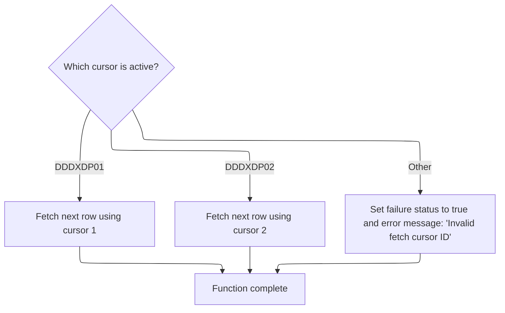

<SwmSnippet path="/base/src/NNNS0573.cbl" line="368">

---

`1300-EXIT-GET-NEXT-ROW` checks which cursor ID is set and calls the right fetch routine for department data. If the ID isn't valid, it sets a failure flag and error message. After fetching, it checks for null columns.

```cobol
039100 1300-EXIT-GET-NEXT-ROW.                                          00039100
039200     EVALUATE TRUE                                                00039200
039300       WHEN DDDXDP01                                              00039300
039400         PERFORM 1301-FETCH-DDDXDP01                              00039400
039500       WHEN DDDXDP02                                              00039500
039600         PERFORM 1302-FETCH-DDDXDP02                              00039600
039700       WHEN OTHER                                                 00039700
039800         SET FAILURE TO TRUE                                      00039800
039900         MOVE 'NNNS0573 - Invalid fetch cursor ID.'               00039900
040000           TO IS-RTRN-MSG-TXT OF XXXN001A                         00040000
040100     END-EVALUATE                                                 00040100
040200                                                                  00040200
040300     PERFORM 1700-CHECK-NULL-COLUMNS                              00040300
040400     .                                                            00040400
```

---

</SwmSnippet>

<SwmSnippet path="/base/src/NNNS0573.cbl" line="384">

---

`1301-FETCH-DDDXDP01` runs a FETCH on the DDDXDP01 cursor and loads the row data into the department structure. The mapping is field-by-field to match the DB schema.

```cobol
040700 1301-FETCH-DDDXDP01.                                             00040700
040800     EXEC SQL                                                     00040800
040900         FETCH DDDXDP01                                           00040900
041000         INTO  :DCLXXX-DEPT.XXX-DEPT-NBR,                         00041000
041100               :DCLXXX-DEPT.STR-SUB-DEPT-ID,                      00041100
041200               :DCLXXX-DEPT.DEPT-NM,                              00041200
041300               :DCLXXX-DEPT.DEPT-ABB,                             00041300
041400               :DCLXXX-DEPT.REPT-GRP-CD,                          00041400
041500               :DCLXXX-DEPT.GRPRFT-LO-PCT,                        00041500
041600               :DCLXXX-DEPT.GRPRFT-HI-PCT,                        00041600
041700               :DCLXXX-DEPT.SHRNK-LO-PCT,                         00041700
041800               :DCLXXX-DEPT.SHRNK-HI-PCT,                         00041800
041900               :DCLXXX-DEPT.LST-UPDT-USR-ID,                      00041900
042000               :DCLXXX-DEPT.LST-UPDT-TS,                          00042000
042100               :DCLXXX-DEPT.ORG-ID                                00042100
042200     END-EXEC                                                     00042200
042300     .                                                            00042300
```

---

</SwmSnippet>

### Modifying Department Row and Handling Events

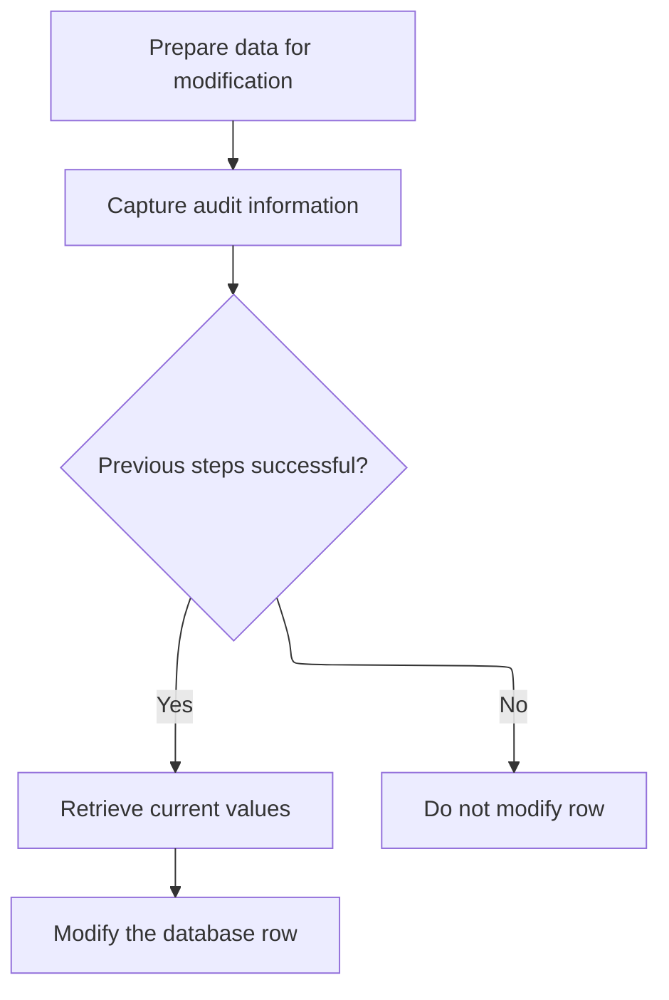

<SwmSnippet path="/base/src/NNNS0573.cbl" line="422">

---

`1400-EXIT-PUT-MODIFY-ROW` edits null indicators, gets the current date and user, and if everything's good, fetches current values and updates the department row. This sequence makes sure the update is tracked and only happens if all checks pass.

```cobol
044500 1400-EXIT-PUT-MODIFY-ROW.                                        00044500
044600     PERFORM 1800-EDIT-NULL-INDICATORS                            00044600
044700     PERFORM 2040-GET-DATE-AND-USER                               00044700
044800                                                                  00044800
044900     IF SUCCESS                                                   00044900
045000       PERFORM 1405-GET-CURR-VALUES                               00045000
045100       PERFORM 1410-DO-MODIFY-ROW                                 00045100
045200     END-IF                                                       00045200
045300     .                                                            00045300
```

---

</SwmSnippet>

<SwmSnippet path="/base/src/NNNS0573.cbl" line="611">

---

`2040-GET-DATE-AND-USER` calls Z-DATE-FUNCTIONS to get the date, then if we're in CICS and it worked, grabs the user ID from CICS. If not, it sets a default user ID.

```cobol
063100 2040-GET-DATE-AND-USER.                                          00063100
063200     CALL Z-DATE-FUNCTIONS USING                                  00063200
063300         XXXN001A                                                 00063300
063400         YYYC0127                                                 00063400
063500                                                                  00063500
063600     IF  SUCCESS                                                  00063600
063700     AND YYYN005A-CICS-ENV                                        00063700
063800     CALL Z-GET-CICS-USER-ID USING                                00063800
063900         EIBLK    WS-DUMMY                                        00063900
064000         XXXN001A YYYC0107                                        00064000
064100     ELSE                                                         00064100
064200       MOVE 'NNNS0573' TO YYYC0107-USER                           00064200
064300     END-IF                                                       00064300
064400     .                                                            00064400
```

---

</SwmSnippet>

<SwmSnippet path="/base/src/NNNS0573.cbl" line="433">

---

`1405-GET-CURR-VALUES` runs a SELECT to get the current department name from the DB. If the query fails, it sets a failure flag and builds an error message.

```cobol
045600 1405-GET-CURR-VALUES.                                            00045600
045700     EXEC SQL                                                     00045700
045800         SELECT DEPT_NM                                           00045800
045900           INTO :WS-DEPT-NM                                       00045900
046000           FROM XXX_DEPT                                          00046000
046100         WHERE  XXX_DEPT_NBR = :DCLXXX-DEPT.XXX-DEPT-NBR          00046100
046200         AND    STR_SUB_DEPT_ID = :DCLXXX-DEPT.STR-SUB-DEPT-ID    00046200
046300     END-EXEC                                                     00046300
046400                                                                  00046400
046500     IF SQLCODE NOT = 0                                           00046500
046600       SET  FAILURE TO TRUE                                       00046600
046700       MOVE SQLCODE TO WS-SQLCODE                                 00046700
046800       STRING 'NNNS0573 - Error getting current values,'          00046800
046900              'RC=' WS-SQLCODE '.'                                00046900
047000           DELIMITED BY SIZE INTO IS-RTRN-MSG-TXT                 00047000
047100     END-IF                                                       00047100
047200     .                                                            00047200
```

---

</SwmSnippet>

### Updating Department Row and Triggering Events

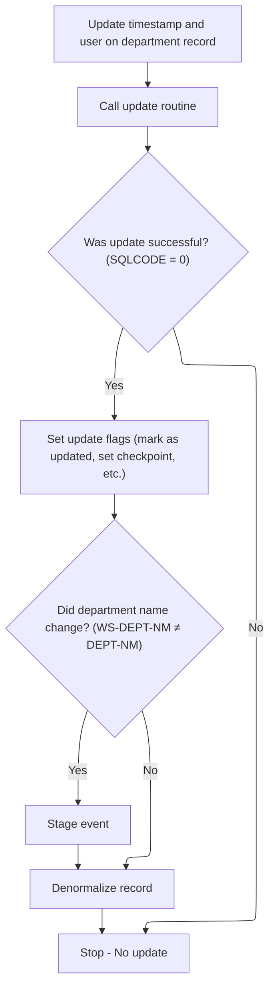

<SwmSnippet path="/base/src/NNNS0573.cbl" line="452">

---

`1410-DO-MODIFY-ROW` stamps the row with the new timestamp and user, runs the update, and if it works, sets a bunch of flags for update status and triggers the denorm process if the department name changed.

```cobol
047500 1410-DO-MODIFY-ROW.                                              00047500
047600     MOVE YYYC0127-TS   TO LST-UPDT-TS     OF DCLXXX-DEPT         00047600
047700     MOVE YYYC0107-USER TO LST-UPDT-USR-ID OF DCLXXX-DEPT         00047700
047800                                                                  00047800
047900     PERFORM 5000-CALL-NNNS0573-CUD-ROUTINE                       00047900
048000                                                                  00048000
048100     IF SQLCODE = 0                                               00048100
048200       MOVE 1 TO WS-CHECKPOINT-INC                                00048200
048300       SET YYYN110A-UPD TO TRUE                                   00048300
048400       SET STD-UPD TO TRUE                                        00048400
048500       SET MODIFY-OPERATION     TO TRUE                           00048500
048600       IF (WS-DEPT-NM        NOT = DEPT-NM OF DCLXXX-DEPT)        00048600
048700          SET STAGE-EVENT TO TRUE                                 00048700
048800       END-IF                                                     00048800
048900       PERFORM 2000-DENORM-PROCESS                                00048900
049000     END-IF                                                       00049000
049100     .                                                            00049100
```

---

</SwmSnippet>

### Issuing Business Events After Update

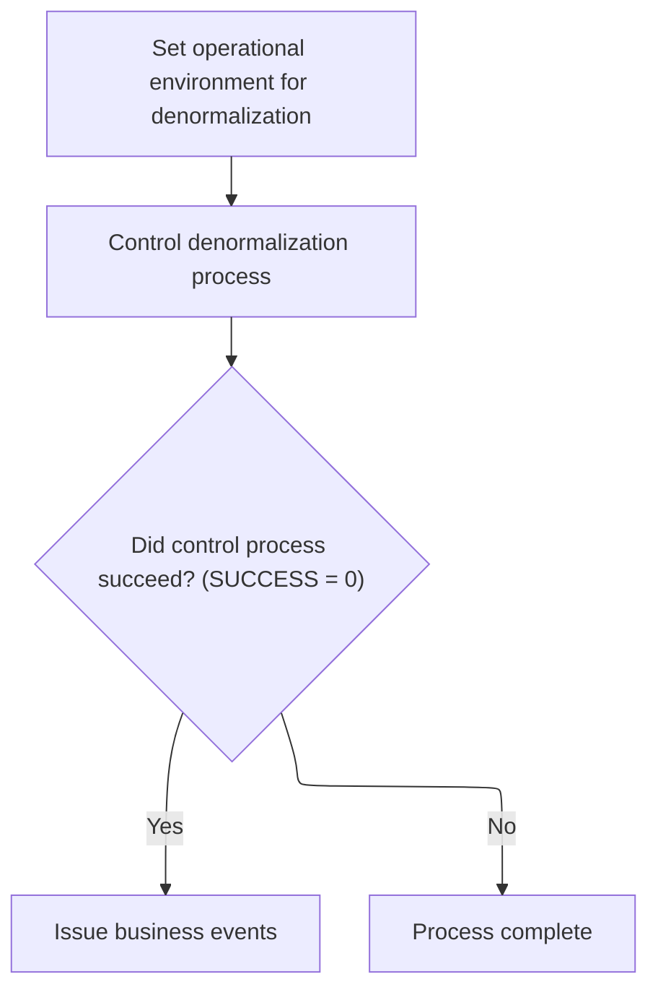

<SwmSnippet path="/base/src/NNNS0573.cbl" line="554">

---

`2000-DENORM-PROCESS` copies the system environment, runs the control subroutine, and if it succeeds, calls 2030-ISSUE-EVENTS to actually issue business events for the department update.

```cobol
057400 2000-DENORM-PROCESS.                                             00057400
057500     MOVE YYYN005A-SYS-ENV      TO YYYN110A-SYS-ENV               00057500
057600     PERFORM 2010-CALL-CONTROL-SUBR                               00057600
057700     IF SUCCESS                                                   00057700
057800        PERFORM 2030-ISSUE-EVENTS                                 00057800
057900     END-IF                                                       00057900
058000     .                                                            00058000
```

---

</SwmSnippet>

### Event Payload Construction and Issuance

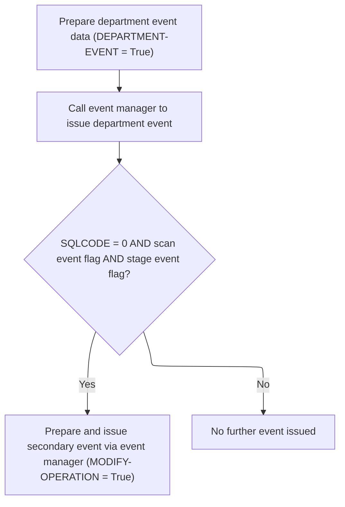

<SwmSnippet path="/base/src/NNNS0573.cbl" line="573">

---

`2030-ISSUE-EVENTS` builds the event payload with department data and system environment, sets transaction and program IDs, and calls the event manager to issue the event. If certain flags are set and the update succeeded, it builds and issues a second event with modified data.

```cobol
059300 2030-ISSUE-EVENTS.                                               00059300
059400     INITIALIZE ZZZC0550                                          00059400
059500     SET YYYN110A-ORACLE    TO TRUE                               00059500
059600     SET DEPARTMENT-EVENT   TO TRUE                               00059600
059700     MOVE XXX-DEPT-NBR OF P-DDDTDP01                              00059700
059800       TO XXX-DEPT-NBR OF ZZZC0125                                00059800
059900          XXX-DEPT-NBR      OF ZZZC0550-DEPT-DATA                 00059900
060000     MOVE STR-SUB-DEPT-ID OF P-DDDTDP01                           00060000
060100       TO STR-SUB-DEPT-ID OF ZZZC0125                             00060100
060200          STR-SUB-DEPT-ID   OF ZZZC0550-DEPT-DATA                 00060200
060300                                                                  00060300
060400     MOVE 'SDPM'                TO ZZZC0197-TRX-ID                00060400
060500     MOVE ZZZC0125              TO ZZZC0197-TRX-REC               00060500
060600     MOVE 'XXXS0512'            TO ZZZC0197-PROGRAM               00060600
060700     MOVE '    '                TO ZZZC0197-USER                  00060700
060800     MOVE YYYN005A-SYS-ENV      TO YYYN110A-SYS-ENV               00060800
060900     CALL ZZZS0197-EVENT-MGR USING                                00060900
061000          XXXN001A                                                00061000
061100          YYYN110A                                                00061100
061200          ZZZC0197                                                00061200
061300                                                                  00061300
061400     IF SQLCODE = 0 AND WWWC0100-CREATE-SCAN-EVENT AND            00061400
061500        STAGE-EVENT                                               00061500
061600         SET  MODIFY-OPERATION      TO TRUE                       00061600
061700         MOVE ZZZC0550              TO ZZZC0197-TRX-REC           00061700
061800         MOVE ZZZC0550-TRX          TO ZZZC0197-TRX-ID            00061800
061900                                       ZZZC0197-TRX-CD            00061900
062000         MOVE 'NNNS0573'            TO ZZZC0197-PROGRAM           00062000
062100         MOVE YYYC0107-USER         TO ZZZC0197-USER              00062100
062200         MOVE YYYN005A-SYS-ENV      TO YYYN110A-SYS-ENV           00062200
062300         CALL ZZZS0197-EVENT-MGR USING                            00062300
062400              XXXN001A                                            00062400
062500              YYYN110A                                            00062500
062600              ZZZC0197                                            00062600
062700     END-IF                                                       00062700
062800     .                                                            00062800
```

---

</SwmSnippet>

### Filtering and Issuing Master Data Events

<SwmSnippet path="/base/src/ZZZS0197.cbl" line="57">

---

`000-MAINLINE` initializes, skips filtering for 'CFIP', weeds events for others, and issues the event only if it passes all checks.

```cobol
008400 000-MAINLINE.                                                    00008400
008500     PERFORM 100-INITIALIZE                                       00008500
008600                                                                  00008600
008700*    IF  ZZZC0197-TRX-ID NOT = 'CFIP'                             00008700
008800       PERFORM 200-WEED-EVENT                                     00008800
008900*    END-IF                                                       00008900
009000                                                                  00009000
009100     IF PROCESS-EVENT                                             00009100
009200       PERFORM 300-ISSUE-EVENT                                    00009200
009300     END-IF                                                       00009300
009400                                                                  00009400
009500     GOBACK                                                       00009500
009600     .                                                            00009600
```

---

</SwmSnippet>

### Filtering Events by Transaction Type and Duplicates

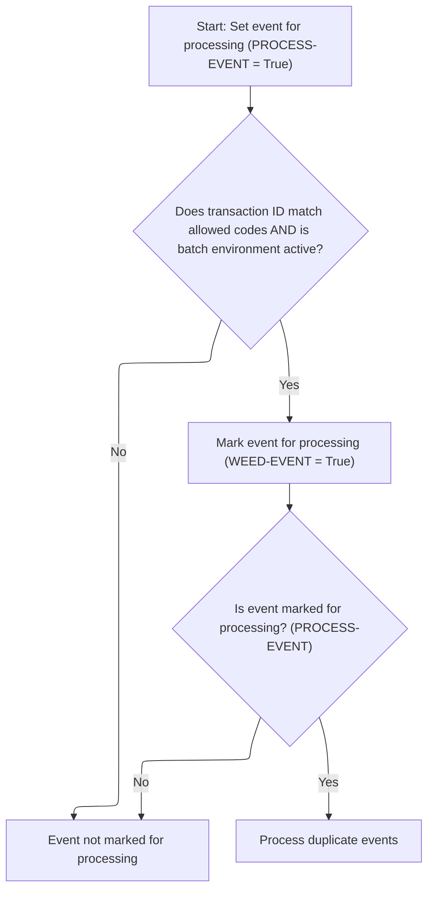

<SwmSnippet path="/base/src/ZZZS0197.cbl" line="89">

---

`200-WEED-EVENT` sets PROCESS-EVENT to true, then checks if the transaction type and environment match the hard-coded rules in 210-WEED-BY-HARD-CODE. If the event still qualifies, it checks for duplicates in 220-WEED-DUP-EVENTS. Only non-duplicate, qualifying events get through.

```cobol
011600 200-WEED-EVENT.                                                  00011600
011700     SET PROCESS-EVENT TO TRUE                                    00011700
011800     PERFORM 210-WEED-BY-HARD-CODE                                00011800
011900     IF PROCESS-EVENT                                             00011900
012000       PERFORM 220-WEED-DUP-EVENTS                                00012000
012100     END-IF                                                       00012100
012200     .                                                            00012200
```

---

</SwmSnippet>

<SwmSnippet path="/base/src/ZZZS0197.cbl" line="98">

---

`210-WEED-BY-HARD-CODE` only marks events for processing if the transaction ID is in a specific list and we're running in batch.

```cobol
012500 210-WEED-BY-HARD-CODE.                                           00012500
012600     IF  (ZZZC0197-TRX-ID = 'BVLM'                                00012600
012700*      OR ZZZC0197-TRX-ID = 'APLM'                                00012700
012800*      OR ZZZC0197-TRX-ID = 'BDMM'                                00012800
012900*      OR ZZZC0197-TRX-ID = 'BCAM'                                00012900
013000*      OR ZZZC0197-TRX-ID = 'CCSM'                                00013000
013100*      OR ZZZC0197-TRX-ID = 'CEMM'                                00013100
013200       OR ZZZC0197-TRX-ID = 'CNCM'                                00013200
013300*      OR ZZZC0197-TRX-ID = 'COMM'                                00013300
013400*      OR ZZZC0197-TRX-ID = 'CRCM'                                00013400
013500*      OR ZZZC0197-TRX-ID = 'CSCM'                                00013500
013600*      OR ZZZC0197-TRX-ID = 'CTOM'                                00013600
013700*      OR ZZZC0197-TRX-ID = 'DIRM'                                00013700
013800*      OR ZZZC0197-TRX-ID = 'DISM'                                00013800
013900*      OR ZZZC0197-TRX-ID = 'DSDM'                                00013900
014000*      OR ZZZC0197-TRX-ID = 'FINM'                                00014000
014100*      OR ZZZC0197-TRX-ID = 'ICCM'                                00014100
014200*      OR ZZZC0197-TRX-ID = 'ITMM'                                00014200
014300       OR ZZZC0197-TRX-ID = 'IWVM'                                00014300
014400*      OR ZZZC0197-TRX-ID = 'LOBM'                                00014400
014500*      OR ZZZC0197-TRX-ID = 'MCEM'                                00014500
014600*      OR ZZZC0197-TRX-ID = 'MRGM'                                00014600
014700       OR ZZZC0197-TRX-ID = 'OBSM'                                00014700
014800*      OR ZZZC0197-TRX-ID = 'ORBM'                                00014800
014900       OR ZZZC0197-TRX-ID = 'PBCM'                                00014900
015000*      OR ZZZC0197-TRX-ID = 'PBNM'                                00015000
015100       OR ZZZC0197-TRX-ID = 'PBTM'                                00015100
015200*      OR ZZZC0197-TRX-ID = 'PCCM'                                00015200
015300*      OR ZZZC0197-TRX-ID = 'PCTM'                                00015300
015400*      OR ZZZC0197-TRX-ID = 'PDSH'                                00015400
015500*      OR ZZZC0197-TRX-ID = 'PDUA'                                00015500
015600*      OR ZZZC0197-TRX-ID = 'PDUP'                                00015600
015700       OR ZZZC0197-TRX-ID = 'PIPM'                                00015700
015800*      OR ZZZC0197-TRX-ID = 'PRIM'                                00015800
015900*      OR ZZZC0197-TRX-ID = 'PRMM'                                00015900
016000*      OR ZZZC0197-TRX-ID = 'PRRM'                                00016000
016100       OR ZZZC0197-TRX-ID = 'PSBM'                                00016100
016200*      OR ZZZC0197-TRX-ID = 'PSCM'                                00016200
016300       OR ZZZC0197-TRX-ID = 'RARM'                                00016300
016400       OR ZZZC0197-TRX-ID = 'RFTM'                                00016400
016500       OR ZZZC0197-TRX-ID = 'RITM'                                00016500
016600       OR ZZZC0197-TRX-ID = 'RRFM'                                00016600
016700       OR ZZZC0197-TRX-ID = 'RTDM'                                00016700
016800*      OR ZZZC0197-TRX-ID = 'RTTM'                                00016800
016900       OR ZZZC0197-TRX-ID = 'SCAM'                                00016900
017000*      OR ZZZC0197-TRX-ID = 'SDPM'                                00017000
017100*      OR ZZZC0197-TRX-ID = 'SLDM'                                00017100
017200       OR ZZZC0197-TRX-ID = 'STAM'                                00017200
017300*      OR ZZZC0197-TRX-ID = 'STPM'                                00017300
017400*      OR ZZZC0197-TRX-ID = 'STRM'                                00017400
017500       OR ZZZC0197-TRX-ID = 'STTM'                                00017500
017600*      OR ZZZC0197-TRX-ID = 'T2TM'                                00017600
017700       OR ZZZC0197-TRX-ID = 'TRDM'                                00017700
017800*      OR ZZZC0197-TRX-ID = 'VCMM'                                00017800
017900*      OR ZZZC0197-TRX-ID = 'VENM'                                00017900
018000*      OR ZZZC0197-TRX-ID = 'VISM'                                00018000
018100*      OR ZZZC0197-TRX-ID = 'VLIM'                                00018100
018200*      OR ZZZC0197-TRX-ID = 'WHSM'                                00018200
018300       OR ZZZC0197-TRX-ID = 'WLIM')                               00018300
018400       AND YYYN110A-BATCH-ENV                                     00018400
018500         SET WEED-EVENT TO TRUE                                   00018500
018600     END-IF                                                       00018600
018700     .                                                            00018700
```

---

</SwmSnippet>

### Inserting a Department Row

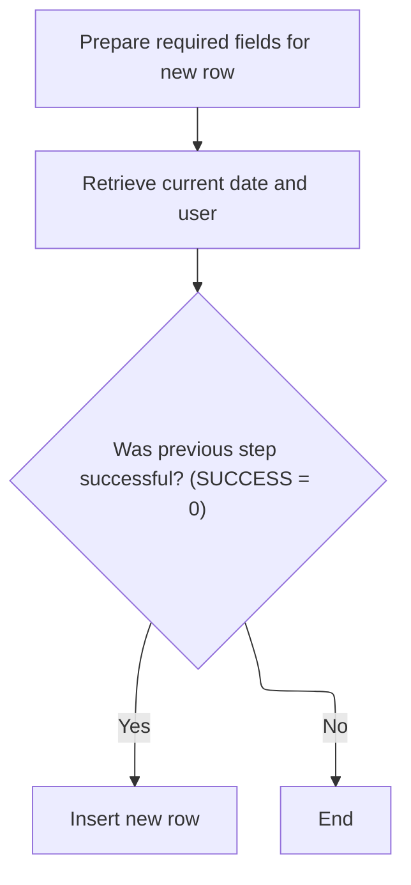

<SwmSnippet path="/base/src/NNNS0573.cbl" line="471">

---

`1500-EXIT-PUT-INSERT-ROW` gets audit info before inserting, and only inserts if that succeeds.

```cobol
049400 1500-EXIT-PUT-INSERT-ROW.                                        00049400
049500     PERFORM 1800-EDIT-NULL-INDICATORS                            00049500
049600                                                                  00049600
049700     PERFORM 2040-GET-DATE-AND-USER                               00049700
049800     IF SUCCESS                                                   00049800
049900       PERFORM 1510-D0-INSERT-ROW                                 00049900
050000     END-IF                                                       00050000
050100     .                                                            00050100
```

---

</SwmSnippet>

### Assigning ORG_ID and Completing Insert

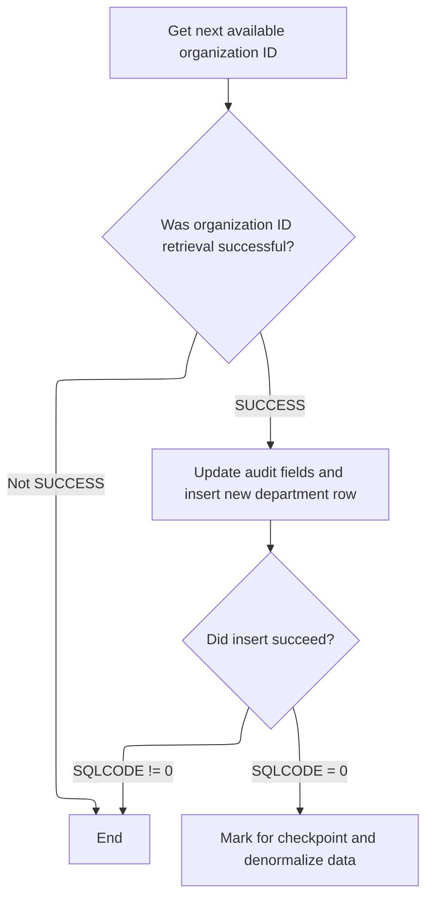

<SwmSnippet path="/base/src/NNNS0573.cbl" line="481">

---

`1510-D0-INSERT-ROW` first gets the next available ORG_ID by checking both LOCATION and XXX_DEPT tables. If that works, it stamps the row with the current timestamp and user, then calls the Oracle update routine to insert. If the insert succeeds, it sets flags and triggers denormalization.

```cobol
050400 1510-D0-INSERT-ROW.                                              00050400
050500     PERFORM 1520-EXIT-GET-ORG-ID                                 00050500
050600     IF SUCCESS                                                   00050600
050700       MOVE YYYC0127-TS   TO LST-UPDT-TS     OF DCLXXX-DEPT       00050700
050800       MOVE YYYC0107-USER TO LST-UPDT-USR-ID OF DCLXXX-DEPT       00050800
050900                                                                  00050900
051000       PERFORM 5000-CALL-NNNS0573-CUD-ROUTINE                     00051000
051100                                                                  00051100
051200       IF SQLCODE = 0                                             00051200
051300         MOVE 1 TO WS-CHECKPOINT-INC                              00051300
051400         SET YYYN110A-ADD TO TRUE                                 00051400
051500         SET STD-ADD TO TRUE                                      00051500
051600         PERFORM 2000-DENORM-PROCESS                              00051600
051700       END-IF                                                     00051700
051800     END-IF                                                       00051800
051900     .                                                            00051900
```

---

</SwmSnippet>

<SwmSnippet path="/base/src/NNNS0573.cbl" line="499">

---

`1520-EXIT-GET-ORG-ID` runs a SQL query to get the highest ORG_ID from LOCATION and XXX_DEPT, then adds 1 for the next available ID. If the query fails, it sets a failure flag and error message. There's no explicit handling for both tables being empty, so that's an edge case to watch.

```cobol
052200 1520-EXIT-GET-ORG-ID.                                            00052200
052300     EXEC SQL                                                     00052300
052400         SELECT GREATEST (MAX (LOC.ORG_ID), MAX (DEPT.ORG_ID))    00052400
052500         INTO   :DCLXXX-DEPT.ORG-ID                               00052500
052600         FROM   XXX_DEPT DEPT, LOCATION LOC                       00052600
052700         WITH UR                                                  00052700
052800     END-EXEC                                                     00052800
052900                                                                  00052900
053000     EVALUATE TRUE                                                00053000
053100       WHEN SQLCODE = 0                                           00053100
053200         COMPUTE ORG-ID OF DCLXXX-DEPT =                          00053200
053300                 ORG-ID OF DCLXXX-DEPT + 1                        00053300
053400       WHEN OTHER                                                 00053400
053500         SET  FAILURE TO TRUE                                     00053500
053600         MOVE 'NNNS0573 - Error getting ORG_ID!'                  00053600
053700           TO IS-RTRN-MSG-TXT                                     00053700
053800     END-EVALUATE                                                 00053800
053900     .                                                            00053900
```

---

</SwmSnippet>

### Purging a Department Row

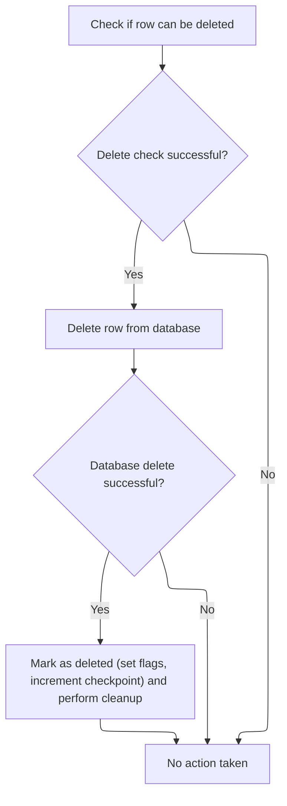

<SwmSnippet path="/base/src/NNNS0573.cbl" line="519">

---

`1600-EXIT-PUT-PURGE-ROW` first calls an external program to check if the department can be deleted. If that's successful, it updates the DB, sets delete flags, and then calls the denormalization process to handle any downstream business events tied to the delete.

```cobol
054200 1600-EXIT-PUT-PURGE-ROW.                                         00054200
054300                                                                  00054300
054310     PERFORM 4500-CALL-MMMS0304-RI-DEL-CHK                        00054310
054320     IF SUCCESS                                                   00054320
054400       PERFORM 5000-CALL-NNNS0573-CUD-ROUTINE                     00054400
054500                                                                  00054500
054600       IF SQLCODE = 0                                             00054600
054700         MOVE 1 TO WS-CHECKPOINT-INC                              00054700
054800         SET YYYN110A-DEL TO TRUE                                 00054800
054900         SET STD-DEL TO TRUE                                      00054900
055000         PERFORM 2000-DENORM-PROCESS                              00055000
055100       END-IF                                                     00055100
055110     END-IF                                                       00055110
055200     .                                                            00055200
```

---

</SwmSnippet>

&nbsp;

*This is an auto-generated document by Swimm 🌊 and has not yet been verified by a human*

<SwmMeta version="3.0.0" repo-id="Z2l0aHViJTNBJTNBU3dpbW1pby1keW5jYWxsLWRlbW8lM0ElM0FHaXJpLVN3aW1t" repo-name="Swimmio-dyncall-demo"><sup>Powered by [Swimm](https://app.swimm.io/)</sup></SwmMeta>
