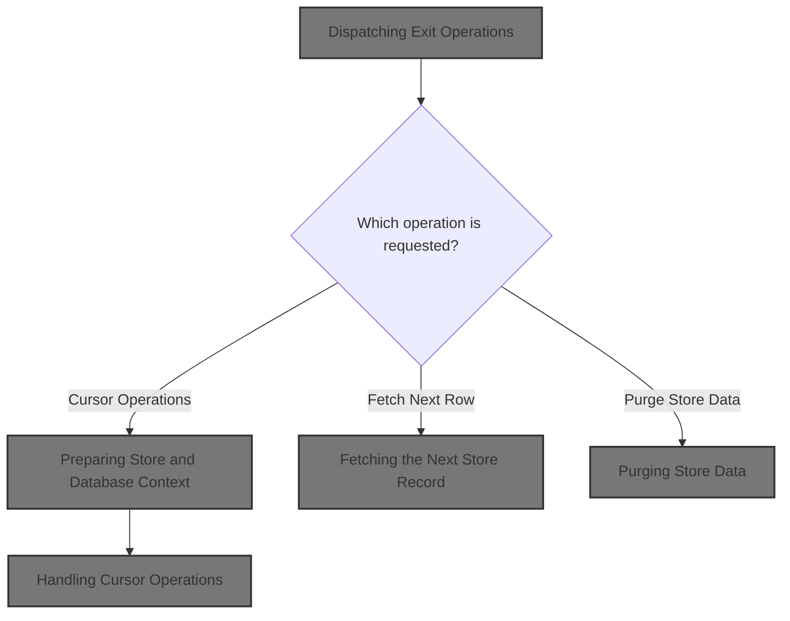
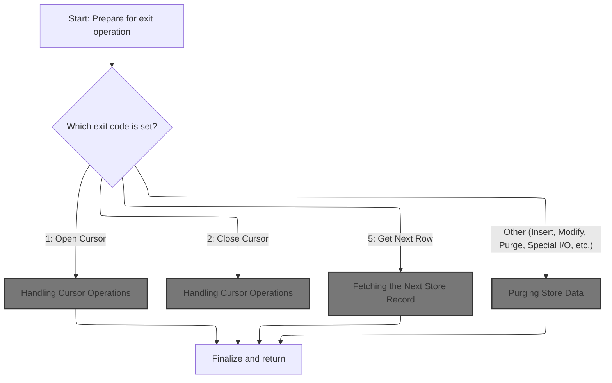
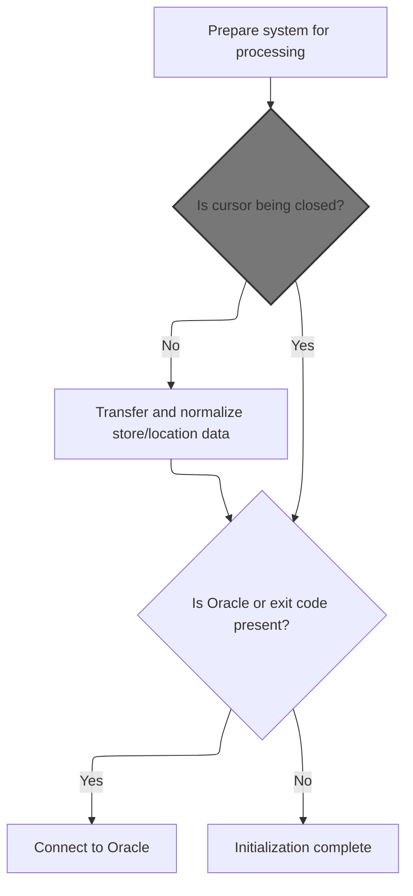
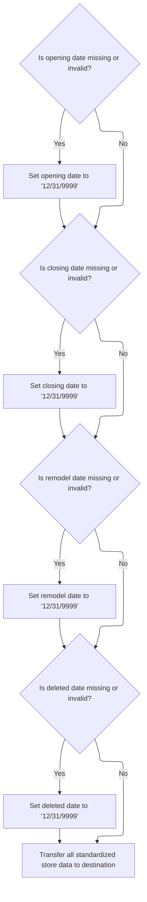
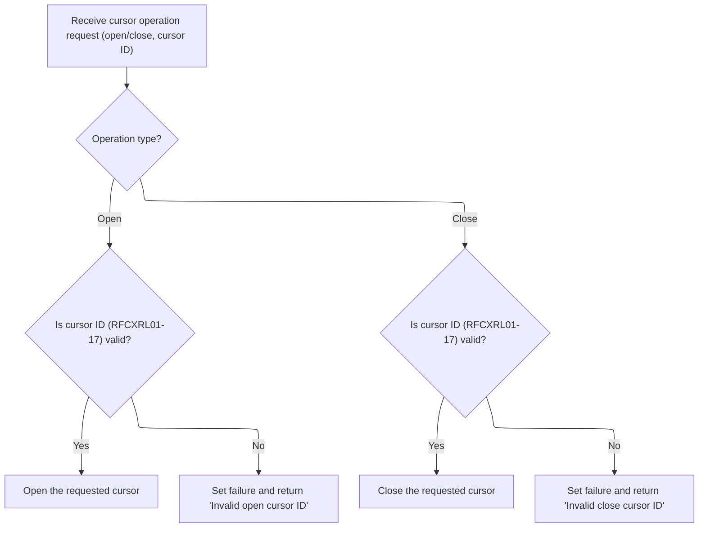

This document describes how exit operation requests are centrally routed and executed. The dispatcher receives a request specifying the type of store or database action to perform, prepares the necessary context, and routes the request to the appropriate business logic for operations like cursor management, fetching records, or purging data. The result of the requested operation is returned.



# Spec

## Detailed View of the Program's Functionality

# Swimmio-dyncall-demo: Detailed Flow Explanation

---

## A. Main Dispatch and Initialization

### 1\. Entry Point and Dispatch

- The main entry point is a dispatcher routine.
- It first performs an initialization routine to set up all working data and database connections.
- After initialization, it uses a switch-like construct to determine which operation to perform, based on an "exit code" received as input.
- Possible operations include opening/closing a database cursor, fetching a row, inserting/modifying/purging data, or running special I/O functions.
- After the selected operation completes, a cleanup routine is called, and the program returns control to the caller.

### 2\. Initialization Details

- The initialization routine resets working storage, copies an index handle, and resets checkpoint and SQL status flags.
- If the operation is not a cursor close, it performs a data normalization and transfer routine to ensure all store/location data is in the correct format for downstream routines.
- If the operation involves Oracle (such as insert, purge, or modify), it establishes a connection to the Oracle database by calling an external routine.
- If the Oracle connection fails, it logs the error code and builds an error message for the caller.

---

## B. Data Normalization and Transfer

### 1\. Normalizing Store Dates

- The normalization routine checks key date fields (opening, closing, remodel, deleted) in the input record.
- If any of these dates are missing, blank, or set to a known invalid value, they are replaced with a default far-future date ('12/31/9999').
- This ensures that all date fields are valid for downstream processing.

### 2\. Copying Store Data

- After normalizing dates, the routine copies a large set of store and location fields from the input record to the main working structure.
- For a special "rollup report code" field, it first blanks out the destination, then calls a dedicated routine to handle the transfer and validation of rollup data.
- This separation keeps the main copy logic clean and delegates rollup-specific rules to a specialized routine.

### 3\. Rollup Data Handling

- The rollup data routine copies the rollup report code as a block of text, then treats it as an array of 10 numbers.
- For each slot, if the value is numeric, it is copied; if not, it is set to zero.
- This ensures only valid numbers are transferred, and any garbage data is zeroed out.

---

## C. Database Connection

### 1\. Oracle Connection

- When required, the program calls an external routine to establish a connection to the Oracle database.
- If the connection fails, it logs the SQL error code and constructs an error message for the caller.

---

## D. Cursor Operations

### 1\. Opening a Cursor

- When an open cursor operation is requested, the program matches the input cursor ID to one of 17 possible SQL cursors.
- It then opens the corresponding cursor using a database command.
- If the cursor ID is invalid, it flags the operation as a failure and sets an error message.

### 2\. Closing a Cursor

- When a close cursor operation is requested, the program matches the input cursor ID to one of 17 possible SQL cursors.
- It then closes the corresponding cursor using a database command.
- If the cursor ID is invalid, it flags the operation as a failure and sets an error message.

---

## E. Fetching Store Records

### 1\. Fetching the Next Row

- When a fetch-next-row operation is requested, the program determines which cursor is active based on the input.
- It then calls the corresponding fetch routine for that cursor.
- Each fetch routine retrieves the next store record from the database and loads it into the main working structure.
- After fetching, a routine is called to check for null columns and clean up the data.
- If the cursor ID is invalid, it flags the operation as a failure and sets an error message.

### 2\. Fetch Routine Details

- Each fetch routine is tailored to a specific cursor and assumes the structure of the fetched data matches the working structure exactly.
- Any mismatch between the database select list and the working structure would cause the fetch to fail or load data incorrectly.

---

## F. Purging Store Data

### 1\. Purge Operation

- When a purge (delete) operation is requested, the program first calls an external routine to check if the store can be deleted (business rule check).
- If the check passes, it calls another routine to perform the actual database update (delete).
- It then increments a checkpoint counter to indicate that a change has occurred.

---

## G. Cleanup and Exit

### 1\. Exit Routine

- After the main operation, a cleanup routine is called.
- If the operation was successful and not a cursor close, it copies data back from the working structure to the output structure.
- It also updates a checkpoint counter if changes were made.
- If the operation involved Oracle, it may also connect to a secondary database as needed.

---

## H. Special and Utility Routines

### 1\. Special I/O Functions

- There is a placeholder for special I/O functions, which currently does nothing but can be extended for custom logic.

### 2\. Null Handling

- There are routines for checking and editing null indicators in the data, which are currently placeholders but can be extended to handle null values as needed.

---

## I. Summary

- The program acts as a central dispatcher for various store data operations, handling initialization, data normalization, cursor management, record fetching, data modification, and cleanup.
- It is designed to be robust against invalid input, with clear error handling and messaging.
- The structure is modular, with dedicated routines for each major operation and clear separation of business rules, data transfer, and database interaction.

# Rule Definition

| Paragraph Name                                                                                              | Rule ID | Category          | Description                                                                                                                                                                                                                                                       | Conditions                                                                           | Remarks                                                                                                                                                                                                                                                                    |
| ----------------------------------------------------------------------------------------------------------- | ------- | ----------------- | ----------------------------------------------------------------------------------------------------------------------------------------------------------------------------------------------------------------------------------------------------------------- | ------------------------------------------------------------------------------------ | -------------------------------------------------------------------------------------------------------------------------------------------------------------------------------------------------------------------------------------------------------------------------- |
| 0000-EXIT-DISPATCHER, 100-INITIALIZATION                                                                    | RL-001  | Conditional Logic | The system must accept an input structure containing an exit code (operation type), a cursor ID (if applicable), and optional context fields such as store number. It must dispatch the operation based on the exit code provided in the input.                   | Input structure is received with an exit code and optional cursor ID/context fields. | Valid exit codes: EXIT-OPEN-CURSOR, EXIT-CLOSE-CURSOR, EXIT-GET-UNIQUE-ROW, EXIT-GET-NEXT-ROW, EXIT-PUT-MODIFY-ROW, EXIT-PUT-INSERT-ROW, EXIT-PUT-PURGE-ROW, EXIT-DO-SPECIAL-IO-FUNCS. Input fields are alphanumeric or numeric as appropriate for their business meaning. |
| 1000-EXIT-OPEN-CURSOR, 1100-EXIT-CLOSE-CURSOR, 1300-EXIT-GET-NEXT-ROW                                       | RL-002  | Conditional Logic | For cursor operations (open, close, fetch), the system must validate the cursor ID against the list of valid IDs.                                                                                                                                                 | Operation is a cursor operation (open, close, fetch).                                | Valid cursor IDs: RFCXRL01 through RFCXRL17. If the cursor ID is invalid, set failure status and error message.                                                                                                                                                            |
| 1300-EXIT-GET-NEXT-ROW, 1301-FETCH-RFCXRL01 through 1317-FETCH-RFCXRL17, 1200-EXIT-GET-UNIQUE-ROW           | RL-003  | Data Assignment   | For fetch operations, the system must populate the output store record structure with all fields as defined for the RFCXRL05 cursor, using the order and names from the SELECT statement and the types as inferred from the DCLGEN/copybook or database schema.   | Operation is a fetch (EXIT-GET-NEXT-ROW or EXIT-GET-UNIQUE-ROW).                     | Output structure must include all fields from RFCXRL05, with types (string, number, date, etc.) matching the database schema. Field order and names must match the SELECT statement. No COBOL variable names in output; use business field names.                          |
| 110-MOVE-PDA-FIELDS-2-DCL                                                                                   | RL-004  | Data Assignment   | For date fields in the store record, if the value is missing, blank, '00/00/0000', or '01/01/1600', the system must set the value to '12/31/9999'.                                                                                                                | Any date field in the store record is missing, blank, '00/00/0000', or '01/01/1600'. | Date fields are strings in 'MM/DD/YYYY' format. Default value: '12/31/9999'.                                                                                                                                                                                               |
| 117-MOVE-ROLLUP-DATA, 135-MOVE-DC-ROLLUP-DATA                                                               | RL-005  | Computation       | For rollup report code fields, the system must copy the code as a string and parse it into up to 10 numeric rollup report numbers. If a rollup number is not numeric, it must be set to zero.                                                                     | Rollup report code field is present in the input or output structure.                | Rollup report code is a string (up to 20 chars). Up to 10 numeric rollup numbers (number type). Non-numeric values are set to zero.                                                                                                                                        |
| 0000-EXIT-DISPATCHER, 1000-EXIT-OPEN-CURSOR, 1100-EXIT-CLOSE-CURSOR, 1300-EXIT-GET-NEXT-ROW, 120-EXIT-STUFF | RL-006  | Data Assignment   | For all operations, the system must set a success flag and an error message in the output structure. If the operation fails (e.g., invalid cursor ID, SQL/database error), the success flag must be set to false and the error message must describe the failure. | Any operation is performed.                                                          | Output structure must include a boolean success flag and an error message string (sized for descriptive text).                                                                                                                                                             |
| 1400-EXIT-PUT-MODIFY-ROW, 1500-EXIT-PUT-INSERT-ROW, 1600-EXIT-PUT-PURGE-ROW, 120-EXIT-STUFF                 | RL-007  | Computation       | For insert, modify, or purge operations, the system must update the database and increment the checkpoint counter if the operation is successful.                                                                                                                 | Operation is insert, modify, or purge and is successful.                             | Checkpoint counter is a numeric field incremented by 1 for each successful modification operation.                                                                                                                                                                         |
| 1300-EXIT-GET-NEXT-ROW, 1200-EXIT-GET-UNIQUE-ROW, 120-EXIT-STUFF                                            | RL-008  | Data Assignment   | The output structure must always include the operation result status (success/failure) and an error message field. The output store record structure must include all fields as defined for RFCXRL05, with the correct types and formats as described above.      | Any operation is performed.                                                          | Output structure: includes all RFCXRL05 fields (see SELECT statement), plus a boolean success flag and an error message string. Field types: string, number, date, as per schema. Field order and names must match RFCXRL05 definition.                                    |

# User Stories

## User Story 1: Operation dispatch, validation, and database update

---

### Story Description:

As a system, I want to accept structured input with an exit code, cursor ID, and context fields, dispatch the requested operation, validate cursor IDs for cursor operations, update the database and increment the checkpoint counter for successful insert, modify, or purge operations, and always return a success flag and error message so that all supported operations are handled reliably, data changes are tracked, and errors are communicated clearly.

---

### Business Rule Mapping:

| Rule ID | Paragraph Name                                                                                              | Rule Description                                                                                                                                                                                                                                                  |
| ------- | ----------------------------------------------------------------------------------------------------------- | ----------------------------------------------------------------------------------------------------------------------------------------------------------------------------------------------------------------------------------------------------------------- |
| RL-001  | 0000-EXIT-DISPATCHER, 100-INITIALIZATION                                                                    | The system must accept an input structure containing an exit code (operation type), a cursor ID (if applicable), and optional context fields such as store number. It must dispatch the operation based on the exit code provided in the input.                   |
| RL-006  | 0000-EXIT-DISPATCHER, 1000-EXIT-OPEN-CURSOR, 1100-EXIT-CLOSE-CURSOR, 1300-EXIT-GET-NEXT-ROW, 120-EXIT-STUFF | For all operations, the system must set a success flag and an error message in the output structure. If the operation fails (e.g., invalid cursor ID, SQL/database error), the success flag must be set to false and the error message must describe the failure. |
| RL-002  | 1000-EXIT-OPEN-CURSOR, 1100-EXIT-CLOSE-CURSOR, 1300-EXIT-GET-NEXT-ROW                                       | For cursor operations (open, close, fetch), the system must validate the cursor ID against the list of valid IDs.                                                                                                                                                 |
| RL-007  | 1400-EXIT-PUT-MODIFY-ROW, 1500-EXIT-PUT-INSERT-ROW, 1600-EXIT-PUT-PURGE-ROW, 120-EXIT-STUFF                 | For insert, modify, or purge operations, the system must update the database and increment the checkpoint counter if the operation is successful.                                                                                                                 |

---

### Relevant Functionality:

- **0000-EXIT-DISPATCHER**
  1. **RL-001:**
     - On program entry, read the input structure.
     - Evaluate the exit code:
       - If the exit code matches a supported operation, dispatch to the corresponding handler.
       - If not, set failure status and error message in output.
  2. **RL-006:**
     - After each operation:
       - If successful, set success flag to true and clear error message.
       - If failed, set success flag to false and populate error message with a description of the failure.
- **1000-EXIT-OPEN-CURSOR**
  1. **RL-002:**
     - When a cursor operation is requested:
       - Check if the cursor ID is in the list of valid IDs.
       - If valid, proceed with the operation.
       - If invalid, set failure status and error message in output.
- **1400-EXIT-PUT-MODIFY-ROW**
  1. **RL-007:**
     - After a successful insert, modify, or purge:
       - Increment the checkpoint counter by 1.

## User Story 2: Output structure population and field handling

---

### Story Description:

As a system, I want to populate the output store record with all RFCXRL05 fields in the correct order and types, set default values for missing or invalid date fields, parse rollup report codes into numeric values, and always include operation result status and error message so that output data is complete, accurate, and conforms to business requirements.

---

### Business Rule Mapping:

| Rule ID | Paragraph Name                                                                                    | Rule Description                                                                                                                                                                                                                                                |
| ------- | ------------------------------------------------------------------------------------------------- | --------------------------------------------------------------------------------------------------------------------------------------------------------------------------------------------------------------------------------------------------------------- |
| RL-004  | 110-MOVE-PDA-FIELDS-2-DCL                                                                         | For date fields in the store record, if the value is missing, blank, '00/00/0000', or '01/01/1600', the system must set the value to '12/31/9999'.                                                                                                              |
| RL-005  | 117-MOVE-ROLLUP-DATA, 135-MOVE-DC-ROLLUP-DATA                                                     | For rollup report code fields, the system must copy the code as a string and parse it into up to 10 numeric rollup report numbers. If a rollup number is not numeric, it must be set to zero.                                                                   |
| RL-003  | 1300-EXIT-GET-NEXT-ROW, 1301-FETCH-RFCXRL01 through 1317-FETCH-RFCXRL17, 1200-EXIT-GET-UNIQUE-ROW | For fetch operations, the system must populate the output store record structure with all fields as defined for the RFCXRL05 cursor, using the order and names from the SELECT statement and the types as inferred from the DCLGEN/copybook or database schema. |
| RL-008  | 1300-EXIT-GET-NEXT-ROW, 1200-EXIT-GET-UNIQUE-ROW, 120-EXIT-STUFF                                  | The output structure must always include the operation result status (success/failure) and an error message field. The output store record structure must include all fields as defined for RFCXRL05, with the correct types and formats as described above.    |

---

### Relevant Functionality:

- **110-MOVE-PDA-FIELDS-2-DCL**
  1. **RL-004:**
     - For each date field:
       - If value is blank, '00/00/0000', or '01/01/1600', set to '12/31/9999'.
       - Otherwise, leave as is.
- **117-MOVE-ROLLUP-DATA**
  1. **RL-005:**
     - Copy the rollup report code string to the output.
     - For each of the 10 rollup numbers:
       - If the corresponding substring is numeric, assign its value.
       - If not numeric, assign zero.
- **1300-EXIT-GET-NEXT-ROW**
  1. **RL-003:**
     - On fetch operation:
       - Execute the appropriate FETCH statement for the cursor.
       - Map the fetched columns to the output structure fields in the defined order and type.
       - If no row is found or error occurs, set failure status and error message.
  2. **RL-008:**
     - After each operation:
       - Populate the output structure with all required fields.
       - Ensure all RFCXRL05 fields are present and correctly typed.
       - Include the success flag and error message.

# Code Walkthrough

## Dispatching Exit Operations



<SwmSnippet path="/base/src/NNNS0120.cbl" line="1661">

---

`0000-EXIT-DISPATCHER` kicks off the flow. It acts as a central switchboard: it calls `100-INITIALIZATION` to set up all the working data and database connections, then uses an EVALUATE (think switch-case) to route control to the right exit routine based on the exit code. Each exit code triggers a specific operation—like opening/closing a cursor, fetching rows, or modifying data. After the operation, it runs cleanup (`120-EXIT-STUFF`) and returns. Initialization comes first because none of the exit routines can safely run without the right context and connections in place.

```cobol
168200 0000-EXIT-DISPATCHER.                                            00168200
168300     PERFORM 100-INITIALIZATION                                   00168300
168400     EVALUATE TRUE                                                00168400
168500       WHEN NOT SUCCESS                                           00168500
168600          CONTINUE                                                00168600
168700       WHEN EXIT-OPEN-CURSOR                                      00168700
168800          PERFORM 1000-EXIT-OPEN-CURSOR                           00168800
168900       WHEN EXIT-CLOSE-CURSOR                                     00168900
169000          PERFORM 1100-EXIT-CLOSE-CURSOR                          00169000
169100       WHEN EXIT-GET-UNIQUE-ROW                                   00169100
169200          PERFORM 1200-EXIT-GET-UNIQUE-ROW                        00169200
169300       WHEN EXIT-GET-NEXT-ROW                                     00169300
169400          PERFORM 1300-EXIT-GET-NEXT-ROW                          00169400
169500       WHEN EXIT-PUT-MODIFY-ROW                                   00169500
169600          PERFORM 1400-EXIT-PUT-MODIFY-ROW                        00169600
169700       WHEN EXIT-PUT-INSERT-ROW                                   00169700
169800          PERFORM 1500-EXIT-PUT-INSERT-ROW                        00169800
169900       WHEN EXIT-PUT-PURGE-ROW                                    00169900
170000          PERFORM 1600-EXIT-PUT-PURGE-ROW                         00170000
170100       WHEN EXIT-DO-SPECIAL-IO-FUNCS                              00170100
170200          PERFORM 10000-DO-SPECIAL-IO-FUNCS                       00170200
170300     END-EVALUATE                                                 00170300
170400     PERFORM 120-EXIT-STUFF                                       00170400
170500     GOBACK                                                       00170500
170600     .                                                            00170600
```

---

</SwmSnippet>

### Preparing Store and Database Context



<SwmSnippet path="/base/src/NNNS0120.cbl" line="1691">

---

`100-INITIALIZATION` sets up the working storage, copies the index handle, resets checkpoint and SQL status, and, unless we're closing a cursor, calls `110-MOVE-PDA-FIELDS-2-DCL` to transfer and normalize store/location data. This is needed so all downstream routines have the right data in the right format. If the operation involves Oracle (like insert, purge, or modify), it also connects to the database.

```cobol
171200 100-INITIALIZATION.                                              00171200
171300     INITIALIZE W00N001A                                          00171300
171400     MOVE NNNN0000-INDEX-HANDLE TO DDDTRL01-INDEX-HANDLE          00171400
171500     MOVE 0 TO WS-CHECKPOINT-INC                                  00171500
171600     MOVE 0 TO SQLCODE                                            00171600
171700     MOVE 0 TO SQL-INIT-FLAG                                      00171700
171800     IF NOT EXIT-CLOSE-CURSOR                                     00171800
171900       PERFORM 110-MOVE-PDA-FIELDS-2-DCL                          00171900
172000     END-IF                                                       00172000
172100                                                                  00172100
172200     IF (YYYN005A-ORACLE       OR EXIT-PUT-INSERT-ROW             00172200
172300         OR EXIT-PUT-PURGE-ROW OR EXIT-PUT-MODIFY-ROW)            00172300
172400       PERFORM 115-CONNECT-TO-ORACLE                              00172400
172500     END-IF                                                       00172500
172600     .                                                            00172600
```

---

</SwmSnippet>

#### Normalizing and Copying Store Data



<SwmSnippet path="/base/src/NNNS0120.cbl" line="1711">

---

`110-MOVE-PDA-FIELDS-2-DCL` normalizes all the key date fields in the source record—if they're blank, '00/00/0000', or '01/01/1600', it sets them to '12/31/9999'. Then it copies a ton of store/location fields over to the main structure. For rollup data, it blanks out the field and calls `117-MOVE-ROLLUP-DATA` to handle the actual transfer and validation of those values. This keeps the main copy logic clean and offloads the rollup-specific rules.

```cobol
173200 110-MOVE-PDA-FIELDS-2-DCL.                                       00173200
173300     IF FC-RL-OPENING-DT OF P-DDDTRL01 = SPACES                   00173300
173400     OR FC-RL-OPENING-DT OF P-DDDTRL01 = '00/00/0000'             00173400
173500     OR FC-RL-OPENING-DT OF P-DDDTRL01 = '01/01/1600'             00173500
173600       MOVE '12/31/9999' TO FC-RL-OPENING-DT OF P-DDDTRL01        00173600
173700     END-IF                                                       00173700
173800     IF FC-RL-CLOSING-DT OF P-DDDTRL01 = SPACES                   00173800
173900     OR FC-RL-CLOSING-DT OF P-DDDTRL01 = '00/00/0000'             00173900
174000     OR FC-RL-CLOSING-DT OF P-DDDTRL01 = '01/01/1600'             00174000
174100       MOVE '12/31/9999' TO FC-RL-CLOSING-DT OF P-DDDTRL01        00174100
174200     END-IF                                                       00174200
174300     IF FC-RL-REMODEL-DT OF P-DDDTRL01 = SPACES                   00174300
174400     OR FC-RL-REMODEL-DT OF P-DDDTRL01 = '00/00/0000'             00174400
174500     OR FC-RL-REMODEL-DT OF P-DDDTRL01 = '01/01/1600'             00174500
174600       MOVE '12/31/9999' TO FC-RL-REMODEL-DT OF P-DDDTRL01        00174600
174700     END-IF                                                       00174700
174800     IF FC-RL-DELETED-DT OF P-DDDTRL01 = SPACES                   00174800
174900     OR FC-RL-DELETED-DT OF P-DDDTRL01 = '00/00/0000'             00174900
175000     OR FC-RL-DELETED-DT OF P-DDDTRL01 = '01/01/1600'             00175000
175100       MOVE '12/31/9999' TO FC-RL-DELETED-DT OF P-DDDTRL01        00175100
175200     END-IF                                                       00175200
175300                                                                  00175300
175400     MOVE FC-STORE-NO OF P-DDDTRL01                               00175400
175500       TO FC-STORE-NO OF DCLFC-XXXAIL-STORES                      00175500
175600     MOVE FC-RL-STORE-NM OF P-DDDTRL01                            00175600
175700       TO FC-RL-STORE-NM OF DCLFC-XXXAIL-STORES                   00175700
175800     MOVE FC-RL-STORE-CD OF P-DDDTRL01                            00175800
175900       TO FC-RL-STORE-CD OF DCLFC-XXXAIL-STORES                   00175900
176000     MOVE FC-RL-STORE-DIR-NM OF P-DDDTRL01                        00176000
176100       TO FC-RL-STORE-DIR-NM OF DCLFC-XXXAIL-STORES               00176100
176200     MOVE FC-RL-STORE-LOC-NM OF P-DDDTRL01                        00176200
176300       TO FC-RL-STORE-LOC-NM OF DCLFC-XXXAIL-STORES               00176300
176400     MOVE FC-RL-OPENING-DT OF P-DDDTRL01                          00176400
176500       TO FC-RL-OPENING-DT OF DCLFC-XXXAIL-STORES                 00176500
176600     MOVE FC-RL-CLOSING-DT OF P-DDDTRL01                          00176600
176700       TO FC-RL-CLOSING-DT OF DCLFC-XXXAIL-STORES                 00176700
176800     MOVE FC-RL-REMODEL-DT OF P-DDDTRL01                          00176800
176900       TO FC-RL-REMODEL-DT OF DCLFC-XXXAIL-STORES                 00176900
177000     MOVE FC-RL-DELETED-DT OF P-DDDTRL01                          00177000
177100       TO FC-RL-DELETED-DT OF DCLFC-XXXAIL-STORES                 00177100
177200     MOVE FC-RL-DISTRICT-NO OF P-DDDTRL01                         00177200
177300       TO FC-RL-DISTRICT-NO OF DCLFC-XXXAIL-STORES                00177300
177400     MOVE FC-RL-MARKET-AR-NO OF P-DDDTRL01                        00177400
177500       TO FC-RL-MARKET-AR-NO OF DCLFC-XXXAIL-STORES               00177500
177600     MOVE FC-RL-PAYROL-AR-NO OF P-DDDTRL01                        00177600
177700       TO FC-RL-PAYROL-AR-NO OF DCLFC-XXXAIL-STORES               00177700
177800     MOVE FC-RL-PAY-GROUP-NO OF P-DDDTRL01                        00177800
177900       TO FC-RL-PAY-GROUP-NO OF DCLFC-XXXAIL-STORES               00177900
178000     MOVE FC-RL-COMPANY-NO OF P-DDDTRL01                          00178000
178100       TO FC-RL-COMPANY-NO OF DCLFC-XXXAIL-STORES                 00178100
178200     MOVE FC-RL-GEO-ZONE-CD OF P-DDDTRL01                         00178200
178300       TO FC-RL-GEO-ZONE-CD OF DCLFC-XXXAIL-STORES                00178300
178400     MOVE FC-RL-GEO-ZONE-NO OF P-DDDTRL01                         00178400
178500       TO FC-RL-GEO-ZONE-NO OF DCLFC-XXXAIL-STORES                00178500
178600     MOVE FC-RL-SCAN-MAIN-CD OF P-DDDTRL01                        00178600
178700       TO FC-RL-SCAN-MAIN-CD OF DCLFC-XXXAIL-STORES               00178700
178800     MOVE FC-RL-FRONT-END-CD OF P-DDDTRL01                        00178800
178900       TO FC-RL-FRONT-END-CD OF DCLFC-XXXAIL-STORES               00178900
179000     MOVE FC-RL-PRICE-BUL-CD OF P-DDDTRL01                        00179000
179100       TO FC-RL-PRICE-BUL-CD OF DCLFC-XXXAIL-STORES               00179100
179200     MOVE FC-RL-UPC-ON-PB-CD OF P-DDDTRL01                        00179200
179300       TO FC-RL-UPC-ON-PB-CD OF DCLFC-XXXAIL-STORES               00179300
179400     MOVE FC-RL-COMPETITR-CD OF P-DDDTRL01                        00179400
179500       TO FC-RL-COMPETITR-CD OF DCLFC-XXXAIL-STORES               00179500
179600     MOVE FC-RL-ASSOC-STR-NO OF P-DDDTRL01                        00179600
179700       TO FC-RL-ASSOC-STR-NO OF DCLFC-XXXAIL-STORES               00179700
179800     MOVE FC-RL-RPRT-SEQ-NO OF P-DDDTRL01                         00179800
179900       TO FC-RL-RPRT-SEQ-NO OF DCLFC-XXXAIL-STORES                00179900
180000     MOVE FC-RL-SORT-SOS-NO OF P-DDDTRL01                         00180000
180100       TO FC-RL-SORT-SOS-NO OF DCLFC-XXXAIL-STORES                00180100
180200     MOVE FC-RL-VID-PRZN-NO OF P-DDDTRL01                         00180200
180300       TO FC-RL-VID-PRZN-NO OF DCLFC-XXXAIL-STORES                00180300
180400     MOVE FC-RL-CITY-ID-CD OF P-DDDTRL01                          00180400
180500       TO FC-RL-CITY-ID-CD OF DCLFC-XXXAIL-STORES                 00180500
180600     MOVE FC-RL-ADZONE-ABB OF P-DDDTRL01                          00180600
180700       TO FC-RL-ADZONE-ABB OF DCLFC-XXXAIL-STORES                 00180700
180800     MOVE FC-RL-ADZONE-DES OF P-DDDTRL01                          00180800
180900       TO FC-RL-ADZONE-DES OF DCLFC-XXXAIL-STORES                 00180900
181000     MOVE FC-RL-UNLOAD-SW OF P-DDDTRL01                           00181000
181100       TO FC-RL-UNLOAD-SW OF DCLFC-XXXAIL-STORES                  00181100
181200*    MOVE FN-ROLLUP-REPT-CD OF P-DDDTRL01                         00181200
181300     MOVE SPACES                                                  00181300
181400       TO FN-ROLLUP-REPT-CD OF DCLFC-XXXAIL-STORES                00181400
181500     PERFORM 117-MOVE-ROLLUP-DATA                                 00181500
181600     MOVE FC-RL-STATUS-CD OF P-DDDTRL01                           00181600
181700       TO FC-RL-STATUS-CD OF DCLFC-XXXAIL-STORES                  00181700
181800     MOVE FC-RL-NEW-STORE-CD OF P-DDDTRL01                        00181800
181900       TO FC-RL-NEW-STORE-CD OF DCLFC-XXXAIL-STORES               00181900
182000     MOVE FC-RL-TYPE-CD OF P-DDDTRL01                             00182000
182100       TO FC-RL-TYPE-CD OF DCLFC-XXXAIL-STORES                    00182100
182200     MOVE FC-RL-GROUP-CD OF P-DDDTRL01                            00182200
182300       TO FC-RL-GROUP-CD OF DCLFC-XXXAIL-STORES                   00182300
182400     MOVE FC-RL-SELECTCIR-CD OF P-DDDTRL01                        00182400
182500       TO FC-RL-SELECTCIR-CD OF DCLFC-XXXAIL-STORES               00182500
182600     MOVE FC-RL-AREA-CODE-NO OF P-DDDTRL01                        00182600
182700       TO FC-RL-AREA-CODE-NO OF DCLFC-XXXAIL-STORES               00182700
182800     MOVE FC-RL-TELEPHONE-NO OF P-DDDTRL01                        00182800
182900       TO FC-RL-TELEPHONE-NO OF DCLFC-XXXAIL-STORES               00182900
183000     MOVE FC-RL-STORE-ABB OF P-DDDTRL01                           00183000
183100       TO FC-RL-STORE-ABB OF DCLFC-XXXAIL-STORES                  00183100
183200     MOVE FC-RL-BCKRM-FT-QTY OF P-DDDTRL01                        00183200
183300       TO FC-RL-BCKRM-FT-QTY OF DCLFC-XXXAIL-STORES               00183300
183400     MOVE FC-RL-LFT-FOOD-QTY OF P-DDDTRL01                        00183400
183500       TO FC-RL-LFT-FOOD-QTY OF DCLFC-XXXAIL-STORES               00183500
183600     MOVE FC-RL-LFT-NONF-QTY OF P-DDDTRL01                        00183600
183700       TO FC-RL-LFT-NONF-QTY OF DCLFC-XXXAIL-STORES               00183700
183800     MOVE FC-RL-SETOFF-CD OF P-DDDTRL01                           00183800
183900       TO FC-RL-SETOFF-CD OF DCLFC-XXXAIL-STORES                  00183900
184000     MOVE FC-RL-CL12-ZONE-NO OF P-DDDTRL01                        00184000
184100       TO FC-RL-CL12-ZONE-NO OF DCLFC-XXXAIL-STORES               00184100
184200     MOVE FC-RL-CL12-ADZN-NO OF P-DDDTRL01                        00184200
184300       TO FC-RL-CL12-ADZN-NO OF DCLFC-XXXAIL-STORES               00184300
184400     MOVE FC-RL-CL13-ZONE-NO OF P-DDDTRL01                        00184400
184500       TO FC-RL-CL13-ZONE-NO OF DCLFC-XXXAIL-STORES               00184500
184600     MOVE FC-RL-CL13-ADZN-NO OF P-DDDTRL01                        00184600
184700       TO FC-RL-CL13-ADZN-NO OF DCLFC-XXXAIL-STORES               00184700
184800     MOVE FC-RL-CL14-ZONE-NO OF P-DDDTRL01                        00184800
184900       TO FC-RL-CL14-ZONE-NO OF DCLFC-XXXAIL-STORES               00184900
185000     MOVE FC-RL-CL14-ADZN-NO OF P-DDDTRL01                        00185000
185100       TO FC-RL-CL14-ADZN-NO OF DCLFC-XXXAIL-STORES               00185100
185200     MOVE FC-RL-CL36-ADZN-NO OF P-DDDTRL01                        00185200
185300       TO FC-RL-CL36-ADZN-NO OF DCLFC-XXXAIL-STORES               00185300
185400     MOVE FC-RL-CL37-ADZN-NO OF P-DDDTRL01                        00185400
185500       TO FC-RL-CL37-ADZN-NO OF DCLFC-XXXAIL-STORES               00185500
185600     MOVE FC-RL-STORE-DEA-NO OF P-DDDTRL01                        00185600
185700       TO FC-RL-STORE-DEA-NO OF DCLFC-XXXAIL-STORES               00185700
185800     MOVE FC-RL-RETL-ZONE-NO OF P-DDDTRL01                        00185800
185900       TO FC-RL-RETL-ZONE-NO OF DCLFC-XXXAIL-STORES               00185900
186000     MOVE FC-RL-STOR2-LOC-NM OF P-DDDTRL01                        00186000
186100       TO FC-RL-STOR2-LOC-NM OF DCLFC-XXXAIL-STORES               00186100
186200     MOVE FC-CITY-ADR OF P-DDDTRL01                               00186200
186300       TO FC-CITY-ADR OF DCLFC-XXXAIL-STORES                      00186300
186400     MOVE FC-STATE-ADR OF P-DDDTRL01                              00186400
186500       TO FC-STATE-ADR OF DCLFC-XXXAIL-STORES                     00186500
186600     MOVE FC-ZIP-CODE5-ADR OF P-DDDTRL01                          00186600
186700       TO FC-ZIP-CODE5-ADR OF DCLFC-XXXAIL-STORES                 00186700
186800     MOVE FC-ZIP-CODE4-ADR OF P-DDDTRL01                          00186800
186900       TO FC-ZIP-CODE4-ADR OF DCLFC-XXXAIL-STORES                 00186900
187000     MOVE FC-RL-SOS-TYPE-CD OF P-DDDTRL01                         00187000
187100       TO FC-RL-SOS-TYPE-CD OF DCLFC-XXXAIL-STORES                00187100
187200     MOVE FC-RL-NOPROCESS-CD OF P-DDDTRL01                        00187200
187300       TO FC-RL-NOPROCESS-CD OF DCLFC-XXXAIL-STORES               00187300
187400     MOVE FC-RL-SOSHDRTYP-CD OF P-DDDTRL01                        00187400
187500       TO FC-RL-SOSHDRTYP-CD OF DCLFC-XXXAIL-STORES               00187500
187600     MOVE FC-RL-CAT-CLASS-TB OF P-DDDTRL01                        00187600
187700       TO FC-RL-CAT-CLASS-TB OF DCLFC-XXXAIL-STORES               00187700
187800     MOVE FC-RL-LATITUDE-K OF P-DDDTRL01                          00187800
187900       TO FC-RL-LATITUDE-K OF DCLFC-XXXAIL-STORES                 00187900
188000     MOVE FC-RL-LONGITUDE-K OF P-DDDTRL01                         00188000
188100       TO FC-RL-LONGITUDE-K OF DCLFC-XXXAIL-STORES                00188100
188200     MOVE FN-DIVISION-CD OF P-DDDTRL01                            00188200
188300       TO FN-DIVISION-CD OF DCLFC-XXXAIL-STORES                   00188300
188400     MOVE FN-LINE-OF-BUS-CD OF P-DDDTRL01                         00188400
188500       TO FN-LINE-OF-BUS-CD OF DCLFC-XXXAIL-STORES                00188500
188600     .                                                            00188600
```

---

</SwmSnippet>

<SwmSnippet path="/base/src/NNNS0120.cbl" line="1884">

---

`117-MOVE-ROLLUP-DATA` copies the rollup report code as a block of text, then treats it as an array of 10 numbers. For each slot, if it's numeric, it moves the value; if not, it sets zero. This way, only valid numbers get through and garbage data is zeroed out.

```cobol
190500 117-MOVE-ROLLUP-DATA.                                            00190500
190600     MOVE FN-ROLLUP-REPT-CD OF P-DDDTRL01                         00190600
190700       TO WS-REPT-TBL-TXT                                         00190700
190800     IF WS-REPT-TBL-NUMERIC(1) IS NUMERIC                         00190800
190900        MOVE WS-REPT-TBL-NUMERIC(1)                               00190900
191000          TO FN-ROLLUP-REPT-01-NBR  OF DCLFC-XXXAIL-STORES        00191000
191100     ELSE                                                         00191100
191200        MOVE ZERO TO FN-ROLLUP-REPT-01-NBR OF DCLFC-XXXAIL-STORES 00191200
191300     END-IF                                                       00191300
191400     IF WS-REPT-TBL-NUMERIC(2) IS NUMERIC                         00191400
191500        MOVE WS-REPT-TBL-NUMERIC(2)                               00191500
191600          TO FN-ROLLUP-REPT-02-NBR  OF DCLFC-XXXAIL-STORES        00191600
191700     ELSE                                                         00191700
191800        MOVE ZERO TO FN-ROLLUP-REPT-02-NBR OF DCLFC-XXXAIL-STORES 00191800
191900     END-IF                                                       00191900
192000     IF WS-REPT-TBL-NUMERIC(3) IS NUMERIC                         00192000
192100        MOVE WS-REPT-TBL-NUMERIC(3)                               00192100
192200          TO FN-ROLLUP-REPT-03-NBR  OF DCLFC-XXXAIL-STORES        00192200
192300     ELSE                                                         00192300
192400        MOVE ZERO TO FN-ROLLUP-REPT-03-NBR OF DCLFC-XXXAIL-STORES 00192400
192500     END-IF                                                       00192500
192600     IF WS-REPT-TBL-NUMERIC(4) IS NUMERIC                         00192600
192700        MOVE WS-REPT-TBL-NUMERIC(4)                               00192700
192800          TO FN-ROLLUP-REPT-04-NBR  OF DCLFC-XXXAIL-STORES        00192800
192900     ELSE                                                         00192900
193000        MOVE ZERO TO FN-ROLLUP-REPT-04-NBR OF DCLFC-XXXAIL-STORES 00193000
193100     END-IF                                                       00193100
193200     IF WS-REPT-TBL-NUMERIC(5) IS NUMERIC                         00193200
193300        MOVE WS-REPT-TBL-NUMERIC(5)                               00193300
193400          TO FN-ROLLUP-REPT-05-NBR  OF DCLFC-XXXAIL-STORES        00193400
193500     ELSE                                                         00193500
193600        MOVE ZERO TO FN-ROLLUP-REPT-05-NBR OF DCLFC-XXXAIL-STORES 00193600
193700     END-IF                                                       00193700
193800     IF WS-REPT-TBL-NUMERIC(6) IS NUMERIC                         00193800
193900        MOVE WS-REPT-TBL-NUMERIC(6)                               00193900
194000          TO FN-ROLLUP-REPT-06-NBR  OF DCLFC-XXXAIL-STORES        00194000
194100     ELSE                                                         00194100
194200        MOVE ZERO TO FN-ROLLUP-REPT-06-NBR OF DCLFC-XXXAIL-STORES 00194200
194300     END-IF                                                       00194300
194400     IF WS-REPT-TBL-NUMERIC(7) IS NUMERIC                         00194400
194500        MOVE WS-REPT-TBL-NUMERIC(7)                               00194500
194600          TO FN-ROLLUP-REPT-07-NBR  OF DCLFC-XXXAIL-STORES        00194600
194700     ELSE                                                         00194700
194800        MOVE ZERO TO FN-ROLLUP-REPT-07-NBR OF DCLFC-XXXAIL-STORES 00194800
194900     END-IF                                                       00194900
195000     IF WS-REPT-TBL-NUMERIC(8) IS NUMERIC                         00195000
195100        MOVE WS-REPT-TBL-NUMERIC(8)                               00195100
195200          TO FN-ROLLUP-REPT-08-NBR  OF DCLFC-XXXAIL-STORES        00195200
195300     ELSE                                                         00195300
195400        MOVE ZERO TO FN-ROLLUP-REPT-08-NBR OF DCLFC-XXXAIL-STORES 00195400
195500     END-IF                                                       00195500
195600     IF WS-REPT-TBL-NUMERIC(9) IS NUMERIC                         00195600
195700        MOVE WS-REPT-TBL-NUMERIC(9)                               00195700
195800          TO FN-ROLLUP-REPT-09-NBR  OF DCLFC-XXXAIL-STORES        00195800
195900     ELSE                                                         00195900
196000        MOVE ZERO TO FN-ROLLUP-REPT-09-NBR OF DCLFC-XXXAIL-STORES 00196000
196100     END-IF                                                       00196100
196200     IF WS-REPT-TBL-NUMERIC(10) IS NUMERIC                        00196200
196300        MOVE WS-REPT-TBL-NUMERIC(10)                              00196300
196400          TO FN-ROLLUP-REPT-10-NBR  OF DCLFC-XXXAIL-STORES        00196400
196500     ELSE                                                         00196500
196600        MOVE ZERO TO FN-ROLLUP-REPT-10-NBR OF DCLFC-XXXAIL-STORES 00196600
196700     END-IF                                                       00196700
196800     .                                                            00196800
```

---

</SwmSnippet>

#### Establishing Oracle Connection

<SwmSnippet path="/base/src/NNNS0120.cbl" line="1871">

---

`115-CONNECT-TO-ORACLE` calls the external program (Z-ORA-CONNECT/XXXS0210) to set up the Oracle DB connection. If it fails, it logs the SQLCODE and builds an error message. This step is only run for operations that actually need Oracle access.

```cobol
189200 115-CONNECT-TO-ORACLE.                                           00189200
189300     CALL Z-ORA-CONNECT USING W00N001A                            00189300
189400                              SQLCA                               00189400
189500     IF NOT SUCCESS                                               00189500
189600       MOVE SQLCODE TO WS-SQLCODE                                 00189600
189700       MOVE SPACES  TO IS-RTRN-MSG-TXT                            00189700
189800       STRING 'NNNS0120 - Error connecting to Oracle. Sqlcode ='  00189800
189900               WS-SQLCODE                                         00189900
190000               DELIMITED BY SIZE INTO IS-RTRN-MSG-TXT             00190000
190100     END-IF                                                       00190100
190200     .                                                            00190200
```

---

</SwmSnippet>

### Handling Cursor Operations



<SwmSnippet path="/base/src/NNNS0120.cbl" line="2184">

---

`1000-EXIT-OPEN-CURSOR` opens the right SQL cursor based on the input handle. It uses a big EVALUATE (switch) to match the handle to one of 17 possible cursors and runs the corresponding SQL OPEN. If the handle doesn't match, it flags failure and sets an error message for the caller.

```cobol
220500 1000-EXIT-OPEN-CURSOR.                                           00220500
220600     EVALUATE TRUE                                                00220600
220700       WHEN RFCXRL01                                              00220700
220800         EXEC SQL                                                 00220800
220900           OPEN RFCXRL01                                          00220900
221000         END-EXEC                                                 00221000
221100       WHEN RFCXRL02                                              00221100
221200         EXEC SQL                                                 00221200
221300           OPEN RFCXRL02                                          00221300
221400         END-EXEC                                                 00221400
221500       WHEN RFCXRL03                                              00221500
221600         EXEC SQL                                                 00221600
221700           OPEN RFCXRL03                                          00221700
221800         END-EXEC                                                 00221800
221900       WHEN RFCXRL04                                              00221900
222000         EXEC SQL                                                 00222000
222100           OPEN RFCXRL04                                          00222100
222200         END-EXEC                                                 00222200
222300       WHEN RFCXRL05                                              00222300
222400         EXEC SQL                                                 00222400
222500           OPEN RFCXRL05                                          00222500
222600         END-EXEC                                                 00222600
222700       WHEN RFCXRL06                                              00222700
222800         EXEC SQL                                                 00222800
222900           OPEN RFCXRL06                                          00222900
223000         END-EXEC                                                 00223000
223100       WHEN RFCXRL07                                              00223100
223200         EXEC SQL                                                 00223200
223300           OPEN RFCXRL07                                          00223300
223400         END-EXEC                                                 00223400
223500       WHEN RFCXRL08                                              00223500
223600         EXEC SQL                                                 00223600
223700           OPEN RFCXRL08                                          00223700
223800         END-EXEC                                                 00223800
223900       WHEN RFCXRL09                                              00223900
224000         EXEC SQL                                                 00224000
224100           OPEN RFCXRL09                                          00224100
224200         END-EXEC                                                 00224200
224300       WHEN RFCXRL10                                              00224300
224400         EXEC SQL                                                 00224400
224500           OPEN RFCXRL10                                          00224500
224600         END-EXEC                                                 00224600
224700       WHEN RFCXRL11                                              00224700
224800         EXEC SQL                                                 00224800
224900           OPEN RFCXRL11                                          00224900
225000         END-EXEC                                                 00225000
225100       WHEN RFCXRL12                                              00225100
225200         EXEC SQL                                                 00225200
225300           OPEN RFCXRL12                                          00225300
225400         END-EXEC                                                 00225400
225500       WHEN RFCXRL13                                              00225500
225600         EXEC SQL                                                 00225600
225700           OPEN RFCXRL13                                          00225700
225800         END-EXEC                                                 00225800
225900       WHEN RFCXRL14                                              00225900
226000         EXEC SQL                                                 00226000
226100           OPEN RFCXRL14                                          00226100
226200         END-EXEC                                                 00226200
226300       WHEN RFCXRL15                                              00226300
226400         EXEC SQL                                                 00226400
226500           OPEN RFCXRL15                                          00226500
226600         END-EXEC                                                 00226600
226700       WHEN RFCXRL16                                              00226700
226800         EXEC SQL                                                 00226800
226900           OPEN RFCXRL16                                          00226900
227000         END-EXEC                                                 00227000
227100       WHEN RFCXRL17                                              00227100
227200         EXEC SQL                                                 00227200
227300           OPEN RFCXRL17                                          00227300
227400         END-EXEC                                                 00227400
227500       WHEN OTHER                                                 00227500
227600         SET FAILURE TO TRUE                                      00227600
227700         MOVE 'NNNS0120 - Invalid open cursor ID.'                00227700
227800           TO IS-RTRN-MSG-TXT OF W00N001A                         00227800
227900     END-EVALUATE                                                 00227900
228000     .                                                            00228000
```

---

</SwmSnippet>

<SwmSnippet path="/base/src/NNNS0120.cbl" line="2262">

---

`1100-EXIT-CLOSE-CURSOR` closes the SQL cursor matching the input handle. It uses a big EVALUATE to pick the right one, and if the handle is invalid, it flags failure and sets an error message. This keeps resource cleanup explicit and controlled.

```cobol
228300 1100-EXIT-CLOSE-CURSOR.                                          00228300
228400     EVALUATE TRUE                                                00228400
228500       WHEN RFCXRL01                                              00228500
228600         EXEC SQL                                                 00228600
228700           CLOSE RFCXRL01                                         00228700
228800         END-EXEC                                                 00228800
228900       WHEN RFCXRL02                                              00228900
229000         EXEC SQL                                                 00229000
229100           CLOSE RFCXRL02                                         00229100
229200         END-EXEC                                                 00229200
229300       WHEN RFCXRL03                                              00229300
229400         EXEC SQL                                                 00229400
229500           CLOSE RFCXRL03                                         00229500
229600         END-EXEC                                                 00229600
229700       WHEN RFCXRL04                                              00229700
229800         EXEC SQL                                                 00229800
229900           CLOSE RFCXRL04                                         00229900
230000         END-EXEC                                                 00230000
230100       WHEN RFCXRL05                                              00230100
230200         EXEC SQL                                                 00230200
230300           CLOSE RFCXRL05                                         00230300
230400         END-EXEC                                                 00230400
230500       WHEN RFCXRL06                                              00230500
230600         EXEC SQL                                                 00230600
230700           CLOSE RFCXRL06                                         00230700
230800         END-EXEC                                                 00230800
230900       WHEN RFCXRL07                                              00230900
231000         EXEC SQL                                                 00231000
231100           CLOSE RFCXRL07                                         00231100
231200         END-EXEC                                                 00231200
231300       WHEN RFCXRL08                                              00231300
231400         EXEC SQL                                                 00231400
231500           CLOSE RFCXRL08                                         00231500
231600         END-EXEC                                                 00231600
231700       WHEN RFCXRL09                                              00231700
231800         EXEC SQL                                                 00231800
231900           CLOSE RFCXRL09                                         00231900
232000         END-EXEC                                                 00232000
232100       WHEN RFCXRL10                                              00232100
232200         EXEC SQL                                                 00232200
232300           CLOSE RFCXRL10                                         00232300
232400         END-EXEC                                                 00232400
232500       WHEN RFCXRL11                                              00232500
232600         EXEC SQL                                                 00232600
232700           CLOSE RFCXRL11                                         00232700
232800         END-EXEC                                                 00232800
232900       WHEN RFCXRL12                                              00232900
233000         EXEC SQL                                                 00233000
233100           CLOSE RFCXRL12                                         00233100
233200         END-EXEC                                                 00233200
233300       WHEN RFCXRL13                                              00233300
233400         EXEC SQL                                                 00233400
233500           CLOSE RFCXRL13                                         00233500
233600         END-EXEC                                                 00233600
233700       WHEN RFCXRL14                                              00233700
233800         EXEC SQL                                                 00233800
233900           CLOSE RFCXRL14                                         00233900
234000         END-EXEC                                                 00234000
234100       WHEN RFCXRL15                                              00234100
234200         EXEC SQL                                                 00234200
234300           CLOSE RFCXRL15                                         00234300
234400         END-EXEC                                                 00234400
234500       WHEN RFCXRL16                                              00234500
234600         EXEC SQL                                                 00234600
234700           CLOSE RFCXRL16                                         00234700
234800         END-EXEC                                                 00234800
234900       WHEN RFCXRL17                                              00234900
235000         EXEC SQL                                                 00235000
235100           CLOSE RFCXRL17                                         00235100
235200         END-EXEC                                                 00235200
235300       WHEN OTHER                                                 00235300
235400         SET FAILURE TO TRUE                                      00235400
235500         MOVE 'NNNS0120 - Invalid close cursor ID.'               00235500
235600           TO IS-RTRN-MSG-TXT OF W00N001A                         00235600
235700     END-EVALUATE                                                 00235700
235800     .                                                            00235800
```

---

</SwmSnippet>

### Fetching the Next Store Record

<SwmSnippet path="/base/src/NNNS0120.cbl" line="2500">

---

`1300-EXIT-GET-NEXT-ROW` figures out which cursor is active and calls the matching fetch routine (like `1305-FETCH-RFCXRL05`). Each fetch routine pulls the next store record from the DB using its cursor. After fetching, it checks for null columns to clean up the data. If the cursor ID is invalid, it flags failure and sets an error message.

```cobol
252100 1300-EXIT-GET-NEXT-ROW.                                          00252100
252200     EVALUATE TRUE                                                00252200
252300       WHEN RFCXRL01                                              00252300
252400         PERFORM 1301-FETCH-RFCXRL01                              00252400
252500       WHEN RFCXRL02                                              00252500
252600         PERFORM 1302-FETCH-RFCXRL02                              00252600
252700       WHEN RFCXRL03                                              00252700
252800         PERFORM 1303-FETCH-RFCXRL03                              00252800
252900       WHEN RFCXRL04                                              00252900
253000         PERFORM 1304-FETCH-RFCXRL04                              00253000
253100       WHEN RFCXRL05                                              00253100
253200         PERFORM 1305-FETCH-RFCXRL05                              00253200
253300       WHEN RFCXRL06                                              00253300
253400         PERFORM 1306-FETCH-RFCXRL06                              00253400
253500       WHEN RFCXRL07                                              00253500
253600         PERFORM 1307-FETCH-RFCXRL07                              00253600
253700       WHEN RFCXRL08                                              00253700
253800         PERFORM 1308-FETCH-RFCXRL08                              00253800
253900       WHEN RFCXRL09                                              00253900
254000         PERFORM 1309-FETCH-RFCXRL09                              00254000
254100       WHEN RFCXRL10                                              00254100
254200         PERFORM 1310-FETCH-RFCXRL10                              00254200
254300       WHEN RFCXRL11                                              00254300
254400         PERFORM 1311-FETCH-RFCXRL11                              00254400
254500       WHEN RFCXRL12                                              00254500
254600         PERFORM 1312-FETCH-RFCXRL12                              00254600
254700       WHEN RFCXRL13                                              00254700
254800         PERFORM 1313-FETCH-RFCXRL13                              00254800
254900       WHEN RFCXRL14                                              00254900
255000         PERFORM 1314-FETCH-RFCXRL14                              00255000
255100       WHEN RFCXRL15                                              00255100
255200         PERFORM 1315-FETCH-RFCXRL15                              00255200
255300       WHEN RFCXRL16                                              00255300
255400         PERFORM 1316-FETCH-RFCXRL16                              00255400
255500       WHEN RFCXRL17                                              00255500
255600         PERFORM 1317-FETCH-RFCXRL17                              00255600
255700       WHEN OTHER                                                 00255700
255800         SET FAILURE TO TRUE                                      00255800
255900         MOVE 'NNNS0120 - Invalid fetch cursor ID.'               00255900
256000           TO IS-RTRN-MSG-TXT OF W00N001A                         00256000
256100     END-EVALUATE                                                 00256100
256200                                                                  00256200
256300     PERFORM 1700-CHECK-NULL-COLUMNS                              00256300
256400     .                                                            00256400
```

---

</SwmSnippet>

<SwmSnippet path="/base/src/NNNS0120.cbl" line="2874">

---

`1305-FETCH-RFCXRL05` fetches a huge set of fields from the RFCXRL05 cursor into the DCLFC-XXXAIL-STORES structure. It assumes the cursor is open and the structure matches the select list exactly. Any mismatch here would break the data load.

```cobol
289500 1305-FETCH-RFCXRL05.                                             00289500
289600     EXEC SQL                                                     00289600
289700         FETCH RFCXRL05                                           00289700
289800         INTO  :DCLFC-XXXAIL-STORES.FC-STORE-NO,                  00289800
289900               :DCLFC-XXXAIL-STORES.FC-RL-STORE-NM,               00289900
290000               :DCLFC-XXXAIL-STORES.FC-RL-STORE-CD,               00290000
290100               :DCLFC-XXXAIL-STORES.FC-RL-STORE-DIR-NM,           00290100
290200               :DCLFC-XXXAIL-STORES.FC-RL-STORE-LOC-NM,           00290200
290300               :DCLFC-XXXAIL-STORES.FC-RL-OPENING-DT,             00290300
290400               :DCLFC-XXXAIL-STORES.FC-RL-CLOSING-DT,             00290400
290500               :DCLFC-XXXAIL-STORES.FC-RL-REMODEL-DT,             00290500
290600               :DCLFC-XXXAIL-STORES.FC-RL-DELETED-DT,             00290600
290700               :DCLFC-XXXAIL-STORES.FC-RL-DISTRICT-NO,            00290700
290800               :DCLFC-XXXAIL-STORES.FC-RL-MARKET-AR-NO,           00290800
290900               :DCLFC-XXXAIL-STORES.FC-RL-PAYROL-AR-NO,           00290900
291000               :DCLFC-XXXAIL-STORES.FC-RL-PAY-GROUP-NO,           00291000
291100               :DCLFC-XXXAIL-STORES.FC-RL-COMPANY-NO,             00291100
291200               :DCLFC-XXXAIL-STORES.FC-RL-GEO-ZONE-CD,            00291200
291300               :DCLFC-XXXAIL-STORES.FC-RL-GEO-ZONE-NO,            00291300
291400               :DCLFC-XXXAIL-STORES.FC-RL-SCAN-MAIN-CD,           00291400
291500               :DCLFC-XXXAIL-STORES.FC-RL-FRONT-END-CD,           00291500
291600               :DCLFC-XXXAIL-STORES.FC-RL-PRICE-BUL-CD,           00291600
291700               :DCLFC-XXXAIL-STORES.FC-RL-UPC-ON-PB-CD,           00291700
291800               :DCLFC-XXXAIL-STORES.FC-RL-COMPETITR-CD,           00291800
291900               :DCLFC-XXXAIL-STORES.FC-RL-ASSOC-STR-NO,           00291900
292000               :DCLFC-XXXAIL-STORES.FC-RL-RPRT-SEQ-NO,            00292000
292100               :DCLFC-XXXAIL-STORES.FC-RL-SORT-SOS-NO,            00292100
292200               :DCLFC-XXXAIL-STORES.FC-RL-VID-PRZN-NO,            00292200
292300               :DCLFC-XXXAIL-STORES.FC-RL-CITY-ID-CD,             00292300
292400               :DCLFC-XXXAIL-STORES.FC-RL-ADZONE-ABB,             00292400
292500               :DCLFC-XXXAIL-STORES.FC-RL-ADZONE-DES,             00292500
292600               :DCLFC-XXXAIL-STORES.FC-RL-UNLOAD-SW,              00292600
292700               :DCLFC-XXXAIL-STORES.FN-ROLLUP-REPT-CD,            00292700
292800               :DCLFC-XXXAIL-STORES.FC-RL-STATUS-CD,              00292800
292900               :DCLFC-XXXAIL-STORES.FC-RL-NEW-STORE-CD,           00292900
293000               :DCLFC-XXXAIL-STORES.FC-RL-TYPE-CD,                00293000
293100               :DCLFC-XXXAIL-STORES.FC-RL-GROUP-CD,               00293100
293200               :DCLFC-XXXAIL-STORES.FC-RL-SELECTCIR-CD,           00293200
293300               :DCLFC-XXXAIL-STORES.FC-RL-AREA-CODE-NO,           00293300
293400               :DCLFC-XXXAIL-STORES.FC-RL-TELEPHONE-NO,           00293400
293500               :DCLFC-XXXAIL-STORES.FC-RL-STORE-ABB,              00293500
293600               :DCLFC-XXXAIL-STORES.FC-RL-BCKRM-FT-QTY,           00293600
293700               :DCLFC-XXXAIL-STORES.FC-RL-LFT-FOOD-QTY,           00293700
293800               :DCLFC-XXXAIL-STORES.FC-RL-LFT-NONF-QTY,           00293800
293900               :DCLFC-XXXAIL-STORES.FC-RL-SETOFF-CD,              00293900
294000               :DCLFC-XXXAIL-STORES.FC-RL-CL12-ZONE-NO,           00294000
294100               :DCLFC-XXXAIL-STORES.FC-RL-CL12-ADZN-NO,           00294100
294200               :DCLFC-XXXAIL-STORES.FC-RL-CL13-ZONE-NO,           00294200
294300               :DCLFC-XXXAIL-STORES.FC-RL-CL13-ADZN-NO,           00294300
294400               :DCLFC-XXXAIL-STORES.FC-RL-CL14-ZONE-NO,           00294400
294500               :DCLFC-XXXAIL-STORES.FC-RL-CL14-ADZN-NO,           00294500
294600               :DCLFC-XXXAIL-STORES.FC-RL-CL36-ADZN-NO,           00294600
294700               :DCLFC-XXXAIL-STORES.FC-RL-CL37-ADZN-NO,           00294700
294800               :DCLFC-XXXAIL-STORES.FC-RL-STORE-DEA-NO,           00294800
294900               :DCLFC-XXXAIL-STORES.FC-RL-RETL-ZONE-NO,           00294900
295000               :DCLFC-XXXAIL-STORES.FC-RL-STOR2-LOC-NM,           00295000
295100               :DCLFC-XXXAIL-STORES.FC-CITY-ADR,                  00295100
295200               :DCLFC-XXXAIL-STORES.FC-STATE-ADR,                 00295200
295300               :DCLFC-XXXAIL-STORES.FC-ZIP-CODE5-ADR,             00295300
295400               :DCLFC-XXXAIL-STORES.FC-ZIP-CODE4-ADR,             00295400
295500               :DCLFC-XXXAIL-STORES.FC-RL-SOS-TYPE-CD,            00295500
295600               :DCLFC-XXXAIL-STORES.FC-RL-NOPROCESS-CD,           00295600
295700               :DCLFC-XXXAIL-STORES.FC-RL-SOSHDRTYP-CD,           00295700
295800               :DCLFC-XXXAIL-STORES.FC-RL-CAT-CLASS-TB,           00295800
295900               :DCLFC-XXXAIL-STORES.FC-RL-LATITUDE-K,             00295900
296000               :DCLFC-XXXAIL-STORES.FC-RL-LONGITUDE-K,            00296000
296100               :DCLFC-XXXAIL-STORES.FN-DIVISION-CD,               00296100
296200               :DCLFC-XXXAIL-STORES.FN-LINE-OF-BUS-CD,            00296200
296300               :DCLFC-XXXAIL-STORES.FN-ROLLUP-REPT-01-NBR,        00296300
296400               :DCLFC-XXXAIL-STORES.FN-ROLLUP-REPT-02-NBR,        00296400
296500               :DCLFC-XXXAIL-STORES.FN-ROLLUP-REPT-03-NBR,        00296500
296600               :DCLFC-XXXAIL-STORES.FN-ROLLUP-REPT-04-NBR,        00296600
296700               :DCLFC-XXXAIL-STORES.FN-ROLLUP-REPT-05-NBR,        00296700
296800               :DCLFC-XXXAIL-STORES.FN-ROLLUP-REPT-06-NBR,        00296800
296900               :DCLFC-XXXAIL-STORES.FN-ROLLUP-REPT-07-NBR,        00296900
297000               :DCLFC-XXXAIL-STORES.FN-ROLLUP-REPT-08-NBR,        00297000
297100               :DCLFC-XXXAIL-STORES.FN-ROLLUP-REPT-09-NBR,        00297100
297200               :DCLFC-XXXAIL-STORES.FN-ROLLUP-REPT-10-NBR         00297200
297300     END-EXEC                                                     00297300
297400     .                                                            00297400
```

---

</SwmSnippet>

<SwmSnippet path="/base/src/NNNS0120.cbl" line="3202">

---

`1309-FETCH-RFCXRL09` fetches a big block of fields from the RFCXRL09 cursor into the output structure. It assumes the cursor is open and the structure matches the select list exactly. Any mismatch will break the fetch.

```cobol
322300 1309-FETCH-RFCXRL09.                                             00322300
322400     EXEC SQL                                                     00322400
322500         FETCH RFCXRL09                                           00322500
322600         INTO  :DCLFC-XXXAIL-STORES.FC-STORE-NO,                  00322600
322700               :DCLFC-XXXAIL-STORES.FC-RL-STORE-NM,               00322700
322800               :DCLFC-XXXAIL-STORES.FC-RL-STORE-CD,               00322800
322900               :DCLFC-XXXAIL-STORES.FC-RL-STORE-DIR-NM,           00322900
323000               :DCLFC-XXXAIL-STORES.FC-RL-STORE-LOC-NM,           00323000
323100               :DCLFC-XXXAIL-STORES.FC-RL-OPENING-DT,             00323100
323200               :DCLFC-XXXAIL-STORES.FC-RL-CLOSING-DT,             00323200
323300               :DCLFC-XXXAIL-STORES.FC-RL-REMODEL-DT,             00323300
323400               :DCLFC-XXXAIL-STORES.FC-RL-DELETED-DT,             00323400
323500               :DCLFC-XXXAIL-STORES.FC-RL-DISTRICT-NO,            00323500
323600               :DCLFC-XXXAIL-STORES.FC-RL-MARKET-AR-NO,           00323600
323700               :DCLFC-XXXAIL-STORES.FC-RL-PAYROL-AR-NO,           00323700
323800               :DCLFC-XXXAIL-STORES.FC-RL-PAY-GROUP-NO,           00323800
323900               :DCLFC-XXXAIL-STORES.FC-RL-COMPANY-NO,             00323900
324000               :DCLFC-XXXAIL-STORES.FC-RL-GEO-ZONE-CD,            00324000
324100               :DCLFC-XXXAIL-STORES.FC-RL-GEO-ZONE-NO,            00324100
324200               :DCLFC-XXXAIL-STORES.FC-RL-SCAN-MAIN-CD,           00324200
324300               :DCLFC-XXXAIL-STORES.FC-RL-FRONT-END-CD,           00324300
324400               :DCLFC-XXXAIL-STORES.FC-RL-PRICE-BUL-CD,           00324400
324500               :DCLFC-XXXAIL-STORES.FC-RL-UPC-ON-PB-CD,           00324500
324600               :DCLFC-XXXAIL-STORES.FC-RL-COMPETITR-CD,           00324600
324700               :DCLFC-XXXAIL-STORES.FC-RL-ASSOC-STR-NO,           00324700
324800               :DCLFC-XXXAIL-STORES.FC-RL-RPRT-SEQ-NO,            00324800
324900               :DCLFC-XXXAIL-STORES.FC-RL-SORT-SOS-NO,            00324900
325000               :DCLFC-XXXAIL-STORES.FC-RL-VID-PRZN-NO,            00325000
325100               :DCLFC-XXXAIL-STORES.FC-RL-CITY-ID-CD,             00325100
325200               :DCLFC-XXXAIL-STORES.FC-RL-ADZONE-ABB,             00325200
325300               :DCLFC-XXXAIL-STORES.FC-RL-ADZONE-DES,             00325300
325400               :DCLFC-XXXAIL-STORES.FC-RL-UNLOAD-SW,              00325400
325500               :DCLFC-XXXAIL-STORES.FN-ROLLUP-REPT-CD,            00325500
325600               :DCLFC-XXXAIL-STORES.FC-RL-STATUS-CD,              00325600
325700               :DCLFC-XXXAIL-STORES.FC-RL-NEW-STORE-CD,           00325700
325800               :DCLFC-XXXAIL-STORES.FC-RL-TYPE-CD,                00325800
325900               :DCLFC-XXXAIL-STORES.FC-RL-GROUP-CD,               00325900
326000               :DCLFC-XXXAIL-STORES.FC-RL-SELECTCIR-CD,           00326000
326100               :DCLFC-XXXAIL-STORES.FC-RL-AREA-CODE-NO,           00326100
326200               :DCLFC-XXXAIL-STORES.FC-RL-TELEPHONE-NO,           00326200
326300               :DCLFC-XXXAIL-STORES.FC-RL-STORE-ABB,              00326300
326400               :DCLFC-XXXAIL-STORES.FC-RL-BCKRM-FT-QTY,           00326400
326500               :DCLFC-XXXAIL-STORES.FC-RL-LFT-FOOD-QTY,           00326500
326600               :DCLFC-XXXAIL-STORES.FC-RL-LFT-NONF-QTY,           00326600
326700               :DCLFC-XXXAIL-STORES.FC-RL-SETOFF-CD,              00326700
326800               :DCLFC-XXXAIL-STORES.FC-RL-CL12-ZONE-NO,           00326800
326900               :DCLFC-XXXAIL-STORES.FC-RL-CL12-ADZN-NO,           00326900
327000               :DCLFC-XXXAIL-STORES.FC-RL-CL13-ZONE-NO,           00327000
327100               :DCLFC-XXXAIL-STORES.FC-RL-CL13-ADZN-NO,           00327100
327200               :DCLFC-XXXAIL-STORES.FC-RL-CL14-ZONE-NO,           00327200
327300               :DCLFC-XXXAIL-STORES.FC-RL-CL14-ADZN-NO,           00327300
327400               :DCLFC-XXXAIL-STORES.FC-RL-CL36-ADZN-NO,           00327400
327500               :DCLFC-XXXAIL-STORES.FC-RL-CL37-ADZN-NO,           00327500
327600               :DCLFC-XXXAIL-STORES.FC-RL-STORE-DEA-NO,           00327600
327700               :DCLFC-XXXAIL-STORES.FC-RL-RETL-ZONE-NO,           00327700
327800               :DCLFC-XXXAIL-STORES.FC-RL-STOR2-LOC-NM,           00327800
327900               :DCLFC-XXXAIL-STORES.FC-CITY-ADR,                  00327900
328000               :DCLFC-XXXAIL-STORES.FC-STATE-ADR,                 00328000
328100               :DCLFC-XXXAIL-STORES.FC-ZIP-CODE5-ADR,             00328100
328200               :DCLFC-XXXAIL-STORES.FC-ZIP-CODE4-ADR,             00328200
328300               :DCLFC-XXXAIL-STORES.FC-RL-SOS-TYPE-CD,            00328300
328400               :DCLFC-XXXAIL-STORES.FC-RL-NOPROCESS-CD,           00328400
328500               :DCLFC-XXXAIL-STORES.FC-RL-SOSHDRTYP-CD,           00328500
328600               :DCLFC-XXXAIL-STORES.FC-RL-CAT-CLASS-TB,           00328600
328700               :DCLFC-XXXAIL-STORES.FC-RL-LATITUDE-K,             00328700
328800               :DCLFC-XXXAIL-STORES.FC-RL-LONGITUDE-K,            00328800
328900               :DCLFC-XXXAIL-STORES.FN-DIVISION-CD,               00328900
329000               :DCLFC-XXXAIL-STORES.FN-LINE-OF-BUS-CD,            00329000
329100               :DCLFC-XXXAIL-STORES.FN-ROLLUP-REPT-01-NBR,        00329100
329200               :DCLFC-XXXAIL-STORES.FN-ROLLUP-REPT-02-NBR,        00329200
329300               :DCLFC-XXXAIL-STORES.FN-ROLLUP-REPT-03-NBR,        00329300
329400               :DCLFC-XXXAIL-STORES.FN-ROLLUP-REPT-04-NBR,        00329400
329500               :DCLFC-XXXAIL-STORES.FN-ROLLUP-REPT-05-NBR,        00329500
329600               :DCLFC-XXXAIL-STORES.FN-ROLLUP-REPT-06-NBR,        00329600
329700               :DCLFC-XXXAIL-STORES.FN-ROLLUP-REPT-07-NBR,        00329700
329800               :DCLFC-XXXAIL-STORES.FN-ROLLUP-REPT-08-NBR,        00329800
329900               :DCLFC-XXXAIL-STORES.FN-ROLLUP-REPT-09-NBR,        00329900
330000               :DCLFC-XXXAIL-STORES.FN-ROLLUP-REPT-10-NBR         00330000
330100     END-EXEC                                                     00330100
330200     .                                                            00330200
```

---

</SwmSnippet>

<SwmSnippet path="/base/src/NNNS0120.cbl" line="3612">

---

`1314-FETCH-RFCXRL14` fetches a big set of fields from the RFCXRL14 cursor into the output structure. It assumes the structure matches the cursor's select list exactly. If not, the fetch will break or put data in the wrong place.

```cobol
363300 1314-FETCH-RFCXRL14.                                             00363300
363400     EXEC SQL                                                     00363400
363500         FETCH RFCXRL14                                           00363500
363600         INTO  :DCLFC-XXXAIL-STORES.FC-STORE-NO,                  00363600
363700               :DCLFC-XXXAIL-STORES.FC-RL-STORE-NM,               00363700
363800               :DCLFC-XXXAIL-STORES.FC-RL-STORE-CD,               00363800
363900               :DCLFC-XXXAIL-STORES.FC-RL-STORE-DIR-NM,           00363900
364000               :DCLFC-XXXAIL-STORES.FC-RL-STORE-LOC-NM,           00364000
364100               :DCLFC-XXXAIL-STORES.FC-RL-OPENING-DT,             00364100
364200               :DCLFC-XXXAIL-STORES.FC-RL-CLOSING-DT,             00364200
364300               :DCLFC-XXXAIL-STORES.FC-RL-REMODEL-DT,             00364300
364400               :DCLFC-XXXAIL-STORES.FC-RL-DELETED-DT,             00364400
364500               :DCLFC-XXXAIL-STORES.FC-RL-DISTRICT-NO,            00364500
364600               :DCLFC-XXXAIL-STORES.FC-RL-MARKET-AR-NO,           00364600
364700               :DCLFC-XXXAIL-STORES.FC-RL-PAYROL-AR-NO,           00364700
364800               :DCLFC-XXXAIL-STORES.FC-RL-PAY-GROUP-NO,           00364800
364900               :DCLFC-XXXAIL-STORES.FC-RL-COMPANY-NO,             00364900
365000               :DCLFC-XXXAIL-STORES.FC-RL-GEO-ZONE-CD,            00365000
365100               :DCLFC-XXXAIL-STORES.FC-RL-GEO-ZONE-NO,            00365100
365200               :DCLFC-XXXAIL-STORES.FC-RL-SCAN-MAIN-CD,           00365200
365300               :DCLFC-XXXAIL-STORES.FC-RL-FRONT-END-CD,           00365300
365400               :DCLFC-XXXAIL-STORES.FC-RL-PRICE-BUL-CD,           00365400
365500               :DCLFC-XXXAIL-STORES.FC-RL-UPC-ON-PB-CD,           00365500
365600               :DCLFC-XXXAIL-STORES.FC-RL-COMPETITR-CD,           00365600
365700               :DCLFC-XXXAIL-STORES.FC-RL-ASSOC-STR-NO,           00365700
365800               :DCLFC-XXXAIL-STORES.FC-RL-RPRT-SEQ-NO,            00365800
365900               :DCLFC-XXXAIL-STORES.FC-RL-SORT-SOS-NO,            00365900
366000               :DCLFC-XXXAIL-STORES.FC-RL-VID-PRZN-NO,            00366000
366100               :DCLFC-XXXAIL-STORES.FC-RL-CITY-ID-CD,             00366100
366200               :DCLFC-XXXAIL-STORES.FC-RL-ADZONE-ABB,             00366200
366300               :DCLFC-XXXAIL-STORES.FC-RL-ADZONE-DES,             00366300
366400               :DCLFC-XXXAIL-STORES.FC-RL-UNLOAD-SW,              00366400
366500               :DCLFC-XXXAIL-STORES.FN-ROLLUP-REPT-CD,            00366500
366600               :DCLFC-XXXAIL-STORES.FC-RL-STATUS-CD,              00366600
366700               :DCLFC-XXXAIL-STORES.FC-RL-NEW-STORE-CD,           00366700
366800               :DCLFC-XXXAIL-STORES.FC-RL-TYPE-CD,                00366800
366900               :DCLFC-XXXAIL-STORES.FC-RL-GROUP-CD,               00366900
367000               :DCLFC-XXXAIL-STORES.FC-RL-SELECTCIR-CD,           00367000
367100               :DCLFC-XXXAIL-STORES.FC-RL-AREA-CODE-NO,           00367100
367200               :DCLFC-XXXAIL-STORES.FC-RL-TELEPHONE-NO,           00367200
367300               :DCLFC-XXXAIL-STORES.FC-RL-STORE-ABB,              00367300
367400               :DCLFC-XXXAIL-STORES.FC-RL-BCKRM-FT-QTY,           00367400
367500               :DCLFC-XXXAIL-STORES.FC-RL-LFT-FOOD-QTY,           00367500
367600               :DCLFC-XXXAIL-STORES.FC-RL-LFT-NONF-QTY,           00367600
367700               :DCLFC-XXXAIL-STORES.FC-RL-SETOFF-CD,              00367700
367800               :DCLFC-XXXAIL-STORES.FC-RL-CL12-ZONE-NO,           00367800
367900               :DCLFC-XXXAIL-STORES.FC-RL-CL12-ADZN-NO,           00367900
368000               :DCLFC-XXXAIL-STORES.FC-RL-CL13-ZONE-NO,           00368000
368100               :DCLFC-XXXAIL-STORES.FC-RL-CL13-ADZN-NO,           00368100
368200               :DCLFC-XXXAIL-STORES.FC-RL-CL14-ZONE-NO,           00368200
368300               :DCLFC-XXXAIL-STORES.FC-RL-CL14-ADZN-NO,           00368300
368400               :DCLFC-XXXAIL-STORES.FC-RL-CL36-ADZN-NO,           00368400
368500               :DCLFC-XXXAIL-STORES.FC-RL-CL37-ADZN-NO,           00368500
368600               :DCLFC-XXXAIL-STORES.FC-RL-STORE-DEA-NO,           00368600
368700               :DCLFC-XXXAIL-STORES.FC-RL-RETL-ZONE-NO,           00368700
368800               :DCLFC-XXXAIL-STORES.FC-RL-STOR2-LOC-NM,           00368800
368900               :DCLFC-XXXAIL-STORES.FC-CITY-ADR,                  00368900
369000               :DCLFC-XXXAIL-STORES.FC-STATE-ADR,                 00369000
369100               :DCLFC-XXXAIL-STORES.FC-ZIP-CODE5-ADR,             00369100
369200               :DCLFC-XXXAIL-STORES.FC-ZIP-CODE4-ADR,             00369200
369300               :DCLFC-XXXAIL-STORES.FC-RL-SOS-TYPE-CD,            00369300
369400               :DCLFC-XXXAIL-STORES.FC-RL-NOPROCESS-CD,           00369400
369500               :DCLFC-XXXAIL-STORES.FC-RL-SOSHDRTYP-CD,           00369500
369600               :DCLFC-XXXAIL-STORES.FC-RL-CAT-CLASS-TB,           00369600
369700               :DCLFC-XXXAIL-STORES.FC-RL-LATITUDE-K,             00369700
369800               :DCLFC-XXXAIL-STORES.FC-RL-LONGITUDE-K,            00369800
369900               :DCLFC-XXXAIL-STORES.FN-DIVISION-CD,               00369900
370000               :DCLFC-XXXAIL-STORES.FN-LINE-OF-BUS-CD,            00370000
370100               :DCLFC-XXXAIL-STORES.FN-ROLLUP-REPT-01-NBR,        00370100
370200               :DCLFC-XXXAIL-STORES.FN-ROLLUP-REPT-02-NBR,        00370200
370300               :DCLFC-XXXAIL-STORES.FN-ROLLUP-REPT-03-NBR,        00370300
370400               :DCLFC-XXXAIL-STORES.FN-ROLLUP-REPT-04-NBR,        00370400
370500               :DCLFC-XXXAIL-STORES.FN-ROLLUP-REPT-05-NBR,        00370500
370600               :DCLFC-XXXAIL-STORES.FN-ROLLUP-REPT-06-NBR,        00370600
370700               :DCLFC-XXXAIL-STORES.FN-ROLLUP-REPT-07-NBR,        00370700
370800               :DCLFC-XXXAIL-STORES.FN-ROLLUP-REPT-08-NBR,        00370800
370900               :DCLFC-XXXAIL-STORES.FN-ROLLUP-REPT-09-NBR,        00370900
371000               :DCLFC-XXXAIL-STORES.FN-ROLLUP-REPT-10-NBR         00371000
371100     END-EXEC                                                     00371100
371200     .                                                            00371200
```

---

</SwmSnippet>

### Purging Store Data

<SwmSnippet path="/base/src/NNNS0120.cbl" line="3956">

---

`1600-EXIT-PUT-PURGE-ROW` calls an external routine to check if the store can be deleted. If the check passes, it calls another routine to update the DB and sets the checkpoint increment to 1. This splits the business rule (can we delete?) from the actual DB update, and flags that a change happened.

```cobol
397700 1600-EXIT-PUT-PURGE-ROW.                                         00397700
397800     PERFORM 4000-CALL-MMMS0304-RI-DEL-CHK                        00397800
397900     IF SUCCESS                                                   00397900
398000        PERFORM 5000-CALL-NNNU0120-CUD-ROUTINE                    00398000
398100                                                                  00398100
398200        MOVE 1 TO WS-CHECKPOINT-INC                               00398200
398300     END-IF                                                       00398300
398400     .                                                            00398400
```

---

</SwmSnippet>

&nbsp;

*This is an auto-generated document by Swimm 🌊 and has not yet been verified by a human*

<SwmMeta version="3.0.0" repo-id="Z2l0aHViJTNBJTNBU3dpbW1pby1keW5jYWxsLWRlbW8lM0ElM0FHaXJpLVN3aW1t" repo-name="Swimmio-dyncall-demo"><sup>Powered by [Swimm](https://app.swimm.io/)</sup></SwmMeta>
