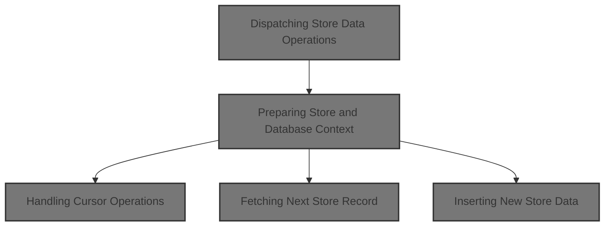
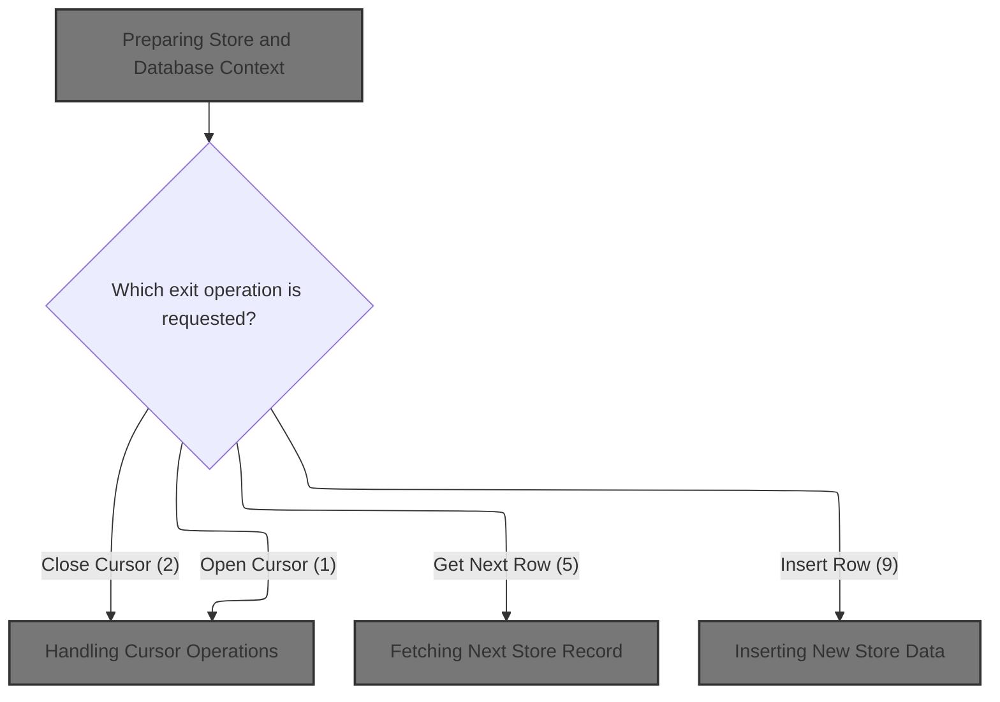
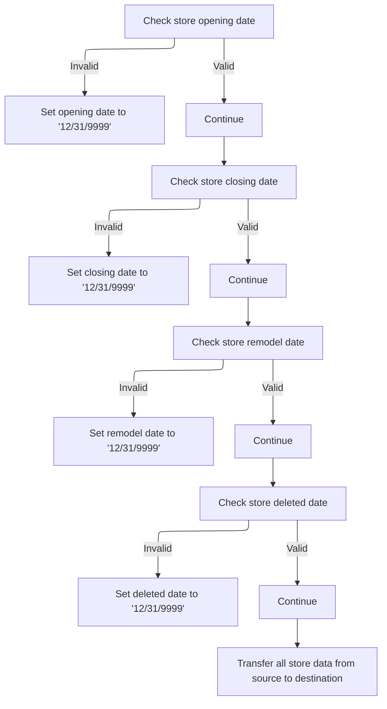
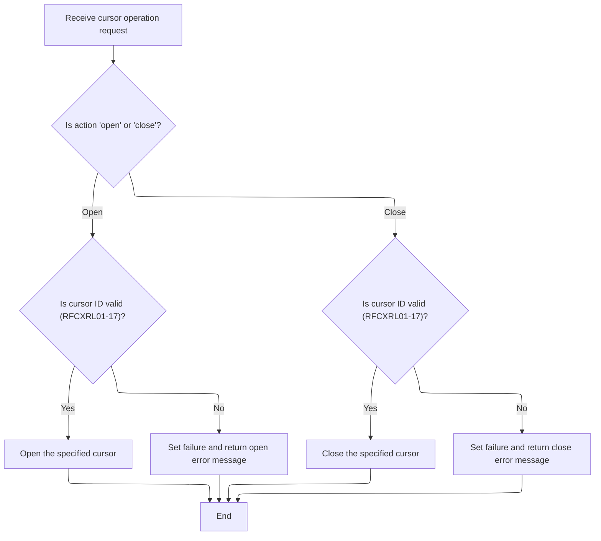

This document describes the flow for dispatching store data operations. It acts as the entry point for all requests to perform operations on store data, ensuring the necessary context and data integrity are established before proceeding. The flow prepares the store and database environment, then dispatches to the correct business routine based on the requested operation, such as opening or closing a cursor, fetching a record, or inserting new data.



# Spec

## Detailed View of the Program's Functionality

# Swimmio-dyncall-demo: Store Data Operations Flow

## a. Program Structure and Entry Point

The program is structured in a classic mainframe style, with a clear separation between data definitions and logic. The main entry point is a dispatcher routine that initializes the environment and then branches to the correct operation based on the requested action.

### Key Actions:

- The program starts by initializing all working storage and linkage areas, ensuring that all data structures and database handles are ready for use.
- It then evaluates the requested operation (such as opening a cursor, fetching a row, inserting data, etc.) and dispatches control to the appropriate routine for that operation.
- After the operation, it performs any necessary cleanup or post-processing before returning control to the caller.

---

## b. Preparing Store and Database Context

### Initialization Routine

Before any store data operation (open, fetch, insert, etc.), the program runs an initialization routine to set up the environment:

- It clears and resets the main communication area and working storage variables.
- It copies the current index handle from the input parameters to the database context.
- It resets checkpoint and SQL status indicators.
- If the operation is not a cursor close, it copies and normalizes store/location data from the input area to the internal database structure.
- If the operation requires a database connection (such as insert, modify, or purge), it establishes a connection to the Oracle database. If the connection fails, it logs a detailed error message for troubleshooting.

### Normalizing and Copying Store Fields

When copying store data from the input area to the internal structure, the program:

- Checks each of the key date fields (opening, closing, remodel, deleted). If any of these are blank, zero, or set to a known invalid value, it replaces them with a sentinel value ('12/31/9999').
- Copies a large set of store/location fields from the input area to the internal structure, field by field.
- For rollup data (a special reporting code), it blanks out the target field and calls a subroutine to split and validate the rollup code into ten numeric fields, filling each with either the parsed number or zero if invalid.

### Establishing Oracle Connection

If the operation requires database access, the program calls an external routine to connect to Oracle, passing all necessary parameters. If the connection fails, it records the SQL error code in a message for later review.

---

## c. Handling Cursor Operations

### Opening a Cursor

When a request is made to open a cursor:

- The program checks which cursor ID is being requested.
- It uses a switch-case structure to match the ID to one of the predefined SQL cursors.
- If the ID is valid, it issues the SQL command to open the corresponding cursor.
- If the ID is invalid, it sets a failure flag and logs an error message.

### Closing a Cursor

When a request is made to close a cursor:

- The program matches the input cursor ID to the predefined list.
- If valid, it issues the SQL command to close the cursor.
- If invalid, it sets a failure flag and logs an error message.

---

## d. Fetching Next Store Record

When a request is made to fetch the next row from a cursor:

- The program checks which cursor is active and dispatches to the corresponding fetch routine.
- Each fetch routine issues a SQL FETCH command for its specific cursor, retrieving a large set of store/location fields into the internal structure.
- After fetching, a cleanup routine is called to handle any null columns (though in this code, the null check is a placeholder).
- If the cursor ID is invalid, the program sets a failure flag and logs an error message.

---

## e. Inserting New Store Data

When a request is made to insert a new store record:

- The program first ensures that all null indicators are set correctly (the actual logic is a placeholder).
- It then calls an external routine responsible for performing the actual insert/update/delete operation in the database.
- After a successful insert, it increments a checkpoint counter to indicate that a change has been made.

---

## f. Additional Notes

- The program supports a wide range of cursor-based queries, each with its own SQL SELECT statement and ordering logic, allowing for flexible retrieval of store data based on different keys (store number, name, code, district, etc.).
- All data movement between input/output areas and the internal database structure is done explicitly, field by field, ensuring strict control over data integrity and format.
- Error handling is consistent: any invalid operation or database error results in a failure flag and a descriptive message for the caller.

---

## g. Summary

This program acts as a robust dispatcher and handler for store data operations in a mainframe/Oracle environment. It ensures that all operations are performed in a controlled, validated, and auditable manner, with clear separation between initialization, operation dispatch, data normalization, and error handling. The design is modular, making it straightforward to add new operations or modify existing ones as business requirements evolve.

# Rule Definition

| Paragraph Name                                                                                       | Rule ID | Category          | Description                                                                                                                                                                                                                                                                                                 | Conditions                                                                                | Remarks                                                                                                                                                                                                                                                                                                                                                        |
| ---------------------------------------------------------------------------------------------------- | ------- | ----------------- | ----------------------------------------------------------------------------------------------------------------------------------------------------------------------------------------------------------------------------------------------------------------------------------------------------------- | ----------------------------------------------------------------------------------------- | -------------------------------------------------------------------------------------------------------------------------------------------------------------------------------------------------------------------------------------------------------------------------------------------------------------------------------------------------------------- |
| 100-INITIALIZATION                                                                                   | RL-001  | Conditional Logic | Before performing any operation, the program must initialize the store/location and database context, ensuring all required data and database connections are ready for use.                                                                                                                                | Triggered at the start of the main dispatcher routine, before any operation is performed. | Initialization includes setting checkpoint increment and SQL code to zero, initializing working storage, and connecting to Oracle if required. No specific output format; this is preparatory logic.                                                                                                                                                           |
| 0000-EXIT-DISPATCHER                                                                                 | RL-002  | Conditional Logic | The program supports multiple operations, determined by the operation code input. Supported operations include Open Cursor (1), Close Cursor (2), Get Next Row (5), and Insert Row (9).                                                                                                                     | Operation code input determines which operation is performed.                             | Operation codes are mapped to symbolic constants (e.g., EXIT-OPEN-CURSOR, EXIT-CLOSE-CURSOR, etc.).                                                                                                                                                                                                                                                            |
| 110-MOVE-PDA-FIELDS-2-DCL, 117-MOVE-ROLLUP-DATA                                                      | RL-003  | Data Assignment   | For all operations except Close Cursor, move all store/location fields from the source structure to the destination structure, normalizing date fields and handling rollup data as specified.                                                                                                               | Applies to all operations except Close Cursor.                                            | Date fields (FC-RL-OPENING-DT, FC-RL-CLOSING-DT, FC-RL-REMODEL-DT, FC-RL-DELETED-DT): If blank, '00/00/0000', or '01/01/1600', replace with '12/31/9999'. Rollup code (FN-ROLLUP-REPT-CD): Split into 10 segments of 2 characters each, validate numeric, assign to FN-ROLLUP-REPT-01-NBR through FN-ROLLUP-REPT-10-NBR. All other fields: one-to-one mapping. |
| 1000-EXIT-OPEN-CURSOR, 1100-EXIT-CLOSE-CURSOR, 1300-EXIT-GET-NEXT-ROW                                | RL-004  | Conditional Logic | When opening or closing a cursor, validate the input cursor ID. Only symbolic IDs RFCXRL01 through RFCXRL17 are valid. Any other value is invalid and results in an error.                                                                                                                                  | Triggered during open, close, or fetch operations involving a cursor.                     | Valid cursor IDs: RFCXRL01 through RFCXRL17. Error message: 'NNNS0120 - Invalid open/close/fetch cursor ID.'                                                                                                                                                                                                                                                   |
| 1300-EXIT-GET-NEXT-ROW, 1500-EXIT-PUT-INSERT-ROW, 1700-CHECK-NULL-COLUMNS, 1800-EDIT-NULL-INDICATORS | RL-005  | Computation       | When fetching the next row, dispatch to the fetch routine for the active cursor ID, populate the destination structure, check all columns for null values, and clean up as required. When inserting a new store record, handle null indicators, insert the row, and set the checkpoint increment flag to 1. | Triggered by fetch or insert operations.                                                  | Null handling routines are placeholders for business logic. Checkpoint increment flag is set to 1 after insert or update. No specific output format for null handling; checkpoint is a numeric flag.                                                                                                                                                           |
| 110-MOVE-PDA-FIELDS-2-DCL, 117-MOVE-ROLLUP-DATA, 130-MOVE-DCL-2-PDA-FIELDS, 135-MOVE-DC-ROLLUP-DATA  | RL-006  | Data Assignment   | All field mappings between source and destination are one-to-one, except for rollup code handling, which requires splitting and numeric validation.                                                                                                                                                         | Applies during field mapping between source and destination structures.                   | All fields except rollup code: direct copy. Rollup code: see above for segmentation and numeric validation.                                                                                                                                                                                                                                                    |

# User Stories

## User Story 1: System Initialization, Operation Dispatch, and Cursor Validation

---

### Story Description:

As a system, I want to initialize the store/location and database context, support multiple operations (open cursor, close cursor, get next row, insert row), and validate cursor IDs so that all operations are performed on a properly prepared and validated environment, and only valid operations and cursors are processed.

---

### Business Rule Mapping:

| Rule ID | Paragraph Name                                                        | Rule Description                                                                                                                                                                        |
| ------- | --------------------------------------------------------------------- | --------------------------------------------------------------------------------------------------------------------------------------------------------------------------------------- |
| RL-002  | 0000-EXIT-DISPATCHER                                                  | The program supports multiple operations, determined by the operation code input. Supported operations include Open Cursor (1), Close Cursor (2), Get Next Row (5), and Insert Row (9). |
| RL-001  | 100-INITIALIZATION                                                    | Before performing any operation, the program must initialize the store/location and database context, ensuring all required data and database connections are ready for use.            |
| RL-004  | 1000-EXIT-OPEN-CURSOR, 1100-EXIT-CLOSE-CURSOR, 1300-EXIT-GET-NEXT-ROW | When opening or closing a cursor, validate the input cursor ID. Only symbolic IDs RFCXRL01 through RFCXRL17 are valid. Any other value is invalid and results in an error.              |

---

### Relevant Functionality:

- **0000-EXIT-DISPATCHER**
  1. **RL-002:**
     - Evaluate operation code
     - Dispatch to the corresponding paragraph for the operation (e.g., open cursor, close cursor, fetch next row, insert row, etc.)
- **100-INITIALIZATION**
  1. **RL-001:**
     - Initialize working storage and parameter areas
     - Set checkpoint increment and SQL code to zero
     - If not closing cursor, move fields from source to destination structure
     - If Oracle or certain operations, connect to Oracle database
- **1000-EXIT-OPEN-CURSOR**
  1. **RL-004:**
     - Evaluate cursor ID
     - If cursor ID is one of RFCXRL01 to RFCXRL17, proceed with operation
     - Else, set failure flag and return error message

## User Story 2: Data Mapping, Normalization, and Row Handling

---

### Story Description:

As a system, I want to move all store/location fields from the source to the destination structure, normalize date fields, handle rollup code segmentation and validation, fetch the next row or insert a new store record, handle null indicators, and set the checkpoint increment flag so that data integrity and consistency are maintained during all operations.

---

### Business Rule Mapping:

| Rule ID | Paragraph Name                                                                                       | Rule Description                                                                                                                                                                                                                                                                                            |
| ------- | ---------------------------------------------------------------------------------------------------- | ----------------------------------------------------------------------------------------------------------------------------------------------------------------------------------------------------------------------------------------------------------------------------------------------------------- |
| RL-003  | 110-MOVE-PDA-FIELDS-2-DCL, 117-MOVE-ROLLUP-DATA                                                      | For all operations except Close Cursor, move all store/location fields from the source structure to the destination structure, normalizing date fields and handling rollup data as specified.                                                                                                               |
| RL-006  | 110-MOVE-PDA-FIELDS-2-DCL, 117-MOVE-ROLLUP-DATA, 130-MOVE-DCL-2-PDA-FIELDS, 135-MOVE-DC-ROLLUP-DATA  | All field mappings between source and destination are one-to-one, except for rollup code handling, which requires splitting and numeric validation.                                                                                                                                                         |
| RL-005  | 1300-EXIT-GET-NEXT-ROW, 1500-EXIT-PUT-INSERT-ROW, 1700-CHECK-NULL-COLUMNS, 1800-EDIT-NULL-INDICATORS | When fetching the next row, dispatch to the fetch routine for the active cursor ID, populate the destination structure, check all columns for null values, and clean up as required. When inserting a new store record, handle null indicators, insert the row, and set the checkpoint increment flag to 1. |

---

### Relevant Functionality:

- **110-MOVE-PDA-FIELDS-2-DCL**
  1. **RL-003:**
     - For each date field:
       - If blank, '00/00/0000', or '01/01/1600', set to '12/31/9999'
       - Else, copy as-is
     - For rollup code:
       - Split into 10 segments of 2 characters
       - For each segment, if numeric, assign to corresponding numeric field; else, set to zero
     - For all other fields, copy one-to-one from source to destination
  2. **RL-006:**
     - For each field except rollup code, copy value from source to destination
     - For rollup code, split and validate as described in the rollup code rule
- **1300-EXIT-GET-NEXT-ROW**
  1. **RL-005:**
     - For fetch:
       - Dispatch to fetch routine for active cursor ID
       - Populate destination structure
       - Perform null column check and cleanup
     - For insert:
       - Edit null indicators
       - Call insert routine
       - Set checkpoint increment flag to 1

# Code Walkthrough

## Dispatching Store Data Operations



<SwmSnippet path="/base/src/NNNS0120.cbl" line="1661">

---

`0000-EXIT-DISPATCHER` kicks off the flow. It starts by calling 100-INITIALIZATION to set up all the required data and database connections, so every operation (open cursor, fetch, insert, etc.) has what it needs. After that, it uses an EVALUATE to branch to the right routine based on the exit code. This setup is necessary because every operation depends on the environment being ready, and skipping initialization would risk running with stale or missing data.

```cobol
168200 0000-EXIT-DISPATCHER.                                            00168200
168300     PERFORM 100-INITIALIZATION                                   00168300
168400     EVALUATE TRUE                                                00168400
168500       WHEN NOT SUCCESS                                           00168500
168600          CONTINUE                                                00168600
168700       WHEN EXIT-OPEN-CURSOR                                      00168700
168800          PERFORM 1000-EXIT-OPEN-CURSOR                           00168800
168900       WHEN EXIT-CLOSE-CURSOR                                     00168900
169000          PERFORM 1100-EXIT-CLOSE-CURSOR                          00169000
169100       WHEN EXIT-GET-UNIQUE-ROW                                   00169100
169200          PERFORM 1200-EXIT-GET-UNIQUE-ROW                        00169200
169300       WHEN EXIT-GET-NEXT-ROW                                     00169300
169400          PERFORM 1300-EXIT-GET-NEXT-ROW                          00169400
169500       WHEN EXIT-PUT-MODIFY-ROW                                   00169500
169600          PERFORM 1400-EXIT-PUT-MODIFY-ROW                        00169600
169700       WHEN EXIT-PUT-INSERT-ROW                                   00169700
169800          PERFORM 1500-EXIT-PUT-INSERT-ROW                        00169800
169900       WHEN EXIT-PUT-PURGE-ROW                                    00169900
170000          PERFORM 1600-EXIT-PUT-PURGE-ROW                         00170000
170100       WHEN EXIT-DO-SPECIAL-IO-FUNCS                              00170100
170200          PERFORM 10000-DO-SPECIAL-IO-FUNCS                       00170200
170300     END-EVALUATE                                                 00170300
170400     PERFORM 120-EXIT-STUFF                                       00170400
170500     GOBACK                                                       00170500
170600     .                                                            00170600
```

---

</SwmSnippet>

### Preparing Store and Database Context

<SwmSnippet path="/base/src/NNNS0120.cbl" line="1691">

---

`100-INITIALIZATION` preps the context, only moves store/location data if we're not closing a cursor, and connects to Oracle if any relevant flags are set.

```cobol
171200 100-INITIALIZATION.                                              00171200
171300     INITIALIZE W00N001A                                          00171300
171400     MOVE NNNN0000-INDEX-HANDLE TO DDDTRL01-INDEX-HANDLE          00171400
171500     MOVE 0 TO WS-CHECKPOINT-INC                                  00171500
171600     MOVE 0 TO SQLCODE                                            00171600
171700     MOVE 0 TO SQL-INIT-FLAG                                      00171700
171800     IF NOT EXIT-CLOSE-CURSOR                                     00171800
171900       PERFORM 110-MOVE-PDA-FIELDS-2-DCL                          00171900
172000     END-IF                                                       00172000
172100                                                                  00172100
172200     IF (YYYN005A-ORACLE       OR EXIT-PUT-INSERT-ROW             00172200
172300         OR EXIT-PUT-PURGE-ROW OR EXIT-PUT-MODIFY-ROW)            00172300
172400       PERFORM 115-CONNECT-TO-ORACLE                              00172400
172500     END-IF                                                       00172500
172600     .                                                            00172600
```

---

</SwmSnippet>

#### Normalizing and Copying Store Fields



<SwmSnippet path="/base/src/NNNS0120.cbl" line="1711">

---

`110-MOVE-PDA-FIELDS-2-DCL` normalizes date fields (replacing invalid values with '12/31/9999'), then copies a ton of store/location fields from the source to the destination structure. For rollup data, it blanks out the target field and calls 117-MOVE-ROLLUP-DATA to handle validation and assignment, since rollup data isn't just a straight copy.

```cobol
173200 110-MOVE-PDA-FIELDS-2-DCL.                                       00173200
173300     IF FC-RL-OPENING-DT OF P-DDDTRL01 = SPACES                   00173300
173400     OR FC-RL-OPENING-DT OF P-DDDTRL01 = '00/00/0000'             00173400
173500     OR FC-RL-OPENING-DT OF P-DDDTRL01 = '01/01/1600'             00173500
173600       MOVE '12/31/9999' TO FC-RL-OPENING-DT OF P-DDDTRL01        00173600
173700     END-IF                                                       00173700
173800     IF FC-RL-CLOSING-DT OF P-DDDTRL01 = SPACES                   00173800
173900     OR FC-RL-CLOSING-DT OF P-DDDTRL01 = '00/00/0000'             00173900
174000     OR FC-RL-CLOSING-DT OF P-DDDTRL01 = '01/01/1600'             00174000
174100       MOVE '12/31/9999' TO FC-RL-CLOSING-DT OF P-DDDTRL01        00174100
174200     END-IF                                                       00174200
174300     IF FC-RL-REMODEL-DT OF P-DDDTRL01 = SPACES                   00174300
174400     OR FC-RL-REMODEL-DT OF P-DDDTRL01 = '00/00/0000'             00174400
174500     OR FC-RL-REMODEL-DT OF P-DDDTRL01 = '01/01/1600'             00174500
174600       MOVE '12/31/9999' TO FC-RL-REMODEL-DT OF P-DDDTRL01        00174600
174700     END-IF                                                       00174700
174800     IF FC-RL-DELETED-DT OF P-DDDTRL01 = SPACES                   00174800
174900     OR FC-RL-DELETED-DT OF P-DDDTRL01 = '00/00/0000'             00174900
175000     OR FC-RL-DELETED-DT OF P-DDDTRL01 = '01/01/1600'             00175000
175100       MOVE '12/31/9999' TO FC-RL-DELETED-DT OF P-DDDTRL01        00175100
175200     END-IF                                                       00175200
175300                                                                  00175300
175400     MOVE FC-STORE-NO OF P-DDDTRL01                               00175400
175500       TO FC-STORE-NO OF DCLFC-XXXAIL-STORES                      00175500
175600     MOVE FC-RL-STORE-NM OF P-DDDTRL01                            00175600
175700       TO FC-RL-STORE-NM OF DCLFC-XXXAIL-STORES                   00175700
175800     MOVE FC-RL-STORE-CD OF P-DDDTRL01                            00175800
175900       TO FC-RL-STORE-CD OF DCLFC-XXXAIL-STORES                   00175900
176000     MOVE FC-RL-STORE-DIR-NM OF P-DDDTRL01                        00176000
176100       TO FC-RL-STORE-DIR-NM OF DCLFC-XXXAIL-STORES               00176100
176200     MOVE FC-RL-STORE-LOC-NM OF P-DDDTRL01                        00176200
176300       TO FC-RL-STORE-LOC-NM OF DCLFC-XXXAIL-STORES               00176300
176400     MOVE FC-RL-OPENING-DT OF P-DDDTRL01                          00176400
176500       TO FC-RL-OPENING-DT OF DCLFC-XXXAIL-STORES                 00176500
176600     MOVE FC-RL-CLOSING-DT OF P-DDDTRL01                          00176600
176700       TO FC-RL-CLOSING-DT OF DCLFC-XXXAIL-STORES                 00176700
176800     MOVE FC-RL-REMODEL-DT OF P-DDDTRL01                          00176800
176900       TO FC-RL-REMODEL-DT OF DCLFC-XXXAIL-STORES                 00176900
177000     MOVE FC-RL-DELETED-DT OF P-DDDTRL01                          00177000
177100       TO FC-RL-DELETED-DT OF DCLFC-XXXAIL-STORES                 00177100
177200     MOVE FC-RL-DISTRICT-NO OF P-DDDTRL01                         00177200
177300       TO FC-RL-DISTRICT-NO OF DCLFC-XXXAIL-STORES                00177300
177400     MOVE FC-RL-MARKET-AR-NO OF P-DDDTRL01                        00177400
177500       TO FC-RL-MARKET-AR-NO OF DCLFC-XXXAIL-STORES               00177500
177600     MOVE FC-RL-PAYROL-AR-NO OF P-DDDTRL01                        00177600
177700       TO FC-RL-PAYROL-AR-NO OF DCLFC-XXXAIL-STORES               00177700
177800     MOVE FC-RL-PAY-GROUP-NO OF P-DDDTRL01                        00177800
177900       TO FC-RL-PAY-GROUP-NO OF DCLFC-XXXAIL-STORES               00177900
178000     MOVE FC-RL-COMPANY-NO OF P-DDDTRL01                          00178000
178100       TO FC-RL-COMPANY-NO OF DCLFC-XXXAIL-STORES                 00178100
178200     MOVE FC-RL-GEO-ZONE-CD OF P-DDDTRL01                         00178200
178300       TO FC-RL-GEO-ZONE-CD OF DCLFC-XXXAIL-STORES                00178300
178400     MOVE FC-RL-GEO-ZONE-NO OF P-DDDTRL01                         00178400
178500       TO FC-RL-GEO-ZONE-NO OF DCLFC-XXXAIL-STORES                00178500
178600     MOVE FC-RL-SCAN-MAIN-CD OF P-DDDTRL01                        00178600
178700       TO FC-RL-SCAN-MAIN-CD OF DCLFC-XXXAIL-STORES               00178700
178800     MOVE FC-RL-FRONT-END-CD OF P-DDDTRL01                        00178800
178900       TO FC-RL-FRONT-END-CD OF DCLFC-XXXAIL-STORES               00178900
179000     MOVE FC-RL-PRICE-BUL-CD OF P-DDDTRL01                        00179000
179100       TO FC-RL-PRICE-BUL-CD OF DCLFC-XXXAIL-STORES               00179100
179200     MOVE FC-RL-UPC-ON-PB-CD OF P-DDDTRL01                        00179200
179300       TO FC-RL-UPC-ON-PB-CD OF DCLFC-XXXAIL-STORES               00179300
179400     MOVE FC-RL-COMPETITR-CD OF P-DDDTRL01                        00179400
179500       TO FC-RL-COMPETITR-CD OF DCLFC-XXXAIL-STORES               00179500
179600     MOVE FC-RL-ASSOC-STR-NO OF P-DDDTRL01                        00179600
179700       TO FC-RL-ASSOC-STR-NO OF DCLFC-XXXAIL-STORES               00179700
179800     MOVE FC-RL-RPRT-SEQ-NO OF P-DDDTRL01                         00179800
179900       TO FC-RL-RPRT-SEQ-NO OF DCLFC-XXXAIL-STORES                00179900
180000     MOVE FC-RL-SORT-SOS-NO OF P-DDDTRL01                         00180000
180100       TO FC-RL-SORT-SOS-NO OF DCLFC-XXXAIL-STORES                00180100
180200     MOVE FC-RL-VID-PRZN-NO OF P-DDDTRL01                         00180200
180300       TO FC-RL-VID-PRZN-NO OF DCLFC-XXXAIL-STORES                00180300
180400     MOVE FC-RL-CITY-ID-CD OF P-DDDTRL01                          00180400
180500       TO FC-RL-CITY-ID-CD OF DCLFC-XXXAIL-STORES                 00180500
180600     MOVE FC-RL-ADZONE-ABB OF P-DDDTRL01                          00180600
180700       TO FC-RL-ADZONE-ABB OF DCLFC-XXXAIL-STORES                 00180700
180800     MOVE FC-RL-ADZONE-DES OF P-DDDTRL01                          00180800
180900       TO FC-RL-ADZONE-DES OF DCLFC-XXXAIL-STORES                 00180900
181000     MOVE FC-RL-UNLOAD-SW OF P-DDDTRL01                           00181000
181100       TO FC-RL-UNLOAD-SW OF DCLFC-XXXAIL-STORES                  00181100
181200*    MOVE FN-ROLLUP-REPT-CD OF P-DDDTRL01                         00181200
181300     MOVE SPACES                                                  00181300
181400       TO FN-ROLLUP-REPT-CD OF DCLFC-XXXAIL-STORES                00181400
181500     PERFORM 117-MOVE-ROLLUP-DATA                                 00181500
181600     MOVE FC-RL-STATUS-CD OF P-DDDTRL01                           00181600
181700       TO FC-RL-STATUS-CD OF DCLFC-XXXAIL-STORES                  00181700
181800     MOVE FC-RL-NEW-STORE-CD OF P-DDDTRL01                        00181800
181900       TO FC-RL-NEW-STORE-CD OF DCLFC-XXXAIL-STORES               00181900
182000     MOVE FC-RL-TYPE-CD OF P-DDDTRL01                             00182000
182100       TO FC-RL-TYPE-CD OF DCLFC-XXXAIL-STORES                    00182100
182200     MOVE FC-RL-GROUP-CD OF P-DDDTRL01                            00182200
182300       TO FC-RL-GROUP-CD OF DCLFC-XXXAIL-STORES                   00182300
182400     MOVE FC-RL-SELECTCIR-CD OF P-DDDTRL01                        00182400
182500       TO FC-RL-SELECTCIR-CD OF DCLFC-XXXAIL-STORES               00182500
182600     MOVE FC-RL-AREA-CODE-NO OF P-DDDTRL01                        00182600
182700       TO FC-RL-AREA-CODE-NO OF DCLFC-XXXAIL-STORES               00182700
182800     MOVE FC-RL-TELEPHONE-NO OF P-DDDTRL01                        00182800
182900       TO FC-RL-TELEPHONE-NO OF DCLFC-XXXAIL-STORES               00182900
183000     MOVE FC-RL-STORE-ABB OF P-DDDTRL01                           00183000
183100       TO FC-RL-STORE-ABB OF DCLFC-XXXAIL-STORES                  00183100
183200     MOVE FC-RL-BCKRM-FT-QTY OF P-DDDTRL01                        00183200
183300       TO FC-RL-BCKRM-FT-QTY OF DCLFC-XXXAIL-STORES               00183300
183400     MOVE FC-RL-LFT-FOOD-QTY OF P-DDDTRL01                        00183400
183500       TO FC-RL-LFT-FOOD-QTY OF DCLFC-XXXAIL-STORES               00183500
183600     MOVE FC-RL-LFT-NONF-QTY OF P-DDDTRL01                        00183600
183700       TO FC-RL-LFT-NONF-QTY OF DCLFC-XXXAIL-STORES               00183700
183800     MOVE FC-RL-SETOFF-CD OF P-DDDTRL01                           00183800
183900       TO FC-RL-SETOFF-CD OF DCLFC-XXXAIL-STORES                  00183900
184000     MOVE FC-RL-CL12-ZONE-NO OF P-DDDTRL01                        00184000
184100       TO FC-RL-CL12-ZONE-NO OF DCLFC-XXXAIL-STORES               00184100
184200     MOVE FC-RL-CL12-ADZN-NO OF P-DDDTRL01                        00184200
184300       TO FC-RL-CL12-ADZN-NO OF DCLFC-XXXAIL-STORES               00184300
184400     MOVE FC-RL-CL13-ZONE-NO OF P-DDDTRL01                        00184400
184500       TO FC-RL-CL13-ZONE-NO OF DCLFC-XXXAIL-STORES               00184500
184600     MOVE FC-RL-CL13-ADZN-NO OF P-DDDTRL01                        00184600
184700       TO FC-RL-CL13-ADZN-NO OF DCLFC-XXXAIL-STORES               00184700
184800     MOVE FC-RL-CL14-ZONE-NO OF P-DDDTRL01                        00184800
184900       TO FC-RL-CL14-ZONE-NO OF DCLFC-XXXAIL-STORES               00184900
185000     MOVE FC-RL-CL14-ADZN-NO OF P-DDDTRL01                        00185000
185100       TO FC-RL-CL14-ADZN-NO OF DCLFC-XXXAIL-STORES               00185100
185200     MOVE FC-RL-CL36-ADZN-NO OF P-DDDTRL01                        00185200
185300       TO FC-RL-CL36-ADZN-NO OF DCLFC-XXXAIL-STORES               00185300
185400     MOVE FC-RL-CL37-ADZN-NO OF P-DDDTRL01                        00185400
185500       TO FC-RL-CL37-ADZN-NO OF DCLFC-XXXAIL-STORES               00185500
185600     MOVE FC-RL-STORE-DEA-NO OF P-DDDTRL01                        00185600
185700       TO FC-RL-STORE-DEA-NO OF DCLFC-XXXAIL-STORES               00185700
185800     MOVE FC-RL-RETL-ZONE-NO OF P-DDDTRL01                        00185800
185900       TO FC-RL-RETL-ZONE-NO OF DCLFC-XXXAIL-STORES               00185900
186000     MOVE FC-RL-STOR2-LOC-NM OF P-DDDTRL01                        00186000
186100       TO FC-RL-STOR2-LOC-NM OF DCLFC-XXXAIL-STORES               00186100
186200     MOVE FC-CITY-ADR OF P-DDDTRL01                               00186200
186300       TO FC-CITY-ADR OF DCLFC-XXXAIL-STORES                      00186300
186400     MOVE FC-STATE-ADR OF P-DDDTRL01                              00186400
186500       TO FC-STATE-ADR OF DCLFC-XXXAIL-STORES                     00186500
186600     MOVE FC-ZIP-CODE5-ADR OF P-DDDTRL01                          00186600
186700       TO FC-ZIP-CODE5-ADR OF DCLFC-XXXAIL-STORES                 00186700
186800     MOVE FC-ZIP-CODE4-ADR OF P-DDDTRL01                          00186800
186900       TO FC-ZIP-CODE4-ADR OF DCLFC-XXXAIL-STORES                 00186900
187000     MOVE FC-RL-SOS-TYPE-CD OF P-DDDTRL01                         00187000
187100       TO FC-RL-SOS-TYPE-CD OF DCLFC-XXXAIL-STORES                00187100
187200     MOVE FC-RL-NOPROCESS-CD OF P-DDDTRL01                        00187200
187300       TO FC-RL-NOPROCESS-CD OF DCLFC-XXXAIL-STORES               00187300
187400     MOVE FC-RL-SOSHDRTYP-CD OF P-DDDTRL01                        00187400
187500       TO FC-RL-SOSHDRTYP-CD OF DCLFC-XXXAIL-STORES               00187500
187600     MOVE FC-RL-CAT-CLASS-TB OF P-DDDTRL01                        00187600
187700       TO FC-RL-CAT-CLASS-TB OF DCLFC-XXXAIL-STORES               00187700
187800     MOVE FC-RL-LATITUDE-K OF P-DDDTRL01                          00187800
187900       TO FC-RL-LATITUDE-K OF DCLFC-XXXAIL-STORES                 00187900
188000     MOVE FC-RL-LONGITUDE-K OF P-DDDTRL01                         00188000
188100       TO FC-RL-LONGITUDE-K OF DCLFC-XXXAIL-STORES                00188100
188200     MOVE FN-DIVISION-CD OF P-DDDTRL01                            00188200
188300       TO FN-DIVISION-CD OF DCLFC-XXXAIL-STORES                   00188300
188400     MOVE FN-LINE-OF-BUS-CD OF P-DDDTRL01                         00188400
188500       TO FN-LINE-OF-BUS-CD OF DCLFC-XXXAIL-STORES                00188500
188600     .                                                            00188600
```

---

</SwmSnippet>

<SwmSnippet path="/base/src/NNNS0120.cbl" line="1884">

---

`117-MOVE-ROLLUP-DATA` splits the rollup code into 10 numeric fields, validates each, and fills the destination fields with either the number or zero.

```cobol
190500 117-MOVE-ROLLUP-DATA.                                            00190500
190600     MOVE FN-ROLLUP-REPT-CD OF P-DDDTRL01                         00190600
190700       TO WS-REPT-TBL-TXT                                         00190700
190800     IF WS-REPT-TBL-NUMERIC(1) IS NUMERIC                         00190800
190900        MOVE WS-REPT-TBL-NUMERIC(1)                               00190900
191000          TO FN-ROLLUP-REPT-01-NBR  OF DCLFC-XXXAIL-STORES        00191000
191100     ELSE                                                         00191100
191200        MOVE ZERO TO FN-ROLLUP-REPT-01-NBR OF DCLFC-XXXAIL-STORES 00191200
191300     END-IF                                                       00191300
191400     IF WS-REPT-TBL-NUMERIC(2) IS NUMERIC                         00191400
191500        MOVE WS-REPT-TBL-NUMERIC(2)                               00191500
191600          TO FN-ROLLUP-REPT-02-NBR  OF DCLFC-XXXAIL-STORES        00191600
191700     ELSE                                                         00191700
191800        MOVE ZERO TO FN-ROLLUP-REPT-02-NBR OF DCLFC-XXXAIL-STORES 00191800
191900     END-IF                                                       00191900
192000     IF WS-REPT-TBL-NUMERIC(3) IS NUMERIC                         00192000
192100        MOVE WS-REPT-TBL-NUMERIC(3)                               00192100
192200          TO FN-ROLLUP-REPT-03-NBR  OF DCLFC-XXXAIL-STORES        00192200
192300     ELSE                                                         00192300
192400        MOVE ZERO TO FN-ROLLUP-REPT-03-NBR OF DCLFC-XXXAIL-STORES 00192400
192500     END-IF                                                       00192500
192600     IF WS-REPT-TBL-NUMERIC(4) IS NUMERIC                         00192600
192700        MOVE WS-REPT-TBL-NUMERIC(4)                               00192700
192800          TO FN-ROLLUP-REPT-04-NBR  OF DCLFC-XXXAIL-STORES        00192800
192900     ELSE                                                         00192900
193000        MOVE ZERO TO FN-ROLLUP-REPT-04-NBR OF DCLFC-XXXAIL-STORES 00193000
193100     END-IF                                                       00193100
193200     IF WS-REPT-TBL-NUMERIC(5) IS NUMERIC                         00193200
193300        MOVE WS-REPT-TBL-NUMERIC(5)                               00193300
193400          TO FN-ROLLUP-REPT-05-NBR  OF DCLFC-XXXAIL-STORES        00193400
193500     ELSE                                                         00193500
193600        MOVE ZERO TO FN-ROLLUP-REPT-05-NBR OF DCLFC-XXXAIL-STORES 00193600
193700     END-IF                                                       00193700
193800     IF WS-REPT-TBL-NUMERIC(6) IS NUMERIC                         00193800
193900        MOVE WS-REPT-TBL-NUMERIC(6)                               00193900
194000          TO FN-ROLLUP-REPT-06-NBR  OF DCLFC-XXXAIL-STORES        00194000
194100     ELSE                                                         00194100
194200        MOVE ZERO TO FN-ROLLUP-REPT-06-NBR OF DCLFC-XXXAIL-STORES 00194200
194300     END-IF                                                       00194300
194400     IF WS-REPT-TBL-NUMERIC(7) IS NUMERIC                         00194400
194500        MOVE WS-REPT-TBL-NUMERIC(7)                               00194500
194600          TO FN-ROLLUP-REPT-07-NBR  OF DCLFC-XXXAIL-STORES        00194600
194700     ELSE                                                         00194700
194800        MOVE ZERO TO FN-ROLLUP-REPT-07-NBR OF DCLFC-XXXAIL-STORES 00194800
194900     END-IF                                                       00194900
195000     IF WS-REPT-TBL-NUMERIC(8) IS NUMERIC                         00195000
195100        MOVE WS-REPT-TBL-NUMERIC(8)                               00195100
195200          TO FN-ROLLUP-REPT-08-NBR  OF DCLFC-XXXAIL-STORES        00195200
195300     ELSE                                                         00195300
195400        MOVE ZERO TO FN-ROLLUP-REPT-08-NBR OF DCLFC-XXXAIL-STORES 00195400
195500     END-IF                                                       00195500
195600     IF WS-REPT-TBL-NUMERIC(9) IS NUMERIC                         00195600
195700        MOVE WS-REPT-TBL-NUMERIC(9)                               00195700
195800          TO FN-ROLLUP-REPT-09-NBR  OF DCLFC-XXXAIL-STORES        00195800
195900     ELSE                                                         00195900
196000        MOVE ZERO TO FN-ROLLUP-REPT-09-NBR OF DCLFC-XXXAIL-STORES 00196000
196100     END-IF                                                       00196100
196200     IF WS-REPT-TBL-NUMERIC(10) IS NUMERIC                        00196200
196300        MOVE WS-REPT-TBL-NUMERIC(10)                              00196300
196400          TO FN-ROLLUP-REPT-10-NBR  OF DCLFC-XXXAIL-STORES        00196400
196500     ELSE                                                         00196500
196600        MOVE ZERO TO FN-ROLLUP-REPT-10-NBR OF DCLFC-XXXAIL-STORES 00196600
196700     END-IF                                                       00196700
196800     .                                                            00196800
```

---

</SwmSnippet>

#### Establishing Oracle Connection

<SwmSnippet path="/base/src/NNNS0120.cbl" line="1871">

---

`115-CONNECT-TO-ORACLE` calls Z-ORA-CONNECT (from XXXS0210) to set up the Oracle DB connection using the current parameters. If it fails, it logs the SQL error code in a custom message for troubleshooting. This step is only run if the operation actually needs a DB connection.

```cobol
189200 115-CONNECT-TO-ORACLE.                                           00189200
189300     CALL Z-ORA-CONNECT USING W00N001A                            00189300
189400                              SQLCA                               00189400
189500     IF NOT SUCCESS                                               00189500
189600       MOVE SQLCODE TO WS-SQLCODE                                 00189600
189700       MOVE SPACES  TO IS-RTRN-MSG-TXT                            00189700
189800       STRING 'NNNS0120 - Error connecting to Oracle. Sqlcode ='  00189800
189900               WS-SQLCODE                                         00189900
190000               DELIMITED BY SIZE INTO IS-RTRN-MSG-TXT             00190000
190100     END-IF                                                       00190100
190200     .                                                            00190200
```

---

</SwmSnippet>

### Handling Cursor Operations



<SwmSnippet path="/base/src/NNNS0120.cbl" line="2184">

---

`1000-EXIT-OPEN-CURSOR` checks which cursor ID is requested and opens the matching SQL cursor using an EVALUATE (switch-case). If the ID isn't valid, it sets a failure flag and logs an error message. Each cursor is handled explicitly, so only known cursors can be opened.

```cobol
220500 1000-EXIT-OPEN-CURSOR.                                           00220500
220600     EVALUATE TRUE                                                00220600
220700       WHEN RFCXRL01                                              00220700
220800         EXEC SQL                                                 00220800
220900           OPEN RFCXRL01                                          00220900
221000         END-EXEC                                                 00221000
221100       WHEN RFCXRL02                                              00221100
221200         EXEC SQL                                                 00221200
221300           OPEN RFCXRL02                                          00221300
221400         END-EXEC                                                 00221400
221500       WHEN RFCXRL03                                              00221500
221600         EXEC SQL                                                 00221600
221700           OPEN RFCXRL03                                          00221700
221800         END-EXEC                                                 00221800
221900       WHEN RFCXRL04                                              00221900
222000         EXEC SQL                                                 00222000
222100           OPEN RFCXRL04                                          00222100
222200         END-EXEC                                                 00222200
222300       WHEN RFCXRL05                                              00222300
222400         EXEC SQL                                                 00222400
222500           OPEN RFCXRL05                                          00222500
222600         END-EXEC                                                 00222600
222700       WHEN RFCXRL06                                              00222700
222800         EXEC SQL                                                 00222800
222900           OPEN RFCXRL06                                          00222900
223000         END-EXEC                                                 00223000
223100       WHEN RFCXRL07                                              00223100
223200         EXEC SQL                                                 00223200
223300           OPEN RFCXRL07                                          00223300
223400         END-EXEC                                                 00223400
223500       WHEN RFCXRL08                                              00223500
223600         EXEC SQL                                                 00223600
223700           OPEN RFCXRL08                                          00223700
223800         END-EXEC                                                 00223800
223900       WHEN RFCXRL09                                              00223900
224000         EXEC SQL                                                 00224000
224100           OPEN RFCXRL09                                          00224100
224200         END-EXEC                                                 00224200
224300       WHEN RFCXRL10                                              00224300
224400         EXEC SQL                                                 00224400
224500           OPEN RFCXRL10                                          00224500
224600         END-EXEC                                                 00224600
224700       WHEN RFCXRL11                                              00224700
224800         EXEC SQL                                                 00224800
224900           OPEN RFCXRL11                                          00224900
225000         END-EXEC                                                 00225000
225100       WHEN RFCXRL12                                              00225100
225200         EXEC SQL                                                 00225200
225300           OPEN RFCXRL12                                          00225300
225400         END-EXEC                                                 00225400
225500       WHEN RFCXRL13                                              00225500
225600         EXEC SQL                                                 00225600
225700           OPEN RFCXRL13                                          00225700
225800         END-EXEC                                                 00225800
225900       WHEN RFCXRL14                                              00225900
226000         EXEC SQL                                                 00226000
226100           OPEN RFCXRL14                                          00226100
226200         END-EXEC                                                 00226200
226300       WHEN RFCXRL15                                              00226300
226400         EXEC SQL                                                 00226400
226500           OPEN RFCXRL15                                          00226500
226600         END-EXEC                                                 00226600
226700       WHEN RFCXRL16                                              00226700
226800         EXEC SQL                                                 00226800
226900           OPEN RFCXRL16                                          00226900
227000         END-EXEC                                                 00227000
227100       WHEN RFCXRL17                                              00227100
227200         EXEC SQL                                                 00227200
227300           OPEN RFCXRL17                                          00227300
227400         END-EXEC                                                 00227400
227500       WHEN OTHER                                                 00227500
227600         SET FAILURE TO TRUE                                      00227600
227700         MOVE 'NNNS0120 - Invalid open cursor ID.'                00227700
227800           TO IS-RTRN-MSG-TXT OF W00N001A                         00227800
227900     END-EVALUATE                                                 00227900
228000     .                                                            00228000
```

---

</SwmSnippet>

<SwmSnippet path="/base/src/NNNS0120.cbl" line="2262">

---

`1100-EXIT-CLOSE-CURSOR` matches the input cursor ID and closes the corresponding SQL cursor. If the ID isn't valid, it flags a failure and logs an error. Each cursor close is handled explicitly, so only known cursors are affected.

```cobol
228300 1100-EXIT-CLOSE-CURSOR.                                          00228300
228400     EVALUATE TRUE                                                00228400
228500       WHEN RFCXRL01                                              00228500
228600         EXEC SQL                                                 00228600
228700           CLOSE RFCXRL01                                         00228700
228800         END-EXEC                                                 00228800
228900       WHEN RFCXRL02                                              00228900
229000         EXEC SQL                                                 00229000
229100           CLOSE RFCXRL02                                         00229100
229200         END-EXEC                                                 00229200
229300       WHEN RFCXRL03                                              00229300
229400         EXEC SQL                                                 00229400
229500           CLOSE RFCXRL03                                         00229500
229600         END-EXEC                                                 00229600
229700       WHEN RFCXRL04                                              00229700
229800         EXEC SQL                                                 00229800
229900           CLOSE RFCXRL04                                         00229900
230000         END-EXEC                                                 00230000
230100       WHEN RFCXRL05                                              00230100
230200         EXEC SQL                                                 00230200
230300           CLOSE RFCXRL05                                         00230300
230400         END-EXEC                                                 00230400
230500       WHEN RFCXRL06                                              00230500
230600         EXEC SQL                                                 00230600
230700           CLOSE RFCXRL06                                         00230700
230800         END-EXEC                                                 00230800
230900       WHEN RFCXRL07                                              00230900
231000         EXEC SQL                                                 00231000
231100           CLOSE RFCXRL07                                         00231100
231200         END-EXEC                                                 00231200
231300       WHEN RFCXRL08                                              00231300
231400         EXEC SQL                                                 00231400
231500           CLOSE RFCXRL08                                         00231500
231600         END-EXEC                                                 00231600
231700       WHEN RFCXRL09                                              00231700
231800         EXEC SQL                                                 00231800
231900           CLOSE RFCXRL09                                         00231900
232000         END-EXEC                                                 00232000
232100       WHEN RFCXRL10                                              00232100
232200         EXEC SQL                                                 00232200
232300           CLOSE RFCXRL10                                         00232300
232400         END-EXEC                                                 00232400
232500       WHEN RFCXRL11                                              00232500
232600         EXEC SQL                                                 00232600
232700           CLOSE RFCXRL11                                         00232700
232800         END-EXEC                                                 00232800
232900       WHEN RFCXRL12                                              00232900
233000         EXEC SQL                                                 00233000
233100           CLOSE RFCXRL12                                         00233100
233200         END-EXEC                                                 00233200
233300       WHEN RFCXRL13                                              00233300
233400         EXEC SQL                                                 00233400
233500           CLOSE RFCXRL13                                         00233500
233600         END-EXEC                                                 00233600
233700       WHEN RFCXRL14                                              00233700
233800         EXEC SQL                                                 00233800
233900           CLOSE RFCXRL14                                         00233900
234000         END-EXEC                                                 00234000
234100       WHEN RFCXRL15                                              00234100
234200         EXEC SQL                                                 00234200
234300           CLOSE RFCXRL15                                         00234300
234400         END-EXEC                                                 00234400
234500       WHEN RFCXRL16                                              00234500
234600         EXEC SQL                                                 00234600
234700           CLOSE RFCXRL16                                         00234700
234800         END-EXEC                                                 00234800
234900       WHEN RFCXRL17                                              00234900
235000         EXEC SQL                                                 00235000
235100           CLOSE RFCXRL17                                         00235100
235200         END-EXEC                                                 00235200
235300       WHEN OTHER                                                 00235300
235400         SET FAILURE TO TRUE                                      00235400
235500         MOVE 'NNNS0120 - Invalid close cursor ID.'               00235500
235600           TO IS-RTRN-MSG-TXT OF W00N001A                         00235600
235700     END-EVALUATE                                                 00235700
235800     .                                                            00235800
```

---

</SwmSnippet>

### Fetching Next Store Record

<SwmSnippet path="/base/src/NNNS0120.cbl" line="2500">

---

`1300-EXIT-GET-NEXT-ROW` checks which cursor ID is active and dispatches to the matching fetch routine (like 1302-FETCH-RFCXRL02). After fetching, it always runs 1700-CHECK-NULL-COLUMNS to clean up any nulls in the result. If the cursor ID isn't valid, it flags an error and stops.

```cobol
252100 1300-EXIT-GET-NEXT-ROW.                                          00252100
252200     EVALUATE TRUE                                                00252200
252300       WHEN RFCXRL01                                              00252300
252400         PERFORM 1301-FETCH-RFCXRL01                              00252400
252500       WHEN RFCXRL02                                              00252500
252600         PERFORM 1302-FETCH-RFCXRL02                              00252600
252700       WHEN RFCXRL03                                              00252700
252800         PERFORM 1303-FETCH-RFCXRL03                              00252800
252900       WHEN RFCXRL04                                              00252900
253000         PERFORM 1304-FETCH-RFCXRL04                              00253000
253100       WHEN RFCXRL05                                              00253100
253200         PERFORM 1305-FETCH-RFCXRL05                              00253200
253300       WHEN RFCXRL06                                              00253300
253400         PERFORM 1306-FETCH-RFCXRL06                              00253400
253500       WHEN RFCXRL07                                              00253500
253600         PERFORM 1307-FETCH-RFCXRL07                              00253600
253700       WHEN RFCXRL08                                              00253700
253800         PERFORM 1308-FETCH-RFCXRL08                              00253800
253900       WHEN RFCXRL09                                              00253900
254000         PERFORM 1309-FETCH-RFCXRL09                              00254000
254100       WHEN RFCXRL10                                              00254100
254200         PERFORM 1310-FETCH-RFCXRL10                              00254200
254300       WHEN RFCXRL11                                              00254300
254400         PERFORM 1311-FETCH-RFCXRL11                              00254400
254500       WHEN RFCXRL12                                              00254500
254600         PERFORM 1312-FETCH-RFCXRL12                              00254600
254700       WHEN RFCXRL13                                              00254700
254800         PERFORM 1313-FETCH-RFCXRL13                              00254800
254900       WHEN RFCXRL14                                              00254900
255000         PERFORM 1314-FETCH-RFCXRL14                              00255000
255100       WHEN RFCXRL15                                              00255100
255200         PERFORM 1315-FETCH-RFCXRL15                              00255200
255300       WHEN RFCXRL16                                              00255300
255400         PERFORM 1316-FETCH-RFCXRL16                              00255400
255500       WHEN RFCXRL17                                              00255500
255600         PERFORM 1317-FETCH-RFCXRL17                              00255600
255700       WHEN OTHER                                                 00255700
255800         SET FAILURE TO TRUE                                      00255800
255900         MOVE 'NNNS0120 - Invalid fetch cursor ID.'               00255900
256000           TO IS-RTRN-MSG-TXT OF W00N001A                         00256000
256100     END-EVALUATE                                                 00256100
256200                                                                  00256200
256300     PERFORM 1700-CHECK-NULL-COLUMNS                              00256300
256400     .                                                            00256400
```

---

</SwmSnippet>

<SwmSnippet path="/base/src/NNNS0120.cbl" line="2628">

---

`1302-FETCH-RFCXRL02` fetches a huge set of fields from the RFCXRL02 cursor into the DCLFC-XXXAIL-STORES structure. It assumes the cursor is already open and the structure matches the columns exactly. If not, things break.

```cobol
264900 1302-FETCH-RFCXRL02.                                             00264900
265000     EXEC SQL                                                     00265000
265100         FETCH RFCXRL02                                           00265100
265200         INTO  :DCLFC-XXXAIL-STORES.FC-STORE-NO,                  00265200
265300               :DCLFC-XXXAIL-STORES.FC-RL-STORE-NM,               00265300
265400               :DCLFC-XXXAIL-STORES.FC-RL-STORE-CD,               00265400
265500               :DCLFC-XXXAIL-STORES.FC-RL-STORE-DIR-NM,           00265500
265600               :DCLFC-XXXAIL-STORES.FC-RL-STORE-LOC-NM,           00265600
265700               :DCLFC-XXXAIL-STORES.FC-RL-OPENING-DT,             00265700
265800               :DCLFC-XXXAIL-STORES.FC-RL-CLOSING-DT,             00265800
265900               :DCLFC-XXXAIL-STORES.FC-RL-REMODEL-DT,             00265900
266000               :DCLFC-XXXAIL-STORES.FC-RL-DELETED-DT,             00266000
266100               :DCLFC-XXXAIL-STORES.FC-RL-DISTRICT-NO,            00266100
266200               :DCLFC-XXXAIL-STORES.FC-RL-MARKET-AR-NO,           00266200
266300               :DCLFC-XXXAIL-STORES.FC-RL-PAYROL-AR-NO,           00266300
266400               :DCLFC-XXXAIL-STORES.FC-RL-PAY-GROUP-NO,           00266400
266500               :DCLFC-XXXAIL-STORES.FC-RL-COMPANY-NO,             00266500
266600               :DCLFC-XXXAIL-STORES.FC-RL-GEO-ZONE-CD,            00266600
266700               :DCLFC-XXXAIL-STORES.FC-RL-GEO-ZONE-NO,            00266700
266800               :DCLFC-XXXAIL-STORES.FC-RL-SCAN-MAIN-CD,           00266800
266900               :DCLFC-XXXAIL-STORES.FC-RL-FRONT-END-CD,           00266900
267000               :DCLFC-XXXAIL-STORES.FC-RL-PRICE-BUL-CD,           00267000
267100               :DCLFC-XXXAIL-STORES.FC-RL-UPC-ON-PB-CD,           00267100
267200               :DCLFC-XXXAIL-STORES.FC-RL-COMPETITR-CD,           00267200
267300               :DCLFC-XXXAIL-STORES.FC-RL-ASSOC-STR-NO,           00267300
267400               :DCLFC-XXXAIL-STORES.FC-RL-RPRT-SEQ-NO,            00267400
267500               :DCLFC-XXXAIL-STORES.FC-RL-SORT-SOS-NO,            00267500
267600               :DCLFC-XXXAIL-STORES.FC-RL-VID-PRZN-NO,            00267600
267700               :DCLFC-XXXAIL-STORES.FC-RL-CITY-ID-CD,             00267700
267800               :DCLFC-XXXAIL-STORES.FC-RL-ADZONE-ABB,             00267800
267900               :DCLFC-XXXAIL-STORES.FC-RL-ADZONE-DES,             00267900
268000               :DCLFC-XXXAIL-STORES.FC-RL-UNLOAD-SW,              00268000
268100               :DCLFC-XXXAIL-STORES.FN-ROLLUP-REPT-CD,            00268100
268200               :DCLFC-XXXAIL-STORES.FC-RL-STATUS-CD,              00268200
268300               :DCLFC-XXXAIL-STORES.FC-RL-NEW-STORE-CD,           00268300
268400               :DCLFC-XXXAIL-STORES.FC-RL-TYPE-CD,                00268400
268500               :DCLFC-XXXAIL-STORES.FC-RL-GROUP-CD,               00268500
268600               :DCLFC-XXXAIL-STORES.FC-RL-SELECTCIR-CD,           00268600
268700               :DCLFC-XXXAIL-STORES.FC-RL-AREA-CODE-NO,           00268700
268800               :DCLFC-XXXAIL-STORES.FC-RL-TELEPHONE-NO,           00268800
268900               :DCLFC-XXXAIL-STORES.FC-RL-STORE-ABB,              00268900
269000               :DCLFC-XXXAIL-STORES.FC-RL-BCKRM-FT-QTY,           00269000
269100               :DCLFC-XXXAIL-STORES.FC-RL-LFT-FOOD-QTY,           00269100
269200               :DCLFC-XXXAIL-STORES.FC-RL-LFT-NONF-QTY,           00269200
269300               :DCLFC-XXXAIL-STORES.FC-RL-SETOFF-CD,              00269300
269400               :DCLFC-XXXAIL-STORES.FC-RL-CL12-ZONE-NO,           00269400
269500               :DCLFC-XXXAIL-STORES.FC-RL-CL12-ADZN-NO,           00269500
269600               :DCLFC-XXXAIL-STORES.FC-RL-CL13-ZONE-NO,           00269600
269700               :DCLFC-XXXAIL-STORES.FC-RL-CL13-ADZN-NO,           00269700
269800               :DCLFC-XXXAIL-STORES.FC-RL-CL14-ZONE-NO,           00269800
269900               :DCLFC-XXXAIL-STORES.FC-RL-CL14-ADZN-NO,           00269900
270000               :DCLFC-XXXAIL-STORES.FC-RL-CL36-ADZN-NO,           00270000
270100               :DCLFC-XXXAIL-STORES.FC-RL-CL37-ADZN-NO,           00270100
270200               :DCLFC-XXXAIL-STORES.FC-RL-STORE-DEA-NO,           00270200
270300               :DCLFC-XXXAIL-STORES.FC-RL-RETL-ZONE-NO,           00270300
270400               :DCLFC-XXXAIL-STORES.FC-RL-STOR2-LOC-NM,           00270400
270500               :DCLFC-XXXAIL-STORES.FC-CITY-ADR,                  00270500
270600               :DCLFC-XXXAIL-STORES.FC-STATE-ADR,                 00270600
270700               :DCLFC-XXXAIL-STORES.FC-ZIP-CODE5-ADR,             00270700
270800               :DCLFC-XXXAIL-STORES.FC-ZIP-CODE4-ADR,             00270800
270900               :DCLFC-XXXAIL-STORES.FC-RL-SOS-TYPE-CD,            00270900
271000               :DCLFC-XXXAIL-STORES.FC-RL-NOPROCESS-CD,           00271000
271100               :DCLFC-XXXAIL-STORES.FC-RL-SOSHDRTYP-CD,           00271100
271200               :DCLFC-XXXAIL-STORES.FC-RL-CAT-CLASS-TB,           00271200
271300               :DCLFC-XXXAIL-STORES.FC-RL-LATITUDE-K,             00271300
271400               :DCLFC-XXXAIL-STORES.FC-RL-LONGITUDE-K,            00271400
271500               :DCLFC-XXXAIL-STORES.FN-DIVISION-CD,               00271500
271600               :DCLFC-XXXAIL-STORES.FN-LINE-OF-BUS-CD,            00271600
271700               :DCLFC-XXXAIL-STORES.FN-ROLLUP-REPT-01-NBR,        00271700
271800               :DCLFC-XXXAIL-STORES.FN-ROLLUP-REPT-02-NBR,        00271800
271900               :DCLFC-XXXAIL-STORES.FN-ROLLUP-REPT-03-NBR,        00271900
272000               :DCLFC-XXXAIL-STORES.FN-ROLLUP-REPT-04-NBR,        00272000
272100               :DCLFC-XXXAIL-STORES.FN-ROLLUP-REPT-05-NBR,        00272100
272200               :DCLFC-XXXAIL-STORES.FN-ROLLUP-REPT-06-NBR,        00272200
272300               :DCLFC-XXXAIL-STORES.FN-ROLLUP-REPT-07-NBR,        00272300
272400               :DCLFC-XXXAIL-STORES.FN-ROLLUP-REPT-08-NBR,        00272400
272500               :DCLFC-XXXAIL-STORES.FN-ROLLUP-REPT-09-NBR,        00272500
272600               :DCLFC-XXXAIL-STORES.FN-ROLLUP-REPT-10-NBR         00272600
272700     END-EXEC                                                     00272700
272800     .                                                            00272800
```

---

</SwmSnippet>

<SwmSnippet path="/base/src/NNNS0120.cbl" line="2710">

---

`1303-FETCH-RFCXRL03` fetches a big list of fields from the RFCXRL03 cursor into the DCLFC-XXXAIL-STORES structure. It only works if the structure matches the cursor's columns exactly.

```cobol
273100 1303-FETCH-RFCXRL03.                                             00273100
273200     EXEC SQL                                                     00273200
273300         FETCH RFCXRL03                                           00273300
273400         INTO  :DCLFC-XXXAIL-STORES.FC-STORE-NO,                  00273400
273500               :DCLFC-XXXAIL-STORES.FC-RL-STORE-NM,               00273500
273600               :DCLFC-XXXAIL-STORES.FC-RL-STORE-CD,               00273600
273700               :DCLFC-XXXAIL-STORES.FC-RL-STORE-DIR-NM,           00273700
273800               :DCLFC-XXXAIL-STORES.FC-RL-STORE-LOC-NM,           00273800
273900               :DCLFC-XXXAIL-STORES.FC-RL-OPENING-DT,             00273900
274000               :DCLFC-XXXAIL-STORES.FC-RL-CLOSING-DT,             00274000
274100               :DCLFC-XXXAIL-STORES.FC-RL-REMODEL-DT,             00274100
274200               :DCLFC-XXXAIL-STORES.FC-RL-DELETED-DT,             00274200
274300               :DCLFC-XXXAIL-STORES.FC-RL-DISTRICT-NO,            00274300
274400               :DCLFC-XXXAIL-STORES.FC-RL-MARKET-AR-NO,           00274400
274500               :DCLFC-XXXAIL-STORES.FC-RL-PAYROL-AR-NO,           00274500
274600               :DCLFC-XXXAIL-STORES.FC-RL-PAY-GROUP-NO,           00274600
274700               :DCLFC-XXXAIL-STORES.FC-RL-COMPANY-NO,             00274700
274800               :DCLFC-XXXAIL-STORES.FC-RL-GEO-ZONE-CD,            00274800
274900               :DCLFC-XXXAIL-STORES.FC-RL-GEO-ZONE-NO,            00274900
275000               :DCLFC-XXXAIL-STORES.FC-RL-SCAN-MAIN-CD,           00275000
275100               :DCLFC-XXXAIL-STORES.FC-RL-FRONT-END-CD,           00275100
275200               :DCLFC-XXXAIL-STORES.FC-RL-PRICE-BUL-CD,           00275200
275300               :DCLFC-XXXAIL-STORES.FC-RL-UPC-ON-PB-CD,           00275300
275400               :DCLFC-XXXAIL-STORES.FC-RL-COMPETITR-CD,           00275400
275500               :DCLFC-XXXAIL-STORES.FC-RL-ASSOC-STR-NO,           00275500
275600               :DCLFC-XXXAIL-STORES.FC-RL-RPRT-SEQ-NO,            00275600
275700               :DCLFC-XXXAIL-STORES.FC-RL-SORT-SOS-NO,            00275700
275800               :DCLFC-XXXAIL-STORES.FC-RL-VID-PRZN-NO,            00275800
275900               :DCLFC-XXXAIL-STORES.FC-RL-CITY-ID-CD,             00275900
276000               :DCLFC-XXXAIL-STORES.FC-RL-ADZONE-ABB,             00276000
276100               :DCLFC-XXXAIL-STORES.FC-RL-ADZONE-DES,             00276100
276200               :DCLFC-XXXAIL-STORES.FC-RL-UNLOAD-SW,              00276200
276300               :DCLFC-XXXAIL-STORES.FN-ROLLUP-REPT-CD,            00276300
276400               :DCLFC-XXXAIL-STORES.FC-RL-STATUS-CD,              00276400
276500               :DCLFC-XXXAIL-STORES.FC-RL-NEW-STORE-CD,           00276500
276600               :DCLFC-XXXAIL-STORES.FC-RL-TYPE-CD,                00276600
276700               :DCLFC-XXXAIL-STORES.FC-RL-GROUP-CD,               00276700
276800               :DCLFC-XXXAIL-STORES.FC-RL-SELECTCIR-CD,           00276800
276900               :DCLFC-XXXAIL-STORES.FC-RL-AREA-CODE-NO,           00276900
277000               :DCLFC-XXXAIL-STORES.FC-RL-TELEPHONE-NO,           00277000
277100               :DCLFC-XXXAIL-STORES.FC-RL-STORE-ABB,              00277100
277200               :DCLFC-XXXAIL-STORES.FC-RL-BCKRM-FT-QTY,           00277200
277300               :DCLFC-XXXAIL-STORES.FC-RL-LFT-FOOD-QTY,           00277300
277400               :DCLFC-XXXAIL-STORES.FC-RL-LFT-NONF-QTY,           00277400
277500               :DCLFC-XXXAIL-STORES.FC-RL-SETOFF-CD,              00277500
277600               :DCLFC-XXXAIL-STORES.FC-RL-CL12-ZONE-NO,           00277600
277700               :DCLFC-XXXAIL-STORES.FC-RL-CL12-ADZN-NO,           00277700
277800               :DCLFC-XXXAIL-STORES.FC-RL-CL13-ZONE-NO,           00277800
277900               :DCLFC-XXXAIL-STORES.FC-RL-CL13-ADZN-NO,           00277900
278000               :DCLFC-XXXAIL-STORES.FC-RL-CL14-ZONE-NO,           00278000
278100               :DCLFC-XXXAIL-STORES.FC-RL-CL14-ADZN-NO,           00278100
278200               :DCLFC-XXXAIL-STORES.FC-RL-CL36-ADZN-NO,           00278200
278300               :DCLFC-XXXAIL-STORES.FC-RL-CL37-ADZN-NO,           00278300
278400               :DCLFC-XXXAIL-STORES.FC-RL-STORE-DEA-NO,           00278400
278500               :DCLFC-XXXAIL-STORES.FC-RL-RETL-ZONE-NO,           00278500
278600               :DCLFC-XXXAIL-STORES.FC-RL-STOR2-LOC-NM,           00278600
278700               :DCLFC-XXXAIL-STORES.FC-CITY-ADR,                  00278700
278800               :DCLFC-XXXAIL-STORES.FC-STATE-ADR,                 00278800
278900               :DCLFC-XXXAIL-STORES.FC-ZIP-CODE5-ADR,             00278900
279000               :DCLFC-XXXAIL-STORES.FC-ZIP-CODE4-ADR,             00279000
279100               :DCLFC-XXXAIL-STORES.FC-RL-SOS-TYPE-CD,            00279100
279200               :DCLFC-XXXAIL-STORES.FC-RL-NOPROCESS-CD,           00279200
279300               :DCLFC-XXXAIL-STORES.FC-RL-SOSHDRTYP-CD,           00279300
279400               :DCLFC-XXXAIL-STORES.FC-RL-CAT-CLASS-TB,           00279400
279500               :DCLFC-XXXAIL-STORES.FC-RL-LATITUDE-K,             00279500
279600               :DCLFC-XXXAIL-STORES.FC-RL-LONGITUDE-K,            00279600
279700               :DCLFC-XXXAIL-STORES.FN-DIVISION-CD,               00279700
279800               :DCLFC-XXXAIL-STORES.FN-LINE-OF-BUS-CD,            00279800
279900               :DCLFC-XXXAIL-STORES.FN-ROLLUP-REPT-01-NBR,        00279900
280000               :DCLFC-XXXAIL-STORES.FN-ROLLUP-REPT-02-NBR,        00280000
280100               :DCLFC-XXXAIL-STORES.FN-ROLLUP-REPT-03-NBR,        00280100
280200               :DCLFC-XXXAIL-STORES.FN-ROLLUP-REPT-04-NBR,        00280200
280300               :DCLFC-XXXAIL-STORES.FN-ROLLUP-REPT-05-NBR,        00280300
280400               :DCLFC-XXXAIL-STORES.FN-ROLLUP-REPT-06-NBR,        00280400
280500               :DCLFC-XXXAIL-STORES.FN-ROLLUP-REPT-07-NBR,        00280500
280600               :DCLFC-XXXAIL-STORES.FN-ROLLUP-REPT-08-NBR,        00280600
280700               :DCLFC-XXXAIL-STORES.FN-ROLLUP-REPT-09-NBR,        00280700
280800               :DCLFC-XXXAIL-STORES.FN-ROLLUP-REPT-10-NBR         00280800
280900     END-EXEC                                                     00280900
281000     .                                                            00281000
```

---

</SwmSnippet>

<SwmSnippet path="/base/src/NNNS0120.cbl" line="2874">

---

`1305-FETCH-RFCXRL05` fetches a big set of fields from the RFCXRL05 cursor into the DCLFC-XXXAIL-STORES structure. It only works if the structure matches the cursor's columns exactly, so any mismatch will break the fetch.

```cobol
289500 1305-FETCH-RFCXRL05.                                             00289500
289600     EXEC SQL                                                     00289600
289700         FETCH RFCXRL05                                           00289700
289800         INTO  :DCLFC-XXXAIL-STORES.FC-STORE-NO,                  00289800
289900               :DCLFC-XXXAIL-STORES.FC-RL-STORE-NM,               00289900
290000               :DCLFC-XXXAIL-STORES.FC-RL-STORE-CD,               00290000
290100               :DCLFC-XXXAIL-STORES.FC-RL-STORE-DIR-NM,           00290100
290200               :DCLFC-XXXAIL-STORES.FC-RL-STORE-LOC-NM,           00290200
290300               :DCLFC-XXXAIL-STORES.FC-RL-OPENING-DT,             00290300
290400               :DCLFC-XXXAIL-STORES.FC-RL-CLOSING-DT,             00290400
290500               :DCLFC-XXXAIL-STORES.FC-RL-REMODEL-DT,             00290500
290600               :DCLFC-XXXAIL-STORES.FC-RL-DELETED-DT,             00290600
290700               :DCLFC-XXXAIL-STORES.FC-RL-DISTRICT-NO,            00290700
290800               :DCLFC-XXXAIL-STORES.FC-RL-MARKET-AR-NO,           00290800
290900               :DCLFC-XXXAIL-STORES.FC-RL-PAYROL-AR-NO,           00290900
291000               :DCLFC-XXXAIL-STORES.FC-RL-PAY-GROUP-NO,           00291000
291100               :DCLFC-XXXAIL-STORES.FC-RL-COMPANY-NO,             00291100
291200               :DCLFC-XXXAIL-STORES.FC-RL-GEO-ZONE-CD,            00291200
291300               :DCLFC-XXXAIL-STORES.FC-RL-GEO-ZONE-NO,            00291300
291400               :DCLFC-XXXAIL-STORES.FC-RL-SCAN-MAIN-CD,           00291400
291500               :DCLFC-XXXAIL-STORES.FC-RL-FRONT-END-CD,           00291500
291600               :DCLFC-XXXAIL-STORES.FC-RL-PRICE-BUL-CD,           00291600
291700               :DCLFC-XXXAIL-STORES.FC-RL-UPC-ON-PB-CD,           00291700
291800               :DCLFC-XXXAIL-STORES.FC-RL-COMPETITR-CD,           00291800
291900               :DCLFC-XXXAIL-STORES.FC-RL-ASSOC-STR-NO,           00291900
292000               :DCLFC-XXXAIL-STORES.FC-RL-RPRT-SEQ-NO,            00292000
292100               :DCLFC-XXXAIL-STORES.FC-RL-SORT-SOS-NO,            00292100
292200               :DCLFC-XXXAIL-STORES.FC-RL-VID-PRZN-NO,            00292200
292300               :DCLFC-XXXAIL-STORES.FC-RL-CITY-ID-CD,             00292300
292400               :DCLFC-XXXAIL-STORES.FC-RL-ADZONE-ABB,             00292400
292500               :DCLFC-XXXAIL-STORES.FC-RL-ADZONE-DES,             00292500
292600               :DCLFC-XXXAIL-STORES.FC-RL-UNLOAD-SW,              00292600
292700               :DCLFC-XXXAIL-STORES.FN-ROLLUP-REPT-CD,            00292700
292800               :DCLFC-XXXAIL-STORES.FC-RL-STATUS-CD,              00292800
292900               :DCLFC-XXXAIL-STORES.FC-RL-NEW-STORE-CD,           00292900
293000               :DCLFC-XXXAIL-STORES.FC-RL-TYPE-CD,                00293000
293100               :DCLFC-XXXAIL-STORES.FC-RL-GROUP-CD,               00293100
293200               :DCLFC-XXXAIL-STORES.FC-RL-SELECTCIR-CD,           00293200
293300               :DCLFC-XXXAIL-STORES.FC-RL-AREA-CODE-NO,           00293300
293400               :DCLFC-XXXAIL-STORES.FC-RL-TELEPHONE-NO,           00293400
293500               :DCLFC-XXXAIL-STORES.FC-RL-STORE-ABB,              00293500
293600               :DCLFC-XXXAIL-STORES.FC-RL-BCKRM-FT-QTY,           00293600
293700               :DCLFC-XXXAIL-STORES.FC-RL-LFT-FOOD-QTY,           00293700
293800               :DCLFC-XXXAIL-STORES.FC-RL-LFT-NONF-QTY,           00293800
293900               :DCLFC-XXXAIL-STORES.FC-RL-SETOFF-CD,              00293900
294000               :DCLFC-XXXAIL-STORES.FC-RL-CL12-ZONE-NO,           00294000
294100               :DCLFC-XXXAIL-STORES.FC-RL-CL12-ADZN-NO,           00294100
294200               :DCLFC-XXXAIL-STORES.FC-RL-CL13-ZONE-NO,           00294200
294300               :DCLFC-XXXAIL-STORES.FC-RL-CL13-ADZN-NO,           00294300
294400               :DCLFC-XXXAIL-STORES.FC-RL-CL14-ZONE-NO,           00294400
294500               :DCLFC-XXXAIL-STORES.FC-RL-CL14-ADZN-NO,           00294500
294600               :DCLFC-XXXAIL-STORES.FC-RL-CL36-ADZN-NO,           00294600
294700               :DCLFC-XXXAIL-STORES.FC-RL-CL37-ADZN-NO,           00294700
294800               :DCLFC-XXXAIL-STORES.FC-RL-STORE-DEA-NO,           00294800
294900               :DCLFC-XXXAIL-STORES.FC-RL-RETL-ZONE-NO,           00294900
295000               :DCLFC-XXXAIL-STORES.FC-RL-STOR2-LOC-NM,           00295000
295100               :DCLFC-XXXAIL-STORES.FC-CITY-ADR,                  00295100
295200               :DCLFC-XXXAIL-STORES.FC-STATE-ADR,                 00295200
295300               :DCLFC-XXXAIL-STORES.FC-ZIP-CODE5-ADR,             00295300
295400               :DCLFC-XXXAIL-STORES.FC-ZIP-CODE4-ADR,             00295400
295500               :DCLFC-XXXAIL-STORES.FC-RL-SOS-TYPE-CD,            00295500
295600               :DCLFC-XXXAIL-STORES.FC-RL-NOPROCESS-CD,           00295600
295700               :DCLFC-XXXAIL-STORES.FC-RL-SOSHDRTYP-CD,           00295700
295800               :DCLFC-XXXAIL-STORES.FC-RL-CAT-CLASS-TB,           00295800
295900               :DCLFC-XXXAIL-STORES.FC-RL-LATITUDE-K,             00295900
296000               :DCLFC-XXXAIL-STORES.FC-RL-LONGITUDE-K,            00296000
296100               :DCLFC-XXXAIL-STORES.FN-DIVISION-CD,               00296100
296200               :DCLFC-XXXAIL-STORES.FN-LINE-OF-BUS-CD,            00296200
296300               :DCLFC-XXXAIL-STORES.FN-ROLLUP-REPT-01-NBR,        00296300
296400               :DCLFC-XXXAIL-STORES.FN-ROLLUP-REPT-02-NBR,        00296400
296500               :DCLFC-XXXAIL-STORES.FN-ROLLUP-REPT-03-NBR,        00296500
296600               :DCLFC-XXXAIL-STORES.FN-ROLLUP-REPT-04-NBR,        00296600
296700               :DCLFC-XXXAIL-STORES.FN-ROLLUP-REPT-05-NBR,        00296700
296800               :DCLFC-XXXAIL-STORES.FN-ROLLUP-REPT-06-NBR,        00296800
296900               :DCLFC-XXXAIL-STORES.FN-ROLLUP-REPT-07-NBR,        00296900
297000               :DCLFC-XXXAIL-STORES.FN-ROLLUP-REPT-08-NBR,        00297000
297100               :DCLFC-XXXAIL-STORES.FN-ROLLUP-REPT-09-NBR,        00297100
297200               :DCLFC-XXXAIL-STORES.FN-ROLLUP-REPT-10-NBR         00297200
297300     END-EXEC                                                     00297300
297400     .                                                            00297400
```

---

</SwmSnippet>

<SwmSnippet path="/base/src/NNNS0120.cbl" line="3284">

---

`1310-FETCH-RFCXRL10` fetches a bunch of store fields from the RFCXRL10 cursor into the DCLFC-XXXAIL-STORES structure. It only works if the structure matches the cursor's columns exactly.

```cobol
330500 1310-FETCH-RFCXRL10.                                             00330500
330600     EXEC SQL                                                     00330600
330700         FETCH RFCXRL10                                           00330700
330800         INTO  :DCLFC-XXXAIL-STORES.FC-STORE-NO,                  00330800
330900               :DCLFC-XXXAIL-STORES.FC-RL-STORE-NM,               00330900
331000               :DCLFC-XXXAIL-STORES.FC-RL-STORE-CD,               00331000
331100               :DCLFC-XXXAIL-STORES.FC-RL-STORE-DIR-NM,           00331100
331200               :DCLFC-XXXAIL-STORES.FC-RL-STORE-LOC-NM,           00331200
331300               :DCLFC-XXXAIL-STORES.FC-RL-OPENING-DT,             00331300
331400               :DCLFC-XXXAIL-STORES.FC-RL-CLOSING-DT,             00331400
331500               :DCLFC-XXXAIL-STORES.FC-RL-REMODEL-DT,             00331500
331600               :DCLFC-XXXAIL-STORES.FC-RL-DELETED-DT,             00331600
331700               :DCLFC-XXXAIL-STORES.FC-RL-DISTRICT-NO,            00331700
331800               :DCLFC-XXXAIL-STORES.FC-RL-MARKET-AR-NO,           00331800
331900               :DCLFC-XXXAIL-STORES.FC-RL-PAYROL-AR-NO,           00331900
332000               :DCLFC-XXXAIL-STORES.FC-RL-PAY-GROUP-NO,           00332000
332100               :DCLFC-XXXAIL-STORES.FC-RL-COMPANY-NO,             00332100
332200               :DCLFC-XXXAIL-STORES.FC-RL-GEO-ZONE-CD,            00332200
332300               :DCLFC-XXXAIL-STORES.FC-RL-GEO-ZONE-NO,            00332300
332400               :DCLFC-XXXAIL-STORES.FC-RL-SCAN-MAIN-CD,           00332400
332500               :DCLFC-XXXAIL-STORES.FC-RL-FRONT-END-CD,           00332500
332600               :DCLFC-XXXAIL-STORES.FC-RL-PRICE-BUL-CD,           00332600
332700               :DCLFC-XXXAIL-STORES.FC-RL-UPC-ON-PB-CD,           00332700
332800               :DCLFC-XXXAIL-STORES.FC-RL-COMPETITR-CD,           00332800
332900               :DCLFC-XXXAIL-STORES.FC-RL-ASSOC-STR-NO,           00332900
333000               :DCLFC-XXXAIL-STORES.FC-RL-RPRT-SEQ-NO,            00333000
333100               :DCLFC-XXXAIL-STORES.FC-RL-SORT-SOS-NO,            00333100
333200               :DCLFC-XXXAIL-STORES.FC-RL-VID-PRZN-NO,            00333200
333300               :DCLFC-XXXAIL-STORES.FC-RL-CITY-ID-CD,             00333300
333400               :DCLFC-XXXAIL-STORES.FC-RL-ADZONE-ABB,             00333400
333500               :DCLFC-XXXAIL-STORES.FC-RL-ADZONE-DES,             00333500
333600               :DCLFC-XXXAIL-STORES.FC-RL-UNLOAD-SW,              00333600
333700               :DCLFC-XXXAIL-STORES.FN-ROLLUP-REPT-CD,            00333700
333800               :DCLFC-XXXAIL-STORES.FC-RL-STATUS-CD,              00333800
333900               :DCLFC-XXXAIL-STORES.FC-RL-NEW-STORE-CD,           00333900
334000               :DCLFC-XXXAIL-STORES.FC-RL-TYPE-CD,                00334000
334100               :DCLFC-XXXAIL-STORES.FC-RL-GROUP-CD,               00334100
334200               :DCLFC-XXXAIL-STORES.FC-RL-SELECTCIR-CD,           00334200
334300               :DCLFC-XXXAIL-STORES.FC-RL-AREA-CODE-NO,           00334300
334400               :DCLFC-XXXAIL-STORES.FC-RL-TELEPHONE-NO,           00334400
334500               :DCLFC-XXXAIL-STORES.FC-RL-STORE-ABB,              00334500
334600               :DCLFC-XXXAIL-STORES.FC-RL-BCKRM-FT-QTY,           00334600
334700               :DCLFC-XXXAIL-STORES.FC-RL-LFT-FOOD-QTY,           00334700
334800               :DCLFC-XXXAIL-STORES.FC-RL-LFT-NONF-QTY,           00334800
334900               :DCLFC-XXXAIL-STORES.FC-RL-SETOFF-CD,              00334900
335000               :DCLFC-XXXAIL-STORES.FC-RL-CL12-ZONE-NO,           00335000
335100               :DCLFC-XXXAIL-STORES.FC-RL-CL12-ADZN-NO,           00335100
335200               :DCLFC-XXXAIL-STORES.FC-RL-CL13-ZONE-NO,           00335200
335300               :DCLFC-XXXAIL-STORES.FC-RL-CL13-ADZN-NO,           00335300
335400               :DCLFC-XXXAIL-STORES.FC-RL-CL14-ZONE-NO,           00335400
335500               :DCLFC-XXXAIL-STORES.FC-RL-CL14-ADZN-NO,           00335500
335600               :DCLFC-XXXAIL-STORES.FC-RL-CL36-ADZN-NO,           00335600
335700               :DCLFC-XXXAIL-STORES.FC-RL-CL37-ADZN-NO,           00335700
335800               :DCLFC-XXXAIL-STORES.FC-RL-STORE-DEA-NO,           00335800
335900               :DCLFC-XXXAIL-STORES.FC-RL-RETL-ZONE-NO,           00335900
336000               :DCLFC-XXXAIL-STORES.FC-RL-STOR2-LOC-NM,           00336000
336100               :DCLFC-XXXAIL-STORES.FC-CITY-ADR,                  00336100
336200               :DCLFC-XXXAIL-STORES.FC-STATE-ADR,                 00336200
336300               :DCLFC-XXXAIL-STORES.FC-ZIP-CODE5-ADR,             00336300
336400               :DCLFC-XXXAIL-STORES.FC-ZIP-CODE4-ADR,             00336400
336500               :DCLFC-XXXAIL-STORES.FC-RL-SOS-TYPE-CD,            00336500
336600               :DCLFC-XXXAIL-STORES.FC-RL-NOPROCESS-CD,           00336600
336700               :DCLFC-XXXAIL-STORES.FC-RL-SOSHDRTYP-CD,           00336700
336800               :DCLFC-XXXAIL-STORES.FC-RL-CAT-CLASS-TB,           00336800
336900               :DCLFC-XXXAIL-STORES.FC-RL-LATITUDE-K,             00336900
337000               :DCLFC-XXXAIL-STORES.FC-RL-LONGITUDE-K,            00337000
337100               :DCLFC-XXXAIL-STORES.FN-DIVISION-CD,               00337100
337200               :DCLFC-XXXAIL-STORES.FN-LINE-OF-BUS-CD,            00337200
337300               :DCLFC-XXXAIL-STORES.FN-ROLLUP-REPT-01-NBR,        00337300
337400               :DCLFC-XXXAIL-STORES.FN-ROLLUP-REPT-02-NBR,        00337400
337500               :DCLFC-XXXAIL-STORES.FN-ROLLUP-REPT-03-NBR,        00337500
337600               :DCLFC-XXXAIL-STORES.FN-ROLLUP-REPT-04-NBR,        00337600
337700               :DCLFC-XXXAIL-STORES.FN-ROLLUP-REPT-05-NBR,        00337700
337800               :DCLFC-XXXAIL-STORES.FN-ROLLUP-REPT-06-NBR,        00337800
337900               :DCLFC-XXXAIL-STORES.FN-ROLLUP-REPT-07-NBR,        00337900
338000               :DCLFC-XXXAIL-STORES.FN-ROLLUP-REPT-08-NBR,        00338000
338100               :DCLFC-XXXAIL-STORES.FN-ROLLUP-REPT-09-NBR,        00338100
338200               :DCLFC-XXXAIL-STORES.FN-ROLLUP-REPT-10-NBR         00338200
338300     END-EXEC                                                     00338300
338400     .                                                            00338400
```

---

</SwmSnippet>

<SwmSnippet path="/base/src/NNNS0120.cbl" line="3694">

---

`1315-FETCH-RFCXRL15` fetches a bunch of store fields from the RFCXRL15 cursor into the DCLFC-XXXAIL-STORES structure. It only works if the structure matches the cursor's columns exactly.

```cobol
371500 1315-FETCH-RFCXRL15.                                             00371500
371600     EXEC SQL                                                     00371600
371700         FETCH RFCXRL15                                           00371700
371800         INTO  :DCLFC-XXXAIL-STORES.FC-STORE-NO,                  00371800
371900               :DCLFC-XXXAIL-STORES.FC-RL-STORE-NM,               00371900
372000               :DCLFC-XXXAIL-STORES.FC-RL-STORE-CD,               00372000
372100               :DCLFC-XXXAIL-STORES.FC-RL-STORE-DIR-NM,           00372100
372200               :DCLFC-XXXAIL-STORES.FC-RL-STORE-LOC-NM,           00372200
372300               :DCLFC-XXXAIL-STORES.FC-RL-OPENING-DT,             00372300
372400               :DCLFC-XXXAIL-STORES.FC-RL-CLOSING-DT,             00372400
372500               :DCLFC-XXXAIL-STORES.FC-RL-REMODEL-DT,             00372500
372600               :DCLFC-XXXAIL-STORES.FC-RL-DELETED-DT,             00372600
372700               :DCLFC-XXXAIL-STORES.FC-RL-DISTRICT-NO,            00372700
372800               :DCLFC-XXXAIL-STORES.FC-RL-MARKET-AR-NO,           00372800
372900               :DCLFC-XXXAIL-STORES.FC-RL-PAYROL-AR-NO,           00372900
373000               :DCLFC-XXXAIL-STORES.FC-RL-PAY-GROUP-NO,           00373000
373100               :DCLFC-XXXAIL-STORES.FC-RL-COMPANY-NO,             00373100
373200               :DCLFC-XXXAIL-STORES.FC-RL-GEO-ZONE-CD,            00373200
373300               :DCLFC-XXXAIL-STORES.FC-RL-GEO-ZONE-NO,            00373300
373400               :DCLFC-XXXAIL-STORES.FC-RL-SCAN-MAIN-CD,           00373400
373500               :DCLFC-XXXAIL-STORES.FC-RL-FRONT-END-CD,           00373500
373600               :DCLFC-XXXAIL-STORES.FC-RL-PRICE-BUL-CD,           00373600
373700               :DCLFC-XXXAIL-STORES.FC-RL-UPC-ON-PB-CD,           00373700
373800               :DCLFC-XXXAIL-STORES.FC-RL-COMPETITR-CD,           00373800
373900               :DCLFC-XXXAIL-STORES.FC-RL-ASSOC-STR-NO,           00373900
374000               :DCLFC-XXXAIL-STORES.FC-RL-RPRT-SEQ-NO,            00374000
374100               :DCLFC-XXXAIL-STORES.FC-RL-SORT-SOS-NO,            00374100
374200               :DCLFC-XXXAIL-STORES.FC-RL-VID-PRZN-NO,            00374200
374300               :DCLFC-XXXAIL-STORES.FC-RL-CITY-ID-CD,             00374300
374400               :DCLFC-XXXAIL-STORES.FC-RL-ADZONE-ABB,             00374400
374500               :DCLFC-XXXAIL-STORES.FC-RL-ADZONE-DES,             00374500
374600               :DCLFC-XXXAIL-STORES.FC-RL-UNLOAD-SW,              00374600
374700               :DCLFC-XXXAIL-STORES.FN-ROLLUP-REPT-CD,            00374700
374800               :DCLFC-XXXAIL-STORES.FC-RL-STATUS-CD,              00374800
374900               :DCLFC-XXXAIL-STORES.FC-RL-NEW-STORE-CD,           00374900
375000               :DCLFC-XXXAIL-STORES.FC-RL-TYPE-CD,                00375000
375100               :DCLFC-XXXAIL-STORES.FC-RL-GROUP-CD,               00375100
375200               :DCLFC-XXXAIL-STORES.FC-RL-SELECTCIR-CD,           00375200
375300               :DCLFC-XXXAIL-STORES.FC-RL-AREA-CODE-NO,           00375300
375400               :DCLFC-XXXAIL-STORES.FC-RL-TELEPHONE-NO,           00375400
375500               :DCLFC-XXXAIL-STORES.FC-RL-STORE-ABB,              00375500
375600               :DCLFC-XXXAIL-STORES.FC-RL-BCKRM-FT-QTY,           00375600
375700               :DCLFC-XXXAIL-STORES.FC-RL-LFT-FOOD-QTY,           00375700
375800               :DCLFC-XXXAIL-STORES.FC-RL-LFT-NONF-QTY,           00375800
375900               :DCLFC-XXXAIL-STORES.FC-RL-SETOFF-CD,              00375900
376000               :DCLFC-XXXAIL-STORES.FC-RL-CL12-ZONE-NO,           00376000
376100               :DCLFC-XXXAIL-STORES.FC-RL-CL12-ADZN-NO,           00376100
376200               :DCLFC-XXXAIL-STORES.FC-RL-CL13-ZONE-NO,           00376200
376300               :DCLFC-XXXAIL-STORES.FC-RL-CL13-ADZN-NO,           00376300
376400               :DCLFC-XXXAIL-STORES.FC-RL-CL14-ZONE-NO,           00376400
376500               :DCLFC-XXXAIL-STORES.FC-RL-CL14-ADZN-NO,           00376500
376600               :DCLFC-XXXAIL-STORES.FC-RL-CL36-ADZN-NO,           00376600
376700               :DCLFC-XXXAIL-STORES.FC-RL-CL37-ADZN-NO,           00376700
376800               :DCLFC-XXXAIL-STORES.FC-RL-STORE-DEA-NO,           00376800
376900               :DCLFC-XXXAIL-STORES.FC-RL-RETL-ZONE-NO,           00376900
377000               :DCLFC-XXXAIL-STORES.FC-RL-STOR2-LOC-NM,           00377000
377100               :DCLFC-XXXAIL-STORES.FC-CITY-ADR,                  00377100
377200               :DCLFC-XXXAIL-STORES.FC-STATE-ADR,                 00377200
377300               :DCLFC-XXXAIL-STORES.FC-ZIP-CODE5-ADR,             00377300
377400               :DCLFC-XXXAIL-STORES.FC-ZIP-CODE4-ADR,             00377400
377500               :DCLFC-XXXAIL-STORES.FC-RL-SOS-TYPE-CD,            00377500
377600               :DCLFC-XXXAIL-STORES.FC-RL-NOPROCESS-CD,           00377600
377700               :DCLFC-XXXAIL-STORES.FC-RL-SOSHDRTYP-CD,           00377700
377800               :DCLFC-XXXAIL-STORES.FC-RL-CAT-CLASS-TB,           00377800
377900               :DCLFC-XXXAIL-STORES.FC-RL-LATITUDE-K,             00377900
378000               :DCLFC-XXXAIL-STORES.FC-RL-LONGITUDE-K,            00378000
378100               :DCLFC-XXXAIL-STORES.FN-DIVISION-CD,               00378100
378200               :DCLFC-XXXAIL-STORES.FN-LINE-OF-BUS-CD,            00378200
378300               :DCLFC-XXXAIL-STORES.FN-ROLLUP-REPT-01-NBR,        00378300
378400               :DCLFC-XXXAIL-STORES.FN-ROLLUP-REPT-02-NBR,        00378400
378500               :DCLFC-XXXAIL-STORES.FN-ROLLUP-REPT-03-NBR,        00378500
378600               :DCLFC-XXXAIL-STORES.FN-ROLLUP-REPT-04-NBR,        00378600
378700               :DCLFC-XXXAIL-STORES.FN-ROLLUP-REPT-05-NBR,        00378700
378800               :DCLFC-XXXAIL-STORES.FN-ROLLUP-REPT-06-NBR,        00378800
378900               :DCLFC-XXXAIL-STORES.FN-ROLLUP-REPT-07-NBR,        00378900
379000               :DCLFC-XXXAIL-STORES.FN-ROLLUP-REPT-08-NBR,        00379000
379100               :DCLFC-XXXAIL-STORES.FN-ROLLUP-REPT-09-NBR,        00379100
379200               :DCLFC-XXXAIL-STORES.FN-ROLLUP-REPT-10-NBR         00379200
379300     END-EXEC                                                     00379300
379400     .                                                            00379400
```

---

</SwmSnippet>

<SwmSnippet path="/base/src/NNNS0120.cbl" line="3858">

---

`1317-FETCH-RFCXRL17` fetches a big set of store fields from the RFCXRL17 cursor into the DCLFC-XXXAIL-STORES structure. It only works if the structure matches the cursor's columns exactly.

```cobol
387900 1317-FETCH-RFCXRL17.                                             00387900
388000     EXEC SQL                                                     00388000
388100         FETCH RFCXRL17                                           00388100
388200         INTO  :DCLFC-XXXAIL-STORES.FC-STORE-NO,                  00388200
388300               :DCLFC-XXXAIL-STORES.FC-RL-STORE-NM,               00388300
388400               :DCLFC-XXXAIL-STORES.FC-RL-STORE-CD,               00388400
388500               :DCLFC-XXXAIL-STORES.FC-RL-STORE-DIR-NM,           00388500
388600               :DCLFC-XXXAIL-STORES.FC-RL-STORE-LOC-NM,           00388600
388700               :DCLFC-XXXAIL-STORES.FC-RL-OPENING-DT,             00388700
388800               :DCLFC-XXXAIL-STORES.FC-RL-CLOSING-DT,             00388800
388900               :DCLFC-XXXAIL-STORES.FC-RL-REMODEL-DT,             00388900
389000               :DCLFC-XXXAIL-STORES.FC-RL-DELETED-DT,             00389000
389100               :DCLFC-XXXAIL-STORES.FC-RL-DISTRICT-NO,            00389100
389200               :DCLFC-XXXAIL-STORES.FC-RL-MARKET-AR-NO,           00389200
389300               :DCLFC-XXXAIL-STORES.FC-RL-PAYROL-AR-NO,           00389300
389400               :DCLFC-XXXAIL-STORES.FC-RL-PAY-GROUP-NO,           00389400
389500               :DCLFC-XXXAIL-STORES.FC-RL-COMPANY-NO,             00389500
389600               :DCLFC-XXXAIL-STORES.FC-RL-GEO-ZONE-CD,            00389600
389700               :DCLFC-XXXAIL-STORES.FC-RL-GEO-ZONE-NO,            00389700
389800               :DCLFC-XXXAIL-STORES.FC-RL-SCAN-MAIN-CD,           00389800
389900               :DCLFC-XXXAIL-STORES.FC-RL-FRONT-END-CD,           00389900
390000               :DCLFC-XXXAIL-STORES.FC-RL-PRICE-BUL-CD,           00390000
390100               :DCLFC-XXXAIL-STORES.FC-RL-UPC-ON-PB-CD,           00390100
390200               :DCLFC-XXXAIL-STORES.FC-RL-COMPETITR-CD,           00390200
390300               :DCLFC-XXXAIL-STORES.FC-RL-ASSOC-STR-NO,           00390300
390400               :DCLFC-XXXAIL-STORES.FC-RL-RPRT-SEQ-NO,            00390400
390500               :DCLFC-XXXAIL-STORES.FC-RL-SORT-SOS-NO,            00390500
390600               :DCLFC-XXXAIL-STORES.FC-RL-VID-PRZN-NO,            00390600
390700               :DCLFC-XXXAIL-STORES.FC-RL-CITY-ID-CD,             00390700
390800               :DCLFC-XXXAIL-STORES.FC-RL-ADZONE-ABB,             00390800
390900               :DCLFC-XXXAIL-STORES.FC-RL-ADZONE-DES,             00390900
391000               :DCLFC-XXXAIL-STORES.FC-RL-UNLOAD-SW,              00391000
391100               :DCLFC-XXXAIL-STORES.FN-ROLLUP-REPT-CD,            00391100
391200               :DCLFC-XXXAIL-STORES.FC-RL-STATUS-CD,              00391200
391300               :DCLFC-XXXAIL-STORES.FC-RL-NEW-STORE-CD,           00391300
391400               :DCLFC-XXXAIL-STORES.FC-RL-TYPE-CD,                00391400
391500               :DCLFC-XXXAIL-STORES.FC-RL-GROUP-CD,               00391500
391600               :DCLFC-XXXAIL-STORES.FC-RL-SELECTCIR-CD,           00391600
391700               :DCLFC-XXXAIL-STORES.FC-RL-AREA-CODE-NO,           00391700
391800               :DCLFC-XXXAIL-STORES.FC-RL-TELEPHONE-NO,           00391800
391900               :DCLFC-XXXAIL-STORES.FC-RL-STORE-ABB,              00391900
392000               :DCLFC-XXXAIL-STORES.FC-RL-BCKRM-FT-QTY,           00392000
392100               :DCLFC-XXXAIL-STORES.FC-RL-LFT-FOOD-QTY,           00392100
392200               :DCLFC-XXXAIL-STORES.FC-RL-LFT-NONF-QTY,           00392200
392300               :DCLFC-XXXAIL-STORES.FC-RL-SETOFF-CD,              00392300
392400               :DCLFC-XXXAIL-STORES.FC-RL-CL12-ZONE-NO,           00392400
392500               :DCLFC-XXXAIL-STORES.FC-RL-CL12-ADZN-NO,           00392500
392600               :DCLFC-XXXAIL-STORES.FC-RL-CL13-ZONE-NO,           00392600
392700               :DCLFC-XXXAIL-STORES.FC-RL-CL13-ADZN-NO,           00392700
392800               :DCLFC-XXXAIL-STORES.FC-RL-CL14-ZONE-NO,           00392800
392900               :DCLFC-XXXAIL-STORES.FC-RL-CL14-ADZN-NO,           00392900
393000               :DCLFC-XXXAIL-STORES.FC-RL-CL36-ADZN-NO,           00393000
393100               :DCLFC-XXXAIL-STORES.FC-RL-CL37-ADZN-NO,           00393100
393200               :DCLFC-XXXAIL-STORES.FC-RL-STORE-DEA-NO,           00393200
393300               :DCLFC-XXXAIL-STORES.FC-RL-RETL-ZONE-NO,           00393300
393400               :DCLFC-XXXAIL-STORES.FC-RL-STOR2-LOC-NM,           00393400
393500               :DCLFC-XXXAIL-STORES.FC-CITY-ADR,                  00393500
393600               :DCLFC-XXXAIL-STORES.FC-STATE-ADR,                 00393600
393700               :DCLFC-XXXAIL-STORES.FC-ZIP-CODE5-ADR,             00393700
393800               :DCLFC-XXXAIL-STORES.FC-ZIP-CODE4-ADR,             00393800
393900               :DCLFC-XXXAIL-STORES.FC-RL-SOS-TYPE-CD,            00393900
394000               :DCLFC-XXXAIL-STORES.FC-RL-NOPROCESS-CD,           00394000
394100               :DCLFC-XXXAIL-STORES.FC-RL-SOSHDRTYP-CD,           00394100
394200               :DCLFC-XXXAIL-STORES.FC-RL-CAT-CLASS-TB,           00394200
394300               :DCLFC-XXXAIL-STORES.FC-RL-LATITUDE-K,             00394300
394400               :DCLFC-XXXAIL-STORES.FC-RL-LONGITUDE-K,            00394400
394500               :DCLFC-XXXAIL-STORES.FN-DIVISION-CD,               00394500
394600               :DCLFC-XXXAIL-STORES.FN-LINE-OF-BUS-CD,            00394600
394700               :DCLFC-XXXAIL-STORES.FN-ROLLUP-REPT-01-NBR,        00394700
394800               :DCLFC-XXXAIL-STORES.FN-ROLLUP-REPT-02-NBR,        00394800
394900               :DCLFC-XXXAIL-STORES.FN-ROLLUP-REPT-03-NBR,        00394900
395000               :DCLFC-XXXAIL-STORES.FN-ROLLUP-REPT-04-NBR,        00395000
395100               :DCLFC-XXXAIL-STORES.FN-ROLLUP-REPT-05-NBR,        00395100
395200               :DCLFC-XXXAIL-STORES.FN-ROLLUP-REPT-06-NBR,        00395200
395300               :DCLFC-XXXAIL-STORES.FN-ROLLUP-REPT-07-NBR,        00395300
395400               :DCLFC-XXXAIL-STORES.FN-ROLLUP-REPT-08-NBR,        00395400
395500               :DCLFC-XXXAIL-STORES.FN-ROLLUP-REPT-09-NBR,        00395500
395600               :DCLFC-XXXAIL-STORES.FN-ROLLUP-REPT-10-NBR         00395600
395700     END-EXEC                                                     00395700
395800     .                                                            00395800
```

---

</SwmSnippet>

### Inserting New Store Data

<SwmSnippet path="/base/src/NNNS0120.cbl" line="3948">

---

`1500-EXIT-PUT-INSERT-ROW` edits null indicators, calls the CUD routine to insert the row into the database, and sets WS-CHECKPOINT-INC to 1 to flag that an insert happened. The details of the CUD routine are handled in another module.

```cobol
396900 1500-EXIT-PUT-INSERT-ROW.                                        00396900
397000     PERFORM 1800-EDIT-NULL-INDICATORS                            00397000
397100     PERFORM 5000-CALL-NNNU0120-CUD-ROUTINE                       00397100
397200                                                                  00397200
397300     MOVE 1 TO WS-CHECKPOINT-INC                                  00397300
397400     .                                                            00397400
```

---

</SwmSnippet>

&nbsp;

*This is an auto-generated document by Swimm 🌊 and has not yet been verified by a human*

<SwmMeta version="3.0.0" repo-id="Z2l0aHViJTNBJTNBU3dpbW1pby1keW5jYWxsLWRlbW8lM0ElM0FHaXJpLVN3aW1t" repo-name="Swimmio-dyncall-demo"><sup>Powered by [Swimm](https://app.swimm.io/)</sup></SwmMeta>
