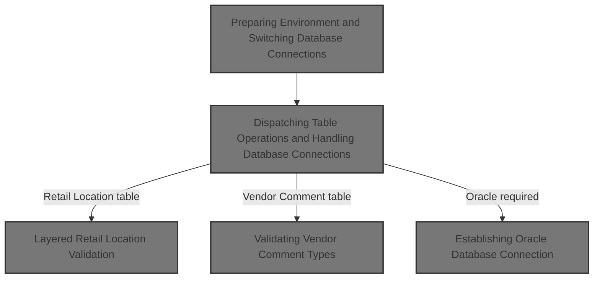
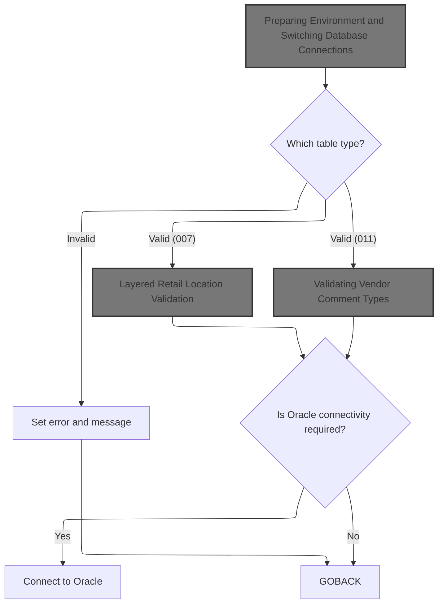
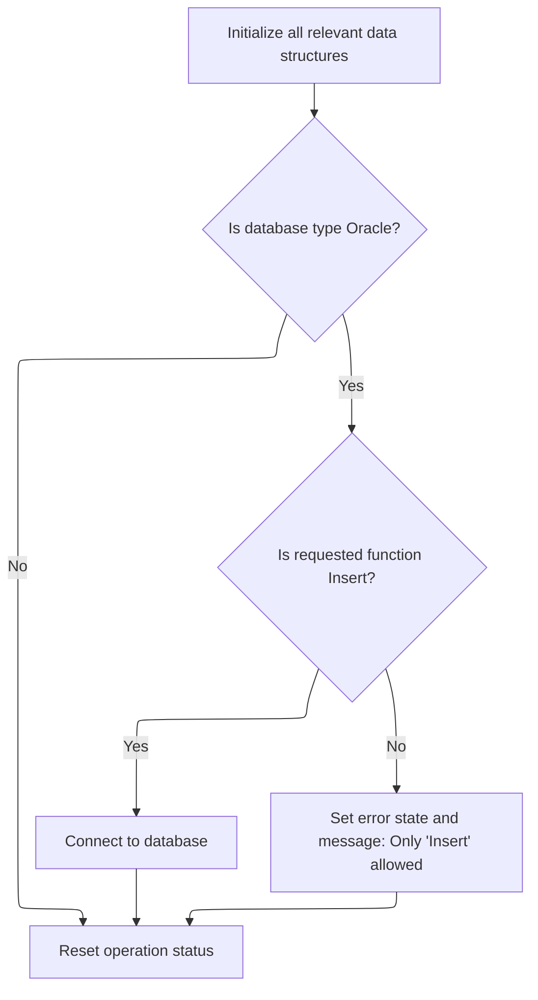
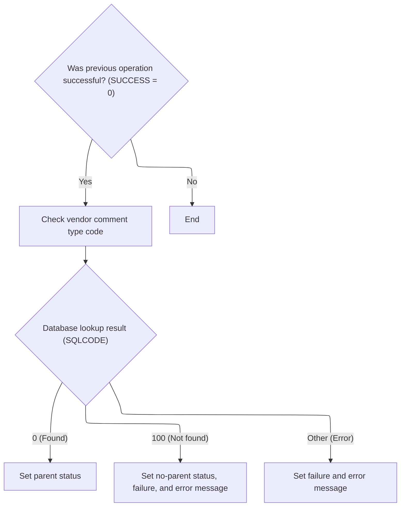

This document describes how table operations are dispatched to the appropriate validation logic and how database connections are managed. The flow ensures that only valid table operations are processed and the correct database is used for each operation. Table type codes determine which validation process is executed, and database connectivity is established as needed.



# Spec

## Detailed View of the Program's Functionality

# a. Main Program Flow and Table Dispatch

The program begins by initializing its environment and then decides what operation to perform based on a table code provided as input. This is done through a dispatch mechanism that checks the table code and routes the logic to the appropriate validation or checking routine. If the table code is not recognized, it sets an error state and constructs an error message indicating an invalid table was passed.

After the table-specific logic is executed, the program checks if an Oracle database connection is required. If so, it prepares the necessary data structures, calls a routine to establish the Oracle connection, and then restores the updated data structures. Finally, the program ends its execution.

**Key actions in this section:**

- Initialize environment and data structures.
- Dispatch to the correct validation/check routine based on the table code.
- Handle invalid table codes by setting an error and message.
- Optionally connect to Oracle if required.
- End the program.

# b. Environment Preparation and Database Connection Switching

Before any table-specific logic is executed, the program performs an initialization routine. This routine resets key data structures to a clean state. If the operation requires Oracle connectivity and the requested function is an insert, it switches the database connection to DB2 by calling an external routine. If the function is not an insert, it sets an error state and constructs an error message indicating that only insert operations are allowed in this context. Regardless of the path taken, it resets the operation status at the end of initialization.

**Key actions in this section:**

- Reset all relevant data structures.
- If Oracle is needed and the function is insert, switch to DB2.
- If Oracle is needed but the function is not insert, set an error and message.
- Always reset the operation status at the end.

# c. Establishing Oracle Database Connection

When an Oracle connection is required, the program calls an external routine to establish the connection. It passes the necessary data structures to this routine, which handles the actual connection logic and prepares the environment for Oracle operations.

**Key actions in this section:**

- Call an external routine to establish an Oracle connection.
- Pass required data structures for connection and environment setup.

# d. Layered Retail Location Validation

For certain table codes, the program performs a layered validation process for retail locations. It first checks if the previous operations were successful. If so, it would (in the full implementation) validate the e-commerce market area. If that check passes and a specific parent flag is set, it would then validate the computer type. Each step depends on the previous one being successful and on certain flags being set, ensuring that validation is performed in a strict sequence.

**Key actions in this section:**

- If previous steps succeeded, validate the e-commerce market area.
- If that also succeeds and a parent flag is set, validate the computer type.
- Each validation step is conditional on the previous one.

# e. Validating Vendor Comment Types

When validating vendor comment types, the program first checks if previous operations were successful. If so, it attempts to look up the vendor comment type code in the database. The result of this lookup determines the next steps:

- If the code is found, it sets a parent status flag.
- If the code is not found, it sets a no-parent status, marks the operation as failed, and constructs an error message indicating the code was not found.
- If there is any other error during the lookup, it marks the operation as failed and constructs a detailed error message including the SQL error code.

**Key actions in this section:**

- Check for previous success.
- Attempt to find the vendor comment type code in the database.
- Set status flags and error messages based on the lookup result.

# f. General Pattern for Table Validation Routines

Across the various table validation routines, the program follows a consistent pattern:

- Move the input code into a query structure.
- Execute a database query to check for the existence of the code.
- Use the result of the query to set status flags and construct error messages as needed.
- If the code is found, set a parent flag.
- If not found, set a no-parent flag, mark failure, and build an error message.
- If another error occurs, mark failure and build a detailed error message with the SQL error code.

**Key actions in this section:**

- Prepare and execute a database query for the relevant code.
- Set flags and messages based on whether the code is found, not found, or an error occurs.

# g. Summary

The program is structured to safely and modularly validate various codes against database tables, handling both DB2 and Oracle connections as needed. It ensures that only valid operations are performed, provides clear error reporting, and maintains a strict sequence of validation steps for complex checks. The use of external routines for database connection management keeps the code modular and maintainable.

# Rule Definition

| Paragraph Name                                                                                                                                                                                                                                                                                                                       | Rule ID | Category          | Description                                                                                                                                                                                                                       | Conditions                                                  | Remarks                                                                                                                                     |
| ------------------------------------------------------------------------------------------------------------------------------------------------------------------------------------------------------------------------------------------------------------------------------------------------------------------------------------ | ------- | ----------------- | --------------------------------------------------------------------------------------------------------------------------------------------------------------------------------------------------------------------------------- | ----------------------------------------------------------- | ------------------------------------------------------------------------------------------------------------------------------------------- |
| 010-INITIALIZE                                                                                                                                                                                                                                                                                                                       | RL-001  | Data Assignment   | At the start of execution, all relevant status and error flags in MMMC0335 must be initialized to their default values.                                                                                                           | Program start; before any validation or processing.         | All status and error fields in MMMC0335 are set to their default (usually spaces or FALSE). MMMC0335-STATUS is set to spaces.               |
| 000-MAIN-LINE                                                                                                                                                                                                                                                                                                                        | RL-002  | Conditional Logic | The MMMC0335-TABLE field must be validated. If its value is between 001 and 011 (inclusive), dispatch to the corresponding validation routine. Otherwise, set FAILURE to TRUE and populate IS-RTRN-MSG-TXT with an error message. | MMMC0335-TABLE is present in input.                         | Valid values for MMMC0335-TABLE are 001-011 (inclusive). Error message is a string placed in IS-RTRN-MSG-TXT. FAILURE is a boolean flag.    |
| 010-INITIALIZE                                                                                                                                                                                                                                                                                                                       | RL-003  | Conditional Logic | If MMMC0335-ORACLE is TRUE, only 'I' (Insert) is allowed in MMMC0335-FUNC. Otherwise, set FAILURE to TRUE and populate IS-RTRN-MSG-TXT with an error message.                                                                     | MMMC0335-ORACLE is TRUE.                                    | Allowed value for MMMC0335-FUNC is 'I' when ORACLE is TRUE. Error message is a string placed in IS-RTRN-MSG-TXT.                            |
| 000-MAIN-LINE, 015-CONNECT-TO-DB2, 020-CONNECT-TO-ORACLE                                                                                                                                                                                                                                                                             | RL-004  | Data Assignment   | The XXXN001A structure (database connection parameters) must be passed to all subroutines that require database connectivity.                                                                                                     | Any subroutine that performs database operations.           | XXXN001A is a structure of 265 bytes. It is passed by reference to subroutines and database connection routines.                            |
| 500-CHK-XXX-VEND-LOC, 505-CHK-XXX, 600-CHK-LOC-SHPNG-OPT, 605-CHK-CUST-SHPNG-METH, 700-CHK-RETAIL-LOC, 705-CHK-ECOMM-MKT-AREA, 800-CHK-RETL-LOC-CLS-AD-ZN, 805-CHK-ITM-CLS, 810-CHK-AA-ZONES, 900-CHK-XXX-VEND-LOC, 905-CHK-XXX, 1000-CHK-VEND-TRXAL-CNTL, 1005-CHK-BUSINESS-FUNCTION, 1100-CHK-VENDOR-COMMENTS, 1105-CHK-CMT-TYP-CD | RL-005  | Computation       | Each validation routine uses specific fields from MMMC0335 as input for database lookups or checks.                                                                                                                               | When a validation routine is invoked.                       | Fields such as MMMC0335-XXX-CD, MMMC0335-CUST-SHPNG-METH-CD, MMMC0335-ECOMM-MKT-AREA-CD, etc., are used as input for SQL SELECT statements. |
| 505-CHK-XXX, 605-CHK-CUST-SHPNG-METH, 705-CHK-ECOMM-MKT-AREA, 805-CHK-ITM-CLS, 810-CHK-AA-ZONES, 905-CHK-XXX, 1005-CHK-BUSINESS-FUNCTION, 1105-CHK-CMT-TYP-CD                                                                                                                                                                        | RL-006  | Conditional Logic | If a parent record is found during validation, set MMMC0335-PARENT to TRUE. If not found, set MMMC0335-NO-PARENT to TRUE.                                                                                                         | After performing a database lookup in a validation routine. | MMMC0335-PARENT and MMMC0335-NO-PARENT are boolean flags.                                                                                   |
| 505-CHK-XXX, 605-CHK-CUST-SHPNG-METH, 705-CHK-ECOMM-MKT-AREA, 805-CHK-ITM-CLS, 810-CHK-AA-ZONES, 905-CHK-XXX, 1005-CHK-BUSINESS-FUNCTION, 1105-CHK-CMT-TYP-CD                                                                                                                                                                        | RL-007  | Conditional Logic | If any validation fails (e.g., no parent found or SQL error), set FAILURE to TRUE and populate IS-RTRN-MSG-TXT with a descriptive error message.                                                                                  | Validation routine returns SQLCODE = 100 or other error.    | FAILURE is a boolean flag. IS-RTRN-MSG-TXT is a string field for error messages.                                                            |
| 010-INITIALIZE, validation routines                                                                                                                                                                                                                                                                                                  | RL-008  | Data Assignment   | MMMC0335-STATUS must be updated to reflect the current status (e.g., 'SUCCESS', 'ERROR') as appropriate.                                                                                                                          | After validation and processing.                            | MMMC0335-STATUS is a string field indicating status.                                                                                        |
| 000-MAIN-LINE, end of program                                                                                                                                                                                                                                                                                                        | RL-009  | Data Assignment   | All output must be via updated fields in the MMMC0335 structure; no explicit print statements or external output.                                                                                                                 | On program exit.                                            | All output fields are in MMMC0335 and XXXN001A. No external output is allowed.                                                              |

# User Stories

## User Story 1: Program Initialization and Input Validation

---

### Story Description:

As a system, I want to initialize all relevant status and error flags and validate the main control parameters so that the program starts in a known state and only processes valid requests.

---

### Business Rule Mapping:

| Rule ID | Paragraph Name | Rule Description                                                                                                                                                                                                                  |
| ------- | -------------- | --------------------------------------------------------------------------------------------------------------------------------------------------------------------------------------------------------------------------------- |
| RL-002  | 000-MAIN-LINE  | The MMMC0335-TABLE field must be validated. If its value is between 001 and 011 (inclusive), dispatch to the corresponding validation routine. Otherwise, set FAILURE to TRUE and populate IS-RTRN-MSG-TXT with an error message. |
| RL-001  | 010-INITIALIZE | At the start of execution, all relevant status and error flags in MMMC0335 must be initialized to their default values.                                                                                                           |
| RL-003  | 010-INITIALIZE | If MMMC0335-ORACLE is TRUE, only 'I' (Insert) is allowed in MMMC0335-FUNC. Otherwise, set FAILURE to TRUE and populate IS-RTRN-MSG-TXT with an error message.                                                                     |

---

### Relevant Functionality:

- **000-MAIN-LINE**
  1. **RL-002:**
     - If MMMC0335-TABLE is between 001 and 011:
       - Dispatch to the corresponding validation routine (e.g., PERFORM 500-CHK-XXX-VEND-LOC, etc.)
     - Else:
       - Set FAILURE to TRUE
       - Set IS-RTRN-MSG-TXT to 'MMMS0335 - invalid table passed'
- **010-INITIALIZE**
  1. **RL-001:**
     - On program start:
       - Set all status and error flags in MMMC0335 to default values (e.g., spaces, FALSE)
       - Set MMMC0335-STATUS to spaces
  2. **RL-003:**
     - If MMMC0335-ORACLE is TRUE:
       - If MMMC0335-FUNC is 'I':
         - Proceed
       - Else:
         - Set FAILURE to TRUE
         - Set IS-RTRN-MSG-TXT to 'MMMS0335 - invalid function passed function should be insert'

## User Story 2: Database Connectivity and Input Structure Handling

---

### Story Description:

As a system, I want to ensure that database connection parameters are passed to all routines that require them and that all validation routines use the correct input fields for database lookups so that database operations are performed correctly and efficiently.

---

### Business Rule Mapping:

| Rule ID | Paragraph Name                                                                                                                                                                                                                                                                                                                       | Rule Description                                                                                                              |
| ------- | ------------------------------------------------------------------------------------------------------------------------------------------------------------------------------------------------------------------------------------------------------------------------------------------------------------------------------------ | ----------------------------------------------------------------------------------------------------------------------------- |
| RL-004  | 000-MAIN-LINE, 015-CONNECT-TO-DB2, 020-CONNECT-TO-ORACLE                                                                                                                                                                                                                                                                             | The XXXN001A structure (database connection parameters) must be passed to all subroutines that require database connectivity. |
| RL-005  | 500-CHK-XXX-VEND-LOC, 505-CHK-XXX, 600-CHK-LOC-SHPNG-OPT, 605-CHK-CUST-SHPNG-METH, 700-CHK-RETAIL-LOC, 705-CHK-ECOMM-MKT-AREA, 800-CHK-RETL-LOC-CLS-AD-ZN, 805-CHK-ITM-CLS, 810-CHK-AA-ZONES, 900-CHK-XXX-VEND-LOC, 905-CHK-XXX, 1000-CHK-VEND-TRXAL-CNTL, 1005-CHK-BUSINESS-FUNCTION, 1100-CHK-VENDOR-COMMENTS, 1105-CHK-CMT-TYP-CD | Each validation routine uses specific fields from MMMC0335 as input for database lookups or checks.                           |

---

### Relevant Functionality:

- **000-MAIN-LINE**
  1. **RL-004:**
     - When calling a subroutine that requires DB access:
       - Pass XXXN001A as an argument
- **500-CHK-XXX-VEND-LOC**
  1. **RL-005:**
     - For each validation routine:
       - Use the relevant MMMC0335 field as input to the SQL SELECT statement
       - Check if a matching record exists

## User Story 3: Validation Routine Execution and Parent Record Checks

---

### Story Description:

As a system, I want to execute the appropriate validation routine based on the input, check for parent records, and handle validation failures so that the correct business logic is enforced and errors are reported accurately.

---

### Business Rule Mapping:

| Rule ID | Paragraph Name                                                                                                                                                | Rule Description                                                                                                                                 |
| ------- | ------------------------------------------------------------------------------------------------------------------------------------------------------------- | ------------------------------------------------------------------------------------------------------------------------------------------------ |
| RL-006  | 505-CHK-XXX, 605-CHK-CUST-SHPNG-METH, 705-CHK-ECOMM-MKT-AREA, 805-CHK-ITM-CLS, 810-CHK-AA-ZONES, 905-CHK-XXX, 1005-CHK-BUSINESS-FUNCTION, 1105-CHK-CMT-TYP-CD | If a parent record is found during validation, set MMMC0335-PARENT to TRUE. If not found, set MMMC0335-NO-PARENT to TRUE.                        |
| RL-007  | 505-CHK-XXX, 605-CHK-CUST-SHPNG-METH, 705-CHK-ECOMM-MKT-AREA, 805-CHK-ITM-CLS, 810-CHK-AA-ZONES, 905-CHK-XXX, 1005-CHK-BUSINESS-FUNCTION, 1105-CHK-CMT-TYP-CD | If any validation fails (e.g., no parent found or SQL error), set FAILURE to TRUE and populate IS-RTRN-MSG-TXT with a descriptive error message. |

---

### Relevant Functionality:

- **505-CHK-XXX**
  1. **RL-006:**
     - After SQL SELECT in validation routine:
       - If SQLCODE = 0:
         - Set MMMC0335-PARENT to TRUE
       - If SQLCODE = 100:
         - Set MMMC0335-NO-PARENT to TRUE
  2. **RL-007:**
     - If SQLCODE = 100 or other error:
       - Set FAILURE to TRUE
       - Set IS-RTRN-MSG-TXT to a descriptive error message

## User Story 4: Status and Output Management

---

### Story Description:

As a system, I want to update the status field to reflect the current processing state and ensure all output is returned via the specified structures so that the caller receives all results and error messages in the expected format.

---

### Business Rule Mapping:

| Rule ID | Paragraph Name                      | Rule Description                                                                                                  |
| ------- | ----------------------------------- | ----------------------------------------------------------------------------------------------------------------- |
| RL-009  | 000-MAIN-LINE, end of program       | All output must be via updated fields in the MMMC0335 structure; no explicit print statements or external output. |
| RL-008  | 010-INITIALIZE, validation routines | MMMC0335-STATUS must be updated to reflect the current status (e.g., 'SUCCESS', 'ERROR') as appropriate.          |

---

### Relevant Functionality:

- **000-MAIN-LINE**
  1. **RL-009:**
     - On program exit:
       - Return control to caller with updated MMMC0335 and XXXN001A
       - Do not perform any print or external output
- **010-INITIALIZE**
  1. **RL-008:**
     - After processing:
       - Set MMMC0335-STATUS to 'SUCCESS' if all validations pass
       - Set MMMC0335-STATUS to 'ERROR' if any validation fails

# Code Walkthrough

## Dispatching Table Operations and Handling Database Connections



<SwmSnippet path="/base/src/MMMS0335.cbl" line="86">

---

`000-MAIN-LINE` starts by prepping the environment, then dispatches to the right validation or check based on the table code. It handles Oracle connections if needed and sets errors for bad input codes.

```cobol
010600 000-MAIN-LINE.                                                   00010600
010700     PERFORM 010-INITIALIZE                                       00010700
010800     EVALUATE MMMC0335-TABLE                                      00010800
010900       WHEN 001                                                   00010900
011100       WHEN 002                                                   00011100
011300       WHEN 003                                                   00011300
011500       WHEN 004                                                   00011500
011600         CONTINUE                                                 00011600
011700       WHEN 005                                                   00011700
011800         PERFORM 500-CHK-XXX-VEND-LOC                             00011800
011900       WHEN 006                                                   00011900
012000         PERFORM 600-CHK-LOC-SHPNG-OPT                            00012000
012100       WHEN 007                                                   00012100
012200         PERFORM 700-CHK-RETAIL-LOC                               00012200
012300       WHEN 008                                                   00012300
012400         PERFORM 800-CHK-RETL-LOC-CLS-AD-ZN                       00012400
012500       WHEN 009                                                   00012500
012600         PERFORM 900-CHK-XXX-VEND-LOC                             00012600
012700       WHEN 010                                                   00012700
012800         PERFORM 1000-CHK-VEND-TRXAL-CNTL                         00012800
012900       WHEN 011                                                   00012900
013000         PERFORM 1100-CHK-VENDOR-COMMENTS                         00013000
013100       WHEN OTHER                                                 00013100
013200         SET FAILURE   TO TRUE                                    00013200
013300         MOVE SPACES  TO IS-RTRN-MSG-TXT                          00013300
013400         STRING 'MMMS0335 - invalid table passed '                00013400
013500                DELIMITED BY SIZE INTO IS-RTRN-MSG-TXT            00013500
013600     END-EVALUATE                                                 00013600
013700     IF MMMC0335-ORACLE                                           00013700
013800       MOVE XXXN001A   TO  WS-XXXN001A                            00013800
013900       MOVE SQLCA      TO  WS-SQLCA                               00013900
014000       PERFORM 020-CONNECT-TO-ORACLE                              00014000
014100       MOVE WS-XXXN001A  TO XXXN001A                              00014100
014200       MOVE WS-SQLCA     TO SQLCA                                 00014200
014300     END-IF                                                       00014300
014400                                                                  00014400
014500     GOBACK                                                       00014500
014600     .                                                            00014600
```

---

</SwmSnippet>

### Preparing Environment and Switching Database Connections



<SwmSnippet path="/base/src/MMMS0335.cbl" line="129">

---

`010-INITIALIZE` sets up the environment and checks if we're using Oracle. If so, and the function type is 'I', it calls 015-CONNECT-TO-DB2 to switch the connection. If not, it flags an error and builds a message. This keeps the flow safe and only allows valid operations.

```cobol
015200 010-INITIALIZE.                                                  00015200
015300     INITIALIZE XXXN001A                                          00015300
015400                WS-XXXN001A                                       00015400
015500                WS-SQLCA                                          00015500
015600                                                                  00015600
015700     IF MMMC0335-ORACLE                                           00015700
015800       IF MMMC0335-FUNC  = 'I'                                    00015800
015900         PERFORM 015-CONNECT-TO-DB2                               00015900
016000       ELSE                                                       00016000
016100         SET FAILURE TO TRUE                                      00016100
016200         MOVE SPACES  TO IS-RTRN-MSG-TXT                          00016200
016300         STRING 'MMMS0335 - invalid function passed '             00016300
016400                'function should be insert'                       00016400
016500                DELIMITED BY SIZE INTO IS-RTRN-MSG-TXT            00016500
016600       END-IF                                                     00016600
016700     END-IF                                                       00016700
016800                                                                  00016800
016900     MOVE SPACES   TO MMMC0335-STATUS                             00016900
017000     .                                                            00017000
```

---

</SwmSnippet>

<SwmSnippet path="/base/src/MMMS0335.cbl" line="153">

---

`015-CONNECT-TO-DB2` calls Z-DB2-CONNECT (YYYS0211) to switch the system to DB2, handle error translation, and restore any backup records. This keeps the connection logic clean and modular.

```cobol
017600 015-CONNECT-TO-DB2.                                              00017600
017700     CALL Z-DB2-CONNECT         USING XXXN001A                    00017700
017800                                      SQLCA                       00017800
017900     .                                                            00017900
```

---

</SwmSnippet>

### Layered Retail Location Validation

<SwmSnippet path="/base/src/MMMS0335.cbl" line="260">

---

`700-CHK-RETAIL-LOC` checks for SUCCESS, then runs CHK-ECOMM-MKT-AREA. If that passes and MMMC0335-PARENT is set, it runs CHK-CMPTR-TYP. This layered approach means each step depends on the previous one passing and a specific flag being set.

```cobol
046200 700-CHK-RETAIL-LOC.                                              00046200
046300      IF SUCCESS                                                  00046300
046400*       PERFORM 705-CHK-ECOMM-MKT-AREA                            00046400
046500*       IF SUCCESS AND MMMC0335-PARENT                            00046500
046600*         PERFORM 710-CHK-CMPTR-TYP                               00046600
046700*       END-IF                                                    00046700
046800        CONTINUE                                                  00046800
046900      END-IF                                                      00046900
047000      .                                                           00047000
```

---

</SwmSnippet>

### Validating Vendor Comment Types



<SwmSnippet path="/base/src/MMMS0335.cbl" line="484">

---

`1100-CHK-VENDOR-COMMENTS` checks for SUCCESS, then calls 1105-CHK-CMT-TYP-CD to validate the comment type code. If the code isn't found, it sets failure and builds an error message. This keeps comment type validation isolated and clear.

```cobol
072300 1100-CHK-VENDOR-COMMENTS.                                        00072300
072400      IF SUCCESS                                                  00072400
072500        PERFORM 1105-CHK-CMT-TYP-CD                               00072500
072600      END-IF                                                      00072600
072700      .                                                           00072700
```

---

</SwmSnippet>

<SwmSnippet path="/base/src/MMMS0335.cbl" line="491">

---

`1105-CHK-CMT-TYP-CD` moves the input code to the query structure, runs a SQL select to check for existence, and sets flags based on the result. If the code isn't found or there's an error, it sets failure and builds the right error message.

```cobol
073000 1105-CHK-CMT-TYP-CD.                                             00073000
073100     MOVE MMMC0335-CMT-TYP-CD                                     00073100
073200       TO CMT-TYP-CD             OF DCLCMT-TYP-CD                 00073200
073300                                                                  00073300
073400     EXEC SQL                                                     00073400
073500        SELECT XXX_TYP_CD                                         00073500
073600         INTO : DCLCMT-TYP-CD.CMT-TYP-CD                          00073600
073700        FROM XXX_TYP_CD                                           00073700
073800        WHERE XXX_TYP_CD                                          00073800
073900                      = :DCLCMT-TYP-CD.CMT-TYP-CD                 00073900
074000        FETCH FIRST 1 ROWS ONLY                                   00074000
074100     END-EXEC                                                     00074100
074200                                                                  00074200
074300     EVALUATE TRUE                                                00074300
074400       WHEN SQLCODE = 0                                           00074400
074500         SET MMMC0335-PARENT     TO  TRUE                         00074500
074600       WHEN SQLCODE = 100                                         00074600
074700         SET  MMMC0335-NO-PARENT TO TRUE                          00074700
074800         SET FAILURE             TO TRUE                          00074800
074900         MOVE SQLCODE            TO WS-SQLCODE                    00074900
075000         MOVE SPACE              TO IS-RTRN-MSG-TXT               00075000
075100         STRING 'MMMS0335 - XXX_TYP_CD'                           00075100
075200                 ' should be in XXX_TYP_CD,'                      00075200
075300                 ' rule = MDVCMDCT '                              00075300
075400         DELIMITED BY SIZE INTO IS-RTRN-MSG-TXT                   00075400
075500       WHEN OTHER                                                 00075500
075600         SET FAILURE             TO TRUE                          00075600
075700         MOVE SQLCODE            TO WS-SQLCODE                    00075700
075800         MOVE SPACE              TO IS-RTRN-MSG-TXT               00075800
075900         STRING 'MMMS0335 - SQL error on table '                  00075900
076000                'XXX_TYP_CD, '                                    00076000
076100                 'Sqlcode = ' WS-SQLCODE                          00076100
076200         DELIMITED BY SIZE INTO IS-RTRN-MSG-TXT                   00076200
076300     END-EVALUATE                                                 00076300
076400     .                                                            00076400
```

---

</SwmSnippet>

### Establishing Oracle Database Connection

<SwmSnippet path="/base/src/MMMS0335.cbl" line="162">

---

`020-CONNECT-TO-ORACLE` hands off to XXXS0210 to set up the Oracle connection and prep the environment.

```cobol
018500 020-CONNECT-TO-ORACLE.                                           00018500
018600     CALL Z-ORA-CONNECT USING XXXN001A                            00018600
018700                              SQLCA                               00018700
018800     .                                                            00018800
```

---

</SwmSnippet>

&nbsp;

*This is an auto-generated document by Swimm 🌊 and has not yet been verified by a human*

<SwmMeta version="3.0.0" repo-id="Z2l0aHViJTNBJTNBU3dpbW1pby1keW5jYWxsLWRlbW8lM0ElM0FHaXJpLVN3aW1t" repo-name="Swimmio-dyncall-demo"><sup>Powered by [Swimm](https://app.swimm.io/)</sup></SwmMeta>
