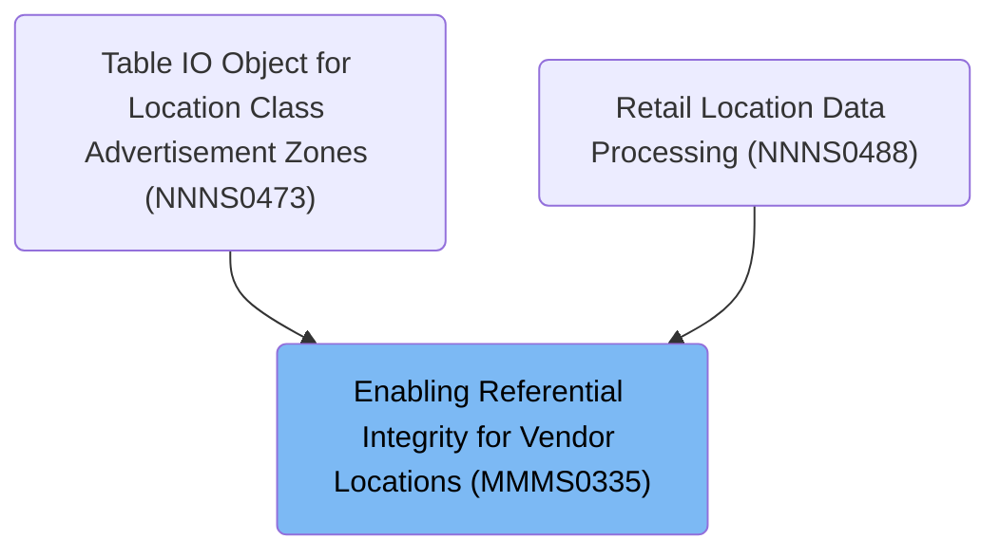

# Overview

This document describes the flow for enabling referential integrity constraints for vendor location and related tables. The process validates the environment, selects the appropriate database connection, and routes processing based on table type to enforce business rules. The flow outputs validation status and messages, coordinating database connections and validations across subsystems.

## Dependencies

### Programs

- MMMS0335 (<SwmPath>[base/src/MMMS0335.cbl](base/src/MMMS0335.cbl)</SwmPath>)
- YYYS0211 (<SwmPath>[base/src/YYYS0211.cbl](base/src/YYYS0211.cbl)</SwmPath>)
- YYYS0220 (<SwmPath>[base/src/YYYS0220.cbl](base/src/YYYS0220.cbl)</SwmPath>)
- YYYS0212 (<SwmPath>[base/src/YYYS0212.cbl](base/src/YYYS0212.cbl)</SwmPath>)
- YYYS0210 (<SwmPath>[base/src/XXXS0210.cbl](base/src/XXXS0210.cbl)</SwmPath>)

### Copybooks

- SQLCA
- XXXN001A (<SwmPath>[base/src/XXXN001A.cpy](base/src/XXXN001A.cpy)</SwmPath>)
- YYYC0220 (<SwmPath>[base/src/YYYC0220.cpy](base/src/YYYC0220.cpy)</SwmPath>)
- YYYN000A (<SwmPath>[base/src/YYYN000A.cpy](base/src/YYYN000A.cpy)</SwmPath>)
- DDDTAC01
- DDDTCM01
- DDDTCS01
- DDDTEA01
- DDDTIC01
- DDDTAV01
- DDDTSC01
- DDDTBF01
- DDDTZN01
- DDDTCT01
- MMMC0335 (<SwmPath>[base/src/MMMC0335.cpy](base/src/MMMC0335.cpy)</SwmPath>)

# Where is this program used?

This program is used multiple times in the codebase as represented in the following diagram:

&nbsp;

*This is an auto-generated document by Swimm 🌊 and has not yet been verified by a human*

<SwmMeta version="3.0.0" repo-id="Z2l0aHViJTNBJTNBU3dpbW1pby1keW5jYWxsLWRlbW8lM0ElM0FHaXJpLVN3aW1t" repo-name="Swimmio-dyncall-demo">Powered by [Swimm](https://app.swimm.io/)</SwmMeta>
