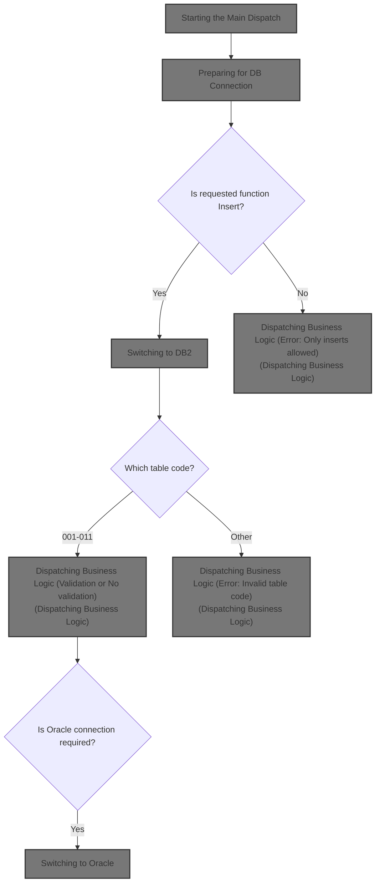
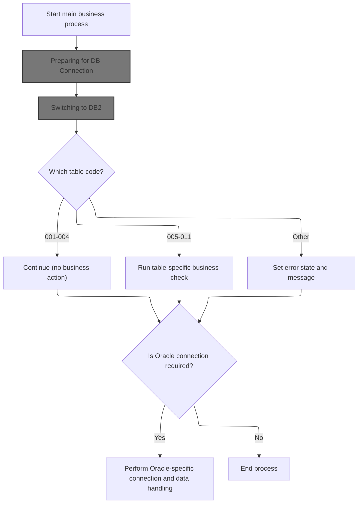
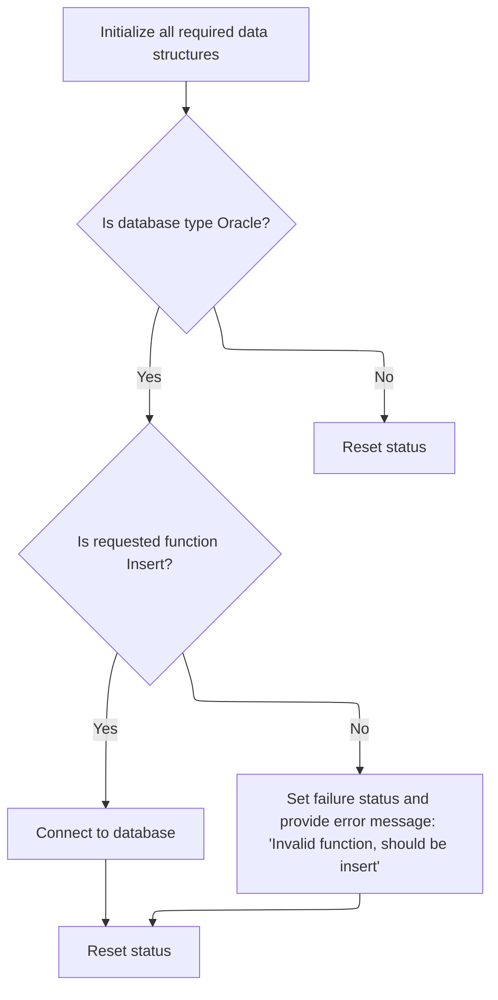
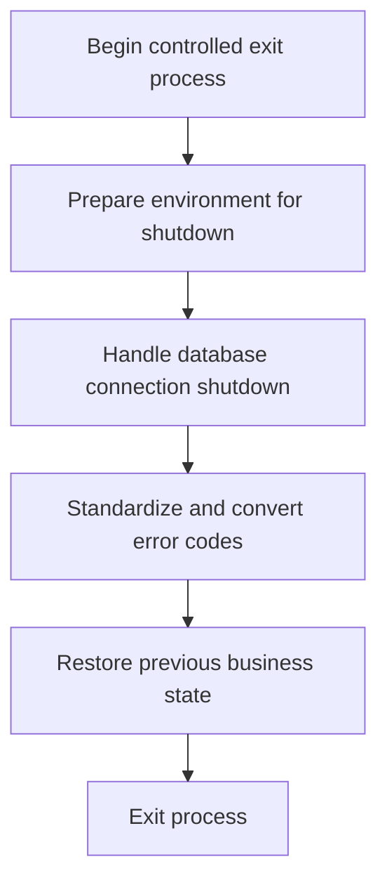
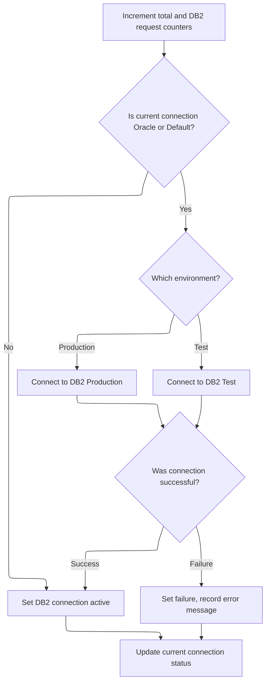
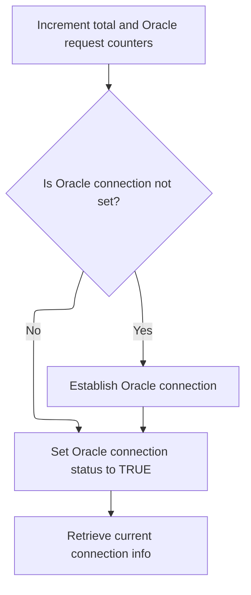
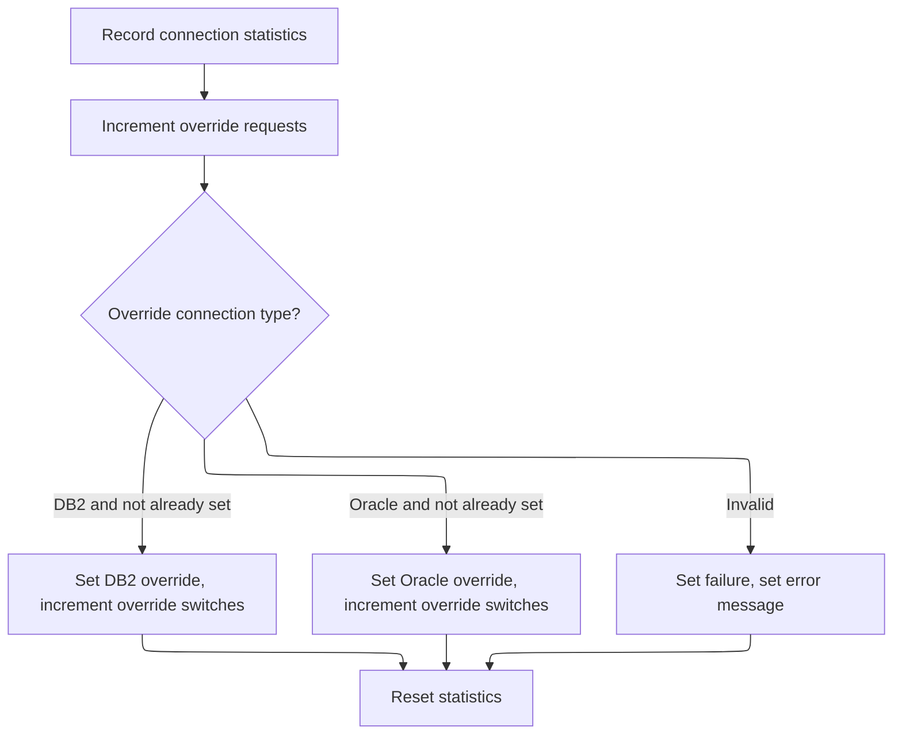
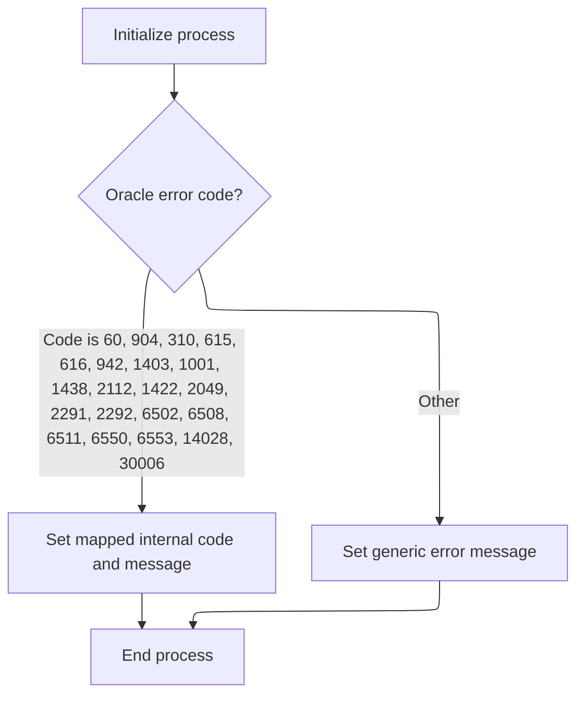
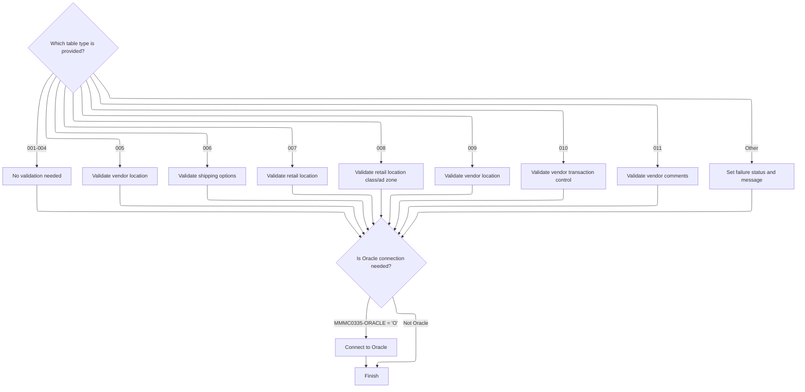

# Overview

This document describes the flow for enabling referential integrity constraints for vendor location tables. The process initializes the environment, manages database connections, and dispatches business logic based on table code, ensuring only valid operations are performed.



## Dependencies

### Programs

- <SwmToken path="base/src/MMMS0335.cbl" pos="111:5:5" line-data="013400         STRING &#39;MMMS0335 - invalid table passed &#39;                00013400">`MMMS0335`</SwmToken> (<SwmPath>[base/src/MMMS0335.cbl](base/src/MMMS0335.cbl)</SwmPath>)
- <SwmToken path="base/src/MMMS0335.cbl" pos="16:20:20" line-data="002000 01 Z-DB2-CONNECT               PIC X(8) VALUE &#39;YYYS0211&#39;.        00002000">`YYYS0211`</SwmToken> (<SwmPath>[base/src/YYYS0211.cbl](base/src/YYYS0211.cbl)</SwmPath>)
- <SwmToken path="base/src/YYYS0211.cbl" pos="55:4:4" line-data="007500     CALL YYYS0220-DBMS-CON-MGR USING                             00007500">`YYYS0220`</SwmToken> (<SwmPath>[base/src/YYYS0220.cbl](base/src/YYYS0220.cbl)</SwmPath>)
- <SwmToken path="base/src/YYYS0212.cbl" pos="96:9:9" line-data="010300         STRING &#39;Error in YYYS0212. Oracle code:&#39;                 00010300">`YYYS0212`</SwmToken> (<SwmPath>[base/src/YYYS0212.cbl](base/src/YYYS0212.cbl)</SwmPath>)
- <SwmToken path="base/src/MMMS0335.cbl" pos="15:20:20" line-data="001900 01 Z-ORA-CONNECT               PIC X(8) VALUE &#39;YYYS0210&#39;.        00001900">`YYYS0210`</SwmToken> (<SwmPath>[base/src/XXXS0210.cbl](base/src/XXXS0210.cbl)</SwmPath>)

### Copybooks

- SQLCA
- <SwmToken path="base/src/MMMS0335.cbl" pos="115:4:4" line-data="013800       MOVE XXXN001A   TO  WS-XXXN001A                            00013800">`XXXN001A`</SwmToken> (<SwmPath>[base/src/XXXN001A.cpy](base/src/XXXN001A.cpy)</SwmPath>)
- <SwmToken path="base/src/YYYS0211.cbl" pos="54:4:4" line-data="007400     SET YYYC0220-SET-DB2-CON TO TRUE                             00007400">`YYYC0220`</SwmToken> (<SwmPath>[base/src/YYYC0220.cpy](base/src/YYYC0220.cpy)</SwmPath>)
- <SwmToken path="base/src/YYYS0211.cbl" pos="15:4:4" line-data="003100 COPY YYYN000A.                                                   00003100">`YYYN000A`</SwmToken> (<SwmPath>[base/src/YYYN000A.cpy](base/src/YYYN000A.cpy)</SwmPath>)
- <SwmToken path="base/src/MMMS0335.cbl" pos="33:4:4" line-data="003700       INCLUDE DDDTAC01                                           00003700">`DDDTAC01`</SwmToken>
- <SwmToken path="base/src/MMMS0335.cbl" pos="37:4:4" line-data="005300       INCLUDE DDDTCM01                                           00005300">`DDDTCM01`</SwmToken>
- <SwmToken path="base/src/MMMS0335.cbl" pos="41:4:4" line-data="005700       INCLUDE DDDTCS01                                           00005700">`DDDTCS01`</SwmToken>
- <SwmToken path="base/src/MMMS0335.cbl" pos="45:4:4" line-data="006100       INCLUDE DDDTEA01                                           00006100">`DDDTEA01`</SwmToken>
- <SwmToken path="base/src/MMMS0335.cbl" pos="49:4:4" line-data="006500       INCLUDE DDDTIC01                                           00006500">`DDDTIC01`</SwmToken>
- <SwmToken path="base/src/MMMS0335.cbl" pos="53:4:4" line-data="006900       INCLUDE DDDTAV01                                           00006900">`DDDTAV01`</SwmToken>
- <SwmToken path="base/src/MMMS0335.cbl" pos="57:4:4" line-data="007300       INCLUDE DDDTSC01                                           00007300">`DDDTSC01`</SwmToken>
- <SwmToken path="base/src/MMMS0335.cbl" pos="61:4:4" line-data="007700       INCLUDE DDDTBF01                                           00007700">`DDDTBF01`</SwmToken>
- <SwmToken path="base/src/MMMS0335.cbl" pos="65:4:4" line-data="008500       INCLUDE DDDTZN01                                           00008500">`DDDTZN01`</SwmToken>
- <SwmToken path="base/src/MMMS0335.cbl" pos="69:4:4" line-data="008900       INCLUDE DDDTCT01                                           00008900">`DDDTCT01`</SwmToken>
- <SwmToken path="base/src/MMMS0335.cbl" pos="88:4:4" line-data="010800     EVALUATE MMMC0335-TABLE                                      00010800">`MMMC0335`</SwmToken> (<SwmPath>[base/src/MMMC0335.cpy](base/src/MMMC0335.cpy)</SwmPath>)

# Where is this program used?

This program is used multiple times in the codebase as represented in the following diagram:

```mermaid
graph TD
  dcuoq("Table IO Object for Location Class Advertisement Zones (NNNS0473)") --> 5gpgc("Enabling Referential Integrity for Vendor Locations (MMMS0335)"):::currentEntity
click dcuoq openCode "base/src/NNNS0473.cbl:1"
92pjd("Retail Location Data Processing (NNNS0488)") --> 5gpgc("Enabling Referential Integrity for Vendor Locations (MMMS0335)"):::currentEntity
click 92pjd openCode "base/src/NNNS0488.cbl:1"
  
  
click 5gpgc openCode "base/src/MMMS0335.cbl:1"
    classDef currentEntity color:#000000,fill:#7CB9F4

%% Swimm:
%% graph TD
%%   dcuoq("Table IO Object for Location Class Advertisement Zones (NNNS0473)") --> 5gpgc("Enabling Referential Integrity for Vendor Locations (<SwmToken path="base/src/MMMS0335.cbl" pos="111:5:5" line-data="013400         STRING &#39;MMMS0335 - invalid table passed &#39;                00013400">`MMMS0335`</SwmToken>)"):::currentEntity
%% click dcuoq openCode "<SwmPath>[base/src/NNNS0473.cbl](base/src/NNNS0473.cbl)</SwmPath>:1"
%% 92pjd("Retail Location Data Processing (NNNS0488)") --> 5gpgc("Enabling Referential Integrity for Vendor Locations (<SwmToken path="base/src/MMMS0335.cbl" pos="111:5:5" line-data="013400         STRING &#39;MMMS0335 - invalid table passed &#39;                00013400">`MMMS0335`</SwmToken>)"):::currentEntity
%% click 92pjd openCode "<SwmPath>[base/src/NNNS0488.cbl](base/src/NNNS0488.cbl)</SwmPath>:1"
%%   
%%   
%% click 5gpgc openCode "<SwmPath>[base/src/MMMS0335.cbl](base/src/MMMS0335.cbl)</SwmPath>:1"
%%     classDef currentEntity color:#000000,fill:#7CB9F4
```



## Detailed View of the Program's Functionality

# Main Business Process Flow

## Initialization and Environment Setup

The main business process begins by performing an initialization routine. This routine prepares all necessary data structures and working areas, ensuring that the environment is clean and ready for further processing. It checks if the operation requires switching to the Oracle database, and if so, verifies that the requested function is an insert. If the function is not an insert, it sets a failure status and provides an error message indicating that only insert operations are allowed for database switching. Regardless of the outcome, it resets the status field to ensure a consistent starting state.

## Database Connection Switching

If the initialization determines that a database switch is required (specifically to <SwmToken path="base/src/MMMS0335.cbl" pos="136:10:10" line-data="015900         PERFORM 015-CONNECT-TO-DB2                               00015900">`DB2`</SwmToken> for insert operations), it invokes a connection routine. This routine calls an external program responsible for establishing a connection to the <SwmToken path="base/src/MMMS0335.cbl" pos="136:10:10" line-data="015900         PERFORM 015-CONNECT-TO-DB2                               00015900">`DB2`</SwmToken> database. The connection manager handles the actual switching, ensuring that the system is communicating with the correct database and that error codes are standardized.

## Table-Specific Business Logic Dispatch

After initialization, the process evaluates the type of table involved in the operation. Depending on the table code provided, it either continues without further action, performs a table-specific business validation, or sets an error state if the table code is not recognized. Each recognized table code triggers a corresponding validation routine, which checks business rules and referential integrity for that table. If the table code is invalid, the process sets a failure status and constructs an appropriate error message.

## Oracle Connection Handling

If the operation requires an Oracle connection, the process saves the current state, invokes a routine to establish the Oracle connection, and then restores the saved state. This ensures that the connection logic is isolated and does not interfere with the main business process. The Oracle connection routine calls an external program that prepares the environment and requests the connection manager to activate the Oracle database.

# <SwmToken path="base/src/MMMS0335.cbl" pos="136:10:10" line-data="015900         PERFORM 015-CONNECT-TO-DB2                               00015900">`DB2`</SwmToken> Connection Manager Logic

## Centralized Connection Dispatch

The connection manager receives requests to switch or query the current database connection, update statistics, or handle overrides. It evaluates the request type and dispatches control to the appropriate handler. If the request type is not recognized, it sets a failure status and provides an error message.

## Activating <SwmToken path="base/src/MMMS0335.cbl" pos="136:10:10" line-data="015900         PERFORM 015-CONNECT-TO-DB2                               00015900">`DB2`</SwmToken> Connection

When a request to activate the <SwmToken path="base/src/MMMS0335.cbl" pos="136:10:10" line-data="015900         PERFORM 015-CONNECT-TO-DB2                               00015900">`DB2`</SwmToken> connection is received, the manager increments counters for total requests and DB2-specific requests. If the current connection is not already <SwmToken path="base/src/MMMS0335.cbl" pos="136:10:10" line-data="015900         PERFORM 015-CONNECT-TO-DB2                               00015900">`DB2`</SwmToken>, it performs the actual switch, choosing between production or test environments based on a flag. After attempting the connection, it checks the result: if successful, it marks <SwmToken path="base/src/MMMS0335.cbl" pos="136:10:10" line-data="015900         PERFORM 015-CONNECT-TO-DB2                               00015900">`DB2`</SwmToken> as active; if not, it sets a failure status and records the error code and message. The manager then updates the current connection status for tracking.

## Activating Oracle Connection

Similarly, when a request to activate the Oracle connection is received, the manager increments counters for total requests and Oracle-specific requests. If the current connection is not already Oracle, it performs the switch, selecting the appropriate Oracle instance based on the environment flag. After the connection attempt, it checks the result and either marks Oracle as active or sets a failure status with the error code and message. The current connection status is updated accordingly.

## Statistics and Overrides

The manager can return connection statistics, including counts of requests, switches, and overrides. It can also reset all statistics to zero. Additionally, it supports override requests to force the connection to <SwmToken path="base/src/MMMS0335.cbl" pos="136:10:10" line-data="015900         PERFORM 015-CONNECT-TO-DB2                               00015900">`DB2`</SwmToken> or Oracle, incrementing override counters and updating the connection status. If an invalid override is requested, it sets a failure status and provides an error message.

# Oracle Error Handling and Message Formatting

## Error Code Conversion

If a residual Oracle error is detected (specifically error code -84), the process calls a conversion routine to map Oracle error codes to internal standardized codes. This ensures consistent error handling across database types.

## User-Friendly Error Messages

A dedicated routine parses Oracle error messages, extracting the error code and mapping it to an internal code using a predefined list. If the error code is recognized, it sets the corresponding internal code; otherwise, it constructs a generic error message indicating an unknown Oracle error. The routine clears the error message field after processing to prevent stale data.

# Table-Specific Validation Logic

## Vendor Location Validation

For certain table codes, the process performs vendor location validation. It checks if the provided vendor code exists in the reference table. If found, it marks the parent relationship as valid; if not found, it sets a failure status and constructs an error message indicating the missing reference.

## Shipping Option Validation

For other table codes, the process validates shipping options by checking if the provided shipping method code exists in the reference table. The outcome is handled similarly to vendor location validation.

## Retail Location and Class/Ad Zone Validation

Additional routines validate retail location codes and class/ad zone codes, ensuring that provided values exist in their respective reference tables. Each validation follows the same pattern: success marks the parent relationship, not found sets failure and provides a specific error message, and other errors are handled with generic error reporting.

## Vendor Transaction Control and Comments Validation

Further routines validate vendor transaction control codes and vendor comment types, checking for existence in their respective tables and handling outcomes as described above.

# Summary

The overall flow ensures that the environment is properly initialized, the correct database connection is established based on the operation and environment, and that business logic validations are performed according to the table type. Error handling is robust, with standardized error code conversion and user-friendly messages. Connection management is centralized, with detailed statistics and override capabilities for auditing and debugging. Each business validation routine is isolated, ensuring maintainability and clarity in the process flow.

# Rule Definition

| Paragraph Name                                                                                                                                                                                                                                                                                                                                                                                                                                                                                                                                                                                                                                                                                                                                                                                                                                                                                                                                                                                                                                                                                                                                                                                                                                                                                  | Rule ID | Category          | Description                                                                                                                                                                                                                                                                                                                                       | Conditions                                                                                                                                                                                                                                                                                                                                                                                 | Remarks                                                                                                                                                                                                                                                                                                                                                                                                                                                                                                                                                                                                                                                                                                                                                                                                                                                                                                                                                                                                                                                                                                            |
| ----------------------------------------------------------------------------------------------------------------------------------------------------------------------------------------------------------------------------------------------------------------------------------------------------------------------------------------------------------------------------------------------------------------------------------------------------------------------------------------------------------------------------------------------------------------------------------------------------------------------------------------------------------------------------------------------------------------------------------------------------------------------------------------------------------------------------------------------------------------------------------------------------------------------------------------------------------------------------------------------------------------------------------------------------------------------------------------------------------------------------------------------------------------------------------------------------------------------------------------------------------------------------------------------- | ------- | ----------------- | ------------------------------------------------------------------------------------------------------------------------------------------------------------------------------------------------------------------------------------------------------------------------------------------------------------------------------------------------- | ------------------------------------------------------------------------------------------------------------------------------------------------------------------------------------------------------------------------------------------------------------------------------------------------------------------------------------------------------------------------------------------ | ------------------------------------------------------------------------------------------------------------------------------------------------------------------------------------------------------------------------------------------------------------------------------------------------------------------------------------------------------------------------------------------------------------------------------------------------------------------------------------------------------------------------------------------------------------------------------------------------------------------------------------------------------------------------------------------------------------------------------------------------------------------------------------------------------------------------------------------------------------------------------------------------------------------------------------------------------------------------------------------------------------------------------------------------------------------------------------------------------------------ |
| <SwmToken path="base/src/YYYS0211.cbl" pos="33:4:6" line-data="004800     PERFORM 100-INITIALIZATION                                   00004800">`100-INITIALIZATION`</SwmToken> in <SwmToken path="base/src/MMMS0335.cbl" pos="16:20:20" line-data="002000 01 Z-DB2-CONNECT               PIC X(8) VALUE &#39;YYYS0211&#39;.        00002000">`YYYS0211`</SwmToken>, <SwmToken path="base/src/YYYS0211.cbl" pos="33:4:6" line-data="004800     PERFORM 100-INITIALIZATION                                   00004800">`100-INITIALIZATION`</SwmToken> in <SwmToken path="base/src/YYYS0211.cbl" pos="55:4:4" line-data="007500     CALL YYYS0220-DBMS-CON-MGR USING                             00007500">`YYYS0220`</SwmToken>, <SwmToken path="base/src/YYYS0211.cbl" pos="33:4:6" line-data="004800     PERFORM 100-INITIALIZATION                                   00004800">`100-INITIALIZATION`</SwmToken> in XXYS0210, <SwmToken path="base/src/MMMS0335.cbl" pos="87:4:6" line-data="010700     PERFORM 010-INITIALIZE                                       00010700">`010-INITIALIZE`</SwmToken> in <SwmToken path="base/src/MMMS0335.cbl" pos="111:5:5" line-data="013400         STRING &#39;MMMS0335 - invalid table passed &#39;                00013400">`MMMS0335`</SwmToken> | RL-001  | Data Assignment   | All required data structures (business context, connection control, and main business structure) must be initialized before any business logic or connection switching occurs.                                                                                                                                                                    | Program start or before any database operation.                                                                                                                                                                                                                                                                                                                                            | Structures include the business context (<SwmToken path="base/src/MMMS0335.cbl" pos="115:4:4" line-data="013800       MOVE XXXN001A   TO  WS-XXXN001A                            00013800">`XXXN001A`</SwmToken>), connection control (<SwmToken path="base/src/YYYS0211.cbl" pos="54:4:4" line-data="007400     SET YYYC0220-SET-DB2-CON TO TRUE                             00007400">`YYYC0220`</SwmToken>), and main business structure (<SwmToken path="base/src/MMMS0335.cbl" pos="88:4:4" line-data="010800     EVALUATE MMMC0335-TABLE                                      00010800">`MMMC0335`</SwmToken>). Initialization sets all fields to spaces or zero as appropriate.                                                                                                                                                                                                                                                                                                                                                                                                                             |
| <SwmToken path="base/src/MMMS0335.cbl" pos="87:4:6" line-data="010700     PERFORM 010-INITIALIZE                                       00010700">`010-INITIALIZE`</SwmToken> in <SwmToken path="base/src/MMMS0335.cbl" pos="111:5:5" line-data="013400         STRING &#39;MMMS0335 - invalid table passed &#39;                00013400">`MMMS0335`</SwmToken>                                                                                                                                                                                                                                                                                                                                                                                                                                                                                                                                                                                                                                                                                                                                                                                                                                                                                                                                 | RL-002  | Conditional Logic | Database switching is only permitted if the requested function is 'I' (insert). Any other function results in failure and an error message.                                                                                                                                                                                                       | <SwmToken path="base/src/MMMS0335.cbl" pos="114:4:6" line-data="013700     IF MMMC0335-ORACLE                                           00013700">`MMMC0335-ORACLE`</SwmToken> is set and <SwmToken path="base/src/MMMS0335.cbl" pos="135:4:6" line-data="015800       IF MMMC0335-FUNC  = &#39;I&#39;                                    00015800">`MMMC0335-FUNC`</SwmToken> is not 'I'. | Function code 'I' means insert. If not 'I', set FAILURE flag and provide error message in <SwmToken path="base/src/MMMS0335.cbl" pos="110:8:14" line-data="013300         MOVE SPACES  TO IS-RTRN-MSG-TXT                          00013300">`IS-RTRN-MSG-TXT`</SwmToken>.                                                                                                                                                                                                                                                                                                                                                                                                                                                                                                                                                                                                                                                                                                                                                                                                                                         |
| <SwmToken path="base/src/YYYS0211.cbl" pos="34:4:10" line-data="004900     PERFORM 200-CONNECT-TO-DB2                                   00004900">`200-CONNECT-TO-DB2`</SwmToken> and <SwmToken path="base/src/YYYS0220.cbl" pos="63:4:10" line-data="007200         PERFORM 300-SET-DB2-CON                                  00007200">`300-SET-DB2-CON`</SwmToken> in YYYS0211/YYYS0220, <SwmToken path="base/src/XXXS0210.cbl" pos="35:4:10" line-data="004600     PERFORM 200-CONNECT-TO-ORACLE                                00004600">`200-CONNECT-TO-ORACLE`</SwmToken> and <SwmToken path="base/src/YYYS0220.cbl" pos="65:4:10" line-data="007400         PERFORM 400-SET-ORACLE-CON                               00007400">`400-SET-ORACLE-CON`</SwmToken> in XXYS0210/YYYS0220                                                                                                                                                                                                                                                                                                                                                                                                                                                                                                      | RL-003  | Data Assignment   | The system tracks the current database connection (<SwmToken path="base/src/MMMS0335.cbl" pos="136:10:10" line-data="015900         PERFORM 015-CONNECT-TO-DB2                               00015900">`DB2`</SwmToken> or Oracle) and allows switching between them, updating the connection state and statistics accordingly.                   | A connection operation is requested via a request flag.                                                                                                                                                                                                                                                                                                                                    | <SwmToken path="base/src/YYYS0220.cbl" pos="22:6:10" line-data="003100 01 WS-YYYC0220-CURR-CON               PIC X(1) VALUE SPACES.     00003100">`YYYC0220-CURR-CON`</SwmToken>: 'D' for <SwmToken path="base/src/MMMS0335.cbl" pos="136:10:10" line-data="015900         PERFORM 015-CONNECT-TO-DB2                               00015900">`DB2`</SwmToken>, '0' for Oracle, ' ' for default. Only one request flag (e.g., <SwmToken path="base/src/YYYS0211.cbl" pos="54:4:10" line-data="007400     SET YYYC0220-SET-DB2-CON TO TRUE                             00007400">`YYYC0220-SET-DB2-CON`</SwmToken>) may be set at a time.                                                                                                                                                                                                                                                                                                                                                                                                                                                                           |
| <SwmToken path="base/src/YYYS0211.cbl" pos="32:2:6" line-data="004700 0000-EXIT-DISPATCHER.                                            00004700">`0000-EXIT-DISPATCHER`</SwmToken> in <SwmToken path="base/src/YYYS0211.cbl" pos="55:4:4" line-data="007500     CALL YYYS0220-DBMS-CON-MGR USING                             00007500">`YYYS0220`</SwmToken>                                                                                                                                                                                                                                                                                                                                                                                                                                                                                                                                                                                                                                                                                                                                                                                                                                                                                                                                    | RL-004  | Conditional Logic | Only one connection operation request flag may be set at a time. If multiple or unrecognized requests are made, the operation fails.                                                                                                                                                                                                              | More than one request flag is set or an unknown request is made.                                                                                                                                                                                                                                                                                                                           | Failure results in FAILURE flag set and a message in <SwmToken path="base/src/MMMS0335.cbl" pos="110:8:14" line-data="013300         MOVE SPACES  TO IS-RTRN-MSG-TXT                          00013300">`IS-RTRN-MSG-TXT`</SwmToken>.                                                                                                                                                                                                                                                                                                                                                                                                                                                                                                                                                                                                                                                                                                                                                                                                                                                                              |
| <SwmToken path="base/src/YYYS0220.cbl" pos="63:4:10" line-data="007200         PERFORM 300-SET-DB2-CON                                  00007200">`300-SET-DB2-CON`</SwmToken>, <SwmToken path="base/src/YYYS0220.cbl" pos="65:4:10" line-data="007400         PERFORM 400-SET-ORACLE-CON                               00007400">`400-SET-ORACLE-CON`</SwmToken>, <SwmToken path="base/src/YYYS0220.cbl" pos="71:4:10" line-data="008000         PERFORM 700-SET-OVERRIDE-CON                             00008000">`700-SET-OVERRIDE-CON`</SwmToken>, <SwmToken path="base/src/YYYS0220.cbl" pos="67:4:8" line-data="007600         PERFORM 500-GET-STATS                                    00007600">`500-GET-STATS`</SwmToken>, <SwmToken path="base/src/YYYS0220.cbl" pos="69:4:8" line-data="007800         PERFORM 600-SET-STATS                                    00007800">`600-SET-STATS`</SwmToken> in <SwmToken path="base/src/YYYS0211.cbl" pos="55:4:4" line-data="007500     CALL YYYS0220-DBMS-CON-MGR USING                             00007500">`YYYS0220`</SwmToken>                                                                                                                                                                                                      | RL-005  | Computation       | The system maintains statistics on connection operations, including total requests, DB2/Oracle/override requests, and switch counts. Stats can be queried or reset.                                                                                                                                                                               | Any connection operation, stats query, or stats reset request.                                                                                                                                                                                                                                                                                                                             | Statistics fields: <SwmToken path="base/src/YYYS0220.cbl" pos="106:10:12" line-data="011500     ADD 1 TO WS-TOT-REQS                                         00011500">`TOT-REQS`</SwmToken>, <SwmToken path="base/src/YYYS0220.cbl" pos="107:10:12" line-data="011600     ADD 1 TO WS-DB2-REQS                                         00011600">`DB2-REQS`</SwmToken>, <SwmToken path="base/src/YYYS0220.cbl" pos="152:10:12" line-data="016100     ADD 1 TO WS-OCL-REQS                                         00016100">`OCL-REQS`</SwmToken>, <SwmToken path="base/src/YYYS0220.cbl" pos="221:6:8" line-data="023000     MOVE WS-OVR-REQS     TO YYYC0220-OVR-REQS                    00023000">`OVR-REQS`</SwmToken>, <SwmToken path="base/src/YYYS0220.cbl" pos="120:10:12" line-data="012900     ADD 1 TO WS-CON-SWITCHES                                     00012900">`CON-SWITCHES`</SwmToken>, <SwmToken path="base/src/YYYS0220.cbl" pos="223:6:8" line-data="023200     MOVE WS-OVR-SWITCHES TO YYYC0220-OVR-SWITCHES                00023200">`OVR-SWITCHES`</SwmToken>. All are numeric counters. |
| <SwmToken path="base/src/MMMS0335.cbl" pos="86:2:6" line-data="010600 000-MAIN-LINE.                                                   00010600">`000-MAIN-LINE`</SwmToken> in <SwmToken path="base/src/MMMS0335.cbl" pos="111:5:5" line-data="013400         STRING &#39;MMMS0335 - invalid table passed &#39;                00013400">`MMMS0335`</SwmToken>                                                                                                                                                                                                                                                                                                                                                                                                                                                                                                                                                                                                                                                                                                                                                                                                                                                                                                                                  | RL-006  | Conditional Logic | Business logic is selected based on the value of <SwmToken path="base/src/MMMS0335.cbl" pos="88:4:6" line-data="010800     EVALUATE MMMC0335-TABLE                                      00010800">`MMMC0335-TABLE`</SwmToken>. Values 001–004 perform no action, 005–011 route to specific validation checks, and other values result in failure. | <SwmToken path="base/src/MMMS0335.cbl" pos="88:4:6" line-data="010800     EVALUATE MMMC0335-TABLE                                      00010800">`MMMC0335-TABLE`</SwmToken> value is provided.                                                                                                                                                                                            | Table code is a numeric value (001–011). For invalid codes, set FAILURE and provide error message.                                                                                                                                                                                                                                                                                                                                                                                                                                                                                                                                                                                                                                                                                                                                                                                                                                                                                                                                                                                                                 |
| <SwmToken path="base/src/YYYS0211.cbl" pos="35:4:10" line-data="005000     PERFORM 300-CNV-ORACLE-SQLCODE                               00005000">`300-CNV-ORACLE-SQLCODE`</SwmToken> in <SwmToken path="base/src/MMMS0335.cbl" pos="16:20:20" line-data="002000 01 Z-DB2-CONNECT               PIC X(8) VALUE &#39;YYYS0211&#39;.        00002000">`YYYS0211`</SwmToken>, <SwmToken path="base/src/YYYS0212.cbl" pos="31:4:12" line-data="004000     PERFORM 200-FORMAT-USER-MSG-TXT                              00004000">`200-FORMAT-USER-MSG-TXT`</SwmToken> in <SwmToken path="base/src/YYYS0212.cbl" pos="96:9:9" line-data="010300         STRING &#39;Error in YYYS0212. Oracle code:&#39;                 00010300">`YYYS0212`</SwmToken>                                                                                                                                                                                                                                                                                                                                                                                                                                                                                                                                             | RL-007  | Computation       | If an Oracle error occurs, the system maps the Oracle error code to an internal code and provides a user-friendly error message.                                                                                                                                                                                                                  | Oracle error code is present in SQLCA after an operation.                                                                                                                                                                                                                                                                                                                                  | Oracle error codes are mapped to <SwmToken path="base/src/MMMS0335.cbl" pos="136:10:10" line-data="015900         PERFORM 015-CONNECT-TO-DB2                               00015900">`DB2`</SwmToken> SQLCODE equivalents. Error message is a string, placed in <SwmToken path="base/src/MMMS0335.cbl" pos="110:8:14" line-data="013300         MOVE SPACES  TO IS-RTRN-MSG-TXT                          00013300">`IS-RTRN-MSG-TXT`</SwmToken>.                                                                                                                                                                                                                                                                                                                                                                                                                                                                                                                                                                                                                                                                   |
| <SwmToken path="base/src/YYYS0211.cbl" pos="33:4:6" line-data="004800     PERFORM 100-INITIALIZATION                                   00004800">`100-INITIALIZATION`</SwmToken> and <SwmToken path="base/src/YYYS0211.cbl" pos="36:4:10" line-data="005100     PERFORM 400-REVERT-SAVED-XXXN001A                            00005100">`400-REVERT-SAVED-XXXN001A`</SwmToken> in <SwmToken path="base/src/MMMS0335.cbl" pos="16:20:20" line-data="002000 01 Z-DB2-CONNECT               PIC X(8) VALUE &#39;YYYS0211&#39;.        00002000">`YYYS0211`</SwmToken>, <SwmToken path="base/src/MMMS0335.cbl" pos="87:4:6" line-data="010700     PERFORM 010-INITIALIZE                                       00010700">`010-INITIALIZE`</SwmToken> in <SwmToken path="base/src/MMMS0335.cbl" pos="111:5:5" line-data="013400         STRING &#39;MMMS0335 - invalid table passed &#39;                00013400">`MMMS0335`</SwmToken>                                                                                                                                                                                                                                                                                                                                                              | RL-008  | Data Assignment   | The business context structure is preserved before a connection switch and restored after the operation to maintain continuity.                                                                                                                                                                                                                   | A connection switch is performed.                                                                                                                                                                                                                                                                                                                                                          | Business context is a structure (<SwmToken path="base/src/MMMS0335.cbl" pos="115:4:4" line-data="013800       MOVE XXXN001A   TO  WS-XXXN001A                            00013800">`XXXN001A`</SwmToken>) copied to/from a working storage area.                                                                                                                                                                                                                                                                                                                                                                                                                                                                                                                                                                                                                                                                                                                                                                                                                                                                   |
| End of <SwmToken path="base/src/MMMS0335.cbl" pos="86:2:6" line-data="010600 000-MAIN-LINE.                                                   00010600">`000-MAIN-LINE`</SwmToken> in <SwmToken path="base/src/MMMS0335.cbl" pos="111:5:5" line-data="013400         STRING &#39;MMMS0335 - invalid table passed &#39;                00013400">`MMMS0335`</SwmToken>, various error handling branches                                                                                                                                                                                                                                                                                                                                                                                                                                                                                                                                                                                                                                                                                                                                                                                                                                                                                          | RL-009  | Data Assignment   | The output structure (<SwmToken path="base/src/MMMS0335.cbl" pos="88:4:4" line-data="010800     EVALUATE MMMC0335-TABLE                                      00010800">`MMMC0335`</SwmToken>) is updated to reflect the result of the operation, including status, error flags, and messages.                                                     | After any business logic or connection operation.                                                                                                                                                                                                                                                                                                                                          | Output includes status (string), error flags (boolean), and message text (string, up to 80 characters, left-aligned, space-padded).                                                                                                                                                                                                                                                                                                                                                                                                                                                                                                                                                                                                                                                                                                                                                                                                                                                                                                                                                                                |

# User Stories

## User Story 1: Connection Management and Statistics

---

### Story Description:

As a system, I want to manage database connections, allow switching between <SwmToken path="base/src/MMMS0335.cbl" pos="136:10:10" line-data="015900         PERFORM 015-CONNECT-TO-DB2                               00015900">`DB2`</SwmToken> and Oracle, validate connection requests, and maintain statistics so that connection operations are tracked, validated, and can be queried or reset as needed.

---

### Business Rule Mapping:

| Rule ID | Paragraph Name                                                                                                                                                                                                                                                                                                                                                                                                                                                                                                                                                                                                                                                                                                                                                                                                                                                                                                                                                                                                                                                                             | Rule Description                                                                                                                                                                                                                                                                                                                |
| ------- | ------------------------------------------------------------------------------------------------------------------------------------------------------------------------------------------------------------------------------------------------------------------------------------------------------------------------------------------------------------------------------------------------------------------------------------------------------------------------------------------------------------------------------------------------------------------------------------------------------------------------------------------------------------------------------------------------------------------------------------------------------------------------------------------------------------------------------------------------------------------------------------------------------------------------------------------------------------------------------------------------------------------------------------------------------------------------------------------ | ------------------------------------------------------------------------------------------------------------------------------------------------------------------------------------------------------------------------------------------------------------------------------------------------------------------------------- |
| RL-005  | <SwmToken path="base/src/YYYS0220.cbl" pos="63:4:10" line-data="007200         PERFORM 300-SET-DB2-CON                                  00007200">`300-SET-DB2-CON`</SwmToken>, <SwmToken path="base/src/YYYS0220.cbl" pos="65:4:10" line-data="007400         PERFORM 400-SET-ORACLE-CON                               00007400">`400-SET-ORACLE-CON`</SwmToken>, <SwmToken path="base/src/YYYS0220.cbl" pos="71:4:10" line-data="008000         PERFORM 700-SET-OVERRIDE-CON                             00008000">`700-SET-OVERRIDE-CON`</SwmToken>, <SwmToken path="base/src/YYYS0220.cbl" pos="67:4:8" line-data="007600         PERFORM 500-GET-STATS                                    00007600">`500-GET-STATS`</SwmToken>, <SwmToken path="base/src/YYYS0220.cbl" pos="69:4:8" line-data="007800         PERFORM 600-SET-STATS                                    00007800">`600-SET-STATS`</SwmToken> in <SwmToken path="base/src/YYYS0211.cbl" pos="55:4:4" line-data="007500     CALL YYYS0220-DBMS-CON-MGR USING                             00007500">`YYYS0220`</SwmToken> | The system maintains statistics on connection operations, including total requests, DB2/Oracle/override requests, and switch counts. Stats can be queried or reset.                                                                                                                                                             |
| RL-003  | <SwmToken path="base/src/YYYS0211.cbl" pos="34:4:10" line-data="004900     PERFORM 200-CONNECT-TO-DB2                                   00004900">`200-CONNECT-TO-DB2`</SwmToken> and <SwmToken path="base/src/YYYS0220.cbl" pos="63:4:10" line-data="007200         PERFORM 300-SET-DB2-CON                                  00007200">`300-SET-DB2-CON`</SwmToken> in YYYS0211/YYYS0220, <SwmToken path="base/src/XXXS0210.cbl" pos="35:4:10" line-data="004600     PERFORM 200-CONNECT-TO-ORACLE                                00004600">`200-CONNECT-TO-ORACLE`</SwmToken> and <SwmToken path="base/src/YYYS0220.cbl" pos="65:4:10" line-data="007400         PERFORM 400-SET-ORACLE-CON                               00007400">`400-SET-ORACLE-CON`</SwmToken> in XXYS0210/YYYS0220                                                                                                                                                                                                                                                                                                 | The system tracks the current database connection (<SwmToken path="base/src/MMMS0335.cbl" pos="136:10:10" line-data="015900         PERFORM 015-CONNECT-TO-DB2                               00015900">`DB2`</SwmToken> or Oracle) and allows switching between them, updating the connection state and statistics accordingly. |
| RL-004  | <SwmToken path="base/src/YYYS0211.cbl" pos="32:2:6" line-data="004700 0000-EXIT-DISPATCHER.                                            00004700">`0000-EXIT-DISPATCHER`</SwmToken> in <SwmToken path="base/src/YYYS0211.cbl" pos="55:4:4" line-data="007500     CALL YYYS0220-DBMS-CON-MGR USING                             00007500">`YYYS0220`</SwmToken>                                                                                                                                                                                                                                                                                                                                                                                                                                                                                                                                                                                                                                                                                                                               | Only one connection operation request flag may be set at a time. If multiple or unrecognized requests are made, the operation fails.                                                                                                                                                                                            |

---

### Relevant Functionality:

- <SwmToken path="base/src/YYYS0220.cbl" pos="63:4:10" line-data="007200         PERFORM 300-SET-DB2-CON                                  00007200">`300-SET-DB2-CON`</SwmToken>
  1. **RL-005:**
     - On each connection operation:
       - Increment appropriate counters.
     - On stats query:
       - Return current values in output structure.
     - On stats reset:
       - Set all counters to zero.
- <SwmToken path="base/src/YYYS0211.cbl" pos="34:4:10" line-data="004900     PERFORM 200-CONNECT-TO-DB2                                   00004900">`200-CONNECT-TO-DB2`</SwmToken> **and** <SwmToken path="base/src/YYYS0220.cbl" pos="63:4:10" line-data="007200         PERFORM 300-SET-DB2-CON                                  00007200">`300-SET-DB2-CON`</SwmToken> **in YYYS0211/YYYS0220**
  1. **RL-003:**
     - When a connection request flag is set:
       - If switching to <SwmToken path="base/src/MMMS0335.cbl" pos="136:10:10" line-data="015900         PERFORM 015-CONNECT-TO-DB2                               00015900">`DB2`</SwmToken> or Oracle:
         - Update current connection state.
         - Increment total requests and specific connection counters.
         - If switching, increment switch counters.
         - On error, set FAILURE and provide message.
- <SwmToken path="base/src/YYYS0211.cbl" pos="32:2:6" line-data="004700 0000-EXIT-DISPATCHER.                                            00004700">`0000-EXIT-DISPATCHER`</SwmToken> **in** <SwmToken path="base/src/YYYS0211.cbl" pos="55:4:4" line-data="007500     CALL YYYS0220-DBMS-CON-MGR USING                             00007500">`YYYS0220`</SwmToken>
  1. **RL-004:**
     - On entry to connection manager:
       - Check which request flag is set.
       - If more than one or none/unknown:
         - Set FAILURE flag.
         - Set <SwmToken path="base/src/MMMS0335.cbl" pos="110:8:14" line-data="013300         MOVE SPACES  TO IS-RTRN-MSG-TXT                          00013300">`IS-RTRN-MSG-TXT`</SwmToken> to indicate error.

## User Story 2: Business Logic Selection and Error Handling

---

### Story Description:

As a user, I want the system to select business logic based on the table code, perform validations as required, and provide clear error messages when invalid codes or operations are encountered so that I understand the outcome of my requests.

---

### Business Rule Mapping:

| Rule ID | Paragraph Name                                                                                                                                                                                                                                                                                                                                                  | Rule Description                                                                                                                                                                                                                                                                                                                                  |
| ------- | --------------------------------------------------------------------------------------------------------------------------------------------------------------------------------------------------------------------------------------------------------------------------------------------------------------------------------------------------------------- | ------------------------------------------------------------------------------------------------------------------------------------------------------------------------------------------------------------------------------------------------------------------------------------------------------------------------------------------------- |
| RL-006  | <SwmToken path="base/src/MMMS0335.cbl" pos="86:2:6" line-data="010600 000-MAIN-LINE.                                                   00010600">`000-MAIN-LINE`</SwmToken> in <SwmToken path="base/src/MMMS0335.cbl" pos="111:5:5" line-data="013400         STRING &#39;MMMS0335 - invalid table passed &#39;                00013400">`MMMS0335`</SwmToken>  | Business logic is selected based on the value of <SwmToken path="base/src/MMMS0335.cbl" pos="88:4:6" line-data="010800     EVALUATE MMMC0335-TABLE                                      00010800">`MMMC0335-TABLE`</SwmToken>. Values 001–004 perform no action, 005–011 route to specific validation checks, and other values result in failure. |
| RL-002  | <SwmToken path="base/src/MMMS0335.cbl" pos="87:4:6" line-data="010700     PERFORM 010-INITIALIZE                                       00010700">`010-INITIALIZE`</SwmToken> in <SwmToken path="base/src/MMMS0335.cbl" pos="111:5:5" line-data="013400         STRING &#39;MMMS0335 - invalid table passed &#39;                00013400">`MMMS0335`</SwmToken> | Database switching is only permitted if the requested function is 'I' (insert). Any other function results in failure and an error message.                                                                                                                                                                                                       |

---

### Relevant Functionality:

- <SwmToken path="base/src/MMMS0335.cbl" pos="86:2:6" line-data="010600 000-MAIN-LINE.                                                   00010600">`000-MAIN-LINE`</SwmToken> **in** <SwmToken path="base/src/MMMS0335.cbl" pos="111:5:5" line-data="013400         STRING &#39;MMMS0335 - invalid table passed &#39;                00013400">`MMMS0335`</SwmToken>
  1. **RL-006:**
     - Evaluate <SwmToken path="base/src/MMMS0335.cbl" pos="88:4:6" line-data="010800     EVALUATE MMMC0335-TABLE                                      00010800">`MMMC0335-TABLE`</SwmToken>:
       - If 001–004: continue (no action).
       - If 005–011: perform corresponding check.
       - Else: set FAILURE and error message.
- <SwmToken path="base/src/MMMS0335.cbl" pos="87:4:6" line-data="010700     PERFORM 010-INITIALIZE                                       00010700">`010-INITIALIZE`</SwmToken> **in** <SwmToken path="base/src/MMMS0335.cbl" pos="111:5:5" line-data="013400         STRING &#39;MMMS0335 - invalid table passed &#39;                00013400">`MMMS0335`</SwmToken>
  1. **RL-002:**
     - If Oracle connection is required:
       - If function is 'I':
         - Allow database switching.
       - Else:
         - Set FAILURE flag.
         - Set <SwmToken path="base/src/MMMS0335.cbl" pos="110:8:14" line-data="013300         MOVE SPACES  TO IS-RTRN-MSG-TXT                          00013300">`IS-RTRN-MSG-TXT`</SwmToken> to indicate invalid function.

## User Story 3: System Initialization and Business Context Preservation

---

### Story Description:

As a system, I want all required data structures to be initialized and the business context to be preserved and restored across connection switches so that operations can proceed reliably and continuity is maintained during operations.

---

### Business Rule Mapping:

| Rule ID | Paragraph Name                                                                                                                                                                                                                                                                                                                                                                                                                                                                                                                                                                                                                                                                                                                                                                                                                                                                                                                                                                                                                                                                                                                                                                                                                                                                                  | Rule Description                                                                                                                                                               |
| ------- | ----------------------------------------------------------------------------------------------------------------------------------------------------------------------------------------------------------------------------------------------------------------------------------------------------------------------------------------------------------------------------------------------------------------------------------------------------------------------------------------------------------------------------------------------------------------------------------------------------------------------------------------------------------------------------------------------------------------------------------------------------------------------------------------------------------------------------------------------------------------------------------------------------------------------------------------------------------------------------------------------------------------------------------------------------------------------------------------------------------------------------------------------------------------------------------------------------------------------------------------------------------------------------------------------- | ------------------------------------------------------------------------------------------------------------------------------------------------------------------------------ |
| RL-001  | <SwmToken path="base/src/YYYS0211.cbl" pos="33:4:6" line-data="004800     PERFORM 100-INITIALIZATION                                   00004800">`100-INITIALIZATION`</SwmToken> in <SwmToken path="base/src/MMMS0335.cbl" pos="16:20:20" line-data="002000 01 Z-DB2-CONNECT               PIC X(8) VALUE &#39;YYYS0211&#39;.        00002000">`YYYS0211`</SwmToken>, <SwmToken path="base/src/YYYS0211.cbl" pos="33:4:6" line-data="004800     PERFORM 100-INITIALIZATION                                   00004800">`100-INITIALIZATION`</SwmToken> in <SwmToken path="base/src/YYYS0211.cbl" pos="55:4:4" line-data="007500     CALL YYYS0220-DBMS-CON-MGR USING                             00007500">`YYYS0220`</SwmToken>, <SwmToken path="base/src/YYYS0211.cbl" pos="33:4:6" line-data="004800     PERFORM 100-INITIALIZATION                                   00004800">`100-INITIALIZATION`</SwmToken> in XXYS0210, <SwmToken path="base/src/MMMS0335.cbl" pos="87:4:6" line-data="010700     PERFORM 010-INITIALIZE                                       00010700">`010-INITIALIZE`</SwmToken> in <SwmToken path="base/src/MMMS0335.cbl" pos="111:5:5" line-data="013400         STRING &#39;MMMS0335 - invalid table passed &#39;                00013400">`MMMS0335`</SwmToken> | All required data structures (business context, connection control, and main business structure) must be initialized before any business logic or connection switching occurs. |
| RL-008  | <SwmToken path="base/src/YYYS0211.cbl" pos="33:4:6" line-data="004800     PERFORM 100-INITIALIZATION                                   00004800">`100-INITIALIZATION`</SwmToken> and <SwmToken path="base/src/YYYS0211.cbl" pos="36:4:10" line-data="005100     PERFORM 400-REVERT-SAVED-XXXN001A                            00005100">`400-REVERT-SAVED-XXXN001A`</SwmToken> in <SwmToken path="base/src/MMMS0335.cbl" pos="16:20:20" line-data="002000 01 Z-DB2-CONNECT               PIC X(8) VALUE &#39;YYYS0211&#39;.        00002000">`YYYS0211`</SwmToken>, <SwmToken path="base/src/MMMS0335.cbl" pos="87:4:6" line-data="010700     PERFORM 010-INITIALIZE                                       00010700">`010-INITIALIZE`</SwmToken> in <SwmToken path="base/src/MMMS0335.cbl" pos="111:5:5" line-data="013400         STRING &#39;MMMS0335 - invalid table passed &#39;                00013400">`MMMS0335`</SwmToken>                                                                                                                                                                                                                                                                                                                                                              | The business context structure is preserved before a connection switch and restored after the operation to maintain continuity.                                                |

---

### Relevant Functionality:

- <SwmToken path="base/src/YYYS0211.cbl" pos="33:4:6" line-data="004800     PERFORM 100-INITIALIZATION                                   00004800">`100-INITIALIZATION`</SwmToken> **in** <SwmToken path="base/src/MMMS0335.cbl" pos="16:20:20" line-data="002000 01 Z-DB2-CONNECT               PIC X(8) VALUE &#39;YYYS0211&#39;.        00002000">`YYYS0211`</SwmToken>
  1. **RL-001:**
     - On program start:
       - Set all fields in business context, connection control, and main business structure to initial values (spaces or zero).
       - Save a copy of the business context if needed for later restoration.
- <SwmToken path="base/src/YYYS0211.cbl" pos="33:4:6" line-data="004800     PERFORM 100-INITIALIZATION                                   00004800">`100-INITIALIZATION`</SwmToken> **and** <SwmToken path="base/src/YYYS0211.cbl" pos="36:4:10" line-data="005100     PERFORM 400-REVERT-SAVED-XXXN001A                            00005100">`400-REVERT-SAVED-XXXN001A`</SwmToken> **in** <SwmToken path="base/src/MMMS0335.cbl" pos="16:20:20" line-data="002000 01 Z-DB2-CONNECT               PIC X(8) VALUE &#39;YYYS0211&#39;.        00002000">`YYYS0211`</SwmToken>
  1. **RL-008:**
     - Before switching connection:
       - Save current business context.
     - After operation:
       - Restore business context from saved copy.

## User Story 4: Oracle-Specific Handling and Operation Outcome Reporting

---

### Story Description:

As a user, I want Oracle-specific operations to handle error code mapping, provide user-friendly error messages, and ensure the output structure reflects the result of the operation, including status, error flags, and messages so that I am informed of the success or failure of my request.

---

### Business Rule Mapping:

| Rule ID | Paragraph Name                                                                                                                                                                                                                                                                                                                                                                                                                                                                                                                                                                                                                                                                                                                                      | Rule Description                                                                                                                                                                                                                                                                              |
| ------- | --------------------------------------------------------------------------------------------------------------------------------------------------------------------------------------------------------------------------------------------------------------------------------------------------------------------------------------------------------------------------------------------------------------------------------------------------------------------------------------------------------------------------------------------------------------------------------------------------------------------------------------------------------------------------------------------------------------------------------------------------- | --------------------------------------------------------------------------------------------------------------------------------------------------------------------------------------------------------------------------------------------------------------------------------------------- |
| RL-007  | <SwmToken path="base/src/YYYS0211.cbl" pos="35:4:10" line-data="005000     PERFORM 300-CNV-ORACLE-SQLCODE                               00005000">`300-CNV-ORACLE-SQLCODE`</SwmToken> in <SwmToken path="base/src/MMMS0335.cbl" pos="16:20:20" line-data="002000 01 Z-DB2-CONNECT               PIC X(8) VALUE &#39;YYYS0211&#39;.        00002000">`YYYS0211`</SwmToken>, <SwmToken path="base/src/YYYS0212.cbl" pos="31:4:12" line-data="004000     PERFORM 200-FORMAT-USER-MSG-TXT                              00004000">`200-FORMAT-USER-MSG-TXT`</SwmToken> in <SwmToken path="base/src/YYYS0212.cbl" pos="96:9:9" line-data="010300         STRING &#39;Error in YYYS0212. Oracle code:&#39;                 00010300">`YYYS0212`</SwmToken> | If an Oracle error occurs, the system maps the Oracle error code to an internal code and provides a user-friendly error message.                                                                                                                                                              |
| RL-009  | End of <SwmToken path="base/src/MMMS0335.cbl" pos="86:2:6" line-data="010600 000-MAIN-LINE.                                                   00010600">`000-MAIN-LINE`</SwmToken> in <SwmToken path="base/src/MMMS0335.cbl" pos="111:5:5" line-data="013400         STRING &#39;MMMS0335 - invalid table passed &#39;                00013400">`MMMS0335`</SwmToken>, various error handling branches                                                                                                                                                                                                                                                                                                                                              | The output structure (<SwmToken path="base/src/MMMS0335.cbl" pos="88:4:4" line-data="010800     EVALUATE MMMC0335-TABLE                                      00010800">`MMMC0335`</SwmToken>) is updated to reflect the result of the operation, including status, error flags, and messages. |

---

### Relevant Functionality:

- <SwmToken path="base/src/YYYS0211.cbl" pos="35:4:10" line-data="005000     PERFORM 300-CNV-ORACLE-SQLCODE                               00005000">`300-CNV-ORACLE-SQLCODE`</SwmToken> **in** <SwmToken path="base/src/MMMS0335.cbl" pos="16:20:20" line-data="002000 01 Z-DB2-CONNECT               PIC X(8) VALUE &#39;YYYS0211&#39;.        00002000">`YYYS0211`</SwmToken>
  1. **RL-007:**
     - If SQLCODE indicates Oracle error:
       - Call error conversion routine.
       - Map Oracle code to internal code.
       - Format and set user message.
- **End of** <SwmToken path="base/src/MMMS0335.cbl" pos="86:2:6" line-data="010600 000-MAIN-LINE.                                                   00010600">`000-MAIN-LINE`</SwmToken> **in** <SwmToken path="base/src/MMMS0335.cbl" pos="111:5:5" line-data="013400         STRING &#39;MMMS0335 - invalid table passed &#39;                00013400">`MMMS0335`</SwmToken>
  1. **RL-009:**
     - After operation:
       - Set status field to indicate result.
       - Set FAILURE flag if needed.
       - Set message text with details or error.

# Workflow

# Starting the Main Dispatch



This section governs the start of the main dispatch process, ensuring that the environment is properly initialized, the correct database is selected, and business logic is dispatched according to the table code and connection requirements. It enforces business rules for database switching, error handling, and process termination.

| Category        | Rule Name                           | Description                                                                                                                                                                                                                                                         |
| --------------- | ----------------------------------- | ------------------------------------------------------------------------------------------------------------------------------------------------------------------------------------------------------------------------------------------------------------------- |
| Data validation | Environment Initialization Required | The environment must be initialized and validated before any business logic is dispatched. If initialization fails, the process must not continue.                                                                                                                  |
| Business logic  | Insert-Only DB Switching            | Database switching is only permitted for insert operations. If the requested function is not an insert, an error message must be set and the process must not proceed.                                                                                              |
| Business logic  | Table Code Dispatch                 | If the table code is between 001 and 004, the process continues without additional business actions. If the table code is between 005 and 011, a table-specific business check must be performed. For any other table code, an error state and message must be set. |
| Business logic  | Oracle Connection Handling          | If an Oracle connection is required, Oracle-specific connection and data handling must be performed. Otherwise, the process ends cleanly.                                                                                                                           |

<SwmSnippet path="/base/src/MMMS0335.cbl" line="86">

---

In <SwmToken path="base/src/MMMS0335.cbl" pos="86:2:6" line-data="010600 000-MAIN-LINE.                                                   00010600">`000-MAIN-LINE`</SwmToken> we kick off the flow by calling <SwmToken path="base/src/MMMS0335.cbl" pos="87:4:6" line-data="010700     PERFORM 010-INITIALIZE                                       00010700">`010-INITIALIZE`</SwmToken>. This sets up the environment and checks that we're allowed to proceed (e.g., only allowing DB switching for inserts). We need this before dispatching on <SwmToken path="base/src/MMMS0335.cbl" pos="88:4:6" line-data="010800     EVALUATE MMMC0335-TABLE                                      00010800">`MMMC0335-TABLE`</SwmToken>, since the rest of the logic assumes everything is initialized and valid. If we skipped this, later business logic could run with garbage state or fail silently.

```cobol
010600 000-MAIN-LINE.                                                   00010600
010700     PERFORM 010-INITIALIZE                                       00010700
```

---

</SwmSnippet>

## Preparing for DB Connection



This section governs the rules for initializing and validating the conditions required to connect to the database, specifically ensuring only valid insert operations to Oracle are permitted.

| Category       | Rule Name                 | Description                                                                                                          |
| -------------- | ------------------------- | -------------------------------------------------------------------------------------------------------------------- |
| Business logic | Oracle Insert Restriction | Database connection attempts are only permitted if the database type is Oracle and the requested function is Insert. |

<SwmSnippet path="/base/src/MMMS0335.cbl" line="129">

---

<SwmToken path="base/src/MMMS0335.cbl" pos="129:2:4" line-data="015200 010-INITIALIZE.                                                  00015200">`010-INITIALIZE`</SwmToken> only lets us switch DBs for inserts. If that's the case, it calls <SwmToken path="base/src/MMMS0335.cbl" pos="136:4:10" line-data="015900         PERFORM 015-CONNECT-TO-DB2                               00015900">`015-CONNECT-TO-DB2`</SwmToken> to handle the connection. Otherwise, it bails with an error.

```cobol
015200 010-INITIALIZE.                                                  00015200
015300     INITIALIZE XXXN001A                                          00015300
015400                WS-XXXN001A                                       00015400
015500                WS-SQLCA                                          00015500
015600                                                                  00015600
015700     IF MMMC0335-ORACLE                                           00015700
015800       IF MMMC0335-FUNC  = 'I'                                    00015800
015900         PERFORM 015-CONNECT-TO-DB2                               00015900
016000       ELSE                                                       00016000
016100         SET FAILURE TO TRUE                                      00016100
016200         MOVE SPACES  TO IS-RTRN-MSG-TXT                          00016200
016300         STRING 'MMMS0335 - invalid function passed '             00016300
016400                'function should be insert'                       00016400
016500                DELIMITED BY SIZE INTO IS-RTRN-MSG-TXT            00016500
016600       END-IF                                                     00016600
016700     END-IF                                                       00016700
016800                                                                  00016800
016900     MOVE SPACES   TO MMMC0335-STATUS                             00016900
017000     .                                                            00017000
```

---

</SwmSnippet>

## Switching to <SwmToken path="base/src/MMMS0335.cbl" pos="136:10:10" line-data="015900         PERFORM 015-CONNECT-TO-DB2                               00015900">`DB2`</SwmToken>

This section ensures the system is connected to <SwmToken path="base/src/MMMS0335.cbl" pos="136:10:10" line-data="015900         PERFORM 015-CONNECT-TO-DB2                               00015900">`DB2`</SwmToken> and that error codes are consistent, enabling reliable database operations and error handling.

| Category        | Rule Name                                                                                                                                                                                   | Description                                                                                                                                                                                                                                                                                                                       |
| --------------- | ------------------------------------------------------------------------------------------------------------------------------------------------------------------------------------------- | --------------------------------------------------------------------------------------------------------------------------------------------------------------------------------------------------------------------------------------------------------------------------------------------------------------------------------- |
| Data validation | <SwmToken path="base/src/MMMS0335.cbl" pos="136:10:10" line-data="015900         PERFORM 015-CONNECT-TO-DB2                               00015900">`DB2`</SwmToken> Connection Requirement | The system must establish a connection to the <SwmToken path="base/src/MMMS0335.cbl" pos="136:10:10" line-data="015900         PERFORM 015-CONNECT-TO-DB2                               00015900">`DB2`</SwmToken> database before any DB2-specific operations are performed.                                                     |
| Data validation | Operation Hold Until Connection                                                                                                                                                             | The system must not proceed with any database operations until a successful connection to <SwmToken path="base/src/MMMS0335.cbl" pos="136:10:10" line-data="015900         PERFORM 015-CONNECT-TO-DB2                               00015900">`DB2`</SwmToken> is confirmed.                                                      |
| Business logic  | Error Code Translation                                                                                                                                                                      | Any Oracle-specific error codes encountered during the connection process must be translated to their <SwmToken path="base/src/MMMS0335.cbl" pos="136:10:10" line-data="015900         PERFORM 015-CONNECT-TO-DB2                               00015900">`DB2`</SwmToken> equivalents to maintain consistency in error handling. |

<SwmSnippet path="/base/src/MMMS0335.cbl" line="153">

---

<SwmToken path="base/src/MMMS0335.cbl" pos="153:2:8" line-data="017600 015-CONNECT-TO-DB2.                                              00017600">`015-CONNECT-TO-DB2`</SwmToken> just calls <SwmToken path="base/src/MMMS0335.cbl" pos="154:4:8" line-data="017700     CALL Z-DB2-CONNECT         USING XXXN001A                    00017700">`Z-DB2-CONNECT`</SwmToken> (<SwmToken path="base/src/MMMS0335.cbl" pos="16:20:20" line-data="002000 01 Z-DB2-CONNECT               PIC X(8) VALUE &#39;YYYS0211&#39;.        00002000">`YYYS0211`</SwmToken>), which sets up the <SwmToken path="base/src/MMMS0335.cbl" pos="153:8:8" line-data="017600 015-CONNECT-TO-DB2.                                              00017600">`DB2`</SwmToken> connection and handles any Oracle error translation. This is needed to make sure the system is talking to the right DB and error codes are consistent before continuing.

```cobol
017600 015-CONNECT-TO-DB2.                                              00017600
017700     CALL Z-DB2-CONNECT         USING XXXN001A                    00017700
017800                                      SQLCA                       00017800
017900     .                                                            00017900
```

---

</SwmSnippet>

## <SwmToken path="base/src/MMMS0335.cbl" pos="136:10:10" line-data="015900         PERFORM 015-CONNECT-TO-DB2                               00015900">`DB2`</SwmToken> Connection and Error Handling



This section ensures that when the process exits, all database connections are properly closed, any error codes are standardized for downstream handling, and the business state is restored to prevent data corruption or loss.

| Category       | Rule Name                                                                                                                                                                               | Description                                                                                                                                                                                                                                                                     |
| -------------- | --------------------------------------------------------------------------------------------------------------------------------------------------------------------------------------- | ------------------------------------------------------------------------------------------------------------------------------------------------------------------------------------------------------------------------------------------------------------------------------- |
| Business logic | <SwmToken path="base/src/MMMS0335.cbl" pos="136:10:10" line-data="015900         PERFORM 015-CONNECT-TO-DB2                               00015900">`DB2`</SwmToken> Connection Closure | The process must ensure that all active <SwmToken path="base/src/MMMS0335.cbl" pos="136:10:10" line-data="015900         PERFORM 015-CONNECT-TO-DB2                               00015900">`DB2`</SwmToken> database connections are properly closed before the process exits. |
| Business logic | Error Code Standardization                                                                                                                                                              | Any error codes generated during the shutdown process must be converted to a standardized format for consistent downstream error handling.                                                                                                                                      |
| Business logic | Business State Restoration                                                                                                                                                              | The business state prior to shutdown must be restored to ensure no loss or corruption of business data.                                                                                                                                                                         |

<SwmSnippet path="/base/src/YYYS0211.cbl" line="32">

---

<SwmToken path="base/src/YYYS0211.cbl" pos="32:2:6" line-data="004700 0000-EXIT-DISPATCHER.                                            00004700">`0000-EXIT-DISPATCHER`</SwmToken> sets up <SwmToken path="base/src/YYYS0211.cbl" pos="34:10:10" line-data="004900     PERFORM 200-CONNECT-TO-DB2                                   00004900">`DB2`</SwmToken>, handles error code conversion, and restores the business record before returning.

```cobol
004700 0000-EXIT-DISPATCHER.                                            00004700
004800     PERFORM 100-INITIALIZATION                                   00004800
004900     PERFORM 200-CONNECT-TO-DB2                                   00004900
005000     PERFORM 300-CNV-ORACLE-SQLCODE                               00005000
005100     PERFORM 400-REVERT-SAVED-XXXN001A                            00005100
005300     GOBACK                                                       00005300
005400     .                                                            00005400
```

---

</SwmSnippet>

## Requesting <SwmToken path="base/src/MMMS0335.cbl" pos="136:10:10" line-data="015900         PERFORM 015-CONNECT-TO-DB2                               00015900">`DB2`</SwmToken> Connection

This section centralizes the logic for requesting a <SwmToken path="base/src/MMMS0335.cbl" pos="136:10:10" line-data="015900         PERFORM 015-CONNECT-TO-DB2                               00015900">`DB2`</SwmToken> connection, ensuring that all requests are routed through a single connection manager. This avoids duplication of connection logic and ensures consistent tracking of connection statistics.

| Category       | Rule Name                                                                                                                                                                               | Description                                                                                                                                                                                                                                                                                                                                                                                                                                                                                                                                                                                                                 |
| -------------- | --------------------------------------------------------------------------------------------------------------------------------------------------------------------------------------- | --------------------------------------------------------------------------------------------------------------------------------------------------------------------------------------------------------------------------------------------------------------------------------------------------------------------------------------------------------------------------------------------------------------------------------------------------------------------------------------------------------------------------------------------------------------------------------------------------------------------------- |
| Business logic | Centralized Connection Management                                                                                                                                                       | All requests to establish a <SwmToken path="base/src/MMMS0335.cbl" pos="136:10:10" line-data="015900         PERFORM 015-CONNECT-TO-DB2                               00015900">`DB2`</SwmToken> connection must be routed through the central connection manager to ensure consistent handling and statistics tracking.                                                                                                                                                                                                                                                                                                    |
| Business logic | <SwmToken path="base/src/MMMS0335.cbl" pos="136:10:10" line-data="015900         PERFORM 015-CONNECT-TO-DB2                               00015900">`DB2`</SwmToken> Request Statistics | Each <SwmToken path="base/src/MMMS0335.cbl" pos="136:10:10" line-data="015900         PERFORM 015-CONNECT-TO-DB2                               00015900">`DB2`</SwmToken> connection request must increment the <SwmToken path="base/src/YYYS0220.cbl" pos="219:12:16" line-data="022800     MOVE WS-DB2-REQS     TO YYYC0220-DB2-REQS                    00022800">`YYYC0220-DB2-REQS`</SwmToken> counter to track the number of <SwmToken path="base/src/MMMS0335.cbl" pos="136:10:10" line-data="015900         PERFORM 015-CONNECT-TO-DB2                               00015900">`DB2`</SwmToken> connection attempts. |
| Business logic | Connection Switch Tracking                                                                                                                                                              | If the current connection is not <SwmToken path="base/src/MMMS0335.cbl" pos="136:10:10" line-data="015900         PERFORM 015-CONNECT-TO-DB2                               00015900">`DB2`</SwmToken>, a connection switch must be recorded by incrementing the <SwmToken path="base/src/YYYS0220.cbl" pos="222:12:16" line-data="023100     MOVE WS-CON-SWITCHES TO YYYC0220-CON-SWITCHES                00023100">`YYYC0220-CON-SWITCHES`</SwmToken> counter.                                                                                                                                                             |

<SwmSnippet path="/base/src/YYYS0211.cbl" line="53">

---

<SwmToken path="base/src/YYYS0211.cbl" pos="53:2:8" line-data="007300 200-CONNECT-TO-DB2.                                              00007300">`200-CONNECT-TO-DB2`</SwmToken> sets a flag to request a <SwmToken path="base/src/YYYS0211.cbl" pos="53:8:8" line-data="007300 200-CONNECT-TO-DB2.                                              00007300">`DB2`</SwmToken> connection and calls the connection manager (<SwmToken path="base/src/YYYS0211.cbl" pos="55:4:4" line-data="007500     CALL YYYS0220-DBMS-CON-MGR USING                             00007500">`YYYS0220`</SwmToken>). This centralizes the logic for switching DBs and tracking stats, so we don't have to duplicate connection code everywhere.

```cobol
007300 200-CONNECT-TO-DB2.                                              00007300
007400     SET YYYC0220-SET-DB2-CON TO TRUE                             00007400
007500     CALL YYYS0220-DBMS-CON-MGR USING                             00007500
007600         XXXN001A                                                 00007600
007700         YYYC0220                                                 00007700
008100     .                                                            00008100
```

---

</SwmSnippet>

## Connection Manager Dispatch

The Connection Manager Dispatch section is responsible for routing incoming requests to the appropriate connection or statistics handler based on the provided function code. It centralizes all connection logic and statistics tracking, ensuring that only valid operations are processed and errors are reported for unrecognized requests.

| Category       | Rule Name                                                                                                                                                                                     | Description                                                                                                                                                                                                                                                                                                                                                                                                                                                                  |
| -------------- | --------------------------------------------------------------------------------------------------------------------------------------------------------------------------------------------- | ---------------------------------------------------------------------------------------------------------------------------------------------------------------------------------------------------------------------------------------------------------------------------------------------------------------------------------------------------------------------------------------------------------------------------------------------------------------------------- |
| Business logic | Current Connection Retrieval                                                                                                                                                                  | If the function code is 'GC', the request must be routed to retrieve the current connection type.                                                                                                                                                                                                                                                                                                                                                                            |
| Business logic | <SwmToken path="base/src/MMMS0335.cbl" pos="136:10:10" line-data="015900         PERFORM 015-CONNECT-TO-DB2                               00015900">`DB2`</SwmToken> Connection Establishment | If the function code is 'SD', the request must establish a <SwmToken path="base/src/MMMS0335.cbl" pos="136:10:10" line-data="015900         PERFORM 015-CONNECT-TO-DB2                               00015900">`DB2`</SwmToken> connection and update the statistics for total and <SwmToken path="base/src/MMMS0335.cbl" pos="136:10:10" line-data="015900         PERFORM 015-CONNECT-TO-DB2                               00015900">`DB2`</SwmToken> connection requests. |
| Business logic | Oracle Connection Establishment                                                                                                                                                               | If the function code is 'S0', the request must establish an Oracle connection and update the statistics for total and Oracle connection requests.                                                                                                                                                                                                                                                                                                                            |
| Business logic | Statistics Retrieval                                                                                                                                                                          | If the function code is 'GS', the request must retrieve the current statistics for connection usage.                                                                                                                                                                                                                                                                                                                                                                         |
| Business logic | Statistics Update                                                                                                                                                                             | If the function code is 'SS', the request must update the statistics for connection usage as specified.                                                                                                                                                                                                                                                                                                                                                                      |
| Business logic | Connection Override                                                                                                                                                                           | If the function code is 'SO', the request must override the current connection and update override statistics.                                                                                                                                                                                                                                                                                                                                                               |

<SwmSnippet path="/base/src/YYYS0220.cbl" line="56">

---

<SwmToken path="base/src/YYYS0220.cbl" pos="56:2:6" line-data="006500 0000-EXIT-DISPATCHER.                                            00006500">`0000-EXIT-DISPATCHER`</SwmToken> in <SwmToken path="base/src/YYYS0220.cbl" pos="74:5:5" line-data="008300         MOVE &#39;YYYS0220 - Function not recognized!&#39;               00008300">`YYYS0220`</SwmToken> routes the request to the right connection or stats handler based on the input flag. If it doesn't recognize the request, it sets an error and bails. This keeps all connection logic and stats tracking in one place.

```cobol
006500 0000-EXIT-DISPATCHER.                                            00006500
006600     PERFORM 100-INITIALIZATION                                   00006600
006700                                                                  00006700
006800     EVALUATE TRUE                                                00006800
006900       WHEN YYYC0220-GET-CURR-CON                                 00006900
007000         PERFORM 200-GET-CURR-CON                                 00007000
007100       WHEN YYYC0220-SET-DB2-CON                                  00007100
007200         PERFORM 300-SET-DB2-CON                                  00007200
007300       WHEN YYYC0220-SET-ORACLE-CON                               00007300
007400         PERFORM 400-SET-ORACLE-CON                               00007400
007500       WHEN YYYC0220-GET-STATS                                    00007500
007600         PERFORM 500-GET-STATS                                    00007600
007700       WHEN YYYC0220-SET-STATS                                    00007700
007800         PERFORM 600-SET-STATS                                    00007800
007900       WHEN YYYC0220-SET-OVERRIDE-CON                             00007900
008000         PERFORM 700-SET-OVERRIDE-CON                             00008000
008100       WHEN OTHER                                                 00008100
008200         SET  FAILURE TO TRUE                                     00008200
008300         MOVE 'YYYS0220 - Function not recognized!'               00008300
008400           TO IS-RTRN-MSG-TXT                                     00008400
008500     END-EVALUATE                                                 00008500
008600                                                                  00008600
008700     GOBACK                                                       00008700
008800     .                                                            00008800
```

---

</SwmSnippet>

### Activating <SwmToken path="base/src/MMMS0335.cbl" pos="136:10:10" line-data="015900         PERFORM 015-CONNECT-TO-DB2                               00015900">`DB2`</SwmToken> and Tracking Usage



This section manages the activation of <SwmToken path="base/src/MMMS0335.cbl" pos="136:10:10" line-data="015900         PERFORM 015-CONNECT-TO-DB2                               00015900">`DB2`</SwmToken> connections and tracks usage statistics for requests. It ensures that connection switches are properly counted, the correct <SwmToken path="base/src/MMMS0335.cbl" pos="136:10:10" line-data="015900         PERFORM 015-CONNECT-TO-DB2                               00015900">`DB2`</SwmToken> environment is selected, and errors are recorded for failed connection attempts.

| Category       | Rule Name                     | Description                                                                                                                                                                                                                                                                                                                                                                                                                                                   |
| -------------- | ----------------------------- | ------------------------------------------------------------------------------------------------------------------------------------------------------------------------------------------------------------------------------------------------------------------------------------------------------------------------------------------------------------------------------------------------------------------------------------------------------------- |
| Business logic | Request Counting              | Every time a <SwmToken path="base/src/MMMS0335.cbl" pos="136:10:10" line-data="015900         PERFORM 015-CONNECT-TO-DB2                               00015900">`DB2`</SwmToken> activation is attempted, increment both the total request counter and the <SwmToken path="base/src/MMMS0335.cbl" pos="136:10:10" line-data="015900         PERFORM 015-CONNECT-TO-DB2                               00015900">`DB2`</SwmToken> request counter by 1.        |
| Business logic | Connection Switching Decision | If the current connection is Oracle or Default, initiate a switch to <SwmToken path="base/src/MMMS0335.cbl" pos="136:10:10" line-data="015900         PERFORM 015-CONNECT-TO-DB2                               00015900">`DB2`</SwmToken>; otherwise, mark <SwmToken path="base/src/MMMS0335.cbl" pos="136:10:10" line-data="015900         PERFORM 015-CONNECT-TO-DB2                               00015900">`DB2`</SwmToken> as active without switching.  |
| Business logic | Connection Switch Tracking    | When switching to <SwmToken path="base/src/MMMS0335.cbl" pos="136:10:10" line-data="015900         PERFORM 015-CONNECT-TO-DB2                               00015900">`DB2`</SwmToken>, increment the connection switch counter by 1 to track how many times the connection type has changed.                                                                                                                                                                 |
| Business logic | Environment-Based Connection  | Select the <SwmToken path="base/src/MMMS0335.cbl" pos="136:10:10" line-data="015900         PERFORM 015-CONNECT-TO-DB2                               00015900">`DB2`</SwmToken> environment (Production or Test) based on the environment flag, and connect to the appropriate <SwmToken path="base/src/MMMS0335.cbl" pos="136:10:10" line-data="015900         PERFORM 015-CONNECT-TO-DB2                               00015900">`DB2`</SwmToken> instance. |
| Business logic | Connection Status Update      | After a successful <SwmToken path="base/src/MMMS0335.cbl" pos="136:10:10" line-data="015900         PERFORM 015-CONNECT-TO-DB2                               00015900">`DB2`</SwmToken> connection, mark the <SwmToken path="base/src/MMMS0335.cbl" pos="136:10:10" line-data="015900         PERFORM 015-CONNECT-TO-DB2                               00015900">`DB2`</SwmToken> connection as active and update the current connection status for tracking. |

<SwmSnippet path="/base/src/YYYS0220.cbl" line="105">

---

<SwmToken path="base/src/YYYS0220.cbl" pos="105:2:8" line-data="011400 300-SET-DB2-CON.                                                 00011400">`300-SET-DB2-CON`</SwmToken> bumps the total and <SwmToken path="base/src/YYYS0220.cbl" pos="105:6:6" line-data="011400 300-SET-DB2-CON.                                                 00011400">`DB2`</SwmToken> request counters, and if we're not already on <SwmToken path="base/src/YYYS0220.cbl" pos="105:6:6" line-data="011400 300-SET-DB2-CON.                                                 00011400">`DB2`</SwmToken>, it runs <SwmToken path="base/src/YYYS0220.cbl" pos="111:4:12" line-data="012000       PERFORM 310-DO-SET-DB2-CON                                 00012000">`310-DO-SET-DB2-CON`</SwmToken> to actually connect. Then it marks <SwmToken path="base/src/YYYS0220.cbl" pos="105:6:6" line-data="011400 300-SET-DB2-CON.                                                 00011400">`DB2`</SwmToken> as active and fetches the current connection type for tracking.

```cobol
011400 300-SET-DB2-CON.                                                 00011400
011500     ADD 1 TO WS-TOT-REQS                                         00011500
011600     ADD 1 TO WS-DB2-REQS                                         00011600
011700                                                                  00011700
011800     IF WS-ORACLE-CON                                             00011800
011900     OR WS-DEFAULT-CON                                            00011900
012000       PERFORM 310-DO-SET-DB2-CON                                 00012000
012100     END-IF                                                       00012100
012200                                                                  00012200
012300     SET WS-DB2-CON TO TRUE                                       00012300
012400     PERFORM 200-GET-CURR-CON                                     00012400
012500     .                                                            00012500
```

---

</SwmSnippet>

<SwmSnippet path="/base/src/YYYS0220.cbl" line="119">

---

<SwmToken path="base/src/YYYS0220.cbl" pos="119:2:10" line-data="012800 310-DO-SET-DB2-CON.                                              00012800">`310-DO-SET-DB2-CON`</SwmToken> increments the connection switch counter, then picks <SwmToken path="base/src/YYYS0220.cbl" pos="125:6:6" line-data="013400           CONNECT TO DB2P                                        00013400">`DB2P`</SwmToken> or <SwmToken path="base/src/YYYS0220.cbl" pos="129:6:6" line-data="013800           CONNECT TO DB2T                                        00013800">`DB2T`</SwmToken> based on the environment flag. If the connection fails, it sets an error and logs the SQLCODE with a <SwmToken path="base/src/YYYS0220.cbl" pos="140:5:5" line-data="014900         STRING &#39;YYYS0220 - Failure connecting to DB2, SQL=&#39;      00014900">`YYYS0220`</SwmToken> tag.

```cobol
012800 310-DO-SET-DB2-CON.                                              00012800
012900     ADD 1 TO WS-CON-SWITCHES                                     00012900
013000                                                                  00013000
013100     EVALUATE TRUE                                                00013100
013200       WHEN WS-PROD                                               00013200
013300         EXEC SQL                                                 00013300
013400           CONNECT TO DB2P                                        00013400
013500         END-EXEC                                                 00013500
013600       WHEN OTHER                                                 00013600
013700         EXEC SQL                                                 00013700
013800           CONNECT TO DB2T                                        00013800
013900         END-EXEC                                                 00013900
014000     END-EVALUATE                                                 00014000
014100                                                                  00014100
014200     EVALUATE TRUE                                                00014200
014300       WHEN SQLCODE = 0                                           00014300
014400         CONTINUE                                                 00014400
014500                                                                  00014500
014600       WHEN OTHER                                                 00014600
014700         SET  FAILURE TO TRUE                                     00014700
014800         MOVE SQLCODE TO WS-SQLCODE                               00014800
014900         STRING 'YYYS0220 - Failure connecting to DB2, SQL='      00014900
015000                WS-SQLCODE                                        00015000
015100             DELIMITED BY SIZE INTO IS-RTRN-MSG-TXT               00015100
015200     END-EVALUATE                                                 00015200
015300     .                                                            00015300
```

---

</SwmSnippet>

### Activating Oracle and Tracking Usage



This section ensures that each request to the Oracle database is tracked, the correct environment is used for the connection, and any errors during connection are properly handled and logged. It maintains accurate statistics for both total and Oracle-specific requests.

| Category        | Rule Name                             | Description                                                                                                                                                                        |
| --------------- | ------------------------------------- | ---------------------------------------------------------------------------------------------------------------------------------------------------------------------------------- |
| Data validation | Environment-Specific Connection       | The Oracle connection must be established using the environment flag that is set (e.g., production, test, or development), and only one environment flag should be true at a time. |
| Business logic  | Request Counters Increment            | Each time an Oracle activation is attempted, increment both the total requests and Oracle-specific request counters by 1.                                                          |
| Business logic  | Conditional Oracle Activation         | If the Oracle connection is not currently active, establish a new Oracle connection using the environment-specific configuration.                                                  |
| Business logic  | Connection Status Update and Tracking | After a successful Oracle connection, update the connection status to indicate Oracle is active and retrieve the current connection information for tracking.                      |

<SwmSnippet path="/base/src/YYYS0220.cbl" line="150">

---

<SwmToken path="base/src/YYYS0220.cbl" pos="150:2:8" line-data="015900 400-SET-ORACLE-CON.                                              00015900">`400-SET-ORACLE-CON`</SwmToken> bumps the total and Oracle request counters, and if we're not already on Oracle, it runs <SwmToken path="base/src/YYYS0220.cbl" pos="155:4:12" line-data="016400       PERFORM 410-DO-SET-ORACLE-CON                              00016400">`410-DO-SET-ORACLE-CON`</SwmToken> to actually connect. Then it marks Oracle as active and fetches the current connection type for tracking.

```cobol
015900 400-SET-ORACLE-CON.                                              00015900
016000     ADD 1 TO WS-TOT-REQS                                         00016000
016100     ADD 1 TO WS-OCL-REQS                                         00016100
016200                                                                  00016200
016300     IF NOT WS-ORACLE-CON                                         00016300
016400       PERFORM 410-DO-SET-ORACLE-CON                              00016400
016500     END-IF                                                       00016500
016600                                                                  00016600
016700     SET WS-ORACLE-CON TO TRUE                                    00016700
016800     PERFORM 200-GET-CURR-CON                                     00016800
016900     .                                                            00016900
```

---

</SwmSnippet>

<SwmSnippet path="/base/src/YYYS0220.cbl" line="163">

---

<SwmToken path="base/src/YYYS0220.cbl" pos="163:2:10" line-data="017200 410-DO-SET-ORACLE-CON.                                           00017200">`410-DO-SET-ORACLE-CON`</SwmToken> picks the Oracle DB instance to connect to based on which environment flag is set. It assumes only one flag is true, and the connection strings are hardcoded. If the connect fails, it logs the error with the Oracle code.

```cobol
017200 410-DO-SET-ORACLE-CON.                                           00017200
017300     ADD 1 TO WS-CON-SWITCHES                                     00017300
017400                                                                  00017400
017500     EVALUATE TRUE                                                00017500
017600       WHEN WS-PROD                                               00017600
017700         EXEC SQL                                                 00017700
017800           CONNECT TO DRDAASP1                                    00017800
017900         END-EXEC                                                 00017900
018000                                                                  00018000
018100       WHEN WS-TEST                                               00018100
018200         EXEC SQL                                                 00018200
018300           CONNECT TO DRDAASC7                                    00018300
018400         END-EXEC                                                 00018400
018500                                                                  00018500
018600       WHEN WS-TST6                                               00018600
018700         EXEC SQL                                                 00018700
018800           CONNECT TO DRDAASC6                                    00018800
018900         END-EXEC                                                 00018900
019000                                                                  00019000
019100       WHEN WS-TST5                                               00019100
019200         EXEC SQL                                                 00019200
019300           CONNECT TO DRDAASC5                                    00019300
019400         END-EXEC                                                 00019400
019500                                                                  00019500
019600       WHEN WS-TST4                                               00019600
019700         EXEC SQL                                                 00019700
019800           CONNECT TO DRDAASD1                                    00019800
019900         END-EXEC                                                 00019900
020000                                                                  00020000
020100       WHEN WS-TST3                                               00020100
020200         EXEC SQL                                                 00020200
020300           CONNECT TO DRDAASC1                                    00020300
020400         END-EXEC                                                 00020400
020500     END-EVALUATE                                                 00020500
020600                                                                  00020600
020700     EVALUATE TRUE                                                00020700
020800       WHEN SQLCODE = 0                                           00020800
020900         CONTINUE                                                 00020900
021000                                                                  00021000
021100       WHEN OTHER                                                 00021100
021200         SET  FAILURE TO TRUE                                     00021200
021300         MOVE SQLCODE TO WS-SQLCODE                               00021300
021400         STRING 'YYYS0220 - Failure connecting to Oracle, SQL='   00021400
021500                WS-SQLCODE                                        00021500
021600             DELIMITED BY SIZE INTO IS-RTRN-MSG-TXT               00021600
021700     END-EVALUATE                                                 00021700
021800     .                                                            00021800
```

---

</SwmSnippet>

### Retrieving Connection Stats



<SwmSnippet path="/base/src/YYYS0220.cbl" line="215">

---

<SwmToken path="base/src/YYYS0220.cbl" pos="215:2:6" line-data="022400 500-GET-STATS.                                                   00022400">`500-GET-STATS`</SwmToken> first updates the current connection state, then copies all the stats counters (requests, switches, overrides, etc.) to the output structure. This gives a snapshot of connection usage and switching.

```cobol
022400 500-GET-STATS.                                                   00022400
022500     PERFORM 200-GET-CURR-CON                                     00022500
022600                                                                  00022600
022700     MOVE WS-TOT-REQS     TO YYYC0220-TOT-REQS                    00022700
022800     MOVE WS-DB2-REQS     TO YYYC0220-DB2-REQS                    00022800
022900     MOVE WS-OCL-REQS     TO YYYC0220-OCL-REQS                    00022900
023000     MOVE WS-OVR-REQS     TO YYYC0220-OVR-REQS                    00023000
023100     MOVE WS-CON-SWITCHES TO YYYC0220-CON-SWITCHES                00023100
023200     MOVE WS-OVR-SWITCHES TO YYYC0220-OVR-SWITCHES                00023200
023300     .                                                            00023300
```

---

</SwmSnippet>

<SwmSnippet path="/base/src/YYYS0220.cbl" line="230">

---

<SwmToken path="base/src/YYYS0220.cbl" pos="230:2:6" line-data="023900 600-SET-STATS.                                                   00023900">`600-SET-STATS`</SwmToken> resets all stats counters and allows the current connection context to be changed from outside. This is handy for tests or admin, but could mess things up if used carelessly.

```cobol
023900 600-SET-STATS.                                                   00023900
024000     INITIALIZE WS-STATS                                          00024000
024100                YYYC0220-STATS                                    00024100
024200     .                                                            00024200
```

---

</SwmSnippet>

<SwmSnippet path="/base/src/YYYS0220.cbl" line="239">

---

<SwmToken path="base/src/YYYS0220.cbl" pos="239:2:8" line-data="024800 700-SET-OVERRIDE-CON.                                            00024800">`700-SET-OVERRIDE-CON`</SwmToken> tracks override requests, sets the right connection flag if needed, and bumps the switch counter. If the input doesn't match <SwmToken path="base/src/YYYS0220.cbl" pos="243:6:6" line-data="025200       WHEN YYYC0220-DB2-CON                                      00025200">`DB2`</SwmToken> or Oracle, it sets an error message. This helps with auditing and debugging connection overrides.

```cobol
024800 700-SET-OVERRIDE-CON.                                            00024800
024900     ADD 1 TO WS-OVR-REQS                                         00024900
025000                                                                  00025000
025100     EVALUATE TRUE                                                00025100
025200       WHEN YYYC0220-DB2-CON                                      00025200
025300       AND  NOT WS-DB2-CON                                        00025300
025400         SET WS-DB2-CON    TO TRUE                                00025400
025500         ADD 1             TO WS-OVR-SWITCHES                     00025500
025600                                                                  00025600
025700       WHEN YYYC0220-ORACLE-CON                                   00025700
025800       AND NOT WS-ORACLE-CON                                      00025800
025900         SET WS-ORACLE-CON TO TRUE                                00025900
026000         ADD 1             TO WS-OVR-SWITCHES                     00026000
026100                                                                  00026100
026200       WHEN OTHER                                                 00026200
026300         SET FAILURE TO TRUE                                      00026300
026400         MOVE 'YYYS0220 - Invalid over-ride connection!'          00026400
026500           TO IS-RTRN-MSG-TXT                                     00026500
026600     END-EVALUATE                                                 00026600
026700     .                                                            00026700
```

---

</SwmSnippet>

## Oracle Error Code Conversion

This section ensures that when an Oracle error with SQLCODE -84 occurs, it is mapped to an internal application error code and message, enabling consistent error handling and reporting within the application.

| Category        | Rule Name                            | Description                                                                                                                                                                                          |
| --------------- | ------------------------------------ | ---------------------------------------------------------------------------------------------------------------------------------------------------------------------------------------------------- |
| Data validation | Specific error code handling         | The Oracle error code conversion must only be performed if the SQLCODE is exactly -84; other error codes are not converted by this section.                                                          |
| Business logic  | Oracle error code conversion trigger | If the operation is marked as successful and the Oracle SQLCODE is -84, the system must convert the Oracle error code to an internal application error code using the designated conversion routine. |
| Business logic  | Standardized error reporting         | The internal error code and message resulting from the conversion must be used for all subsequent error handling and reporting within the application.                                               |

<SwmSnippet path="/base/src/YYYS0211.cbl" line="65">

---

<SwmToken path="base/src/YYYS0211.cbl" pos="65:2:8" line-data="009500 300-CNV-ORACLE-SQLCODE.                                          00009500">`300-CNV-ORACLE-SQLCODE`</SwmToken> maps Oracle error codes to internal codes if SQLCODE -84 is hit.

```cobol
009500 300-CNV-ORACLE-SQLCODE.                                          00009500
009600     IF  SUCCESS                                                  00009600
009610     AND SQLCODE = -84                                            00009610
009720       CALL Z-ORA-ERR-CONVERSION USING                            00009720
009730           XXXN001A                                               00009730
009740           SQLCA                                                  00009740
009750     END-IF                                                       00009750
010200     .                                                            00010200
```

---

</SwmSnippet>

## Formatting Oracle Error Messages



This section is responsible for interpreting Oracle error messages, mapping known Oracle error codes to internal SQLCODE values, and generating user-friendly error messages for display or logging.

<SwmSnippet path="/base/src/YYYS0212.cbl" line="29">

---

<SwmToken path="base/src/YYYS0212.cbl" pos="29:2:6" line-data="003800 000-MAIN-PROCESS.                                                00003800">`000-MAIN-PROCESS`</SwmToken> clears error fields, then calls <SwmToken path="base/src/YYYS0212.cbl" pos="31:4:12" line-data="004000     PERFORM 200-FORMAT-USER-MSG-TXT                              00004000">`200-FORMAT-USER-MSG-TXT`</SwmToken> to parse and map Oracle error codes to internal ones, and formats the error message for users. Then it returns.

```cobol
003800 000-MAIN-PROCESS.                                                00003800
003900     PERFORM 100-INITIALIZE                                       00003900
004000     PERFORM 200-FORMAT-USER-MSG-TXT                              00004000
004100     GOBACK                                                       00004100
004200     .                                                            00004200
```

---

</SwmSnippet>

<SwmSnippet path="/base/src/YYYS0212.cbl" line="50">

---

<SwmToken path="base/src/YYYS0212.cbl" pos="50:2:10" line-data="005900 200-FORMAT-USER-MSG-TXT.                                         00005900">`200-FORMAT-USER-MSG-TXT`</SwmToken> splits the Oracle error string to pull out the error code, then maps it to an internal SQLCODE using a big switch. If the code isn't known, it builds a default error message. This relies on the input being space-delimited and the code last.

```cobol
005900 200-FORMAT-USER-MSG-TXT.                                         00005900
006000     UNSTRING SQLERRMC  DELIMITED BY SPACE INTO                   00006000
006100                        WS-ERR-MSG1                               00006100
006200                        WS-ERR-MSG2                               00006200
006300                        WS-ERR-MSG3                               00006300
006400                        WS-ERR-ORA-CODE                           00006400
006500     EVALUATE WS-ERR-ORA-CODE                                     00006500
006510       WHEN  '60   '                                              00006510
006520         MOVE  -911                             TO SQLCODE        00006520
006600       WHEN  '904  '                                              00006600
006700       WHEN  '310  '                                              00006700
006800         MOVE  -206                             TO SQLCODE        00006800
006900       WHEN  '615  '                                              00006900
007000       WHEN  '616  '                                              00007000
007100         MOVE  -420                             TO SQLCODE        00007100
007200       WHEN  '942  '                                              00007200
007300         MOVE  -204                             TO SQLCODE        00007300
007400       WHEN  '1403 '                                              00007400
007500         MOVE  -100                             TO SQLCODE        00007500
007600       WHEN  '1001 '                                              00007600
007700         MOVE  -501                             TO SQLCODE        00007700
007800       WHEN  '1438 '                                              00007800
007900         MOVE  -413                             TO SQLCODE        00007900
008000       WHEN  '2112 '                                              00008000
008100       WHEN  '1422 '                                              00008100
008200         MOVE  -811                             TO SQLCODE        00008200
008300       WHEN  '2049 '                                              00008300
008400         MOVE  -913                             TO SQLCODE        00008400
008500       WHEN  '2291 '                                              00008500
008600         MOVE  -530                             TO SQLCODE        00008600
008700       WHEN  '2292 '                                              00008700
008800         MOVE  -532                             TO SQLCODE        00008800
008900       WHEN  '6502 '                                              00008900
009000         MOVE  -304                             TO SQLCODE        00009000
009100       WHEN  '6508 '                                              00009100
009200         MOVE  -440                             TO SQLCODE        00009200
009300       WHEN  '6511 '                                              00009300
009400         MOVE  -502                             TO SQLCODE        00009400
009500       WHEN  '6550 '                                              00009500
009600       WHEN  '6553 '                                              00009600
009700         MOVE  -440                             TO SQLCODE        00009700
009800       WHEN  '14028'                                              00009800
009900         MOVE  -538                             TO SQLCODE        00009900
010000       WHEN  '30006'                                              00010000
010100         MOVE  -904                             TO SQLCODE        00010100
010200       WHEN OTHER                                                 00010200
010300         STRING 'Error in YYYS0212. Oracle code:'                 00010300
010300                 WS-ERR-ORA-CODE                                  00010320
010300         DELIMITED BY SIZE INTO IS-RTRN-MSG2-TXT                  00010330
010500     END-EVALUATE                                                 00010500
010600     MOVE SPACES                                TO SQLERRMC       00010600
010700     .                                                            00010700
```

---

</SwmSnippet>

## Dispatching Business Logic



<SwmSnippet path="/base/src/MMMS0335.cbl" line="88">

---

Back in <SwmToken path="base/src/MMMS0335.cbl" pos="86:2:6" line-data="010600 000-MAIN-LINE.                                                   00010600">`000-MAIN-LINE`</SwmToken>, after returning from <SwmToken path="base/src/MMMS0335.cbl" pos="87:4:6" line-data="010700     PERFORM 010-INITIALIZE                                       00010700">`010-INITIALIZE`</SwmToken>, we branch on <SwmToken path="base/src/MMMS0335.cbl" pos="88:4:6" line-data="010800     EVALUATE MMMC0335-TABLE                                      00010800">`MMMC0335-TABLE`</SwmToken> to pick which business logic to run. This only works if initialization didn't bail out early with an error.

```cobol
010800     EVALUATE MMMC0335-TABLE                                      00010800
010900       WHEN 001                                                   00010900
011100       WHEN 002                                                   00011100
011300       WHEN 003                                                   00011300
011500       WHEN 004                                                   00011500
011600         CONTINUE                                                 00011600
```

---

</SwmSnippet>

<SwmSnippet path="/base/src/MMMS0335.cbl" line="94">

---

Each WHEN in the EVALUATE picks a different business logic subroutine to run, based on the table value. This is how the main flow routes to the right check or validation for the current operation.

```cobol
011700       WHEN 005                                                   00011700
011800         PERFORM 500-CHK-XXX-VEND-LOC                             00011800
011900       WHEN 006                                                   00011900
012000         PERFORM 600-CHK-LOC-SHPNG-OPT                            00012000
012100       WHEN 007                                                   00012100
012200         PERFORM 700-CHK-RETAIL-LOC                               00012200
012300       WHEN 008                                                   00012300
012400         PERFORM 800-CHK-RETL-LOC-CLS-AD-ZN                       00012400
012500       WHEN 009                                                   00012500
012600         PERFORM 900-CHK-XXX-VEND-LOC                             00012600
012700       WHEN 010                                                   00012700
012800         PERFORM 1000-CHK-VEND-TRXAL-CNTL                         00012800
012900       WHEN 011                                                   00012900
013000         PERFORM 1100-CHK-VENDOR-COMMENTS                         00013000
```

---

</SwmSnippet>

<SwmSnippet path="/base/src/MMMS0335.cbl" line="108">

---

If <SwmToken path="base/src/MMMS0335.cbl" pos="88:4:6" line-data="010800     EVALUATE MMMC0335-TABLE                                      00010800">`MMMC0335-TABLE`</SwmToken> doesn't match any known case, we set FAILURE and build an error message. This stops the flow from running unsupported logic.

```cobol
013100       WHEN OTHER                                                 00013100
013200         SET FAILURE   TO TRUE                                    00013200
013300         MOVE SPACES  TO IS-RTRN-MSG-TXT                          00013300
013400         STRING 'MMMS0335 - invalid table passed '                00013400
013500                DELIMITED BY SIZE INTO IS-RTRN-MSG-TXT            00013500
013600     END-EVALUATE                                                 00013600
```

---

</SwmSnippet>

<SwmSnippet path="/base/src/MMMS0335.cbl" line="114">

---

At the end of <SwmToken path="base/src/MMMS0335.cbl" pos="86:2:6" line-data="010600 000-MAIN-LINE.                                                   00010600">`000-MAIN-LINE`</SwmToken>, if <SwmToken path="base/src/MMMS0335.cbl" pos="114:4:6" line-data="013700     IF MMMC0335-ORACLE                                           00013700">`MMMC0335-ORACLE`</SwmToken> is true, we save the current state, call <SwmToken path="base/src/MMMS0335.cbl" pos="117:4:10" line-data="014000       PERFORM 020-CONNECT-TO-ORACLE                              00014000">`020-CONNECT-TO-ORACLE`</SwmToken> to set up the Oracle DB, then restore the state. This keeps the connection logic isolated and avoids side effects.

```cobol
013700     IF MMMC0335-ORACLE                                           00013700
013800       MOVE XXXN001A   TO  WS-XXXN001A                            00013800
013900       MOVE SQLCA      TO  WS-SQLCA                               00013900
014000       PERFORM 020-CONNECT-TO-ORACLE                              00014000
014100       MOVE WS-XXXN001A  TO XXXN001A                              00014100
014200       MOVE WS-SQLCA     TO SQLCA                                 00014200
014300     END-IF                                                       00014300
014400                                                                  00014400
014500     GOBACK                                                       00014500
014600     .                                                            00014600
```

---

</SwmSnippet>

# Switching to Oracle

This section ensures that the application is properly connected to the Oracle database before any Oracle-specific operations are performed. It is a critical prerequisite for all database interactions that follow.

| Category        | Rule Name                      | Description                                                                                                                 |
| --------------- | ------------------------------ | --------------------------------------------------------------------------------------------------------------------------- |
| Data validation | Oracle connection prerequisite | The system must establish a valid connection to the Oracle database before any Oracle-specific operations can be performed. |

<SwmSnippet path="/base/src/MMMS0335.cbl" line="162">

---

<SwmToken path="base/src/MMMS0335.cbl" pos="162:2:8" line-data="018500 020-CONNECT-TO-ORACLE.                                           00018500">`020-CONNECT-TO-ORACLE`</SwmToken> calls <SwmToken path="base/src/MMMS0335.cbl" pos="163:4:8" line-data="018600     CALL Z-ORA-CONNECT USING XXXN001A                            00018600">`Z-ORA-CONNECT`</SwmToken> (XXXS0210) to set up the Oracle DB connection. This preps the system for Oracle operations by initializing state and invoking the connection manager.

```cobol
018500 020-CONNECT-TO-ORACLE.                                           00018500
018600     CALL Z-ORA-CONNECT USING XXXN001A                            00018600
018700                              SQLCA                               00018700
018800     .                                                            00018800
```

---

</SwmSnippet>

# Oracle Connection Initialization

This section is responsible for switching the application's active database to Oracle by initializing the connection and delegating connection management to a centralized module.

| Category       | Rule Name                         | Description                                                                                                                               |
| -------------- | --------------------------------- | ----------------------------------------------------------------------------------------------------------------------------------------- |
| Business logic | Oracle Activation Requirement     | The application must set Oracle as the active database before any Oracle-specific operations are performed.                               |
| Business logic | Centralized Connection Management | All connection requests to Oracle must be routed through the centralized connection manager to ensure consistent tracking and management. |

<SwmSnippet path="/base/src/XXXS0210.cbl" line="33">

---

<SwmToken path="base/src/XXXS0210.cbl" pos="33:2:6" line-data="004400 0000-EXIT-DISPATCHER.                                            00004400">`0000-EXIT-DISPATCHER`</SwmToken> in XXXS0210 first preps working storage, then calls <SwmToken path="base/src/XXXS0210.cbl" pos="35:4:10" line-data="004600     PERFORM 200-CONNECT-TO-ORACLE                                00004600">`200-CONNECT-TO-ORACLE`</SwmToken> to switch the DB to Oracle using the connection manager. This makes Oracle the active DB for the app.

```cobol
004400 0000-EXIT-DISPATCHER.                                            00004400
004500     PERFORM 100-INITIALIZATION                                   00004500
004600     PERFORM 200-CONNECT-TO-ORACLE                                00004600
005000     GOBACK                                                       00005000
005100     .                                                            00005100
```

---

</SwmSnippet>

<SwmSnippet path="/base/src/XXXS0210.cbl" line="52">

---

<SwmToken path="base/src/XXXS0210.cbl" pos="52:2:8" line-data="007500 200-CONNECT-TO-ORACLE.                                           00007500">`200-CONNECT-TO-ORACLE`</SwmToken> sets a flag to request an Oracle connection and calls the connection manager (<SwmToken path="base/src/XXXS0210.cbl" pos="55:4:4" line-data="007540     CALL YYYS0220-DBMS-CON-MGR USING                             00007540">`YYYS0220`</SwmToken>). This keeps all connection logic and stats tracking in one place.

```cobol
007500 200-CONNECT-TO-ORACLE.                                           00007500
007510     SET YYYC0220-SET-ORACLE-CON TO TRUE                          00007510
007530                                                                  00007530
007540     CALL YYYS0220-DBMS-CON-MGR USING                             00007540
007550         XXXN001A                                                 00007550
007560         YYYC0220                                                 00007560
010400     .                                                            00010400
```

---

</SwmSnippet>

&nbsp;

*This is an auto-generated document by Swimm 🌊 and has not yet been verified by a human*

<SwmMeta version="3.0.0" repo-id="Z2l0aHViJTNBJTNBU3dpbW1pby1keW5jYWxsLWRlbW8lM0ElM0FHaXJpLVN3aW1t" repo-name="Swimmio-dyncall-demo"><sup>Powered by [Swimm](https://app.swimm.io/)</sup></SwmMeta>
