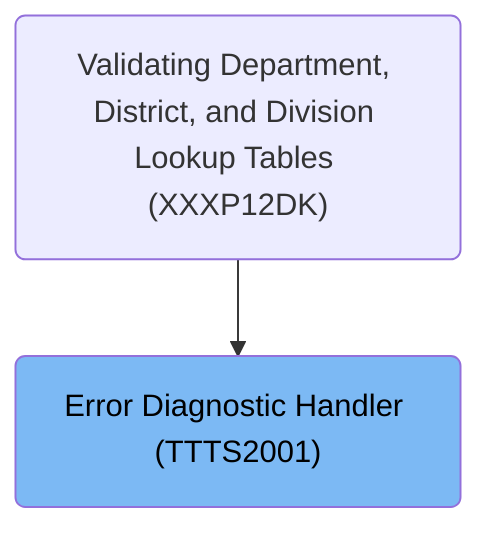

# Overview

This document explains the flow for handling database errors. When a database error occurs, error information is processed by a centralized handler, logged or reported as required, and the system responds appropriately based on the severity of the error.

## Dependencies

### Programs

- TTTS2001 (<SwmPath>[base/src/TTTS2001.cbl](base/src/TTTS2001.cbl)</SwmPath>)
- TTTP2002 (<SwmPath>[base/src/TTTP2002.cbl](base/src/TTTP2002.cbl)</SwmPath>)
- DSNTIAR
- SSSABEND

### Copybooks

- SQLCA
- T01N2001
- TTTN2001 (<SwmPath>[base/src/TTTN2001.cpy](base/src/TTTN2001.cpy)</SwmPath>)

# Where is this program used?

This program is used once, as represented in the following diagram:

&nbsp;

*This is an auto-generated document by Swimm 🌊 and has not yet been verified by a human*

<SwmMeta version="3.0.0" repo-id="Z2l0aHViJTNBJTNBU3dpbW1pby1keW5jYWxsLWRlbW8lM0ElM0FHaXJpLVN3aW1t" repo-name="Swimmio-dyncall-demo">Powered by [Swimm](https://app.swimm.io/)</SwmMeta>
