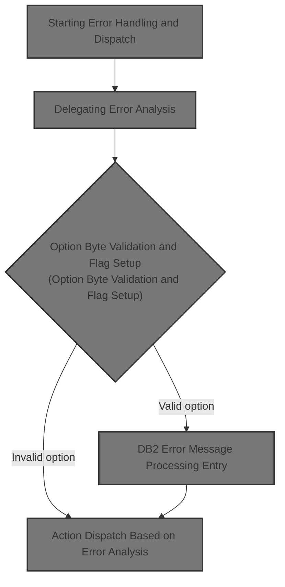
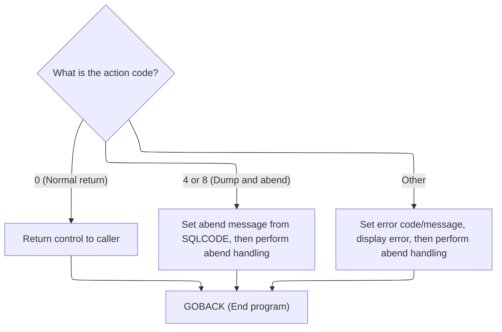

# Overview

This document describes the flow of error handling for SQL and <SwmToken path="base/src/TTTS2001.cbl" pos="50:2:2" line-data="008700                 DB2-ERROR-PROGNAME       DELIMITED BY SIZE">`DB2`</SwmToken> errors. The process analyzes error context, delegates error analysis, processes error messages, and dispatches actions to ensure consistent error diagnosis and reporting.



## Dependencies

### Programs

- <SwmToken path="base/src/TTTS2001.cbl" pos="59:5:5" line-data="009600              DISPLAY &#39;TTTS2001: BAD RETURN CODE FROM TTTP2002:&#39;">`TTTS2001`</SwmToken> (<SwmPath>[base/src/TTTS2001.cbl](base/src/TTTS2001.cbl)</SwmPath>)
- <SwmToken path="base/src/TTTS2001.cbl" pos="59:16:16" line-data="009600              DISPLAY &#39;TTTS2001: BAD RETURN CODE FROM TTTP2002:&#39;">`TTTP2002`</SwmToken> (<SwmPath>[base/src/TTTP2002.cbl](base/src/TTTP2002.cbl)</SwmPath>)
- DSNTIAR
- SSSABEND

### Copybooks

- SQLCA
- <SwmToken path="base/src/TTTP2002.cbl" pos="159:4:4" line-data="018700    COPY T01N2001.">`T01N2001`</SwmToken>
- <SwmToken path="base/src/TTTS2001.cbl" pos="33:4:4" line-data="007000   COPY TTTN2001.">`TTTN2001`</SwmToken> (<SwmPath>[base/src/TTTN2001.cpy](base/src/TTTN2001.cpy)</SwmPath>)

# Where is this program used?

This program is used once, as represented in the following diagram:

```mermaid
graph TD
  18m44("Validating Department, District, and Division Lookup Tables (XXXP12DK)") --> 66uoh("Error Diagnostic Handler (TTTS2001)"):::currentEntity
click 18m44 openCode "base/src/XXXP12DK.cbl:1"
  
  
click 66uoh openCode "base/src/TTTS2001.cbl:1"
    classDef currentEntity color:#000000,fill:#7CB9F4

%% Swimm:
%% graph TD
%%   18m44("Validating Department, District, and Division Lookup Tables (XXXP12DK)") --> 66uoh("Error Diagnostic Handler (<SwmToken path="base/src/TTTS2001.cbl" pos="59:5:5" line-data="009600              DISPLAY &#39;TTTS2001: BAD RETURN CODE FROM TTTP2002:&#39;">`TTTS2001`</SwmToken>)"):::currentEntity
%% click 18m44 openCode "<SwmPath>[base/src/XXXP12DK.cbl](base/src/XXXP12DK.cbl)</SwmPath>:1"
%%   
%%   
%% click 66uoh openCode "<SwmPath>[base/src/TTTS2001.cbl](base/src/TTTS2001.cbl)</SwmPath>:1"
%%     classDef currentEntity color:#000000,fill:#7CB9F4
```



## Detailed View of the Program's Functionality

a. Program Entry and Initial Error Handling

The main program begins execution expecting two key data structures to be provided: one for SQL error information and another for a <SwmToken path="base/src/TTTS2001.cbl" pos="50:2:2" line-data="008700                 DB2-ERROR-PROGNAME       DELIMITED BY SIZE">`DB2`</SwmToken> error message area. The very first action is to delegate error diagnosis and logging to a specialized routine. This is done by invoking a subroutine that will analyze the error context and determine what action should be taken next (such as returning control, performing a dump, or abending the program). The result of this analysis is stored in a dedicated field that will guide the subsequent flow.

b. Delegation to Error Analysis Routine

The error diagnosis routine is called dynamically. It receives the SQL error context and the <SwmToken path="base/src/TTTS2001.cbl" pos="50:2:2" line-data="008700                 DB2-ERROR-PROGNAME       DELIMITED BY SIZE">`DB2`</SwmToken> message area. After the call, the subroutine is explicitly unloaded from memory to free resources. The return code from the error analysis is then captured and stored in a field that represents the action to be taken by the main program.

c. Error Analysis and Logging (<SwmToken path="base/src/TTTS2001.cbl" pos="59:16:16" line-data="009600              DISPLAY &#39;TTTS2001: BAD RETURN CODE FROM TTTP2002:&#39;">`TTTP2002`</SwmToken>)

The error analysis subroutine starts by initializing all internal state related to error handling. This includes resetting flags that track file problems, message processing, and other error conditions. It also resets pointers used for message processing and opens the error log file. If the <SwmToken path="base/src/TTTS2001.cbl" pos="50:2:2" line-data="008700                 DB2-ERROR-PROGNAME       DELIMITED BY SIZE">`DB2`</SwmToken> error program name does not match the expected IMS driver and the error paragraph is blank, it swaps these values to maintain accurate error context.

Next, the subroutine validates an option byte that determines what kind of error handling is requested (such as print, dump, abend, or just return). Depending on the value, it sets flags to control printing, dumping, and abending. If the option byte is invalid, it sets all error flags, constructs an error message, displays it, and logs it.

If printing is requested, the subroutine writes an identifier line to the error log, which may include the program or enclave name. It then attempts to retrieve a formatted <SwmToken path="base/src/TTTS2001.cbl" pos="50:2:2" line-data="008700                 DB2-ERROR-PROGNAME       DELIMITED BY SIZE">`DB2`</SwmToken> error message by calling a system-provided diagnostic routine. The result of this call is checked, and for each possible error code, a specific message is logged and the appropriate flags are set. If the diagnostic routine fails, the subroutine ensures that printing, dumping, and abending are all requested.

If printing is still requested and there were no problems with the diagnostic routine, the subroutine prints each line of the <SwmToken path="base/src/TTTS2001.cbl" pos="50:2:2" line-data="008700                 DB2-ERROR-PROGNAME       DELIMITED BY SIZE">`DB2`</SwmToken> error message to the error log, stopping when a blank line is encountered or after a fixed number of lines.

Finally, the subroutine performs cleanup by closing the error log file and setting the return code based on which error flags are set. Each type of error condition is mapped to a specific return code, allowing the caller to determine what went wrong.

d. Action Dispatch Based on Error Analysis

Back in the main program, the action code set by the error analysis routine is examined. If the code indicates a normal return, control is simply returned to the caller. If the code indicates that a dump and abend are required, the program constructs a detailed abend message including the program name and SQL error code, then calls a routine to perform the abend and dump. If the action code is not recognized, a fixed error code and message are set, a message is displayed to the console, and the abend/dump routine is called. In all cases, the program ends by returning control to the operating system.

e. Supporting Details and Error Logging

Throughout the error analysis and logging process, the subroutine is careful to handle file problems gracefully. If the error log file cannot be opened or written to, messages are routed to the console instead, and the appropriate flags are set to indicate file problems. The subroutine also retrieves information about the running program and environment by traversing system control blocks, which helps provide context in error logs and messages.

f. Summary

The overall flow is designed to robustly handle <SwmToken path="base/src/TTTS2001.cbl" pos="50:2:2" line-data="008700                 DB2-ERROR-PROGNAME       DELIMITED BY SIZE">`DB2`</SwmToken> errors by analyzing the error context, logging detailed diagnostic information, and taking the appropriate action (return, dump, abend) based on both the error and the requested handling mode. The design ensures that even if logging fails, error information is still displayed to the console, and all error conditions are mapped to clear return codes for the caller to interpret.

# Rule Definition

| Paragraph Name                                                                                                                                                                                                                                                                                                                                                                                                                                                                                                                                                                                                                                                                                                                                                                                                                                                                       | Rule ID | Category          | Description                                                                                                                                                                                                                                                                                                                                                                                                                                                                                                                                                                                                                                                                                                                                                                                                                                                                                                                                                                                                                                                                                                                                                                                                                                                                                                                                                                      | Conditions                                                                                                                                                               | Remarks                                                                                                                                                                                                                                                                                                                                                                                                                                                                                                                                                                                                                                                                                                                                                                                                                                                                                                                                                                                               |
| ------------------------------------------------------------------------------------------------------------------------------------------------------------------------------------------------------------------------------------------------------------------------------------------------------------------------------------------------------------------------------------------------------------------------------------------------------------------------------------------------------------------------------------------------------------------------------------------------------------------------------------------------------------------------------------------------------------------------------------------------------------------------------------------------------------------------------------------------------------------------------------ | ------- | ----------------- | -------------------------------------------------------------------------------------------------------------------------------------------------------------------------------------------------------------------------------------------------------------------------------------------------------------------------------------------------------------------------------------------------------------------------------------------------------------------------------------------------------------------------------------------------------------------------------------------------------------------------------------------------------------------------------------------------------------------------------------------------------------------------------------------------------------------------------------------------------------------------------------------------------------------------------------------------------------------------------------------------------------------------------------------------------------------------------------------------------------------------------------------------------------------------------------------------------------------------------------------------------------------------------------------------------------------------------------------------------------------------------- | ------------------------------------------------------------------------------------------------------------------------------------------------------------------------ | ----------------------------------------------------------------------------------------------------------------------------------------------------------------------------------------------------------------------------------------------------------------------------------------------------------------------------------------------------------------------------------------------------------------------------------------------------------------------------------------------------------------------------------------------------------------------------------------------------------------------------------------------------------------------------------------------------------------------------------------------------------------------------------------------------------------------------------------------------------------------------------------------------------------------------------------------------------------------------------------------------- |
| PROCEDURE DIVISION header, <SwmToken path="base/src/TTTP2002.cbl" pos="210:4:6" line-data="023800     PERFORM 100-INITIALIZE">`100-INITIALIZE`</SwmToken>, <SwmToken path="base/src/TTTP2002.cbl" pos="212:4:10" line-data="024000     PERFORM 150-VALIDATE-OPTION-PARM">`150-VALIDATE-OPTION-PARM`</SwmToken>, <SwmToken path="base/src/TTTP2002.cbl" pos="217:4:10" line-data="024500     PERFORM 300-GET-DB2-MESSAGE">`300-GET-DB2-MESSAGE`</SwmToken>                                                                                                                                                                                                                                                                                                                                                                                                                            | RL-001  | Data Assignment   | The program must accept as input the SQLCA structure (with SQLCODE, SQLERRMC, SQLERRML) and the <SwmToken path="base/src/TTTS2001.cbl" pos="37:2:6" line-data="007400                                DB279-MESSAGE-AREA.">`DB279-MESSAGE-AREA`</SwmToken> structure (with up to 10 <SwmToken path="base/src/TTTP2002.cbl" pos="402:4:8" line-data="043000     IF DB2-MESSAGE-LINE(WS-LINE-NO) = SPACES">`DB2-MESSAGE-LINE`</SwmToken>(n), <SwmToken path="base/src/TTTP2002.cbl" pos="324:8:12" line-data="035200         TO ADDRESS OF DB2-MESSAGE-LENGTH">`DB2-MESSAGE-LENGTH`</SwmToken>, <SwmToken path="base/src/TTTP2002.cbl" pos="326:8:12" line-data="035400         TO ADDRESS OF DB2-LINE-LENGTH">`DB2-LINE-LENGTH`</SwmToken>, <SwmToken path="base/src/TTTS2001.cbl" pos="50:2:6" line-data="008700                 DB2-ERROR-PROGNAME       DELIMITED BY SIZE">`DB2-ERROR-PROGNAME`</SwmToken>, <SwmToken path="base/src/TTTP2002.cbl" pos="249:4:8" line-data="027700     AND DB2-ERROR-PARAGRAPH EQUAL SPACES">`DB2-ERROR-PARAGRAPH`</SwmToken>, <SwmToken path="base/src/TTTP2002.cbl" pos="296:4:8" line-data="032400     IF DB2-ERROR-IDENTIFIER EQUAL TO SPACES">`DB2-ERROR-IDENTIFIER`</SwmToken>, <SwmToken path="base/src/TTTP2002.cbl" pos="286:2:6" line-data="031400                  DB2-OPTION-BYTE DELIMITED BY SIZE">`DB2-OPTION-BYTE`</SwmToken>). | Always, at program entry.                                                                                                                                                | SQLCA fields: SQLCODE (number), SQLERRMC (string), SQLERRML (number). <SwmToken path="base/src/TTTS2001.cbl" pos="37:2:6" line-data="007400                                DB279-MESSAGE-AREA.">`DB279-MESSAGE-AREA`</SwmToken>: up to 10 lines, each 80 characters. All fields must be present and correctly mapped.                                                                                                                                                                                                                                                                                                                                                                                                                                                                                                                                                                                                                                                                                 |
| <SwmToken path="base/src/TTTP2002.cbl" pos="212:4:10" line-data="024000     PERFORM 150-VALIDATE-OPTION-PARM">`150-VALIDATE-OPTION-PARM`</SwmToken>                                                                                                                                                                                                                                                                                                                                                                                                                                                                                                                                                                                                                                                                                                                                  | RL-002  | Conditional Logic | The <SwmToken path="base/src/TTTP2002.cbl" pos="286:2:6" line-data="031400                  DB2-OPTION-BYTE DELIMITED BY SIZE">`DB2-OPTION-BYTE`</SwmToken> is checked to determine the requested error handling action. Depending on its value, the program sets flags for print, dump, abend, and sets the return code accordingly. If the option byte is invalid, all error flags are set, an error is logged, and print/dump/abend is forced.                                                                                                                                                                                                                                                                                                                                                                                                                                                                                                                                                                                                                                                                                                                                                                                                                                                                                                                                | On every invocation, after initialization.                                                                                                                               | Valid values for <SwmToken path="base/src/TTTP2002.cbl" pos="286:2:6" line-data="031400                  DB2-OPTION-BYTE DELIMITED BY SIZE">`DB2-OPTION-BYTE`</SwmToken> (symbolic): <SwmToken path="base/src/TTTP2002.cbl" pos="259:6:10" line-data="028700        WHEN DB2-PRINT-DUMP-ABEND">`PRINT-DUMP-ABEND`</SwmToken>, <SwmToken path="base/src/TTTP2002.cbl" pos="264:6:10" line-data="029200        WHEN DB2-PRINT-DUMP-RETURN">`PRINT-DUMP-RETURN`</SwmToken>, <SwmToken path="base/src/TTTP2002.cbl" pos="269:6:8" line-data="029700        WHEN DB2-PRINT-RETURN">`PRINT-RETURN`</SwmToken>, RETURN. If invalid, set all error flags and log error. Return codes: 8 (abend), 4 (dump/return), 0 (print/return or return), 12 (invalid option).                                                                                                                                                                                                                                            |
| <SwmToken path="base/src/TTTP2002.cbl" pos="230:4:6" line-data="025800     PERFORM 500-CLEANUP">`500-CLEANUP`</SwmToken>, <SwmToken path="base/src/TTTP2002.cbl" pos="212:4:10" line-data="024000     PERFORM 150-VALIDATE-OPTION-PARM">`150-VALIDATE-OPTION-PARM`</SwmToken>, <SwmToken path="base/src/TTTP2002.cbl" pos="217:4:10" line-data="024500     PERFORM 300-GET-DB2-MESSAGE">`300-GET-DB2-MESSAGE`</SwmToken>                                                                                                                                                                                                                                                                                                                                                                                                                                                             | RL-003  | Conditional Logic | After error analysis, the program sets error flags and the return code according to the first matching error condition in a defined priority order.                                                                                                                                                                                                                                                                                                                                                                                                                                                                                                                                                                                                                                                                                                                                                                                                                                                                                                                                                                                                                                                                                                                                                                                                                              | After all error analysis and before returning control.                                                                                                                   | Error flag to return code mapping: <SwmToken path="base/src/TTTP2002.cbl" pos="419:4:6" line-data="044700        WHEN INVALID-SQLCODE">`INVALID-SQLCODE`</SwmToken> (24), <SwmToken path="base/src/TTTP2002.cbl" pos="219:12:14" line-data="024700     IF PRINT-REQUESTED AND NO-DSNTIAR-PROBLEMS">`DSNTIAR-PROBLEMS`</SwmToken> (20), <SwmToken path="base/src/TTTP2002.cbl" pos="224:13:15" line-data="025200*       IF BATCH-MODE AND NO-FILE-PROBLEMS">`FILE-PROBLEMS`</SwmToken> (16), <SwmToken path="base/src/TTTP2002.cbl" pos="280:4:6" line-data="030800           SET INVALID-PARM TO TRUE">`INVALID-PARM`</SwmToken> (12), <SwmToken path="base/src/TTTP2002.cbl" pos="262:4:6" line-data="029000           SET ABEND-REQUESTED TO TRUE">`ABEND-REQUESTED`</SwmToken> (8), <SwmToken path="base/src/TTTP2002.cbl" pos="261:4:6" line-data="028900           SET DUMP-REQUESTED TO TRUE">`DUMP-REQUESTED`</SwmToken> (4), else 0. Only the first matching flag determines the return code. |
| <SwmToken path="base/src/TTTP2002.cbl" pos="246:4:10" line-data="027400     PERFORM 600-OPEN-ERROR-FILE">`600-OPEN-ERROR-FILE`</SwmToken>, <SwmToken path="base/src/TTTP2002.cbl" pos="289:4:12" line-data="031700           PERFORM 610-WRITE-TO-DB2ERROR-DD">`610-WRITE-TO-DB2ERROR-DD`</SwmToken>, <SwmToken path="base/src/TTTP2002.cbl" pos="416:4:10" line-data="044400     PERFORM 620-CLOSE-ERROR-FILE">`620-CLOSE-ERROR-FILE`</SwmToken>, <SwmToken path="base/src/TTTP2002.cbl" pos="215:4:8" line-data="024300        PERFORM 200-WRITE-IDENTIFIER">`200-WRITE-IDENTIFIER`</SwmToken>, <SwmToken path="base/src/TTTP2002.cbl" pos="220:4:8" line-data="024800        PERFORM 400-PRINT-MESSAGE">`400-PRINT-MESSAGE`</SwmToken>, <SwmToken path="base/src/TTTP2002.cbl" pos="217:4:10" line-data="024500     PERFORM 300-GET-DB2-MESSAGE">`300-GET-DB2-MESSAGE`</SwmToken> | RL-004  | Computation       | The program writes error log output to the <SwmToken path="base/src/TTTP2002.cbl" pos="289:10:10" line-data="031700           PERFORM 610-WRITE-TO-DB2ERROR-DD">`DB2ERROR`</SwmToken> file, or to the console if the file is missing or cannot be opened. Each log line is exactly 80 characters. Log output includes identifier lines, divider lines, up to 10 <SwmToken path="base/src/TTTS2001.cbl" pos="50:2:2" line-data="008700                 DB2-ERROR-PROGNAME       DELIMITED BY SIZE">`DB2`</SwmToken> message lines, and context such as program name, job type, and warnings.                                                                                                                                                                                                                                                                                                                                                                                                                                                                                                                                                                                                                                                                                                                                                                                      | Whenever an error or message needs to be logged.                                                                                                                         | Log lines: 80 characters, alphanumeric. Formats include: '<SwmToken path="base/src/TTTP2002.cbl" pos="49:5:9" line-data="007700                          VALUE &#39;DB2-ERROR-ID: &#39;.">`DB2-ERROR-ID`</SwmToken>: <identifier>', divider lines, message lines, and specific error messages as described in the spec. If file is missing, log to console instead.                                                                                                                                                                                                                                                                                                                                                                                                                                                                                                                                                                                                                                   |
| Main EVALUATE in <SwmPath>[base/src/TTTS2001.cbl](base/src/TTTS2001.cbl)</SwmPath>, after <SwmToken path="base/src/TTTS2001.cbl" pos="39:4:10" line-data="007600     PERFORM 100-DIAGNOSE-N-PRINT">`100-DIAGNOSE-N-PRINT`</SwmToken>                                                                                                                                                                                                                                                                                                                                                                                                                                                                                                                                                                                                                                                 | RL-005  | Conditional Logic | After error analysis, the program dispatches based on the action code: 0 returns control, 4/8 sets abend message and performs abend handling, other codes set a fixed error code/message and abend.                                                                                                                                                                                                                                                                                                                                                                                                                                                                                                                                                                                                                                                                                                                                                                                                                                                                                                                                                                                                                                                                                                                                                                              | After <SwmToken path="base/src/TTTS2001.cbl" pos="39:4:10" line-data="007600     PERFORM 100-DIAGNOSE-N-PRINT">`100-DIAGNOSE-N-PRINT`</SwmToken> and action code is set. | Action code 0: return; 4/8: abend with message; other: abend with fixed code/message. Abend message includes program name and SQLCODE.                                                                                                                                                                                                                                                                                                                                                                                                                                                                                                                                                                                                                                                                                                                                                                                                                                                                |
| <SwmToken path="base/src/TTTP2002.cbl" pos="210:4:6" line-data="023800     PERFORM 100-INITIALIZE">`100-INITIALIZE`</SwmToken>                                                                                                                                                                                                                                                                                                                                                                                                                                                                                                                                                                                                                                                                                                                                                       | RL-006  | Data Assignment   | Before any error processing, the program resets all error/status flags, message pointers, and opens the error log file.                                                                                                                                                                                                                                                                                                                                                                                                                                                                                                                                                                                                                                                                                                                                                                                                                                                                                                                                                                                                                                                                                                                                                                                                                                                          | At program start, before any error analysis or logging.                                                                                                                  | All flags set to 'no error' state, message pointers set to 1, log file opened.                                                                                                                                                                                                                                                                                                                                                                                                                                                                                                                                                                                                                                                                                                                                                                                                                                                                                                                        |
| <SwmToken path="base/src/TTTP2002.cbl" pos="247:4:10" line-data="027500     PERFORM 900-GET-PROGRAM-INFO">`900-GET-PROGRAM-INFO`</SwmToken>                                                                                                                                                                                                                                                                                                                                                                                                                                                                                                                                                                                                                                                                                                                                          | RL-007  | Computation       | The program retrieves program and job control information from control blocks, and logs a warning if not running under IMS.                                                                                                                                                                                                                                                                                                                                                                                                                                                                                                                                                                                                                                                                                                                                                                                                                                                                                                                                                                                                                                                                                                                                                                                                                                                      | During initialization, after opening error log file.                                                                                                                     | Log warning: '<SwmToken path="base/src/TTTS2001.cbl" pos="59:16:16" line-data="009600              DISPLAY &#39;TTTS2001: BAD RETURN CODE FROM TTTP2002:&#39;">`TTTP2002`</SwmToken>- WARNING: NOT EXECUTING UNDER IMS CONTROL!' if not IMS program. Log program name and job type as context.                                                                                                                                                                                                                                                                                                                                                                                                                                                                                                                                                                                                                                                                                                        |
| <SwmToken path="base/src/TTTP2002.cbl" pos="246:4:10" line-data="027400     PERFORM 600-OPEN-ERROR-FILE">`600-OPEN-ERROR-FILE`</SwmToken>, <SwmToken path="base/src/TTTP2002.cbl" pos="289:4:12" line-data="031700           PERFORM 610-WRITE-TO-DB2ERROR-DD">`610-WRITE-TO-DB2ERROR-DD`</SwmToken>, <SwmToken path="base/src/TTTP2002.cbl" pos="217:4:10" line-data="024500     PERFORM 300-GET-DB2-MESSAGE">`300-GET-DB2-MESSAGE`</SwmToken>, <SwmToken path="base/src/TTTP2002.cbl" pos="212:4:10" line-data="024000     PERFORM 150-VALIDATE-OPTION-PARM">`150-VALIDATE-OPTION-PARM`</SwmToken>                                                                                                                                                                                                                                                                                 | RL-008  | Computation       | For known error conditions (file missing, invalid option byte, DSNTIAR errors, etc.), the program logs specific error messages in defined formats.                                                                                                                                                                                                                                                                                                                                                                                                                                                                                                                                                                                                                                                                                                                                                                                                                                                                                                                                                                                                                                                                                                                                                                                                                               | When a known error condition is detected.                                                                                                                                | Error message formats:                                                                                                                                                                                                                                                                                                                                                                                                                                                                                                                                                                                                                                                                                                                                                                                                                                                                                                                                                                                |

- '<SwmToken path="base/src/TTTS2001.cbl" pos="59:16:16" line-data="009600              DISPLAY &#39;TTTS2001: BAD RETURN CODE FROM TTTP2002:&#39;">`TTTP2002`</SwmToken>- <SwmToken path="base/src/TTTP2002.cbl" pos="289:10:10" line-data="031700           PERFORM 610-WRITE-TO-DB2ERROR-DD">`DB2ERROR`</SwmToken> DD CARD MISSING'
- '<SwmToken path="base/src/TTTS2001.cbl" pos="59:16:16" line-data="009600              DISPLAY &#39;TTTS2001: BAD RETURN CODE FROM TTTP2002:&#39;">`TTTP2002`</SwmToken>- ROUTING OUTPUT TO CONSOLE'
- '<SwmToken path="base/src/TTTS2001.cbl" pos="59:16:16" line-data="009600              DISPLAY &#39;TTTS2001: BAD RETURN CODE FROM TTTP2002:&#39;">`TTTP2002`</SwmToken>- INVALID <SwmToken path="base/src/TTTS2001.cbl" pos="50:2:2" line-data="008700                 DB2-ERROR-PROGNAME       DELIMITED BY SIZE">`DB2`</SwmToken> <SwmToken path="base/src/TTTP2002.cbl" pos="284:12:14" line-data="031200           STRING &#39;TTTP2002- INVALID DB2 OPTION-BYTE PASSED:&#39;">`OPTION-BYTE`</SwmToken> PASSED: <byte value>'
- '<SwmToken path="base/src/TTTS2001.cbl" pos="59:16:16" line-data="009600              DISPLAY &#39;TTTS2001: BAD RETURN CODE FROM TTTP2002:&#39;">`TTTP2002`</SwmToken>- DSNTIAR - MESSAGE AREA OVERFLOW'
- '<SwmToken path="base/src/TTTS2001.cbl" pos="59:16:16" line-data="009600              DISPLAY &#39;TTTS2001: BAD RETURN CODE FROM TTTP2002:&#39;">`TTTP2002`</SwmToken>- BAD RETURN CODE FROM DSNTIAR: <code>' All messages are 80 characters or less. | | <SwmToken path="base/src/TTTP2002.cbl" pos="220:4:8" line-data="024800        PERFORM 400-PRINT-MESSAGE">`400-PRINT-MESSAGE`</SwmToken> | RL-009 | Computation | The program processes and prints up to 10 <SwmToken path="base/src/TTTS2001.cbl" pos="50:2:2" line-data="008700                 DB2-ERROR-PROGNAME       DELIMITED BY SIZE">`DB2`</SwmToken> message lines from the error message area, stopping if a blank line (all spaces) is encountered. | When print is requested and there are no DSNTIAR problems. | Each message line is 80 characters. Maximum 10 lines. Stop processing if a line is blank (all spaces). |

# User Stories

## User Story 1: Initialization and Input Acceptance

---

### Story Description:

As a system, I want to initialize all error handling state and accept SQLCA and <SwmToken path="base/src/TTTS2001.cbl" pos="37:2:6" line-data="007400                                DB279-MESSAGE-AREA.">`DB279-MESSAGE-AREA`</SwmToken> structures as input so that error processing can begin with a clean state and all required data is available.

---

### Business Rule Mapping:

| Rule ID | Paragraph Name                                                                                                                                                                                                                                                                                                                                                                                                                                            | Rule Description                                                                                                                                                                                                                                                                                                                                                                                                                                                                                                                                                                                                                                                                                                                                                                                                                                                                                                                                                                                                                                                                                                                                                                                                                                                                                                                                                                 |
| ------- | --------------------------------------------------------------------------------------------------------------------------------------------------------------------------------------------------------------------------------------------------------------------------------------------------------------------------------------------------------------------------------------------------------------------------------------------------------- | -------------------------------------------------------------------------------------------------------------------------------------------------------------------------------------------------------------------------------------------------------------------------------------------------------------------------------------------------------------------------------------------------------------------------------------------------------------------------------------------------------------------------------------------------------------------------------------------------------------------------------------------------------------------------------------------------------------------------------------------------------------------------------------------------------------------------------------------------------------------------------------------------------------------------------------------------------------------------------------------------------------------------------------------------------------------------------------------------------------------------------------------------------------------------------------------------------------------------------------------------------------------------------------------------------------------------------------------------------------------------------- |
| RL-006  | <SwmToken path="base/src/TTTP2002.cbl" pos="210:4:6" line-data="023800     PERFORM 100-INITIALIZE">`100-INITIALIZE`</SwmToken>                                                                                                                                                                                                                                                                                                                            | Before any error processing, the program resets all error/status flags, message pointers, and opens the error log file.                                                                                                                                                                                                                                                                                                                                                                                                                                                                                                                                                                                                                                                                                                                                                                                                                                                                                                                                                                                                                                                                                                                                                                                                                                                          |
| RL-001  | PROCEDURE DIVISION header, <SwmToken path="base/src/TTTP2002.cbl" pos="210:4:6" line-data="023800     PERFORM 100-INITIALIZE">`100-INITIALIZE`</SwmToken>, <SwmToken path="base/src/TTTP2002.cbl" pos="212:4:10" line-data="024000     PERFORM 150-VALIDATE-OPTION-PARM">`150-VALIDATE-OPTION-PARM`</SwmToken>, <SwmToken path="base/src/TTTP2002.cbl" pos="217:4:10" line-data="024500     PERFORM 300-GET-DB2-MESSAGE">`300-GET-DB2-MESSAGE`</SwmToken> | The program must accept as input the SQLCA structure (with SQLCODE, SQLERRMC, SQLERRML) and the <SwmToken path="base/src/TTTS2001.cbl" pos="37:2:6" line-data="007400                                DB279-MESSAGE-AREA.">`DB279-MESSAGE-AREA`</SwmToken> structure (with up to 10 <SwmToken path="base/src/TTTP2002.cbl" pos="402:4:8" line-data="043000     IF DB2-MESSAGE-LINE(WS-LINE-NO) = SPACES">`DB2-MESSAGE-LINE`</SwmToken>(n), <SwmToken path="base/src/TTTP2002.cbl" pos="324:8:12" line-data="035200         TO ADDRESS OF DB2-MESSAGE-LENGTH">`DB2-MESSAGE-LENGTH`</SwmToken>, <SwmToken path="base/src/TTTP2002.cbl" pos="326:8:12" line-data="035400         TO ADDRESS OF DB2-LINE-LENGTH">`DB2-LINE-LENGTH`</SwmToken>, <SwmToken path="base/src/TTTS2001.cbl" pos="50:2:6" line-data="008700                 DB2-ERROR-PROGNAME       DELIMITED BY SIZE">`DB2-ERROR-PROGNAME`</SwmToken>, <SwmToken path="base/src/TTTP2002.cbl" pos="249:4:8" line-data="027700     AND DB2-ERROR-PARAGRAPH EQUAL SPACES">`DB2-ERROR-PARAGRAPH`</SwmToken>, <SwmToken path="base/src/TTTP2002.cbl" pos="296:4:8" line-data="032400     IF DB2-ERROR-IDENTIFIER EQUAL TO SPACES">`DB2-ERROR-IDENTIFIER`</SwmToken>, <SwmToken path="base/src/TTTP2002.cbl" pos="286:2:6" line-data="031400                  DB2-OPTION-BYTE DELIMITED BY SIZE">`DB2-OPTION-BYTE`</SwmToken>). |

---

### Relevant Functionality:

- <SwmToken path="base/src/TTTP2002.cbl" pos="210:4:6" line-data="023800     PERFORM 100-INITIALIZE">`100-INITIALIZE`</SwmToken>
  1. **RL-006:**
     - Set all error/status flags to 'no error' state
     - Set message pointers to 1
     - Open error log file
     - Retrieve program/job info
- **PROCEDURE DIVISION header**
  1. **RL-001:**
     - Accept SQLCA and <SwmToken path="base/src/TTTS2001.cbl" pos="37:2:6" line-data="007400                                DB279-MESSAGE-AREA.">`DB279-MESSAGE-AREA`</SwmToken> as parameters to PROCEDURE DIVISION
     - Reference fields as needed for error analysis and logging
     - Use <SwmToken path="base/src/TTTP2002.cbl" pos="402:4:8" line-data="043000     IF DB2-MESSAGE-LINE(WS-LINE-NO) = SPACES">`DB2-MESSAGE-LINE`</SwmToken>(n) for up to 10 lines of error message output

## User Story 2: Error Analysis and Action Dispatch

---

### Story Description:

As a system, I want to analyze the error context, set error flags and return codes, and dispatch actions based on the <SwmToken path="base/src/TTTP2002.cbl" pos="286:2:6" line-data="031400                  DB2-OPTION-BYTE DELIMITED BY SIZE">`DB2-OPTION-BYTE`</SwmToken> and error state so that errors are handled according to business rules and the correct action is taken (print, dump, abend, or return).

---

### Business Rule Mapping:

| Rule ID | Paragraph Name                                                                                                                                                                                                                                                                                                                                                                                                           | Rule Description                                                                                                                                                                                                                                                                                                                                                                                                                                  |
| ------- | ------------------------------------------------------------------------------------------------------------------------------------------------------------------------------------------------------------------------------------------------------------------------------------------------------------------------------------------------------------------------------------------------------------------------ | ------------------------------------------------------------------------------------------------------------------------------------------------------------------------------------------------------------------------------------------------------------------------------------------------------------------------------------------------------------------------------------------------------------------------------------------------- |
| RL-002  | <SwmToken path="base/src/TTTP2002.cbl" pos="212:4:10" line-data="024000     PERFORM 150-VALIDATE-OPTION-PARM">`150-VALIDATE-OPTION-PARM`</SwmToken>                                                                                                                                                                                                                                                                      | The <SwmToken path="base/src/TTTP2002.cbl" pos="286:2:6" line-data="031400                  DB2-OPTION-BYTE DELIMITED BY SIZE">`DB2-OPTION-BYTE`</SwmToken> is checked to determine the requested error handling action. Depending on its value, the program sets flags for print, dump, abend, and sets the return code accordingly. If the option byte is invalid, all error flags are set, an error is logged, and print/dump/abend is forced. |
| RL-003  | <SwmToken path="base/src/TTTP2002.cbl" pos="230:4:6" line-data="025800     PERFORM 500-CLEANUP">`500-CLEANUP`</SwmToken>, <SwmToken path="base/src/TTTP2002.cbl" pos="212:4:10" line-data="024000     PERFORM 150-VALIDATE-OPTION-PARM">`150-VALIDATE-OPTION-PARM`</SwmToken>, <SwmToken path="base/src/TTTP2002.cbl" pos="217:4:10" line-data="024500     PERFORM 300-GET-DB2-MESSAGE">`300-GET-DB2-MESSAGE`</SwmToken> | After error analysis, the program sets error flags and the return code according to the first matching error condition in a defined priority order.                                                                                                                                                                                                                                                                                               |
| RL-005  | Main EVALUATE in <SwmPath>[base/src/TTTS2001.cbl](base/src/TTTS2001.cbl)</SwmPath>, after <SwmToken path="base/src/TTTS2001.cbl" pos="39:4:10" line-data="007600     PERFORM 100-DIAGNOSE-N-PRINT">`100-DIAGNOSE-N-PRINT`</SwmToken>                                                                                                                                                                                     | After error analysis, the program dispatches based on the action code: 0 returns control, 4/8 sets abend message and performs abend handling, other codes set a fixed error code/message and abend.                                                                                                                                                                                                                                               |

---

### Relevant Functionality:

- <SwmToken path="base/src/TTTP2002.cbl" pos="212:4:10" line-data="024000     PERFORM 150-VALIDATE-OPTION-PARM">`150-VALIDATE-OPTION-PARM`</SwmToken>
  1. **RL-002:**
     - EVALUATE <SwmToken path="base/src/TTTP2002.cbl" pos="286:2:6" line-data="031400                  DB2-OPTION-BYTE DELIMITED BY SIZE">`DB2-OPTION-BYTE`</SwmToken>
       - WHEN <SwmToken path="base/src/TTTP2002.cbl" pos="259:6:10" line-data="028700        WHEN DB2-PRINT-DUMP-ABEND">`PRINT-DUMP-ABEND`</SwmToken>: set <SwmToken path="base/src/TTTP2002.cbl" pos="214:4:6" line-data="024200     IF PRINT-REQUESTED">`PRINT-REQUESTED`</SwmToken>, <SwmToken path="base/src/TTTP2002.cbl" pos="261:4:6" line-data="028900           SET DUMP-REQUESTED TO TRUE">`DUMP-REQUESTED`</SwmToken>, <SwmToken path="base/src/TTTP2002.cbl" pos="262:4:6" line-data="029000           SET ABEND-REQUESTED TO TRUE">`ABEND-REQUESTED`</SwmToken>; return code 8
       - WHEN <SwmToken path="base/src/TTTP2002.cbl" pos="264:6:10" line-data="029200        WHEN DB2-PRINT-DUMP-RETURN">`PRINT-DUMP-RETURN`</SwmToken>: set <SwmToken path="base/src/TTTP2002.cbl" pos="214:4:6" line-data="024200     IF PRINT-REQUESTED">`PRINT-REQUESTED`</SwmToken>, <SwmToken path="base/src/TTTP2002.cbl" pos="261:4:6" line-data="028900           SET DUMP-REQUESTED TO TRUE">`DUMP-REQUESTED`</SwmToken>, <SwmToken path="base/src/TTTP2002.cbl" pos="267:4:8" line-data="029500           SET NO-ABEND-REQUESTED TO TRUE">`NO-ABEND-REQUESTED`</SwmToken>; return code 4
       - WHEN <SwmToken path="base/src/TTTP2002.cbl" pos="269:6:8" line-data="029700        WHEN DB2-PRINT-RETURN">`PRINT-RETURN`</SwmToken>: set <SwmToken path="base/src/TTTP2002.cbl" pos="214:4:6" line-data="024200     IF PRINT-REQUESTED">`PRINT-REQUESTED`</SwmToken>, <SwmToken path="base/src/TTTP2002.cbl" pos="271:4:8" line-data="029900           SET NO-DUMP-REQUESTED TO TRUE">`NO-DUMP-REQUESTED`</SwmToken>, <SwmToken path="base/src/TTTP2002.cbl" pos="267:4:8" line-data="029500           SET NO-ABEND-REQUESTED TO TRUE">`NO-ABEND-REQUESTED`</SwmToken>; return code 0
       - WHEN RETURN: set <SwmToken path="base/src/TTTP2002.cbl" pos="275:4:8" line-data="030300           SET NO-PRINT-REQUESTED TO TRUE">`NO-PRINT-REQUESTED`</SwmToken>, <SwmToken path="base/src/TTTP2002.cbl" pos="271:4:8" line-data="029900           SET NO-DUMP-REQUESTED TO TRUE">`NO-DUMP-REQUESTED`</SwmToken>, <SwmToken path="base/src/TTTP2002.cbl" pos="267:4:8" line-data="029500           SET NO-ABEND-REQUESTED TO TRUE">`NO-ABEND-REQUESTED`</SwmToken>; return code 0
       - WHEN OTHER: set <SwmToken path="base/src/TTTP2002.cbl" pos="280:4:6" line-data="030800           SET INVALID-PARM TO TRUE">`INVALID-PARM`</SwmToken>, <SwmToken path="base/src/TTTP2002.cbl" pos="214:4:6" line-data="024200     IF PRINT-REQUESTED">`PRINT-REQUESTED`</SwmToken>, <SwmToken path="base/src/TTTP2002.cbl" pos="261:4:6" line-data="028900           SET DUMP-REQUESTED TO TRUE">`DUMP-REQUESTED`</SwmToken>, <SwmToken path="base/src/TTTP2002.cbl" pos="262:4:6" line-data="029000           SET ABEND-REQUESTED TO TRUE">`ABEND-REQUESTED`</SwmToken>; log error; return code 12
- <SwmToken path="base/src/TTTP2002.cbl" pos="230:4:6" line-data="025800     PERFORM 500-CLEANUP">`500-CLEANUP`</SwmToken>
  1. **RL-003:**
     - In <SwmToken path="base/src/TTTP2002.cbl" pos="230:4:6" line-data="025800     PERFORM 500-CLEANUP">`500-CLEANUP`</SwmToken>, EVALUATE error flags in priority order:
       - WHEN <SwmToken path="base/src/TTTP2002.cbl" pos="419:4:6" line-data="044700        WHEN INVALID-SQLCODE">`INVALID-SQLCODE`</SwmToken>: set return code 24
       - WHEN <SwmToken path="base/src/TTTP2002.cbl" pos="219:12:14" line-data="024700     IF PRINT-REQUESTED AND NO-DSNTIAR-PROBLEMS">`DSNTIAR-PROBLEMS`</SwmToken>: set return code 20
       - WHEN <SwmToken path="base/src/TTTP2002.cbl" pos="224:13:15" line-data="025200*       IF BATCH-MODE AND NO-FILE-PROBLEMS">`FILE-PROBLEMS`</SwmToken>: set return code 16
       - WHEN <SwmToken path="base/src/TTTP2002.cbl" pos="280:4:6" line-data="030800           SET INVALID-PARM TO TRUE">`INVALID-PARM`</SwmToken>: set return code 12
       - WHEN <SwmToken path="base/src/TTTP2002.cbl" pos="262:4:6" line-data="029000           SET ABEND-REQUESTED TO TRUE">`ABEND-REQUESTED`</SwmToken>: set return code 8
       - WHEN <SwmToken path="base/src/TTTP2002.cbl" pos="261:4:6" line-data="028900           SET DUMP-REQUESTED TO TRUE">`DUMP-REQUESTED`</SwmToken>: set return code 4
       - WHEN OTHER: set return code 0
- **Main EVALUATE in** <SwmPath>[base/src/TTTS2001.cbl](base/src/TTTS2001.cbl)</SwmPath>
  1. **RL-005:**
     - EVALUATE action code
       - WHEN 0: CONTINUE (return)
       - WHEN 4 or 8: Build abend message with program name and SQLCODE, call abend routine
       - WHEN OTHER: Set fixed abend code/message, display to console, call abend routine

## User Story 3: Error Logging, Message Formatting, and Context Output

---

### Story Description:

As a user, I want error messages, context, and program/job information to be logged to the <SwmToken path="base/src/TTTP2002.cbl" pos="289:10:10" line-data="031700           PERFORM 610-WRITE-TO-DB2ERROR-DD">`DB2ERROR`</SwmToken> file or console in a consistent format, including up to 10 <SwmToken path="base/src/TTTS2001.cbl" pos="50:2:2" line-data="008700                 DB2-ERROR-PROGNAME       DELIMITED BY SIZE">`DB2`</SwmToken> message lines and specific error messages for known conditions, so that error information is available for diagnosis and auditing.

---

### Business Rule Mapping:

| Rule ID | Paragraph Name                                                                                                                                                                                                                                                                                                                                                                                                                                                                                                                                                                                                                                                                                                                                                                                                                                                                       | Rule Description                                                                                                                                                                                                                                                                                                                                                                                                                                                                                                                                                                            |
| ------- | ------------------------------------------------------------------------------------------------------------------------------------------------------------------------------------------------------------------------------------------------------------------------------------------------------------------------------------------------------------------------------------------------------------------------------------------------------------------------------------------------------------------------------------------------------------------------------------------------------------------------------------------------------------------------------------------------------------------------------------------------------------------------------------------------------------------------------------------------------------------------------------ | ------------------------------------------------------------------------------------------------------------------------------------------------------------------------------------------------------------------------------------------------------------------------------------------------------------------------------------------------------------------------------------------------------------------------------------------------------------------------------------------------------------------------------------------------------------------------------------------- |
| RL-004  | <SwmToken path="base/src/TTTP2002.cbl" pos="246:4:10" line-data="027400     PERFORM 600-OPEN-ERROR-FILE">`600-OPEN-ERROR-FILE`</SwmToken>, <SwmToken path="base/src/TTTP2002.cbl" pos="289:4:12" line-data="031700           PERFORM 610-WRITE-TO-DB2ERROR-DD">`610-WRITE-TO-DB2ERROR-DD`</SwmToken>, <SwmToken path="base/src/TTTP2002.cbl" pos="416:4:10" line-data="044400     PERFORM 620-CLOSE-ERROR-FILE">`620-CLOSE-ERROR-FILE`</SwmToken>, <SwmToken path="base/src/TTTP2002.cbl" pos="215:4:8" line-data="024300        PERFORM 200-WRITE-IDENTIFIER">`200-WRITE-IDENTIFIER`</SwmToken>, <SwmToken path="base/src/TTTP2002.cbl" pos="220:4:8" line-data="024800        PERFORM 400-PRINT-MESSAGE">`400-PRINT-MESSAGE`</SwmToken>, <SwmToken path="base/src/TTTP2002.cbl" pos="217:4:10" line-data="024500     PERFORM 300-GET-DB2-MESSAGE">`300-GET-DB2-MESSAGE`</SwmToken> | The program writes error log output to the <SwmToken path="base/src/TTTP2002.cbl" pos="289:10:10" line-data="031700           PERFORM 610-WRITE-TO-DB2ERROR-DD">`DB2ERROR`</SwmToken> file, or to the console if the file is missing or cannot be opened. Each log line is exactly 80 characters. Log output includes identifier lines, divider lines, up to 10 <SwmToken path="base/src/TTTS2001.cbl" pos="50:2:2" line-data="008700                 DB2-ERROR-PROGNAME       DELIMITED BY SIZE">`DB2`</SwmToken> message lines, and context such as program name, job type, and warnings. |
| RL-008  | <SwmToken path="base/src/TTTP2002.cbl" pos="246:4:10" line-data="027400     PERFORM 600-OPEN-ERROR-FILE">`600-OPEN-ERROR-FILE`</SwmToken>, <SwmToken path="base/src/TTTP2002.cbl" pos="289:4:12" line-data="031700           PERFORM 610-WRITE-TO-DB2ERROR-DD">`610-WRITE-TO-DB2ERROR-DD`</SwmToken>, <SwmToken path="base/src/TTTP2002.cbl" pos="217:4:10" line-data="024500     PERFORM 300-GET-DB2-MESSAGE">`300-GET-DB2-MESSAGE`</SwmToken>, <SwmToken path="base/src/TTTP2002.cbl" pos="212:4:10" line-data="024000     PERFORM 150-VALIDATE-OPTION-PARM">`150-VALIDATE-OPTION-PARM`</SwmToken>                                                                                                                                                                                                                                                                                 | For known error conditions (file missing, invalid option byte, DSNTIAR errors, etc.), the program logs specific error messages in defined formats.                                                                                                                                                                                                                                                                                                                                                                                                                                          |
| RL-007  | <SwmToken path="base/src/TTTP2002.cbl" pos="247:4:10" line-data="027500     PERFORM 900-GET-PROGRAM-INFO">`900-GET-PROGRAM-INFO`</SwmToken>                                                                                                                                                                                                                                                                                                                                                                                                                                                                                                                                                                                                                                                                                                                                          | The program retrieves program and job control information from control blocks, and logs a warning if not running under IMS.                                                                                                                                                                                                                                                                                                                                                                                                                                                                 |
| RL-009  | <SwmToken path="base/src/TTTP2002.cbl" pos="220:4:8" line-data="024800        PERFORM 400-PRINT-MESSAGE">`400-PRINT-MESSAGE`</SwmToken>                                                                                                                                                                                                                                                                                                                                                                                                                                                                                                                                                                                                                                                                                                                                              | The program processes and prints up to 10 <SwmToken path="base/src/TTTS2001.cbl" pos="50:2:2" line-data="008700                 DB2-ERROR-PROGNAME       DELIMITED BY SIZE">`DB2`</SwmToken> message lines from the error message area, stopping if a blank line (all spaces) is encountered.                                                                                                                                                                                                                                                                                               |

---

### Relevant Functionality:

- <SwmToken path="base/src/TTTP2002.cbl" pos="246:4:10" line-data="027400     PERFORM 600-OPEN-ERROR-FILE">`600-OPEN-ERROR-FILE`</SwmToken>
  1. **RL-004:**
     - Attempt to open <SwmToken path="base/src/TTTP2002.cbl" pos="289:10:10" line-data="031700           PERFORM 610-WRITE-TO-DB2ERROR-DD">`DB2ERROR`</SwmToken> file
     - If open succeeds, write each log line (80 chars) to file
     - If open fails, log error to console and set <SwmToken path="base/src/TTTP2002.cbl" pos="224:13:15" line-data="025200*       IF BATCH-MODE AND NO-FILE-PROBLEMS">`FILE-PROBLEMS`</SwmToken> flag
     - For each message to log:
       - Format line to 80 characters
       - Write to file or console as appropriate
  2. **RL-008:**
     - On file open failure, log '<SwmToken path="base/src/TTTP2002.cbl" pos="289:10:10" line-data="031700           PERFORM 610-WRITE-TO-DB2ERROR-DD">`DB2ERROR`</SwmToken> DD CARD MISSING' and 'ROUTING OUTPUT TO CONSOLE'
     - On invalid option byte, log 'INVALID <SwmToken path="base/src/TTTS2001.cbl" pos="50:2:2" line-data="008700                 DB2-ERROR-PROGNAME       DELIMITED BY SIZE">`DB2`</SwmToken> <SwmToken path="base/src/TTTP2002.cbl" pos="284:12:14" line-data="031200           STRING &#39;TTTP2002- INVALID DB2 OPTION-BYTE PASSED:&#39;">`OPTION-BYTE`</SwmToken> PASSED: <byte>'
     - On DSNTIAR errors, log appropriate message
     - On bad return code, log 'BAD RETURN CODE FROM DSNTIAR: <code>'
- <SwmToken path="base/src/TTTP2002.cbl" pos="247:4:10" line-data="027500     PERFORM 900-GET-PROGRAM-INFO">`900-GET-PROGRAM-INFO`</SwmToken>
  1. **RL-007:**
     - Retrieve program/job info from control blocks
     - If not IMS program, log warning and program/job info
- <SwmToken path="base/src/TTTP2002.cbl" pos="220:4:8" line-data="024800        PERFORM 400-PRINT-MESSAGE">`400-PRINT-MESSAGE`</SwmToken>
  1. **RL-009:**
     - For each message line number from 1 to 10:
       - If the current message line is blank (all spaces), stop processing further lines
       - Otherwise, copy the message line to the output buffer and write it to the error log or console

# Workflow

# Starting Error Handling and Dispatch

This section initiates the error handling process by analyzing the incoming SQL error context and dispatching the appropriate action. It ensures that all error handling begins with a standardized diagnostic step, setting up the necessary action codes and error messages for consistent downstream processing.

| Category        | Rule Name                   | Description                                                                                                                                                            |
| --------------- | --------------------------- | ---------------------------------------------------------------------------------------------------------------------------------------------------------------------- |
| Data validation | Mandatory Diagnostic Step   | The diagnostic routine must always be called first to analyze the error and set the action code before any further error handling decisions are made.                  |
| Business logic  | Return Control to Caller    | If the action code is set to 0, control must be returned to the caller without abending or dumping.                                                                    |
| Business logic  | Critical Error Termination  | If the action code is set to 4 or 8, the program must perform a dump and abend, indicating a critical error that requires immediate termination and diagnostic output. |
| Business logic  | Comprehensive Error Logging | Error messages must be constructed using the provided SQL error context and program identifiers, and must be logged or displayed for all error cases.                  |

<SwmSnippet path="/base/src/TTTS2001.cbl" line="36">

---

In `PROCEDURE-DIVISION`, this is where the flow kicks off. It expects SQLCA and <SwmToken path="base/src/TTTS2001.cbl" pos="37:2:6" line-data="007400                                DB279-MESSAGE-AREA.">`DB279-MESSAGE-AREA`</SwmToken> to be set up with things like SQLCODE and <SwmToken path="base/src/TTTS2001.cbl" pos="50:2:6" line-data="008700                 DB2-ERROR-PROGNAME       DELIMITED BY SIZE">`DB2-ERROR-PROGNAME`</SwmToken>. The first thing it does is call <SwmToken path="base/src/TTTS2001.cbl" pos="39:4:10" line-data="007600     PERFORM 100-DIAGNOSE-N-PRINT">`100-DIAGNOSE-N-PRINT`</SwmToken>, which is needed to analyze the error and set up the action code (<SwmToken path="base/src/TTTS2001.cbl" pos="77:10:14" line-data="011400     MOVE RETURN-CODE TO WS-ACTION-CODE">`WS-ACTION-CODE`</SwmToken>). Without this, the rest of the logic wouldn't know what to do next—whether to just return, abend, or handle some other error case.

```cobol
007300 PROCEDURE DIVISION      USING  SQLCA
007400                                DB279-MESSAGE-AREA.
007500
007600     PERFORM 100-DIAGNOSE-N-PRINT
```

---

</SwmSnippet>

## Delegating Error Analysis

This section is responsible for delegating error analysis to a specialized routine and ensuring the main program receives a clear action code based on the analysis outcome.

| Category       | Rule Name                  | Description                                                                                                                                           |
| -------------- | -------------------------- | ----------------------------------------------------------------------------------------------------------------------------------------------------- |
| Business logic | Centralized error handling | All error analysis must be delegated to the external error handling routine, ensuring consistent error processing across the system.                  |
| Business logic | Action code propagation    | The action code returned from the error handling routine must be captured and made available to the main program flow for subsequent decision-making. |

<SwmSnippet path="/base/src/TTTS2001.cbl" line="73">

---

<SwmToken path="base/src/TTTS2001.cbl" pos="73:2:8" line-data="011000 100-DIAGNOSE-N-PRINT.">`100-DIAGNOSE-N-PRINT`</SwmToken> just hands off the error handling to <SwmToken path="base/src/TTTS2001.cbl" pos="74:4:4" line-data="011100     CALL TTTP2002      USING  SQLCA">`TTTP2002`</SwmToken> by calling it with the error context. After <SwmToken path="base/src/TTTS2001.cbl" pos="74:4:4" line-data="011100     CALL TTTP2002      USING  SQLCA">`TTTP2002`</SwmToken> does its thing, the return code is moved into <SwmToken path="base/src/TTTS2001.cbl" pos="77:10:14" line-data="011400     MOVE RETURN-CODE TO WS-ACTION-CODE">`WS-ACTION-CODE`</SwmToken> so the main flow knows what action to take. Canceling <SwmToken path="base/src/TTTS2001.cbl" pos="74:4:4" line-data="011100     CALL TTTP2002      USING  SQLCA">`TTTP2002`</SwmToken> after the call just frees up resources.

```cobol
011000 100-DIAGNOSE-N-PRINT.
011100     CALL TTTP2002      USING  SQLCA
011200                               DB279-MESSAGE-AREA
011300     CANCEL TTTP2002
011400     MOVE RETURN-CODE TO WS-ACTION-CODE
011500     .
```

---

</SwmSnippet>

## <SwmToken path="base/src/TTTS2001.cbl" pos="50:2:2" line-data="008700                 DB2-ERROR-PROGNAME       DELIMITED BY SIZE">`DB2`</SwmToken> Error Message Processing Entry

This section governs the processing and optional printing of <SwmToken path="base/src/TTTS2001.cbl" pos="50:2:2" line-data="008700                 DB2-ERROR-PROGNAME       DELIMITED BY SIZE">`DB2`</SwmToken> error messages, ensuring that error handling is correctly initialized, input parameters are validated, and outputs are only generated when appropriate flags are set. It ensures robust error message handling and reporting for downstream consumers or logs.

| Category        | Rule Name                     | Description                                                                                                                                                                                                                                                                                                                                                                                                                                                                                                                                                                                                           |
| --------------- | ----------------------------- | --------------------------------------------------------------------------------------------------------------------------------------------------------------------------------------------------------------------------------------------------------------------------------------------------------------------------------------------------------------------------------------------------------------------------------------------------------------------------------------------------------------------------------------------------------------------------------------------------------------------- |
| Data validation | Option parameter validation   | The option parameter must be validated before any <SwmToken path="base/src/TTTS2001.cbl" pos="50:2:2" line-data="008700                 DB2-ERROR-PROGNAME       DELIMITED BY SIZE">`DB2`</SwmToken> message processing or output occurs. If the parameter is invalid, further processing must not proceed.                                                                                                                                                                                                                                                                                                           |
| Business logic  | Mandatory initialization      | The system must always initialize error handling state and logging before any other processing occurs, to ensure all subsequent actions are based on a known and valid state.                                                                                                                                                                                                                                                                                                                                                                                                                                         |
| Business logic  | Conditional identifier output | If printing is requested (<SwmToken path="base/src/TTTP2002.cbl" pos="214:4:6" line-data="024200     IF PRINT-REQUESTED">`PRINT-REQUESTED`</SwmToken> is true), the system must output the relevant identifier information before retrieving and printing the <SwmToken path="base/src/TTTS2001.cbl" pos="50:2:2" line-data="008700                 DB2-ERROR-PROGNAME       DELIMITED BY SIZE">`DB2`</SwmToken> error message.                                                                                                                                                                                       |
| Business logic  | Mandatory message retrieval   | The system must retrieve the <SwmToken path="base/src/TTTS2001.cbl" pos="50:2:2" line-data="008700                 DB2-ERROR-PROGNAME       DELIMITED BY SIZE">`DB2`</SwmToken> error message for processing, regardless of whether printing is requested, to ensure error information is available for all downstream logic.                                                                                                                                                                                                                                                                                         |
| Business logic  | Conditional message printing  | If printing is requested and there are no DSNTIAR problems (<SwmToken path="base/src/TTTP2002.cbl" pos="219:10:14" line-data="024700     IF PRINT-REQUESTED AND NO-DSNTIAR-PROBLEMS">`NO-DSNTIAR-PROBLEMS`</SwmToken> is true), the system must print each line of the <SwmToken path="base/src/TTTS2001.cbl" pos="50:2:2" line-data="008700                 DB2-ERROR-PROGNAME       DELIMITED BY SIZE">`DB2`</SwmToken> error message until a blank line is found (<SwmToken path="base/src/TTTP2002.cbl" pos="222:4:8" line-data="025000           UNTIL BLANK-LINE-FOUND">`BLANK-LINE-FOUND`</SwmToken> is true). |
| Business logic  | Mandatory cleanup             | After all processing, the system must perform cleanup to reset state and close any resources used during error handling and message processing.                                                                                                                                                                                                                                                                                                                                                                                                                                                                       |

<SwmSnippet path="/base/src/TTTP2002.cbl" line="198">

---

In <SwmToken path="base/src/TTTP2002.cbl" pos="198:2:4" line-data="022600 PROCEDURE DIVISION    USING   SQLCA">`PROCEDURE DIVISION`</SwmToken> of <SwmToken path="base/src/TTTS2001.cbl" pos="59:16:16" line-data="009600              DISPLAY &#39;TTTS2001: BAD RETURN CODE FROM TTTP2002:&#39;">`TTTP2002`</SwmToken>, we start by initializing all the error handling state, validating the option byte, and then, depending on flags, writing identifiers, getting the <SwmToken path="base/src/TTTP2002.cbl" pos="199:2:2" line-data="022700                               DB2-MESSAGE-AREA">`DB2`</SwmToken> message, printing lines, and finally cleaning up. Each PERFORM just breaks out a chunk of work. Initialization is always first because everything else depends on the state it sets up.

```cobol
022600 PROCEDURE DIVISION    USING   SQLCA
022700                               DB2-MESSAGE-AREA
022800********************************************* 2003/06/09 - PGLB - COMNT
022900* REPLACED QWIK-REF PARMS WITH DUMMY PARMS
023000*                              QW-LOOKUP-MSG
023100*                              QW-RESULT-MSG.
023200                               DUMMY-PARM1
023300                               DUMMY-PARM2.
023400********************************************* 2003/06/09 - PGLB - COMNT
023500
023600
023700
023800     PERFORM 100-INITIALIZE
023900
024000     PERFORM 150-VALIDATE-OPTION-PARM
024100
024200     IF PRINT-REQUESTED
024300        PERFORM 200-WRITE-IDENTIFIER
024400
024500     PERFORM 300-GET-DB2-MESSAGE
024600
024700     IF PRINT-REQUESTED AND NO-DSNTIAR-PROBLEMS
024800        PERFORM 400-PRINT-MESSAGE
024900           VARYING WS-LINE-NO FROM 1 BY 1
025000           UNTIL BLANK-LINE-FOUND
025100********************************************* 2003/06/09 - PGLB - COMNT
025200*       IF BATCH-MODE AND NO-FILE-PROBLEMS
025300*          PERFORM 700-PRINT-QWIKREF-INFO
025400*       END-IF
025500********************************************* 2003/06/09 - PGLB - END
025600     END-IF
025700
025800     PERFORM 500-CLEANUP
025900
026000     GOBACK
026100     .
026200
026300 100-INITIALIZE.
```

---

</SwmSnippet>

### Error State and Context Setup

```mermaid
%%{init: {"flowchart": {"defaultRenderer": "elk"}} }%%
flowchart TD
    node1["Set all error/status flags to 'no problems' (NO-FILE-PROBLEMS, BLANK-LINE-NOT-FOUND, REASON-CODE-NOT-FOUND, NO-QWIKREF-PROBLEMS, NO-DSNTIAR-PROBLEMS, VALID-SQLCODE) and initialize message pointers (WS-MESSAGE-INDEX, WS-SQLERRMC-PTR)"] --> node2["Open error output file for logging"]
    click node1 openCode "base/src/TTTP2002.cbl:237:244"
    node2 --> node3["Get program and job control information"]
    click node2 openCode "base/src/TTTP2002.cbl:246:246"
    node3 --> node4{"Is DB2 error program name different from IMS driver and error paragraph blank?"}
    click node3 openCode "base/src/TTTP2002.cbl:247:247"
    node4 -->|"Yes"| node5["Update error tracking variables"]
    click node4 openCode "base/src/TTTP2002.cbl:248:251"
    node4 -->|"No"| node6["Initialization complete"]
    node5 --> node6
    click node5 openCode "base/src/TTTP2002.cbl:250:251"
    click node6 openCode "base/src/TTTP2002.cbl:253:253"

classDef HeadingStyle fill:#777777,stroke:#333,stroke-width:2px;

%% Swimm:
%% %%{init: {"flowchart": {"defaultRenderer": "elk"}} }%%
%% flowchart TD
%%     node1["Set all error/status flags to 'no problems' (<SwmToken path="base/src/TTTP2002.cbl" pos="224:11:15" line-data="025200*       IF BATCH-MODE AND NO-FILE-PROBLEMS">`NO-FILE-PROBLEMS`</SwmToken>, <SwmToken path="base/src/TTTP2002.cbl" pos="238:4:10" line-data="026600     SET BLANK-LINE-NOT-FOUND TO TRUE">`BLANK-LINE-NOT-FOUND`</SwmToken>, <SwmToken path="base/src/TTTP2002.cbl" pos="239:4:10" line-data="026700     SET REASON-CODE-NOT-FOUND TO TRUE">`REASON-CODE-NOT-FOUND`</SwmToken>, <SwmToken path="base/src/TTTP2002.cbl" pos="240:4:8" line-data="026800     SET NO-QWIKREF-PROBLEMS TO TRUE">`NO-QWIKREF-PROBLEMS`</SwmToken>, <SwmToken path="base/src/TTTP2002.cbl" pos="219:10:14" line-data="024700     IF PRINT-REQUESTED AND NO-DSNTIAR-PROBLEMS">`NO-DSNTIAR-PROBLEMS`</SwmToken>, <SwmToken path="base/src/TTTP2002.cbl" pos="242:4:6" line-data="027000     SET VALID-SQLCODE TO TRUE">`VALID-SQLCODE`</SwmToken>) and initialize message pointers (<SwmToken path="base/src/TTTP2002.cbl" pos="243:8:12" line-data="027100     MOVE 1 TO WS-MESSAGE-INDEX">`WS-MESSAGE-INDEX`</SwmToken>, <SwmToken path="base/src/TTTP2002.cbl" pos="244:8:12" line-data="027200     MOVE 1 TO WS-SQLERRMC-PTR">`WS-SQLERRMC-PTR`</SwmToken>)"] --> node2["Open error output file for logging"]
%%     click node1 openCode "<SwmPath>[base/src/TTTP2002.cbl](base/src/TTTP2002.cbl)</SwmPath>:237:244"
%%     node2 --> node3["Get program and job control information"]
%%     click node2 openCode "<SwmPath>[base/src/TTTP2002.cbl](base/src/TTTP2002.cbl)</SwmPath>:246:246"
%%     node3 --> node4{"Is <SwmToken path="base/src/TTTS2001.cbl" pos="50:2:2" line-data="008700                 DB2-ERROR-PROGNAME       DELIMITED BY SIZE">`DB2`</SwmToken> error program name different from IMS driver and error paragraph blank?"}
%%     click node3 openCode "<SwmPath>[base/src/TTTP2002.cbl](base/src/TTTP2002.cbl)</SwmPath>:247:247"
%%     node4 -->|"Yes"| node5["Update error tracking variables"]
%%     click node4 openCode "<SwmPath>[base/src/TTTP2002.cbl](base/src/TTTP2002.cbl)</SwmPath>:248:251"
%%     node4 -->|"No"| node6["Initialization complete"]
%%     node5 --> node6
%%     click node5 openCode "<SwmPath>[base/src/TTTP2002.cbl](base/src/TTTP2002.cbl)</SwmPath>:250:251"
%%     click node6 openCode "<SwmPath>[base/src/TTTP2002.cbl](base/src/TTTP2002.cbl)</SwmPath>:253:253"
%% 
%% classDef HeadingStyle fill:#777777,stroke:#333,stroke-width:2px;
```



The main product role of this section is to establish a clean and consistent error handling environment at program startup. This includes setting all error-related flags to their default states, preparing error message pointers, ensuring error output can be logged, and capturing relevant program/job information for accurate error tracking and reporting.

| Category       | Rule Name                | Description                                                                                                                                                                                                                                                                                                                                                                                                                                                                                                                                                                                                                                                                                                                                                                                                                                                                                                                                                                                                         |
| -------------- | ------------------------ | ------------------------------------------------------------------------------------------------------------------------------------------------------------------------------------------------------------------------------------------------------------------------------------------------------------------------------------------------------------------------------------------------------------------------------------------------------------------------------------------------------------------------------------------------------------------------------------------------------------------------------------------------------------------------------------------------------------------------------------------------------------------------------------------------------------------------------------------------------------------------------------------------------------------------------------------------------------------------------------------------------------------- |
| Business logic | Default error state      | All error and status flags must be set to their default 'no problems' values at initialization. This includes <SwmToken path="base/src/TTTP2002.cbl" pos="224:11:15" line-data="025200*       IF BATCH-MODE AND NO-FILE-PROBLEMS">`NO-FILE-PROBLEMS`</SwmToken>, <SwmToken path="base/src/TTTP2002.cbl" pos="238:4:10" line-data="026600     SET BLANK-LINE-NOT-FOUND TO TRUE">`BLANK-LINE-NOT-FOUND`</SwmToken>, <SwmToken path="base/src/TTTP2002.cbl" pos="239:4:10" line-data="026700     SET REASON-CODE-NOT-FOUND TO TRUE">`REASON-CODE-NOT-FOUND`</SwmToken>, <SwmToken path="base/src/TTTP2002.cbl" pos="240:4:8" line-data="026800     SET NO-QWIKREF-PROBLEMS TO TRUE">`NO-QWIKREF-PROBLEMS`</SwmToken>, <SwmToken path="base/src/TTTP2002.cbl" pos="219:10:14" line-data="024700     IF PRINT-REQUESTED AND NO-DSNTIAR-PROBLEMS">`NO-DSNTIAR-PROBLEMS`</SwmToken>, and <SwmToken path="base/src/TTTP2002.cbl" pos="242:4:6" line-data="027000     SET VALID-SQLCODE TO TRUE">`VALID-SQLCODE`</SwmToken>. |
| Business logic | Reset message pointers   | Message pointers (<SwmToken path="base/src/TTTP2002.cbl" pos="243:8:12" line-data="027100     MOVE 1 TO WS-MESSAGE-INDEX">`WS-MESSAGE-INDEX`</SwmToken> and <SwmToken path="base/src/TTTP2002.cbl" pos="244:8:12" line-data="027200     MOVE 1 TO WS-SQLERRMC-PTR">`WS-SQLERRMC-PTR`</SwmToken>) must be reset to 1 at initialization to ensure error messages are tracked from the start of processing.                                                                                                                                                                                                                                                                                                                                                                                                                                                                                                                                                                                                            |
| Business logic | Program context capture  | Program and job control information must be retrieved at initialization to provide context for error reporting. If the program is not running under IMS, a warning must be logged and displayed.                                                                                                                                                                                                                                                                                                                                                                                                                                                                                                                                                                                                                                                                                                                                                                                                                    |
| Business logic | Error context correction | If the <SwmToken path="base/src/TTTS2001.cbl" pos="50:2:2" line-data="008700                 DB2-ERROR-PROGNAME       DELIMITED BY SIZE">`DB2`</SwmToken> error program name does not match the IMS driver and the error paragraph is blank, the program name and paragraph must be swapped to maintain correct error context.                                                                                                                                                                                                                                                                                                                                                                                                                                                                                                                                                                                                                                                                                      |

<SwmSnippet path="/base/src/TTTP2002.cbl" line="235">

---

<SwmToken path="base/src/TTTP2002.cbl" pos="235:2:4" line-data="026300 100-INITIALIZE.">`100-INITIALIZE`</SwmToken> sets all the error state flags to their default (no problems), resets message pointers, opens the error log file, and grabs program info. If the <SwmToken path="base/src/TTTP2002.cbl" pos="248:4:4" line-data="027600     IF DB2-ERROR-PROGNAME NOT EQUAL WS-IMS-DRIVER">`DB2`</SwmToken> error program name doesn't match the IMS driver and the error paragraph is blank, it swaps them to keep error context straight. This setup is needed for the rest of the error handling to work.

```cobol
026300 100-INITIALIZE.
026400
026500     SET NO-FILE-PROBLEMS TO TRUE
026600     SET BLANK-LINE-NOT-FOUND TO TRUE
026700     SET REASON-CODE-NOT-FOUND TO TRUE
026800     SET NO-QWIKREF-PROBLEMS TO TRUE
026900     SET NO-DSNTIAR-PROBLEMS TO TRUE
027000     SET VALID-SQLCODE TO TRUE
027100     MOVE 1 TO WS-MESSAGE-INDEX
027200     MOVE 1 TO WS-SQLERRMC-PTR
027300*    MOVE SPACES TO QW-RESULT-MSG
027400     PERFORM 600-OPEN-ERROR-FILE
027500     PERFORM 900-GET-PROGRAM-INFO
027600     IF DB2-ERROR-PROGNAME NOT EQUAL WS-IMS-DRIVER
027700     AND DB2-ERROR-PARAGRAPH EQUAL SPACES
027800        MOVE DB2-ERROR-PROGNAME TO DB2-ERROR-PARAGRAPH
027900        MOVE WS-IMS-DRIVER TO DB2-ERROR-PROGNAME
028000     END-IF
028100     .
```

---

</SwmSnippet>

<SwmSnippet path="/base/src/TTTP2002.cbl" line="436">

---

<SwmToken path="base/src/TTTP2002.cbl" pos="436:2:8" line-data="046400 600-OPEN-ERROR-FILE.">`600-OPEN-ERROR-FILE`</SwmToken> tries to open the error log. If the file is missing (status '96'), it displays a message and switches output to the console. Any other bad status also triggers console output and sets the file problem flag. This way, error reporting doesn't break if the file isn't there.

```cobol
046400 600-OPEN-ERROR-FILE.
046500
046600     MOVE SPACES TO WS-MESSAGE-LINE
046700
046800     OPEN OUTPUT ERROR-OUTPUT-FILE
046900
047000     EVALUATE TRUE
047100       WHEN GOOD-FILE-STATUS
047200          CONTINUE
047300       WHEN DB2ERROR-DD-MISSING
047400          DISPLAY 'TTTP2002- DB2ERROR DD CARD MISSING'
047500             UPON CONSOLE
047600          DISPLAY 'TTTP2002- ROUTING OUTPUT TO CONSOLE'
047700             UPON CONSOLE
047800          SET FILE-PROBLEMS TO TRUE
047900       WHEN OTHER
048000          DISPLAY 'TTTP2002- BAD FILE STATUS ON DB2ERROR OPEN: '
048100             WS-FILE-STATUS UPON CONSOLE
048200          DISPLAY 'TTTP2002- ROUTING OUTPUT TO CONSOLE'
048300             UPON CONSOLE
048400          SET FILE-PROBLEMS TO TRUE
048500     END-EVALUATE
048600     .
```

---

</SwmSnippet>

<SwmSnippet path="/base/src/TTTP2002.cbl" line="663">

---

<SwmToken path="base/src/TTTP2002.cbl" pos="663:2:8" line-data="069100 900-GET-PROGRAM-INFO.">`900-GET-PROGRAM-INFO`</SwmToken> walks through system control blocks using fixed offsets to get the job step program name, job type, and IMS driver. If the program isn't running under IMS, it logs a warning and writes messages to the error log and console. This helps track down environment issues.

```cobol
069100 900-GET-PROGRAM-INFO.
069200
069300*    PSA (PREFIXED SAVE AREA) STARTS AT ADDRESS ZERO
069400     SET ADDRESS OF PSA-CONTROL-BLOCK   TO  NULL
069500
069600*    PSA  OFFSET 540 POINTS TO TCB (TASK CONTROL BLOCK)
069700     SET ADDRESS OF TCB-CONTROL-BLOCK   TO  TCB-PTR
069800
069900*    TCB  OFFSET 0   POINTS TO RB (REQUEST BLOCK)
070000     SET ADDRESS OF RB-CONTROL-BLOCK    TO  RB-PTR
070100
070200*    TCB  OFFSET 180 POINTS TO JSCB (JOB/STEP CONTROL BLOCK)
070300     SET ADDRESS OF JSCB-CONTROL-BLOCK  TO  JSCB-PTR
070400
070500*    JSCB OFFSET 316 POINTS TO SSIB (SUBSYSTEM IDENTIFICATION BLOCK)
070600     SET ADDRESS OF SSIB-CONTROL-BLOCK  TO  SSIB-PTR
070700
070800*    JSCB OFFSET 360 CONTAINS JOB STEP PROGRAM NAME
070900     MOVE STEP-PROGNAME TO WS-STEP-PROGNAME
071000
071100*    SSIB OFFSET 12  CONTAINS JOB/STC ID
071200     MOVE JOB-TYPE TO WS-JOB-PREFIX
071300
071400*    RB   OFFSET 96  CONTAINS EXTENDED SAVE AREA INFO, OF WHICH
071500*                    THE FIRST 8 BYTES IS THE FIRST PROGRAM
071600*                    CALLED USING MVS "LINK" TYPE CALL
071700     MOVE LINK-PROGNAME TO WS-IMS-DRIVER
071800
071900     IF NOT IMS-PROGRAM
072000        MOVE 'TTTP2002- WARNING: NOT EXECUTING UNDER IMS CONTROL!'
072100             TO WS-MESSAGE-LINE
072200        DISPLAY WS-MESSAGE-LINE
072300                 UPON CONSOLE
072400        PERFORM 610-WRITE-TO-DB2ERROR-DD
072500        STRING 'TTTP2002- EXECUTING PROGRAM: ' DELIMITED BY SIZE
072600               WS-STEP-PROGNAME                DELIMITED BY SIZE
072700               INTO WS-MESSAGE-LINE
072800        DISPLAY WS-MESSAGE-LINE
072900                 UPON CONSOLE
073000        PERFORM 610-WRITE-TO-DB2ERROR-DD
073100     END-IF
073200     .
```

---

</SwmSnippet>

### Option Byte Validation and Flag Setup

```mermaid
%%{init: {"flowchart": {"defaultRenderer": "elk"}} }%%
flowchart TD
    node1["Start: Process DB2 message request"] --> node2["Validate DB2 option and set actions"]
    click node1 openCode "base/src/TTTP2002.cbl:22600:22600"
    click node2 openCode "base/src/TTTP2002.cbl:28300:29200"
    node2 --> node3{"Print requested?"}
    click node3 openCode "base/src/TTTP2002.cbl:24200:24200"
    node3 -->|"Yes"| node4["Print identifier"]
    click node4 openCode "base/src/TTTP2002.cbl:24300:24300"
    node3 -->|"No"| node5["Retrieve DB2 message"]
    click node5 openCode "base/src/TTTP2002.cbl:34900:42600"
    node4 --> node5
    node5 --> node6{"Print requested AND No DSNTIAR problems?"}
    click node6 openCode "base/src/TTTP2002.cbl:24700:25600"
    node6 -->|"Yes"| node7["Start printing DB2 message lines"]
    click node7 openCode "base/src/TTTP2002.cbl:42800:44000"
    node6 -->|"No"| node10["Set final return code based on error flags"]
    subgraph loop1["For each DB2 message line until blank line found"]
        node7 --> node8{"Is line blank?"}
        click node8 openCode "base/src/TTTP2002.cbl:43000:43800"
        node8 -->|"No"| node9["Print message line"]
        click node9 openCode "base/src/TTTP2002.cbl:43300:43500"
        node9 --> node7
        node8 -->|"Yes"| node10["Set final return code based on error flags"]
    end
    click node10 openCode "base/src/TTTP2002.cbl:44200:46200"

classDef HeadingStyle fill:#777777,stroke:#333,stroke-width:2px;

%% Swimm:
%% %%{init: {"flowchart": {"defaultRenderer": "elk"}} }%%
%% flowchart TD
%%     node1["Start: Process <SwmToken path="base/src/TTTS2001.cbl" pos="50:2:2" line-data="008700                 DB2-ERROR-PROGNAME       DELIMITED BY SIZE">`DB2`</SwmToken> message request"] --> node2["Validate <SwmToken path="base/src/TTTS2001.cbl" pos="50:2:2" line-data="008700                 DB2-ERROR-PROGNAME       DELIMITED BY SIZE">`DB2`</SwmToken> option and set actions"]
%%     click node1 openCode "<SwmPath>[base/src/TTTP2002.cbl](base/src/TTTP2002.cbl)</SwmPath>:22600:22600"
%%     click node2 openCode "<SwmPath>[base/src/TTTP2002.cbl](base/src/TTTP2002.cbl)</SwmPath>:28300:29200"
%%     node2 --> node3{"Print requested?"}
%%     click node3 openCode "<SwmPath>[base/src/TTTP2002.cbl](base/src/TTTP2002.cbl)</SwmPath>:24200:24200"
%%     node3 -->|"Yes"| node4["Print identifier"]
%%     click node4 openCode "<SwmPath>[base/src/TTTP2002.cbl](base/src/TTTP2002.cbl)</SwmPath>:24300:24300"
%%     node3 -->|"No"| node5["Retrieve <SwmToken path="base/src/TTTS2001.cbl" pos="50:2:2" line-data="008700                 DB2-ERROR-PROGNAME       DELIMITED BY SIZE">`DB2`</SwmToken> message"]
%%     click node5 openCode "<SwmPath>[base/src/TTTP2002.cbl](base/src/TTTP2002.cbl)</SwmPath>:34900:42600"
%%     node4 --> node5
%%     node5 --> node6{"Print requested AND No DSNTIAR problems?"}
%%     click node6 openCode "<SwmPath>[base/src/TTTP2002.cbl](base/src/TTTP2002.cbl)</SwmPath>:24700:25600"
%%     node6 -->|"Yes"| node7["Start printing <SwmToken path="base/src/TTTS2001.cbl" pos="50:2:2" line-data="008700                 DB2-ERROR-PROGNAME       DELIMITED BY SIZE">`DB2`</SwmToken> message lines"]
%%     click node7 openCode "<SwmPath>[base/src/TTTP2002.cbl](base/src/TTTP2002.cbl)</SwmPath>:42800:44000"
%%     node6 -->|"No"| node10["Set final return code based on error flags"]
%%     subgraph loop1["For each <SwmToken path="base/src/TTTS2001.cbl" pos="50:2:2" line-data="008700                 DB2-ERROR-PROGNAME       DELIMITED BY SIZE">`DB2`</SwmToken> message line until blank line found"]
%%         node7 --> node8{"Is line blank?"}
%%         click node8 openCode "<SwmPath>[base/src/TTTP2002.cbl](base/src/TTTP2002.cbl)</SwmPath>:43000:43800"
%%         node8 -->|"No"| node9["Print message line"]
%%         click node9 openCode "<SwmPath>[base/src/TTTP2002.cbl](base/src/TTTP2002.cbl)</SwmPath>:43300:43500"
%%         node9 --> node7
%%         node8 -->|"Yes"| node10["Set final return code based on error flags"]
%%     end
%%     click node10 openCode "<SwmPath>[base/src/TTTP2002.cbl](base/src/TTTP2002.cbl)</SwmPath>:44200:46200"
%% 
%% classDef HeadingStyle fill:#777777,stroke:#333,stroke-width:2px;
```



<SwmSnippet path="/base/src/TTTP2002.cbl" line="255">

---

<SwmToken path="base/src/TTTP2002.cbl" pos="255:2:8" line-data="028300 150-VALIDATE-OPTION-PARM.">`150-VALIDATE-OPTION-PARM`</SwmToken> checks the <SwmToken path="base/src/TTTP2002.cbl" pos="286:2:6" line-data="031400                  DB2-OPTION-BYTE DELIMITED BY SIZE">`DB2-OPTION-BYTE`</SwmToken> and sets the right flags for print, dump, and abend. If the value is invalid, it sets all the error flags, builds an error message with the bad value, displays it, and logs it. This makes sure invalid options can't slip by unnoticed.

```cobol
028300 150-VALIDATE-OPTION-PARM.
028400
028500     EVALUATE TRUE
028600
028700        WHEN DB2-PRINT-DUMP-ABEND
028800           SET PRINT-REQUESTED TO TRUE
028900           SET DUMP-REQUESTED TO TRUE
029000           SET ABEND-REQUESTED TO TRUE
029100
029200        WHEN DB2-PRINT-DUMP-RETURN
029300           SET PRINT-REQUESTED TO TRUE
029400           SET DUMP-REQUESTED TO TRUE
029500           SET NO-ABEND-REQUESTED TO TRUE
029600
029700        WHEN DB2-PRINT-RETURN
029800           SET PRINT-REQUESTED TO TRUE
029900           SET NO-DUMP-REQUESTED TO TRUE
030000           SET NO-ABEND-REQUESTED TO TRUE
030100
030200        WHEN DB2-RETURN
030300           SET NO-PRINT-REQUESTED TO TRUE
030400           SET NO-DUMP-REQUESTED TO TRUE
030500           SET NO-ABEND-REQUESTED TO TRUE
030600
030700        WHEN OTHER
030800           SET INVALID-PARM TO TRUE
030900           SET PRINT-REQUESTED TO TRUE
031000           SET DUMP-REQUESTED TO TRUE
031100           SET ABEND-REQUESTED TO TRUE
031200           STRING 'TTTP2002- INVALID DB2 OPTION-BYTE PASSED:'
031300                                            DELIMITED BY SIZE
031400                  DB2-OPTION-BYTE DELIMITED BY SIZE
031500             INTO WS-MESSAGE-LINE
031600           DISPLAY WS-MESSAGE-LINE UPON CONSOLE
031700           PERFORM 610-WRITE-TO-DB2ERROR-DD
031800
031900     END-EVALUATE
032000     .
```

---

</SwmSnippet>

<SwmSnippet path="/base/src/TTTP2002.cbl" line="321">

---

<SwmToken path="base/src/TTTP2002.cbl" pos="321:2:8" line-data="034900 300-GET-DB2-MESSAGE.">`300-GET-DB2-MESSAGE`</SwmToken> sets up pointers for the <SwmToken path="base/src/TTTP2002.cbl" pos="321:6:6" line-data="034900 300-GET-DB2-MESSAGE.">`DB2`</SwmToken> diagnostic routine, calls <SwmToken path="base/src/TTTP2002.cbl" pos="328:4:6" line-data="035600     CALL WS-DSNTIAR  USING  SQLCA">`WS-DSNTIAR`</SwmToken> to get the error message, and then checks the return code. For each known error code, it logs a specific message and sets flags if things went wrong. If the return code is bad, it makes sure the rest of the program knows to print, dump, and abend as needed.

```cobol
034900 300-GET-DB2-MESSAGE.
035000
035100     SET ADDRESS OF DSNTIAR-MESSAGE-PTR
035200         TO ADDRESS OF DB2-MESSAGE-LENGTH
035300     SET ADDRESS OF DSNTIAR-LRECL-PTR
035400         TO ADDRESS OF DB2-LINE-LENGTH
035500
035600     CALL WS-DSNTIAR  USING  SQLCA
035700                             DSNTIAR-MESSAGE-PTR
035800                             DSNTIAR-LRECL-PTR
035900************ MADE COBOL II COMPLIANT FOR TELON - 2003/06/23 - PGLB
036000******* ON EXCEPTION
036100*******    SET DSNTIAR-PROBLEMS TO TRUE
036200*******    MOVE 'TTTP2002- EXCEPTION LOADING DSNTIAR MODULE!!'
036300*******      TO WS-MESSAGE-LINE
036400*******    DISPLAY WS-MESSAGE-LINE UPON CONSOLE
036500*******    PERFORM 610-WRITE-TO-DB2ERROR-DD
036600******* NOT ON EXCEPTION
036700           CANCEL WS-DSNTIAR
036800**** END-CALL
036900************ MADE COBOL II COMPLIANT FOR TELON - 2003/06/23 - PGLB
037000
037100     IF NO-DSNTIAR-PROBLEMS
037200        EVALUATE RETURN-CODE
037300           WHEN 0
037400              CONTINUE
037500           WHEN 4
037600              MOVE 'TTTP2002- DSNTIAR - MESSAGE AREA OVERFLOW'
037700                TO WS-MESSAGE-LINE
037800              DISPLAY WS-MESSAGE-LINE UPON CONSOLE
037900              PERFORM 610-WRITE-TO-DB2ERROR-DD
038000           WHEN 8
038100              MOVE 'TTTP2002- DSNTIAR - LRECL OUT OF RANGE'
038200                TO WS-MESSAGE-LINE
038300              DISPLAY WS-MESSAGE-LINE UPON CONSOLE
038400              PERFORM 610-WRITE-TO-DB2ERROR-DD
038500           WHEN 12
038600              MOVE 'TTTP2002- DSNTIAR - TEXT AREA TOO SMALL'
038700                TO WS-MESSAGE-LINE
038800              DISPLAY WS-MESSAGE-LINE UPON CONSOLE
038900              PERFORM 610-WRITE-TO-DB2ERROR-DD
039000           WHEN 16
039100              MOVE 'TTTP2002- INTERNAL ERROR IN DSNTIAR ROUTINE!'
039200                TO WS-MESSAGE-LINE
039300              DISPLAY WS-MESSAGE-LINE UPON CONSOLE
039400              PERFORM 610-WRITE-TO-DB2ERROR-DD
039500           WHEN 20
039600              MOVE 'TTTP2002- DSNTIAR COULD NOT LOAD DSNTIA1!!'
039700                TO WS-MESSAGE-LINE
039800              DISPLAY WS-MESSAGE-LINE UPON CONSOLE
039900              PERFORM 610-WRITE-TO-DB2ERROR-DD
040000           WHEN 24
040100              MOVE 'TTTP2002- INVALID SQLCA PASSED TO DSNTIAR!!'
040200                TO WS-MESSAGE-LINE
040300              DISPLAY WS-MESSAGE-LINE UPON CONSOLE
040400              PERFORM 610-WRITE-TO-DB2ERROR-DD
040500              MOVE 'SQLCA:' TO WS-MESSAGE-LINE
040600              PERFORM 610-WRITE-TO-DB2ERROR-DD
040700              MOVE SQLCA TO WS-MESSAGE-LINE
040800              PERFORM 610-WRITE-TO-DB2ERROR-DD
040900           WHEN OTHER
041000              MOVE RETURN-CODE TO WS-DISP-RC
041100              STRING 'TTTP2002- BAD RETURN CODE FROM DSNTIAR: '
041200                                              DELIMITED BY SIZE
041300                     WS-DISP-RC               DELIMITED BY SIZE
041400                INTO WS-MESSAGE-LINE
041500              DISPLAY WS-MESSAGE-LINE UPON CONSOLE
041600              PERFORM 610-WRITE-TO-DB2ERROR-DD
041700        END-EVALUATE
041800        IF RETURN-CODE > 4
041900           SET DSNTIAR-PROBLEMS TO TRUE
042000           SET INVALID-PARM TO TRUE
042100           SET PRINT-REQUESTED TO TRUE
042200           SET DUMP-REQUESTED TO TRUE
042300           SET ABEND-REQUESTED TO TRUE
042400        END-IF
042500     END-IF
042600     .
```

---

</SwmSnippet>

<SwmSnippet path="/base/src/TTTP2002.cbl" line="400">

---

<SwmToken path="base/src/TTTP2002.cbl" pos="400:2:6" line-data="042800 400-PRINT-MESSAGE.">`400-PRINT-MESSAGE`</SwmToken> checks if the current message line is blank. If so, it sets the blank line flag and stops. Otherwise, it writes the line to the error log, and if it's line 10, it also stops. This keeps error output from running too long.

```cobol
042800 400-PRINT-MESSAGE.
042900
043000     IF DB2-MESSAGE-LINE(WS-LINE-NO) = SPACES
043100        THEN SET BLANK-LINE-FOUND TO TRUE
043200        ELSE
043300           MOVE DB2-MESSAGE-LINE(WS-LINE-NO)
043400              TO WS-MESSAGE-LINE
043500           PERFORM 610-WRITE-TO-DB2ERROR-DD
043600           IF WS-LINE-NO = 10
043700              THEN SET BLANK-LINE-FOUND TO TRUE
043800           END-IF
043900     END-IF
044000     .
```

---

</SwmSnippet>

<SwmSnippet path="/base/src/TTTP2002.cbl" line="414">

---

<SwmToken path="base/src/TTTP2002.cbl" pos="414:2:4" line-data="044200 500-CLEANUP.">`500-CLEANUP`</SwmToken> closes the error log and then sets the return code based on which error flags are set. Each error type gets its own code, so the caller can tell what went wrong. The order matters—first match wins.

```cobol
044200 500-CLEANUP.
044300
044400     PERFORM 620-CLOSE-ERROR-FILE
044500
044600     EVALUATE TRUE
044700        WHEN INVALID-SQLCODE
044800           MOVE 24 TO RETURN-CODE
044900        WHEN DSNTIAR-PROBLEMS
045000           MOVE 20 TO RETURN-CODE
045100        WHEN FILE-PROBLEMS
045200           MOVE 16 TO RETURN-CODE
045300        WHEN INVALID-PARM
045400           MOVE 12 TO RETURN-CODE
045500        WHEN ABEND-REQUESTED
045600           MOVE 8  TO RETURN-CODE
045700        WHEN DUMP-REQUESTED
045800           MOVE 4  TO RETURN-CODE
045900        WHEN OTHER
046000           MOVE 0  TO RETURN-CODE
046100     END-EVALUATE
046200     .
```

---

</SwmSnippet>

<SwmSnippet path="/base/src/TTTP2002.cbl" line="198">

---

We just returned from <SwmToken path="base/src/TTTS2001.cbl" pos="59:16:16" line-data="009600              DISPLAY &#39;TTTS2001: BAD RETURN CODE FROM TTTP2002:&#39;">`TTTP2002`</SwmToken>. All the error analysis, logging, and cleanup are done there. Now, <SwmToken path="base/src/TTTS2001.cbl" pos="59:5:5" line-data="009600              DISPLAY &#39;TTTS2001: BAD RETURN CODE FROM TTTP2002:&#39;">`TTTS2001`</SwmToken> uses the return code from <SwmToken path="base/src/TTTS2001.cbl" pos="59:16:16" line-data="009600              DISPLAY &#39;TTTS2001: BAD RETURN CODE FROM TTTP2002:&#39;">`TTTP2002`</SwmToken> to decide what to do next—continue, abend, or handle another error.

```cobol
022600 PROCEDURE DIVISION    USING   SQLCA
022700                               DB2-MESSAGE-AREA
022800********************************************* 2003/06/09 - PGLB - COMNT
022900* REPLACED QWIK-REF PARMS WITH DUMMY PARMS
023000*                              QW-LOOKUP-MSG
023100*                              QW-RESULT-MSG.
023200                               DUMMY-PARM1
023300                               DUMMY-PARM2.
023400********************************************* 2003/06/09 - PGLB - COMNT
023500
023600
023700
023800     PERFORM 100-INITIALIZE
023900
024000     PERFORM 150-VALIDATE-OPTION-PARM
024100
024200     IF PRINT-REQUESTED
024300        PERFORM 200-WRITE-IDENTIFIER
024400
024500     PERFORM 300-GET-DB2-MESSAGE
024600
024700     IF PRINT-REQUESTED AND NO-DSNTIAR-PROBLEMS
024800        PERFORM 400-PRINT-MESSAGE
024900           VARYING WS-LINE-NO FROM 1 BY 1
025000           UNTIL BLANK-LINE-FOUND
025100********************************************* 2003/06/09 - PGLB - COMNT
025200*       IF BATCH-MODE AND NO-FILE-PROBLEMS
025300*          PERFORM 700-PRINT-QWIKREF-INFO
025400*       END-IF
025500********************************************* 2003/06/09 - PGLB - END
025600     END-IF
025700
025800     PERFORM 500-CLEANUP
025900
026000     GOBACK
026100     .
026200
026300 100-INITIALIZE.
```

---

</SwmSnippet>

## Action Dispatch Based on Error Analysis



<SwmSnippet path="/base/src/TTTS2001.cbl" line="41">

---

We just returned from <SwmToken path="base/src/TTTS2001.cbl" pos="39:4:10" line-data="007600     PERFORM 100-DIAGNOSE-N-PRINT">`100-DIAGNOSE-N-PRINT`</SwmToken>. Now, in PROCEDURE-DIVISION, the EVALUATE statement checks the action code to decide if we just continue, abend, or handle something unexpected. The action code is set by the error analysis we just did.

```cobol
007800     EVALUATE TRUE
007900
008000        WHEN  RETURN-CONTROL-TO-CALLER
008100              CONTINUE
```

---

</SwmSnippet>

<SwmSnippet path="/base/src/TTTS2001.cbl" line="46">

---

If the action code says to abend, we move SQLCODE to a display variable, build a detailed error message with the program name and SQLCODE, and then call the abend dump routine. This gives a clear error context for debugging.

```cobol
008300        WHEN  DUMP-N-ABEND
008400              MOVE SQLCODE TO WS-SQLCODE-DISP
008500              STRING
008600                 'ABEND FROM '
008700                 DB2-ERROR-PROGNAME       DELIMITED BY SIZE
008800                 ' - DB2 ERROR SQLCODE: ' DELIMITED BY SIZE
008900                 WS-SQLCODE-DISP          DELIMITED BY SIZE
009000                 INTO SSSABEND-MESG
009100              PERFORM 999-SSSABEND-DUMP-N-ABEND
```

---

</SwmSnippet>

<SwmSnippet path="/base/src/TTTS2001.cbl" line="56">

---

If the action code isn't recognized, we set a fixed error code and message, display a console message, and call the abend dump routine. This way, even unknown errors get logged and handled.

```cobol
009300        WHEN  OTHER
009400              MOVE 4032 TO SSSABEND-CODE
009500              MOVE RETURN-CODE TO WS-DISP-RC
009600              DISPLAY 'TTTS2001: BAD RETURN CODE FROM TTTP2002:'
009700                 WS-DISP-RC UPON CONSOLE
009800              MOVE 'TTTS2001: BAD RETURN CODE FROM TTTP2002'
009900                 TO SSSABEND-MESG
010000              PERFORM 999-SSSABEND-DUMP-N-ABEND
010100
010200     END-EVALUATE
010300
010400     GOBACK
010500     .
```

---

</SwmSnippet>

&nbsp;

*This is an auto-generated document by Swimm 🌊 and has not yet been verified by a human*

<SwmMeta version="3.0.0" repo-id="Z2l0aHViJTNBJTNBU3dpbW1pby1keW5jYWxsLWRlbW8lM0ElM0FHaXJpLVN3aW1t" repo-name="Swimmio-dyncall-demo"><sup>Powered by [Swimm](https://app.swimm.io/)</sup></SwmMeta>
