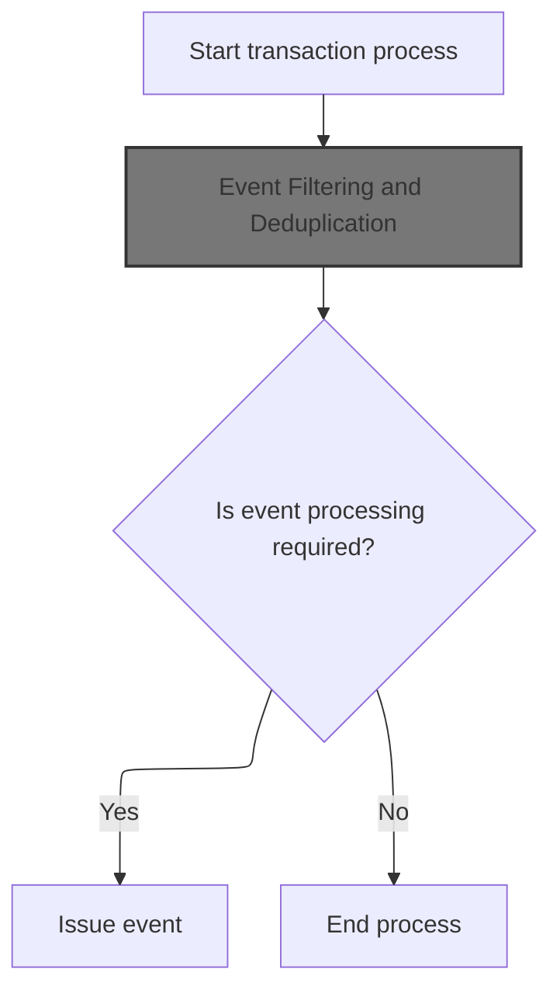
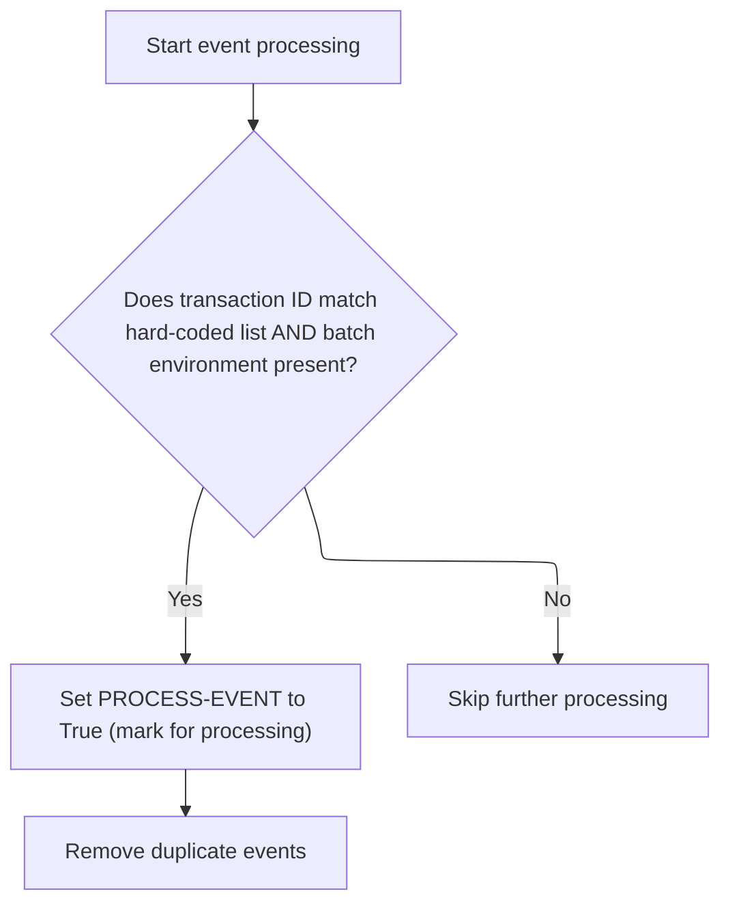
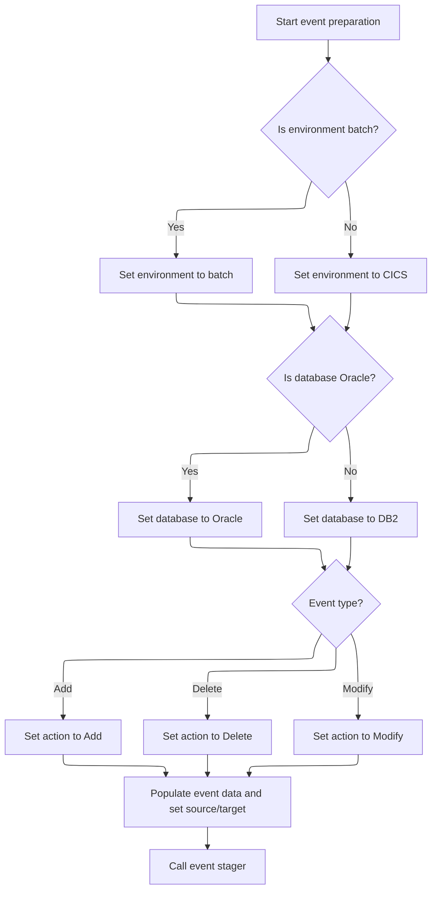

This document describes how event transactions are filtered, deduplicated, and dispatched. The flow receives an event transaction, applies business rules to determine if it should be processed, and, if so, constructs and dispatches the event payload.

# Spec

## Detailed View of the Program's Functionality

Main Event Processing Sequence

This section describes the overall flow of the program, which is responsible for issuing events related to master data entities and relationships. The process begins by initializing the necessary state and then determines whether the event should be processed based on the transaction ID. If the transaction ID is not a specific value ('CFIP'), the program proceeds to filter and deduplicate the event. Only if the event passes these checks does the program move on to construct and issue the event payload.

1. The program starts by initializing its state, including setting up working storage and preparing for event processing.
2. It checks if the transaction ID is not equal to a specific value. If this condition is met, it performs event filtering and deduplication.
3. After filtering, if the event is marked for processing, the program proceeds to construct and issue the event.
4. If the event is not marked for processing, the program ends the process.

Event Filtering and Deduplication

This section details how the program determines whether an event should be processed, focusing on filtering by transaction ID and environment, and removing duplicates.

1. The event processing begins by marking the event for processing.
2. The program checks if the transaction ID matches any value in a hardcoded list and if the batch environment is present. If both conditions are met, the event is marked for further processing.
3. If the event does not meet these criteria, further processing is skipped.
4. For events that pass the initial filter, the program checks for duplicates. It compares the current event's data and transaction ID with previously processed events.
5. If a duplicate is found (i.e., both the data and transaction ID match a previous event), the event is marked to be skipped.
6. If the event is not a duplicate and there is space in the event table, the event's data and transaction ID are stored for future duplicate checks.

Event Payload Construction and Dispatch

This section explains how the program constructs the event payload and dispatches it to the event stager.

1. The program begins preparing the event data structure.
2. It checks the environment type. If the environment is batch, it sets the event's environment field accordingly; otherwise, it sets it to indicate a different environment (CICS).
3. The program then checks the database type. If the database is Oracle, it sets the event's database field to Oracle; otherwise, it sets it to DB2.
4. The event type is determined next. Depending on whether the event is an addition, deletion, or modification, the corresponding action code is set in the event payload.
5. The program populates the event data fields, including transaction code, event data, calling program, and user information.
6. It sets the source and target fields to indicate the origin and destination of the event.
7. Finally, the program calls the event stager, passing the prepared event data structure and any necessary linkage information, to dispatch the event.

Summary

- The program initializes its state and prepares for event processing.
- It filters events based on transaction ID and environment, and removes duplicates.
- Only relevant, non-duplicate events are constructed and dispatched.
- The event payload is built with environment, database, action, and metadata, and sent to the event stager for further handling.

# Rule Definition

| Paragraph Name        | Rule ID | Category          | Description                                                                                                                                                                                                                                          | Conditions                                                                                                       | Remarks                                                                                                                                                                                                                                                                                                                                                                                                                         |
| --------------------- | ------- | ----------------- | ---------------------------------------------------------------------------------------------------------------------------------------------------------------------------------------------------------------------------------------------------- | ---------------------------------------------------------------------------------------------------------------- | ------------------------------------------------------------------------------------------------------------------------------------------------------------------------------------------------------------------------------------------------------------------------------------------------------------------------------------------------------------------------------------------------------------------------------- |
| 210-WEED-BY-HARD-CODE | RL-001  | Conditional Logic | The system processes an event only if the transaction ID matches one of a hardcoded list of allowed values and the batch environment flag is true.                                                                                                   | Transaction ID must be one of the allowed values (e.g., BVLM, APLM, etc.). Batch environment flag must be true.  | Allowed transaction IDs: BVLM, APLM, BDMM, BCAM, CCSM, CEMM, CNCM, COMM, CRCM, CSCM, CTOM, DIRM, DISM, DSDM, FINM, ICCM, ITMM, IWVM, LOBM, MCEM, MRGM, OBSM, ORBM, PBCM, PBNM, PBTM, PCCM, PCTM, PDSH, PDUA, PDUP, PIPM, PRIM, PRMM, PRRM, PSBM, PSCM, RARM, RFTM, RITM, RRFM, RTDM, RTTM, SCAM, SDPM, SLDM, STAM, STPM, STRM, STTM, T2TM, TRDM, VCMM, VENM, VISM, VLIM, WHSM, WLIM. Batch environment flag is a boolean value. |
| 220-WEED-DUP-EVENTS   | RL-002  | Conditional Logic | The system checks if the current event is a duplicate by comparing its transaction ID and compare data against the previous event and all entries in the event table. If a duplicate is found, the event is marked as a duplicate and not processed. | Current event's transaction ID and compare data match either the previous event or any entry in the event table. | Event table can store up to 100 previous events. Each entry consists of a transaction ID (string, 4 characters) and compare data (string, 100 characters).                                                                                                                                                                                                                                                                      |
| 300-ISSUE-EVENT       | RL-003  | Data Assignment   | For events that pass filtering and deduplication, the system constructs an event payload with required fields and dispatches it to the event stager.                                                                                                 | Event must have passed all previous filters and deduplication checks.                                            | Payload fields:                                                                                                                                                                                                                                                                                                                                                                                                                 |

- Transaction ID: string, 4 characters
- Transaction record data: string (length as per YYYC0175-DATA)
- Action code: 'A' (Add), 'P' (Delete), 'M' (Modify), 1 character
- Calling program name: string (as per ZZZC0197-PROGRAM)
- Calling user: string (as per ZZZC0197-USER)
- Environment flags: batch or CICS (boolean)
- Database flags: Oracle or DB2 (boolean)
- Source system flag: boolean
- Target system flag: boolean |

# User Stories

## User Story 1: End-to-End Event Processing (Validation, Deduplication, Payload Construction, and Dispatch)

---

### Story Description:

As a system, I want to validate incoming events by checking their transaction ID, batch environment flag, and duplicate status, and then construct and dispatch the event payload to the event stager so that only valid, unique events are processed and communicated to downstream systems.

---

### Business Rule Mapping:

| Rule ID | Paragraph Name        | Rule Description                                                                                                                                                                                                                                     |
| ------- | --------------------- | ---------------------------------------------------------------------------------------------------------------------------------------------------------------------------------------------------------------------------------------------------- |
| RL-001  | 210-WEED-BY-HARD-CODE | The system processes an event only if the transaction ID matches one of a hardcoded list of allowed values and the batch environment flag is true.                                                                                                   |
| RL-003  | 300-ISSUE-EVENT       | For events that pass filtering and deduplication, the system constructs an event payload with required fields and dispatches it to the event stager.                                                                                                 |
| RL-002  | 220-WEED-DUP-EVENTS   | The system checks if the current event is a duplicate by comparing its transaction ID and compare data against the previous event and all entries in the event table. If a duplicate is found, the event is marked as a duplicate and not processed. |

---

### Relevant Functionality:

- **210-WEED-BY-HARD-CODE**
  1. **RL-001:**
     - If transaction ID is in allowed list and batch environment flag is true:
       - Set event to be processed
     - Otherwise, mark event as not to be processed
- **300-ISSUE-EVENT**
  1. **RL-003:**
     - Initialize event payload structure
     - Set environment flag based on batch or CICS
     - Set database flag based on Oracle or DB2
     - Move transaction ID and record data to payload
     - Set action code based on operation type (add, delete, modify)
     - Move calling program and user to payload
     - Set source and target system flags
     - Call event stager with constructed payload
- **220-WEED-DUP-EVENTS**
  1. **RL-002:**
     - If previous event's transaction ID and compare data are not spaces and match current event:
       - Mark event as duplicate
     - For each entry in event table:
       - If transaction ID and compare data match current event:
         - Mark event as duplicate
     - If not a duplicate and event table is not full:
       - Add current event to event table

# Code Walkthrough

## Main Event Processing Sequence



<SwmSnippet path="/base/src/ZZZS0197.cbl" line="57">

---

`000-MAINLINE` kicks off the flow by initializing state, then checks if the transaction ID isn't 'CFIP'. If so, it calls 200-WEED-EVENT to decide if the event should be processed (filtering and deduplication). Only if PROCESS-EVENT is set (meaning the event passed the checks), it moves on to 300-ISSUE-EVENT to actually build and send the event. This keeps the flow tight: only relevant, non-duplicate events get issued.

```cobol
008400 000-MAINLINE.                                                    00008400
008500     PERFORM 100-INITIALIZE                                       00008500
008600                                                                  00008600
008700*    IF  ZZZC0197-TRX-ID NOT = 'CFIP'                             00008700
008800       PERFORM 200-WEED-EVENT                                     00008800
008900*    END-IF                                                       00008900
009000                                                                  00009000
009100     IF PROCESS-EVENT                                             00009100
009200       PERFORM 300-ISSUE-EVENT                                    00009200
009300     END-IF                                                       00009300
009400                                                                  00009400
009500     GOBACK                                                       00009500
009600     .                                                            00009600
```

---

</SwmSnippet>

### Event Filtering and Deduplication



<SwmSnippet path="/base/src/ZZZS0197.cbl" line="89">

---

`200-WEED-EVENT` sets up PROCESS-EVENT as true, then calls 210-WEED-BY-HARD-CODE to filter out events that don't match a specific set of transaction IDs and environment. If the event survives that, it checks for duplicates with 220-WEED-DUP-EVENTS. Only events passing both filters move forward.

```cobol
011600 200-WEED-EVENT.                                                  00011600
011700     SET PROCESS-EVENT TO TRUE                                    00011700
011800     PERFORM 210-WEED-BY-HARD-CODE                                00011800
011900     IF PROCESS-EVENT                                             00011900
012000       PERFORM 220-WEED-DUP-EVENTS                                00012000
012100     END-IF                                                       00012100
012200     .                                                            00012200
```

---

</SwmSnippet>

<SwmSnippet path="/base/src/ZZZS0197.cbl" line="98">

---

`210-WEED-BY-HARD-CODE` filters events by a hardcoded list of transaction IDs and batch mode.

```cobol
012500 210-WEED-BY-HARD-CODE.                                           00012500
012600     IF  (ZZZC0197-TRX-ID = 'BVLM'                                00012600
012700*      OR ZZZC0197-TRX-ID = 'APLM'                                00012700
012800*      OR ZZZC0197-TRX-ID = 'BDMM'                                00012800
012900*      OR ZZZC0197-TRX-ID = 'BCAM'                                00012900
013000*      OR ZZZC0197-TRX-ID = 'CCSM'                                00013000
013100*      OR ZZZC0197-TRX-ID = 'CEMM'                                00013100
013200       OR ZZZC0197-TRX-ID = 'CNCM'                                00013200
013300*      OR ZZZC0197-TRX-ID = 'COMM'                                00013300
013400*      OR ZZZC0197-TRX-ID = 'CRCM'                                00013400
013500*      OR ZZZC0197-TRX-ID = 'CSCM'                                00013500
013600*      OR ZZZC0197-TRX-ID = 'CTOM'                                00013600
013700*      OR ZZZC0197-TRX-ID = 'DIRM'                                00013700
013800*      OR ZZZC0197-TRX-ID = 'DISM'                                00013800
013900*      OR ZZZC0197-TRX-ID = 'DSDM'                                00013900
014000*      OR ZZZC0197-TRX-ID = 'FINM'                                00014000
014100*      OR ZZZC0197-TRX-ID = 'ICCM'                                00014100
014200*      OR ZZZC0197-TRX-ID = 'ITMM'                                00014200
014300       OR ZZZC0197-TRX-ID = 'IWVM'                                00014300
014400*      OR ZZZC0197-TRX-ID = 'LOBM'                                00014400
014500*      OR ZZZC0197-TRX-ID = 'MCEM'                                00014500
014600*      OR ZZZC0197-TRX-ID = 'MRGM'                                00014600
014700       OR ZZZC0197-TRX-ID = 'OBSM'                                00014700
014800*      OR ZZZC0197-TRX-ID = 'ORBM'                                00014800
014900       OR ZZZC0197-TRX-ID = 'PBCM'                                00014900
015000*      OR ZZZC0197-TRX-ID = 'PBNM'                                00015000
015100       OR ZZZC0197-TRX-ID = 'PBTM'                                00015100
015200*      OR ZZZC0197-TRX-ID = 'PCCM'                                00015200
015300*      OR ZZZC0197-TRX-ID = 'PCTM'                                00015300
015400*      OR ZZZC0197-TRX-ID = 'PDSH'                                00015400
015500*      OR ZZZC0197-TRX-ID = 'PDUA'                                00015500
015600*      OR ZZZC0197-TRX-ID = 'PDUP'                                00015600
015700       OR ZZZC0197-TRX-ID = 'PIPM'                                00015700
015800*      OR ZZZC0197-TRX-ID = 'PRIM'                                00015800
015900*      OR ZZZC0197-TRX-ID = 'PRMM'                                00015900
016000*      OR ZZZC0197-TRX-ID = 'PRRM'                                00016000
016100       OR ZZZC0197-TRX-ID = 'PSBM'                                00016100
016200*      OR ZZZC0197-TRX-ID = 'PSCM'                                00016200
016300       OR ZZZC0197-TRX-ID = 'RARM'                                00016300
016400       OR ZZZC0197-TRX-ID = 'RFTM'                                00016400
016500       OR ZZZC0197-TRX-ID = 'RITM'                                00016500
016600       OR ZZZC0197-TRX-ID = 'RRFM'                                00016600
016700       OR ZZZC0197-TRX-ID = 'RTDM'                                00016700
016800*      OR ZZZC0197-TRX-ID = 'RTTM'                                00016800
016900       OR ZZZC0197-TRX-ID = 'SCAM'                                00016900
017000*      OR ZZZC0197-TRX-ID = 'SDPM'                                00017000
017100*      OR ZZZC0197-TRX-ID = 'SLDM'                                00017100
017200       OR ZZZC0197-TRX-ID = 'STAM'                                00017200
017300*      OR ZZZC0197-TRX-ID = 'STPM'                                00017300
017400*      OR ZZZC0197-TRX-ID = 'STRM'                                00017400
017500       OR ZZZC0197-TRX-ID = 'STTM'                                00017500
017600*      OR ZZZC0197-TRX-ID = 'T2TM'                                00017600
017700       OR ZZZC0197-TRX-ID = 'TRDM'                                00017700
017800*      OR ZZZC0197-TRX-ID = 'VCMM'                                00017800
017900*      OR ZZZC0197-TRX-ID = 'VENM'                                00017900
018000*      OR ZZZC0197-TRX-ID = 'VISM'                                00018000
018100*      OR ZZZC0197-TRX-ID = 'VLIM'                                00018100
018200*      OR ZZZC0197-TRX-ID = 'WHSM'                                00018200
018300       OR ZZZC0197-TRX-ID = 'WLIM')                               00018300
018400       AND YYYN110A-BATCH-ENV                                     00018400
018500         SET WEED-EVENT TO TRUE                                   00018500
018600     END-IF                                                       00018600
018700     .                                                            00018700
```

---

</SwmSnippet>

### Event Payload Construction and Dispatch



<SwmSnippet path="/base/src/ZZZS0197.cbl" line="199">

---

`300-ISSUE-EVENT` prepares the event data and calls the stager to send it out.

```cobol
022600 300-ISSUE-EVENT.                                                 00022600
022700     INITIALIZE YYYC0175                                          00022700
022800                                                                  00022800
022900     IF YYYN110A-BATCH-ENV                                        00022900
023000       SET YYYC0175-BATCH-ENV TO TRUE                             00023000
023100     ELSE                                                         00023100
023200       SET YYYC0175-CICS-ENV  TO TRUE                             00023200
023300     END-IF                                                       00023300
023301                                                                  00023301
023310     IF YYYN110A-ORACLE                                           00023310
023320       SET YYYC0175-ORACLE    TO TRUE                             00023320
023330     ELSE                                                         00023330
023340       SET YYYC0175-DB2       TO TRUE                             00023340
023350     END-IF                                                       00023350
023400                                                                  00023400
023500     MOVE ZZZC0197-TRX-ID  TO YYYC0175-TRX-CD                     00023500
023600     MOVE ZZZC0197-TRX-REC TO YYYC0175-DATA                       00023600
023700     EVALUATE TRUE                                                00023700
023800       WHEN YYYN110A-ADD                                          00023800
023900         MOVE 'A' TO YYYC0175-ACTION-CD                           00023900
024000       WHEN YYYN110A-DEL                                          00024000
024100         MOVE 'P' TO YYYC0175-ACTION-CD                           00024100
024200       WHEN OTHER                                                 00024200
024300         MOVE 'M' TO YYYC0175-ACTION-CD                           00024300
024400     END-EVALUATE                                                 00024400
024500                                                                  00024500
024600     MOVE ZZZC0197-PROGRAM TO YYYC0175-CALLING-PROG               00024600
024700     MOVE ZZZC0197-USER    TO YYYC0175-CALLING-USER               00024700
024800                                                                  00024800
024900     SET  YYYC0175-SOURCE-WMS       TO TRUE                       00024900
025000     SET  YYYC0175-TARGET-MAINFRAME TO TRUE                       00025000
025100                                                                  00025100
025200     CALL WS-EVENT-STAGER USING                                   00025200
025300         XXXN001A                                                 00025300
025400         YYYC0175                                                 00025400
025500     .                                                            00025500
```

---

</SwmSnippet>

&nbsp;

*This is an auto-generated document by Swimm 🌊 and has not yet been verified by a human*

<SwmMeta version="3.0.0" repo-id="Z2l0aHViJTNBJTNBU3dpbW1pby1keW5jYWxsLWRlbW8lM0ElM0FHaXJpLVN3aW1t" repo-name="Swimmio-dyncall-demo"><sup>Powered by [Swimm](https://app.swimm.io/)</sup></SwmMeta>
