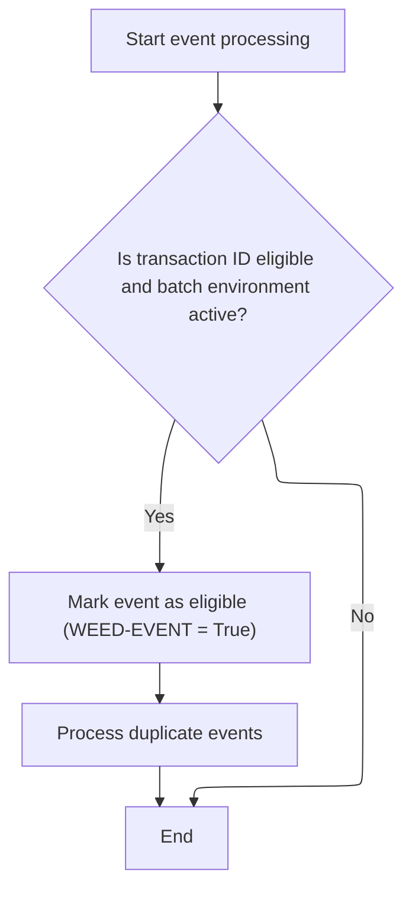
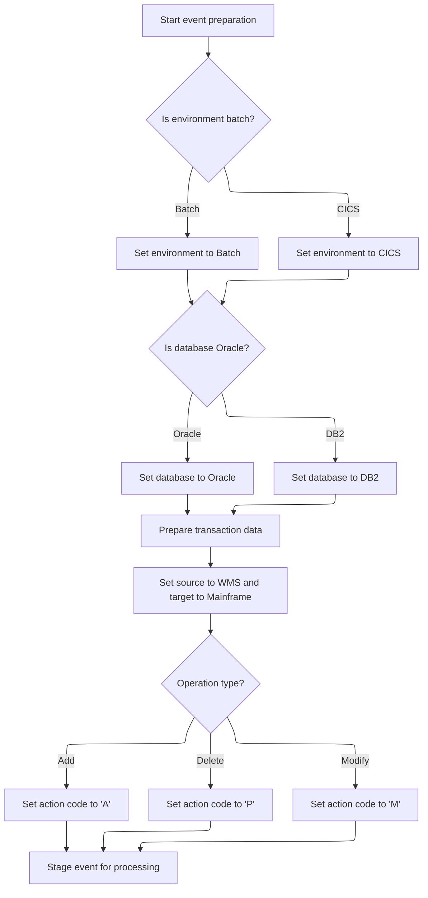

This document describes the flow for processing event transactions. Events are filtered for eligibility and deduplication, then prepared and dispatched if valid. The flow receives an event transaction and outputs either a filtered or dispatched event.

# Spec

## Detailed View of the Program's Functionality

Main Event Processing Sequence

- The program begins by initializing its working storage and control flags.
- It checks if the incoming transaction is not of a specific type (the one labeled 'CFIP'). If it is not, it proceeds to the event filtering step.
- The event filtering routine is called to determine if the event should be processed further.
- If the event passes the filtering checks, the program moves on to prepare and issue the event.
- Finally, the program ends its execution and returns control.

Event Filtering and Deduplication

- The event filtering routine first sets a flag indicating the event should be processed.
- It then calls a subroutine that checks if the transaction type is in a predefined list of allowed types and if the environment is set to batch mode. Only if both conditions are met does the event remain eligible for processing.
- If the event is still eligible, the program checks for duplicates. It compares the current event's key data and transaction type against previously processed events.
- If a duplicate is found (the key data and transaction type match a previous event), the event is flagged to be skipped.
- The program also maintains a table of previously processed events, updating it with each new event that passes the checks, up to a maximum number of events.

Event Payload Construction and Dispatch

- When issuing an event, the program prepares a payload structure to hold all relevant event details.
- It sets the environment flag in the payload based on whether the current environment is batch or interactive (CICS).
- It sets the database type flag in the payload, choosing between Oracle and DB2 depending on the current environment.
- The transaction type and associated data are copied into the payload.
- The program determines the type of operation (add, delete, or modify) and sets an action code in the payload accordingly.
- Additional details, such as the calling program and user, are added to the payload.
- The payload is marked as originating from a specific source system and targeting the mainframe.
- Finally, the program calls an external routine (the stager) to dispatch the prepared event payload for further processing.

# Rule Definition

| Paragraph Name        | Rule ID | Category          | Description                                                                                                                | Conditions                                                                                                                                                                                                                                                                                                                                                                                                                                                                                                                                      | Remarks                                                                                                |
| --------------------- | ------- | ----------------- | -------------------------------------------------------------------------------------------------------------------------- | ----------------------------------------------------------------------------------------------------------------------------------------------------------------------------------------------------------------------------------------------------------------------------------------------------------------------------------------------------------------------------------------------------------------------------------------------------------------------------------------------------------------------------------------------- | ------------------------------------------------------------------------------------------------------ |
| 210-WEED-BY-HARD-CODE | RL-001  | Conditional Logic | The system must only process events if the transaction type code is one of the allowed values.                             | The incoming transaction type code must be in the allowed list: 'BVLM', 'APLM', 'BDMM', 'BCAM', 'CCSM', 'CEMM', 'CNCM', 'COMM', 'CRCM', 'CSCM', 'CTOM', 'DIRM', 'DISM', 'DSDM', 'FINM', 'ICCM', 'ITMM', 'IWVM', 'LOBM', 'MCEM', 'MRGM', 'OBSM', 'ORBM', 'PBCM', 'PBNM', 'PBTM', 'PCCM', 'PCTM', 'PDSH', 'PDUA', 'PDUP', 'PIPM', 'PRIM', 'PRMM', 'PRRM', 'PSBM', 'PSCM', 'RARM', 'RFTM', 'RITM', 'RRFM', 'RTDM', 'RTTM', 'SCAM', 'SDPM', 'SLDM', 'STAM', 'STPM', 'STRM', 'STTM', 'T2TM', 'TRDM', 'VCMM', 'VENM', 'VISM', 'VLIM', 'WHSM', 'WLIM'. | Allowed transaction type codes are as listed above. The transaction type code is a string of length 4. |
| 210-WEED-BY-HARD-CODE | RL-002  | Conditional Logic | The system must only process events if the batch environment flag is true.                                                 | The batch environment flag must be true.                                                                                                                                                                                                                                                                                                                                                                                                                                                                                                        | Batch environment flag is a boolean value.                                                             |
| 220-WEED-DUP-EVENTS   | RL-003  | Conditional Logic | The system must weed out duplicate events based on transaction type and compare data.                                      | If previous compare data and transaction type are not spaces and match the current event's compare data and transaction type.                                                                                                                                                                                                                                                                                                                                                                                                                   | Compare data is a string of length 100. Transaction type code is a string of length 4.                 |
| 300-ISSUE-EVENT       | RL-004  | Data Assignment   | For eligible events, the system constructs an event payload with fields set according to environment and transaction data. | Event is eligible (not weeded).                                                                                                                                                                                                                                                                                                                                                                                                                                                                                                                 | YYYC0175 event payload fields:                                                                         |

- BATCH-ENV: boolean
- CICS-ENV: boolean
- ORACLE: boolean
- DB2: boolean
- TRX-CD: string (length 4)
- DATA: string (length as per transaction record)
- ACTION-CD: string (length 1, values 'A', 'P', 'M')
- CALLING-PROG: string (length as per program name)
- CALLING-USER: string (length as per user name)
- SOURCE-WMS: boolean (always true)
- TARGET-MAINFRAME: boolean (always true) | | 300-ISSUE-EVENT | RL-005 | Computation | The constructed event payload must be dispatched to the event stager along with the linkage data. | Event payload is constructed and eligible for dispatch. | Event stager is called with two arguments: linkage data (XXXN001A) and event payload (YYYC0175). |

# User Stories

## User Story 1: Event eligibility and deduplication

---

### Story Description:

As a system, I want to process only eligible and unique events so that only valid, non-duplicate transactions are handled.

---

### Business Rule Mapping:

| Rule ID | Paragraph Name        | Rule Description                                                                               |
| ------- | --------------------- | ---------------------------------------------------------------------------------------------- |
| RL-001  | 210-WEED-BY-HARD-CODE | The system must only process events if the transaction type code is one of the allowed values. |
| RL-002  | 210-WEED-BY-HARD-CODE | The system must only process events if the batch environment flag is true.                     |
| RL-003  | 220-WEED-DUP-EVENTS   | The system must weed out duplicate events based on transaction type and compare data.          |

---

### Relevant Functionality:

- **210-WEED-BY-HARD-CODE**
  1. **RL-001:**
     - Check if the incoming transaction type code matches any value in the allowed list
     - If not, set event to be weeded (not processed)
     - If yes, continue processing
  2. **RL-002:**
     - Check if batch environment flag is true
     - If not, set event to be weeded (not processed)
     - If yes, continue processing
- **220-WEED-DUP-EVENTS**
  1. **RL-003:**
     - If previous compare data and transaction type are not blank
       - And both match the current event's compare data and transaction type
         - Set event to be weeded (not processed)
     - Update previous compare data and transaction type with current values
     - Check event table for duplicates and weed if found
     - Add new event to event table if not duplicate

## User Story 2: Event payload construction and dispatching

---

### Story Description:

As a system, I want to construct an event payload for eligible events and dispatch it to the event stager along with linkage data so that downstream systems receive complete and accurate event information for further processing.

---

### Business Rule Mapping:

| Rule ID | Paragraph Name  | Rule Description                                                                                                           |
| ------- | --------------- | -------------------------------------------------------------------------------------------------------------------------- |
| RL-004  | 300-ISSUE-EVENT | For eligible events, the system constructs an event payload with fields set according to environment and transaction data. |
| RL-005  | 300-ISSUE-EVENT | The constructed event payload must be dispatched to the event stager along with the linkage data.                          |

---

### Relevant Functionality:

- **300-ISSUE-EVENT**
  1. **RL-004:**
     - Initialize event payload structure
     - Set BATCH-ENV to true if batch environment is active, else set CICS-ENV to true
     - Set ORACLE to true if Oracle is active, else set DB2 to true
     - Set TRX-CD to incoming transaction type code
     - Set DATA to incoming transaction record data
     - Set ACTION-CD to 'A' if add operation, 'P' if delete operation, 'M' otherwise
     - Set CALLING-PROG to incoming program name
     - Set CALLING-USER to incoming user name
     - Set SOURCE-WMS and TARGET-MAINFRAME to true
  2. **RL-005:**
     - Call the event stager program
       - Pass linkage data
       - Pass constructed event payload

# Code Walkthrough

## Main Event Processing Sequence

<SwmSnippet path="/base/src/ZZZS0197.cbl" line="57">

---

`000-MAINLINE` starts things off, skips 'CFIP' transactions, and calls `200-WEED-EVENT` to decide if the event should go further. If it passes, we move on to issuing the event.

```cobol
008400 000-MAINLINE.                                                    00008400
008500     PERFORM 100-INITIALIZE                                       00008500
008600                                                                  00008600
008700*    IF  ZZZC0197-TRX-ID NOT = 'CFIP'                             00008700
008800       PERFORM 200-WEED-EVENT                                     00008800
008900*    END-IF                                                       00008900
009000                                                                  00009000
009100     IF PROCESS-EVENT                                             00009100
009200       PERFORM 300-ISSUE-EVENT                                    00009200
009300     END-IF                                                       00009300
009400                                                                  00009400
009500     GOBACK                                                       00009500
009600     .                                                            00009600
```

---

</SwmSnippet>

### Event Filtering and Deduplication



<SwmSnippet path="/base/src/ZZZS0197.cbl" line="89">

---

`200-WEED-EVENT` sets up the flag to process the event, then calls `210-WEED-BY-HARD-CODE` to see if the event type and environment match what's allowed. If it passes, it checks for duplicates with `220-WEED-DUP-EVENTS`. Calling `210-WEED-BY-HARD-CODE` is what actually filters out events that shouldn't be processed at all, before we even worry about duplicates.

```cobol
011600 200-WEED-EVENT.                                                  00011600
011700     SET PROCESS-EVENT TO TRUE                                    00011700
011800     PERFORM 210-WEED-BY-HARD-CODE                                00011800
011900     IF PROCESS-EVENT                                             00011900
012000       PERFORM 220-WEED-DUP-EVENTS                                00012000
012100     END-IF                                                       00012100
012200     .                                                            00012200
```

---

</SwmSnippet>

<SwmSnippet path="/base/src/ZZZS0197.cbl" line="98">

---

`210-WEED-BY-HARD-CODE` only flags events for processing if the transaction type is in a specific list and we're running in batch.

```cobol
012500 210-WEED-BY-HARD-CODE.                                           00012500
012600     IF  (ZZZC0197-TRX-ID = 'BVLM'                                00012600
012700*      OR ZZZC0197-TRX-ID = 'APLM'                                00012700
012800*      OR ZZZC0197-TRX-ID = 'BDMM'                                00012800
012900*      OR ZZZC0197-TRX-ID = 'BCAM'                                00012900
013000*      OR ZZZC0197-TRX-ID = 'CCSM'                                00013000
013100*      OR ZZZC0197-TRX-ID = 'CEMM'                                00013100
013200       OR ZZZC0197-TRX-ID = 'CNCM'                                00013200
013300*      OR ZZZC0197-TRX-ID = 'COMM'                                00013300
013400*      OR ZZZC0197-TRX-ID = 'CRCM'                                00013400
013500*      OR ZZZC0197-TRX-ID = 'CSCM'                                00013500
013600*      OR ZZZC0197-TRX-ID = 'CTOM'                                00013600
013700*      OR ZZZC0197-TRX-ID = 'DIRM'                                00013700
013800*      OR ZZZC0197-TRX-ID = 'DISM'                                00013800
013900*      OR ZZZC0197-TRX-ID = 'DSDM'                                00013900
014000*      OR ZZZC0197-TRX-ID = 'FINM'                                00014000
014100*      OR ZZZC0197-TRX-ID = 'ICCM'                                00014100
014200*      OR ZZZC0197-TRX-ID = 'ITMM'                                00014200
014300       OR ZZZC0197-TRX-ID = 'IWVM'                                00014300
014400*      OR ZZZC0197-TRX-ID = 'LOBM'                                00014400
014500*      OR ZZZC0197-TRX-ID = 'MCEM'                                00014500
014600*      OR ZZZC0197-TRX-ID = 'MRGM'                                00014600
014700       OR ZZZC0197-TRX-ID = 'OBSM'                                00014700
014800*      OR ZZZC0197-TRX-ID = 'ORBM'                                00014800
014900       OR ZZZC0197-TRX-ID = 'PBCM'                                00014900
015000*      OR ZZZC0197-TRX-ID = 'PBNM'                                00015000
015100       OR ZZZC0197-TRX-ID = 'PBTM'                                00015100
015200*      OR ZZZC0197-TRX-ID = 'PCCM'                                00015200
015300*      OR ZZZC0197-TRX-ID = 'PCTM'                                00015300
015400*      OR ZZZC0197-TRX-ID = 'PDSH'                                00015400
015500*      OR ZZZC0197-TRX-ID = 'PDUA'                                00015500
015600*      OR ZZZC0197-TRX-ID = 'PDUP'                                00015600
015700       OR ZZZC0197-TRX-ID = 'PIPM'                                00015700
015800*      OR ZZZC0197-TRX-ID = 'PRIM'                                00015800
015900*      OR ZZZC0197-TRX-ID = 'PRMM'                                00015900
016000*      OR ZZZC0197-TRX-ID = 'PRRM'                                00016000
016100       OR ZZZC0197-TRX-ID = 'PSBM'                                00016100
016200*      OR ZZZC0197-TRX-ID = 'PSCM'                                00016200
016300       OR ZZZC0197-TRX-ID = 'RARM'                                00016300
016400       OR ZZZC0197-TRX-ID = 'RFTM'                                00016400
016500       OR ZZZC0197-TRX-ID = 'RITM'                                00016500
016600       OR ZZZC0197-TRX-ID = 'RRFM'                                00016600
016700       OR ZZZC0197-TRX-ID = 'RTDM'                                00016700
016800*      OR ZZZC0197-TRX-ID = 'RTTM'                                00016800
016900       OR ZZZC0197-TRX-ID = 'SCAM'                                00016900
017000*      OR ZZZC0197-TRX-ID = 'SDPM'                                00017000
017100*      OR ZZZC0197-TRX-ID = 'SLDM'                                00017100
017200       OR ZZZC0197-TRX-ID = 'STAM'                                00017200
017300*      OR ZZZC0197-TRX-ID = 'STPM'                                00017300
017400*      OR ZZZC0197-TRX-ID = 'STRM'                                00017400
017500       OR ZZZC0197-TRX-ID = 'STTM'                                00017500
017600*      OR ZZZC0197-TRX-ID = 'T2TM'                                00017600
017700       OR ZZZC0197-TRX-ID = 'TRDM'                                00017700
017800*      OR ZZZC0197-TRX-ID = 'VCMM'                                00017800
017900*      OR ZZZC0197-TRX-ID = 'VENM'                                00017900
018000*      OR ZZZC0197-TRX-ID = 'VISM'                                00018000
018100*      OR ZZZC0197-TRX-ID = 'VLIM'                                00018100
018200*      OR ZZZC0197-TRX-ID = 'WHSM'                                00018200
018300       OR ZZZC0197-TRX-ID = 'WLIM')                               00018300
018400       AND YYYN110A-BATCH-ENV                                     00018400
018500         SET WEED-EVENT TO TRUE                                   00018500
018600     END-IF                                                       00018600
018700     .                                                            00018700
```

---

</SwmSnippet>

### Event Payload Construction and Dispatch



<SwmSnippet path="/base/src/ZZZS0197.cbl" line="199">

---

`300-ISSUE-EVENT` sets up all the event details and calls the stager to push the event out.

```cobol
022600 300-ISSUE-EVENT.                                                 00022600
022700     INITIALIZE YYYC0175                                          00022700
022800                                                                  00022800
022900     IF YYYN110A-BATCH-ENV                                        00022900
023000       SET YYYC0175-BATCH-ENV TO TRUE                             00023000
023100     ELSE                                                         00023100
023200       SET YYYC0175-CICS-ENV  TO TRUE                             00023200
023300     END-IF                                                       00023300
023301                                                                  00023301
023310     IF YYYN110A-ORACLE                                           00023310
023320       SET YYYC0175-ORACLE    TO TRUE                             00023320
023330     ELSE                                                         00023330
023340       SET YYYC0175-DB2       TO TRUE                             00023340
023350     END-IF                                                       00023350
023400                                                                  00023400
023500     MOVE ZZZC0197-TRX-ID  TO YYYC0175-TRX-CD                     00023500
023600     MOVE ZZZC0197-TRX-REC TO YYYC0175-DATA                       00023600
023700     EVALUATE TRUE                                                00023700
023800       WHEN YYYN110A-ADD                                          00023800
023900         MOVE 'A' TO YYYC0175-ACTION-CD                           00023900
024000       WHEN YYYN110A-DEL                                          00024000
024100         MOVE 'P' TO YYYC0175-ACTION-CD                           00024100
024200       WHEN OTHER                                                 00024200
024300         MOVE 'M' TO YYYC0175-ACTION-CD                           00024300
024400     END-EVALUATE                                                 00024400
024500                                                                  00024500
024600     MOVE ZZZC0197-PROGRAM TO YYYC0175-CALLING-PROG               00024600
024700     MOVE ZZZC0197-USER    TO YYYC0175-CALLING-USER               00024700
024800                                                                  00024800
024900     SET  YYYC0175-SOURCE-WMS       TO TRUE                       00024900
025000     SET  YYYC0175-TARGET-MAINFRAME TO TRUE                       00025000
025100                                                                  00025100
025200     CALL WS-EVENT-STAGER USING                                   00025200
025300         XXXN001A                                                 00025300
025400         YYYC0175                                                 00025400
025500     .                                                            00025500
```

---

</SwmSnippet>

&nbsp;

*This is an auto-generated document by Swimm 🌊 and has not yet been verified by a human*

<SwmMeta version="3.0.0" repo-id="Z2l0aHViJTNBJTNBU3dpbW1pby1keW5jYWxsLWRlbW8lM0ElM0FHaXJpLVN3aW1t" repo-name="Swimmio-dyncall-demo"><sup>Powered by [Swimm](https://app.swimm.io/)</sup></SwmMeta>
