This document describes the finalization process for retail location data operations. The flow checks the outcome of the operation, normalizes and prepares retail location fields according to business rules, updates the checkpoint counter, and conditionally connects to the database if required.

# Spec

## Detailed View of the Program's Functionality

# Detailed Explanation of the Flow

## a. Coordinating Success Path and Conditional Database Actions

This section describes what happens when the main routine is finishing up, specifically in the "exit" logic. The code checks if the operation was successful. If it was, and the operation is not a cursor close, it prepares the retail data for output by copying and normalizing fields from the internal data structure to the output structure. It also increments a checkpoint counter to track progress.

If any flags indicate that a database operation involving Oracle or certain row operations (insert, purge, modify) occurred, it ensures the DB2 connection is established by calling a dedicated routine for DB2 connectivity. This is important for environments where both Oracle and DB2 databases are used, and the program needs to switch contexts or ensure the correct connection is active.

Finally, the SQL status code from the last operation is copied to a status field for reporting or error handling.

**Summary of actions:**

- If successful and not closing a cursor, prepare output data.
- Increment checkpoint counter.
- If Oracle or certain row operations occurred, ensure DB2 connection.
- Copy SQL status code for reporting.

---

## b. Bulk Data Mapping and Field Normalization

This section is responsible for copying a large number of fields from the internal data structure (representing a retail location) to the output structure. However, it doesn't just copy values blindly. It applies several normalization and business rules:

1. **Field Copying:** Most fields are copied directly from the source to the target.
2. **Date Normalization:** For each date field, if the value is a special "default" date (like '01/01/1600'), it is replaced with blanks in the output. This prevents meaningless default dates from being propagated.
3. **Time Normalization:** For each time field, if the value is a special "default" time (like '00.00.00'), it is replaced with blanks. If a closing time is set to the DB2 maximum ('24.00.00'), it is converted to the Oracle-compatible maximum ('23.59.59').
4. **Preference Flags:** If certain preference flags (for substitute or real-time processing) are both unset, a "NO" preference flag is set to indicate that neither option is selected.
5. **Specialized Routines:** After the main field moves, specialized routines are called:
   - One handles "rollup" reporting fields, ensuring that only numeric values are copied and non-numeric values are set to zero.
   - Another handles time fields, possibly converting between timestamp and time formats if required by the database context.

**Summary of actions:**

- Copy all fields, but normalize dates and times.
- Replace default or maximum values with blanks or compatible values.
- Set business rule flags based on combinations of other flags.
- Call specialized routines for rollup and time field handling.

---

## c. Rollup Field Handling

This section deals with the "rollup" reporting fields, which are essentially arrays of numbers used for reporting or aggregation. For each rollup field:

- If the value is numeric, it is copied to a working array.
- If not, zero is used instead.
- After all fields are processed, the working array is copied to the output structure.

This ensures that only valid numbers are output, and any corrupt or non-numeric data is sanitized.

**Summary of actions:**

- Validate each rollup field.
- Copy numeric values, use zero for non-numeric.
- Copy the sanitized array to the output.

---

## d. Time Field Conversion

This section handles the conversion of time fields, which may be stored as timestamps in some contexts (like Oracle) and as plain times in others (like DB2). The logic is as follows:

- If the operation involves Oracle or certain row operations, all timestamp fields are loaded into an array, and a conversion mode is set.
- A utility program is called to perform the actual conversion from timestamp to time.
- If the conversion succeeds, the converted times are copied to the output.
- If the conversion fails, an error message is set.
- If conversion is not needed, the time fields are copied directly from the source to the output.

This ensures that time data is always in the correct format for the target database or output.

**Summary of actions:**

- If needed, convert timestamps to times using a utility.
- On success, copy converted times to output.
- On failure, set an error message.
- If not needed, copy times directly.

---

## e. Database Connection and Status Update

This section is responsible for switching the database connection to DB2 when required. It calls a dedicated handler that manages the connection, translates errors if necessary, and restores any saved state. This keeps all DB2-specific logic in one place and avoids duplicating connection code throughout the program.

**Summary of actions:**

- Call a handler to ensure DB2 connection is active.
- Handler manages connection, error translation, and state restoration.

---

# Overall Flow Summary

1. On exit, if successful, prepare output data and increment checkpoint.
2. If Oracle or certain row operations occurred, ensure DB2 connection.
3. Copy SQL status code for reporting.
4. When preparing output data:
   - Copy all fields, normalizing dates and times.
   - Replace default or maximum values as needed.
   - Set business rule flags.
   - Call routines for rollup and time field handling.
5. Rollup routine ensures only numeric values are output.
6. Time routine converts timestamps to times if needed.
7. Database connection routine ensures the correct database context is active.

This structure ensures robust, normalized, and compatible data output, with careful handling of database context and error/status reporting.

# Rule Definition

| Paragraph Name                                                                | Rule ID | Category          | Description                                                                                                                                                                                                                                                                          | Conditions                                                                    | Remarks                                                                                                                                                         |
| ----------------------------------------------------------------------------- | ------- | ----------------- | ------------------------------------------------------------------------------------------------------------------------------------------------------------------------------------------------------------------------------------------------------------------------------------ | ----------------------------------------------------------------------------- | --------------------------------------------------------------------------------------------------------------------------------------------------------------- |
| 110-MOVE-PDA-FIELDS-2-DCL, 130-MOVE-DCL-2-PDA-FIELDS                          | RL-001  | Data Assignment   | All store/location fields from the input record must be copied to the output record, mapping fields one-to-one.                                                                                                                                                                      | Always, for all store/location fields present in the input record.            | The output record (P-DDDTLR01) must match the flat, fixed-format structure as defined. Field types and sizes must be preserved.                                 |
| 110-MOVE-PDA-FIELDS-2-DCL, 130-MOVE-DCL-2-PDA-FIELDS                          | RL-002  | Conditional Logic | For each date field in the input, if the value equals K-DEF-DT ('01/01/1600'), K-ZERO-DT, or the associated null indicator is less than zero, the output field must be set to spaces.                                                                                                | If date field value = K-DEF-DT or K-ZERO-DT or associated null indicator < 0. | K-DEF-DT = '01/01/1600'. K-ZERO-DT is a constant for zero date. Output field is set to spaces (alphanumeric, length as per field definition).                   |
| 110-MOVE-PDA-FIELDS-2-DCL, 130-MOVE-DCL-2-PDA-FIELDS                          | RL-003  | Conditional Logic | For each time field in the input, if the value equals K-DEF-TM ('00.00.00') or the associated null indicator is less than zero, the output field must be set to spaces.                                                                                                              | If time field value = K-DEF-TM or associated null indicator < 0.              | K-DEF-TM = '00.00.00'. Output field is set to spaces (alphanumeric, length as per field definition).                                                            |
| 110-MOVE-PDA-FIELDS-2-DCL, 130-MOVE-DCL-2-PDA-FIELDS                          | RL-004  | Conditional Logic | For each closing time field in the input, if the value equals K-DB2-MAX-TM ('24.00.00'), the output field must be set to K-ORA-MAX-TM ('23.59.59').                                                                                                                                  | If closing time field value = K-DB2-MAX-TM.                                   | K-DB2-MAX-TM = '24.00.00'. K-ORA-MAX-TM = '23.59.59'. Output field is alphanumeric, length as per field definition.                                             |
| 117-MOVE-ROLLUP-DATA, 135-MOVE-DC-ROLLUP-DATA                                 | RL-005  | Conditional Logic | For each rollup numeric field, if the value is not numeric, the output field must be set to zero.                                                                                                                                                                                    | If rollup numeric field is not numeric.                                       | Fields: ROLUP-REPT-TBL-01-NBR ... ROLUP-REPT-TBL-10-NBR. Output field is numeric, size as per field definition, set to zero if not numeric.                     |
| 117-MOVE-ROLLUP-DATA, 135-MOVE-DC-ROLLUP-DATA                                 | RL-006  | Data Assignment   | For each rollup text field, copy the value directly from input to output.                                                                                                                                                                                                            | Always, for all rollup text fields.                                           | Field: ROLUP-REPT-TBL-TXT. Output is alphanumeric, length as per field definition.                                                                              |
| 110-MOVE-PDA-FIELDS-2-DCL, 130-MOVE-DCL-2-PDA-FIELDS                          | RL-007  | Conditional Logic | If both OK-TO-SUB-UNLIKE-PRODS and DONT-SUB-UNLIKE-PRODS are unset (blank), set NO-UNLIKE-SUB-STORE-PREF to 'Y' in the output; otherwise, leave it blank.                                                                                                                            | If OK-TO-SUB-UNLIKE-PRODS and DONT-SUB-UNLIKE-PRODS are blank.                | NO-UNLIKE-SUB-STORE-PREF is a single-character alphanumeric field, set to 'Y' or blank.                                                                         |
| 110-MOVE-PDA-FIELDS-2-DCL, 130-MOVE-DCL-2-PDA-FIELDS                          | RL-008  | Conditional Logic | If both OK-TO-SUB-DISP-PALS and DONT-SUB-DISP-PALS are unset (blank), set NO-DISP-PAL-SUB-STORE-PREF to 'Y' in the output; otherwise, leave it blank.                                                                                                                                | If OK-TO-SUB-DISP-PALS and DONT-SUB-DISP-PALS are blank.                      | NO-DISP-PAL-SUB-STORE-PREF is a single-character alphanumeric field, set to 'Y' or blank.                                                                       |
| 110-MOVE-PDA-FIELDS-2-DCL, 130-MOVE-DCL-2-PDA-FIELDS                          | RL-009  | Conditional Logic | If SEND-REAL-TIME-G3 is not set ('Y'), set DONT-SEND-REAL-TIME-G3 to 'Y' in the output; otherwise, leave it blank.                                                                                                                                                                   | If SEND-REAL-TIME-G3 is not 'Y'.                                              | DONT-SEND-REAL-TIME-G3 is a single-character alphanumeric field, set to 'Y' or blank.                                                                           |
| 1700-CHECK-NULL-COLUMNS, 1800-EDIT-NULL-INDICATORS                            | RL-010  | Conditional Logic | For fields with associated null indicators, if the indicator is less than zero, set the output field to spaces (for strings) or zero (for numerics).                                                                                                                                 | If associated null indicator < 0.                                             | For string fields: set to spaces. For numeric fields: set to zero. Field sizes as per definition.                                                               |
| 112-MOVE-TIME-FIELDS, 132-MOVE-TIME-FIELDS                                    | RL-011  | Computation       | When timestamp-to-time conversion is required (based on Oracle/insert/modify flags), pass arrays of timestamp fields to the MMMS0291 utility and use its output for the corresponding time fields; if conversion fails, set an error message in the designated output message field. | If Oracle/insert/modify flags are set.                                        | Input: arrays of timestamp fields. Output: arrays of time fields. If conversion fails, set error message in IS-RTRN-MSG-TXT (string, length as per definition). |
| Throughout field mapping and assignment sections                              | RL-012  | Data Assignment   | The output record must be a flat, fixed-format structure matching the P-DDDTLR01 layout.                                                                                                                                                                                             | Always, for all output records.                                               | Output record format must match P-DDDTLR01 definition exactly, including field order, sizes, and types.                                                         |
| 100-INITIALIZATION, 120-EXIT-STUFF, 125-CONNECT-TO-DB2, 115-CONNECT-TO-ORACLE | RL-013  | Conditional Logic | The program must call the DB2 connection handler when any DB2/Oracle operation flag is set, delegating connection and transaction management to the handler.                                                                                                                         | If any DB2/Oracle operation flag is set.                                      | Handler routines: Z-ORA-CONNECT, Z-DB2-CONNECT. Called with appropriate parameters for connection/transaction management.                                       |

# User Stories

## User Story 1: Store/Location Field Mapping, Output Structure, and Database Connection Management

---

### Story Description:

As a system, I want all store/location fields from the input record to be copied one-to-one to the output record, preserving field types and sizes, and to call the DB2 connection handler when any DB2/Oracle operation flag is set, so that the output record matches the required flat, fixed-format structure and database operations are performed reliably.

---

### Business Rule Mapping:

| Rule ID | Paragraph Name                                                                | Rule Description                                                                                                                                             |
| ------- | ----------------------------------------------------------------------------- | ------------------------------------------------------------------------------------------------------------------------------------------------------------ |
| RL-001  | 110-MOVE-PDA-FIELDS-2-DCL, 130-MOVE-DCL-2-PDA-FIELDS                          | All store/location fields from the input record must be copied to the output record, mapping fields one-to-one.                                              |
| RL-012  | Throughout field mapping and assignment sections                              | The output record must be a flat, fixed-format structure matching the P-DDDTLR01 layout.                                                                     |
| RL-013  | 100-INITIALIZATION, 120-EXIT-STUFF, 125-CONNECT-TO-DB2, 115-CONNECT-TO-ORACLE | The program must call the DB2 connection handler when any DB2/Oracle operation flag is set, delegating connection and transaction management to the handler. |

---

### Relevant Functionality:

- **110-MOVE-PDA-FIELDS-2-DCL**
  1. **RL-001:**
     - For each store/location field in the input record:
       - Copy the value directly to the corresponding field in the output record.
- **Throughout field mapping and assignment sections**
  1. **RL-012:**
     - Ensure all output fields are assigned according to the fixed-format layout.
     - Do not add or remove fields; preserve order and size.
- **100-INITIALIZATION**
  1. **RL-013:**
     - If DB2/Oracle operation flag is set:
       - Call the appropriate connection handler routine.
       - Pass required parameters for connection/transaction management.

## User Story 2: Date, Time, Closing Time, Null Indicator, and Timestamp Field Processing

---

### Story Description:

As a system, I want date and time fields in the output to be set to spaces when their values are default/zero or their null indicators are less than zero, closing time fields with the DB2 maximum time value to be converted to the Oracle maximum time value, numeric fields to be set to zero when their null indicators are less than zero, and timestamp fields to be converted to time fields using the MMMS0291 utility with errors reported in the output message field, so that invalid or unset data is handled consistently and time data is correctly processed.

---

### Business Rule Mapping:

| Rule ID | Paragraph Name                                       | Rule Description                                                                                                                                                                                                                                                                     |
| ------- | ---------------------------------------------------- | ------------------------------------------------------------------------------------------------------------------------------------------------------------------------------------------------------------------------------------------------------------------------------------ |
| RL-002  | 110-MOVE-PDA-FIELDS-2-DCL, 130-MOVE-DCL-2-PDA-FIELDS | For each date field in the input, if the value equals K-DEF-DT ('01/01/1600'), K-ZERO-DT, or the associated null indicator is less than zero, the output field must be set to spaces.                                                                                                |
| RL-003  | 110-MOVE-PDA-FIELDS-2-DCL, 130-MOVE-DCL-2-PDA-FIELDS | For each time field in the input, if the value equals K-DEF-TM ('00.00.00') or the associated null indicator is less than zero, the output field must be set to spaces.                                                                                                              |
| RL-004  | 110-MOVE-PDA-FIELDS-2-DCL, 130-MOVE-DCL-2-PDA-FIELDS | For each closing time field in the input, if the value equals K-DB2-MAX-TM ('24.00.00'), the output field must be set to K-ORA-MAX-TM ('23.59.59').                                                                                                                                  |
| RL-010  | 1700-CHECK-NULL-COLUMNS, 1800-EDIT-NULL-INDICATORS   | For fields with associated null indicators, if the indicator is less than zero, set the output field to spaces (for strings) or zero (for numerics).                                                                                                                                 |
| RL-011  | 112-MOVE-TIME-FIELDS, 132-MOVE-TIME-FIELDS           | When timestamp-to-time conversion is required (based on Oracle/insert/modify flags), pass arrays of timestamp fields to the MMMS0291 utility and use its output for the corresponding time fields; if conversion fails, set an error message in the designated output message field. |

---

### Relevant Functionality:

- **110-MOVE-PDA-FIELDS-2-DCL**
  1. **RL-002:**
     - For each date field:
       - If value is K-DEF-DT or K-ZERO-DT or null indicator < 0:
         - Set output field to spaces.
       - Else:
         - Copy value to output field.
  2. **RL-003:**
     - For each time field:
       - If value is K-DEF-TM or null indicator < 0:
         - Set output field to spaces.
       - Else:
         - Copy value to output field.
  3. **RL-004:**
     - For each closing time field:
       - If value is K-DB2-MAX-TM:
         - Set output field to K-ORA-MAX-TM.
       - Else:
         - Copy value to output field.
- **1700-CHECK-NULL-COLUMNS**
  1. **RL-010:**
     - For each field with a null indicator:
       - If indicator < 0:
         - If field is string: set to spaces.
         - If field is numeric: set to zero.
- **112-MOVE-TIME-FIELDS**
  1. **RL-011:**
     - If Oracle/insert/modify flags are set:
       - Pass timestamp fields to MMMS0291 utility.
       - If conversion succeeds:
         - Use output for corresponding time fields.
       - Else:
         - Set error message in output message field.

## User Story 3: Rollup Field Validation and Assignment

---

### Story Description:

As a system, I want rollup numeric fields to be set to zero if not numeric and rollup text fields to be copied directly, so that rollup data is accurately represented in the output.

---

### Business Rule Mapping:

| Rule ID | Paragraph Name                                | Rule Description                                                                                  |
| ------- | --------------------------------------------- | ------------------------------------------------------------------------------------------------- |
| RL-005  | 117-MOVE-ROLLUP-DATA, 135-MOVE-DC-ROLLUP-DATA | For each rollup numeric field, if the value is not numeric, the output field must be set to zero. |
| RL-006  | 117-MOVE-ROLLUP-DATA, 135-MOVE-DC-ROLLUP-DATA | For each rollup text field, copy the value directly from input to output.                         |

---

### Relevant Functionality:

- **117-MOVE-ROLLUP-DATA**
  1. **RL-005:**
     - For each rollup numeric field:
       - If value is not numeric:
         - Set output field to zero.
       - Else:
         - Copy value to output field.
  2. **RL-006:**
     - Copy rollup text field value from input to output.

## User Story 4: Store Preference and Real-Time Flag Logic

---

### Story Description:

As a system, I want store preference fields and real-time flags in the output to be set based on the values of related input fields, so that store substitution and real-time processing preferences are correctly reflected.

---

### Business Rule Mapping:

| Rule ID | Paragraph Name                                       | Rule Description                                                                                                                                          |
| ------- | ---------------------------------------------------- | --------------------------------------------------------------------------------------------------------------------------------------------------------- |
| RL-007  | 110-MOVE-PDA-FIELDS-2-DCL, 130-MOVE-DCL-2-PDA-FIELDS | If both OK-TO-SUB-UNLIKE-PRODS and DONT-SUB-UNLIKE-PRODS are unset (blank), set NO-UNLIKE-SUB-STORE-PREF to 'Y' in the output; otherwise, leave it blank. |
| RL-008  | 110-MOVE-PDA-FIELDS-2-DCL, 130-MOVE-DCL-2-PDA-FIELDS | If both OK-TO-SUB-DISP-PALS and DONT-SUB-DISP-PALS are unset (blank), set NO-DISP-PAL-SUB-STORE-PREF to 'Y' in the output; otherwise, leave it blank.     |
| RL-009  | 110-MOVE-PDA-FIELDS-2-DCL, 130-MOVE-DCL-2-PDA-FIELDS | If SEND-REAL-TIME-G3 is not set ('Y'), set DONT-SEND-REAL-TIME-G3 to 'Y' in the output; otherwise, leave it blank.                                        |

---

### Relevant Functionality:

- **110-MOVE-PDA-FIELDS-2-DCL**
  1. **RL-007:**
     - If both OK-TO-SUB-UNLIKE-PRODS and DONT-SUB-UNLIKE-PRODS are blank:
       - Set NO-UNLIKE-SUB-STORE-PREF to 'Y'.
     - Else:
       - Leave blank.
  2. **RL-008:**
     - If both OK-TO-SUB-DISP-PALS and DONT-SUB-DISP-PALS are blank:
       - Set NO-DISP-PAL-SUB-STORE-PREF to 'Y'.
     - Else:
       - Leave blank.
  3. **RL-009:**
     - If SEND-REAL-TIME-G3 is not 'Y':
       - Set DONT-SEND-REAL-TIME-G3 to 'Y'.
     - Else:
       - Leave blank.

# Code Walkthrough

## Coordinating Success Path and Conditional Database Actions

<SwmSnippet path="/base/src/NNNS0488.cbl" line="1756">

---

`120-EXIT-STUFF` checks if the operation succeeded and, if not closing a cursor, calls `130-MOVE-DCL-2-PDA-FIELDS` to prep the retail data. It bumps the checkpoint counter and, if any DB2/Oracle operation flags are set, calls `125-CONNECT-TO-DB2` to handle DB2 connectivity. All these steps depend on flags set outside this function.

```cobol
179300 120-EXIT-STUFF.                                                  00179300
179400     IF SUCCESS                                                   00179400
179500       IF NOT EXIT-CLOSE-CURSOR                                   00179500
179600         PERFORM 130-MOVE-DCL-2-PDA-FIELDS                        00179600
179700       END-IF                                                     00179700
179800       ADD WS-CHECKPOINT-INC TO YYYN005A-CHKPT-CNT                00179800
179900     END-IF                                                       00179900
180000     IF (YYYN005A-ORACLE       OR EXIT-PUT-INSERT-ROW             00180000
180100         OR EXIT-PUT-PURGE-ROW OR EXIT-PUT-MODIFY-ROW)            00180100
180200*      SET YYYN005A-DB2        TO TRUE                            00180200
180300       PERFORM 125-CONNECT-TO-DB2                                 00180300
180400     END-IF                                                       00180400
180500     MOVE SQLCODE            TO DB2-SQL-CODE                      00180500
180600     .                                                            00180600
```

---

</SwmSnippet>

### Bulk Data Mapping and Field Normalization

```mermaid
%%{init: {"flowchart": {"defaultRenderer": "elk"}} }%%
flowchart TD
    node1["Copy all store/location fields from source to target"]
    click node1 openCode "base/src/NNNS0488.cbl:1784:2027"
    node1 --> node2{"Is any date field = K-DEF-DT ('01/01/1600')?"}
    click node2 openCode "base/src/NNNS0488.cbl:1794:1811"
    node2 -->|"Yes"| node3["Blank out default date fields in target"]
    click node3 openCode "base/src/NNNS0488.cbl:1795:1810"
    node2 -->|"No"| node4
    node3 -->|"Continue"| node4
    node4{"Is any time field = K-DEF-TM ('00.00.00')?"}
    click node4 openCode "base/src/NNNS0488.cbl:1944:1961"
    node4 -->|"Yes"| node5["Blank out default time fields in target"]
    click node5 openCode "base/src/NNNS0488.cbl:1945:1960"
    node4 -->|"No"| node6
    node5 -->|"Continue"| node6
    node6{"Is any closing time in source = K-DB2-MAX-TM ('24.00.00')?"}
    click node6 openCode "base/src/NNNS0488.cbl:1947:1997"
    node6 -->|"Yes"| node7["Set closing time to K-ORA-MAX-TM ('23.59.59')"]
    click node7 openCode "base/src/NNNS0488.cbl:1948:1996"
    node6 -->|"No"| node8
    node7 -->|"Continue"| node8
    node8{"Are both substitute/real-time preference flags unset?"}
    click node8 openCode "base/src/NNNS0488.cbl:1914:1930"
    node8 -->|"Yes"| node9["Set 'NO' preference flags"]
    click node9 openCode "base/src/NNNS0488.cbl:1916:1929"
    node8 -->|"No"| node10
    node9 -->|"Continue"| node10
    node10["Call specialized routines for rollup and time fields"]
    click node10 openCode "base/src/NNNS0488.cbl:1838:2007"
classDef HeadingStyle fill:#777777,stroke:#333,stroke-width:2px;
```



<SwmSnippet path="/base/src/NNNS0488.cbl" line="1784">

---

`130-MOVE-DCL-2-PDA-FIELDS` copies a ton of fields from the input retail location structure to the output, but it doesn't just do a straight copy. For dates and times, if it sees a default or max value, it replaces it with spaces or a compatible value (like swapping DB2's max time for Oracle's). It also sets some business rule flags based on combinations of other flags. Right after the main field moves, it calls `135-MOVE-DC-ROLLUP-DATA` to handle the rollup reporting fields, which need special numeric handling. This separation keeps the main copy logic clean and offloads the rollup-specific logic to its own routine.

```cobol
182100 130-MOVE-DCL-2-PDA-FIELDS.                                       00182100
182200     MOVE LOC-NBR OF DCLXXXAIL-LOC TO LOC-NBR OF P-DDDTLR01       00182200
182300     MOVE LOC-TYP-CD OF DCLXXXAIL-LOC TO LOC-TYP-CD OF P-DDDTLR01 00182300
182400     MOVE ASSOC-STR-TYP-CD OF DCLXXXAIL-LOC                       00182400
182500       TO ASSOC-STR-TYP-CD OF P-DDDTLR01                          00182500
182600     MOVE ASSOC-STR-NBR OF DCLXXXAIL-LOC                          00182600
182700       TO ASSOC-STR-NBR OF P-DDDTLR01                             00182700
182800                                                                  00182800
182900     MOVE STR-REMODL-DT OF DCLXXXAIL-LOC                          00182900
183000       TO STR-REMODL-DT OF P-DDDTLR01                             00183000
183100     IF STR-REMODL-DT OF P-DDDTLR01 = K-DEF-DT                    00183100
183200       MOVE SPACES TO STR-REMODL-DT OF P-DDDTLR01                 00183200
183300     END-IF                                                       00183300
183400                                                                  00183400
183500     MOVE SLS-CLOSED-DT OF DCLXXXAIL-LOC                          00183500
183600       TO SLS-CLOSED-DT OF P-DDDTLR01                             00183600
183700     IF SLS-CLOSED-DT OF P-DDDTLR01 = K-DEF-DT                    00183700
183800       MOVE SPACES TO SLS-CLOSED-DT OF P-DDDTLR01                 00183800
183900     END-IF                                                       00183900
184000                                                                  00184000
184100     MOVE RETL-LOC-STAT-CD OF DCLXXXAIL-LOC                       00184100
184200       TO RETL-LOC-STAT-CD OF P-DDDTLR01                          00184200
184300                                                                  00184300
184400     MOVE RETL-LOC-STAT-DT OF DCLXXXAIL-LOC                       00184400
184500       TO RETL-LOC-STAT-DT OF P-DDDTLR01                          00184500
184600     IF RETL-LOC-STAT-DT OF P-DDDTLR01 = K-DEF-DT                 00184600
184700       MOVE SPACES TO RETL-LOC-STAT-DT OF P-DDDTLR01              00184700
184800     END-IF                                                       00184800
184900                                                                  00184900
185000     MOVE COMPANY-ID OF DCLXXXAIL-LOC TO COMPANY-ID OF P-DDDTLR01 00185000
185100     MOVE FINANCIAL-DIV-ID OF DCLXXXAIL-LOC                       00185100
185200       TO FINANCIAL-DIV-ID OF P-DDDTLR01                          00185200
185300     MOVE LIN-OF-BUS-ID OF DCLXXXAIL-LOC                          00185300
185400       TO LIN-OF-BUS-ID OF P-DDDTLR01                             00185400
185500     MOVE DIST-ID OF DCLXXXAIL-LOC TO DIST-ID OF P-DDDTLR01       00185500
185600     MOVE MKT-RGN-ID OF DCLXXXAIL-LOC TO MKT-RGN-ID OF P-DDDTLR01 00185600
185700     MOVE GEO-ZN-CD OF DCLXXXAIL-LOC TO GEO-ZN-CD OF P-DDDTLR01   00185700
185800     MOVE RETL-GEO-ZN-ID OF DCLXXXAIL-LOC                         00185800
185900       TO RETL-GEO-ZN-ID OF P-DDDTLR01                            00185900
186000     MOVE SCN-MAINT-SW OF DCLXXXAIL-LOC                           00186000
186100       TO SCN-MAINT-SW OF P-DDDTLR01                              00186100
186200     MOVE FRNT-END-CD OF DCLXXXAIL-LOC                            00186200
186300       TO FRNT-END-CD OF P-DDDTLR01                               00186300
186400     MOVE PRC-BUL-SW OF DCLXXXAIL-LOC TO PRC-BUL-SW OF P-DDDTLR01 00186400
186500     MOVE UPC-ON-PRC-BUL-SW OF DCLXXXAIL-LOC                      00186500
186600       TO UPC-ON-PRC-BUL-SW OF P-DDDTLR01                         00186600
186700     MOVE CMPTR-TYP-CD OF DCLXXXAIL-LOC                           00186700
186800       TO CMPTR-TYP-CD OF P-DDDTLR01                              00186800
186900     MOVE RETL-VID-ZN-NBR OF DCLXXXAIL-LOC                        00186900
187000       TO RETL-VID-ZN-NBR OF P-DDDTLR01                           00187000
187100     MOVE RETL-UNLD-CD OF DCLXXXAIL-LOC                           00187100
187200       TO RETL-UNLD-CD OF P-DDDTLR01                              00187200
187300*    MOVE ROLUP-REPT-TBL-TXT OF DCLXXXAIL-LOC                     00187300
187400*      TO ROLUP-REPT-TBL-TXT OF P-DDDTLR01                        00187400
187500     PERFORM 135-MOVE-DC-ROLLUP-DATA                              00187500
187600     MOVE NEW-STR-SW OF DCLXXXAIL-LOC TO NEW-STR-SW OF P-DDDTLR01 00187600
187700     MOVE SEL-CIR-SW OF DCLXXXAIL-LOC TO SEL-CIR-SW OF P-DDDTLR01 00187700
187800     MOVE BKRM-SQ-FT OF DCLXXXAIL-LOC TO BKRM-SQ-FT OF P-DDDTLR01 00187800
187900     MOVE FD-LINER-FT OF DCLXXXAIL-LOC                            00187900
188000       TO FD-LINER-FT OF P-DDDTLR01                               00188000
188100     MOVE NON-FD-LINER-FT OF DCLXXXAIL-LOC                        00188100
188200       TO NON-FD-LINER-FT OF P-DDDTLR01                           00188200
188300     MOVE SETOFF-ROOM-SW OF DCLXXXAIL-LOC                         00188300
188400       TO SETOFF-ROOM-SW OF P-DDDTLR01                            00188400
188500     MOVE CAT-CLS-TBL-TXT OF DCLXXXAIL-LOC                        00188500
188600       TO CAT-CLS-TBL-TXT OF P-DDDTLR01                           00188600
188700     MOVE LAT-K OF DCLXXXAIL-LOC TO LAT-K OF P-DDDTLR01           00188700
188800     MOVE LON-K OF DCLXXXAIL-LOC TO LON-K OF P-DDDTLR01           00188800
188900     MOVE CK-COLL-REPT-SW OF DCLXXXAIL-LOC                        00188900
189000       TO CK-COLL-REPT-SW OF P-DDDTLR01                           00189000
189100     MOVE CK-COLL-CNTL-CD OF DCLXXXAIL-LOC                        00189100
189200       TO CK-COLL-CNTL-CD OF P-DDDTLR01                           00189200
189300     MOVE CK-COLL-ADD-DEL-SW OF DCLXXXAIL-LOC                     00189300
189400       TO CK-COLL-ADD-DEL-SW OF P-DDDTLR01                        00189400
189500     MOVE CK-ALT-STR-ID OF DCLXXXAIL-LOC                          00189500
189600       TO CK-ALT-STR-ID OF P-DDDTLR01                             00189600
189700     MOVE CK-COLL-FEE-AMT OF DCLXXXAIL-LOC                        00189700
189800       TO CK-COLL-FEE-AMT OF P-DDDTLR01                           00189800
189900     MOVE SALS-TAX-PCT OF DCLXXXAIL-LOC                           00189900
190000       TO SALS-TAX-PCT OF P-DDDTLR01                              00190000
190100     MOVE SOAP-SALE-VAR-PCT OF DCLXXXAIL-LOC                      00190100
190200       TO SOAP-SALE-VAR-PCT OF P-DDDTLR01                         00190200
190300     MOVE ON-SRS-CD OF DCLXXXAIL-LOC TO ON-SRS-CD OF P-DDDTLR01   00190300
190400     MOVE SRS-DSD-ORD-SW OF DCLXXXAIL-LOC                         00190400
190500       TO SRS-DSD-ORD-SW OF P-DDDTLR01                            00190500
190600     MOVE RETL-LOC-TYP-CD OF DCLXXXAIL-LOC                        00190600
190700       TO RETL-LOC-TYP-CD OF P-DDDTLR01                           00190700
190800     MOVE DEA-NBR OF DCLXXXAIL-LOC TO DEA-NBR OF P-DDDTLR01       00190800
190900     MOVE STR-OPSTMT-SRT-CD OF DCLXXXAIL-LOC                      00190900
191000       TO STR-OPSTMT-SRT-CD OF P-DDDTLR01                         00191000
191100     MOVE STR-OPSTMT-TYP-CD OF DCLXXXAIL-LOC                      00191100
191200       TO STR-OPSTMT-TYP-CD OF P-DDDTLR01                         00191200
191300     MOVE STR-OPSTMT-HDR-CD OF DCLXXXAIL-LOC                      00191300
191400       TO STR-OPSTMT-HDR-CD OF P-DDDTLR01                         00191400
191500     MOVE DPS-NBR OF DCLXXXAIL-LOC TO DPS-NBR OF P-DDDTLR01       00191500
191600     MOVE MEDICARE-ID OF DCLXXXAIL-LOC                            00191600
191700       TO MEDICARE-ID OF P-DDDTLR01                               00191700
191800     MOVE NABP-NBR OF DCLXXXAIL-LOC TO NABP-NBR OF P-DDDTLR01     00191800
191900     MOVE NATL-PROV-ID OF DCLXXXAIL-LOC                           00191900
192000       TO NATL-PROV-ID OF P-DDDTLR01                              00192000
192100     MOVE CURR-AD-ZN-NBR OF DCLXXXAIL-LOC                         00192100
192200       TO CURR-AD-ZN-NBR OF P-DDDTLR01                            00192200
192300     MOVE PD-ZONE-NO OF DCLXXXAIL-LOC TO PD-ZONE-NO OF P-DDDTLR01 00192300
192400     MOVE SOS-PROC-SW OF DCLXXXAIL-LOC                            00192400
192500       TO SOS-PROC-SW OF P-DDDTLR01                               00192500
192600     MOVE RPRT-SEQ-NBR OF DCLXXXAIL-LOC                           00192600
192700       TO RPRT-SEQ-NBR OF P-DDDTLR01                              00192700
192800     MOVE GRP-CD OF DCLXXXAIL-LOC TO GRP-CD OF P-DDDTLR01         00192800
192900     MOVE PRIM-GRP-CD-1 OF DCLXXXAIL-LOC                          00192900
193000       TO PRIM-GRP-CD-1 OF P-DDDTLR01                             00193000
193100     MOVE PRIM-GRP-CD-2 OF DCLXXXAIL-LOC                          00193100
193200       TO PRIM-GRP-CD-2 OF P-DDDTLR01                             00193200
193300     MOVE SECY-GRP-CD-1 OF DCLXXXAIL-LOC                          00193300
193400       TO SECY-GRP-CD-1 OF P-DDDTLR01                             00193400
193500     MOVE SECY-GRP-CD-2 OF DCLXXXAIL-LOC                          00193500
193600       TO SECY-GRP-CD-2 OF P-DDDTLR01                             00193600
193700     MOVE PRIM-CLS-NBR-1 OF DCLXXXAIL-LOC                         00193700
193800       TO PRIM-CLS-NBR-1 OF P-DDDTLR01                            00193800
193900     MOVE PRIM-CLS-NBR-2 OF DCLXXXAIL-LOC                         00193900
194000       TO PRIM-CLS-NBR-2 OF P-DDDTLR01                            00194000
194100     MOVE SECY-CLS-NBR-1 OF DCLXXXAIL-LOC                         00194100
194200       TO SECY-CLS-NBR-1 OF P-DDDTLR01                            00194200
194300     MOVE SECY-CLS-NBR-2 OF DCLXXXAIL-LOC                         00194300
194400       TO SECY-CLS-NBR-2 OF P-DDDTLR01                            00194400
194500     MOVE VAL-STR-SW OF DCLXXXAIL-LOC TO VAL-STR-SW OF P-DDDTLR01 00194500
194600     MOVE TBCO-PRMT-NBR OF DCLXXXAIL-LOC                          00194600
194700       TO TBCO-PRMT-NBR OF P-DDDTLR01                             00194700
194800                                                                  00194800
194900     MOVE SUB-UNLIKE-PROD-CD OF DCLXXXAIL-LOC                     00194900
195000       TO SUB-UNLIKE-PROD-CD OF P-DDDTLR01                        00195000
195100     IF  NOT OK-TO-SUB-UNLIKE-PRODS     OF P-DDDTLR01             00195100
195200     AND NOT DONT-SUB-UNLIKE-PRODS      OF P-DDDTLR01             00195200
195300       SET NO-UNLIKE-SUB-STORE-PREF     OF P-DDDTLR01 TO TRUE     00195300
195400     END-IF                                                       00195400
195500                                                                  00195500
195600     MOVE SUB-DSPLY-PAL-CD   OF DCLXXXAIL-LOC                     00195600
195700       TO SUB-DSPLY-PAL-CD   OF P-DDDTLR01                        00195700
195800     IF  NOT OK-TO-SUB-DISP-PALS        OF P-DDDTLR01             00195800
195900     AND NOT DONT-SUB-DISP-PALS         OF P-DDDTLR01             00195900
196000       SET NO-DISP-PAL-SUB-STORE-PREF   OF P-DDDTLR01 TO TRUE     00196000
196100     END-IF                                                       00196100
196200                                                                  00196200
196300     MOVE RLTM-SCN-MAINT-SW  OF DCLXXXAIL-LOC                     00196300
196400       TO RLTM-SCN-MAINT-SW  OF P-DDDTLR01                        00196400
196500     IF  NOT SEND-REAL-TIME-G3          OF P-DDDTLR01             00196500
196600       SET DONT-SEND-REAL-TIME-G3       OF P-DDDTLR01 TO TRUE     00196600
196700     END-IF                                                       00196700
196800     MOVE 0                                                       00196800
196900       TO DONTUSE1 OF P-DDDTLR01                                  00196900
197000     MOVE 0                                                       00197000
197100       TO DONTUSE2 OF P-DDDTLR01                                  00197100
197200     MOVE TOP-LEADER-NM   OF DCLXXXAIL-LOC                        00197200
197300       TO TOP-LEADER-NM   OF P-DDDTLR01                           00197300
197400     MOVE CUST-FRNDLY-NM  OF DCLXXXAIL-LOC                        00197400
197500       TO CUST-FRNDLY-NM  OF P-DDDTLR01                           00197500
197600     MOVE SLS-OPEN-DT     OF DCLXXXAIL-LOC                        00197600
197700       TO SLS-OPEN-DT     OF P-DDDTLR01                           00197700
197800     IF SLS-OPEN-DT OF P-DDDTLR01 = K-DEF-DT                      00197800
197900       MOVE SPACES TO SLS-OPEN-DT  OF P-DDDTLR01                  00197900
198000     END-IF                                                       00198000
198100     IF MON-OPEN-TM OF P-DDDTLR01 = K-DEF-TM                      00198100
198200       MOVE SPACES TO MON-OPEN-TM  OF P-DDDTLR01                  00198200
198300     END-IF                                                       00198300
198400     IF MON-CLOS-TM OF DCLXXXAIL-LOC = K-DB2-MAX-TM               00198400
198500       MOVE K-ORA-MAX-TM  TO MON-CLOS-TM OF DCLXXXAIL-LOC         00198500
198600     END-IF                                                       00198600
198700     IF MON-CLOS-TM OF P-DDDTLR01 = K-DEF-TM                      00198700
198800       MOVE SPACES TO MON-CLOS-TM  OF P-DDDTLR01                  00198800
198900     END-IF                                                       00198900
199000     IF TUE-OPEN-TM OF P-DDDTLR01 = K-DEF-TM                      00199000
199100       MOVE SPACES TO TUE-OPEN-TM  OF P-DDDTLR01                  00199100
199200     END-IF                                                       00199200
199300     IF TUE-CLOS-TM OF DCLXXXAIL-LOC = K-DB2-MAX-TM               00199300
199400       MOVE K-ORA-MAX-TM  TO TUE-CLOS-TM OF DCLXXXAIL-LOC         00199400
199500     END-IF                                                       00199500
199600     IF TUE-CLOS-TM OF P-DDDTLR01 = K-DEF-TM                      00199600
199700       MOVE SPACES TO TUE-CLOS-TM  OF P-DDDTLR01                  00199700
199800     END-IF                                                       00199800
199900     IF WED-OPEN-TM OF P-DDDTLR01 = K-DEF-TM                      00199900
200000       MOVE SPACES TO WED-OPEN-TM  OF P-DDDTLR01                  00200000
200100     END-IF                                                       00200100
200200     IF WED-CLOS-TM OF DCLXXXAIL-LOC = K-DB2-MAX-TM               00200200
200300       MOVE K-ORA-MAX-TM  TO WED-CLOS-TM OF DCLXXXAIL-LOC         00200300
200400     END-IF                                                       00200400
200500     IF WED-CLOS-TM OF P-DDDTLR01 = K-DEF-TM                      00200500
200600       MOVE SPACES TO WED-CLOS-TM  OF P-DDDTLR01                  00200600
200700     END-IF                                                       00200700
200800     IF THUR-OPEN-TM OF P-DDDTLR01 = K-DEF-TM                     00200800
200900       MOVE SPACES TO THUR-OPEN-TM OF P-DDDTLR01                  00200900
201000     END-IF                                                       00201000
201100     IF THUR-CLOS-TM OF DCLXXXAIL-LOC = K-DB2-MAX-TM              00201100
201200       MOVE K-ORA-MAX-TM  TO THUR-CLOS-TM OF DCLXXXAIL-LOC        00201200
201300     END-IF                                                       00201300
201400     IF THUR-CLOS-TM OF P-DDDTLR01 = K-DEF-TM                     00201400
201500       MOVE SPACES TO THUR-CLOS-TM OF P-DDDTLR01                  00201500
201600     END-IF                                                       00201600
201700     IF FRI-OPEN-TM OF P-DDDTLR01 = K-DEF-TM                      00201700
201800       MOVE SPACES TO FRI-OPEN-TM  OF P-DDDTLR01                  00201800
201900     END-IF                                                       00201900
202000     IF FRI-CLOS-TM OF DCLXXXAIL-LOC = K-DB2-MAX-TM               00202000
202100       MOVE K-ORA-MAX-TM  TO FRI-CLOS-TM OF DCLXXXAIL-LOC         00202100
202200     END-IF                                                       00202200
202300     IF FRI-CLOS-TM OF P-DDDTLR01 = K-DEF-TM                      00202300
202400       MOVE SPACES TO FRI-CLOS-TM  OF P-DDDTLR01                  00202400
202500     END-IF                                                       00202500
202600     IF SAT-OPEN-TM OF P-DDDTLR01 = K-DEF-TM                      00202600
202700       MOVE SPACES TO SAT-OPEN-TM  OF P-DDDTLR01                  00202700
202800     END-IF                                                       00202800
202900     IF SUN-OPEN-TM OF P-DDDTLR01 = K-DEF-TM                      00202900
203000       MOVE SPACES TO SUN-OPEN-TM  OF P-DDDTLR01                  00203000
203100     END-IF                                                       00203100
203200     IF SAT-CLOS-TM OF DCLXXXAIL-LOC = K-DB2-MAX-TM               00203200
203300       MOVE K-ORA-MAX-TM  TO SAT-CLOS-TM OF DCLXXXAIL-LOC         00203300
203400     END-IF                                                       00203400
203500     IF SAT-CLOS-TM OF P-DDDTLR01 = K-DEF-TM                      00203500
203600       MOVE SPACES TO SAT-CLOS-TM  OF P-DDDTLR01                  00203600
203700     END-IF                                                       00203700
203800     IF SUN-CLOS-TM OF DCLXXXAIL-LOC = K-DB2-MAX-TM               00203800
203900       MOVE K-ORA-MAX-TM  TO SUN-CLOS-TM OF DCLXXXAIL-LOC         00203900
204000     END-IF                                                       00204000
204100     IF SUN-CLOS-TM OF P-DDDTLR01 = K-DEF-TM                      00204100
204200       MOVE SPACES TO SUN-CLOS-TM  OF P-DDDTLR01                  00204200
204300     END-IF                                                       00204300
204400     PERFORM 132-MOVE-TIME-FIELDS                                 00204400
204500     MOVE RETL-LOC-FRMAT-CD OF DCLXXXAIL-LOC                      00204500
204600       TO RETL-LOC-FRMAT-CD OF P-DDDTLR01                         00204600
204700     MOVE RETL-LOC-SEGM-CD OF DCLXXXAIL-LOC                       00204700
204800       TO RETL-LOC-SEGM-CD OF P-DDDTLR01                          00204800
204900     MOVE ECOMM-MKT-AREA-CD OF DCLXXXAIL-LOC                      00204900
205000       TO ECOMM-MKT-AREA-CD OF P-DDDTLR01                         00205000
205100     MOVE ECOMM-STRT-DT OF DCLXXXAIL-LOC                          00205100
205200       TO ECOMM-STRT-DT OF P-DDDTLR01                             00205200
205300     IF ECOMM-STRT-DT OF P-DDDTLR01 = K-DEF-DT                    00205300
205400       MOVE SPACES TO ECOMM-STRT-DT OF P-DDDTLR01                 00205400
205500     END-IF                                                       00205500
205600     MOVE ECOMM-END-DT OF DCLXXXAIL-LOC                           00205600
205700       TO ECOMM-END-DT OF P-DDDTLR01                              00205700
205800     IF ECOMM-END-DT OF P-DDDTLR01 = K-DEF-DT                     00205800
205900       MOVE SPACES TO ECOMM-END-DT OF P-DDDTLR01                  00205900
206000     END-IF                                                       00206000
206100     MOVE ONLIN-SSON-SW OF DCLXXXAIL-LOC                          00206100
206200                        TO ONLIN-SSON-SW OF P-DDDTLR01            00206200
206300     MOVE RPLACD-BY-STR-NBR OF DCLXXXAIL-LOC                      00206300
206400                        TO RPLACD-BY-STR-NBR OF P-DDDTLR01.       00206400
```

---

</SwmSnippet>

<SwmSnippet path="/base/src/NNNS0488.cbl" line="2029">

---

`135-MOVE-DC-ROLLUP-DATA` validates each rollup field, puts numbers in the array or zero if not numeric, and then copies the result to the output.

```cobol
206600 135-MOVE-DC-ROLLUP-DATA.                                         00206600
206700     IF ROLUP-REPT-TBL-01-NBR OF DCLXXXAIL-LOC IS NUMERIC         00206700
206800        MOVE ROLUP-REPT-TBL-01-NBR OF DCLXXXAIL-LOC               00206800
206900          TO WS-REPT-TBL-NUMERIC(1)                               00206900
207000     ELSE                                                         00207000
207100        MOVE ZERO TO WS-REPT-TBL-NUMERIC(1)                       00207100
207200     END-IF                                                       00207200
207300     IF ROLUP-REPT-TBL-02-NBR OF DCLXXXAIL-LOC IS NUMERIC         00207300
207400        MOVE ROLUP-REPT-TBL-02-NBR OF DCLXXXAIL-LOC               00207400
207500          TO WS-REPT-TBL-NUMERIC(2)                               00207500
207600     ELSE                                                         00207600
207700        MOVE ZERO TO WS-REPT-TBL-NUMERIC(2)                       00207700
207800     END-IF                                                       00207800
207900     IF ROLUP-REPT-TBL-03-NBR OF DCLXXXAIL-LOC IS NUMERIC         00207900
208000        MOVE ROLUP-REPT-TBL-03-NBR OF DCLXXXAIL-LOC               00208000
208100          TO WS-REPT-TBL-NUMERIC(3)                               00208100
208200     ELSE                                                         00208200
208300        MOVE ZERO TO WS-REPT-TBL-NUMERIC(3)                       00208300
208400     END-IF                                                       00208400
208500     IF ROLUP-REPT-TBL-04-NBR OF DCLXXXAIL-LOC IS NUMERIC         00208500
208600        MOVE ROLUP-REPT-TBL-04-NBR OF DCLXXXAIL-LOC               00208600
208700          TO WS-REPT-TBL-NUMERIC(4)                               00208700
208800     ELSE                                                         00208800
208900        MOVE ZERO TO WS-REPT-TBL-NUMERIC(4)                       00208900
209000     END-IF                                                       00209000
209100     IF ROLUP-REPT-TBL-05-NBR OF DCLXXXAIL-LOC IS NUMERIC         00209100
209200        MOVE ROLUP-REPT-TBL-05-NBR OF DCLXXXAIL-LOC               00209200
209300          TO WS-REPT-TBL-NUMERIC(5)                               00209300
209400     ELSE                                                         00209400
209500        MOVE ZERO TO WS-REPT-TBL-NUMERIC(5)                       00209500
209600     END-IF                                                       00209600
209700     IF ROLUP-REPT-TBL-06-NBR OF DCLXXXAIL-LOC IS NUMERIC         00209700
209800        MOVE ROLUP-REPT-TBL-06-NBR OF DCLXXXAIL-LOC               00209800
209900          TO WS-REPT-TBL-NUMERIC(6)                               00209900
210000     ELSE                                                         00210000
210100        MOVE ZERO TO WS-REPT-TBL-NUMERIC(6)                       00210100
210200     END-IF                                                       00210200
210300     IF ROLUP-REPT-TBL-07-NBR OF DCLXXXAIL-LOC IS NUMERIC         00210300
210400        MOVE ROLUP-REPT-TBL-07-NBR OF DCLXXXAIL-LOC               00210400
210500          TO WS-REPT-TBL-NUMERIC(7)                               00210500
210600     ELSE                                                         00210600
210700        MOVE ZERO TO WS-REPT-TBL-NUMERIC(7)                       00210700
210800     END-IF                                                       00210800
210900     IF ROLUP-REPT-TBL-08-NBR OF DCLXXXAIL-LOC IS NUMERIC         00210900
211000        MOVE ROLUP-REPT-TBL-08-NBR OF DCLXXXAIL-LOC               00211000
211100          TO WS-REPT-TBL-NUMERIC(8)                               00211100
211200     ELSE                                                         00211200
211300        MOVE ZERO TO WS-REPT-TBL-NUMERIC(8)                       00211300
211400     END-IF                                                       00211400
211500     IF ROLUP-REPT-TBL-09-NBR OF DCLXXXAIL-LOC IS NUMERIC         00211500
211600        MOVE ROLUP-REPT-TBL-09-NBR OF DCLXXXAIL-LOC               00211600
211700          TO WS-REPT-TBL-NUMERIC(9)                               00211700
211800     ELSE                                                         00211800
211900        MOVE ZERO TO WS-REPT-TBL-NUMERIC(9)                       00211900
212000     END-IF                                                       00212000
212100     IF ROLUP-REPT-TBL-10-NBR OF DCLXXXAIL-LOC IS NUMERIC         00212100
212200        MOVE ROLUP-REPT-TBL-10-NBR OF DCLXXXAIL-LOC               00212200
212300          TO WS-REPT-TBL-NUMERIC(10)                              00212300
212400     ELSE                                                         00212400
212500        MOVE ZERO TO WS-REPT-TBL-NUMERIC(10)                      00212500
212600     END-IF                                                       00212600
212700     MOVE WS-REPT-TBL-TXT                                         00212700
212800       TO ROLUP-REPT-TBL-TXT OF P-DDDTLR01                        00212800
212900     .                                                            00212900
```

---

</SwmSnippet>

<SwmSnippet path="/base/src/NNNS0488.cbl" line="2097">

---

`132-MOVE-TIME-FIELDS` checks if we're in a mode that needs timestamp-to-time conversion (based on Oracle/insert/modify flags). If so, it loads all the timestamp fields into an array, sets up the conversion mode, and calls the MMMS0291 utility to do the conversion. If the call succeeds, it copies the converted times to the output; if not, it sets an error message. If conversion isn't needed, it just copies the time fields directly. The call to MMMS0291 is what actually does the heavy lifting for timestamp conversion.

```cobol
213400 132-MOVE-TIME-FIELDS.                                            00213400
213500     IF (YYYN005A-ORACLE OR EXIT-PUT-INSERT-ROW                   00213500
213600         OR EXIT-PUT-MODIFY-ROW)                                  00213600
213700       INITIALIZE MMMC0291-INPUT-TM                               00213700
213800                  MMMC0291-INPUT-TS                               00213800
213900       MOVE WS-MON-OPEN-TS                                        00213900
214000         TO WS-TIMSTAMP-INOUT-CONV(1)                             00214000
214100       MOVE WS-MON-CLOS-TS                                        00214100
214200         TO WS-TIMSTAMP-INOUT-CONV(2)                             00214200
214300       MOVE WS-TUE-OPEN-TS                                        00214300
214400         TO WS-TIMSTAMP-INOUT-CONV(3)                             00214400
214500       MOVE WS-TUE-CLOS-TS                                        00214500
214600         TO WS-TIMSTAMP-INOUT-CONV(4)                             00214600
214700       MOVE WS-WED-OPEN-TS                                        00214700
214800         TO WS-TIMSTAMP-INOUT-CONV(5)                             00214800
214900       MOVE WS-WED-CLOS-TS                                        00214900
215000         TO WS-TIMSTAMP-INOUT-CONV(6)                             00215000
215100       MOVE WS-THUR-OPEN-TS                                       00215100
215200         TO WS-TIMSTAMP-INOUT-CONV(7)                             00215200
215300       MOVE WS-THUR-CLOS-TS                                       00215300
215400         TO WS-TIMSTAMP-INOUT-CONV(8)                             00215400
215500       MOVE WS-FRI-OPEN-TS                                        00215500
215600         TO WS-TIMSTAMP-INOUT-CONV(9)                             00215600
215700       MOVE WS-FRI-CLOS-TS                                        00215700
215800         TO WS-TIMSTAMP-INOUT-CONV(10)                            00215800
215900       MOVE WS-SAT-OPEN-TS                                        00215900
216000         TO WS-TIMSTAMP-INOUT-CONV(11)                            00216000
216100       MOVE WS-SAT-CLOS-TS                                        00216100
216200         TO WS-TIMSTAMP-INOUT-CONV(12)                            00216200
216300       MOVE WS-SUN-OPEN-TS                                        00216300
216400         TO WS-TIMSTAMP-INOUT-CONV(13)                            00216400
216500       MOVE WS-SUN-CLOS-TS                                        00216500
216600         TO WS-TIMSTAMP-INOUT-CONV(14)                            00216600
216700                                                                  00216700
216800        SET MMMC0291-CVT-TS-TO-TM  TO TRUE                        00216800
216900        CALL WS-MMMS0291-PGM USING                                00216900
217000                           XXXN001A                               00217000
217100                           MMMC0291                               00217100
217200        IF NOT SUCCESS                                            00217200
217300          STRING 'NNNS0488 - INVALD TIMSTMP.PLS VERIFY Sqlcode =' 00217300
217400              WS-SQLCODE                                          00217400
217500              DELIMITED BY SIZE INTO IS-RTRN-MSG-TXT              00217500
217600        ELSE                                                      00217600
217700          MOVE WS-TIME-INOUT-CONV(1)                              00217700
217800            TO MON-OPEN-TM OF P-DDDTLR01                          00217800
217900          MOVE WS-TIME-INOUT-CONV(2)                              00217900
218000            TO MON-CLOS-TM OF P-DDDTLR01                          00218000
218100          MOVE WS-TIME-INOUT-CONV(3)                              00218100
218200            TO TUE-OPEN-TM OF P-DDDTLR01                          00218200
218300          MOVE WS-TIME-INOUT-CONV(4)                              00218300
218400            TO TUE-CLOS-TM OF P-DDDTLR01                          00218400
218500          MOVE WS-TIME-INOUT-CONV(5)                              00218500
218600            TO WED-OPEN-TM OF P-DDDTLR01                          00218600
218700          MOVE WS-TIME-INOUT-CONV(6)                              00218700
218800            TO WED-CLOS-TM OF P-DDDTLR01                          00218800
218900          MOVE WS-TIME-INOUT-CONV(7)                              00218900
219000            TO THUR-OPEN-TM OF P-DDDTLR01                         00219000
219100          MOVE WS-TIME-INOUT-CONV(8)                              00219100
219200            TO THUR-CLOS-TM OF P-DDDTLR01                         00219200
219300          MOVE WS-TIME-INOUT-CONV(9)                              00219300
219400            TO FRI-OPEN-TM OF P-DDDTLR01                          00219400
219500          MOVE WS-TIME-INOUT-CONV(10)                             00219500
219600            TO FRI-CLOS-TM OF P-DDDTLR01                          00219600
219700          MOVE WS-TIME-INOUT-CONV(11)                             00219700
219800            TO SAT-OPEN-TM OF P-DDDTLR01                          00219800
219900          MOVE WS-TIME-INOUT-CONV(12)                             00219900
220000            TO SAT-CLOS-TM OF P-DDDTLR01                          00220000
220100          MOVE WS-TIME-INOUT-CONV(13)                             00220100
220200            TO SUN-OPEN-TM OF P-DDDTLR01                          00220200
220300          MOVE WS-TIME-INOUT-CONV(14)                             00220300
220400            TO SUN-CLOS-TM OF P-DDDTLR01                          00220400
220500        END-IF                                                    00220500
220600     ELSE                                                         00220600
220700       MOVE MON-OPEN-TM OF DCLXXXAIL-LOC                          00220700
220800         TO MON-OPEN-TM    OF P-DDDTLR01                          00220800
220900       MOVE MON-CLOS-TM    OF DCLXXXAIL-LOC                       00220900
221000         TO MON-CLOS-TM    OF P-DDDTLR01                          00221000
221100       MOVE TUE-OPEN-TM    OF DCLXXXAIL-LOC                       00221100
221200         TO TUE-OPEN-TM    OF P-DDDTLR01                          00221200
221300       MOVE TUE-CLOS-TM    OF DCLXXXAIL-LOC                       00221300
221400         TO TUE-CLOS-TM    OF P-DDDTLR01                          00221400
221500       MOVE WED-OPEN-TM    OF DCLXXXAIL-LOC                       00221500
221600         TO WED-OPEN-TM    OF P-DDDTLR01                          00221600
221700       MOVE WED-CLOS-TM    OF DCLXXXAIL-LOC                       00221700
221800         TO WED-CLOS-TM    OF P-DDDTLR01                          00221800
221900       MOVE THUR-OPEN-TM   OF DCLXXXAIL-LOC                       00221900
222000         TO THUR-OPEN-TM   OF P-DDDTLR01                          00222000
222100       MOVE THUR-CLOS-TM   OF DCLXXXAIL-LOC                       00222100
222200         TO THUR-CLOS-TM   OF P-DDDTLR01                          00222200
222300       MOVE FRI-OPEN-TM    OF DCLXXXAIL-LOC                       00222300
222400         TO FRI-OPEN-TM    OF P-DDDTLR01                          00222400
222500       MOVE FRI-CLOS-TM    OF DCLXXXAIL-LOC                       00222500
222600         TO FRI-CLOS-TM    OF P-DDDTLR01                          00222600
222700       MOVE SAT-OPEN-TM    OF DCLXXXAIL-LOC                       00222700
222800         TO SAT-OPEN-TM    OF P-DDDTLR01                          00222800
222900       MOVE SAT-CLOS-TM    OF DCLXXXAIL-LOC                       00222900
223000         TO SAT-CLOS-TM    OF P-DDDTLR01                          00223000
223100       MOVE SUN-OPEN-TM    OF DCLXXXAIL-LOC                       00223100
223200         TO SUN-OPEN-TM    OF P-DDDTLR01                          00223200
223300       MOVE SUN-CLOS-TM    OF DCLXXXAIL-LOC                       00223300
223400         TO SUN-CLOS-TM    OF P-DDDTLR01                          00223400
223500     END-IF                                                       00223500
223600     .                                                            00223600
```

---

</SwmSnippet>

### Database Connection and Status Update

<SwmSnippet path="/base/src/NNNS0488.cbl" line="1775">

---

`125-CONNECT-TO-DB2` just calls out to the DB2 connection handler (YYYS0211). That program switches the connection, handles Oracle-to-DB2 error translation, and restores any saved business record state. This keeps all the DB2 logic in one place and avoids duplicating connection code.

```cobol
181200 125-CONNECT-TO-DB2.                                              00181200
181300     CALL Z-DB2-CONNECT         USING XXXN001A                    00181300
181400                                      SQLCA                       00181400
181500     .                                                            00181500
```

---

</SwmSnippet>

&nbsp;

*This is an auto-generated document by Swimm 🌊 and has not yet been verified by a human*

<SwmMeta version="3.0.0" repo-id="Z2l0aHViJTNBJTNBU3dpbW1pby1keW5jYWxsLWRlbW8lM0ElM0FHaXJpLVN3aW1t" repo-name="Swimmio-dyncall-demo"><sup>Powered by [Swimm](https://app.swimm.io/)</sup></SwmMeta>
