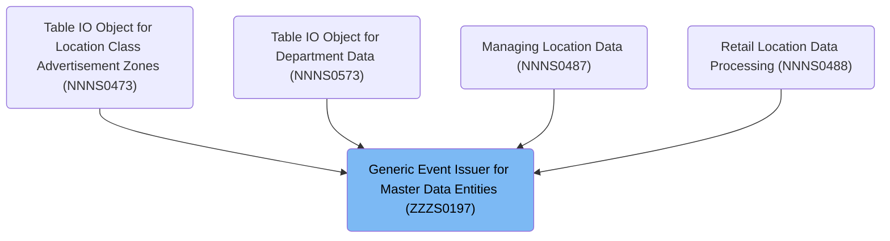

# Overview

This document describes the flow for filtering and issuing master data entity events. The process receives a list of events, filters them by transaction type and environment, removes duplicates, and issues only eligible events to the event staging system.

## Dependencies

### Programs

- ZZZS0197 (<SwmPath>[base/src/ZZZS0197.cbl](base/src/ZZZS0197.cbl)</SwmPath>)
- YYYS0175

### Copybooks

- YYYN000A (<SwmPath>[base/src/YYYN000A.cpy](base/src/YYYN000A.cpy)</SwmPath>)
- YYYC0175
- XXXN001A (<SwmPath>[base/src/XXXN001A.cpy](base/src/XXXN001A.cpy)</SwmPath>)
- YYYN110A (<SwmPath>[base/src/YYYN110A.cpy](base/src/YYYN110A.cpy)</SwmPath>)
- ZZZC0197 (<SwmPath>[base/src/ZZZC0197.cpy](base/src/ZZZC0197.cpy)</SwmPath>)

# Where is this program used?

This program is used multiple times in the codebase as represented in the following diagram:

&nbsp;

*This is an auto-generated document by Swimm 🌊 and has not yet been verified by a human*

<SwmMeta version="3.0.0" repo-id="Z2l0aHViJTNBJTNBU3dpbW1pby1keW5jYWxsLWRlbW8lM0ElM0FHaXJpLVN3aW1t" repo-name="Swimmio-dyncall-demo">Powered by [Swimm](https://app.swimm.io/)</SwmMeta>
