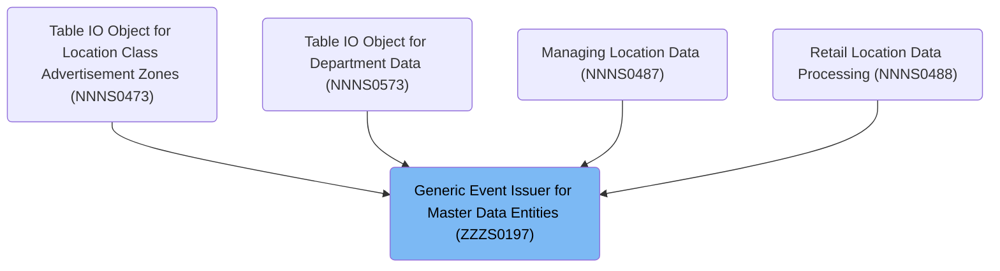
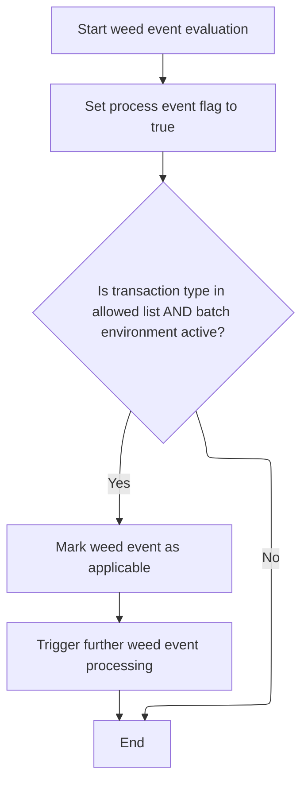

# Overview

This document describes the flow for issuing events related to master data entities and relationships. The process filters incoming events by transaction type and environment, excludes duplicates, and issues eligible events for further processing.

## Dependencies

### Programs

- <SwmToken path="base/src/ZZZS0197.cbl" pos="2:7:7" line-data="000200 PROGRAM-ID.    ZZZS0197.                                         00000200">`ZZZS0197`</SwmToken> (<SwmPath>[base/src/ZZZS0197.cbl](base/src/ZZZS0197.cbl)</SwmPath>)
- <SwmToken path="base/src/ZZZS0197.cbl" pos="16:20:20" line-data="004300 01 WS-EVENT-STAGER                 PIC X(8) VALUE &#39;YYYS0175&#39;.    00004300">`YYYS0175`</SwmToken>

### Copybooks

- <SwmToken path="base/src/ZZZS0197.cbl" pos="40:4:4" line-data="006700 COPY YYYN000A.                                                   00006700">`YYYN000A`</SwmToken> (<SwmPath>[base/src/YYYN000A.cpy](base/src/YYYN000A.cpy)</SwmPath>)
- <SwmToken path="base/src/ZZZS0197.cbl" pos="41:4:4" line-data="006800 COPY YYYC0175.                                                   00006800">`YYYC0175`</SwmToken>
- <SwmToken path="base/src/ZZZS0197.cbl" pos="44:4:4" line-data="007100     COPY XXXN001A.                                               00007100">`XXXN001A`</SwmToken> (<SwmPath>[base/src/XXXN001A.cpy](base/src/XXXN001A.cpy)</SwmPath>)
- <SwmToken path="base/src/ZZZS0197.cbl" pos="157:4:4" line-data="018400       AND YYYN110A-BATCH-ENV                                     00018400">`YYYN110A`</SwmToken> (<SwmPath>[base/src/YYYN110A.cpy](base/src/YYYN110A.cpy)</SwmPath>)
- <SwmToken path="base/src/ZZZS0197.cbl" pos="99:5:5" line-data="012600     IF  (ZZZC0197-TRX-ID = &#39;BVLM&#39;                                00012600">`ZZZC0197`</SwmToken> (<SwmPath>[base/src/ZZZC0197.cpy](base/src/ZZZC0197.cpy)</SwmPath>)

# Where is this program used?

This program is used multiple times in the codebase as represented in the following diagram:



## Detailed View of the Program's Functionality

a. Program Initialization and Entry Point

The program begins by defining its structure and working storage, including variables and flags used throughout the process. When execution starts, the main logic is entered. The first action is to perform an initialization routine. This routine resets the state of the system, ensuring that all relevant data structures and flags are set to their default values. It also checks if this is the first time the program is running in the current context; if so, it clears the event history table and marks that initialization has occurred.

b. Event Filtering and Deduplication

After initialization, the program proceeds to the event filtering phase. Here, it assumes that the current transaction should be processed as an event. It then performs a check against a hard-coded list of allowed transaction types. This check also ensures that the system is running in a batch environment. Only if both the transaction type is allowed and the batch environment is active does the program mark the event as eligible for further processing.

If the event passes this filter, the program then checks for duplicates. It compares the current transaction and its associated data with the most recently processed event. If they match, the event is flagged as a duplicate and will not be processed further. Additionally, the program iterates through a table of previously processed events to ensure that the current event has not already been handled. If it is unique, the event is added to the history table for future deduplication checks.

c. Event Issuing

If the event passes both the filtering and deduplication checks, the program proceeds to issue the event. It prepares the event data, setting environment flags to indicate whether the system is running in batch or online mode, and whether the database is Oracle or <SwmToken path="base/src/ZZZS0197.cbl" pos="211:6:6" line-data="023340       SET YYYC0175-DB2       TO TRUE                             00023340">`DB2`</SwmToken>. It copies relevant transaction and user information into the event structure. The type of action (add, delete, or modify) is determined based on the current operation. The program then marks the event as originating from the source system and targeting the mainframe.

Finally, the program calls an external event stager module, passing along the prepared event data for further processing or transmission.

d. Program Termination

After attempting to issue the event (or skipping this step if the event was filtered out or found to be a duplicate), the program returns control to the caller, completing its execution.

# Rule Definition

| Paragraph Name                                                                                                                                                                       | Rule ID | Category          | Description                                                                                                                                               | Conditions                                                                                                                   | Remarks                                                                                                                                                                                                                                                                                                                                                                                                                                                                                                                                                                                             |
| ------------------------------------------------------------------------------------------------------------------------------------------------------------------------------------ | ------- | ----------------- | --------------------------------------------------------------------------------------------------------------------------------------------------------- | ---------------------------------------------------------------------------------------------------------------------------- | --------------------------------------------------------------------------------------------------------------------------------------------------------------------------------------------------------------------------------------------------------------------------------------------------------------------------------------------------------------------------------------------------------------------------------------------------------------------------------------------------------------------------------------------------------------------------------------------------- |
| <SwmToken path="base/src/ZZZS0197.cbl" pos="58:4:6" line-data="008500     PERFORM 100-INITIALIZE                                       00008500">`100-INITIALIZE`</SwmToken>         | RL-001  | Data Assignment   | The system must initialize or reset its state before processing any events, including deduplication tables and control flags.                             | Always applies at the start of event processing.                                                                             | Deduplication table size is 100. Control flags are set to indicate first-time initialization.                                                                                                                                                                                                                                                                                                                                                                                                                                                                                                       |
| <SwmToken path="base/src/ZZZS0197.cbl" pos="91:4:12" line-data="011800     PERFORM 210-WEED-BY-HARD-CODE                                00011800">`210-WEED-BY-HARD-CODE`</SwmToken> | RL-002  | Conditional Logic | Events are processed only if the transaction type is in the allowed list and the batch environment flag is set.                                           | Transaction type must be one of the allowed codes. Batch environment flag must be 'Y'.                                       | Allowed transaction types: BVLM, APLM, BDMM, BCAM, CCSM, CEMM, CNCM, COMM, CRCM, CSCM, CTOM, DIRM, DISM, DSDM, FINM, ICCM, ITMM, IWVM, LOBM, MCEM, MRGM, OBSM, ORBM, PBCM, PBNM, PBTM, PCCM, PCTM, PDSH, PDUA, PDUP, PIPM, PRIM, PRMM, PRRM, PSBM, PSCM, RARM, RFTM, RITM, RRFM, RTDM, RTTM, SCAM, SDPM, SLDM, STAM, STPM, STRM, STTM, <SwmToken path="base/src/ZZZS0197.cbl" pos="149:14:14" line-data="017600*      OR ZZZC0197-TRX-ID = &#39;T2TM&#39;                                00017600">`T2TM`</SwmToken>, TRDM, VCMM, VENM, VISM, VLIM, WHSM, WLIM. Batch environment flag must be 'Y'. |
| <SwmToken path="base/src/ZZZS0197.cbl" pos="93:4:10" line-data="012000       PERFORM 220-WEED-DUP-EVENTS                                00012000">`220-WEED-DUP-EVENTS`</SwmToken>   | RL-003  | Conditional Logic | Events are deduplicated by comparing both transaction type and compare data against the previous event and all entries in the deduplication table.        | Current event's transaction type and compare data must not match the previous event or any entry in the deduplication table. | Deduplication table holds up to 100 events, each with transaction type (4 chars) and compare data (100 chars).                                                                                                                                                                                                                                                                                                                                                                                                                                                                                      |
| <SwmToken path="base/src/ZZZS0197.cbl" pos="65:4:8" line-data="009200       PERFORM 300-ISSUE-EVENT                                    00009200">`300-ISSUE-EVENT`</SwmToken>        | RL-004  | Data Assignment   | When issuing an event, output transaction type, compare data, transaction record, program name, and user. Set environment and action codes appropriately. | Event must be marked for processing and not deduplicated.                                                                    | Output fields: transaction type (4 chars), compare data (100 chars), transaction record, program name, user. Action code: 'A' for add, 'P' for delete, 'M' for modify. Environment flags set based on batch/CICS and DB2/Oracle.                                                                                                                                                                                                                                                                                                                                                                    |
| <SwmToken path="base/src/ZZZS0197.cbl" pos="57:2:4" line-data="008400 000-MAINLINE.                                                    00008400">`000-MAINLINE`</SwmToken>           | RL-005  | Computation       | After event processing is complete, control is returned to the caller.                                                                                    | Always applies after event processing.                                                                                       | No specific output format; simply returns control.                                                                                                                                                                                                                                                                                                                                                                                                                                                                                                                                                  |

# User Stories

## User Story 1: System initialization and completion

---

### Story Description:

As a system, I want to initialize/reset my state before processing events and return control after processing is complete so that event processing starts fresh and ends cleanly.

---

### Business Rule Mapping:

| Rule ID | Paragraph Name                                                                                                                                                               | Rule Description                                                                                                              |
| ------- | ---------------------------------------------------------------------------------------------------------------------------------------------------------------------------- | ----------------------------------------------------------------------------------------------------------------------------- |
| RL-005  | <SwmToken path="base/src/ZZZS0197.cbl" pos="57:2:4" line-data="008400 000-MAINLINE.                                                    00008400">`000-MAINLINE`</SwmToken>   | After event processing is complete, control is returned to the caller.                                                        |
| RL-001  | <SwmToken path="base/src/ZZZS0197.cbl" pos="58:4:6" line-data="008500     PERFORM 100-INITIALIZE                                       00008500">`100-INITIALIZE`</SwmToken> | The system must initialize or reset its state before processing any events, including deduplication tables and control flags. |

---

### Relevant Functionality:

- <SwmToken path="base/src/ZZZS0197.cbl" pos="57:2:4" line-data="008400 000-MAINLINE.                                                    00008400">`000-MAINLINE`</SwmToken>
  1. **RL-005:**
     - After all event processing steps, execute return (GOBACK) to caller.
- <SwmToken path="base/src/ZZZS0197.cbl" pos="58:4:6" line-data="008500     PERFORM 100-INITIALIZE                                       00008500">`100-INITIALIZE`</SwmToken>
  1. **RL-001:**
     - Initialize all working storage areas and linkage structures.
     - Set the event processing flag to true.
     - If this is the first run, initialize the deduplication table and mark as initialized.

## User Story 2: Event filtering, deduplication, and issuance

---

### Story Description:

As a system, I want to process only events with allowed transaction types and batch environment flag set, deduplicate events by comparing transaction type and compare data against previous events and a deduplication table, and issue unique events by outputting transaction type, compare data, transaction record, program name, and user, with appropriate environment and action codes, so that only eligible and unique events are correctly recorded and communicated.

---

### Business Rule Mapping:

| Rule ID | Paragraph Name                                                                                                                                                                       | Rule Description                                                                                                                                          |
| ------- | ------------------------------------------------------------------------------------------------------------------------------------------------------------------------------------ | --------------------------------------------------------------------------------------------------------------------------------------------------------- |
| RL-002  | <SwmToken path="base/src/ZZZS0197.cbl" pos="91:4:12" line-data="011800     PERFORM 210-WEED-BY-HARD-CODE                                00011800">`210-WEED-BY-HARD-CODE`</SwmToken> | Events are processed only if the transaction type is in the allowed list and the batch environment flag is set.                                           |
| RL-003  | <SwmToken path="base/src/ZZZS0197.cbl" pos="93:4:10" line-data="012000       PERFORM 220-WEED-DUP-EVENTS                                00012000">`220-WEED-DUP-EVENTS`</SwmToken>   | Events are deduplicated by comparing both transaction type and compare data against the previous event and all entries in the deduplication table.        |
| RL-004  | <SwmToken path="base/src/ZZZS0197.cbl" pos="65:4:8" line-data="009200       PERFORM 300-ISSUE-EVENT                                    00009200">`300-ISSUE-EVENT`</SwmToken>        | When issuing an event, output transaction type, compare data, transaction record, program name, and user. Set environment and action codes appropriately. |

---

### Relevant Functionality:

- <SwmToken path="base/src/ZZZS0197.cbl" pos="91:4:12" line-data="011800     PERFORM 210-WEED-BY-HARD-CODE                                00011800">`210-WEED-BY-HARD-CODE`</SwmToken>
  1. **RL-002:**
     - Check if transaction type is in the allowed list.
     - Check if batch environment flag is set.
     - If both conditions are met, mark event for processing.
- <SwmToken path="base/src/ZZZS0197.cbl" pos="93:4:10" line-data="012000       PERFORM 220-WEED-DUP-EVENTS                                00012000">`220-WEED-DUP-EVENTS`</SwmToken>
  1. **RL-003:**
     - If previous event's transaction type and compare data match current event, mark as duplicate.
     - For each entry in deduplication table (up to 100):
       - If transaction type and compare data match current event, mark as duplicate.
     - If event is unique and table is not full, add event to deduplication table.
- <SwmToken path="base/src/ZZZS0197.cbl" pos="65:4:8" line-data="009200       PERFORM 300-ISSUE-EVENT                                    00009200">`300-ISSUE-EVENT`</SwmToken>
  1. **RL-004:**
     - Initialize output event structure.
     - Set environment flags (batch/CICS, DB2/Oracle).
     - Move transaction type, compare data, transaction record, program name, and user to output structure.
     - Set action code based on operation type.
     - Call event stager with output structure.

# Workflow

# Starting the event processing sequence

This section governs the start of the event processing flow, ensuring the system is reset and only valid, non-duplicate events are considered for further processing.

| Category        | Rule Name                  | Description                                                                                                                                                                                                                                                                                              |
| --------------- | -------------------------- | -------------------------------------------------------------------------------------------------------------------------------------------------------------------------------------------------------------------------------------------------------------------------------------------------------- |
| Data validation | Event Eligibility Check    | An event should only be processed if the transaction type, environment, and event identifier meet predefined business conditions.                                                                                                                                                                        |
| Data validation | Duplicate Event Exclusion  | Duplicate events must be identified and excluded from processing to prevent redundant actions and maintain data integrity.                                                                                                                                                                               |
| Business logic  | System State Reset         | The system must always reset its state before processing any new event to ensure consistency and prevent residual data from affecting event handling.                                                                                                                                                    |
| Business logic  | Process Event Flag Setting | If the event is eligible and not a duplicate, the system must set the <SwmToken path="base/src/ZZZS0197.cbl" pos="64:4:6" line-data="009100     IF PROCESS-EVENT                                             00009100">`PROCESS-EVENT`</SwmToken> flag to indicate that event processing should proceed. |

<SwmSnippet path="/base/src/ZZZS0197.cbl" line="57">

---

In <SwmToken path="base/src/ZZZS0197.cbl" pos="57:2:4" line-data="008400 000-MAINLINE.                                                    00008400">`000-MAINLINE`</SwmToken> we kick off the flow by calling <SwmToken path="base/src/ZZZS0197.cbl" pos="58:4:6" line-data="008500     PERFORM 100-INITIALIZE                                       00008500">`100-INITIALIZE`</SwmToken> to reset the system state and prep for event handling. The next steps (event filtering, issuing, and returning) are conditional and follow after this entry point.

```cobol
008400 000-MAINLINE.                                                    00008400
008500     PERFORM 100-INITIALIZE                                       00008500
```

---

</SwmSnippet>

<SwmSnippet path="/base/src/ZZZS0197.cbl" line="61">

---

After initialization, we call <SwmToken path="base/src/ZZZS0197.cbl" pos="61:4:8" line-data="008800       PERFORM 200-WEED-EVENT                                     00008800">`200-WEED-EVENT`</SwmToken> to decide if the current transaction should trigger an event, and to weed out duplicates before moving forward.

```cobol
008800       PERFORM 200-WEED-EVENT                                     00008800
```

---

</SwmSnippet>

## Filtering and deduplicating events



This section is responsible for filtering incoming events to ensure only those with allowed transaction types and in the correct environment are processed, and for deduplicating events to prevent duplicate processing.

| Category        | Rule Name                     | Description                                                                                                                         |
| --------------- | ----------------------------- | ----------------------------------------------------------------------------------------------------------------------------------- |
| Data validation | Event exclusion criteria      | If an event does not meet both the allowed transaction type and batch environment criteria, it is excluded from further processing. |
| Data validation | Deduplication enforcement     | Duplicate events are identified and excluded from processing to ensure each event is only processed once.                           |
| Business logic  | Allowed transaction types     | Only events with transaction types listed in the allowed hard-coded list are eligible for processing.                               |
| Business logic  | Batch environment requirement | Events are only processed if the batch environment is active.                                                                       |
| Business logic  | Applicable event marking      | Events that pass all filtering and deduplication checks are marked as applicable and trigger further processing steps.              |

<SwmSnippet path="/base/src/ZZZS0197.cbl" line="89">

---

We assume the event should be processed, then check if it really should be, based on transaction type and environment.

```cobol
011600 200-WEED-EVENT.                                                  00011600
011700     SET PROCESS-EVENT TO TRUE                                    00011700
011800     PERFORM 210-WEED-BY-HARD-CODE                                00011800
```

---

</SwmSnippet>

<SwmSnippet path="/base/src/ZZZS0197.cbl" line="98">

---

We only allow event processing for specific transaction types in batch mode, using a big hard-coded list.

```cobol
012500 210-WEED-BY-HARD-CODE.                                           00012500
012600     IF  (ZZZC0197-TRX-ID = 'BVLM'                                00012600
012700*      OR ZZZC0197-TRX-ID = 'APLM'                                00012700
012800*      OR ZZZC0197-TRX-ID = 'BDMM'                                00012800
012900*      OR ZZZC0197-TRX-ID = 'BCAM'                                00012900
013000*      OR ZZZC0197-TRX-ID = 'CCSM'                                00013000
013100*      OR ZZZC0197-TRX-ID = 'CEMM'                                00013100
013200       OR ZZZC0197-TRX-ID = 'CNCM'                                00013200
013300*      OR ZZZC0197-TRX-ID = 'COMM'                                00013300
013400*      OR ZZZC0197-TRX-ID = 'CRCM'                                00013400
013500*      OR ZZZC0197-TRX-ID = 'CSCM'                                00013500
013600*      OR ZZZC0197-TRX-ID = 'CTOM'                                00013600
013700*      OR ZZZC0197-TRX-ID = 'DIRM'                                00013700
013800*      OR ZZZC0197-TRX-ID = 'DISM'                                00013800
013900*      OR ZZZC0197-TRX-ID = 'DSDM'                                00013900
014000*      OR ZZZC0197-TRX-ID = 'FINM'                                00014000
014100*      OR ZZZC0197-TRX-ID = 'ICCM'                                00014100
014200*      OR ZZZC0197-TRX-ID = 'ITMM'                                00014200
014300       OR ZZZC0197-TRX-ID = 'IWVM'                                00014300
014400*      OR ZZZC0197-TRX-ID = 'LOBM'                                00014400
014500*      OR ZZZC0197-TRX-ID = 'MCEM'                                00014500
014600*      OR ZZZC0197-TRX-ID = 'MRGM'                                00014600
014700       OR ZZZC0197-TRX-ID = 'OBSM'                                00014700
014800*      OR ZZZC0197-TRX-ID = 'ORBM'                                00014800
014900       OR ZZZC0197-TRX-ID = 'PBCM'                                00014900
015000*      OR ZZZC0197-TRX-ID = 'PBNM'                                00015000
015100       OR ZZZC0197-TRX-ID = 'PBTM'                                00015100
015200*      OR ZZZC0197-TRX-ID = 'PCCM'                                00015200
015300*      OR ZZZC0197-TRX-ID = 'PCTM'                                00015300
015400*      OR ZZZC0197-TRX-ID = 'PDSH'                                00015400
015500*      OR ZZZC0197-TRX-ID = 'PDUA'                                00015500
015600*      OR ZZZC0197-TRX-ID = 'PDUP'                                00015600
015700       OR ZZZC0197-TRX-ID = 'PIPM'                                00015700
015800*      OR ZZZC0197-TRX-ID = 'PRIM'                                00015800
015900*      OR ZZZC0197-TRX-ID = 'PRMM'                                00015900
016000*      OR ZZZC0197-TRX-ID = 'PRRM'                                00016000
016100       OR ZZZC0197-TRX-ID = 'PSBM'                                00016100
016200*      OR ZZZC0197-TRX-ID = 'PSCM'                                00016200
016300       OR ZZZC0197-TRX-ID = 'RARM'                                00016300
016400       OR ZZZC0197-TRX-ID = 'RFTM'                                00016400
016500       OR ZZZC0197-TRX-ID = 'RITM'                                00016500
016600       OR ZZZC0197-TRX-ID = 'RRFM'                                00016600
016700       OR ZZZC0197-TRX-ID = 'RTDM'                                00016700
016800*      OR ZZZC0197-TRX-ID = 'RTTM'                                00016800
016900       OR ZZZC0197-TRX-ID = 'SCAM'                                00016900
017000*      OR ZZZC0197-TRX-ID = 'SDPM'                                00017000
017100*      OR ZZZC0197-TRX-ID = 'SLDM'                                00017100
017200       OR ZZZC0197-TRX-ID = 'STAM'                                00017200
017300*      OR ZZZC0197-TRX-ID = 'STPM'                                00017300
017400*      OR ZZZC0197-TRX-ID = 'STRM'                                00017400
017500       OR ZZZC0197-TRX-ID = 'STTM'                                00017500
017600*      OR ZZZC0197-TRX-ID = 'T2TM'                                00017600
017700       OR ZZZC0197-TRX-ID = 'TRDM'                                00017700
017800*      OR ZZZC0197-TRX-ID = 'VCMM'                                00017800
017900*      OR ZZZC0197-TRX-ID = 'VENM'                                00017900
018000*      OR ZZZC0197-TRX-ID = 'VISM'                                00018000
018100*      OR ZZZC0197-TRX-ID = 'VLIM'                                00018100
018200*      OR ZZZC0197-TRX-ID = 'WHSM'                                00018200
018300       OR ZZZC0197-TRX-ID = 'WLIM')                               00018300
018400       AND YYYN110A-BATCH-ENV                                     00018400
018500         SET WEED-EVENT TO TRUE                                   00018500
018600     END-IF                                                       00018600
```

---

</SwmSnippet>

<SwmSnippet path="/base/src/ZZZS0197.cbl" line="92">

---

Back in <SwmToken path="base/src/ZZZS0197.cbl" pos="61:4:8" line-data="008800       PERFORM 200-WEED-EVENT                                     00008800">`200-WEED-EVENT`</SwmToken>, after checking transaction type and environment, we call <SwmToken path="base/src/ZZZS0197.cbl" pos="93:4:10" line-data="012000       PERFORM 220-WEED-DUP-EVENTS                                00012000">`220-WEED-DUP-EVENTS`</SwmToken> if <SwmToken path="base/src/ZZZS0197.cbl" pos="92:4:6" line-data="011900     IF PROCESS-EVENT                                             00011900">`PROCESS-EVENT`</SwmToken> is still true, to make sure we're not issuing duplicate events.

```cobol
011900     IF PROCESS-EVENT                                             00011900
012000       PERFORM 220-WEED-DUP-EVENTS                                00012000
012100     END-IF                                                       00012100
```

---

</SwmSnippet>

## Issuing events and returning control

<SwmSnippet path="/base/src/ZZZS0197.cbl" line="64">

---

Back in <SwmToken path="base/src/ZZZS0197.cbl" pos="57:2:4" line-data="008400 000-MAINLINE.                                                    00008400">`000-MAINLINE`</SwmToken>, after filtering and deduplication, we check <SwmToken path="base/src/ZZZS0197.cbl" pos="64:4:6" line-data="009100     IF PROCESS-EVENT                                             00009100">`PROCESS-EVENT`</SwmToken>. If it's true, we call <SwmToken path="base/src/ZZZS0197.cbl" pos="65:4:8" line-data="009200       PERFORM 300-ISSUE-EVENT                                    00009200">`300-ISSUE-EVENT`</SwmToken> to build and send the event, then return control with GOBACK.

```cobol
009100     IF PROCESS-EVENT                                             00009100
009200       PERFORM 300-ISSUE-EVENT                                    00009200
009300     END-IF                                                       00009300
009400                                                                  00009400
009500     GOBACK                                                       00009500
009600     .                                                            00009600
```

---

</SwmSnippet>

&nbsp;

*This is an auto-generated document by Swimm 🌊 and has not yet been verified by a human*

<SwmMeta version="3.0.0" repo-id="Z2l0aHViJTNBJTNBU3dpbW1pby1keW5jYWxsLWRlbW8lM0ElM0FHaXJpLVN3aW1t" repo-name="Swimmio-dyncall-demo"><sup>Powered by [Swimm](https://app.swimm.io/)</sup></SwmMeta>
