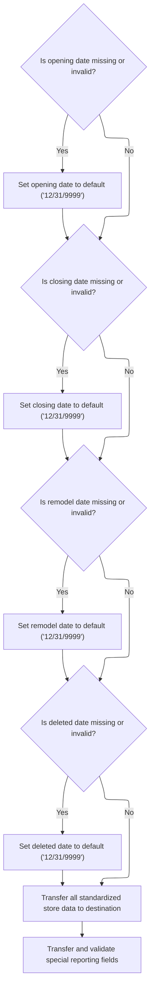
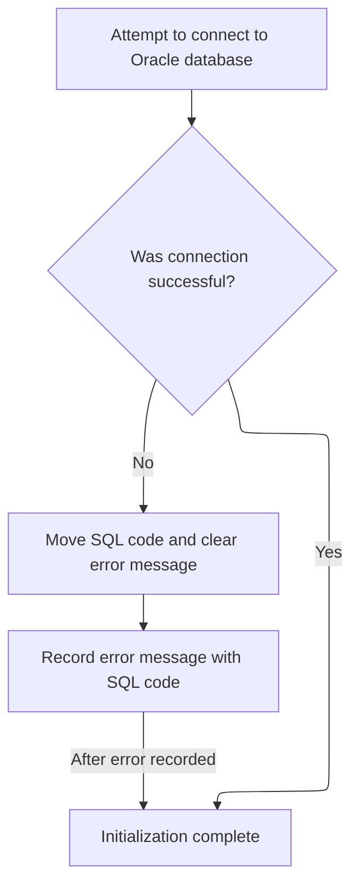

This document describes how store/location data and the system environment are prepared for further processing. The flow standardizes and validates input data, and establishes a database connection if required.

# Spec

## Detailed View of the Program's Functionality

# Detailed Explanation of the Flow

## a. Startup and Preprocessing

When the program starts, it performs an initialization routine. This routine prepares the working environment and sets up the necessary variables and flags for the rest of the process. Specifically, it:

- Clears and initializes the main communication area used for passing data between routines.
- Sets up the index handle for database operations.
- Resets checkpoint and SQL status indicators to zero.
- Checks if the current operation is not a cursor-closing operation. If so, it proceeds to normalize and prepare the store/location data for further processing by invoking a dedicated routine for this purpose.

If the operation involves Oracle database actions (such as inserting, purging, or modifying a row), it attempts to establish a connection to the Oracle database.

## b. Store Data Normalization and Rollup Prep

The normalization routine is responsible for ensuring that all date fields in the store/location data are valid and standardized. It checks each of the following date fields in turn: opening date, closing date, remodel date, and deleted date.

- If any of these dates are missing, blank, or set to a legacy default value (such as all zeroes or a very old date), the routine replaces them with a standard "far future" date (December 31, 9999).
- After normalizing the date fields, the routine copies all relevant store/location fields from the input area to the destination area used for database operations.
- Special attention is given to the rollup reporting code field. The routine clears the destination field for this code and then calls a subroutine to process and validate the rollup data.
- The rollup data subroutine overlays the rollup code as a numeric array, checks each element to ensure it is numeric, and copies valid numbers to the destination. If any element is not numeric, it sets the corresponding destination value to zero.
- Finally, the routine copies additional special reporting and status fields to the destination area.

## c. Oracle Connection Setup

When an Oracle database operation is required, the program attempts to establish a connection using a dedicated routine. This routine:

- Calls an external connection handler, passing the necessary communication and status areas.
- If the connection is unsuccessful, it records the SQL error code and constructs a detailed error message indicating the failure.
- The error message is stored in a designated return message area for further handling or reporting.
- If the connection is successful, the initialization process completes and the program is ready for further database operations.

---

This flow ensures that all store/location data is consistently formatted and validated before any database operations are performed, and that any required database connections are properly established and error-checked. The normalization of date fields and rollup codes is particularly important for maintaining data integrity and preventing errors during database transactions.

# Rule Definition

| Paragraph Name                                                             | Rule ID | Category          | Description                                                                                                                                                                                                                                                                                                      | Conditions                                                               | Remarks                                                                                                                                                                                 |
| -------------------------------------------------------------------------- | ------- | ----------------- | ---------------------------------------------------------------------------------------------------------------------------------------------------------------------------------------------------------------------------------------------------------------------------------------------------------------- | ------------------------------------------------------------------------ | --------------------------------------------------------------------------------------------------------------------------------------------------------------------------------------- |
| 110-MOVE-PDA-FIELDS-2-DCL                                                  | RL-001  | Conditional Logic | For each of the date fields (FC-RL-OPENING-DT, FC-RL-CLOSING-DT, FC-RL-REMODEL-DT, FC-RL-DELETED-DT), if the value is blank (all spaces), '00/00/0000', or '01/01/1600', replace it with '12/31/9999'. Otherwise, retain the original value.                                                                     | The field value is either all spaces, '00/00/0000', or '01/01/1600'.     | Constants: '12/31/9999', '00/00/0000', '01/01/1600'. Format: date fields are strings in MM/DD/YYYY format.                                                                              |
| 117-MOVE-ROLLUP-DATA                                                       | RL-002  | Computation       | Interpret the 20-character FN-ROLLUP-REPT-CD as up to 10 consecutive 2- or 3-digit numeric values (each up to 3 digits, left-justified, no delimiters). For each slot, if the substring is numeric, assign the integer value to the corresponding FN-ROLLUP-REPT-0X-NBR field; otherwise, set the field to zero. | FN-ROLLUP-REPT-CD is present in the input record.                        | FN-ROLLUP-REPT-CD: 20-character string. Output: 10 numeric fields, each up to 3 digits (number type), left-justified, zero if not numeric.                                              |
| 110-MOVE-PDA-FIELDS-2-DCL, 130-MOVE-DCL-2-PDA-FIELDS                       | RL-003  | Data Assignment   | All store/location fields other than the normalized date fields and expanded rollup numeric fields must be transferred unchanged from input to output.                                                                                                                                                           | Field is not one of the normalized date fields or rollup numeric fields. | All other fields retain their original format and value. No transformation is applied.                                                                                                  |
| 110-MOVE-PDA-FIELDS-2-DCL, 117-MOVE-ROLLUP-DATA, 130-MOVE-DCL-2-PDA-FIELDS | RL-004  | Data Assignment   | The output record must contain the normalized date fields, the 10 expanded rollup numeric fields, and all other store/location fields as in the input.                                                                                                                                                           | Output record is being constructed for downstream use.                   | Output format: all fields from input, with date fields normalized and rollup code expanded as described above. Field sizes and types match input except for normalized/expanded fields. |

# User Stories

## User Story 1: Normalize and transfer store/location fields

---

### Story Description:

As a system processing store/location data, I want to normalize date fields and transfer all other fields unchanged so that the output record maintains data integrity and consistency for downstream use.

---

### Business Rule Mapping:

| Rule ID | Paragraph Name                                                             | Rule Description                                                                                                                                                                                                                             |
| ------- | -------------------------------------------------------------------------- | -------------------------------------------------------------------------------------------------------------------------------------------------------------------------------------------------------------------------------------------- |
| RL-001  | 110-MOVE-PDA-FIELDS-2-DCL                                                  | For each of the date fields (FC-RL-OPENING-DT, FC-RL-CLOSING-DT, FC-RL-REMODEL-DT, FC-RL-DELETED-DT), if the value is blank (all spaces), '00/00/0000', or '01/01/1600', replace it with '12/31/9999'. Otherwise, retain the original value. |
| RL-003  | 110-MOVE-PDA-FIELDS-2-DCL, 130-MOVE-DCL-2-PDA-FIELDS                       | All store/location fields other than the normalized date fields and expanded rollup numeric fields must be transferred unchanged from input to output.                                                                                       |
| RL-004  | 110-MOVE-PDA-FIELDS-2-DCL, 117-MOVE-ROLLUP-DATA, 130-MOVE-DCL-2-PDA-FIELDS | The output record must contain the normalized date fields, the 10 expanded rollup numeric fields, and all other store/location fields as in the input.                                                                                       |

---

### Relevant Functionality:

- **110-MOVE-PDA-FIELDS-2-DCL**
  1. **RL-001:**
     - For each date field in the input record:
       - If the value is blank, '00/00/0000', or '01/01/1600':
         - Set the output value to '12/31/9999'.
       - Else:
         - Retain the original value.
  2. **RL-003:**
     - For each field in the input record (excluding the date fields and FN-ROLLUP-REPT-CD):
       - Copy the value directly to the output record.
  3. **RL-004:**
     - Construct the output record as follows:
       - Include all fields from the input record.
       - For date fields, use the normalized value.
       - For rollup numeric fields, use the expanded/parsed values.
       - All other fields are copied as-is.

## User Story 2: Expand rollup code into numeric fields

---

### Story Description:

As a system processing store/location data, I want to interpret and expand the rollup code field into 10 numeric fields so that downstream systems can easily access and use the rollup values.

---

### Business Rule Mapping:

| Rule ID | Paragraph Name                                                             | Rule Description                                                                                                                                                                                                                                                                                                 |
| ------- | -------------------------------------------------------------------------- | ---------------------------------------------------------------------------------------------------------------------------------------------------------------------------------------------------------------------------------------------------------------------------------------------------------------- |
| RL-004  | 110-MOVE-PDA-FIELDS-2-DCL, 117-MOVE-ROLLUP-DATA, 130-MOVE-DCL-2-PDA-FIELDS | The output record must contain the normalized date fields, the 10 expanded rollup numeric fields, and all other store/location fields as in the input.                                                                                                                                                           |
| RL-002  | 117-MOVE-ROLLUP-DATA                                                       | Interpret the 20-character FN-ROLLUP-REPT-CD as up to 10 consecutive 2- or 3-digit numeric values (each up to 3 digits, left-justified, no delimiters). For each slot, if the substring is numeric, assign the integer value to the corresponding FN-ROLLUP-REPT-0X-NBR field; otherwise, set the field to zero. |

---

### Relevant Functionality:

- **110-MOVE-PDA-FIELDS-2-DCL**
  1. **RL-004:**
     - Construct the output record as follows:
       - Include all fields from the input record.
       - For date fields, use the normalized value.
       - For rollup numeric fields, use the expanded/parsed values.
       - All other fields are copied as-is.
- **117-MOVE-ROLLUP-DATA**
  1. **RL-002:**
     - Copy FN-ROLLUP-REPT-CD to a working 20-character string.
     - For each of the 10 slots (positions 1-10):
       - Extract the corresponding 2- or 3-digit substring (left-justified, up to 3 digits).
       - If the substring is numeric:
         - Assign its integer value to the corresponding output numeric field.
       - Else:
         - Set the output numeric field to zero.

# Code Walkthrough

## Startup and Preprocessing

<SwmSnippet path="/base/src/NNNS0120.cbl" line="1691">

---

`100-INITIALIZATION` starts the flow, and if we're not closing the cursor, it calls 110-MOVE-PDA-FIELDS-2-DCL to prep and normalize the store/location data for the rest of the process.

```cobol
171200 100-INITIALIZATION.                                              00171200
171300     INITIALIZE W00N001A                                          00171300
171400     MOVE NNNN0000-INDEX-HANDLE TO DDDTRL01-INDEX-HANDLE          00171400
171500     MOVE 0 TO WS-CHECKPOINT-INC                                  00171500
171600     MOVE 0 TO SQLCODE                                            00171600
171700     MOVE 0 TO SQL-INIT-FLAG                                      00171700
171800     IF NOT EXIT-CLOSE-CURSOR                                     00171800
171900       PERFORM 110-MOVE-PDA-FIELDS-2-DCL                          00171900
172000     END-IF                                                       00172000
172100                                                                  00172100
172200     IF (YYYN005A-ORACLE       OR EXIT-PUT-INSERT-ROW             00172200
172300         OR EXIT-PUT-PURGE-ROW OR EXIT-PUT-MODIFY-ROW)            00172300
172400       PERFORM 115-CONNECT-TO-ORACLE                              00172400
172500     END-IF                                                       00172500
172600     .                                                            00172600
```

---

</SwmSnippet>

### Store Data Normalization and Rollup Prep



<SwmSnippet path="/base/src/NNNS0120.cbl" line="1711">

---

`110-MOVE-PDA-FIELDS-2-DCL` copies store/location fields and normalizes date fields to '12/31/9999' if they're blank or legacy defaults. It then calls 117-MOVE-ROLLUP-DATA to handle rollup fields that need extra validation.

```cobol
173200 110-MOVE-PDA-FIELDS-2-DCL.                                       00173200
173300     IF FC-RL-OPENING-DT OF P-DDDTRL01 = SPACES                   00173300
173400     OR FC-RL-OPENING-DT OF P-DDDTRL01 = '00/00/0000'             00173400
173500     OR FC-RL-OPENING-DT OF P-DDDTRL01 = '01/01/1600'             00173500
173600       MOVE '12/31/9999' TO FC-RL-OPENING-DT OF P-DDDTRL01        00173600
173700     END-IF                                                       00173700
173800     IF FC-RL-CLOSING-DT OF P-DDDTRL01 = SPACES                   00173800
173900     OR FC-RL-CLOSING-DT OF P-DDDTRL01 = '00/00/0000'             00173900
174000     OR FC-RL-CLOSING-DT OF P-DDDTRL01 = '01/01/1600'             00174000
174100       MOVE '12/31/9999' TO FC-RL-CLOSING-DT OF P-DDDTRL01        00174100
174200     END-IF                                                       00174200
174300     IF FC-RL-REMODEL-DT OF P-DDDTRL01 = SPACES                   00174300
174400     OR FC-RL-REMODEL-DT OF P-DDDTRL01 = '00/00/0000'             00174400
174500     OR FC-RL-REMODEL-DT OF P-DDDTRL01 = '01/01/1600'             00174500
174600       MOVE '12/31/9999' TO FC-RL-REMODEL-DT OF P-DDDTRL01        00174600
174700     END-IF                                                       00174700
174800     IF FC-RL-DELETED-DT OF P-DDDTRL01 = SPACES                   00174800
174900     OR FC-RL-DELETED-DT OF P-DDDTRL01 = '00/00/0000'             00174900
175000     OR FC-RL-DELETED-DT OF P-DDDTRL01 = '01/01/1600'             00175000
175100       MOVE '12/31/9999' TO FC-RL-DELETED-DT OF P-DDDTRL01        00175100
175200     END-IF                                                       00175200
175300                                                                  00175300
175400     MOVE FC-STORE-NO OF P-DDDTRL01                               00175400
175500       TO FC-STORE-NO OF DCLFC-XXXAIL-STORES                      00175500
175600     MOVE FC-RL-STORE-NM OF P-DDDTRL01                            00175600
175700       TO FC-RL-STORE-NM OF DCLFC-XXXAIL-STORES                   00175700
175800     MOVE FC-RL-STORE-CD OF P-DDDTRL01                            00175800
175900       TO FC-RL-STORE-CD OF DCLFC-XXXAIL-STORES                   00175900
176000     MOVE FC-RL-STORE-DIR-NM OF P-DDDTRL01                        00176000
176100       TO FC-RL-STORE-DIR-NM OF DCLFC-XXXAIL-STORES               00176100
176200     MOVE FC-RL-STORE-LOC-NM OF P-DDDTRL01                        00176200
176300       TO FC-RL-STORE-LOC-NM OF DCLFC-XXXAIL-STORES               00176300
176400     MOVE FC-RL-OPENING-DT OF P-DDDTRL01                          00176400
176500       TO FC-RL-OPENING-DT OF DCLFC-XXXAIL-STORES                 00176500
176600     MOVE FC-RL-CLOSING-DT OF P-DDDTRL01                          00176600
176700       TO FC-RL-CLOSING-DT OF DCLFC-XXXAIL-STORES                 00176700
176800     MOVE FC-RL-REMODEL-DT OF P-DDDTRL01                          00176800
176900       TO FC-RL-REMODEL-DT OF DCLFC-XXXAIL-STORES                 00176900
177000     MOVE FC-RL-DELETED-DT OF P-DDDTRL01                          00177000
177100       TO FC-RL-DELETED-DT OF DCLFC-XXXAIL-STORES                 00177100
177200     MOVE FC-RL-DISTRICT-NO OF P-DDDTRL01                         00177200
177300       TO FC-RL-DISTRICT-NO OF DCLFC-XXXAIL-STORES                00177300
177400     MOVE FC-RL-MARKET-AR-NO OF P-DDDTRL01                        00177400
177500       TO FC-RL-MARKET-AR-NO OF DCLFC-XXXAIL-STORES               00177500
177600     MOVE FC-RL-PAYROL-AR-NO OF P-DDDTRL01                        00177600
177700       TO FC-RL-PAYROL-AR-NO OF DCLFC-XXXAIL-STORES               00177700
177800     MOVE FC-RL-PAY-GROUP-NO OF P-DDDTRL01                        00177800
177900       TO FC-RL-PAY-GROUP-NO OF DCLFC-XXXAIL-STORES               00177900
178000     MOVE FC-RL-COMPANY-NO OF P-DDDTRL01                          00178000
178100       TO FC-RL-COMPANY-NO OF DCLFC-XXXAIL-STORES                 00178100
178200     MOVE FC-RL-GEO-ZONE-CD OF P-DDDTRL01                         00178200
178300       TO FC-RL-GEO-ZONE-CD OF DCLFC-XXXAIL-STORES                00178300
178400     MOVE FC-RL-GEO-ZONE-NO OF P-DDDTRL01                         00178400
178500       TO FC-RL-GEO-ZONE-NO OF DCLFC-XXXAIL-STORES                00178500
178600     MOVE FC-RL-SCAN-MAIN-CD OF P-DDDTRL01                        00178600
178700       TO FC-RL-SCAN-MAIN-CD OF DCLFC-XXXAIL-STORES               00178700
178800     MOVE FC-RL-FRONT-END-CD OF P-DDDTRL01                        00178800
178900       TO FC-RL-FRONT-END-CD OF DCLFC-XXXAIL-STORES               00178900
179000     MOVE FC-RL-PRICE-BUL-CD OF P-DDDTRL01                        00179000
179100       TO FC-RL-PRICE-BUL-CD OF DCLFC-XXXAIL-STORES               00179100
179200     MOVE FC-RL-UPC-ON-PB-CD OF P-DDDTRL01                        00179200
179300       TO FC-RL-UPC-ON-PB-CD OF DCLFC-XXXAIL-STORES               00179300
179400     MOVE FC-RL-COMPETITR-CD OF P-DDDTRL01                        00179400
179500       TO FC-RL-COMPETITR-CD OF DCLFC-XXXAIL-STORES               00179500
179600     MOVE FC-RL-ASSOC-STR-NO OF P-DDDTRL01                        00179600
179700       TO FC-RL-ASSOC-STR-NO OF DCLFC-XXXAIL-STORES               00179700
179800     MOVE FC-RL-RPRT-SEQ-NO OF P-DDDTRL01                         00179800
179900       TO FC-RL-RPRT-SEQ-NO OF DCLFC-XXXAIL-STORES                00179900
180000     MOVE FC-RL-SORT-SOS-NO OF P-DDDTRL01                         00180000
180100       TO FC-RL-SORT-SOS-NO OF DCLFC-XXXAIL-STORES                00180100
180200     MOVE FC-RL-VID-PRZN-NO OF P-DDDTRL01                         00180200
180300       TO FC-RL-VID-PRZN-NO OF DCLFC-XXXAIL-STORES                00180300
180400     MOVE FC-RL-CITY-ID-CD OF P-DDDTRL01                          00180400
180500       TO FC-RL-CITY-ID-CD OF DCLFC-XXXAIL-STORES                 00180500
180600     MOVE FC-RL-ADZONE-ABB OF P-DDDTRL01                          00180600
180700       TO FC-RL-ADZONE-ABB OF DCLFC-XXXAIL-STORES                 00180700
180800     MOVE FC-RL-ADZONE-DES OF P-DDDTRL01                          00180800
180900       TO FC-RL-ADZONE-DES OF DCLFC-XXXAIL-STORES                 00180900
181000     MOVE FC-RL-UNLOAD-SW OF P-DDDTRL01                           00181000
181100       TO FC-RL-UNLOAD-SW OF DCLFC-XXXAIL-STORES                  00181100
181200*    MOVE FN-ROLLUP-REPT-CD OF P-DDDTRL01                         00181200
181300     MOVE SPACES                                                  00181300
181400       TO FN-ROLLUP-REPT-CD OF DCLFC-XXXAIL-STORES                00181400
181500     PERFORM 117-MOVE-ROLLUP-DATA                                 00181500
181600     MOVE FC-RL-STATUS-CD OF P-DDDTRL01                           00181600
181700       TO FC-RL-STATUS-CD OF DCLFC-XXXAIL-STORES                  00181700
181800     MOVE FC-RL-NEW-STORE-CD OF P-DDDTRL01                        00181800
181900       TO FC-RL-NEW-STORE-CD OF DCLFC-XXXAIL-STORES               00181900
182000     MOVE FC-RL-TYPE-CD OF P-DDDTRL01                             00182000
182100       TO FC-RL-TYPE-CD OF DCLFC-XXXAIL-STORES                    00182100
182200     MOVE FC-RL-GROUP-CD OF P-DDDTRL01                            00182200
182300       TO FC-RL-GROUP-CD OF DCLFC-XXXAIL-STORES                   00182300
182400     MOVE FC-RL-SELECTCIR-CD OF P-DDDTRL01                        00182400
182500       TO FC-RL-SELECTCIR-CD OF DCLFC-XXXAIL-STORES               00182500
182600     MOVE FC-RL-AREA-CODE-NO OF P-DDDTRL01                        00182600
182700       TO FC-RL-AREA-CODE-NO OF DCLFC-XXXAIL-STORES               00182700
182800     MOVE FC-RL-TELEPHONE-NO OF P-DDDTRL01                        00182800
182900       TO FC-RL-TELEPHONE-NO OF DCLFC-XXXAIL-STORES               00182900
183000     MOVE FC-RL-STORE-ABB OF P-DDDTRL01                           00183000
183100       TO FC-RL-STORE-ABB OF DCLFC-XXXAIL-STORES                  00183100
183200     MOVE FC-RL-BCKRM-FT-QTY OF P-DDDTRL01                        00183200
183300       TO FC-RL-BCKRM-FT-QTY OF DCLFC-XXXAIL-STORES               00183300
183400     MOVE FC-RL-LFT-FOOD-QTY OF P-DDDTRL01                        00183400
183500       TO FC-RL-LFT-FOOD-QTY OF DCLFC-XXXAIL-STORES               00183500
183600     MOVE FC-RL-LFT-NONF-QTY OF P-DDDTRL01                        00183600
183700       TO FC-RL-LFT-NONF-QTY OF DCLFC-XXXAIL-STORES               00183700
183800     MOVE FC-RL-SETOFF-CD OF P-DDDTRL01                           00183800
183900       TO FC-RL-SETOFF-CD OF DCLFC-XXXAIL-STORES                  00183900
184000     MOVE FC-RL-CL12-ZONE-NO OF P-DDDTRL01                        00184000
184100       TO FC-RL-CL12-ZONE-NO OF DCLFC-XXXAIL-STORES               00184100
184200     MOVE FC-RL-CL12-ADZN-NO OF P-DDDTRL01                        00184200
184300       TO FC-RL-CL12-ADZN-NO OF DCLFC-XXXAIL-STORES               00184300
184400     MOVE FC-RL-CL13-ZONE-NO OF P-DDDTRL01                        00184400
184500       TO FC-RL-CL13-ZONE-NO OF DCLFC-XXXAIL-STORES               00184500
184600     MOVE FC-RL-CL13-ADZN-NO OF P-DDDTRL01                        00184600
184700       TO FC-RL-CL13-ADZN-NO OF DCLFC-XXXAIL-STORES               00184700
184800     MOVE FC-RL-CL14-ZONE-NO OF P-DDDTRL01                        00184800
184900       TO FC-RL-CL14-ZONE-NO OF DCLFC-XXXAIL-STORES               00184900
185000     MOVE FC-RL-CL14-ADZN-NO OF P-DDDTRL01                        00185000
185100       TO FC-RL-CL14-ADZN-NO OF DCLFC-XXXAIL-STORES               00185100
185200     MOVE FC-RL-CL36-ADZN-NO OF P-DDDTRL01                        00185200
185300       TO FC-RL-CL36-ADZN-NO OF DCLFC-XXXAIL-STORES               00185300
185400     MOVE FC-RL-CL37-ADZN-NO OF P-DDDTRL01                        00185400
185500       TO FC-RL-CL37-ADZN-NO OF DCLFC-XXXAIL-STORES               00185500
185600     MOVE FC-RL-STORE-DEA-NO OF P-DDDTRL01                        00185600
185700       TO FC-RL-STORE-DEA-NO OF DCLFC-XXXAIL-STORES               00185700
185800     MOVE FC-RL-RETL-ZONE-NO OF P-DDDTRL01                        00185800
185900       TO FC-RL-RETL-ZONE-NO OF DCLFC-XXXAIL-STORES               00185900
186000     MOVE FC-RL-STOR2-LOC-NM OF P-DDDTRL01                        00186000
186100       TO FC-RL-STOR2-LOC-NM OF DCLFC-XXXAIL-STORES               00186100
186200     MOVE FC-CITY-ADR OF P-DDDTRL01                               00186200
186300       TO FC-CITY-ADR OF DCLFC-XXXAIL-STORES                      00186300
186400     MOVE FC-STATE-ADR OF P-DDDTRL01                              00186400
186500       TO FC-STATE-ADR OF DCLFC-XXXAIL-STORES                     00186500
186600     MOVE FC-ZIP-CODE5-ADR OF P-DDDTRL01                          00186600
186700       TO FC-ZIP-CODE5-ADR OF DCLFC-XXXAIL-STORES                 00186700
186800     MOVE FC-ZIP-CODE4-ADR OF P-DDDTRL01                          00186800
186900       TO FC-ZIP-CODE4-ADR OF DCLFC-XXXAIL-STORES                 00186900
187000     MOVE FC-RL-SOS-TYPE-CD OF P-DDDTRL01                         00187000
187100       TO FC-RL-SOS-TYPE-CD OF DCLFC-XXXAIL-STORES                00187100
187200     MOVE FC-RL-NOPROCESS-CD OF P-DDDTRL01                        00187200
187300       TO FC-RL-NOPROCESS-CD OF DCLFC-XXXAIL-STORES               00187300
187400     MOVE FC-RL-SOSHDRTYP-CD OF P-DDDTRL01                        00187400
187500       TO FC-RL-SOSHDRTYP-CD OF DCLFC-XXXAIL-STORES               00187500
187600     MOVE FC-RL-CAT-CLASS-TB OF P-DDDTRL01                        00187600
187700       TO FC-RL-CAT-CLASS-TB OF DCLFC-XXXAIL-STORES               00187700
187800     MOVE FC-RL-LATITUDE-K OF P-DDDTRL01                          00187800
187900       TO FC-RL-LATITUDE-K OF DCLFC-XXXAIL-STORES                 00187900
188000     MOVE FC-RL-LONGITUDE-K OF P-DDDTRL01                         00188000
188100       TO FC-RL-LONGITUDE-K OF DCLFC-XXXAIL-STORES                00188100
188200     MOVE FN-DIVISION-CD OF P-DDDTRL01                            00188200
188300       TO FN-DIVISION-CD OF DCLFC-XXXAIL-STORES                   00188300
188400     MOVE FN-LINE-OF-BUS-CD OF P-DDDTRL01                         00188400
188500       TO FN-LINE-OF-BUS-CD OF DCLFC-XXXAIL-STORES                00188500
188600     .                                                            00188600
```

---

</SwmSnippet>

<SwmSnippet path="/base/src/NNNS0120.cbl" line="1884">

---

`117-MOVE-ROLLUP-DATA` overlays the rollup code as a numeric array, moves valid numbers to the destination, and sets invalid ones to zero.

```cobol
190500 117-MOVE-ROLLUP-DATA.                                            00190500
190600     MOVE FN-ROLLUP-REPT-CD OF P-DDDTRL01                         00190600
190700       TO WS-REPT-TBL-TXT                                         00190700
190800     IF WS-REPT-TBL-NUMERIC(1) IS NUMERIC                         00190800
190900        MOVE WS-REPT-TBL-NUMERIC(1)                               00190900
191000          TO FN-ROLLUP-REPT-01-NBR  OF DCLFC-XXXAIL-STORES        00191000
191100     ELSE                                                         00191100
191200        MOVE ZERO TO FN-ROLLUP-REPT-01-NBR OF DCLFC-XXXAIL-STORES 00191200
191300     END-IF                                                       00191300
191400     IF WS-REPT-TBL-NUMERIC(2) IS NUMERIC                         00191400
191500        MOVE WS-REPT-TBL-NUMERIC(2)                               00191500
191600          TO FN-ROLLUP-REPT-02-NBR  OF DCLFC-XXXAIL-STORES        00191600
191700     ELSE                                                         00191700
191800        MOVE ZERO TO FN-ROLLUP-REPT-02-NBR OF DCLFC-XXXAIL-STORES 00191800
191900     END-IF                                                       00191900
192000     IF WS-REPT-TBL-NUMERIC(3) IS NUMERIC                         00192000
192100        MOVE WS-REPT-TBL-NUMERIC(3)                               00192100
192200          TO FN-ROLLUP-REPT-03-NBR  OF DCLFC-XXXAIL-STORES        00192200
192300     ELSE                                                         00192300
192400        MOVE ZERO TO FN-ROLLUP-REPT-03-NBR OF DCLFC-XXXAIL-STORES 00192400
192500     END-IF                                                       00192500
192600     IF WS-REPT-TBL-NUMERIC(4) IS NUMERIC                         00192600
192700        MOVE WS-REPT-TBL-NUMERIC(4)                               00192700
192800          TO FN-ROLLUP-REPT-04-NBR  OF DCLFC-XXXAIL-STORES        00192800
192900     ELSE                                                         00192900
193000        MOVE ZERO TO FN-ROLLUP-REPT-04-NBR OF DCLFC-XXXAIL-STORES 00193000
193100     END-IF                                                       00193100
193200     IF WS-REPT-TBL-NUMERIC(5) IS NUMERIC                         00193200
193300        MOVE WS-REPT-TBL-NUMERIC(5)                               00193300
193400          TO FN-ROLLUP-REPT-05-NBR  OF DCLFC-XXXAIL-STORES        00193400
193500     ELSE                                                         00193500
193600        MOVE ZERO TO FN-ROLLUP-REPT-05-NBR OF DCLFC-XXXAIL-STORES 00193600
193700     END-IF                                                       00193700
193800     IF WS-REPT-TBL-NUMERIC(6) IS NUMERIC                         00193800
193900        MOVE WS-REPT-TBL-NUMERIC(6)                               00193900
194000          TO FN-ROLLUP-REPT-06-NBR  OF DCLFC-XXXAIL-STORES        00194000
194100     ELSE                                                         00194100
194200        MOVE ZERO TO FN-ROLLUP-REPT-06-NBR OF DCLFC-XXXAIL-STORES 00194200
194300     END-IF                                                       00194300
194400     IF WS-REPT-TBL-NUMERIC(7) IS NUMERIC                         00194400
194500        MOVE WS-REPT-TBL-NUMERIC(7)                               00194500
194600          TO FN-ROLLUP-REPT-07-NBR  OF DCLFC-XXXAIL-STORES        00194600
194700     ELSE                                                         00194700
194800        MOVE ZERO TO FN-ROLLUP-REPT-07-NBR OF DCLFC-XXXAIL-STORES 00194800
194900     END-IF                                                       00194900
195000     IF WS-REPT-TBL-NUMERIC(8) IS NUMERIC                         00195000
195100        MOVE WS-REPT-TBL-NUMERIC(8)                               00195100
195200          TO FN-ROLLUP-REPT-08-NBR  OF DCLFC-XXXAIL-STORES        00195200
195300     ELSE                                                         00195300
195400        MOVE ZERO TO FN-ROLLUP-REPT-08-NBR OF DCLFC-XXXAIL-STORES 00195400
195500     END-IF                                                       00195500
195600     IF WS-REPT-TBL-NUMERIC(9) IS NUMERIC                         00195600
195700        MOVE WS-REPT-TBL-NUMERIC(9)                               00195700
195800          TO FN-ROLLUP-REPT-09-NBR  OF DCLFC-XXXAIL-STORES        00195800
195900     ELSE                                                         00195900
196000        MOVE ZERO TO FN-ROLLUP-REPT-09-NBR OF DCLFC-XXXAIL-STORES 00196000
196100     END-IF                                                       00196100
196200     IF WS-REPT-TBL-NUMERIC(10) IS NUMERIC                        00196200
196300        MOVE WS-REPT-TBL-NUMERIC(10)                              00196300
196400          TO FN-ROLLUP-REPT-10-NBR  OF DCLFC-XXXAIL-STORES        00196400
196500     ELSE                                                         00196500
196600        MOVE ZERO TO FN-ROLLUP-REPT-10-NBR OF DCLFC-XXXAIL-STORES 00196600
196700     END-IF                                                       00196700
196800     .                                                            00196800
```

---

</SwmSnippet>

### Oracle Connection Setup



<SwmSnippet path="/base/src/NNNS0120.cbl" line="1871">

---

`115-CONNECT-TO-ORACLE` tries to connect to Oracle and handles errors, then calls XXXS0210 to finish setting up the database environment.

```cobol
189200 115-CONNECT-TO-ORACLE.                                           00189200
189300     CALL Z-ORA-CONNECT USING W00N001A                            00189300
189400                              SQLCA                               00189400
189500     IF NOT SUCCESS                                               00189500
189600       MOVE SQLCODE TO WS-SQLCODE                                 00189600
189700       MOVE SPACES  TO IS-RTRN-MSG-TXT                            00189700
189800       STRING 'NNNS0120 - Error connecting to Oracle. Sqlcode ='  00189800
189900               WS-SQLCODE                                         00189900
190000               DELIMITED BY SIZE INTO IS-RTRN-MSG-TXT             00190000
190100     END-IF                                                       00190100
190200     .                                                            00190200
```

---

</SwmSnippet>

&nbsp;

*This is an auto-generated document by Swimm 🌊 and has not yet been verified by a human*

<SwmMeta version="3.0.0" repo-id="Z2l0aHViJTNBJTNBU3dpbW1pby1keW5jYWxsLWRlbW8lM0ElM0FHaXJpLVN3aW1t" repo-name="Swimmio-dyncall-demo"><sup>Powered by [Swimm](https://app.swimm.io/)</sup></SwmMeta>
