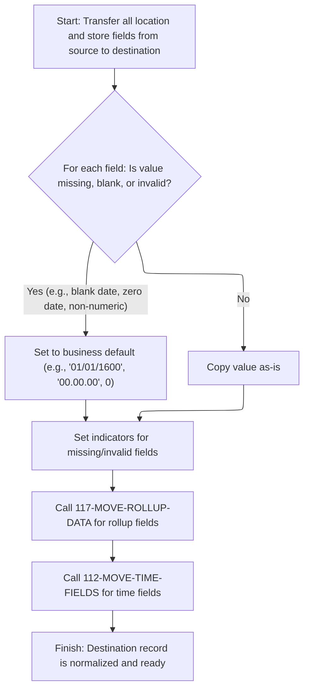

This document describes how location and store data records are prepared and normalized before further business processing. The flow validates incoming data, applies business rules to handle missing or invalid fields, and ensures the record is ready for downstream operations.

# Spec

## Detailed View of the Program's Functionality

# Swimmio-dyncall-demo: Detailed Flow Explanation

---

## a. Startup and Preprocessing

When the program starts, it performs a series of initialization steps to prepare the environment for further processing:

- It resets or initializes several working areas and status flags to ensure a clean state.
- It copies an index handle from a parameter area to a working area, and resets checkpoint and SQL-related flags.
- Unless the operation is specifically a cursor close, it proceeds to copy and normalize location data from the input structure to the internal working structure, preparing it for further processing.
- If the operation involves Oracle (or certain types of row modifications), it establishes a connection to the Oracle database, handling any connection errors by capturing the error code and building an error message.

---

## b. Location Data Preparation and Validation

This is a critical section where the program ensures that all location and store-related fields are properly validated and normalized before any database operations:

- **Field Copying and Defaulting:**\
  Each field from the input structure is examined. If a field is missing, blank, or contains an invalid value (such as a blank or zero date, or a non-numeric value where a number is expected), the program assigns a business-defined default value (e.g., a default date, zero, or a placeholder string).
- **Indicator Handling:**\
  For fields that are missing or invalid, corresponding indicator variables are set to signal this status. These indicators are used later for database operations that support nulls or require special handling.
- **Business Rule Application:**\
  Certain flags and switches are set or defaulted according to business rules. For example, if a store type code is blank, it is defaulted to a specific value. Numeric fields are validated and defaulted to zero if not numeric.
- **Special Handling:**\
  There is a tweak for one field if the program is running in a specific environment (CICS).
- **Rollup Fields:**\
  The rollup report text field is not copied directly. Instead, it is cleared, and a special routine is called to process and validate the rollup data.
- **Time Fields:**\
  All open/close time fields for each day of the week are checked for blanks or defaults and set accordingly. Special conversions are performed if the program is working with Oracle or certain row operations.
- **Final Normalization:**\
  After all fields are processed, the destination record is considered normalized and ready for further use.

---

## c. Rollup Data Validation

The rollup report field, which is a text field representing an array of numbers, is handled with extra care:

- The text is reinterpreted as an array of ten numbers.
- Each number is checked: if it is numeric, it is copied to the destination; if not, the destination field is set to zero.
- This ensures that only valid numeric data is stored in the rollup fields, preventing data corruption or errors in downstream processing.

---

## d. Time Field Conversion

Time fields (open/close times for each day) are handled differently depending on the database environment:

- **Oracle or Insert/Modify Operations:**\
  All time fields are packed into an array and a conversion mode is set. An external routine is called to convert these times into timestamp format suitable for Oracle. If the conversion fails, an error message is constructed; if successful, the results are unpacked into the appropriate timestamp fields.
- **Other Environments:**\
  If not working with Oracle, the time fields are simply copied as-is from the input to the destination structure.

---

## e. Database Connection Setup

When a connection to Oracle is required:

- The program calls a connection routine, passing the necessary parameters.
- If the connection fails, it captures the SQL error code and constructs a detailed error message for reporting.
- The actual connection logic is handled by a lower-level routine, which manages the database state.

---

## f. Summary

The overall flow ensures that:

- All input data is validated, normalized, and defaulted according to business rules.
- Special fields (rollup and time fields) receive extra validation and conversion as needed.
- Database connections are established only when required, with robust error handling.
- The resulting data structures are ready for safe and consistent database operations, regardless of the underlying database system.

---

This approach ensures data integrity, consistency, and compatibility across different database environments, while providing clear error reporting and handling for any issues encountered during processing.

# Rule Definition

| Paragraph Name                                                                | Rule ID | Category          | Description                                                                                                                                                                                                                                         | Conditions                                                                                                 | Remarks                                                                                                                        |
| ----------------------------------------------------------------------------- | ------- | ----------------- | --------------------------------------------------------------------------------------------------------------------------------------------------------------------------------------------------------------------------------------------------- | ---------------------------------------------------------------------------------------------------------- | ------------------------------------------------------------------------------------------------------------------------------ |
| 110-MOVE-PDA-FIELDS-2-DCL                                                     | RL-001  | Conditional Logic | For each date field, if the value is all spaces or '00000000', set the destination field to '16000101'. Otherwise, copy the value as-is.                                                                                                            | Field is a date field (e.g., SLS-CLOSED-DT, STR-REMODL-DT, RETL-LOC-STAT-DT, ECOMM-STRT-DT, ECOMM-END-DT). | Constants: K-DEF-DT = '16000101', K-ZERO-DT = '00000000'. Format: 8-character string (YYYYMMDD).                               |
| 110-MOVE-PDA-FIELDS-2-DCL, 112-MOVE-TIME-FIELDS                               | RL-002  | Conditional Logic | For each time field, if the value is all spaces or '00.00.00', set the destination field to '00.00.00'. If the value is '24.00.00', set the destination field to '23.59.59'. Otherwise, copy the value as-is.                                       | Field is a time field (e.g., MON-OPEN-TM, MON-CLOS-TM, TUE-OPEN-TM, TUE-CLOS-TM, etc.).                    | Constants: K-DEF-TM = '00.00.00', K-DB2-MAX-TM = '24.00.00', K-ORA-MAX-TM = '23.59.59'. Format: 8-character string (HH.MM.SS). |
| 110-MOVE-PDA-FIELDS-2-DCL                                                     | RL-003  | Conditional Logic | For each numeric field, if the value is not numeric, set the destination field to 0. Otherwise, copy the value as-is.                                                                                                                               | Field is a numeric field (e.g., LAT-K, LON-K, TBCO-PRMT-NBR).                                              | Format: Numeric (precision depends on field).                                                                                  |
| 117-MOVE-ROLLUP-DATA                                                          | RL-004  | Computation       | Parse the rollup string into 10 subfields, each representing a 3-digit number. For each subfield, if the value is numeric, copy it to the corresponding destination field. If not numeric, set the destination field to 0.                          | Field is ROLUP-REPT-TBL-TXT.                                                                               | Format: 20-character string, parsed into 10 subfields of 3 digits each (numeric).                                              |
| 110-MOVE-PDA-FIELDS-2-DCL, 1700-CHECK-NULL-COLUMNS, 1800-EDIT-NULL-INDICATORS | RL-005  | Conditional Logic | For each nullable field, if the value is blank (spaces) or zero, set the destination field to blank or zero as appropriate and set the corresponding indicator variable to -1. Otherwise, copy the value as-is and set the indicator variable to 0. | Field is nullable (e.g., ASSOC-STR-NBR, ASSOC-STR-TYP-CD, RPLACD-BY-STR-NBR, ECOMM-STRT-DT, ECOMM-END-DT). | Indicator fields are numeric (usually S9(4) COMP or similar). Nullable fields may be alphanumeric or numeric.                  |
| 110-MOVE-PDA-FIELDS-2-DCL, 1800-EDIT-NULL-INDICATORS, 1700-CHECK-NULL-COLUMNS | RL-006  | Conditional Logic | All fields must be validated and normalized according to business rules before being used for database operations or further processing.                                                                                                            | Before any database operation or further processing.                                                       | Covers all field types and normalization rules above.                                                                          |
| 110-MOVE-PDA-FIELDS-2-DCL, 1700-CHECK-NULL-COLUMNS, 1800-EDIT-NULL-INDICATORS | RL-007  | Data Assignment   | Set indicator fields (such as the indicator for e-commerce start date, e-commerce end date, replaced-by store number, associated store number, and associated store type) to -1 if the corresponding field is blank or zero, otherwise set to 0.    | Indicator field corresponds to a nullable field.                                                           | Indicator fields: numeric, typically 4-byte signed integer. Value: -1 (null), 0 (not null).                                    |

# User Stories

## User Story 1: Normalize, validate, and transfer all fields including rollup data

---

### Story Description:

As a system, I want to normalize, validate, and transfer all date, time, numeric, and rollup fields from the source record to the destination record so that the data is consistent, accurate, and meets all business requirements before further processing.

---

### Business Rule Mapping:

| Rule ID | Paragraph Name                                                                | Rule Description                                                                                                                                                                                                           |
| ------- | ----------------------------------------------------------------------------- | -------------------------------------------------------------------------------------------------------------------------------------------------------------------------------------------------------------------------- |
| RL-001  | 110-MOVE-PDA-FIELDS-2-DCL                                                     | For each date field, if the value is all spaces or '00000000', set the destination field to '16000101'. Otherwise, copy the value as-is.                                                                                   |
| RL-002  | 110-MOVE-PDA-FIELDS-2-DCL, 112-MOVE-TIME-FIELDS                               | For each time field, if the value is all spaces or '00.00.00', set the destination field to '00.00.00'. If the value is '24.00.00', set the destination field to '23.59.59'. Otherwise, copy the value as-is.              |
| RL-003  | 110-MOVE-PDA-FIELDS-2-DCL                                                     | For each numeric field, if the value is not numeric, set the destination field to 0. Otherwise, copy the value as-is.                                                                                                      |
| RL-006  | 110-MOVE-PDA-FIELDS-2-DCL, 1800-EDIT-NULL-INDICATORS, 1700-CHECK-NULL-COLUMNS | All fields must be validated and normalized according to business rules before being used for database operations or further processing.                                                                                   |
| RL-004  | 117-MOVE-ROLLUP-DATA                                                          | Parse the rollup string into 10 subfields, each representing a 3-digit number. For each subfield, if the value is numeric, copy it to the corresponding destination field. If not numeric, set the destination field to 0. |

---

### Relevant Functionality:

- **110-MOVE-PDA-FIELDS-2-DCL**
  1. **RL-001:**
     - For each date field:
       - If value is spaces or '00000000':
         - Set destination field to '16000101'
       - Else:
         - Copy value as-is
  2. **RL-002:**
     - For each time field:
       - If value is spaces or '00.00.00':
         - Set destination field to '00.00.00'
       - If value is '24.00.00':
         - Set destination field to '23.59.59'
       - Else:
         - Copy value as-is
  3. **RL-003:**
     - For each numeric field:
       - If value is not numeric:
         - Set destination field to 0
       - Else:
         - Copy value as-is
  4. **RL-006:**
     - Before DB operations:
       - Ensure all normalization and validation rules have been applied
       - Only use normalized/validated data for DB operations or further processing
- **117-MOVE-ROLLUP-DATA**
  1. **RL-004:**
     - Parse rollup string into 10 subfields
     - For each subfield:
       - If numeric:
         - Copy to destination
       - Else:
         - Set destination to 0

## User Story 2: Handle nullable fields and indicator variables

---

### Story Description:

As a system, I want to correctly handle nullable fields and set their indicator variables so that the destination record accurately reflects null or valid values according to business rules.

---

### Business Rule Mapping:

| Rule ID | Paragraph Name                                                                | Rule Description                                                                                                                                                                                                                                    |
| ------- | ----------------------------------------------------------------------------- | --------------------------------------------------------------------------------------------------------------------------------------------------------------------------------------------------------------------------------------------------- |
| RL-005  | 110-MOVE-PDA-FIELDS-2-DCL, 1700-CHECK-NULL-COLUMNS, 1800-EDIT-NULL-INDICATORS | For each nullable field, if the value is blank (spaces) or zero, set the destination field to blank or zero as appropriate and set the corresponding indicator variable to -1. Otherwise, copy the value as-is and set the indicator variable to 0. |
| RL-007  | 110-MOVE-PDA-FIELDS-2-DCL, 1700-CHECK-NULL-COLUMNS, 1800-EDIT-NULL-INDICATORS | Set indicator fields (such as the indicator for e-commerce start date, e-commerce end date, replaced-by store number, associated store number, and associated store type) to -1 if the corresponding field is blank or zero, otherwise set to 0.    |

---

### Relevant Functionality:

- **110-MOVE-PDA-FIELDS-2-DCL**
  1. **RL-005:**
     - For each nullable field:
       - If value is blank or zero:
         - Set destination to blank/zero
         - Set indicator to -1
       - Else:
         - Copy value as-is
         - Set indicator to 0
  2. **RL-007:**
     - For each indicator field:
       - If corresponding field is blank or zero:
         - Set indicator to -1
       - Else:
         - Set indicator to 0

# Code Walkthrough

## Startup and Preprocessing

<SwmSnippet path="/base/src/NNNS0488.cbl" line="1239">

---

100-INITIALIZATION sets up the environment and, unless we're closing a cursor, calls 110-MOVE-PDA-FIELDS-2-DCL to prep location data for the rest of the flow.

```cobol
128400 100-INITIALIZATION.                                              00128400
128500     INITIALIZE XXXN001A                                          00128500
128600                DAO-STATUS                                        00128600
128700                WS-LOC-STAT-SW                                    00128700
128800                WS-CURR-VALUES                                    00128800
128900     MOVE NNNN0000-INDEX-HANDLE TO DDDTLR01-INDEX-HANDLE          00128900
129000     MOVE 0 TO WS-CHECKPOINT-INC                                  00129000
129100     MOVE 0 TO SQLCODE                                            00129100
129200     MOVE 0 TO SQL-INIT-FLAG                                      00129200
129300     IF NOT EXIT-CLOSE-CURSOR                                     00129300
129400       PERFORM 110-MOVE-PDA-FIELDS-2-DCL                          00129400
129500     END-IF                                                       00129500
129600     IF (YYYN005A-ORACLE       OR EXIT-PUT-INSERT-ROW             00129600
129700         OR EXIT-PUT-PURGE-ROW OR EXIT-PUT-MODIFY-ROW)            00129700
129800       PERFORM 115-CONNECT-TO-ORACLE                              00129800
129900     END-IF                                                       00129900
130000     .                                                            00130000
```

---

</SwmSnippet>

### Location Data Preparation and Validation



<SwmSnippet path="/base/src/NNNS0488.cbl" line="1261">

---

110-MOVE-PDA-FIELDS-2-DCL copies and validates a ton of fields from the source to the destination structure. It checks for empty or special values in date/time fields and assigns defaults if needed, sets indicator variables based on field values, and applies business rules for flags and switches. Numeric fields are validated and defaulted if not numeric. There's also a CICS-specific tweak for one field. Next, it calls 117-MOVE-ROLLUP-DATA to handle rollup report fields, since those need extra validation and can't just be copied directly.

```cobol
130600 110-MOVE-PDA-FIELDS-2-DCL.                                       00130600
130700     MOVE LOC-NBR OF P-DDDTLR01 TO LOC-NBR OF DCLXXXAIL-LOC       00130700
130800     MOVE LOC-TYP-CD OF P-DDDTLR01 TO LOC-TYP-CD OF DCLXXXAIL-LOC 00130800
130900                                                                  00130900
131000     IF ASSOC-STR-TYP-CD OF P-DDDTLR01 = SPACES                   00131000
131100        MOVE 'S' TO ASSOC-STR-TYP-CD OF P-DDDTLR01                00131100
131200     END-IF                                                       00131200
131300     MOVE ASSOC-STR-TYP-CD OF P-DDDTLR01                          00131300
131400       TO ASSOC-STR-TYP-CD OF DCLXXXAIL-LOC                       00131400
131500     MOVE 0 TO  WS-ASSOC-ST-TYPE-IND                              00131500
131600     MOVE ASSOC-STR-NBR OF P-DDDTLR01                             00131600
131700       TO ASSOC-STR-NBR OF DCLXXXAIL-LOC                          00131700
131800     IF ASSOC-STR-NBR OF P-DDDTLR01  =  ZERO                      00131800
131900        MOVE -1 TO WS-ASSOC-ST-NO-IND                             00131900
132000     ELSE                                                         00132000
132100        MOVE 0 TO  WS-ASSOC-ST-NO-IND                             00132100
132200     END-IF                                                       00132200
132300                                                                  00132300
132400     IF SLS-CLOSED-DT OF P-DDDTLR01 = SPACES                      00132400
132500     OR SLS-CLOSED-DT OF P-DDDTLR01 = K-ZERO-DT                   00132500
132600       MOVE K-DEF-DT TO SLS-CLOSED-DT OF P-DDDTLR01               00132600
132700     END-IF                                                       00132700
132800     MOVE SLS-CLOSED-DT OF P-DDDTLR01                             00132800
132900       TO SLS-CLOSED-DT OF DCLXXXAIL-LOC                          00132900
133000     IF STR-REMODL-DT OF P-DDDTLR01 = SPACES                      00133000
133100     OR STR-REMODL-DT OF P-DDDTLR01 = K-ZERO-DT                   00133100
133200       MOVE K-DEF-DT TO STR-REMODL-DT OF P-DDDTLR01               00133200
133300     END-IF                                                       00133300
133400     MOVE STR-REMODL-DT OF P-DDDTLR01                             00133400
133500       TO STR-REMODL-DT OF DCLXXXAIL-LOC                          00133500
133600                                                                  00133600
133700     MOVE RETL-LOC-STAT-CD OF P-DDDTLR01                          00133700
133800       TO RETL-LOC-STAT-CD OF DCLXXXAIL-LOC                       00133800
133900                                                                  00133900
134000     IF RETL-LOC-STAT-DT OF P-DDDTLR01 = SPACES                   00134000
134100     OR RETL-LOC-STAT-DT OF P-DDDTLR01 = K-ZERO-DT                00134100
134200       MOVE K-DEF-DT TO RETL-LOC-STAT-DT OF P-DDDTLR01            00134200
134300     END-IF                                                       00134300
134400     MOVE RETL-LOC-STAT-DT OF P-DDDTLR01                          00134400
134500       TO RETL-LOC-STAT-DT OF DCLXXXAIL-LOC                       00134500
134600                                                                  00134600
134700     MOVE COMPANY-ID OF P-DDDTLR01 TO COMPANY-ID OF DCLXXXAIL-LOC 00134700
134800     MOVE FINANCIAL-DIV-ID OF P-DDDTLR01                          00134800
134900       TO FINANCIAL-DIV-ID OF DCLXXXAIL-LOC                       00134900
135000     MOVE LIN-OF-BUS-ID OF P-DDDTLR01                             00135000
135100       TO LIN-OF-BUS-ID OF DCLXXXAIL-LOC                          00135100
135200     MOVE DIST-ID OF P-DDDTLR01 TO DIST-ID OF DCLXXXAIL-LOC       00135200
135300                                   MKT-RGN-ID OF P-DDDTLR01       00135300
135400     MOVE MKT-RGN-ID OF P-DDDTLR01 TO MKT-RGN-ID OF DCLXXXAIL-LOC 00135400
135500     MOVE GEO-ZN-CD OF P-DDDTLR01 TO GEO-ZN-CD OF DCLXXXAIL-LOC   00135500
135600     MOVE RETL-GEO-ZN-ID OF P-DDDTLR01                            00135600
135700       TO RETL-GEO-ZN-ID OF DCLXXXAIL-LOC                         00135700
135800     MOVE SCN-MAINT-SW OF P-DDDTLR01                              00135800
135900       TO SCN-MAINT-SW OF DCLXXXAIL-LOC                           00135900
136000     MOVE FRNT-END-CD OF P-DDDTLR01                               00136000
136100       TO FRNT-END-CD OF DCLXXXAIL-LOC                            00136100
136200     MOVE PRC-BUL-SW OF P-DDDTLR01 TO PRC-BUL-SW OF DCLXXXAIL-LOC 00136200
136300     MOVE UPC-ON-PRC-BUL-SW OF P-DDDTLR01                         00136300
136400       TO UPC-ON-PRC-BUL-SW OF DCLXXXAIL-LOC                      00136400
136500     MOVE CMPTR-TYP-CD OF P-DDDTLR01                              00136500
136600       TO CMPTR-TYP-CD OF DCLXXXAIL-LOC                           00136600
136700     MOVE RETL-VID-ZN-NBR OF P-DDDTLR01                           00136700
136800       TO RETL-VID-ZN-NBR OF DCLXXXAIL-LOC                        00136800
136900     MOVE RETL-UNLD-CD OF P-DDDTLR01                              00136900
137000       TO RETL-UNLD-CD OF DCLXXXAIL-LOC                           00137000
137100*    MOVE ROLUP-REPT-TBL-TXT OF P-DDDTLR01                        00137100
137200     MOVE SPACES                                                  00137200
137300       TO ROLUP-REPT-TBL-TXT OF DCLXXXAIL-LOC                     00137300
137400     PERFORM 117-MOVE-ROLLUP-DATA                                 00137400
137500     MOVE NEW-STR-SW OF P-DDDTLR01 TO NEW-STR-SW OF DCLXXXAIL-LOC 00137500
137600     MOVE SEL-CIR-SW OF P-DDDTLR01 TO SEL-CIR-SW OF DCLXXXAIL-LOC 00137600
137700     MOVE BKRM-SQ-FT OF P-DDDTLR01 TO BKRM-SQ-FT OF DCLXXXAIL-LOC 00137700
137800     MOVE FD-LINER-FT OF P-DDDTLR01                               00137800
137900       TO FD-LINER-FT OF DCLXXXAIL-LOC                            00137900
138000     MOVE NON-FD-LINER-FT OF P-DDDTLR01                           00138000
138100       TO NON-FD-LINER-FT OF DCLXXXAIL-LOC                        00138100
138200     MOVE SETOFF-ROOM-SW OF P-DDDTLR01                            00138200
138300       TO SETOFF-ROOM-SW OF DCLXXXAIL-LOC                         00138300
138400     MOVE CAT-CLS-TBL-TXT OF P-DDDTLR01                           00138400
138500       TO CAT-CLS-TBL-TXT OF DCLXXXAIL-LOC                        00138500
138600                                                                  00138600
138700     IF LAT-K OF P-DDDTLR01 IS NOT NUMERIC                        00138700
138800       MOVE 0 TO LAT-K OF P-DDDTLR01                              00138800
138900     END-IF                                                       00138900
139000     MOVE LAT-K OF P-DDDTLR01 TO LAT-K OF DCLXXXAIL-LOC           00139000
139100                                                                  00139100
139200     IF LON-K OF P-DDDTLR01 IS NOT NUMERIC                        00139200
139300       MOVE 0 TO LON-K OF P-DDDTLR01                              00139300
139400     END-IF                                                       00139400
139500     MOVE LON-K OF P-DDDTLR01 TO LON-K OF DCLXXXAIL-LOC           00139500
139600                                                                  00139600
139700     MOVE CK-COLL-REPT-SW OF P-DDDTLR01                           00139700
139800       TO CK-COLL-REPT-SW OF DCLXXXAIL-LOC                        00139800
139900     MOVE CK-COLL-CNTL-CD OF P-DDDTLR01                           00139900
140000       TO CK-COLL-CNTL-CD OF DCLXXXAIL-LOC                        00140000
140100     MOVE CK-COLL-ADD-DEL-SW OF P-DDDTLR01                        00140100
140200       TO CK-COLL-ADD-DEL-SW OF DCLXXXAIL-LOC                     00140200
140300     MOVE CK-ALT-STR-ID OF P-DDDTLR01                             00140300
140400       TO CK-ALT-STR-ID OF DCLXXXAIL-LOC                          00140400
140500     MOVE CK-COLL-FEE-AMT OF P-DDDTLR01                           00140500
140600       TO CK-COLL-FEE-AMT OF DCLXXXAIL-LOC                        00140600
140700     MOVE SALS-TAX-PCT OF P-DDDTLR01                              00140700
140800       TO SALS-TAX-PCT OF DCLXXXAIL-LOC                           00140800
140900     MOVE SOAP-SALE-VAR-PCT OF P-DDDTLR01                         00140900
141000       TO SOAP-SALE-VAR-PCT OF DCLXXXAIL-LOC                      00141000
141100     MOVE ON-SRS-CD OF P-DDDTLR01 TO ON-SRS-CD OF DCLXXXAIL-LOC   00141100
141200     MOVE SRS-DSD-ORD-SW OF P-DDDTLR01                            00141200
141300       TO SRS-DSD-ORD-SW OF DCLXXXAIL-LOC                         00141300
141400     MOVE RETL-LOC-TYP-CD OF P-DDDTLR01                           00141400
141500       TO RETL-LOC-TYP-CD OF DCLXXXAIL-LOC                        00141500
141600     MOVE DEA-NBR OF P-DDDTLR01 TO DEA-NBR OF DCLXXXAIL-LOC       00141600
141700     IF YYYN005A-CICS-ENV                                         00141700
141800       MOVE STR-OPSTMT-SRT-CD OF P-DDDTLR01                       00141800
141900         TO RPRT-SEQ-NBR      OF P-DDDTLR01                       00141900
142000     END-IF                                                       00142000
142100     MOVE RPRT-SEQ-NBR OF P-DDDTLR01                              00142100
142200       TO RPRT-SEQ-NBR OF DCLXXXAIL-LOC                           00142200
142300     MOVE STR-OPSTMT-SRT-CD OF P-DDDTLR01                         00142300
142400       TO STR-OPSTMT-SRT-CD OF DCLXXXAIL-LOC                      00142400
142500     MOVE STR-OPSTMT-TYP-CD OF P-DDDTLR01                         00142500
142600       TO STR-OPSTMT-TYP-CD OF DCLXXXAIL-LOC                      00142600
142700     MOVE STR-OPSTMT-HDR-CD OF P-DDDTLR01                         00142700
142800       TO STR-OPSTMT-HDR-CD OF DCLXXXAIL-LOC                      00142800
142900     MOVE DPS-NBR OF P-DDDTLR01 TO DPS-NBR OF DCLXXXAIL-LOC       00142900
143000     MOVE MEDICARE-ID OF P-DDDTLR01                               00143000
143100       TO MEDICARE-ID OF DCLXXXAIL-LOC                            00143100
143200     MOVE NABP-NBR OF P-DDDTLR01 TO NABP-NBR OF DCLXXXAIL-LOC     00143200
143300     MOVE NATL-PROV-ID OF P-DDDTLR01                              00143300
143400       TO NATL-PROV-ID OF DCLXXXAIL-LOC                           00143400
143500     MOVE CURR-AD-ZN-NBR OF P-DDDTLR01                            00143500
143600       TO CURR-AD-ZN-NBR OF DCLXXXAIL-LOC                         00143600
143700     MOVE PD-ZONE-NO OF P-DDDTLR01 TO PD-ZONE-NO OF DCLXXXAIL-LOC 00143700
143800     MOVE SOS-PROC-SW OF P-DDDTLR01                               00143800
143900       TO SOS-PROC-SW OF DCLXXXAIL-LOC                            00143900
144000     MOVE GRP-CD OF P-DDDTLR01 TO GRP-CD OF DCLXXXAIL-LOC         00144000
144100     MOVE PRIM-GRP-CD-1 OF P-DDDTLR01                             00144100
144200       TO PRIM-GRP-CD-1 OF DCLXXXAIL-LOC                          00144200
144300     MOVE PRIM-GRP-CD-2 OF P-DDDTLR01                             00144300
144400       TO PRIM-GRP-CD-2 OF DCLXXXAIL-LOC                          00144400
144500     MOVE SECY-GRP-CD-1 OF P-DDDTLR01                             00144500
144600       TO SECY-GRP-CD-1 OF DCLXXXAIL-LOC                          00144600
144700     MOVE SECY-GRP-CD-2 OF P-DDDTLR01                             00144700
144800       TO SECY-GRP-CD-2 OF DCLXXXAIL-LOC                          00144800
144900     MOVE PRIM-CLS-NBR-1 OF P-DDDTLR01                            00144900
145000       TO PRIM-CLS-NBR-1 OF DCLXXXAIL-LOC                         00145000
145100     MOVE PRIM-CLS-NBR-2 OF P-DDDTLR01                            00145100
145200       TO PRIM-CLS-NBR-2 OF DCLXXXAIL-LOC                         00145200
145300     MOVE SECY-CLS-NBR-1 OF P-DDDTLR01                            00145300
145400       TO SECY-CLS-NBR-1 OF DCLXXXAIL-LOC                         00145400
145500     MOVE SECY-CLS-NBR-2 OF P-DDDTLR01                            00145500
145600       TO SECY-CLS-NBR-2 OF DCLXXXAIL-LOC                         00145600
145700     MOVE VAL-STR-SW OF P-DDDTLR01 TO VAL-STR-SW OF DCLXXXAIL-LOC 00145700
145800     IF TBCO-PRMT-NBR OF P-DDDTLR01 NOT NUMERIC                   00145800
145900       MOVE ZEROES TO TBCO-PRMT-NBR OF P-DDDTLR01                 00145900
146000     END-IF                                                       00146000
146100                                                                  00146100
146200     MOVE TBCO-PRMT-NBR OF P-DDDTLR01                             00146200
146300       TO TBCO-PRMT-NBR OF DCLXXXAIL-LOC                          00146300
146400                                                                  00146400
146500     IF  NOT OK-TO-SUB-UNLIKE-PRODS   OF P-DDDTLR01               00146500
146600     AND NOT DONT-SUB-UNLIKE-PRODS    OF P-DDDTLR01               00146600
146700       SET NO-UNLIKE-SUB-STORE-PREF   OF P-DDDTLR01 TO TRUE       00146700
146800     END-IF                                                       00146800
146900     MOVE SUB-UNLIKE-PROD-CD OF P-DDDTLR01                        00146900
147000       TO SUB-UNLIKE-PROD-CD OF DCLXXXAIL-LOC                     00147000
147100                                                                  00147100
147200     IF  NOT OK-TO-SUB-DISP-PALS      OF P-DDDTLR01               00147200
147300     AND NOT DONT-SUB-DISP-PALS       OF P-DDDTLR01               00147300
147400       SET NO-DISP-PAL-SUB-STORE-PREF OF P-DDDTLR01 TO TRUE       00147400
147500     END-IF                                                       00147500
147600     MOVE SUB-DSPLY-PAL-CD   OF P-DDDTLR01                        00147600
147700       TO SUB-DSPLY-PAL-CD   OF DCLXXXAIL-LOC                     00147700
147800                                                                  00147800
147900     IF  NOT SEND-REAL-TIME-G3        OF P-DDDTLR01               00147900
148000       SET DONT-SEND-REAL-TIME-G3     OF P-DDDTLR01 TO TRUE       00148000
148100     END-IF                                                       00148100
148200     MOVE RLTM-SCN-MAINT-SW  OF P-DDDTLR01                        00148200
148300       TO RLTM-SCN-MAINT-SW  OF DCLXXXAIL-LOC                     00148300
148400     MOVE TOP-LEADER-NM  OF P-DDDTLR01                            00148400
148500       TO TOP-LEADER-NM  OF DCLXXXAIL-LOC                         00148500
148600     MOVE CUST-FRNDLY-NM OF P-DDDTLR01                            00148600
148700       TO CUST-FRNDLY-NM OF DCLXXXAIL-LOC                         00148700
148800     IF SLS-OPEN-DT       OF P-DDDTLR01 = SPACES                  00148800
148900     OR SLS-OPEN-DT       OF P-DDDTLR01 = K-ZERO-DT               00148900
149000        MOVE K-DEF-DT     TO SLS-OPEN-DT OF P-DDDTLR01            00149000
149100     END-IF                                                       00149100
149200     MOVE SLS-OPEN-DT    OF P-DDDTLR01                            00149200
149300       TO SLS-OPEN-DT    OF DCLXXXAIL-LOC                         00149300
149400     IF MON-OPEN-TM       OF P-DDDTLR01 = SPACES                  00149400
149500     OR MON-OPEN-TM       OF P-DDDTLR01 = K-DEF-TM                00149500
149600        MOVE K-DEF-TM     TO MON-OPEN-TM OF P-DDDTLR01            00149600
149700     END-IF                                                       00149700
149800     IF MON-CLOS-TM       OF P-DDDTLR01 = SPACES                  00149800
149900     OR MON-CLOS-TM       OF P-DDDTLR01 = K-DEF-TM                00149900
150000        MOVE K-DEF-TM     TO MON-CLOS-TM OF P-DDDTLR01            00150000
150100     END-IF                                                       00150100
150200     IF MON-CLOS-TM       OF P-DDDTLR01 = K-DB2-MAX-TM            00150200
150300        MOVE K-ORA-MAX-TM TO MON-CLOS-TM OF P-DDDTLR01            00150300
150400     END-IF                                                       00150400
150500     IF TUE-OPEN-TM       OF P-DDDTLR01 = SPACES                  00150500
150600     OR TUE-OPEN-TM       OF P-DDDTLR01 = K-DEF-TM                00150600
150700        MOVE K-DEF-TM     TO TUE-OPEN-TM OF P-DDDTLR01            00150700
150800     END-IF                                                       00150800
150900     IF TUE-CLOS-TM       OF P-DDDTLR01 = SPACES                  00150900
151000     OR TUE-CLOS-TM       OF P-DDDTLR01 = K-DEF-TM                00151000
151100        MOVE K-DEF-TM     TO TUE-CLOS-TM OF P-DDDTLR01            00151100
151200     END-IF                                                       00151200
151300     IF TUE-CLOS-TM       OF P-DDDTLR01 = K-DB2-MAX-TM            00151300
151400        MOVE K-ORA-MAX-TM TO TUE-CLOS-TM OF P-DDDTLR01            00151400
151500     END-IF                                                       00151500
151600     IF WED-OPEN-TM       OF P-DDDTLR01 = SPACES                  00151600
151700     OR WED-OPEN-TM       OF P-DDDTLR01 = K-DEF-TM                00151700
151800        MOVE K-DEF-TM     TO WED-OPEN-TM OF P-DDDTLR01            00151800
151900     END-IF                                                       00151900
152000     IF WED-CLOS-TM       OF P-DDDTLR01 = SPACES                  00152000
152100     OR WED-CLOS-TM       OF P-DDDTLR01 = K-DEF-TM                00152100
152200        MOVE K-DEF-TM     TO WED-CLOS-TM OF P-DDDTLR01            00152200
152300     END-IF                                                       00152300
152400     IF WED-CLOS-TM       OF P-DDDTLR01 = K-DB2-MAX-TM            00152400
152500        MOVE K-ORA-MAX-TM TO WED-CLOS-TM OF P-DDDTLR01            00152500
152600     END-IF                                                       00152600
152700     IF THUR-OPEN-TM      OF P-DDDTLR01 = SPACES                  00152700
152800     OR THUR-OPEN-TM      OF P-DDDTLR01 = K-DEF-TM                00152800
152900        MOVE K-DEF-TM     TO THUR-OPEN-TM  OF P-DDDTLR01          00152900
153000     END-IF                                                       00153000
153100     IF THUR-CLOS-TM      OF P-DDDTLR01 = SPACES                  00153100
153200     OR THUR-CLOS-TM      OF P-DDDTLR01 = K-DEF-TM                00153200
153300        MOVE K-DEF-TM     TO THUR-CLOS-TM OF P-DDDTLR01           00153300
153400     END-IF                                                       00153400
153500     IF THUR-CLOS-TM      OF P-DDDTLR01 = K-DB2-MAX-TM            00153500
153600        MOVE K-ORA-MAX-TM TO THUR-CLOS-TM OF P-DDDTLR01           00153600
153700     END-IF                                                       00153700
153800     IF FRI-OPEN-TM       OF P-DDDTLR01 = SPACES                  00153800
153900     OR FRI-OPEN-TM       OF P-DDDTLR01 = K-DEF-TM                00153900
154000        MOVE K-DEF-TM     TO FRI-OPEN-TM OF P-DDDTLR01            00154000
154100     END-IF                                                       00154100
154200     IF FRI-CLOS-TM       OF P-DDDTLR01 = SPACES                  00154200
154300     OR FRI-CLOS-TM       OF P-DDDTLR01 = K-DEF-TM                00154300
154400        MOVE K-DEF-TM     TO FRI-CLOS-TM OF P-DDDTLR01            00154400
154500     END-IF                                                       00154500
154600     IF FRI-CLOS-TM       OF P-DDDTLR01 = K-DB2-MAX-TM            00154600
154700        MOVE K-ORA-MAX-TM TO FRI-CLOS-TM OF P-DDDTLR01            00154700
154800     END-IF                                                       00154800
154900     IF SAT-OPEN-TM       OF P-DDDTLR01 = SPACES                  00154900
155000     OR SAT-OPEN-TM       OF P-DDDTLR01 = K-DEF-TM                00155000
155100        MOVE K-DEF-TM     TO SAT-OPEN-TM OF P-DDDTLR01            00155100
155200     END-IF                                                       00155200
155300     IF SAT-CLOS-TM       OF P-DDDTLR01 = SPACES                  00155300
155400     OR SAT-CLOS-TM       OF P-DDDTLR01 = K-DEF-TM                00155400
155500        MOVE K-DEF-TM     TO SAT-CLOS-TM OF P-DDDTLR01            00155500
155600     END-IF                                                       00155600
155700     IF SAT-CLOS-TM       OF P-DDDTLR01 = K-DB2-MAX-TM            00155700
155800        MOVE K-ORA-MAX-TM TO SAT-CLOS-TM OF P-DDDTLR01            00155800
155900     END-IF                                                       00155900
156000     IF SUN-OPEN-TM       OF P-DDDTLR01 = SPACES                  00156000
156100     OR SUN-OPEN-TM       OF P-DDDTLR01 = K-DEF-TM                00156100
156200        MOVE K-DEF-TM     TO SUN-OPEN-TM OF P-DDDTLR01            00156200
156300     END-IF                                                       00156300
156400     IF SUN-CLOS-TM       OF P-DDDTLR01 = SPACES                  00156400
156500     OR SUN-CLOS-TM       OF P-DDDTLR01 = K-DEF-TM                00156500
156600        MOVE K-DEF-TM     TO SUN-CLOS-TM OF P-DDDTLR01            00156600
156700     END-IF                                                       00156700
156800     IF SUN-CLOS-TM       OF P-DDDTLR01 = K-DB2-MAX-TM            00156800
156900        MOVE K-ORA-MAX-TM TO SUN-CLOS-TM OF P-DDDTLR01            00156900
157000     END-IF                                                       00157000
157100     PERFORM 112-MOVE-TIME-FIELDS                                 00157100
157200     MOVE RETL-LOC-FRMAT-CD OF P-DDDTLR01                         00157200
157300       TO RETL-LOC-FRMAT-CD OF DCLXXXAIL-LOC                      00157300
157400     MOVE RETL-LOC-SEGM-CD OF P-DDDTLR01                          00157400
157500       TO RETL-LOC-SEGM-CD OF DCLXXXAIL-LOC                       00157500
157600     MOVE ECOMM-MKT-AREA-CD OF P-DDDTLR01                         00157600
157700       TO ECOMM-MKT-AREA-CD OF DCLXXXAIL-LOC                      00157700
157800     IF ECOMM-STRT-DT OF P-DDDTLR01 = SPACES                      00157800
157900     OR ECOMM-STRT-DT OF P-DDDTLR01 = K-ZERO-DT                   00157900
158000       MOVE K-DEF-DT TO ECOMM-STRT-DT OF P-DDDTLR01               00158000
158100     END-IF                                                       00158100
158200     MOVE ECOMM-STRT-DT OF P-DDDTLR01                             00158200
158300       TO ECOMM-STRT-DT OF DCLXXXAIL-LOC                          00158300
158400     MOVE 0 TO ECOMM-STRT-DT-IND OF P-DDDTLR01                    00158400
158500     MOVE 0 TO ECOMM-STRT-DT-IND OF DCLXXXAIL-LOC-IND             00158500
158600     IF ECOMM-END-DT OF P-DDDTLR01 = SPACES                       00158600
158700     OR ECOMM-END-DT OF P-DDDTLR01 = K-ZERO-DT                    00158700
158800       MOVE K-DEF-DT TO ECOMM-END-DT OF P-DDDTLR01                00158800
158900     END-IF                                                       00158900
159000     MOVE ECOMM-END-DT OF P-DDDTLR01                              00159000
159100       TO ECOMM-END-DT OF DCLXXXAIL-LOC                           00159100
159200     MOVE 0 TO ECOMM-END-DT-IND OF P-DDDTLR01                     00159200
159300     MOVE 0 TO ECOMM-END-DT-IND OF DCLXXXAIL-LOC-IND              00159300
159400     MOVE ONLIN-SSON-SW OF P-DDDTLR01                             00159400
159500                        TO ONLIN-SSON-SW  OF DCLXXXAIL-LOC        00159500
159510     MOVE 0 TO  RPLACD-BY-STR-NBR-IND                             00159510
159600     MOVE RPLACD-BY-STR-NBR OF P-DDDTLR01                         00159600
159700                     TO RPLACD-BY-STR-NBR OF DCLXXXAIL-LOC        00159700
159710     IF RPLACD-BY-STR-NBR  OF P-DDDTLR01  =  ZERO                 00159710
159720        MOVE -1 TO RPLACD-BY-STR-NBR-IND  OF DCLXXXAIL-LOC-IND    00159720
159730     ELSE                                                         00159730
159740        MOVE 0 TO  RPLACD-BY-STR-NBR-IND OF DCLXXXAIL-LOC-IND     00159740
159750     END-IF                                                       00159750
159760     .                                                            00159760
```

---

</SwmSnippet>

<SwmSnippet path="/base/src/NNNS0488.cbl" line="1687">

---

117-MOVE-ROLLUP-DATA takes the rollup report text from the source, reinterprets it as an array of 10 numbers, and for each one, checks if it's numeric. If it is, it copies it to the destination; if not, it sets the destination field to zero. This avoids bad data in the rollup fields.

```cobol
172400 117-MOVE-ROLLUP-DATA.                                            00172400
172500     MOVE ROLUP-REPT-TBL-TXT OF P-DDDTLR01                        00172500
172600       TO WS-REPT-TBL-TXT                                         00172600
172700     IF WS-REPT-TBL-NUMERIC(1) IS NUMERIC                         00172700
172800        MOVE WS-REPT-TBL-NUMERIC(1)                               00172800
172900          TO ROLUP-REPT-TBL-01-NBR  OF DCLXXXAIL-LOC              00172900
173000     ELSE                                                         00173000
173100        MOVE ZERO TO ROLUP-REPT-TBL-01-NBR OF DCLXXXAIL-LOC       00173100
173200     END-IF                                                       00173200
173300     IF WS-REPT-TBL-NUMERIC(2) IS NUMERIC                         00173300
173400        MOVE WS-REPT-TBL-NUMERIC(2)                               00173400
173500          TO ROLUP-REPT-TBL-02-NBR  OF DCLXXXAIL-LOC              00173500
173600     ELSE                                                         00173600
173700        MOVE ZERO TO ROLUP-REPT-TBL-02-NBR OF DCLXXXAIL-LOC       00173700
173800     END-IF                                                       00173800
173900     IF WS-REPT-TBL-NUMERIC(3) IS NUMERIC                         00173900
174000        MOVE WS-REPT-TBL-NUMERIC(3)                               00174000
174100          TO ROLUP-REPT-TBL-03-NBR  OF DCLXXXAIL-LOC              00174100
174200     ELSE                                                         00174200
174300        MOVE ZERO TO ROLUP-REPT-TBL-03-NBR OF DCLXXXAIL-LOC       00174300
174400     END-IF                                                       00174400
174500     IF WS-REPT-TBL-NUMERIC(4) IS NUMERIC                         00174500
174600        MOVE WS-REPT-TBL-NUMERIC(4)                               00174600
174700          TO ROLUP-REPT-TBL-04-NBR  OF DCLXXXAIL-LOC              00174700
174800     ELSE                                                         00174800
174900        MOVE ZERO TO ROLUP-REPT-TBL-04-NBR OF DCLXXXAIL-LOC       00174900
175000     END-IF                                                       00175000
175100     IF WS-REPT-TBL-NUMERIC(5) IS NUMERIC                         00175100
175200        MOVE WS-REPT-TBL-NUMERIC(5)                               00175200
175300          TO ROLUP-REPT-TBL-05-NBR  OF DCLXXXAIL-LOC              00175300
175400     ELSE                                                         00175400
175500        MOVE ZERO TO ROLUP-REPT-TBL-05-NBR OF DCLXXXAIL-LOC       00175500
175600     END-IF                                                       00175600
175700     IF WS-REPT-TBL-NUMERIC(6) IS NUMERIC                         00175700
175800        MOVE WS-REPT-TBL-NUMERIC(6)                               00175800
175900          TO ROLUP-REPT-TBL-06-NBR  OF DCLXXXAIL-LOC              00175900
176000     ELSE                                                         00176000
176100        MOVE ZERO TO ROLUP-REPT-TBL-06-NBR OF DCLXXXAIL-LOC       00176100
176200     END-IF                                                       00176200
176300     IF WS-REPT-TBL-NUMERIC(7) IS NUMERIC                         00176300
176400        MOVE WS-REPT-TBL-NUMERIC(7)                               00176400
176500          TO ROLUP-REPT-TBL-07-NBR  OF DCLXXXAIL-LOC              00176500
176600     ELSE                                                         00176600
176700        MOVE ZERO TO ROLUP-REPT-TBL-07-NBR OF DCLXXXAIL-LOC       00176700
176800     END-IF                                                       00176800
176900     IF WS-REPT-TBL-NUMERIC(8) IS NUMERIC                         00176900
177000        MOVE WS-REPT-TBL-NUMERIC(8)                               00177000
177100          TO ROLUP-REPT-TBL-08-NBR  OF DCLXXXAIL-LOC              00177100
177200     ELSE                                                         00177200
177300        MOVE ZERO TO ROLUP-REPT-TBL-08-NBR OF DCLXXXAIL-LOC       00177300
177400     END-IF                                                       00177400
177500     IF WS-REPT-TBL-NUMERIC(9) IS NUMERIC                         00177500
177600        MOVE WS-REPT-TBL-NUMERIC(9)                               00177600
177700          TO ROLUP-REPT-TBL-09-NBR  OF DCLXXXAIL-LOC              00177700
177800     ELSE                                                         00177800
177900        MOVE ZERO TO ROLUP-REPT-TBL-09-NBR OF DCLXXXAIL-LOC       00177900
178000     END-IF                                                       00178000
178100     IF WS-REPT-TBL-NUMERIC(10) IS NUMERIC                        00178100
178200        MOVE WS-REPT-TBL-NUMERIC(10)                              00178200
178300          TO ROLUP-REPT-TBL-10-NBR  OF DCLXXXAIL-LOC              00178300
178400     ELSE                                                         00178400
178500        MOVE ZERO TO ROLUP-REPT-TBL-10-NBR OF DCLXXXAIL-LOC       00178500
178600     END-IF                                                       00178600
178700     .                                                            00178700
```

---

</SwmSnippet>

<SwmSnippet path="/base/src/NNNS0488.cbl" line="1565">

---

112-MOVE-TIME-FIELDS checks if we're working with Oracle or doing an insert/modify. If so, it packs all the open/close times for each day into an array, sets the conversion mode, and calls MMMS0291 to convert them to timestamps. If the conversion works, it unpacks the results into timestamp fields; if not, it sets an error message. If we're not in Oracle mode, it just copies the time fields over as-is. The call to MMMS0291 is what actually does the time-to-timestamp conversion.

```cobol
160200 112-MOVE-TIME-FIELDS.                                            00160200
160300     IF (YYYN005A-ORACLE OR EXIT-PUT-INSERT-ROW                   00160300
160400         OR EXIT-PUT-MODIFY-ROW)                                  00160400
160500       INITIALIZE MMMC0291-INPUT-TM                               00160500
160600                  MMMC0291-INPUT-TS                               00160600
160700       MOVE MON-OPEN-TM OF P-DDDTLR01                             00160700
160800         TO WS-TIME-INOUT-CONV(1)                                 00160800
160900       MOVE MON-CLOS-TM OF P-DDDTLR01                             00160900
161000         TO WS-TIME-INOUT-CONV(2)                                 00161000
161100       MOVE TUE-OPEN-TM OF P-DDDTLR01                             00161100
161200         TO WS-TIME-INOUT-CONV(3)                                 00161200
161300       MOVE TUE-CLOS-TM OF P-DDDTLR01                             00161300
161400         TO WS-TIME-INOUT-CONV(4)                                 00161400
161500       MOVE WED-OPEN-TM OF P-DDDTLR01                             00161500
161600         TO WS-TIME-INOUT-CONV(5)                                 00161600
161700       MOVE WED-CLOS-TM OF P-DDDTLR01                             00161700
161800         TO WS-TIME-INOUT-CONV(6)                                 00161800
161900       MOVE THUR-OPEN-TM OF P-DDDTLR01                            00161900
162000         TO WS-TIME-INOUT-CONV(7)                                 00162000
162100       MOVE THUR-CLOS-TM OF P-DDDTLR01                            00162100
162200         TO WS-TIME-INOUT-CONV(8)                                 00162200
162300       MOVE FRI-OPEN-TM OF P-DDDTLR01                             00162300
162400         TO WS-TIME-INOUT-CONV(9)                                 00162400
162500       MOVE FRI-CLOS-TM OF P-DDDTLR01                             00162500
162600         TO WS-TIME-INOUT-CONV(10)                                00162600
162700       MOVE SAT-OPEN-TM OF P-DDDTLR01                             00162700
162800         TO WS-TIME-INOUT-CONV(11)                                00162800
162900       MOVE SAT-CLOS-TM OF P-DDDTLR01                             00162900
163000         TO WS-TIME-INOUT-CONV(12)                                00163000
163100       MOVE SUN-OPEN-TM OF P-DDDTLR01                             00163100
163200         TO WS-TIME-INOUT-CONV(13)                                00163200
163300       MOVE SUN-CLOS-TM OF P-DDDTLR01                             00163300
163400         TO WS-TIME-INOUT-CONV(14)                                00163400
163500                                                                  00163500
163600       SET  MMMC0291-CVT-TM-TO-TS  TO TRUE                        00163600
163700       CALL WS-MMMS0291-PGM USING                                 00163700
163800                          XXXN001A                                00163800
163900                          MMMC0291                                00163900
164000                                                                  00164000
164100       IF NOT SUCCESS                                             00164100
164200         STRING 'NNNS0488 - INVALID TIME.PLS VERIFY Sqlcode ='    00164200
164300             WS-SQLCODE                                           00164300
164400             DELIMITED BY SIZE INTO IS-RTRN-MSG-TXT               00164400
164500       ELSE                                                       00164500
164600         MOVE WS-TIMSTAMP-INOUT-CONV(1)                           00164600
164700           TO WS-MON-OPEN-TS                                      00164700
164800         MOVE WS-TIMSTAMP-INOUT-CONV(2)                           00164800
164900           TO WS-MON-CLOS-TS                                      00164900
165000         MOVE WS-TIMSTAMP-INOUT-CONV(3)                           00165000
165100           TO WS-TUE-OPEN-TS                                      00165100
165200         MOVE WS-TIMSTAMP-INOUT-CONV(4)                           00165200
165300           TO WS-TUE-CLOS-TS                                      00165300
165400         MOVE WS-TIMSTAMP-INOUT-CONV(5)                           00165400
165500           TO WS-WED-OPEN-TS                                      00165500
165600         MOVE WS-TIMSTAMP-INOUT-CONV(6)                           00165600
165700           TO WS-WED-CLOS-TS                                      00165700
165800         MOVE WS-TIMSTAMP-INOUT-CONV(7)                           00165800
165900           TO WS-THUR-OPEN-TS                                     00165900
166000         MOVE WS-TIMSTAMP-INOUT-CONV(8)                           00166000
166100           TO WS-THUR-CLOS-TS                                     00166100
166200         MOVE WS-TIMSTAMP-INOUT-CONV(9)                           00166200
166300           TO WS-FRI-OPEN-TS                                      00166300
166400         MOVE WS-TIMSTAMP-INOUT-CONV(10)                          00166400
166500           TO WS-FRI-CLOS-TS                                      00166500
166600         MOVE WS-TIMSTAMP-INOUT-CONV(11)                          00166600
166700           TO WS-SAT-OPEN-TS                                      00166700
166800         MOVE WS-TIMSTAMP-INOUT-CONV(12)                          00166800
166900           TO WS-SAT-CLOS-TS                                      00166900
167000         MOVE WS-TIMSTAMP-INOUT-CONV(13)                          00167000
167100           TO WS-SUN-OPEN-TS                                      00167100
167200         MOVE WS-TIMSTAMP-INOUT-CONV(14)                          00167200
167300           TO WS-SUN-CLOS-TS                                      00167300
167400       END-IF                                                     00167400
167500     ELSE                                                         00167500
167600       MOVE MON-OPEN-TM OF P-DDDTLR01                             00167600
167700         TO MON-OPEN-TM OF DCLXXXAIL-LOC                          00167700
167800       MOVE MON-CLOS-TM OF P-DDDTLR01                             00167800
167900         TO MON-CLOS-TM OF DCLXXXAIL-LOC                          00167900
168000       MOVE TUE-OPEN-TM OF P-DDDTLR01                             00168000
168100         TO TUE-OPEN-TM OF DCLXXXAIL-LOC                          00168100
168200       MOVE TUE-CLOS-TM OF P-DDDTLR01                             00168200
168300         TO TUE-CLOS-TM OF DCLXXXAIL-LOC                          00168300
168400       MOVE WED-OPEN-TM OF P-DDDTLR01                             00168400
168500         TO WED-OPEN-TM OF DCLXXXAIL-LOC                          00168500
168600       MOVE WED-CLOS-TM OF P-DDDTLR01                             00168600
168700         TO WED-CLOS-TM OF DCLXXXAIL-LOC                          00168700
168800       MOVE THUR-OPEN-TM OF P-DDDTLR01                            00168800
168900         TO THUR-OPEN-TM OF DCLXXXAIL-LOC                         00168900
169000       MOVE THUR-CLOS-TM OF P-DDDTLR01                            00169000
169100         TO THUR-CLOS-TM OF DCLXXXAIL-LOC                         00169100
169200       MOVE FRI-OPEN-TM OF P-DDDTLR01                             00169200
169300         TO FRI-OPEN-TM OF DCLXXXAIL-LOC                          00169300
169400       MOVE FRI-CLOS-TM OF P-DDDTLR01                             00169400
169500         TO FRI-CLOS-TM OF DCLXXXAIL-LOC                          00169500
169600       MOVE SAT-OPEN-TM OF P-DDDTLR01                             00169600
169700         TO SAT-OPEN-TM OF DCLXXXAIL-LOC                          00169700
169800       MOVE SAT-CLOS-TM OF P-DDDTLR01                             00169800
169900         TO SAT-CLOS-TM OF DCLXXXAIL-LOC                          00169900
170000       MOVE SUN-OPEN-TM OF P-DDDTLR01                             00170000
170100         TO SUN-OPEN-TM OF DCLXXXAIL-LOC                          00170100
170200       MOVE SUN-CLOS-TM OF P-DDDTLR01                             00170200
170300         TO SUN-CLOS-TM OF DCLXXXAIL-LOC                          00170300
170400     END-IF                                                       00170400
170500     .                                                            00170500
```

---

</SwmSnippet>

### Database Connection Setup

<SwmSnippet path="/base/src/NNNS0488.cbl" line="1674">

---

115-CONNECT-TO-ORACLE calls Z-ORA-CONNECT to try to open a connection to Oracle using the current parameters. If it doesn't work, it grabs the SQL error code and builds an error message for reporting. The actual connection logic is handled by XXXS0210, which sets up the DB state.

```cobol
171100 115-CONNECT-TO-ORACLE.                                           00171100
171200     CALL Z-ORA-CONNECT USING XXXN001A                            00171200
171300                              SQLCA                               00171300
171400     IF NOT SUCCESS                                               00171400
171500       MOVE SQLCODE TO WS-SQLCODE                                 00171500
171600       MOVE SPACES  TO IS-RTRN-MSG-TXT                            00171600
171700       STRING 'NNNS0488 - Error connecting to Oracle. Sqlcode ='  00171700
171800               WS-SQLCODE                                         00171800
171900               DELIMITED BY SIZE INTO IS-RTRN-MSG-TXT             00171900
172000     END-IF                                                       00172000
172100     .                                                            00172100
```

---

</SwmSnippet>

&nbsp;

*This is an auto-generated document by Swimm 🌊 and has not yet been verified by a human*

<SwmMeta version="3.0.0" repo-id="Z2l0aHViJTNBJTNBU3dpbW1pby1keW5jYWxsLWRlbW8lM0ElM0FHaXJpLVN3aW1t" repo-name="Swimmio-dyncall-demo"><sup>Powered by [Swimm](https://app.swimm.io/)</sup></SwmMeta>
