This document outlines how requests to manage location data are routed and processed. The flow acts as a central point, directing each request to the appropriate business operation—such as reading, updating, adding, or removing location records—while ensuring all business rules and data integrity requirements are met. After each operation, the system updates status, synchronizes data, and issues notifications as needed.

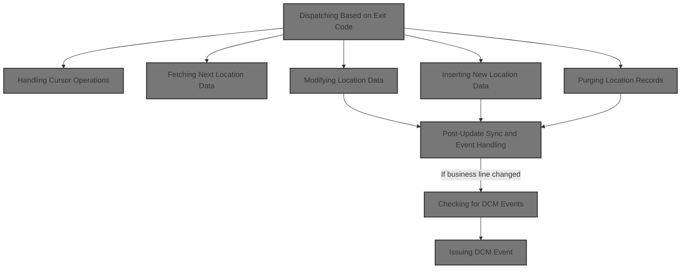

# Spec

## Detailed View of the Program's Functionality

# Detailed Explanation of the Code Flow in base/src/NNNS0488.cbl

## a. Program Structure and Entry Point

The program is structured in a classic mainframe style, with divisions for identification, environment, data, and procedure. The main entry point is a dispatcher routine that determines what operation to perform based on a status code set outside the program.

- The program starts by initializing various working storage areas and importing copybooks for data structures, SQL, and utility routines.
- The main logic is in the procedure division, which receives several parameters, including data structures for location records and status.

## b. Main Dispatcher Logic

The dispatcher routine is responsible for routing the request to the correct subroutine based on the operation code.

- **Initialization**: Before any operation, the program resets status fields, working storage, and prepares the environment. If the operation is not a cursor close, it copies and validates input data for downstream use.
- **Operation Routing**: Using a multi-branch conditional, the dispatcher checks the operation code and calls the appropriate subroutine for:
  - Opening or closing a cursor
  - Fetching a unique or next row
  - Modifying, inserting, or purging a row
  - Performing special I/O functions
- **Finalization**: After the operation, the program performs any necessary exit routines, such as copying data back to the output area and updating checkpoint counters.

## c. Preparing State and Connections

Before any database operation, the program ensures all relevant fields are initialized and validated.

- **Resetting Fields**: Status, logical flags, and working storage are cleared.
- **Copying and Validating Data**: If not closing a cursor, the program copies fields from the input area to the internal structure, applying business rules:
  - Missing or invalid fields are defaulted (e.g., dates, times, type codes).
  - Special flags and indicators are set based on business logic.
  - Numeric fields are validated and defaulted if necessary.
  - Rollup fields are handled by a dedicated routine that ensures only valid numbers are passed.
  - Time fields are normalized and, if needed, converted to the correct format for Oracle.
- **Database Connection**: If the operation involves writing to Oracle, the program establishes a connection and logs any errors.

## d. Handling Cursor Operations

The program supports multiple SQL cursors for different types of location data queries.

- **Opening a Cursor**: The program checks the requested cursor ID and opens the corresponding SQL cursor. If the ID is invalid, it sets a failure flag and logs an error.
- **Closing a Cursor**: Similarly, the program closes the requested cursor if the ID is valid, otherwise logs an error.

## e. Fetching Data Rows

The program can fetch either a unique row or the next row from a cursor.

- **Unique Row Fetch**: A direct SQL SELECT is performed to retrieve a single location record, mapping all columns into the internal structure.
- **Next Row Fetch**: Based on the active cursor, the program fetches the next row and populates the internal structure. After fetching, it checks for null columns and ensures all fields are valid and defaulted as needed.

## f. Modifying Location Data

When modifying a location record, the program follows a strict sequence:

- **Null Indicator Edits**: Ensures that null indicators are set correctly for fields that may be missing.
- **Business Edits**: Runs validation logic, especially for alternate store references, ensuring referenced stores exist.
- **Event Checks**: Compares the current status in the database with the new data. If a status change is detected, updates the status date.
- **Database Update**: If all checks pass, updates the row in the database and sets update flags.
- **Post-Update Events**: If the business line has changed, triggers additional event logic.

## g. Validating Alternate Store Edits

Before modifying a record, the program checks if alternate store fields are set and, if so, validates that the referenced store exists in the database. If not, it sets a failure flag and logs a specific error message.

## h. Checking for Status Changes

The program checks if the location status has changed by querying the database and comparing the current and new status codes.

- If a change is detected, it updates the status date to the current date.
- If the location is not found, or another error occurs, it logs an appropriate error message.

## i. Updating the Data Row

When updating a row:

- The program prepares the data, sanitizes fields, and calls a routine to perform the actual database update.
- If the update is successful, it sets flags indicating the record was updated and triggers post-update processing.

## j. Post-Update Sync and Event Handling

After a successful update or insert:

- If the status changed, the program updates the status in a related table.
- It increments a checkpoint counter.
- If the operation was successful, it may call routines to synchronize with other systems or issue business events.
- For store locations, it may issue additional events with different transaction IDs.

## k. Inserting New Location Data

When inserting a new location:

- The program edits null indicators and sets default values for required fields.
- It validates the record against business rules before attempting the insert.
- If the insert succeeds, it sets flags and triggers post-insert logic.

## l. Purging Location Records

When deleting a location:

- The program first checks if the record can be safely deleted.
- If validation passes, it performs the deletion and sets flags if successful.
- If the record is in use or another error occurs, it logs an appropriate error message.

## m. Special I/O Functions

A placeholder routine exists for special I/O functions, which currently does nothing but can be extended for custom logic.

---

This structure ensures that all location data operations are validated, consistent, and trigger the necessary downstream processes and events, maintaining data integrity and business rule compliance throughout.

# Rule Definition

| Paragraph Name                                                               | Rule ID | Category          | Description                                                                                                                                                                                                           | Conditions                                         | Remarks                                                                                                                                                                                                                                                                 |
| ---------------------------------------------------------------------------- | ------- | ----------------- | --------------------------------------------------------------------------------------------------------------------------------------------------------------------------------------------------------------------- | -------------------------------------------------- | ----------------------------------------------------------------------------------------------------------------------------------------------------------------------------------------------------------------------------------------------------------------------- |
| 0000-EXIT-DISPATCHER                                                         | RL-001  | Conditional Logic | The dispatcher determines the requested operation by reading the OPERATION-TYPE field and dispatches to the appropriate logic section.                                                                                | After initialization, always.                      | OPERATION-TYPE values: 1 (Open Cursor), 2 (Close Cursor), 3 (Get Unique Row), 5 (Get Next Row), 8 (Modify Row), 9 (Insert Row), 10 (Purge Row), 90 (Special I/O).                                                                                                       |
| 0000-EXIT-DISPATCHER                                                         | RL-002  | Conditional Logic | If the previous operation was not successful (STATUS-FLAG not '0'), the dispatcher must skip the requested operation and proceed to finalize.                                                                         | STATUS-FLAG not '0' at start of dispatcher.        | STATUS-FLAG is a string field in the parameter area. '0' means success, any other value means failure.                                                                                                                                                                  |
| 1000-EXIT-OPEN-CURSOR, 1100-EXIT-CLOSE-CURSOR                                | RL-003  | Conditional Logic | For Open Cursor (1) and Close Cursor (2) operations, the dispatcher must validate the provided cursor ID. If invalid, set STATUS-FLAG to '1' and write an error message.                                              | OPERATION-TYPE is 1 or 2 (open/close cursor).      | Valid cursor IDs: 'DDDXLR01' through 'DDDXLR09'. Cursor ID is a string field. Error message: 'NNNS0488 - Invalid open/close cursor ID.'                                                                                                                                 |
| 1200-EXIT-GET-UNIQUE-ROW, 1300-EXIT-GET-NEXT-ROW and related FETCH routines  | RL-004  | Computation       | For Get Unique Row (3) and Get Next Row (5), fetch location data and populate the output structure. On failure, set STATUS-FLAG to '1' and update error message.                                                      | OPERATION-TYPE is 3 or 5.                          | Output is populated in the P-DDDTLR01 structure. Error message is written to IS-RTRN-MSG-TXT. STATUS-FLAG is set to '1' on failure.                                                                                                                                     |
| 1400-EXIT-PUT-MODIFY-ROW, 1500-EXIT-PUT-INSERT-ROW, 1600-EXIT-PUT-PURGE-ROW  | RL-005  | Computation       | For Modify Row (8), Insert Row (9), and Purge Row (10), validate and update the location record as required, updating the database and output structure. On failure, set STATUS-FLAG to '1' and update error message. | OPERATION-TYPE is 8, 9, or 10.                     | Output is populated in the P-DDDTLR01 structure. Error message is written to IS-RTRN-MSG-TXT. STATUS-FLAG is set to '1' on failure.                                                                                                                                     |
| 10000-DO-SPECIAL-IO-FUNCS                                                    | RL-006  | Computation       | For Special I/O (90), perform the custom operation as defined by the implementation. On failure, set STATUS-FLAG to '1' and update error message.                                                                     | OPERATION-TYPE is 90.                              | Custom logic is implementation-defined. Error message is written to IS-RTRN-MSG-TXT. STATUS-FLAG is set to '1' on failure.                                                                                                                                              |
| 120-EXIT-STUFF and throughout operation routines                             | RL-007  | Data Assignment   | After any operation, update STATUS-FLAG in XXXN001A to '0' for success or '1' for failure, and write any error message to IS-RTRN-MSG-TXT.                                                                            | After any operation completes.                     | STATUS-FLAG is a string field. IS-RTRN-MSG-TXT is a string field for error messages.                                                                                                                                                                                    |
| 0000-EXIT-DISPATCHER (EVALUATE OPERATION-TYPE)                               | RL-008  | Conditional Logic | If OPERATION-TYPE is not one of the defined values, set STATUS-FLAG to '1' and update IS-RTRN-MSG-TXT with an error message.                                                                                          | OPERATION-TYPE is not 1, 2, 3, 5, 8, 9, 10, or 90. | Error message: 'NNNS0488 - Invalid operation type.' STATUS-FLAG is set to '1'.                                                                                                                                                                                          |
| 100-INITIALIZATION, 110-MOVE-PDA-FIELDS-2-DCL, throughout operation routines | RL-009  | Conditional Logic | The dispatcher must not assume any default values for fields not specified in the input; only the fields provided in the input structures are to be used.                                                             | Always, when reading input fields.                 | No defaulting of unspecified fields. Only fields present in XXXN001A and P-DDDTLR01 are used.                                                                                                                                                                           |
| 0000-EXIT-DISPATCHER, throughout                                             | RL-010  | Conditional Logic | The dispatcher must not return any explicit value; all results and errors are communicated via the parameter areas. No logging or error handling beyond setting STATUS-FLAG and IS-RTRN-MSG-TXT.                      | Always.                                            | All communication is via parameter areas. No logging, no return values.                                                                                                                                                                                                 |
| 100-INITIALIZATION, 0000-EXIT-DISPATCHER                                     | RL-011  | Data Assignment   | The dispatcher must always perform initialization before any operation, including resetting all status indicators, clearing the input/output parameter area, and preparing the environment for database actions.      | Always, before any operation is performed.         | Initialization includes clearing all input/output parameter fields, resetting status indicators to their default values, and preparing any working storage used for operation state. All data is passed by reference. No explicit return value or logging is performed. |

# User Stories

## User Story 1: Operation Dispatch and Validation

---

### Story Description:

As a system, I want the dispatcher to determine the requested operation from the OPERATION-TYPE field and validate its value so that only supported operations are performed and invalid requests are properly rejected.

---

### Business Rule Mapping:

| Rule ID | Paragraph Name                                 | Rule Description                                                                                                                       |
| ------- | ---------------------------------------------- | -------------------------------------------------------------------------------------------------------------------------------------- |
| RL-001  | 0000-EXIT-DISPATCHER                           | The dispatcher determines the requested operation by reading the OPERATION-TYPE field and dispatches to the appropriate logic section. |
| RL-008  | 0000-EXIT-DISPATCHER (EVALUATE OPERATION-TYPE) | If OPERATION-TYPE is not one of the defined values, set STATUS-FLAG to '1' and update IS-RTRN-MSG-TXT with an error message.           |

---

### Relevant Functionality:

- **0000-EXIT-DISPATCHER**
  1. **RL-001:**
     - Read OPERATION-TYPE from parameter area
     - EVALUATE OPERATION-TYPE:
       - WHEN 1: PERFORM open cursor logic
       - WHEN 2: PERFORM close cursor logic
       - WHEN 3: PERFORM get unique row logic
       - WHEN 5: PERFORM get next row logic
       - WHEN 8: PERFORM modify row logic
       - WHEN 9: PERFORM insert row logic
       - WHEN 10: PERFORM purge row logic
       - WHEN 90: PERFORM special I/O logic
       - WHEN OTHER: set error status and message
- **0000-EXIT-DISPATCHER (EVALUATE OPERATION-TYPE)**
  1. **RL-008:**
     - If OPERATION-TYPE not in allowed set:
       - Set STATUS-FLAG to '1'
       - Set IS-RTRN-MSG-TXT to error message

## User Story 2: Strict Data Handling and Communication

---

### Story Description:

As a system, I want the dispatcher to use only the fields provided in the input structures, avoid default values, and communicate exclusively via parameter areas so that data integrity is maintained and no unintended side effects occur.

---

### Business Rule Mapping:

| Rule ID | Paragraph Name                                                               | Rule Description                                                                                                                                                                                 |
| ------- | ---------------------------------------------------------------------------- | ------------------------------------------------------------------------------------------------------------------------------------------------------------------------------------------------ |
| RL-010  | 0000-EXIT-DISPATCHER, throughout                                             | The dispatcher must not return any explicit value; all results and errors are communicated via the parameter areas. No logging or error handling beyond setting STATUS-FLAG and IS-RTRN-MSG-TXT. |
| RL-009  | 100-INITIALIZATION, 110-MOVE-PDA-FIELDS-2-DCL, throughout operation routines | The dispatcher must not assume any default values for fields not specified in the input; only the fields provided in the input structures are to be used.                                        |

---

### Relevant Functionality:

- **0000-EXIT-DISPATCHER**
  1. **RL-010:**
     - Do not return values from dispatcher
     - Do not perform logging
     - Set STATUS-FLAG and IS-RTRN-MSG-TXT as needed
- **100-INITIALIZATION**
  1. **RL-009:**
     - When reading input fields:
       - Use only fields present in input structures
       - Do not assign defaults unless explicitly specified

## User Story 3: Dispatcher Preparation and Input Management

---

### Story Description:

As a system, I want the dispatcher to always perform initialization, clear and reset status fields, skip operations on previous failure, and use only provided input fields so that the environment is reliably prepared and only valid data is processed.

---

### Business Rule Mapping:

| Rule ID | Paragraph Name                                                               | Rule Description                                                                                                                                                                                                 |
| ------- | ---------------------------------------------------------------------------- | ---------------------------------------------------------------------------------------------------------------------------------------------------------------------------------------------------------------- |
| RL-002  | 0000-EXIT-DISPATCHER                                                         | If the previous operation was not successful (STATUS-FLAG not '0'), the dispatcher must skip the requested operation and proceed to finalize.                                                                    |
| RL-011  | 100-INITIALIZATION, 0000-EXIT-DISPATCHER                                     | The dispatcher must always perform initialization before any operation, including resetting all status indicators, clearing the input/output parameter area, and preparing the environment for database actions. |
| RL-009  | 100-INITIALIZATION, 110-MOVE-PDA-FIELDS-2-DCL, throughout operation routines | The dispatcher must not assume any default values for fields not specified in the input; only the fields provided in the input structures are to be used.                                                        |

---

### Relevant Functionality:

- **0000-EXIT-DISPATCHER**
  1. **RL-002:**
     - If STATUS-FLAG is not '0':
       - Skip operation dispatch
       - Proceed to finalization logic
- **100-INITIALIZATION**
  1. **RL-011:**
     - On entry, perform initialization routine:
       - Clear the input/output parameter area
       - Reset all status indicators to default values
       - Reset any working storage used for operation state
       - Prepare the environment for database actions (e.g., reset SQL status, connect to database if required)
  2. **RL-009:**
     - When reading input fields:
       - Use only fields present in input structures
       - Do not assign defaults unless explicitly specified

## User Story 4: Operation Execution and Result Communication

---

### Story Description:

As a user, I want the dispatcher to execute the requested operation (open/close cursor, fetch rows, modify/insert/purge rows, special I/O), validate inputs, update output structures, and communicate results and errors via status flags and messages so that I receive accurate results and error information for each operation.

---

### Business Rule Mapping:

| Rule ID | Paragraph Name                                                              | Rule Description                                                                                                                                                                                                      |
| ------- | --------------------------------------------------------------------------- | --------------------------------------------------------------------------------------------------------------------------------------------------------------------------------------------------------------------- |
| RL-010  | 0000-EXIT-DISPATCHER, throughout                                            | The dispatcher must not return any explicit value; all results and errors are communicated via the parameter areas. No logging or error handling beyond setting STATUS-FLAG and IS-RTRN-MSG-TXT.                      |
| RL-003  | 1000-EXIT-OPEN-CURSOR, 1100-EXIT-CLOSE-CURSOR                               | For Open Cursor (1) and Close Cursor (2) operations, the dispatcher must validate the provided cursor ID. If invalid, set STATUS-FLAG to '1' and write an error message.                                              |
| RL-005  | 1400-EXIT-PUT-MODIFY-ROW, 1500-EXIT-PUT-INSERT-ROW, 1600-EXIT-PUT-PURGE-ROW | For Modify Row (8), Insert Row (9), and Purge Row (10), validate and update the location record as required, updating the database and output structure. On failure, set STATUS-FLAG to '1' and update error message. |
| RL-004  | 1200-EXIT-GET-UNIQUE-ROW, 1300-EXIT-GET-NEXT-ROW and related FETCH routines | For Get Unique Row (3) and Get Next Row (5), fetch location data and populate the output structure. On failure, set STATUS-FLAG to '1' and update error message.                                                      |
| RL-006  | 10000-DO-SPECIAL-IO-FUNCS                                                   | For Special I/O (90), perform the custom operation as defined by the implementation. On failure, set STATUS-FLAG to '1' and update error message.                                                                     |
| RL-007  | 120-EXIT-STUFF and throughout operation routines                            | After any operation, update STATUS-FLAG in XXXN001A to '0' for success or '1' for failure, and write any error message to IS-RTRN-MSG-TXT.                                                                            |

---

### Relevant Functionality:

- **0000-EXIT-DISPATCHER**
  1. **RL-010:**
     - Do not return values from dispatcher
     - Do not perform logging
     - Set STATUS-FLAG and IS-RTRN-MSG-TXT as needed
- **1000-EXIT-OPEN-CURSOR**
  1. **RL-003:**
     - On open/close cursor operation:
       - EVALUATE cursor ID:
         - WHEN valid: perform open/close
         - WHEN OTHER: set failure, set error message, set STATUS-FLAG to '1'
- **1400-EXIT-PUT-MODIFY-ROW**
  1. **RL-005:**
     - On modify/insert/purge operation:
       - Validate input fields
       - Perform SQL UPDATE/INSERT/DELETE
       - If SQLCODE not 0, set STATUS-FLAG to '1', set error message
- **1200-EXIT-GET-UNIQUE-ROW**
  1. **RL-004:**
     - On get unique/next row operation:
       - Perform SQL SELECT or FETCH into output structure
       - If SQLCODE not 0, set STATUS-FLAG to '1', set error message
- **10000-DO-SPECIAL-IO-FUNCS**
  1. **RL-006:**
     - On special I/O operation:
       - Perform custom logic
       - If failure, set STATUS-FLAG to '1', set error message
- **120-EXIT-STUFF and throughout operation routines**
  1. **RL-007:**
     - After operation logic:
       - If operation succeeded, set STATUS-FLAG to '0'
       - If failed, set STATUS-FLAG to '1', set IS-RTRN-MSG-TXT

# Code Walkthrough

## Dispatching Based on Exit Code

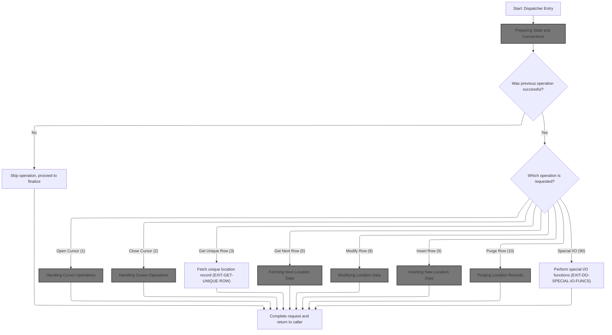

<SwmSnippet path="/base/src/NNNS0488.cbl" line="1209">

---

0000-EXIT-DISPATCHER starts the process, always runs initialization, then dispatches to the right subroutine based on a status code that's set somewhere else. The actual routing depends on that external variable, not on any arguments.

```cobol
125400 0000-EXIT-DISPATCHER.                                            00125400
125500     PERFORM 100-INITIALIZATION                                   00125500
125600     EVALUATE TRUE                                                00125600
125700       WHEN NOT SUCCESS                                           00125700
125800          CONTINUE                                                00125800
125900       WHEN EXIT-OPEN-CURSOR                                      00125900
126000          PERFORM 1000-EXIT-OPEN-CURSOR                           00126000
126100       WHEN EXIT-CLOSE-CURSOR                                     00126100
126200          PERFORM 1100-EXIT-CLOSE-CURSOR                          00126200
126300       WHEN EXIT-GET-UNIQUE-ROW                                   00126300
126400          PERFORM 1200-EXIT-GET-UNIQUE-ROW                        00126400
126500       WHEN EXIT-GET-NEXT-ROW                                     00126500
126600          PERFORM 1300-EXIT-GET-NEXT-ROW                          00126600
126700       WHEN EXIT-PUT-MODIFY-ROW                                   00126700
126800          PERFORM 1400-EXIT-PUT-MODIFY-ROW                        00126800
126900       WHEN EXIT-PUT-INSERT-ROW                                   00126900
127000          PERFORM 1500-EXIT-PUT-INSERT-ROW                        00127000
127100       WHEN EXIT-PUT-PURGE-ROW                                    00127100
127200          PERFORM 1600-EXIT-PUT-PURGE-ROW                         00127200
127300       WHEN EXIT-DO-SPECIAL-IO-FUNCS                              00127300
127400          PERFORM 10000-DO-SPECIAL-IO-FUNCS                       00127400
127500     END-EVALUATE                                                 00127500
127600     PERFORM 120-EXIT-STUFF                                       00127600
127700     GOBACK                                                       00127700
127800     .                                                            00127800
```

---

</SwmSnippet>

### Preparing State and Connections

<SwmSnippet path="/base/src/NNNS0488.cbl" line="1239">

---

100-INITIALIZATION resets status fields, syncs indexes, and sets up the environment for the next operation. If we're not closing a cursor, it calls 110-MOVE-PDA-FIELDS-2-DCL to copy and validate location data for downstream use. It also connects to Oracle if the operation type requires it, so the system is ready for DB actions.

```cobol
128400 100-INITIALIZATION.                                              00128400
128500     INITIALIZE XXXN001A                                          00128500
128600                DAO-STATUS                                        00128600
128700                WS-LOC-STAT-SW                                    00128700
128800                WS-CURR-VALUES                                    00128800
128900     MOVE NNNN0000-INDEX-HANDLE TO DDDTLR01-INDEX-HANDLE          00128900
129000     MOVE 0 TO WS-CHECKPOINT-INC                                  00129000
129100     MOVE 0 TO SQLCODE                                            00129100
129200     MOVE 0 TO SQL-INIT-FLAG                                      00129200
129300     IF NOT EXIT-CLOSE-CURSOR                                     00129300
129400       PERFORM 110-MOVE-PDA-FIELDS-2-DCL                          00129400
129500     END-IF                                                       00129500
129600     IF (YYYN005A-ORACLE       OR EXIT-PUT-INSERT-ROW             00129600
129700         OR EXIT-PUT-PURGE-ROW OR EXIT-PUT-MODIFY-ROW)            00129700
129800       PERFORM 115-CONNECT-TO-ORACLE                              00129800
129900     END-IF                                                       00129900
130000     .                                                            00130000
```

---

</SwmSnippet>

#### Copying and Validating Location Data

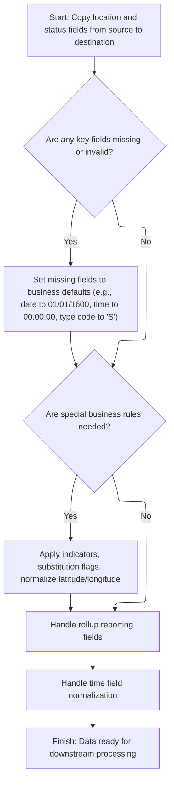

<SwmSnippet path="/base/src/NNNS0488.cbl" line="1261">

---

110-MOVE-PDA-FIELDS-2-DCL copies location fields from the source to the target, but it also validates and defaults dates, times, and numerics so we don't pass junk downstream. Indicator flags are set based on missing values, and business rules are enforced for things like product substitution. After the bulk copy, it calls 117-MOVE-ROLLUP-DATA to handle rollup fields, which need special numeric validation.

```cobol
130600 110-MOVE-PDA-FIELDS-2-DCL.                                       00130600
130700     MOVE LOC-NBR OF P-DDDTLR01 TO LOC-NBR OF DCLXXXAIL-LOC       00130700
130800     MOVE LOC-TYP-CD OF P-DDDTLR01 TO LOC-TYP-CD OF DCLXXXAIL-LOC 00130800
130900                                                                  00130900
131000     IF ASSOC-STR-TYP-CD OF P-DDDTLR01 = SPACES                   00131000
131100        MOVE 'S' TO ASSOC-STR-TYP-CD OF P-DDDTLR01                00131100
131200     END-IF                                                       00131200
131300     MOVE ASSOC-STR-TYP-CD OF P-DDDTLR01                          00131300
131400       TO ASSOC-STR-TYP-CD OF DCLXXXAIL-LOC                       00131400
131500     MOVE 0 TO  WS-ASSOC-ST-TYPE-IND                              00131500
131600     MOVE ASSOC-STR-NBR OF P-DDDTLR01                             00131600
131700       TO ASSOC-STR-NBR OF DCLXXXAIL-LOC                          00131700
131800     IF ASSOC-STR-NBR OF P-DDDTLR01  =  ZERO                      00131800
131900        MOVE -1 TO WS-ASSOC-ST-NO-IND                             00131900
132000     ELSE                                                         00132000
132100        MOVE 0 TO  WS-ASSOC-ST-NO-IND                             00132100
132200     END-IF                                                       00132200
132300                                                                  00132300
132400     IF SLS-CLOSED-DT OF P-DDDTLR01 = SPACES                      00132400
132500     OR SLS-CLOSED-DT OF P-DDDTLR01 = K-ZERO-DT                   00132500
132600       MOVE K-DEF-DT TO SLS-CLOSED-DT OF P-DDDTLR01               00132600
132700     END-IF                                                       00132700
132800     MOVE SLS-CLOSED-DT OF P-DDDTLR01                             00132800
132900       TO SLS-CLOSED-DT OF DCLXXXAIL-LOC                          00132900
133000     IF STR-REMODL-DT OF P-DDDTLR01 = SPACES                      00133000
133100     OR STR-REMODL-DT OF P-DDDTLR01 = K-ZERO-DT                   00133100
133200       MOVE K-DEF-DT TO STR-REMODL-DT OF P-DDDTLR01               00133200
133300     END-IF                                                       00133300
133400     MOVE STR-REMODL-DT OF P-DDDTLR01                             00133400
133500       TO STR-REMODL-DT OF DCLXXXAIL-LOC                          00133500
133600                                                                  00133600
133700     MOVE RETL-LOC-STAT-CD OF P-DDDTLR01                          00133700
133800       TO RETL-LOC-STAT-CD OF DCLXXXAIL-LOC                       00133800
133900                                                                  00133900
134000     IF RETL-LOC-STAT-DT OF P-DDDTLR01 = SPACES                   00134000
134100     OR RETL-LOC-STAT-DT OF P-DDDTLR01 = K-ZERO-DT                00134100
134200       MOVE K-DEF-DT TO RETL-LOC-STAT-DT OF P-DDDTLR01            00134200
134300     END-IF                                                       00134300
134400     MOVE RETL-LOC-STAT-DT OF P-DDDTLR01                          00134400
134500       TO RETL-LOC-STAT-DT OF DCLXXXAIL-LOC                       00134500
134600                                                                  00134600
134700     MOVE COMPANY-ID OF P-DDDTLR01 TO COMPANY-ID OF DCLXXXAIL-LOC 00134700
134800     MOVE FINANCIAL-DIV-ID OF P-DDDTLR01                          00134800
134900       TO FINANCIAL-DIV-ID OF DCLXXXAIL-LOC                       00134900
135000     MOVE LIN-OF-BUS-ID OF P-DDDTLR01                             00135000
135100       TO LIN-OF-BUS-ID OF DCLXXXAIL-LOC                          00135100
135200     MOVE DIST-ID OF P-DDDTLR01 TO DIST-ID OF DCLXXXAIL-LOC       00135200
135300                                   MKT-RGN-ID OF P-DDDTLR01       00135300
135400     MOVE MKT-RGN-ID OF P-DDDTLR01 TO MKT-RGN-ID OF DCLXXXAIL-LOC 00135400
135500     MOVE GEO-ZN-CD OF P-DDDTLR01 TO GEO-ZN-CD OF DCLXXXAIL-LOC   00135500
135600     MOVE RETL-GEO-ZN-ID OF P-DDDTLR01                            00135600
135700       TO RETL-GEO-ZN-ID OF DCLXXXAIL-LOC                         00135700
135800     MOVE SCN-MAINT-SW OF P-DDDTLR01                              00135800
135900       TO SCN-MAINT-SW OF DCLXXXAIL-LOC                           00135900
136000     MOVE FRNT-END-CD OF P-DDDTLR01                               00136000
136100       TO FRNT-END-CD OF DCLXXXAIL-LOC                            00136100
136200     MOVE PRC-BUL-SW OF P-DDDTLR01 TO PRC-BUL-SW OF DCLXXXAIL-LOC 00136200
136300     MOVE UPC-ON-PRC-BUL-SW OF P-DDDTLR01                         00136300
136400       TO UPC-ON-PRC-BUL-SW OF DCLXXXAIL-LOC                      00136400
136500     MOVE CMPTR-TYP-CD OF P-DDDTLR01                              00136500
136600       TO CMPTR-TYP-CD OF DCLXXXAIL-LOC                           00136600
136700     MOVE RETL-VID-ZN-NBR OF P-DDDTLR01                           00136700
136800       TO RETL-VID-ZN-NBR OF DCLXXXAIL-LOC                        00136800
136900     MOVE RETL-UNLD-CD OF P-DDDTLR01                              00136900
137000       TO RETL-UNLD-CD OF DCLXXXAIL-LOC                           00137000
137100*    MOVE ROLUP-REPT-TBL-TXT OF P-DDDTLR01                        00137100
137200     MOVE SPACES                                                  00137200
137300       TO ROLUP-REPT-TBL-TXT OF DCLXXXAIL-LOC                     00137300
137400     PERFORM 117-MOVE-ROLLUP-DATA                                 00137400
137500     MOVE NEW-STR-SW OF P-DDDTLR01 TO NEW-STR-SW OF DCLXXXAIL-LOC 00137500
137600     MOVE SEL-CIR-SW OF P-DDDTLR01 TO SEL-CIR-SW OF DCLXXXAIL-LOC 00137600
137700     MOVE BKRM-SQ-FT OF P-DDDTLR01 TO BKRM-SQ-FT OF DCLXXXAIL-LOC 00137700
137800     MOVE FD-LINER-FT OF P-DDDTLR01                               00137800
137900       TO FD-LINER-FT OF DCLXXXAIL-LOC                            00137900
138000     MOVE NON-FD-LINER-FT OF P-DDDTLR01                           00138000
138100       TO NON-FD-LINER-FT OF DCLXXXAIL-LOC                        00138100
138200     MOVE SETOFF-ROOM-SW OF P-DDDTLR01                            00138200
138300       TO SETOFF-ROOM-SW OF DCLXXXAIL-LOC                         00138300
138400     MOVE CAT-CLS-TBL-TXT OF P-DDDTLR01                           00138400
138500       TO CAT-CLS-TBL-TXT OF DCLXXXAIL-LOC                        00138500
138600                                                                  00138600
138700     IF LAT-K OF P-DDDTLR01 IS NOT NUMERIC                        00138700
138800       MOVE 0 TO LAT-K OF P-DDDTLR01                              00138800
138900     END-IF                                                       00138900
139000     MOVE LAT-K OF P-DDDTLR01 TO LAT-K OF DCLXXXAIL-LOC           00139000
139100                                                                  00139100
139200     IF LON-K OF P-DDDTLR01 IS NOT NUMERIC                        00139200
139300       MOVE 0 TO LON-K OF P-DDDTLR01                              00139300
139400     END-IF                                                       00139400
139500     MOVE LON-K OF P-DDDTLR01 TO LON-K OF DCLXXXAIL-LOC           00139500
139600                                                                  00139600
139700     MOVE CK-COLL-REPT-SW OF P-DDDTLR01                           00139700
139800       TO CK-COLL-REPT-SW OF DCLXXXAIL-LOC                        00139800
139900     MOVE CK-COLL-CNTL-CD OF P-DDDTLR01                           00139900
140000       TO CK-COLL-CNTL-CD OF DCLXXXAIL-LOC                        00140000
140100     MOVE CK-COLL-ADD-DEL-SW OF P-DDDTLR01                        00140100
140200       TO CK-COLL-ADD-DEL-SW OF DCLXXXAIL-LOC                     00140200
140300     MOVE CK-ALT-STR-ID OF P-DDDTLR01                             00140300
140400       TO CK-ALT-STR-ID OF DCLXXXAIL-LOC                          00140400
140500     MOVE CK-COLL-FEE-AMT OF P-DDDTLR01                           00140500
140600       TO CK-COLL-FEE-AMT OF DCLXXXAIL-LOC                        00140600
140700     MOVE SALS-TAX-PCT OF P-DDDTLR01                              00140700
140800       TO SALS-TAX-PCT OF DCLXXXAIL-LOC                           00140800
140900     MOVE SOAP-SALE-VAR-PCT OF P-DDDTLR01                         00140900
141000       TO SOAP-SALE-VAR-PCT OF DCLXXXAIL-LOC                      00141000
141100     MOVE ON-SRS-CD OF P-DDDTLR01 TO ON-SRS-CD OF DCLXXXAIL-LOC   00141100
141200     MOVE SRS-DSD-ORD-SW OF P-DDDTLR01                            00141200
141300       TO SRS-DSD-ORD-SW OF DCLXXXAIL-LOC                         00141300
141400     MOVE RETL-LOC-TYP-CD OF P-DDDTLR01                           00141400
141500       TO RETL-LOC-TYP-CD OF DCLXXXAIL-LOC                        00141500
141600     MOVE DEA-NBR OF P-DDDTLR01 TO DEA-NBR OF DCLXXXAIL-LOC       00141600
141700     IF YYYN005A-CICS-ENV                                         00141700
141800       MOVE STR-OPSTMT-SRT-CD OF P-DDDTLR01                       00141800
141900         TO RPRT-SEQ-NBR      OF P-DDDTLR01                       00141900
142000     END-IF                                                       00142000
142100     MOVE RPRT-SEQ-NBR OF P-DDDTLR01                              00142100
142200       TO RPRT-SEQ-NBR OF DCLXXXAIL-LOC                           00142200
142300     MOVE STR-OPSTMT-SRT-CD OF P-DDDTLR01                         00142300
142400       TO STR-OPSTMT-SRT-CD OF DCLXXXAIL-LOC                      00142400
142500     MOVE STR-OPSTMT-TYP-CD OF P-DDDTLR01                         00142500
142600       TO STR-OPSTMT-TYP-CD OF DCLXXXAIL-LOC                      00142600
142700     MOVE STR-OPSTMT-HDR-CD OF P-DDDTLR01                         00142700
142800       TO STR-OPSTMT-HDR-CD OF DCLXXXAIL-LOC                      00142800
142900     MOVE DPS-NBR OF P-DDDTLR01 TO DPS-NBR OF DCLXXXAIL-LOC       00142900
143000     MOVE MEDICARE-ID OF P-DDDTLR01                               00143000
143100       TO MEDICARE-ID OF DCLXXXAIL-LOC                            00143100
143200     MOVE NABP-NBR OF P-DDDTLR01 TO NABP-NBR OF DCLXXXAIL-LOC     00143200
143300     MOVE NATL-PROV-ID OF P-DDDTLR01                              00143300
143400       TO NATL-PROV-ID OF DCLXXXAIL-LOC                           00143400
143500     MOVE CURR-AD-ZN-NBR OF P-DDDTLR01                            00143500
143600       TO CURR-AD-ZN-NBR OF DCLXXXAIL-LOC                         00143600
143700     MOVE PD-ZONE-NO OF P-DDDTLR01 TO PD-ZONE-NO OF DCLXXXAIL-LOC 00143700
143800     MOVE SOS-PROC-SW OF P-DDDTLR01                               00143800
143900       TO SOS-PROC-SW OF DCLXXXAIL-LOC                            00143900
144000     MOVE GRP-CD OF P-DDDTLR01 TO GRP-CD OF DCLXXXAIL-LOC         00144000
144100     MOVE PRIM-GRP-CD-1 OF P-DDDTLR01                             00144100
144200       TO PRIM-GRP-CD-1 OF DCLXXXAIL-LOC                          00144200
144300     MOVE PRIM-GRP-CD-2 OF P-DDDTLR01                             00144300
144400       TO PRIM-GRP-CD-2 OF DCLXXXAIL-LOC                          00144400
144500     MOVE SECY-GRP-CD-1 OF P-DDDTLR01                             00144500
144600       TO SECY-GRP-CD-1 OF DCLXXXAIL-LOC                          00144600
144700     MOVE SECY-GRP-CD-2 OF P-DDDTLR01                             00144700
144800       TO SECY-GRP-CD-2 OF DCLXXXAIL-LOC                          00144800
144900     MOVE PRIM-CLS-NBR-1 OF P-DDDTLR01                            00144900
145000       TO PRIM-CLS-NBR-1 OF DCLXXXAIL-LOC                         00145000
145100     MOVE PRIM-CLS-NBR-2 OF P-DDDTLR01                            00145100
145200       TO PRIM-CLS-NBR-2 OF DCLXXXAIL-LOC                         00145200
145300     MOVE SECY-CLS-NBR-1 OF P-DDDTLR01                            00145300
145400       TO SECY-CLS-NBR-1 OF DCLXXXAIL-LOC                         00145400
145500     MOVE SECY-CLS-NBR-2 OF P-DDDTLR01                            00145500
145600       TO SECY-CLS-NBR-2 OF DCLXXXAIL-LOC                         00145600
145700     MOVE VAL-STR-SW OF P-DDDTLR01 TO VAL-STR-SW OF DCLXXXAIL-LOC 00145700
145800     IF TBCO-PRMT-NBR OF P-DDDTLR01 NOT NUMERIC                   00145800
145900       MOVE ZEROES TO TBCO-PRMT-NBR OF P-DDDTLR01                 00145900
146000     END-IF                                                       00146000
146100                                                                  00146100
146200     MOVE TBCO-PRMT-NBR OF P-DDDTLR01                             00146200
146300       TO TBCO-PRMT-NBR OF DCLXXXAIL-LOC                          00146300
146400                                                                  00146400
146500     IF  NOT OK-TO-SUB-UNLIKE-PRODS   OF P-DDDTLR01               00146500
146600     AND NOT DONT-SUB-UNLIKE-PRODS    OF P-DDDTLR01               00146600
146700       SET NO-UNLIKE-SUB-STORE-PREF   OF P-DDDTLR01 TO TRUE       00146700
146800     END-IF                                                       00146800
146900     MOVE SUB-UNLIKE-PROD-CD OF P-DDDTLR01                        00146900
147000       TO SUB-UNLIKE-PROD-CD OF DCLXXXAIL-LOC                     00147000
147100                                                                  00147100
147200     IF  NOT OK-TO-SUB-DISP-PALS      OF P-DDDTLR01               00147200
147300     AND NOT DONT-SUB-DISP-PALS       OF P-DDDTLR01               00147300
147400       SET NO-DISP-PAL-SUB-STORE-PREF OF P-DDDTLR01 TO TRUE       00147400
147500     END-IF                                                       00147500
147600     MOVE SUB-DSPLY-PAL-CD   OF P-DDDTLR01                        00147600
147700       TO SUB-DSPLY-PAL-CD   OF DCLXXXAIL-LOC                     00147700
147800                                                                  00147800
147900     IF  NOT SEND-REAL-TIME-G3        OF P-DDDTLR01               00147900
148000       SET DONT-SEND-REAL-TIME-G3     OF P-DDDTLR01 TO TRUE       00148000
148100     END-IF                                                       00148100
148200     MOVE RLTM-SCN-MAINT-SW  OF P-DDDTLR01                        00148200
148300       TO RLTM-SCN-MAINT-SW  OF DCLXXXAIL-LOC                     00148300
148400     MOVE TOP-LEADER-NM  OF P-DDDTLR01                            00148400
148500       TO TOP-LEADER-NM  OF DCLXXXAIL-LOC                         00148500
148600     MOVE CUST-FRNDLY-NM OF P-DDDTLR01                            00148600
148700       TO CUST-FRNDLY-NM OF DCLXXXAIL-LOC                         00148700
148800     IF SLS-OPEN-DT       OF P-DDDTLR01 = SPACES                  00148800
148900     OR SLS-OPEN-DT       OF P-DDDTLR01 = K-ZERO-DT               00148900
149000        MOVE K-DEF-DT     TO SLS-OPEN-DT OF P-DDDTLR01            00149000
149100     END-IF                                                       00149100
149200     MOVE SLS-OPEN-DT    OF P-DDDTLR01                            00149200
149300       TO SLS-OPEN-DT    OF DCLXXXAIL-LOC                         00149300
149400     IF MON-OPEN-TM       OF P-DDDTLR01 = SPACES                  00149400
149500     OR MON-OPEN-TM       OF P-DDDTLR01 = K-DEF-TM                00149500
149600        MOVE K-DEF-TM     TO MON-OPEN-TM OF P-DDDTLR01            00149600
149700     END-IF                                                       00149700
149800     IF MON-CLOS-TM       OF P-DDDTLR01 = SPACES                  00149800
149900     OR MON-CLOS-TM       OF P-DDDTLR01 = K-DEF-TM                00149900
150000        MOVE K-DEF-TM     TO MON-CLOS-TM OF P-DDDTLR01            00150000
150100     END-IF                                                       00150100
150200     IF MON-CLOS-TM       OF P-DDDTLR01 = K-DB2-MAX-TM            00150200
150300        MOVE K-ORA-MAX-TM TO MON-CLOS-TM OF P-DDDTLR01            00150300
150400     END-IF                                                       00150400
150500     IF TUE-OPEN-TM       OF P-DDDTLR01 = SPACES                  00150500
150600     OR TUE-OPEN-TM       OF P-DDDTLR01 = K-DEF-TM                00150600
150700        MOVE K-DEF-TM     TO TUE-OPEN-TM OF P-DDDTLR01            00150700
150800     END-IF                                                       00150800
150900     IF TUE-CLOS-TM       OF P-DDDTLR01 = SPACES                  00150900
151000     OR TUE-CLOS-TM       OF P-DDDTLR01 = K-DEF-TM                00151000
151100        MOVE K-DEF-TM     TO TUE-CLOS-TM OF P-DDDTLR01            00151100
151200     END-IF                                                       00151200
151300     IF TUE-CLOS-TM       OF P-DDDTLR01 = K-DB2-MAX-TM            00151300
151400        MOVE K-ORA-MAX-TM TO TUE-CLOS-TM OF P-DDDTLR01            00151400
151500     END-IF                                                       00151500
151600     IF WED-OPEN-TM       OF P-DDDTLR01 = SPACES                  00151600
151700     OR WED-OPEN-TM       OF P-DDDTLR01 = K-DEF-TM                00151700
151800        MOVE K-DEF-TM     TO WED-OPEN-TM OF P-DDDTLR01            00151800
151900     END-IF                                                       00151900
152000     IF WED-CLOS-TM       OF P-DDDTLR01 = SPACES                  00152000
152100     OR WED-CLOS-TM       OF P-DDDTLR01 = K-DEF-TM                00152100
152200        MOVE K-DEF-TM     TO WED-CLOS-TM OF P-DDDTLR01            00152200
152300     END-IF                                                       00152300
152400     IF WED-CLOS-TM       OF P-DDDTLR01 = K-DB2-MAX-TM            00152400
152500        MOVE K-ORA-MAX-TM TO WED-CLOS-TM OF P-DDDTLR01            00152500
152600     END-IF                                                       00152600
152700     IF THUR-OPEN-TM      OF P-DDDTLR01 = SPACES                  00152700
152800     OR THUR-OPEN-TM      OF P-DDDTLR01 = K-DEF-TM                00152800
152900        MOVE K-DEF-TM     TO THUR-OPEN-TM  OF P-DDDTLR01          00152900
153000     END-IF                                                       00153000
153100     IF THUR-CLOS-TM      OF P-DDDTLR01 = SPACES                  00153100
153200     OR THUR-CLOS-TM      OF P-DDDTLR01 = K-DEF-TM                00153200
153300        MOVE K-DEF-TM     TO THUR-CLOS-TM OF P-DDDTLR01           00153300
153400     END-IF                                                       00153400
153500     IF THUR-CLOS-TM      OF P-DDDTLR01 = K-DB2-MAX-TM            00153500
153600        MOVE K-ORA-MAX-TM TO THUR-CLOS-TM OF P-DDDTLR01           00153600
153700     END-IF                                                       00153700
153800     IF FRI-OPEN-TM       OF P-DDDTLR01 = SPACES                  00153800
153900     OR FRI-OPEN-TM       OF P-DDDTLR01 = K-DEF-TM                00153900
154000        MOVE K-DEF-TM     TO FRI-OPEN-TM OF P-DDDTLR01            00154000
154100     END-IF                                                       00154100
154200     IF FRI-CLOS-TM       OF P-DDDTLR01 = SPACES                  00154200
154300     OR FRI-CLOS-TM       OF P-DDDTLR01 = K-DEF-TM                00154300
154400        MOVE K-DEF-TM     TO FRI-CLOS-TM OF P-DDDTLR01            00154400
154500     END-IF                                                       00154500
154600     IF FRI-CLOS-TM       OF P-DDDTLR01 = K-DB2-MAX-TM            00154600
154700        MOVE K-ORA-MAX-TM TO FRI-CLOS-TM OF P-DDDTLR01            00154700
154800     END-IF                                                       00154800
154900     IF SAT-OPEN-TM       OF P-DDDTLR01 = SPACES                  00154900
155000     OR SAT-OPEN-TM       OF P-DDDTLR01 = K-DEF-TM                00155000
155100        MOVE K-DEF-TM     TO SAT-OPEN-TM OF P-DDDTLR01            00155100
155200     END-IF                                                       00155200
155300     IF SAT-CLOS-TM       OF P-DDDTLR01 = SPACES                  00155300
155400     OR SAT-CLOS-TM       OF P-DDDTLR01 = K-DEF-TM                00155400
155500        MOVE K-DEF-TM     TO SAT-CLOS-TM OF P-DDDTLR01            00155500
155600     END-IF                                                       00155600
155700     IF SAT-CLOS-TM       OF P-DDDTLR01 = K-DB2-MAX-TM            00155700
155800        MOVE K-ORA-MAX-TM TO SAT-CLOS-TM OF P-DDDTLR01            00155800
155900     END-IF                                                       00155900
156000     IF SUN-OPEN-TM       OF P-DDDTLR01 = SPACES                  00156000
156100     OR SUN-OPEN-TM       OF P-DDDTLR01 = K-DEF-TM                00156100
156200        MOVE K-DEF-TM     TO SUN-OPEN-TM OF P-DDDTLR01            00156200
156300     END-IF                                                       00156300
156400     IF SUN-CLOS-TM       OF P-DDDTLR01 = SPACES                  00156400
156500     OR SUN-CLOS-TM       OF P-DDDTLR01 = K-DEF-TM                00156500
156600        MOVE K-DEF-TM     TO SUN-CLOS-TM OF P-DDDTLR01            00156600
156700     END-IF                                                       00156700
156800     IF SUN-CLOS-TM       OF P-DDDTLR01 = K-DB2-MAX-TM            00156800
156900        MOVE K-ORA-MAX-TM TO SUN-CLOS-TM OF P-DDDTLR01            00156900
157000     END-IF                                                       00157000
157100     PERFORM 112-MOVE-TIME-FIELDS                                 00157100
157200     MOVE RETL-LOC-FRMAT-CD OF P-DDDTLR01                         00157200
157300       TO RETL-LOC-FRMAT-CD OF DCLXXXAIL-LOC                      00157300
157400     MOVE RETL-LOC-SEGM-CD OF P-DDDTLR01                          00157400
157500       TO RETL-LOC-SEGM-CD OF DCLXXXAIL-LOC                       00157500
157600     MOVE ECOMM-MKT-AREA-CD OF P-DDDTLR01                         00157600
157700       TO ECOMM-MKT-AREA-CD OF DCLXXXAIL-LOC                      00157700
157800     IF ECOMM-STRT-DT OF P-DDDTLR01 = SPACES                      00157800
157900     OR ECOMM-STRT-DT OF P-DDDTLR01 = K-ZERO-DT                   00157900
158000       MOVE K-DEF-DT TO ECOMM-STRT-DT OF P-DDDTLR01               00158000
158100     END-IF                                                       00158100
158200     MOVE ECOMM-STRT-DT OF P-DDDTLR01                             00158200
158300       TO ECOMM-STRT-DT OF DCLXXXAIL-LOC                          00158300
158400     MOVE 0 TO ECOMM-STRT-DT-IND OF P-DDDTLR01                    00158400
158500     MOVE 0 TO ECOMM-STRT-DT-IND OF DCLXXXAIL-LOC-IND             00158500
158600     IF ECOMM-END-DT OF P-DDDTLR01 = SPACES                       00158600
158700     OR ECOMM-END-DT OF P-DDDTLR01 = K-ZERO-DT                    00158700
158800       MOVE K-DEF-DT TO ECOMM-END-DT OF P-DDDTLR01                00158800
158900     END-IF                                                       00158900
159000     MOVE ECOMM-END-DT OF P-DDDTLR01                              00159000
159100       TO ECOMM-END-DT OF DCLXXXAIL-LOC                           00159100
159200     MOVE 0 TO ECOMM-END-DT-IND OF P-DDDTLR01                     00159200
159300     MOVE 0 TO ECOMM-END-DT-IND OF DCLXXXAIL-LOC-IND              00159300
159400     MOVE ONLIN-SSON-SW OF P-DDDTLR01                             00159400
159500                        TO ONLIN-SSON-SW  OF DCLXXXAIL-LOC        00159500
159510     MOVE 0 TO  RPLACD-BY-STR-NBR-IND                             00159510
159600     MOVE RPLACD-BY-STR-NBR OF P-DDDTLR01                         00159600
159700                     TO RPLACD-BY-STR-NBR OF DCLXXXAIL-LOC        00159700
159710     IF RPLACD-BY-STR-NBR  OF P-DDDTLR01  =  ZERO                 00159710
159720        MOVE -1 TO RPLACD-BY-STR-NBR-IND  OF DCLXXXAIL-LOC-IND    00159720
159730     ELSE                                                         00159730
159740        MOVE 0 TO  RPLACD-BY-STR-NBR-IND OF DCLXXXAIL-LOC-IND     00159740
159750     END-IF                                                       00159750
159760     .                                                            00159760
```

---

</SwmSnippet>

<SwmSnippet path="/base/src/NNNS0488.cbl" line="1687">

---

117-MOVE-ROLLUP-DATA takes the rollup text, checks each numeric slot, and only moves valid numbers to the target. If a slot isn't numeric, it sets it to zero. This keeps the rollup fields clean for later use.

```cobol
172400 117-MOVE-ROLLUP-DATA.                                            00172400
172500     MOVE ROLUP-REPT-TBL-TXT OF P-DDDTLR01                        00172500
172600       TO WS-REPT-TBL-TXT                                         00172600
172700     IF WS-REPT-TBL-NUMERIC(1) IS NUMERIC                         00172700
172800        MOVE WS-REPT-TBL-NUMERIC(1)                               00172800
172900          TO ROLUP-REPT-TBL-01-NBR  OF DCLXXXAIL-LOC              00172900
173000     ELSE                                                         00173000
173100        MOVE ZERO TO ROLUP-REPT-TBL-01-NBR OF DCLXXXAIL-LOC       00173100
173200     END-IF                                                       00173200
173300     IF WS-REPT-TBL-NUMERIC(2) IS NUMERIC                         00173300
173400        MOVE WS-REPT-TBL-NUMERIC(2)                               00173400
173500          TO ROLUP-REPT-TBL-02-NBR  OF DCLXXXAIL-LOC              00173500
173600     ELSE                                                         00173600
173700        MOVE ZERO TO ROLUP-REPT-TBL-02-NBR OF DCLXXXAIL-LOC       00173700
173800     END-IF                                                       00173800
173900     IF WS-REPT-TBL-NUMERIC(3) IS NUMERIC                         00173900
174000        MOVE WS-REPT-TBL-NUMERIC(3)                               00174000
174100          TO ROLUP-REPT-TBL-03-NBR  OF DCLXXXAIL-LOC              00174100
174200     ELSE                                                         00174200
174300        MOVE ZERO TO ROLUP-REPT-TBL-03-NBR OF DCLXXXAIL-LOC       00174300
174400     END-IF                                                       00174400
174500     IF WS-REPT-TBL-NUMERIC(4) IS NUMERIC                         00174500
174600        MOVE WS-REPT-TBL-NUMERIC(4)                               00174600
174700          TO ROLUP-REPT-TBL-04-NBR  OF DCLXXXAIL-LOC              00174700
174800     ELSE                                                         00174800
174900        MOVE ZERO TO ROLUP-REPT-TBL-04-NBR OF DCLXXXAIL-LOC       00174900
175000     END-IF                                                       00175000
175100     IF WS-REPT-TBL-NUMERIC(5) IS NUMERIC                         00175100
175200        MOVE WS-REPT-TBL-NUMERIC(5)                               00175200
175300          TO ROLUP-REPT-TBL-05-NBR  OF DCLXXXAIL-LOC              00175300
175400     ELSE                                                         00175400
175500        MOVE ZERO TO ROLUP-REPT-TBL-05-NBR OF DCLXXXAIL-LOC       00175500
175600     END-IF                                                       00175600
175700     IF WS-REPT-TBL-NUMERIC(6) IS NUMERIC                         00175700
175800        MOVE WS-REPT-TBL-NUMERIC(6)                               00175800
175900          TO ROLUP-REPT-TBL-06-NBR  OF DCLXXXAIL-LOC              00175900
176000     ELSE                                                         00176000
176100        MOVE ZERO TO ROLUP-REPT-TBL-06-NBR OF DCLXXXAIL-LOC       00176100
176200     END-IF                                                       00176200
176300     IF WS-REPT-TBL-NUMERIC(7) IS NUMERIC                         00176300
176400        MOVE WS-REPT-TBL-NUMERIC(7)                               00176400
176500          TO ROLUP-REPT-TBL-07-NBR  OF DCLXXXAIL-LOC              00176500
176600     ELSE                                                         00176600
176700        MOVE ZERO TO ROLUP-REPT-TBL-07-NBR OF DCLXXXAIL-LOC       00176700
176800     END-IF                                                       00176800
176900     IF WS-REPT-TBL-NUMERIC(8) IS NUMERIC                         00176900
177000        MOVE WS-REPT-TBL-NUMERIC(8)                               00177000
177100          TO ROLUP-REPT-TBL-08-NBR  OF DCLXXXAIL-LOC              00177100
177200     ELSE                                                         00177200
177300        MOVE ZERO TO ROLUP-REPT-TBL-08-NBR OF DCLXXXAIL-LOC       00177300
177400     END-IF                                                       00177400
177500     IF WS-REPT-TBL-NUMERIC(9) IS NUMERIC                         00177500
177600        MOVE WS-REPT-TBL-NUMERIC(9)                               00177600
177700          TO ROLUP-REPT-TBL-09-NBR  OF DCLXXXAIL-LOC              00177700
177800     ELSE                                                         00177800
177900        MOVE ZERO TO ROLUP-REPT-TBL-09-NBR OF DCLXXXAIL-LOC       00177900
178000     END-IF                                                       00178000
178100     IF WS-REPT-TBL-NUMERIC(10) IS NUMERIC                        00178100
178200        MOVE WS-REPT-TBL-NUMERIC(10)                              00178200
178300          TO ROLUP-REPT-TBL-10-NBR  OF DCLXXXAIL-LOC              00178300
178400     ELSE                                                         00178400
178500        MOVE ZERO TO ROLUP-REPT-TBL-10-NBR OF DCLXXXAIL-LOC       00178500
178600     END-IF                                                       00178600
178700     .                                                            00178700
```

---

</SwmSnippet>

<SwmSnippet path="/base/src/NNNS0488.cbl" line="1565">

---

112-MOVE-TIME-FIELDS checks if we're doing an Oracle write or insert, then calls MMMS0291 to convert time fields to timestamps. If conversion fails, it sets an error message. Otherwise, it moves the converted timestamps to the right fields. If we're not in Oracle mode, it just copies the times as-is.

```cobol
160200 112-MOVE-TIME-FIELDS.                                            00160200
160300     IF (YYYN005A-ORACLE OR EXIT-PUT-INSERT-ROW                   00160300
160400         OR EXIT-PUT-MODIFY-ROW)                                  00160400
160500       INITIALIZE MMMC0291-INPUT-TM                               00160500
160600                  MMMC0291-INPUT-TS                               00160600
160700       MOVE MON-OPEN-TM OF P-DDDTLR01                             00160700
160800         TO WS-TIME-INOUT-CONV(1)                                 00160800
160900       MOVE MON-CLOS-TM OF P-DDDTLR01                             00160900
161000         TO WS-TIME-INOUT-CONV(2)                                 00161000
161100       MOVE TUE-OPEN-TM OF P-DDDTLR01                             00161100
161200         TO WS-TIME-INOUT-CONV(3)                                 00161200
161300       MOVE TUE-CLOS-TM OF P-DDDTLR01                             00161300
161400         TO WS-TIME-INOUT-CONV(4)                                 00161400
161500       MOVE WED-OPEN-TM OF P-DDDTLR01                             00161500
161600         TO WS-TIME-INOUT-CONV(5)                                 00161600
161700       MOVE WED-CLOS-TM OF P-DDDTLR01                             00161700
161800         TO WS-TIME-INOUT-CONV(6)                                 00161800
161900       MOVE THUR-OPEN-TM OF P-DDDTLR01                            00161900
162000         TO WS-TIME-INOUT-CONV(7)                                 00162000
162100       MOVE THUR-CLOS-TM OF P-DDDTLR01                            00162100
162200         TO WS-TIME-INOUT-CONV(8)                                 00162200
162300       MOVE FRI-OPEN-TM OF P-DDDTLR01                             00162300
162400         TO WS-TIME-INOUT-CONV(9)                                 00162400
162500       MOVE FRI-CLOS-TM OF P-DDDTLR01                             00162500
162600         TO WS-TIME-INOUT-CONV(10)                                00162600
162700       MOVE SAT-OPEN-TM OF P-DDDTLR01                             00162700
162800         TO WS-TIME-INOUT-CONV(11)                                00162800
162900       MOVE SAT-CLOS-TM OF P-DDDTLR01                             00162900
163000         TO WS-TIME-INOUT-CONV(12)                                00163000
163100       MOVE SUN-OPEN-TM OF P-DDDTLR01                             00163100
163200         TO WS-TIME-INOUT-CONV(13)                                00163200
163300       MOVE SUN-CLOS-TM OF P-DDDTLR01                             00163300
163400         TO WS-TIME-INOUT-CONV(14)                                00163400
163500                                                                  00163500
163600       SET  MMMC0291-CVT-TM-TO-TS  TO TRUE                        00163600
163700       CALL WS-MMMS0291-PGM USING                                 00163700
163800                          XXXN001A                                00163800
163900                          MMMC0291                                00163900
164000                                                                  00164000
164100       IF NOT SUCCESS                                             00164100
164200         STRING 'NNNS0488 - INVALID TIME.PLS VERIFY Sqlcode ='    00164200
164300             WS-SQLCODE                                           00164300
164400             DELIMITED BY SIZE INTO IS-RTRN-MSG-TXT               00164400
164500       ELSE                                                       00164500
164600         MOVE WS-TIMSTAMP-INOUT-CONV(1)                           00164600
164700           TO WS-MON-OPEN-TS                                      00164700
164800         MOVE WS-TIMSTAMP-INOUT-CONV(2)                           00164800
164900           TO WS-MON-CLOS-TS                                      00164900
165000         MOVE WS-TIMSTAMP-INOUT-CONV(3)                           00165000
165100           TO WS-TUE-OPEN-TS                                      00165100
165200         MOVE WS-TIMSTAMP-INOUT-CONV(4)                           00165200
165300           TO WS-TUE-CLOS-TS                                      00165300
165400         MOVE WS-TIMSTAMP-INOUT-CONV(5)                           00165400
165500           TO WS-WED-OPEN-TS                                      00165500
165600         MOVE WS-TIMSTAMP-INOUT-CONV(6)                           00165600
165700           TO WS-WED-CLOS-TS                                      00165700
165800         MOVE WS-TIMSTAMP-INOUT-CONV(7)                           00165800
165900           TO WS-THUR-OPEN-TS                                     00165900
166000         MOVE WS-TIMSTAMP-INOUT-CONV(8)                           00166000
166100           TO WS-THUR-CLOS-TS                                     00166100
166200         MOVE WS-TIMSTAMP-INOUT-CONV(9)                           00166200
166300           TO WS-FRI-OPEN-TS                                      00166300
166400         MOVE WS-TIMSTAMP-INOUT-CONV(10)                          00166400
166500           TO WS-FRI-CLOS-TS                                      00166500
166600         MOVE WS-TIMSTAMP-INOUT-CONV(11)                          00166600
166700           TO WS-SAT-OPEN-TS                                      00166700
166800         MOVE WS-TIMSTAMP-INOUT-CONV(12)                          00166800
166900           TO WS-SAT-CLOS-TS                                      00166900
167000         MOVE WS-TIMSTAMP-INOUT-CONV(13)                          00167000
167100           TO WS-SUN-OPEN-TS                                      00167100
167200         MOVE WS-TIMSTAMP-INOUT-CONV(14)                          00167200
167300           TO WS-SUN-CLOS-TS                                      00167300
167400       END-IF                                                     00167400
167500     ELSE                                                         00167500
167600       MOVE MON-OPEN-TM OF P-DDDTLR01                             00167600
167700         TO MON-OPEN-TM OF DCLXXXAIL-LOC                          00167700
167800       MOVE MON-CLOS-TM OF P-DDDTLR01                             00167800
167900         TO MON-CLOS-TM OF DCLXXXAIL-LOC                          00167900
168000       MOVE TUE-OPEN-TM OF P-DDDTLR01                             00168000
168100         TO TUE-OPEN-TM OF DCLXXXAIL-LOC                          00168100
168200       MOVE TUE-CLOS-TM OF P-DDDTLR01                             00168200
168300         TO TUE-CLOS-TM OF DCLXXXAIL-LOC                          00168300
168400       MOVE WED-OPEN-TM OF P-DDDTLR01                             00168400
168500         TO WED-OPEN-TM OF DCLXXXAIL-LOC                          00168500
168600       MOVE WED-CLOS-TM OF P-DDDTLR01                             00168600
168700         TO WED-CLOS-TM OF DCLXXXAIL-LOC                          00168700
168800       MOVE THUR-OPEN-TM OF P-DDDTLR01                            00168800
168900         TO THUR-OPEN-TM OF DCLXXXAIL-LOC                         00168900
169000       MOVE THUR-CLOS-TM OF P-DDDTLR01                            00169000
169100         TO THUR-CLOS-TM OF DCLXXXAIL-LOC                         00169100
169200       MOVE FRI-OPEN-TM OF P-DDDTLR01                             00169200
169300         TO FRI-OPEN-TM OF DCLXXXAIL-LOC                          00169300
169400       MOVE FRI-CLOS-TM OF P-DDDTLR01                             00169400
169500         TO FRI-CLOS-TM OF DCLXXXAIL-LOC                          00169500
169600       MOVE SAT-OPEN-TM OF P-DDDTLR01                             00169600
169700         TO SAT-OPEN-TM OF DCLXXXAIL-LOC                          00169700
169800       MOVE SAT-CLOS-TM OF P-DDDTLR01                             00169800
169900         TO SAT-CLOS-TM OF DCLXXXAIL-LOC                          00169900
170000       MOVE SUN-OPEN-TM OF P-DDDTLR01                             00170000
170100         TO SUN-OPEN-TM OF DCLXXXAIL-LOC                          00170100
170200       MOVE SUN-CLOS-TM OF P-DDDTLR01                             00170200
170300         TO SUN-CLOS-TM OF DCLXXXAIL-LOC                          00170300
170400     END-IF                                                       00170400
170500     .                                                            00170500
```

---

</SwmSnippet>

#### Connecting to Oracle

<SwmSnippet path="/base/src/NNNS0488.cbl" line="1674">

---

115-CONNECT-TO-ORACLE calls Z-ORA-CONNECT to set up the Oracle DB connection using the XXXN001A structure. If the connection fails, it logs the error code in a custom message for later troubleshooting.

```cobol
171100 115-CONNECT-TO-ORACLE.                                           00171100
171200     CALL Z-ORA-CONNECT USING XXXN001A                            00171200
171300                              SQLCA                               00171300
171400     IF NOT SUCCESS                                               00171400
171500       MOVE SQLCODE TO WS-SQLCODE                                 00171500
171600       MOVE SPACES  TO IS-RTRN-MSG-TXT                            00171600
171700       STRING 'NNNS0488 - Error connecting to Oracle. Sqlcode ='  00171700
171800               WS-SQLCODE                                         00171800
171900               DELIMITED BY SIZE INTO IS-RTRN-MSG-TXT             00171900
172000     END-IF                                                       00172000
172100     .                                                            00172100
```

---

</SwmSnippet>

### Handling Cursor Operations

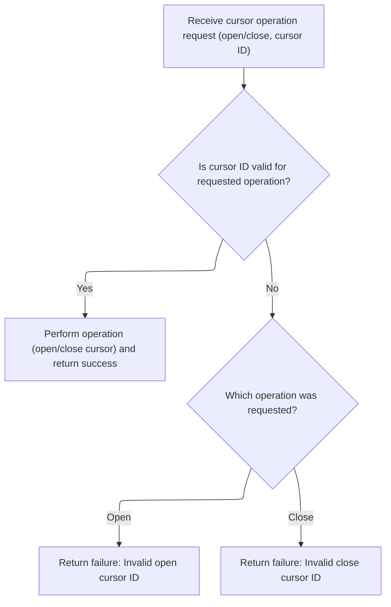

<SwmSnippet path="/base/src/NNNS0488.cbl" line="2206">

---

1000-EXIT-OPEN-CURSOR checks the cursor ID and opens the right SQL cursor. If the ID isn't recognized, it sets a failure flag and logs an error message for the caller.

```cobol
224300 1000-EXIT-OPEN-CURSOR.                                           00224300
224400     EVALUATE TRUE                                                00224400
224500       WHEN DDDXLR01                                              00224500
224600         EXEC SQL                                                 00224600
224700           OPEN DDDXLR01                                          00224700
224800         END-EXEC                                                 00224800
224900       WHEN DDDXLR02                                              00224900
225000         EXEC SQL                                                 00225000
225100           OPEN DDDXLR02                                          00225100
225200         END-EXEC                                                 00225200
225300       WHEN DDDXLR03                                              00225300
225400         EXEC SQL                                                 00225400
225500           OPEN DDDXLR03                                          00225500
225600         END-EXEC                                                 00225600
225700       WHEN DDDXLR04                                              00225700
225800         EXEC SQL                                                 00225800
225900           OPEN DDDXLR04                                          00225900
226000         END-EXEC                                                 00226000
226100       WHEN DDDXLR05                                              00226100
226200         EXEC SQL                                                 00226200
226300           OPEN DDDXLR05                                          00226300
226400         END-EXEC                                                 00226400
226500       WHEN DDDXLR06                                              00226500
226600         EXEC SQL                                                 00226600
226700           OPEN DDDXLR06                                          00226700
226800         END-EXEC                                                 00226800
226900       WHEN DDDXLR07                                              00226900
227000         EXEC SQL                                                 00227000
227100           OPEN DDDXLR07                                          00227100
227200         END-EXEC                                                 00227200
227300       WHEN DDDXLR08                                              00227300
227400         EXEC SQL                                                 00227400
227500           OPEN DDDXLR08                                          00227500
227600         END-EXEC                                                 00227600
227700       WHEN DDDXLR09                                              00227700
227800         EXEC SQL                                                 00227800
227900           OPEN DDDXLR09                                          00227900
228000         END-EXEC                                                 00228000
228100       WHEN OTHER                                                 00228100
228200         SET FAILURE TO TRUE                                      00228200
228300         MOVE 'NNNS0488 - Invalid open cursor ID.'                00228300
228400           TO IS-RTRN-MSG-TXT OF XXXN001A                         00228400
228500     END-EVALUATE                                                 00228500
228600     .                                                            00228600
```

---

</SwmSnippet>

<SwmSnippet path="/base/src/NNNS0488.cbl" line="2252">

---

1100-EXIT-CLOSE-CURSOR closes the requested SQL cursor if the ID matches a known name. If not, it sets failure and logs an error message for the caller.

```cobol
228900 1100-EXIT-CLOSE-CURSOR.                                          00228900
229000     EVALUATE TRUE                                                00229000
229100       WHEN DDDXLR01                                              00229100
229200         EXEC SQL                                                 00229200
229300           CLOSE DDDXLR01                                         00229300
229400         END-EXEC                                                 00229400
229500       WHEN DDDXLR02                                              00229500
229600         EXEC SQL                                                 00229600
229700           CLOSE DDDXLR02                                         00229700
229800         END-EXEC                                                 00229800
229900       WHEN DDDXLR03                                              00229900
230000         EXEC SQL                                                 00230000
230100           CLOSE DDDXLR03                                         00230100
230200         END-EXEC                                                 00230200
230300       WHEN DDDXLR04                                              00230300
230400         EXEC SQL                                                 00230400
230500           CLOSE DDDXLR04                                         00230500
230600         END-EXEC                                                 00230600
230700       WHEN DDDXLR05                                              00230700
230800         EXEC SQL                                                 00230800
230900           CLOSE DDDXLR05                                         00230900
231000         END-EXEC                                                 00231000
231100       WHEN DDDXLR06                                              00231100
231200         EXEC SQL                                                 00231200
231300           CLOSE DDDXLR06                                         00231300
231400         END-EXEC                                                 00231400
231500       WHEN DDDXLR07                                              00231500
231600         EXEC SQL                                                 00231600
231700           CLOSE DDDXLR07                                         00231700
231800         END-EXEC                                                 00231800
231900       WHEN DDDXLR09                                              00231900
232000         EXEC SQL                                                 00232000
232100           CLOSE DDDXLR09                                         00232100
232200         END-EXEC                                                 00232200
232300       WHEN OTHER                                                 00232300
232400         SET FAILURE TO TRUE                                      00232400
232500         MOVE 'NNNS0488 - Invalid close cursor ID.'               00232500
232600           TO IS-RTRN-MSG-TXT OF XXXN001A                         00232600
232700     END-EVALUATE                                                 00232700
232800     .                                                            00232800
```

---

</SwmSnippet>

### Fetching Next Location Data

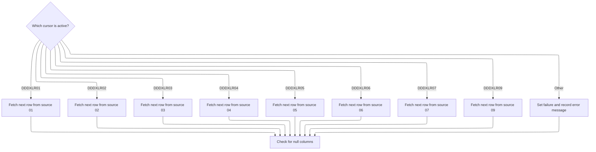

<SwmSnippet path="/base/src/NNNS0488.cbl" line="2514">

---

1300-EXIT-GET-NEXT-ROW picks the right fetch routine based on the cursor ID, then runs it to get location data. After fetching, it checks for null columns to make sure all fields are filled with valid values.

```cobol
255000 1300-EXIT-GET-NEXT-ROW.                                          00255000
255100     EVALUATE TRUE                                                00255100
255200       WHEN DDDXLR01                                              00255200
255300         PERFORM 1301-FETCH-DDDXLR01                              00255300
255400       WHEN DDDXLR02                                              00255400
255500         PERFORM 1302-FETCH-DDDXLR02                              00255500
255600       WHEN DDDXLR03                                              00255600
255700         PERFORM 1303-FETCH-DDDXLR03                              00255700
255800       WHEN DDDXLR04                                              00255800
255900         PERFORM 1304-FETCH-DDDXLR04                              00255900
256000       WHEN DDDXLR05                                              00256000
256100         PERFORM 1305-FETCH-DDDXLR05                              00256100
256200       WHEN DDDXLR06                                              00256200
256300         PERFORM 1306-FETCH-DDDXLR06                              00256300
256400       WHEN DDDXLR07                                              00256400
256500         PERFORM 1307-FETCH-DDDXLR07                              00256500
256600       WHEN DDDXLR09                                              00256600
256700         PERFORM 1309-FETCH-DDDXLR09                              00256700
256800       WHEN OTHER                                                 00256800
256900         SET FAILURE TO TRUE                                      00256900
257000         MOVE 'NNNS0488 - Invalid fetch cursor ID.'               00257000
257100           TO IS-RTRN-MSG-TXT OF XXXN001A                         00257100
257200     END-EVALUATE                                                 00257200
257300                                                                  00257300
257400     PERFORM 1700-CHECK-NULL-COLUMNS                              00257400
257500     .                                                            00257500
```

---

</SwmSnippet>

<SwmSnippet path="/base/src/NNNS0488.cbl" line="2770">

---

1303-FETCH-DDDXLR03 grabs a full set of location fields from the database in one fetch. It assumes the cursor is open and the host variables match the DB columns exactly.

```cobol
280400 1303-FETCH-DDDXLR03.                                             00280400
280500     EXEC SQL                                                     00280500
280600         FETCH DDDXLR03                                           00280600
280700         INTO  :DCLXXXAIL-LOC.LOC-NBR,                            00280700
280800               :DCLXXXAIL-LOC.LOC-TYP-CD,                         00280800
280900               :DCLXXXAIL-LOC.ASSOC-STR-TYP-CD                    00280900
281000               :WS-ASSOC-ST-TYPE-IND,                             00281000
281100               :DCLXXXAIL-LOC.ASSOC-STR-NBR                       00281100
281200               :WS-ASSOC-ST-NO-IND,                               00281200
281300               :DCLXXXAIL-LOC.STR-REMODL-DT,                      00281300
281400               :DCLXXXAIL-LOC.RETL-LOC-STAT-CD,                   00281400
281500               :DCLXXXAIL-LOC.RETL-LOC-STAT-DT,                   00281500
281600               :DCLXXXAIL-LOC.COMPANY-ID,                         00281600
281700               :DCLXXXAIL-LOC.FINANCIAL-DIV-ID,                   00281700
281800               :DCLXXXAIL-LOC.LIN-OF-BUS-ID,                      00281800
281900               :DCLXXXAIL-LOC.DIST-ID,                            00281900
282000               :DCLXXXAIL-LOC.MKT-RGN-ID,                         00282000
282100               :DCLXXXAIL-LOC.GEO-ZN-CD,                          00282100
282200               :DCLXXXAIL-LOC.RETL-GEO-ZN-ID,                     00282200
282300               :DCLXXXAIL-LOC.SCN-MAINT-SW,                       00282300
282400               :DCLXXXAIL-LOC.FRNT-END-CD,                        00282400
282500               :DCLXXXAIL-LOC.PRC-BUL-SW,                         00282500
282600               :DCLXXXAIL-LOC.UPC-ON-PRC-BUL-SW,                  00282600
282700               :DCLXXXAIL-LOC.CMPTR-TYP-CD,                       00282700
282800               :DCLXXXAIL-LOC.RETL-VID-ZN-NBR,                    00282800
282900               :DCLXXXAIL-LOC.RETL-UNLD-CD,                       00282900
283000               :DCLXXXAIL-LOC.ROLUP-REPT-TBL-TXT,                 00283000
283100               :DCLXXXAIL-LOC.NEW-STR-SW,                         00283100
283200               :DCLXXXAIL-LOC.SEL-CIR-SW,                         00283200
283300               :DCLXXXAIL-LOC.BKRM-SQ-FT,                         00283300
283400               :DCLXXXAIL-LOC.FD-LINER-FT,                        00283400
283500               :DCLXXXAIL-LOC.NON-FD-LINER-FT,                    00283500
283600               :DCLXXXAIL-LOC.SETOFF-ROOM-SW,                     00283600
283700               :DCLXXXAIL-LOC.CAT-CLS-TBL-TXT,                    00283700
283800               :DCLXXXAIL-LOC.LAT-K,                              00283800
283900               :DCLXXXAIL-LOC.LON-K,                              00283900
284000               :DCLXXXAIL-LOC.CK-COLL-REPT-SW,                    00284000
284100               :DCLXXXAIL-LOC.CK-COLL-CNTL-CD,                    00284100
284200               :DCLXXXAIL-LOC.CK-COLL-ADD-DEL-SW,                 00284200
284300               :DCLXXXAIL-LOC.CK-ALT-STR-ID,                      00284300
284400               :DCLXXXAIL-LOC.CK-COLL-FEE-AMT,                    00284400
284500               :DCLXXXAIL-LOC.SALS-TAX-PCT,                       00284500
284600               :DCLXXXAIL-LOC.SOAP-SALE-VAR-PCT,                  00284600
284700               :DCLXXXAIL-LOC.ON-SRS-CD,                          00284700
284800               :DCLXXXAIL-LOC.SRS-DSD-ORD-SW,                     00284800
284900               :DCLXXXAIL-LOC.RETL-LOC-TYP-CD,                    00284900
285000               :DCLXXXAIL-LOC.DEA-NBR,                            00285000
285100               :DCLXXXAIL-LOC.STR-OPSTMT-SRT-CD,                  00285100
285200               :DCLXXXAIL-LOC.STR-OPSTMT-TYP-CD,                  00285200
285300               :DCLXXXAIL-LOC.STR-OPSTMT-HDR-CD,                  00285300
285400               :DCLXXXAIL-LOC.DPS-NBR,                            00285400
285500               :DCLXXXAIL-LOC.MEDICARE-ID,                        00285500
285600               :DCLXXXAIL-LOC.NABP-NBR,                           00285600
285700               :DCLXXXAIL-LOC.NATL-PROV-ID,                       00285700
285800               :DCLXXXAIL-LOC.CURR-AD-ZN-NBR,                     00285800
285900               :DCLXXXAIL-LOC.PD-ZONE-NO,                         00285900
286000               :DCLXXXAIL-LOC.SOS-PROC-SW,                        00286000
286100               :DCLXXXAIL-LOC.RPRT-SEQ-NBR,                       00286100
286200               :DCLXXXAIL-LOC.GRP-CD,                             00286200
286300               :DCLXXXAIL-LOC.PRIM-GRP-CD-1,                      00286300
286400               :DCLXXXAIL-LOC.PRIM-GRP-CD-2,                      00286400
286500               :DCLXXXAIL-LOC.SECY-GRP-CD-1,                      00286500
286600               :DCLXXXAIL-LOC.SECY-GRP-CD-2,                      00286600
286700               :DCLXXXAIL-LOC.PRIM-CLS-NBR-1,                     00286700
286800               :DCLXXXAIL-LOC.PRIM-CLS-NBR-2,                     00286800
286900               :DCLXXXAIL-LOC.SECY-CLS-NBR-1,                     00286900
287000               :DCLXXXAIL-LOC.SECY-CLS-NBR-2,                     00287000
287100               :DCLXXXAIL-LOC.VAL-STR-SW ,                        00287100
287200               :DCLXXXAIL-LOC.SLS-CLOSED-DT,                      00287200
287300               :DCLXXXAIL-LOC.TBCO-PRMT-NBR,                      00287300
287400               :DCLXXXAIL-LOC.SUB-UNLIKE-PROD-CD,                 00287400
287500               :DCLXXXAIL-LOC.SUB-DSPLY-PAL-CD,                   00287500
287600               :DCLXXXAIL-LOC.RLTM-SCN-MAINT-SW,                  00287600
287700               :DCLXXXAIL-LOC.TOP-LEADER-NM,                      00287700
287800               :DCLXXXAIL-LOC.CUST-FRNDLY-NM,                     00287800
287900               :DCLXXXAIL-LOC.SLS-OPEN-DT,                        00287900
288000               :WS-MON-OPEN-TS,                                   00288000
288100               :WS-MON-CLOS-TS,                                   00288100
288200               :WS-TUE-OPEN-TS,                                   00288200
288300               :WS-TUE-CLOS-TS,                                   00288300
288400               :WS-WED-OPEN-TS,                                   00288400
288500               :WS-WED-CLOS-TS,                                   00288500
288600               :WS-THUR-OPEN-TS,                                  00288600
288700               :WS-THUR-CLOS-TS,                                  00288700
288800               :WS-FRI-OPEN-TS ,                                  00288800
288900               :WS-FRI-CLOS-TS,                                   00288900
289000               :WS-SAT-OPEN-TS,                                   00289000
289100               :WS-SUN-OPEN-TS,                                   00289100
289200               :WS-SAT-CLOS-TS,                                   00289200
289300               :WS-SUN-CLOS-TS,                                   00289300
289400               :DCLXXXAIL-LOC.RETL-LOC-FRMAT-CD,                  00289400
289500               :DCLXXXAIL-LOC.RETL-LOC-SEGM-CD,                   00289500
289600               :DCLXXXAIL-LOC.ECOMM-MKT-AREA-CD,                  00289600
289700               :DCLXXXAIL-LOC.ECOMM-STRT-DT                       00289700
289800               :DCLXXXAIL-LOC-IND.ECOMM-STRT-DT-IND,              00289800
289900               :DCLXXXAIL-LOC.ECOMM-END-DT                        00289900
290000               :DCLXXXAIL-LOC-IND.ECOMM-END-DT-IND,               00290000
290100               :DCLXXXAIL-LOC.ROLUP-REPT-TBL-01-NBR,              00290100
290200               :DCLXXXAIL-LOC.ROLUP-REPT-TBL-02-NBR,              00290200
290300               :DCLXXXAIL-LOC.ROLUP-REPT-TBL-03-NBR,              00290300
290400               :DCLXXXAIL-LOC.ROLUP-REPT-TBL-04-NBR,              00290400
290500               :DCLXXXAIL-LOC.ROLUP-REPT-TBL-05-NBR,              00290500
290600               :DCLXXXAIL-LOC.ROLUP-REPT-TBL-06-NBR,              00290600
290700               :DCLXXXAIL-LOC.ROLUP-REPT-TBL-07-NBR,              00290700
290800               :DCLXXXAIL-LOC.ROLUP-REPT-TBL-08-NBR,              00290800
290900               :DCLXXXAIL-LOC.ROLUP-REPT-TBL-09-NBR,              00290900
291000               :DCLXXXAIL-LOC.ROLUP-REPT-TBL-10-NBR,              00291000
291100               :DCLXXXAIL-LOC.ONLIN-SSON-SW,                      00291100
291200               :DCLXXXAIL-LOC.RPLACD-BY-STR-NBR                   00291200
291210               :DCLXXXAIL-LOC-IND.RPLACD-BY-STR-NBR-IND           00291210
291300     END-EXEC                                                     00291300
291400     .                                                            00291400
```

---

</SwmSnippet>

<SwmSnippet path="/base/src/NNNS0488.cbl" line="3226">

---

1307-FETCH-DDDXLR07 fetches a full set of location fields from the DB into the target structure. It assumes the cursor is open and the variables match the DB columns.

```cobol
325600 1307-FETCH-DDDXLR07.                                             00325600
325700     EXEC SQL                                                     00325700
325800         FETCH DDDXLR07                                           00325800
325900         INTO  :DCLXXXAIL-LOC.LOC-NBR,                            00325900
326000               :DCLXXXAIL-LOC.LOC-TYP-CD,                         00326000
326100               :DCLXXXAIL-LOC.ASSOC-STR-TYP-CD                    00326100
326200               :WS-ASSOC-ST-TYPE-IND,                             00326200
326300               :DCLXXXAIL-LOC.STR-REMODL-DT,                      00326300
326400               :DCLXXXAIL-LOC.RETL-LOC-STAT-CD,                   00326400
326500               :DCLXXXAIL-LOC.RETL-LOC-STAT-DT,                   00326500
326600               :DCLXXXAIL-LOC.COMPANY-ID,                         00326600
326700               :DCLXXXAIL-LOC.FINANCIAL-DIV-ID,                   00326700
326800               :DCLXXXAIL-LOC.LIN-OF-BUS-ID,                      00326800
326900               :DCLXXXAIL-LOC.DIST-ID,                            00326900
327000               :DCLXXXAIL-LOC.MKT-RGN-ID,                         00327000
327100               :DCLXXXAIL-LOC.GEO-ZN-CD,                          00327100
327200               :DCLXXXAIL-LOC.RETL-GEO-ZN-ID,                     00327200
327300               :DCLXXXAIL-LOC.SCN-MAINT-SW,                       00327300
327400               :DCLXXXAIL-LOC.FRNT-END-CD,                        00327400
327500               :DCLXXXAIL-LOC.PRC-BUL-SW,                         00327500
327600               :DCLXXXAIL-LOC.UPC-ON-PRC-BUL-SW,                  00327600
327700               :DCLXXXAIL-LOC.CMPTR-TYP-CD,                       00327700
327800               :DCLXXXAIL-LOC.RETL-VID-ZN-NBR,                    00327800
327900               :DCLXXXAIL-LOC.RETL-UNLD-CD,                       00327900
328000               :DCLXXXAIL-LOC.ROLUP-REPT-TBL-TXT,                 00328000
328100               :DCLXXXAIL-LOC.NEW-STR-SW,                         00328100
328200               :DCLXXXAIL-LOC.SEL-CIR-SW,                         00328200
328300               :DCLXXXAIL-LOC.BKRM-SQ-FT,                         00328300
328400               :DCLXXXAIL-LOC.FD-LINER-FT,                        00328400
328500               :DCLXXXAIL-LOC.NON-FD-LINER-FT,                    00328500
328600               :DCLXXXAIL-LOC.SETOFF-ROOM-SW,                     00328600
328700               :DCLXXXAIL-LOC.CAT-CLS-TBL-TXT,                    00328700
328800               :DCLXXXAIL-LOC.LAT-K,                              00328800
328900               :DCLXXXAIL-LOC.LON-K,                              00328900
329000               :DCLXXXAIL-LOC.CK-COLL-REPT-SW,                    00329000
329100               :DCLXXXAIL-LOC.CK-COLL-CNTL-CD,                    00329100
329200               :DCLXXXAIL-LOC.CK-COLL-ADD-DEL-SW,                 00329200
329300               :DCLXXXAIL-LOC.CK-ALT-STR-ID,                      00329300
329400               :DCLXXXAIL-LOC.CK-COLL-FEE-AMT,                    00329400
329500               :DCLXXXAIL-LOC.SALS-TAX-PCT,                       00329500
329600               :DCLXXXAIL-LOC.SOAP-SALE-VAR-PCT,                  00329600
329700               :DCLXXXAIL-LOC.ON-SRS-CD,                          00329700
329800               :DCLXXXAIL-LOC.SRS-DSD-ORD-SW,                     00329800
329900               :DCLXXXAIL-LOC.RETL-LOC-TYP-CD,                    00329900
330000               :DCLXXXAIL-LOC.DEA-NBR,                            00330000
330100               :DCLXXXAIL-LOC.STR-OPSTMT-SRT-CD,                  00330100
330200               :DCLXXXAIL-LOC.STR-OPSTMT-TYP-CD,                  00330200
330300               :DCLXXXAIL-LOC.STR-OPSTMT-HDR-CD,                  00330300
330400               :DCLXXXAIL-LOC.DPS-NBR,                            00330400
330500               :DCLXXXAIL-LOC.MEDICARE-ID,                        00330500
330600               :DCLXXXAIL-LOC.NABP-NBR,                           00330600
330700               :DCLXXXAIL-LOC.NATL-PROV-ID,                       00330700
330800               :DCLXXXAIL-LOC.CURR-AD-ZN-NBR,                     00330800
330900               :DCLXXXAIL-LOC.PD-ZONE-NO,                         00330900
331000               :DCLXXXAIL-LOC.SOS-PROC-SW,                        00331000
331100               :DCLXXXAIL-LOC.RPRT-SEQ-NBR,                       00331100
331200               :DCLXXXAIL-LOC.GRP-CD,                             00331200
331300               :DCLXXXAIL-LOC.PRIM-GRP-CD-1,                      00331300
331400               :DCLXXXAIL-LOC.PRIM-GRP-CD-2,                      00331400
331500               :DCLXXXAIL-LOC.SECY-GRP-CD-1,                      00331500
331600               :DCLXXXAIL-LOC.SECY-GRP-CD-2,                      00331600
331700               :DCLXXXAIL-LOC.PRIM-CLS-NBR-1,                     00331700
331800               :DCLXXXAIL-LOC.PRIM-CLS-NBR-2,                     00331800
331900               :DCLXXXAIL-LOC.SECY-CLS-NBR-1,                     00331900
332000               :DCLXXXAIL-LOC.SECY-CLS-NBR-2,                     00332000
332100               :DCLXXXAIL-LOC.VAL-STR-SW,                         00332100
332200               :DCLXXXAIL-LOC.SLS-CLOSED-DT,                      00332200
332300               :DCLXXXAIL-LOC.TBCO-PRMT-NBR,                      00332300
332400               :DCLXXXAIL-LOC.SUB-UNLIKE-PROD-CD,                 00332400
332500               :DCLXXXAIL-LOC.SUB-DSPLY-PAL-CD,                   00332500
332600               :DCLXXXAIL-LOC.RLTM-SCN-MAINT-SW,                  00332600
332700               :DCLXXXAIL-LOC.TOP-LEADER-NM,                      00332700
332800               :DCLXXXAIL-LOC.CUST-FRNDLY-NM,                     00332800
332900               :DCLXXXAIL-LOC.SLS-OPEN-DT,                        00332900
333000               :WS-MON-OPEN-TS,                                   00333000
333100               :WS-MON-CLOS-TS,                                   00333100
333200               :WS-TUE-OPEN-TS,                                   00333200
333300               :WS-TUE-CLOS-TS,                                   00333300
333400               :WS-WED-OPEN-TS,                                   00333400
333500               :WS-WED-CLOS-TS,                                   00333500
333600               :WS-THUR-OPEN-TS,                                  00333600
333700               :WS-THUR-CLOS-TS,                                  00333700
333800               :WS-FRI-OPEN-TS ,                                  00333800
333900               :WS-FRI-CLOS-TS,                                   00333900
334000               :WS-SAT-OPEN-TS,                                   00334000
334100               :WS-SUN-OPEN-TS,                                   00334100
334200               :WS-SAT-CLOS-TS,                                   00334200
334300               :WS-SUN-CLOS-TS,                                   00334300
334400               :DCLXXXAIL-LOC.RETL-LOC-FRMAT-CD,                  00334400
334500               :DCLXXXAIL-LOC.RETL-LOC-SEGM-CD,                   00334500
334600               :DCLXXXAIL-LOC.ECOMM-MKT-AREA-CD,                  00334600
334700               :DCLXXXAIL-LOC.ECOMM-STRT-DT                       00334700
334800               :DCLXXXAIL-LOC-IND.ECOMM-STRT-DT-IND,              00334800
334900               :DCLXXXAIL-LOC.ECOMM-END-DT                        00334900
335000               :DCLXXXAIL-LOC-IND.ECOMM-END-DT-IND,               00335000
335100               :DCLXXXAIL-LOC.ROLUP-REPT-TBL-01-NBR,              00335100
335200               :DCLXXXAIL-LOC.ROLUP-REPT-TBL-02-NBR,              00335200
335300               :DCLXXXAIL-LOC.ROLUP-REPT-TBL-03-NBR,              00335300
335400               :DCLXXXAIL-LOC.ROLUP-REPT-TBL-04-NBR,              00335400
335500               :DCLXXXAIL-LOC.ROLUP-REPT-TBL-05-NBR,              00335500
335600               :DCLXXXAIL-LOC.ROLUP-REPT-TBL-06-NBR,              00335600
335700               :DCLXXXAIL-LOC.ROLUP-REPT-TBL-07-NBR,              00335700
335800               :DCLXXXAIL-LOC.ROLUP-REPT-TBL-08-NBR,              00335800
335900               :DCLXXXAIL-LOC.ROLUP-REPT-TBL-09-NBR,              00335900
336000               :DCLXXXAIL-LOC.ROLUP-REPT-TBL-10-NBR,              00336000
336100               :DCLXXXAIL-LOC.ONLIN-SSON-SW,                      00336100
336200               :DCLXXXAIL-LOC.RPLACD-BY-STR-NBR                   00336200
336210               :DCLXXXAIL-LOC-IND.RPLACD-BY-STR-NBR-IND           00336210
336300     END-EXEC                                                     00336300
336400     .                                                            00336400
```

---

</SwmSnippet>

### Modifying Location Data

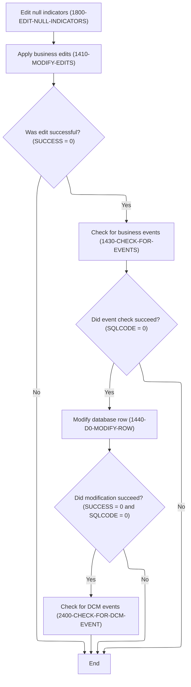

<SwmSnippet path="/base/src/NNNS0488.cbl" line="3452">

---

1400-EXIT-PUT-MODIFY-ROW chains together edits, validation, event checks, and the actual row update. It only moves forward if each step succeeds, so errors stop the flow early. After updating, it checks for DCM events if needed.

```cobol
348000 1400-EXIT-PUT-MODIFY-ROW.                                        00348000
348100     PERFORM 1800-EDIT-NULL-INDICATORS                            00348100
348200     PERFORM 1410-MODIFY-EDITS                                    00348200
348300     IF SUCCESS                                                   00348300
348400       PERFORM 1430-CHECK-FOR-EVENTS                              00348400
348500       IF SQLCODE = 0                                             00348500
348600         PERFORM 1440-D0-MODIFY-ROW                               00348600
348700         IF SUCCESS AND SQLCODE = 0                               00348700
348800           PERFORM 2400-CHECK-FOR-DCM-EVENT                       00348800
348900         END-IF                                                   00348900
349000       END-IF                                                     00349000
349100     END-IF                                                       00349100
349200     .                                                            00349200
```

---

</SwmSnippet>

### Validating Alternate Store Edits

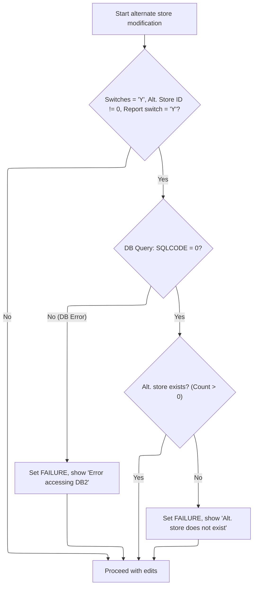

<SwmSnippet path="/base/src/NNNS0488.cbl" line="3467">

---

1410-MODIFY-EDITS runs validation for alternate store entries before any further edits. It calls 1420-VALIDATE-ALT-STORE to check DB existence and flags errors if the store isn't found.

```cobol
349500 1410-MODIFY-EDITS.                                               00349500
349600     PERFORM 1420-VALIDATE-ALT-STORE                              00349600
349700     .                                                            00349700
```

---

</SwmSnippet>

<SwmSnippet path="/base/src/NNNS0488.cbl" line="3472">

---

1420-VALIDATE-ALT-STORE checks if alternate store validation is needed based on flags, then runs a DB count query. If the store isn't found or there's a DB error, it sets failure and logs a specific error message.

```cobol
350000 1420-VALIDATE-ALT-STORE.                                         00350000
350100     IF CK-COLL-ADD-DEL-SW OF DCLXXXAIL-LOC = 'Y' AND             00350100
350200        CK-ALT-STR-ID OF DCLXXXAIL-LOC NOT = 0    AND             00350200
350300        CK-COLL-REPT-SW OF DCLXXXAIL-LOC   = 'Y'                  00350300
350400          EXEC SQL                                                00350400
350500            SELECT COUNT(*)                                       00350500
350600            INTO :WS-CNT                                          00350600
350700            FROM XXXAIL_LOC                                       00350700
350800            WHERE LOC_NBR    = :DCLXXXAIL-LOC.CK-ALT-STR-ID       00350800
350900            AND   LOC_TYP_CD = :DCLXXXAIL-LOC.LOC-TYP-CD          00350900
351000          END-EXEC                                                00351000
351100          EVALUATE TRUE                                           00351100
351200           WHEN SQLCODE = 0                                       00351200
351300            IF WS-CNT = 0                                         00351300
351400              SET  FAILURE                 TO TRUE                00351400
351500              MOVE SPACES                  TO IS-RTRN-MSG-TXT     00351500
351600              STRING 'NNNS0488 - Alt. store does not exists'      00351600
351700                     DELIMITED BY SIZE INTO IS-RTRN-MSG-TXT       00351700
351800            ELSE                                                  00351800
351900              CONTINUE                                            00351900
352000            END-IF                                                00352000
352100           WHEN OTHER                                             00352100
352200             SET  FAILURE                 TO TRUE                 00352200
352300             MOVE SPACES                  TO IS-RTRN-MSG-TXT      00352300
352400             STRING 'NNNS0488 - Error accessing DB2'              00352400
352500                    DELIMITED BY SIZE INTO IS-RTRN-MSG-TXT        00352500
352600     END-IF                                                       00352600
352700     .                                                            00352700
```

---

</SwmSnippet>

### Checking for Status Changes

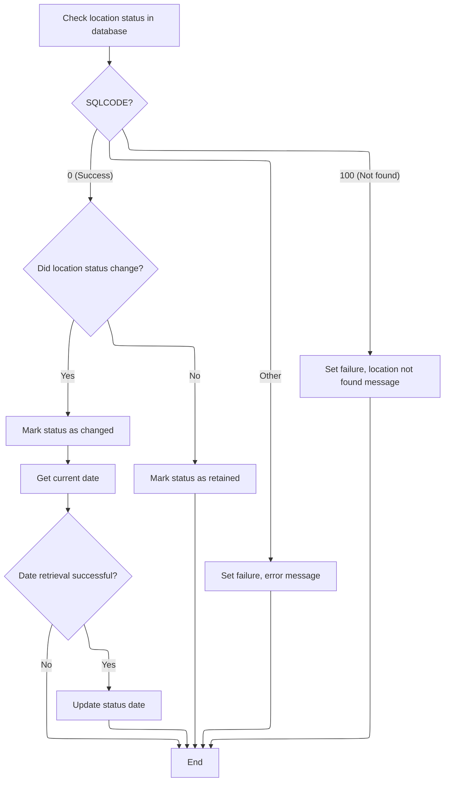

<SwmSnippet path="/base/src/NNNS0488.cbl" line="3502">

---

1430-CHECK-FOR-EVENTS runs a DB query to get the latest status and compares it to the current record. If there's a change, it updates the status date using 2040-GET-CURRENT-DATE. If not, it flags the status as retained. Errors are logged with specific messages.

```cobol
353000 1430-CHECK-FOR-EVENTS.                                           00353000
353100     EXEC SQL                                                     00353100
353200         SELECT RETL_LOC_STAT_CD,                                 00353200
353300                CURR_AD_ZN_NBR,                                   00353300
353400                LIN_OF_BUS_ID                                     00353400
353500         INTO   :WS-STR-ST-CD,                                    00353500
353600                :WS-CURR-AD-ZONE,                                 00353600
353700                :WS-CURR-LOB                                      00353700
353800         FROM   XXXAIL_LOC                                        00353800
353900         WHERE  LOC_NBR = :DCLXXXAIL-LOC.LOC-NBR                  00353900
354000         AND    LOC_TYP_CD = :DCLXXXAIL-LOC.LOC-TYP-CD            00354000
354100     END-EXEC                                                     00354100
354200                                                                  00354200
354300     EVALUATE TRUE                                                00354300
354400       WHEN SQLCODE = 0                                           00354400
354500         IF WS-STR-ST-CD NOT = RETL-LOC-STAT-CD OF DCLXXXAIL-LOC  00354500
354600           SET WS-LOC-STAT-CHANGED TO TRUE                        00354600
354700           PERFORM 2040-GET-CURRENT-DATE                          00354700
354800           IF SUCCESS                                             00354800
354900             MOVE DTA10-MM-DD-YYYY                                00354900
355000               TO RETL-LOC-STAT-DT OF DCLXXXAIL-LOC               00355000
355100           END-IF                                                 00355100
355200         ELSE                                                     00355200
355300           SET  WS-LOC-STAT-RETAINED TO TRUE                      00355300
355400         END-IF                                                   00355400
355500       WHEN SQLCODE = 100                                         00355500
355600         SET  FAILURE TO TRUE                                     00355600
355700         MOVE 'NNNS0488 - xxxail xxxation not found!'             00355700
355800           TO IS-RTRN-MSG-TXT                                     00355800
355900       WHEN SQLCODE NOT = 0                                       00355900
356000         MOVE SQLCODE                 TO WS-SQLCODE               00356000
356100         SET  FAILURE                 TO TRUE                     00356100
356200         MOVE SPACES                  TO IS-RTRN-MSG-TXT          00356200
356300         STRING 'NNNS0488 - Error checking for changes, SQL='     00356300
356400                 WS-SQLCODE                                       00356400
356500                 DELIMITED BY SIZE INTO IS-RTRN-MSG-TXT           00356500
356600     END-EVALUATE                                                 00356600
356700     .                                                            00356700
```

---

</SwmSnippet>

<SwmSnippet path="/base/src/NNNS0488.cbl" line="3778">

---

2040-GET-CURRENT-DATE just calls Z-DATE-FUNCTIONS with two parameters to get the current date. The details of how the date is formatted or retrieved are handled outside this function.

```cobol
379900 2040-GET-CURRENT-DATE.                                           00379900
380000     CALL Z-DATE-FUNCTIONS USING                                  00380000
380100         XXXN001A                                                 00380100
380200         YYYC0127                                                 00380200
380300     .                                                            00380300
```

---

</SwmSnippet>

### Updating the Data Row

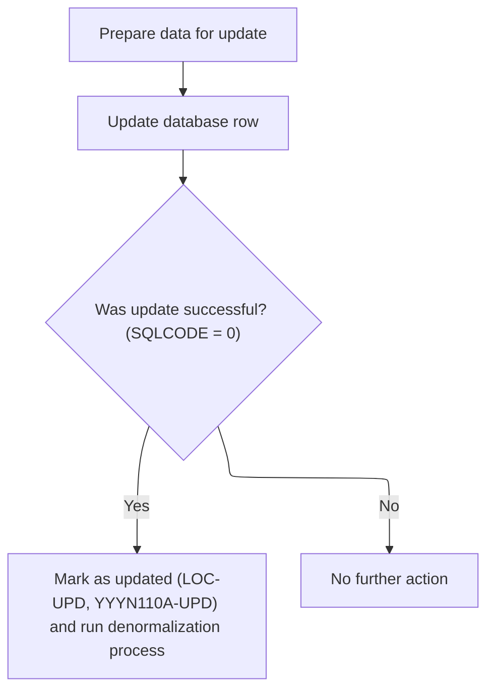

<SwmSnippet path="/base/src/NNNS0488.cbl" line="3542">

---

1440-D0-MODIFY-ROW updates the data row, sets update flags if successful, and then calls 2000-DENORM-PROCESS to handle any related sync or event logic.

```cobol
357000 1440-D0-MODIFY-ROW.                                              00357000
357100     PERFORM 4670-REP-LOWVALUE-WITH-SPACES                        00357100
357200     PERFORM 5000-CALL-NNNU0488-CUD-ROUTINE                       00357200
357300                                                                  00357300
357400     IF SQLCODE = 0                                               00357400
357500       SET YYYN110A-UPD TO TRUE                                   00357500
357600       SET LOC-UPD      TO TRUE                                   00357600
357700       PERFORM 2000-DENORM-PROCESS                                00357700
357800     END-IF                                                       00357800
357900     .                                                            00357900
```

---

</SwmSnippet>

### Post-Update Sync and Event Handling

<SwmSnippet path="/base/src/NNNS0488.cbl" line="3701">

---

2000-DENORM-PROCESS checks if the status changed, updates it if needed, sets a checkpoint, and then runs sync/event routines based on success and task flags. Only the relevant routines are called depending on the current state.

```cobol
372200 2000-DENORM-PROCESS.                                             00372200
372300     IF WS-LOC-STAT-CHANGED                                       00372300
372400       PERFORM 2100-UPD-STAT-IN-xxxation                          00372400
372500     END-IF                                                       00372500
372600     MOVE 1 TO WS-CHECKPOINT-INC                                  00372600
372700     IF SUCCESS                                                   00372700
372800       PERFORM 2010-CALL-CONTROL-SUBR                             00372800
372900     END-IF                                                       00372900
373000     IF  SUCCESS                                                  00373000
373100     AND WWWC0100-NORM-TASK                                       00373100
373200       PERFORM 2020-CALL-SYNC-SUBR                                00373200
373300     END-IF                                                       00373300
373400     IF SUCCESS                                                   00373400
373500       PERFORM 2030-ISSUE-EVENTS                                  00373500
373600     END-IF                                                       00373600
373700     .                                                            00373700
```

---

</SwmSnippet>

#### Updating Location Status

See <SwmLink doc-title="Updating Retail Location Status">[Updating Retail Location Status](\.swm\updating-retail-location-status.8cp4275v.sw.md)</SwmLink>

#### Issuing Events After Sync

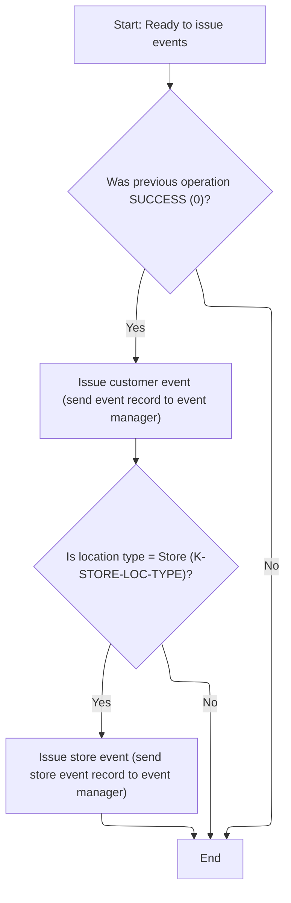

<SwmSnippet path="/base/src/NNNS0488.cbl" line="3740">

---

2030-ISSUE-EVENTS sets up and calls the event manager with the right transaction IDs and program names. For store locations, it issues a second event with a different ID. All routing and event logic is handled by ZZZS0197.

```cobol
376100 2030-ISSUE-EVENTS.                                               00376100
376200     PERFORM 2050-GET-CURRENT-USER                                00376200
376300     SET  YYYN110A-ORACLE      TO TRUE                            00376300
376400     IF SUCCESS                                                   00376400
376500       MOVE LOC-NBR OF P-DDDTLR01 TO ST-STORE-NUMBER OF ZZZC0032  00376500
376600                                     LOC-NBR OF ZZZC0094          00376600
376700       SET  ZZZC0032-UPD-FXXX     TO TRUE                         00376700
376800       MOVE ZZZC0032              TO ZZZC0197-TRX-REC             00376800
376900       MOVE 'CUST'                TO ZZZC0197-TRX-ID              00376900
377000       MOVE 'NNNS0488'            TO ZZZC0197-PROGRAM             00377000
377100       MOVE YYYC0107-USER         TO ZZZC0197-USER                00377100
377200       MOVE YYYN005A-SYS-ENV      TO YYYN110A-SYS-ENV             00377200
377300       CALL ZZZS0197-EVENT-MGR USING                              00377300
377400            XXXN001A                                              00377400
377500            YYYN110A                                              00377500
377600            ZZZC0197                                              00377600
377700                                                                  00377700
377800       EVALUATE TRUE                                              00377800
377900                                                                  00377900
378000       WHEN LOC-TYP-CD OF P-DDDTLR01 = K-STORE-LOC-TYPE           00378000
378100         MOVE LOC-TYP-CD OF P-DDDTLR01 TO                         00378100
378200                                       LOC-TYP-CD OF ZZZC0094     00378200
378300         MOVE ZZZC0094              TO ZZZC0197-TRX-REC           00378300
378400         MOVE 'STRM'                TO ZZZC0197-TRX-ID            00378400
378500         MOVE 'NNNS0488'            TO ZZZC0197-PROGRAM           00378500
378600         MOVE YYYC0107-USER         TO ZZZC0197-USER              00378600
378700         MOVE YYYN005A-SYS-ENV      TO YYYN110A-SYS-ENV           00378700
378800         CALL ZZZS0197-EVENT-MGR USING                            00378800
378900              XXXN001A                                            00378900
379000              YYYN110A                                            00379000
379100              ZZZC0197                                            00379100
379200                                                                  00379200
379300       END-EVALUATE                                               00379300
379400                                                                  00379400
379500     END-IF                                                       00379500
379600     .                                                            00379600
```

---

</SwmSnippet>

### Checking for DCM Events

<SwmSnippet path="/base/src/NNNS0488.cbl" line="3877">

---

2400-CHECK-FOR-DCM-EVENT checks if the business line changed, and if so, sets up and issues a new event by calling 2430-ISSUE-EVENT2.

```cobol
389800 2400-CHECK-FOR-DCM-EVENT.                                        00389800
389900     IF WS-CURR-LOB     NOT = LIN-OF-BUS-ID  OF DCLXXXAIL-LOC     00389900
390400         PERFORM 2410-SETUP-EVENT                                 00390400
390400         PERFORM 2430-ISSUE-EVENT2                                00390500
390600     END-IF                                                       00390600
390700     .                                                            00390700
```

---

</SwmSnippet>

### Issuing DCM Event

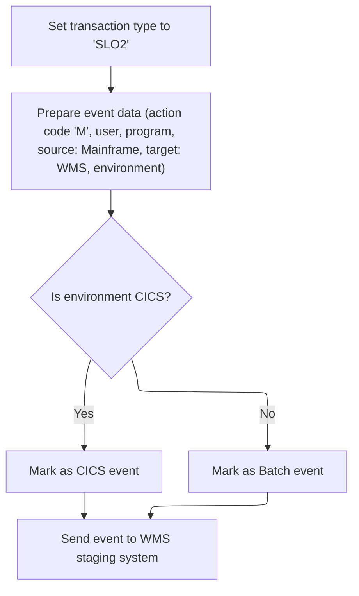

<SwmSnippet path="/base/src/NNNS0488.cbl" line="3929">

---

2430-ISSUE-EVENT2 sets the transaction ID to 'SLO2' and then calls 2420-ISSUE-EVENT to actually issue the event. This keeps the event logic modular and reusable.

```cobol
395500 2430-ISSUE-EVENT2.                                               00395500
395600     MOVE 'SLO2' TO ZZZC0210-TRX-ID                               00395600
395700     PERFORM 2420-ISSUE-EVENT                                     00395700
395800     .                                                            00395800
```

---

</SwmSnippet>

<SwmSnippet path="/base/src/NNNS0488.cbl" line="3904">

---

2420-ISSUE-EVENT sets up the event structure, flags the environment, assigns transaction data and IDs, and calls Z-EVENT-STAGER to actually issue the event. The calling program is set to 'NNNS0488' for downstream tracking.

```cobol
393000 2420-ISSUE-EVENT.                                                00393000
393100     INITIALIZE YYYC0175                                          00393100
393200     SET YYYC0175-ORACLE      TO TRUE                             00393200
393300     IF YYYN005A-CICS-ENV                                         00393300
393400       SET YYYC0175-CICS-ENV  TO TRUE                             00393400
393500     ELSE                                                         00393500
393600       SET YYYC0175-BATCH-ENV TO TRUE                             00393600
393700     END-IF                                                       00393700
393800                                                                  00393800
393900     MOVE ZZZC0210-TRX-ID TO YYYC0175-TRX-CD                      00393900
394000     MOVE ZZZC0210        TO YYYC0175-DATA                        00394000
394100     MOVE 'M'             TO YYYC0175-ACTION-CD                   00394100
394200                                                                  00394200
394300     MOVE 'NNNS0488'      TO YYYC0175-CALLING-PROG                00394300
394400     MOVE YYYC0107-USER   TO YYYC0175-CALLING-USER                00394400
394500                                                                  00394500
394600     SET  YYYC0175-SOURCE-MAINFRAME TO TRUE                       00394600
394700     SET  YYYC0175-TARGET-WMS       TO TRUE                       00394700
394800                                                                  00394800
394900     CALL Z-EVENT-STAGER USING                                    00394900
395000         XXXN001A                                                 00395000
395100         YYYC0175                                                 00395100
395200     .                                                            00395200
```

---

</SwmSnippet>

### Inserting New Location Data

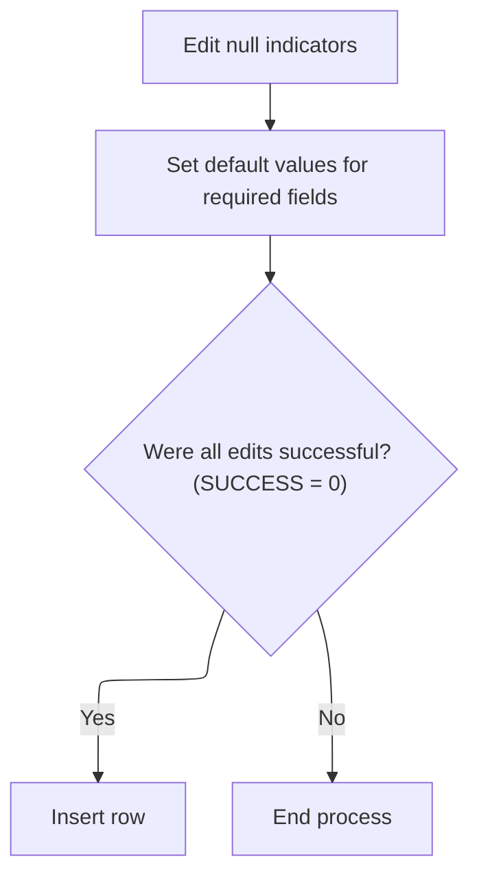

<SwmSnippet path="/base/src/NNNS0488.cbl" line="3554">

---

1500-EXIT-PUT-INSERT-ROW runs null indicator edits, then calls 1510-ADD-EDITS to set default values and prep the data. Only if everything checks out does it try the actual insert.

```cobol
358200 1500-EXIT-PUT-INSERT-ROW.                                        00358200
358300     PERFORM 1800-EDIT-NULL-INDICATORS                            00358300
358400     PERFORM 1510-ADD-EDITS                                       00358400
358500     IF SUCCESS                                                   00358500
358600       PERFORM 1520-D0-INSERT-ROW                                 00358600
358700     END-IF                                                       00358700
358800     .                                                            00358800
```

---

</SwmSnippet>

<SwmSnippet path="/base/src/NNNS0488.cbl" line="3563">

---

1510-ADD-EDITS sets default codes for any blank fields in the location record, using 'X', 'Y', or 'N' as needed. It also copies the sort code to the report sequence field.

```cobol
359100 1510-ADD-EDITS.                                                  00359100
359200     IF RETL-LOC-STAT-CD OF DCLXXXAIL-LOC = SPACES                00359200
359300        MOVE 'X' TO RETL-LOC-STAT-CD OF DCLXXXAIL-LOC             00359300
359400     END-IF                                                       00359400
359500                                                                  00359500
359600     IF NEW-STR-SW       OF DCLXXXAIL-LOC = SPACES                00359600
359700        MOVE 'Y' TO NEW-STR-SW OF DCLXXXAIL-LOC                   00359700
359800     END-IF                                                       00359800
359900                                                                  00359900
360000     IF SETOFF-ROOM-SW   OF DCLXXXAIL-LOC = SPACES                00360000
360100        MOVE 'N' TO SETOFF-ROOM-SW OF DCLXXXAIL-LOC               00360100
360200     END-IF                                                       00360200
360300                                                                  00360300
360400     IF PRC-BUL-SW       OF DCLXXXAIL-LOC = SPACES                00360400
360500        MOVE 'N' TO PRC-BUL-SW OF DCLXXXAIL-LOC                   00360500
360600     END-IF                                                       00360600
360700                                                                  00360700
360800     IF FRNT-END-CD      OF DCLXXXAIL-LOC = SPACES                00360800
360900        MOVE 'N' TO FRNT-END-CD OF DCLXXXAIL-LOC                  00360900
361000     END-IF                                                       00361000
361100                                                                  00361100
361200     IF SCN-MAINT-SW     OF DCLXXXAIL-LOC = SPACES                00361200
361300        MOVE 'N' TO SCN-MAINT-SW OF DCLXXXAIL-LOC                 00361300
361400     END-IF                                                       00361400
361500                                                                  00361500
361600     IF UPC-ON-PRC-BUL-SW OF DCLXXXAIL-LOC = SPACES               00361600
361700        MOVE 'N' TO  UPC-ON-PRC-BUL-SW OF DCLXXXAIL-LOC           00361700
361800     END-IF                                                       00361800
361900                                                                  00361900
362000     MOVE STR-OPSTMT-SRT-CD OF DCLXXXAIL-LOC TO                   00362000
362100          RPRT-SEQ-NBR      OF DCLXXXAIL-LOC                      00362100
362200     .                                                            00362200
```

---

</SwmSnippet>

### Inserting and Validating New Location Records

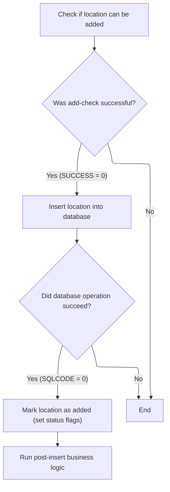

<SwmSnippet path="/base/src/NNNS0488.cbl" line="3597">

---

`1520-D0-INSERT-ROW` runs an add check, sanitizes the record, inserts it, and sets flags if successful. It only moves forward if each step works, and denormalization is triggered at the end.

```cobol
362500 1520-D0-INSERT-ROW.                                              00362500
362600     PERFORM 4600-CALL-MMMS0335-RI-ADD-CHK                        00362600
362700     IF SUCCESS                                                   00362700
362800        PERFORM 4670-REP-LOWVALUE-WITH-SPACES                     00362800
362900        PERFORM 5000-CALL-NNNU0488-CUD-ROUTINE                    00362900
363000                                                                  00363000
363100        IF SQLCODE = 0                                            00363100
363200          SET WS-LOC-STAT-CHANGED TO TRUE                         00363200
363300          SET YYYN110A-ADD TO TRUE                                00363300
363400          SET LOC-ADD      TO TRUE                                00363400
363500          PERFORM 2000-DENORM-PROCESS                             00363500
363600        END-IF                                                    00363600
363700     END-IF                                                       00363700
363800     .                                                            00363800
```

---

</SwmSnippet>

<SwmSnippet path="/base/src/NNNS0488.cbl" line="3963">

---

`4600-CALL-MMMS0335-RI-ADD-CHK` prepares the record and calls MMMS0335 to validate it against business rules before any insert happens.

```cobol
398900 4600-CALL-MMMS0335-RI-ADD-CHK.                                   00398900
399000     INITIALIZE MMMC0335                                          00399000
399100     MOVE ECOMM-MKT-AREA-CD OF DCLXXXAIL-LOC                      00399100
399200                                 TO MMMC0335-ECOMM-MKT-AREA-CD    00399200
399300     MOVE CMPTR-TYP-CD  OF DCLXXXAIL-LOC                          00399300
399400                                 TO MMMC0335-CMPTR-TYP-CD         00399400
399500     SET   MMMC0335-INSERT-CHECK TO TRUE                          00399500
399600     SET   MMMC0335-XXXAIL-LOC   TO TRUE                          00399600
399700     SET   MMMC0335-ORACLE       TO TRUE                          00399700
399800     CALL  MMMC0335-RI-INSERT-CHK USING                           00399800
399900           XXXN001A                                               00399900
400000           MMMC0335                                               00400000
400100     .                                                            00400100
```

---

</SwmSnippet>

### Purging Location Records

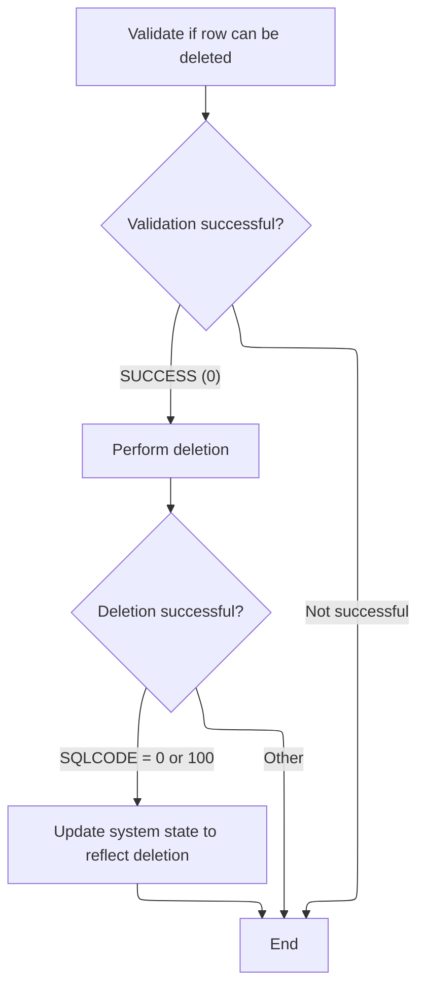

<SwmSnippet path="/base/src/NNNS0488.cbl" line="3613">

---

`1600-EXIT-PUT-PURGE-ROW` starts by calling a delete check routine to make sure the location can be safely removed. If the check passes, it calls the database update to purge the record. Success is flagged for both SQLCODE 0 and 100, and the relevant delete flags are set. If the location is in use, a specific error code and message are set. The commented-out EVALUATE block shows an alternate way to handle error codes but isn't used here.

```cobol
364100 1600-EXIT-PUT-PURGE-ROW.                                         00364100
364200     PERFORM 4500-CALL-MMMS0304-RI-DEL-CHK                        00364200
364300     IF SUCCESS                                                   00364300
364400       PERFORM 5000-CALL-NNNU0488-CUD-ROUTINE                     00364400
364500                                                                  00364500
364600       IF SQLCODE = 0 OR 100                                      00364600
364700         MOVE 0            TO SQLCODE                             00364700
364800         SET  YYYN110A-DEL TO TRUE                                00364800
364900         SET  LOC-DEL      TO TRUE                                00364900
365000       END-IF                                                     00365000
365100     END-IF                                                       00365100
365200                                                                  00365200
365300*    EVALUATE TRUE                                                00365300
365400*      WHEN SQLCODE = 0                                           00365400
365500*      OR   SQLCODE = 100                                         00365500
365600*        MOVE 0            TO SQLCODE                             00365600
365700*        SET  YYYN110A-DEL TO TRUE                                00365700
365800*        SET  LOC-DEL      TO TRUE                                00365800
365900*      WHEN SQLCODE = -532                                        00365900
366000*        SET  FAILURE TO TRUE                                     00366000
366100*        MOVE 'NNNS0488 - xxxation in use - it cannot be deleted!'00366100
366200*          TO IS-RTRN-MSG-TXT                                     00366200
366300*      WHEN SQLCODE NOT = 0                                       00366300
366400*        MOVE SQLCODE                 TO WS-SQLCODE               00366400
366500*        SET  FAILURE                 TO TRUE                     00366500
366600*        MOVE SPACES                  TO IS-RTRN-MSG-TXT          00366600
366700*        STRING 'NNNS0488 - Error deleting xxxail loc, SQL='      00366700
366800*                WS-SQLCODE                                       00366800
366900*                DELIMITED BY SIZE INTO IS-RTRN-MSG-TXT           00366900
367000*    END-EVALUATE                                                 00367000
367100     .                                                            00367100
```

---

</SwmSnippet>

&nbsp;

*This is an auto-generated document by Swimm 🌊 and has not yet been verified by a human*

<SwmMeta version="3.0.0" repo-id="Z2l0aHViJTNBJTNBU3dpbW1pby1keW5jYWxsLWRlbW8lM0ElM0FHaXJpLVN3aW1t" repo-name="Swimmio-dyncall-demo"><sup>Powered by [Swimm](https://app.swimm.io/)</sup></SwmMeta>
