This document describes the flow for retrieving and managing location data for a store. The process starts by preparing the request with the store number and type, then dispatches the operation to the database. Depending on the requested business action, the flow can fetch, modify, insert, purge, or delete location records. The output is either the location data or a status message indicating the result.

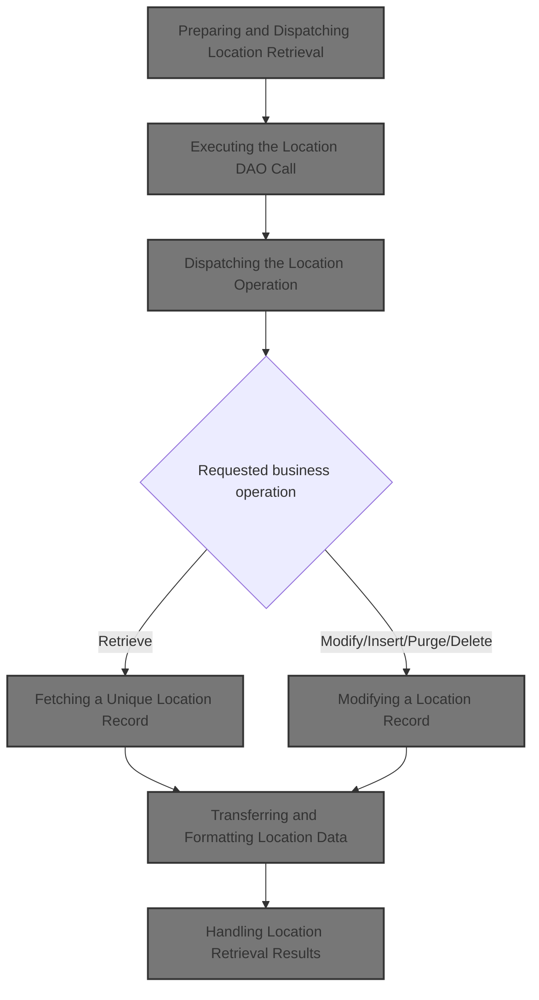
```mermaid
flowchart TD
  node1["Preparing and Dispatching Location Retrieval"]:::HeadingStyle
  click node1 goToHeading "Preparing and Dispatching Location Retrieval"
  node1 --> node2["Executing the Location DAO Call"]:::HeadingStyle
  click node2 goToHeading "Executing the Location DAO Call"
  node2 --> node3["Dispatching the Location Operation"]:::HeadingStyle
  click node3 goToHeading "Dispatching the Location Operation"
  node3 --> node4{"Requested business operation"}
  node4 -->|"Retrieve"| node5["Fetching a Unique Location Record"]:::HeadingStyle
  click node5 goToHeading "Fetching a Unique Location Record"
  node4 -->|"Modify/Insert/Purge/Delete"| node6["Modifying a Location Record"]:::HeadingStyle
  click node6 goToHeading "Modifying a Location Record"
  node5 --> node7["Transferring and Formatting Location Data"]:::HeadingStyle
  click node7 goToHeading "Transferring and Formatting Location Data"
  node6 --> node7
  node7 --> node8["Handling Location Retrieval Results"]:::HeadingStyle
  click node8 goToHeading "Handling Location Retrieval Results"
classDef HeadingStyle fill:#777777,stroke:#333,stroke-width:2px;
```

# Spec

## Detailed View of the Program's Functionality

# Translating Oracle Error Codes (base/src/YYYS0212.cbl)

## a. Main Program Flow

The program begins by initializing its working storage fields, which are used to hold parts of an Oracle error message and the Oracle error code itself. It then proceeds to the main logic, which is responsible for converting Oracle error codes into their corresponding DB2 SQL codes and formatting a user-friendly error message.

- The main entry point performs two steps:
  1. It clears out the error message fields.
  2. It formats the user message by analyzing the Oracle error code and mapping it to an internal code or message.
- After these steps, the program returns control to the caller.

## b. Initialization

Before any error processing, the program ensures that all temporary storage fields for error messages and codes are set to blank. This prevents any leftover data from previous operations from interfering with the current error handling.

- All fields used for error message parts and the Oracle code are set to spaces.

## c. Oracle Error Message Parsing and Mapping

The core logic of the program is to take the Oracle error message (provided in a standard field by the database interface) and break it into its components. The last component is expected to be the Oracle error code.

- The error message string is split into up to four parts: three message fragments and the Oracle error code.
- The program then examines the Oracle error code and, using a large switch-case structure, maps it to a corresponding DB2 SQLCODE. For example:
  - Oracle code '60' is mapped to DB2 code -911.
  - Oracle code '904' or '310' is mapped to DB2 code -206.
  - Oracle code '615' or '616' is mapped to DB2 code -420.
  - Oracle code '942' is mapped to DB2 code -204.
  - Oracle code '1403' is mapped to DB2 code -100.
  - Oracle code '1001' is mapped to DB2 code -501.
  - Oracle code '1438' is mapped to DB2 code -413.
  - Oracle code '2112' or '1422' is mapped to DB2 code -811.
  - Oracle code '2049' is mapped to DB2 code -913.
  - Oracle code '2291' is mapped to DB2 code -530.
  - Oracle code '2292' is mapped to DB2 code -532.
  - Oracle code '6502' is mapped to DB2 code -304.
  - Oracle code '6508' is mapped to DB2 code -440.
  - Oracle code '6511' is mapped to DB2 code -502.
  - Oracle code '6550' or '6553' is mapped to DB2 code -440.
  - Oracle code '14028' is mapped to DB2 code -538.
  - Oracle code '30006' is mapped to DB2 code -904.
- If the Oracle error code does not match any of the known codes, the program constructs a generic error message indicating that an unknown Oracle code was encountered.

## d. Cleanup

After mapping the error code and formatting the message, the program clears the original Oracle error message field to prevent it from being reused or misinterpreted in subsequent operations.

---

**Summary:**\
This program acts as a translator between Oracle error codes and DB2 SQL error codes. It parses the Oracle error message, extracts the error code, maps it to a DB2 code if possible, and builds a user-friendly error message. If the code is unknown, it creates a generic error message. This ensures that downstream programs receive consistent and meaningful error information, regardless of the underlying database system.

# Rule Definition

| Paragraph Name                                                                                                      | Rule ID | Category          | Description                                                                                                                                                                                                                                                                                                                                                                                                                                                                                                              | Conditions                                                                                                              | Remarks                                                                                                                                                                                |
| ------------------------------------------------------------------------------------------------------------------- | ------- | ----------------- | ------------------------------------------------------------------------------------------------------------------------------------------------------------------------------------------------------------------------------------------------------------------------------------------------------------------------------------------------------------------------------------------------------------------------------------------------------------------------------------------------------------------------ | ----------------------------------------------------------------------------------------------------------------------- | -------------------------------------------------------------------------------------------------------------------------------------------------------------------------------------- |
| 000-MAIN, 100-INITIALIZATION, 200-CHECK-INPUTS (WWWS0003), 100-INITIALIZATION (NNNS0487), 100-INITIALIZE (MMMS0711) | RL-001  | Conditional Logic | The system must accept an input structure containing all location fields and an operation code, with the structure matching the P-DDDTLO01 definition. The operation code determines which business operation to perform.                                                                                                                                                                                                                                                                                                | Input structure must be present and match the P-DDDTLO01 definition. Operation code must be one of the supported codes. | Operation codes: Retrieve unique, Retrieve next, Modify, Insert, Purge, Delete loan data. Input structure fields must match P-DDDTLO01 (field types: string, number, date, etc.).      |
| 1200-EXIT-GET-UNIQUE-ROW (NNNS0487), 1200-EXIT-GET-UNIQUE-ROW (WWWS0003)                                            | RL-002  | Computation       | For a Retrieve unique location operation, the system must query the XXXATION table using LOC_TYP_CD and LOC_NBR as the key, and populate all fields in the output structure with the retrieved data. If no record is found, the output must indicate failure and include a not found message.                                                                                                                                                                                                                            | Operation code is Retrieve unique location. LOC_TYP_CD and LOC_NBR are provided.                                        | Output structure must be fully populated with all fields from the database. If not found, status='F', message='not found'. Field types: string, number, date, etc.                     |
| 1400-EXIT-PUT-MODIFY-ROW (NNNS0487), 1400-EXIT-PUT-MODIFY-ROW (WWWS0003)                                            | RL-003  | Computation       | For a Modify location operation, the system must update the XXXATION table for the given LOC_TYP_CD and LOC_NBR, using the provided fields in the input structure. The system must set the last update timestamp and user fields to the current values. If AP_NBR or AP_TYP_CD are missing, the system must set their null indicators accordingly. After modification, the output structure must reflect the updated values. If the update fails, the output must indicate failure and include a detailed error message. | Operation code is Modify location. LOC_TYP_CD and LOC_NBR are provided. Input fields are present.                       | Timestamp and user fields must be set to current values. Null indicators for AP_NBR/AP_TYP_CD: -1 if missing. Output structure must reflect updated database state. Status='S' or 'F'. |
| 1500-EXIT-PUT-INSERT-ROW (NNNS0487), 1500-EXIT-PUT-INSERT-ROW (WWWS0003)                                            | RL-004  | Computation       | For an Insert location operation, the system must validate required fields, assign new facility and organization IDs as needed, and insert a new row into the XXXATION table. The output must reflect the inserted data or indicate failure with an error message if the insert fails.                                                                                                                                                                                                                                   | Operation code is Insert location. Required fields are present.                                                         | Facility and organization IDs must be assigned if not present. Output structure must reflect inserted data. Status='S' or 'F'.                                                         |
| 1600-EXIT-PUT-PURGE-ROW (NNNS0487), 1600-EXIT-PUT-PURGE-ROW (WWWS0003)                                              | RL-005  | Computation       | For a Purge location operation, the system must select the appropriate deletion logic based on location type, perform the deletion, and update related data as required by business rules. The output must indicate success or failure and provide an appropriate message.                                                                                                                                                                                                                                               | Operation code is Purge location. LOC_TYP_CD and LOC_NBR are provided.                                                  | Deletion logic varies by location type (store, vendor, etc). Output status='S' or 'F', message describes result.                                                                       |
| 1690-DELETE-LO (NNNS0487)                                                                                           | RL-006  | Computation       | For a Delete loan data operation, the system must purge all fax numbers associated with the loan, check if the loan can be deleted, and if so, delete the loan record. The output must indicate the result and provide a message.                                                                                                                                                                                                                                                                                        | Operation code is Delete loan data. Loan identifier is provided.                                                        | All fax numbers associated with the loan must be deleted first. Output status='S' or 'F', message describes result.                                                                    |
| 200-FORMAT-USER-MSG-TXT (YYYS0212), 300-CNV-ORACLE-SQLCODE (YYYS0211), error handling in all main routines          | RL-007  | Conditional Logic | For all operations, the system must check the SQLCODE after each database operation. If SQLCODE is 0, the output must indicate success. If SQLCODE is 100, the output must indicate failure and a not found message. If SQLCODE is negative, the output must indicate failure and include a detailed error message, mapping Oracle error codes to DB2 SQLCODEs as needed.                                                                                                                                                | After every database operation.                                                                                         | Oracle error codes are mapped to DB2 SQLCODEs as per mapping table. Output status: 'S' for SQLCODE=0, 'F' for SQLCODE=100 or <0. Message field must describe result.                   |
| All main routines, output population logic                                                                          | RL-008  | Data Assignment   | The output structure must always include a status field (S=Success, F=Failure) and a message field describing the result of the operation.                                                                                                                                                                                                                                                                                                                                                                               | On every operation completion.                                                                                          | Status field: 1 alphanumeric ('S' or 'F'). Message field: string, up to 256 chars (or as defined).                                                                                     |
| 110-MOVE-PDA-FIELDS-2-DCL, 130-MOVE-DCL-2-PDA-FIELDS, 112-CONVERT-TM-TO-TS, 132-CONVERT-TS-TO-TM (NNNS0487)         | RL-009  | Computation       | All date and timestamp fields in the output must be normalized to the expected format.                                                                                                                                                                                                                                                                                                                                                                                                                                   | On output population for any operation.                                                                                 | Dates: normalized to YYYY-MM-DD or as required. Timestamps: normalized to standard format (e.g., ISO 8601).                                                                            |
| 1700-CHECK-NULL-COLUMNS, 1800-EDIT-NULL-INDICATORS (NNNS0487)                                                       | RL-010  | Conditional Logic | The system must handle null or invalid AP_NBR and AP_TYP_CD fields by blanking or zeroing them in the output as appropriate.                                                                                                                                                                                                                                                                                                                                                                                             | On output population or when fields are missing/invalid.                                                                | If AP_NBR is missing, set to 0. If AP_TYP_CD is missing, set to spaces. Null indicators set to -1 as needed.                                                                           |
| 130-MOVE-DCL-2-PDA-FIELDS (NNNS0487), output population after each operation                                        | RL-011  | Data Assignment   | The system must ensure that all output fields are populated according to the latest database state after each operation.                                                                                                                                                                                                                                                                                                                                                                                                 | After any modifying operation (insert, update, delete, purge, etc.).                                                    | Output structure must be fully refreshed from the database after operation. Field types as per P-DDDTLO01.                                                                             |

# User Stories

## User Story 1: Retrieve unique location

---

### Story Description:

As a user, I want to retrieve a unique location by providing location type and number so that I can view all details for that location, and receive a clear message if the location is not found.

---

### Business Rule Mapping:

| Rule ID | Paragraph Name                                                                                                      | Rule Description                                                                                                                                                                                                                                                                                                                                                          |
| ------- | ------------------------------------------------------------------------------------------------------------------- | ------------------------------------------------------------------------------------------------------------------------------------------------------------------------------------------------------------------------------------------------------------------------------------------------------------------------------------------------------------------------- |
| RL-010  | 1700-CHECK-NULL-COLUMNS, 1800-EDIT-NULL-INDICATORS (NNNS0487)                                                       | The system must handle null or invalid AP_NBR and AP_TYP_CD fields by blanking or zeroing them in the output as appropriate.                                                                                                                                                                                                                                              |
| RL-001  | 000-MAIN, 100-INITIALIZATION, 200-CHECK-INPUTS (WWWS0003), 100-INITIALIZATION (NNNS0487), 100-INITIALIZE (MMMS0711) | The system must accept an input structure containing all location fields and an operation code, with the structure matching the P-DDDTLO01 definition. The operation code determines which business operation to perform.                                                                                                                                                 |
| RL-002  | 1200-EXIT-GET-UNIQUE-ROW (NNNS0487), 1200-EXIT-GET-UNIQUE-ROW (WWWS0003)                                            | For a Retrieve unique location operation, the system must query the XXXATION table using LOC_TYP_CD and LOC_NBR as the key, and populate all fields in the output structure with the retrieved data. If no record is found, the output must indicate failure and include a not found message.                                                                             |
| RL-007  | 200-FORMAT-USER-MSG-TXT (YYYS0212), 300-CNV-ORACLE-SQLCODE (YYYS0211), error handling in all main routines          | For all operations, the system must check the SQLCODE after each database operation. If SQLCODE is 0, the output must indicate success. If SQLCODE is 100, the output must indicate failure and a not found message. If SQLCODE is negative, the output must indicate failure and include a detailed error message, mapping Oracle error codes to DB2 SQLCODEs as needed. |
| RL-008  | All main routines, output population logic                                                                          | The output structure must always include a status field (S=Success, F=Failure) and a message field describing the result of the operation.                                                                                                                                                                                                                                |
| RL-009  | 110-MOVE-PDA-FIELDS-2-DCL, 130-MOVE-DCL-2-PDA-FIELDS, 112-CONVERT-TM-TO-TS, 132-CONVERT-TS-TO-TM (NNNS0487)         | All date and timestamp fields in the output must be normalized to the expected format.                                                                                                                                                                                                                                                                                    |
| RL-011  | 130-MOVE-DCL-2-PDA-FIELDS (NNNS0487), output population after each operation                                        | The system must ensure that all output fields are populated according to the latest database state after each operation.                                                                                                                                                                                                                                                  |

---

### Relevant Functionality:

- **1700-CHECK-NULL-COLUMNS**
  1. **RL-010:**
     - If AP_NBR/AP_TYP_CD are missing or invalid, set AP_NBR=0, AP_TYP_CD=spaces in output.
     - Set null indicators to -1.
- **000-MAIN**
  1. **RL-001:**
     - On entry, validate that the input structure is present and matches the expected format.
     - Check that the operation code is one of the supported values.
     - If validation fails, set output status to 'F' and provide an error message.
     - Otherwise, dispatch to the appropriate operation handler.
- **1200-EXIT-GET-UNIQUE-ROW (NNNS0487)**
  1. **RL-002:**
     - Query XXXATION table using LOC_TYP_CD and LOC_NBR as key.
     - If record found:
       - Populate all output fields with retrieved data.
       - Set status to 'S', message to success.
     - If not found (SQLCODE=100):
       - Set status to 'F', message to 'not found'.
     - If error (SQLCODE<0):
       - Set status to 'F', message to error details.
- **200-FORMAT-USER-MSG-TXT (YYYS0212)**
  1. **RL-007:**
     - After each DB operation, check SQLCODE.
     - If 0: set status='S', message=success.
     - If 100: set status='F', message='not found'.
     - If <0: set status='F', message=error details (map Oracle codes if needed).
     - Use YYYS0212 for Oracle-to-DB2 code conversion.
- **All main routines**
  1. **RL-008:**
     - On operation completion, set status field to 'S' or 'F'.
     - Set message field to describe result (success, not found, error, etc.).
- **110-MOVE-PDA-FIELDS-2-DCL**
  1. **RL-009:**
     - When populating output, convert all date/timestamp fields to normalized format.
     - Use conversion routines as needed (e.g., 112-CONVERT-TM-TO-TS, 132-CONVERT-TS-TO-TM).
- **130-MOVE-DCL-2-PDA-FIELDS (NNNS0487)**
  1. **RL-011:**
     - After operation, re-query or refresh output fields from database.
     - Populate output structure with latest values.

## User Story 2: Modify location

---

### Story Description:

As a user, I want to modify an existing location by providing updated fields so that the location data is kept current, with proper handling of timestamps, user fields, and null indicators, and receive confirmation or error details in the output.

---

### Business Rule Mapping:

| Rule ID | Paragraph Name                                                                                                      | Rule Description                                                                                                                                                                                                                                                                                                                                                                                                                                                                                                         |
| ------- | ------------------------------------------------------------------------------------------------------------------- | ------------------------------------------------------------------------------------------------------------------------------------------------------------------------------------------------------------------------------------------------------------------------------------------------------------------------------------------------------------------------------------------------------------------------------------------------------------------------------------------------------------------------ |
| RL-010  | 1700-CHECK-NULL-COLUMNS, 1800-EDIT-NULL-INDICATORS (NNNS0487)                                                       | The system must handle null or invalid AP_NBR and AP_TYP_CD fields by blanking or zeroing them in the output as appropriate.                                                                                                                                                                                                                                                                                                                                                                                             |
| RL-001  | 000-MAIN, 100-INITIALIZATION, 200-CHECK-INPUTS (WWWS0003), 100-INITIALIZATION (NNNS0487), 100-INITIALIZE (MMMS0711) | The system must accept an input structure containing all location fields and an operation code, with the structure matching the P-DDDTLO01 definition. The operation code determines which business operation to perform.                                                                                                                                                                                                                                                                                                |
| RL-003  | 1400-EXIT-PUT-MODIFY-ROW (NNNS0487), 1400-EXIT-PUT-MODIFY-ROW (WWWS0003)                                            | For a Modify location operation, the system must update the XXXATION table for the given LOC_TYP_CD and LOC_NBR, using the provided fields in the input structure. The system must set the last update timestamp and user fields to the current values. If AP_NBR or AP_TYP_CD are missing, the system must set their null indicators accordingly. After modification, the output structure must reflect the updated values. If the update fails, the output must indicate failure and include a detailed error message. |
| RL-007  | 200-FORMAT-USER-MSG-TXT (YYYS0212), 300-CNV-ORACLE-SQLCODE (YYYS0211), error handling in all main routines          | For all operations, the system must check the SQLCODE after each database operation. If SQLCODE is 0, the output must indicate success. If SQLCODE is 100, the output must indicate failure and a not found message. If SQLCODE is negative, the output must indicate failure and include a detailed error message, mapping Oracle error codes to DB2 SQLCODEs as needed.                                                                                                                                                |
| RL-008  | All main routines, output population logic                                                                          | The output structure must always include a status field (S=Success, F=Failure) and a message field describing the result of the operation.                                                                                                                                                                                                                                                                                                                                                                               |
| RL-009  | 110-MOVE-PDA-FIELDS-2-DCL, 130-MOVE-DCL-2-PDA-FIELDS, 112-CONVERT-TM-TO-TS, 132-CONVERT-TS-TO-TM (NNNS0487)         | All date and timestamp fields in the output must be normalized to the expected format.                                                                                                                                                                                                                                                                                                                                                                                                                                   |
| RL-011  | 130-MOVE-DCL-2-PDA-FIELDS (NNNS0487), output population after each operation                                        | The system must ensure that all output fields are populated according to the latest database state after each operation.                                                                                                                                                                                                                                                                                                                                                                                                 |

---

### Relevant Functionality:

- **1700-CHECK-NULL-COLUMNS**
  1. **RL-010:**
     - If AP_NBR/AP_TYP_CD are missing or invalid, set AP_NBR=0, AP_TYP_CD=spaces in output.
     - Set null indicators to -1.
- **000-MAIN**
  1. **RL-001:**
     - On entry, validate that the input structure is present and matches the expected format.
     - Check that the operation code is one of the supported values.
     - If validation fails, set output status to 'F' and provide an error message.
     - Otherwise, dispatch to the appropriate operation handler.
- **1400-EXIT-PUT-MODIFY-ROW (NNNS0487)**
  1. **RL-003:**
     - Validate input fields.
     - Set last update timestamp and user fields.
     - If AP_NBR or AP_TYP_CD missing, set null indicators (-1).
     - Update XXXATION table with provided values.
     - If update succeeds (SQLCODE=0):
       - Populate output with updated values, status='S'.
     - If update fails (SQLCODE<0):
       - Set status='F', message=error details.
     - If not found (SQLCODE=100):
       - Set status='F', message='not found'.
- **200-FORMAT-USER-MSG-TXT (YYYS0212)**
  1. **RL-007:**
     - After each DB operation, check SQLCODE.
     - If 0: set status='S', message=success.
     - If 100: set status='F', message='not found'.
     - If <0: set status='F', message=error details (map Oracle codes if needed).
     - Use YYYS0212 for Oracle-to-DB2 code conversion.
- **All main routines**
  1. **RL-008:**
     - On operation completion, set status field to 'S' or 'F'.
     - Set message field to describe result (success, not found, error, etc.).
- **110-MOVE-PDA-FIELDS-2-DCL**
  1. **RL-009:**
     - When populating output, convert all date/timestamp fields to normalized format.
     - Use conversion routines as needed (e.g., 112-CONVERT-TM-TO-TS, 132-CONVERT-TS-TO-TM).
- **130-MOVE-DCL-2-PDA-FIELDS (NNNS0487)**
  1. **RL-011:**
     - After operation, re-query or refresh output fields from database.
     - Populate output structure with latest values.

## User Story 3: Insert location

---

### Story Description:

As a user, I want to insert a new location by providing required fields so that a new location is created with assigned facility and organization IDs, and I receive confirmation or error details in the output.

---

### Business Rule Mapping:

| Rule ID | Paragraph Name                                                                                                      | Rule Description                                                                                                                                                                                                                                                                                                                                                          |
| ------- | ------------------------------------------------------------------------------------------------------------------- | ------------------------------------------------------------------------------------------------------------------------------------------------------------------------------------------------------------------------------------------------------------------------------------------------------------------------------------------------------------------------- |
| RL-010  | 1700-CHECK-NULL-COLUMNS, 1800-EDIT-NULL-INDICATORS (NNNS0487)                                                       | The system must handle null or invalid AP_NBR and AP_TYP_CD fields by blanking or zeroing them in the output as appropriate.                                                                                                                                                                                                                                              |
| RL-001  | 000-MAIN, 100-INITIALIZATION, 200-CHECK-INPUTS (WWWS0003), 100-INITIALIZATION (NNNS0487), 100-INITIALIZE (MMMS0711) | The system must accept an input structure containing all location fields and an operation code, with the structure matching the P-DDDTLO01 definition. The operation code determines which business operation to perform.                                                                                                                                                 |
| RL-004  | 1500-EXIT-PUT-INSERT-ROW (NNNS0487), 1500-EXIT-PUT-INSERT-ROW (WWWS0003)                                            | For an Insert location operation, the system must validate required fields, assign new facility and organization IDs as needed, and insert a new row into the XXXATION table. The output must reflect the inserted data or indicate failure with an error message if the insert fails.                                                                                    |
| RL-007  | 200-FORMAT-USER-MSG-TXT (YYYS0212), 300-CNV-ORACLE-SQLCODE (YYYS0211), error handling in all main routines          | For all operations, the system must check the SQLCODE after each database operation. If SQLCODE is 0, the output must indicate success. If SQLCODE is 100, the output must indicate failure and a not found message. If SQLCODE is negative, the output must indicate failure and include a detailed error message, mapping Oracle error codes to DB2 SQLCODEs as needed. |
| RL-008  | All main routines, output population logic                                                                          | The output structure must always include a status field (S=Success, F=Failure) and a message field describing the result of the operation.                                                                                                                                                                                                                                |
| RL-009  | 110-MOVE-PDA-FIELDS-2-DCL, 130-MOVE-DCL-2-PDA-FIELDS, 112-CONVERT-TM-TO-TS, 132-CONVERT-TS-TO-TM (NNNS0487)         | All date and timestamp fields in the output must be normalized to the expected format.                                                                                                                                                                                                                                                                                    |
| RL-011  | 130-MOVE-DCL-2-PDA-FIELDS (NNNS0487), output population after each operation                                        | The system must ensure that all output fields are populated according to the latest database state after each operation.                                                                                                                                                                                                                                                  |

---

### Relevant Functionality:

- **1700-CHECK-NULL-COLUMNS**
  1. **RL-010:**
     - If AP_NBR/AP_TYP_CD are missing or invalid, set AP_NBR=0, AP_TYP_CD=spaces in output.
     - Set null indicators to -1.
- **000-MAIN**
  1. **RL-001:**
     - On entry, validate that the input structure is present and matches the expected format.
     - Check that the operation code is one of the supported values.
     - If validation fails, set output status to 'F' and provide an error message.
     - Otherwise, dispatch to the appropriate operation handler.
- **1500-EXIT-PUT-INSERT-ROW (NNNS0487)**
  1. **RL-004:**
     - Validate required fields.
     - Assign new FAC_ID and ORG_ID if needed.
     - Insert new row into XXXATION table.
     - If insert succeeds (SQLCODE=0):
       - Populate output with inserted data, status='S'.
     - If insert fails (SQLCODE<0):
       - Set status='F', message=error details.
- **200-FORMAT-USER-MSG-TXT (YYYS0212)**
  1. **RL-007:**
     - After each DB operation, check SQLCODE.
     - If 0: set status='S', message=success.
     - If 100: set status='F', message='not found'.
     - If <0: set status='F', message=error details (map Oracle codes if needed).
     - Use YYYS0212 for Oracle-to-DB2 code conversion.
- **All main routines**
  1. **RL-008:**
     - On operation completion, set status field to 'S' or 'F'.
     - Set message field to describe result (success, not found, error, etc.).
- **110-MOVE-PDA-FIELDS-2-DCL**
  1. **RL-009:**
     - When populating output, convert all date/timestamp fields to normalized format.
     - Use conversion routines as needed (e.g., 112-CONVERT-TM-TO-TS, 132-CONVERT-TS-TO-TM).
- **130-MOVE-DCL-2-PDA-FIELDS (NNNS0487)**
  1. **RL-011:**
     - After operation, re-query or refresh output fields from database.
     - Populate output structure with latest values.

## User Story 4: Purge location

---

### Story Description:

As a user, I want to purge a location by specifying its type and number so that the system applies the correct deletion logic and updates related data, and I receive a clear message about the result.

---

### Business Rule Mapping:

| Rule ID | Paragraph Name                                                                                                      | Rule Description                                                                                                                                                                                                                                                                                                                                                          |
| ------- | ------------------------------------------------------------------------------------------------------------------- | ------------------------------------------------------------------------------------------------------------------------------------------------------------------------------------------------------------------------------------------------------------------------------------------------------------------------------------------------------------------------- |
| RL-010  | 1700-CHECK-NULL-COLUMNS, 1800-EDIT-NULL-INDICATORS (NNNS0487)                                                       | The system must handle null or invalid AP_NBR and AP_TYP_CD fields by blanking or zeroing them in the output as appropriate.                                                                                                                                                                                                                                              |
| RL-001  | 000-MAIN, 100-INITIALIZATION, 200-CHECK-INPUTS (WWWS0003), 100-INITIALIZATION (NNNS0487), 100-INITIALIZE (MMMS0711) | The system must accept an input structure containing all location fields and an operation code, with the structure matching the P-DDDTLO01 definition. The operation code determines which business operation to perform.                                                                                                                                                 |
| RL-005  | 1600-EXIT-PUT-PURGE-ROW (NNNS0487), 1600-EXIT-PUT-PURGE-ROW (WWWS0003)                                              | For a Purge location operation, the system must select the appropriate deletion logic based on location type, perform the deletion, and update related data as required by business rules. The output must indicate success or failure and provide an appropriate message.                                                                                                |
| RL-007  | 200-FORMAT-USER-MSG-TXT (YYYS0212), 300-CNV-ORACLE-SQLCODE (YYYS0211), error handling in all main routines          | For all operations, the system must check the SQLCODE after each database operation. If SQLCODE is 0, the output must indicate success. If SQLCODE is 100, the output must indicate failure and a not found message. If SQLCODE is negative, the output must indicate failure and include a detailed error message, mapping Oracle error codes to DB2 SQLCODEs as needed. |
| RL-008  | All main routines, output population logic                                                                          | The output structure must always include a status field (S=Success, F=Failure) and a message field describing the result of the operation.                                                                                                                                                                                                                                |
| RL-009  | 110-MOVE-PDA-FIELDS-2-DCL, 130-MOVE-DCL-2-PDA-FIELDS, 112-CONVERT-TM-TO-TS, 132-CONVERT-TS-TO-TM (NNNS0487)         | All date and timestamp fields in the output must be normalized to the expected format.                                                                                                                                                                                                                                                                                    |
| RL-011  | 130-MOVE-DCL-2-PDA-FIELDS (NNNS0487), output population after each operation                                        | The system must ensure that all output fields are populated according to the latest database state after each operation.                                                                                                                                                                                                                                                  |

---

### Relevant Functionality:

- **1700-CHECK-NULL-COLUMNS**
  1. **RL-010:**
     - If AP_NBR/AP_TYP_CD are missing or invalid, set AP_NBR=0, AP_TYP_CD=spaces in output.
     - Set null indicators to -1.
- **000-MAIN**
  1. **RL-001:**
     - On entry, validate that the input structure is present and matches the expected format.
     - Check that the operation code is one of the supported values.
     - If validation fails, set output status to 'F' and provide an error message.
     - Otherwise, dispatch to the appropriate operation handler.
- **1600-EXIT-PUT-PURGE-ROW (NNNS0487)**
  1. **RL-005:**
     - Determine deletion logic based on LOC_TYP_CD.
     - Perform deletion of main and related records as required.
     - If deletion succeeds (SQLCODE=0):
       - Set status='S', message=success.
     - If deletion fails (SQLCODE<0):
       - Set status='F', message=error details.
- **200-FORMAT-USER-MSG-TXT (YYYS0212)**
  1. **RL-007:**
     - After each DB operation, check SQLCODE.
     - If 0: set status='S', message=success.
     - If 100: set status='F', message='not found'.
     - If <0: set status='F', message=error details (map Oracle codes if needed).
     - Use YYYS0212 for Oracle-to-DB2 code conversion.
- **All main routines**
  1. **RL-008:**
     - On operation completion, set status field to 'S' or 'F'.
     - Set message field to describe result (success, not found, error, etc.).
- **110-MOVE-PDA-FIELDS-2-DCL**
  1. **RL-009:**
     - When populating output, convert all date/timestamp fields to normalized format.
     - Use conversion routines as needed (e.g., 112-CONVERT-TM-TO-TS, 132-CONVERT-TS-TO-TM).
- **130-MOVE-DCL-2-PDA-FIELDS (NNNS0487)**
  1. **RL-011:**
     - After operation, re-query or refresh output fields from database.
     - Populate output structure with latest values.

## User Story 5: Delete loan data

---

### Story Description:

As a user, I want to delete loan data by providing a loan identifier so that all associated fax numbers are purged and the loan record is deleted if possible, with a clear message about the result.

---

### Business Rule Mapping:

| Rule ID | Paragraph Name                                                                                                      | Rule Description                                                                                                                                                                                                                                                                                                                                                          |
| ------- | ------------------------------------------------------------------------------------------------------------------- | ------------------------------------------------------------------------------------------------------------------------------------------------------------------------------------------------------------------------------------------------------------------------------------------------------------------------------------------------------------------------- |
| RL-010  | 1700-CHECK-NULL-COLUMNS, 1800-EDIT-NULL-INDICATORS (NNNS0487)                                                       | The system must handle null or invalid AP_NBR and AP_TYP_CD fields by blanking or zeroing them in the output as appropriate.                                                                                                                                                                                                                                              |
| RL-001  | 000-MAIN, 100-INITIALIZATION, 200-CHECK-INPUTS (WWWS0003), 100-INITIALIZATION (NNNS0487), 100-INITIALIZE (MMMS0711) | The system must accept an input structure containing all location fields and an operation code, with the structure matching the P-DDDTLO01 definition. The operation code determines which business operation to perform.                                                                                                                                                 |
| RL-006  | 1690-DELETE-LO (NNNS0487)                                                                                           | For a Delete loan data operation, the system must purge all fax numbers associated with the loan, check if the loan can be deleted, and if so, delete the loan record. The output must indicate the result and provide a message.                                                                                                                                         |
| RL-007  | 200-FORMAT-USER-MSG-TXT (YYYS0212), 300-CNV-ORACLE-SQLCODE (YYYS0211), error handling in all main routines          | For all operations, the system must check the SQLCODE after each database operation. If SQLCODE is 0, the output must indicate success. If SQLCODE is 100, the output must indicate failure and a not found message. If SQLCODE is negative, the output must indicate failure and include a detailed error message, mapping Oracle error codes to DB2 SQLCODEs as needed. |
| RL-008  | All main routines, output population logic                                                                          | The output structure must always include a status field (S=Success, F=Failure) and a message field describing the result of the operation.                                                                                                                                                                                                                                |
| RL-009  | 110-MOVE-PDA-FIELDS-2-DCL, 130-MOVE-DCL-2-PDA-FIELDS, 112-CONVERT-TM-TO-TS, 132-CONVERT-TS-TO-TM (NNNS0487)         | All date and timestamp fields in the output must be normalized to the expected format.                                                                                                                                                                                                                                                                                    |
| RL-011  | 130-MOVE-DCL-2-PDA-FIELDS (NNNS0487), output population after each operation                                        | The system must ensure that all output fields are populated according to the latest database state after each operation.                                                                                                                                                                                                                                                  |

---

### Relevant Functionality:

- **1700-CHECK-NULL-COLUMNS**
  1. **RL-010:**
     - If AP_NBR/AP_TYP_CD are missing or invalid, set AP_NBR=0, AP_TYP_CD=spaces in output.
     - Set null indicators to -1.
- **000-MAIN**
  1. **RL-001:**
     - On entry, validate that the input structure is present and matches the expected format.
     - Check that the operation code is one of the supported values.
     - If validation fails, set output status to 'F' and provide an error message.
     - Otherwise, dispatch to the appropriate operation handler.
- **1690-DELETE-LO (NNNS0487)**
  1. **RL-006:**
     - Purge all fax numbers associated with the loan.
     - Check if loan can be deleted (referential integrity, etc).
     - If deletable, delete loan record.
     - Set output status and message based on result.
- **200-FORMAT-USER-MSG-TXT (YYYS0212)**
  1. **RL-007:**
     - After each DB operation, check SQLCODE.
     - If 0: set status='S', message=success.
     - If 100: set status='F', message='not found'.
     - If <0: set status='F', message=error details (map Oracle codes if needed).
     - Use YYYS0212 for Oracle-to-DB2 code conversion.
- **All main routines**
  1. **RL-008:**
     - On operation completion, set status field to 'S' or 'F'.
     - Set message field to describe result (success, not found, error, etc.).
- **110-MOVE-PDA-FIELDS-2-DCL**
  1. **RL-009:**
     - When populating output, convert all date/timestamp fields to normalized format.
     - Use conversion routines as needed (e.g., 112-CONVERT-TM-TO-TS, 132-CONVERT-TS-TO-TM).
- **130-MOVE-DCL-2-PDA-FIELDS (NNNS0487)**
  1. **RL-011:**
     - After operation, re-query or refresh output fields from database.
     - Populate output structure with latest values.

# Code Walkthrough

## Preparing and Dispatching Location Retrieval

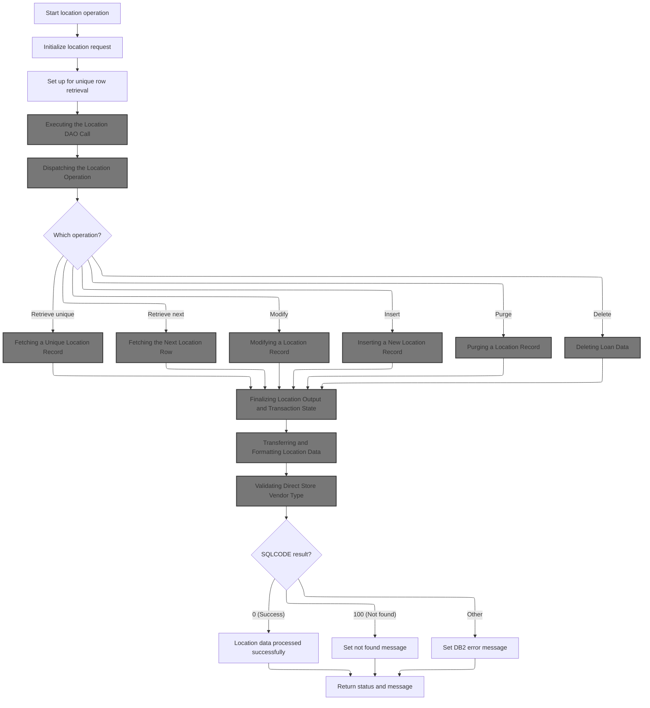
```mermaid
%%{init: {"flowchart": {"defaultRenderer": "elk"}} }%%
flowchart TD
    node1["Start location operation"]
    click node1 openCode "base/src/WWWS0003.cbl:856:857"
    node1 --> node2["Initialize location request"]
    click node2 openCode "base/src/WWWS0003.cbl:857:862"
    node2 --> node3["Set up for unique row retrieval"]
    click node3 openCode "base/src/WWWS0003.cbl:862:863"
    node3 --> node4["Executing the Location DAO Call"]
    
    node4 --> node5["Dispatching the Location Operation"]
    
    node5 --> node6{"Which operation?"}
    node6 -->|"Retrieve unique"| node7["Fetching a Unique Location Record"]
    
    node6 -->|"Retrieve next"| node8["Fetching the Next Location Row"]
    
    node6 -->|"Modify"| node9["Modifying a Location Record"]
    
    node6 -->|"Insert"| node10["Inserting a New Location Record"]
    
    node6 -->|"Purge"| node11["Purging a Location Record"]
    
    node6 -->|"Delete"| node12["Deleting Loan Data"]
    
    node7 --> node13["Finalizing Location Output and Transaction State"]
    node8 --> node13
    node9 --> node13
    node10 --> node13
    node11 --> node13
    node12 --> node13
    
    node13 --> node14["Transferring and Formatting Location Data"]
    
    node14 --> node15["Validating Direct Store Vendor Type"]
    
    node15 --> node16{"SQLCODE result?"}
    click node16 openCode "base/src/WWWS0003.cbl:865:879"
    node16 -->|"0 (Success)"| node17["Location data processed successfully"]
    node16 -->|"100 (Not found)"| node18["Set not found message"]
    node16 -->|"Other"| node19["Set DB2 error message"]
    node17 --> node20["Return status and message"]
    node18 --> node20
    node19 --> node20
    click node20 openCode "base/src/WWWS0003.cbl:880:881"

classDef HeadingStyle fill:#777777,stroke:#333,stroke-width:2px;
click node4 goToHeading "Executing the Location DAO Call"
node4:::HeadingStyle
click node5 goToHeading "Dispatching the Location Operation"
node5:::HeadingStyle
click node7 goToHeading "Fetching a Unique Location Record"
node7:::HeadingStyle
click node8 goToHeading "Fetching the Next Location Row"
node8:::HeadingStyle
click node9 goToHeading "Modifying a Location Record"
node9:::HeadingStyle
click node10 goToHeading "Inserting a New Location Record"
node10:::HeadingStyle
click node11 goToHeading "Purging a Location Record"
node11:::HeadingStyle
click node12 goToHeading "Deleting Loan Data"
node12:::HeadingStyle
click node13 goToHeading "Finalizing Location Output and Transaction State"
node13:::HeadingStyle
click node14 goToHeading "Transferring and Formatting Location Data"
node14:::HeadingStyle
click node15 goToHeading "Validating Direct Store Vendor Type"
node15:::HeadingStyle
```

<SwmSnippet path="/base/src/WWWS0003.cbl" line="830">

---

In `2200-GET-LO`, we kick off the flow by prepping the location data structure (P-DDDTLO01) with the store number and type, set up the exit codes, and flag that we want a unique row. We then call 2100-CALL-LO-DAO to actually perform the database operation. Without this call, nothing would be retrieved—this is where the action happens.

```cobol
085600 2200-GET-LO.                                                     00085600
085700     INITIALIZE P-DDDTLO01                                        00085700
085800     MOVE ST-STORE-NUMBER     TO LOC-NBR    OF P-DDDTLO01         00085800
085900     MOVE ST-STORE-TYPE       TO LOC-TYP-CD OF P-DDDTLO01         00085900
086000                                                                  00086000
086100     MOVE NNNN0000-EXIT-CODES TO WS-NNNN0000-EXIT-CODES           00086100
086200     SET  EXIT-GET-UNIQUE-ROW TO TRUE                             00086200
086300     PERFORM 2100-CALL-LO-DAO                                     00086300
```

---

</SwmSnippet>

### Executing the Location DAO Call

<SwmSnippet path="/base/src/WWWS0003.cbl" line="777">

---

`2100-CALL-LO-DAO` just calls the NNNS0487-LO-DAO routine, passing in all the context and data structures needed for the database operation. This is the handoff to the code that actually talks to the database. Without this, nothing would happen in the DB.

```cobol
080300 2100-CALL-LO-DAO.                                                00080300
080400     CALL NNNS0487-LO-DAO USING                                   00080400
080500         XXXN001A                                                 00080500
080600         SQLCA                                                    00080600
080700         YYYN005A                                                 00080700
080800         NNNN0000-PARMS                                           00080800
080900         P-DDDTLO01                                               00080900
081000     .                                                            00081000
```

---

</SwmSnippet>

### Dispatching the Location Operation

<SwmSnippet path="/base/src/NNNS0487.cbl" line="864">

---

`0000-EXIT-DISPATCHER` is where the code figures out what database action to run based on the operation code. It branches to the right routine (get, put, open, close, etc.) and then wraps up with output formatting and cleanup. This is the main router for DB actions.

```cobol
094100 0000-EXIT-DISPATCHER.                                            00094100
094200     PERFORM 100-INITIALIZATION                                   00094200
094300     EVALUATE TRUE                                                00094300
094400       WHEN NOT SUCCESS                                           00094400
094500          CONTINUE                                                00094500
094600       WHEN EXIT-OPEN-CURSOR                                      00094600
094700          PERFORM 1000-EXIT-OPEN-CURSOR                           00094700
094800       WHEN EXIT-CLOSE-CURSOR                                     00094800
094900          PERFORM 1100-EXIT-CLOSE-CURSOR                          00094900
095000       WHEN EXIT-GET-UNIQUE-ROW                                   00095000
095100          PERFORM 1200-EXIT-GET-UNIQUE-ROW                        00095100
095200       WHEN EXIT-GET-NEXT-ROW                                     00095200
095300          PERFORM 1300-EXIT-GET-NEXT-ROW                          00095300
095400       WHEN EXIT-PUT-MODIFY-ROW                                   00095400
095500          PERFORM 1400-EXIT-PUT-MODIFY-ROW                        00095500
095600       WHEN EXIT-PUT-INSERT-ROW                                   00095600
095700          PERFORM 1500-EXIT-PUT-INSERT-ROW                        00095700
095800       WHEN EXIT-PUT-PURGE-ROW                                    00095800
095900          PERFORM 1600-EXIT-PUT-PURGE-ROW                         00095900
096000       WHEN EXIT-DO-SPECIAL-IO-FUNCS                              00096000
096100          PERFORM 10000-DO-SPECIAL-IO-FUNCS                       00096100
096200     END-EVALUATE                                                 00096200
096300                                                                  00096300
096400     PERFORM 120-EXIT-STUFF                                       00096400
096500     GOBACK                                                       00096500
096600     .                                                            00096600
```

---

</SwmSnippet>

#### Initializing Transaction Data

See <SwmLink doc-title="Preparing and Normalizing Location Data">[Preparing and Normalizing Location Data](\.swm\preparing-and-normalizing-location-data.3wll289t.sw.md)</SwmLink>

#### Branching to the Requested DB Action

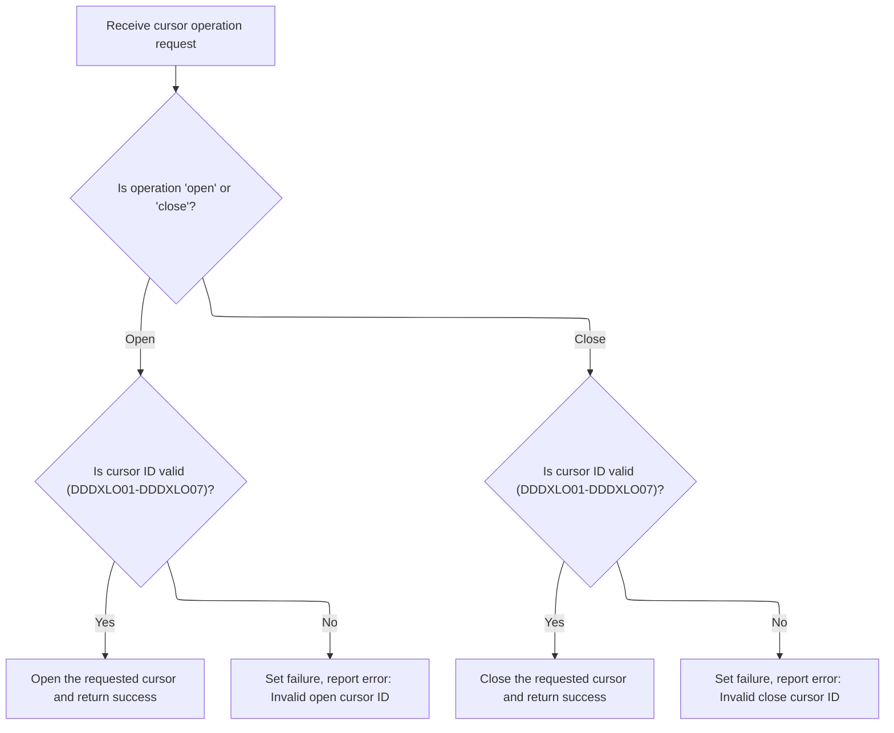
```mermaid
%%{init: {"flowchart": {"defaultRenderer": "elk"}} }%%
flowchart TD
    node1["Receive cursor operation request"] --> node2{"Is operation 'open' or 'close'?"}
    click node1 openCode "base/src/NNNS0487.cbl:1454:1527"
    node2 -->|"Open"| node3{"Is cursor ID valid (DDDXLO01-DDDXLO07)?"}
    click node2 openCode "base/src/NNNS0487.cbl:1454:1489"
    node3 -->|"Yes"| node4["Open the requested cursor and return success"]
    click node4 openCode "base/src/NNNS0487.cbl:1456:1483"
    node3 -->|"No"| node5["Set failure, report error: Invalid open cursor ID"]
    click node5 openCode "base/src/NNNS0487.cbl:1484:1488"
    node2 -->|"Close"| node6{"Is cursor ID valid (DDDXLO01-DDDXLO07)?"}
    click node6 openCode "base/src/NNNS0487.cbl:1493:1521"
    node6 -->|"Yes"| node7["Close the requested cursor and return success"]
    click node7 openCode "base/src/NNNS0487.cbl:1494:1521"
    node6 -->|"No"| node8["Set failure, report error: Invalid close cursor ID"]
    click node8 openCode "base/src/NNNS0487.cbl:1522:1525"

classDef HeadingStyle fill:#777777,stroke:#333,stroke-width:2px;
```

<SwmSnippet path="/base/src/NNNS0487.cbl" line="1454">

---

`1000-EXIT-OPEN-CURSOR` checks the input cursor ID and opens the matching SQL cursor (01-07). If the ID doesn't match any known cursor, it flags an error and sets a message. This is a strict switch-case for cursor management.

```cobol
153100 1000-EXIT-OPEN-CURSOR.                                           00153100
153200     EVALUATE TRUE                                                00153200
153300       WHEN DDDXLO01                                              00153300
153400         EXEC SQL                                                 00153400
153500           OPEN DDDXLO01                                          00153500
153600         END-EXEC                                                 00153600
153700       WHEN DDDXLO02                                              00153700
153800         EXEC SQL                                                 00153800
153900           OPEN DDDXLO02                                          00153900
154000         END-EXEC                                                 00154000
154100       WHEN DDDXLO03                                              00154100
154200         EXEC SQL                                                 00154200
154300           OPEN DDDXLO03                                          00154300
154400         END-EXEC                                                 00154400
154500       WHEN DDDXLO04                                              00154500
154600         EXEC SQL                                                 00154600
154700           OPEN DDDXLO04                                          00154700
154800         END-EXEC                                                 00154800
154900       WHEN DDDXLO05                                              00154900
155000         EXEC SQL                                                 00155000
155100           OPEN DDDXLO05                                          00155100
155200         END-EXEC                                                 00155200
155300       WHEN DDDXLO06                                              00155300
155400         EXEC SQL                                                 00155400
155500           OPEN DDDXLO06                                          00155500
155600         END-EXEC                                                 00155600
155700       WHEN DDDXLO07                                              00155700
155800         EXEC SQL                                                 00155800
155900           OPEN DDDXLO07                                          00155900
156000         END-EXEC                                                 00156000
156100       WHEN OTHER                                                 00156100
156200         SET FAILURE TO TRUE                                      00156200
156300         MOVE 'NNNS0487 - Invalid open cursor ID.'                00156300
156400           TO IS-RTRN-MSG-TXT OF XXXN001A                         00156400
156500     END-EVALUATE                                                 00156500
156600     .                                                            00156600
```

---

</SwmSnippet>

<SwmSnippet path="/base/src/NNNS0487.cbl" line="1492">

---

`1100-EXIT-CLOSE-CURSOR` closes the SQL cursor matching the input handle (01-07). If the handle isn't valid, it flags an error and sets a message. It's a straight switch-case for closing cursors.

```cobol
156900 1100-EXIT-CLOSE-CURSOR.                                          00156900
157000     EVALUATE TRUE                                                00157000
157100       WHEN DDDXLO01                                              00157100
157200         EXEC SQL                                                 00157200
157300           CLOSE DDDXLO01                                         00157300
157400         END-EXEC                                                 00157400
157500       WHEN DDDXLO02                                              00157500
157600         EXEC SQL                                                 00157600
157700           CLOSE DDDXLO02                                         00157700
157800         END-EXEC                                                 00157800
157900       WHEN DDDXLO03                                              00157900
158000         EXEC SQL                                                 00158000
158100           CLOSE DDDXLO03                                         00158100
158200         END-EXEC                                                 00158200
158300       WHEN DDDXLO04                                              00158300
158400         EXEC SQL                                                 00158400
158500           CLOSE DDDXLO04                                         00158500
158600         END-EXEC                                                 00158600
158700       WHEN DDDXLO05                                              00158700
158800         EXEC SQL                                                 00158800
158900           CLOSE DDDXLO05                                         00158900
159000         END-EXEC                                                 00159000
159100       WHEN DDDXLO06                                              00159100
159200         EXEC SQL                                                 00159200
159300           CLOSE DDDXLO06                                         00159300
159400         END-EXEC                                                 00159400
159500       WHEN DDDXLO07                                              00159500
159600         EXEC SQL                                                 00159600
159700           CLOSE DDDXLO07                                         00159700
159800         END-EXEC                                                 00159800
159900       WHEN OTHER                                                 00159900
160000         SET FAILURE TO TRUE                                      00160000
160100         MOVE 'NNNS0487 - Invalid close cursor ID.'               00160100
160200           TO IS-RTRN-MSG-TXT OF XXXN001A                         00160200
160300     END-EVALUATE                                                 00160300
160400     .                                                            00160400
```

---

</SwmSnippet>

### Fetching a Unique Location Record

<SwmSnippet path="/base/src/NNNS0487.cbl" line="1530">

---

`1200-EXIT-GET-UNIQUE-ROW` runs a big SELECT to pull all location fields for a given type and number, then calls 1700-CHECK-NULL-COLUMNS to clean up any fields that came back null or invalid. This keeps the output clean for the client.

```cobol
160700 1200-EXIT-GET-UNIQUE-ROW.                                        00160700
160800     EXEC SQL                                                     00160800
160900         SELECT LOC_TYP_CD,                                       00160900
161000                LOC_NBR,                                          00161000
161100                LOC_NM,                                           00161100
161200                LOC_ABB,                                          00161200
161300                LGL_LOC_NAM,                                      00161300
161400                PRIM_CONTACT_NM,                                  00161400
161500                PRIM_ADR_1,                                       00161500
161600                PRIM_ADR_2,                                       00161600
161700                PRIM_ADR_3,                                       00161700
161800                PRIM_ADR_4,                                       00161800
161900                PRIM_CITY,                                        00161900
162000                PRIM_CITY_ID,                                     00162000
162100                PRIM_STATE_CD,                                    00162100
162200                PRIM_ZIP5_CD,                                     00162200
162300                PRIM_ZIP4_CD,                                     00162300
162400                PRIM_PHN_CNTRY_CD,                                00162400
162500                PRIM_AREA_CD,                                     00162500
162600                PRIM_PHONE_NBR,                                   00162600
162700                PRIM_CNTRY_NM,                                    00162700
162800                PRIM_CNTRY_ABB,                                   00162800
162900                SEC_LOC_NM,                                       00162900
163000                SEC_CONTACT_NM,                                   00163000
163100                SEC_ADR_1,                                        00163100
163200                SEC_ADR_2,                                        00163200
163300                SEC_ADR_3,                                        00163300
163400                SEC_ADR_4,                                        00163400
163500                SEC_CITY,                                         00163500
163600                SEC_STATE_CD,                                     00163600
163700                SEC_ZIP5_CD,                                      00163700
163800                SEC_ZIP4_CD,                                      00163800
163900                SEC_PHN_CNTRY_CD,                                 00163900
164000                SEC_AREA_CD,                                      00164000
164100                SEC_PHONE_NBR,                                    00164100
164200                SEC_CNTRY_NM,                                     00164200
164300                SEC_CNTRY_ABB,                                    00164300
164400                MAIL_TO_LOC_NM,                                   00164400
164500                MAIL_TO_CNTCT_NM,                                 00164500
164600                MAIL_TO_ADR_1,                                    00164600
164700                MAIL_TO_ADR_2,                                    00164700
164800                MAIL_TO_ADR_3,                                    00164800
164900                MAIL_TO_ADR_4,                                    00164900
165000                MAIL_TO_CITY,                                     00165000
165100                MAIL_TO_STATE_CD,                                 00165100
165200                MAIL_TO_ZIP5_CD,                                  00165200
165300                MAIL_TO_ZIP4_CD,                                  00165300
165400                MAIL_PHN_CNTRY_CD,                                00165400
165500                MAIL_TO_AREA_CD,                                  00165500
165600                MAIL_TO_PHONE_NBR,                                00165600
165700                MAIL_TO_CNTRY_NM,                                 00165700
165800                MAIL_TO_CNTRY_AB,                                 00165800
165900                CURR_FAX_ID,                                      00165900
166000                ADDED_DT,                                         00166000
166100                DELETE_DT,                                        00166100
166200                OPENED_DT,                                        00166200
166300                CLOSED_DT,                                        00166300
166400                INACTIVE_SW,                                      00166400
166500                INACTIVE_DT,                                      00166500
166600                AP_NBR,                                           00166600
166700                AP_TYP_CD,                                        00166700
166800                LST_UPDT_TS,                                      00166800
166900                LST_UPDT_USR_ID,                                  00166900
167000                PRIM_EMAIL_ID  ,                                  00167000
167100                SECY_EMAIL_ID  ,                                  00167100
167200                MAIL_TO_EMAIL_ID,                                 00167200
167300                FAC_ID,                                           00167300
167400                ORG_ID,                                           00167400
167500                B2B_PRIM_RTNG_ID,                                 00167500
167600                PRIM_CNTY_TXT,                                    00167600
167700                SECY_CNTY_TXT,                                    00167700
167800                MAIL_TO_CNTY_TXT,                                 00167800
167900                DIR_SHP_LOC_SW,                                   00167900
168000                LOC_ORD_PROCNG_DD,                                00168000
168100                ORD_PROCNG_CTOF_TM,                               00168100
168200                SCH_SHP_DD_TXT,                                   00168200
168300                FILLER1_TM,                                       00168300
168400                FILLER2_TM,                                       00168400
168500                ORD_LEAD_TM_DD,                                   00168500
168600                ORD_BUFFER_TM_DD                                  00168600
168700         INTO   :DCLXXXATION.LOC-TYP-CD,                          00168700
168800                :DCLXXXATION.LOC-NBR,                             00168800
168900                :DCLXXXATION.LOC-NM,                              00168900
169000                :DCLXXXATION.LOC-ABB,                             00169000
169100                :DCLXXXATION.LGL-LOC-NAM,                         00169100
169200                :DCLXXXATION.PRIM-CONTACT-NM,                     00169200
169300                :DCLXXXATION.PRIM-ADR-1,                          00169300
169400                :DCLXXXATION.PRIM-ADR-2,                          00169400
169500                :DCLXXXATION.PRIM-ADR-3,                          00169500
169600                :DCLXXXATION.PRIM-ADR-4,                          00169600
169700                :DCLXXXATION.PRIM-CITY,                           00169700
169800                :DCLXXXATION.PRIM-CITY-ID,                        00169800
169900                :DCLXXXATION.PRIM-STATE-CD,                       00169900
170000                :DCLXXXATION.PRIM-ZIP5-CD,                        00170000
170100                :DCLXXXATION.PRIM-ZIP4-CD,                        00170100
170200                :DCLXXXATION.PRIM-PHN-CNTRY-CD,                   00170200
170300                :DCLXXXATION.PRIM-AREA-CD,                        00170300
170400                :DCLXXXATION.PRIM-PHONE-NBR,                      00170400
170500                :DCLXXXATION.PRIM-CNTRY-NM,                       00170500
170600                :DCLXXXATION.PRIM-CNTRY-ABB,                      00170600
170700                :DCLXXXATION.SEC-LOC-NM,                          00170700
170800                :DCLXXXATION.SEC-CONTACT-NM,                      00170800
170900                :DCLXXXATION.SEC-ADR-1,                           00170900
171000                :DCLXXXATION.SEC-ADR-2,                           00171000
171100                :DCLXXXATION.SEC-ADR-3,                           00171100
171200                :DCLXXXATION.SEC-ADR-4,                           00171200
171300                :DCLXXXATION.SEC-CITY,                            00171300
171400                :DCLXXXATION.SEC-STATE-CD,                        00171400
171500                :DCLXXXATION.SEC-ZIP5-CD,                         00171500
171600                :DCLXXXATION.SEC-ZIP4-CD,                         00171600
171700                :DCLXXXATION.SEC-PHN-CNTRY-CD,                    00171700
171800                :DCLXXXATION.SEC-AREA-CD,                         00171800
171900                :DCLXXXATION.SEC-PHONE-NBR,                       00171900
172000                :DCLXXXATION.SEC-CNTRY-NM,                        00172000
172100                :DCLXXXATION.SEC-CNTRY-ABB,                       00172100
172200                :DCLXXXATION.MAIL-TO-LOC-NM,                      00172200
172300                :DCLXXXATION.MAIL-TO-CNTCT-NM,                    00172300
172400                :DCLXXXATION.MAIL-TO-ADR-1,                       00172400
172500                :DCLXXXATION.MAIL-TO-ADR-2,                       00172500
172600                :DCLXXXATION.MAIL-TO-ADR-3,                       00172600
172700                :DCLXXXATION.MAIL-TO-ADR-4,                       00172700
172800                :DCLXXXATION.MAIL-TO-CITY,                        00172800
172900                :DCLXXXATION.MAIL-TO-STATE-CD,                    00172900
173000                :DCLXXXATION.MAIL-TO-ZIP5-CD,                     00173000
173100                :DCLXXXATION.MAIL-TO-ZIP4-CD,                     00173100
173200                :DCLXXXATION.MAIL-PHN-CNTRY-CD,                   00173200
173300                :DCLXXXATION.MAIL-TO-AREA-CD,                     00173300
173400                :DCLXXXATION.MAIL-TO-PHONE-NBR,                   00173400
173500                :DCLXXXATION.MAIL-TO-CNTRY-NM,                    00173500
173600                :DCLXXXATION.MAIL-TO-CNTRY-AB,                    00173600
173700                :DCLXXXATION.CURR-FAX-ID,                         00173700
173800                :DCLXXXATION.ADDED-DT,                            00173800
173900                :DCLXXXATION.DELETE-DT,                           00173900
174000                :DCLXXXATION.OPENED-DT,                           00174000
174100                :DCLXXXATION.CLOSED-DT,                           00174100
174200                :DCLXXXATION.INACTIVE-SW,                         00174200
174300                :DCLXXXATION.INACTIVE-DT,                         00174300
174400                :DCLXXXATION.AP-NBR:WS-AP-NBR-IND,                00174400
174500                :DCLXXXATION.AP-TYP-CD:WS-AP-TYP-CD-IND,          00174500
174600                :DCLXXXATION.LST-UPDT-TS,                         00174600
174700                :DCLXXXATION.LST-UPDT-USR-ID,                     00174700
174800                :DCLXXXATION.PRIM-EMAIL-ID,                       00174800
174900                :DCLXXXATION.SECY-EMAIL-ID,                       00174900
175000                :DCLXXXATION.MAIL-TO-EMAIL-ID,                    00175000
175100                :DCLXXXATION.FAC-ID,                              00175100
175200                :DCLXXXATION.ORG-ID,                              00175200
175300                :DCLXXXATION.B2B-PRIM-RTNG-ID,                    00175300
175400                :DCLXXXATION.PRIM-CNTY-TXT,                       00175400
175500                :DCLXXXATION.SECY-CNTY-TXT,                       00175500
175600                :DCLXXXATION.MAIL-TO-CNTY-TXT,                    00175600
175700                :DCLXXXATION.DIR-SHP-LOC-SW,                      00175700
175800                :DCLXXXATION.LOC-ORD-PROCNG-DD,                   00175800
175900                :WS-ORD-PROCNG-CTOF-TM,                           00175900
176000                :DCLXXXATION.SCH-SHP-DD-TXT,                      00176000
176100                :WS-FILLER1-TS,                                   00176100
176200                :WS-FILLER2-TS,                                   00176200
176300                :DCLXXXATION.ORD-LEAD-TM-DD,                      00176300
176400                :DCLXXXATION.ORD-BUFFER-TM-DD                     00176400
176500         FROM   XXXATION                                          00176500
176600         WHERE  LOC_TYP_CD = :DCLXXXATION.LOC-TYP-CD              00176600
176700         AND    LOC_NBR = :DCLXXXATION.LOC-NBR                    00176700
176800     END-EXEC                                                     00176800
176900                                                                  00176900
177000     PERFORM 1700-CHECK-NULL-COLUMNS                              00177000
177100     .                                                            00177100
```

---

</SwmSnippet>

<SwmSnippet path="/base/src/NNNS0487.cbl" line="3079">

---

`1700-CHECK-NULL-COLUMNS` checks if the AP number or type indicators are negative (meaning null/invalid), and if so, blanks out the AP type and zeroes the AP number. This avoids sending junk data to the client.

```cobol
315600 1700-CHECK-NULL-COLUMNS.                                         00315600
315700     IF WS-AP-NBR-IND    < 0                                      00315700
315800     OR WS-AP-TYP-CD-IND < 0                                      00315800
315900       MOVE SPACES TO AP-TYP-CD OF DCLXXXATION                    00315900
316000       MOVE 0      TO AP-NBR    OF DCLXXXATION                    00316000
316100     END-IF                                                       00316100
316200     .                                                            00316200
```

---

</SwmSnippet>

### Fetching the Next Location Row

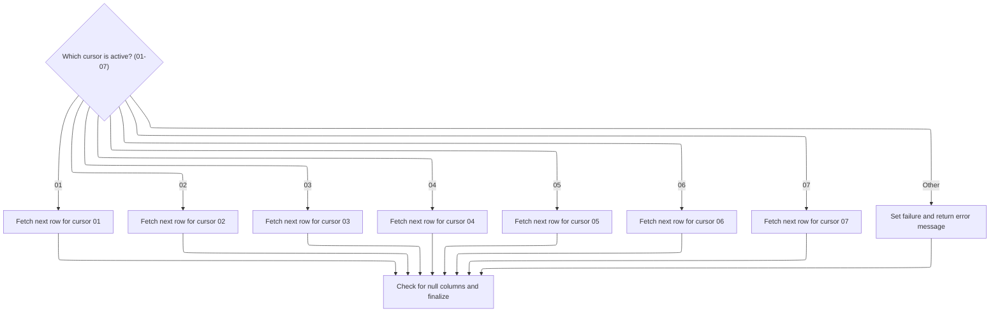
```mermaid
%%{init: {"flowchart": {"defaultRenderer": "elk"}} }%%
flowchart TD
    node1{"Which cursor is active? (01-07)"}
    click node1 openCode "base/src/NNNS0487.cbl:1698:1717"
    node1 -->|"01"| node2["Fetch next row for cursor 01"]
    click node2 openCode "base/src/NNNS0487.cbl:1699:1700"
    node1 -->|"02"| node3["Fetch next row for cursor 02"]
    click node3 openCode "base/src/NNNS0487.cbl:1701:1702"
    node1 -->|"03"| node4["Fetch next row for cursor 03"]
    click node4 openCode "base/src/NNNS0487.cbl:1703:1704"
    node1 -->|"04"| node5["Fetch next row for cursor 04"]
    click node5 openCode "base/src/NNNS0487.cbl:1705:1706"
    node1 -->|"05"| node6["Fetch next row for cursor 05"]
    click node6 openCode "base/src/NNNS0487.cbl:1707:1708"
    node1 -->|"06"| node7["Fetch next row for cursor 06"]
    click node7 openCode "base/src/NNNS0487.cbl:1709:1710"
    node1 -->|"07"| node8["Fetch next row for cursor 07"]
    click node8 openCode "base/src/NNNS0487.cbl:1711:1712"
    node1 -->|"Other"| node9["Set failure and return error message"]
    click node9 openCode "base/src/NNNS0487.cbl:1713:1716"
    node2 --> node10["Check for null columns and finalize"]
    node3 --> node10
    node4 --> node10
    node5 --> node10
    node6 --> node10
    node7 --> node10
    node8 --> node10
    node9 --> node10
    click node10 openCode "base/src/NNNS0487.cbl:1719:1720"
classDef HeadingStyle fill:#777777,stroke:#333,stroke-width:2px;
```

<SwmSnippet path="/base/src/NNNS0487.cbl" line="1697">

---

`1300-EXIT-GET-NEXT-ROW` picks the right fetch routine based on the cursor ID (01-07). If the ID is invalid, it flags an error. After fetching, it always calls the null column check to clean up the data.

```cobol
177400 1300-EXIT-GET-NEXT-ROW.                                          00177400
177500     EVALUATE TRUE                                                00177500
177600       WHEN DDDXLO01                                              00177600
177700         PERFORM 1301-FETCH-DDDXLO01                              00177700
177800       WHEN DDDXLO02                                              00177800
177900         PERFORM 1302-FETCH-DDDXLO02                              00177900
178000       WHEN DDDXLO03                                              00178000
178100         PERFORM 1303-FETCH-DDDXLO03                              00178100
178200       WHEN DDDXLO04                                              00178200
178300         PERFORM 1304-FETCH-DDDXLO04                              00178300
178400       WHEN DDDXLO05                                              00178400
178500         PERFORM 1305-FETCH-DDDXLO05                              00178500
178600       WHEN DDDXLO06                                              00178600
178700         PERFORM 1306-FETCH-DDDXLO06                              00178700
178800       WHEN DDDXLO07                                              00178800
178900         PERFORM 1307-FETCH-DDDXLO07                              00178900
179000       WHEN OTHER                                                 00179000
179100         SET FAILURE TO TRUE                                      00179100
179200         MOVE 'NNNS0487 - Invalid fetch cursor ID.'               00179200
179300           TO IS-RTRN-MSG-TXT OF XXXN001A                         00179300
179400     END-EVALUATE                                                 00179400
179500                                                                  00179500
179600     PERFORM 1700-CHECK-NULL-COLUMNS                              00179600
179700     .                                                            00179700
```

---

</SwmSnippet>

<SwmSnippet path="/base/src/NNNS0487.cbl" line="1806">

---

`1302-FETCH-DDDXLO02` just fetches the next row from the DDDXLO02 cursor into the DCLXXXATION structure. It assumes the cursor is open and the structure matches the result set exactly. No extra logic here—just a straight fetch.

```cobol
188300 1302-FETCH-DDDXLO02.                                             00188300
188400     EXEC SQL                                                     00188400
188500         FETCH DDDXLO02                                           00188500
188600         INTO  :DCLXXXATION.LOC-TYP-CD,                           00188600
188700               :DCLXXXATION.LOC-NBR,                              00188700
188800               :DCLXXXATION.LOC-NM,                               00188800
188900               :DCLXXXATION.LOC-ABB,                              00188900
189000               :DCLXXXATION.LGL-LOC-NAM,                          00189000
189100               :DCLXXXATION.PRIM-CONTACT-NM,                      00189100
189200               :DCLXXXATION.PRIM-ADR-1,                           00189200
189300               :DCLXXXATION.PRIM-ADR-2,                           00189300
189400               :DCLXXXATION.PRIM-ADR-3,                           00189400
189500               :DCLXXXATION.PRIM-ADR-4,                           00189500
189600               :DCLXXXATION.PRIM-CITY,                            00189600
189700               :DCLXXXATION.PRIM-CITY-ID,                         00189700
189800               :DCLXXXATION.PRIM-STATE-CD,                        00189800
189900               :DCLXXXATION.PRIM-ZIP5-CD,                         00189900
190000               :DCLXXXATION.PRIM-ZIP4-CD,                         00190000
190100               :DCLXXXATION.PRIM-PHN-CNTRY-CD,                    00190100
190200               :DCLXXXATION.PRIM-AREA-CD,                         00190200
190300               :DCLXXXATION.PRIM-PHONE-NBR,                       00190300
190400               :DCLXXXATION.PRIM-CNTRY-NM,                        00190400
190500               :DCLXXXATION.PRIM-CNTRY-ABB,                       00190500
190600               :DCLXXXATION.SEC-LOC-NM,                           00190600
190700               :DCLXXXATION.SEC-CONTACT-NM,                       00190700
190800               :DCLXXXATION.SEC-ADR-1,                            00190800
190900               :DCLXXXATION.SEC-ADR-2,                            00190900
191000               :DCLXXXATION.SEC-ADR-3,                            00191000
191100               :DCLXXXATION.SEC-ADR-4,                            00191100
191200               :DCLXXXATION.SEC-CITY,                             00191200
191300               :DCLXXXATION.SEC-STATE-CD,                         00191300
191400               :DCLXXXATION.SEC-ZIP5-CD,                          00191400
191500               :DCLXXXATION.SEC-ZIP4-CD,                          00191500
191600               :DCLXXXATION.SEC-PHN-CNTRY-CD,                     00191600
191700               :DCLXXXATION.SEC-AREA-CD,                          00191700
191800               :DCLXXXATION.SEC-PHONE-NBR,                        00191800
191900               :DCLXXXATION.SEC-CNTRY-NM,                         00191900
192000               :DCLXXXATION.SEC-CNTRY-ABB,                        00192000
192100               :DCLXXXATION.MAIL-TO-LOC-NM,                       00192100
192200               :DCLXXXATION.MAIL-TO-CNTCT-NM,                     00192200
192300               :DCLXXXATION.MAIL-TO-ADR-1,                        00192300
192400               :DCLXXXATION.MAIL-TO-ADR-2,                        00192400
192500               :DCLXXXATION.MAIL-TO-ADR-3,                        00192500
192600               :DCLXXXATION.MAIL-TO-ADR-4,                        00192600
192700               :DCLXXXATION.MAIL-TO-CITY,                         00192700
192800               :DCLXXXATION.MAIL-TO-STATE-CD,                     00192800
192900               :DCLXXXATION.MAIL-TO-ZIP5-CD,                      00192900
193000               :DCLXXXATION.MAIL-TO-ZIP4-CD,                      00193000
193100               :DCLXXXATION.MAIL-PHN-CNTRY-CD,                    00193100
193200               :DCLXXXATION.MAIL-TO-AREA-CD,                      00193200
193300               :DCLXXXATION.MAIL-TO-PHONE-NBR,                    00193300
193400               :DCLXXXATION.MAIL-TO-CNTRY-NM,                     00193400
193500               :DCLXXXATION.MAIL-TO-CNTRY-AB,                     00193500
193600               :DCLXXXATION.CURR-FAX-ID,                          00193600
193700               :DCLXXXATION.ADDED-DT,                             00193700
193800               :DCLXXXATION.DELETE-DT,                            00193800
193900               :DCLXXXATION.OPENED-DT,                            00193900
194000               :DCLXXXATION.CLOSED-DT,                            00194000
194100               :DCLXXXATION.INACTIVE-SW,                          00194100
194200               :DCLXXXATION.INACTIVE-DT,                          00194200
194300               :DCLXXXATION.AP-NBR:WS-AP-NBR-IND,                 00194300
194400               :DCLXXXATION.AP-TYP-CD:WS-AP-TYP-CD-IND,           00194400
194500               :DCLXXXATION.LST-UPDT-TS,                          00194500
194600               :DCLXXXATION.LST-UPDT-USR-ID,                      00194600
194700               :DCLXXXATION.PRIM-EMAIL-ID,                        00194700
194800               :DCLXXXATION.SECY-EMAIL-ID,                        00194800
194900               :DCLXXXATION.MAIL-TO-EMAIL-ID,                     00194900
195000               :DCLXXXATION.FAC-ID,                               00195000
195100               :DCLXXXATION.ORG-ID,                               00195100
195200               :DCLXXXATION.B2B-PRIM-RTNG-ID,                     00195200
195300               :DCLXXXATION.PRIM-CNTY-TXT,                        00195300
195400               :DCLXXXATION.SECY-CNTY-TXT,                        00195400
195500               :DCLXXXATION.MAIL-TO-CNTY-TXT,                     00195500
195600               :DCLXXXATION.DIR-SHP-LOC-SW,                       00195600
195700               :DCLXXXATION.LOC-ORD-PROCNG-DD,                    00195700
195800               :WS-ORD-PROCNG-CTOF-TM,                            00195800
195900               :DCLXXXATION.SCH-SHP-DD-TXT,                       00195900
196000               :DCLXXXATION.ORD-LEAD-TM-DD,                       00196000
196100               :DCLXXXATION.ORD-BUFFER-TM-DD                      00196100
196200     END-EXEC                                                     00196200
196300     .                                                            00196300
```

---

</SwmSnippet>

### Modifying a Location Record

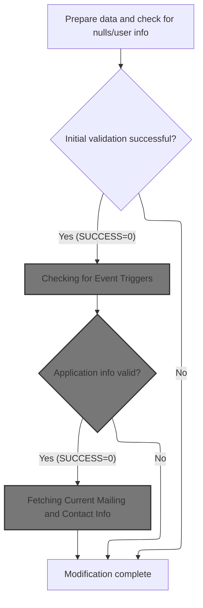
```mermaid
%%{init: {"flowchart": {"defaultRenderer": "elk"}} }%%
flowchart TD
    node1["Prepare data and check for nulls/user info"]
    click node1 openCode "base/src/NNNS0487.cbl:2304:2323"
    node1 --> node2{"Initial validation successful?"}
    click node2 openCode "base/src/NNNS0487.cbl:2308:2309"
    node2 -->|"Yes (SUCCESS=0)"| node3["Checking for Event Triggers"]
    
    node2 -->|"No"| node6["Modification not performed"]
    node3 --> node4{"Application info valid?"}
    
    node4 -->|"Yes (SUCCESS=0)"| node5["Fetching Current Mailing and Contact Info"]
    
    node4 -->|"No"| node6
    node5 --> node6["Modification complete"]
    click node6 openCode "base/src/NNNS0487.cbl:2323:2323"
classDef HeadingStyle fill:#777777,stroke:#333,stroke-width:2px;
click node3 goToHeading "Checking for Event Triggers"
node3:::HeadingStyle
click node4 goToHeading "Validating and Updating AP Info"
node4:::HeadingStyle
click node5 goToHeading "Fetching Current Mailing and Contact Info"
node5:::HeadingStyle
```

<SwmSnippet path="/base/src/NNNS0487.cbl" line="2304">

---

`1400-EXIT-PUT-MODIFY-ROW` runs through a bunch of checks and edits, gets the current date and user, and if everything is still good, checks for events, AP info, and then updates the row. It chains together all the business logic needed before actually modifying the DB.

```cobol
238100 1400-EXIT-PUT-MODIFY-ROW.                                        00238100
238200     PERFORM 1800-EDIT-NULL-INDICATORS                            00238200
238300     PERFORM 2040-GET-DATE-AND-USER                               00238300
238400                                                                  00238400
238500     IF SUCCESS                                                   00238500
238600       PERFORM 1411-CHECK-FOR-EVENTS                              00238600
238700       IF SUCCESS                                                 00238700
238800         PERFORM 1420-CHECK-AP-INFO                               00238800
238900         IF SUCCESS                                               00238900
239000*          PERFORM 10300-CHECK-FOR-VALID-COUNTY                   00239000
239100           SET EXIT-PUT-MODIFY-ROW  TO TRUE                       00239100
239200           IF SUCCESS                                             00239200
239300             PERFORM 1430-GET-CURRENT-VALUES                      00239300
239400             PERFORM 1800-EDIT-NULL-INDICATORS                    00239400
239500             PERFORM 1440-D0-MODIFY-ROW                           00239500
239600           END-IF                                                 00239600
239700         END-IF                                                   00239700
239800       END-IF                                                     00239800
239900     END-IF                                                       00239900
240000     .                                                            00240000
```

---

</SwmSnippet>

<SwmSnippet path="/base/src/NNNS0487.cbl" line="3091">

---

`1800-EDIT-NULL-INDICATORS` checks if AP type or number are empty/zero and sets their indicators to -1 if so. This flags them as invalid for later logic.

```cobol
316800 1800-EDIT-NULL-INDICATORS.                                       00316800
316900     INITIALIZE WS-AP-NBR-IND                                     00316900
317000                WS-AP-TYP-CD-IND                                  00317000
317100                                                                  00317100
317200     IF AP-TYP-CD OF DCLXXXATION   = SPACES                       00317200
317300     OR AP-NBR    OF DCLXXXATION   = 0                            00317300
317400       MOVE -1 TO WS-AP-NBR-IND                                   00317400
317500       MOVE -1 TO WS-AP-TYP-CD-IND                                00317500
317600     END-IF                                                       00317600
317700     .                                                            00317700
```

---

</SwmSnippet>

<SwmSnippet path="/base/src/NNNS0487.cbl" line="3268">

---

`2040-GET-DATE-AND-USER` calls the date function, then checks if we're in CICS. If so, it grabs the CICS user ID; otherwise, it just sets the user to 'BATCH'. This way, every change is stamped with who (or what) did it.

```cobol
334500 2040-GET-DATE-AND-USER.                                          00334500
334600     CALL Z-DATE-FUNCTIONS USING                                  00334600
334700         XXXN001A                                                 00334700
334800         YYYC0127                                                 00334800
334900                                                                  00334900
335000     IF  SUCCESS                                                  00335000
335100     AND YYYN005A-CICS-ENV                                        00335100
335200       CALL Z-GET-CICS-USER-ID USING                              00335200
335300           EIBLK    WS-DUMMY                                      00335300
335400           XXXN001A YYYC0107                                      00335400
335500     ELSE                                                         00335500
335600       MOVE 'BATCH' TO YYYC0107-USER                              00335600
335700     END-IF                                                       00335700
335800     .                                                            00335800
```

---

</SwmSnippet>

#### Checking for Event Triggers

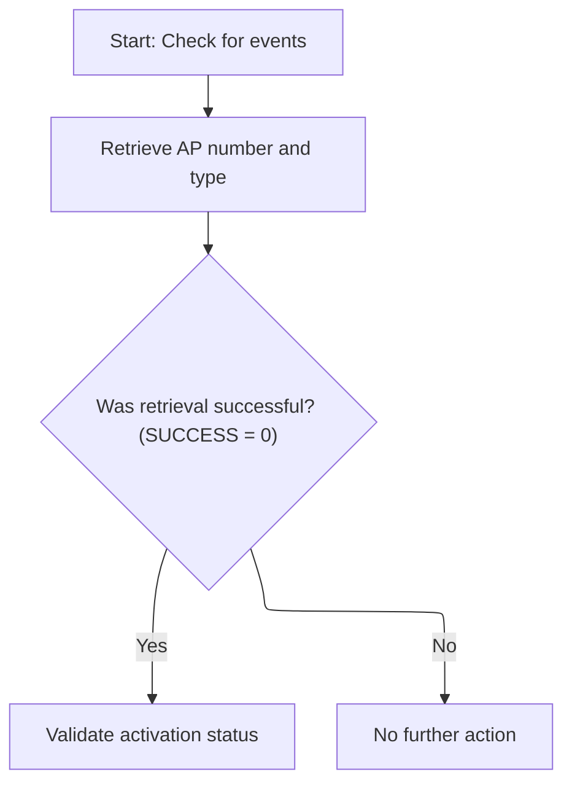
```mermaid
%%{init: {"flowchart": {"defaultRenderer": "elk"}} }%%
flowchart TD
    node1["Start: Check for events"] --> node2["Retrieve AP number and type"]
    click node1 openCode "base/src/NNNS0487.cbl:2326:2328"
    click node2 openCode "base/src/NNNS0487.cbl:2327:2328"
    node2 --> node3{"Was retrieval successful? (SUCCESS = 0)"}
    click node3 openCode "base/src/NNNS0487.cbl:2328:2330"
    node3 -->|"Yes"| node4["Validate activation status"]
    click node4 openCode "base/src/NNNS0487.cbl:2329:2330"
    node3 -->|"No"| node5["No further action"]
    click node5 openCode "base/src/NNNS0487.cbl:2330:2331"
classDef HeadingStyle fill:#777777,stroke:#333,stroke-width:2px;
```

<SwmSnippet path="/base/src/NNNS0487.cbl" line="2326">

---

`1411-CHECK-FOR-EVENTS` first gets the AP number, and if that works, checks if an event needs to be triggered. No AP number, no event check.

```cobol
240300 1411-CHECK-FOR-EVENTS.                                           00240300
240400     PERFORM 1412-GET-AP-NBR                                      00240400
240500     IF SUCCESS                                                   00240500
240600       PERFORM 1414-VALIDATE-ACTIV-SW                             00240600
240700     END-IF                                                       00240700
240800     .                                                            00240800
```

---

</SwmSnippet>

<SwmSnippet path="/base/src/NNNS0487.cbl" line="2334">

---

`1412-GET-AP-NBR` only runs the SQL select if the location type is 'V' or 'D'. It pulls AP number and type, handles nulls and errors, and updates the working variables for later use. Other types skip this logic.

```cobol
241100 1412-GET-AP-NBR.                                                 00241100
241200     IF LOC-TYP-CD OF DCLXXXATION = 'V' OR 'D'                    00241200
241300       EXEC SQL                                                   00241300
241400           SELECT AP_NBR,                                         00241400
241500                  AP_TYP_CD                                       00241500
241600           INTO :WS-AP-NUM:WS-AP-NBR-IND,                         00241600
241700                :WS-AP-TYPE:WS-AP-TYP-CD-IND                      00241700
241800           FROM XXXATION                                          00241800
241900           WHERE LOC_TYP_CD = :DCLXXXATION.LOC-TYP-CD             00241900
242000           AND  LOC_NBR = :DCLXXXATION.LOC-NBR                    00242000
242100       END-EXEC                                                   00242100
242200                                                                  00242200
242300       EVALUATE TRUE                                              00242300
242400         WHEN SQLCODE = 0                                         00242400
242500           IF WS-AP-NBR-IND < 0                                   00242500
242600           OR WS-AP-TYP-CD-IND < 0                                00242600
242700             INITIALIZE WS-AP-NUM                                 00242700
242800                        WS-AP-TYPE                                00242800
242900           END-IF                                                 00242900
243000         WHEN SQLCODE = 100                                       00243000
243100           INITIALIZE WS-AP-NUM                                   00243100
243200                      WS-AP-TYPE                                  00243200
243300           MOVE 0 TO SQLCODE                                      00243300
243400        WHEN OTHER                                                00243400
243500         SET FAILURE  TO TRUE                                     00243500
243600         MOVE SPACES  TO IS-RTRN-MSG-TXT                          00243600
243700         MOVE SQLCODE TO WS-SQLCODE                               00243700
243800         STRING 'NNNS0487 - Error in gathering events. SQL '      00243800
243900                WS-SQLCODE '.'                                    00243900
244000         DELIMITED BY SIZE INTO IS-RTRN-MSG-TXT                   00244000
244100       END-EVALUATE                                               00244100
244200       MOVE WS-AP-NUM   TO MMMC0474-OLD-AP-NBR                    00244200
244300       MOVE WS-AP-TYPE  TO MMMC0474-OLD-AP-TYP                    00244300
244400     END-IF                                                       00244400
244500     .                                                            00244500
```

---

</SwmSnippet>

#### Validating and Updating AP Info

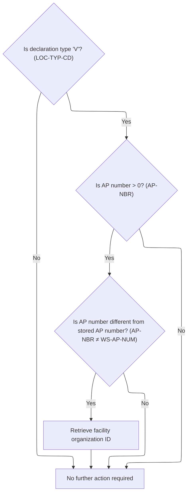
```mermaid
%%{init: {"flowchart": {"defaultRenderer": "elk"}} }%%
flowchart TD
    node1{"Is declaration type 'V'? (LOC-TYP-CD)"}
    click node1 openCode "base/src/NNNS0487.cbl:2405:2411"
    node1 -->|"Yes"| node2{"Is AP number > 0? (AP-NBR)"}
    node1 -->|"No"| node4["No further action required"]
    click node4 openCode "base/src/NNNS0487.cbl:2412:2412"
    node2 -->|"Yes"| node3{"Is AP number different from stored AP number? (AP-NBR ≠ WS-AP-NUM)"}
    node2 -->|"No"| node4
    node3 -->|"Yes"| node5["Retrieve facility organization ID"]
    click node5 openCode "base/src/NNNS0487.cbl:2408:2408"
    node3 -->|"No"| node4
    node5 --> node4
classDef HeadingStyle fill:#777777,stroke:#333,stroke-width:2px;
```

<SwmSnippet path="/base/src/NNNS0487.cbl" line="2404">

---

`1420-CHECK-AP-INFO` only runs for location type 'V'. If the AP number is set and different from before, it triggers logic to update facility and org IDs. This keeps everything consistent if the AP changes.

```cobol
248100 1420-CHECK-AP-INFO.                                              00248100
248200     IF LOC-TYP-CD OF DCLXXXATION = 'V'                           00248200
248300       IF AP-NBR OF DCLXXXATION > 0                               00248300
248400         IF AP-NBR OF DCLXXXATION NOT EQUAL TO WS-AP-NUM          00248400
248500           PERFORM 1505-GET-FAC-ORG-ID                            00248500
248600         END-IF                                                   00248600
248700       END-IF                                                     00248700
248800     END-IF                                                       00248800
248900     .                                                            00248900
```

---

</SwmSnippet>

#### Resolving Facility and Organization IDs

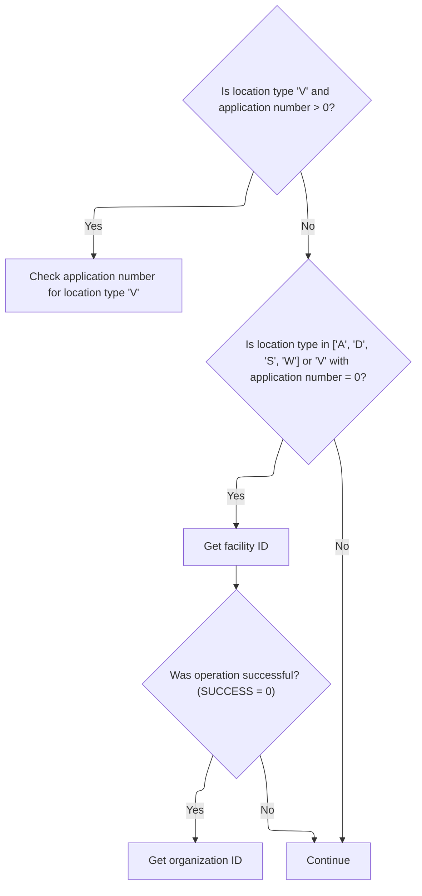
```mermaid
%%{init: {"flowchart": {"defaultRenderer": "elk"}} }%%
flowchart TD
    node1{"Is location type 'V' and application number > 0?"}
    click node1 openCode "base/src/NNNS0487.cbl:258100:258400"
    node1 -->|"Yes"| node2["Check application number for location type 'V'"]
    click node2 openCode "base/src/NNNS0487.cbl:258400:258500"
    node1 -->|"No"| node3{"Is location type in ['A', 'D', 'S', 'W'] or 'V' with application number = 0?"}
    click node3 openCode "base/src/NNNS0487.cbl:258500:258800"
    node3 -->|"Yes"| node4["Get facility ID"]
    click node4 openCode "base/src/NNNS0487.cbl:258800:258900"
    node4 --> node5{"Was operation successful? (SUCCESS = 0)"}
    click node5 openCode "base/src/NNNS0487.cbl:258900:259100"
    node5 -->|"Yes"| node6["Get organization ID"]
    click node6 openCode "base/src/NNNS0487.cbl:259000:259100"
    node5 -->|"No"| node7["Continue"]
    click node7 openCode "base/src/NNNS0487.cbl:259100:259400"
    node3 -->|"No"| node7

classDef HeadingStyle fill:#777777,stroke:#333,stroke-width:2px;
```

<SwmSnippet path="/base/src/NNNS0487.cbl" line="2503">

---

`1505-GET-FAC-ORG-ID` checks the location type and AP number, then branches to the right logic: check AP number, get facility ID, or get org ID. Each path matches the business rules for that type.

```cobol
258000 1505-GET-FAC-ORG-ID.                                             00258000
258100     EVALUATE TRUE                                                00258100
258200       WHEN LOC-TYP-CD OF DCLXXXATION = 'V'                       00258200
258300        AND AP-NBR OF DCLXXXATION > 0                             00258300
258400         PERFORM 1515-CHECK-AP-NBR                                00258400
258500       WHEN (LOC-TYP-CD OF DCLXXXATION = 'A' OR 'D' OR 'S' OR 'W')00258500
258600         OR (LOC-TYP-CD OF DCLXXXATION = 'V'                      00258600
258700        AND AP-NBR OF DCLXXXATION = 0)                            00258700
258800         PERFORM 1525-EXIT-GET-FAC-ID                             00258800
258900         IF SUCCESS                                               00258900
259000           PERFORM 1530-EXIT-GET-ORG-ID                           00259000
259100         END-IF                                                   00259100
259200       WHEN OTHER                                                 00259200
259300         CONTINUE                                                 00259300
259400     END-EVALUATE                                                 00259400
259500     .                                                            00259500
```

---

</SwmSnippet>

#### Validating AP Number and Getting Facility ID

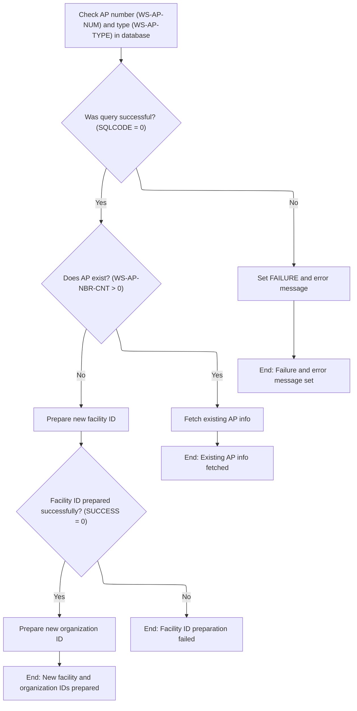
```mermaid
%%{init: {"flowchart": {"defaultRenderer": "elk"}} }%%
flowchart TD
    node1["Check AP number (WS-AP-NUM) and type (WS-AP-TYPE) in database"] --> node2{"Was query successful? (SQLCODE = 0)"}
    click node1 openCode "base/src/NNNS0487.cbl:2541:2550"
    node2 -->|"Yes"| node3{"Does AP exist? (WS-AP-NBR-CNT > 0)"}
    click node2 openCode "base/src/NNNS0487.cbl:2552:2561"
    node2 -->|"No"| node7["Set FAILURE and error message"]
    click node7 openCode "base/src/NNNS0487.cbl:2563:2565"
    node3 -->|"No"| node4["Prepare new facility ID"]
    click node4 openCode "base/src/NNNS0487.cbl:2595:2601"
    node4 --> node5{"Facility ID prepared successfully? (SUCCESS = 0)"}
    click node5 openCode "base/src/NNNS0487.cbl:2602:2606"
    node5 -->|"Yes"| node6["Prepare new organization ID"]
    click node6 openCode "base/src/NNNS0487.cbl:2557:2558"
    node5 -->|"No"| node8["End: Facility ID preparation failed"]
    click node8 openCode "base/src/NNNS0487.cbl:2607:2610"
    node3 -->|"Yes"| node9["Fetch existing AP info"]
    click node9 openCode "base/src/NNNS0487.cbl:2560:2561"
    node6 --> node10["End: New facility and organization IDs prepared"]
    click node10 openCode "base/src/NNNS0487.cbl:2557:2558"
    node9 --> node11["End: Existing AP info fetched"]
    click node11 openCode "base/src/NNNS0487.cbl:2560:2561"
    node7 --> node12["End: Failure and error message set"]
    click node12 openCode "base/src/NNNS0487.cbl:2563:2565"

classDef HeadingStyle fill:#777777,stroke:#333,stroke-width:2px;
```

<SwmSnippet path="/base/src/NNNS0487.cbl" line="2540">

---

`1515-CHECK-AP-NBR` moves the AP fields to working storage, checks if the AP exists in the DB, and then either gets new facility/org IDs or fetches AP info, depending on the result. If the SQL fails, it flags an error.

```cobol
261700 1515-CHECK-AP-NBR.                                               00261700
261800     MOVE AP-NBR    OF DCLXXXATION TO WS-AP-NUM                   00261800
261900     MOVE AP-TYP-CD OF DCLXXXATION TO WS-AP-TYPE                  00261900
262000                                                                  00262000
262100     EXEC SQL                                                     00262100
262200         SELECT COUNT(*)                                          00262200
262300         INTO   :WS-AP-NBR-CNT                                    00262300
262400         FROM XXXATION                                            00262400
262500         WHERE AP_TYP_CD = :WS-AP-TYPE                            00262500
262600           AND AP_NBR = :WS-AP-NUM                                00262600
262700     END-EXEC                                                     00262700
262800                                                                  00262800
262900     EVALUATE TRUE                                                00262900
263000       WHEN SQLCODE = 0                                           00263000
263100         IF WS-AP-NBR-CNT = 0                                     00263100
263200           PERFORM 1525-EXIT-GET-FAC-ID                           00263200
263300           IF SUCCESS                                             00263300
263400             PERFORM 1530-EXIT-GET-ORG-ID                         00263400
263500           END-IF                                                 00263500
263600         ELSE                                                     00263600
263700           PERFORM 1520-GET-AP-INFO                               00263700
263800         END-IF                                                   00263800
263900       WHEN OTHER                                                 00263900
264000         SET  FAILURE        TO TRUE                              00264000
264100         MOVE 'NNNS0487 - Error getting AP count!'                00264100
264200           TO IS-RTRN-MSG-TXT                                     00264200
264300     END-EVALUATE                                                 00264300
264400     .                                                            00264400
```

---

</SwmSnippet>

<SwmSnippet path="/base/src/NNNS0487.cbl" line="2595">

---

`1525-EXIT-GET-FAC-ID` grabs the max FAC_ID from the DB, bumps it by one, and uses that as the new ID. If the query fails, it flags an error and sets a message.

```cobol
267200 1525-EXIT-GET-FAC-ID.                                            00267200
267300     EXEC SQL                                                     00267300
267400         SELECT MAX (FAC_ID)                                      00267400
267500         INTO   :DCLXXXATION.FAC-ID                               00267500
267600         FROM   XXXATION                                          00267600
267700     END-EXEC                                                     00267700
267800                                                                  00267800
267900     EVALUATE TRUE                                                00267900
268000       WHEN SQLCODE = 0                                           00268000
268100         COMPUTE FAC-ID OF DCLXXXATION =                          00268100
268200                 FAC-ID OF DCLXXXATION + 1                        00268200
268300       WHEN OTHER                                                 00268300
268400         SET  FAILURE TO TRUE                                     00268400
268500         MOVE 'NNNS0487 - Error getting FAC_ID!'                  00268500
268600           TO IS-RTRN-MSG-TXT                                     00268600
268700     END-EVALUATE                                                 00268700
268800     .                                                            00268800
```

---

</SwmSnippet>

#### Fetching Current Mailing and Contact Info

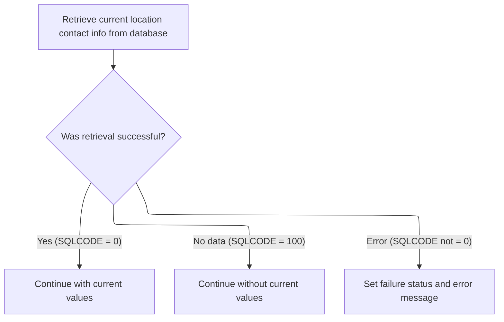
```mermaid
%%{init: {"flowchart": {"defaultRenderer": "elk"}} }%%
flowchart TD
    node1["Retrieve current location contact info from database"]
    click node1 openCode "base/src/NNNS0487.cbl:2415:2439"
    node1 --> node2{"Was retrieval successful?"}
    click node2 openCode "base/src/NNNS0487.cbl:2441:2453"
    node2 -->|"Yes (SQLCODE = 0)"| node3["Continue with current values"]
    click node3 openCode "base/src/NNNS0487.cbl:2442:2443"
    node2 -->|"No data (SQLCODE = 100)"| node4["Continue without current values"]
    click node4 openCode "base/src/NNNS0487.cbl:2444:2445"
    node2 -->|"Error (SQLCODE not = 0)"| node5["Set failure status and error message"]
    click node5 openCode "base/src/NNNS0487.cbl:2446:2453"

classDef HeadingStyle fill:#777777,stroke:#333,stroke-width:2px;
```

<SwmSnippet path="/base/src/NNNS0487.cbl" line="2415">

---

`1430-GET-CURRENT-VALUES` pulls the latest mailing and contact info for the location from the DB. If the query fails, it flags an error and sets a message. This keeps the update in sync with the latest data.

```cobol
249200 1430-GET-CURRENT-VALUES.                                         00249200
249300                                                                  00249300
249400     EXEC SQL                                                     00249400
249500         SELECT MAIL_TO_LOC_NM,                                   00249500
249600                MAIL_TO_ADR_1,                                    00249600
249700                MAIL_TO_ADR_2,                                    00249700
249800                MAIL_TO_CITY,                                     00249800
249900                MAIL_TO_STATE_CD,                                 00249900
250000                SEC_CONTACT_NM,                                   00250000
250100                MAIL_TO_ZIP5_CD,                                  00250100
250200                MAIL_TO_ZIP4_CD,                                  00250200
250300                MAIL_TO_PHONE_NBR                                 00250300
250400          INTO  :WS-MAIL-TO-LOC-NM,                               00250400
250500                :WS-MAIL-TO-ADR-1,                                00250500
250600                :WS-MAIL-TO-ADR-2,                                00250600
250700                :WS-MAIL-TO-CITY,                                 00250700
250800                :WS-MAIL-TO-STATE-CD,                             00250800
250900                :WS-SEC-CONTACT-NM,                               00250900
251000                :WS-MAIL-TO-ZIP5-CD,                              00251000
251100                :WS-MAIL-TO-ZIP4-CD,                              00251100
251200                :WS-MAIL-TO-PHONE-NBR                             00251200
251300         FROM   XXXATION                                          00251300
251400         WHERE  LOC_TYP_CD = :DCLXXXATION.LOC-TYP-CD              00251400
251500         AND    LOC_NBR = :DCLXXXATION.LOC-NBR                    00251500
251600     END-EXEC                                                     00251600
251700                                                                  00251700
251800     EVALUATE TRUE                                                00251800
251900       WHEN SQLCODE = 0                                           00251900
252000         CONTINUE                                                 00252000
252100       WHEN SQLCODE = 100                                         00252100
252200         CONTINUE                                                 00252200
252300       WHEN SQLCODE NOT = 0                                       00252300
252400         SET  FAILURE TO TRUE                                     00252400
252500         MOVE SPACES  TO IS-RTRN-MSG-TXT                          00252500
252600         MOVE SQLCODE TO WS-SQLCODE                               00252600
252700         STRING 'NNNS0487 - Error in getting curr values, '       00252700
252800                'RC=' WS-SQLCODE '.'                              00252800
252900                DELIMITED BY SIZE INTO IS-RTRN-MSG-TXT            00252900
253000     END-EVALUATE                                                 00253000
253100     .                                                            00253100
```

---

</SwmSnippet>

### Applying the Row Modification and Triggering Side Effects

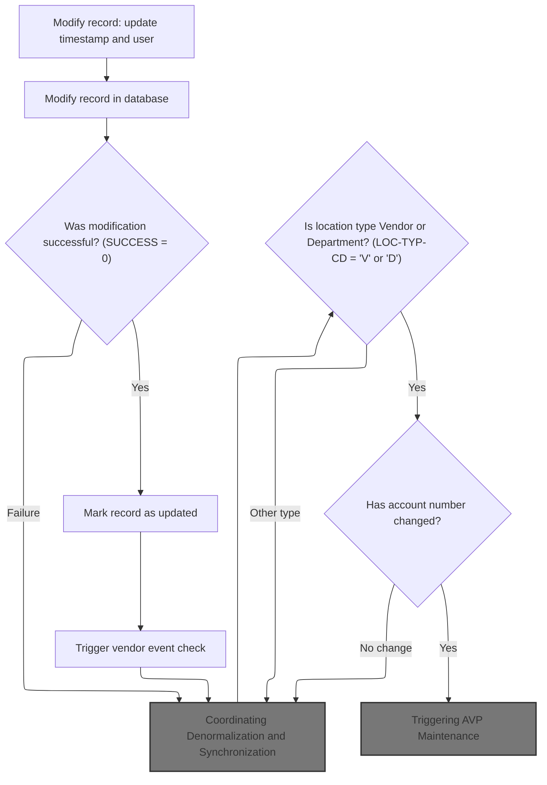
```mermaid
%%{init: {"flowchart": {"defaultRenderer": "elk"}} }%%
flowchart TD
    node1["Modify record: update timestamp and user"]
    click node1 openCode "base/src/NNNS0487.cbl:2457:2460"
    node1 --> node2["Modify record in database"]
    click node2 openCode "base/src/NNNS0487.cbl:2461:2462"
    node2 --> node3{"Was modification successful? (SUCCESS = 0)"}
    click node3 openCode "base/src/NNNS0487.cbl:2464:2472"
    node3 -->|"Yes"| node4["Mark record as updated"]
    click node4 openCode "base/src/NNNS0487.cbl:2465:2471"
    node4 --> node5["Trigger vendor event check"]
    click node5 openCode "base/src/NNNS0487.cbl:2472:2472"
    node5 --> node6["Coordinating Denormalization and Synchronization"]
    
    node6 --> node7{"Is location type Vendor or Department? (LOC-TYP-CD = 'V' or 'D')"}
    click node7 openCode "base/src/NNNS0487.cbl:2475:2476"
    node7 -->|"Yes"| node8{"Has account number changed?"}
    click node8 openCode "base/src/NNNS0487.cbl:2476:2477"
    node8 -->|"Yes"| node9["Triggering AVP Maintenance"]
    
    node8 -->|"No change"| node6
    node7 -->|"Other type"| node6
    node3 -->|"Failure"| node6

classDef HeadingStyle fill:#777777,stroke:#333,stroke-width:2px;
click node6 goToHeading "Coordinating Denormalization and Synchronization"
node6:::HeadingStyle
click node9 goToHeading "Triggering AVP Maintenance"
node9:::HeadingStyle
```

<SwmSnippet path="/base/src/NNNS0487.cbl" line="2457">

---

`1440-D0-MODIFY-ROW` updates the row with the new timestamp and user, runs the DB update, and if it works, sets a bunch of business flags, triggers vendor events, denormalization, and (if needed) DB2 sync and AVP maintenance. All the side effects happen here.

```cobol
253400 1440-D0-MODIFY-ROW.                                              00253400
253500     MOVE YYYC0127-TS   TO LST-UPDT-TS     OF DCLXXXATION         00253500
253600     MOVE YYYC0107-USER TO LST-UPDT-USR-ID OF DCLXXXATION         00253600
253700                                                                  00253700
253800     PERFORM 4010-REP-LOWVALUE-WITH-SPACES                        00253800
253900     PERFORM 5000-CALL-NNNS0487-CUD-ROUTINE                       00253900
254000                                                                  00254000
254100     IF SQLCODE = 0                                               00254100
254200       SET YYYN110A-UPD TO TRUE                                   00254200
254300       SET MMMC0265-MOD TO TRUE                                   00254300
254400       SET LOC-UPD      TO TRUE                                   00254400
254500       SET DSD-UPD      TO TRUE                                   00254500
254600       SET WHS-UPD      TO TRUE                                   00254600
254700       SET VEN-UPD      TO TRUE                                   00254700
254800       SET MODIFY-OPERATION TO TRUE                               00254800
254900       PERFORM 10100-CHECK-FOR-VNDR-EVENTS                        00254900
255000       PERFORM 2000-DENORM-PROCESS                                00255000
255100       IF SUCCESS                                                 00255100
255200         IF LOC-TYP-CD OF DCLXXXATION = 'V' OR 'D'                00255200
255300           IF AP-NBR OF DCLXXXATION NOT EQUAL MMMC0474-OLD-AP-NBR 00255300
255400             SET MMMC0474-UPD TO TRUE                             00255400
255500             PERFORM 125-CONNECT-TO-DB2                           00255500
255600             PERFORM 2050-DO-AVP-MAINTENANCE                      00255600
255700           END-IF                                                 00255700
255800         END-IF                                                   00255800
255900       END-IF                                                     00255900
256000     END-IF                                                       00256000
256100     .                                                            00256100
```

---

</SwmSnippet>

#### Coordinating Denormalization and Synchronization

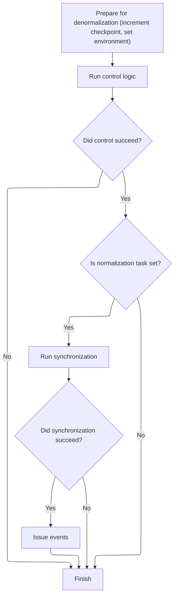
```mermaid
%%{init: {"flowchart": {"defaultRenderer": "elk"}} }%%
flowchart TD
    node1["Prepare for denormalization (increment checkpoint, set environment)"]
    click node1 openCode "base/src/NNNS0487.cbl:318400:318500"
    node1 --> node2["Run control logic"]
    click node2 openCode "base/src/NNNS0487.cbl:318600:318600"
    node2 --> node3{"Did control succeed?"}
    click node3 openCode "base/src/NNNS0487.cbl:318700:318700"
    node3 -->|"Yes"| node4{"Is normalization task set?"}
    click node4 openCode "base/src/NNNS0487.cbl:318800:318800"
    node3 -->|"No"| node7["Finish"]
    click node7 openCode "base/src/NNNS0487.cbl:319400:319400"
    node4 -->|"Yes"| node5["Run synchronization"]
    click node5 openCode "base/src/NNNS0487.cbl:318900:318900"
    node4 -->|"No"| node7
    node5 --> node6{"Did synchronization succeed?"}
    click node6 openCode "base/src/NNNS0487.cbl:319000:319000"
    node6 -->|"Yes"| node8["Issue events"]
    click node8 openCode "base/src/NNNS0487.cbl:319100:319100"
    node6 -->|"No"| node7
    node8 --> node7
classDef HeadingStyle fill:#777777,stroke:#333,stroke-width:2px;
```

<SwmSnippet path="/base/src/NNNS0487.cbl" line="3106">

---

`2000-DENORM-PROCESS` bumps the checkpoint, copies the environment, runs control logic, and if all is good, calls the sync routine and issues events. This is the coordination point for downstream updates.

```cobol
318300 2000-DENORM-PROCESS.                                             00318300
318400     MOVE 1                TO WS-CHECKPOINT-INC                   00318400
318500     MOVE YYYN005A-SYS-ENV TO YYYN110A-SYS-ENV                    00318500
318600     PERFORM 2010-CALL-CONTROL-SUBR                               00318600
318700     IF  SUCCESS                                                  00318700
318800     AND WWWC0100-NORM-TASK                                       00318800
318900       PERFORM 2020-CALL-SYNC-SUBR                                00318900
319000       IF SUCCESS                                                 00319000
319100          PERFORM 2030-ISSUE-EVENTS                               00319100
319200       END-IF                                                     00319200
319300     END-IF                                                       00319300
319400     .                                                            00319400
```

---

</SwmSnippet>

<SwmSnippet path="/base/src/NNNS0487.cbl" line="3129">

---

`2020-CALL-SYNC-SUBR` checks the location type and calls the right sync routine for vendors, stores, accounts, etc. Each type gets its own handler. Some types (like DSD vendor) are skipped or have commented-out logic.

```cobol
320600 2020-CALL-SYNC-SUBR.                                             00320600
320700     SET YYYN110A-ORACLE        TO TRUE                           00320700
320800     EVALUATE TRUE                                                00320800
320900       WHEN LOC-TYP-CD OF DCLXXXATION = K-VEND-LOC-TYPE           00320900
321000         SET MMMC0135-LO-IS-CURRENT TO TRUE                       00321000
321100         CALL MMMS0135-SYNC-LO USING                              00321100
321200           XXXN001A                                               00321200
321300           YYYN110A                                               00321300
321400           MMMC0135                                               00321400
321500           P-DDDTLO01                                             00321500
321600       WHEN LOC-TYP-CD OF DCLXXXATION = K-STORE-LOC-TYPE          00321600
321700       OR   LOC-TYP-CD OF DCLXXXATION = K-ACCT-LOC-TYPE           00321700
321800         SET MMMC0157-LO-IS-CURRENT TO TRUE                       00321800
321900         CALL MMMS0157-SYNC-LO USING                              00321900
322000           XXXN001A                                               00322000
322100           YYYN110A                                               00322100
322200           MMMC0157                                               00322200
322300           P-DDDTLO01                                             00322300
322400       WHEN LOC-TYP-CD OF DCLXXXATION = K-DSD-VEND-LOC-TYPE       00322400
322500         CONTINUE                                                 00322500
322600*        SET MMMC0153-LO-IS-CURRENT TO TRUE                       00322600
322700*        CALL MMMS0153-SYNC-LO USING                              00322700
322800*          XXXN001A                                               00322800
322900*          YYYN110A                                               00322900
323000*          MMMC0153                                               00323000
323100*          P-DDDTLO01                                             00323100
323200       WHEN LOC-TYP-CD OF DCLXXXATION = 'B'                       00323200
323300       OR   LOC-TYP-CD OF DCLXXXATION = 'T'                       00323300
323400       OR   LOC-TYP-CD OF DCLXXXATION = 'W'                       00323400
323500       OR   LOC-TYP-CD OF DCLXXXATION = 'O'                       00323500
323600         SET  MMMC0265-LO-LEVEL TO TRUE                           00323600
323700         MOVE LOC-TYP-CD OF DCLXXXATION TO LOC-TYP-CD OF MMMC0265 00323700
323800         MOVE LOC-NBR    OF DCLXXXATION TO LOC-NBR    OF MMMC0265 00323800
323900         CALL WS-MMMS0265-SYNC USING                              00323900
324000             XXXN001A                                             00324000
324100             MMMC0265                                             00324100
324200     END-EVALUATE                                                 00324200
324300     .                                                            00324300
```

---

</SwmSnippet>

#### Issuing Events for Location Changes

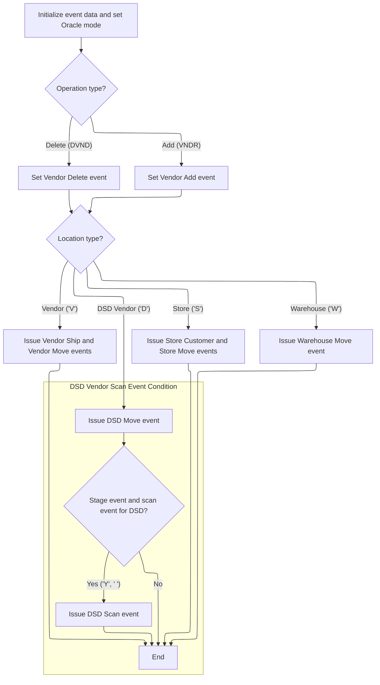
```mermaid
%%{init: {"flowchart": {"defaultRenderer": "elk"}} }%%
flowchart TD
    node1["Initialize event data and set Oracle mode"]
    click node1 openCode "base/src/NNNS0487.cbl:3169:3171"
    node1 --> node2{"Operation type?"}
    click node2 openCode "base/src/NNNS0487.cbl:3172:3176"
    node2 -->|"Delete (DVND)"| node3["Set Vendor Delete event"]
    click node3 openCode "base/src/NNNS0487.cbl:3173:3173"
    node2 -->|"Add (VNDR)"| node4["Set Vendor Add event"]
    click node4 openCode "base/src/NNNS0487.cbl:3175:3175"
    node3 --> node5{"Location type?"}
    node4 --> node5
    click node5 openCode "base/src/NNNS0487.cbl:3186:3254"
    node5 -->|"Vendor ('V')"| node6["Issue Vendor Ship and Vendor Move events"]
    click node6 openCode "base/src/NNNS0487.cbl:3187:3209"
    node5 -->|"Store ('S')"| node7["Issue Store Customer and Store Move events"]
    click node7 openCode "base/src/NNNS0487.cbl:3210:3230"
    node5 -->|"DSD Vendor ('D')"| node8["Issue DSD Move event"]
    click node8 openCode "base/src/NNNS0487.cbl:3231:3240"
    node5 -->|"Warehouse ('W')"| node9["Issue Warehouse Move event"]
    click node9 openCode "base/src/NNNS0487.cbl:3241:3253"
    subgraph scanEvent["DSD Vendor Scan Event Condition"]
      node8 --> node10{"Stage event and scan event for DSD?"}
      click node10 openCode "base/src/NNNS0487.cbl:3255:3264"
      node10 -->|"Yes ('Y', ' ')"| node11["Issue DSD Scan event"]
      click node11 openCode "base/src/NNNS0487.cbl:3257:3263"
      node10 -->|"No"| node12["End"]
    end
    node6 --> node12["End"]
    node7 --> node12
    node9 --> node12
    node11 --> node12
classDef HeadingStyle fill:#777777,stroke:#333,stroke-width:2px;
```

<SwmSnippet path="/base/src/NNNS0487.cbl" line="3169">

---

`2030-ISSUE-EVENTS` sets up the event type and payload based on location type, then calls the event manager to issue the event. It handles deletes, updates, and special scan events for DSD vendors. Each location type gets its own event logic.

```cobol
324600 2030-ISSUE-EVENTS.                                               00324600
324700     INITIALIZE ZZZC0550-IN-DATA                                  00324700
324800     SET  YYYN110A-ORACLE       TO TRUE                           00324800
324900     IF DELETE-OPERATION                                          00324900
325000       SET VENDOR-DELETE-EVENT  TO TRUE                           00325000
325100     ELSE                                                         00325100
325200       SET VENDOR-EVENT TO TRUE                                   00325200
325300     END-IF                                                       00325300
325400     MOVE LOC-TYP-CD       OF DCLXXXATION                         00325400
325500       TO VEND-TYP-CD      OF ZZZC0550-VENDOR-DATA                00325500
325600     MOVE LOC-NBR          OF DCLXXXATION                         00325600
325700       TO VEND-NBR         OF ZZZC0550-VENDOR-DATA                00325700
325800     MOVE 'NNNS0487'            TO ZZZC0197-PROGRAM               00325800
325900     MOVE YYYC0107-USER         TO ZZZC0197-USER                  00325900
326000     MOVE YYYN005A-SYS-ENV      TO YYYN110A-SYS-ENV               00326000
326100     MOVE LOC-NBR OF P-DDDTLO01 TO WS-OLD-KEY                     00326100
326200                                                                  00326200
326300     EVALUATE TRUE                                                00326300
326400       WHEN LOC-TYP-CD OF DCLXXXATION = K-VEND-LOC-TYPE           00326400
326500         MOVE WS-VENDOR-FACILITY                                  00326500
326600           TO VM-VENDOR-FACILITY OF ZZZC0020                      00326600
326700         MOVE WS-VENDOR-NUMBER                                    00326700
326800           TO VM-VENDOR-NUMBER   OF ZZZC0020                      00326800
326900         MOVE ZZZC0020              TO ZZZC0197-TRX-REC           00326900
327000         MOVE 'VSHP'                TO ZZZC0197-TRX-ID            00327000
327100         CALL ZZZS0197-EVENT-MGR USING                            00327100
327200             XXXN001A                                             00327200
327300             YYYN110A                                             00327300
327400             ZZZC0197                                             00327400
327500                                                                  00327500
327600         MOVE LOC-TYP-CD OF DCLXXXATION                           00327600
327700           TO LOC-VEN-TYP-CD OF ZZZC0124                          00327700
327800         MOVE LOC-NBR OF DCLXXXATION                              00327800
327900           TO LOC-VEN-NBR OF ZZZC0124                             00327900
328000         MOVE ZZZC0124              TO ZZZC0197-TRX-REC           00328000
328100         MOVE 'VENM'                TO ZZZC0197-TRX-ID            00328100
328200         CALL ZZZS0197-EVENT-MGR USING                            00328200
328300             XXXN001A                                             00328300
328400             YYYN110A                                             00328400
328500             ZZZC0197                                             00328500
328600                                                                  00328600
328700       WHEN LOC-TYP-CD OF DCLXXXATION = K-STORE-LOC-TYPE          00328700
328800         MOVE LOC-NBR OF DCLXXXATION                              00328800
328900           TO ST-STORE-NUMBER OF ZZZC0032                         00328900
329000              LOC-NBR OF ZZZC0094                                 00329000
329100         SET  ZZZC0032-UPD-FXXX TO TRUE                           00329100
329200         MOVE ZZZC0032          TO ZZZC0197-TRX-REC               00329200
329300         MOVE 'CUST'            TO ZZZC0197-TRX-ID                00329300
329400         CALL ZZZS0197-EVENT-MGR USING                            00329400
329500             XXXN001A                                             00329500
329600             YYYN110A                                             00329600
329700             ZZZC0197                                             00329700
329800                                                                  00329800
329900         MOVE LOC-TYP-CD OF DCLXXXATION TO                        00329900
330000                                 LOC-TYP-CD OF ZZZC0094           00330000
330100         MOVE ZZZC0094              TO ZZZC0197-TRX-REC           00330100
330200         MOVE 'STRM'                TO ZZZC0197-TRX-ID            00330200
330300         CALL ZZZS0197-EVENT-MGR USING                            00330300
330400              XXXN001A                                            00330400
330500              YYYN110A                                            00330500
330600              ZZZC0197                                            00330600
330700                                                                  00330700
330800       WHEN LOC-TYP-CD OF DCLXXXATION = K-DSD-VEND-LOC-TYPE       00330800
330900         MOVE LOC-TYP-CD OF DCLXXXATION TO                        00330900
331000                                 LOC-DSD-TYP-CD OF ZZZC0122       00331000
331100         MOVE ZZZC0122              TO ZZZC0197-TRX-REC           00331100
331200         MOVE 'DSDM'                TO ZZZC0197-TRX-ID            00331200
331300         CALL ZZZS0197-EVENT-MGR USING                            00331300
331400              XXXN001A                                            00331400
331500              YYYN110A                                            00331500
331600              ZZZC0197                                            00331600
331700                                                                  00331700
331800       WHEN LOC-TYP-CD OF DCLXXXATION = K-WHSE-LOC-TYPE           00331800
331900         MOVE LOC-NBR OF DCLXXXATION                              00331900
332000           TO LOC-WHS-NBR OF ZZZC0123                             00332000
332100         MOVE LOC-TYP-CD OF DCLXXXATION TO                        00332100
332200              LOC-WHS-TYP-CD OF ZZZC0123                          00332200
332300*        SET  ZZZC0044-UPD-FXXX TO TRUE                           00332300
332400         MOVE ZZZC0123          TO ZZZC0197-TRX-REC               00332400
332500         MOVE 'WHSM'            TO ZZZC0197-TRX-ID                00332500
332600         CALL ZZZS0197-EVENT-MGR USING                            00332600
332700             XXXN001A                                             00332700
332800             YYYN110A                                             00332800
332900             ZZZC0197                                             00332900
333000                                                                  00333000
333100     END-EVALUATE                                                 00333100
333200     IF STAGE-EVENT AND WWWC0100-CREATE-SCAN-EVENT                00333200
333300       AND LOC-TYP-CD OF DCLXXXATION = 'D'                        00333300
333400         MOVE ZZZC0550              TO ZZZC0197-TRX-REC           00333400
333500         MOVE ZZZC0550-TRX          TO ZZZC0197-TRX-ID            00333500
333600                                       ZZZC0197-TRX-CD            00333600
333700         CALL ZZZS0197-EVENT-MGR USING                            00333700
333800              XXXN001A                                            00333800
333900              YYYN110A                                            00333900
334000              ZZZC0197                                            00334000
334100     END-IF                                                       00334100
334200     .                                                            00334200
```

---

</SwmSnippet>

#### Main Event Processing Entry Point

See <SwmLink doc-title="Event Transaction Processing Flow">[Event Transaction Processing Flow](\.swm\event-transaction-processing-flow.x0pknljr.sw.md)</SwmLink>

#### Switching to DB2 Connection

<SwmSnippet path="/base/src/NNNS0487.cbl" line="1236">

---

`125-CONNECT-TO-DB2` just calls the DB2 connection routine, passing in the main transaction structure and SQLCA. This is where we actually flip the system over to DB2 for the next set of operations. The call to base/src/YYYS0211.cbl is what does the heavy lifting—prepping the environment, handling error translation, and restoring any backup data. Without this call, the connection wouldn't actually change.

```cobol
131300 125-CONNECT-TO-DB2.                                              00131300
131400     CALL Z-DB2-CONNECT         USING XXXN001A                    00131400
131500                                      SQLCA                       00131500
131600     .                                                            00131600
```

---

</SwmSnippet>

#### Coordinating Connection and Error Handling

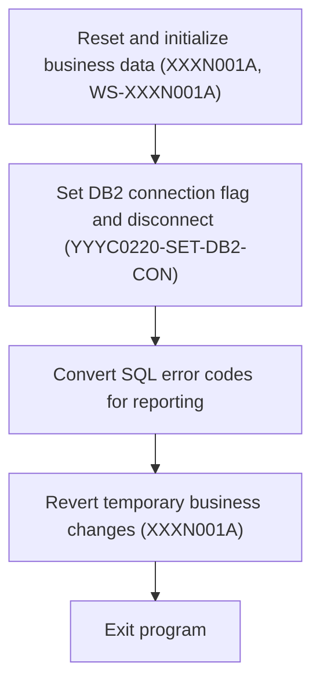
```mermaid
%%{init: {"flowchart": {"defaultRenderer": "elk"}} }%%
flowchart TD
    node1["Reset and initialize business data (XXXN001A, WS-XXXN001A)"] --> node2["Set DB2 connection flag and disconnect (YYYC0220-SET-DB2-CON)"]
    click node1 openCode "base/src/YYYS0211.cbl:44:47"
    click node2 openCode "base/src/YYYS0211.cbl:53:58"
    node2 --> node3["Convert SQL error codes for reporting"]
    click node3 openCode "base/src/YYYS0211.cbl:35:35"
    node3 --> node4["Revert temporary business changes (XXXN001A)"]
    click node4 openCode "base/src/YYYS0211.cbl:36:36"
    node4 --> node5["Exit program"]
    click node5 openCode "base/src/YYYS0211.cbl:37:37"
classDef HeadingStyle fill:#777777,stroke:#333,stroke-width:2px;
```

<SwmSnippet path="/base/src/YYYS0211.cbl" line="32">

---

`0000-EXIT-DISPATCHER` runs through setup, switches the DB connection to DB2, converts any Oracle error codes to internal format, and restores the main business record. Each step is chained so the environment is clean, the connection is correct, and errors are standardized before returning control.

```cobol
004700 0000-EXIT-DISPATCHER.                                            00004700
004800     PERFORM 100-INITIALIZATION                                   00004800
004900     PERFORM 200-CONNECT-TO-DB2                                   00004900
005000     PERFORM 300-CNV-ORACLE-SQLCODE                               00005000
005100     PERFORM 400-REVERT-SAVED-XXXN001A                            00005100
005300     GOBACK                                                       00005300
005400     .                                                            00005400
```

---

</SwmSnippet>

<SwmSnippet path="/base/src/YYYS0211.cbl" line="44">

---

`100-INITIALIZATION` copies the current business record to a backup variable, then clears the original. This keeps a clean slate for the next DB operation and lets us restore the record if needed.

```cobol
006000 100-INITIALIZATION.                                              00006000
006100     MOVE XXXN001A TO WS-XXXN001A                                 00006100
006200     INITIALIZE XXXN001A                                          00006200
006400     .                                                            00006400
```

---

</SwmSnippet>

<SwmSnippet path="/base/src/YYYS0211.cbl" line="53">

---

`200-CONNECT-TO-DB2` sets a flag in the connection control structure to request a DB2 switch, then calls the connection manager program. That program handles the actual switch and tracks stats for DB2/Oracle usage. The flag is what tells it to do a DB2 switch, not something else.

```cobol
007300 200-CONNECT-TO-DB2.                                              00007300
007400     SET YYYC0220-SET-DB2-CON TO TRUE                             00007400
007500     CALL YYYS0220-DBMS-CON-MGR USING                             00007500
007600         XXXN001A                                                 00007600
007700         YYYC0220                                                 00007700
008100     .                                                            00008100
```

---

</SwmSnippet>

#### Translating Oracle Error Codes

<SwmSnippet path="/base/src/YYYS0211.cbl" line="65">

---

`300-CNV-ORACLE-SQLCODE` checks if the last DB operation was successful but returned Oracle error -84. If so, it calls the error conversion routine, passing the transaction and SQL context. This is a targeted fix for a known Oracle issue.

```cobol
009500 300-CNV-ORACLE-SQLCODE.                                          00009500
009600     IF  SUCCESS                                                  00009600
009610     AND SQLCODE = -84                                            00009610
009720       CALL Z-ORA-ERR-CONVERSION USING                            00009720
009730           XXXN001A                                               00009730
009740           SQLCA                                                  00009740
009750     END-IF                                                       00009750
010200     .                                                            00010200
```

---

</SwmSnippet>

#### Formatting and Mapping Error Messages

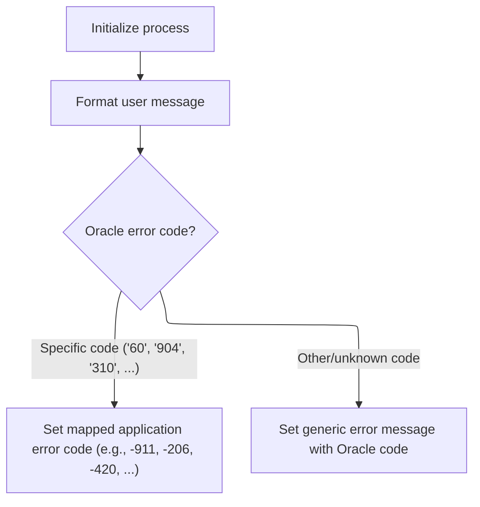
```mermaid
%%{init: {"flowchart": {"defaultRenderer": "elk"}} }%%
flowchart TD
    node1["Initialize process"] --> node2["Format user message"]
    click node1 openCode "base/src/YYYS0212.cbl:39:40"
    click node2 openCode "base/src/YYYS0212.cbl:59:107"
    node2 --> node3{"Oracle error code?"}
    click node3 openCode "base/src/YYYS0212.cbl:65:105"
    node3 -->|"Specific code ('60', '904', '310', ...)"| node4["Set mapped application error code (e.g., -911, -206, -420, ...)"]
    click node4 openCode "base/src/YYYS0212.cbl:65:99"
    node3 -->|"Other/unknown code"| node5["Set generic error message with Oracle code"]
    click node5 openCode "base/src/YYYS0212.cbl:103:105"
classDef HeadingStyle fill:#777777,stroke:#333,stroke-width:2px;
```

<SwmSnippet path="/base/src/YYYS0212.cbl" line="29">

---

`000-MAIN-PROCESS` clears out error fields, then runs the logic to map Oracle error codes to internal codes and builds a user-friendly error message. This is where Oracle errors get translated for the client.

```cobol
003800 000-MAIN-PROCESS.                                                00003800
003900     PERFORM 100-INITIALIZE                                       00003900
004000     PERFORM 200-FORMAT-USER-MSG-TXT                              00004000
004100     GOBACK                                                       00004100
004200     .                                                            00004200
```

---

</SwmSnippet>

<SwmSnippet path="/base/src/YYYS0212.cbl" line="50">

---

`200-FORMAT-USER-MSG-TXT` splits the Oracle error string into message parts and the error code, then maps that code to an internal SQLCODE using a switch-case. If the code isn't recognized, it builds a generic error message. This keeps error handling predictable.

```cobol
005900 200-FORMAT-USER-MSG-TXT.                                         00005900
006000     UNSTRING SQLERRMC  DELIMITED BY SPACE INTO                   00006000
006100                        WS-ERR-MSG1                               00006100
006200                        WS-ERR-MSG2                               00006200
006300                        WS-ERR-MSG3                               00006300
006400                        WS-ERR-ORA-CODE                           00006400
006500     EVALUATE WS-ERR-ORA-CODE                                     00006500
006510       WHEN  '60   '                                              00006510
006520         MOVE  -911                             TO SQLCODE        00006520
006600       WHEN  '904  '                                              00006600
006700       WHEN  '310  '                                              00006700
006800         MOVE  -206                             TO SQLCODE        00006800
006900       WHEN  '615  '                                              00006900
007000       WHEN  '616  '                                              00007000
007100         MOVE  -420                             TO SQLCODE        00007100
007200       WHEN  '942  '                                              00007200
007300         MOVE  -204                             TO SQLCODE        00007300
007400       WHEN  '1403 '                                              00007400
007500         MOVE  -100                             TO SQLCODE        00007500
007600       WHEN  '1001 '                                              00007600
007700         MOVE  -501                             TO SQLCODE        00007700
007800       WHEN  '1438 '                                              00007800
007900         MOVE  -413                             TO SQLCODE        00007900
008000       WHEN  '2112 '                                              00008000
008100       WHEN  '1422 '                                              00008100
008200         MOVE  -811                             TO SQLCODE        00008200
008300       WHEN  '2049 '                                              00008300
008400         MOVE  -913                             TO SQLCODE        00008400
008500       WHEN  '2291 '                                              00008500
008600         MOVE  -530                             TO SQLCODE        00008600
008700       WHEN  '2292 '                                              00008700
008800         MOVE  -532                             TO SQLCODE        00008800
008900       WHEN  '6502 '                                              00008900
009000         MOVE  -304                             TO SQLCODE        00009000
009100       WHEN  '6508 '                                              00009100
009200         MOVE  -440                             TO SQLCODE        00009200
009300       WHEN  '6511 '                                              00009300
009400         MOVE  -502                             TO SQLCODE        00009400
009500       WHEN  '6550 '                                              00009500
009600       WHEN  '6553 '                                              00009600
009700         MOVE  -440                             TO SQLCODE        00009700
009800       WHEN  '14028'                                              00009800
009900         MOVE  -538                             TO SQLCODE        00009900
010000       WHEN  '30006'                                              00010000
010100         MOVE  -904                             TO SQLCODE        00010100
010200       WHEN OTHER                                                 00010200
010300         STRING 'Error in YYYS0212. Oracle code:'                 00010300
010300                 WS-ERR-ORA-CODE                                  00010320
010300         DELIMITED BY SIZE INTO IS-RTRN-MSG2-TXT                  00010330
010500     END-EVALUATE                                                 00010500
010600     MOVE SPACES                                TO SQLERRMC       00010600
010700     .                                                            00010700
```

---

</SwmSnippet>

#### Triggering AVP Maintenance

<SwmSnippet path="/base/src/NNNS0487.cbl" line="3284">

---

`2050-DO-AVP-MAINTENANCE` copies location and AP fields from the main record to the AVP structure, sets the AVP flag, stamps the program name, and passes the system environment. Then it calls the AVP maintenance routine to do the actual work.

```cobol
336100 2050-DO-AVP-MAINTENANCE.                                         00336100
336200     MOVE LOC-TYP-CD               OF DCLXXXATION                 00336200
336300       TO MMMC0474-LOC-TYP-CD                                     00336300
336400     MOVE LOC-NBR                  OF DCLXXXATION                 00336400
336500       TO MMMC0474-LOC-NBR                                        00336500
336600     MOVE AP-TYP-CD                OF DCLXXXATION                 00336600
336700       TO MMMC0474-NEW-AP-TYP                                     00336700
336800     MOVE AP-NBR                   OF DCLXXXATION                 00336800
336900       TO MMMC0474-NEW-AP-NBR                                     00336900
337000     SET MMMC0474-LO               TO TRUE                        00337000
337100     MOVE 'NNNS0487'                                              00337100
337200       TO MMMC0474-PROGRAM                                        00337200
337300     MOVE YYYN005A-SYS-ENV                                        00337300
337400       TO MMMC0474-SYS-ENV                                        00337400
337500                                                                  00337500
337600     CALL MMMS0474-DO-AVP-MAIN USING                              00337600
337700          XXXN001A                                                00337700
337800          MMMC0474                                                00337800
337900     .                                                            00337900
```

---

</SwmSnippet>

### Inserting a New Location Record

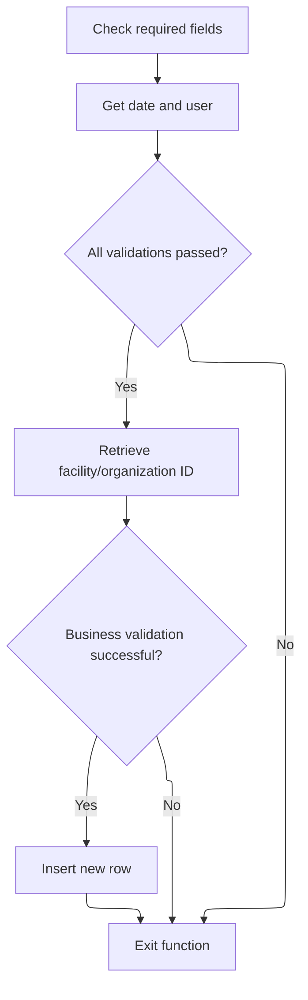
```mermaid
%%{init: {"flowchart": {"defaultRenderer": "elk"}} }%%
flowchart TD
    node1["Check required fields"] --> node2["Get date and user"]
    click node1 openCode "base/src/NNNS0487.cbl:2565:2565"
    click node2 openCode "base/src/NNNS0487.cbl:2566:2566"
    node2 --> node3{"All validations passed?"}
    click node3 openCode "base/src/NNNS0487.cbl:2567:2567"
    node3 -->|"Yes"| node4["Retrieve facility/organization ID"]
    click node4 openCode "base/src/NNNS0487.cbl:2571:2571"
    node3 -->|"No"| node7["Exit function"]
    node4 --> node5{"Business validation successful?"}
    click node5 openCode "base/src/NNNS0487.cbl:2572:2572"
    node5 -->|"Yes"| node6["Insert new row"]
    click node6 openCode "base/src/NNNS0487.cbl:2573:2573"
    node5 -->|"No"| node7
    node6 --> node7["Exit function"]
    click node7 openCode "base/src/NNNS0487.cbl:2577:2577"

classDef HeadingStyle fill:#777777,stroke:#333,stroke-width:2px;
```

<SwmSnippet path="/base/src/NNNS0487.cbl" line="2487">

---

`1500-EXIT-PUT-INSERT-ROW` chains together null checks, date/user stamping, county validation, and facility/org ID logic before finally inserting the new row. Each step only runs if the previous one succeeded, so we don't insert junk.

```cobol
256400 1500-EXIT-PUT-INSERT-ROW.                                        00256400
256500     PERFORM 1800-EDIT-NULL-INDICATORS                            00256500
256600     PERFORM 2040-GET-DATE-AND-USER                               00256600
256700     IF SUCCESS                                                   00256700
256800*      PERFORM 10300-CHECK-FOR-VALID-COUNTY                       00256800
256900       SET EXIT-PUT-INSERT-ROW TO TRUE                            00256900
257000       IF SUCCESS                                                 00257000
257100         PERFORM 1505-GET-FAC-ORG-ID                              00257100
257200         IF SUCCESS                                               00257200
257300           PERFORM 1510-D0-INSERT-ROW                             00257300
257400         END-IF                                                   00257400
257500       END-IF                                                     00257500
257600     END-IF                                                       00257600
257700     .                                                            00257700
```

---

</SwmSnippet>

<SwmSnippet path="/base/src/NNNS0487.cbl" line="2521">

---

`1510-D0-INSERT-ROW` sets up the new row with the current date, timestamp, and user, cleans up low-value fields, and calls the insert routine. If the insert works, it sets all the add flags and kicks off denormalization to sync downstream systems.

```cobol
259800 1510-D0-INSERT-ROW.                                              00259800
259900     MOVE DTA10-MM-DD-YYYY TO ADDED-DT        OF DCLXXXATION      00259900
260000     MOVE YYYC0127-TS      TO LST-UPDT-TS     OF DCLXXXATION      00260000
260100     MOVE YYYC0107-USER    TO LST-UPDT-USR-ID OF DCLXXXATION      00260100
260200     PERFORM 4010-REP-LOWVALUE-WITH-SPACES                        00260200
260300     PERFORM 5000-CALL-NNNS0487-CUD-ROUTINE                       00260300
260400                                                                  00260400
260500     IF SQLCODE = 0                                               00260500
260600       SET YYYN110A-ADD TO TRUE                                   00260600
260700       SET MMMC0265-ADD TO TRUE                                   00260700
260800       SET LOC-ADD      TO TRUE                                   00260800
260900       SET DSD-ADD      TO TRUE                                   00260900
261000       SET WHS-ADD      TO TRUE                                   00261000
261100       SET VEN-ADD      TO TRUE                                   00261100
261200       PERFORM 2000-DENORM-PROCESS                                00261200
261300     END-IF                                                       00261300
261400     .                                                            00261400
```

---

</SwmSnippet>

### Purging a Location Record

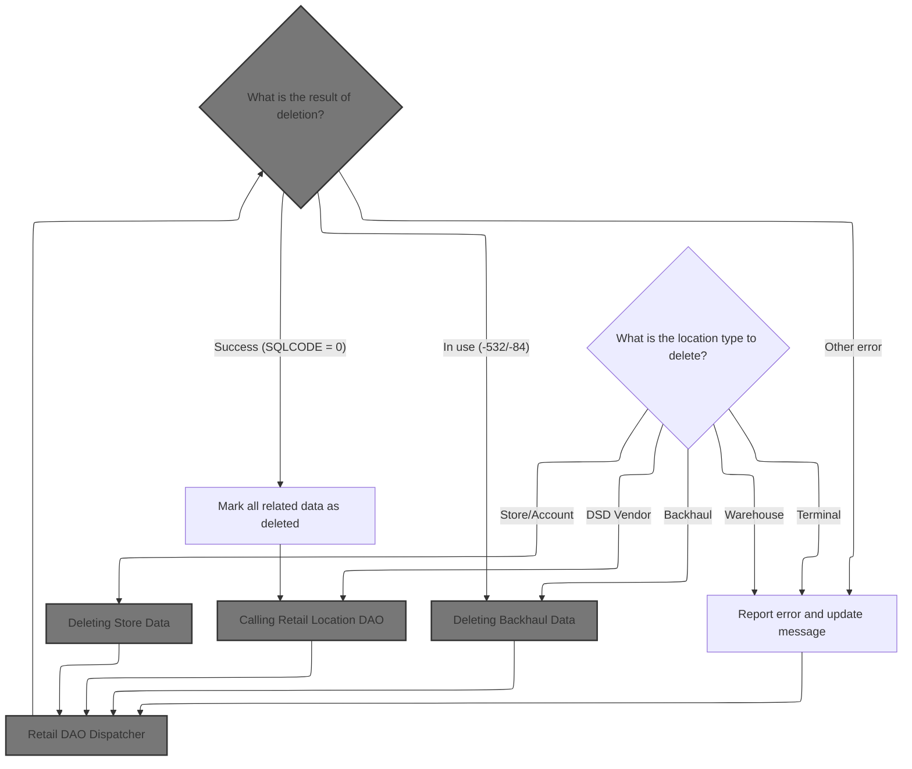
```mermaid
%%{init: {"flowchart": {"defaultRenderer": "elk"}} }%%
flowchart TD
    node1{"What is the location type to delete?"}
    click node1 openCode "base/src/NNNS0487.cbl:2633:2646"
    node1 -->|"Store/Account"| node2["Deleting Store Data"]
    
    node1 -->|"DSD Vendor"| node3["Calling Retail Location DAO"]
    
    node1 -->|"Backhaul"| node7["Deleting Backhaul Data"]
    
    node1 -->|"Terminal"| node8["Delete terminal data"]
    click node8 openCode "base/src/NNNS0487.cbl:2916:2923"
    node1 -->|"Warehouse"| node8
    node2 --> node4["Retail DAO Dispatcher"]
    
    node3 --> node4
    node7 --> node4
    node8 --> node4
    node4 --> node5{"What is the result of deletion?"}
    
    node5 -->|"Success (SQLCODE = 0)"| node6["Mark all related data as deleted"]
    click node6 openCode "base/src/NNNS0487.cbl:2734:2741"
    node6 --> node3["Calling Retail Location DAO"]
    
    node5 -->|"In use (-532/-84)"| node7["Deleting Backhaul Data"]
    
    node5 -->|"Other error"| node8["Report error and update message"]
    click node8 openCode "base/src/NNNS0487.cbl:2749:2755"

classDef HeadingStyle fill:#777777,stroke:#333,stroke-width:2px;
click node2 goToHeading "Deleting Store Data"
node2:::HeadingStyle
click node3 goToHeading "Calling Retail Location DAO"
node3:::HeadingStyle
click node4 goToHeading "Retail DAO Dispatcher"
node4:::HeadingStyle
click node5 goToHeading "Finalizing Output and Checkpoint"
node5:::HeadingStyle
click node7 goToHeading "Deleting Backhaul Data"
node7:::HeadingStyle
```

<SwmSnippet path="/base/src/NNNS0487.cbl" line="2633">

---

`1600-EXIT-PUT-PURGE-ROW` picks the right delete routine based on location type, runs the delete, connects to Oracle for extra cleanup, and sets all the delete flags if successful. It also handles constraint errors and triggers denormalization to keep everything in sync.

```cobol
271000 1600-EXIT-PUT-PURGE-ROW.                                         00271000
271100     EVALUATE TRUE                                                00271100
271200       WHEN LOC-TYP-CD OF DCLXXXATION = K-STORE-LOC-TYPE          00271200
271300       OR   LOC-TYP-CD OF DCLXXXATION = K-ACCT-LOC-TYPE           00271300
271400         PERFORM 1610-DELETE-STORE                                00271400
271500       WHEN LOC-TYP-CD OF DCLXXXATION = K-DSD-VEND-LOC-TYPE       00271500
271600         PERFORM 1620-DELETE-DSD-VENDOR                           00271600
271700       WHEN LOC-TYP-CD OF DCLXXXATION = 'B'                       00271700
271800         PERFORM 1640-DELETE-BKHAUL                               00271800
271900       WHEN LOC-TYP-CD OF DCLXXXATION = 'T'                       00271900
272000         PERFORM 1650-DELETE-TERMINAL                             00272000
272100       WHEN LOC-TYP-CD OF DCLXXXATION = 'W'                       00272100
272200         PERFORM 1660-DELETE-WHSE                                 00272200
272300     END-EVALUATE                                                 00272300
272400                                                                  00272400
272500     PERFORM 115-CONNECT-TO-ORACLE                                00272500
272600     IF SUCCESS AND SQLCODE = 0                                   00272600
272700       PERFORM 1690-DELETE-LO                                     00272700
272800     END-IF                                                       00272800
272900                                                                  00272900
273000     EVALUATE TRUE                                                00273000
273100       WHEN SQLCODE = 0                                           00273100
273200         SET YYYN110A-DEL  TO TRUE                                00273200
273300         SET MMMC0265-DEL  TO TRUE                                00273300
273400         SET LOC-DEL       TO TRUE                                00273400
273500         SET DSD-DEL       TO TRUE                                00273500
273600         SET WHS-DEL       TO TRUE                                00273600
273700         SET VEN-DEL       TO TRUE                                00273700
273800     IF SUCCESS AND SQLCODE = 0                                   00273800
273900         SET DELETE-OPERATION  TO TRUE                            00273900
274000         SET STAGE-EVENT       TO TRUE                            00274000
274100     END-IF                                                       00274100
274200         PERFORM 2000-DENORM-PROCESS                              00274200
274300       WHEN SQLCODE = -532                                        00274300
274400       WHEN SQLCODE = -84                                         00274400
274500         SET  FAILURE TO TRUE                                     00274500
274600         MOVE 'NNNS0487 - XXXATION in use - it cannot be deleted!'00274600
274700           TO IS-RTRN-MSG-TXT                                     00274700
274800       WHEN SQLCODE NOT = 0                                       00274800
274900         MOVE SQLCODE                 TO WS-SQLCODE               00274900
275000         SET  FAILURE                 TO TRUE                     00275000
275100         MOVE SPACES                  TO IS-RTRN-MSG-TXT          00275100
275200         STRING 'NNNS0514 - Error deleting XXXATION, SQL='        00275200
275300                 WS-SQLCODE                                       00275300
275400                 DELIMITED BY SIZE INTO IS-RTRN-MSG-TXT           00275400
275500     END-EVALUATE                                                 00275500
275600     .                                                            00275600
```

---

</SwmSnippet>

#### Deleting Store Data

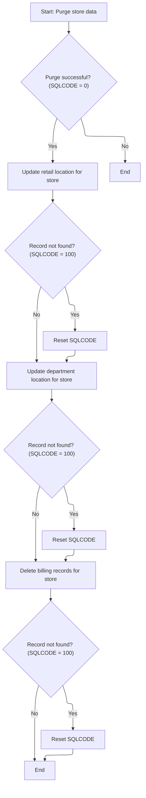
```mermaid
%%{init: {"flowchart": {"defaultRenderer": "elk"}} }%%
flowchart TD
  node1["Start: Purge store data"] --> node2{"Purge successful? (SQLCODE = 0)"}
  click node1 openCode "base/src/NNNS0487.cbl:275900:276000"
  node2 -->|"Yes"| node3["Update retail location for store"]
  click node2 openCode "base/src/NNNS0487.cbl:276100:276700"
  node3 --> node4{"Record not found? (SQLCODE = 100)"}
  click node3 openCode "base/src/NNNS0487.cbl:276700:276900"
  node4 -->|"Yes"| node5["Reset SQLCODE"]
  click node4 openCode "base/src/NNNS0487.cbl:276900:277000"
  node5 --> node6["Update department location for store"]
  click node5 openCode "base/src/NNNS0487.cbl:277000:277900"
  node4 -->|"No"| node6
  node6 --> node7{"Record not found? (SQLCODE = 100)"}
  click node6 openCode "base/src/NNNS0487.cbl:277900:278100"
  node7 -->|"Yes"| node8["Reset SQLCODE"]
  click node7 openCode "base/src/NNNS0487.cbl:278100:278200"
  node8 --> node9["Delete billing records for store"]
  click node8 openCode "base/src/NNNS0487.cbl:278200:279000"
  node7 -->|"No"| node9
  node2 -->|"No"| node10["End"]
  click node10 openCode "base/src/NNNS0487.cbl:279600:279600"
  node9 --> node11{"Record not found? (SQLCODE = 100)"}
  click node9 openCode "base/src/NNNS0487.cbl:279000:279200"
  node11 -->|"Yes"| node12["Reset SQLCODE"]
  click node11 openCode "base/src/NNNS0487.cbl:279200:279300"
  node12 --> node13["End"]
  click node13 openCode "base/src/NNNS0487.cbl:279600:279600"
  node11 -->|"No"| node13
classDef HeadingStyle fill:#777777,stroke:#333,stroke-width:2px;
```

<SwmSnippet path="/base/src/NNNS0487.cbl" line="2682">

---

`1610-DELETE-STORE` runs the retail delete, then if that works, sets up and calls the DAO for retail location and department deletes, and finally deletes from the cost list. Each step only runs if the previous one succeeded, and SQLCODE 100 is treated as 'not found' and ignored.

```cobol
275900 1610-DELETE-STORE.                                               00275900
276000     PERFORM 1610-EXIT-PUT-PURGE-RETL                             00276000
276100     IF SQLCODE = 0                                               00276100
276200       MOVE  LOC-TYP-CD       OF DCLXXXATION                      00276200
276300         TO  LOC-TYP-CD       OF P-DDDTLR01                       00276300
276400       MOVE  LOC-NBR          OF DCLXXXATION                      00276400
276500         TO  LOC-NBR          OF P-DDDTLR01                       00276500
276600       SET EXIT-PUT-PURGE-ROW TO TRUE                             00276600
276700       PERFORM 2060-CALL-RETAIL-LOC-DAO                           00276700
276800       IF SQLCODE = 100                                           00276800
276900         MOVE 0 TO SQLCODE                                        00276900
277000       END-IF                                                     00277000
277100     END-IF                                                       00277100
277200                                                                  00277200
277300     IF SQLCODE = 0                                               00277300
277400       MOVE  LOC-TYP-CD       OF DCLXXXATION                      00277400
277500         TO  LOC-TYP-CD       OF P-DDDTDT01                       00277500
277600       MOVE  LOC-NBR          OF DCLXXXATION                      00277600
277700         TO  LOC-NBR          OF P-DDDTDT01                       00277700
277800       SET EXIT-PUT-PURGE-ROW TO TRUE                             00277800
277900       PERFORM 2070-CALL-STR-LOC-DEPT-DAO                         00277900
278000       IF SQLCODE = 100                                           00278000
278100         MOVE 0 TO SQLCODE                                        00278100
278200       END-IF                                                     00278200
278300     END-IF                                                       00278300
278400                                                                  00278400
278500     IF SQLCODE = 0                                               00278500
278600       EXEC SQL                                                   00278600
278700         DELETE FROM LST_BILED_CST                                00278700
278800         WHERE  STR_LOC_NUM = :DCLXXXATION.LOC-NBR                00278800
278900         AND    STR_LOC_TYP = :DCLXXXATION.LOC-TYP-CD             00278900
279000       END-EXEC                                                   00279000
279100       IF SQLCODE = 100                                           00279100
279200         MOVE 0 TO SQLCODE                                        00279200
279300       END-IF                                                     00279300
279400     END-IF                                                       00279400
279500                                                                  00279500
279600     .                                                            00279600
```

---

</SwmSnippet>

#### Purging Retail Data

See <SwmLink doc-title="Purging Retail Location Data Rows">[Purging Retail Location Data Rows](\.swm\purging-retail-location-data-rows.rxqyd8au.sw.md)</SwmLink>

#### Calling Retail Location DAO

<SwmSnippet path="/base/src/NNNS0487.cbl" line="3305">

---

`2060-CALL-RETAIL-LOC-DAO` calls the retail location DAO program, passing all the context and data needed for the operation. The DAO handles the actual DB work for retail locations, including purges and updates.

```cobol
338200 2060-CALL-RETAIL-LOC-DAO.                                        00338200
338300     CALL NNNS0488-RETAIL-LOC-DAO USING                           00338300
338400          XXXN001A                                                00338400
338500          SQLCA                                                   00338500
338600          YYYN005A                                                00338600
338700          NNNN0000-PARMS                                          00338700
338800          P-DDDTLR01                                              00338800
338900     .                                                            00338900
```

---

</SwmSnippet>

#### Retail DAO Dispatcher

See <SwmLink doc-title="Managing location exit operations">[Managing location exit operations](\.swm\managing-location-exit-operations.plqk6gjc.sw.md)</SwmLink>

#### Finalizing Output and Checkpoint

See <SwmLink doc-title="Finalizing Retail Location Data Operations">[Finalizing Retail Location Data Operations](\.swm\finalizing-retail-location-data-operations.71aoerab.sw.md)</SwmLink>

#### Deleting Backhaul Data

<SwmSnippet path="/base/src/NNNS0487.cbl" line="2906">

---

`1640-DELETE-BKHAUL` calls the CUD routine to delete backhaul data, then resets SQLCODE if nothing was found. This keeps the flow clean and avoids treating missing data as an error.

```cobol
298300 1640-DELETE-BKHAUL.                                              00298300
298400                                                                  00298400
298500     PERFORM 5000-CALL-MMMU0487-CUD-ROUTINE                       00298500
298600                                                                  00298600
298700     IF SQLCODE = 100                                             00298700
298800       MOVE 0 TO SQLCODE                                          00298800
298900     END-IF                                                       00298900
299000     .                                                            00299000
```

---

</SwmSnippet>

<SwmSnippet path="/base/src/NNNS0487.cbl" line="3393">

---

`5000-CALL-MMMU0487-CUD-ROUTINE` calls the Oracle update routine, passing all the relevant transaction, environment, and row data. This is where the actual DB update/delete happens for backhaul, terminal, or warehouse records.

```cobol
347000 5000-CALL-MMMU0487-CUD-ROUTINE.                                  00347000
347100     CALL MMMU0487-ORACLE-UPDATE USING                            00347100
347200          XXXN001A                                                00347200
347300          SQLCA                                                   00347300
347400          YYYN005A                                                00347400
347500          NNNN0000-PARMS                                          00347500
347600          DDDTLO01                                                00347600
347700     .                                                            00347700
```

---

</SwmSnippet>

#### Deleting Terminal Data

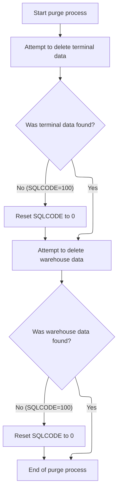
```mermaid
%%{init: {"flowchart": {"defaultRenderer": "elk"}} }%%
flowchart TD
    nodeStart["Start purge process"]
    click nodeStart openCode "base/src/NNNS0487.cbl:2916:2916"
    nodeStart --> node1["Attempt to delete terminal data"]
    click node1 openCode "base/src/NNNS0487.cbl:2916:2923"
    node1 --> node2{"Was terminal data found?"}
    click node2 openCode "base/src/NNNS0487.cbl:2920:2922"
    node2 -->|"No (SQLCODE=100)"| node3["Reset SQLCODE to 0"]
    click node3 openCode "base/src/NNNS0487.cbl:2921:2922"
    node2 -->|"Yes"| node4["Attempt to delete warehouse data"]
    click node4 openCode "base/src/NNNS0487.cbl:2926:2933"
    node3 --> node4
    node4 --> node5{"Was warehouse data found?"}
    click node5 openCode "base/src/NNNS0487.cbl:2930:2932"
    node5 -->|"No (SQLCODE=100)"| node6["Reset SQLCODE to 0"]
    click node6 openCode "base/src/NNNS0487.cbl:2931:2932"
    node5 -->|"Yes"| node7["End of purge process"]
    click node7 openCode "base/src/NNNS0487.cbl:2933:2933"
    node6 --> node7
classDef HeadingStyle fill:#777777,stroke:#333,stroke-width:2px;
```

<SwmSnippet path="/base/src/NNNS0487.cbl" line="2916">

---

`1650-DELETE-TERMINAL` calls the CUD routine to delete terminal data, then resets SQLCODE if nothing was found. This keeps the flow clean and avoids treating missing data as an error.

```cobol
299300 1650-DELETE-TERMINAL.                                            00299300
299400                                                                  00299400
299500     PERFORM 5000-CALL-MMMU0487-CUD-ROUTINE                       00299500
299600                                                                  00299600
299700     IF SQLCODE = 100                                             00299700
299800       MOVE 0 TO SQLCODE                                          00299800
299900     END-IF                                                       00299900
300000     .                                                            00300000
```

---

</SwmSnippet>

<SwmSnippet path="/base/src/NNNS0487.cbl" line="2926">

---

`1660-DELETE-WHSE` calls the CUD routine to delete warehouse data, then resets SQLCODE if nothing was found. This keeps the flow clean and avoids treating missing data as an error.

```cobol
300300 1660-DELETE-WHSE.                                                00300300
300400                                                                  00300400
300500     PERFORM 5000-CALL-MMMU0487-CUD-ROUTINE                       00300500
300600                                                                  00300600
300700     IF SQLCODE = 100                                             00300700
300800       MOVE 0 TO SQLCODE                                          00300800
300900     END-IF                                                       00300900
301000     .                                                            00301000
```

---

</SwmSnippet>

### Deleting Loan Data

<SwmSnippet path="/base/src/NNNS0487.cbl" line="2954">

---

`1690-DELETE-LO` runs a loop to purge all fax numbers tied to the loan, then calls a delete check routine to see if the loan can be deleted. If the check passes, it deletes the loan record and resets SQLCODE for 'not found'.

```cobol
303100 1690-DELETE-LO.                                                  00303100
303200     PERFORM 1691-EXIT-PUT-PURGE-FAX-NUM                          00303200
303300                                                                  00303300
303400     PERFORM 4500-CALL-MMMS0304-RI-DEL-CHK                        00303400
303500     IF SUCCESS                                                   00303500
303600        PERFORM 5000-CALL-NNNS0487-CUD-ROUTINE                    00303600
303700                                                                  00303700
303800        IF SQLCODE = 100                                          00303800
303900           MOVE 0 TO SQLCODE                                      00303900
304000        END-IF                                                    00304000
304100     END-IF                                                       00304100
304200     .                                                            00304200
```

---

</SwmSnippet>

#### Purging Fax Numbers

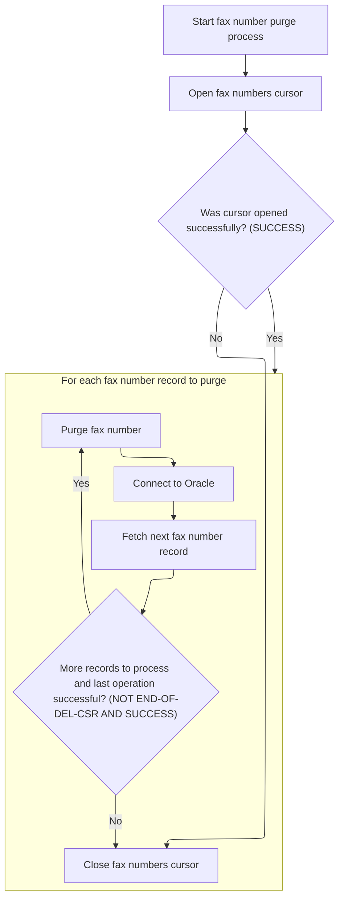
```mermaid
%%{init: {"flowchart": {"defaultRenderer": "elk"}} }%%
flowchart TD
    node1["Start fax number purge process"]
    click node1 openCode "base/src/NNNS0487.cbl:2968:2981"
    node1 --> node2["Open fax numbers cursor"]
    click node2 openCode "base/src/NNNS0487.cbl:2984:3002"
    node2 --> node3{"Was cursor opened successfully? (SUCCESS)"}
    click node3 openCode "base/src/NNNS0487.cbl:2971:2979"
    node3 -->|"Yes"| loop1
    node3 -->|"No"| node6["Close fax numbers cursor"]
    click node6 openCode "base/src/NNNS0487.cbl:3054:3072"
    
    subgraph loop1["For each fax number record to purge"]
        node4["Fetch next fax number record"]
        click node4 openCode "base/src/NNNS0487.cbl:2973:2973"
        node4 --> node5{"More records to process and last operation successful? (NOT END-OF-DEL-CSR AND SUCCESS)"}
        click node5 openCode "base/src/NNNS0487.cbl:2974:2977"
        node5 -->|"Yes"| node7["Purge fax number"]
        click node7 openCode "base/src/NNNS0487.cbl:2975:2975"
        node7 --> node8["Connect to Oracle"]
        click node8 openCode "base/src/NNNS0487.cbl:2976:2976"
        node8 --> node4
        node5 -->|"No"| node6
    end

classDef HeadingStyle fill:#777777,stroke:#333,stroke-width:2px;
```

<SwmSnippet path="/base/src/NNNS0487.cbl" line="2968">

---

`1691-EXIT-PUT-PURGE-FAX-NUM` opens a cursor, loops through all fax records, purges each one, connects to Oracle for cleanup, and finally closes the cursor. Flags control the loop and error handling.

```cobol
304500 1691-EXIT-PUT-PURGE-FAX-NUM.                                     00304500
304600     SET NOT-END-OF-DEL-CSR TO TRUE                               00304600
304700     PERFORM 1692-OPEN-DEL-CSR                                    00304700
304800     IF SUCCESS                                                   00304800
304900       PERFORM UNTIL END-OF-DEL-CSR OR NOT SUCCESS                00304900
305000         PERFORM 1693-FETCH-DEL-CSR                               00305000
305100         IF SUCCESS AND NOT-END-OF-DEL-CSR                        00305100
305200           PERFORM 1694-EXIT-PURGE-FAX-NUM                        00305200
305300           PERFORM 115-CONNECT-TO-ORACLE                          00305300
305400         END-IF                                                   00305400
305500       END-PERFORM                                                00305500
305600     END-IF                                                       00305600
305700     PERFORM 1695-CLOSE-DEL-CSR                                   00305700
305800     .                                                            00305800
```

---

</SwmSnippet>

<SwmSnippet path="/base/src/NNNS0487.cbl" line="2984">

---

`1692-OPEN-DEL-CSR` sets up the location fields in the numbers structure, then opens the cursor for fax records. If the open fails, it sets the failure flag and builds an error message.

```cobol
306100 1692-OPEN-DEL-CSR.                                               00306100
306200     MOVE LOC-TYP-CD                 OF DCLXXXATION               00306200
306300       TO LOC-TYP-CD                 OF DCLXXX-NUMBERS            00306300
306400     MOVE LOC-NBR                    OF DCLXXXATION               00306400
306500       TO LOC-NBR                    OF DCLXXX-NUMBERS            00306500
306600                                                                  00306600
306700     EXEC SQL                                                     00306700
306800       OPEN DEL-CSR                                               00306800
306900     END-EXEC                                                     00306900
307000                                                                  00307000
307100     IF SQLCODE NOT = 0                                           00307100
307200       MOVE SQLCODE TO WS-SQLCODE                                 00307200
307300       SET  FAILURE TO TRUE                                       00307300
307400       MOVE SPACES  TO IS-RTRN-MSG-TXT                            00307400
307500       STRING 'NNNS0487 - ERROR OPENING DEL-CSR, '                00307500
307600              'SQL=' WS-SQLCODE '.'                               00307600
307700              DELIMITED BY SIZE INTO IS-RTRN-MSG-TXT              00307700
307800     END-IF                                                       00307800
307900     .                                                            00307900
```

---

</SwmSnippet>

<SwmSnippet path="/base/src/NNNS0487.cbl" line="3028">

---

`1694-EXIT-PURGE-FAX-NUM` copies fax and location fields to the DAO input structure, sets the purge flag, and calls the DAO to delete the record. It treats 'not found' as success and only errors out for real failures.

```cobol
310500 1694-EXIT-PURGE-FAX-NUM.                                         00310500
310600                                                                  00310600
310700     MOVE FAX-ID             OF DCLXXX-NUMBERS                    00310700
310800       TO FAX-ID             OF P-DDDTFX01                        00310800
310900     MOVE LOC-TYP-CD         OF DCLXXX-NUMBERS                    00310900
311000       TO LOC-TYP-CD         OF P-DDDTFX01                        00311000
311100     MOVE LOC-NBR            OF DCLXXX-NUMBERS                    00311100
311200       TO LOC-NBR            OF P-DDDTFX01                        00311200
311300     SET EXIT-PUT-PURGE-ROW TO TRUE                               00311300
311400     PERFORM 3000-NNNS0483-FAX-DAO                                00311400
311500                                                                  00311500
311600     EVALUATE TRUE                                                00311600
311700       WHEN SQLCODE = 0 OR 100                                    00311700
311800         MOVE 0 TO SQLCODE                                        00311800
311900       WHEN OTHER                                                 00311900
312000         MOVE SQLCODE TO WS-SQLCODE                               00312000
312100         SET FAILURE TO TRUE                                      00312100
312200         MOVE SPACES  TO IS-RTRN-MSG-TXT                          00312200
312300         MOVE SQLCODE TO WS-SQLCODE                               00312300
312400         STRING 'NNNS0487 - ERROR IN DELETE OF FAX'               00312400
312500                'PROD ,RC=' WS-SQLCODE '.'                        00312500
312600                DELIMITED BY SIZE INTO IS-RTRN-MSG-TXT            00312600
312700     END-EVALUATE                                                 00312700
312800     .                                                            00312800
```

---

</SwmSnippet>

<SwmSnippet path="/base/src/NNNS0487.cbl" line="3054">

---

`1695-CLOSE-DEL-CSR` syncs location fields, closes the cursor, and errors out if the close fails. It builds a detailed error message if there's a problem.

```cobol
313100 1695-CLOSE-DEL-CSR.                                              00313100
313200     MOVE LOC-TYP-CD                 OF DCLXXXATION               00313200
313300       TO LOC-TYP-CD                 OF DCLXXX-NUMBERS            00313300
313400     MOVE LOC-NBR                    OF DCLXXXATION               00313400
313500       TO LOC-NBR                    OF DCLXXX-NUMBERS            00313500
313600                                                                  00313600
313700     EXEC SQL                                                     00313700
313800       CLOSE DEL-CSR                                              00313800
313900     END-EXEC                                                     00313900
314000                                                                  00314000
314100     IF SQLCODE NOT = 0                                           00314100
314200       MOVE SQLCODE TO WS-SQLCODE                                 00314200
314300       SET  FAILURE TO TRUE                                       00314300
314400       MOVE SPACES  TO IS-RTRN-MSG-TXT                            00314400
314500       STRING 'NNNS0487 - ERROR CLOSING DEL-CSR, '                00314500
314600              'SQL=' WS-SQLCODE '.'                               00314600
314700              DELIMITED BY SIZE INTO IS-RTRN-MSG-TXT              00314700
314800     END-IF                                                       00314800
314900     .                                                            00314900
```

---

</SwmSnippet>

#### Checking Loan Delete Eligibility

<SwmSnippet path="/base/src/NNNS0487.cbl" line="3353">

---

`4500-CALL-MMMS0304-RI-DEL-CHK` initializes the check structure, copies location fields, sets flags for delete and Oracle, and calls the check routine to see if the loan can be deleted.

```cobol
343000 4500-CALL-MMMS0304-RI-DEL-CHK.                                   00343000
343100     INITIALIZE MMMC0304                                          00343100
343200     MOVE LOC-TYP-CD OF DCLXXXATION    TO                         00343200
343300                                      MMMC0304-LOC-TYP-CD         00343300
343400     MOVE LOC-NBR OF DCLXXXATION      TO                          00343400
343500                                      MMMC0304-LOC-NBR            00343500
343600     SET MMMC0304-DELETE-CHECK TO TRUE                            00343600
343700     SET MMMC0304-XXXATION     TO TRUE                            00343700
343800     SET MMMC0304-ORACLE       TO TRUE                            00343800
343900     CALL MMMS0304-RI-DEL-CHK USING                               00343900
344000          XXXN001A                                                00344000
344100          MMMC0304                                                00344100
344200     .                                                            00344200
```

---

</SwmSnippet>

### Finalizing Location Output and Transaction State

```mermaid
%%{init: {"flowchart": {"defaultRenderer": "elk"}} }%%
flowchart TD
    node1{"Transaction successful? (SUCCESS = 0)"}
    click node1 openCode "base/src/NNNS0487.cbl:1219:1301"
    node1 -->|"Yes"| node2{"Cursor close required? (EXIT-CLOSE-CURSOR = 2)"}
    click node2 openCode "base/src/NNNS0487.cbl:1220:1299"
    node2 -->|"No"| node3["Move data fields"]
    click node3 openCode "base/src/NNNS0487.cbl:1221:1299"
    node3 --> node4["Update checkpoint counter (WS-CHECKPOINT-INC to YYYN005A-CHKPT-CNT)"]
    click node4 openCode "base/src/NNNS0487.cbl:1223:1301"
    node2 -->|"Yes"| node4
    node1 -->|"No"| node8["Do nothing"]
    click node8 openCode "base/src/NNNS0487.cbl:1307:1307"
    node4 --> node5{"Oracle or row operation required? (YYYN005A-ORACLE = 'O' or EXIT-PUT-INSERT-ROW = 9 or EXIT-PUT-PURGE-ROW = 10 or EXIT-PUT-MODIFY-ROW = 8)"}
    click node5 openCode "base/src/NNNS0487.cbl:1302:1305"
    node5 -->|"Yes"| node6["Connect to DB2"]
    click node6 openCode "base/src/NNNS0487.cbl:1304:1305"
    node5 -->|"No"| node7["Move SQLCODE to DB2-SQL-CODE"]
    click node7 openCode "base/src/NNNS0487.cbl:1306:1306"
    node6 --> node7
classDef HeadingStyle fill:#777777,stroke:#333,stroke-width:2px;
```

<SwmSnippet path="/base/src/NNNS0487.cbl" line="1218">

---

120-EXIT-STUFF wraps up the transaction: if the last DB operation was successful and we're not closing the cursor, it moves location/contact data to the output area. It then bumps the checkpoint count, and if we're on Oracle or just did an insert, purge, or modify, it switches the DB connection to DB2. Finally, it copies the SQL result code for error handling downstream.

```cobol
129500 120-EXIT-STUFF.                                                  00129500
129600     IF SUCCESS                                                   00129600
129700       IF NOT EXIT-CLOSE-CURSOR                                   00129700
129800         PERFORM 130-MOVE-DCL-2-PDA-FIELDS                        00129800
129900       END-IF                                                     00129900
130000       ADD WS-CHECKPOINT-INC TO YYYN005A-CHKPT-CNT                00130000
130100     END-IF                                                       00130100
130200     IF (YYYN005A-ORACLE       OR EXIT-PUT-INSERT-ROW             00130200
130300         OR EXIT-PUT-PURGE-ROW OR EXIT-PUT-MODIFY-ROW)            00130300
130400       PERFORM 125-CONNECT-TO-DB2                                 00130400
130500     END-IF                                                       00130500
130600     MOVE SQLCODE TO DB2-SQL-CODE                                 00130600
130700     .                                                            00130700
```

---

</SwmSnippet>

### Transferring and Formatting Location Data

```mermaid
%%{init: {"flowchart": {"defaultRenderer": "elk"}} }%%
flowchart TD
    node1["Transfer all location and contact details from source to destination"]
    click node1 openCode "base/src/NNNS0487.cbl:1245:1457"
    node1 --> node2["Normalize date and time fields"]
    click node2 openCode "base/src/NNNS0487.cbl:1334:1394"
    node2 --> node3{"Are special conditions met for DSD vendor location?"}
    click node3 openCode "base/src/NNNS0487.cbl:1411:1417"
    node3 -->|"Yes"| node4["Connect to DB2 and check location subtype"]
    click node4 openCode "base/src/NNNS0487.cbl:1413:1416"
    node3 -->|"No"| node5["Destination record is ready for business processing"]
    click node5 openCode "base/src/NNNS0487.cbl:1418:1418"
    node4 --> node5
classDef HeadingStyle fill:#777777,stroke:#333,stroke-width:2px;
```

<SwmSnippet path="/base/src/NNNS0487.cbl" line="1245">

---

130-MOVE-DCL-2-PDA-FIELDS copies all location and contact fields from the internal record to the output area, blanks out default dates, edits shipping days, converts timestamps to time if needed, and runs extra DB2 connection and DSD vendor checks for direct-ship locations.

```cobol
132200 130-MOVE-DCL-2-PDA-FIELDS.                                       00132200
132300     MOVE LOC-TYP-CD OF DCLXXXATION TO LOC-TYP-CD OF P-DDDTLO01   00132300
132400     MOVE LOC-NBR OF DCLXXXATION TO LOC-NBR OF P-DDDTLO01         00132400
132500     MOVE LOC-NM OF DCLXXXATION TO LOC-NM OF P-DDDTLO01           00132500
132600     MOVE LOC-ABB OF DCLXXXATION TO LOC-ABB OF P-DDDTLO01         00132600
132700     MOVE LGL-LOC-NAM OF DCLXXXATION TO LGL-LOC-NAM OF P-DDDTLO01 00132700
132800     MOVE PRIM-CONTACT-NM OF DCLXXXATION                          00132800
132900       TO PRIM-CONTACT-NM OF P-DDDTLO01                           00132900
133000     MOVE PRIM-ADR-1 OF DCLXXXATION TO PRIM-ADR-1 OF P-DDDTLO01   00133000
133100     MOVE PRIM-ADR-2 OF DCLXXXATION TO PRIM-ADR-2 OF P-DDDTLO01   00133100
133200     MOVE PRIM-ADR-3 OF DCLXXXATION TO PRIM-ADR-3 OF P-DDDTLO01   00133200
133300     MOVE PRIM-ADR-4 OF DCLXXXATION TO PRIM-ADR-4 OF P-DDDTLO01   00133300
133400     MOVE PRIM-CITY OF DCLXXXATION TO PRIM-CITY OF P-DDDTLO01     00133400
133500     MOVE PRIM-CITY-ID OF DCLXXXATION                             00133500
133600       TO PRIM-CITY-ID OF P-DDDTLO01                              00133600
133700     MOVE PRIM-STATE-CD OF DCLXXXATION                            00133700
133800       TO PRIM-STATE-CD OF P-DDDTLO01                             00133800
133900     MOVE PRIM-ZIP5-CD OF DCLXXXATION                             00133900
134000       TO PRIM-ZIP5-CD OF P-DDDTLO01                              00134000
134100     MOVE PRIM-ZIP4-CD OF DCLXXXATION                             00134100
134200       TO PRIM-ZIP4-CD OF P-DDDTLO01                              00134200
134300     MOVE PRIM-PHN-CNTRY-CD OF DCLXXXATION                        00134300
134400       TO PRIM-PHN-CNTRY-CD OF P-DDDTLO01                         00134400
134500     MOVE PRIM-AREA-CD OF DCLXXXATION                             00134500
134600       TO PRIM-AREA-CD OF P-DDDTLO01                              00134600
134700     MOVE PRIM-PHONE-NBR OF DCLXXXATION                           00134700
134800       TO PRIM-PHONE-NBR OF P-DDDTLO01                            00134800
134900     MOVE PRIM-CNTRY-NM OF DCLXXXATION                            00134900
135000       TO PRIM-CNTRY-NM OF P-DDDTLO01                             00135000
135100     MOVE PRIM-CNTRY-ABB OF DCLXXXATION                           00135100
135200       TO PRIM-CNTRY-ABB OF P-DDDTLO01                            00135200
135300     MOVE SEC-LOC-NM OF DCLXXXATION TO SEC-LOC-NM OF P-DDDTLO01   00135300
135400     MOVE SEC-CONTACT-NM OF DCLXXXATION                           00135400
135500       TO SEC-CONTACT-NM OF P-DDDTLO01                            00135500
135600     MOVE SEC-ADR-1 OF DCLXXXATION TO SEC-ADR-1 OF P-DDDTLO01     00135600
135700     MOVE SEC-ADR-2 OF DCLXXXATION TO SEC-ADR-2 OF P-DDDTLO01     00135700
135800     MOVE SEC-ADR-3 OF DCLXXXATION TO SEC-ADR-3 OF P-DDDTLO01     00135800
135900     MOVE SEC-ADR-4 OF DCLXXXATION TO SEC-ADR-4 OF P-DDDTLO01     00135900
136000     MOVE SEC-CITY OF DCLXXXATION TO SEC-CITY OF P-DDDTLO01       00136000
136100     MOVE SEC-STATE-CD OF DCLXXXATION                             00136100
136200       TO SEC-STATE-CD OF P-DDDTLO01                              00136200
136300     MOVE SEC-ZIP5-CD OF DCLXXXATION TO SEC-ZIP5-CD OF P-DDDTLO01 00136300
136400     MOVE SEC-ZIP4-CD OF DCLXXXATION TO SEC-ZIP4-CD OF P-DDDTLO01 00136400
136500     MOVE SEC-PHN-CNTRY-CD OF DCLXXXATION                         00136500
136600       TO SEC-PHN-CNTRY-CD OF P-DDDTLO01                          00136600
136700     MOVE SEC-AREA-CD OF DCLXXXATION TO SEC-AREA-CD OF P-DDDTLO01 00136700
136800     MOVE SEC-PHONE-NBR OF DCLXXXATION                            00136800
136900       TO SEC-PHONE-NBR OF P-DDDTLO01                             00136900
137000     MOVE SEC-CNTRY-NM OF DCLXXXATION                             00137000
137100       TO SEC-CNTRY-NM OF P-DDDTLO01                              00137100
137200     MOVE SEC-CNTRY-ABB OF DCLXXXATION                            00137200
137300       TO SEC-CNTRY-ABB OF P-DDDTLO01                             00137300
137400     MOVE MAIL-TO-LOC-NM OF DCLXXXATION                           00137400
137500       TO MAIL-TO-LOC-NM OF P-DDDTLO01                            00137500
137600     MOVE MAIL-TO-CNTCT-NM OF DCLXXXATION                         00137600
137700       TO MAIL-TO-CNTCT-NM OF P-DDDTLO01                          00137700
137800     MOVE MAIL-TO-ADR-1 OF DCLXXXATION                            00137800
137900       TO MAIL-TO-ADR-1 OF P-DDDTLO01                             00137900
138000     MOVE MAIL-TO-ADR-2 OF DCLXXXATION                            00138000
138100       TO MAIL-TO-ADR-2 OF P-DDDTLO01                             00138100
138200     MOVE MAIL-TO-ADR-3 OF DCLXXXATION                            00138200
138300       TO MAIL-TO-ADR-3 OF P-DDDTLO01                             00138300
138400     MOVE MAIL-TO-ADR-4 OF DCLXXXATION                            00138400
138500       TO MAIL-TO-ADR-4 OF P-DDDTLO01                             00138500
138600     MOVE MAIL-TO-CITY OF DCLXXXATION                             00138600
138700       TO MAIL-TO-CITY OF P-DDDTLO01                              00138700
138800     MOVE MAIL-TO-STATE-CD OF DCLXXXATION                         00138800
138900       TO MAIL-TO-STATE-CD OF P-DDDTLO01                          00138900
139000     MOVE MAIL-TO-ZIP5-CD OF DCLXXXATION                          00139000
139100       TO MAIL-TO-ZIP5-CD OF P-DDDTLO01                           00139100
139200     MOVE MAIL-TO-ZIP4-CD OF DCLXXXATION                          00139200
139300       TO MAIL-TO-ZIP4-CD OF P-DDDTLO01                           00139300
139400     MOVE MAIL-PHN-CNTRY-CD OF DCLXXXATION                        00139400
139500       TO MAIL-PHN-CNTRY-CD OF P-DDDTLO01                         00139500
139600     MOVE MAIL-TO-AREA-CD OF DCLXXXATION                          00139600
139700       TO MAIL-TO-AREA-CD OF P-DDDTLO01                           00139700
139800     MOVE MAIL-TO-PHONE-NBR OF DCLXXXATION                        00139800
139900       TO MAIL-TO-PHONE-NBR OF P-DDDTLO01                         00139900
140000     MOVE MAIL-TO-CNTRY-NM OF DCLXXXATION                         00140000
140100       TO MAIL-TO-CNTRY-NM OF P-DDDTLO01                          00140100
140200     MOVE MAIL-TO-CNTRY-AB OF DCLXXXATION                         00140200
140300       TO MAIL-TO-CNTRY-AB OF P-DDDTLO01                          00140300
140400     MOVE CURR-FAX-ID OF DCLXXXATION TO CURR-FAX-ID OF P-DDDTLO01 00140400
140500                                                                  00140500
140600     MOVE ADDED-DT OF DCLXXXATION TO ADDED-DT OF P-DDDTLO01       00140600
140700     MOVE DELETE-DT OF DCLXXXATION TO DELETE-DT OF P-DDDTLO01     00140700
140800     MOVE OPENED-DT OF DCLXXXATION TO OPENED-DT OF P-DDDTLO01     00140800
140900     MOVE CLOSED-DT OF DCLXXXATION TO CLOSED-DT OF P-DDDTLO01     00140900
141000     MOVE INACTIVE-DT OF DCLXXXATION TO INACTIVE-DT OF P-DDDTLO01 00141000
141100     IF ADDED-DT OF P-DDDTLO01 = K-DEF-DT                         00141100
141200       MOVE SPACES TO ADDED-DT OF P-DDDTLO01                      00141200
141300     END-IF                                                       00141300
141400     IF DELETE-DT OF P-DDDTLO01 = K-DEF-DT                        00141400
141500       MOVE SPACES TO DELETE-DT OF P-DDDTLO01                     00141500
141600     END-IF                                                       00141600
141700     IF OPENED-DT OF P-DDDTLO01 = K-DEF-DT                        00141700
141800       MOVE SPACES TO OPENED-DT OF P-DDDTLO01                     00141800
141900     END-IF                                                       00141900
142000     IF CLOSED-DT OF P-DDDTLO01 = K-DEF-DT                        00142000
142100       MOVE SPACES TO CLOSED-DT OF P-DDDTLO01                     00142100
142200     END-IF                                                       00142200
142300     IF INACTIVE-DT OF P-DDDTLO01 = K-DEF-DT                      00142300
142400       MOVE SPACES TO INACTIVE-DT OF P-DDDTLO01                   00142400
142500     END-IF                                                       00142500
142600                                                                  00142600
142700     MOVE INACTIVE-SW OF DCLXXXATION TO INACTIVE-SW OF P-DDDTLO01 00142700
142800     MOVE AP-NBR OF DCLXXXATION TO AP-NBR OF P-DDDTLO01           00142800
142900     MOVE AP-TYP-CD OF DCLXXXATION TO AP-TYP-CD OF P-DDDTLO01     00142900
143000                                                                  00143000
143100     MOVE LST-UPDT-TS OF DCLXXXATION TO LST-UPDT-TS OF P-DDDTLO01 00143100
143200     MOVE LST-UPDT-USR-ID OF DCLXXXATION                          00143200
143300       TO LST-UPDT-USR-ID OF P-DDDTLO01                           00143300
143400     MOVE PRIM-EMAIL-ID    OF DCLXXXATION                         00143400
143500       TO PRIM-EMAIL-ID    OF P-DDDTLO01                          00143500
143600     MOVE SECY-EMAIL-ID    OF DCLXXXATION                         00143600
143700       TO SECY-EMAIL-ID    OF P-DDDTLO01                          00143700
143800     MOVE MAIL-TO-EMAIL-ID OF DCLXXXATION                         00143800
143900       TO MAIL-TO-EMAIL-ID OF P-DDDTLO01                          00143900
144000     MOVE FAC-ID           OF DCLXXXATION                         00144000
144100       TO FAC-ID           OF P-DDDTLO01                          00144100
144200     MOVE ORG-ID           OF DCLXXXATION                         00144200
144300       TO ORG-ID           OF P-DDDTLO01                          00144300
144400     MOVE B2B-PRIM-RTNG-ID OF DCLXXXATION                         00144400
144500       TO B2B-PRIM-RTNG-ID OF P-DDDTLO01                          00144500
144600     MOVE PRIM-CNTY-TXT    OF DCLXXXATION                         00144600
144700       TO PRIM-CNTY-TXT    OF P-DDDTLO01                          00144700
144800     MOVE SECY-CNTY-TXT    OF DCLXXXATION                         00144800
144900       TO SECY-CNTY-TXT    OF P-DDDTLO01                          00144900
145000     MOVE MAIL-TO-CNTY-TXT OF DCLXXXATION                         00145000
145100       TO MAIL-TO-CNTY-TXT OF P-DDDTLO01                          00145100
145200                                                                  00145200
145300     MOVE DIR-SHP-LOC-SW   OF DCLXXXATION                         00145300
145400       TO DIR-SHP-LOC-SW   OF P-DDDTLO01                          00145400
145500     IF NOT LOC-IS-DIRECT-SHIP OF P-DDDTLO01                      00145500
145600       SET LOC-IS-NOT-DIRECT-SHIP OF P-DDDTLO01 TO TRUE           00145600
145700     END-IF                                                       00145700
145800                                                                  00145800
145900     MOVE LOC-ORD-PROCNG-DD  OF DCLXXXATION                       00145900
146000       TO LOC-ORD-PROCNG-DD  OF P-DDDTLO01                        00146000
146100                                                                  00146100
146200*    MOVE WS-CURRENT-DATE-DATA                                    00146200
146300*      TO WS-CURRENT-DATE-DATA1                                   00146300
146400*    MOVE WS-CURRENT-TIME  OF   WS-CURRENT-DATE-DATA1             00146400
146500*      TO ORD-PROCNG-CTOF-TM OF P-DDDTLO01                        00146500
146600*     MOVE ORD-PROCNG-CTOF-TM OF DCLXXXATION                      00146600
146700*       TO ORD-PROCNG-CTOF-TM OF P-DDDTLO01                       00146700
146800                                                                  00146800
146900     IF ORD-PROCNG-CTOF-TM OF P-DDDTLO01 = WS-NULL-TM             00146900
147000       MOVE SPACES TO ORD-PROCNG-CTOF-TM OF P-DDDTLO01            00147000
147100     END-IF                                                       00147100
147200                                                                  00147200
147300     MOVE SCH-SHP-DD-TXT     OF DCLXXXATION                       00147300
147400       TO SCH-SHP-DD-TXT     OF P-DDDTLO01                        00147400
147500     PERFORM 116-EDIT-SHIP-DAYS                                   00147500
147600     MOVE ORD-LEAD-TM-DD     OF DCLXXXATION                       00147600
147700       TO ORD-LEAD-TM-DD     OF P-DDDTLO01                        00147700
147800                                                                  00147800
147900     MOVE ORD-BUFFER-TM-DD   OF DCLXXXATION                       00147900
148000       TO ORD-BUFFER-TM-DD   OF P-DDDTLO01                        00148000
148100                                                                  00148100
148200     PERFORM 132-CONVERT-TS-TO-TM                                 00148200
148300     IF SUCCESS                                                   00148300
148400       MOVE ORD-PROCNG-CTOF-TM OF DCLXXXATION                     00148400
148500         TO ORD-PROCNG-CTOF-TM OF P-DDDTLO01                      00148500
148600     END-IF                                                       00148600
148700                                                                  00148700
148800     IF LOC-TYP-CD OF DCLXXXATION = K-DSD-VEND-LOC-TYPE           00148800
148900     AND SUCCESS AND YYYN005A-CICS-ENV                            00148900
149000       PERFORM 125-CONNECT-TO-DB2                                 00149000
149100       IF SUCCESS                                                 00149100
149200          PERFORM 10200-CHECK-DSV-LOC-SUB-TYP                     00149200
149300       END-IF                                                     00149300
149400     END-IF                                                       00149400
149500     .                                                            00149500
```

---

</SwmSnippet>

<SwmSnippet path="/base/src/NNNS0487.cbl" line="1421">

---

132-CONVERT-TS-TO-TM checks if we're on Oracle or just did a modify/insert, then sets up conversion arrays and calls MMMS0291 to convert timestamps to time. If the call works, it moves the results back to the main record.

```cobol
149800 132-CONVERT-TS-TO-TM.                                            00149800
149900     IF (YYYN005A-ORACLE OR EXIT-PUT-MODIFY-ROW                   00149900
150000         OR EXIT-PUT-INSERT-ROW)                                  00150000
150100       INITIALIZE MMMC0291-INPUT-TM                               00150100
150200                  MMMC0291-INPUT-TS                               00150200
150300                                                                  00150300
150400       MOVE WS-ORD-PROCNG-CTOF-TM                                 00150400
150500         TO WS-TIMSTAMP-INOUT-CONV(1)                             00150500
150600       MOVE WS-FILLER1-TS                                         00150600
150700         TO WS-TIMSTAMP-INOUT-CONV(2)                             00150700
150800       MOVE WS-FILLER2-TS                                         00150800
150900         TO WS-TIMSTAMP-INOUT-CONV(3)                             00150900
151000                                                                  00151000
151100       SET MMMC0291-CVT-TS-TO-TM  TO TRUE                         00151100
151200       CALL WS-MMMS0291-PGM USING                                 00151200
151300                          XXXN001A                                00151300
151400                          MMMC0291                                00151400
151500       IF SUCCESS                                                 00151500
151600         MOVE WS-TIME-INOUT-CONV(1)                               00151600
151700           TO ORD-PROCNG-CTOF-TM OF DCLXXXATION                   00151700
151800         MOVE WS-TIMSTAMP-INOUT-CONV(2)                           00151800
151900           TO FILLER1-TM OF DCLXXXATION                           00151900
152000         MOVE WS-TIMSTAMP-INOUT-CONV(3)                           00152000
152100           TO FILLER2-TM OF DCLXXXATION                           00152100
152200       END-IF                                                     00152200
152300     END-IF                                                       00152300
152400     .                                                            00152400
```

---

</SwmSnippet>

### Validating Direct Store Vendor Type

```mermaid
%%{init: {"flowchart": {"defaultRenderer": "elk"}} }%%
flowchart TD
    node1["Set vendor as NOT DSV by default"]
    click node1 openCode "base/src/NNNS0487.cbl:3440:3440"
    node1 --> node2["Set location number and type for DSV check"]
    click node2 openCode "base/src/NNNS0487.cbl:3438:3439"
    node2 --> node3["Check if location is DSV vendor"]
    click node3 openCode "base/src/NNNS0487.cbl:3443:3445"
    node3 --> node4{"DSV check successful and vendor is DSV?"}
    click node4 openCode "base/src/NNNS0487.cbl:3446:3447"
    node4 -->|"Yes"| node5["Mark vendor as DSV"]
    click node5 openCode "base/src/NNNS0487.cbl:3447:3448"
    node4 -->|"No"| node6["End"]
    click node6 openCode "base/src/NNNS0487.cbl:3449:3449"
classDef HeadingStyle fill:#777777,stroke:#333,stroke-width:2px;
```

<SwmSnippet path="/base/src/NNNS0487.cbl" line="3437">

---

10200-CHECK-DSV-LOC-SUB-TYP sets up vendor info, flags the function type, and calls MMMS0711 to check if the vendor is DSV. If the check passes, it sets the DSV flag for downstream logic.

```cobol
351400 10200-CHECK-DSV-LOC-SUB-TYP.                                     00351400
351500     MOVE LOC-NBR    OF DCLXXXATION TO MMMC0711-I-VEND-NBR        00351500
351600     MOVE LOC-TYP-CD OF DCLXXXATION TO MMMC0711-I-VEND-TYP-CD     00351600
351700     SET VEND-IS-NOT-DSV            TO TRUE                       00351700
351800     SET MMMC0711-IS-DSV-FUNC       TO TRUE                       00351800
351900                                                                  00351900
352000     CALL MMMS0711-DSV-CHECK USING                                00352000
352100          XXXN001A                                                00352100
352200          MMMC0711                                                00352200
352300     IF SUCCESS AND VEND-IS-DSV                                   00352300
352400        SET IS-DSV-VEND TO TRUE                                   00352400
352500     END-IF                                                       00352500
352600     .                                                            00352600
```

---

</SwmSnippet>

### Dispatching DSV Vendor and Entity Checks

```mermaid
%%{init: {"flowchart": {"defaultRenderer": "elk"}} }%%
flowchart TD
    node1["Prepare for requested operation"] --> node2{"What type of operation is requested?"}
    click node1 openCode "base/src/MMMS0711.cbl:71:71"
    node2 -->|"Vendor DSV ('DSV ')"| node3["Validate vendor as DSV"]
    click node2 openCode "base/src/MMMS0711.cbl:73:74"
    node2 -->|"Entity DSV ('DSVI')"| node4["Validate entity as DSV"]
    click node3 openCode "base/src/MMMS0711.cbl:75:75"
    click node4 openCode "base/src/MMMS0711.cbl:77:77"
    node2 -->|"Other"| node5["Mark as failure (FAILURE = 1) and set error message: 'ZZZS0033 - Invalid MMMC0711-FUNC passed.'"]
    click node5 openCode "base/src/MMMS0711.cbl:79:81"
    node3 --> node6["Return to caller"]
    node4 --> node6
    node5 --> node6
    click node6 openCode "base/src/MMMS0711.cbl:88:88"

classDef HeadingStyle fill:#777777,stroke:#333,stroke-width:2px;
```

<SwmSnippet path="/base/src/MMMS0711.cbl" line="70">

---

000-MAIN initializes the input, then branches to either vendor or entity DSV check based on the function type. If the type is invalid, it sets failure and an error message. DB2 connection logic is present but commented out.

```cobol
008200 000-MAIN.                                                        00008400
008300     PERFORM 100-INITIALIZE                                       00008500
008400                                                                  00008600
008500     EVALUATE TRUE                                                00008700
008600       WHEN MMMC0711-IS-DSV-FUNC                                  00008800
008700         PERFORM 200-CHECK-VEND-IS-DSV                            00008900
008800       WHEN MMMC0711-IS-DSV-ITEM-FUNC                             00009000
008900         PERFORM 300-CHECK-ENTY-IS-DSV                            00009100
009000       WHEN OTHER                                                 00009200
009100         SET FAILURE TO TRUE                                      00009300
009200         MOVE 'ZZZS0033 - Invalid MMMC0711-FUNC passed.'          00009400
009300           TO IS-RTRN-MSG-TXT                                     00009500
009400     END-EVALUATE                                                 00009600
009500                                                                  00009700
009600                                                                  00009800
009700*    IF YYYN005A-ORACLE                                           00009900
009800*      PERFORM 125-CONNECT-TO-DB2                                 00010000
009900*    END-IF                                                       00010100
010000     GOBACK                                                       00010200
010100     .                                                            00010300
```

---

</SwmSnippet>

### Validating DSV Input and Connecting to DB2

```mermaid
%%{init: {"flowchart": {"defaultRenderer": "elk"}} }%%
flowchart TD
    node1["Set entity and vendor status flags: 'not DSV', 'exists'"]
    click node1 openCode "base/src/MMMS0711.cbl:99:101"
    node1 --> node2{"Is vendor type code 'D'?"}
    click node2 openCode "base/src/MMMS0711.cbl:103:105"
    node2 -->|"No"| node3["Set vendor type code to 'D'"]
    click node3 openCode "base/src/MMMS0711.cbl:104:105"
    node2 -->|"Yes"| node4["Proceed to validation"]
    node3 --> node4
    click node4 openCode "base/src/MMMS0711.cbl:107:130"
    node4 --> node5{"Which function is being performed?"}
    click node5 openCode "base/src/MMMS0711.cbl:111:129"
    node5 -->|"DSV vendor"| node6{"Is vendor number 0 or type missing?"}
    node5 -->|"DSVI item"| node7{"Is entity ID 0 or type missing?"}
    node5 -->|"Other"| node8["Set FAILURE and error message: Invalid entity type"]
    click node8 openCode "base/src/MMMS0711.cbl:127:129"
    node6 -->|"Yes"| node9["Set FAILURE and error message: Invalid vendor number or type"]
    click node9 openCode "base/src/MMMS0711.cbl:114:116"
    node6 -->|"No"| node10["Validation successful"]
    click node10 openCode "base/src/MMMS0711.cbl:109:110"
    node7 -->|"Yes"| node11["Set FAILURE and error message: Invalid entity id/type"]
    click node11 openCode "base/src/MMMS0711.cbl:121:123"
    node7 -->|"No"| node10
    node10 --> node12{"Is validation successful?"}
    node9 --> node12
    node11 --> node12
    node8 --> node12
    click node12 openCode "base/src/MMMS0711.cbl:131:140"
    node12 -->|"Yes"| node13["Connect to DB2"]
    click node13 openCode "base/src/MMMS0711.cbl:163:166"
    node12 -->|"No"| node14["End with failure"]
    click node14 openCode "base/src/MMMS0711.cbl:127:129"
classDef HeadingStyle fill:#777777,stroke:#333,stroke-width:2px;
```

<SwmSnippet path="/base/src/MMMS0711.cbl" line="95">

---

100-INITIALIZE sets up the input, forces vendor type to 'D' if needed, and validates vendor/entity fields based on the function type. If anything's missing, it sets failure and an error message. DB2 connection logic is present but commented out.

```cobol
010700 100-INITIALIZE.                                                  00010900
010701*    DISPLAY 'IM IN MMMS0711'                                     00011000
010800     INITIALIZE XXXN001A                                          00011100
010900                MMMC0711-OUTPUTS                                  00011200
011000     SET ENTY-IS-NOT-DSV TO TRUE                                  00011300
011100     SET VEND-IS-NOT-DSV TO TRUE                                  00011400
011200     SET ENTY-EXISTS     TO TRUE                                  00011500
011300                                                                  00011600
011400     IF  MMMC0711-I-VEND-TYP-CD NOT EQUAL 'D'                     00011700
011500       MOVE 'D' TO MMMC0711-I-VEND-TYP-CD                         00011800
011600     END-IF                                                       00011900
011700                                                                  00012000
011800     EVALUATE TRUE                                                00012100
011900       WHEN SUCCESS                                               00012200
012000         CONTINUE                                                 00012300
012100                                                                  00012400
012200       WHEN MMMC0711-IS-DSV-FUNC                                  00012500
012300        AND ( MMMC0711-I-VEND-NBR = 0                             00012600
012400         OR   MMMC0711-I-VEND-TYP-CD = SPACES)                    00012700
012500         SET  FAILURE TO TRUE                                     00012800
012600         MOVE 'MMMS0711 - Invalid Vendor Number or Type!'         00012900
012700           TO IS-RTRN-MSG-TXT                                     00013000
012800                                                                  00013100
012900       WHEN MMMC0711-IS-DSV-ITEM-FUNC                             00013200
013000        AND ( MMMC0711-I-ENTY-ID  = 0                             00013300
013100         OR   MMMC0711-I-ENTY-TYP = SPACES)                       00013400
013200         SET  FAILURE TO TRUE                                     00013500
013300         MOVE 'MMMS0711 - Invalid Enty id/Enty Type!'             00013600
013400           TO IS-RTRN-MSG-TXT                                     00013700
013500                                                                  00013800
013600                                                                  00013900
013700       WHEN OTHER                                                 00014000
013800         SET  FAILURE TO TRUE                                     00014100
013900         MOVE 'MMMS0711 - Invalid Entity type!'                   00014200
014000           TO IS-RTRN-MSG-TXT                                     00014300
014100     END-EVALUATE                                                 00014400
014200     IF SUCCESS                                                   00014500
014300*       PERFORM 900-GET-TASK                                      00014600
014400*       IF SUCCESS AND WWWC0099-ORACLE                            00014700
014500*          SET YYYN005A-ORACLE  TO TRUE                           00014800
014600*          PERFORM 115-CONNECT-TO-ORACLE                          00014900
014700*       END-IF                                                    00015000
 14400*       IF SUCCESS                                                00015100
014600           PERFORM 125-CONNECT-TO-DB2                             00015200
014700*       END-IF                                                    00015300
014800     END-IF                                                       00015400
014900     .                                                            00015500
```

---

</SwmSnippet>

<SwmSnippet path="/base/src/MMMS0711.cbl" line="163">

---

125-CONNECT-TO-DB2 just calls the DB2 connection routine, passing the main transaction and SQL context. All the connection logic is handled in YYYS0211, so this stays clean and modular.

```cobol
017100 125-CONNECT-TO-DB2.                                              00017700
017200     CALL Z-DB2-CONNECT         USING XXXN001A                    00017800
017300                                      SQLCA                       00017900
017400     .                                                            00018000
```

---

</SwmSnippet>

### Handling Location Retrieval Results

```mermaid
%%{init: {"flowchart": {"defaultRenderer": "elk"}} }%%
flowchart TD
    node1{"What is the result of the store lookup?"}
    click node1 openCode "base/src/WWWS0003.cbl:839:853"
    node1 -->|"SQLCODE = 0"| node2["Store found, proceed"]
    click node2 openCode "base/src/WWWS0003.cbl:840:841"
    node1 -->|"SQLCODE = 100"| node3["Store not found, set FAILURE and message: 'Store <number> not found'"]
    click node3 openCode "base/src/WWWS0003.cbl:842:847"
    node1 -->|"Other error"| node4["Handle DB error, set error message: 'Failed on XXXATION table(LO),SQL=<code>'"]
    click node4 openCode "base/src/WWWS0003.cbl:848:852"
    node2 --> node5["Finalize exit code"]
    node3 --> node5
    node4 --> node5
    node5["Finalize exit code"]
    click node5 openCode "base/src/WWWS0003.cbl:854:854"
classDef HeadingStyle fill:#777777,stroke:#333,stroke-width:2px;
```

<SwmSnippet path="/base/src/WWWS0003.cbl" line="839">

---

Back in 2200-GET-LO, after returning from 2100-CALL-LO-DAO, we check SQLCODE: 0 means all good, 100 means not found (so we set a message and failure), anything else triggers the DB2 error handler and builds a detailed error message. Finally, we copy the exit codes for downstream use.

```cobol
086500     EVALUATE TRUE                                                00086500
086600       WHEN SQLCODE = 0                                           00086600
086700         CONTINUE                                                 00086700
086800       WHEN SQLCODE = 100                                         00086800
086900         MOVE SPACES TO IS-RTRN-MSG-TXT                           00086900
087000         SET  FAILURE TO TRUE                                     00087000
087100         STRING 'WWWS0003 - Store '  ST-STORE-NUMBER              00087100
087200                ' not found in XXXATION table.'                   00087200
087300                DELIMITED BY SIZE INTO IS-RTRN-MSG-TXT            00087300
087400       WHEN OTHER                                                 00087400
087500         PERFORM 9999-SETUP-DB2-ERROR                             00087500
087600         STRING 'WWWS0003 - Failed on XXXATION table(LO),SQL='    00087600
087700                 WS-SQLCODE                                       00087700
087800                 DELIMITED BY SIZE INTO IS-RTRN-MSG-TXT           00087800
087900     END-EVALUATE                                                 00087900
088000     MOVE WS-NNNN0000-EXIT-CODES TO NNNN0000-EXIT-CODES           00088000
088100     .                                                            00088100
```

---

</SwmSnippet>

&nbsp;

*This is an auto-generated document by Swimm 🌊 and has not yet been verified by a human*

<SwmMeta version="3.0.0" repo-id="Z2l0aHViJTNBJTNBU3dpbW1pby1keW5jYWxsLWRlbW8lM0ElM0FHaXJpLVN3aW1t" repo-name="Swimmio-dyncall-demo"><sup>Powered by [Swimm](https://app.swimm.io/)</sup></SwmMeta>
