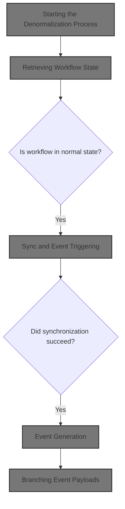
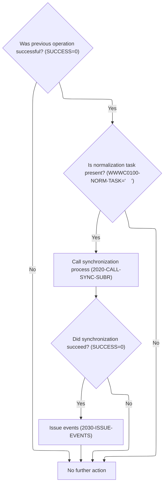
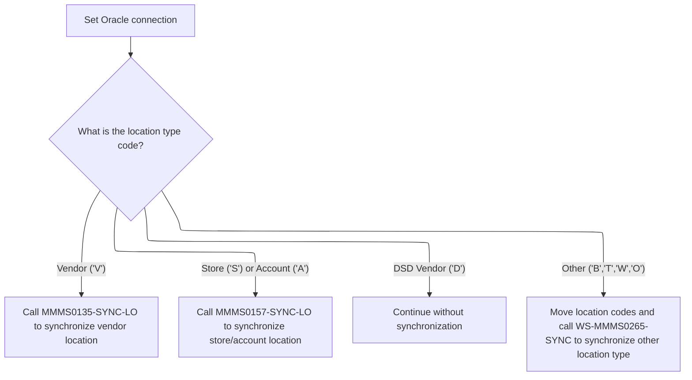
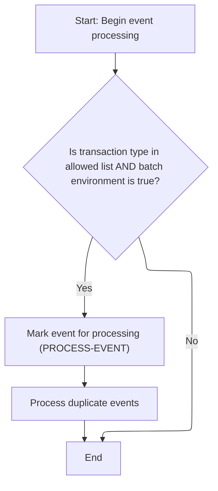
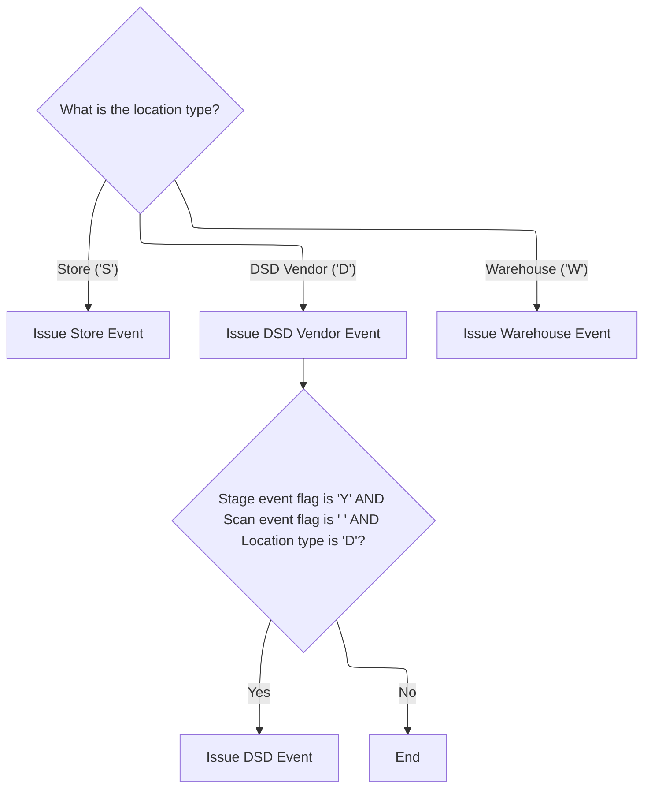

This document describes how location data updates are managed and business events are generated. The flow starts by retrieving the workflow context for a user or task, then synchronizes location data according to its type. If synchronization succeeds, the system generates and issues business events, filtering out invalid or duplicate events before final issuance.



# Spec

## Detailed View of the Program's Functionality

# a. Starting the Denormalization Process

The denormalization process begins by incrementing a checkpoint counter and synchronizing a system environment variable. This setup ensures that the process can be tracked and that the environment is consistent for downstream operations. Immediately after, the process retrieves the current workflow state for the user or task by invoking a control subroutine. This retrieval is essential because subsequent logic—such as synchronization and event handling—depends on the current workflow context.

# b. Retrieving Workflow State

To fetch the workflow state, the process prepares a control structure by setting a function code indicating a "get" operation. It then calls a master data control program, which is responsible for either retrieving or updating the workflow task data. The master data control program initializes its internal state and uses a conditional structure to determine whether to set or get the workflow task data. Only "set" and "get" operations are handled; other function codes are ignored. When retrieving, the program moves the saved workflow state into the structure used by the rest of the process.

# c. Sync and Event Triggering

After obtaining the workflow state, the process checks if the previous operation was successful and if the current task is a normalization task. If both conditions are met, it proceeds to synchronize location data downstream. This synchronization prepares the data for event generation. If the synchronization also succeeds, the process moves on to issue events. If any of these checks fail, no further action is taken.

# d. Routing Location Syncs

The synchronization subroutine first sets a flag indicating that the Oracle database should be used. It then examines the type of location being processed and branches accordingly:

- If the location is a vendor, it marks the vendor location as current and calls a routine to synchronize vendor location data.
- If the location is a store or account, it marks the store/account location as current and calls a routine to synchronize store/account location data.
- If the location is a DSD vendor, it does nothing (the code for this is present but commented out, indicating it may be for future use).
- For other location types (such as backhaul, terminal, warehouse, or other), it sets a level flag, copies the location type and number into a generic structure, and calls a generic synchronization routine.

If the location type does not match any of these, no action is taken.

# e. Event Generation

When issuing events, the process initializes the event data structure and sets the Oracle flag. It then determines whether the operation is a delete or a normal event, setting the appropriate event type flag. The process copies all relevant fields into the event payload structures to ensure the event manager receives all necessary information.

Depending on the location type, the process may send multiple event payloads:

- For vendor locations, it sends two different event payloads by calling the event manager twice with different data.
- For store locations, it prepares and sends both a customer event and a store event.
- For DSD vendor locations, it prepares and sends a DSD vendor event.
- For warehouse locations, it prepares and sends a warehouse event.

At the end of the event generation process, if both the stage event and scan event flags are set and the location type is DSD vendor, it sends a scan event. This ensures that scan events are only sent when truly needed.

# f. Event Manager Mainline

The event manager initializes its state and then filters out events for most transaction types, only issuing the event if it is not a duplicate or filtered out. A flag controls whether the event is actually sent. The event manager uses a hardcoded list of transaction types to filter out events in batch mode. If the event passes these filters, it checks for duplicates by comparing the current event's data with previously sent events. If the event is not a duplicate and not filtered, it is marked for processing.

# g. Event Filtering

The event filtering logic first applies hardcoded rules to exclude certain transaction types in batch mode. If the event is not filtered out, it checks for duplicates by comparing the current event's data and transaction type with those of previously sent events. If a duplicate is found, the event is filtered out. Otherwise, the event is added to the list of processed events.

# h. Branching Event Payloads

Depending on the location type, the process prepares and sends different event payloads:

- For store locations, it sends both a customer event and a store event.
- For DSD vendor locations, it sends a DSD vendor event.
- For warehouse locations, it sends a warehouse event.

For DSD vendor types, if both the stage event and scan event flags are set, and the location type is DSD vendor, a scan event is also sent. This branching ensures that the correct event payloads are generated and sent based on the specific type of location being processed.

# Rule Definition

| Paragraph Name                               | Rule ID | Category          | Description                                                                                                                                                                                                                                                                                                                                                                                                      | Conditions                                                                   | Remarks                                                                                                                                                                                                                               |
| -------------------------------------------- | ------- | ----------------- | ---------------------------------------------------------------------------------------------------------------------------------------------------------------------------------------------------------------------------------------------------------------------------------------------------------------------------------------------------------------------------------------------------------------- | ---------------------------------------------------------------------------- | ------------------------------------------------------------------------------------------------------------------------------------------------------------------------------------------------------------------------------------- |
| 2000-DENORM-PROCESS, 100-INITIALIZATION      | RL-001  | Computation       | At the start of the denormalization process, the system must increment the checkpoint counter and synchronize the system environment variable.                                                                                                                                                                                                                                                                   | Denormalization process is starting.                                         | Checkpoint is incremented by 1. System environment variable is copied from the current environment context. No specific output format.                                                                                                |
| 2010-CALL-CONTROL-SUBR, 000-MAIN in WWWS0100 | RL-002  | Conditional Logic | Before any synchronization or event logic, the workflow state for the current user/task must be retrieved using the workflow state structure and the 'GET ' function code.                                                                                                                                                                                                                                       | Before performing sync or event logic in the denormalization process.        | Workflow state structure is used. Function code must be 'GET '. Only 'SET ' and 'GET ' are supported for workflow state operations.                                                                                                   |
| 000-MAIN in WWWS0100                         | RL-003  | Conditional Logic | Only workflow function codes 'SET ' and 'GET ' are supported for workflow state operations.                                                                                                                                                                                                                                                                                                                      | When performing workflow state operations.                                   | Function codes: 'SET ', 'GET '. Any other code is ignored or causes no operation.                                                                                                                                                     |
| 2000-DENORM-PROCESS                          | RL-004  | Conditional Logic | The denormalization process must only continue if the previous operation was successful (SUCCESS flag is true) and the normalization task flag is present.                                                                                                                                                                                                                                                       | After workflow state retrieval and before synchronization.                   | SUCCESS flag must be true. Normalization task flag must be present (true).                                                                                                                                                            |
| 2020-CALL-SYNC-SUBR                          | RL-005  | Conditional Logic | The synchronization process must branch based on the location type code as follows: If 'V' (Vendor), synchronize vendor location data. If 'S' (Store) or 'A' (Account), synchronize store/account location data. If 'D' (DSD Vendor), do not synchronize location data. If 'B', 'T', 'W', or 'O', synchronize other location types using the generic sync routine.                                               | During synchronization step after denormalization preconditions are met.     | Location type codes: 'V', 'S', 'A', 'D', 'W', 'B', 'T', 'O'. Each code triggers a different sync routine or skips sync for 'D'.                                                                                                       |
| 2030-ISSUE-EVENTS                            | RL-006  | Conditional Logic | After synchronization, if the sync succeeded (SUCCESS flag is true), the system must prepare and issue events using the event payload structure.                                                                                                                                                                                                                                                                 | After successful synchronization (SUCCESS flag is true).                     | Event payload structure includes transaction ID, event data, program name, user ID, deduplication data. For vendor location types, multiple event payloads may be issued.                                                             |
| 210-WEED-BY-HARD-CODE in ZZZS0197            | RL-007  | Conditional Logic | The event manager must only process events if the transaction type is not in the hardcoded filtered list and the batch environment flag is true; otherwise, events are not processed.                                                                                                                                                                                                                            | When issuing an event.                                                       | Filtered transaction IDs: 'BVLM', 'CNCM', 'IWVM', 'OBSM', 'PBCM', 'PBTM', 'PIPM', 'PSBM', 'RARM', 'RFTM', 'RITM', 'RRFM', 'RTDM', 'SCAM', 'STAM', 'STTM', 'TRDM', 'WLIM'. Batch environment flag must be true for filtering to apply. |
| 220-WEED-DUP-EVENTS in ZZZS0197              | RL-008  | Conditional Logic | The event manager must check for duplicate events using the compare data field before issuing the event.                                                                                                                                                                                                                                                                                                         | Before issuing an event.                                                     | Compare data field is a string (up to 100 bytes). If compare data and transaction ID match a previous event, the event is not processed.                                                                                              |
| 2030-ISSUE-EVENTS                            | RL-009  | Conditional Logic | Event payload branching must occur based on location type: If 'S', issue a store event. If 'D', issue a DSD vendor event. If 'W', issue a warehouse event. If 'B', 'T', 'O', issue a generic event.                                                                                                                                                                                                              | When preparing event payload after successful sync.                          | Location type codes: 'S', 'D', 'W', 'B', 'T', 'O'. Each code triggers a different event payload structure and transaction ID.                                                                                                         |
| 2030-ISSUE-EVENTS                            | RL-010  | Conditional Logic | For DSD vendor types, a scan event must only be issued if both the stage event flag and scan event flag are set and the location type is 'D'.                                                                                                                                                                                                                                                                    | Location type is 'D', stage event flag is true, and scan event flag is true. | Stage event and scan event flags are boolean. Location type code must be 'D'.                                                                                                                                                         |
| 2030-ISSUE-EVENTS                            | RL-011  | Conditional Logic | The delete operation flag must determine whether a delete event or a normal event is issued.                                                                                                                                                                                                                                                                                                                     | When preparing event payload for event manager.                              | Delete operation flag is boolean. If true, issue delete event; otherwise, issue normal event.                                                                                                                                         |
| Throughout NNNS0487, ZZZS0197, WWWS0100      | RL-012  | Data Assignment   | All flags and constants must use the following values: SUCCESS: true if previous operation succeeded; Location type codes: 'V', 'S', 'A', 'D', 'W', 'B', 'T', 'O'; Filtered transaction IDs as specified; Allowed transaction types: any not in the filtered list in batch mode; all allowed in online mode. The system must use boolean flags for SUCCESS, STAGE-EVENT, DELETE-OPERATION, and scan event logic. | Throughout all control flow and branching logic.                             | SUCCESS, STAGE-EVENT, DELETE-OPERATION, and scan event flags are boolean. Location type codes and transaction IDs are strings. Filtered transaction IDs are as specified in the spec.                                                 |

# User Stories

## User Story 1: Denormalization Initialization and Preconditions

---

### Story Description:

As a system, I want to initialize the denormalization process by incrementing the checkpoint, synchronizing the environment variable, and ensuring all preconditions (such as previous success and normalization task flag) are met so that the process only continues when it is safe and valid to do so.

---

### Business Rule Mapping:

| Rule ID | Paragraph Name                          | Rule Description                                                                                                                                                                                                                                                                                                                                                                                                 |
| ------- | --------------------------------------- | ---------------------------------------------------------------------------------------------------------------------------------------------------------------------------------------------------------------------------------------------------------------------------------------------------------------------------------------------------------------------------------------------------------------- |
| RL-001  | 2000-DENORM-PROCESS, 100-INITIALIZATION | At the start of the denormalization process, the system must increment the checkpoint counter and synchronize the system environment variable.                                                                                                                                                                                                                                                                   |
| RL-004  | 2000-DENORM-PROCESS                     | The denormalization process must only continue if the previous operation was successful (SUCCESS flag is true) and the normalization task flag is present.                                                                                                                                                                                                                                                       |
| RL-012  | Throughout NNNS0487, ZZZS0197, WWWS0100 | All flags and constants must use the following values: SUCCESS: true if previous operation succeeded; Location type codes: 'V', 'S', 'A', 'D', 'W', 'B', 'T', 'O'; Filtered transaction IDs as specified; Allowed transaction types: any not in the filtered list in batch mode; all allowed in online mode. The system must use boolean flags for SUCCESS, STAGE-EVENT, DELETE-OPERATION, and scan event logic. |

---

### Relevant Functionality:

- **2000-DENORM-PROCESS**
  1. **RL-001:**
     - Set checkpoint increment value to 1
     - Copy system environment variable from current context to denormalization context
     - Continue with denormalization logic
  2. **RL-004:**
     - If SUCCESS flag is true and normalization task flag is present:
       - Proceed to synchronization logic
     - Otherwise, skip synchronization and event logic
- **Throughout NNNS0487**
  1. **RL-012:**
     - Set and check boolean flags for SUCCESS, STAGE-EVENT, DELETE-OPERATION, and scan event logic
     - Use location type codes and transaction IDs as string constants
     - Filter transaction types as specified in batch mode

## User Story 2: Workflow State Management

---

### Story Description:

As a system, I want to retrieve and validate the workflow state for the current user/task using only supported function codes before any synchronization or event logic, so that the latest workflow context is always used and unsupported operations are prevented.

---

### Business Rule Mapping:

| Rule ID | Paragraph Name                               | Rule Description                                                                                                                                                                                                                                                                                                                                                                                                 |
| ------- | -------------------------------------------- | ---------------------------------------------------------------------------------------------------------------------------------------------------------------------------------------------------------------------------------------------------------------------------------------------------------------------------------------------------------------------------------------------------------------- |
| RL-002  | 2010-CALL-CONTROL-SUBR, 000-MAIN in WWWS0100 | Before any synchronization or event logic, the workflow state for the current user/task must be retrieved using the workflow state structure and the 'GET ' function code.                                                                                                                                                                                                                                       |
| RL-003  | 000-MAIN in WWWS0100                         | Only workflow function codes 'SET ' and 'GET ' are supported for workflow state operations.                                                                                                                                                                                                                                                                                                                      |
| RL-012  | Throughout NNNS0487, ZZZS0197, WWWS0100      | All flags and constants must use the following values: SUCCESS: true if previous operation succeeded; Location type codes: 'V', 'S', 'A', 'D', 'W', 'B', 'T', 'O'; Filtered transaction IDs as specified; Allowed transaction types: any not in the filtered list in batch mode; all allowed in online mode. The system must use boolean flags for SUCCESS, STAGE-EVENT, DELETE-OPERATION, and scan event logic. |

---

### Relevant Functionality:

- **2010-CALL-CONTROL-SUBR**
  1. **RL-002:**
     - Set workflow state function code to 'GET '
     - Call master data control subroutine to retrieve workflow context
     - Only proceed if operation is successful
- **000-MAIN in WWWS0100**
  1. **RL-003:**
     - If function code is 'SET ', perform set task logic
     - If function code is 'GET ', perform get task logic
     - Otherwise, do nothing
- **Throughout NNNS0487**
  1. **RL-012:**
     - Set and check boolean flags for SUCCESS, STAGE-EVENT, DELETE-OPERATION, and scan event logic
     - Use location type codes and transaction IDs as string constants
     - Filter transaction types as specified in batch mode

## User Story 3: Synchronization and Event Issuance Based on Location Type

---

### Story Description:

As a system, I want to branch the synchronization process and event issuance based on location type codes, performing the correct synchronization routine, preparing and issuing event payloads with all relevant data, handling multiple payloads for vendor types, and branching event logic based on flags and location type, so that each scenario is handled according to business rules and downstream systems receive accurate information.

---

### Business Rule Mapping:

| Rule ID | Paragraph Name                          | Rule Description                                                                                                                                                                                                                                                                                                                                                                                                 |
| ------- | --------------------------------------- | ---------------------------------------------------------------------------------------------------------------------------------------------------------------------------------------------------------------------------------------------------------------------------------------------------------------------------------------------------------------------------------------------------------------- |
| RL-005  | 2020-CALL-SYNC-SUBR                     | The synchronization process must branch based on the location type code as follows: If 'V' (Vendor), synchronize vendor location data. If 'S' (Store) or 'A' (Account), synchronize store/account location data. If 'D' (DSD Vendor), do not synchronize location data. If 'B', 'T', 'W', or 'O', synchronize other location types using the generic sync routine.                                               |
| RL-006  | 2030-ISSUE-EVENTS                       | After synchronization, if the sync succeeded (SUCCESS flag is true), the system must prepare and issue events using the event payload structure.                                                                                                                                                                                                                                                                 |
| RL-009  | 2030-ISSUE-EVENTS                       | Event payload branching must occur based on location type: If 'S', issue a store event. If 'D', issue a DSD vendor event. If 'W', issue a warehouse event. If 'B', 'T', 'O', issue a generic event.                                                                                                                                                                                                              |
| RL-010  | 2030-ISSUE-EVENTS                       | For DSD vendor types, a scan event must only be issued if both the stage event flag and scan event flag are set and the location type is 'D'.                                                                                                                                                                                                                                                                    |
| RL-011  | 2030-ISSUE-EVENTS                       | The delete operation flag must determine whether a delete event or a normal event is issued.                                                                                                                                                                                                                                                                                                                     |
| RL-012  | Throughout NNNS0487, ZZZS0197, WWWS0100 | All flags and constants must use the following values: SUCCESS: true if previous operation succeeded; Location type codes: 'V', 'S', 'A', 'D', 'W', 'B', 'T', 'O'; Filtered transaction IDs as specified; Allowed transaction types: any not in the filtered list in batch mode; all allowed in online mode. The system must use boolean flags for SUCCESS, STAGE-EVENT, DELETE-OPERATION, and scan event logic. |

---

### Relevant Functionality:

- **2020-CALL-SYNC-SUBR**
  1. **RL-005:**
     - If location type is 'V':
       - Call vendor location sync routine
     - If location type is 'S' or 'A':
       - Call store/account location sync routine
     - If location type is 'D':
       - Skip synchronization
     - If location type is 'B', 'T', 'W', or 'O':
       - Call generic sync routine
- **2030-ISSUE-EVENTS**
  1. **RL-006:**
     - If SUCCESS flag is true after sync:
       - Prepare event payload with all relevant fields
       - For vendor location types, prepare multiple payloads as needed
       - Issue events via event manager
  2. **RL-009:**
     - If location type is 'S':
       - Prepare and issue store event
     - If location type is 'D':
       - Prepare and issue DSD vendor event
     - If location type is 'W':
       - Prepare and issue warehouse event
     - If location type is 'B', 'T', or 'O':
       - Prepare and issue generic event
  3. **RL-010:**
     - If location type is 'D' and stage event flag is true and scan event flag is true:
       - Prepare and issue scan event
  4. **RL-011:**
     - If delete operation flag is true:
       - Set event type to delete
     - Otherwise:
       - Set event type to normal
- **Throughout NNNS0487**
  1. **RL-012:**
     - Set and check boolean flags for SUCCESS, STAGE-EVENT, DELETE-OPERATION, and scan event logic
     - Use location type codes and transaction IDs as string constants
     - Filter transaction types as specified in batch mode

## User Story 4: Event Management and Filtering

---

### Story Description:

As a system, I want to process events only if they pass transaction type filtering, ensure no duplicate events are issued, and apply batch environment logic, so that only valid, unique events are processed according to operational context.

---

### Business Rule Mapping:

| Rule ID | Paragraph Name                          | Rule Description                                                                                                                                                                                                                                                                                                                                                                                                 |
| ------- | --------------------------------------- | ---------------------------------------------------------------------------------------------------------------------------------------------------------------------------------------------------------------------------------------------------------------------------------------------------------------------------------------------------------------------------------------------------------------- |
| RL-007  | 210-WEED-BY-HARD-CODE in ZZZS0197       | The event manager must only process events if the transaction type is not in the hardcoded filtered list and the batch environment flag is true; otherwise, events are not processed.                                                                                                                                                                                                                            |
| RL-008  | 220-WEED-DUP-EVENTS in ZZZS0197         | The event manager must check for duplicate events using the compare data field before issuing the event.                                                                                                                                                                                                                                                                                                         |
| RL-012  | Throughout NNNS0487, ZZZS0197, WWWS0100 | All flags and constants must use the following values: SUCCESS: true if previous operation succeeded; Location type codes: 'V', 'S', 'A', 'D', 'W', 'B', 'T', 'O'; Filtered transaction IDs as specified; Allowed transaction types: any not in the filtered list in batch mode; all allowed in online mode. The system must use boolean flags for SUCCESS, STAGE-EVENT, DELETE-OPERATION, and scan event logic. |

---

### Relevant Functionality:

- **210-WEED-BY-HARD-CODE in ZZZS0197**
  1. **RL-007:**
     - If transaction ID is in filtered list and batch environment flag is true:
       - Do not process event
     - Otherwise, process event
- **220-WEED-DUP-EVENTS in ZZZS0197**
  1. **RL-008:**
     - For each previously issued event:
       - If compare data and transaction ID match current event:
         - Do not process event
     - Otherwise, add event to issued events table and process
- **Throughout NNNS0487**
  1. **RL-012:**
     - Set and check boolean flags for SUCCESS, STAGE-EVENT, DELETE-OPERATION, and scan event logic
     - Use location type codes and transaction IDs as string constants
     - Filter transaction types as specified in batch mode

# Code Walkthrough

## Starting the Denormalization Process

<SwmSnippet path="/base/src/NNNS0487.cbl" line="3106">

---

In `2000-DENORM-PROCESS` we're kicking off the flow by setting up the checkpoint increment and syncing the system environment variable. Right after, we call 2010-CALL-CONTROL-SUBR to pull in the current workflow state for the user/task. This is needed because the rest of the logic (sync, events, etc.) depends on knowing what the user's workflow context is right now.

```cobol
318300 2000-DENORM-PROCESS.                                             00318300
318400     MOVE 1                TO WS-CHECKPOINT-INC                   00318400
318500     MOVE YYYN005A-SYS-ENV TO YYYN110A-SYS-ENV                    00318500
318600     PERFORM 2010-CALL-CONTROL-SUBR                               00318600
```

---

</SwmSnippet>

### Retrieving Workflow State

<SwmSnippet path="/base/src/NNNS0487.cbl" line="3121">

---

`2010-CALL-CONTROL-SUBR` is just about prepping the control structure to fetch the workflow state (by setting the function to 'GET ') and then calling the master data control program (WWWS0100). This call is what actually retrieves the workflow state for the current context, which is needed for the rest of the flow.

```cobol
319800 2010-CALL-CONTROL-SUBR.                                          00319800
319900     SET WWWC0100-GET-TASK  TO TRUE                               00319900
320000     CALL WWWS0100-CONTROL-SUBR USING                             00320000
320100         XXXN001A                                                 00320100
320200         WWWC0100                                                 00320200
320300     .                                                            00320300
```

---

</SwmSnippet>

<SwmSnippet path="/base/src/WWWS0100.cbl" line="38">

---

`000-MAIN` in WWWS0100.cbl starts by initializing internal state, then uses an EVALUATE (switch-case) on the function code to either set or get the workflow task data. Only 'SET ' and 'GET ' are handled, so if the code is anything else, nothing happens. This is where the actual workflow state is loaded or saved.

```cobol
011700 000-MAIN.                                                        00011700
011800     PERFORM 100-INITIALIZE                                       00011800
011900                                                                  00011900
012300     EVALUATE TRUE                                                00012300
012400       WHEN WWWC0100-SET-TASK                                     00012400
012500         PERFORM 200-SET-TASK                                     00012500
012600       WHEN WWWC0100-GET-TASK                                     00012600
012700         PERFORM 300-GET-TASK                                     00012700
013800     END-EVALUATE                                                 00013800
014100                                                                  00014100
014200     GOBACK                                                       00014200
014300     .                                                            00014300
```

---

</SwmSnippet>

### Sync and Event Triggering



<SwmSnippet path="/base/src/NNNS0487.cbl" line="3110">

---

Back in `2000-DENORM-PROCESS`, after getting the workflow state, we only move forward if the previous step succeeded and we're in a normal task. Then we call 2020-CALL-SYNC-SUBR to sync the location data downstream. This sets up the data for event generation if the sync also succeeds.

```cobol
318700     IF  SUCCESS                                                  00318700
318800     AND WWWC0100-NORM-TASK                                       00318800
318900       PERFORM 2020-CALL-SYNC-SUBR                                00318900
319000       IF SUCCESS                                                 00319000
319100          PERFORM 2030-ISSUE-EVENTS                               00319100
319200       END-IF                                                     00319200
319300     END-IF                                                       00319300
```

---

</SwmSnippet>

## Routing Location Syncs



<SwmSnippet path="/base/src/NNNS0487.cbl" line="3129">

---

In `2020-CALL-SYNC-SUBR` we set the ORACLE flag and then branch based on the location type code. Each case sets a 'current' flag and calls the right sync routine for that type (vendor, store, account, etc). If the type isn't handled, nothing happens. The EVALUATE statement is just a switch on location type.

```cobol
320600 2020-CALL-SYNC-SUBR.                                             00320600
320700     SET YYYN110A-ORACLE        TO TRUE                           00320700
320800     EVALUATE TRUE                                                00320800
320900       WHEN LOC-TYP-CD OF DCLXXXATION = K-VEND-LOC-TYPE           00320900
321000         SET MMMC0135-LO-IS-CURRENT TO TRUE                       00321000
321100         CALL MMMS0135-SYNC-LO USING                              00321100
321200           XXXN001A                                               00321200
321300           YYYN110A                                               00321300
321400           MMMC0135                                               00321400
321500           P-DDDTLO01                                             00321500
```

---

</SwmSnippet>

<SwmSnippet path="/base/src/NNNS0487.cbl" line="3139">

---

Here we handle both store and account location types together. We set the MMMC0157-LO-IS-CURRENT flag and call MMMS0157-SYNC-LO to sync the data. This is just another branch in the location type switch.

```cobol
321600       WHEN LOC-TYP-CD OF DCLXXXATION = K-STORE-LOC-TYPE          00321600
321700       OR   LOC-TYP-CD OF DCLXXXATION = K-ACCT-LOC-TYPE           00321700
321800         SET MMMC0157-LO-IS-CURRENT TO TRUE                       00321800
321900         CALL MMMS0157-SYNC-LO USING                              00321900
322000           XXXN001A                                               00322000
322100           YYYN110A                                               00322100
322200           MMMC0157                                               00322200
322300           P-DDDTLO01                                             00322300
```

---

</SwmSnippet>

<SwmSnippet path="/base/src/NNNS0487.cbl" line="3147">

---

For K-DSD-VEND-LOC-TYPE, we just CONTINUE—no sync happens. There's a commented-out call to MMMS0153-SYNC-LO, so this is either not needed yet or waiting for future logic.

```cobol
322400       WHEN LOC-TYP-CD OF DCLXXXATION = K-DSD-VEND-LOC-TYPE       00322400
322500         CONTINUE                                                 00322500
```

---

</SwmSnippet>

<SwmSnippet path="/base/src/NNNS0487.cbl" line="3155">

---

For location types 'B', 'T', 'W', 'O', we set the level flag, copy the type and number into MMMC0265, and call the generic sync routine. This covers any location types not handled by the earlier cases.

```cobol
323200       WHEN LOC-TYP-CD OF DCLXXXATION = 'B'                       00323200
323300       OR   LOC-TYP-CD OF DCLXXXATION = 'T'                       00323300
323400       OR   LOC-TYP-CD OF DCLXXXATION = 'W'                       00323400
323500       OR   LOC-TYP-CD OF DCLXXXATION = 'O'                       00323500
323600         SET  MMMC0265-LO-LEVEL TO TRUE                           00323600
323700         MOVE LOC-TYP-CD OF DCLXXXATION TO LOC-TYP-CD OF MMMC0265 00323700
323800         MOVE LOC-NBR    OF DCLXXXATION TO LOC-NBR    OF MMMC0265 00323800
323900         CALL WS-MMMS0265-SYNC USING                              00323900
324000             XXXN001A                                             00324000
324100             MMMC0265                                             00324100
324200     END-EVALUATE                                                 00324200
```

---

</SwmSnippet>

## Event Generation

<SwmSnippet path="/base/src/NNNS0487.cbl" line="3169">

---

In `2030-ISSUE-EVENTS` we prep the event data, set the ORACLE flag, and decide if this is a delete or normal event based on the operation type. This sets up which event payload will be built and sent.

```cobol
324600 2030-ISSUE-EVENTS.                                               00324600
324700     INITIALIZE ZZZC0550-IN-DATA                                  00324700
324800     SET  YYYN110A-ORACLE       TO TRUE                           00324800
324900     IF DELETE-OPERATION                                          00324900
325000       SET VENDOR-DELETE-EVENT  TO TRUE                           00325000
325100     ELSE                                                         00325100
325200       SET VENDOR-EVENT TO TRUE                                   00325200
325300     END-IF                                                       00325300
```

---

</SwmSnippet>

<SwmSnippet path="/base/src/NNNS0487.cbl" line="3177">

---

Here we're copying all the relevant fields into the event payload structures. This is just setup so the event manager gets all the info it needs for the event.

```cobol
325400     MOVE LOC-TYP-CD       OF DCLXXXATION                         00325400
325500       TO VEND-TYP-CD      OF ZZZC0550-VENDOR-DATA                00325500
325600     MOVE LOC-NBR          OF DCLXXXATION                         00325600
325700       TO VEND-NBR         OF ZZZC0550-VENDOR-DATA                00325700
325800     MOVE 'NNNS0487'            TO ZZZC0197-PROGRAM               00325800
325900     MOVE YYYC0107-USER         TO ZZZC0197-USER                  00325900
326000     MOVE YYYN005A-SYS-ENV      TO YYYN110A-SYS-ENV               00326000
326100     MOVE LOC-NBR OF P-DDDTLO01 TO WS-OLD-KEY                     00326100
326200                                                                  00326200
326300     EVALUATE TRUE                                                00326300
```

---

</SwmSnippet>

<SwmSnippet path="/base/src/NNNS0487.cbl" line="3187">

---

For vendor types, we send multiple event payloads by calling the event manager with different data.

```cobol
326400       WHEN LOC-TYP-CD OF DCLXXXATION = K-VEND-LOC-TYPE           00326400
326500         MOVE WS-VENDOR-FACILITY                                  00326500
326600           TO VM-VENDOR-FACILITY OF ZZZC0020                      00326600
326700         MOVE WS-VENDOR-NUMBER                                    00326700
326800           TO VM-VENDOR-NUMBER   OF ZZZC0020                      00326800
326900         MOVE ZZZC0020              TO ZZZC0197-TRX-REC           00326900
327000         MOVE 'VSHP'                TO ZZZC0197-TRX-ID            00327000
327100         CALL ZZZS0197-EVENT-MGR USING                            00327100
327200             XXXN001A                                             00327200
327300             YYYN110A                                             00327300
327400             ZZZC0197                                             00327400
327500                                                                  00327500
327600         MOVE LOC-TYP-CD OF DCLXXXATION                           00327600
327700           TO LOC-VEN-TYP-CD OF ZZZC0124                          00327700
327800         MOVE LOC-NBR OF DCLXXXATION                              00327800
327900           TO LOC-VEN-NBR OF ZZZC0124                             00327900
328000         MOVE ZZZC0124              TO ZZZC0197-TRX-REC           00328000
328100         MOVE 'VENM'                TO ZZZC0197-TRX-ID            00328100
328200         CALL ZZZS0197-EVENT-MGR USING                            00328200
328300             XXXN001A                                             00328300
328400             YYYN110A                                             00328400
328500             ZZZC0197                                             00328500
```

---

</SwmSnippet>

### Event Manager Mainline

<SwmSnippet path="/base/src/ZZZS0197.cbl" line="57">

---

`000-MAINLINE` in the event manager initializes state, weeds out events for most transaction types, and only issues the event if it's not a duplicate or filtered out. The PROCESS-EVENT flag controls whether the event is actually sent.

```cobol
008400 000-MAINLINE.                                                    00008400
008500     PERFORM 100-INITIALIZE                                       00008500
008600                                                                  00008600
008700*    IF  ZZZC0197-TRX-ID NOT = 'CFIP'                             00008700
008800       PERFORM 200-WEED-EVENT                                     00008800
008900*    END-IF                                                       00008900
009000                                                                  00009000
009100     IF PROCESS-EVENT                                             00009100
009200       PERFORM 300-ISSUE-EVENT                                    00009200
009300     END-IF                                                       00009300
009400                                                                  00009400
009500     GOBACK                                                       00009500
009600     .                                                            00009600
```

---

</SwmSnippet>

### Event Filtering



<SwmSnippet path="/base/src/ZZZS0197.cbl" line="89">

---

We filter events by hardcoded rules, then check for duplicates if not filtered.

```cobol
011600 200-WEED-EVENT.                                                  00011600
011700     SET PROCESS-EVENT TO TRUE                                    00011700
011800     PERFORM 210-WEED-BY-HARD-CODE                                00011800
011900     IF PROCESS-EVENT                                             00011900
012000       PERFORM 220-WEED-DUP-EVENTS                                00012000
012100     END-IF                                                       00012100
012200     .                                                            00012200
```

---

</SwmSnippet>

<SwmSnippet path="/base/src/ZZZS0197.cbl" line="98">

---

We filter out events for certain transaction IDs in batch mode using a big hardcoded list.

```cobol
012500 210-WEED-BY-HARD-CODE.                                           00012500
012600     IF  (ZZZC0197-TRX-ID = 'BVLM'                                00012600
012700*      OR ZZZC0197-TRX-ID = 'APLM'                                00012700
012800*      OR ZZZC0197-TRX-ID = 'BDMM'                                00012800
012900*      OR ZZZC0197-TRX-ID = 'BCAM'                                00012900
013000*      OR ZZZC0197-TRX-ID = 'CCSM'                                00013000
013100*      OR ZZZC0197-TRX-ID = 'CEMM'                                00013100
013200       OR ZZZC0197-TRX-ID = 'CNCM'                                00013200
013300*      OR ZZZC0197-TRX-ID = 'COMM'                                00013300
013400*      OR ZZZC0197-TRX-ID = 'CRCM'                                00013400
013500*      OR ZZZC0197-TRX-ID = 'CSCM'                                00013500
013600*      OR ZZZC0197-TRX-ID = 'CTOM'                                00013600
013700*      OR ZZZC0197-TRX-ID = 'DIRM'                                00013700
013800*      OR ZZZC0197-TRX-ID = 'DISM'                                00013800
013900*      OR ZZZC0197-TRX-ID = 'DSDM'                                00013900
014000*      OR ZZZC0197-TRX-ID = 'FINM'                                00014000
014100*      OR ZZZC0197-TRX-ID = 'ICCM'                                00014100
014200*      OR ZZZC0197-TRX-ID = 'ITMM'                                00014200
014300       OR ZZZC0197-TRX-ID = 'IWVM'                                00014300
014400*      OR ZZZC0197-TRX-ID = 'LOBM'                                00014400
014500*      OR ZZZC0197-TRX-ID = 'MCEM'                                00014500
014600*      OR ZZZC0197-TRX-ID = 'MRGM'                                00014600
014700       OR ZZZC0197-TRX-ID = 'OBSM'                                00014700
014800*      OR ZZZC0197-TRX-ID = 'ORBM'                                00014800
014900       OR ZZZC0197-TRX-ID = 'PBCM'                                00014900
015000*      OR ZZZC0197-TRX-ID = 'PBNM'                                00015000
015100       OR ZZZC0197-TRX-ID = 'PBTM'                                00015100
015200*      OR ZZZC0197-TRX-ID = 'PCCM'                                00015200
015300*      OR ZZZC0197-TRX-ID = 'PCTM'                                00015300
015400*      OR ZZZC0197-TRX-ID = 'PDSH'                                00015400
015500*      OR ZZZC0197-TRX-ID = 'PDUA'                                00015500
015600*      OR ZZZC0197-TRX-ID = 'PDUP'                                00015600
015700       OR ZZZC0197-TRX-ID = 'PIPM'                                00015700
015800*      OR ZZZC0197-TRX-ID = 'PRIM'                                00015800
015900*      OR ZZZC0197-TRX-ID = 'PRMM'                                00015900
016000*      OR ZZZC0197-TRX-ID = 'PRRM'                                00016000
016100       OR ZZZC0197-TRX-ID = 'PSBM'                                00016100
016200*      OR ZZZC0197-TRX-ID = 'PSCM'                                00016200
016300       OR ZZZC0197-TRX-ID = 'RARM'                                00016300
016400       OR ZZZC0197-TRX-ID = 'RFTM'                                00016400
016500       OR ZZZC0197-TRX-ID = 'RITM'                                00016500
016600       OR ZZZC0197-TRX-ID = 'RRFM'                                00016600
016700       OR ZZZC0197-TRX-ID = 'RTDM'                                00016700
016800*      OR ZZZC0197-TRX-ID = 'RTTM'                                00016800
016900       OR ZZZC0197-TRX-ID = 'SCAM'                                00016900
017000*      OR ZZZC0197-TRX-ID = 'SDPM'                                00017000
017100*      OR ZZZC0197-TRX-ID = 'SLDM'                                00017100
017200       OR ZZZC0197-TRX-ID = 'STAM'                                00017200
017300*      OR ZZZC0197-TRX-ID = 'STPM'                                00017300
017400*      OR ZZZC0197-TRX-ID = 'STRM'                                00017400
017500       OR ZZZC0197-TRX-ID = 'STTM'                                00017500
017600*      OR ZZZC0197-TRX-ID = 'T2TM'                                00017600
017700       OR ZZZC0197-TRX-ID = 'TRDM'                                00017700
017800*      OR ZZZC0197-TRX-ID = 'VCMM'                                00017800
017900*      OR ZZZC0197-TRX-ID = 'VENM'                                00017900
018000*      OR ZZZC0197-TRX-ID = 'VISM'                                00018000
018100*      OR ZZZC0197-TRX-ID = 'VLIM'                                00018100
018200*      OR ZZZC0197-TRX-ID = 'WHSM'                                00018200
018300       OR ZZZC0197-TRX-ID = 'WLIM')                               00018300
018400       AND YYYN110A-BATCH-ENV                                     00018400
018500         SET WEED-EVENT TO TRUE                                   00018500
018600     END-IF                                                       00018600
018700     .                                                            00018700
```

---

</SwmSnippet>

### Branching Event Payloads



<SwmSnippet path="/base/src/NNNS0487.cbl" line="3210">

---

For DSD vendor types, we prep a specific event payload and send it to the event manager. This is a separate branch from the others.

```cobol
328700       WHEN LOC-TYP-CD OF DCLXXXATION = K-STORE-LOC-TYPE          00328700
328800         MOVE LOC-NBR OF DCLXXXATION                              00328800
328900           TO ST-STORE-NUMBER OF ZZZC0032                         00328900
329000              LOC-NBR OF ZZZC0094                                 00329000
329100         SET  ZZZC0032-UPD-FXXX TO TRUE                           00329100
329200         MOVE ZZZC0032          TO ZZZC0197-TRX-REC               00329200
329300         MOVE 'CUST'            TO ZZZC0197-TRX-ID                00329300
329400         CALL ZZZS0197-EVENT-MGR USING                            00329400
329500             XXXN001A                                             00329500
329600             YYYN110A                                             00329600
329700             ZZZC0197                                             00329700
329800                                                                  00329800
329900         MOVE LOC-TYP-CD OF DCLXXXATION TO                        00329900
330000                                 LOC-TYP-CD OF ZZZC0094           00330000
330100         MOVE ZZZC0094              TO ZZZC0197-TRX-REC           00330100
330200         MOVE 'STRM'                TO ZZZC0197-TRX-ID            00330200
330300         CALL ZZZS0197-EVENT-MGR USING                            00330300
330400              XXXN001A                                            00330400
330500              YYYN110A                                            00330500
330600              ZZZC0197                                            00330600
```

---

</SwmSnippet>

<SwmSnippet path="/base/src/NNNS0487.cbl" line="3231">

---

For warehouse types, we set up the warehouse number and type, then send the event. The commented-out line is probably for a flag that's not used right now.

```cobol
330800       WHEN LOC-TYP-CD OF DCLXXXATION = K-DSD-VEND-LOC-TYPE       00330800
330900         MOVE LOC-TYP-CD OF DCLXXXATION TO                        00330900
331000                                 LOC-DSD-TYP-CD OF ZZZC0122       00331000
331100         MOVE ZZZC0122              TO ZZZC0197-TRX-REC           00331100
331200         MOVE 'DSDM'                TO ZZZC0197-TRX-ID            00331200
331300         CALL ZZZS0197-EVENT-MGR USING                            00331300
331400              XXXN001A                                            00331400
331500              YYYN110A                                            00331500
331600              ZZZC0197                                            00331600
```

---

</SwmSnippet>

<SwmSnippet path="/base/src/NNNS0487.cbl" line="3241">

---

At the end of `2030-ISSUE-EVENTS`, we only send a scan event if both the stage and scan event flags are set and the location type is DSD vendor. This avoids sending extra events unless they're really needed.

```cobol
331800       WHEN LOC-TYP-CD OF DCLXXXATION = K-WHSE-LOC-TYPE           00331800
331900         MOVE LOC-NBR OF DCLXXXATION                              00331900
332000           TO LOC-WHS-NBR OF ZZZC0123                             00332000
332100         MOVE LOC-TYP-CD OF DCLXXXATION TO                        00332100
332200              LOC-WHS-TYP-CD OF ZZZC0123                          00332200
332300*        SET  ZZZC0044-UPD-FXXX TO TRUE                           00332300
332400         MOVE ZZZC0123          TO ZZZC0197-TRX-REC               00332400
332500         MOVE 'WHSM'            TO ZZZC0197-TRX-ID                00332500
332600         CALL ZZZS0197-EVENT-MGR USING                            00332600
332700             XXXN001A                                             00332700
332800             YYYN110A                                             00332800
332900             ZZZC0197                                             00332900
333000                                                                  00333000
333100     END-EVALUATE                                                 00333100
```

---

</SwmSnippet>

<SwmSnippet path="/base/src/NNNS0487.cbl" line="3255">

---

At the end of `2030-ISSUE-EVENTS`, we only send a scan event if both the stage and scan event flags are set and the location type is DSD vendor. This avoids sending extra events unless they're really needed.

```cobol
333200     IF STAGE-EVENT AND WWWC0100-CREATE-SCAN-EVENT                00333200
333300       AND LOC-TYP-CD OF DCLXXXATION = 'D'                        00333300
333400         MOVE ZZZC0550              TO ZZZC0197-TRX-REC           00333400
333500         MOVE ZZZC0550-TRX          TO ZZZC0197-TRX-ID            00333500
333600                                       ZZZC0197-TRX-CD            00333600
333700         CALL ZZZS0197-EVENT-MGR USING                            00333700
333800              XXXN001A                                            00333800
333900              YYYN110A                                            00333900
334000              ZZZC0197                                            00334000
334100     END-IF                                                       00334100
```

---

</SwmSnippet>

&nbsp;

*This is an auto-generated document by Swimm 🌊 and has not yet been verified by a human*

<SwmMeta version="3.0.0" repo-id="Z2l0aHViJTNBJTNBU3dpbW1pby1keW5jYWxsLWRlbW8lM0ElM0FHaXJpLVN3aW1t" repo-name="Swimmio-dyncall-demo"><sup>Powered by [Swimm](https://app.swimm.io/)</sup></SwmMeta>
