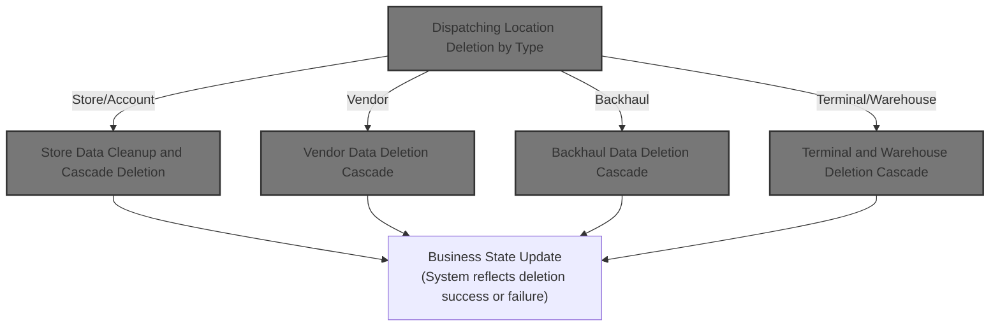
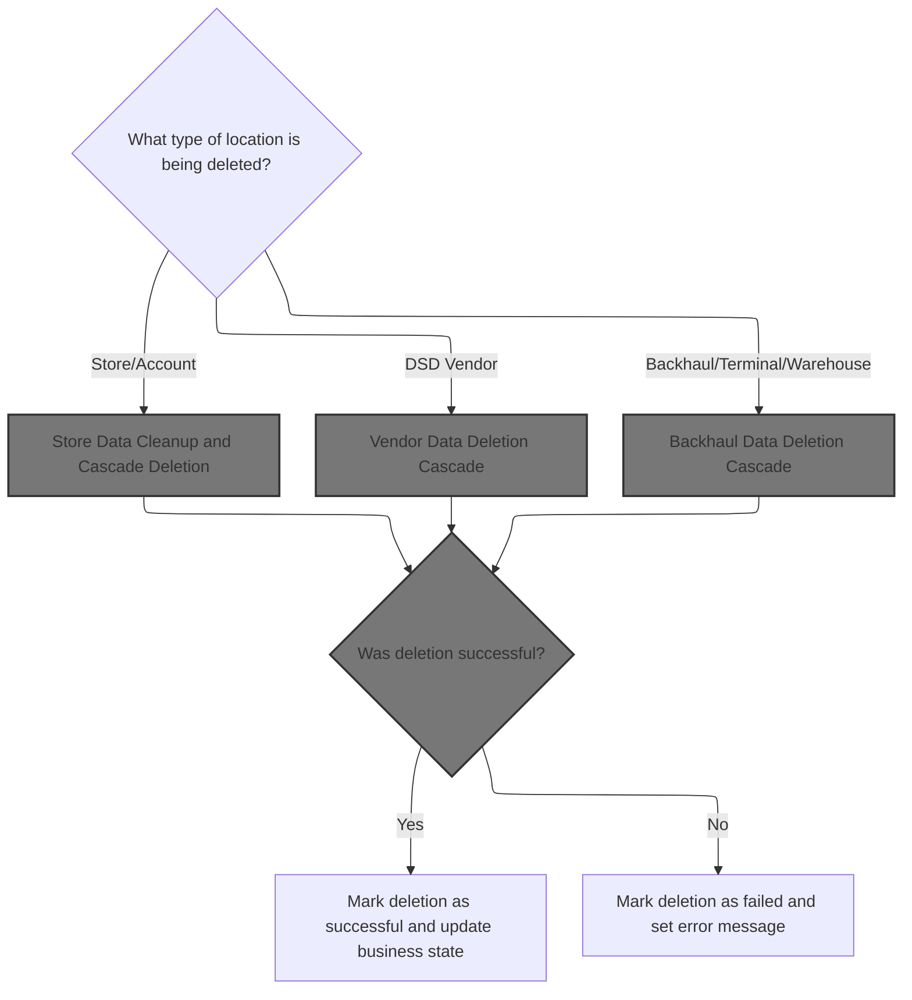
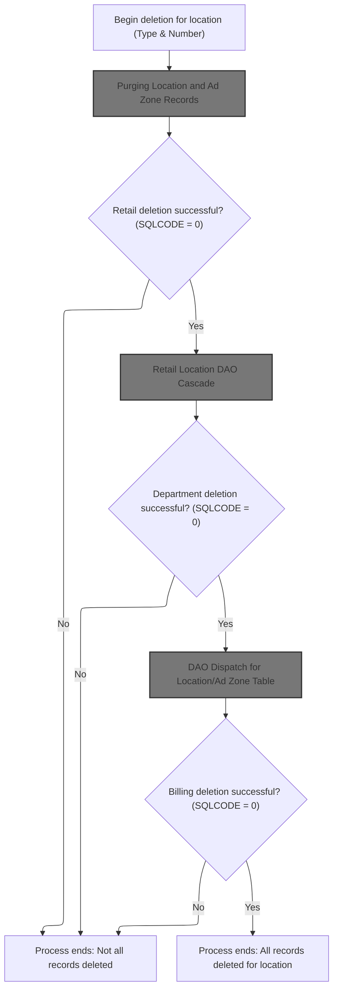
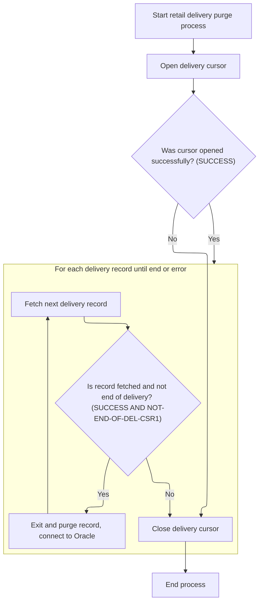
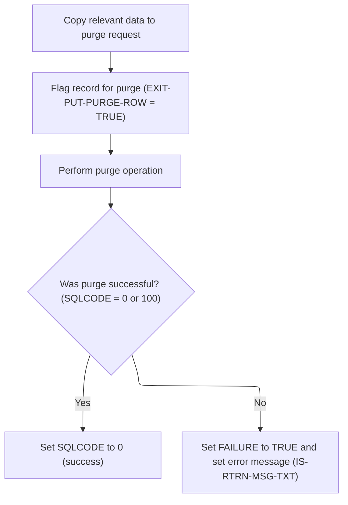
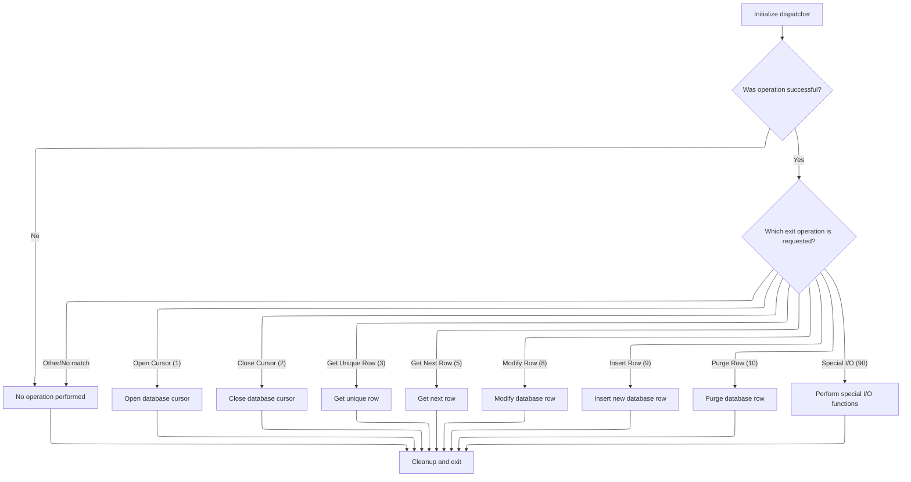
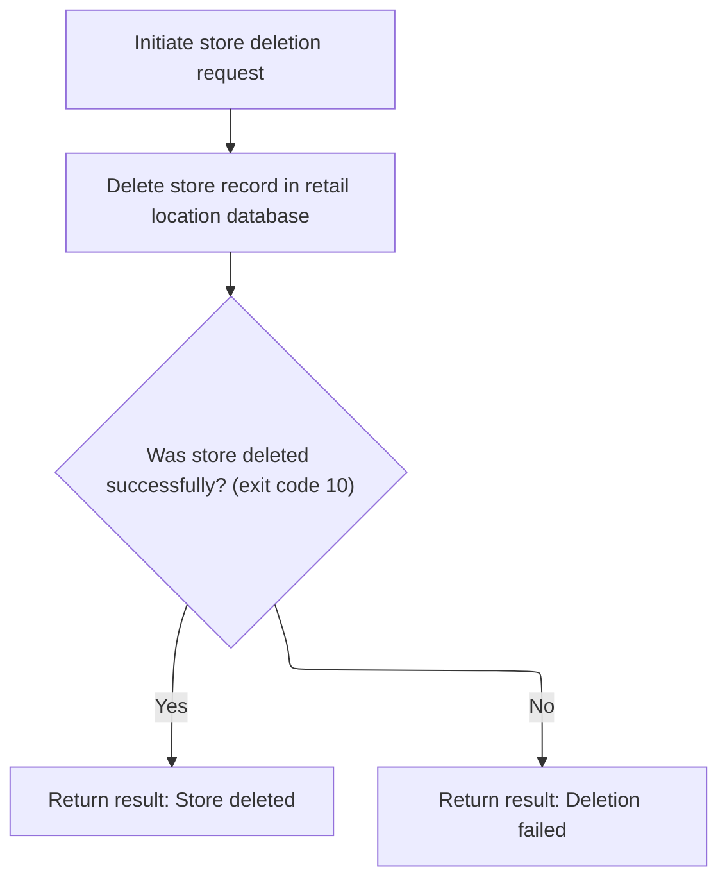
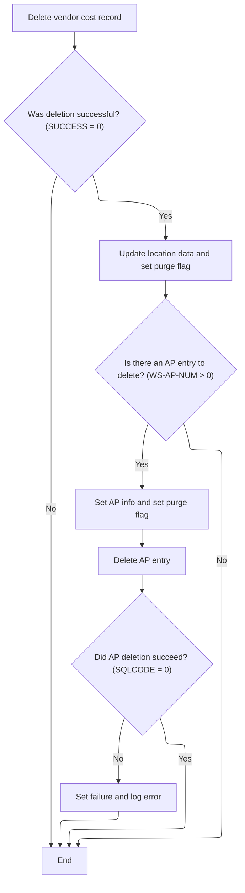
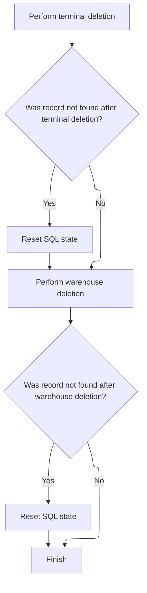

This document describes how a location and all associated records are deleted from the system. The flow determines the location type, dispatches to the relevant deletion logic, and ensures all related data is removed according to business rules. The system state is updated to reflect the outcome, and a failure message is returned if deletion is not possible.



# Spec

## Detailed View of the Program's Functionality

# A. Overview of Location Deletion Dispatch

The main deletion logic for locations is handled by a dispatcher routine. This dispatcher determines the type of location being deleted and then calls the appropriate deletion routine for that type. The types handled include stores, accounts, DSD vendors, backhauls, terminals, and warehouses.

- The dispatcher checks the location type code.
- Depending on the type, it calls a specific deletion routine:
  - For stores or accounts, it calls the store deletion routine.
  - For DSD vendors, it calls the vendor deletion routine.
  - For backhauls, terminals, and warehouses, it calls their respective routines.
- After the specific deletion, it connects to the Oracle database.
- If the deletion was successful, it deletes any related loan records.
- If everything is successful, it sets various flags to indicate deletion in different subsystems and runs a denormalization process.
- If there are specific SQL errors (such as foreign key violations), it sets a custom error message.
- For any other SQL error, it sets a generic failure message.

# B. Store Data Cleanup and Cascade Deletion

When the dispatcher determines that a store or account is being deleted, it performs a cascade of deletions and cleanups:

1. **Purge Location and Ad Zone Records**

   - Opens a cursor to fetch all location/ad zone records for the target location.
   - Loops through each record, deleting them one by one.
   - After each deletion, reconnects to Oracle.
   - Closes the cursor when done.

2. **Retail Location DAO Cascade**

   - If the previous step was successful, it prepares the necessary data and calls the retail location DAO to delete the store record from the retail location database.
   - If the DAO returns a "not found" code, it resets the SQL state to success.

3. **Department DAO Cascade**

   - If the retail location deletion was successful, it prepares the data and calls the department DAO to delete department records associated with the location.
   - Again, if "not found," it resets the SQL state.

4. **Billing Cost Records**

   - If the previous steps were successful, it deletes billing cost records associated with the store.
   - If "not found," it resets the SQL state.

If any step fails, the process ends early and does not attempt further deletions.

# C. Purging Location and Ad Zone Records

This step is responsible for deleting all ad zone records associated with the location:

- Opens a cursor to select all ad zone records for the location.
- For each record fetched:
  - Copies the key fields into the DAO input structure.
  - Flags the record for purge.
  - Calls the DAO to perform the actual deletion.
  - Reconnects to Oracle after each deletion.
- If the cursor cannot be opened or a fetch fails, it sets an error message.
- Closes the cursor at the end.

# D. Deleting Individual Location/Ad Zone Entries

For each ad zone record to be deleted:

- Copies the relevant key fields into the DAO input structure.
- Flags the operation as a purge.
- Calls the DAO to perform the deletion.
- Checks the result:
  - If successful or "not found," sets SQL state to success.
  - If failed, sets a failure flag and constructs an error message.

# E. DAO Dispatch for Location/Ad Zone Table

The DAO dispatcher is a general-purpose routine that handles all table operations for location/ad zone data:

- Initializes the dispatcher.
- Checks which operation is requested (open cursor, close cursor, fetch, insert, delete, etc.).
- Calls the appropriate subroutine for the requested operation.
- Handles cleanup and exit.

# F. Table Operation Dispatcher for Location/Ad Zone Data

This is the core logic for dispatching table operations:

- If the operation is to open a cursor, it checks the cursor ID and opens the corresponding database cursor.
- If the operation is to close a cursor, it closes the corresponding cursor.
- If the operation is to fetch a unique row, it runs a SELECT statement using the key fields.
- If the operation is to fetch the next row, it dispatches to the correct fetch routine based on the cursor ID.
- If the operation is to insert, modify, or delete a row, it calls the appropriate CUD (Create/Update/Delete) routine.
- After each operation, it performs any necessary denormalization or event processing.

# G. Vendor Data Deletion Cascade

When deleting a DSD vendor:

- Deletes vendor billing records from the billing cost table.
- If successful, prepares and calls the DAO to delete related location data.
- If there is an AP (accounts payable) entry, prepares and calls the DAO to delete the AP entry.
- If the AP deletion fails, sets a failure flag and error message.
- Resets SQL state to success if "not found" is encountered.

# H. Backhaul Data Deletion Cascade

When deleting a backhaul location:

- Calls the CUD routine to delete or update the backhaul data.
- If "not found," resets SQL state to success.

# I. Terminal and Warehouse Deletion Cascade

For terminals and warehouses:

- Calls the CUD routine to delete or update the terminal or warehouse data.
- If "not found," resets SQL state to success.

# J. Supporting Routines and Error Handling

Throughout the deletion process, several supporting routines are used:

- **Connecting to Oracle/DB2:** Before and after certain operations, the code ensures the correct database connection is established.
- **Null Handling:** After fetching data, null indicators are checked and fields are initialized as needed.
- **Error Handling:** For each database operation, the code checks the SQL state. If an error occurs, it sets a failure flag and constructs an appropriate error message.
- **Denormalization and Event Processing:** After successful operations, denormalization routines and event managers are called to update related systems and trigger events as needed.

# K. Summary

The deletion flow is highly structured and defensive:

- It dispatches deletion logic based on location type.
- Each type has its own cascade of deletions and cleanups.
- Each step checks for success before proceeding.
- Special handling is in place for "not found" conditions and for specific SQL errors.
- All database changes are performed via DAO or CUD routines, ensuring encapsulation and consistency.
- After successful deletions, flags are set and denormalization/event routines are triggered to keep the system state consistent.

# Rule Definition

| Paragraph Name                                                                                                                                       | Rule ID | Category          | Description                                                                                                                                                                                                                                         | Conditions                                                                   | Remarks                                                                                                                                                                                           |
| ---------------------------------------------------------------------------------------------------------------------------------------------------- | ------- | ----------------- | --------------------------------------------------------------------------------------------------------------------------------------------------------------------------------------------------------------------------------------------------- | ---------------------------------------------------------------------------- | ------------------------------------------------------------------------------------------------------------------------------------------------------------------------------------------------- |
| 1600-EXIT-PUT-PURGE-ROW                                                                                                                              | RL-001  | Conditional Logic | The system must select the appropriate deletion routine based on the value of LOC-TYP-CD. Each supported type triggers a specific deletion cascade or routine.                                                                                      | A deletion request is received with a valid LOC-TYP-CD and LOC-NBR.          | Supported LOC-TYP-CD values: 'S' (Store), 'A' (Account), 'D' (DSD Vendor), 'B' (Backhaul), 'T' (Terminal), 'W' (Warehouse). If LOC-TYP-CD does not match any of these, no operation is performed. |
| 1610-DELETE-STORE, 1610-EXIT-PUT-PURGE-RETL, 1612-FETCH-DEL-CSR1, 1613-EXIT-PURGE-RETL, 2060-CALL-RETAIL-LOC-DAO, 2070-CALL-STR-LOC-DEPT-DAO         | RL-002  | Computation       | For Store or Account deletions, all associated location and ad zone records, retail, department, and billing records must be deleted in cascade. Each step must succeed before proceeding to the next.                                              | LOC-TYP-CD is 'S' or 'A'.                                                    | SQLCODE must be checked after each step. If SQLCODE = 0, proceed; if SQLCODE = 100, treat as success and set SQLCODE to 0; if SQLCODE != 0, stop and return failure.                              |
| 1620-DELETE-DSD-VENDOR, 1630-GET-AP-KEY, 1680-NNNS0486-DSD-LOC-DAO, 1670-NNNS0457-AP-LOC-DAO                                                         | RL-003  | Computation       | For DSD Vendor deletions, vendor cost records must be deleted, and if an AP entry exists (AP-NBR > 0), the AP entry must be deleted. Each step must succeed before proceeding.                                                                      | LOC-TYP-CD is 'D'.                                                           | SQLCODE must be checked after each step. If SQLCODE = 0, proceed; if SQLCODE = 100, treat as success and set SQLCODE to 0; if SQLCODE != 0, stop and return failure.                              |
| 1640-DELETE-BKHAUL, 1650-DELETE-TERMINAL, 1660-DELETE-WHSE                                                                                           | RL-004  | Computation       | For Backhaul, Terminal, and Warehouse deletions, the corresponding record must be deleted. If SQLCODE = 100, treat as success and set SQLCODE to 0. If SQLCODE != 0 after deletion, treat as failure.                                               | LOC-TYP-CD is 'B', 'T', or 'W'.                                              | SQLCODE must be checked after deletion. If SQLCODE = 100, set SQLCODE to 0. If SQLCODE != 0, treat as failure.                                                                                    |
| 1600-EXIT-PUT-PURGE-ROW (post-deletion), 2000-DENORM-PROCESS, 2030-ISSUE-EVENTS                                                                      | RL-005  | Data Assignment   | After a successful deletion, set flags indicating which entities were deleted, set DELETE_OPERATION to TRUE, and clear any error message. Return a status/result object with success indicator, SQL return code, error message, and deletion flags. | All deletion steps succeed (SQLCODE = 0).                                    | Result object must include: success/failure indicator (boolean), SQL return code (number), error message (string, optional), flags for deleted entities (boolean per entity type).                |
| 1600-EXIT-PUT-PURGE-ROW (failure branches), 2667-2748 (SQLCODE error handling)                                                                       | RL-006  | Data Assignment   | If any deletion step fails, set FAILURE to TRUE, set an error message (specific for SQLCODE -532 or -84, generic otherwise), and set SQLCODE to the error code.                                                                                     | Any deletion step returns SQLCODE != 0 (except 100, which is reset to 0).    | Error message must be specific for SQLCODE -532 or -84, otherwise generic. SQLCODE must be included in the result object.                                                                         |
| All deletion cascades (e.g., 1610-DELETE-STORE, 1620-DELETE-DSD-VENDOR, etc.)                                                                        | RL-007  | Conditional Logic | The system must not proceed with further deletion steps if any required step fails.                                                                                                                                                                 | Any deletion step returns SQLCODE != 0 (except 100, which is reset to 0).    | This ensures atomicity of the deletion process.                                                                                                                                                   |
| 1600-EXIT-PUT-PURGE-ROW (EVALUATE TRUE, no matching WHEN)                                                                                            | RL-008  | Conditional Logic | The system must not perform any operation if LOC-TYP-CD does not match a supported type.                                                                                                                                                            | LOC-TYP-CD is not one of the supported types ('S', 'A', 'D', 'B', 'T', 'W'). | No operation is performed, no error is returned.                                                                                                                                                  |
| Throughout all deletion routines (no DISPLAY or logging statements)                                                                                  | RL-009  | Conditional Logic | The system must not print or log output directly as part of the deletion routines.                                                                                                                                                                  | Any deletion routine is executed.                                            | No DISPLAY, PRINT, or logging statements are present in the deletion routines.                                                                                                                    |
| Throughout all deletion routines (error handling branches)                                                                                           | RL-010  | Conditional Logic | The system must not throw exceptions for normal SQL errors; only for unexpected/unhandled situations if required by the implementation language.                                                                                                    | A normal SQL error occurs (e.g., SQLCODE != 0, not an unhandled exception).  | Normal SQL errors are handled by setting flags and messages, not by throwing exceptions.                                                                                                          |
| 1610-DELETE-STORE, 1620-DELETE-DSD-VENDOR, 1640-DELETE-BKHAUL, 1650-DELETE-TERMINAL, 1660-DELETE-WHSE, 1613-EXIT-PURGE-RETL, 1694-EXIT-PURGE-FAX-NUM | RL-011  | Data Assignment   | If SQLCODE = 100 (not found) after a deletion, treat as success and set SQLCODE to 0.                                                                                                                                                               | SQLCODE = 100 after a deletion step.                                         | Ensures that 'not found' is not treated as an error and does not stop the cascade.                                                                                                                |

# User Stories

## User Story 1: Initiate location deletion and select routine

---

### Story Description:

As a system, I want to accept a deletion request for a location and select the appropriate deletion routine based on the location type code so that only supported location types are processed and no operation is performed for unsupported types.

---

### Business Rule Mapping:

| Rule ID | Paragraph Name                                            | Rule Description                                                                                                                                               |
| ------- | --------------------------------------------------------- | -------------------------------------------------------------------------------------------------------------------------------------------------------------- |
| RL-001  | 1600-EXIT-PUT-PURGE-ROW                                   | The system must select the appropriate deletion routine based on the value of LOC-TYP-CD. Each supported type triggers a specific deletion cascade or routine. |
| RL-008  | 1600-EXIT-PUT-PURGE-ROW (EVALUATE TRUE, no matching WHEN) | The system must not perform any operation if LOC-TYP-CD does not match a supported type.                                                                       |

---

### Relevant Functionality:

- **1600-EXIT-PUT-PURGE-ROW**
  1. **RL-001:**
     - On deletion request:
       - If LOC-TYP-CD is 'S' or 'A', perform Store Data Cleanup and Cascade Deletion.
       - If LOC-TYP-CD is 'D', perform Vendor Data Deletion Cascade.
       - If LOC-TYP-CD is 'B', perform Backhaul Data Deletion Cascade.
       - If LOC-TYP-CD is 'T', perform Terminal Deletion Cascade.
       - If LOC-TYP-CD is 'W', perform Warehouse Deletion Cascade.
       - Else, do not perform any operation.
- **1600-EXIT-PUT-PURGE-ROW (EVALUATE TRUE**
  1. **RL-008:**
     - If LOC-TYP-CD is not recognized, do not perform any deletion or set any flags.

## User Story 2: Perform cascaded deletion with error handling

---

### Story Description:

As a system, I want to perform the correct cascaded deletion steps for the specified location type, ensuring each step succeeds before proceeding, handling 'not found' as success, and stopping the process if any step fails so that data integrity is maintained and partial deletions are avoided.

---

### Business Rule Mapping:

| Rule ID | Paragraph Name                                                                                                                                       | Rule Description                                                                                                                                                                                       |
| ------- | ---------------------------------------------------------------------------------------------------------------------------------------------------- | ------------------------------------------------------------------------------------------------------------------------------------------------------------------------------------------------------ |
| RL-002  | 1610-DELETE-STORE, 1610-EXIT-PUT-PURGE-RETL, 1612-FETCH-DEL-CSR1, 1613-EXIT-PURGE-RETL, 2060-CALL-RETAIL-LOC-DAO, 2070-CALL-STR-LOC-DEPT-DAO         | For Store or Account deletions, all associated location and ad zone records, retail, department, and billing records must be deleted in cascade. Each step must succeed before proceeding to the next. |
| RL-011  | 1610-DELETE-STORE, 1620-DELETE-DSD-VENDOR, 1640-DELETE-BKHAUL, 1650-DELETE-TERMINAL, 1660-DELETE-WHSE, 1613-EXIT-PURGE-RETL, 1694-EXIT-PURGE-FAX-NUM | If SQLCODE = 100 (not found) after a deletion, treat as success and set SQLCODE to 0.                                                                                                                  |
| RL-003  | 1620-DELETE-DSD-VENDOR, 1630-GET-AP-KEY, 1680-NNNS0486-DSD-LOC-DAO, 1670-NNNS0457-AP-LOC-DAO                                                         | For DSD Vendor deletions, vendor cost records must be deleted, and if an AP entry exists (AP-NBR > 0), the AP entry must be deleted. Each step must succeed before proceeding.                         |
| RL-004  | 1640-DELETE-BKHAUL, 1650-DELETE-TERMINAL, 1660-DELETE-WHSE                                                                                           | For Backhaul, Terminal, and Warehouse deletions, the corresponding record must be deleted. If SQLCODE = 100, treat as success and set SQLCODE to 0. If SQLCODE != 0 after deletion, treat as failure.  |
| RL-007  | All deletion cascades (e.g., 1610-DELETE-STORE, 1620-DELETE-DSD-VENDOR, etc.)                                                                        | The system must not proceed with further deletion steps if any required step fails.                                                                                                                    |

---

### Relevant Functionality:

- **1610-DELETE-STORE**
  1. **RL-002:**
     - Delete all ad zone records (iterate with cursor, delete each).
     - If SQLCODE = 0, delete retail records.
     - If SQLCODE = 0, delete department records.
     - If SQLCODE = 0, delete billing records.
     - After each step, check SQLCODE:
       - If SQLCODE = 100, set SQLCODE to 0 and continue.
       - If SQLCODE != 0, stop and return failure.
  2. **RL-011:**
     - After deletion, if SQLCODE = 100, set SQLCODE to 0 and continue.
- **1620-DELETE-DSD-VENDOR**
  1. **RL-003:**
     - Delete vendor cost records.
     - If SQLCODE = 0, delete DSD location record.
     - If SQLCODE = 0 and AP-NBR > 0, delete AP entry.
     - After each step, check SQLCODE:
       - If SQLCODE = 100, set SQLCODE to 0 and continue.
       - If SQLCODE != 0, stop and return failure.
- **1640-DELETE-BKHAUL**
  1. **RL-004:**
     - Delete the corresponding record.
     - If SQLCODE = 100, set SQLCODE to 0 (treat as success).
     - If SQLCODE != 0, treat as failure.
- **All deletion cascades (e.g.**
  1. **RL-007:**
     - After each deletion step, check SQLCODE.
     - If SQLCODE != 0, stop further processing and return failure.

## User Story 3: Return deletion result and handle errors

---

### Story Description:

As a system, I want to set appropriate flags, return a result object with status, SQL return code, error messages, and deletion flags, and ensure no direct output or exceptions for normal SQL errors so that the caller receives a clear outcome and system behavior is consistent.

---

### Business Rule Mapping:

| Rule ID | Paragraph Name                                                                  | Rule Description                                                                                                                                                                                                                                    |
| ------- | ------------------------------------------------------------------------------- | --------------------------------------------------------------------------------------------------------------------------------------------------------------------------------------------------------------------------------------------------- |
| RL-005  | 1600-EXIT-PUT-PURGE-ROW (post-deletion), 2000-DENORM-PROCESS, 2030-ISSUE-EVENTS | After a successful deletion, set flags indicating which entities were deleted, set DELETE_OPERATION to TRUE, and clear any error message. Return a status/result object with success indicator, SQL return code, error message, and deletion flags. |
| RL-006  | 1600-EXIT-PUT-PURGE-ROW (failure branches), 2667-2748 (SQLCODE error handling)  | If any deletion step fails, set FAILURE to TRUE, set an error message (specific for SQLCODE -532 or -84, generic otherwise), and set SQLCODE to the error code.                                                                                     |
| RL-009  | Throughout all deletion routines (no DISPLAY or logging statements)             | The system must not print or log output directly as part of the deletion routines.                                                                                                                                                                  |
| RL-010  | Throughout all deletion routines (error handling branches)                      | The system must not throw exceptions for normal SQL errors; only for unexpected/unhandled situations if required by the implementation language.                                                                                                    |

---

### Relevant Functionality:

- **1600-EXIT-PUT-PURGE-ROW (post-deletion)**
  1. **RL-005:**
     - Set LOC-DEL, VEN-DEL, DSD-DEL, WHS-DEL, etc. as appropriate.
     - Set DELETE_OPERATION to TRUE.
     - Clear error message.
     - Return status/result object with all required fields.
- **1600-EXIT-PUT-PURGE-ROW (failure branches)**
  1. **RL-006:**
     - If SQLCODE = -532 or -84, set specific error message.
     - Else, set generic error message with SQLCODE.
     - Set FAILURE to TRUE.
     - Set SQLCODE in result object.
- **Throughout all deletion routines (no DISPLAY or logging statements)**
  1. **RL-009:**
     - Ensure all output is via return objects, not direct output.
- **Throughout all deletion routines (error handling branches)**
  1. **RL-010:**
     - On SQL error, set FAILURE and error message, do not throw exception.

# Code Walkthrough

## Dispatching Location Deletion by Type



<SwmSnippet path="/base/src/NNNS0487.cbl" line="2633">

---

1600-EXIT-PUT-PURGE-ROW kicks off the deletion flow by checking the location type code in DCLXXXATION and dispatching to the right deletion routine for stores, accounts, vendors, backhauls, terminals, or warehouses. After the specific deletion, it connects to Oracle and, if successful, deletes any related loan records. If everything goes well (SQLCODE = 0), it sets a bunch of repository-specific flags to TRUE to mark various subsystems as deleted, then runs denormalization. Special SQL error codes (-532, -84) get custom failure messages, and any other error sets a generic failure. Calling 1610-DELETE-STORE next is needed when the location type is 'S' or 'A', since that's where the actual store deletion logic lives.

```cobol
271000 1600-EXIT-PUT-PURGE-ROW.                                         00271000
271100     EVALUATE TRUE                                                00271100
271200       WHEN LOC-TYP-CD OF DCLXXXATION = K-STORE-LOC-TYPE          00271200
271300       OR   LOC-TYP-CD OF DCLXXXATION = K-ACCT-LOC-TYPE           00271300
271400         PERFORM 1610-DELETE-STORE                                00271400
271500       WHEN LOC-TYP-CD OF DCLXXXATION = K-DSD-VEND-LOC-TYPE       00271500
271600         PERFORM 1620-DELETE-DSD-VENDOR                           00271600
271700       WHEN LOC-TYP-CD OF DCLXXXATION = 'B'                       00271700
271800         PERFORM 1640-DELETE-BKHAUL                               00271800
271900       WHEN LOC-TYP-CD OF DCLXXXATION = 'T'                       00271900
272000         PERFORM 1650-DELETE-TERMINAL                             00272000
272100       WHEN LOC-TYP-CD OF DCLXXXATION = 'W'                       00272100
272200         PERFORM 1660-DELETE-WHSE                                 00272200
272300     END-EVALUATE                                                 00272300
272400                                                                  00272400
272500     PERFORM 115-CONNECT-TO-ORACLE                                00272500
272600     IF SUCCESS AND SQLCODE = 0                                   00272600
272700       PERFORM 1690-DELETE-LO                                     00272700
272800     END-IF                                                       00272800
272900                                                                  00272900
273000     EVALUATE TRUE                                                00273000
273100       WHEN SQLCODE = 0                                           00273100
273200         SET YYYN110A-DEL  TO TRUE                                00273200
273300         SET MMMC0265-DEL  TO TRUE                                00273300
273400         SET LOC-DEL       TO TRUE                                00273400
273500         SET DSD-DEL       TO TRUE                                00273500
273600         SET WHS-DEL       TO TRUE                                00273600
273700         SET VEN-DEL       TO TRUE                                00273700
273800     IF SUCCESS AND SQLCODE = 0                                   00273800
273900         SET DELETE-OPERATION  TO TRUE                            00273900
274000         SET STAGE-EVENT       TO TRUE                            00274000
274100     END-IF                                                       00274100
274200         PERFORM 2000-DENORM-PROCESS                              00274200
274300       WHEN SQLCODE = -532                                        00274300
274400       WHEN SQLCODE = -84                                         00274400
274500         SET  FAILURE TO TRUE                                     00274500
274600         MOVE 'NNNS0487 - XXXATION in use - it cannot be deleted!'00274600
274700           TO IS-RTRN-MSG-TXT                                     00274700
274800       WHEN SQLCODE NOT = 0                                       00274800
274900         MOVE SQLCODE                 TO WS-SQLCODE               00274900
275000         SET  FAILURE                 TO TRUE                     00275000
275100         MOVE SPACES                  TO IS-RTRN-MSG-TXT          00275100
275200         STRING 'NNNS0514 - Error deleting XXXATION, SQL='        00275200
275300                 WS-SQLCODE                                       00275300
275400                 DELIMITED BY SIZE INTO IS-RTRN-MSG-TXT           00275400
275500     END-EVALUATE                                                 00275500
275600     .                                                            00275600
```

---

</SwmSnippet>

### Store Data Cleanup and Cascade Deletion



<SwmSnippet path="/base/src/NNNS0487.cbl" line="2682">

---

1610-DELETE-STORE starts by purging location/ad zone records, then cascades through retail and department DAO routines, and finally deletes billing cost records. Setting EXIT-PUT-PURGE-ROW to TRUE tells each DAO to actually perform the purge.

```cobol
275900 1610-DELETE-STORE.                                               00275900
276000     PERFORM 1610-EXIT-PUT-PURGE-RETL                             00276000
276100     IF SQLCODE = 0                                               00276100
276200       MOVE  LOC-TYP-CD       OF DCLXXXATION                      00276200
276300         TO  LOC-TYP-CD       OF P-DDDTLR01                       00276300
276400       MOVE  LOC-NBR          OF DCLXXXATION                      00276400
276500         TO  LOC-NBR          OF P-DDDTLR01                       00276500
276600       SET EXIT-PUT-PURGE-ROW TO TRUE                             00276600
276700       PERFORM 2060-CALL-RETAIL-LOC-DAO                           00276700
276800       IF SQLCODE = 100                                           00276800
276900         MOVE 0 TO SQLCODE                                        00276900
277000       END-IF                                                     00277000
277100     END-IF                                                       00277100
277200                                                                  00277200
277300     IF SQLCODE = 0                                               00277300
277400       MOVE  LOC-TYP-CD       OF DCLXXXATION                      00277400
277500         TO  LOC-TYP-CD       OF P-DDDTDT01                       00277500
277600       MOVE  LOC-NBR          OF DCLXXXATION                      00277600
277700         TO  LOC-NBR          OF P-DDDTDT01                       00277700
277800       SET EXIT-PUT-PURGE-ROW TO TRUE                             00277800
277900       PERFORM 2070-CALL-STR-LOC-DEPT-DAO                         00277900
278000       IF SQLCODE = 100                                           00278000
278100         MOVE 0 TO SQLCODE                                        00278100
278200       END-IF                                                     00278200
278300     END-IF                                                       00278300
278400                                                                  00278400
278500     IF SQLCODE = 0                                               00278500
278600       EXEC SQL                                                   00278600
278700         DELETE FROM LST_BILED_CST                                00278700
278800         WHERE  STR_LOC_NUM = :DCLXXXATION.LOC-NBR                00278800
278900         AND    STR_LOC_TYP = :DCLXXXATION.LOC-TYP-CD             00278900
279000       END-EXEC                                                   00279000
279100       IF SQLCODE = 100                                           00279100
279200         MOVE 0 TO SQLCODE                                        00279200
279300       END-IF                                                     00279300
279400     END-IF                                                       00279400
279500                                                                  00279500
279600     .                                                            00279600
```

---

</SwmSnippet>

#### Purging Location and Ad Zone Records



<SwmSnippet path="/base/src/NNNS0487.cbl" line="2722">

---

1610-EXIT-PUT-PURGE-RETL opens a cursor to fetch all location/ad zone records for the target location, then loops through each one, calling 1613-EXIT-PURGE-RETL to delete them. After each delete, it reconnects to Oracle. The loop stops when there are no more records or an error occurs. Finally, it closes the cursor. Calling 1613-EXIT-PURGE-RETL is what actually removes each fetched record.

```cobol
279900 1610-EXIT-PUT-PURGE-RETL.                                        00279900
280000     SET NOT-END-OF-DEL-CSR1 TO TRUE                              00280000
280100     PERFORM 1611-OPEN-DEL-CSR1                                   00280100
280200     IF SUCCESS                                                   00280200
280300       PERFORM UNTIL END-OF-DEL-CSR1 OR NOT SUCCESS               00280300
280400         PERFORM 1612-FETCH-DEL-CSR1                              00280400
280500         IF SUCCESS AND NOT-END-OF-DEL-CSR1                       00280500
280600           PERFORM 1613-EXIT-PURGE-RETL                           00280600
280700           PERFORM 115-CONNECT-TO-ORACLE                          00280700
280800         END-IF                                                   00280800
280900       END-PERFORM                                                00280900
281000     END-IF                                                       00281000
281100     PERFORM 1614-CLOSE-DEL-CSR1                                  00281100
281200     .                                                            00281200
```

---

</SwmSnippet>

#### Deleting Individual Location/Ad Zone Entries



<SwmSnippet path="/base/src/NNNS0487.cbl" line="2782">

---

1613-EXIT-PURGE-RETL copies the key fields for the record to be deleted into the DAO input structure, sets EXIT-PUT-PURGE-ROW to TRUE, and calls 4000-NNNS0473-RETL-DAO to actually delete the record. It checks SQLCODE for success or failure and sets error messages if needed. Calling the DAO is what triggers the actual database delete.

```cobol
285900 1613-EXIT-PURGE-RETL.                                            00285900
286000     MOVE ITM-CLS-CD         OF DCLXXXL-LOC-CLS-AD-ZN             00286000
286100       TO ITM-CLS-CD         OF P-DDDTCZ01                        00286100
286200     MOVE LOC-TYP-CD         OF DCLXXXL-LOC-CLS-AD-ZN             00286200
286300       TO LOC-TYP-CD         OF P-DDDTCZ01                        00286300
286400     MOVE LOC-NBR            OF DCLXXXL-LOC-CLS-AD-ZN             00286400
286500       TO LOC-NBR            OF P-DDDTCZ01                        00286500
286600                                                                  00286600
286700     SET EXIT-PUT-PURGE-ROW TO TRUE                               00286700
286800     PERFORM 4000-NNNS0473-RETL-DAO                               00286800
286900                                                                  00286900
287000     EVALUATE TRUE                                                00287000
287100       WHEN SQLCODE = 0 OR 100                                    00287100
287200         MOVE 0 TO SQLCODE                                        00287200
287300       WHEN OTHER                                                 00287300
287400         MOVE SQLCODE TO WS-SQLCODE                               00287400
287500         SET FAILURE TO TRUE                                      00287500
287600         MOVE SPACES  TO IS-RTRN-MSG-TXT                          00287600
287700         MOVE SQLCODE TO WS-SQLCODE                               00287700
287800         STRING 'NNNS0487 - Error in delete of RETL'              00287800
287900                'LOC ,RC=' WS-SQLCODE '.'                         00287900
288000                DELIMITED BY SIZE INTO IS-RTRN-MSG-TXT            00288000
288100     END-EVALUATE                                                 00288100
288200     .                                                            00288200
```

---

</SwmSnippet>

#### DAO Dispatch for Location/Ad Zone Table

<SwmSnippet path="/base/src/NNNS0487.cbl" line="3333">

---

4000-NNNS0473-RETL-DAO just calls the NNNS0473-RETL-DAO program, passing all the context and data structures it needs. That program handles the actual table operation (like delete) based on the flags and data provided. Calling it is what actually makes the database change happen.

```cobol
341000 4000-NNNS0473-RETL-DAO.                                          00341000
341100     CALL NNNS0473-RETL-DAO USING                                 00341100
341200          XXXN001A                                                00341200
341300          SQLCA                                                   00341300
341400          YYYN005A                                                00341400
341500          NNNN0000-PARMS                                          00341500
341600          P-DDDTCZ01                                              00341600
341700     .                                                            00341700
```

---

</SwmSnippet>

#### Table Operation Dispatcher for Location/Ad Zone Data



<SwmSnippet path="/base/src/NNNS0473.cbl" line="199">

---

0000-EXIT-DISPATCHER is the main entry for all table operations on location/ad zone data. It checks which operation code is set and branches to the right logic for opening/closing cursors, fetching rows, inserting, deleting, etc. This is where the actual table IO logic is dispatched based on the flags set by the caller.

```cobol
020800 0000-EXIT-DISPATCHER.                                            00020800
020900     PERFORM 100-INITIALIZATION                                   00020900
021000     EVALUATE TRUE                                                00021000
021100       WHEN NOT SUCCESS                                           00021100
021200          CONTINUE                                                00021200
021300       WHEN EXIT-OPEN-CURSOR                                      00021300
021400          PERFORM 1000-EXIT-OPEN-CURSOR                           00021400
021500       WHEN EXIT-CLOSE-CURSOR                                     00021500
021600          PERFORM 1100-EXIT-CLOSE-CURSOR                          00021600
021700       WHEN EXIT-GET-UNIQUE-ROW                                   00021700
021800          PERFORM 1200-EXIT-GET-UNIQUE-ROW                        00021800
021900       WHEN EXIT-GET-NEXT-ROW                                     00021900
022000          PERFORM 1300-EXIT-GET-NEXT-ROW                          00022000
022100       WHEN EXIT-PUT-MODIFY-ROW                                   00022100
022200          PERFORM 1400-EXIT-PUT-MODIFY-ROW                        00022200
022300       WHEN EXIT-PUT-INSERT-ROW                                   00022300
022400          PERFORM 1500-EXIT-PUT-INSERT-ROW                        00022400
022500       WHEN EXIT-PUT-PURGE-ROW                                    00022500
022600          PERFORM 1600-EXIT-PUT-PURGE-ROW                         00022600
022700       WHEN EXIT-DO-SPECIAL-IO-FUNCS                              00022700
022800          PERFORM 10000-DO-SPECIAL-IO-FUNCS                       00022800
022900     END-EVALUATE                                                 00022900
023000     PERFORM 120-EXIT-STUFF                                       00023000
023100     GOBACK                                                       00023100
023200     .                                                            00023200
```

---

</SwmSnippet>

<SwmSnippet path="/base/src/NNNS0473.cbl" line="327">

---

1000-EXIT-OPEN-CURSOR checks which cursor ID is passed in, opens the matching database cursor, or sets a failure flag and error message if the ID is invalid. Only IDs 01-04 are valid here.

```cobol
033600 1000-EXIT-OPEN-CURSOR.                                           00033600
033700     EVALUATE TRUE                                                00033700
033800       WHEN DDDXCZ01                                              00033800
033900         EXEC SQL                                                 00033900
034000           OPEN DDDXCZ01                                          00034000
034100         END-EXEC                                                 00034100
034200       WHEN DDDXCZ02                                              00034200
034300         EXEC SQL                                                 00034300
034400           OPEN DDDXCZ02                                          00034400
034500         END-EXEC                                                 00034500
034600       WHEN DDDXCZ03                                              00034600
034700         EXEC SQL                                                 00034700
034800           OPEN DDDXCZ03                                          00034800
034900         END-EXEC                                                 00034900
035000       WHEN DDDXCZ04                                              00035000
035100         EXEC SQL                                                 00035100
035200           OPEN DDDXCZ04                                          00035200
035300         END-EXEC                                                 00035300
035400       WHEN OTHER                                                 00035400
035500         SET FAILURE TO TRUE                                      00035500
035600         MOVE 'NNNS0473 - Invalid open cursor ID.'                00035600
035700           TO IS-RTRN-MSG-TXT OF XXXN001A                         00035700
035800     END-EVALUATE                                                 00035800
035900     .                                                            00035900
```

---

</SwmSnippet>

<SwmSnippet path="/base/src/NNNS0473.cbl" line="353">

---

1100-EXIT-CLOSE-CURSOR closes the database cursor matching the input ID, or sets a failure flag and error message if the ID isn't one of the four valid ones. This keeps cursor management tight and avoids mistakes.

```cobol
036200 1100-EXIT-CLOSE-CURSOR.                                          00036200
036300     EVALUATE TRUE                                                00036300
036400       WHEN DDDXCZ01                                              00036400
036500         EXEC SQL                                                 00036500
036600           CLOSE DDDXCZ01                                         00036600
036700         END-EXEC                                                 00036700
036800       WHEN DDDXCZ02                                              00036800
036900         EXEC SQL                                                 00036900
037000           CLOSE DDDXCZ02                                         00037000
037100         END-EXEC                                                 00037100
037200       WHEN DDDXCZ03                                              00037200
037300         EXEC SQL                                                 00037300
037400           CLOSE DDDXCZ03                                         00037400
037500         END-EXEC                                                 00037500
037600       WHEN DDDXCZ04                                              00037600
037700         EXEC SQL                                                 00037700
037800           CLOSE DDDXCZ04                                         00037800
037900         END-EXEC                                                 00037900
038000       WHEN OTHER                                                 00038000
038100         SET FAILURE TO TRUE                                      00038100
038200         MOVE 'NNNS0473 - Invalid close cursor ID.'               00038200
038300           TO IS-RTRN-MSG-TXT OF XXXN001A                         00038300
038400     END-EVALUATE                                                 00038400
038500     .                                                            00038500
```

---

</SwmSnippet>

<SwmSnippet path="/base/src/NNNS0473.cbl" line="379">

---

1200-EXIT-GET-UNIQUE-ROW runs a SELECT to fetch a unique row from the location/ad zone table using the key fields already set in the input structure. After fetching, it checks for nulls in the result. The correctness of this step depends on the caller setting up the keys properly.

```cobol
038800 1200-EXIT-GET-UNIQUE-ROW.                                        00038800
038900     EXEC SQL                                                     00038900
039000         SELECT LOC_TYP_CD,                                       00039000
039100                LOC_NBR,                                          00039100
039200                ITM_CLS_CD,                                       00039200
039300                AD_ZONE,                                          00039300
039400                AD_ZONE_EXCP                                      00039400
039500         INTO   :DCLXXXL-LOC-CLS-AD-ZN.LOC-TYP-CD,                00039500
039600                :DCLXXXL-LOC-CLS-AD-ZN.LOC-NBR,                   00039600
039700                :DCLXXXL-LOC-CLS-AD-ZN.ITM-CLS-CD,                00039700
039800                :DCLXXXL-LOC-CLS-AD-ZN.AD-ZONE,                   00039800
039900                :DCLXXXL-LOC-CLS-AD-ZN.AD-ZONE-EXCP               00039900
040000         FROM   XXXL_LOC_CLS_AD_ZN                                00040000
040100         WHERE  LOC_TYP_CD = :DCLXXXL-LOC-CLS-AD-ZN.LOC-TYP-CD    00040100
040200         AND    LOC_NBR = :DCLXXXL-LOC-CLS-AD-ZN.LOC-NBR          00040200
040300         AND    ITM_CLS_CD = :DCLXXXL-LOC-CLS-AD-ZN.ITM-CLS-CD    00040300
040400     END-EXEC                                                     00040400
040500                                                                  00040500
040600     PERFORM 1700-CHECK-NULL-COLUMNS                              00040600
040700     .                                                            00040700
```

---

</SwmSnippet>

<SwmSnippet path="/base/src/NNNS0473.cbl" line="401">

---

1300-EXIT-GET-NEXT-ROW dispatches to the right fetch routine based on the cursor ID, then checks for nulls in the fetched data. If the ID isn't valid, it sets a failure flag and error message. Each fetch routine is tied to a specific cursor/index.

```cobol
041000 1300-EXIT-GET-NEXT-ROW.                                          00041000
041100     EVALUATE TRUE                                                00041100
041200       WHEN DDDXCZ01                                              00041200
041300         PERFORM 1301-FETCH-DDDXCZ01                              00041300
041400       WHEN DDDXCZ02                                              00041400
041500         PERFORM 1302-FETCH-DDDXCZ02                              00041500
041600       WHEN DDDXCZ03                                              00041600
041700         PERFORM 1303-FETCH-DDDXCZ03                              00041700
041800       WHEN DDDXCZ04                                              00041800
041900         PERFORM 1304-FETCH-DDDXCZ04                              00041900
042000       WHEN OTHER                                                 00042000
042100         SET FAILURE TO TRUE                                      00042100
042200         MOVE 'NNNS0473 - Invalid fetch cursor ID.'               00042200
042300           TO IS-RTRN-MSG-TXT OF XXXN001A                         00042300
042400     END-EVALUATE                                                 00042400
042500                                                                  00042500
042600     PERFORM 1700-CHECK-NULL-COLUMNS                              00042600
042700     .                                                            00042700
```

---

</SwmSnippet>

<SwmSnippet path="/base/src/NNNS0473.cbl" line="494">

---

1500-EXIT-PUT-INSERT-ROW edits null indicators, runs an insertion check, and if that's successful, updates the table. On a successful insert, it sets checkpoint and update flags, then runs denormalization. Each step is conditional on the previous one succeeding.

```cobol
051900 1500-EXIT-PUT-INSERT-ROW.                                        00051900
052000     PERFORM 1800-EDIT-NULL-INDICATORS                            00052000
052100                                                                  00052100
052200     PERFORM 4600-CALL-MMMS0335-RI-ADD-CHK                        00052200
052300     IF SUCCESS                                                   00052300
053600        PERFORM 5000-CALL-NNNS0473-CUD-ROUTINE                    00053600
053700        IF SQLCODE = 0                                            00053700
053800           MOVE 1 TO WS-CHECKPOINT-INC                            00053800
053900           SET YYYN110A-ADD TO TRUE                               00053900
054000           SET LOC-UPD      TO TRUE                               00054000
054100           PERFORM 2000-DENORM-PROCESS                            00054100
054200        END-IF                                                    00054200
054210     END-IF                                                       00054210
054300     .                                                            00054300
```

---

</SwmSnippet>

<SwmSnippet path="/base/src/NNNS0473.cbl" line="510">

---

1600-EXIT-PUT-PURGE-ROW calls the CUD routine to delete the row, and if successful, sets delete and update flags, bumps the checkpoint, and runs denormalization. These flags are used by later logic to know what happened.

```cobol
054600 1600-EXIT-PUT-PURGE-ROW.                                         00054600
055300     PERFORM 5000-CALL-NNNS0473-CUD-ROUTINE                       00055300
055400     IF SQLCODE = 0                                               00055400
055500       MOVE 1 TO WS-CHECKPOINT-INC                                00055500
055600       SET YYYN110A-DEL TO TRUE                                   00055600
055700       SET LOC-UPD      TO TRUE                                   00055700
055800       PERFORM 2000-DENORM-PROCESS                                00055800
055900     END-IF                                                       00055900
056000     .                                                            00056000
```

---

</SwmSnippet>

#### Retail Location DAO Cascade



<SwmSnippet path="/base/src/NNNS0487.cbl" line="3305">

---

2060-CALL-RETAIL-LOC-DAO calls out to the NNNS0488-RETAIL-LOC-DAO program, passing all the context and data it needs. That program handles the actual DB operation for the retail location, like deleting or updating as needed. This is where the real DB change happens for retail data.

```cobol
338200 2060-CALL-RETAIL-LOC-DAO.                                        00338200
338300     CALL NNNS0488-RETAIL-LOC-DAO USING                           00338300
338400          XXXN001A                                                00338400
338500          SQLCA                                                   00338500
338600          YYYN005A                                                00338600
338700          NNNN0000-PARMS                                          00338700
338800          P-DDDTLR01                                              00338800
338900     .                                                            00338900
```

---

</SwmSnippet>

### Vendor Data Deletion Cascade



<SwmSnippet path="/base/src/NNNS0487.cbl" line="2829">

---

1620-DELETE-DSD-VENDOR deletes vendor billing records from LST_BILED_CST, then sets up and calls the DAO to handle related location data. If there's an AP number, it also updates AP location data via another DAO call. SQLCODE 100 is reset to 0 after each delete to avoid treating 'not found' as an error. Each DAO call is conditional on previous success.

```cobol
290600 1620-DELETE-DSD-VENDOR.                                          00290600
290700     PERFORM 1630-GET-AP-KEY                                      00290700
290800                                                                  00290800
290900     IF SUCCESS                                                   00290900
291000       EXEC SQL                                                   00291000
291100         DELETE FROM LST_BILED_CST                                00291100
291200         WHERE  SPLR_LOC_NBR    = :DCLXXXATION.LOC-NBR            00291200
291300         AND    SPLR_LOC_TYP_CD = :DCLXXXATION.LOC-TYP-CD         00291300
291400       END-EXEC                                                   00291400
291500     END-IF                                                       00291500
291600     IF SQLCODE = 100                                             00291600
291700       MOVE 0 TO SQLCODE                                          00291700
291800     END-IF                                                       00291800
291900                                                                  00291900
292000     IF SUCCESS                                                   00292000
292100       SET EXIT-PUT-PURGE-ROW TO TRUE                             00292100
292200       MOVE LOC-NBR    OF DCLXXXATION                             00292200
292300         TO LOC-NBR    OF P-RMDTLD01                              00292300
292400       MOVE LOC-TYP-CD OF DCLXXXATION                             00292400
292500         TO LOC-TYP-CD OF P-RMDTLD01                              00292500
292600       PERFORM 1680-NNNS0486-DSD-LOC-DAO                          00292600
292700     END-IF                                                       00292700
292800     IF SQLCODE = 100                                             00292800
292900       MOVE 0 TO SQLCODE                                          00292900
293000     END-IF                                                       00293000
293100                                                                  00293100
293200     IF  SUCCESS                                                  00293200
293300     AND SQLCODE = 0                                              00293300
293400     AND WS-AP-NUM > 0                                            00293400
293500     MOVE WS-AP-NUM                                               00293500
293600       TO AP-NBR    OF P-DDDTAP01                                 00293600
293700     MOVE WS-AP-TYPE                                              00293700
293800       TO AP-TYP-CD OF P-DDDTAP01                                 00293800
293900     SET EXIT-PUT-PURGE-ROW TO TRUE                               00293900
294000     PERFORM 1670-NNNS0457-AP-LOC-DAO                             00294000
294100       IF SQLCODE NOT = 0                                         00294100
294200         SET FAILURE TO TRUE                                      00294200
294300         MOVE 'NNNS0487 - Could not delete AP entry for vendor!'  00294300
294400           TO IS-RTRN-MSG-TXT                                     00294400
294500       END-IF                                                     00294500
294600     END-IF                                                       00294600
294700                                                                  00294700
294800     .                                                            00294800
```

---

</SwmSnippet>

### Backhaul Data Deletion Cascade

<SwmSnippet path="/base/src/NNNS0487.cbl" line="2906">

---

1640-DELETE-BKHAUL just calls the CUD routine to handle the backhaul data update or delete. If the routine returns SQLCODE 100 (no data found), it resets it to 0 so the flow doesn't treat it as an error. The CUD routine is where the real DB change happens.

```cobol
298300 1640-DELETE-BKHAUL.                                              00298300
298400                                                                  00298400
298500     PERFORM 5000-CALL-MMMU0487-CUD-ROUTINE                       00298500
298600                                                                  00298600
298700     IF SQLCODE = 100                                             00298700
298800       MOVE 0 TO SQLCODE                                          00298800
298900     END-IF                                                       00298900
299000     .                                                            00299000
```

---

</SwmSnippet>

<SwmSnippet path="/base/src/NNNS0487.cbl" line="3393">

---

5000-CALL-MMMU0487-CUD-ROUTINE just calls MMMU0487-ORACLE-UPDATE, passing all the context and data it needs. That subroutine does the real Oracle DB update for the backhaul or other location data.

```cobol
347000 5000-CALL-MMMU0487-CUD-ROUTINE.                                  00347000
347100     CALL MMMU0487-ORACLE-UPDATE USING                            00347100
347200          XXXN001A                                                00347200
347300          SQLCA                                                   00347300
347400          YYYN005A                                                00347400
347500          NNNN0000-PARMS                                          00347500
347600          DDDTLO01                                                00347600
347700     .                                                            00347700
```

---

</SwmSnippet>

### Terminal and Warehouse Deletion Cascade



<SwmSnippet path="/base/src/NNNS0487.cbl" line="2916">

---

1650-DELETE-TERMINAL calls the CUD routine to handle the terminal data update or delete. If the routine returns SQLCODE 100 (no data found), it resets it to 0 so the flow doesn't treat it as an error. The CUD routine is where the real DB change happens.

```cobol
299300 1650-DELETE-TERMINAL.                                            00299300
299400                                                                  00299400
299500     PERFORM 5000-CALL-MMMU0487-CUD-ROUTINE                       00299500
299600                                                                  00299600
299700     IF SQLCODE = 100                                             00299700
299800       MOVE 0 TO SQLCODE                                          00299800
299900     END-IF                                                       00299900
300000     .                                                            00300000
```

---

</SwmSnippet>

<SwmSnippet path="/base/src/NNNS0487.cbl" line="2926">

---

1660-DELETE-WHSE calls the CUD routine to handle the warehouse data update or delete. If the routine returns SQLCODE 100 (no data found), it resets it to 0 so the flow doesn't treat it as an error. The CUD routine is where the real DB change happens.

```cobol
300300 1660-DELETE-WHSE.                                                00300300
300400                                                                  00300400
300500     PERFORM 5000-CALL-MMMU0487-CUD-ROUTINE                       00300500
300600                                                                  00300600
300700     IF SQLCODE = 100                                             00300700
300800       MOVE 0 TO SQLCODE                                          00300800
300900     END-IF                                                       00300900
301000     .                                                            00301000
```

---

</SwmSnippet>

&nbsp;

*This is an auto-generated document by Swimm 🌊 and has not yet been verified by a human*

<SwmMeta version="3.0.0" repo-id="Z2l0aHViJTNBJTNBU3dpbW1pby1keW5jYWxsLWRlbW8lM0ElM0FHaXJpLVN3aW1t" repo-name="Swimmio-dyncall-demo"><sup>Powered by [Swimm](https://app.swimm.io/)</sup></SwmMeta>
