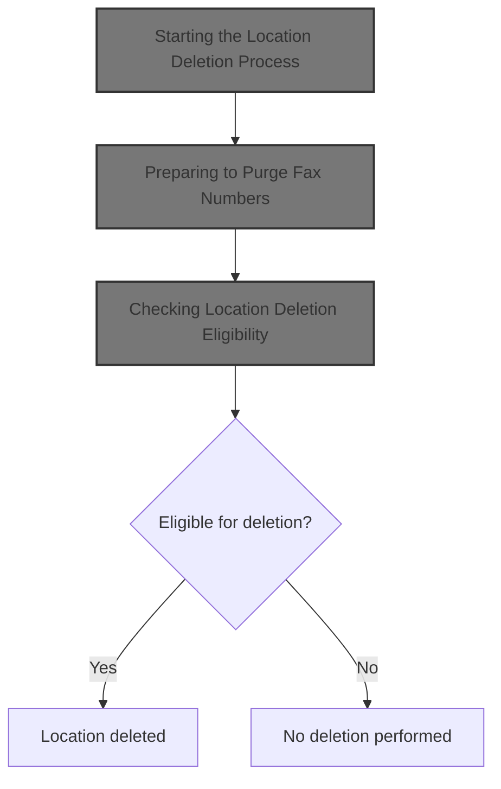
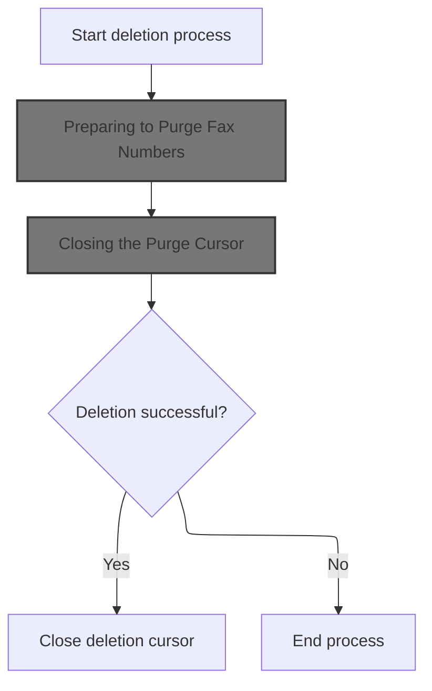
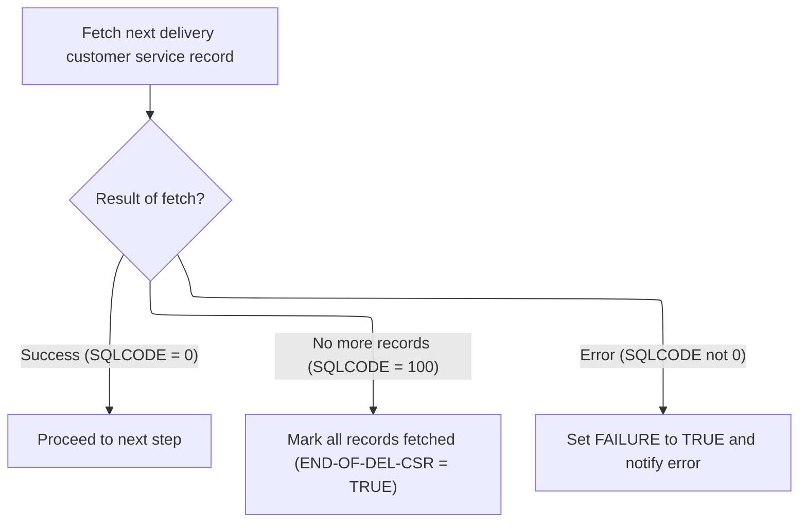
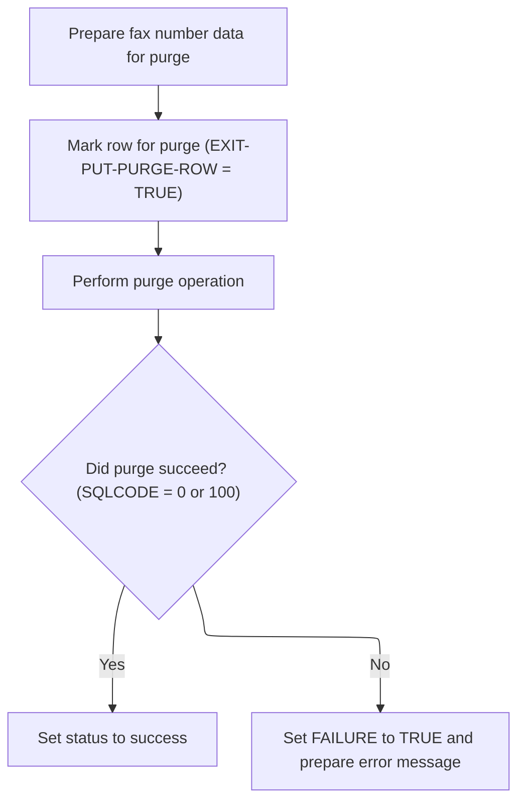
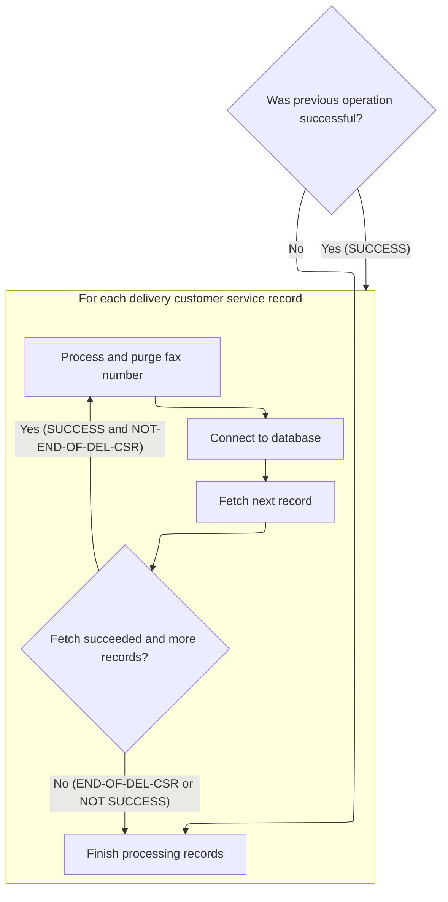
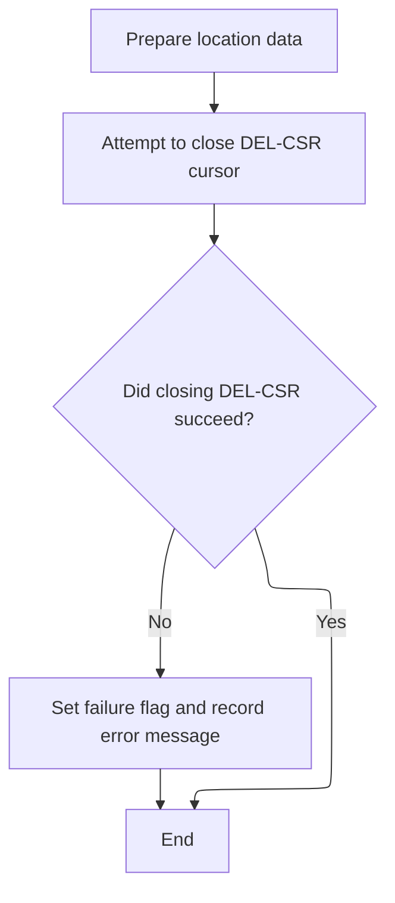
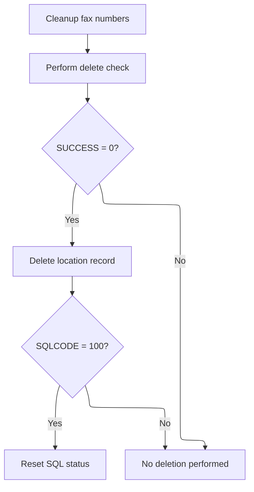

This document describes the process for deleting a location within our location management system. When a request to delete a location is received, the system first purges all fax numbers linked to that location to ensure data integrity. After purging, the flow checks if the location is eligible for deletion according to business rules, and if so, deletes the location record.



# Spec

## Detailed View of the Program's Functionality

# Detailed Explanation of the Location Deletion Flow

## a. Starting the Location Deletion Process

The deletion process for a location begins by initiating a routine that first ensures all fax numbers associated with the location are purged. This is a critical prerequisite to prevent any dangling references before the location itself is deleted. The process is as follows:

1. The main deletion routine is called.
2. The first action is to perform a subroutine that handles the purging of fax numbers tied to the location.
3. After fax numbers are handled, the process checks if the location is eligible for deletion by invoking a check routine.
4. If the check passes (i.e., no dependencies or business rules block deletion), the actual deletion of the location record is performed.
5. If the deletion operation returns a specific code indicating "not found" (i.e., the record was already gone), the status code is reset to a neutral value.
6. If the check fails, the process ends without deleting the location.

## b. Preparing to Purge Fax Numbers

The fax purge routine is responsible for cleaning up all fax records linked to the location. The steps are:

1. A flag is set to indicate that the end of the fax deletion cursor has not been reached.
2. The deletion cursor is opened, which will allow the program to iterate over all fax records for the location.
3. If the cursor opens successfully, the program enters a loop:
   - It fetches the next fax record.
   - If a record is found and the operation is successful, it proceeds to purge that fax number and reconnects to the database.
   - This loop continues until all records are processed or an error occurs.
4. After the loop, the deletion cursor is closed to release resources.

## c. Fetching Records for Purge

Within the fax purge loop, the following actions are performed for each fax record:

1. The next fax record is fetched from the database cursor into a working area.
2. The result of the fetch is evaluated:
   - If successful, processing continues.
   - If there are no more records (end-of-data), a flag is set to exit the loop.
   - If an error occurs, a failure flag is set and a diagnostic message is prepared.

## d. Purging a Fax Record

For each fax record fetched, the following steps are executed:

1. The fax number, location type, and location number are prepared for the purge operation.
2. A flag is set to indicate that a purge operation should be performed.
3. The actual purge (delete) operation is invoked via a data access routine.
4. After the operation, the result is checked:
   - If successful or if the record was already gone, the status is reset.
   - If an error occurred, a failure flag is set and an error message is built for diagnostics.

## e. Finalizing the Fax Purge Loop

After all fax records have been processed (or an error occurs), the following happens:

1. The deletion cursor is closed to clean up resources.
2. If closing the cursor fails, a failure flag is set and an error message is prepared.

## f. Closing the Purge Cursor

The cursor close routine does the following:

1. Copies the location type and number from the main location structure to the fax numbers structure to ensure the correct context.
2. Issues the command to close the deletion cursor.
3. Checks the result:
   - If successful, nothing further is needed.
   - If an error occurs, a failure flag is set and an error message is prepared.

## g. Checking Location Deletion Eligibility

After fax numbers are purged, the process checks if the location can be deleted:

1. A structure is initialized and populated with the location's type and number.
2. Flags are set to indicate that a delete check is being performed, and that the operation is for the location context and Oracle database.
3. An external routine is called to verify if deletion is allowed (e.g., no business rule violations or dependencies).
4. If the check passes, the actual deletion routine is called to remove the location from the database.
5. If the deletion returns a "not found" code, the status is reset.
6. If the check fails, the process ends without deleting the location.

---

This flow ensures that all dependent fax records are safely removed before a location is deleted, and that all operations are checked for success or failure, with appropriate error handling and cleanup at each step. The process is modular, with clear separation between purging dependent records, checking business rules, and performing the final deletion.

# Rule Definition

| Paragraph Name                                                                                                                           | Rule ID | Category          | Description                                                                                                                                                                                                                                                               | Conditions                                                                                | Remarks                                                                                                                                                                |
| ---------------------------------------------------------------------------------------------------------------------------------------- | ------- | ----------------- | ------------------------------------------------------------------------------------------------------------------------------------------------------------------------------------------------------------------------------------------------------------------------- | ----------------------------------------------------------------------------------------- | ---------------------------------------------------------------------------------------------------------------------------------------------------------------------- |
| Spec, 100-INITIALIZATION, 110-MOVE-PDA-FIELDS-2-DCL                                                                                      | RL-001  | Data Assignment   | The system must accept a deletion request containing a location type code and location number as input. These values are used as keys for all subsequent operations.                                                                                                      | A deletion request is received with both location type code and location number provided. | Location type code: string; Location number: number. These are used as keys for all operations.                                                                        |
| Spec, 1690-DELETE-LO, 1691-EXIT-PUT-PURGE-FAX-NUM, 1692-OPEN-DEL-CSR, 1693-FETCH-DEL-CSR, 1694-EXIT-PURGE-FAX-NUM, 3000-NNNS0483-FAX-DAO | RL-002  | Computation       | Before deleting a location, the system must delete all fax numbers associated with the location. Fax numbers are identified by matching the location type code and location number. Each fax number is deleted using its FAX-ID, location type code, and location number. | A location deletion is requested; fax numbers exist for the location.                     | Fax numbers are identified in the XXX_NUMBERS table by matching location type code and location number. Deletion uses FAX-ID, location type code, and location number. |
| Spec, 1691-EXIT-PUT-PURGE-FAX-NUM, 1693-FETCH-DEL-CSR, 1694-EXIT-PURGE-FAX-NUM                                                           | RL-003  | Conditional Logic | If any error occurs during the fax number purge, the system must halt the deletion process, set the output success flag to 'N', and provide an error message in the specified format.                                                                                     | An error occurs during the deletion of any fax number associated with the location.       | Error message format: 'NNNS0487 - <Description>, SQLCODE= <code>.' Success flag: 'N'.                                                                                  |
| Spec, 1690-DELETE-LO, 4500-CALL-MMMS0304-RI-DEL-CHK                                                                                      | RL-004  | Conditional Logic | After all fax numbers are purged, the system must check if the location is eligible for deletion by verifying business rules and dependencies.                                                                                                                            | All fax numbers for the location have been successfully deleted.                          | Eligibility check may involve calling external routines or checking dependencies. If not eligible, process must not proceed.                                           |
| Spec, 1690-DELETE-LO, 5000-CALL-NNNS0487-CUD-ROUTINE                                                                                     | RL-005  | Computation       | If the location is eligible for deletion, delete the location record from the XXXATION table using the location type code and location number as keys.                                                                                                                    | Location is eligible for deletion (no dependencies or constraints block deletion).        | Location record is deleted from XXXATION table using location type code and location number as keys.                                                                   |
| Spec, 1690-DELETE-LO, 1691-EXIT-PUT-PURGE-FAX-NUM, 1694-EXIT-PURGE-FAX-NUM, 1690-DELETE-LO (error handling)                              | RL-006  | Conditional Logic | After attempting to delete the location, set the output success flag to 'Y' if successful and leave the error message blank. If any error occurs, set the flag to 'N' and provide an error message in the specified format.                                               | Location deletion attempted; check result of operation.                                   | Output: success flag ('Y' or 'N'), error message (blank if success, otherwise 'NNNS0487 - <Description>, SQLCODE= <code>.').                                           |

# User Stories

## User Story 1: Request and Fax Number Purge

---

### Story Description:

As a system, I want to accept a location deletion request and purge all associated fax numbers so that the location can be safely deleted only if all related fax numbers are removed and errors are handled appropriately.

---

### Business Rule Mapping:

| Rule ID | Paragraph Name                                                                                                                           | Rule Description                                                                                                                                                                                                                                                          |
| ------- | ---------------------------------------------------------------------------------------------------------------------------------------- | ------------------------------------------------------------------------------------------------------------------------------------------------------------------------------------------------------------------------------------------------------------------------- |
| RL-001  | Spec, 100-INITIALIZATION, 110-MOVE-PDA-FIELDS-2-DCL                                                                                      | The system must accept a deletion request containing a location type code and location number as input. These values are used as keys for all subsequent operations.                                                                                                      |
| RL-002  | Spec, 1690-DELETE-LO, 1691-EXIT-PUT-PURGE-FAX-NUM, 1692-OPEN-DEL-CSR, 1693-FETCH-DEL-CSR, 1694-EXIT-PURGE-FAX-NUM, 3000-NNNS0483-FAX-DAO | Before deleting a location, the system must delete all fax numbers associated with the location. Fax numbers are identified by matching the location type code and location number. Each fax number is deleted using its FAX-ID, location type code, and location number. |
| RL-003  | Spec, 1691-EXIT-PUT-PURGE-FAX-NUM, 1693-FETCH-DEL-CSR, 1694-EXIT-PURGE-FAX-NUM                                                           | If any error occurs during the fax number purge, the system must halt the deletion process, set the output success flag to 'N', and provide an error message in the specified format.                                                                                     |

---

### Relevant Functionality:

- **Spec**
  1. **RL-001:**
     - Receive deletion request with location type code and location number
     - Assign these values to working storage for use in all subsequent operations
  2. **RL-002:**
     - Open cursor to select all fax numbers for the given location type code and location number
     - For each fax number found:
       - Delete the fax number record using FAX-ID, location type code, and location number
       - If any error occurs, halt process and return error
  3. **RL-003:**
     - If any SQL error occurs during fax number deletion:
       - Set success flag to 'N'
       - Format error message as 'NNNS0487 - <Description>, SQLCODE= <code>.'
       - Stop further processing

## User Story 2: Location Eligibility and Deletion

---

### Story Description:

As a system, I want to verify the eligibility of a location for deletion, delete the location if eligible, and provide a clear status and error message so that users are informed of the outcome and any issues encountered.

---

### Business Rule Mapping:

| Rule ID | Paragraph Name                                                                                              | Rule Description                                                                                                                                                                                                            |
| ------- | ----------------------------------------------------------------------------------------------------------- | --------------------------------------------------------------------------------------------------------------------------------------------------------------------------------------------------------------------------- |
| RL-004  | Spec, 1690-DELETE-LO, 4500-CALL-MMMS0304-RI-DEL-CHK                                                         | After all fax numbers are purged, the system must check if the location is eligible for deletion by verifying business rules and dependencies.                                                                              |
| RL-005  | Spec, 1690-DELETE-LO, 5000-CALL-NNNS0487-CUD-ROUTINE                                                        | If the location is eligible for deletion, delete the location record from the XXXATION table using the location type code and location number as keys.                                                                      |
| RL-006  | Spec, 1690-DELETE-LO, 1691-EXIT-PUT-PURGE-FAX-NUM, 1694-EXIT-PURGE-FAX-NUM, 1690-DELETE-LO (error handling) | After attempting to delete the location, set the output success flag to 'Y' if successful and leave the error message blank. If any error occurs, set the flag to 'N' and provide an error message in the specified format. |

---

### Relevant Functionality:

- **Spec**
  1. **RL-004:**
     - After fax purge, call routine to check location deletion eligibility
     - If not eligible, set success flag to 'N', provide error message, and halt
  2. **RL-005:**
     - If eligibility check passes:
       - Delete location record from XXXATION table using location type code and location number
       - If error occurs, handle as per error rule
  3. **RL-006:**
     - If location deletion is successful:
       - Set success flag to 'Y'
       - Set error message to blank
     - If error occurs:
       - Set success flag to 'N'
       - Format error message as 'NNNS0487 - <Description>, SQLCODE= <code>.'

# Code Walkthrough

## Starting the Location Deletion Process



<SwmSnippet path="/base/src/NNNS0487.cbl" line="2954">

---

In `1690-DELETE-LO` we kick off the deletion flow by calling 1691-EXIT-PUT-PURGE-FAX-NUM. This step handles removing any fax numbers tied to the location, making sure we don't leave behind any dangling references. We call 1691-EXIT-PUT-PURGE-FAX-NUM first because cleaning up these records is a prerequisite before we check if the location itself can be deleted.

```cobol
303100 1690-DELETE-LO.                                                  00303100
303200     PERFORM 1691-EXIT-PUT-PURGE-FAX-NUM                          00303200
303300                                                                  00303300
303400     PERFORM 4500-CALL-MMMS0304-RI-DEL-CHK                        00303400
```

---

</SwmSnippet>

### Preparing to Purge Fax Numbers

<SwmSnippet path="/base/src/NNNS0487.cbl" line="2968">

---

In `1691-EXIT-PUT-PURGE-FAX-NUM` we set up for purging by marking NOT-END-OF-DEL-CSR as true and opening the deletion cursor. This lets us fetch and process each fax record that needs to be purged.

```cobol
304500 1691-EXIT-PUT-PURGE-FAX-NUM.                                     00304500
304600     SET NOT-END-OF-DEL-CSR TO TRUE                               00304600
304700     PERFORM 1692-OPEN-DEL-CSR                                    00304700
```

---

</SwmSnippet>

<SwmSnippet path="/base/src/NNNS0487.cbl" line="2971">

---

After opening the cursor, we loop and call 1693-FETCH-DEL-CSR to grab each fax record. This lets us process each one in turn. We need to fetch next so we know which record to purge, and we keep looping until we're done or hit an error.

```cobol
304800     IF SUCCESS                                                   00304800
304900       PERFORM UNTIL END-OF-DEL-CSR OR NOT SUCCESS                00304900
305000         PERFORM 1693-FETCH-DEL-CSR                               00305000
305100         IF SUCCESS AND NOT-END-OF-DEL-CSR                        00305100
305200           PERFORM 1694-EXIT-PURGE-FAX-NUM                        00305200
305300           PERFORM 115-CONNECT-TO-ORACLE                          00305300
305400         END-IF                                                   00305400
305500       END-PERFORM                                                00305500
305600     END-IF                                                       00305600
305700     PERFORM 1695-CLOSE-DEL-CSR                                   00305700
```

---

</SwmSnippet>

#### Fetching Records for Purge



<SwmSnippet path="/base/src/NNNS0487.cbl" line="3005">

---

In `1693-FETCH-DEL-CSR` we fetch the next fax record from the cursor into DCLXXX-NUMBERS.FAX-ID. The SQLCODE is checked right after: 0 means keep going, 100 means we're done, and anything else sets FAILURE and logs the error.

```cobol
308200 1693-FETCH-DEL-CSR.                                              00308200
308300     EXEC SQL                                                     00308300
308400         FETCH DEL-CSR                                            00308400
308500         INTO  :DCLXXX-NUMBERS.FAX-ID                             00308500
308600     END-EXEC                                                     00308600
```

---

</SwmSnippet>

<SwmSnippet path="/base/src/NNNS0487.cbl" line="3011">

---

After fetching, we evaluate SQLCODE. If it's 100, END-OF-DEL-CSR is set to stop the loop. If it's anything else (not 0), FAILURE is set and an error message is built for diagnostics.

```cobol
308800     EVALUATE TRUE                                                00308800
308900       WHEN SQLCODE = 0                                           00308900
309000         CONTINUE                                                 00309000
309100       WHEN SQLCODE = 100                                         00309100
309200         SET  END-OF-DEL-CSR TO TRUE                              00309200
309300         MOVE 0 TO SQLCODE                                        00309300
309400       WHEN SQLCODE NOT = 0                                       00309400
309500         MOVE SQLCODE TO WS-SQLCODE                               00309500
309600         SET FAILURE TO TRUE                                      00309600
309700         MOVE SPACES  TO IS-RTRN-MSG-TXT                          00309700
309800         STRING 'NNNS0487 - ERROR FETCHING DEL-CSR, '             00309800
309900                'SQLCODE=' WS-SQLCODE '.'                         00309900
310000                DELIMITED BY SIZE INTO IS-RTRN-MSG-TXT            00310000
310100     END-EVALUATE                                                 00310100
```

---

</SwmSnippet>

#### Purging a Fax Record



<SwmSnippet path="/base/src/NNNS0487.cbl" line="3028">

---

In `1694-EXIT-PURGE-FAX-NUM` we prep the DAO call by moving the fax ID, location type, and location number into P-DDDTFX01, set the purge flag, then call the DAO routine to delete the fax record.

```cobol
310500 1694-EXIT-PURGE-FAX-NUM.                                         00310500
310600                                                                  00310600
310700     MOVE FAX-ID             OF DCLXXX-NUMBERS                    00310700
310800       TO FAX-ID             OF P-DDDTFX01                        00310800
310900     MOVE LOC-TYP-CD         OF DCLXXX-NUMBERS                    00310900
311000       TO LOC-TYP-CD         OF P-DDDTFX01                        00311000
311100     MOVE LOC-NBR            OF DCLXXX-NUMBERS                    00311100
311200       TO LOC-NBR            OF P-DDDTFX01                        00311200
311300     SET EXIT-PUT-PURGE-ROW TO TRUE                               00311300
311400     PERFORM 3000-NNNS0483-FAX-DAO                                00311400
```

---

</SwmSnippet>

<SwmSnippet path="/base/src/NNNS0487.cbl" line="3039">

---

After the DAO call, we check SQLCODE. If it's 0 or 100, we reset SQLCODE and move on. If it's anything else, FAILURE is set and an error message is built with the SQLCODE for troubleshooting.

```cobol
311600     EVALUATE TRUE                                                00311600
311700       WHEN SQLCODE = 0 OR 100                                    00311700
311800         MOVE 0 TO SQLCODE                                        00311800
311900       WHEN OTHER                                                 00311900
312000         MOVE SQLCODE TO WS-SQLCODE                               00312000
312100         SET FAILURE TO TRUE                                      00312100
312200         MOVE SPACES  TO IS-RTRN-MSG-TXT                          00312200
312300         MOVE SQLCODE TO WS-SQLCODE                               00312300
312400         STRING 'NNNS0487 - ERROR IN DELETE OF FAX'               00312400
312500                'PROD ,RC=' WS-SQLCODE '.'                        00312500
312600                DELIMITED BY SIZE INTO IS-RTRN-MSG-TXT            00312600
312700     END-EVALUATE                                                 00312700
```

---

</SwmSnippet>

#### Finalizing the Fax Purge Loop



<SwmSnippet path="/base/src/NNNS0487.cbl" line="2971">

---

Back in `1691-EXIT-PUT-PURGE-FAX-NUM`, after reconnecting to Oracle and finishing the purge loop, we close the deletion cursor to clean up resources and wrap up the purge process.

```cobol
304800     IF SUCCESS                                                   00304800
304900       PERFORM UNTIL END-OF-DEL-CSR OR NOT SUCCESS                00304900
305000         PERFORM 1693-FETCH-DEL-CSR                               00305000
305100         IF SUCCESS AND NOT-END-OF-DEL-CSR                        00305100
305200           PERFORM 1694-EXIT-PURGE-FAX-NUM                        00305200
305300           PERFORM 115-CONNECT-TO-ORACLE                          00305300
305400         END-IF                                                   00305400
305500       END-PERFORM                                                00305500
305600     END-IF                                                       00305600
305700     PERFORM 1695-CLOSE-DEL-CSR                                   00305700
```

---

</SwmSnippet>

### Closing the Purge Cursor



<SwmSnippet path="/base/src/NNNS0487.cbl" line="3054">

---

In `1695-CLOSE-DEL-CSR` we copy location type and number from DCLXXXATION to DCLXXX-NUMBERS, then close the deletion cursor. This sets up the right context for the close and handles any errors if the close fails.

```cobol
313100 1695-CLOSE-DEL-CSR.                                              00313100
313200     MOVE LOC-TYP-CD                 OF DCLXXXATION               00313200
313300       TO LOC-TYP-CD                 OF DCLXXX-NUMBERS            00313300
313400     MOVE LOC-NBR                    OF DCLXXXATION               00313400
313500       TO LOC-NBR                    OF DCLXXX-NUMBERS            00313500
313600                                                                  00313600
313700     EXEC SQL                                                     00313700
313800       CLOSE DEL-CSR                                              00313800
313900     END-EXEC                                                     00313900
```

---

</SwmSnippet>

<SwmSnippet path="/base/src/NNNS0487.cbl" line="3064">

---

After closing the cursor, we check SQLCODE. If it's not zero, we set FAILURE and build an error message with the SQLCODE for troubleshooting.

```cobol
314100     IF SQLCODE NOT = 0                                           00314100
314200       MOVE SQLCODE TO WS-SQLCODE                                 00314200
314300       SET  FAILURE TO TRUE                                       00314300
314400       MOVE SPACES  TO IS-RTRN-MSG-TXT                            00314400
314500       STRING 'NNNS0487 - ERROR CLOSING DEL-CSR, '                00314500
314600              'SQL=' WS-SQLCODE '.'                               00314600
314700              DELIMITED BY SIZE INTO IS-RTRN-MSG-TXT              00314700
314800     END-IF                                                       00314800
```

---

</SwmSnippet>

### Checking Location Deletion Eligibility



<SwmSnippet path="/base/src/NNNS0487.cbl" line="2954">

---

After finishing the fax purge in `1690-DELETE-LO`, we call 4500-CALL-MMMS0304-RI-DEL-CHK to verify if the location can actually be deleted. This step checks for any remaining dependencies or business rules before proceeding.

```cobol
303100 1690-DELETE-LO.                                                  00303100
303200     PERFORM 1691-EXIT-PUT-PURGE-FAX-NUM                          00303200
303300                                                                  00303300
303400     PERFORM 4500-CALL-MMMS0304-RI-DEL-CHK                        00303400
```

---

</SwmSnippet>

<SwmSnippet path="/base/src/NNNS0487.cbl" line="3353">

---

`4500-CALL-MMMS0304-RI-DEL-CHK` sets up the delete check by initializing the MMMC0304 structure, copying location info, and setting flags for delete, Oracle, and context. Then it calls the external routine to verify if deletion is allowed.

```cobol
343000 4500-CALL-MMMS0304-RI-DEL-CHK.                                   00343000
343100     INITIALIZE MMMC0304                                          00343100
343200     MOVE LOC-TYP-CD OF DCLXXXATION    TO                         00343200
343300                                      MMMC0304-LOC-TYP-CD         00343300
343400     MOVE LOC-NBR OF DCLXXXATION      TO                          00343400
343500                                      MMMC0304-LOC-NBR            00343500
343600     SET MMMC0304-DELETE-CHECK TO TRUE                            00343600
343700     SET MMMC0304-XXXATION     TO TRUE                            00343700
343800     SET MMMC0304-ORACLE       TO TRUE                            00343800
343900     CALL MMMS0304-RI-DEL-CHK USING                               00343900
344000          XXXN001A                                                00344000
344100          MMMC0304                                                00344100
344200     .                                                            00344200
```

---

</SwmSnippet>

<SwmSnippet path="/base/src/NNNS0487.cbl" line="2958">

---

After returning from 4500-CALL-MMMS0304-RI-DEL-CHK in `1690-DELETE-LO`, if everything checks out (SUCCESS), we call 5000-CALL-NNNS0487-CUD-ROUTINE to update the database. If SQLCODE is 100, we reset it to 0 to keep things clean.

```cobol
303500     IF SUCCESS                                                   00303500
303600        PERFORM 5000-CALL-NNNS0487-CUD-ROUTINE                    00303600
303700                                                                  00303700
303800        IF SQLCODE = 100                                          00303800
303900           MOVE 0 TO SQLCODE                                      00303900
304000        END-IF                                                    00304000
304100     END-IF                                                       00304100
```

---

</SwmSnippet>

&nbsp;

*This is an auto-generated document by Swimm 🌊 and has not yet been verified by a human*

<SwmMeta version="3.0.0" repo-id="Z2l0aHViJTNBJTNBU3dpbW1pby1keW5jYWxsLWRlbW8lM0ElM0FHaXJpLVN3aW1t" repo-name="Swimmio-dyncall-demo"><sup>Powered by [Swimm](https://app.swimm.io/)</sup></SwmMeta>
