This document describes the flow for updating the status of a location. The process starts with a location status update request, retrieves the latest location data, synchronizes the status code, and updates the active/inactive flags. Business events are triggered when location status changes, resulting in an updated location record and relevant events.

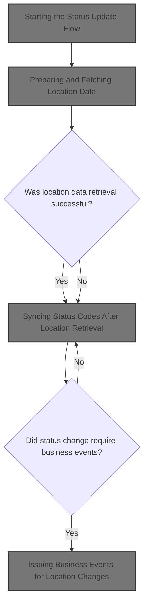

# Spec

## Detailed View of the Program's Functionality

# Status Update Flow and Location Data Synchronization

## a. Starting the Status Update Flow

The process begins by initiating a status update for a location. Before any data retrieval or update, the current set of exit codes is saved into a working storage area. This is a precaution to ensure that if any subsequent operations modify the exit codes (which are used to signal the outcome of operations), the original values can be restored later.

Next, the system prepares to fetch the latest location data by calling a routine responsible for retrieving this information from the database. The outcome of this retrieval determines the next steps:

- If the retrieval is successful, the system proceeds to synchronize the status code and finalize the status.
- If the retrieval fails, the system skips the synchronization and directly finalizes the status, restoring the original exit codes.

## b. Preparing and Fetching Location Data

To fetch location data, the system:

- Initializes the data structure used for the database call.
- Copies the location number and type from the input area into the structure used for the database operation.
- Sets a flag indicating that a unique row should be fetched.
- Calls the location DAO (Data Access Object) logic, which is implemented in a separate program.

After the DAO call, the system checks if the operation was successful (i.e., no errors and the SQL code is zero). If not, it sets a failure flag and prepares an error message containing the SQL code for diagnostic purposes.

## c. Delegating to Location DAO Logic

The DAO logic is responsible for all direct interactions with the location database. It receives the prepared data structures and performs the requested operation (fetch, update, insert, or delete). The DAO is implemented as a separate program, which allows for modularity and reuse.

## d. Handling Location Data Retrieval Results

After attempting to retrieve location data, the system evaluates the result:

- If the operation was not successful or the SQL code is not zero, it sets a failure flag and constructs an error message with the SQL code.
- If the operation was successful, it continues with the next steps.

## e. Syncing Status Codes After Location Retrieval

If the location data retrieval was successful, the system synchronizes the status code:

- It checks the retail location status code and sets the inactive switch in the output structure accordingly:
  - If the status code is 'A', the location is marked as active.
  - If the status code is 'X', blank, or any other value, the location is marked as inactive.
- The system then sets a flag to indicate that a modification operation should be performed and calls the DAO logic again to update the database with the new status.
- After the update, it checks if the operation was successful. If not, it sets a failure flag and prepares an error message with the SQL code.

## f. Finalizing and Cleaning Up After Location Operations

At the end of the process, the system performs exit processing:

- If the last operation was successful and not a cursor close, it moves the updated data to the output area and increments a checkpoint counter.
- If the operation involved Oracle or was an insert, modify, or purge, it connects to the DB2 database to ensure consistency.
- The SQL code from the last operation is stored in a dedicated variable for further use or reporting.

## g. Transferring and Formatting Location Data for Output

When transferring data for output:

- All location and contact details are copied from the internal structure to the output structure.
- Date fields set to a default value (such as '01/01/1600') are cleared to avoid displaying placeholder dates.
- The system checks if the location is marked as direct ship and updates the status accordingly.
- Shipping days and cutoff times are transferred and formatted, with special handling for null or default times.
- If the location is a direct store vendor and the environment is correct, the system connects to DB2 and checks the DSV (Direct Store Vendor) status.

## h. Validating Direct Store Vendor Status

To validate if a location is a DSV:

- The system prepares the location number and type.
- By default, it marks the location as not a DSV.
- It calls a routine to check the DSV status.
- If the check is successful and the vendor is a DSV, it updates the flag accordingly.

## i. Coordinating Time/Timestamp Conversion Logic

When converting between time and timestamp formats:

- The system initializes the relevant fields.
- It moves the time values into a conversion area and calls a conversion routine.
- If the conversion is successful, the results are moved back into the appropriate fields.
- If not, an error message is prepared.

## j. Formatting User-Facing Error Messages

When an Oracle error occurs:

- The error message is split into parts, and the Oracle error code is extracted.
- The code is mapped to a corresponding system SQL code using a large switch statement.
- If the code is not recognized, a generic error message is constructed.
- The error message is cleared after processing to avoid confusion in subsequent operations.

## k. Purging a Location Record

When purging (deleting) a location:

- The system first cleans up related fax number data by opening a cursor and iterating over all fax records associated with the location, deleting each one.
- It then checks if deletion is allowed by calling a referential integrity check.
- If deletion is allowed, it performs the delete operation.
- If the database indicates that no matching record was found, it resets the SQL code to zero.
- Any errors encountered during these steps are captured and reported.

## l. Final Notes

Throughout the process, the system uses flags and status codes to control the flow and ensure that errors are handled gracefully. All database operations are wrapped with error checking, and user-facing messages are constructed to aid in troubleshooting. The modular design, with separate routines for each major operation, allows for easier maintenance and extensibility.

# Rule Definition

| Paragraph Name                                                                                                                | Rule ID | Category          | Description                                                                                                                                                                                                          | Conditions                                                                                        | Remarks                                                                                                                                                                  |
| ----------------------------------------------------------------------------------------------------------------------------- | ------- | ----------------- | -------------------------------------------------------------------------------------------------------------------------------------------------------------------------------------------------------------------- | ------------------------------------------------------------------------------------------------- | ------------------------------------------------------------------------------------------------------------------------------------------------------------------------ |
| 110-MOVE-PDA-FIELDS-2-DCL, 130-MOVE-DCL-2-PDA-FIELDS, 1700-CHECK-NULL-COLUMNS, 1800-EDIT-NULL-INDICATORS (NNNS0487, NNNS0488) | RL-001  | Conditional Logic | Date fields set to '01/01/1600' and time fields set to '00:00:01' (or equivalent) must be treated as null/unset in both business logic and output formatting. When outputting, these fields must be blanked out.     | A date field is set to '01/01/1600' or a time field is set to '00:00:01' (or equivalent default). | Date sentinel: '01/01/1600'. Time sentinel: '00:00:01' (NNNS0487), '00.00.00' (NNNS0488). Output format: blank string for unset/null dates/times.                        |
| 110-MOVE-PDA-FIELDS-2-DCL, 120-EVALUATE TRUE, 130-MOVE-DCL-2-PDA-FIELDS, 2030-ISSUE-EVENTS (NNNS0487, NNNS0488)               | RL-002  | Conditional Logic | Business logic must branch according to the value of LOC-TYP-CD, affecting event issuance, DAO routines, and field population. Supported values: 'V', 'D', 'S', 'A', 'W', 'B', 'T', 'O'.                             | LOC-TYP-CD is one of the supported values.                                                        | LOC-TYP-CD values: 'V' (Vendor), 'D' (DSD Vendor), 'S' (Store), 'A' (Account), 'W' (Warehouse), 'B' (Backhaul), 'T' (Terminal), 'O' (Other).                             |
| 1700-CHECK-NULL-COLUMNS, 1800-EDIT-NULL-INDICATORS (NNNS0487, NNNS0488)                                                       | RL-003  | Conditional Logic | For AP-NBR and AP-TYP-CD, the system must use null indicator variables. If the indicator is negative, the field is considered null.                                                                                  | Null indicator variable for AP-NBR or AP-TYP-CD is negative.                                      | Null indicator: S9(4) COMP, negative value means null. Output: AP-NBR set to 0, AP-TYP-CD set to spaces if null.                                                         |
| 130-MOVE-DCL-2-PDA-FIELDS, 120-EXIT-STUFF (NNNS0487, NNNS0488)                                                                | RL-004  | Data Assignment   | The system must output a location record with all fields populated from the database or reflecting changes after update/insert/delete, using the same structure as input. No arrays or repeating groups are allowed. | After any fetch, modify, insert, or purge operation.                                              | Output record structure matches input (P-DDDTLO01 or P-DDDTLR01). All fields are scalar. No arrays or repeating groups.                                                  |
| 0000-EXIT-DISPATCHER, 120-EXIT-STUFF (NNNS0487, NNNS0488)                                                                     | RL-005  | Data Assignment   | The system must accept operation flags indicating which operation to perform (fetch, modify, insert, purge), and must use status/result flags (SUCCESS, FAILURE, SQLCODE, IS-RTRN-MSG-TXT) to communicate results.   | Any operation is performed.                                                                       | Operation flags: fetch, modify, insert, purge. Status/result flags: SUCCESS, FAILURE, SQLCODE, IS-RTRN-MSG-TXT. Output: flags must be set according to operation result. |
| 300-CNV-ORACLE-SQLCODE (YYYS0211), 200-FORMAT-USER-MSG-TXT (YYYS0212)                                                         | RL-006  | Computation       | When an Oracle error occurs, convert the Oracle error code to the corresponding DB2 SQLCODE for consistent error handling.                                                                                           | SQLCODE is set to an Oracle error code.                                                           | Oracle error codes mapped to DB2 SQLCODEs as per mapping in YYYS0212. Example: Oracle '60' -> DB2 -911, '904'/'310' -> -206, etc.                                        |
| 2030-ISSUE-EVENTS, 2020-CALL-SYNC-SUBR, 2400-CHECK-FOR-DCM-EVENT (NNNS0487, NNNS0488)                                         | RL-007  | Conditional Logic | When certain fields change (e.g., location status, line of business), issue events and synchronize with external systems as required by business logic.                                                              | Relevant fields (e.g., location status, line of business) have changed during operation.          | Events are issued via calls to event manager routines, with transaction IDs and user/environment info populated.                                                         |

# User Stories

## User Story 1: Null/sentinel value handling for dates, times, and AP fields

---

### Story Description:

As a system user, I want the system to treat sentinel values for date ('01/01/1600'), time ('00:00:01'), and AP fields (using null indicators) as null/unset in both business logic and output, so that I receive accurate and meaningful data without misleading default values.

---

### Business Rule Mapping:

| Rule ID | Paragraph Name                                                                                                                | Rule Description                                                                                                                                                                                                 |
| ------- | ----------------------------------------------------------------------------------------------------------------------------- | ---------------------------------------------------------------------------------------------------------------------------------------------------------------------------------------------------------------- |
| RL-001  | 110-MOVE-PDA-FIELDS-2-DCL, 130-MOVE-DCL-2-PDA-FIELDS, 1700-CHECK-NULL-COLUMNS, 1800-EDIT-NULL-INDICATORS (NNNS0487, NNNS0488) | Date fields set to '01/01/1600' and time fields set to '00:00:01' (or equivalent) must be treated as null/unset in both business logic and output formatting. When outputting, these fields must be blanked out. |
| RL-003  | 1700-CHECK-NULL-COLUMNS, 1800-EDIT-NULL-INDICATORS (NNNS0487, NNNS0488)                                                       | For AP-NBR and AP-TYP-CD, the system must use null indicator variables. If the indicator is negative, the field is considered null.                                                                              |

---

### Relevant Functionality:

- **110-MOVE-PDA-FIELDS-2-DCL**
  1. **RL-001:**
     - When reading input, if a date field is blank or set to the zero/default date, set it to the sentinel value.
     - When outputting, if a date field is set to the sentinel value, output as blank.
     - When reading input, if a time field is blank or set to the zero/default time, set it to the sentinel value.
     - When outputting, if a time field is set to the sentinel value, output as blank.
- **1700-CHECK-NULL-COLUMNS**
  1. **RL-003:**
     - If AP-NBR indicator < 0 or AP-TYP-CD indicator < 0:
       - Set AP-NBR to 0
       - Set AP-TYP-CD to spaces
     - When outputting, ensure null indicators are set appropriately.

## User Story 2: Business logic branching and event issuance based on location type and field changes

---

### Story Description:

As a system user, I want the system to branch business logic according to the location type code (LOC-TYP-CD) and issue events or synchronize with external systems when relevant fields change, so that location processing and integrations behave correctly for different types and scenarios.

---

### Business Rule Mapping:

| Rule ID | Paragraph Name                                                                                                  | Rule Description                                                                                                                                                                         |
| ------- | --------------------------------------------------------------------------------------------------------------- | ---------------------------------------------------------------------------------------------------------------------------------------------------------------------------------------- |
| RL-007  | 2030-ISSUE-EVENTS, 2020-CALL-SYNC-SUBR, 2400-CHECK-FOR-DCM-EVENT (NNNS0487, NNNS0488)                           | When certain fields change (e.g., location status, line of business), issue events and synchronize with external systems as required by business logic.                                  |
| RL-002  | 110-MOVE-PDA-FIELDS-2-DCL, 120-EVALUATE TRUE, 130-MOVE-DCL-2-PDA-FIELDS, 2030-ISSUE-EVENTS (NNNS0487, NNNS0488) | Business logic must branch according to the value of LOC-TYP-CD, affecting event issuance, DAO routines, and field population. Supported values: 'V', 'D', 'S', 'A', 'W', 'B', 'T', 'O'. |

---

### Relevant Functionality:

- **2030-ISSUE-EVENTS**
  1. **RL-007:**
     - After update/insert/delete, compare relevant fields to previous values.
     - If changed, prepare event record with transaction ID, user, environment, and changed data.
     - Call event manager routine to issue event.
- **110-MOVE-PDA-FIELDS-2-DCL**
  1. **RL-002:**
     - Evaluate LOC-TYP-CD and branch logic accordingly:
       - For 'V', set AP-TYP-CD to vendor type, issue vendor events, call vendor DAO routines.
       - For 'D', set AP-TYP-CD to DSD type, issue DSD events, call DSD DAO routines.
       - For 'S', clear AP-NBR and AP-TYP-CD, issue store events, call store DAO routines.
       - For other codes, branch as per business requirements.

## User Story 3: Location record management and operation/result communication

---

### Story Description:

As a system user, I want to submit and receive location records with all scalar fields for location, contact, address, status, and operational information, specify which operation to perform (fetch, modify, insert, purge), and receive status/result flags (SUCCESS, FAILURE, SQLCODE, IS-RTRN-MSG-TXT) including consistent error code mapping, so that I can manage location data and understand the outcome of my requested operation.

---

### Business Rule Mapping:

| Rule ID | Paragraph Name                                                        | Rule Description                                                                                                                                                                                                     |
| ------- | --------------------------------------------------------------------- | -------------------------------------------------------------------------------------------------------------------------------------------------------------------------------------------------------------------- |
| RL-005  | 0000-EXIT-DISPATCHER, 120-EXIT-STUFF (NNNS0487, NNNS0488)             | The system must accept operation flags indicating which operation to perform (fetch, modify, insert, purge), and must use status/result flags (SUCCESS, FAILURE, SQLCODE, IS-RTRN-MSG-TXT) to communicate results.   |
| RL-004  | 130-MOVE-DCL-2-PDA-FIELDS, 120-EXIT-STUFF (NNNS0487, NNNS0488)        | The system must output a location record with all fields populated from the database or reflecting changes after update/insert/delete, using the same structure as input. No arrays or repeating groups are allowed. |
| RL-006  | 300-CNV-ORACLE-SQLCODE (YYYS0211), 200-FORMAT-USER-MSG-TXT (YYYS0212) | When an Oracle error occurs, convert the Oracle error code to the corresponding DB2 SQLCODE for consistent error handling.                                                                                           |

---

### Relevant Functionality:

- **0000-EXIT-DISPATCHER**
  1. **RL-005:**
     - Accept operation flag as input.
     - After operation, set SUCCESS if SQLCODE = 0, FAILURE if SQLCODE < 0, special handling for SQLCODE = 100 (not found).
     - Set IS-RTRN-MSG-TXT with error message if FAILURE.
- **130-MOVE-DCL-2-PDA-FIELDS**
  1. **RL-004:**
     - After operation, move all fields from working storage/database structure to output record.
     - Ensure all fields are scalar.
     - Do not use arrays or repeating groups in the output record.
- **300-CNV-ORACLE-SQLCODE (YYYS0211)**
  1. **RL-006:**
     - On Oracle error, extract Oracle error code from SQLERRMC.
     - Map Oracle error code to DB2 SQLCODE according to mapping table.
     - Set SQLCODE to mapped value.
     - If no mapping, set IS-RTRN-MSG-TXT to indicate unknown Oracle error.

# Code Walkthrough

## Starting the Status Update Flow

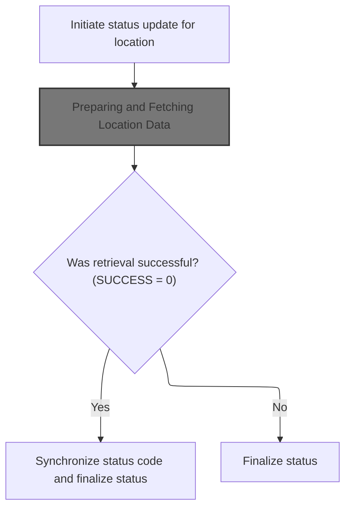

<SwmSnippet path="/base/src/NNNS0488.cbl" line="3799">

---

In `2100-UPD-STAT-IN-xxxation`, we kick off by saving the current exit codes to working storage, then immediately call 2200-GET-xxxation to fetch location data. This setup is needed because the get operation might change status flags, so we keep the original exit codes safe. The next step depends on whether the get was successful (SUCCESS flag), which, if true, leads to a sync operation. The flow is structured this way to avoid corrupting or losing exit codes during these operations.

```cobol
382000 2100-UPD-STAT-IN-xxxation.                                       00382000
382100     MOVE NNNN0000-EXIT-CODES TO WS-NNNN0000-EXIT-CODES           00382100
382200                                                                  00382200
382300     PERFORM 2200-GET-xxxation                                    00382300
```

---

</SwmSnippet>

### Preparing and Fetching Location Data

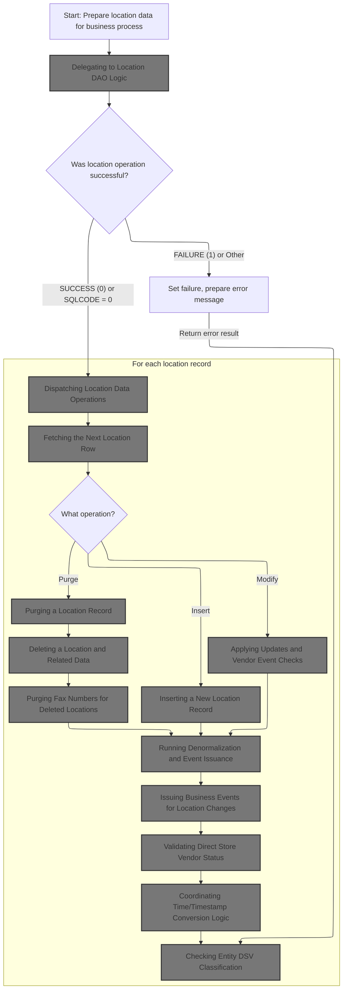

<SwmSnippet path="/base/src/NNNS0488.cbl" line="3814">

---

In `2200-GET-xxxation`, we prep the input for the DAO by copying location number and type from DCLXXXAIL-LOC into P-DDDTLO01. We then set the EXIT-GET-UNIQUE-ROW flag to TRUE, signaling that we want a unique row from the database. After that, we call 3000-CALL-LO-DAO to actually fetch the location data using these parameters.

```cobol
383500 2200-GET-xxxation.                                               00383500
383600     INITIALIZE P-DDDTLO01                                        00383600
383700     MOVE LOC-NBR                    OF DCLXXXAIL-LOC             00383700
383800       TO LOC-NBR                    OF P-DDDTLO01                00383800
383900     MOVE LOC-TYP-CD                 OF DCLXXXAIL-LOC             00383900
384000       TO LOC-TYP-CD                 OF P-DDDTLO01                00384000
384100                                                                  00384100
384200     SET EXIT-GET-UNIQUE-ROW         TO TRUE                      00384200
384300     PERFORM 3000-CALL-LO-DAO                                     00384300
```

---

</SwmSnippet>

#### Delegating to Location DAO Logic

<SwmSnippet path="/base/src/NNNS0488.cbl" line="3938">

---

`3000-CALL-LO-DAO` calls out to NNNS0487-LO-DAO, passing all the relevant data structures needed for location database operations. This step hands off control to the external program, which does the actual data access and manipulation. The next step is handled in NNNS0487.cbl, where the business logic for location data is implemented.

```cobol
396400 3000-CALL-LO-DAO.                                                00396400
396500     CALL NNNS0487-LO-DAO USING                                   00396500
396600          XXXN001A                                                00396600
396700          SQLCA                                                   00396700
396800          YYYN005A                                                00396800
396900          NNNN0000-PARMS                                          00396900
397000          P-DDDTLO01                                              00397000
397100     .                                                            00397100
```

---

</SwmSnippet>

#### Dispatching Location Data Operations

See <SwmLink doc-title="Managing Location Database Operations">[Managing Location Database Operations](\.swm\managing-location-database-operations.i3cicwq7.sw.md)</SwmLink>

#### Fetching the Next Location Row

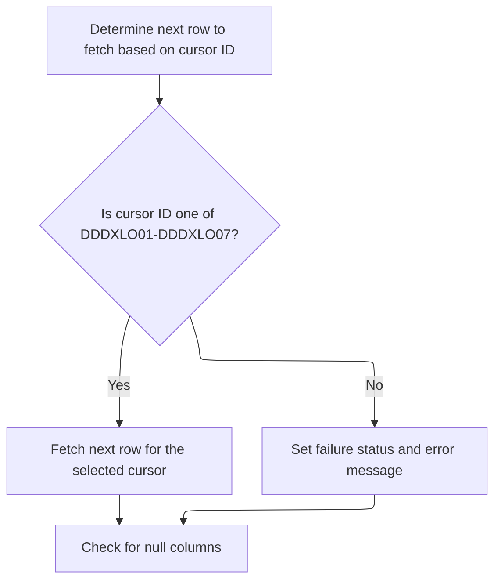

<SwmSnippet path="/base/src/NNNS0487.cbl" line="1697">

---

`1300-EXIT-GET-NEXT-ROW` picks the right fetch routine based on the cursor ID, then runs it to get location data. If the cursor ID doesn't match any known type, it sets a failure and logs an error. After fetching, it checks for null columns to clean up any invalid data.

```cobol
177400 1300-EXIT-GET-NEXT-ROW.                                          00177400
177500     EVALUATE TRUE                                                00177500
177600       WHEN DDDXLO01                                              00177600
177700         PERFORM 1301-FETCH-DDDXLO01                              00177700
177800       WHEN DDDXLO02                                              00177800
177900         PERFORM 1302-FETCH-DDDXLO02                              00177900
178000       WHEN DDDXLO03                                              00178000
178100         PERFORM 1303-FETCH-DDDXLO03                              00178100
178200       WHEN DDDXLO04                                              00178200
178300         PERFORM 1304-FETCH-DDDXLO04                              00178300
178400       WHEN DDDXLO05                                              00178400
178500         PERFORM 1305-FETCH-DDDXLO05                              00178500
178600       WHEN DDDXLO06                                              00178600
178700         PERFORM 1306-FETCH-DDDXLO06                              00178700
178800       WHEN DDDXLO07                                              00178800
178900         PERFORM 1307-FETCH-DDDXLO07                              00178900
179000       WHEN OTHER                                                 00179000
179100         SET FAILURE TO TRUE                                      00179100
179200         MOVE 'NNNS0487 - Invalid fetch cursor ID.'               00179200
179300           TO IS-RTRN-MSG-TXT OF XXXN001A                         00179300
179400     END-EVALUATE                                                 00179400
179500                                                                  00179500
179600     PERFORM 1700-CHECK-NULL-COLUMNS                              00179600
179700     .                                                            00179700
```

---

</SwmSnippet>

<SwmSnippet path="/base/src/NNNS0487.cbl" line="2055">

---

`1305-FETCH-DDDXLO05` runs an embedded SQL FETCH to pull a full set of location and contact fields from the DDDXLO05 cursor into the DCLXXXATION structure. This only works if the structure matches the database schema exactly.

```cobol
213200 1305-FETCH-DDDXLO05.                                             00213200
213300     EXEC SQL                                                     00213300
213400         FETCH DDDXLO05                                           00213400
213500         INTO  :DCLXXXATION.LOC-TYP-CD,                           00213500
213600               :DCLXXXATION.LOC-NBR,                              00213600
213700               :DCLXXXATION.LOC-NM,                               00213700
213800               :DCLXXXATION.LOC-ABB,                              00213800
213900               :DCLXXXATION.LGL-LOC-NAM,                          00213900
214000               :DCLXXXATION.PRIM-CONTACT-NM,                      00214000
214100               :DCLXXXATION.PRIM-ADR-1,                           00214100
214200               :DCLXXXATION.PRIM-ADR-2,                           00214200
214300               :DCLXXXATION.PRIM-ADR-3,                           00214300
214400               :DCLXXXATION.PRIM-ADR-4,                           00214400
214500               :DCLXXXATION.PRIM-CITY,                            00214500
214600               :DCLXXXATION.PRIM-CITY-ID,                         00214600
214700               :DCLXXXATION.PRIM-STATE-CD,                        00214700
214800               :DCLXXXATION.PRIM-ZIP5-CD,                         00214800
214900               :DCLXXXATION.PRIM-ZIP4-CD,                         00214900
215000               :DCLXXXATION.PRIM-PHN-CNTRY-CD,                    00215000
215100               :DCLXXXATION.PRIM-AREA-CD,                         00215100
215200               :DCLXXXATION.PRIM-PHONE-NBR,                       00215200
215300               :DCLXXXATION.PRIM-CNTRY-NM,                        00215300
215400               :DCLXXXATION.PRIM-CNTRY-ABB,                       00215400
215500               :DCLXXXATION.SEC-LOC-NM,                           00215500
215600               :DCLXXXATION.SEC-CONTACT-NM,                       00215600
215700               :DCLXXXATION.SEC-ADR-1,                            00215700
215800               :DCLXXXATION.SEC-ADR-2,                            00215800
215900               :DCLXXXATION.SEC-ADR-3,                            00215900
216000               :DCLXXXATION.SEC-ADR-4,                            00216000
216100               :DCLXXXATION.SEC-CITY,                             00216100
216200               :DCLXXXATION.SEC-STATE-CD,                         00216200
216300               :DCLXXXATION.SEC-ZIP5-CD,                          00216300
216400               :DCLXXXATION.SEC-ZIP4-CD,                          00216400
216500               :DCLXXXATION.SEC-PHN-CNTRY-CD,                     00216500
216600               :DCLXXXATION.SEC-AREA-CD,                          00216600
216700               :DCLXXXATION.SEC-PHONE-NBR,                        00216700
216800               :DCLXXXATION.SEC-CNTRY-NM,                         00216800
216900               :DCLXXXATION.SEC-CNTRY-ABB,                        00216900
217000               :DCLXXXATION.MAIL-TO-LOC-NM,                       00217000
217100               :DCLXXXATION.MAIL-TO-CNTCT-NM,                     00217100
217200               :DCLXXXATION.MAIL-TO-ADR-1,                        00217200
217300               :DCLXXXATION.MAIL-TO-ADR-2,                        00217300
217400               :DCLXXXATION.MAIL-TO-ADR-3,                        00217400
217500               :DCLXXXATION.MAIL-TO-ADR-4,                        00217500
217600               :DCLXXXATION.MAIL-TO-CITY,                         00217600
217700               :DCLXXXATION.MAIL-TO-STATE-CD,                     00217700
217800               :DCLXXXATION.MAIL-TO-ZIP5-CD,                      00217800
217900               :DCLXXXATION.MAIL-TO-ZIP4-CD,                      00217900
218000               :DCLXXXATION.MAIL-PHN-CNTRY-CD,                    00218000
218100               :DCLXXXATION.MAIL-TO-AREA-CD,                      00218100
218200               :DCLXXXATION.MAIL-TO-PHONE-NBR,                    00218200
218300               :DCLXXXATION.MAIL-TO-CNTRY-NM,                     00218300
218400               :DCLXXXATION.MAIL-TO-CNTRY-AB,                     00218400
218500               :DCLXXXATION.CURR-FAX-ID,                          00218500
218600               :DCLXXXATION.ADDED-DT,                             00218600
218700               :DCLXXXATION.DELETE-DT,                            00218700
218800               :DCLXXXATION.OPENED-DT,                            00218800
218900               :DCLXXXATION.CLOSED-DT,                            00218900
219000               :DCLXXXATION.INACTIVE-SW,                          00219000
219100               :DCLXXXATION.INACTIVE-DT,                          00219100
219200               :DCLXXXATION.AP-NBR:WS-AP-NBR-IND,                 00219200
219300               :DCLXXXATION.AP-TYP-CD:WS-AP-TYP-CD-IND,           00219300
219400               :DCLXXXATION.LST-UPDT-TS,                          00219400
219500               :DCLXXXATION.LST-UPDT-USR-ID,                      00219500
219600               :DCLXXXATION.PRIM-EMAIL-ID,                        00219600
219700               :DCLXXXATION.SECY-EMAIL-ID,                        00219700
219800               :DCLXXXATION.MAIL-TO-EMAIL-ID,                     00219800
219900               :DCLXXXATION.FAC-ID,                               00219900
220000               :DCLXXXATION.ORG-ID,                               00220000
220100               :DCLXXXATION.B2B-PRIM-RTNG-ID,                     00220100
220200               :DCLXXXATION.PRIM-CNTY-TXT,                        00220200
220300               :DCLXXXATION.SECY-CNTY-TXT,                        00220300
220400               :DCLXXXATION.MAIL-TO-CNTY-TXT,                     00220400
220500               :DCLXXXATION.DIR-SHP-LOC-SW,                       00220500
220600               :DCLXXXATION.LOC-ORD-PROCNG-DD,                    00220600
220700               :WS-ORD-PROCNG-CTOF-TM,                            00220700
220800               :DCLXXXATION.SCH-SHP-DD-TXT,                       00220800
220900               :DCLXXXATION.ORD-LEAD-TM-DD,                       00220900
221000               :DCLXXXATION.ORD-BUFFER-TM-DD                      00221000
221100     END-EXEC                                                     00221100
221200     .                                                            00221200
```

---

</SwmSnippet>

#### Modifying an Existing Location Record

See <SwmLink doc-title="Validating and Updating Location Data">[Validating and Updating Location Data](\.swm\validating-and-updating-location-data.q6j37zxl.sw.md)</SwmLink>

#### Applying Updates and Vendor Event Checks

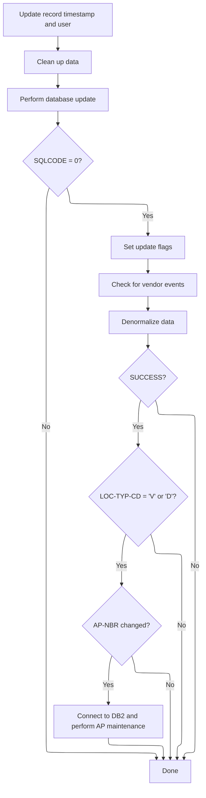

<SwmSnippet path="/base/src/NNNS0487.cbl" line="2457">

---

`1440-D0-MODIFY-ROW` updates timestamps and user info, cleans up data, then calls the CUD routine to update the database. If the update works, it sets a bunch of flags to mark which entities were changed, checks for vendor events, runs denormalization, and if needed, connects to DB2 and does AVP maintenance. The flow is chained to make sure all business rules are handled after a modification.

```cobol
253400 1440-D0-MODIFY-ROW.                                              00253400
253500     MOVE YYYC0127-TS   TO LST-UPDT-TS     OF DCLXXXATION         00253500
253600     MOVE YYYC0107-USER TO LST-UPDT-USR-ID OF DCLXXXATION         00253600
253700                                                                  00253700
253800     PERFORM 4010-REP-LOWVALUE-WITH-SPACES                        00253800
253900     PERFORM 5000-CALL-NNNS0487-CUD-ROUTINE                       00253900
254000                                                                  00254000
254100     IF SQLCODE = 0                                               00254100
254200       SET YYYN110A-UPD TO TRUE                                   00254200
254300       SET MMMC0265-MOD TO TRUE                                   00254300
254400       SET LOC-UPD      TO TRUE                                   00254400
254500       SET DSD-UPD      TO TRUE                                   00254500
254600       SET WHS-UPD      TO TRUE                                   00254600
254700       SET VEN-UPD      TO TRUE                                   00254700
254800       SET MODIFY-OPERATION TO TRUE                               00254800
254900       PERFORM 10100-CHECK-FOR-VNDR-EVENTS                        00254900
255000       PERFORM 2000-DENORM-PROCESS                                00255000
255100       IF SUCCESS                                                 00255100
255200         IF LOC-TYP-CD OF DCLXXXATION = 'V' OR 'D'                00255200
255300           IF AP-NBR OF DCLXXXATION NOT EQUAL MMMC0474-OLD-AP-NBR 00255300
255400             SET MMMC0474-UPD TO TRUE                             00255400
255500             PERFORM 125-CONNECT-TO-DB2                           00255500
255600             PERFORM 2050-DO-AVP-MAINTENANCE                      00255600
255700           END-IF                                                 00255700
255800         END-IF                                                   00255800
255900       END-IF                                                     00255900
256000     END-IF                                                       00256000
256100     .                                                            00256100
```

---

</SwmSnippet>

<SwmSnippet path="/base/src/NNNS0487.cbl" line="3411">

---

We check if any vendor contact fields changed, and set a flag to stage an event if they did.

```cobol
348800 10100-CHECK-FOR-VNDR-EVENTS.                                     00348800
348900     IF ((WS-MAIL-TO-LOC-NM  NOT = MAIL-TO-LOC-NM                 00348900
349000                                         OF DCLXXXATION ) OR      00349000
349100         (WS-MAIL-TO-ADR-1   NOT = MAIL-TO-ADR-1                  00349100
349200                                         OF DCLXXXATION ) OR      00349200
349300         (WS-MAIL-TO-ADR-2   NOT = MAIL-TO-ADR-2                  00349300
349400                                         OF DCLXXXATION ) OR      00349400
349500         (WS-MAIL-TO-CITY    NOT = MAIL-TO-CITY                   00349500
349600                                         OF DCLXXXATION ) OR      00349600
349700         (WS-MAIL-TO-STATE-CD NOT = MAIL-TO-STATE-CD              00349700
349800                                         OF DCLXXXATION ) OR      00349800
349900         (WS-SEC-CONTACT-NM   NOT = SEC-CONTACT-NM                00349900
350000                                         OF DCLXXXATION ) OR      00350000
350100         (WS-MAIL-TO-ZIP5-CD  NOT = MAIL-TO-ZIP5-CD               00350100
350200                                         OF DCLXXXATION ) OR      00350200
350300         (WS-MAIL-TO-ZIP4-CD  NOT = MAIL-TO-ZIP4-CD               00350300
350400                                         OF DCLXXXATION ) OR      00350400
350500         (WS-MAIL-TO-PHONE-NBR NOT = MAIL-TO-PHONE-NBR            00350500
350600                                         OF DCLXXXATION ))        00350600
350700         SET STAGE-EVENT TO TRUE                                  00350700
350800     ELSE                                                         00350800
350900         SET DONT-STAGE-EVENT TO TRUE                             00350900
351000     END-IF                                                       00351000
351100     .                                                            00351100
```

---

</SwmSnippet>

#### Running Denormalization and Event Issuance

See <SwmLink doc-title="Synchronizing Location Records and Issuing Workflow Events">[Synchronizing Location Records and Issuing Workflow Events](\.swm\synchronizing-location-records-and-issuing-workflow-events.k0btcgxn.sw.md)</SwmLink>

#### Issuing Business Events for Location Changes

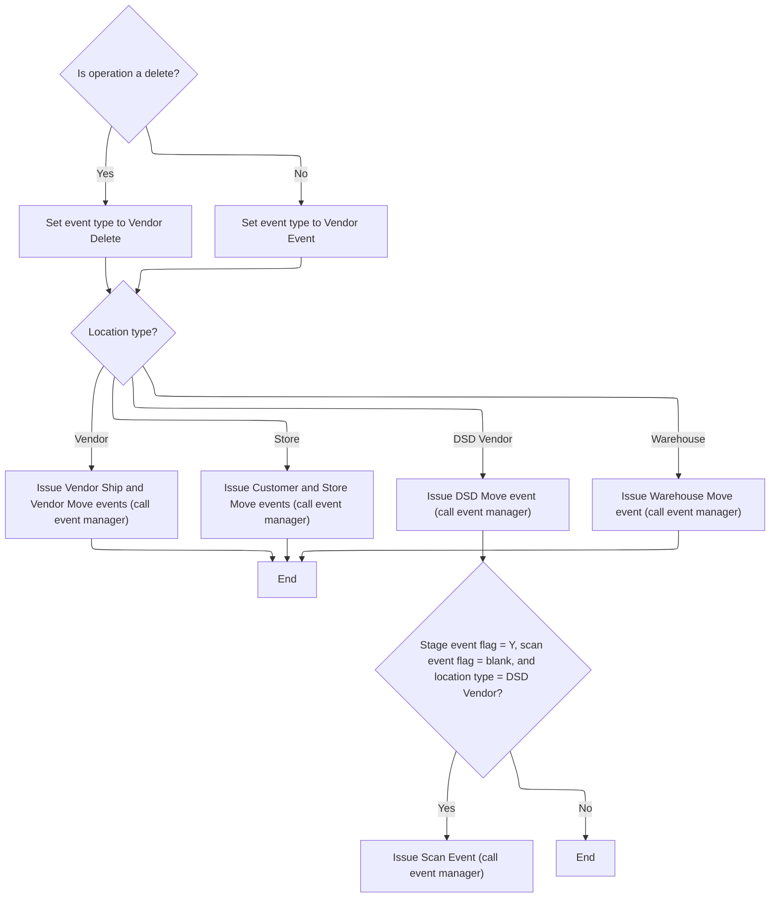

<SwmSnippet path="/base/src/NNNS0487.cbl" line="3169">

---

`2030-ISSUE-EVENTS` checks the location type and branches to set up and call the event manager with the right payload and transaction ID for vendors, stores, DSD vendors, or warehouses. It also handles delete events and special scan events for DSD vendors if certain flags are set. The next step is handled by the event manager program, which processes and issues the events.

```cobol
324600 2030-ISSUE-EVENTS.                                               00324600
324700     INITIALIZE ZZZC0550-IN-DATA                                  00324700
324800     SET  YYYN110A-ORACLE       TO TRUE                           00324800
324900     IF DELETE-OPERATION                                          00324900
325000       SET VENDOR-DELETE-EVENT  TO TRUE                           00325000
325100     ELSE                                                         00325100
325200       SET VENDOR-EVENT TO TRUE                                   00325200
325300     END-IF                                                       00325300
325400     MOVE LOC-TYP-CD       OF DCLXXXATION                         00325400
325500       TO VEND-TYP-CD      OF ZZZC0550-VENDOR-DATA                00325500
325600     MOVE LOC-NBR          OF DCLXXXATION                         00325600
325700       TO VEND-NBR         OF ZZZC0550-VENDOR-DATA                00325700
325800     MOVE 'NNNS0487'            TO ZZZC0197-PROGRAM               00325800
325900     MOVE YYYC0107-USER         TO ZZZC0197-USER                  00325900
326000     MOVE YYYN005A-SYS-ENV      TO YYYN110A-SYS-ENV               00326000
326100     MOVE LOC-NBR OF P-DDDTLO01 TO WS-OLD-KEY                     00326100
326200                                                                  00326200
326300     EVALUATE TRUE                                                00326300
326400       WHEN LOC-TYP-CD OF DCLXXXATION = K-VEND-LOC-TYPE           00326400
326500         MOVE WS-VENDOR-FACILITY                                  00326500
326600           TO VM-VENDOR-FACILITY OF ZZZC0020                      00326600
326700         MOVE WS-VENDOR-NUMBER                                    00326700
326800           TO VM-VENDOR-NUMBER   OF ZZZC0020                      00326800
326900         MOVE ZZZC0020              TO ZZZC0197-TRX-REC           00326900
327000         MOVE 'VSHP'                TO ZZZC0197-TRX-ID            00327000
327100         CALL ZZZS0197-EVENT-MGR USING                            00327100
327200             XXXN001A                                             00327200
327300             YYYN110A                                             00327300
327400             ZZZC0197                                             00327400
327500                                                                  00327500
327600         MOVE LOC-TYP-CD OF DCLXXXATION                           00327600
327700           TO LOC-VEN-TYP-CD OF ZZZC0124                          00327700
327800         MOVE LOC-NBR OF DCLXXXATION                              00327800
327900           TO LOC-VEN-NBR OF ZZZC0124                             00327900
328000         MOVE ZZZC0124              TO ZZZC0197-TRX-REC           00328000
328100         MOVE 'VENM'                TO ZZZC0197-TRX-ID            00328100
328200         CALL ZZZS0197-EVENT-MGR USING                            00328200
328300             XXXN001A                                             00328300
328400             YYYN110A                                             00328400
328500             ZZZC0197                                             00328500
328600                                                                  00328600
328700       WHEN LOC-TYP-CD OF DCLXXXATION = K-STORE-LOC-TYPE          00328700
328800         MOVE LOC-NBR OF DCLXXXATION                              00328800
328900           TO ST-STORE-NUMBER OF ZZZC0032                         00328900
329000              LOC-NBR OF ZZZC0094                                 00329000
329100         SET  ZZZC0032-UPD-FXXX TO TRUE                           00329100
329200         MOVE ZZZC0032          TO ZZZC0197-TRX-REC               00329200
329300         MOVE 'CUST'            TO ZZZC0197-TRX-ID                00329300
329400         CALL ZZZS0197-EVENT-MGR USING                            00329400
329500             XXXN001A                                             00329500
329600             YYYN110A                                             00329600
329700             ZZZC0197                                             00329700
329800                                                                  00329800
329900         MOVE LOC-TYP-CD OF DCLXXXATION TO                        00329900
330000                                 LOC-TYP-CD OF ZZZC0094           00330000
330100         MOVE ZZZC0094              TO ZZZC0197-TRX-REC           00330100
330200         MOVE 'STRM'                TO ZZZC0197-TRX-ID            00330200
330300         CALL ZZZS0197-EVENT-MGR USING                            00330300
330400              XXXN001A                                            00330400
330500              YYYN110A                                            00330500
330600              ZZZC0197                                            00330600
330700                                                                  00330700
330800       WHEN LOC-TYP-CD OF DCLXXXATION = K-DSD-VEND-LOC-TYPE       00330800
330900         MOVE LOC-TYP-CD OF DCLXXXATION TO                        00330900
331000                                 LOC-DSD-TYP-CD OF ZZZC0122       00331000
331100         MOVE ZZZC0122              TO ZZZC0197-TRX-REC           00331100
331200         MOVE 'DSDM'                TO ZZZC0197-TRX-ID            00331200
331300         CALL ZZZS0197-EVENT-MGR USING                            00331300
331400              XXXN001A                                            00331400
331500              YYYN110A                                            00331500
331600              ZZZC0197                                            00331600
331700                                                                  00331700
331800       WHEN LOC-TYP-CD OF DCLXXXATION = K-WHSE-LOC-TYPE           00331800
331900         MOVE LOC-NBR OF DCLXXXATION                              00331900
332000           TO LOC-WHS-NBR OF ZZZC0123                             00332000
332100         MOVE LOC-TYP-CD OF DCLXXXATION TO                        00332100
332200              LOC-WHS-TYP-CD OF ZZZC0123                          00332200
332300*        SET  ZZZC0044-UPD-FXXX TO TRUE                           00332300
332400         MOVE ZZZC0123          TO ZZZC0197-TRX-REC               00332400
332500         MOVE 'WHSM'            TO ZZZC0197-TRX-ID                00332500
332600         CALL ZZZS0197-EVENT-MGR USING                            00332600
332700             XXXN001A                                             00332700
332800             YYYN110A                                             00332800
332900             ZZZC0197                                             00332900
333000                                                                  00333000
333100     END-EVALUATE                                                 00333100
333200     IF STAGE-EVENT AND WWWC0100-CREATE-SCAN-EVENT                00333200
333300       AND LOC-TYP-CD OF DCLXXXATION = 'D'                        00333300
333400         MOVE ZZZC0550              TO ZZZC0197-TRX-REC           00333400
333500         MOVE ZZZC0550-TRX          TO ZZZC0197-TRX-ID            00333500
333600                                       ZZZC0197-TRX-CD            00333600
333700         CALL ZZZS0197-EVENT-MGR USING                            00333700
333800              XXXN001A                                            00333800
333900              YYYN110A                                            00333900
334000              ZZZC0197                                            00334000
334100     END-IF                                                       00334100
334200     .                                                            00334200
```

---

</SwmSnippet>

#### Master Data Event Mainline Processing

See <SwmLink doc-title="Event Transaction Processing Flow">[Event Transaction Processing Flow](\.swm\event-transaction-processing-flow.iya09o84.sw.md)</SwmLink>

#### Switching to DB2 Database Connection

<SwmSnippet path="/base/src/NNNS0487.cbl" line="1236">

---

`125-CONNECT-TO-DB2` calls Z-DB2-CONNECT, passing the business record and SQLCA. This hands off control to the DB2 connection manager, which switches the database environment and handles any error code translation. The next step is handled in YYYS0211.cbl, where the connection logic continues.

```cobol
131300 125-CONNECT-TO-DB2.                                              00131300
131400     CALL Z-DB2-CONNECT         USING XXXN001A                    00131400
131500                                      SQLCA                       00131500
131600     .                                                            00131600
```

---

</SwmSnippet>

#### Coordinating DB2 Connection and Error Handling

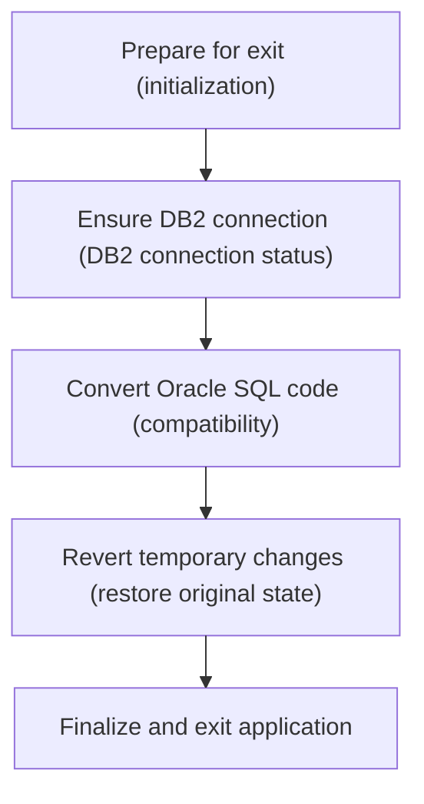

<SwmSnippet path="/base/src/YYYS0211.cbl" line="32">

---

`0000-EXIT-DISPATCHER` runs initialization, connects to DB2, converts Oracle error codes if needed, and restores the saved business record. This sequence gets the system ready for DB2 operations and handles any error translation. The next step is handled by the DBMS connection manager.

```cobol
004700 0000-EXIT-DISPATCHER.                                            00004700
004800     PERFORM 100-INITIALIZATION                                   00004800
004900     PERFORM 200-CONNECT-TO-DB2                                   00004900
005000     PERFORM 300-CNV-ORACLE-SQLCODE                               00005000
005100     PERFORM 400-REVERT-SAVED-XXXN001A                            00005100
005300     GOBACK                                                       00005300
005400     .                                                            00005400
```

---

</SwmSnippet>

<SwmSnippet path="/base/src/YYYS0211.cbl" line="53">

---

`200-CONNECT-TO-DB2` sets the flag to switch to DB2, then calls the DBMS connection manager to actually perform the switch. This updates the connection state so all further operations use DB2.

```cobol
007300 200-CONNECT-TO-DB2.                                              00007300
007400     SET YYYC0220-SET-DB2-CON TO TRUE                             00007400
007500     CALL YYYS0220-DBMS-CON-MGR USING                             00007500
007600         XXXN001A                                                 00007600
007700         YYYC0220                                                 00007700
008100     .                                                            00008100
```

---

</SwmSnippet>

#### Converting Oracle SQL Error Codes

<SwmSnippet path="/base/src/YYYS0211.cbl" line="65">

---

`300-CNV-ORACLE-SQLCODE` checks if the last operation was successful but returned a specific Oracle error code. If so, it calls the error conversion routine to map the Oracle code to an internal system code. This keeps error handling consistent.

```cobol
009500 300-CNV-ORACLE-SQLCODE.                                          00009500
009600     IF  SUCCESS                                                  00009600
009610     AND SQLCODE = -84                                            00009610
009720       CALL Z-ORA-ERR-CONVERSION USING                            00009720
009730           XXXN001A                                               00009730
009740           SQLCA                                                  00009740
009750     END-IF                                                       00009750
010200     .                                                            00010200
```

---

</SwmSnippet>

#### Formatting User-Facing Error Messages

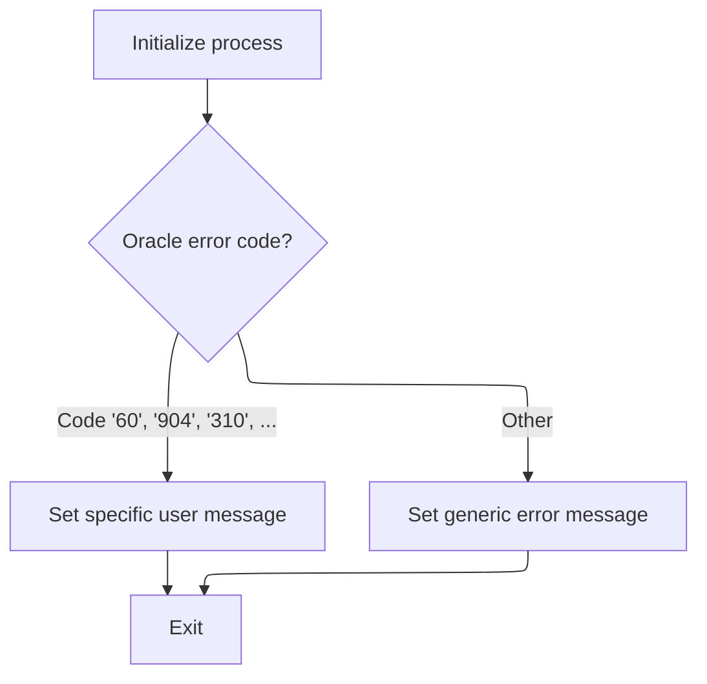

<SwmSnippet path="/base/src/YYYS0212.cbl" line="29">

---

`000-MAIN-PROCESS` initializes error message fields, then calls the formatter to turn Oracle error info into readable codes and messages. This helps users and systems handle errors more easily.

```cobol
003800 000-MAIN-PROCESS.                                                00003800
003900     PERFORM 100-INITIALIZE                                       00003900
004000     PERFORM 200-FORMAT-USER-MSG-TXT                              00004000
004100     GOBACK                                                       00004100
004200     .                                                            00004200
```

---

</SwmSnippet>

<SwmSnippet path="/base/src/YYYS0212.cbl" line="50">

---

`200-FORMAT-USER-MSG-TXT` splits the Oracle error string into message parts and the error code, then maps the code to a system SQLCODE using a big switch. If the code isn't recognized, it builds a generic error message. This keeps error handling clear and consistent.

```cobol
005900 200-FORMAT-USER-MSG-TXT.                                         00005900
006000     UNSTRING SQLERRMC  DELIMITED BY SPACE INTO                   00006000
006100                        WS-ERR-MSG1                               00006100
006200                        WS-ERR-MSG2                               00006200
006300                        WS-ERR-MSG3                               00006300
006400                        WS-ERR-ORA-CODE                           00006400
006500     EVALUATE WS-ERR-ORA-CODE                                     00006500
006510       WHEN  '60   '                                              00006510
006520         MOVE  -911                             TO SQLCODE        00006520
006600       WHEN  '904  '                                              00006600
006700       WHEN  '310  '                                              00006700
006800         MOVE  -206                             TO SQLCODE        00006800
006900       WHEN  '615  '                                              00006900
007000       WHEN  '616  '                                              00007000
007100         MOVE  -420                             TO SQLCODE        00007100
007200       WHEN  '942  '                                              00007200
007300         MOVE  -204                             TO SQLCODE        00007300
007400       WHEN  '1403 '                                              00007400
007500         MOVE  -100                             TO SQLCODE        00007500
007600       WHEN  '1001 '                                              00007600
007700         MOVE  -501                             TO SQLCODE        00007700
007800       WHEN  '1438 '                                              00007800
007900         MOVE  -413                             TO SQLCODE        00007900
008000       WHEN  '2112 '                                              00008000
008100       WHEN  '1422 '                                              00008100
008200         MOVE  -811                             TO SQLCODE        00008200
008300       WHEN  '2049 '                                              00008300
008400         MOVE  -913                             TO SQLCODE        00008400
008500       WHEN  '2291 '                                              00008500
008600         MOVE  -530                             TO SQLCODE        00008600
008700       WHEN  '2292 '                                              00008700
008800         MOVE  -532                             TO SQLCODE        00008800
008900       WHEN  '6502 '                                              00008900
009000         MOVE  -304                             TO SQLCODE        00009000
009100       WHEN  '6508 '                                              00009100
009200         MOVE  -440                             TO SQLCODE        00009200
009300       WHEN  '6511 '                                              00009300
009400         MOVE  -502                             TO SQLCODE        00009400
009500       WHEN  '6550 '                                              00009500
009600       WHEN  '6553 '                                              00009600
009700         MOVE  -440                             TO SQLCODE        00009700
009800       WHEN  '14028'                                              00009800
009900         MOVE  -538                             TO SQLCODE        00009900
010000       WHEN  '30006'                                              00010000
010100         MOVE  -904                             TO SQLCODE        00010100
010200       WHEN OTHER                                                 00010200
010300         STRING 'Error in YYYS0212. Oracle code:'                 00010300
010300                 WS-ERR-ORA-CODE                                  00010320
010300         DELIMITED BY SIZE INTO IS-RTRN-MSG2-TXT                  00010330
010500     END-EVALUATE                                                 00010500
010600     MOVE SPACES                                TO SQLERRMC       00010600
010700     .                                                            00010700
```

---

</SwmSnippet>

#### Inserting a New Location Record

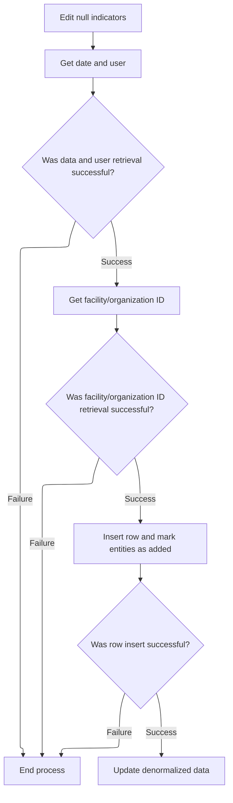

<SwmSnippet path="/base/src/NNNS0487.cbl" line="2487">

---

`1500-EXIT-PUT-INSERT-ROW` runs a chain of validation and setup routines—editing null indicators, getting date/user, checking county, and getting facility/org IDs. Only if all these succeed do we insert the row. The flow uses SUCCESS flags to control each step.

```cobol
256400 1500-EXIT-PUT-INSERT-ROW.                                        00256400
256500     PERFORM 1800-EDIT-NULL-INDICATORS                            00256500
256600     PERFORM 2040-GET-DATE-AND-USER                               00256600
256700     IF SUCCESS                                                   00256700
256800*      PERFORM 10300-CHECK-FOR-VALID-COUNTY                       00256800
256900       SET EXIT-PUT-INSERT-ROW TO TRUE                            00256900
257000       IF SUCCESS                                                 00257000
257100         PERFORM 1505-GET-FAC-ORG-ID                              00257100
257200         IF SUCCESS                                               00257200
257300           PERFORM 1510-D0-INSERT-ROW                             00257300
257400         END-IF                                                   00257400
257500       END-IF                                                     00257500
257600     END-IF                                                       00257600
257700     .                                                            00257700
```

---

</SwmSnippet>

<SwmSnippet path="/base/src/NNNS0487.cbl" line="2521">

---

`1510-D0-INSERT-ROW` sets up the new row with timestamps and user info, cleans up data, then calls the CUD routine to insert it. If the insert works, it sets add flags for all relevant entities and runs the denormalization process.

```cobol
259800 1510-D0-INSERT-ROW.                                              00259800
259900     MOVE DTA10-MM-DD-YYYY TO ADDED-DT        OF DCLXXXATION      00259900
260000     MOVE YYYC0127-TS      TO LST-UPDT-TS     OF DCLXXXATION      00260000
260100     MOVE YYYC0107-USER    TO LST-UPDT-USR-ID OF DCLXXXATION      00260100
260200     PERFORM 4010-REP-LOWVALUE-WITH-SPACES                        00260200
260300     PERFORM 5000-CALL-NNNS0487-CUD-ROUTINE                       00260300
260400                                                                  00260400
260500     IF SQLCODE = 0                                               00260500
260600       SET YYYN110A-ADD TO TRUE                                   00260600
260700       SET MMMC0265-ADD TO TRUE                                   00260700
260800       SET LOC-ADD      TO TRUE                                   00260800
260900       SET DSD-ADD      TO TRUE                                   00260900
261000       SET WHS-ADD      TO TRUE                                   00261000
261100       SET VEN-ADD      TO TRUE                                   00261100
261200       PERFORM 2000-DENORM-PROCESS                                00261200
261300     END-IF                                                       00261300
261400     .                                                            00261400
```

---

</SwmSnippet>

#### Purging a Location Record

See document about `1600-EXIT-PUT-PURGE-ROW`

#### Deleting a Location and Related Data

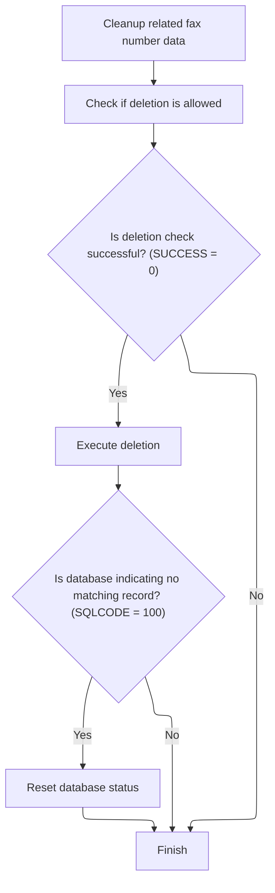

<SwmSnippet path="/base/src/NNNS0487.cbl" line="2954">

---

We purge fax numbers, check delete eligibility, update the record, and handle the 'no data found' case by resetting SQLCODE.

```cobol
303100 1690-DELETE-LO.                                                  00303100
303200     PERFORM 1691-EXIT-PUT-PURGE-FAX-NUM                          00303200
303300                                                                  00303300
303400     PERFORM 4500-CALL-MMMS0304-RI-DEL-CHK                        00303400
303500     IF SUCCESS                                                   00303500
303600        PERFORM 5000-CALL-NNNS0487-CUD-ROUTINE                    00303600
303700                                                                  00303700
303800        IF SQLCODE = 100                                          00303800
303900           MOVE 0 TO SQLCODE                                      00303900
304000        END-IF                                                    00304000
304100     END-IF                                                       00304100
304200     .                                                            00304200
```

---

</SwmSnippet>

#### Purging Fax Numbers for Deleted Locations

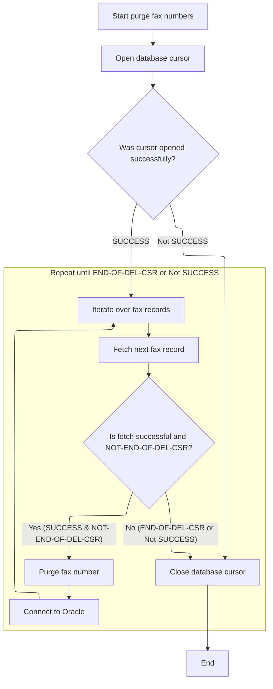

<SwmSnippet path="/base/src/NNNS0487.cbl" line="2968">

---

`1691-EXIT-PUT-PURGE-FAX-NUM` opens a cursor, loops through each record, fetches data, purges fax numbers, connects to Oracle as needed, and finally closes the cursor. Flags control the loop and signal when we're done or if something failed.

```cobol
304500 1691-EXIT-PUT-PURGE-FAX-NUM.                                     00304500
304600     SET NOT-END-OF-DEL-CSR TO TRUE                               00304600
304700     PERFORM 1692-OPEN-DEL-CSR                                    00304700
304800     IF SUCCESS                                                   00304800
304900       PERFORM UNTIL END-OF-DEL-CSR OR NOT SUCCESS                00304900
305000         PERFORM 1693-FETCH-DEL-CSR                               00305000
305100         IF SUCCESS AND NOT-END-OF-DEL-CSR                        00305100
305200           PERFORM 1694-EXIT-PURGE-FAX-NUM                        00305200
305300           PERFORM 115-CONNECT-TO-ORACLE                          00305300
305400         END-IF                                                   00305400
305500       END-PERFORM                                                00305500
305600     END-IF                                                       00305600
305700     PERFORM 1695-CLOSE-DEL-CSR                                   00305700
305800     .                                                            00305800
```

---

</SwmSnippet>

<SwmSnippet path="/base/src/NNNS0487.cbl" line="2984">

---

`1692-OPEN-DEL-CSR` moves location type and number into the numbers struct, then opens the deletion cursor. If the open fails, it sets the failure flag and builds an error message with the code 'NNNS0487' for tracking.

```cobol
306100 1692-OPEN-DEL-CSR.                                               00306100
306200     MOVE LOC-TYP-CD                 OF DCLXXXATION               00306200
306300       TO LOC-TYP-CD                 OF DCLXXX-NUMBERS            00306300
306400     MOVE LOC-NBR                    OF DCLXXXATION               00306400
306500       TO LOC-NBR                    OF DCLXXX-NUMBERS            00306500
306600                                                                  00306600
306700     EXEC SQL                                                     00306700
306800       OPEN DEL-CSR                                               00306800
306900     END-EXEC                                                     00306900
307000                                                                  00307000
307100     IF SQLCODE NOT = 0                                           00307100
307200       MOVE SQLCODE TO WS-SQLCODE                                 00307200
307300       SET  FAILURE TO TRUE                                       00307300
307400       MOVE SPACES  TO IS-RTRN-MSG-TXT                            00307400
307500       STRING 'NNNS0487 - ERROR OPENING DEL-CSR, '                00307500
307600              'SQL=' WS-SQLCODE '.'                               00307600
307700              DELIMITED BY SIZE INTO IS-RTRN-MSG-TXT              00307700
307800     END-IF                                                       00307800
307900     .                                                            00307900
```

---

</SwmSnippet>

<SwmSnippet path="/base/src/NNNS0487.cbl" line="3005">

---

`1693-FETCH-DEL-CSR` fetches the next record from the deletion cursor. If there are no more rows (SQLCODE 100), it sets the end-of-cursor flag and resets SQLCODE. If the fetch fails, it sets the failure flag and builds an error message with the code 'NNNS0487'.

```cobol
308200 1693-FETCH-DEL-CSR.                                              00308200
308300     EXEC SQL                                                     00308300
308400         FETCH DEL-CSR                                            00308400
308500         INTO  :DCLXXX-NUMBERS.FAX-ID                             00308500
308600     END-EXEC                                                     00308600
308700                                                                  00308700
308800     EVALUATE TRUE                                                00308800
308900       WHEN SQLCODE = 0                                           00308900
309000         CONTINUE                                                 00309000
309100       WHEN SQLCODE = 100                                         00309100
309200         SET  END-OF-DEL-CSR TO TRUE                              00309200
309300         MOVE 0 TO SQLCODE                                        00309300
309400       WHEN SQLCODE NOT = 0                                       00309400
309500         MOVE SQLCODE TO WS-SQLCODE                               00309500
309600         SET FAILURE TO TRUE                                      00309600
309700         MOVE SPACES  TO IS-RTRN-MSG-TXT                          00309700
309800         STRING 'NNNS0487 - ERROR FETCHING DEL-CSR, '             00309800
309900                'SQLCODE=' WS-SQLCODE '.'                         00309900
310000                DELIMITED BY SIZE INTO IS-RTRN-MSG-TXT            00310000
310100     END-EVALUATE                                                 00310100
310200     .                                                            00310200
```

---

</SwmSnippet>

#### Finalizing and Cleaning Up After Location Operations

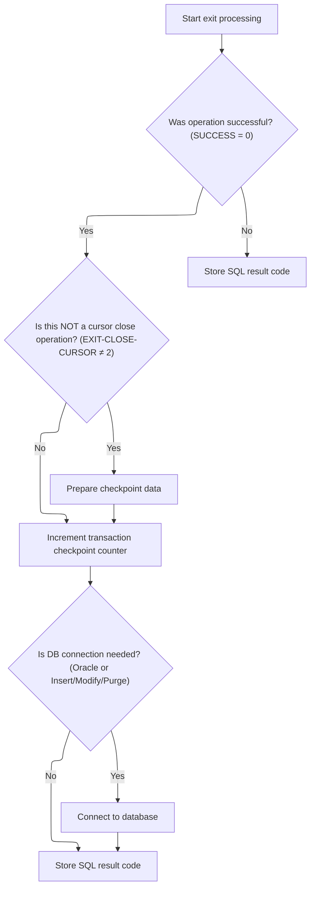

<SwmSnippet path="/base/src/NNNS0487.cbl" line="1218">

---

`120-EXIT-STUFF` checks if the last operation was successful and, if needed, moves data to the output area, updates the checkpoint, and connects to DB2 if certain exit codes are set. It also syncs the SQLCODE to the DB2-specific variable for later use.

```cobol
129500 120-EXIT-STUFF.                                                  00129500
129600     IF SUCCESS                                                   00129600
129700       IF NOT EXIT-CLOSE-CURSOR                                   00129700
129800         PERFORM 130-MOVE-DCL-2-PDA-FIELDS                        00129800
129900       END-IF                                                     00129900
130000       ADD WS-CHECKPOINT-INC TO YYYN005A-CHKPT-CNT                00130000
130100     END-IF                                                       00130100
130200     IF (YYYN005A-ORACLE       OR EXIT-PUT-INSERT-ROW             00130200
130300         OR EXIT-PUT-PURGE-ROW OR EXIT-PUT-MODIFY-ROW)            00130300
130400       PERFORM 125-CONNECT-TO-DB2                                 00130400
130500     END-IF                                                       00130500
130600     MOVE SQLCODE TO DB2-SQL-CODE                                 00130600
130700     .                                                            00130700
```

---

</SwmSnippet>

#### Transferring and Formatting Location Data for Output

```mermaid
%%{init: {"flowchart": {"defaultRenderer": "elk"}} }%%
flowchart TD
    node1["Transfer all location and contact details from source to destination"]
    click node1 openCode "base/src/NNNS0487.cbl:1245:1450"
    node1 --> node2{"Are any date fields set to default date ('01/01/1600')?"}
    click node2 openCode "base/src/NNNS0487.cbl:1334:1348"
    node2 -->|"Yes"| node3["Clear affected date fields"]
    click node3 openCode "base/src/NNNS0487.cbl:1335:1347"
    node2 -->|"No"| node4
    node3 -->|"No"| node4
    node4["Check direct ship status"]
    click node4 openCode "base/src/NNNS0487.cbl:1378:1380"
    node4 --> node5{"Is location marked as direct ship?"}
    click node5 openCode "base/src/NNNS0487.cbl:1378:1380"
    node5 -->|"No"| node6["Update status to not direct ship"]
    click node6 openCode "base/src/NNNS0487.cbl:1379:1380"
    node5 -->|"Yes"| node7
    node6 --> node7
    node7["Transfer shipping days text"]
    click node7 openCode "base/src/NNNS0487.cbl:1396:1397"
    node7 --> node8["Edit shipping days"]
    click node8 openCode "base/src/NNNS0487.cbl:1398:1398"
    node8 --> node9["Check order processing cutoff time"]
    click node9 openCode "base/src/NNNS0487.cbl:1392:1394"
    node9 --> node10{"Is cutoff time set to null time ('00:00:01')?"}
    click node10 openCode "base/src/NNNS0487.cbl:1392:1394"
    node10 -->|"Yes"| node11["Clear cutoff time"]
    click node11 openCode "base/src/NNNS0487.cbl:1393:1394"
    node10 -->|"No"| node12
    node11 --> node12
    node12["Convert timestamp to time"]
    click node12 openCode "base/src/NNNS0487.cbl:1405:1409"
    node12 --> node13{"Was timestamp conversion successful?"}
    click node13 openCode "base/src/NNNS0487.cbl:1406:1409"
    node13 -->|"Yes"| node14["Update cutoff time"]
    click node14 openCode "base/src/NNNS0487.cbl:1407:1409"
    node13 -->|"No"| node15
    node14 --> node15
    node15["Check DSD Vendor logic"]
    click node15 openCode "base/src/NNNS0487.cbl:1411:1417"
    node15 --> node16{"Is location type 'DSD Vendor' and SUCCESS and CICS env?"}
    click node16 openCode "base/src/NNNS0487.cbl:1411:1417"
    node16 -->|"Yes"| node17["Connect to DB2 and check location subtype"]
    click node17 openCode "base/src/NNNS0487.cbl:1413:1416"
    node16 -->|"No"| node18["Finish"]
    click node18 openCode "base/src/NNNS0487.cbl:1418:1418"
classDef HeadingStyle fill:#777777,stroke:#333,stroke-width:2px;
```

<SwmSnippet path="/base/src/NNNS0487.cbl" line="1245">

---

We copy all location data to the output area, clean up dates, handle direct-ship logic, run edits, and convert timestamps if needed. Then, if the location is a DSD vendor and we're in the right environment, we connect to DB2 and check DSV status.

```cobol
132200 130-MOVE-DCL-2-PDA-FIELDS.                                       00132200
132300     MOVE LOC-TYP-CD OF DCLXXXATION TO LOC-TYP-CD OF P-DDDTLO01   00132300
132400     MOVE LOC-NBR OF DCLXXXATION TO LOC-NBR OF P-DDDTLO01         00132400
132500     MOVE LOC-NM OF DCLXXXATION TO LOC-NM OF P-DDDTLO01           00132500
132600     MOVE LOC-ABB OF DCLXXXATION TO LOC-ABB OF P-DDDTLO01         00132600
132700     MOVE LGL-LOC-NAM OF DCLXXXATION TO LGL-LOC-NAM OF P-DDDTLO01 00132700
132800     MOVE PRIM-CONTACT-NM OF DCLXXXATION                          00132800
132900       TO PRIM-CONTACT-NM OF P-DDDTLO01                           00132900
133000     MOVE PRIM-ADR-1 OF DCLXXXATION TO PRIM-ADR-1 OF P-DDDTLO01   00133000
133100     MOVE PRIM-ADR-2 OF DCLXXXATION TO PRIM-ADR-2 OF P-DDDTLO01   00133100
133200     MOVE PRIM-ADR-3 OF DCLXXXATION TO PRIM-ADR-3 OF P-DDDTLO01   00133200
133300     MOVE PRIM-ADR-4 OF DCLXXXATION TO PRIM-ADR-4 OF P-DDDTLO01   00133300
133400     MOVE PRIM-CITY OF DCLXXXATION TO PRIM-CITY OF P-DDDTLO01     00133400
133500     MOVE PRIM-CITY-ID OF DCLXXXATION                             00133500
133600       TO PRIM-CITY-ID OF P-DDDTLO01                              00133600
133700     MOVE PRIM-STATE-CD OF DCLXXXATION                            00133700
133800       TO PRIM-STATE-CD OF P-DDDTLO01                             00133800
133900     MOVE PRIM-ZIP5-CD OF DCLXXXATION                             00133900
134000       TO PRIM-ZIP5-CD OF P-DDDTLO01                              00134000
134100     MOVE PRIM-ZIP4-CD OF DCLXXXATION                             00134100
134200       TO PRIM-ZIP4-CD OF P-DDDTLO01                              00134200
134300     MOVE PRIM-PHN-CNTRY-CD OF DCLXXXATION                        00134300
134400       TO PRIM-PHN-CNTRY-CD OF P-DDDTLO01                         00134400
134500     MOVE PRIM-AREA-CD OF DCLXXXATION                             00134500
134600       TO PRIM-AREA-CD OF P-DDDTLO01                              00134600
134700     MOVE PRIM-PHONE-NBR OF DCLXXXATION                           00134700
134800       TO PRIM-PHONE-NBR OF P-DDDTLO01                            00134800
134900     MOVE PRIM-CNTRY-NM OF DCLXXXATION                            00134900
135000       TO PRIM-CNTRY-NM OF P-DDDTLO01                             00135000
135100     MOVE PRIM-CNTRY-ABB OF DCLXXXATION                           00135100
135200       TO PRIM-CNTRY-ABB OF P-DDDTLO01                            00135200
135300     MOVE SEC-LOC-NM OF DCLXXXATION TO SEC-LOC-NM OF P-DDDTLO01   00135300
135400     MOVE SEC-CONTACT-NM OF DCLXXXATION                           00135400
135500       TO SEC-CONTACT-NM OF P-DDDTLO01                            00135500
135600     MOVE SEC-ADR-1 OF DCLXXXATION TO SEC-ADR-1 OF P-DDDTLO01     00135600
135700     MOVE SEC-ADR-2 OF DCLXXXATION TO SEC-ADR-2 OF P-DDDTLO01     00135700
135800     MOVE SEC-ADR-3 OF DCLXXXATION TO SEC-ADR-3 OF P-DDDTLO01     00135800
135900     MOVE SEC-ADR-4 OF DCLXXXATION TO SEC-ADR-4 OF P-DDDTLO01     00135900
136000     MOVE SEC-CITY OF DCLXXXATION TO SEC-CITY OF P-DDDTLO01       00136000
136100     MOVE SEC-STATE-CD OF DCLXXXATION                             00136100
136200       TO SEC-STATE-CD OF P-DDDTLO01                              00136200
136300     MOVE SEC-ZIP5-CD OF DCLXXXATION TO SEC-ZIP5-CD OF P-DDDTLO01 00136300
136400     MOVE SEC-ZIP4-CD OF DCLXXXATION TO SEC-ZIP4-CD OF P-DDDTLO01 00136400
136500     MOVE SEC-PHN-CNTRY-CD OF DCLXXXATION                         00136500
136600       TO SEC-PHN-CNTRY-CD OF P-DDDTLO01                          00136600
136700     MOVE SEC-AREA-CD OF DCLXXXATION TO SEC-AREA-CD OF P-DDDTLO01 00136700
136800     MOVE SEC-PHONE-NBR OF DCLXXXATION                            00136800
136900       TO SEC-PHONE-NBR OF P-DDDTLO01                             00136900
137000     MOVE SEC-CNTRY-NM OF DCLXXXATION                             00137000
137100       TO SEC-CNTRY-NM OF P-DDDTLO01                              00137100
137200     MOVE SEC-CNTRY-ABB OF DCLXXXATION                            00137200
137300       TO SEC-CNTRY-ABB OF P-DDDTLO01                             00137300
137400     MOVE MAIL-TO-LOC-NM OF DCLXXXATION                           00137400
137500       TO MAIL-TO-LOC-NM OF P-DDDTLO01                            00137500
137600     MOVE MAIL-TO-CNTCT-NM OF DCLXXXATION                         00137600
137700       TO MAIL-TO-CNTCT-NM OF P-DDDTLO01                          00137700
137800     MOVE MAIL-TO-ADR-1 OF DCLXXXATION                            00137800
137900       TO MAIL-TO-ADR-1 OF P-DDDTLO01                             00137900
138000     MOVE MAIL-TO-ADR-2 OF DCLXXXATION                            00138000
138100       TO MAIL-TO-ADR-2 OF P-DDDTLO01                             00138100
138200     MOVE MAIL-TO-ADR-3 OF DCLXXXATION                            00138200
138300       TO MAIL-TO-ADR-3 OF P-DDDTLO01                             00138300
138400     MOVE MAIL-TO-ADR-4 OF DCLXXXATION                            00138400
138500       TO MAIL-TO-ADR-4 OF P-DDDTLO01                             00138500
138600     MOVE MAIL-TO-CITY OF DCLXXXATION                             00138600
138700       TO MAIL-TO-CITY OF P-DDDTLO01                              00138700
138800     MOVE MAIL-TO-STATE-CD OF DCLXXXATION                         00138800
138900       TO MAIL-TO-STATE-CD OF P-DDDTLO01                          00138900
139000     MOVE MAIL-TO-ZIP5-CD OF DCLXXXATION                          00139000
139100       TO MAIL-TO-ZIP5-CD OF P-DDDTLO01                           00139100
139200     MOVE MAIL-TO-ZIP4-CD OF DCLXXXATION                          00139200
139300       TO MAIL-TO-ZIP4-CD OF P-DDDTLO01                           00139300
139400     MOVE MAIL-PHN-CNTRY-CD OF DCLXXXATION                        00139400
139500       TO MAIL-PHN-CNTRY-CD OF P-DDDTLO01                         00139500
139600     MOVE MAIL-TO-AREA-CD OF DCLXXXATION                          00139600
139700       TO MAIL-TO-AREA-CD OF P-DDDTLO01                           00139700
139800     MOVE MAIL-TO-PHONE-NBR OF DCLXXXATION                        00139800
139900       TO MAIL-TO-PHONE-NBR OF P-DDDTLO01                         00139900
140000     MOVE MAIL-TO-CNTRY-NM OF DCLXXXATION                         00140000
140100       TO MAIL-TO-CNTRY-NM OF P-DDDTLO01                          00140100
140200     MOVE MAIL-TO-CNTRY-AB OF DCLXXXATION                         00140200
140300       TO MAIL-TO-CNTRY-AB OF P-DDDTLO01                          00140300
140400     MOVE CURR-FAX-ID OF DCLXXXATION TO CURR-FAX-ID OF P-DDDTLO01 00140400
140500                                                                  00140500
140600     MOVE ADDED-DT OF DCLXXXATION TO ADDED-DT OF P-DDDTLO01       00140600
140700     MOVE DELETE-DT OF DCLXXXATION TO DELETE-DT OF P-DDDTLO01     00140700
140800     MOVE OPENED-DT OF DCLXXXATION TO OPENED-DT OF P-DDDTLO01     00140800
140900     MOVE CLOSED-DT OF DCLXXXATION TO CLOSED-DT OF P-DDDTLO01     00140900
141000     MOVE INACTIVE-DT OF DCLXXXATION TO INACTIVE-DT OF P-DDDTLO01 00141000
141100     IF ADDED-DT OF P-DDDTLO01 = K-DEF-DT                         00141100
141200       MOVE SPACES TO ADDED-DT OF P-DDDTLO01                      00141200
141300     END-IF                                                       00141300
141400     IF DELETE-DT OF P-DDDTLO01 = K-DEF-DT                        00141400
141500       MOVE SPACES TO DELETE-DT OF P-DDDTLO01                     00141500
141600     END-IF                                                       00141600
141700     IF OPENED-DT OF P-DDDTLO01 = K-DEF-DT                        00141700
141800       MOVE SPACES TO OPENED-DT OF P-DDDTLO01                     00141800
141900     END-IF                                                       00141900
142000     IF CLOSED-DT OF P-DDDTLO01 = K-DEF-DT                        00142000
142100       MOVE SPACES TO CLOSED-DT OF P-DDDTLO01                     00142100
142200     END-IF                                                       00142200
142300     IF INACTIVE-DT OF P-DDDTLO01 = K-DEF-DT                      00142300
142400       MOVE SPACES TO INACTIVE-DT OF P-DDDTLO01                   00142400
142500     END-IF                                                       00142500
142600                                                                  00142600
142700     MOVE INACTIVE-SW OF DCLXXXATION TO INACTIVE-SW OF P-DDDTLO01 00142700
142800     MOVE AP-NBR OF DCLXXXATION TO AP-NBR OF P-DDDTLO01           00142800
142900     MOVE AP-TYP-CD OF DCLXXXATION TO AP-TYP-CD OF P-DDDTLO01     00142900
143000                                                                  00143000
143100     MOVE LST-UPDT-TS OF DCLXXXATION TO LST-UPDT-TS OF P-DDDTLO01 00143100
143200     MOVE LST-UPDT-USR-ID OF DCLXXXATION                          00143200
143300       TO LST-UPDT-USR-ID OF P-DDDTLO01                           00143300
143400     MOVE PRIM-EMAIL-ID    OF DCLXXXATION                         00143400
143500       TO PRIM-EMAIL-ID    OF P-DDDTLO01                          00143500
143600     MOVE SECY-EMAIL-ID    OF DCLXXXATION                         00143600
143700       TO SECY-EMAIL-ID    OF P-DDDTLO01                          00143700
143800     MOVE MAIL-TO-EMAIL-ID OF DCLXXXATION                         00143800
143900       TO MAIL-TO-EMAIL-ID OF P-DDDTLO01                          00143900
144000     MOVE FAC-ID           OF DCLXXXATION                         00144000
144100       TO FAC-ID           OF P-DDDTLO01                          00144100
144200     MOVE ORG-ID           OF DCLXXXATION                         00144200
144300       TO ORG-ID           OF P-DDDTLO01                          00144300
144400     MOVE B2B-PRIM-RTNG-ID OF DCLXXXATION                         00144400
144500       TO B2B-PRIM-RTNG-ID OF P-DDDTLO01                          00144500
144600     MOVE PRIM-CNTY-TXT    OF DCLXXXATION                         00144600
144700       TO PRIM-CNTY-TXT    OF P-DDDTLO01                          00144700
144800     MOVE SECY-CNTY-TXT    OF DCLXXXATION                         00144800
144900       TO SECY-CNTY-TXT    OF P-DDDTLO01                          00144900
145000     MOVE MAIL-TO-CNTY-TXT OF DCLXXXATION                         00145000
145100       TO MAIL-TO-CNTY-TXT OF P-DDDTLO01                          00145100
145200                                                                  00145200
145300     MOVE DIR-SHP-LOC-SW   OF DCLXXXATION                         00145300
145400       TO DIR-SHP-LOC-SW   OF P-DDDTLO01                          00145400
145500     IF NOT LOC-IS-DIRECT-SHIP OF P-DDDTLO01                      00145500
145600       SET LOC-IS-NOT-DIRECT-SHIP OF P-DDDTLO01 TO TRUE           00145600
145700     END-IF                                                       00145700
145800                                                                  00145800
145900     MOVE LOC-ORD-PROCNG-DD  OF DCLXXXATION                       00145900
146000       TO LOC-ORD-PROCNG-DD  OF P-DDDTLO01                        00146000
146100                                                                  00146100
146200*    MOVE WS-CURRENT-DATE-DATA                                    00146200
146300*      TO WS-CURRENT-DATE-DATA1                                   00146300
146400*    MOVE WS-CURRENT-TIME  OF   WS-CURRENT-DATE-DATA1             00146400
146500*      TO ORD-PROCNG-CTOF-TM OF P-DDDTLO01                        00146500
146600*     MOVE ORD-PROCNG-CTOF-TM OF DCLXXXATION                      00146600
146700*       TO ORD-PROCNG-CTOF-TM OF P-DDDTLO01                       00146700
146800                                                                  00146800
146900     IF ORD-PROCNG-CTOF-TM OF P-DDDTLO01 = WS-NULL-TM             00146900
147000       MOVE SPACES TO ORD-PROCNG-CTOF-TM OF P-DDDTLO01            00147000
147100     END-IF                                                       00147100
147200                                                                  00147200
147300     MOVE SCH-SHP-DD-TXT     OF DCLXXXATION                       00147300
147400       TO SCH-SHP-DD-TXT     OF P-DDDTLO01                        00147400
147500     PERFORM 116-EDIT-SHIP-DAYS                                   00147500
147600     MOVE ORD-LEAD-TM-DD     OF DCLXXXATION                       00147600
147700       TO ORD-LEAD-TM-DD     OF P-DDDTLO01                        00147700
147800                                                                  00147800
147900     MOVE ORD-BUFFER-TM-DD   OF DCLXXXATION                       00147900
148000       TO ORD-BUFFER-TM-DD   OF P-DDDTLO01                        00148000
148100                                                                  00148100
148200     PERFORM 132-CONVERT-TS-TO-TM                                 00148200
148300     IF SUCCESS                                                   00148300
148400       MOVE ORD-PROCNG-CTOF-TM OF DCLXXXATION                     00148400
148500         TO ORD-PROCNG-CTOF-TM OF P-DDDTLO01                      00148500
148600     END-IF                                                       00148600
148700                                                                  00148700
148800     IF LOC-TYP-CD OF DCLXXXATION = K-DSD-VEND-LOC-TYPE           00148800
148900     AND SUCCESS AND YYYN005A-CICS-ENV                            00148900
149000       PERFORM 125-CONNECT-TO-DB2                                 00149000
149100       IF SUCCESS                                                 00149100
149200          PERFORM 10200-CHECK-DSV-LOC-SUB-TYP                     00149200
149300       END-IF                                                     00149300
149400     END-IF                                                       00149400
149500     .                                                            00149500
```

---

</SwmSnippet>

<SwmSnippet path="/base/src/NNNS0487.cbl" line="1421">

---

We set up the timestamp conversion, call MMMS0291 to convert it to time, and if successful, update the transaction fields with the result.

```cobol
149800 132-CONVERT-TS-TO-TM.                                            00149800
149900     IF (YYYN005A-ORACLE OR EXIT-PUT-MODIFY-ROW                   00149900
150000         OR EXIT-PUT-INSERT-ROW)                                  00150000
150100       INITIALIZE MMMC0291-INPUT-TM                               00150100
150200                  MMMC0291-INPUT-TS                               00150200
150300                                                                  00150300
150400       MOVE WS-ORD-PROCNG-CTOF-TM                                 00150400
150500         TO WS-TIMSTAMP-INOUT-CONV(1)                             00150500
150600       MOVE WS-FILLER1-TS                                         00150600
150700         TO WS-TIMSTAMP-INOUT-CONV(2)                             00150700
150800       MOVE WS-FILLER2-TS                                         00150800
150900         TO WS-TIMSTAMP-INOUT-CONV(3)                             00150900
151000                                                                  00151000
151100       SET MMMC0291-CVT-TS-TO-TM  TO TRUE                         00151100
151200       CALL WS-MMMS0291-PGM USING                                 00151200
151300                          XXXN001A                                00151300
151400                          MMMC0291                                00151400
151500       IF SUCCESS                                                 00151500
151600         MOVE WS-TIME-INOUT-CONV(1)                               00151600
151700           TO ORD-PROCNG-CTOF-TM OF DCLXXXATION                   00151700
151800         MOVE WS-TIMSTAMP-INOUT-CONV(2)                           00151800
151900           TO FILLER1-TM OF DCLXXXATION                           00151900
152000         MOVE WS-TIMSTAMP-INOUT-CONV(3)                           00152000
152100           TO FILLER2-TM OF DCLXXXATION                           00152100
152200       END-IF                                                     00152200
152300     END-IF                                                       00152300
152400     .                                                            00152400
```

---

</SwmSnippet>

#### Validating Direct Store Vendor Status

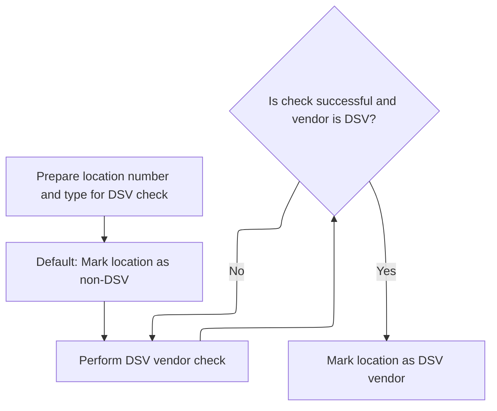

<SwmSnippet path="/base/src/NNNS0487.cbl" line="3437">

---

We prep the vendor info, call MMMS0711 to check DSV status, and set the flag if the vendor qualifies.

```cobol
351400 10200-CHECK-DSV-LOC-SUB-TYP.                                     00351400
351500     MOVE LOC-NBR    OF DCLXXXATION TO MMMC0711-I-VEND-NBR        00351500
351600     MOVE LOC-TYP-CD OF DCLXXXATION TO MMMC0711-I-VEND-TYP-CD     00351600
351700     SET VEND-IS-NOT-DSV            TO TRUE                       00351700
351800     SET MMMC0711-IS-DSV-FUNC       TO TRUE                       00351800
351900                                                                  00351900
352000     CALL MMMS0711-DSV-CHECK USING                                00352000
352100          XXXN001A                                                00352100
352200          MMMC0711                                                00352200
352300     IF SUCCESS AND VEND-IS-DSV                                   00352300
352400        SET IS-DSV-VEND TO TRUE                                   00352400
352500     END-IF                                                       00352500
352600     .                                                            00352600
```

---

</SwmSnippet>

#### Coordinating Time/Timestamp Conversion Logic

See <SwmLink doc-title="Processing DSV Status Requests">[Processing DSV Status Requests](\.swm\processing-dsv-status-requests.ytonzwgd.sw.md)</SwmLink>

#### Checking Entity DSV Classification

See <SwmLink doc-title="Determining Direct Store Vendor Association">[Determining Direct Store Vendor Association](\.swm\determining-direct-store-vendor-association.1bevg7m4.sw.md)</SwmLink>

#### Handling Location Data Retrieval Results

<SwmSnippet path="/base/src/NNNS0488.cbl" line="3824">

---

In `2200-GET-xxxation`, right after returning from 3000-CALL-LO-DAO, we check if the operation succeeded and if SQLCODE is zero. If not, we set FAILURE and build an error message with the SQLCODE. This makes sure any database errors are flagged and reported before moving on.

```cobol
384500     EVALUATE TRUE                                                00384500
384600         WHEN NOT SUCCESS                                         00384600
384700           CONTINUE                                               00384700
384800         WHEN SQLCODE = 0                                         00384800
384900           CONTINUE                                               00384900
385000         WHEN OTHER                                               00385000
385100           SET FAILURE               TO TRUE                      00385100
385200           MOVE SPACES               TO IS-RTRN-MSG-TXT           00385200
385300           MOVE SQLCODE              TO WS-SQLCODE                00385300
385400           STRING 'NNNS0488 - Get unique error on xxxation table' 00385400
385500                  'SQL = ' WS-SQLCODE                             00385500
385600           DELIMITED BY SIZE INTO IS-RTRN-MSG-TXT                 00385600
385700     END-EVALUATE                                                 00385700
```

---

</SwmSnippet>

### Syncing Status Codes After Location Retrieval

<SwmSnippet path="/base/src/NNNS0488.cbl" line="3803">

---

In `2100-UPD-STAT-IN-xxxation`, after returning from 2200-GET-xxxation, we check if SUCCESS is set. If so, we run 2300-SYNC-STAT-CODE to update the status code, then restore the exit codes from working storage. This keeps the exit codes intact while allowing status updates only when the get was successful.

```cobol
382400     IF SUCCESS                                                   00382400
382500       PERFORM 2300-SYNC-STAT-CODE                                00382500
382600     END-IF                                                       00382600
382700                                                                  00382700
382800     MOVE WS-NNNN0000-EXIT-CODES TO NNNN0000-EXIT-CODES           00382800
382900     .                                                            00382900
```

---

</SwmSnippet>

## Updating Location Active/Inactive Flags

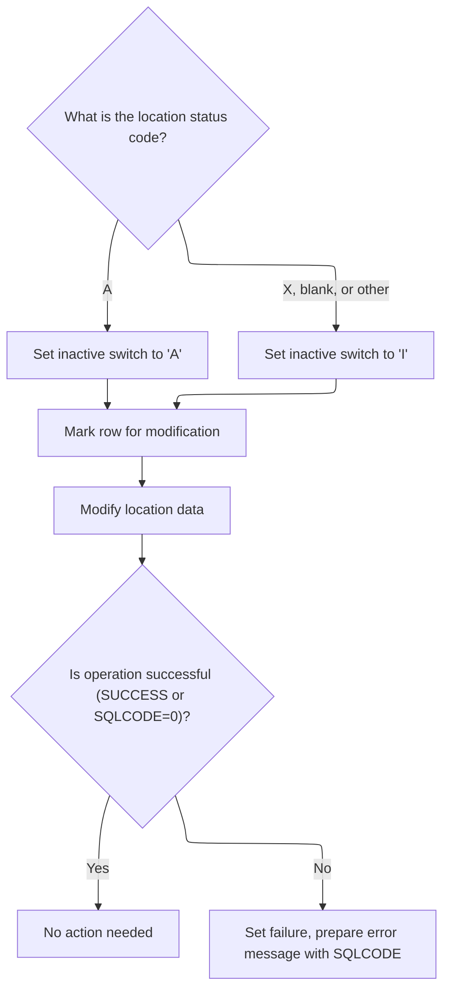

<SwmSnippet path="/base/src/NNNS0488.cbl" line="3843">

---

In `2300-SYNC-STAT-CODE`, we check the retail location status code and set the INACTIVE-SW flag in the output structure. 'A' means active, anything else (including spaces) means inactive. This sets up the correct status for later database updates.

```cobol
386400 2300-SYNC-STAT-CODE.                                             00386400
386500     EVALUATE TRUE                                                00386500
386600       WHEN RETL-LOC-STAT-CD OF DCLXXXAIL-LOC = 'A'               00386600
386700          MOVE 'A'           TO INACTIVE-SW OF P-DDDTLO01         00386700
386800       WHEN RETL-LOC-STAT-CD OF DCLXXXAIL-LOC = 'X'               00386800
386900          MOVE 'I'           TO INACTIVE-SW OF P-DDDTLO01         00386900
387000       WHEN RETL-LOC-STAT-CD OF DCLXXXAIL-LOC = SPACES            00387000
387100          MOVE 'I'           TO INACTIVE-SW OF P-DDDTLO01         00387100
387200       WHEN OTHER                                                 00387200
387300          MOVE 'I'           TO INACTIVE-SW OF P-DDDTLO01         00387300
387400     END-EVALUATE                                                 00387400
```

---

</SwmSnippet>

<SwmSnippet path="/base/src/NNNS0488.cbl" line="3855">

---

Here we set the EXIT-PUT-MODIFY-ROW flag to TRUE, then call 3000-CALL-LO-DAO to run the update in the database. This switches the DAO logic to perform a modification instead of a retrieval.

```cobol
387600     SET EXIT-PUT-MODIFY-ROW         TO TRUE                      00387600
387700     PERFORM 3000-CALL-LO-DAO                                     00387700
```

---

</SwmSnippet>

<SwmSnippet path="/base/src/NNNS0488.cbl" line="3858">

---

At the end of `2300-SYNC-STAT-CODE`, after returning from 3000-CALL-LO-DAO, we check if the update succeeded and if SQLCODE is zero. If not, we set FAILURE and build an error message with the SQLCODE. This flags any database update errors before moving on.

```cobol
387900     EVALUATE TRUE                                                00387900
388000         WHEN NOT SUCCESS                                         00388000
388100           CONTINUE                                               00388100
388200         WHEN SQLCODE = 0                                         00388200
388300           CONTINUE                                               00388300
388400         WHEN OTHER                                               00388400
388500           SET FAILURE               TO TRUE                      00388500
388600           MOVE SPACES               TO IS-RTRN-MSG-TXT           00388600
388700           MOVE SQLCODE              TO WS-SQLCODE                00388700
388800           STRING 'NNNS0488 - Modify error on xxxation table'     00388800
388900                  'SQL = ' WS-SQLCODE                             00388900
389000           DELIMITED BY SIZE INTO IS-RTRN-MSG-TXT                 00389000
389100     END-EVALUATE                                                 00389100
```

---

</SwmSnippet>

&nbsp;

*This is an auto-generated document by Swimm 🌊 and has not yet been verified by a human*

<SwmMeta version="3.0.0" repo-id="Z2l0aHViJTNBJTNBU3dpbW1pby1keW5jYWxsLWRlbW8lM0ElM0FHaXJpLVN3aW1t" repo-name="Swimmio-dyncall-demo"><sup>Powered by [Swimm](https://app.swimm.io/)</sup></SwmMeta>
